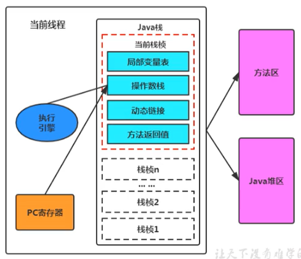

# 一、JVM与Java体系结构

## 一、Java及JVM简介

### 一、JVM：跨语言的平台


- 每个语言都需要转换成字节码文件，最后转换的字节码文件都能通过Java虚拟机进行运行和处理
- Java虚拟机根本不关心运行在其内部的程序到底是使用何种编程语言编写的，它只关心“字节码”文件。也就是说Java 虚拟机拥有语言无关性，并不会单纯地与Java语言“终身绑定”，只要其他编程语言的编译结果满足并包含Java虚拟机的内部指令集、符号表以及其他的辅助信息，它就是一个有效的字节码文件，就能够被虚拟机所识别并装载运行

### 二、字节码

- 我们平时说的java字节码，指的是用java语言编译成的字节码。准确的说任何能在jvm平台上执行的字节码格式都是一样的。所以应该统称为：jvm 字节码
- 不同的编译器，可以编译出相同的字节码文件，字节码文件也可以在不同的JVM上运行
- Java虚拟机与Java语言并没有必然的联系，它只与特定的二进制文件格式—Class文件格式所关联，Class文件中包含了Java虚拟机指令集（或者称为字节码、Bytecodes）和符号表，还有一些其他辅助信息

## 二、虚拟机与Java虚拟机

### 一、虚拟机

1. 所谓虚拟机（Virtual Machine），就是一台虚拟的计算机。它是一款软件，用来执行一系列虚拟计算机指令。大体上，虚拟机可以分为系统虚拟机和程序虚拟机

   - 大名鼎鼎的Visual Box，Mware就属于系统虚拟机，它们完全是对物理计算机的仿真，提供了一个可运行完整操作系统的软件平台
   - 程序虚拟机的典型代表就是Java虚拟机，它专门为执行单个计算机程序而设计，在Java虚拟机中执行的指令我们称为Java字节码指令
2. 无论是系统虚拟机还是程序虚拟机，在上面运行的软件都被限制于虚拟机提供的资源中

### 二、Java虚拟机

1. JVM概述

   - Java虚拟机是一台执行Java字节码的虚拟计算机，它拥有独立的运行机制，其运行的Java字节码也未必由Java 语言编译而成
   - JVM平台的各种语言可以共享Java虚拟机带来的跨平台性、优秀的垃圾回器，以及可靠的即时编译器
   - Java技术的核心就是Java虚拟机（JVM，Java Virtual Machine），因为所有的Java程序都运行在Java虚拟机内部

2. JVM作用

   - Java虚拟机就是二进制字节码的运行环境，负责装载字节码到其内部，解释/编译为对应平台上的机器指令执行。每一条Java指令，Java虚拟机规范中都有详细定义，如怎么取操作数，怎么处理操作数，处理结果放在哪里
   - 跨语言，跨平台

3. JVM特点

   - 一次编译，到处运行
   - 自动内存管理
   - 自动垃圾回收功能

4. JVM位置：JVM 是运行在操作系统之上的，它与硬件没有直接的交互

   


### 三、JVM整体结构

- HotSpot VM是目前市面上高性能虚拟机的代表作之一
- 它采用解释器与即时编译器并存的架构


### 四、Java代码执行流程


### 五、JVM架构模型

Java编译器输入的指令流基本上是一种基于栈的指令集架构，另外一种指令集架构则是基于寄存器的指令集架构具体来说：这两种架构之间的区别：

1. **基于栈式架构的特点**
- 设计和实现更简单，适用于资源受限的系统
   - 避开了寄存器的分配难题：使用零地址指令方式分配
   - 指令流中的指令大部分是零地址指令，其执行过程依赖于操作栈。指令集更小，编译器容易实现
   - 不需要硬件支持，可移植性更好，更好实现跨平台
2. **基于寄存器架构的特点**
   - 典型的应用是x86 的二进制指令集：比如传统的PC以及Android的Davlik虚拟机
   - 指令集架构则完全依赖硬件，可移植性差
   - 性能优秀和执行更高效
   - 花费更少的指令去完成一项操作
   - 在大部分情况下，基于寄存器架构的指令集往往都以一地址指令、二地址指令和三地址指令为主，而基于栈式架构的指令集却是以零地址指令为主

由于跨平台性的设计，Java 的指令都是根据栈来设计的。不同平台CPU架构不同，所以不能设计为基于寄存器的。优点是跨平台，指令集小，编译器容易实现；缺点是性能下降，实现同样的功能需要更多的指令，执行性能比寄存器差

### 六、JVM生命周期

1. 虚拟机的启动
   - Java虚拟机的启动是通过引导类加载器（bootstrap class loader）创建一个初始类（initial class）来完成的，这个类是由虚拟机的具体实现指定的
2. 虚拟机的执行
   - 一个运行中的Java虚拟机有着一个清晰的任务，即执行Java程序
   - 程序开始执行时他才运行，程序结束时他就停止
   - 执行一个所谓的Java程序的时候，真真正正在执行的是一个叫做Java虚拟机的进程
3. 虚拟机的退出
   - 程序正常执行结束
   - 程序在执行过程中遇到了异常或错误而异常终止
   - 由于操作系统用现错误而导致Java虚拟机进程终止
   - 某线程调用Runtime类或system类的exit方法，或Runtime类的halt方法，并且Java安全管理器也允许这次exit或 halt操作
   - JNI（Java Native Interface）规范描述了用JNI Invocation API来加载或卸载Java虚拟机时，Java虚拟机的退出情况

# 二、类加载子系统

## 一、内存结构概述


1. Class文件
2. 类加载子系统
3. 运行时数据区：方法区、堆、程序计数器、虚拟机栈、本地方法栈
4. 执行引擎
5. 本地方法接口
6. 本地方法库

## 二、类加载器与类的加载过程

### 一、类加载器子系统作用


- 类加载器子系统负责从文件系统或者网络中加载Class文件，class文件在文件开头有特定的文件标识
- ClassLoader只负责class文件的加载，至于它是否可以运行，则由Execution Engine（执行引擎）决定
- 加载的类信息存放于一块称为方法区的内存空间。除了类的信息外，方法区中还会存放运行时常量池信息，可能还包括字符串字面量和数字常量（这部分常量信息是Class文件中常量池部分的内存映射）

### 二、类的加载过程

一个简单类（比如简单的HelloLoader程序，带有main方法）的加载流程为


#### 一、加载阶段


1. 通过一个类的全限定名获取定义此类的二进制字节流
2. 将这个字节流所代表的静态存储结构转化为方法区的运行时数据结构，即类信息存放在方法区中
3. 在内存中生成一个代表这个类的java.lang.Clas 对象，作为方法区这个类的各种数据的访问入口
4. 补充内容：加载.class文件的方式
   - 从本地系统中直接加载
   - 通过网络获取，典型场景：Web Applet
   - 从 zip压缩包中读取，成为日后jar、war格式的基础
   - 运行时计算生成，使用最多的是：动态代理技术
   - 由其他文件生成，典型场景：JSP 应用
   - 从专有数据库中提取.class文件，比较少见
   - 从加密文件中获取，典型的防Class文件被反编译的保护措施

#### 二、链接阶段

1. **验证（Verify）**
   - 目的在于确保Class文件的字节流中包含信息符合当前虚拟机要求，保证被加载类的正确性，不会危害虚拟机自身安全
   - 主要包括四种验证，文件格式验证，元数据验证，字节码验证，符号引用验证
2. **准备（Prepare）**
   - 为类变量分配内存并且设置该类变量的默认初始值
   - 这里不包含用final修饰的static，因为final在编译的时候就会分配了，准备阶段会显式初始化
   - 这里不会为实例变量分配初始化，类变量会分配在方法区中，而实例变量是会随着对象一起分配到Java堆中
3. **解析（Resolve）**
   - 将常量池内的符号引用转换为直接引用的过程
   - 事实上，解析操作往往会伴随着JVM在执行完初始化之后再执行
   - 符号引用就是一组符号来描述所引用的目标。直接引用就是直接指向目标的指针、相对偏移量或一个间接定位到目标的句柄
   - 解析动作主要针对类或接口、字段、类方法、接口方法、方法类型等。对应常量池中的CONSTANT_Class_info、CONSTANT_Fieldref_info、CONSTANT_Methodref_info等

#### 三、初始化阶段

- 初始化阶段就是执行类构造器方法&lt;clinit&gt;()的过程
- &lt;clinit&gt;()此方法不需定义，是javac编译器自动收集类中的所有类变量的赋值动作和静态代码块中的语句合并而来，也就是为静态变量进行赋值的方法，如果类中并没有静态变量和静态代码块，则不会有此方法。但是每一个类在初始化阶段都会有一个&lt;init&gt;()方法，代表类的构造器方法（在编写代码时显式或隐式指定的构造器）
- &lt;clinit&gt;()中指令按语句在源文件中出现的顺序执行（比如一个静态变量先在代码块中进行赋值，再定义该变量（定义时显式赋值了，如果未显式赋值，最后的执行结果是在代码块中的赋值），此时先在链接阶段中准备过程中将此变量赋值为默认值，再顺序执行代码块的赋值，最后才是执行定义的赋值，所以最后该静态变量的值为定义时的值）
- &lt;clinit&gt;()不同于类的构造器。（关联：构造器是虚拟机视角下的&lt;init&gt;()）
- 若该类具有父类，JVM会保证子类的&lt;clinit&gt;()执行前，父类的&lt;clinit&gt;()已经执行完毕
- 虚拟机必须保证一个类的&lt;clinit&gt;()方法在多线程下被同步加锁

## 三、类加载器分类

JVM支持两种类型的类加载器 。分别为引导类加载器（Bootstrap ClassLoader）和自定义类加载器（User-Defined ClassLoader）

从概念上来讲，自定义类加载器一般指的是程序中由开发人员自定义的一类类加载器，但是Java虚拟机规范却没有这么定义，而是将所有派生于抽象类ClassLoader的类加载器都划分为自定义类加载器

无论类加载器的类型如何划分，在程序中我们最常见的类加载器始终只有3个。这里的四者之间的关系是包含关系。不是上层下层，也不是子父类的继承关系，但是都是继承于ClassLoader


### 一、虚拟机自带的加载器

1. **启动类加载器（引导类加载器，Bootstrap ClassLoader）**
   - 这个类加载使用C/C++语言实现的，嵌套在JVM内部
   - 它用来加载Java的核心库（JAVA_HOME/jre/lib/rt.jar、resources.jar或sun.boot.class.path 路径下的内容），用于提供JVM自身需要的类，比如String类
   - 并不继承自java.lang.ClassLoader，没有父加载器
   - 加载扩展类和应用程序类加载器，并指定为他们的父类加载器
   - 出于安全考虑，Bootstrap启动类加载器只加载包名为java、javax、sun等开头的类
2. **扩展类加载器（Extension ClassLoader）**
   - Java语言编写，由sun.misc.Launcher$ExtClassLoader实现
   - 派生于 ClassLoader 类
   - 父类加载器为启动类加载器
   - 从java.ext.dirs系统属性所指定的目录中加载类库，或从JDK的安装目录的 jre/lib/ext 子目录（扩展目录）下加载类库。如果用户创建的JAR放在此目录下，也会自动由扩展类加载器加载
3. **应用程序类加载器（系统类加载器，AppClassLoader）**
   - java语言编写，由sun.misc.LaunchersAppClassLoader实现
   - 派生于ClassLoader类
   - 父类加载器为扩展类加载器
   - 它负责加载环境变量classpath或系统属性java.class.path指定路径下的类库
   - 该类加载是程序中默认的类加载器，一般来说，Java应用的类都是由它来完成加载
   - 通过ClassLoader#getSystemclassLoader()方法可以获取到该类加载器

### 二、用户自定义加载器

1. 用户自定义加载器的意义
   - 隔离加载类
   - 修改类加载的方式
   - 扩展加载源
   - 防止源码泄漏
2. 实现用户自定义加载器的步骤
   - 开发人员可以通过继承抽象类java.lang.ClassLoader类的方式，实现自己的类加载器，以满足一些特殊的需求
   - 在JDK1.2之前，在自定义类加载器时，总会去继承ClassLoade 类并重写loadClass() 方法，从而实现自定义的类加载类，但是在JDK1.2之后已不再建议用户去覆盖loadclass()方法，而是建议把自定义的类加载逻辑写在findClass()方法中
   - 在编写自定义类加载器时，如果没有太过于复杂的需求，可以直接继承URLClassLoader 类，这样就可以避免自己去编写findClass()方法及其获取字节码流的方式，使自定义类加载器编写更加简洁

## 四、ClassLoader的使用说明

1. ClassLoader类是一个抽象类，其后所有的类加载器都继承自ClassLoader（不包括启动类加载器）

   

2. sun.misc.Launcher是一个java虚拟机的入口应用

   

3. 获取ClassLoader的途径

   - 方式一：获取当前ClassLoader

     ```java
     clazz.getClassLoader()
     ```

   - 方式二：获取当前线程上下文的ClassLoader

     ```java
     Thread.currentThread().getContextClassLoader()
     ```

   - 方式三：获取系统的ClassLoader

     ```java
     ClassLoader.getSystemClassLoader()
     ```

   - 方式四：获取调用者的ClassLoader

     ```java
     DriverManager.getCallerClassLoader()
     ```

## 五、双亲委派机制

1. 双亲委派机制概述

   - Java虚拟机对class文件采用的是**按需加载**的方式，也就是说当需要使用该类时才会将它的 class文件加载到内存生成class对象。而且加载某个类的class文件时，Java虚拟机采用的是**双亲委派模式**，即把请求交由父类处理，它是一种任务委派模式

2. 工作原理

   

   - 如果一个类加载器收到了类加载请求，它并不会自己先去加载，而是把这个请求委托给父类的加载器去执行
   - 如果父类加载器还存在其父类加载器，则进一步向上委托，依次递归，请求最终将到达顶层的启动类加载器
   - 如果父类加载器可以完成类加载任务，就成功返回，倘若父类加载器无法完成此加载任务，子加载器才会尝试自己去加载，这就是双亲委派模式

3. 优势

   - 避免类的重复加载
   - 保护程序安全，防止核心API被随意篡改

4. 沙箱安全机制

   - 自定义String类，但是在加载自定义String类的时候会率先使用引导类加载器加载，而引导类加载器在加载的过程中会先加载jdk自带的文件（rt.jar包中java\lang\String.class），报错信息说没有main方法，就是因为加载的是rt.jar包中的string类。这样可以保证对java核心源代码的保护，这就是沙箱安全机制

## 六、其他

### 一、判断两个class对象是否相同

1. 在JVM中表示两个class对象是否为同一个类存在两个必要条件
   - 类的完整类名必须一致，包括包名
   - 加载这个类的ClassLoader（指ClassLoader实例对象）必须相同
2. 换句话说，在JVM中，即使这两个类对象（class对象）来源同一个Class文件，被同一个虚拟机所加载，但只要加载它们的ClassLoader实例对象不同，那么这两个类对象也是不相等的

### 二、对类加载器的引用

- JVM必须知道一个类型是由启动加载器加载的还是由用户类加载器加载的。如果一个类型是由用户类加载器加载的，那么JVM会将这个类加载器的一个引用作为类型信息的一部分保存在方法区中。当解析一个类型到另一个类型的引用的时候，JVM需要保证这两个类型的类加载器是相同的

### 三、类的主动使用和被动使用

1. Java程序对类的使用方式分为：主动使用和被动使用
2. 主动情况
   - 创建类的实例
   - 访问某个类或接口的静态变量，或者对该静态变量赋值
   - 调用类的静态方法
   - 反射（比如：Class.forName（"com.atguigu.Test"））
   - 初始化一个类的子类
   - Java虚拟机启动时被标明为启动类的类
   - JDK 7开始提供的动态语言支持：java.lang.invoke.MethodHandle实例的解析结果；REF_getStatic、REF_putStatic、REF_invokeStatic 句柄对应的类没有初始化，则初始化
3. 除了以上七种情况，其他使用Java类的方式都被看作是对类的被动使用，都不会导致类的初始化

# 三、运行时数据区及程序计数器

## 一、运行时数据区

### 一、概述

1. 当我们通过前面的：类的加载 -> 验证 -> 准备 -> 解析 -> 初始化，这几个阶段完成后，就会用到执行引擎对我们的类进行使用，同时执行引擎将会使用到我们运行时数据区

2. 内存是非常重要的系统资源，是硬盘和CPU的中间仓库及桥梁，承载着操作系统和应用程序的实时运行JVM内存布局规定了Java在运行过程中内存申请、分配、管理的策略，保证了JVM的高效稳定运行。不同的JVM对于内存的划分方式和管理机制存在着部分差异

   

3. 我们通过磁盘或者网络IO得到的数据，都需要先加载到内存中，然后CPU从内存中获取数据进行读取，也就是说内存充当了CPU和磁盘之间的桥梁

   

4. Java虚拟机定义了若干种程序运行期间会使用到的运行时数据区，其中有一些会随着虚拟机启动而创建，随着虚拟机退出而销毁。另外一些则是与线程一一对应的，这些与线程对应的数据区域会随着线程开始和结束而创建和销毁

   - 每个线程：独立包括程序计数器、栈、本地栈
   - 线程间共享：堆、堆外内存（方法区）（永久代或元空间、代码缓存）

5. 每个JVM只有一个Runtime实例。Runtime对象就相当于整个运行时数据区

### 二、线程

- 线程是一个程序里的运行单元。JVM允许一个应用有多个线程并行的执行
- 在Hotspot JVM里，每个线程都与操作系统的本地线程直接映射。当一个Java线程准备好执行以后，此时一个操作系统的本地线程也同时创建。Java线程执行终止后，本地线程也会回收
- 操作系统负责所有线程的安排调度到任何一个可用的CPU上。一旦本地线程初始化成功，它就会调用Java线程中的run()方法

### 三、JVM系统线程

1. 如果使用jconsole或者是任何一个调试工具，都能看到在后台有许多线程在运行。这些后台线程不包括调用`public static void main(String[] args)`的main线程以及所有这个main线程自己创建的线程
2. 这些主要的后台系统线程在Hotspot JVM里主要是以下几个：
   - 虚拟机线程：这种线程的操作是需要JVM达到安全点才会出现。这些操作必须在不同的线程中发生的原因是他们都需要JVM达到安全点，这样堆才不会变化。这种线程的执行类型包括"stop-the-world"的垃圾收集，线程栈收集，线程挂起以及偏向锁撤销
   - 周期任务线程：这种线程是时间周期事件的体现（比如中断），他们一般用于周期性操作的调度执行
   - GC线程：这种线程对在JVM里不同种类的垃圾收集行为提供了支持
   - 编译线程：这种线程在运行时会将字节码编译成到本地代码
   - 信号调度线程：这种线程接收信号并发送给JVM，在它内部通过调用适当的方法进行处理

## 二、程序计数寄存器

### 一、程序计数器概述

- 程序计数寄存器，即PC寄存器。JVM中的PC寄存器是对物理PC寄存器的一种抽象模拟

### 二、程序计数器作用

- PC寄存器用来存储指向下一条指令的地址，也即将要执行的指令代码。由执行引擎读取下一条指令

  

### 三、程序计数器意义

1. 程序计数器是一块很小的内存空间，几乎可以忽略不记。也是运行速度最快的存储区域

2. 在JVM规范中，每个线程都有它自己的程序计数器，是线程私有的，生命周期与线程的生命周期保持一致

3. 任何时间一个线程都只有一个方法在执行，也就是所谓的当前方法。程序计数器会存储当前线程正在执行的Java方法的JVM指令地址；或者，如果是在执行native方法，则是未指定（undefined）

4. 程序计数器是程序控制流的指示器，分支、循环、跳转、异常处理、线程恢复等基础功能都需要依赖这个计数器来完成

5. 字节码解释器工作时就是通过改变这个计数器的值来选取下一条需要执行的字节码指令，PC寄存器相当于字节码指令的集合

6. 程序计数器是唯一一个在Java虚拟机规范中没有规定任何OutofMemoryError情况的区域。程序计数器、虚拟机栈和本地方法栈都没有GC

7. 使用PC寄存器存储字节码指令地址的作用以及使用PC寄存器记录当前线程的执行地址的作用

   

   - 因为CPU需要不停的切换各个线程，这时候切换回来以后，就得知道接着从哪开始继续执行
   - JVM的字节码解释器就需要通过改变PC寄存器的值来明确下一条应该执行什么样的字节码指令

8. PC寄存器被设定为私有的意义

   - 为了能够准确地记录各个线程正在执行的当前字节码指令地址，最好的办法自然是为每一个线程都分配一个PC寄存器，这样一来各个线程之间便可以进行独立计算，从而不会出现相互干扰的情况
   - 由于CPU时间片轮限制，众多线程在并发执行过程中，任何一个确定的时刻，一个处理器或者多核处理器中的一个内核，只会执行某个线程中的一条指令

9. CPU时间片

   - CPU时间片即CPU分配给各个程序的时间，每个线程被分配一个时间段，称作它的时间片
   - 在宏观上：可以同时打开多个应用程序，每个程序并行不悖，同时运行
   - 在微观上：由于只有一个 CPU，一次只能处理程序要求的一部分，如何处理公平，一种方法就是引入时间片，每个程序轮流执行

# 四、虚拟机栈

## 一、虚拟机栈概述

### 一、内存中的栈与堆

栈（stack）是运行时的单位，而堆（heap）是存储的单位

- 栈解决程序的运行问题，即程序如何执行，或者说如何处理数据
- 堆解决的是数据存储的问题，即数据怎么放，放哪里

### 二、虚拟机栈基本内容

#### 一、Java虚拟机栈含义

- Java虚拟机栈（Java Virtual Machine Stack），早期也叫Java栈。每个线程在创建时都会创建一个虚拟机栈，其内部保存一个个的栈帧（Stack Frame），对应着一次次的Java方法调用，是线程私有的

#### 二、栈的生命周期

- 生命周期和线程一致

#### 三、栈的作用

- 主管Java程序的运行，它保存方法的局部变量、部分结果，并参与方法的调用和返回

#### 四、栈的特点


1. 栈是一种快速有效的分配存储方式，访问速度仅次于程序计数器
2. JVM直接对Java栈的操作只有两个：
   - 每个方法执行，伴随着进栈（入栈、压栈）
   - 执行结束后的出栈工作
3. 对于栈来说不存在垃圾回收问题（栈存在溢出的情况）

## 二、栈的存储空间

### 一、栈中存储的内容

1. 每个线程都有自己的栈，栈中的数据都是以栈帧（Stack Frame）的格式存在
2. 在这个线程上正在执行的每个方法都各自对应一个栈帧（Stack Frame）
3. 栈帧是一个内存区块，是一个数据集，维系着方法执行过程中的各种数据信息

### 二、栈运行原理

1. JVM直接对Java栈的操作只有两个，就是对栈帧的压栈和出栈，遵循“先进后出”或“后进先出”原则

2. 在一条活动线程中，一个时间点上，只会有一个活动的栈帧。即只有当前正在执行的方法的栈帧（栈顶栈帧）是有效的，这个栈帧被称为**当前栈帧（Current Frame）**，与当前栈帧相对应的方法就是**当前方法（Current Method）**，定义这个方法的类就是**当前类（Current Class）**

3. 执行引擎运行的所有字节码指令只针对当前栈帧进行操作

4. 如果在该方法中调用了其他方法，对应的新的栈帧会被创建出来，放在栈的顶端，成为新的当前帧

   

5. 不同线程中所包含的栈帧是不允许存在相互引用的，即不可能在一个栈帧之中引用另外一个线程的栈帧

6. 如果当前方法调用了其他方法，方法返回之际，当前栈帧会传回此方法的执行结果给前一个栈帧，接着，虚拟机会丢弃当前栈帧，使得前一个栈帧重新成为当前栈帧

7. Java方法有两种返回函数的方式，一种是正常的函数返回，使用return指令；另外一种是抛出异常。不管使用哪种方式，都会导致栈帧被弹出

### 三、栈帧的内部结构

1. 每个栈帧中存储着

   - 局部变量表（Local Variables）
   - 操作数栈（operand Stack）（或表达式栈）
   - 动态链接（DynamicLinking）（或指向运行时常量池的方法引用）
   - 方法返回地址（Return Address）（或方法正常退出或者异常退出的定义）
   - 一些附加信息

   

2. 并行每个线程下的栈都是私有的，因此每个线程都有自己各自的栈，并且每个栈里面都有很多栈帧，栈帧的大小主要由局部变量表和操作数栈决定的

   

## 三、局部变量表

局部变量表也被称之为局部变量数组或本地变量表

- 定义为一个数字数组，主要用于存储方法参数和定义在方法体内的局部变量，这些数据类型包括各类基本数据类型、对象引用（reference），以及returnAddress类型
- 由于局部变量表是建立在线程的栈上，是线程的私有数据，因此不存在数据安全问题
- 局部变量表所需的容量大小是在编译期确定下来的，并保存在方法的Code属性的maximum local variables数据项中。在方法运行期间是不会改变局部变量表的大小的
- 方法嵌套调用的次数由栈的大小决定。一般来说，栈越大，方法嵌套调用次数越多。对一个函数而言，它的参数和局部变量越多，使得局部变量表膨胀，它的栈帧就越大，以满足方法调用所需传递的信息增大的需求。进而函数调用就会占用更多的栈空间，导致其嵌套调用次数就会减少。
- 局部变量表中的变量只在当前方法调用中有效。在方法执行时，虚拟机通过使用局部变量表完成参数值到参数变量列表的传递过程。当方法调用结束后，随着方法栈帧的销毁，局部变量表也会随之销毁

### 一、关于Slot的理解

- 局部变量表，最基本的存储单元是Slot（变量槽）
- 参数值的存放总是在局部变量数组的index0开始，到数组长度-1的索引结束
- 局部变量表中存放编译期可知的各种基本数据类型（8 种），引用类型（reference），returnAddress类型的变量
- 在局部变量表里，32 位以内的类型只占用一个slot（包括returnAddress类型），64位的类型（long和double）占用两个 slot
- byte、short、char在存储前被转换为int，boolean也被转换为int，0表示false，非0表示 true
- JVM会为局部变量表中的每一个Slot都分配一个访问索引，通过这个索引即可成功访问到局部变量表中指定的局部变量值
- 当一个实例方法被调用的时候，它的方法参数和方法体内部定义的局部变量将会按照顺序被复制到局部变量表中的每一个slot上
- 如果需要访问局部变量表中一个64bit的局部变量值时，只需要使用前一个索引即可。（比如：访问long或double类型变量）
- 如果当前帧是由构造方法或者实例方法创建的，那么该对象引用this将会存放在index为0的slot处，其余的参数按照参数表顺序继续排列


### 二、Slot的重复使用

- 栈帧中的局部变量表中的槽位是可以重用的，如果一个局部变量过了其作用域，那么在其作用域之后申明的新的局部变就很有可能会复用过期局部变量的槽位，从而达到节省资源的目的

### 三、静态变量与局部变量对比

- 参数表分配完毕之后，再根据方法体内定义的变量的顺序和作用域分配
- 类变量表有两次初始化的机会，第一次是在“准备阶段”，执行系统初始化，对类变量设置零值，另一次则是在“初始化”阶段，赋予程序员在代码中定义的初始值。和类变量初始化不同的是，局部变量表不存在系统初始化的过程，这意味着一旦定义了局部变量则必须人为的初始化，否则无法使用

### 四、补充说明

- 在栈帧中，与性能调优关系最为密切的部分就是前面提到的局部变量表。在方法执行时，虚拟机使用局部变量表完成方法的传递
- 局部变量表中的变量也是重要的垃圾回收根节点，只要被局部变量表中直接或间接引用的对象都不会被回收

## 四、操作数栈

1. 每一个独立的栈帧除了包含局部变量表以外，还包含一个后进先出（Last-In-First-Out）的操作数栈，也可以称之为表达式栈（Expression Stack）

2. 操作数栈，在方法执行过程中，根据字节码指令，往栈中写入数据或提取数据，即入栈（push）和出栈（pop）

   - 某些字节码指令将值压入操作数栈，其余的字节码指令将操作数取出栈。使用它们后再把结果压入栈

   - 图示

     

3. 操作数栈，主要用于保存计算过程的中间结果，同时作为计算过程中变量临时的存储空间

4. 操作数栈就是JVM执行引擎的一个工作区，当一个方法刚开始执行的时候，一个新的栈帧也会随之被创建出来，这个方法的操作数栈是空的

5. 每一个操作数栈都会拥有一个明确的栈深度用于存储数值，其所需的最大深度在编译期就定义好了，保存在方法的Code属性中，为max_stack的值

6. 栈中的任何一个元素都是可以任意的Java数据类型

   - 32bit的类型占用一个栈单位深度
   - 64bit的类型占用两个栈单位深度

7. 操作数栈并非采用访问索引的方式来进行数据访问的，而是只能通过标准的入栈和出栈操作来完成一次数据访问

8. 如果被调用的方法带有返回值的话，其返回值将会被压入当前栈帧的操作数栈中，并更新PC寄存器中下一条需要执行的字节码指令

9. 操作数栈中元素的数据类型必须与字节码指令的序列严格匹配，这由编译器在编译器期间进行验证，同时在类加载过程中的类检验阶段的数据流分析阶段要再次验证

10. Java虚拟机的解释引擎是基于栈的执行引擎，其中的栈指的就是操作数栈

## 五、代码追踪

- 使用 javap命令反编译class文件

  ```shell
  javap -v 类名.class
  ```

- 代码示例

  ```java
  public void testAddOperation() {
      byte i = 15;
      int j = 8;
      int k = i + j;
  }
  ```

  

  

  

  

  

  

  

  

  

  

## 六、栈顶缓存技术

1. 基于栈式架构的虚拟机所使用的零地址指令更加紧凑，但完成一项操作的时候必然需要使用更多的入栈和出栈指令，这同时也就意味着将需要更多的指令分派（instruction dispatch）次数和内存读/写次数
2. 由于操作数是存储在内存中的，因此频繁地执行内存读/写操作必然会影响执行速度。为了解决这个问题，提出了栈顶缓存（Tos，Top-of-Stack Cashing）技术，将栈顶元素全部缓存在物理CPU的寄存器中，以此降低对内存的读/写次数，提升执行引擎的执行效率

## 七、动态链表

1. 动态链接、方法返回地址、附加信息：有些地方被称为帧数据区

2. 每一个栈帧内部都包含一个指向运行时常量池中该栈帧所属方法的引用。包含这个引用的目的就是为了支持当前方法的代码能够实现动态链接（Dynamic Linking）。比如：invokedynamic指令

3. 在Java源文件被编译到字节码文件中时，所有的变量和方法引用都作为符号引用（Symbolic Reference）保存在class 文件的常量池里。比如：描述一个方法调用了另外的其他方法时，就是通过常量池中指向方法的符号引用来表示的，那么动态链接的作用就是为了将这些符号引用转换为调用方法的直接引用

   

4. 需要运行时常量池的作用：就是为了提供一些符号和常量，便于指令的识别

## 八、方法调用：解析与分配

在JVM中，将符号引用转换为调用方法的直接引用与方法的绑定机制相关

### 一、静态方法

- 当一个字节码文件被装载进JVM内部时，如果被调用的目标方法在编译期可知，且运行期保持不变时，这种情况下降调用方法的符号引用转换为直接引用的过程称之为静态链接

### 二、动态链接

- 如果被调用的方法在编译期无法被确定下来，只能够在程序运行期将调用的方法的符号转换为直接引用，由于这种引用转换过程具备动态性，因此也被称之为动态链接
- 静态链接和动态链接不是名词，而是动词
- 对应的方法的绑定机制为：早期绑定（Early Binding）和晚期绑定（Late Binding）。绑定是一个字段、方法或者类在符号引用被替换为直接引用的过程，这仅仅发生一次

### 三、早期绑定

- 早期绑定就是指被调用的目标方法如果在编译期可知，且运行期保持不变时，即可将这个方法与所属的类型进行绑定，这样一来，由于明确了被调用的目标方法究竟是哪一个，因此也就可以使用静态链接的方式将符号引用转换为直接引用

### 四、晚期绑定

- 如果被调用的方法在编译期无法被确定下来，只能够在程序运行期根据实际的类型绑定相关的方法，这种绑定方式也就被称之为晚期绑定
- 随着高级语言的横空出世，类似于Java一样的基于面向对象的编程语言如今越来越多，尽管这类编程语言在语法风格上存在一定的差别，但是它们彼此之间始终保持着一个共性，那就是都支持封装、继承和多态等面向对象特性，既然这一类的编程语言具备多态特悄，那么自然也就具备早期绑定和晚期绑定两种绑定方式
- Java中任何一个普通的方法其实都具备虚函数的特征，它们相当于C++语言中的虚函数（C++中则需要使用关键字virtual来显式定义）。如果在Java程序中不希望某个方法拥有虚函数的特征时，则可以使用关键字final来标记这个方法

### 五、虚方法和非虚方法

1. 如果方法在编译期就确定了具体的调用版本，这个版本在运行时是不可变的。这样的方法称为非虚方法
2. 静态方法、私有方法、final方法、实例构造器、父类方法都是非虚方法。其他方法称为虚方法
3. 普通调用指令
   - invokestatic：调用静态方法，解析阶段确定唯一方法版本
   - invokespecial：调用方法、私有及父类方法，解析阶段确定唯一方法版本
   - invokevirtual：调用所有虚方法
   - invokeinterface：调用接口方法
4. 动态调用指令
   - invokedynamic：动态解析出需要调用的方法，然后执行
   - 普通调用指令固化在虚拟机内部，方法的调用执行不可人为干预，而invokedynamic指令则支持由用户确定方法版本。其中invokestatic指令和invokespecial指令调用的方法称为非虚方法，其余的（final修饰的除外）称为虚方法
   - 关于invokednamic指令
     - JVM字节码指令集一直比较稳定，一直到Java7中才增加了一个invokedynamic指令，这是Java为了实现「动态类型语言」支持而做的一种改进
     - 但是在Java7中并没有提供直接生成invokedynamic指令的方法，需要借助ASM这种底层字节码工具来产生invokedynamic指令。直到Java8的Lambda表达式的出现，invokedynamic指令的生成，在Java中才有了直接的生成方式

     - Java7中增加的动态语言类型支持的本质是对Java虚拟机规范的修改，而不是对 Java语言规则的修改，这一块相对来讲比较复杂，增加了虚拟机中的方法调用，最直接的受益者就是运行在Java平台的动态语言的编译器
5. 动态类型语言和静态类型语言
   - 动态类型语言和静态类型语言两者的区别就在于对类型的检查是在编译期还是在运行期，满足前者就是静态类型语言，反之是动态类型语言
   - 简而言之，静态类型语言是判断变量自身的类型信息；动态类型语言是判断变量值的类型信息，变量没有类型信息，变量值才有类型信息，这是动态语言的一个重要特征

### 六、方法重写的本质

1. Java语言中方法重写的本质
   - 找到操作数栈顶的第一个元素所执行的对象的实际类型，记作C
   - 如果在类型C中找到与常量中的描述符合简单名称都相符的方法，则进行访问权限校验，如果通过则返回这个方法的直接引用，查找过程结束；如果不通过，则返回java.lang.IllegalAccessError异常
   - 否则，按照继承关系从下往上依次对C的各个父类进行第2步的搜索和验证过程
   - 如果始终没有找到合适的方法，则抛出java.1ang.AbstractMethodsrror异常
2. IllegalAccessError介绍
   - 程序试图访问或修改一个属性或调用一个方法，这个属性或方法，你没有权限访问。一般的，这个会引起编译器异常。这个错误如果发生在运行时，就说明一个类发生了不兼容的改变

### 七、方法的调用：虚方法表

1. 在面向对象的编程中，会很频繁的使用到动态分派，如果在每次动态分派的过程中都要重新在类的方法元数据中搜索合适的目标的话就可能影响到执行效率。因此，为了提高性能，JVM 采用在类的方法区建立一个虚方法表（virtual method table）（非虚方法不会出现在表中）来实现。使用索引表来代替查找
2. 每个类中都有一个虚方法表，表中存放着各个方法的实际入口
3. 虚方法表会在类加载的链接阶段被创建并开始初始化，类的变量初始值准备完成之后，JVM会把该类的方法表也初始化完毕

## 九、方法返回地址

1. 存放调用该方法的 pc 寄存器的值。一个方法的结束，有两种方式
   - 正常执行完成
   - 出现未处理的异常，非正常退出
2. 无论通过哪种方式退出，在方法退出后都返回到该方法被调用的位置。方法正常退出时，调用者的 pc计数器的值作为返回地址，即调用该方法的指令的下一条指令的地址。而通过异常退出的，返回地址是要通过异常表来确定，栈帧中一般不会保存这部分信息
3. 正常执行完成，退出方法：执行引擎遇到任意一个方法返回的字节码指令（return），会有返回值传递给上层的方法调用者
   - 一个方法在正常调用完成之后，究竟需要使用哪一个返回指令，还需要根据方法返回值的实际数据类型而定。
   - 在字节码指令中，返回指令包含ireturn（当返回值是boolean，byte，char，short和int类型时使用），lreturn（Long类型），freturn（Float类型），dreturn（Double 类型），areturn。另外还有一个return指令声明为void的方法，实例初始化方法，类和接口的初始化方法使用
4. 异常完成出口，退出方法：方法执行过程中，抛出异常时的异常处理，存储在一个异常处理表，方便在发生异常的时候找到处理异常的代码
   - 本质上，方法的退出就是当前栈帧出栈的过程。此时，需要恢复上层方法的局部变量表、操作数栈、将返回值压入调用者栈帧的操作数栈、设置PC寄存器值等，让调用者方法继续执行下去
   - 正常完成出口和异常完成出口的区别在于：通过异常完成出口退出的不会给他的上层调用者产生任何的返回值

## 十、附加信息

- 栈帧中还允许携带与 Java 虚拟机实现相关的一些附加信息。例如：对程序调试提供支持的信息

## 十一、运行时数据区区别

| 运行时数据区 | 是否存在Error | 是否存在GC |
| :----------: | :-----------: | :--------: |
|  程序计数器  |      否       |     否     |
|   虚拟机栈   |   是（SOE）   |     否     |
|  本地方法栈  |      是       |     否     |
|    方法区    |   是（OOM）   |     是     |
|      堆      |      是       |     是     |

# 五、本地方法接口和本地方法栈