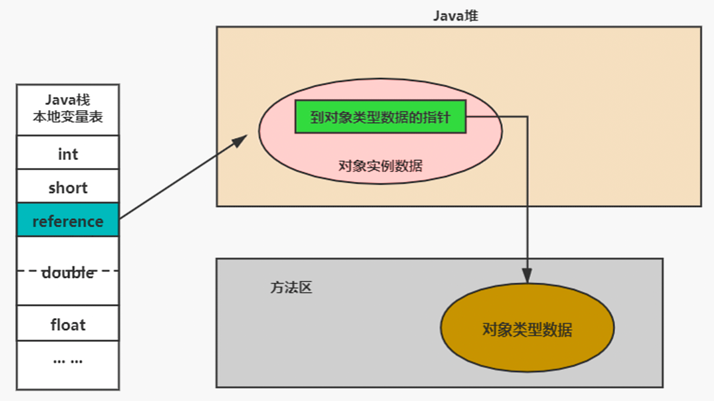
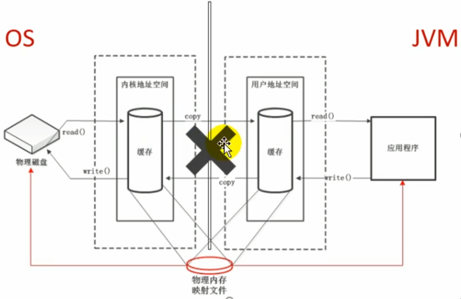
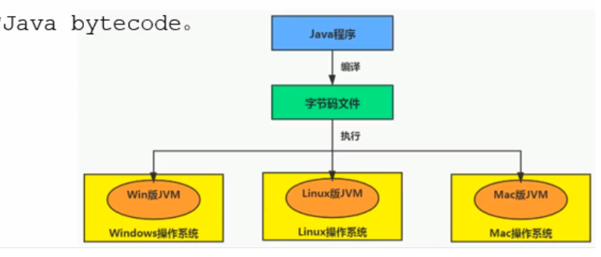

# 一、JVM与Java体系结构

## 一、Java及JVM简介

### 一、JVM：跨语言的平台


- 每个语言都需要转换成字节码文件，最后转换的字节码文件都能通过Java虚拟机进行运行和处理
- Java虚拟机根本不关心运行在其内部的程序到底是使用何种编程语言编写的，它只关心“字节码”文件。也就是说Java 虚拟机拥有语言无关性，并不会单纯地与Java语言“终身绑定”，只要其他编程语言的编译结果满足并包含Java虚拟机的内部指令集、符号表以及其他的辅助信息，它就是一个有效的字节码文件，就能够被虚拟机所识别并装载运行

### 二、字节码

- 我们平时说的java字节码，指的是用java语言编译成的字节码。准确的说任何能在jvm平台上执行的字节码格式都是一样的。所以应该统称为：jvm 字节码
- 不同的编译器，可以编译出相同的字节码文件，字节码文件也可以在不同的JVM上运行
- Java虚拟机与Java语言并没有必然的联系，它只与特定的二进制文件格式—Class文件格式所关联，Class文件中包含了Java虚拟机指令集（或者称为字节码、Bytecodes）和符号表，还有一些其他辅助信息

## 二、虚拟机与Java虚拟机

### 一、虚拟机

1. 所谓虚拟机（Virtual Machine），就是一台虚拟的计算机。它是一款软件，用来执行一系列虚拟计算机指令。大体上，虚拟机可以分为系统虚拟机和程序虚拟机

   - 大名鼎鼎的Visual Box，Mware就属于系统虚拟机，它们完全是对物理计算机的仿真，提供了一个可运行完整操作系统的软件平台
   - 程序虚拟机的典型代表就是Java虚拟机，它专门为执行单个计算机程序而设计，在Java虚拟机中执行的指令我们称为Java字节码指令
2. 无论是系统虚拟机还是程序虚拟机，在上面运行的软件都被限制于虚拟机提供的资源中

### 二、Java虚拟机

1. JVM概述

   - Java虚拟机是一台执行Java字节码的虚拟计算机，它拥有独立的运行机制，其运行的Java字节码也未必由Java 语言编译而成
   - JVM平台的各种语言可以共享Java虚拟机带来的跨平台性、优秀的垃圾回器，以及可靠的即时编译器
   - Java技术的核心就是Java虚拟机（JVM，Java Virtual Machine），因为所有的Java程序都运行在Java虚拟机内部

2. JVM作用

   - Java虚拟机就是二进制字节码的运行环境，负责装载字节码到其内部，解释/编译为对应平台上的机器指令执行。每一条Java指令，Java虚拟机规范中都有详细定义，如怎么取操作数，怎么处理操作数，处理结果放在哪里
   - 跨语言，跨平台

3. JVM特点

   - 一次编译，到处运行
   - 自动内存管理
   - 自动垃圾回收功能

4. JVM位置：JVM 是运行在操作系统之上的，它与硬件没有直接的交互

   


### 三、JVM整体结构

- HotSpot VM是目前市面上高性能虚拟机的代表作之一
- 它采用解释器与即时编译器并存的架构


### 四、Java代码执行流程


### 五、JVM架构模型

Java编译器输入的指令流基本上是一种基于栈的指令集架构，另外一种指令集架构则是基于寄存器的指令集架构具体来说：这两种架构之间的区别：

1. **基于栈式架构的特点**
- 设计和实现更简单，适用于资源受限的系统
   - 避开了寄存器的分配难题：使用零地址指令方式分配
   - 指令流中的指令大部分是零地址指令，其执行过程依赖于操作栈。指令集更小，编译器容易实现
   - 不需要硬件支持，可移植性更好，更好实现跨平台
2. **基于寄存器架构的特点**
   - 典型的应用是x86 的二进制指令集：比如传统的PC以及Android的Davlik虚拟机
   - 指令集架构则完全依赖硬件，可移植性差
   - 性能优秀和执行更高效
   - 花费更少的指令去完成一项操作
   - 在大部分情况下，基于寄存器架构的指令集往往都以一地址指令、二地址指令和三地址指令为主，而基于栈式架构的指令集却是以零地址指令为主

由于跨平台性的设计，Java 的指令都是根据栈来设计的。不同平台CPU架构不同，所以不能设计为基于寄存器的。优点是跨平台，指令集小，编译器容易实现；缺点是性能下降，实现同样的功能需要更多的指令，执行性能比寄存器差

### 六、JVM生命周期

1. 虚拟机的启动
   - Java虚拟机的启动是通过引导类加载器（bootstrap class loader）创建一个初始类（initial class）来完成的，这个类是由虚拟机的具体实现指定的
2. 虚拟机的执行
   - 一个运行中的Java虚拟机有着一个清晰的任务，即执行Java程序
   - 程序开始执行时他才运行，程序结束时他就停止
   - 执行一个所谓的Java程序的时候，真真正正在执行的是一个叫做Java虚拟机的进程
3. 虚拟机的退出
   - 程序正常执行结束
   - 程序在执行过程中遇到了异常或错误而异常终止
   - 由于操作系统用现错误而导致Java虚拟机进程终止
   - 某线程调用Runtime类或system类的exit方法，或Runtime类的halt方法，并且Java安全管理器也允许这次exit或 halt操作
   - JNI（Java Native Interface）规范描述了用JNI Invocation API来加载或卸载Java虚拟机时，Java虚拟机的退出情况

# 二、类加载子系统

## 一、内存结构概述


1. Class文件
2. 类加载子系统
3. 运行时数据区：方法区、堆、程序计数器、虚拟机栈、本地方法栈
4. 执行引擎
5. 本地方法接口
6. 本地方法库

## 二、类加载器与类的加载过程

### 一、类加载器子系统作用


- 类加载器子系统负责从文件系统或者网络中加载Class文件，class文件在文件开头有特定的文件标识
- ClassLoader只负责class文件的加载，至于它是否可以运行，则由Execution Engine（执行引擎）决定
- 加载的类信息存放于一块称为方法区的内存空间。除了类的信息外，方法区中还会存放运行时常量池信息，可能还包括字符串字面量和数字常量（这部分常量信息是Class文件中常量池部分的内存映射）

### 二、类的加载过程

一个简单类（比如简单的HelloLoader程序，带有main方法）的加载流程为


#### 一、加载阶段


1. 通过一个类的全限定名获取定义此类的二进制字节流
2. 将这个字节流所代表的静态存储结构转化为方法区的运行时数据结构，即类信息存放在方法区中
3. 在内存中生成一个代表这个类的java.lang.Clas 对象，作为方法区这个类的各种数据的访问入口
4. 补充内容：加载.class文件的方式
   - 从本地系统中直接加载
   - 通过网络获取，典型场景：Web Applet
   - 从 zip压缩包中读取，成为日后jar、war格式的基础
   - 运行时计算生成，使用最多的是：动态代理技术
   - 由其他文件生成，典型场景：JSP 应用
   - 从专有数据库中提取.class文件，比较少见
   - 从加密文件中获取，典型的防Class文件被反编译的保护措施

#### 二、链接阶段

1. **验证（Verify）**
   - 目的在于确保Class文件的字节流中包含信息符合当前虚拟机要求，保证被加载类的正确性，不会危害虚拟机自身安全
   - 主要包括四种验证，文件格式验证，元数据验证，字节码验证，符号引用验证
2. **准备（Prepare）**
   - 为类变量分配内存并且设置该类变量的默认初始值
   - 这里不包含用final修饰的static，因为final在编译的时候就会分配了，准备阶段会显式初始化
   - 这里不会为实例变量分配初始化，类变量会分配在方法区中，而实例变量是会随着对象一起分配到Java堆中
3. **解析（Resolve）**
   - 将常量池内的符号引用转换为直接引用的过程
   - 事实上，解析操作往往会伴随着JVM在执行完初始化之后再执行
   - 符号引用就是一组符号来描述所引用的目标。直接引用就是直接指向目标的指针、相对偏移量或一个间接定位到目标的句柄
   - 解析动作主要针对类或接口、字段、类方法、接口方法、方法类型等。对应常量池中的CONSTANT_Class_info、CONSTANT_Fieldref_info、CONSTANT_Methodref_info等

#### 三、初始化阶段

- 初始化阶段就是执行类构造器方法&lt;clinit&gt;()的过程
- &lt;clinit&gt;()此方法不需定义，是javac编译器自动收集类中的所有类变量的赋值动作和静态代码块中的语句合并而来，也就是为静态变量进行赋值的方法，如果类中并没有静态变量和静态代码块，则不会有此方法。但是每一个类在初始化阶段都会有一个&lt;init&gt;()方法，代表类的构造器方法（在编写代码时显式或隐式指定的构造器）
- &lt;clinit&gt;()中指令按语句在源文件中出现的顺序执行（比如一个静态变量先在代码块中进行赋值，再定义该变量（定义时显式赋值了，如果未显式赋值，最后的执行结果是在代码块中的赋值），此时先在链接阶段中准备过程中将此变量赋值为默认值，再顺序执行代码块的赋值，最后才是执行定义的赋值，所以最后该静态变量的值为定义时的值）
- &lt;clinit&gt;()不同于类的构造器。（关联：构造器是虚拟机视角下的&lt;init&gt;()）
- 若该类具有父类，JVM会保证子类的&lt;clinit&gt;()执行前，父类的&lt;clinit&gt;()已经执行完毕
- 虚拟机必须保证一个类的&lt;clinit&gt;()方法在多线程下被同步加锁

## 三、类加载器分类

JVM支持两种类型的类加载器 。分别为引导类加载器（Bootstrap ClassLoader）和自定义类加载器（User-Defined ClassLoader）

从概念上来讲，自定义类加载器一般指的是程序中由开发人员自定义的一类类加载器，但是Java虚拟机规范却没有这么定义，而是将所有派生于抽象类ClassLoader的类加载器都划分为自定义类加载器

无论类加载器的类型如何划分，在程序中我们最常见的类加载器始终只有3个。这里的四者之间的关系是包含关系。不是上层下层，也不是子父类的继承关系，但是都是继承于ClassLoader


### 一、虚拟机自带的加载器

1. **启动类加载器（引导类加载器，Bootstrap ClassLoader）**
   - 这个类加载使用C/C++语言实现的，嵌套在JVM内部
   - 它用来加载Java的核心库（JAVA_HOME/jre/lib/rt.jar、resources.jar或sun.boot.class.path 路径下的内容），用于提供JVM自身需要的类，比如String类
   - 并不继承自java.lang.ClassLoader，没有父加载器
   - 加载扩展类和应用程序类加载器，并指定为他们的父类加载器
   - 出于安全考虑，Bootstrap启动类加载器只加载包名为java、javax、sun等开头的类
2. **扩展类加载器（Extension ClassLoader）**
   - Java语言编写，由sun.misc.Launcher$ExtClassLoader实现
   - 派生于 ClassLoader 类
   - 父类加载器为启动类加载器
   - 从java.ext.dirs系统属性所指定的目录中加载类库，或从JDK的安装目录的 jre/lib/ext 子目录（扩展目录）下加载类库。如果用户创建的JAR放在此目录下，也会自动由扩展类加载器加载
3. **应用程序类加载器（系统类加载器，AppClassLoader）**
   - java语言编写，由sun.misc.LaunchersAppClassLoader实现
   - 派生于ClassLoader类
   - 父类加载器为扩展类加载器
   - 它负责加载环境变量classpath或系统属性java.class.path指定路径下的类库
   - 该类加载是程序中默认的类加载器，一般来说，Java应用的类都是由它来完成加载
   - 通过ClassLoader#getSystemclassLoader()方法可以获取到该类加载器

### 二、用户自定义加载器

1. 用户自定义加载器的意义
   - 隔离加载类
   - 修改类加载的方式
   - 扩展加载源
   - 防止源码泄漏
2. 实现用户自定义加载器的步骤
   - 开发人员可以通过继承抽象类java.lang.ClassLoader类的方式，实现自己的类加载器，以满足一些特殊的需求
   - 在JDK1.2之前，在自定义类加载器时，总会去继承ClassLoade 类并重写loadClass() 方法，从而实现自定义的类加载类，但是在JDK1.2之后已不再建议用户去覆盖loadclass()方法，而是建议把自定义的类加载逻辑写在findClass()方法中
   - 在编写自定义类加载器时，如果没有太过于复杂的需求，可以直接继承URLClassLoader 类，这样就可以避免自己去编写findClass()方法及其获取字节码流的方式，使自定义类加载器编写更加简洁

## 四、ClassLoader的使用说明

1. ClassLoader类是一个抽象类，其后所有的类加载器都继承自ClassLoader（不包括启动类加载器）

   

2. sun.misc.Launcher是一个java虚拟机的入口应用

   

3. 获取ClassLoader的途径

   - 方式一：获取当前ClassLoader

     ```java
     clazz.getClassLoader()
     ```

   - 方式二：获取当前线程上下文的ClassLoader

     ```java
     Thread.currentThread().getContextClassLoader()
     ```

   - 方式三：获取系统的ClassLoader

     ```java
     ClassLoader.getSystemClassLoader()
     ```

   - 方式四：获取调用者的ClassLoader

     ```java
     DriverManager.getCallerClassLoader()
     ```

## 五、双亲委派机制

1. 双亲委派机制概述

   - Java虚拟机对class文件采用的是**按需加载**的方式，也就是说当需要使用该类时才会将它的 class文件加载到内存生成class对象。而且加载某个类的class文件时，Java虚拟机采用的是**双亲委派模式**，即把请求交由父类处理，它是一种任务委派模式

2. 工作原理

   

   - 如果一个类加载器收到了类加载请求，它并不会自己先去加载，而是把这个请求委托给父类的加载器去执行
   - 如果父类加载器还存在其父类加载器，则进一步向上委托，依次递归，请求最终将到达顶层的启动类加载器
   - 如果父类加载器可以完成类加载任务，就成功返回，倘若父类加载器无法完成此加载任务，子加载器才会尝试自己去加载，这就是双亲委派模式

3. 优势

   - 避免类的重复加载
   - 保护程序安全，防止核心API被随意篡改

4. 沙箱安全机制

   - 自定义String类，但是在加载自定义String类的时候会率先使用引导类加载器加载，而引导类加载器在加载的过程中会先加载jdk自带的文件（rt.jar包中java\lang\String.class），报错信息说没有main方法，就是因为加载的是rt.jar包中的string类。这样可以保证对java核心源代码的保护，这就是沙箱安全机制

## 六、其他

### 一、判断两个class对象是否相同

1. 在JVM中表示两个class对象是否为同一个类存在两个必要条件
   - 类的完整类名必须一致，包括包名
   - 加载这个类的ClassLoader（指ClassLoader实例对象）必须相同
2. 换句话说，在JVM中，即使这两个类对象（class对象）来源同一个Class文件，被同一个虚拟机所加载，但只要加载它们的ClassLoader实例对象不同，那么这两个类对象也是不相等的

### 二、对类加载器的引用

- JVM必须知道一个类型是由启动加载器加载的还是由用户类加载器加载的。如果一个类型是由用户类加载器加载的，那么JVM会将这个类加载器的一个引用作为类型信息的一部分保存在方法区中。当解析一个类型到另一个类型的引用的时候，JVM需要保证这两个类型的类加载器是相同的

### 三、类的主动使用和被动使用

1. Java程序对类的使用方式分为：主动使用和被动使用
2. 主动情况
   - 创建类的实例
   - 访问某个类或接口的静态变量，或者对该静态变量赋值
   - 调用类的静态方法
   - 反射（比如：Class.forName（"com.atguigu.Test"））
   - 初始化一个类的子类
   - Java虚拟机启动时被标明为启动类的类
   - JDK 7开始提供的动态语言支持：java.lang.invoke.MethodHandle实例的解析结果；REF_getStatic、REF_putStatic、REF_invokeStatic 句柄对应的类没有初始化，则初始化
3. 除了以上七种情况，其他使用Java类的方式都被看作是对类的被动使用，都不会导致类的初始化

# 三、运行时数据区及程序计数器

## 一、运行时数据区

### 一、概述

1. 当我们通过前面的：类的加载 -> 验证 -> 准备 -> 解析 -> 初始化，这几个阶段完成后，就会用到执行引擎对我们的类进行使用，同时执行引擎将会使用到我们运行时数据区

2. 内存是非常重要的系统资源，是硬盘和CPU的中间仓库及桥梁，承载着操作系统和应用程序的实时运行JVM内存布局规定了Java在运行过程中内存申请、分配、管理的策略，保证了JVM的高效稳定运行。不同的JVM对于内存的划分方式和管理机制存在着部分差异

   

3. 我们通过磁盘或者网络IO得到的数据，都需要先加载到内存中，然后CPU从内存中获取数据进行读取，也就是说内存充当了CPU和磁盘之间的桥梁

   

4. Java虚拟机定义了若干种程序运行期间会使用到的运行时数据区，其中有一些会随着虚拟机启动而创建，随着虚拟机退出而销毁。另外一些则是与线程一一对应的，这些与线程对应的数据区域会随着线程开始和结束而创建和销毁

   - 每个线程：独立包括程序计数器、栈、本地栈
   - 线程间共享：堆、堆外内存（方法区）（永久代或元空间、代码缓存）

5. 每个JVM只有一个Runtime实例。Runtime对象就相当于整个运行时数据区

### 二、线程

- 线程是一个程序里的运行单元。JVM允许一个应用有多个线程并行的执行
- 在Hotspot JVM里，每个线程都与操作系统的本地线程直接映射。当一个Java线程准备好执行以后，此时一个操作系统的本地线程也同时创建。Java线程执行终止后，本地线程也会回收
- 操作系统负责所有线程的安排调度到任何一个可用的CPU上。一旦本地线程初始化成功，它就会调用Java线程中的run()方法

### 三、JVM系统线程

1. 如果使用jconsole或者是任何一个调试工具，都能看到在后台有许多线程在运行。这些后台线程不包括调用`public static void main(String[] args)`的main线程以及所有这个main线程自己创建的线程
2. 这些主要的后台系统线程在Hotspot JVM里主要是以下几个：
   - 虚拟机线程：这种线程的操作是需要JVM达到安全点才会出现。这些操作必须在不同的线程中发生的原因是他们都需要JVM达到安全点，这样堆才不会变化。这种线程的执行类型包括"stop-the-world"的垃圾收集，线程栈收集，线程挂起以及偏向锁撤销
   - 周期任务线程：这种线程是时间周期事件的体现（比如中断），他们一般用于周期性操作的调度执行
   - GC线程：这种线程对在JVM里不同种类的垃圾收集行为提供了支持
   - 编译线程：这种线程在运行时会将字节码编译成到本地代码
   - 信号调度线程：这种线程接收信号并发送给JVM，在它内部通过调用适当的方法进行处理

## 二、程序计数寄存器

### 一、程序计数器概述

- 程序计数寄存器，即PC寄存器。JVM中的PC寄存器是对物理PC寄存器的一种抽象模拟

### 二、程序计数器作用

- PC寄存器用来存储指向下一条指令的地址，也即将要执行的指令代码。由执行引擎读取下一条指令

  

### 三、程序计数器意义

1. 程序计数器是一块很小的内存空间，几乎可以忽略不记。也是运行速度最快的存储区域

2. 在JVM规范中，每个线程都有它自己的程序计数器，是线程私有的，生命周期与线程的生命周期保持一致

3. 任何时间一个线程都只有一个方法在执行，也就是所谓的当前方法。程序计数器会存储当前线程正在执行的Java方法的JVM指令地址；或者，如果是在执行native方法，则是未指定（undefined）

4. 程序计数器是程序控制流的指示器，分支、循环、跳转、异常处理、线程恢复等基础功能都需要依赖这个计数器来完成

5. 字节码解释器工作时就是通过改变这个计数器的值来选取下一条需要执行的字节码指令，PC寄存器相当于字节码指令的集合

6. 程序计数器是唯一一个在Java虚拟机规范中没有规定任何OutofMemoryError情况的区域。程序计数器、虚拟机栈和本地方法栈都没有GC

7. 使用PC寄存器存储字节码指令地址的作用以及使用PC寄存器记录当前线程的执行地址的作用

   

   - 因为CPU需要不停的切换各个线程，这时候切换回来以后，就得知道接着从哪开始继续执行
   - JVM的字节码解释器就需要通过改变PC寄存器的值来明确下一条应该执行什么样的字节码指令

8. PC寄存器被设定为私有的意义

   - 为了能够准确地记录各个线程正在执行的当前字节码指令地址，最好的办法自然是为每一个线程都分配一个PC寄存器，这样一来各个线程之间便可以进行独立计算，从而不会出现相互干扰的情况
   - 由于CPU时间片轮限制，众多线程在并发执行过程中，任何一个确定的时刻，一个处理器或者多核处理器中的一个内核，只会执行某个线程中的一条指令

9. CPU时间片

   - CPU时间片即CPU分配给各个程序的时间，每个线程被分配一个时间段，称作它的时间片
   - 在宏观上：可以同时打开多个应用程序，每个程序并行不悖，同时运行
   - 在微观上：由于只有一个 CPU，一次只能处理程序要求的一部分，如何处理公平，一种方法就是引入时间片，每个程序轮流执行

# 四、虚拟机栈

## 一、虚拟机栈概述

### 一、内存中的栈与堆

栈（stack）是运行时的单位，而堆（heap）是存储的单位

- 栈解决程序的运行问题，即程序如何执行，或者说如何处理数据
- 堆解决的是数据存储的问题，即数据怎么放，放哪里

### 二、虚拟机栈基本内容

#### 一、Java虚拟机栈含义

- Java虚拟机栈（Java Virtual Machine Stack），早期也叫Java栈。每个线程在创建时都会创建一个虚拟机栈，其内部保存一个个的栈帧（Stack Frame），对应着一次次的Java方法调用，是线程私有的

#### 二、栈的生命周期

- 生命周期和线程一致

#### 三、栈的作用

- 主管Java程序的运行，它保存方法的局部变量（8种基本数据类型、引用数据类型的引用地址）、部分结果，并参与方法的调用和返回

#### 四、栈的特点


1. 栈是一种快速有效的分配存储方式，访问速度仅次于程序计数器
2. JVM直接对Java栈的操作只有两个：
   - 每个方法执行，伴随着进栈（入栈、压栈）
   - 执行结束后的出栈工作
3. 对于栈来说不存在垃圾回收问题（栈存在溢出的情况）
4. 栈是先进后出的

#### 五、栈中可能出现的异常

1. Java虚拟机规范允许Java栈的大小是动态的或者是不固定的
   - 如果采用固定大小的Java虚拟机栈，那每一个线程的Java虚拟机栈容量可以在线程创建的时候独立选定。如果线程请求分配的栈容量超过Java虚拟机栈允许的最大容量，Java虚拟机将会抛出一个StackOverflowError异常
   - 如果Java虚拟机栈可以动态扩展，并且在尝试扩展的时候无法申请到足够的内存，或者在创建新的线程时没有足够的内存去创建对应的虚拟机栈，那Java虚拟机将会抛出一个OutOfMemoryError异常
2. 可以使用参数-Xss选项来设置线程最大栈空间，栈的大小直接决定了函数调用的最大可达深度

## 二、栈的存储空间

### 一、栈中存储的内容

1. 每个线程都有自己的栈，栈中的数据都是以栈帧（Stack Frame）的格式存在
2. 在这个线程上正在执行的每个方法都各自对应一个栈帧（Stack Frame）
3. 栈帧是一个内存区块，是一个数据集，维系着方法执行过程中的各种数据信息

### 二、栈运行原理

1. JVM直接对Java栈的操作只有两个，就是对栈帧的压栈和出栈，遵循“先进后出”或“后进先出”原则

2. 在一条活动线程中，一个时间点上，只会有一个活动的栈帧。即只有当前正在执行的方法的栈帧（栈顶栈帧）是有效的，这个栈帧被称为**当前栈帧（Current Frame）**，与当前栈帧相对应的方法就是**当前方法（Current Method）**，定义这个方法的类就是**当前类（Current Class）**

3. 执行引擎运行的所有字节码指令只针对当前栈帧进行操作

4. 如果在该方法中调用了其他方法，对应的新的栈帧会被创建出来，放在栈的顶端，成为新的当前帧

   

5. 不同线程中所包含的栈帧是不允许存在相互引用的，即不可能在一个栈帧之中引用另外一个线程的栈帧

6. 如果当前方法调用了其他方法，方法返回之际，当前栈帧会传回此方法的执行结果给前一个栈帧，接着，虚拟机会丢弃当前栈帧，使得前一个栈帧重新成为当前栈帧

7. Java方法有两种返回函数的方式，一种是正常的函数返回，以return指令为代表；另外一种是方法执行中出现未捕获处理的异常则以抛出异常的方式结束。不管使用哪种方式，都会导致栈帧被弹出

### 三、栈帧的内部结构

1. 每个栈帧中存储着

   - 局部变量表（Local Variables）
   - 操作数栈（operand Stack）（或表达式栈）
   - 动态链接（DynamicLinking）（或指向运行时常量池的方法引用）
   - 方法返回地址（Return Address）（或方法正常退出或者异常退出的定义）
   - 一些附加信息

   

2. 并行每个线程下的栈都是私有的，因此每个线程都有自己各自的栈，并且每个栈里面都有很多栈帧，栈帧的大小主要由局部变量表和操作数栈决定的

   

## 三、局部变量表

局部变量表也被称之为局部变量数组或本地变量表

- 定义为一个数字数组，主要用于存储方法参数和定义在方法体内的局部变量，这些数据类型包括各类基本数据类型、对象引用（reference），以及returnAddress类型
- 由于局部变量表是建立在线程的栈上，是线程的私有数据，因此不存在数据安全问题
- 局部变量表所需的容量大小是在编译期确定下来的，并保存在方法的Code属性的maximum local variables数据项中。在方法运行期间是不会改变局部变量表的大小的
- 方法嵌套调用的次数由栈的大小决定。一般来说，栈越大，方法嵌套调用次数越多。对一个函数而言，它的参数和局部变量越多，使得局部变量表膨胀，它的栈帧就越大，以满足方法调用所需传递的信息增大的需求。进而函数调用就会占用更多的栈空间，导致其嵌套调用次数就会减少。
- 局部变量表中的变量只在当前方法调用中有效。在方法执行时，虚拟机通过使用局部变量表完成参数值到参数变量列表的传递过程。当方法调用结束后，随着方法栈帧的销毁，局部变量表也会随之销毁

### 一、关于Slot的理解

- 局部变量表，最基本的存储单元是Slot（变量槽）
- 参数值的存放总是在局部变量数组的index0开始，到数组长度-1的索引结束
- 局部变量表中存放编译期可知的各种基本数据类型（8 种），引用类型（reference），returnAddress类型的变量
-  在局部变量表里，32位以内的类型只占用一个slot（包括returnAddress类型），64位的类型（long和double）占用两个slot。byte、short、char在存储前被转换为int，boolean也被转换为int，0表示false，非0表示true
- JVM会为局部变量表中的每一个Slot都分配一个访问索引，通过这个索引即可成功访问到局部变量表中指定的局部变量值
- 当一个实例方法被调用的时候，它的方法参数和方法体内部定义的局部变量将会按照顺序被复制到局部变量表中的每一个slot上
- 如果需要访问局部变量表中一个64bit的局部变量值时，只需要使用前一个索引下标即可。（比如：访问long或double类型变量）
- 如果当前帧是由构造方法或者实例方法（非静态方法）创建的，那么该对象引用this将会存放在index为0的slot处，其余的参数按照参数表顺序继续排列


### 二、Slot的重复使用

- 栈帧中的局部变量表中的槽位是可以重用的，如果一个局部变量过了其作用域（比如在方法中定义一个代码块，代码块中定义的变量出去此代码块就被销毁，从而被代码块外定义的变量所占用此slot），那么在其作用域之后申明的新的局部变就很有可能会复用过期局部变量的槽位，从而达到节省资源的目的

### 三、静态变量与局部变量对比

- 参数表分配完毕之后，再根据方法体内定义的变量的顺序和作用域分配
- 类变量表有两次初始化的机会，第一次是在“准备阶段”，执行系统初始化，对类变量设置零值，另一次则是在“初始化”阶段，赋予程序员在代码中定义的初始值。和类变量初始化不同的是，局部变量表不存在系统初始化的过程，这意味着一旦定义了局部变量则必须人为的初始化，否则无法使用

### 四、补充说明

- 在栈帧中，与性能调优关系最为密切的部分就是  局部变量表。在方法执行时，虚拟机使用局部变量表完成方法的传递
- 局部变量表中的变量也是重要的垃圾回收根节点，只要被局部变量表中直接或间接引用的对象都不会被回收
- byte、short、char、boolean、int都以int类型保存，其他的还是以自身的类型来保存

## 四、操作数栈

1. 每一个独立的栈帧除了包含局部变量表以外，还包含一个后进先出（Last-In-First-Out）的操作数栈，也可以称之为表达式栈（Expression Stack）

2. 操作数栈，在方法执行过程中，根据字节码指令，往栈中写入数据或提取数据，即入栈（push）和出栈（pop）

   - 某些字节码指令将值压入操作数栈，其余的字节码指令将操作数取出栈。使用它们后再把结果压入栈

   - 比如：执行复制、交换、求和等操作。图示

     

3. 操作数栈，主要用于保存计算过程的中间结果，同时作为计算过程中变量临时的存储空间

4. 操作数栈就是JVM执行引擎的一个工作区，当一个方法刚开始执行的时候，一个新的栈帧也会随之被创建出来，这个方法的操作数栈是空的

5. 每一个操作数栈都会拥有一个明确的栈深度用于存储数值，其所需的最大深度在编译期就定义好了，保存在方法的Code属性中，为max_stack的值

6. 栈中的任何一个元素都是可以任意的Java数据类型

   - 32bit的类型占用一个栈单位深度
   - 64bit的类型占用两个栈单位深度

7. 操作数栈并非采用访问索引的方式来进行数据访问的，而是只能通过标准的入栈和出栈操作来完成一次数据访问

8. 如果被调用的方法带有返回值的话，其返回值将会被压入当前栈帧的操作数栈中，并更新PC寄存器中下一条需要执行的字节码指令

9. 操作数栈中元素的数据类型必须与字节码指令的序列严格匹配，这由编译器在编译器期间进行验证，同时在类加载过程中的类检验阶段的数据流分析阶段要再次验证

10. Java虚拟机的解释引擎是基于栈的执行引擎，其中的栈指的就是操作数栈

## 五、代码追踪

- 使用 javap命令反编译class文件

  ```shell
  javap -v 类名.class
  ```

- 代码示例

  ```java
  public void testAddOperation() {
      byte i = 15;
      int j = 8;
      int k = i + j;
  }
  ```

  

  

  

  

  

  

  

  

  

  

## 六、栈顶缓存技术

1. 基于栈式架构的虚拟机所使用的零地址指令更加紧凑，但完成一项操作的时候必然需要使用更多的入栈和出栈指令，这同时也就意味着将需要更多的指令分派（instruction dispatch）次数和内存读/写次数
2. 由于操作数是存储在内存中的，因此频繁地执行内存读/写操作必然会影响执行速度。为了解决这个问题，提出了栈顶缓存（Tos，Top-of-Stack Cashing）技术，将栈顶元素全部缓存在物理CPU的寄存器中，以此降低对内存的读/写次数，提升执行引擎的执行效率

## 七、动态链表

1. 动态链接、方法返回地址、附加信息，这三者在有些地方被称为帧数据区

2. 每一个栈帧内部都包含一个指向运行时常量池中该栈帧所属方法的引用。包含这个引用的目的就是为了支持当前方法的代码能够实现动态链接（Dynamic Linking）。比如：invokedynamic指令

3. 在Java源文件被编译到字节码文件中时，所有的变量和方法引用都作为符号引用（Symbolic Reference）保存在class 文件的常量池里。比如：描述一个方法调用了另外的其他方法时，就是通过常量池中指向方法的符号引用来表示的，那么动态链接的作用就是为了将这些符号引用转换为调用方法的直接引用

   

4. 需要运行时常量池的作用：就是为了提供一些符号和常量，便于指令的识别

## 八、方法调用：解析与分配

在JVM中，将符号引用转换为调用方法的直接引用与方法的绑定机制相关

### 一、静态链接

- 当一个字节码文件被装载进JVM内部时，如果被调用的目标方法在编译期可知，且运行期保持不变时，这种情况下降调用方法的符号引用转换为直接引用的过程称之为静态链接

### 二、动态链接

- 如果被调用的方法在编译期无法被确定下来，只能够在程序运行期将调用的方法的符号转换为直接引用，由于这种引用转换过程具备动态性，因此也被称之为动态链接
- 静态链接和动态链接不是名词，而是动词
- 对应的方法的绑定机制为：早期绑定（Early Binding）和晚期绑定（Late Binding）。绑定是一个字段、方法或者类在符号引用被替换为直接引用的过程，这仅仅发生一次

### 三、早期绑定

- 早期绑定就是指被调用的目标方法如果在编译期可知，且运行期保持不变时，即可将这个方法与所属的类型进行绑定，这样一来，由于明确了被调用的目标方法究竟是哪一个，因此也就可以使用静态链接的方式将符号引用转换为直接引用，对应着静态链接
- 例如在构造器中调用super()、this()方法则表现为早期绑定

### 四、晚期绑定

- 如果被调用的方法在编译期无法被确定下来，只能够在程序运行期根据实际的类型绑定相关的方法，这种绑定方式也就被称之为晚期绑定，对应着动态链接
- 像是使用实例对象去调用方法时，则表现为晚期绑定
- 随着高级语言的横空出世，类似于Java一样的基于面向对象的编程语言如今越来越多，尽管这类编程语言在语法风格上存在一定的差别，但是它们彼此之间始终保持着一个共性，那就是都支持封装、继承和多态等面向对象特性，既然这一类的编程语言具备多态特悄，那么自然也就具备早期绑定和晚期绑定两种绑定方式
- Java中任何一个普通的方法其实都具备虚函数的特征，它们相当于C++语言中的虚函数（C++中则需要使用关键字virtual来显式定义）。如果在Java程序中不希望某个方法拥有虚函数的特征时，则可以使用关键字final来标记这个方法

### 五、虚方法和非虚方法

1. 如果方法在编译期就确定了具体的调用版本，这个版本在运行时是不可变的。这样的方法称为非虚方法，即不能使用多态的情况
2. 静态方法、私有方法、final方法、实例构造器、父类方法都是非虚方法。其他方法称为虚方法
3. 普通调用指令
   - invokestatic：调用静态方法，解析阶段确定唯一方法版本
   - invokespecial：调用<init>方法、私有及父类方法，解析阶段确定唯一方法版本
   - invokevirtual：调用所有虚方法
   - invokeinterface：调用接口方法
4. 动态调用指令
   - invokedynamic：动态解析出需要调用的方法，然后执行
   - 关于invokednamic指令
     - JVM字节码指令集一直比较稳定，一直到Java7中才增加了一个invokedynamic指令，这是Java为了实现「动态类型语言」支持而做的一种改进
     - 但是在Java7中并没有提供直接生成invokedynamic指令的方法，需要借助ASM这种底层字节码工具来产生invokedynamic指令。直到Java8的Lambda表达式的出现，invokedynamic指令的生成，在Java中才有了直接的生成方式
   - Java7中增加的动态语言类型支持的本质是对Java虚拟机规范的修改，而不是对 Java语言规则的修改，这一块相对来讲比较复杂，增加了虚拟机中的方法调用，最直接的受益者就是运行在Java平台的动态语言的编译器
5. 普通调用指令固化在虚拟机内部，方法的调用执行不可人为干预，而invokedynamic指令则支持由用户确定方法版本。其中invokestatic指令和invokespecial指令调用的方法称为非虚方法，其余的（final修饰的除外）称为虚方法
6. 动态类型语言和静态类型语言
   - 动态类型语言和静态类型语言两者的区别就在于对类型的检查是在编译期还是在运行期，满足前者就是静态类型语言，反之是动态类型语言。Java属于静态类型语言
   - 简而言之，静态类型语言是判断变量自身的类型信息；动态类型语言是判断变量值的类型信息，变量没有类型信息，变量值才有类型信息，这是动态语言的一个重要特征

### 六、方法重写的本质

1. Java语言中方法重写的本质
   - 找到操作数栈顶的第一个元素所执行的对象的实际类型，记作C
   - 如果在类型C中找到与常量中的描述符合简单名称都相符的方法，则进行访问权限校验，如果通过则返回这个方法的直接引用，查找过程结束；如果不通过，则返回java.lang.IllegalAccessError异常
   - 否则，按照继承关系从下往上依次对C的各个父类进行第2步的搜索和验证过程
   - 如果始终没有找到合适的方法，则抛出java.1ang.AbstractMethodsrror异常
2. IllegalAccessError介绍
   - 程序试图访问或修改一个属性或调用一个方法，这个属性或方法，你没有权限访问。一般的，这个会引起编译器异常。这个错误如果发生在运行时，就说明一个类发生了不兼容的改变

### 七、方法的调用：虚方法表

1. 在面向对象的编程中，会很频繁的使用到动态分派，如果在每次动态分派的过程中都要重新在类的方法元数据中搜索合适的目标的话就可能影响到执行效率。因此，为了提高性能，JVM采用在类的方法区建立一个虚方法表（virtual method table）（非虚方法不会出现在表中）来实现。使用索引表来代替查找
2. 每个类中都有一个虚方法表，表中存放着各个方法的实际入口
3. 虚方法表会在类加载的链接阶段被创建并开始初始化，类的变量初始值准备完成之后，JVM会把该类的方法表也初始化完毕

## 九、方法返回地址

1. 存放调用该方法的 pc 寄存器的值。一个方法的结束，有两种方式
   - 正常执行完成
   - 出现未处理的异常，非正常退出
2. 无论通过哪种方式退出，在方法退出后都返回到该方法被调用的位置。方法正常退出时，调用者的 pc计数器的值作为返回地址，即调用该方法的指令的下一条指令的地址。而通过异常退出的，返回地址是要通过异常表来确定，栈帧中一般不会保存这部分信息
3. 正常执行完成，退出方法：执行引擎遇到任意一个方法返回的字节码指令（return），会有返回值传递给上层的方法调用者
   - 一个方法在正常调用完成之后，究竟需要使用哪一个返回指令，还需要根据方法返回值的实际数据类型而定。
   - 在字节码指令中，返回指令包含ireturn（当返回值是boolean，byte，char，short和int类型时使用），lreturn（Long类型），freturn（Float类型），dreturn（Double类型），areturn（引用数据类型）。另外还有一个return指令声明为void的方法，实例初始化方法，类和接口的初始化方法使用
4. 异常完成出口，退出方法：方法执行过程中，抛出异常时的异常处理，存储在一个异常处理表，方便在发生异常的时候找到处理异常的代码
5. 本质上，方法的退出就是当前栈帧出栈的过程。此时，需要恢复上层方法的局部变量表、操作数栈、将返回值压入调用者栈帧的操作数栈、设置PC寄存器值等，让调用者方法继续执行下去
6. 正常完成出口和异常完成出口的区别在于：通过异常完成出口退出的不会给他的上层调用者产生任何的返回值

## 十、附加信息

- 栈帧中还允许携带与Java虚拟机实现相关的一些附加信息。例如：对程序调试提供支持的信息

## 十一、运行时数据区区别

| 运行时数据区 | 是否存在Error | 是否存在GC | 是否线程私有 |
| :----------: | :-----------: | :--------: | :----------: |
|  程序计数器  |      否       |     否     |      是      |
|   虚拟机栈   |   是（SOE）   |     否     |      是      |
|  本地方法栈  |      是       |     否     |      是      |
|    方法区    |   是（OOM）   |     是     |      否      |
|      堆      |      是       |     是     |      否      |

# 五、本地方法接口和本地方法栈

## 一、本地方法的含义

1. 简单地讲，一个Native Method是一个Java调用非Java代码的接囗。一个Native Method是这样一个 Java方法：该方法的实现由非Java语言实现，比如C。这个特征并非Java所特有，很多其它的编程语言都有这一机制，比如在 C++中，你可以用extern "c"告知c++编译器去调用一个c的函数

2. 在定义一个native method时，并不提供实现体（有些像定义一个Java interface），因为其实现体是由非java语言在外面实现的

3. 本地接口的作用是融合不同的编程语言为Java所用，它的初衷是融合C/C++程序

   

4. 标识符native可以与其它java标识符连用，但是abstract除外

## 二、Native Method的作用

1. 与Java环境交互
   - 有时Java应用需要与Java外面的环境交互，这是本地方法存在的主要原因。如操作系统或某些硬件交换信息时的情况。本地方法正是这样一种交流机制：它为我们提供了一个非常简洁的接口，而且我们无需去了解Java应用之外的繁琐的细节
2. 与操作系统交互
   - JVM支持着Java语言本身和运行时库，它是Java程序赖以生存的平台，它由一个解释（解释字节码）和一些连接到本地代码的库组成。然而不管怎样，它毕竟不是一个完整的系统，它经常依赖于一底层系统的支持。这些底层系统常常是强大的操作系统。通过使用本地方法，我们得以用Java实现了jre的与底层系统的交互，甚至JVM的一些部分就是用c写的。还有，如果我们要使用一些Java语言本身没有提供封装的操作系统的特性时，我们也需要使用本地方法

## 三、本地方法栈

1. Java虚拟机栈于管理Java方法的调用，而本地方法栈用于管理本地方法的调用

2. 本地方法栈，也是线程私有的

3. 允许被实现成固定或者是可动态扩展的内存大小。（在内存溢出方面是相同的）

   - 如果线程请求分配的栈容量超过本地方法栈允许的最大容量，Java虚拟机将会抛出一个 StackOverflowError异常
   - 如果本地方法栈可以动态扩展，并且在尝试扩展的时候无法申请到足够的内存，或者在创建新的线程时没有足够的内存去创建对应的本地方法栈，那么Java虚拟机将会抛出一个 OutOfMemoryError异常

4. 本地方法是使用C语言实现的。它的具体做法是Native Method Stack中登记native方法，在Execution Engine执行时加载本地方法库

   

5. 当某个线程调用一个本地方法时，它就进入了一个全新的并且不再受虚拟机限制的世界。它和虚拟机拥有同样的权限

   - 本地方法可以通过本地方法接口来访问虚拟机内部的运行时数据区
   - 它甚至可以直接使用本地处理器中的寄存器
   - 直接从本地内存的堆中分配任意数量的内存

6. 并不是所有的JVM都支持本地方法。因为Java虚拟机规范并没有明确要求本地方法栈的使用语言、具体实现方式、数据结构等。如果JVM产品不打算支持native方法，也可以无需实现本地方法栈

7. 在Hotspot JVM中，直接将本地方法栈和虚拟机栈合二为一

# 六、堆

## 一、堆（Heap）核心概述

1. 堆针对一个JVM进程来说是唯一的，也就是一个进程只有一个JVM，但是进程包含多个线程，他们是共享同一堆空间的

2. 一个JVM实例只存在一个堆内存，堆也是Java内存管理的核心区域

3. Java堆区在JVM启动的时候即被创建，其空间大小也就确定了。是JVM管理的最大一块内存空间

   - 堆内存的大小是可以调节的

4. 堆可以处于物理上不连续的内存空间中，但在逻辑上它应该被视为连续的

5. 所有的线程共享Java堆，在这里还可以划分线程私有的缓冲区（Thread Local Allocation Buffer，TLAB）

6. 所有的对象实例以及数组都应当在运行时分配在堆上

7. 数组和对象可能永远不会存储在栈上，因为栈帧中保存引用，这个引用指向对象或者数组在堆中的位置

8. 在方法结束后，堆中的对象不会马上被移除，仅仅在垃圾收集的时候才会被移除

9. 堆，是GC（Garbage Collection，垃圾收集器）执行垃圾回收的重点区域

10. 实例对象的创建图示

    

### 一、堆内存细分

1. Java7及之前堆内存逻辑上分为三部分：新生区+养老区+永久区
2. Java8及之后堆内存逻辑上分为三部分：新生区+养老区+元空间
3. 约定：新生区（代）<=>年轻代 、 养老区<=>老年区（代）、 永久区<=>永久代

### 二、堆空间内存结构（JDK7）


### 三、堆空间内存结构（JDK8）


## 二、设置堆内存大小与OOM

### 一、堆空间大小设置

1. Java堆区用于存储Java对象实例，那么堆的大小在JVM启动时就已经设定好了，大家可以通过选项"-Xmx"和"-Xms"来进行设置
   - “-Xms"用于表示堆区的起始内存，等价于`-XX:InitialHeapSize`
   - “-Xmx"则用于表示堆区的最大内存，等价于`-XX:MaxHeapSize`
2. 一旦堆区中的内存大小超过“-Xmx"所指定的最大内存时，将会抛出OutOfMemoryError异常
3. 通常会将-Xms和-Xmx两个参数配置相同的值，其目的是为了能够在java垃圾回收机制清理完堆区后不需要重新分隔计算堆区的大小，从而提高性能
4. 默认情况下
   - 初始内存大小：物理电脑内存大小 / 64
   - 最大内存大小：物理电脑内存大小 / 4

### 二、OutOfMemory举例

```java
public class OOMTest {
    public static void main(String[]args){
        ArrayList<Picture> list = new ArrayList<>();
        while(true){
            try {
                Thread.sleep(20);
            } catch (InterruptedException e){
                e.printStackTrace();
            }
            list.add(new Picture(new Random().nextInt(1024*1024)));
        }
    }
}
```

```java
Exception in thread "main" java.lang.OutofMemoryError: Java heap space
    at com.atguigu. java.Picture.<init>(OOMTest. java:25)
    at com.atguigu.java.O0MTest.main(OOMTest.java:16)
```

## 三、年轻代与老年代

1. 存储在JVM中的Java对象可以被划分为两类

   - 一类是生命周期较短的瞬时对象，这类对象的创建和消亡都非常迅速
   - 另外一类对象的生命周期却非常长，在某些极端的情况下还能够与 JVM 的生命周期保持一致

2. Java堆区进一步细分的话，可以划分为年轻代（YoungGen）和老年代（oldGen）

3. 其中年轻代又可以划分为Eden空间、Survivor0空间和Survivor1空间（有时也叫做from区、to区）

   

4. 配置新生代与老年代在堆结构的占比

   - 默认`-XX:NewRatio=2`，表示新生代占1，老年代占2，新生代占整个堆的1/3
   - 可以修改`-XX:NewRatio=4`，表示新生代占1，老年代占4，新生代占整个堆的1/5

5. 在HotSpot中，Eden空间和另外两个survivor空间缺省所占的比例是8：1：1。当然开发人员可以通过选项“`-xx:SurvivorRatio`”调整这个空间比例。比如`-xx:SurvivorRatio=8`

6. 几乎所有的Java对象都是在Eden区被new出来的。绝大部分的Java对象的销毁都在新生代进行了

7. 可以使用选项"`-Xmn`"设置新生代最大内存大小，这个参数一般使用默认值就可以了

   

## 四、图解对象分配过程

1. 分配过程流程描述

   - new的对象先放伊甸园区。此区有大小限制
   - 当伊甸园的空间填满时，程序又需要创建对象，JVM的垃圾回收器将对伊甸园区进行垃圾回收（MinorGC），将伊甸园区中的不再被其他对象所引用的对象进行销毁。再加载新的对象放到伊甸园区
   - 然后将伊甸园中的剩余对象移动到幸存者0区
   - 如果再次触发垃圾回收，此时上次幸存下来的放到幸存者0区的，如果没有回收，就会放到幸存者1区
   - 如果再次经历垃圾回收，此时会重新放回幸存者0区，接着再去幸存者1区
   - 去养老区呢，可以设置次数。默认是15次

     - 可以设置参数：`-Xx:MaxTenuringThreshold= N`进行设置
   - 在养老区，相对悠闲。当养老区内存不足时，再次触发GC：Major GC，进行养老区的内存清理
   - 若养老区执行了Major GC之后，发现依然无法进行对象的保存，就会产生OOM异常

   

2. 流程图

   

3. 总结

   - 针对幸存者s0，s1区的总结：复制之后有交换，谁空谁是to
   - 关于垃圾回收：频繁在新生区收集，很少在老年代收集，几乎不再永久代和元空间进行收集

## 五、Minor GC，MajorGC、Full GC

### 一、GC分类

1. JVM在进行GC时，并非每次都对上面三个内存区域一起回收的，大部分时候回收的都是指新生代
2. 针对Hotspot VM的实现，它里面的GC按照回收区域又分为两大种类型
   - 部分收集（Partial GC）：不是完整收集整个Java堆的垃圾收集。其中又分为：
     - 新生代收集（Minor GC/Young GC）：只是新生代的垃圾收集
     - 老年代收集（Major GC/Old GC）：只是老年代的圾收集
       - 目前，只有CMSGC会有单独收集老年代的行为
       - 注意，很多时候Major GC会和Full GC混淆使用，需要具体分辨是老年代回收还是整堆回收
     - 混合收集（MixedGC）：收集整个新生代以及部分老年代的垃圾收集
       - 目前，只有G1、GC会有这种行为
   - 整堆收集（Full GC）：收集整个java堆和方法区的垃圾收集

### 二、简单的分代式GC策略的出发条件

#### 一、年轻代GC（Minor GC）触发机制

1. 当年轻代空间不足时，就会触发MinorGC，这里的年轻代满指的是Eden代满，Survivor满不会引发 GC。（每次Minor GC会清理年轻代的内存）
2. 因为Java对象大多都具备朝生夕灭的特性，所以Minor GC非常频繁，一般回收速度也比较快。这一定义既清晰又易于理解
3. Minor GC会引发STW，暂停其它用户的线程，等垃圾回收结束，用户线程才恢复运行


#### 二、老年代GC（Major GC/Full GC）触发机制

1. 指发生在老年代的GC，对象从老年代消失时，我们说“Major GC”或“Full GC”发生了
2. 出现了Major Gc，经常会伴随至少一次的Minor GC（但非绝对的，在 Paralle1 Scavenge收集器的收集策略里就有直接进行MajorGC的策略选择过程）
   - 也就是在老年代空间不足时，会先尝试触发Minor GC。如果之后空间还不足，则触发Major GC
3. Major GC的速度一般会比Minor GC慢10倍以上，STW的时间更长
4. 如果Major GC后，内存还不足，就报OOM了

#### 三、Full GC触发机制

Full GC 是开发或调优中尽量要避免的。这样暂时时间会短一些

触发Full GC执行的情况有以下五种：

1. 调用System.gc()时，系统建议执行Full GC，但是不必然执行
2. 老年代空间不足
3. 方法区空间不足
4. 通过Minor GC后进入老年代的平均大小大于老年代的可用内存
5. 由Eden区、survivor space0（From Space）区向survivor space1（To Space）区复制时，对象大小大于To Space可用内存，则把该对象转存到老年代，且老年代的可用内存小于该对象大小

## 六、堆空间分代思想

- 新生代：有Eden、两块大小相同的survivor（又称为from/to，s0/s1）构成，to总为空
- 老年代：存放新生代中经历多次GC仍然存活的对象


其实不分代完全可以，分代的唯一理由就是优化GC性能。如果没有分代，那所有的对象都在一块。GC 的时候要找到哪些对象没用，这样就会对堆的所有区域进行扫描。而很多对象都是朝生夕死的，如果分代的话，把新创建的对象放到某一地方，当GC的时候先把这块存储“朝生夕死”对象的区域进行回收，这样就会腾出很大的空间出来

## 七、内存分配策略

1. 如果对象在Eden出生并经过第一次Minor GC后仍然存活，并且能被Survivor容纳的话，将被移动到 survivor空间中，并将对象年龄设为1。对象在survivor区中每熬过一次MinorGC，年龄就增加1岁，当它的年龄增加到一定程度（默认为15岁，其实每个JVM、每个GC都有所不同）时，就会被晋升到老年代
2. 对象晋升老年代的年龄阀值，可以通过选项`-XX:MaxTenuringThreshold`来设置
3. 针对不同年龄段的对象分配原则如下所示：
   - 优先分配到Eden
   - 大对象直接分配到老年代（尽量避免程序中出现过多的大对象）
   - 长期存活的对象分配到老年代
   - 动态对象年龄判断：如果survivor区中相同年龄的所有对象大小的总和大于Survivor空间的一半，年龄大于或等于该年龄的对象可以直接进入老年代，无须等到`MaxTenuringThreshold`中要求的年龄
   - 空间分配担保：`-XX:HandlePromotionFailure`

## 八、为对象分配内存：TLAB

### 一、TLAB存在意义

- 堆区是线程共享区域，任何线程都可以访问到堆区中的共享数据
- 由于对象实例的创建在JVM中非常频繁，因此在并发环境下从堆区中划分内存空间是线程不安全的
- 为避免多个线程操作同一地址，需要使用加锁等机制，进而影响分配速度

### 二、TLAB含义

- 从内存模型而不是垃圾收集的角度，对Eden区域继续进行划分，JVM为每个线程分配了一个私有缓存区域，它包含在Eden空间内

- 多线程同时分配内存时，使用TLAB可以避免一系列的非线程安全问题，同时还能够提升内存分配的吞吐量，因此我们可以将这种内存分配方式称之为快速分配策略


### 三、TLAN说明

- 尽管不是所有的对象实例都能够在TLAB中成功分配内存，但JVM确实是将TLAB作为内存分配的首选
- 在程序中，开发人员可以通过选项`-XX:UseTLAB`设置是否开启TLAB空间
- 默认情况下，TLAB空间的内存非常小，仅占有整个Eden空间的1%，当然我们可以通过选项`-XX:TLABWasteTargetPercent` 设置TLAB空间所占用Eden空间的百分比大小
- 一旦对象在TLAB空间分配内存失败时，JVM就会尝试着通过使用加锁机制确保数据操作的原子性，从而直接在Eden空间中分配内存


## 九、堆空间的参数设置

```java
// 详细的参数内容会在JVM下篇：性能监控与调优篇中进行详细介绍，这里先熟悉下
-XX:+PrintFlagsInitial  //查看所有的参数的默认初始值
-XX:+PrintFlagsFinal  //查看所有的参数的最终值（可能会存在修改，不再是初始值）
-Xms  //初始堆空间内存（默认为物理内存的1/64）
-Xmx  //最大堆空间内存（默认为物理内存的1/4）
-Xmn  //设置新生代的大小。（初始值及最大值）
-XX:NewRatio  //配置新生代与老年代在堆结构的占比
-XX:SurvivorRatio  //设置新生代中Eden和S0/S1空间的比例
-XX:MaxTenuringThreshold  //设置新生代垃圾的最大年龄
-XX:+PrintGCDetails //输出详细的GC处理日志
//打印gc简要信息：①-Xx：+PrintGC ② - verbose:gc
-XX:HandlePromotionFalilure：//是否设置空间分配担保
```

1. 在发生Minor GC之前，虚拟机会检查老年代最大可用的连续空间是否大于新生代所有对象的总空间

   - 如果大于，则此次Minor GC是安全的
   - 如果小于，则虚拟机会查看`-XX:HandlePromotionFailure`设置值是否允担保失败
     - 如果`HandlePromotionFailure=true`，那么会继续检查老年代最大可用连续空间是否大于历次晋升到老年代的对象的平均大小
       - 如果大于，则尝试进行一次Minor GC，但这次Minor GC依然是有风险的
       - 如果小于，则改为进行一次Full GC
     - 如果`HandlePromotionFailure=false`，则改为进行一次Full GC
2. 在JDK6 Update24之后，HandlePromotionFailure参数不会再影响到虚拟机的空间分配担保策略，观察openJDK 中的源码变化，虽然源码中还定义了HandlePromotionFailure参数，但是在代码中已经不会再使用它。JDK6 Update 24之后的规则变为只要老年代的连续空间大于新生代对象总大小或者历次晋升的平均大小就会进行Minor GC，否则将进行FullGC

## 十、堆和对象分配的关系

1. 在Java虚拟机中，对象是在Java堆中分配内存的，这是一个普遍的常识。但是，有一种特殊情况，那就是如果经过逃逸分析（Escape Analysis）后发现，一个对象并没有逃逸出方法的话，那么就可能被优化成栈上分配。这样就无需在堆上分配内存，也无须进行垃圾回收了。这也是最常见的堆外存储技术
2. 此外，前面提到的基于OpenJDK深度定制的TaoBaoVM，其中创新的GCIH（GC invisible heap）技术实现off-heap，将生命周期较长的Java对象从heap中移至heap外，并且GC不能管理GCIH内部的Java对象，以此达到降低GC的回收频率和提升GC的回收效率的目的

### 一、逃逸分析概述

1. 将堆上的对象分配到栈，需要使用逃逸分析手段
2. 这是一种可以有效减少Java程序中同步负载和内存堆分配压力的跨函数全局数据流分析算法
3. 通过逃逸分析，Java Hotspot编译器能够分析出一个新的对象的引用的使用范围从而决定是否要将这个对象分配到堆上
4. 逃逸分析的基本行为就是分析对象动态作用域
   - 当一个对象在方法中被定义后，对象只在方法内部使用，则认为没有发生逃逸
   - 当一个对象在方法中被定义后，它被外部方法所引用，则认为发生逃逸。例如作为调用参数传递到其他地方中
5. 没有发生逃逸的对象，则可以分配到栈上，随着方法执行的结束，栈空间就被移除，每个栈里面包含了很多栈帧
6. 参数设置
   - 在JDK 6u23版本之后，HotSpot中默认就已经开启了逃逸分析
   - 如果使用的是较早的版本，开发人员则可以通过：
     - 选项“`-XX:+DoEscapeAnalysis`"显式开启逃逸分析
     - 通过选项“`-XX:+PrintEscapeAnalysis`"查看逃逸分析的筛选结果
7. 开发中能使用局部变量的，就不要使用在方法外定义

### 二、逃逸分析：代码优化

1. 栈上分配：将堆分配转化为栈分配。如果一个对象在子程序中被分配，要使指向该对象的指针永远不会发生逃逸，对象可能是栈上分配的候选，而不是堆上分配

   - JIT编译器在编译期间根据逃逸分析的结果，发现如果一个对象并没有逃逸出方法的话，就可能被优化成栈上分配。分配完成后，继续在调用栈内执行，最后线程结束，栈空间被回收，局部变量对象也被回收。这样就无须进行垃圾回收了
   - 常见的栈上分配的场景：在逃逸分析中，已经说明了。分别是给成员变量赋值、方法返回值、实例引用传递

2. 同步省略：如果一个对象被发现只有一个线程被访问到，那么对于这个对象的操作可以不考虑同步

   - 线程同步的代价是相当高的，同步的后果是降低并发性和性能
   - 在动态编译同步块的时候，JIT编译器可以借助逃逸分析来判断同步块所使用的锁对象是否只能够被一个线程访问而没有被发布到其他线程。如果没有，那么JIT编译器在编译这个同步块的时候就会取消对这部分代码的同步。这样就能大大提高并发性和性能。这个取消同步的过程就叫同步省略，也叫锁消除

3. 分离对象或标量替换：有的对象可能不需要作为一个连续的内存结构存在也可以被访问到，那么对象的部分（或全部）可以不存储在内存，而是存储在CPU寄存器中

   - 标量（scalar）是指一个无法再分解成更小的数据的数据。Java中的原始数据类型就是标量

   - 相对的，那些还可以分解的数据叫做聚合量（Aggregate），Java中的对象就是聚合量，因为他可以分解成其他聚合量和标量

   - 在JIT阶段，如果经过逃逸分析，发现一个对象不会被外界访问的话，那么经过JIT优化，就会把这个对象拆解成若干个其中包含的若干个成员变量来代替。这个过程就是标量替换

   - 标量替换参数设置：参数`-XX:EliminateAllocations`：开启了标量替换（默认打开），允许将对象打散分配到栈上

     ```java
     -server -Xmx100m -Xms100m -XX:+DoEscapeAnalysis -XX:+PrintGC -XX:+EliminateAllocations
         
     - 参数`-server`：启动 Server 模式，因为在 server 模式下，才可以启用逃逸分析。
     - 参数`-XX:+DoEscapeAnalysis`：启用逃逸分析
     - 参数`-Xmx10m`：指定了堆空间最大为 10MB
     - 参数`-XX:+PrintGC`：将打印 Gc 日志
     - 参数`-XX:+EliminateAllocations`：开启了标量替换（默认打开），允许将对象打散分配在栈上，比如对象拥有 id 和 name 两个字段，那么这两个字段将会被视为两个独立的局部变量进行分配
     ```

### 三、逃逸分析并不成熟

1. 逃逸分析并不成熟根本原因就是无法保证逃逸分析的性能消耗一定能高于他的消耗。虽然经过逃逸分析可以做标量替换、栈上分配、和锁消除。但是逃逸分析自身也是需要进行一系列复杂的分析的，这其实也是一个相对耗时的过程
2. 一个极端的例子，就是经过逃逸分析之后，发现没有一个对象是不逃逸的。那这个逃逸分析的过程就白白浪费掉了
3. 虽然这项技术并不十分成熟，但是它也是即时编译器优化技术中一个十分重要的手段
4. 可以明确所有的对象实例都是创建在堆上

## 十一、关于堆的小结

1. 年轻代是对象的诞生、成长、消亡的区域，一个对象在这里产生、应用，最后被垃圾回收器收集、结束生命
2. 老年代放置长生命周期的对象，通常都是从survivor区域筛选拷贝过来的Java对象。当然，也有特殊情况，我们知道普通的对象会被分配在TLAB上；如果对象较大，JVM会试图直接分配在Eden其他位置上；如果对象太大，完全无法在新生代找到足够长的连续空闲空间，JVM就会直接分配到老年代。当GC只发生在年轻代中，回收年轻代对象的行为被称为MinorGC
3. 当GC发生在老年代时则被称为MajorGC或者FullGC。一般的，MinorGC的发生频率要比MajorGC 高很多，即老年代中垃圾回收发生的频率将大大低于年轻代

# 七、方法区


## 一、栈、堆、方法区的交互关系


## 二、方法区的理解

### 一、方法区的位置

- 尽管所有的方法区在逻辑上是属于堆的一部分，但一些简单的实现可能不会选择去进行垃圾收集或者进行压缩。但对于HotSpotJVM而言，方法区还有一个别名叫做Non-Heap（非堆），目的就是要和堆分开
- 方法区看作是一块独立于Java堆的内存空间

### 二、方法区的基本理解

1. 方法区（Method Area）与Java堆一样，是各个线程共享的内存区域
2. 方法区在JVM启动的时候被创建，并且它的实际的物理内存空间中和Java堆区一样都可以是不连续的
3. 方法区的大小，跟堆空间一样，可以选择固定大小或者可扩展
4. 方法区的大小决定了系统可以保存多少个类，如果系统定义了太多的类，导致方法区溢出，虚拟机同样会抛出内存溢出错误：`java.lang.OutOfMemoryError: PermGen space` 或者`java.lang.OutOfMemoryError: Metaspace`
   - 加载大量的第三方的jar包
   - Tomcat部署的工程过多（30~50 个）
   - 大量动态的生成反射类
5. 关闭 JVM 就会释放这个区域的内存

### 三、HotSpot中方法区的演进


1. 在jdk7及以前，习惯上把方法区，称为永久代。jdk8开始，使用元空间取代了永久代。使用永久代导致Java程序更容易OOM（超过`-XX:MaxPermsize`上限）
2. JDK8，完全废弃了永久代的概念，改用与JRockit、J9一样在本地内存中实现的元空间（Metaspace）来代替
3. 元空间的本质和永久代类似，都是对JVM规范中方法区的实现。不过元空间与永久代最大的区别在于：元空间不在虚拟机设置的内存中，而是使用本地内存
4. 永久代、元空间二者并不只是名字变了，内部结构也调整了

## 三、设置方法区大小与OOM

### 一、设置方法区内存的大小

方法区的大小不必是固定的，JVM可以根据应用的需要动态调整

1. JDK7及以前
   - 通过`-XX:Permsize`来设置永久代初始分配空间。默认值是20.75M
   - 通过`-XX:MaxPermsize`来设定永久代最大可分配空间。32位机器默认是64M，64位机器模式是82M
   - 当JVM加载的类信息容量超过了这个值，会报异常`OutOfMemoryError:PermGen space`
2. JDK8以后
   - 元数据区大小可以使用参数 `-XX:MetaspaceSize` 和 `-XX:MaxMetaspaceSize`指定
   - 默认值依赖于平台。windows下，`-XX:MetaspaceSize=21M -XX:MaxMetaspaceSize=-1//即没有限制`
   - 与永久代不同，如果不指定大小，默认情况下，虚拟机会耗尽所有的可用系统内存。如果元数据区发生溢出，虚拟机一样会抛出异常`OutOfMemoryError:Metaspace`
   - `-XX:MetaspaceSize`：设置初始的元空间大小。对于一个64位的服务器端JVM来说，其默认的`-XX:MetaspaceSize`值为21MB。这就是初始的高水位线，一旦触及这个水位线，Full GC将会被触发并卸载没用的类（即这些类对应的类加载器不再存活），然后这个高水位线将会重置。新的高水位线的值取决于GC后释放了多少元空间。如果释放的空间不足，那么在不超过`MaxMetaspaceSize`时，适当提高该值。如果释放空间过多，则适当降低该值
   - 如果初始化的高水位线设置过低，上述高水位线调整情况会发生很多次。通过垃圾回收器的日志可以观察到Full GC多次调用。为了避免频繁地GC，建议将`-XX:MetaspaceSize`设置为一个相对较高的值

### 二、解决OOM方法

1. 要解决OOM异常或heap space的异常，一般的手段是首先通过内存映像分析工具（如Eclipse Memory Analyzer）对 dump出来的堆转储快照进行分析，重点是确认内存中的对象是否是必要的，也就是要先分清楚到底是出现了内存泄漏（Memory Leak）还是内存溢出（Memory Overflow）
2. 如果是内存泄漏，可进一步通过工具查看泄漏对象到GC Roots的引用链。于是就能找到泄漏对象是通过怎样的路径与 GCRoots相关联并导致垃圾收集器无法自动回收它们的。掌握了泄漏对象的类型信息，以及GCRoots引用链的信息，就可以比较准确地定位出泄漏代码的位置
3. 如果不存在内存泄漏，换句话说就是内存中的对象确实都还必须存活着，那就应当检查虚拟机的堆参数（`-Xmx`与`-Xms`），与机器物理内存对比看是否还可以调大，从代码上检查是否存在某些对象生命周期过长、持有状态时间过长的情况，尝试减少程序运行期的内存消耗

## 四、方法区内部结构


### 一、方法区存储内容

它用于存储已被虚拟机加载的类型信息、常量、静态变量、即时编译器编译后的代码缓存等


### 二、方法区内部结构

#### 一、类型信息

对每个加载的类型（类class、接口interface、枚举enum、注解annotation），JVM必须在方法区中存储以下类型信息：

1. 这个类型的完整有效名称（全名=包名.类名）
2. 这个类型直接父类的完整有效名（对于interface或是java.lang.object，都没有父类）
3. 这个类型的修饰符（public，abstract，final的某个子集）
4. 这个类型直接接口的一个有序列表

#### 二、域（Field）信息

1. JVM必须在方法区中保存类型的所有域的相关信息以及域的声明顺序
2. 域的相关信息包括：域名称、域类型、域修饰符（public，private，protected，static，final，volatile，transient的某个子集）

#### 三、方法（Method）信息

JVM 必须保存所有方法的以下信息，同域信息一样包括声明顺序：

1. 方法名称
2. 方法的返回类型（或void）
3. 方法参数的数量和类型（按顺序）
4. 方法的修饰符（public，private，protected，static，final，synchronized，native，abstract的一个子集）
5. 方法的字节码（bytecodes）、操作数栈、局部变量表及大小（abstract和native方法除外）
6. 异常表（abstract和native方法除外）
   - 每个异常处理的开始位置、结束位置、代码处理在程序计数器中的偏移地址、被捕获的异常类的常量池索引

#### 四、non-final 的类变量

- 静态变量和类关联在一起，随着类的加载而加载，他们成为类数据在逻辑上的一部分
- 类变量被类的所有实例共享，即使没有类实例时，你也可以访问它

#### 五、全局变量（static final）

- 被声明为final的类变量的处理方法则不同，每个全局常量在编译的时候就会被分配了

### 三、 运行时常量池VS常量池


- 方法区，内部包含了运行时常量池
- 字节码文件，内部包含了常量池
- 要弄清楚方法区，需要理解清楚 ClassFile，因为加载类的信息都在方法区。
- 要弄清楚方法区的运行时常量池，需要理解清楚 ClassFile 中的常量池


一个有效的字节码文件中除了包含类的版本信息、字段、方法以及接口等描述符信息外，还包含一项信息就是常量池表（Constant Pool Table），包括各种字面量和对类型、域和方法的符号引用

1. 常量池的意义
   - 一个java源文件中的类、接口，编译后产生一个字节码文件。而Java中的字节码需要数据支持，通常这种数据会很大以至于不能直接存到字节码里，换另一种方式，可以存到常量池，这个字节码包含了指向常量池的引用。在动态链接的时候会用到运行时常量池
2. 常量池内存储的数据类型
   - 数量值
   - 字符串值
   - 类引用
   - 字段引用
   - 方法引用

常量池、可以看做是一张表，虚拟机指令根据这张常量表找到要执行的类名、方法名、参数类型、字面量等类型

### 四、运行时常量池

- 运行时常量池（Runtime Constant Pool）是方法区的一部分
- 常量池表（Constant Pool Table）是Class文件的一部分，用于存放编译期生成的各种字面量与符号引用，这部分内容将在类加载后存放到方法区的运行时常量池中
- 运行时常量池，在加载类和接口到虚拟机后，就会创建对应的运行时常量池
- JVM为每个已加载的类型（类或接口）都维护一个常量池。池中的数据项像数组项一样，是通过索引访问的
- 运行时常量池中包含多种不同的常量，包括编译期就已经明确的数值字面量，也包括到运行期解析后才能够获得的方法或者字段引用。此时不再是常量池中的符号地址了，这里换为真实地址
- 运行时常量池，相对于Class文件常量池的另一重要特征是：具备动态性
- 运行时常量池类似于传统编程语言中的符号表（symboltable），但是它所包含的数据却比符号表要更加丰富一些
- 当创建类或接口的运行时常量池时，如果构造运行时常量池所需的内存空间超过了方法区所能提供的最大值，则JVM 会抛OutOfMemoryError异常

## 五、方法区使用举例

```java
public class MethodAreaDemo {
    public static void main(String args[]) {
        int x = 500;
        int y = 100;
        int a = x / y;
        int b = 50;
        System.out.println(a+b);
    }
}
```


## 六、方法区演进细节

1. 首先明确：只有 Hotspot 才有永久代。BEA JRockit、IBMJ9 等来说，是不存在永久代的概念的。原则上如何实现方法区属于虚拟机实现细节，不受《Java 虚拟机规范》管束，并不要求统一

2. Hotspot 中方法区的变化

   |   JDK1.6 及之前   |         有永久代（permanet），静态变量存储在永久代上         |
   | :---------------: | :----------------------------------------------------------: |
   | **JDK1.6 及之前** |       **有永久代（permanet），静态变量存储在永久代上**       |
   |    **JDK1.8**     | **无永久代，类型信息，字段，方法，常量保存在本地内存的元空间，但字符串常量池、静态变量仍然在堆中** |

   


### 一、永久代要被元空间替代的原因

1. JRockit是和HotSpot融合后的结果，因为JRockit没有永久代，所以他们不需要配置永久代
2. 随着Java8的到来，HotSpot VM中再也见不到永久代了。但是这并不意味着类的元数据信息也消失了。这些数据被移到了一个与堆不相连的本地内存区域，这个区域叫做元空间（Metaspace）
3. 由于类的元数据分配在本地内存中，元空间的最大可分配空间就是系统可用内存空间
4. 这项改动是很有必要的，原因有
   - 为永久代设置空间大小是很难确定的。在某些场景下，如果动态加载类过多，容易产生Perm区的oom。比如某个实际Web工程中，因为功能点比较多，在运行过程中，要不断动态加载很多类，经常出现致命错误。而元空间和永久代之间最大的区别在于，元空间并不在虚拟机中，而是使用本地内存。 因此，默认情况下，元空间的大小仅受本地内存限制
   - 对永久代进行调优是很困难的
5. 有些人认为方法区（如 HotSpot 虚拟机中的元空间或者永久代）是没有垃圾收集行为的，其实不然。可以不要求虚拟机在方法区中实现垃圾收集。事实上也确实有未实现或未能完整实现方法区类型卸载的收集器存在（如 JDK 11 时期的 ZGC 收集器就不支持类卸载）。 一般来说这个区域的回收效果比较难令人满意，尤其是类型的卸载，条件相当苛刻。但是这部分区域的回收有时又确实是必要的
6. 方法区的垃圾收集主要回收两部分内容：常量池中废弃的常量和不再使用的类型

### 二、StringTable调整位置的原因

1. jdk7中将StringTable放到了堆空间中。因为永久代的回收效率很低，在full gc的时候才会触发。而full gc是老年代的空间不足、永久代不足时才会触发
2. 这就导致StringTable回收效率不高。而我们开发中会有大量的字符串被创建，回收效率低，导致永久代内存不足。放到堆里，能及时回收内存

### 三、静态变量的位置

- 静态引用对应的对象实体始终都存在堆空间

## 七、方法区的垃圾回收

1. 一般来说这个区域的回收效果比较难令人满意，尤其是类型的卸载，条件相当苛刻。但是这部分区域的回收有时又确实是必要的
2. 方法区的垃圾收集主要回收两部分内容：常量池中废弃的常量和不再使用的类型
3. 方法区内常量池之中主要存放的两大类常量：字面量和符号引用。字面量比较接近Java语言层次的常量概念，如文本字符串、被声明为 final 的常量值等。而符号引用则属于编译原理方面的概念，包括下面三类常量：
   - 类和接口的全限定名
   - 字段的名称和描述符
   - 方法的名称和描述符
4. HotSpot虚拟机对常量池的回收策略是很明确的，只要常量池中的常量没有被任何地方引用，就可以被回收
5. 回收废弃常量与回收Java堆中的对象非常类似
6. 判定一个常量是否“废弃”还是相对简单，而要判定一个类型是否属于“不再被使用的类”的条件就比较苛刻了。需要同时满足下面三个条件：
   - 该类所有的实例都已经被回收，也就是Java堆中不存在该类及其任何派生子类的实例
   - 加载该类的类加载器已经被回收，这个条件除非是经过精心设计的可替换类加载器的场景，如OSGi、JSP的重加载等，否则通常是很难达成的
   - 该类对应的java.lang.Class对象没有在任何地方被引用，无法在任何地方通过反射访问该类的方法
7. Java虚拟机被允许对满足上述三个条件的无用类进行回收，这里说的仅仅是“被允许”，而并不是和对象一样，没有引用了就必然会回收。关于是否要对类型进行回收，HotSpot虚拟机提供了`-Xnoclassgc`参数进行控制，还可以使用`-verbose:class` 以及 `-XX:+TraceClassLoading`、`-XX:+TraceClassUnLoading`查看类加载和卸载信息
8. 在大量使用反射、动态代理、CGLib等字节码框架，动态生成JSP以及OSGi这类频繁自定义类加载器的场景中，通常都需要Java虚拟机具备类型卸载的能力，以保证不会对方法区造成过大的内存压力

## 八、总结图


# 八、对象实例化及直接内存

## 一、对象实例化


### 一、创建对象的方式

- new：最常见的方式、Xxx的静态方法，XxxBuilder/XxxFactory的静态方法
- Class的newInstance方法：反射的方式，只能调用空参的构造器，权限必须是public
- Constructor的newInstance(XXX)：反射的方式，可以调用空参、带参的构造器，权限没有要求
- 使用clone()：不调用任何的构造器，要求当前的类需要实现Cloneable接口，实现 clone()
- 使用序列化：从文件中、从网络中获取一个对象的二进制流
- 第三方库Objenesis

### 二、创建对象的步骤


#### 一、判断对象对应的类是否加载、链接、初始化

1. 虚拟机遇到一条new指令，首先去检查这个指令的参数能否在Metaspace的常量池中定位到一个类的符号引用，并且检查这个符号引用代表的类是否已经被加载，解析和初始化（即判断类元信息是否存在）
2. 如果没有，那么在双亲委派模式下，使用当前类加载器以ClassLoader + 包名 + 类名为key进行查找对应的 .class 文件
   - 如果没有找到文件，则抛出ClassNotFoundException异常
   - 如果找到，则进行类加载，并生成对应的Class对象

#### 二、为对象分配内存

1. 首先计算对象占用空间的大小，接着在堆中划分一块内存给新对象。如果实例成员变量是引用变量，仅分配引用变量空间即可，即4个字节大小
2. **内存规整**：虚拟机将采用的是指针碰撞法（Bump The Point）来为对象分配内存
   - 意思是所有用过的内存在一边，空闲的内存放另外一边，中间放着一个指针作为分界点的指示器，分配内存就仅仅是把指针指向空闲那边挪动一段与对象大小相等的距离罢了。如果垃圾收集器选择的是Serial ，ParNew这种基于压缩算法的，虚拟机采用这种分配方式。一般使用带Compact（整理）过程的收集器时，使用指针碰撞
3. **内存不规整**：虚拟机需要维护一个空闲列表（Free List）来为对象分配内存
   - 已使用的内存和未使用的内存相互交错，那么虚拟机将采用的是空闲列表来为对象分配内存。意思是虚拟机维护了一个列表，记录上那些内存块是可用的，再分配的时候从列表中找到一块足够大的空间划分给对象实例，并更新列表上的内容
4. 选择哪种分配方式由Java堆是否规整所决定，而Java堆是否规整又由所采用的垃圾收集器是否带有压缩整理功能决定

#### 三、处理并发问题

- 采用CAS失败重试、区域加锁保证更新的原子性
- 每个线程预先分配一块 TLAB：通过设置 `-XX:+UseTLAB`参数来设定

#### 四、初始化分配到内存

- 所有属性设置默认值，保证对象实例字段在不赋值时可以直接使用

#### 五、设置对象的对象头

- 将对象的所属类（即类的元数据信息）、对象的HashCode和对象的GC信息、锁信息等数据存储在对象的对象头中。这个过程的具体设置方式取决于JVM实现

#### 六、执行init方法进行初始化

1. 在Java程序的视角看来，初始化才正式开始。初始化成员变量，执行实例化代码块，调用类的构造方法，并把堆内对象的首地址赋值给引用变量
2. 因此一般来说（由字节码中跟随invokespecial指令所决定），new指令之后会接着就是执行方法，把对象按照程序员的意愿进行初始化，这样一个真正可用的对象才算完成创建出来
3. 给对象属性赋值的操作
   - 属性的默认初始化
   - 显式初始化
   - 代码块中初始化
   - 构造器中初始化
4. 对象实例化的过程
   - 加载类元信息
   - 为对象分配内存
   - 处理并发问题
   - 属性的默认初始化（零值初始化）
   - 设置对象头信息
   - 属性的显示初始化、代码块中初始化、构造器中初始化

## 二、对象内存布局


### 一、对象头

1. 对象头包含了两部分，分别是运行时元数据（Mark Word）和类型指针。如果是数组，还需要记录数组的长度
2. 运行时元数据
   - 哈希值（HashCode）
   - GC分代年龄
   - 锁状态标志
   - 线程持有的锁
   - 偏向线程ID
   - 翩向时间戳
3. 类型指针
   - 指向类元数据InstanceKlass，确定该对象所属的类型

### 二、实例数据

它是对象真正存储的有效信息，包括程序代码中定义的各种类型的字段（包括从父类继承下来的和本身拥有的字段）

- 相同宽度的字段总是被分配在一起
- 父类中定义的变量会出现在子类之前
- 如果CompactFields参数为true（默认为true）：子类的窄变量可能插入到父类变量的空隙

### 三、对齐填充

不是必须的，也没有特别的含义，仅仅起到占位符的作用


## 三、对象访问定位


### 一、句柄访问定位


reference中存储稳定句柄地址，对象被移动（垃圾收集时移动对象很普遍）时只会改变句柄中实例数据指针即可，reference本身不需要被修改

### 二、直接指针（HotSpot采用）



直接指针是局部变量表中的引用，直接指向堆中的实例，在对象实例中有类型指针，指向的是方法区中的对象类型数据

## 四、直接内存

#### 一、直接内存概述

不是虚拟机运行时数据区的一部分，也不是《Java 虚拟机规范》中定义的内存区域。直接内存是在Java堆外的、直接向系统申请的内存区间。来源于NIO，通过存在堆中的DirectByteBuffer操作Native内存。通常，访问直接内存的速度会优于Java堆，即读写性能高

- 因此出于性能考虑，读写频繁的场合可能会考虑使用直接内存
- Java的NIO库允许Java程序使用直接内存，用于数据缓冲区

#### 二、非直接缓存区

使用IO读写文件，需要与磁盘交互，需要由用户态切换到内核态。在内核态时，需要两份内存存储重复数据，效率低


#### 三、直接缓存区



1. 使用NIO时，操作系统划出的直接缓存区可以被java代码直接访问，只有一份。NIO适合对大文件的读写操作

2. 也可能导致OutOfMemoryError异常

3. 由于直接内存在Java堆外，因此它的大小不会直接受限于-Xmx 指定的最大堆大小，但是系统内存是有限的，Java堆和直接内存的总和依然受限于操作系统能给出的最大内存

   - 分配回收成本较高
   - 不受JVM内存回收管理

4. 直接内存大小可以通过`MaxDirectMemorySize`设置。如果不指定，默认与堆的最大值-Xmx参数值一致

   

# 九、执行引擎

## 一、执行引擎概述

1. 执行引擎属于JVM的下层，里面包括解释器、及时编译器、垃圾回收器

   

2. 执行引擎是Java虚拟机核心的组成部分之一

3. 虚拟机是一个相对于物理机的概念，这两种机器都有代码执行能力，其区别是物理机的执行引擎是直接建立在处理器、缓存、指令集和操作系统层面上的，而虚拟机的执行引擎则是由软件自行实现的，因此可以不受物理条件制约地定制指令集与执行引擎的结构体系，能够执行那些不被硬件直接支持的指令集格式

4. JVM的主要任务是负责装载字节码到其内部，但字节码并不能够直接运行在操作系统之上，因为字节码指令并非等价于本地机器指令，它内部包含的仅仅只是一些能够被JVM所识别的字节码指令、符号表，以及其他辅助信息

   

5. 如果想要让一个Java程序运行起来，执行引擎（Execution Engine）的任务就是将字节码指令解释/编译为对应平台上的本地机器指令才可以。简单来说，JVM中的执行引擎充当了将高级语言翻译为机器语言的译者

6. 执行引擎工作流程

   

   - 执行引擎在执行的过程中究竟需要执行什么样的字节码指令完全依赖于PC寄存器
   - 每当执行完一项指令操作后，PC寄存器就会更新下一条需要被执行的指令地址
   - 当然方法在执行的过程中，执行引擎有可能会通过存储在局部变量表中的对象引用准确定位到存储在Java堆区中的对象实例信息，以及通过对象头中的元数据指针定位到目标对象的类型信息
   - 从外观上来看，所有的Java虚拟机的执行引擎输入，输出都是一致的：输入的是字节码二进制流，处理过程是字节码解析执行的等效过程，输出的是执行过程

## 二、Java代码编译和执行过程

1. 大部分的程序代码转换成物理机的目标代码或虚拟机能执行的指令集之前，都需要经过下图中的各个步骤

   

2. Java代码编译是由Java源码编译器（前端编译器）来完成，流程图如下所示

   

3. Java字节码的执行是由 JVM 执行引擎（后端编译器）来完成，流程图如下所示

   

### 一、解释器及JIT解释器

- 解释器：当Java虚拟机启动时会根据预定义的规范对字节码采用逐行解释的方式执行，将每条字节码文件中的内容“翻译”为对应平台的本地机器指令执行
- JIT（Just In Time Compiler）编译器：就是虚拟机将源代码直接编译成和本地机器平台相关的机器语言

### 二、Java是半编译半解释型语言的原因

JDK1.0时代，将Java语言定位为“解释执行”还是比较准确的。再后来，Java也发展出可以直接生成本地代码的编译器。现在JVM在执行Java代码的时候，通常都会将解释执行与编译执行二者结合起来进行


## 三、机器码、指令、汇编语言

### 一、机器码

1. 各种用二进制编码方式表示的指令，叫做机器指令码。开始，人们就用它采编写程序，这就是机器语言
2. 机器语言虽然能够被计算机理解和接受，但和人们的语言差别太大，不易被人们理解和记忆，并且用它编程容易出差错
3. 用它编写的程序一经输入计算机，CPU直接读取运行，因此和其他语言编的程序相比，执行速度最快
4. 机器指令与CPU紧密相关，所以不同种类的CPU所对应的机器指令也就不同

### 二、指令

1. 由于机器码是有0和1组成的二进制序列，可读性实在太差，于是人们发明了指令
2. 指令就是把机器码中特定的0和1序列，简化成对应的指令（一般为英文简写，如mov，inc等），可读性稍好
3. 由于不同的硬件平台，执行同一个操作，对应的机器码可能不同，所以不同的硬件平台的同一种指令（比如mov），对应的机器码也可能不同

### 三、指令集

不同的硬件平台，各自支持的指令，是有差别的。因此每个平台所支持的指令，称之为对应平台的指令集

- x86指令集，对应的是x86架构的平台
- ARM指令集，对应的是ARM架构的平台

### 四、汇编语言

1. 由于指令的可读性还是太差，于是人们又发明了汇编语言
2. 在汇编语言中，用助记符（Mnemonics）代替机器指令的操作码，用地址符号（Symbol）或标号（Label）代替指令或操作数的地址。在不同的硬件平台，汇编语言对应着不同的机器语言指令集，通过汇编过程转换成机器指令
3. 由于计算机只认识指令码，所以用汇编语言编写的程序还必须翻译成机器指令码，计算机才能识别和执行

### 五、高级语言

1. 为了使计算机用户编程序更容易些，后来就出现了各种高级计算机语言。高级语言比机器语言、汇编语言更接近人的语言

2. 当计算机执行高级语言编写的程序时，仍然需要把程序解释和编译成机器的指令码。完成这个过程的程序就叫做解释程序或编译程序。高级语言也不是直接翻译成机器指令，而是翻译成汇编语言码，如C和C++

   

### 六、字节码

- 字节码是一种中间状态（中间码）的二进制代码（文件），它比机器码更抽象，需要直译器转译后才能成为机器码字节码主要为了实现特定软件运行和软件环境、与硬件环境无关

- 字节码的实现方式是通过编译器和虚拟机器。编译器将源码编译成字节码，特定平台上的虚拟机器将字节码转译为可以直接执行的指令。字节码典型的应用为：Java bytecode

  

## 四、解释器

JVM设计者们的初衷仅仅只是单纯地为了满足Java程序实现跨平台特性，因此避免采用静态编译的方式直接生成本地机器指令，从而诞生了实现解释器在运行时采用逐行解释字节码执行程序的想法


### 一、解释器工作机制

- 解释器真正意义上所承担的角色就是一个运行时“翻译者”，将字节码文件中的内容“翻译”为对应平台的本地机器指令执行
- 当一条字节码指令被解释执行完成后，接着再根据PC寄存器中记录的下一条需要被执行的字节码指令执行解释操作

### 二、解释器分类

1. 在Java的发展历史里，一共有两套解释执行器，即古老的字节码解释器、现在普遍使用的模板解释器

   - 字节码解释器在执行时通过纯软件代码模拟字节码的执行，效率非常低下
   - 而模板解释器将每一条字节码和一个模板函数相关联，模板函数中直接产生这条字节码执行时的机器码，从而很大程度上提高了解释器的性能
2. 在HotSpot VM中，解释器主要由Interpreter模块和Code模块构成
   - Interpreter模块：实现了解释器的核心功能
   - Code模块：用于管理HotSpot VM在运行时生成的本地机器指令

## 五、JIT编译器

### 一、Java代码的执行分类

- 第一种是将源代码编译成字节码文件，然后在运行时通过解释器将字节码文件转为机器码执行
- 第二种是编译执行（直接编译成机器码，但是要知道不同机器上编译的机器码是不一样，而字节码是可以跨平台的）。现代虚拟机为了提高执行效率，会使用即时编译技术（JIT，Just In Time）将方法编译成机器码后再执行

HotSpot VM是目前市面上高性能虚拟机的代表作之一。它采用解释器与即时编译器并存的架构。在Java虚拟机运行时，解释器和即时编译器能够相互协作，各自取长补短，尽力去选择最合适的方式来权衡编译本地代码的时间和直接解释执行代码的时间

既然HotSpot VM中已经内置JIT编译器了，还需要再使用解释器来“拖累”程序的执行性能的原因

- 当程序启动后，解释器可以马上发挥作用，省去编译的时间，立即执行。 编译器要想发挥作用，把代码编译成本地代码，需要一定的执行时间。但编译为本地代码后，执行效率高
- 尽管JRockit VM中程序的执行性能会非常高效，但程序在启动时必然需要花费更长的时间来进行编译。对于服务端应用来说，启动时间并非是关注重点，但对于那些看中启动时间的应用场景而言，或许就需要采用解释器与即时编译器并存的架构来换取一个平衡点。在此模式下，当Java虚拟器启动时，解释器可以首先发挥作用，而不必等待即时编译器全部编译完成后再执行，这样可以省去许多不必要的编译时间。随着时间的推移，编译器发挥作用，把越来越多的代码编译成本地代码，获得更高的执行效率
- 同时，解释执行在编译器进行激进优化不成立的时候，作为编译器的“逃生门”

### 二、HotSpot JVM执行方式

1. 当虚拟机启动的时候，解释器可以首先发挥作用，而不必等待即时编译器全部编译完成再执行，这样可以省去许多不必要的编译时间。并且随着程序运行时间的推移，即时编译器逐渐发挥作用，根据热点探测功能，将有价值的字节码编译为本地机器指令，以换取更高的程序执行效率

2. 注意解释执行与编译执行在线上环境微妙的辩证关系。机器在热机状态可以承受的负载要大于冷机状态。如果以热机状态时的流量进行切流，可能使处于冷机状态的服务器因无法承载流量而假死

   - 在生产环境发布过程中，以分批的方式进行发布，根据机器数量划分成多个批次，每个批次的机器数至多占到整个集群的1/8。曾经有这样的故障案例：某程序员在发布平台进行分批发布，在输入发布总批数时，误填写成分为两批发布。如果是热机状态，在正常情况下一半的机器可以勉强承载流量，但由于刚启动的JVM均是解释执行，还没有进行热点代码统计和JIT动态编译，导致机器启动之后，当前1/2发布成功的服务器马上全部宕机，此故障说明了JIT的存在

   

### 三、概念解释

1. Java语言的“编译期”其实是一段“不确定”的操作过程，因为它可能是指一个前端编译器（其实叫“编译器的前端”更准确一些）把.java文件转变成.class文件的过程
2. 也可能是指虚拟机的后端运行期编译器（JIT 编译器，Just In Time Compiler）把字节码转变成机器码的过程
3. 还可能是指使用静态提前编译器（AOT编译器，Ahead of Time Compiler）直接把.java文件编译成本地机器代码的过程
   - 前端编译器：Sun的Javac、Eclipse JDT中的增量式编译器（ECJ）
   - JIT编译器：HotSpot VM的C1、C2编译器
   - AOT编译器：GNU Compiler for the Java（GCJ）、Excelsior JET

### 四、热点代码及探测技术

1. 当然是否需要启动JIT编译器将字节码直接编译为对应平台的本地机器指令，则需要根据代码被调用执行的频率而定。关于那些需要被编译为本地代码的字节码，也被称之为“热点代码”，JIT编译器在运行时会针对那些频繁被调用的“热点代码”做出深度优化，将其直接编译为对应平台的本地机器指令，以此提升Java程序的执行性能

2. 一个被多次调用的方法，或者是一个方法体内部循环次数较多的循环体都可以被称之为“热点代码”，因此都可以通过 JIT编译器编译为本地机器指令。由于这种编译方式发生在方法的执行过程中，因此被称之为栈上替换，或简称为OSR（On Stack Replacement）编译

3. 一个方法究竟要被调用多少次，或者一个循环体究竟需要执行多少次循环才可以达到这个标准，必然需要一个明确的阈值，JI 编译器才会将这些“热点代码”编译为本地机器指令执行。这里主要依靠热点探测功能

4. 目前HotSpot VM所采用的热点探测方式是基于计数器的热点探测

5. 采用基于计数器的热点探测，HotSpot VM将会为每一个方法都建立2个不同类型的计数器，分别为方法调用计数器（Invocation Counter）和回边计数器（Back Edge Counter）

   - 方法调用计数器用于统计方法的调用次数
   - 回边计数器则用于统计循环体执行的循环次数

6. 方法调用计数器

   - 这个计数器就用于统计方法被调用的次数，它的默认阀值在Client模式下是1500次，在Server模式下是10000 次。超过这个阈值，就会触发JIT编译

   - 这个阀值可以通过虚拟机参数 `-XX:CompileThreshold`来人为设定

   - 当一个方法被调用时，会先检查该方法是否存在被JIT编译过的版本，如果存在，则优先使用编译后的本地代码来执行。如果不存在已被编译过的版本，则将此方法的调用计数器值加1，然后判断方法调用计数器与回边计数器值之和是否超过方法调用计数器的阀值。如果已超过阈值，那么将会向即时编译器提交一个该方法的代码编译请求

     

7. 热点衰减

   - 如果不做任何设置，方法调用计数器统计的并不是方法被调用的绝对次数，而是一个相对的执行频率，即一段时间之内方法被调用的次数。当超过一定的时间限度，如果方法的调用次数仍然不足以让它提交给即时编译器编译，那这个方法的调用计数器就会被减少一半，这个过程称为方法调用计数器热度的衰减（Counter Decay），而这段时间就称为此方法统计的半衰周期（Counter Half Life Time）
   - 进行热度衰减的动作是在虚拟机进行垃圾收集时顺便进行的，可以使用虚拟机参数 `-XX:-UseCounterDecay` 来关闭热度衰减，让方法计数器统计方法调用的绝对次数，这样，只要系统运行时间足够长，绝大部分方法都会被编译成本地代码
   - 可以使用`-XX:CounterHalfLifeTime`参数设置半衰周期的时间，单位是秒

8. 回边计数器

   - 回边计数器的作用是统计一个方法中循环体代码执行的次数，在字节码中遇到控制流向后跳转的指令称为“回边”（Back Edge）。显然，建立回边计数器统计的目的就是为了触发OSR编译

     

### 五、HotSpotVM可以设置程序执行方法

缺省情况下HotSpot VM是采用解释器与即时编译器并存的架构，当然开发人员可以根据具体的应用场景，通过命令显式地为Java虚拟机指定在运行时到底是完全采用解释器执行，还是完全采用即时编译器执行。如下所示：

- `-Xint`：完全采用解释器模式执行程序
- `-Xcomp`：完全采用即时编译器模式执行程序。如果即时编译出现问题，解释器会介入执行
- `-Xmixed`：采用解释器+即时编译器的混合模式共同执行程序

### 六、HotSpotVM中JIT分类

1. JIT的编译器还分为了两种，分别是C1和C2，在HotSpot VM中内嵌有两个JIT编译器，分别为Client Compiler和 Server Compiler，但大多数情况下我们简称为C1编译器和C2编译器。开发人员可以通过如下命令显式指定Java虚拟机在运行时到底使用哪一种即时编译器，如下所示：

   - `-client`：指定Java虚拟机运行在Client模式下，并使用C1编译器；C1 编译器会对字节码进行简单和可靠的优化，耗时短，以达到更快的编译速度
   - `-server`：指定Java虚拟机运行在server模式下，并使用C2编译器。C2进行耗时较长的优化，以及激进优化，但优化的代码执行效率更高
   - 分层编译（Tiered Compilation）策略：程序解释执行（不开启性能监控）可以触发C1编译，将字节码编译成机器码，可以进行简单优化，也可以加上性能监控，C2编译会根据性能监控信息进行激进优化
   - 不过在Java7版本之后，一旦开发人员在程序中显式指定命令“-server"时，默认将会开启分层编译策略，由C1编译器和C2编译器相互协作共同来执行编译任务

2. C1和C2编译器不同的优化策略：在不同的编译器上有不同的优化策略，C1编译器上主要有方法内联、去虚拟化、冗余消除
   - 方法内联：将引用的函数代码编译到引用点处，这样可以减少栈帧的生成，减少参数传递以及跳转过程
   - 去虚拟化：对唯一的实现类进行内联
   - 冗余消除：在运行期间把一些不会执行的代码折叠掉
3. C2的优化主要是在全局层面，逃逸分析是优化的基础。基于逃逸分析在C2上有如下几种优化：

   - 标量替换：用标量值代替聚合对象的属性值
   - 栈上分配：对于未逃逸的对象分配对象在栈而不是堆
   - 同步消除：清除同步操作，通常指synchronized

### 七、补充内容

1. 一般来讲，JIT编译出来的机器码性能比解释器高。C2编译器启动时长比C1慢，系统稳定执行以后，C2编译器执行速度远快于C1编译器
2. 编译器的更迭及使用
   - 自JDK10起，HotSpot又加入了一个全新的及时编译器：Graal编译器
   - 编译效果短短几年时间就追评了C2编译器，未来可期
   - 目前，带着实验状态标签，需要使用开关参数`-XX:+UnlockExperimentalvMOptions -XX:+UseJVMCICompiler`去激活才能使用
3. AOT编译器
   - jdk9引入了AOT编译器（静态提前编译器，Ahead of Time Compiler）
   - Java9引入了实验性AOT编译工具jaotc。它借助了Graal编译器，将所输入的Java类文件转换为机器码，并存放至生成的动态共享库之中
   - 所谓AOT编译，是与即时编译相对立的一个概念。我们知道，即时编译指的是在程序的运行过程中，将字节码转换为可在硬件上直接运行的机器码，并部署至托管环境中的过程。而AOT编译指的则是，在程序运行之前，便将字节码转换为机器码的过程
   - 最大的好处：Java虚拟机加载已经预编译成二进制库，可以直接执行。不必等待及时编译器的预热，减少Java应用给人带来“第一次运行慢” 的不良体验
   - 缺点：破坏了java “一次编译，到处运行”的理念，必须为每个不同的硬件，OS编译对应的发行包降低了Java链接过程的动态性，加载的代码在编译器就必须全部已知。还需要继续优化中，最初只支持Linux X64 java base


