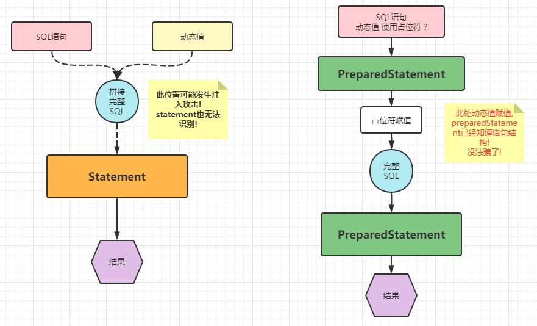
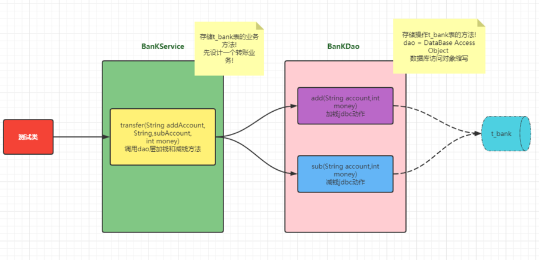
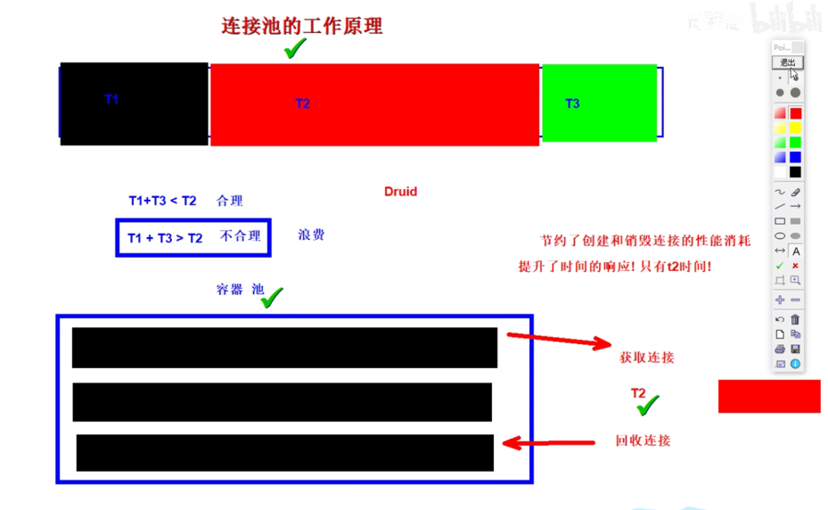
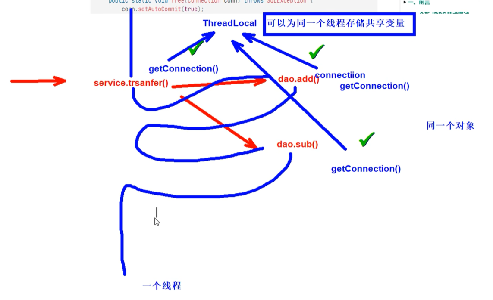

# 一、JDBC技术概念

## 一、JDBC技术概念和理解

- JDBC：Java Database Connectivity | Java连接数据库技术统称
- 在Java代码中，使用JDBC提供的方法，可以发送字符串类型的SQL语句到数据库管理软件（MySQL，Oracle等）,并且获取语句执行结果。进而实现数据库数据CRUD操作的技术
- JDBC规范和接口：java语言只提供规范（接口），规定数据库操作方法。标准的类库存在于java.sql.javax.sql下
- 第三方数据库厂商：各数据库厂商，根据Java的JDBC规范（接口）完成具体的实现驱动代码。实现代码可以不同，但是方法都相同
- 简而言之，JDBC是由Java提供的JDBC规范（接口）和各个数据库厂商实现驱动jar包两部分组成。JDBC技术是一种典型的面向接口编程
- JDBC优势：只需要掌握JDBC接口规定方法，即可操作所有数据库软件。项目中需要切换数据库，只需要更新第三方驱动jar包，不需要更改代码

## 二、JDBC核心API和使用路线

### 一、JDBC技术组成

1. jdk下jdbc规范接口, 存储在java.sql和javax.sql包中的api 
   -  为了项目代码的可移植性，可维护性，Sun公司从最初就制定了Java程序连接各种数据库的统一接口规范。这样的话，不管是连接哪一种DBMS软件，Java代码可以保持一致性 
2.  各个数据库厂商提供的驱动jar包 
   -  各个数据库厂商的DBMS软件各有不同，那么内部如何通过sql实现增、删、改、查等管理数据，只有这个数据库厂商自己更清楚，因此把接口规范的实现交给各个数据库厂商自己实现
   - jar包概念： java程序打成的一种压缩包格式，可以将这些jar包引入你的项目中，然后你可以使用这个java程序中类和方法以及属性了 

### 二、 涉及具体核心类和接口

- DriverManager获取连接；接着建立连接
- PreparedStatement发送sql语句；若是查询操作，则对应的查询结果放在Result中

#### 一、DriverManager

1. 将第三方数据库厂商的实现驱动jar注册到程序中
2. 可以根据数据库连接信息获取connection

#### 二、Connection

- 和数据库建立的连接,在连接对象上,可以多次执行数据库curd动作
- 可以获取statement和preparedstatement，callablestatement对象

#### 三、Statement

1. Statement：适合静态sql路线，没有动态值的
2. PreparedStatement：预编译sql，有动态值语句
3. CallStatement
4. 三者都是具体发送SQL语句到数据库管理软件的对象

#### 四、Result

1. Result为查询的结果，对查询语句才有
2. **面向对象思维的产物**(抽象成数据库的查询结果表)
3. 存储DQL查询数据库结果的对象
4. 需要我们进行解析,获取具体的数据库数据

### 三、JDBC API使用路线

![JDBC API使用路线](data:image/png;base64,iVBORw0KGgoAAAANSUhEUgAABhUAAAEXCAYAAACqHcVqAAAAAXNSR0IArs4c6QAAIABJREFUeF7snQd4lMXWxw8koSQECBBCaKFKVUAEASsqCBZQvHpR7N0PxYblIqJwETuCiqjYQCkWFKkqKmKjSpcOoQcSWgIJBELyPWdw9k4m87bNbrKb/N/n8cHsTv3NvO/unv+cc8pkZmbmES4QAAEQAAEQAAEQAAEQAAEQAAEQAAEQAAEQAAEQAAEQAAEQcCBQBqIC9ggIgAAIgAAIgAAIgAAIgAAIgAAIgAAIgAAIgAAIgAAIgIAbAhAV3FBCGRAAARAAARAAARAAARAAARAAARAAARAAARAAARAAARAAAYKogE0AAiAAAiAAAiAAAiAAAiAAAiAAAiAAAiAAAiAAAiAAAiDgigBEBVeYUAgEQAAEQAAEQAAEQAAEQAAEQAAEQAAEQAAEQAAEQAAEQACiAvYACIAACIAACIAACIAACIAACIAACIAACIAACIAACIAACICAKwIQFVxhQiEQAAEQAAEQAAEQAAEQAAEQAAEQAAEQAAEQAAEQAAEQAAGICtgDIAACIAACIAACIAACIAACIAACIAACIAACIAACIAACIAACrghAVHCFCYVAAARAAARAAARAAARAAARAAARAAARAAARAAARAAARAAAQgKmAPgAAIgAAIgAAIgAAIgAAIgAAIgAAIgAAIgAAIgAAIgAAIuCIAUcEVJhQCARAAARAAARAAARAAARAAARAAARAAARAAARAAARAAARCAqIA9AAIgAAIgAAIgAAIgAAIgAAIgAAIgAAIgAAIgAAIgAAIg4IoARAVXmFAIBEAABEAABEAABEAABEAABEAABEAABEAABEAABEAABEAAogL2AAiAAAiAAAiAAAiAAAiAAAiAAAiAAAiAAAiAAAiAAAiAgCsCEBVcYUIhEAABEAABEAABEAABEAABEAABEAABEAABEAABEAABEAABiArYAyAAAiAAAiAAAiAAAiAAAiAAAiAAAiAAAiAAAiAAAiAAAq4IQFRwhQmFQAAEQAAEQAAEQAAEQAAEQAAEQAAEQAAEQAAEQAAEQAAEICpgD4AACIAACIAACIAACIAACIAACIAACIAACIAACIAACIAACLgiAFHBFSYUAgEQAAEQAAEQAAEQAAEQAAEQAAEQAAEQAAEQAAEQAAEQgKiAPQACIAACIAACIAACIAACIAACIAACIAACIAACIAACIAACIOCKAEQFV5hQCARAAARAAARAAARAAARAAARAAARAAARAAARAAARAAARAAKIC9gAIgAAIgAAIgAAIgAAIgAAIgAAIgAAIgAAIgAAIgAAIgIArAhAVXGFCIRAAARAAARAAARAAARAAARAAARAAARAAARAAARAAARAAAYgK2AMgAAIgAAIgAAIgAAIgAAIgAAIgAAIgAAIgAAIgAAIgAAKuCEBUcIUJhUAABEAABEAABEAABEAABEAABEAABEAABEAABEAABEAABCAqYA+AAAiAQCkisCcrhX7ePY92Hd1NqcfSAjzzPMv25DtliMi6VICHg+ZAAARAAATClkBEmQiqHZNISZXqU68GV1FU2aiwnQsGDgIgAAIgAAIgAAIgAAIljQBEhZK2opgPCIAACFgQmJ/yG01Lnk7NqzajpNgkSqhYE6xAAARAAARAICQJnMw9SfuO7aO/D66lk3k5dEOj66hZ1TNCcqwYFAiAAAiAAAiAAAiAAAiUNgIQFUrbimO+IAACpZLAloyt9PaasdSzfg86J/7sUskAkwYBEAABEAhPAnN3/Uib0jfTU20HwmMhPJcQowYBEAABEAABEAABEChhBCAqlLAFxXRAAARAwETg9ZWjqEbFGnR10pUABAIgAAIgAAJhR+D9tR9Q0ypN6LpG14bd2DFgEAABEAABEAABEAABEChpBCAqlLQVxXxAAARAQCNw/NRx+s+iZ+n2ZrdSvUp1wQcEQAAEQAAEwo7A73v/pC3pW+jRswaE3dgxYBAAARAAARAAARAAARAoaQQgKpS0FcV8QAAEQEAjsDVjK721Ziw93e4JhI3A7gABEAABEAhLApvTt9AXW76i1zq/FJbjx6BBAARAAARAAARAAARAoCQRgKhQklYTcwEBEAABA4HNGVtozJp36dn2g8AHBEAABEAABMKSwPYjO+jTjRNpZJdXwnL8GDQIgAAIgAAIgAAIgAAIlCQCEBVK0mpiLiAAAiAAUQF7AARAAARAoAQSOC0qfEYju7xaAmeHKYEACIAACIAACIAACIBAeBGAqBBe64XRggAIgIBnAvBU8IwMFUAABEAABEKMAIsKEzZ+Rm9AVAixlcFwQAAEQAAEQAAEQAAESiMBiAqlcdUxZxAAgVJFAKJCqVpuTBYEQAAESiQBiAolclkxKRAAARAAARAAARAAgTAlAFEhTBcOwwYBEAABtwQgKrglhXIgAAIgAAKhSgCiQqiuDMYFAiAAAiAAAiAAAiBQGglAVCiNq445gwAIlCoCwRYVso9n0+hXRlHb9m2p+5WX52Mr36uREE933ndnqeKOyYIACBQfgY/e+4jm//QLDX91ONVLql98A0HPASMAUSFgKNEQCIAACIAACIAACIAACBSaAESFQiNEAyAAAiAQ2gSKU1RYvWI1vTbiVb8Nez/M+p527dpd4gQJL1yYwewZc2jYy8OocpXKvs2mtsEvDn5iMPW7rV8BYce0O7nunOmz6eEnH6HyFcoHdAN7mZuXjpnDir9W+DVmNjDXrVvHFRseU0Z6Bg15aghdcXXPAnV2bt9Br494nR4f9LjRWM1C2rh3xlHv63oFzJjNfXpZXy9cC1PWK1cvfXHb+/el+bXevAefHPAEPfrUo67XXB+b1X3H5eyEVLUdu3vBaT/zmn87dTrd83/3BOwe5T4njp/o9/PYy/oFoyxEhWBQRZsgAAIgAAIgAAIgAAIg4B8BiAr+cUMtEAABEAgJAsePH6dDhw5RpUqVKDY21jimYIgK0qg278d5xj6v73cD/avvv4RhdsPa9fnKdL2sq2tDIRsW+QonLwdpAE7dm5pv3syE5yHZ8ZtORn0747ZusPTSLo9x8vjJxOv3ypuv0pltzxRjlf3payYnopY1Lbw/ninSAGxqTzLj95yMsFY3pFsDsFrfTjhwIyqw587fa/4WxtuaCQnCk8fqXtHHbbo/7AzcRfkg4nG88fIbYs+c0fwM2rh+oxAN46pVyyd62a1ps5bNCwhk+hzkPTRw0BO+vel2nlb3n6m+1VhM+1jdf9yWlXeW2o/dnnXaz3IerVq3Es+J1H37hLCkP1esuOiCij/3pto2P4tXLV/luHZu18mfcuEiKuTk5NDBgwcpMjKS4uLiqEyZMv5MF3VAIOQIHDlyhI4ePUrVqlWj8uUDeyAh5CaLAYUEATxPQ2IZXA9ixowZtGPHDurfv7+vDv9WHTFiBF1zzTV09tlnu24LBUEABMKDAESF8FgnjBIEQAAEfASysrJo7ty5tGvXLuL/l1e5cuUoPj6eLr30UkpISPC9HgxRQV0Ok9FWGqfPaneWTxCQhkYnw7Rs26sRLC8vj9atWUvffvUtLVu6jI4eOUpx1eKo0/md6YabrqdatRML7KLMzExhrJ47Zy4lb0kWRqCmzZpSj6t70oWXXEgVKlTw1XFrtDcZnVVxxIvB1c7w6GTcVid76tQpmjR+ElWpUpmu7tPLZ+TSjdVy3e66/658xlzT69LAXJhb0+1e4D6cjLBW47ATZqzqyL6uveFaGj5kuGtDri4c7dmTYvQw+fDdD10bZ52EHtMcpEH55MmT9N6b71LHLudSx84dC7NUgr/plLvpPuU9bpqj/rqTOOlmwKowoAoKduKFvAdV0UrtSxc19Dm6EarUMtw2izFuL3lfyHFcdOnFBYRVr4Kr3XPHNK6atWoW8GgojPeI27nblQtlUSE3N5d+/fVX2rhxI6Wnp/umUbZsWapevTp17NiRWrZsGQgMaAMEipTA3r176eeff6a0tDQ6ceKEr+/o6GiqV68eXXbZZcT/jwsEAkUAz9NAkSyadg4fPkyPPfYY/f333/k6rFWrFo0ePZpWr15Nw4cP973XqlUrGjlyJFWtWtV2gGPGjKH69evT1VdfXSQTYUGEL+5v27Zt9PDDDxM//+yuW2+9NZ+AwmV53HypwkqRTACdgEAxEYCoUEzg0S0IgAAI+EOAhYTp06dT5cqVqX379sRf2FhIYCNGSkoKrVu3jjZt2kSXXHIJtW3bVnQRLFHBykjFxqg+N1xHBw4c8BnCrE4e+2MwVblJw1fd+vWEMPDWa29SQmICdejUkaJjomnvnhRavGAxRUVF0ZPPPiXyPsiLT1mPfPF1OrD/AF3Woxu1O6cd5ZzMoQW/L6Bff55PDRs3pIHPPEF169cVVQIhKnB4Ij7hrBubTW3rzNig1+HcDj5jvxQVuna7hN59c2y+7aQbBHmtpnw6hQY+M1AILVaXF1FBb8Mf473TPeDm1Dkb0Fu0buHpFLfer2qAdjIYuxVzmMe7o8cSCxNNm5/h69JrSC8vxmPT2Ddv3EwfjBlHjz8zkOJrxjshN77v1XPArahg6szf8Fm6Ad6UU0EVMewELV3A0u8Lpz3C83LaJ25FMuYx/+f5dOtdt/rCn8n+e/a6wpUnh9V9bbUZrMbudR/4tdlsKoWqqMAnt7/99ltiw0qXLl2odu3a4rOZDbD8ubx9+3ZatGgRtWnTRnw2R0RE+IVGnvb8/vvvC9QfPHiwo+GFjSTDhg2jIUOGUIMGDfwag10laVi69tprLcfCRpsPPvhAGJqCMYaAT6qUN7hs2TKaN28eNW/eXPzH+7pKlSpCYOC9vXTpUuLDGb169aI6deoUmpbJOOlmbxe64wA3wPdqcnIytWjRQrQMI6N7wEX1PJUj4j3+wAMP5Bvg2LFj852o19fTzWz4ectGcyfDuZu2glXGn3nJsUij+3PPPZePle6pwH8vWbKEBg0aJA5qub0XisK7QT5vHnzwQTEH+Tf/vlYFAZ4rf2bxXJ3W05/PWTefncHaA2iXfOuui2LMRgpjRfV9Rd8/hblHi3JtISoUJW30BQIgAAKFIMA/UL755hu68MIL6fzzzyc+AWm61qxZQ7NmzaJ27dqJcsESFWTfdp4KVmF03IRAEafop88W3VjFr5djYGFg6KChVL9Bfer/aH+qWLGiD01aahq9NPQliourKgyr/F7K7hQaOuh5YaR7YvCTBYyt7LXwwpDhVCM+np5+7mmqGlc1IKICx/Xn094cEuOss9v4RBdTeBvVmMzGvHFjxokwV3oYHdOJYnVfHDt2jF5/4TVxUl1PpK3vH6swO26MksE+xWxl6DXlPVDnJcK2LFsp1ppFIjUvhen+cTIGO71vatOtV4du6Jbr7mbc3K/pXmQvFRYVqlStQv++pa9foVi8rK2dh5GV2CCZ+StMWRn5JXf2SOB7j70FnJ49prbcnvJXQ1c5iQZO7+v7yK1Xh2l+XoUsuz3uZS8U4uPOWDUURQU2gH3yySfUsGFDuuqqq/J99qiT4NOOX3/9tQgZ07evf/ehNLJ06NAhn9HeyhASaP5O7clx8KEHPr2ph7ngH8ujRo2ijIyMoAkbTmPE++4J/Pbbb7Rq1Sqx11hQMF3yRPnvv/9Offr0KZRQxMZHPs2sGnRDZW+7p0ZkdZ96aaO0li3K5ykz5j3Hv6vUU/PSWH733XeLve/PerJQ8fbbb7s6jV9ca+3PvORY+b4cOnSoOMkvja0sFkyYMCHfdFhkT0xMpHvvvVcY402hkay8HJy4mDwEnOro7+uiAr9vmhuv57Rp03zCiFU/dsK/Xkf31jD163U+KO8fAdM+kC0V9UEIVVRgQYPDhunf+fybZXBrQVQILl+0DgIgAAIBIcBfVD788EO6+OKLxYeL07Vv3z56//33qV+/fnQ0OpPGrHmXnm0/yKmaX+87ndrV33cyLPIg1BOxSQ2TRG4GPSSPOlinRLbTvppG382YQ8+NeJ5q1a5Fn386hebMnENDXx5GDRqaT2z+tfgvISzced9ddNW1V3kSFUyxz9ngyD+Y7ul/jxg6l+GY8XxxUlnVoKwzMiXEdWPo57aXLlpKH7wzjp5/aSjVSqzly5ug83QKT8Vj+HLiF2K8uuHSrdGV6zqJIFabUDdmujFA68ms7RIsy3712PFu5+YmlJPVCXPTWjrdVyZOVnV4Dm+9/hYNfWkoJdYpGAbM7sa32mdW97Fd7H3dM0kPP6TuMaeHkdvcLKqg46aOnuTZxNRpbUzh39zMzUnwkEysxCbTmvgjgtnV8deTxGk93bwfiqLC559/LoQEFgqcLg5HxoYX9iLkcEheLzsjkNWpUa99FKa8/GF++eWXE4vZt99+e77m+Mc5h2xkT4tgeUsUZvyo+z8Cu3fvpilTpghjoBpO04rR4sWLRfgvNsRyKE6vl93+DYW97WU+hTHWeumnJJYNleeperqeOXs17JV0UcEuLJEuHJjEBmbqdAJcrgE/f+6666584WgDtfftjMluBALdi8okUpnGauX5YBJdAjVXtGNNwM0+KCrDPkQF7FQQAAEQAIGgEeATEmyQuO2221z38csvv4hTZhdcdyG9u25cQEUFp7A0qvHOq6hgCrHhFHroSMYRemHIC8Kj4L4B9wlPAKsr8+hRGjFkBNVMTKD+j/SnyKhIY1FZjk94c6JUvjh0EV92CZZVg9y6NetoxV8rjOVVY6dukNZPtpuMoW5EBT6l/v7b74swHHKuO3fspD/m/0Hjx31Cst35P/1ijJfvZrPJ9dKT9Zrq6sZKN+GvZH4Ar6KCyfhpMvaq45Tv82vDXh4mvBqcRDB1HTh5sZqUWV9XLvvaC68KYaleUn1f16a1lPNlQ7Me3kods2qYtzJ2px9Op6H/eZ4u6X6pEMi8XFbzX7JwCc374WfhOcNrxHH/3dwfVn2rXgVOidntTvnre0oa6rlfNXG86Z5SvQHkvjMZ2J1EBVPOBqcwVirn9MOHfeG8TEIDl50zfXaB54q+VpIFz5W9xuyShat71U5UcPPc8bK/vJQNNVFhxYoV9Mcff9BDDz3k2uCxc+dOGj9+vPgs51wLXi4nY6UaVkIaLTjkEp/8ZkM/HzJ4+eWXhUGfvRn50kM8qOGR9JjS6slQeaqyU6dO4jQun7rk0BB8epUNy3xy/YYbbvCdYuXyXI4TdfIJXikqmAw36glO+QObx/7mm2/64lurp9lNsa/1U6zyFDzPmdtnj8+tW7f6Tp7q41DHYJqrm3jgXtY2lMryd82PPvpIhNhkTm4vrhMbG0tXXnml2yq+cnqIFKcG9JA1qnFPtiXXUK65XDNpQOI9NXHiRF8ceN1AaNcHt6m/z3uOjZ9sgJYhyvi+47AvfChIvd+c7i2OT+80PidG4fZ+cT1P2WhtFftefy7I9WTPMz3evnzm6PtCPqvcrDm3P2nSJPGcM+UjkP3LfG92bdo9Ozm/j2mfqnnkrPaPySBuCiEl68v5qyfx2WtB93RQ+1NFGX5OL1iwwHKNdE8HkweAmu+B5z1z5kyxfjwOfo/DH/Elw2DpzwKTiKK/5uVEu5Wo4E/opHC7z0NxvHaigik0ld19x/NTv2/w3+p+MoX/0r+78fewp556Snw+6Z8lbu7R4mAMT4XioI4+QQAEQMADAT7Zxx84/AOjSZMmrmtmZ2fTSy+9RB2vPJemHZ4RUFHBaRD+hnuRcdA5JwMbUvWTzHYG7DWr1tCrw1+hg/sPUqszW1GnCzpTq9YtqWHjRvmEA9lGz6uvoL63WJ8u5cTPH479kLhdNjBz2AqvRlM746fdyX/J18oIze87hUNhdr379KYhTw+hq6+5SiSfVi83J/2d1lmyrJ9Un44cOeqYfNjOWOl0olo3ylqNX3LhvBWdzuskxBNpIJbzkUZf3bAs961qyPXHU8HK8Go1R728W2HKLRPOFTJm1BghTA4YOMDTSVKncDeBOLkuk0DrYcGs9p9+XzndS6b7UBdG+X7hnCXsNcSXlZil3nuco0UPKabel+rzyx9PBStBx+q5opeX5e5/+AGR38M0XtNetVtTJ0HF6ZlRmPdDTVRgIyqHheFEtV4u9iLkkBCXXnqpl2qOYThUw6w0enXv3t1njFENFgcPHhRGHTW3gVp/7dq1+d6XxjVpgJM/tOvWreszzKs/zPmkO18ywSYbidgwxAZnVbjQf2Dr4W7kj3cWR2RMbvU0KPchjUIy3JI0cEljFv+tzlW+Lw10PDduQ80FYepDnaunhQuzwhs2bBBGEeYdGWk+dGGaEicpnzx5sjDWefVWcBtnXRps1LwcergaadCRhhyrvcttSaFB3yP6iWPdsKTvMfX9bt26FTjZrs7Pqq6M4y7bshtfmG0pV8Mt6ucpD0o1hludnNfFXJMB0vTMUcMf6fvLzZ6UJ/zlPjbtQfW5prfp9Oxk46RXDwx5/+3YscNVEmKn0EYm5vL+VQUUK88Pk9Cu3ms6M/k35/zjzz5VVJCfH7pYwH2woK2K5MxBLSc/W1mc4HU3xeZX52MlKhRFHglXN2MpK+QU/kgNkeZ0L+t7VReK3IoKfPAC4Y9K2UbEdEEABEAgmAT4ZCO7oT/99NPCsO3leuedd6has+o0L+/XgIsKVt4K+slaN54K0uCmGn/tYrOrp5HVE7acMHDhbwvo57nzaM3K1eKEPv+4vaLXFXTDLf8WHgxOoZJUvmqy15oJCa5EBTU0ycLfFxTwVDCdyJbzNxm5eTzScGkSa+zCCW3ZtIUGD3yGBg19xjGhqxshSO1L5ZhYp7bPGOu0P63GayfA2OXtkDkVrJLw2okncg48Zs7FMfObmdStZ3ea+vlUvzwVzmx7ppi+aqiV4bus8ouYeKn3gZMwxfXlyX67U+ScqHvhHwsdhR99PE4n7NXyTkKXLKvnHuA8I8NfHU5zv/vRF2LLaR+5CWUk23CTv0A/1c8GePa+4ETv7AEl15bbtDOsy/wFsm+5Nk4cTQKC+tr25O2u7zHuW73P7MZrJSp8+O6Hxr1i91x2WrPCvh9KogKLzq+//rowNFjFm7ea7+zZsyk1NVXU9XI5eSqYRAU1iaadW73etulkplpfGmNUQ7z6w7xatWr0xRdf0IABA3zJOTt37kz8ulOyaP3UHhupreZhSp6ojkOeyNVDF3AfHCaSDecsoOjxslUeF1xwQQHRwcu6hVtZ9r7ZsmUL3X///Z6Gzt+/XnvtNbrxxhuJBRgvl104FbUdq3tA3ftz584tECdffd8kIpn2DHvVqHlBVGMRnyAV3xv69y8wTSdDp8mopLbNDeoil53RywvnUC1bHM9TycLJW8rpucvt6OujGxb9eZ7qbXh9RvO47J6d/hosre5V/XQ292/ybpMeArqngi4Gqs9oFkDshGz1c0jd4yYPKNUobCcqcOJ5PYG31f1j8sZQP5v0nAx2iZ/dPgtD9V4Ox3HZiV+654vTvbx69eoCnz8qE4gK4bhDMGYQAAEQCBECp/JO0ancU5STl0P8/zm5OZSjvibf++ff0++dLrNz3Q46tOmgCLHAYRPcXhdddJEIf5SSs5eWVV4ZFFFBj1FvMozZiQpsdOfkqW7i0budtyzHoX9S96bS/J/n0/Sp31Ld+nXp6ef+QxzWiPMZBMtTQRcVeH7qpXtfqO+pIga//u3U6XTP/91D5SuYxSQnYymvx3NPD6EXR74o8iColym+v53hU42VL7025MlnpxBBsl83J/WlEV5NwGwyfKqvLVm0hDiEExum1bBCXvYMzyFl9x5igUQ1qDrNzWlsqjHay3hk2UCJCtIbwCsjJ2O4Ht/fTtjQw0/p+8GpLzsmbkJpmfhLEZRDDvH9dutdt1qe6pf17Yz0LN6cd2EXIZDwFShRwSnBuN3eKmmigpv7qEnlxm6K+V0m92guHf8tk5544gn68ssvXbeTlJQkDOuzv5tDAx58yHU9Luhk3NJFBd14r5+YsyovjU3S7V4dpDxZajLG6IZZebqTy/KJcDaUchmTqKAbpKQxyhQOwvSayTDIhp5GjRoV8GTg+ehGaE4QbLr4lLAUFfgUqp582tMC2hQ+mH2I/vvXCFfNBX1vr8yhVoktqXXr1jR//nxXY+JCHNJr1OhR1LFDR5E3xMvl1lPByriuGuk4wfSSJUvyJVU1iQrqeqrtyj1jOm3MBqYXX3xRnFK2irFtJyrI8EimZOvSyOp0bwVyD07e/DktTl3quFRB33PF8Dy1mrTuycTlTCf6rZ45vD6qICA9Arw+T+1EBekNY9cmj9vuM8AfUcHuJL2eD0D/2yr8EXvNsfFeDznE47cy4LIwIb3XWESUz2+TAZjbUcU/fRy6p1thjPpq23aigl3i5+LKq8CfP/w55HQF+1lg1f/mjC1OQxPvc/7IauWtQyCbGjF9rpjCWdnl2dC/G8nPD1MoLX1PmsIfwVPB1XKjEAiAAAiEL4FjOccoMyeTMk9m/fNvJmXmyP//32tZymssJLi5IspEUGTZCIooE+n7t1xKJNXYV40GPDSAOE+C24u/0KxZs4Z2n9gTNFHBlJDYH08F05ys4oazgWzcO+Oo93W9XBuQ2WuB46n3f/RB6ti5Iz3/n+eFyPDgYw9SVFSUEWlhciqMGzOOBj7zBOmeCk6GTyk4mMqZTvhbxVCXBnm7MCYmjw1TPguG45TE2cnwLgFbiQr6Wushd0z1rMaqL6Y8Oa7H6WfGHBKGQ8OoBlt9LoEMf+T23lXLhbqoYBIr+LXZM+YUOOlul8SZ51wYUcGOrZP4ptZVDfCdzu+cLw+Dm/WTAqk+l0CGP3IzDqs56eGawtFToUe9bl4RBLx89pFs2jBrPT3++OO0dKmzUU4dQI0aNWjWnFn0UP/AigqmcAxqQmTdGK/+zafrZEgLUwxhHaDpR7j+Gv8o54tPfMqY2KZQABMmTBB5DmQoGqsf2NJIY/KY4B/wUogwGYh1QUA1MnO8e+m1YIpXXBSnxFOPpdHy/csDvk8GjtRuAAAgAElEQVT9aXD3wl3UoHoDISowa7fXxRdfTG++9SZ1OKeDMPh5uZxyKsi9bSXwqAbYwooKLPrpJ7zVuTiJe/6ICqY9bSV6BFJU+H7nD16WKWhli+N5ajcZ9TS7bnxXTzWbnjm6qMD96J4nbp6ndqKCG+8pJ0E2GKKCLs4yn/r16/uM/uq8nRI1e91s6rrIzxN+FuihmryICk7hm0z5G0y5InQRIRRFhVB5Fnhdd718uxrtqGbFeE/NWH3G8+fODz/84AsT6ea7kdqxelhCigvwVPC0NCgMAiAAAuFBQIgBJzMpSxUJ/nktv3BwWizgcrl5eb7JlSsbRTFRMRQTGUMxUdH//Mt/n/7/6KgYqhQZQ1ERURRZJoIiykae/tcnGqivRVDZMmULgEtJSaHPPvtMnLqyMoBb0R43bhxVbRpHP+bMK1JPhccHPU7sxWAV8kUVHtRwGt16XCbqcf3y5SvQzG9nFjiBzuW/+fIbmjNjtu9k+sSPP6M/f19Aw14aRtXjCya/TNmdQs8+OZhuuOkG6nZFd/r80yk0c9pMev6lodTkjNN5KkRywrEfUqOmjeniyy6mVctX0QtDhtOd990lkts6JYuWa2AX/sjuFLdqhHSb/Fg1rHP/HA9eDQtj56lgFStfhkGSxlH9b9NeK4yoYPKY0AUDu5j4Awc9IULTqGGOVG8DPoE+efxk4hwLMvkyz4HLT/hwAm3euDnf6yZRwSoUjGyHBau77r/LFyLHtM5uwkuZQvqEgqiwf1+aMdm4m7wWaj4SfQ30vRQoUUEXqVSGqfv2CU8luW/0MbjJGeCmjElU4L6sklA7hT9i4ctteCk9h0gwPBVM+RmC/akfSuGPeK6jRo0SIYy85Drienyyko3Yffr08YTMzphpJxiYjPH8mmyPT2b/+uuvIlklG8T02NymQboRFXhMHAKJL847wW07GU9NccHtTtvyKVc1djn3JWOJc8gkN+GPTOFy1DkXhajgaSMEufDixYtp8+bNIuG2lysnJ4deeOEFuuWWW0QsaC+XHWM366l7ngTCU8EqpArPy86zIlDhj4pCVPCyRsEuW9TPUz02ujo/u1Bxpvj+6h618lSwSwht2v9uPBXs2gymqGDy0vHXU4E/i9zMn9fHyhPA6nnNr5s+H+RnilNOBbv+TCGM7EQIPUeEHnJPzqEwnhLBvkdLavtWnz96yC2eP3st2d13Jkb6IQYuI71n7L7z+CP8FdcaIVFzcZFHvyAAAkElcOLUCeHGdyj7kPhX/v/h7MOKV0FmvjG4FQiio6KFUMBiQlRZ8yn3QE4uNzdXnOC78847PcWp5RilfGqkc68u9GXa10UqKqjGW6ecCuppeuamh1RST5qrhjr1hPS+vak09D/PU+9/XUM333mziOEsLw6DNGvaTPpk3Cc0/LUXqGXrlpSWmibKR8dE0xODn6T4mvHEvDZt2ETvvDGGIiIjaX9aGiXWrk1PP/e0iKlelKKC2/2jGxn1MFIyp8JTQ54WSVrl5ZSkWTWA2+VskO25Pc3P5fX2VIMvJxdnA70Uo9jIbpVk1iQ8yNPxHH9eFwJ479StW0fEyeeE29Ioqp+eD6aosOKvFUbjPHOxEg+cxAg1nFYwcipYeR3wmN0k9J334zyxTdzkQHBzml/uOav2ZBu33XM7XXv9tSJ0mL7H5s2dJxLBm/a2G8HATZlgigpWBn2rcbkRI9Rnh51IaLfH3D63/C0XaqLCpEmTRD6F888/39OU+GQ+/1j0Ws9KVJA/fGWiVx6Mk0FJCg0y1Id+4lJPPMptOiVI1n+Yy7+5rvRCcMrLIJOTug1/pCecVo06XhM16/zkaXWrEEqeFj2MCvMaTZ06VYQjKVOmjOuR84ngTz75RJzKLlu24AEZp4bkqU65blzetLf1sBSmRM2FERXYKGwKfaHn4dATnatCgy46qH+7TdRc2kSF4nqe7tq1y/d8knvUaf3UtTc9c/Tnrz/PU6ecCk5t8ricQuC5DTum3rtW4Xm85FTQc+HoRlf2brj66qvziQhSQOb7gvmzaCyfzaoAaAo9JY3A8jN05cqVjomaec6c0JnL8meBPmYrUcHkqaA/+6w8FZCo2elTIjjv24napiTsHK5L/ZxSvxuxd4ya2Fn/3qZ/tsj2rb7z+HOPBoeSfasQFYqDOvoEARAoNAEOQSQFA104YAGBvQ/44pP/ceXjRHy90/9WzedBUNQCgb8T/+mnn+jQoUPiBJjbH3kcKmn9+vVCVHhn7XtBERX8CX+kMtCTflqFx+E6JoOZNNzddvdtNGn8JJr0yUSqFFtJhDiqVTuRsjKzaMnCxbR752666fZ+dNNtN1FERIQYwsb1G2nki6/Tgf0H6LIe3ajdOe0o52QOLfh9Af343VxhjPzP84Po3C7nivKy/61btlKn8zoJ4UG9OCH0ZT0uo6zMTHIKf6SeapdtmE5p62GQ9BPI0oCqG0elF8Lt995Bw4cMp0u6X0LX/Osa33DtjMFcSBcJnHJe+OupoM9P9WCRbV737+vog7HjCuRLUPdKlapVhRihhn2y8i7QjaJuRC/2AHG6VEZqH1xvzvTZIqcFiyUPP/mIMUeGnahgJ0ao47K6f3hfjxk1RhTt/0h/iozKv3ft5mYXZsrK20Xd019OPH1SWQ+LZuqzMJ4Kdt49Vmzl/WPynLI7ie+vqCBZWPHWGan31VdTvqLq1auLPeSvqODWu8DOO8bp2eF0nxTm/VATFTiZLbvG8w/M6OhoV1NjQ8Tnn39Ot99+O8XGxrqqIwvZxfPV4/a6FRVMRlvZn/yxK/9WhQc3ngpcT/9BbPKoYIPN3r17RTcyXIb8Ue7GMKYbs9544w367rvv8p0mVMvwPC688ELaunWrL+6+6YSpmnxTj7vtaeHCrDAfZGHvWObEYVbcXHwog8UyDu3VtWtXN1WMZaRAIPcDFzLFWtf3plrGFErJS04FGV5I31fqSWMelz4GNSmtLtbpiZ31eeoJbfX9Vhq8ZYr6eSo3oMkYru85fT3ZcKiG+tGfOeqzWrbl9XnqJCqY9qD6jHbzGWAlKtvdwCZPDS7vxVNBNdCbQuJJUUEdhx4Wb/To0UJY4HtD/QzRwyrpn5vXXXed+G3MoQGtPBX4Wcb3ZL9+/YRIasqvwmPTxXg3Dz4vHodu2kOZwhOwe77qQhTvXbt7WX7v4T0kL/X5rr/P78mLvResBEl/9lrhybhvAaKCe1YoCQIgUIQEWBQweRrI11hU4Iu9C1gs8AkHFf4nIPBrVctVKcJRB68rPm3PH1CNGzemHj16OHbEX4CmT58uDBf7yxygt9eMDYqo4E+iZnXwejx2OwOm0wnZvNw8Wrl8Jc38ZgatXbOWDh08RGzob93mTLqubx9q1/5sKlM2/6k7/rLABt+5c+ZS8pZkioyMpKbNmhLHHT+4/wDN+GYG3XHvHdS1+yWUeypXnHCXJ6/1RZCGfX6dRYV7Hrw3XwgoNhjKsFBOooI8nW4yxEpGnISa3x80dBB98t7HYlwsOsg48Gxgv7THZfT+2++LcBYyf4Sdx4VJpFAFBl3UkAz8FRWcNrKdR4V6gp4NrhyuSnrIOOWS0PetOo5AeiqwAVjui3Vr1pE/ngpOjOzGLt87kHaAhjw9hHr36SX2ttfLZOw35eTgdlWhSPUmsBLA1LH4Kyo4ed7YiR/6M8eNYOCmTKA8FaSgZee1Ixm6GZebtbdbBychyU37/pYJNVGB58Ghc1JTU0WSWv68sbv4pCWHJGTj5BlnnOEvBtQLAIHiSoYZgKEXSRNsZGGvAz4B3KJFC8c+Z8+eTdu3b6ebb77Zd3DDsRIKgIBGAM/T0N8SVqfp5TP1yiuv9Bn5WZiVOUpYKNSFOdNsdYOtLBOoHAwmsUX2oYc78hr+yDQfk2hlxQGfS6G//zFCMwGICtgZIAACxUIgJzeHUrJSaP/xAwVCFLFwwOGL+KoYWVHxMjgtHqieB5WiYopl/MXRKRskvvrqK4qLixM/9CpXrlxgGJwXgE9OsrvmVVddJWI9b8nYGrKigomjXQgUNyFUArU2MhzStC+n0S133kKJdRIdm1YNqiZBwG2iZlNH0rhvFY5IDZOj9s2G7Pfffo+eHT5EzEE3BqsihZVowONRQ6jYnahWkx7r8/B6ylk3YOqhgKw8KJzCvaghg0xjZC8Hp7wgpjWSayM9J7iMFDqcwhhx2cLsbzuxaOmipUJcGvrSUFf7WJ+byQNCFwTl/JzCZan7TV8Ht6KCG8O2272iz9WNYd5NGTmXDud2ELlOvFxyH7A3FdeVnJz2tezD7j52GoeVWMT13CZHd+rD3/dDUVTgOPIcKoaND5wjISkpyTi9RYsW0Y8//kgci9pr2CN/eaEeGfND6PHPwclMYNOmTTRr1ixq164ddevWTRy60C/e9xwbnP+9/vrrxfdTXCDgLwE8T/0lV7T1TKF/inYE/vdmJyr432rha7rJF1H4XtACCASHAESF4HBFqyAAAgoBFg5YQNiTmUIpWXtpT1YKpR1LEyVio2IVkaAqVauQXzSoEPG/2PiASsRfuOfPny9cMZs2bSriMtesWVOERuJTIOw+zD/q2JtBig5FISrwKew3Xn5DLJE0aFkZuUvzOrpN1BxIRseOHaPXX3iN2rZvJxJOB+Oy8lQwGUHtDPrq2LwKEIGal1uvC7v+9ETBXNYupIyb99X+VMO8+rpJlGCh8e2Rb1NiYi369y19XYdP0+fnxpBf2DWwEhVM83UKyeXvWNwIBm7KuBVI7MYp84BI7xKnfp3e1/uyErqsRImi2AN2PEJRVJDjXbVqFc2bN484bEPt2rUpMTFRGLT5c5lPcPP/9+zZ01NeJH/3MOrlJ2AX2gis7AlkZGSIUFLMkD1l+TsnhwzhROO8t1l4aN26NV100UVG0QF8QcAfAnie+kOtaOuY8o4U7Qj86y0URQX5GWWXHN6/2aIWCBQNAYgKRcMZvYBAqSCQlZMlBIOUzNPCAQsJKZkpdCL3JLE4UDsmkRKjE8W/tfnf6EQqF2EfLqBUgPNjkhxugQUETjCWkpIi3Evr1asnDBoNGzbM12KwRAU/ho0qxUSAjdxTPp1CA58ZSHHVcJKwmJahWLrdvHEzjR09lgYOGuiXl4IctDRY79mT4vO+KJYJodNiIaAnNC+OQYSyqMA8jhw5Qhs3bqTdu3fTzp07qUKFCuIzuW7duuIQgOmkd3FwRJ8g4JVAcnIycSJm/o8PsbBoxvuahQY+2IILBAJNAM/TQBNFeyAAAiAQHAIQFYLDFa2CQIkmkEd5BYSDPVl7Kf1Euph3zYo18wkHiTGJIoQRruIhAFGheLiHUq+ck4MTWVepUpmu7tPL79PqoTQnjMWZAHspvPfmu9Tm7LZ0QVd3CTedW0UJECgeAqEuKhQPFfQKAiAAAiAAAiAAAiAAAsVDAKJC8XBHryAQNgQ4YfL2ozt8HgjC+yBrrxh/TFSMz+OAhQPhfRCTSBFlIsJmfqVhoBAVSsMqY44gAAIgULIJQFQo2euL2YEACIAACIAACIAACIQXAYgK4bVeGC0IBJ0ACwbbjmyj5CPbaVvGNko7vl/0yYKBKhzw35XLFUwUHPQBogPPBCAqeEaGCiAAAiAAAiFGAKJCiC0IhgMCIAACIAACIAACIFCqCUBUKNXLj8mXdgInTp2g5CPbaBsLCP8ICdmnsqlyuVhqENuAGsQmUcN//i3trMJ5/hAVwnn1MHYQAAEQAAEmAFEB+wAEQAAEQAAEQAAEQAAEQocARIXQWQuMBASCTmD/8QP/80I4so32ZKaIPuvE1PaJBywmVK9QLehjQQdFRwCiQtGxRk8gAAIgAALBIQBRIThc0SoIgAAIgAAIgAAIgAAI+EMAooI/1FAHBMKAQF5eXgEvhKMnj1LFiArUoHJ+L4SoslFhMCMM0V8CEBX8JYd6IAACIAACoUIAokKorATGAQIgAAIgAAIgAAIgAAJEEBWwC0CghBDIzculDYc30ob0TcIbgX9881WzYs1/whgliZBGtaITSsiMMQ23BCAquCWFciAAAiAAAqFKAKJCqK4MxgUCIAACIAACIAACIFAaCUBUKI2rjjmXGAKpx1KFkLDu8AZad2i9mFeTyo2pQeXTAkLD2CSKjowuMfPFRPwjAFHBP26oBQIgAAIgEDoEICqEzlpgJCAAAiAAAiAAAiAAAiAAUQF7AATCiMDxU8eJDcQbDm8SIsL+4/sprnwcNat6BrWo2oxaxDUnhDIKowUtoqHuytxNr68cRY+d9TDFRMUUUa/oBgRAAARAAAQCR2DtoXU0Z8d39ELHYYFrFC2BAAiAAAiAAAiAAAiAAAj4RQCigl/YUAkEio7AzqO7hJCwMf20kBBRJoIaV25Ezao2peZxzal2dGLRDQY9hS2Bxxc8RX2b3CD2Di4QAAEQAAEQCDcC83b/QnuP7aP+re4Pt6FjvCAAAiAAAiAAAiAAAiBQ4ghAVChxS4oJhTuBjBMZQkSQHgnsjZAQnXBaSKjSFN4I4b7AxTT+TzZMoMMn0unWM24uphGgWxAAARAAARDwj8Dh7MP07tpx1LP+5dS19kX+NYJaIAACIAACIAACIAACIAACASMAUSFgKNEQCPhPQIoIW9JPeyRUjKwoRAT+74yqTeGN4D9a1PyHQPqJDHplxevUtEoTurxeNyofUR5sQAAEQAAEQCDkCaRk7aUfdv5IFSLL0wMt7w358WKAIAACIAACIAACIAACIFAaCEBUKA2rjDmGJAEWEv4+uJb+PrSWUo+lUf1K9fIJCciNEJLLFtaD2pqRTN8kf0tHTh6h2jG1Kb5CfFjPB4MHARAAARAouQRy8nJoX9Y+4bnZtkYb6tPwGoqNqlRyJ4yZgQAIgAAIgAAIgAAIgEAYEYCoEEaLhaGGPwHOj7Du8HohJuw4ulMkWG4Z10L8m1CxZvhPEDMICwJ/7ltIuzN3076s1LAYLwYJAsEiUOafhvOIqAzJv/jF06/gAgEQKD4CZcuUpbqV6lCdmDp0do22xTcQ9AwCIAACIAACIAACIAACIFCAAEQFbAoQCDKB/ccP0OqDa2j94Q208fAmalKlsRASWsY1p4SKCUHuHc2DAAiAAAiAAAiAAAiAAAiAAAiAAAiAAAiAAAiAQOAIQFQIHEu0BAI+Apk5WbTqwCpad2g9rT20XoQ2ahHXXIgJdWJqgxQIgAAIgAAIgAAIgAAIgAAIgAAIgAAIgAAIgAAIhCUBiAphuWwYdCgSyM3LpVUHVtPKA6tpU/pmqlYh7h+PhBZCVMAFAiAAAiAAAiAAAiAAAiAAAiAAAiAAAiAAAiAAAuFOAKJCuK8gxl/sBDYc3kgrD6wSCZdjIitRq39CGzWs3LDYx4YBgAAIgAAIgAAIgAAIgAAIgAAIgAAIgAAIgAAIgEAgCUBUCCRNtFVqCOzN2ktL0v4SXgmn8k5Rm+pnUqu4ltS0SpNSwwATBQEQAAEQAAEQAAEQAAEQAAEQAAEQAAEQAAEQKH0EICqUvjXHjAtBgMMbLU5dKrwS2sefTWfXaCtCHOECARAAARAAARAAARAAARAAARAAARAAARAAARAAgdJAAKJCaVhlzLFQBA4cP0jL9y8XYgJf59RsTx1rdqCq5aoUql1UBgEQAAEQAAEQAAEQAAEQAAEQAAEQAAEQAAEQAIFwIwBRIdxWDOMtMgLrDq+n5WkrRJgjDm3EYkLb6mcVWf/oCARAAARAAARAAARAAARAAARAAARAAARAAARAAARCjQBEhVBbEYynWAlknMig5QdWCjEh/WQGtaveRogJtaMTi3Vc6BwEQAAEQAAEQAAEQAAEQAAEQAAEQAAEQAAEQAAEQoEARIVQWAWModgJbE7f8o+YsJzqxdbziQmRZSKLfWwYAAiAAAiAAAiAAAiAAAiAAAiAAAiAAAiAAAiAAAiECgGICqGyEhhHsRDghMsL9i6i7Ud3UNsabYSY0Khyw2IZCzoFARAAARAAARAAARAAARAAARAAARAAARAAARAAgVAnAFEh1FcI4wsKASkm7MzcRV0SzqXOCZ2ocrnKQekLjYIACIAACIAACIAACIAACIAACIAACIAACIAACIBASSEAUaGkrCTm4YoAxARXmFAIBEAABEAABEAABEAABEAABEAABEAABEAABEAABIwEICpgY5QKAhATSsUyY5IgAAIgAAIgAAIgAAIgAAIgAAIgAAIgAAIgAAJBJgBRIciA0XzxEoCYULz80TsIgAAIgAAIgAAIgAAIgAAIgAAIgAAIgAAIgEDJIgBRoWStJ2bzDwGICdgKIAACIAACIAACIAACIAACIAACIAACIAACIAACIBB4AhAVAs8ULRYjgR1Hd9K8PfNpa0YyEjAX4zqgaxAAARAAARAAARAAARAAARAAARAAARAAARAAgZJJAKJCyVzXUjeroyePCjHhlz2/0nm1OtMltS+mquWrljoOmDAIgAAIgAAIgAAIgAAIgAAIgAAIgAAIgAAIgAAIBJMARIVg0kXbRULgj70L6Jc986lGhRp0SZ2LqWmVJkXSLzoBARAAARAAARAAARAAARAAARAAARAAARAAARAAgdJGAKJCaVvxEjTfdYc30C+759OB7APCM6FLrc4laHaYCgiAAAiAAAiAAAiAAAiAAAiAAAiAAAiAAAiAAAiEHgGICqG3JhiRA4F9x1KFZ8LCfYvp4toXUtfaF1PlcrHgBgIgAAIgAAIgAAIgAAIgAAIgAAIgAAIgAAIgAAIgEGQCEBWCDBjNB47AydwcISbwfw1jG1DXOhdT48qNAtcBWgIBEAABEAABEAABEAABEAABEAABEAABEAABEAABELAlAFEBGyQsCKw/vIFmbZ9DJ3JPCM+ETgkdw2LcGCQIgAAIgAAIgAAIgAAIgAAIgAAIgAAIgAAIgAAIlCQCEBVK0mqW0LnM3fUTzd7xHV2QeB5dXrcbxUTFlNCZYlogAAIgAAIgAAIgAAIgAAIgAAIgAAIgAAIgAAIgENoEICqE9vqU6tGlHd9PM7fPpl1Hd9EV9XtS+/h2pZoHJg8CIAACIAACIAACIAACIAACIAACIAACIAACIAACxU0AokJxrwD6NxJYvn8lzdw+i5Jik+jK+j2oeoXqIAUCIAACIAACIAACIAACIAACIAACIAACIAACIAACIFDMBCAqFPMCoPv8BPIoT3gn/LH3T+GdcGHi+UAEAiAAAiAAAiAAAiAAAiAAAiAAAiAAAiAAAiAAAiAQIgQgKoTIQmAYRDuP7hKCAl9XJPWgpEr1gQUEQAAEQAAEQAAEQAAEQAAEQAAEQAAEQAAEQAAEQCCECEBUCKHFKM1DWbBvoRAUzqvVha6o36M0o8DcQQAEQAAEQAAEQAAEQAAEQAAEQAAEQAAEQAAEQCBkCUBUCNmlKT0D+yZ5Om1K30xXJfWklnEtSs/EMVMQAAEQAAEQAAEQAAEQAAEQAAEQAAEQAAEQAAEQCDMCEBXCbMFK0nBP5Z2iTzZ8Svzv9Y36UFz5uJI0PcwFBEAABEAABEAABEAABEAABEAABEAABEAABEAABEocAYgKJW5Jw2NCqcfShKDQILY+/atRHypbpmx4DByjBAEQAAEQAAEQAAEQAAEQAAEQAAEQAAEQAAEQAIFSTACiQile/OKa+vrDG4Sg0LX2RXR5vW7FNQz0CwIgAAIgAAIgAAIgAAIgAAIgAAIgAAIgAAIgAAIg4JEARAWPwFC8cAT+2LuAvtr6NfVtcgOdW7ND4RpDbRAAARAAARAAARAAARAAARAAARAAARAAARAAARAAgSIlAFGhSHGX7s5mbJ9FP+/+he5veQ81q3pG6YaB2YMACIAACIAACIAACIAACIAACIAACIAACIAACIBAGBKAqBCGixaOQ+ZwRysPrKKn2g6kWtEJ4TgFjBkEQAAEQAAEQAAEQAAEQAAEQAAEQAAEQAAEQAAESj0BiAqlfgsEH8C4dR/R2kPr6MVz/0sVIioEv0P0AAIgAAIgAAIgAAIgAAIgAAIgAAIgAAIgAAIgAAIgEBQCEBWCghWNSgJTt35Dv+/9k0Z0HEYVIysCDAiAAAiAAAiAAAiAAAiAAAiAAAiAAAiAAAiAAAiAQBgTgKgQxosX6kPn/AmcR+GJNo9S7ZjaoT5cjA8EQAAEQAAEQAAEQAAEQAAEQAAEQAAEQAAEQAAEQMCBAEQFbJGgEPhz7wL6cuvXdFfz26l1tVZB6QONggAIgAAIgAAIgAAIgAAIgAAIgAAIgAAIgAAIgAAIFC0BiApFy7tU9LYodQlN2fwF9WnYmy5IPL9UzBmTBAEQAAEQAAEQAAEQAAEQAAEQAAEQAAEQAAEQAIHSQACiQmlY5SKc419py+izTZOpV4OrqGvti4qwZ3QFAiAAAiAAAiAAAiAAAiAAAiAAAiAAAiAAAiAAAiAQbAIQFYJNuBS1v/rgGvpo/Xi6on4P6lb30lI0c0wVBEAABEAABEAABEAABEAABEAABEAABEAABEAABEoHAYgKpWOdgz7LjBNHaOza96h51WbUu8HVQe8PHYAACIAACIAACIAACIAACIAACIAACIAACIAACIAACBQ9gWIRFbZs2ULJycniv6ysrKKfNXoMOIHkI9vo+KnjQlQoQ2UC3j4adCYQHR1NDRs2FP81btzYuQJKgAAIgAAIgAAIgAAIgAAIgAAIgAAIgAAIgAAIgIBHAkUqKuzfv58++OADWrBggcdhojgIgIAXAp07d6a7776batSo4aUayoIACIAACIAACIAACIAACIAACIAACIAACIAACICALYEiExUWL15Mb4x6g7Iys6hshbIU3TCGyiWUp4joSCwRCIBAAAicysqhE/uyKSs5k3KP51J0TDQ9+sij1LFjxwC0jiZAAARAAARAAARAAARAAARAAARAAARAAARAAARAgKhIRIXjx4/TQw89RKmpqRTTLJaqXxpPkXcbcF0AACAASURBVLEQE7ABQSAYBHKO5NCBn9Ioc8MRqlmzJr311ltUoUKFYHSFNkEABEAABEAABEAABEAABEAABEAABEAABEAABEoZgSIRFd5++22aO3cuVUyKpsS+dUsZYkwXBIqHQMqUXXRsexZ169aNHnzwweIZBHotFQRSj6XR7szdxP/iAgEQAAEQKD4CeZRHZcuUpToxtalOTB2qWq5K8Q0GPYMACIAACIAACIAACIAACJRYAkUiKvTp04dOnTpFde9MonLx5UssTEwMBEKJwIm0bNr10XaKiIigr7/+OpSGhrGUEAI5eafom+Rp9OfehRQdGU01K8aXkJlhGiAAAiAQvgRycnNo77F9xP/2bnAVXVz7ovCdDEYOAiAAAiAAAiAAAiAAAiAQkgSKRFTo3bs3RVUrR/XuaRCSEDAoECipBHaO20YnD56gUaNGUcOGDUvqNDGvYiIwctVoyj6VTd3rdaOGsXi+F9MyoFsQAAEQMBL4K205/bBrLnWq2ZGua3QtKIEACIAACIAACIAACIAACIBAwAgUmagQ0zyWEnonBmzgaAgEQMCZwL5vUyhz/RF65JFHqGvXrs4VUAIEXBKYteM7WpS6mO5veQ9ViEDODpfYUAwEQAAEipTA1oxkmrhpMt3R7FY6q/qZRdo3OgMBEAABEAABEAABEAABECi5BIpMVIg9szLFX1Gr5JLEzEAgBAmkzd5LR1Zn0MMPP0yXXHJJCI4QQwpXAv9Z9CxdlXQFtYhrHq5TwLhBAARAoFQQ+H7nXMrKyaS7mt9RKuaLSYIACIAACIAACIAACIAACASfAESF4DNGDyBQbAQgKhQb+hLdcdqxNBqx/BV6sPUDFFc+rkTPFZMDARAAgXAnsGL/Svpt7x/0XPtnwn0qGD8IgAAIgAAIgAAIgAAIgECIEICoECILgWGAQDAIQFQIBlW0uTljC41Z8y49234QYIAACIAACIQ4ge1HdtCnGyfSyC6vhPhIMTwQAAEQAAEQAAEQAAEQAIFwIQBRIVxWCuMEAT8IQFTwAxqqOBKAqOCICAVAAARAIGQIQFQImaXAQEAABEAABEAABEAABECgxBCAqFBilhITAYGCBCAqYFcEgwBEhWBQRZsgAAIgEBwCLCpM2PgZvdHl1eB0gFZBAARAAARAAARAAARAAARKHQGICqVuyTHh0kQAokJpWu2imytEhaJjjZ5AAARAoLAEICoUliDqgwAIgAAIgAAIgAAIgAAI6AQgKmBPBIRAm/izqHm1ZrTp0CZalrqiQJs3t7iRGlZpSKdyT9Efe/6k+bt+C0i/gWikQkQFerDtA1SpXAwdPZlJv+3+gxalLLZtul3NNnRmjda0MGUxbTy0KV9Zfa4Hjh2kM2u0okV7l9DW9ORADNl1GxAVXKNCQQ8EICp4gIWiIAACIFDMBCAqFPMCoHsQAAEQAAEQAAEQAAEQKIEEICqUwEUtjind2vJm6lK7E5WhMrQybRW9s/K9fMN49OwBQnTIyc2h77fPpelbZloOs3+b++mMak39nkZ6djp9unYSbTq8ma5qdAW1q9nW2FZyejJ9tm4y9WjQXZSLKhtFh7MP08d/T6D1BzfY9s8iBIsKeXl5tHTfX/TBmo995dW5/rTjZ2pVoxXVrVSHjuUco4Upi2ja5hl0/NRxv+fnpSJEBS+0UNYtgXAQFTLSM2jIU0Poiqt7UvcrLy8wtR9mfU8r/lpBDz/5CJWvUN7t1FEOBEAABMKOAESFsFsyDBgEQAAEQAAEQAAEQAAEQp5AqRAVpJGXV4NPyU9YO1EszPOdB1NiTKLlIrHhd/L6z8VpdPXq1fgqujypG0WWjbRdYLUvU8FbW/aj82p3yfeWG6O7qa1OiR3pxub/Jj51z5edcdzN+FMyU+j5BcN9XbEgcEerW6lq+arCIK5zebLD49S4SiM6mXuSMk9mUoXI0+OQV2SZSMErj/Lo5KmTlEu5+d5XhQB1vfy5g9S5mxjLNlk4mLLhS7r3rLuo9j/7gPnn5OXk65a9K+bu+InmJH8vXmcvhX7Nb6TYcrF05MQRmrh+Mi1PXemr839t7iP23OC25m7/iWpE16B28W3E/JkPtzMreY4/U/NcB6KCZ2So4IJAOIgKq1espg/f/ZCGvTyMKlepXGBWSxYuobdHvkX9butnFB1cYChxRbKPZ9PoV0ZRjYR4uvO+O23nZyXa6G189N5HtGr5Kst1cAOR1/K1Ea/S8FeHU72k+m6quCpTGGGJ51W3bh3Xe8dO5Nq5fQe9PuJ1enzQ48b5MdNx74yj3tf1Ctj8uc/BTwwu0fvf9AywYl2YveBqsxVzIYgKxbwA6B4EQAAEQAAEQAAEQAAESiABiAo2ooJcb10ccGOUVw3Xbyx7M9/W0QUA077SjfpOe083ntuJE27Hrxrn7USFs+LPpFtb9BNGdq7DfdeoWMNpyPneV/uSooJJgChXthyVLVNWiBMnTp2kvH/ECfaQYE8Dfs+LqMDhjtontBMeFlaXzpI9Kc6MP+2lsCBlEU1Y+1m+qnIt1HosHjH31KxUWntwHW04uLFIQiFBVPC0DVHYJYFgiArS6Lph7foCo7i+3w3itS8nfuE4wlfefJXOaH6GMI63bd9WGH3t2tYbbNayuTCAly9fXrTRs9cVdGbbM0UxNiS7GYNswyRmOE4giAVM469Zq6bPWM9G2CcHPEHMUM7ZajhshJ09Y04BscAkTHhpV+/Pi9Ah68r+TGPnvSQFE38NyXJMcn+5WTI74cCNqMB78e81f4u1qpmQIPbmvB/nuemaul7WtYBHjtX6uWowgIV4HG+8/Ea+PeflfuWhqHtYH5rc83JP66zlWjLLQUOfoY6dO+bzXHJ7z+v9PvrUoz7BKRDCWmGRQ1QoLEHUBwEQAAEQAAEQAAEQAAEQ0AlAVHAhKuhGZbdGeYatn+pXjfNO25FP0uuChFUdk9eFVX0v45dt2IkKfZr0psuSLqWIMhG0ev8aysk9RfHR+UWFKuWqUGy5SsIQv//4Aco+lZ1vKnzif9rm6bQtYzvZhUqS87TjahIV5BqyUV96dHC5mKgYIUbk5uVS2rE0Opl72kshokxZIYzwe1x3zrbvaebW2dQhob2oz/W4rU/XTRKhjdYd3EAdarWn6hWqU51KiVQvtp7PK4OFDtWrxV9vFKf9YnofooI/1EpnndTUVNqzZw8dOHCADh06RLGxsVStWjWqWbMmJSUl5YMSDFHBRN3KGO1k1NVPKEsj5V3332VrLFfrHT9+nGZOmylEBNUQbWcAluPiuahhlTKPHqU5M76jn3/4iZK3JFNkZCQ1bdaUel3Xm8676DyKiorKN/283DzatHETTZ38FS1buoyOHjlKcdXiqNP5nanXdb0oqUESlSnzPyHUrdGejZt8SaO6OhcnQ7VqJHXiqfdjd0dtT95OH7wzjgY88TAtX7JMGJgLc7kRRGT7/ooKTqG1TOOXfV17w7U0fMhwSt2b6mqacu/JvbVnT0oBIcfJK0fvyKvRnuvL9T958iS99+a71LHLucIAX5iLmUwcP7GAB4rT/lL7dBJkuOyUT6dQxYoVqfe/epNe3moMsg+rvWzF3OrZxO3s35dWbOHWQl1UOHr0KG3bto0OHjwoPoP4mcifPzVq1KBGjRqJZyYuEAhHAryv09LSxL7OzMykqlWrUvXq1alOnToUHx8fjlPCmEOcAJ6nIb5AGB4IgAAIlDACEBViEo1x/nVvAtVzQDXKmzwKdOFA9XRQQ/voxmW9nlX4JX0PqmNlQzmHHuIwSFYhkJzGr45RtsF9WoU/GnjOo9S0ahPB8YftP9K3W2YUuE285FQoKlFBH+Suo7vpg9UfE68pz7VjrQ7C82FPZgq9v+pDOnT8EA1o158aVz0d5olFhloxCdSp1rkiZBKLKlze6WIB46cd8+irTV87FS30+xAVCo2wVDSwYMEC+v3336lSpUpUq1Yt8UM3PT2dUlJShMDQrFkz6tGjB5UrV07wCJaowAY5NjL+q++/KP3wYcvwLHZGR2nUYw8D6bFQv2ESLfxjIXkRFaSXgSn0jskYbWX0PXjgIL009EXasHYDte/Ynho2aURsmF2xdDlt2rCJLr/ycrpvwP3C6MnXiewTNGn8RJo6ZSo1b9mcLu1xGSXUSqBtW5Pph9k/0K4du+j2e2+na66/liIiIkSdQIgKhw+lCy8FVTywals1kKbu20ffTp1O9/zfPb4T3vx+VmYWZR3NLHCaXhVomNmYN96m1me1NoYR8sd473TDyrA/dkZ9ZtCidQux/9wa//V+VW8VJxHMjWGc22ce744eSyxMNG1+hq9L3o+7du12DFklK3gRfUxj37xxM30wZhw9/sxAiq/pn1FMrsPAQU8UEPq8ih66p4L0fnDaC1bv614GXE4PB+ZVVLCbr7/j9FIvlEWFLVu20KxZs8ShE/784f9OnDghPn/YGMsG2N69e1NcXJyXKecryyLxiBEj6PvvT4exVK/BgwfT1Vdfbds2G4aHDRtGQ4YMoQYNGvg9DquKhw8fpscee4yuvfZay7HMmDGDPvjgAxo9enRQxhDwSZXyBnkPz549mzZt2iQEMt7XVapUEXua93ZWVhadf/751KlTp4CQknvo77//9rXnZm8HpPMANsL3anJyMrVo0UK0OmbMGPFv//79A9hLyW2quJ+nvM9L0jNK33+mz5LLL7+cBg0aRBUq/C/0M39msIDI/7m59H3vpk5xlOHnDP8XjM/B4phPKPVpeobL8RX1faV/5wmX/RlK61naxgJRwUJU4I2gGutVA7+TUZ7rmvI4qKKB1Wl1WYaT+qo5Dew2phr6iAUMPi3P7fBlyuvgNH5dpODExXyZRAU2vN/Y7AaKjor2iTNc1k3OCTknXTwpqvBHLBZUKVeZsnKOUXzFGsKzYMvhrXTg2AFqn3C28C7g977Z/C39uus3urnFTXRe7c5COOAyh0+kU91Kdal8RDmRR4Iv9mDgtY0oGyFCKrEQsfPobso6mUV7M/fSoexDtDdzn/DIKIoLokJRUA7fPvhH7/Tp02nfvn3Uq1cvIR7oF7/39ddfC0N4nz59xI/jYIkK3LcIyzJ9thAzLrr0YqOh1O5ktmrw37h+o4jFz4ZLzq9gCq2kz9dt6CLVsJ6dnS2SQvOl53CY+c1MGv/BJ/TMsMEiHJO82Bthzsw5NHbUO/Tci8/TOeeeI4xqX076gj798FN68PGHqHvP7lSm7P88EngNJo+fRF9O+pIeefIRITjwVVhR4a4H7hZ8YmMr0Y7tO3wnx01Gfd0ALgWEJQsXFzDAqwKC6S5ZumgpfTHxc/rP84OEJ4Z+Bft0ty4OuRUxRDibZStFro6BzzxhzNmhzsVJNHB638TOreFc99zgvsaNGedq3NyvSVQ4deqUEBWqVK1C/76lbz6vGbdPQ7u1Layngr8eKKa5BspTgbkEez/bsQ9VUeHXX3+lJUuW0EUXXSQMrGXL5j+YwYZXNqZv3bqVrrrqKmrcuLHbLZavnDQEdejQIZ/RXv6Ib9++fbEaLeU4KleuTLfeeiudffbZ+cbPP/BHjRpFGRkZQRM2/AKLSkYC7JXwzTffiIMY1113ndEjYe3atTRz5kxKTEwUe1Ie2vAHKd8jw4cPp7Fjx/r2TqjsbS/zsbpPvbRRmssW9/OU2fNe5L0/cuRI1wb1UF4zVVSwEn+5zF9//eWb87Jly+jtt992zSBc9r2c/4MPPljgMyqU1zBcxmbHt6gPFaiiAgsafChD//4ULlwxzqIhAFHBRlTgJZDhdlQRwItR3qsY4c+y62PkNqRR3+RJ4TR+VRCR9a3CH93d+g46p1Z7YUCXjNT+3czHSlRwU9dUxktOBRYMKkVVopta9KXqFarla469EX7c/jNN2zJdvP6vpn3o0vpdC3gjnMo7Rb/s/JX+3LOA2NtB5bsybRW9s/K9fO02qJwkvEk4tFSwL4gKwSYc3u3zKTr2SLjpppt8J+VNM8rNzRUnSflLxu23307JmdtozJp36dn2g4ICwGR8c3vCnE9sq3kP2LDNng9s9PfHU8Fugqph1xS3nuvaxVM/kHaAhjw9hC64+ALqe0tfStmdQs8+OZjOv+h8uuWuW32eCOoYjh07RqNfGU17du+h50Y8R9VrVPckKug5IfiUd4dOHSk6JloIOJL9/Q8/IE7F8yVDOelGVysDtRujLs/j9RdeoybNmoq565ddXgS9rF1Mfbv10/eZG1FB9Vzhtu0SLMu+9T3gdm5uQjmpnjlqHgyTYd7JY8LEyqoOz+Gt19+ioS8NpcQ6iZ6eA06iQSA8FVb8tYJuv+8OGvHcCNdi4qChg+iT9z725WKR9y//W1hPBW4jWAnH3cAPRVFh9erV9Msvv4jPlISEBNtprFixQhir7rjjDiFse73sjDb8ufbwww/Tc889V2yGEmlM4BOv/GxkJurFc2eBhT0tguUt4ZUpypsJ5OTk0Pjx40XYrp49exYQytRavKaTJk0Se5q9Qf257PZvKOxtL3MKF+OqlzkVVdlQeZ6WNMOzKipYiQX6nCEqFNWuL1n92N07Rf1shKhQsvZWUcwGooKDqGDyOPCSk0D1FFDrecmXYLcRvHgVyHa8jN8up8LRE5l0W6tbqHK5WNG0SVT4a98yWrV/NV1Y5wIRNojL/LFnAW1N3+p7LZieCmzA5xBFfF3ZsCfVjK5JGScyaE7y9yKsUXp2hvBIaVezjXhPTdjM3gUbDm0SeSLWHlhL9SrXo1ta9KPyEeWpbJnTiaH52p6xg0b+NVrkz+CwU72bXE0X1jlfeDqwwMHJoCuXqyzqlYuIEn14TcTt78MAooK/5Ep+vc2bN4tTcuxSzi75ThcLC3wKrmHDhlT37HpBFRVMRkc3uQzUxLmqAa9K1aquRAXJQBcwVOOumthVGrPnfvejEDL00EHc3vyf5tPbI9+iR596jDqf3zmf54HO/PdffqORL42kF0e+SOwxYXVxuZeHvUwjRr4oQsd49VSwE1lUg64ulJiMvSbDtxtRYcumLTTsmaE06PlBBeYq+cdVq1bA80Nnou8LNwZpuU5eRQWTUVj2d1a7s4xeNfJ9Hrf0YnHKgaDufxnCSyZl1nlz2ddeeJXu6X8P1Uuq78NjuofkfHlvvfvmacHIdOkhqtSk57J8+uF0Gvqf5+mS7pfSVdde5fT4yPe+0/w9NWZT2Em8kFXtxhOIRM2yH7fjCdT81XZCTVTgE/cfffSROMVt8pAzMWBhe/fu3dSvXz/P3jFOP8hVwxH/mObwHW3atBGfeWzo5z5ffvllYdDncfClhmPRQwVIY+7evXtFWfY+kOXZcDB06FAR9oZP87Zq1UoIGvza3XffLUIR3nDDDb7wElyey11zzTXi9KsUFUxhOLgteUJYjonH/uabb5Ici3qaXR+nPlb+W56C5//n9i+88ELhOSLDfejjUMdgmmtJOcFsdZ/+/PPPtGvXLrr33nttBQXfszQ9Xawrry9/v/J68fqwt48efsWqHTZ4PvDAA7631RBJsi25hnLN5ZpJoxfvqYkTJ5IMtaSHWbLrg9vU3+f746677soXokyGlPnwww/z3W9O9xaHEXMan1fGoV4+lJ6nqmGUhTX9WSf3Ej9zJ0w4HQlBD+3C73H+Ec4NIUPWqc9QrqPW19uwe+7Y9au3y3uQw8LGxMSI5zfvW56PXXgnfW/L563+OvfF9023bt2M+55DKbm5V3l8U6dO9X3O8N7ne0Dem+rzXp+fzt3u/ue6arv6eoT6PRIO47MTFUxeMnbPQv2zW+43GerRFFZO/x7EIR+feuop8ayX96Ep1Fc4sMUYg08AokIQRQU9p4EapihQooJVmyYxRG4nt6KCOn6Tp0KTqo3p/Drn+QzxJlFBiiqmPAnyNStRwRQiymui5vvPulckjV6euoLOSTibEmMShaF/5tY5dGXDHlS1QtV8QgLnO+BLz43AiaQnrJtIq9JWU+vqrejmljdRXPmqIuzR5PWfU5uabahdfJt8CZntbl8On/T+6g+DHgYJokLwH6Lh2gN/SeCQD3qYBbv5cCgkjul8xe1X0rvrxgXUU8HOE4GN2xxHfswbY+jxQY8L46lquOYxq4ZPafivkRAvDL2q4Vc/qa/PVz31rhoBU3bvEUmE7U7Fq54LslyNmvE0ftwn9O1X34oQPxd0vZDandNOJGquVr1aPuMYGzAX/r6Qhr0yjGol1rJcCk5u/OwTg+nmO24WuQjcigqyQTvjpr4OJqGE27GL4293El9y+WvJMvr5h5+Fob1q3P9izsr+6yfVpyNHjnoWFVRoTmGF9NA2Vp4Kar6MTud1EutplXtCF2LknlDDavnjqWC1ZlZz1Mur5datWUd8kl9NJi65uWWSczKHxowaI8KiDRg4wFPoDpMnkirWFeaZqgoibo34TqICjycQngr+eIoUhoVaN9REBQ7Twae0OaSe24v3Gv/o5R+1SUlJbquJck6igmqYZeM7ey50797dJwSoogEnk9YNS2p9Dmujvi/7Zm8MNkxJ40DdunV9hmDVmMDCCV/yxz8bljjv0ZVXXpkvr4NuFNDD3UiDA4sj0uCshibhPthIpIaykEYs1RCmzkW+Lw0LPDc9F4SpD3WunhYuzAqzl8Jbb71F9913n0gy7vZaunQprVy5km688Ua3VXzlvOQc0ENoyD3CYhbvNykgSZHAau9y59I4rBta9fA3ujFM32Pq+9LAqobZ0E+KsyAi96e+5+XfduPzDDgMKoTS81QNBSSfMer9r+8pLqPvIWn4l/tQ30O6kCbb5Lb4WSefS1771feuvB+kAV0XUK0M67qngiknj3ovmsLLON1H+r0q72XOQSTvTbUNFik4hI38HDJxd3v/I/xRcB4KTuGP1LBi+j2j31dOe9CtqMCHGBD+KDjrXdJahagQRFGBN4tqGA+GqGAKz8T92oU4ciMq6KKHSVSoUbEG9Wxwuc+QbhIVOKdAZk4WVSlXhWLLVRIxw/cfP0DZp7J9rwVTVJB8WNxoVKWhEBXYA2HtwfVUp1Ki+JuvE6dO0Jb0rTR/16+UeTKLLm/QTSSfZu8CvnYc2UkvLHpJeCI80OZekbOCwx7N2/kLfbnxa5FX4qK6FxY4PcciBbedfiJD7IVyEeVoRepK4amx9sB64d0QzAuiQjDphm/b8ofvM88843kSH3/8MdU7uz59mfZ1QEUFdSCqkW/h7wuEAdSLqKCfKFdFhf370oQxdf5Pv4guOW8DCxKc2LlqXJV84WzcGCXdJL3l/AnJW5Ppx+9+pAW//Ul7U06fXm3QqIEIydS+4znCg8EuVJLKRxreZc4Jt6ICt1+3bh3qdH7nAp4bcq6HDh705VRQBQb1hLxMGMwhkjivgJV3gFVOBY7J//7b79OR9Ix8hm3ZX7/b+lFindoicbSby0rosfOYMBl4dVFBNXTr8+dwWldc3bNAgmk5Bx53/0f7E+fU6NazO039fKpfngoypJG6F5MaJon1c5MjRPJTRRA7Llaigil02JRPp4gE6HoeEac1s7tnrAzvbu4zvV83XiuyjlUulUDmVNDFTidOgXw/1ESFyZMnixOa9ev/z7vGzXznzZtH/Pzo0qWLm+K+Mv6ICmo4JLtQAHrb/GOd56Umf1brc+JO3RCvGhM4FM4XX3xBAwYMEIk/ub3OnTuLEDlOyaL1k4Z6WCenhNPqOFq2bGmMo8x98AEDNt6xgDJt2rR8p+RVHhdccIFjAmpPCxnihZkvCwRsbPRysSfoCy+8IMSsyMhIL1XF/tD3m6kBq3tANdDOnTu3QDx89X2TiGTaM+x1oR5YUQ1cfKBFfD4aEi+bxqjuaZMhTG2b27W7t7wcovG0CMVcuLiep6bE97qnkr4e0hOMn69qEmN9neUzRiY/dgop5LRPnfqVJ/xVg7lJAOGltvI6UIVgp5wKbj5T7O6j3377Ld+9arp3VGZ8n7KHhR13Uz4ME1eICsG54e0SNav3Fffu9D2Dw6HZ5TaBqBCcNSzNrZYYUcEq5j8vrtWpfSuDvLohZBl+TZ66d8pJoPcpQ92o9XQvBn82oRtxgNvVT/y7Gb8+HhPfk7k5dGOzf1N6djrVja0TsJwKT3Z4nBpXaSQSJ588dZJy6bT3AF/lypYTXgT83olTJynvn/c4pBCHI+L3VLYmUUG2tebA31SWTrd19MRRyjMsQqWoGKpesboQAr7b9oPIvdAhob3ohwWBYznHKSYymvZl7ROhlDJOHKEDxw+I8EdVylch6eHA4+vb7HqqVqEapR3bT9M2f0tL9y3zZ9k91ZGiQt97b6QOF3TwVBeFSy6BtN2ptOaPNfTwgIdFngQv1/Lly+l4bDb9Qr8Viajw1ZSvxPC69bgsn8FfPSmvGiKlwVw1+MoQMWy8Z0NsUYsKOt/Mo0dpw/qN9O2X02jZkmX00MAB1K1nN/r4/Y+D6qmgiwqqUdrOA0MXMbidDud2EKGXTJeTGCPXq3zFCtT/kf4UGRVZICGw2xA5bk7qSyO8vif0PBvquJcsWiKEp+GvDs8XVsjLvcJzYA8XFkg4EbY/4Y9MooIVd7djC5SowO1MHD/RMyM3ooIM96TOiUUqvqy8jUyhofQ1Nu2XovZUkB5UbtcrEOWkqNC/9f2BaK5QbbAoMPOjGcKAyqf+vVyHDh2iJcuW0M033uylmmdPBd14rxvjdc8GWV6e6DMZ22SoCSkqqIYZ3TDL4Yo4BBKX5VOnbJjjMiZRQQ1PxFDk6VmTgGB6zRRGiU+Cc+gS3ZOB29eN0Jwg2HTxKWMpKgTTCMXfxXdlnvbuKO5r/dL1VCG3PJ111lmehtKgQQMa+cZIuvKKK6levXqe6rr1VLA6BasaW9lQqYdScjIq6uFu1BAp6kTYKPbiiy8KY5hVwk87UUGGRzIlW2dvGn6eON1bgRQVNmds8bROwSocis9TOVfTnjMZ5GV5+ewy7WnTjp6rQQAAIABJREFUs0tvS/egMnlhmdaB+9U9wWQ5p/tLfX6qHl4mUUE3GsvPBP0kuBvjsn6vOokKHLJODXumcpDcTaHUnO7/QO/rULmvCjuvujF1xEFUL5fpftG9y7g902e27Ef/nmEVog6igpeVQVk3BEqMqMCTtRIJ/BUV1HwFXhMuO+U6MIX24TlI4z3//8d/T7BN5qvOy2mxVc+DQIkKB44dpEvrX0LZp45Tp8RzfaICiwzn1e5ClctXpuM5x+hUXq4nTwVVyHGal+l9J1GBvQc4CfOCPQspKiJKjNXuku3FRMVQv+Z9if/VLzV3Br83pNMzVKdSbdHPsn3L6cwarSk6KloIGBsObqRP/p5Ah7IP+zM9T3WkqBB/RS2KPbOyp7ooXHIJVNoTTU2zG9P999wvwjS4vW677TbatGkTbTq8mVbGrQm6qMChjjgRLp+S1r0IVMOkKiqYTrjfP+ABmjf3Z+ra7ZJCiQpeTj67TbI75o23afeuPfT8i8/T4gWLif8e/toL1LJ1S8tlKUxOBStPBTV0k96xKjiYyukeCabT5lxv9ow5wrBevnx54R1iZ1wtrKjA9edMn+3zhNBD7piMy1I8GTjoCUvBhNlYhX7SPTgkR30ugQx/5PbeVcuFg6ig5kfhscv7nb1YpGeRFFecwlypc/dSVu03kOGPilNU8Ge/BLpOVGYkxa+oJuJJf/bZZ66F7Ysuuojq1KlDX079ih4Z8LCnYTl5Kqin/twY49UyfCJwx44d+UIbXXvttfk8FdTBmgwH+mtsSOCL58uhj/hUtz4uGSJEPcFoiomsJnY2eUyw0UEalUwGYl0QUI1MHO9eP1HsNFdPC+ei8MHsQ/Tfv0a4KBn8IrU2xtMFZ5xPTZo0Ecma3V58enjse+9S65atRFhKL5dTTgW5t60EHvU0c2FFBfamsUt67nQf+iMqmPa0lWAXSFFh8ubPaXHqUi9LFZSyofg8lRO1MpLanaDmuk6iAj9zWcxUcwI4Gb9Np/DVBbHy4nISFbgNN6Fn+L7g0HoypJOdp4IMZaR6y+mbxyoElCq66fe2E/dQEBX4Wc7P9HC/nm0/iKqVj/M0DSvhl/fgDz/84MvlYcqvYNeRevBA7j+ICp6WBoVdEChRooJqZJfeAeoJe92Qb+epoNZjjmpiXTdGeTXUkWrkVsdolzOA+7QSHvg9fXxOa62Owc349fbsPEHkXOV4f9v1u8g50LJaC9pxZAd98vdndGPzG6hZ3BmUfeoEfbN5Gs3bOZ8uT+pGtYXh/QT9uWchbU1PFt3KddG9Efi9QHgqqCzUdbJiqJZ/5tynqX5sPZ+nxJETGXQ4O114sfAc5HXPmXfSOQn5fxjwfDYd2kxTN30T9FwKchwIf+R0Z5TO92WSZg5f4PViN+uTVXPoj6iFQRcV1LAqqjGwZkKCMYeCboiUc5NG3ev+fR2NeO4F2ylb5VSwOh1ud+p6987dIpntFddcSdf86xpjv5PGTxJiAs8182gmPfvkYOEFcHf/eygiIkLUWff3OpoxdTrdevetVCWuKo1+ZTTt2b2HnhvxHFWvUd11TgW78EdWhmbdCCsT11rlWpCTlEZ8DpH07uixxCfPpdBi8lTQ4RRGVJDtc0gr1fA8+InBJAUD03x1UUENh6R6G6QfPkyTx0+mPXtS8oX+4fITPpxAmzduzve6SVRQPRf0uZs8PUyv2QlBsk09xwO/HgqiggxDVr7C6RCD8rLLrSDFK338pvm4YWO6IU1Jqk1eE07PTdP9gZwKp6lxboRRo0aJuPNsFPJysYF91apVdMstt3ipZuupYEqy7OSpII1IfJqf45lLI6ZVuAx1sG5EBR4Th0Di67LLLhOhZJyMp3rfTuIIe4nop2lVY5ab8EemcDlOc/W0cGFWmMNzHTlyhPr27et55Bz+qFevXtS4cWNPde3icLtZT93zJBCeCnaimp2RNlDhj4pCVPC0SEEsHGrPU6f7302yYzXEmh7+yMrbRa0jw3Tpngp2SZZN95H6TJWeMmpOAnWueu4P9dlqMtarHKw8FezuI6+iAnsqOCWZDgVRIYi3Ssg3bfUs1/Mw8UT0/BhuJqcfCOA6Mgyd3fcH5FRwQxdlSpSo4BQOSA855PZEvF34IDdbSPUS8CIG2CVzdhNKyUpQCbao8MO2H+n+NvcI4YPD/mScyBDhgipFVfKFA+KEx6bLTrzg8l4TNZvCH5lEBTuBRy3fqnoLio6MptX7/7bMh8AJnPs0vUaICjLhM7e/aO8SkaOhdY2WtDJ1FX2z+dugeytAVHBzh5a+MhkZGfTee+/53MW9EOBQDE27nEEzj84pNlGBx8seDDJps5OxThq4u3a/hOb98HORhT86duwYvf7Ca7QteRs9PmggNW/ZPF/elZTdKfTyf18mDs/z4GMPiljKM76eTuPGjKMHH3+IuvfsLnIt8Je9rz//mmZPn0W169QmTrT7yJOP0KU9LhNLF4icCm5FBbd7RT2Nrxu2ZU6Fw4cO06NPPyrihuuX29P8XE8P3aTOJTs7O1/+AR6LFDp0EUoXFVTvCk6OrQsBUqSReTlke3pujGCKClYJl5mL1Zo6GdzdJjv2N6eCypVzcqiXm5wKqmjEHkyqWCTb8mc/u01SLe85kzBk9yxyCgvm9t7yp1yo5VQYN24csedB27ZtPU3n66+/Fs9QDnPh5bI6Ia0neuU2nYzxHKqGLxl6Q491rCei5bLqKVn+Ww8rpBsTTAlnnfIySM8Ft+GP9ITTasgNr4ma+XS9NE6ohmyrEEpe1i6cyrLXxx9//EGPPPKIp2HzWnCCZw5PUqlSJU915f7ik9ty3fg1097WQ2nItVITNRdGVGDxyxSuQ8/DoRs37fIm6MZaN4maS5OowGsdKs9TfePaGeq5rEwgr5+8ls8yU6JmmcxbNe7Lk9h24Y/0ZM78vVPvV/dmkO3KZ6p8tstxyfk6CdN6u/K+4/qc54A/U3Sxzek+YkFXvVedwh/JRM123J1EBa7Lxmyr8GWeH1yokI+AnUCsf69w+p7hlHND31+yPavvD248drCcpZtAiRIVeCnthAI9RI1bUUGv5yReqFtKT0LM76mhkay2n1POBdXjwU58MJULtqgwfctMEUfuvrPuphbVmwthQV67j+6ht5aPsTSmn1e7M/272fXC+M5hlDgE1LqD6331rUSFFtWa0x2tbhV5DJzCH3Gi5m0Z26lCZAXiRNLtE842eoXIvmR7x3OOi5BG9SvXF7kR4itWF2GduB3OqTBp/efUtd7F1KJaM6oYWdE3Zk5O/WfKQpqw9jOSng4y14KVuBKoxxJEhUCRLHntcMxmNuj06NHD9eQ2bNhAU6ZMoUv7Xkaf7pxUpKKCOkh5Wp5fszoxr5aR5fi0uQyJ4zVRMxvAVy5fSbOmzXTFSxq6c3Pz6L+DhxF7LTRt1pTantOOoqKiKHnzVvpr8V8UnxBPzw4fIoQFvk5kn6BJ4yfS1ClThQjBwkFCrQTatjWZZn07S7Rz3oXn0WP/eZyiY6JFHWmA57wM8Qk1C4yvcZPG1OXCLiKEjF34I5OB2ipcjGqY1pPcqgmeVQO1arTfvXMXzZg2k4a9NIyqx1cvMGZ/PRX0EFXq2FSPlQ/G/n979wEnVXX3f/xHhwW2UHcXkCJIkSKCKIqADTV2iMb8rVHjYzdRMWoUI7EEu8YSO5pgVMSgPpRgQbAjKiAqfaUsLAvIAltg2YX/87t4hjuXOzN3lpnZOzOf+3rxouwt57zPnbvs+d5zznP7rAVgr2tWdrYVRph1GMKVx9lZ7OxYjvX0R4ql97HWzawR4nzjX/cJFyqECyPsjRGq/at2VsmTjz5p7WrWxfD0wRCRcNNMeQkV9Dqh7jFThliECuHKGep+CBcqOBeQ9+oVi/38Fiq8/fbbsmXLFrn88sulbt26nqqo++sPtsOHD486jAg3B3GkDiItnFvQ4NZpayrinOvbbfHSSB2fzh/i3TquzJQael3tDNAFe80UF25rMLitDWFfE+GRRx6R6dOni1uHnV5D6zF06FDRt16dHYJm7mbdz3Ruh+sk8dToSbbThg0bZPz48fKb3/xGevTo4bn0U6dOtUbg6OLcNd1MR6VOsWI2572t/+68N+37ROpUdHsDPNQUN/b7ynT22t86t8/vbjqy7OUznxnnws7OetqP9TIKqKa+fj6utp6nkTqXQ33+3Z7H9vtQn31lZWVSWloqZn0a+9edaw7o/aU/y4wbN87qpHdbW0PbL9J1dR/7VDF6Xg35mjZtGghN3dY7cAbL9uvYp5t55ZVXrNtI3/zWqY10NIMZjeAWUjvXy7F/jqIdqaAmkeof6fOvn19ngOP2UpCfPyt+Llu475em7ebPnx8IosL9P0PracI5U2f7s9L5df2a2dymWwz1EoWfPSlbYgVSLlRQPudaA24d+7pfpFAhVMe+11DBPmWSW7O6Tb0Tbsojc45wUzo5r2Mvq3Fok9HGmnqoft36QdM6hbv1opn+SEOFvKZ5MqTdYDk8d5A0b9g86NS6pkHpzjLZVLFJNlRskPKqCinYUmCtNfCrzifJ0e2GWG+iFZdvkCfmPSXry4sDx9tDhfdXfigtm7SQOlJXWjTOka7ZBwYt1Nyn1cEyvP0wq55um3bs69zwh7bpH3ZRaHMfaBg0OO8I13NpnbTM9gBFwwTNU/TfKqoqZFnJcumW09UKXFZtWy33fPm3uH/aCRXiTpy0F9A5SbXz4JJLLvG0MGB5ebn1Jl3nzp2l59Be8sTCpxMeKpgOOzPtjE5Do28p57RoEZhuxoQJZqode0deyeYtNQoVtOPW2XFuGj7c9EdmH11cdPq70+Xzjz+TguUFUlVVJbl5uXLsiGPl1JGnSU5O8Lyb+uxYvnS5tSDtN3O/kdJtpZLTIkd0EeqBgwbKGxNel6zsLLny/6YWys3PC4QKoW5G07FvQgXd75FxjwR212BGt0ihguloVw+3MMcZ9pj1LYzdF598HlhXYUPxBhn757vkT2NucV0/oqahQqQPpH1KoxGnBL/tbH+DXhcIX/DtgqDFlR+89wHXRYkjzdMfy5EKam8CKx2xUpORCpGM7F8P1Q6bNmySMbeMkTNGni5ORy/nD/W5sXfK9+zd0/p8Fxft/T+Anls/27rdfN1o63e39UtiESo4R5x4cQkXKjjX9fDiFKt9/BYqaOerrqcwZMgQa8SCl+3FF18U/T50/vnnS8OGDb0cwj5xENBOJbOGRBxOn/Sn1A7e1atXy7XXXitNmux9wShUxbSTXNdf0E7RPn36JH39qUDiBVLtecpb0Ym/h7giAgggsD8CKRkq7A8Ix0YvYF9TYdHmxdKuWTvJapgZmPpHz6hhiU4FZKYDcl5FRzC8tWyy/OagX4uGHrrN37BAnpr/TNCu9lDhw1UfybEdhlsjBeybhhXPfveC9GvdV0Z0PD5kqKBhwdKS5XKYY+0DZ9lMqHBQTrdAGKP76BoJO6t3WtM76dROphxaV10f4qM1s+XMA08L1MecVzsMZ62ZLf9evGe+3HhuhArx1E3+c3/00Ufy448/yqhRo6zht6E2fXti0qRJ1pf1DbyC0p/iGiq4TY9i3ox3myPeGSSYepgOPrMwqn3xXi8jFcwIALdrmmt4CRVifafoGyuTJ062OtbOOuesoCmVQl3LPrLALRDwulCz8/z2OfCdCzbrvs6RA+ba5rgDOh0gv7ng3H3q4DVUiPbtb2fHrrPeoRbYDjfXv9bTre7GytTFLDyuwYDXzQQIJtDR48xaI5GmMdJ9w927kcpg6qz7XX/zH8Q+GmLul3Pl2Seelbv+dpfktcuLdKp9vu4WxDinvLKX3f45s3/edYSPjijJz88LKqPXUMEehNmn0TKjFHRhaLfQJNqRCl4XAY8a0uMBfgsVtNjLly+XyZMny4gRI+Twww8PWROdM1zf5NaRcvo2XWZm8JRZHgnYLUoBt/UhvCwgGuVlUm53nd7v9ddft76nnX322WHv14KCAtEpvcwIkJTDoEIJE0il5ymhQsJuGy6EAAIIxESAUCEmjOl9EnuooAsw929ziLRqsmc6i8rqSlmyealMKZhmde4Paz9Uuud0k2YNmwXe6rcv8KxTH2kYUL27WqasmCbTfvpvEK49VHhzyVsyouMJ0iajdWAfHTHwuTXV0AQrADi1y69k9/+90VheVW6t51BcXixrthVa0xX9sGmRnNN9lByVf6RoR//G7ZtkR/WOwLlaNW5pBQUmVGhQt4Ecf8Cx1ugKHXWgIys27yix9j+3+9nSu1Vv+X7TD/LR6tnWCBDdDs8bJGd1PUN0nQWzbazYJC8sfCmwMHU87x5ChXjqpsa5dSilhgs6FdKgQYOkZcu9U9Ho2gsaOrz//vvSt29f641Snfd/+dYVMQ8VQnU+m39XbfvCzU59t85l7cjT9Qlu+vNo0bnb7aGCvYPUPpWKvSPzqy++skYMnHtB6EUXayNUiMed57UTNpbX1o7pf734T7njnjHWgtP2LVKnrX3x3HAd+s5zhhptEMt6ud2b4RZm9nJtt3s33ILLes5IX7df1/4ZsP+7WyihnbxPPPyE5OXlugZCXuqj+0Tz5r7uW15WLuWlZdbpnSGHCSQi3QuRRpWYsod6Vti/btrUjJgyIyrcRjVFU1evftHs58dQQcu/Zs0amTZtmjVdhS5IrNNCmAXqdT2UlStXWoGCfl3f5CZQiKbV939ft6k+7PP27/8VUvMMOhpx1qxZsnDhQuu+1qmQmjffM2pbf97YtGmTzJkzR/T/XzqdV79+/VITglolVCBVnqeECgm9bbgYAgggsN8ChAr7TcgJftv9HDki/3Cp3lUt7636wAI5pHU/ay2EWatnu66foNMj9WrZQw5ofoA0qFtf3l7+bmCaI+3k1wWRNRjQKZvsW59WvaVpgwzrWtqxr9fNzci1dtH1EXSkhK4x4XXT0EFDED2frp0xa83HgUOv6Hu5tM5oZYURk5e9Y63DUJNNA4VTu5wiHTMPkLKdZVbAokFLIjZChUQoJ/81NDz44IMPRN+a0/mtW7duLTpljy40nJeXZ/3Q2759+0BF4xEqJL8iNYhWQN+Ef/KRJ6R33941mkIn2uuxf2wEli1ZJk8/9rTcdNtNNRqlYErhnM7MuWhzbEpb+2cJN41Sokrn11BB668dsLNnzxadk1+DhDZt2lhzP+saCi1atJCBAwfS6ZqoG4XrxFRAO3n1pY1169ZJRkaGFY4VFxdbwYJOJXnccccRlMVUnJPxPOUeQAABBBBItAChQqLFuR4CCRQgVEggdgpcateuXbJ27VrRhf60M0eDBLe5qwkVUqCxfVKFlQUr5fmnnpPrRl8vrdvsHXXmk+JRDIeAjlJ45vF/SL9DD5GjjzkanyQR8HOoYCfcuHGjNXqhUaNG1qLDukAmGwLJLlBZWWnd1/qyho7G0Zc1vC5Qnux1p/y1J8DztPbsuTICCCCQTgKECunU2tQ17QQIFdKuyRNSYUKFhDBzEQQQQCAmAskSKsSkspwEAQQQQAABBBBAAAEEEiJAqJAQZi6CQO0IECrUjnuqX5VQIdVbmPohgEAqCRAqpFJrUhcEEEAAAQQQQAABBPwhQKjgj3agFAjERYBQIS6saX9SQoW0vwUAQACBJBIgVEiixqKoCCCAAAIIIIAAAggkiQChQpI0FMVEoCYChAo1UeOYSAKECpGE+DoCCCDgHwFCBf+0BSVBAAEEEEAAAQQQQCBVBAgVUqUlqQcCLgKECtwW8RAgVIiHKudEAAEE4iNAqBAfV86KAAIIIIAAAggggEA6CxAqpHPrU/eUFyBUSPkmrpUKEirUCjsXRQABBGokQKhQIzYOQgABBBBAAAEEEEAAgTAChArcHgiksAChQgo3bi1WjVChFvG5NAIIIBClAKFClGDsjgACCCCAAAIIIIAAAhEFCBUiErEDAskrQKiQvG3n55ITKvi5dSgbAgggECxAqMAdgQACCCCAAAIIIIAAArEWIFSItSjnQ8BHAoQKPmqMFCrK1sqtcufcv8rlvS6Ttk3apFDNqAoCCCCQegJziufKtxvnya39R6de5agRAggggAACCCCAAAII1IoAoUKtsHNRBBIjQKiQGOd0vMpdc++WQ1v3l6Nyj0zH6lNnBBBAIGkEJi6fJBn1m8gFB52XNGWmoAgggAACCCCAAAIIIOBvgYSFChldmkru2e38rUHpEEgxgaKJhVK+okxuueUWGTx4cIrVjurUpsCXxXPktWUT5dIev5P8pnm1WRSujQACCCAQQmDuhm9k2qrpcvMhN0peRi5OCCCAAAIIIIAAAggggEBMBBIWKtRrVl86Xt0lJoXmJAgg4E1g5ZMrpLq0Sp555hnJzaUzwZsae3kVmLD0NZm74Ws5tt1w6ZrVlamQvMKxHwIIIBBHgZ27dkpR+XqZt2m+zNs4X87odJoMzx8axytyagQQQAABBBBAAAEEEEg3gYSECuedd56UlpZK25H50rRbs3Qzpr4I1IpA2dJSWf/WWmnWrJlMmDChVsrARVNf4Mvir2Tqqumi6yywIYAAAgj4RyC/ab6M7HyGHJjJSz3+aRVKggACCCCAAAIIIIBAaggkJFSYNGmSvPLKK1I/q4G0v6Sj1G1YNzX0qAUCPhXYVblL1ry4Uqq27JQLL7xQRo0a5dOSUqxUEdBQoXj7hlSpDvVIIoE6v5R1t4jUEfO3JKoARUUgDgLtm7aTRvUaxeHMnBIBBBBAAAEEEEAAAQQQEElIqKDQY8aMkfnz51vBQsvjWjNigbsPgTgJ6AiFTR9ssAKFfv36ydixY+N0JU6LAAIIIIAAAggggAACCCCAAAIIIIAAAukmkLBQoaioSJ566ikrWNBN11ho1KaR1GtaL93MqS8CcRGoLquWHcU7rDUUdNNA4aqrrmIthbhoc1IEEEAAAQQQQAABBBBAAAEEEEAAAQTSUyBhoYLh1amQ3nrrLWuNBTYEEIi9gK6hMHLkSKY8ij0tZ0QAAQQQQAABBBBAAAEEEEAAAQQQQCDtBRIeKhhxHblQUFAgFRUVad8IqQIwt/hrWV9RLMPzh0rTBk1TpVpJU48mTZpI586dGZmQNC1GQRFAAAEEEEAAAQQQQAABBBBAAAEEEEg+gVoLFZKPihJHEqjeXS3P/PC8NKnfWH7X/aJIu/N1BBBAAAEEEEAAAQQQQAABBBBAAAEEEEAAgSQTIFRIsgbze3GLytfLy0v+Ka0at5JLe1zs9+JSPgQQQAABBBBAAAEEEEAAAQQQQAABBBBAAIEoBAgVosBiV28CGiy8uGi8tGrSSi7veam3g9gLAQQQQAABBBBAAAEEEEAAAQQQQAABBBBAwPcChAq+b6LkLKAGC39f+KS0a9pOrjr4f5KzEpQaAQQQQAABBBBAAAEEEEAAAQQQQAABBBBAIEiAUIEbIm4CGiyMm/egdM7sLNf1vipu1+HECCCAAAIIIIAAAggggAACCCCAAAIIIIAAAokRIFRIjHPaXsUECwc06yB/7Htd2jpQcQQQQAABBBBAAAEEEEAAAQQQQAABBBBAIBUECBVSoRV9XgcTLHRq3lGu73ONz0tL8RBAAAEEEEAAAQQQQAABBBBAAAEEEEAAAQRCCRAqcG8kRGB16Rp5eMFj0q5pvtzU748JuSYXQQABBBBAAAEEEEAAAQQQQAABBBBAAAEEEIitAKFCbD05WxgBHbFw/7yHpH7denJr/z9JTqNsvBBAAAEEEEAAAQQQQAABBBBAAAEEEEAAAQSSSIBQIYkaK1WK+tD8R2VNWaFc0ev30j37oFSpFvVAAAEEEEAAAQQQQAABBBBAAAEEEEAAAQRSXoBQIeWb2J8VfH35RPli/RwZ1eVMGZJ7lD8LSakQQAABBBBAAAEEEEAAAQQQQAABBBBAAAEEggQIFbghak1AQ4VJBf+RwW0Pl5Gdz6y1cnBhBBBAAAEEEEAAAQQQQAABBBBAAAEEEEAAAW8ChArenNgrTgK6zsJry96QJvUby6guI6VV45ZxuhKnRQABBBBAAAEEEEAAAQQQQAABBBBAAAEEENhfAUKF/RXk+JgIvLF8kiwuWSyjupwlvXJ6xuScnAQBBBBAAAEEEEAAAQQQQAABBBBAAAEEEEAgtgKECrH15Gz7IfBp0ecyZdU0OTr3KBnR4XipV6fefpyNQxFAAAEEEEAAAQQQQAABBBBAAAEEEEAAAQRiLUCoEGtRzrdfAoVlhTJt9Qwp21kuJ3Y4Xnpkd9+v83EwAggggAACCCCAAAIIIIAAAggggAACCCCAQOwECBViZ8mZYigwc+0smb5qhhyVO9gatdC4XuMYnp1TIYAAAggggAACCCCAAAIIIIAAAggggAACCNREgFChJmockxCBVaWrZfrqGbK1cquMaH+89G3ZJyHX5SIIIIAAAggggAACCCCAAAIIIIAAAggggAAC7gKECtwZvhd4v/BDa9TCEW0Pt6ZEat6gue/LTAERQAABBBBAAAEEEEAAAQQQQAABBBBAAIFUFCBUSMVWTcE6FWz7yQoWSipLrFELA1ofmoK1pEoIIIAAAggggAACCCCAAAIIIIAAAggggIC/BQgV/N0+lM4hMGPN+1a4cFibATIsf6jkZ+RhhAACCCCAAAIIIIAAAggggAACCCCAAAIIIJAgAUKFBEFzmdgJLN+6Qj4onCnLtiyXo/OOkqPzhkh2w6zYXYAzIYAAAggggAACCCCAAAIIIIAAAggggAACCLgKECpwYyStwLcb58snRZ/Kpu2brGBBA4aGdRsmbX0oOAIIIIAAAggggAACCCCAAAIIIIAAAggg4HcBQgW/txDliyjwxfo5VrhQvXuXDM07Sga3PSLiMeyAAAIIIIAAAggggAACCCCAAAIIIIAAAgggEL0AoUL0ZhzhQ4Hq3dXyybrPrHAhs2GmNXLhkJZ9fVhSioQAAggggAACCCBT/e/OAAAgAElEQVSAAAIIIIAAAggggAACCCSvAKFC8rYdJXcRKK8qD4QLHZt3tKZEOiirG1YIIIAAAggggAACCCCAAAIIIIAAAggggAACMRAgVIgBIqfwn8DmHZvl46LP5JN1n0r/Vv1kSO5R0qFZe/8VlBIhgAACCCCAAAIIIIAAAggggAACCCCAAAJJJECokESNRVGjF1hXXiSfFH0mX6z/Uvq27CMDWx8qB+f0iv5EHIEAAggggAACCCCAAAIIIIAAAggggAACCCAghArcBGkhoOHCV8VzZc6GuZLbpK0VLgxoPUAa1K2fFvWnkggggAACCCCAAAIIIIAAAggggAACCCCAQCwECBViocg5kkagpHLLnnCheK7UqVPHChf0V4tGLZKmDhQUAQQQQAABBBBAAAEEEEAAAQQQQAABBBCoLQFChdqS57q1KrCjeod8tWFPuLChYuMvIxcOlU7NO9Zqubg4AggggAACCCCAAAIIIIAAAggggAACCCDgZwFCBT+3DmVLiMDXG76xwoUlW5YG1l3o06J3Qq7NRRBAAAEEEEAAAQQQQAABBBBAAAEEEEAAgWQSIFRIptairHEV+GHzj1a4MH/TAuncvJMc2rq/HNKyrzRr0Cyu1+XkCCCAAAIIIIAAAggggAACCCCAAAIIIIBAsggQKiRLS1HOhAms2FpgTY307cb5Ur9ufStY6Neyr3TL6pqwMnAhBBBAAAEEEEAAAQQQQAABBBBAAAEEEEDAjwKECn5sFcrkCwFd1Pm7TQtlwc/fybIty6VLZmcrXNCQIbNhpi/KSCEQQAABBBBAAAEEEEAAAQQQQAABBBBAAIFEChAqJFKbayWtwE/bVsqCTd/Jdz8vlLKq8sDohe7ZByVtnSg4AggggAACCCCAAAIIIIAAAggggAACCCAQrQChQrRi7J/WAtW7q2XBpoXy3c/fWb93aNY+MHohu1F2WttQeQQQQAABBBBAAAEEEEAAAQQQQAABBBBIfQFChdRvY2oYJ4GN2zdZIxd0BMO68qLA6IWeOT3idEVOiwACCCCAAAIIIIAAAggggAACCCCAAAII1K4AoULt+nP1FBHQNRd07QVdg0HXW+iR3V10aiRdh4ENAQQQQAABBBBAAAEEEEAAAQQQQAABBBBIFQFChVRpSerhC4Ed1Ttk4c8/yKKSRfJjyWLJbNDcChfMrzpSxxflpBAIIIAAAggggAACCCCAAAIIIIAAAggggEBNBAgVaqLGMQh4EKioqpBFJYutcGHR5kXSoG5DK1zo8UvI0KheIw9nYRcEEEAAAQQQQAABBBBAAAEEEEAAAQQQQMA/AoQK/mkLSpLCAjqCwYQL+vuu3bv2jmDIOkgyGzZP4dpTNQQQQAABBBBAAAEEEEAAAQQQQAABBBBIFQFChVRpSeqRNAKVuypl0ea9IxjKqyqCpkhq1bhl0tSFgiKAAAIIIIAAAggggAACCCCAAAIIIIBAegkQKqRXe1NbnwlU7aoKGsGwecfmoBEM+U3zfFZiioMAAggggAACCCCAAAIIIIAAAggggAAC6SxAqJDOrU/dfSVQvbt6zxoMmxdbv2/avkk6Ne8kPbK7Wb93yewsDeo28FWZKQwCa8vXyYeFM2VNaaEUV2yIAmR3YN+9f4ricHZFAIGAQHajLGmXkS+Htx0kfVr0RgYBBBBAAAEEEEAAAQQQQACBuAoQKsSVl5MjUDOB3bL7l3BhkSzdskyKytdLRv0M6ZzZSTo33/NLQwY2BGpTYNa6j2VywTvSI7u7dGzeUdo2aVObxeHaCKStwObKzbK+vFjmFH8lR+UOll93GZm2FlQcAQQQQAABBBBAAAEEEEAg/gKECvE35goI7LfAuvIi+WnbT1KwbaUUbC2Qjds3SVbDTCtc6JTZSbpldZX8DKZK2m9oTuBZYPnWFfLEwqfl5ANOkoGtD/V8HDsigED8BFZsLZDXl0+UUw44SYbnD4vfhTgzAggggAACCCCAAAIIIIBAWgsQKqR181P5ZBVYU1YoP23dEzIs3bJUtu0slZaNW1ohQ9esLnJQVjfJaZSTrNWj3Ekg8ND8R6VVk1ZyWsdTkqC0FBGB9BH4esO3MnXVNPnLwDus8JkNAQQQQAABBBBAAAEEEEAAgVgLECrEWpTzIVALAiu3rbJGMizdulyWliyTyl2VkpvRVg7M7CLdsrrJQdndpEm9xrVQMi6ZigLbq7fLrV/eIRd3v1A6NGufilWkTggktcB9394vv+t+ofTK6ZnU9aDwCCCAAAIIIIAAAggggAAC/hQgVPBnu1AqBGossHv3binY9pPo9DS6HoP+0k07f3UEgwYM+jsbAjUVWLF1hfx94dNyS//RLB5eU0SOQyCOAi8teln6tOwtI9ofH8ercGoEEEAAAQQQQAABBBBAAIF0FSBUSNeWp95pI1C1q0p0nu0lW5ZaAcOq0tVW3Q9o1iHwq0OzDtbIBjYEvAgs27pcnlz4D7ljwG1edmcfBBBIsMA/l0ywFlA/scMJCb4yl0MAAQQQQAABBBBAAAEEEEgHAUKFdGhl6oiATWB79Q5ZvmW5FS6YX+VV5dKwXsOgoEFDB9Zl4NZxEyBU4L5AwN8ChAr+bh9KhwACCCCAAAIIIIAAAggkuwChQrK3IOVHIAYCG7dvsgKG1bagQUc4NG/QTHQUQ2BUQ/MO0rR+0xhckVMkswChQjK3HmVPBwFChXRoZeqIAAIIIIAAAggggAACCNSeAKFC7dlzZQR8LbC2bF1gJIOGDWvKCq3ytmzcImjaJA0cGtRt4Ou6ULjYChAqxNaTsyEQawFChViLcj4EEEAAAQQQQAABBBBAAAG7AKEC9wMCCHgS2LV7V9CUSTqyYUPFBuvYvIzcQNDQvll7yW3S1ppOiS01BQgVUrNdqVXqCBAqpE5bUhMEEEAAAQQQQAABBBBAwI8ChAp+bBXKhECSCFRUbQ+aMkmDhi2VW6zS63oMuvizBgxtA7+3kcb1GidJ7ShmKAFCBe4NBPwtQKjg7/ahdAgggAACCCCAAAIIIIBAsgsQKiR7C1J+BHwmULqzTNZXrJei8vVSVLFe1uvv5etl285tVkmzG2btCRkcgUOT+k18VhOKUxuhwo7tO+Sx+x+VQwYcIiNOOTGoCDOm/FfmfT1Prr/5D9KocSNPDfTdvO/kqy+/kkv+5xJP+zt3qsk1vVxo9cpVcvvo2+Wm20ZLn0P6iF5HN2edQ51L95/67jQZO26sZGZlerlkYJ8Xn3nR+rObSTh/PUbL/fakd+T3V/3eUxvEyy+qCu/nzsakVdvWEe+jrVu2ypg/jZFfnXZyUFs6z6FtsODbBTVqPy/VIVTwosQ+CCCAAAIIIIAAAggggAACNRUgVKipHMchgEBUAuVV5Va44AwctlRutc6T2TDTGtWgYcPekQ1tpWn9jKiuw877J7B9+3bZvHmzNGvWTJo3b+56sniOVIhlqGA6eI846gg56+yzZNYHH8kj4x4JC3TM8ccEhRbOTnFzzsU/LAp7nvsff0Cyc7Lk09mfybkXnLvPvtqpvHH9hsC19DpaNj1OQ4ZwWzSd3M7zmPKfd/F5MnPGh3Ly6b8Kup6bv/7bc089J2eMOl0aNW4sTzz0d+l0YOeIHex67WQIFbQtJk54I4iqTW4bufuBu6VDxwNEg6mbrxvtqW1ChT1ubRbNeaP9VCdLqLBt2zYpLS2VFi1aSKNG3oLCaC3YH4FEC1RVVcnPP/8s9evXl5ycHKlTp06ii8D10lCA52kaNjpVRgABBBBAoJYFCBVquQG4PALpLlBRVfFL0FC8d2RDxXop2VFi0TRv0FzaZrQJChyyG2ZLTqNsqVenXrrzxaT+5eXl8t5778maNWtE/2y2hg0bSuvWreW4446Ttm3bBv69tkIFZ0d8pMpHu7/b+fanU9wEBX/80x+D3lp3jlIw13UbQeA1xAhnYe8g12s/9+RzctOfR8uWkpLAaAk9XjvOnZuGLN179RANUcwIEVP+8y46L+LIinB+ZaWlMu3d6fLhjA+kYHmB1QHXrXs3OX3UGXLUsKOkQYPgBeB379otS5cslUn/flO+mfuNlG4rlZwWOXLEkMFy+qjTpWOnjkGdd1477Z3uWr+H7n1IbrztRmnTtq01cmbm+zNdie1ta9rq0isudQ2Gwo0QiXQvR/t1P4cKRUVF8uGHH8qGDRuksrIyULWMjAzp0KGDHH/88aJ/ZkMgmQR27dols2fPliVLlsiWLXumgdStbt260rJlSxk0aJD06tUrmapEWZNAgOdpEjQSRUQAAQQQQCCFBQgVUrhxqRoCySywo3pH8BRKv0yl9POOzYFqNW/QTLIbZYuGDNmNsn75PVtyGmbt+fdG2VJHeEMw3H2gQcI777wjmZmZMmDAAMnNzbWCBO0UWbdunfz444+ydOlSOfbYY+WQQw6xTpUMocL+BAqm07y4qHgfOi8jCewHaaf6hJcnBN5616+5vRkfqo2cgcT+jFLQazg7+Z1/d45UsHew61v7ZjPHXfw/v5N777zXCh28bGYkSFlZmfztrvtk8Q+LZcCgAdK5axfZuXOnzJv7rSxdvFROPOVE+Z/rrpAmTfZMi1a5o1JefXmCTHptkvTo1UOOO+l4aZvbVn5aUSAzps6QNavWyMWXXyxnnn2W1Ku3J2yMRahQsnmLFbY428Ht3PZ7rnj9+n2midKvl5eVS3lp2T4hxdnnneNp5IcXY93Hr6HCN998IzNnzpQePXpYv/R5k5WVZQUM+ryZO3eu6L1x+umnS7t27bxWd5/99DpXXnnlPv9+8MEHy8MPPyzZ2dlhz/3kk09aX7/66qtrXIZwB7777rvyn//8J2RZSkpK5IYbbrCeyfEqQ1wqlqYn1dE2b7/9tmi7HXnkkZKfn2/d2xqa6X29cuVK+fLLL6Vfv37W91LzjNofLr2H7r777sApvN7b+3PNeBz7008/WZ9H/aV/Hjt2rIwZM0Y6deoUj8ul1DkT9Tw1aOa59P333wccb7/9djnttNM8u+p9+9VXX8ltt90mOjJWn3PXXHONHHrooRHPYT+2ceN912cz5fN6Pr2gluHee++V//53zxSUup144olW+ezXsN+nEQv6y3kLCgqkZ8+eXnavtX3UTH/xeYttE4T6P0io+yu2Vw8+m/NzQ5vHU5tzI5CeAoQK6dnu1BqBpBWo2lUlJZVbrJEMJZUlUrJjyz6/l1WVBeqXZQUMLoHDL0GEfj1dN/2BRzu2hg4dKkOGDLHeqHTbFi5cKFOmTJH+/ftb+8UjVAj1Rr52turmnJ7GXk5nh6x9vnrd7x+PPS1XXH9l1GsP6LH7E07o8aaTfu3addb8+WZ0wMG9Dw6aZinSW+6mvtqZ/eC9DwSFFF7vXy+BhD1U0BEAbusDeL2e7hdqpML//ud/5eXnx8ufx95urZ9hNh2NMO1/p8nTjz4ld973Fxl4+EDZvXu3THz1DfnnC/+Ua268VkacPELq1N0bFmoY8e+XX5WJr06UP9z8Bytw0G1/Q4VLr7xMXvjHC9K8eTNZtXJVwNxt3QRn+GIChK++mCPOcCrWAYJbe/gxVPj4449lwYIFVgeUBgpum3nb+5NPPpGRI0fWuKNDf6B/4okn9um01x+un3/+eXnsscdqfO5o7v9Q+5pQQR2uu+66oM4rPWb8+PHWW++ECrHQju85NFDQ9urcubOceuqpgSDUeVV9o/ytt96ypvk699xzazwlkuk4bd++fVDHp1/u7Wi0Q31OozlHuu6byOepGpsQ6+mnnw4EADUJP/0UKpjyn3XWWUHBiIbKX3/9deD7R7T3qQkqDjvssKgCl0TfyzUJYRJdxmS9Xqh7xtwbWi9ncBWvuu7PZy5eZeK8CCCQWgKECqnVntQGAQREZOeunb+EDiZ8cP5eIuVVFZaVjmQwoxoCIxwcIx90RESqbfof2xdeeEGGDx8u+oNPpG39+vXy7LPPynnnnSelGWXy5MJ/yB0Dbot0WNRfD7emgnP6mFDz1E97Z2rQWgXOkQJeC2U6j/Pz86JaHNp5fu1wfm/6+3LqGafK+Gdfst5Sd67d4CVUsNf3hJOOt6YuchtNYb++Tl1kFnM2IzCGHTc85Fvx5hpmyiOvixO/+dqbotMhORfQDhUqhFuoeNOGTTLmljFy9PCjrfUo1hWukztuvl2GDBsiF1x6oetbvhUVFfLY/Y/J2sK1cue9d0rLVi2jChXc1lQ47IhBktE0w7Iy4ZKGUxpS6Wamg3Ib3WGmmLIvor0/U2l5vWfNfn4LFQoLC+W1116Tyy+/PGgqtVD1mjNnjtWpftlll4lOwxbtFq4TSDuM9HmWqB/o3cpufsjXaeVOOeWUoIBDO3omTJhgjdho2rQpIxWibfwE7//6669bQYIGBZE2DUD1/tNRfzodUk22cPevH+7taOoUbWdtNOdO5X0T/TzVt/Svv/56ufPOO/cZURDua+GefX4YqRDq/nN2tkd7nxIqpPKnz1vdwt0ziR6RRajgrc3YCwEEai5AqFBzO45EAIEkFqisrgwx0kFHQOwJISqqt1s11LUbdA0HnWYpo0GGZNRvIhn19fc9v3Qx6b1/b2Lt07Bu9B1hieScPHmyNd3MRRdd5PmyH330kfWm8dGjhso/fnzOl6GCvTJeOurDVd686W4CAN033Pz69nPZ1zEw/26f9qgmoYLbVEqhym+uZZ+2x/zbKWeeGpiCR8MDXTtA1xCINIWRduoXry+WJYuWWJc1U0Hpv+nizfr1EaecGFSkUB3psz6YJU88/Hf5459ukMFDBgeNPHDW6ZOPPpaH//aw3Pfwfdb6DqE23W/c2HFy78P3WWsaRDtS4dfn/toameG2JoJ9JE2otrP7uU2Tla6hgj5nXnzxReutex0V5XXTY3SxeO10j3aL5gd67YjVznsNMXRaD30T9/PPP7cuqdd2m47FOT2S/v2VV16xjtFpb+wjIfQHep1GTt9o1yk2dLoQ3XQKkJNOOkm+/fbboOBA99dt1apV1u9m+iO36RTsU4+YMukxpizOaTzs5XQrq3N6E51CSl3s04k4y2Evg1tdo5kaJdp2ru39582bJ59++qlce+21+4w2CVW21atXy8svv2x979W1FqLZon2z2Dm1i32KJHMufVFAQywzpY2zPfU+NcdpWZ3TLIW7hu7v/Lr5fOhC1vYpyvRzpwu2Oz9vkT5bkcoXjW8y7Fsbz9NI0w7Z3dymE7LfM+E6OL0e26xZM5k0aZJ1Wfszzu3zEe55pV+76667wo5ccx5vRmqEeh6fcMIJQdMp2csX6dmp97K9bhdeeKH1Io9OEWU+n/aRIlr/mn4+9Fj7efVaTLUXuydAuP+DuN134e6NUM9QnbLK7Z53/pv5zGn73nrrrYF7iTaPXXtzJgTSXYBQId3vAOqPAAIhBXRdhz3TLJkplkqkrKpCyqvK9/7aaf5cIbtld+Bc9evWdwkdbGGEFU6YQGLvvzeq1yjuLaKLMesPIvrDSteuXT1fb8eOHfK3v/1NBp1yuEwueTfuocKaNYXSvn07q6PabVRCpOl87CMbzKLJXiprOo11hIO+wd69Z3frMO18t68roP/mNbiw77eucK08Mu6RiEVxLrCsIxOc0yY5T2I60p2hhl7/wXsesMrb99B+1tv3uq9O72NGMphzRQov3Ooc7lzzvp63z0gPHVnw8nPj5e0337YWWz76mKHSf2B/a6HmFi1bBE0Nou34xSdfyNj7x0puXm5It5UFK+WO0bfL+b8737pnvIYK5oTh2tK5zoZzjQW7nd636huqbdwq4BZCRbxBwuzgp5EKixcvtqbO0DdTdTFur5suePvvf//bekM22tEK4X6gd/7Arc/CGTNmBHUsmQ76Sy+91Oog0hEFpsPFfrwuvOv8urPDwG3aEPND/lVXXSVPPfWU1bmjc8pr58Hjjz8u55xzjjXlnG56Xbc3G53T3ZjOJdPp5Jzaw9kx6JyGQa9lr4u9I8Oc07kWhNs1dJ5/Z8eX1zZPtv00+NIprHRx8Wg2HfWXl5cnxx13XDSHRbXmgNvUNPZpXfTCet/pZtYZCXXvmqDB3BPm8+A2fYz9HtE56fWe0s2MDLJ/fcWKFUHTlNnvcw0f3I61T19mPluhyhcVbpLsXBvP02jWmHHu67wPw4UKXo7V50uk+9GEoJGeV87O2lCdrM7vJ5Gex+betU9/FKksznvZjADR4NF8Pt0+W/bvTTX9/EazBkWSfExqvZiRpj+yt1uke8P5uYg08iBUqFCT0UG1DkkBEEAgKQQIFZKimSgkAggkg4BOqRQUOJjwYWeFlNmDiMCf9+y/a/euQPV0VERg1EMDDR32Bg6N6zUWDSt0H/1Vv+6e3+vVqW/7cz2pV7ee1K/zy36BfX7Zt249KS5cb3Xm3nLLLdb8ztFs2gHWontLmbl7dlxCBfvb/Pq2d8fOHa23x7se1NV6u17n3zdvw4ebKsmECKE6f02dTWfxTbeNtt5uN5vphG+T21aWLVkmRxx1hHzx6Rf7dMB7CRWcHe5ub6yHO4+pp9u0Sfa2c46ssE9FpNfUzm6zuYUK5jrfL/w+7JoNbmUNFfCEeztf108oWFEg709/Xz7/+DMpWldkFa9Tl07WaIEBgwZaIxjCTZVkr79zeievoYKeX8Mrs4aEfaSCqevmn38OmNgDBvuIBN3Xvn5HuHVC3EKHaD6Hkfb1U6igb3IvX75crrjiikjFDvq6Tv/z4IMPym9/+1vR+eOj2aINFZzTIdl/iHeey/53/eFdRyXotCD2xZ/txzs7DLQe9k4BnYZu8ODB1rQi2pH0xhtvWOss6L/rFurtUWfHltvUN5E6A+3l+OGHH/ZZh8I+tYkJUM4888ygKVDsHjrPe7gFqKNpQ7/vq2u9PPTQQ1YAFGqNkFB1mDp1qhQXF1vHRrNpe7jdb27ncPsM2DubunTpYoUK9vnk3TqjnO3pvGd01KN9KjH71C99+vQJu/ByuM5arZNz1IJzWplIny23xXyj8fbjvrXxPNXnyAEHHFDj9QGcz8NoFmoOdaxpW/tzUJ/BZuFnL88r88yONArMy/RHboGYCRXMfRvNs9NtCqVYf++JdqFsP34e/Fomt3vKlNUeXkW6N+677z7rJTB7CGGvczQjFQgV/Hq3UC4Ekl+AUCH525AaIIBAkgtsr94uZYERD3tHPpiAwgQS26u2S/XuatHFqvX3PX/e83v17irbn6uDggonT9N1TaRjSQe5/trrrWkYvG7Dhg2zpj9aV1Uk32TOj2moYDpqr7nhWpk540PX8EA71e2duKFCBXunb01DBdMJr53N+qa9mUv/5NN/JTrSYOq706yAQTczZY7+OdSb//a39aMNFUynugYbqwpWyjEjjpUxN9/htdms/c749Zny/y76f6JrH+jmDBX0Lf+brxsd8px2x1ABiHOxYj1ZNFP+lJWWyuJFS+TtiZPlm6++kWtvuk5OOPkEeenZl+I6UsEZKtinMQo3gsAZYuh5Djv8sKBwyg7qJYCKqlHD7PzS4pdlTeneECncebtmHhiry7qeZ9f8Kjk4r5f07t1bZs2a5flaOj3Mo489KoMOG2TNQR/NFm2ooOe2d97bO7LcRjaY/b10HLhNHeLsmNXplvT6ZuojnTLILRBwTk9kn2rJbX+3f3OW2UzP8d5771lTMtk7iN06oc00HPb2MNObaKjgPEc07eZl338ve13mFM+NuGvc7+vSXbL94zIZPXq0TJw4MWJ5zA4dO3a0pvmZOn2aXHfNtZ6P0x2jmYs71JQ1poP46KOPDnTAaqClW7g3XE0nrv28es/om+Num75N3q5dO9cF083+4UIFnR4p1GLrOjWY+bw477dopurxiv/zjs3y16/3jLiItMX9vquF52mkcNLNxLx5b75mOlIjvWWt+4c71rS9Oa/bM0rfvDehWbjnlT0INudzG6EV6vtJqOexc6SCcz8vz85IoYKO8rFPH2Y/p5u12+c3nqGCnz4zoT6zy7Yuj/RxlhaNcmr0s47zngm1QLOXe8Pe1s7pFQkVIjYhOyCAQAIECBUSgMwlEEAAgUQL6FRM1YHAwYQPe8KIH777UZZ9t9SaJ1vXSfC66fydCxculMLKtTEPFUwZQgUF5q1z3c+5xoF99ILp6B15zihrjQD719zq6TZSwYxS+P3Vv5cfF/5ohQrORXnNAsb2jmIzquJXp50cdjRFNKGCls8s+vvFJ58HlcVZn1BTENn3s08JZfYf9ZtR8vzTz8llV/5eJr32ZtA0T27tEa5z3NmxHk2oYL8HnnzkCSlcs1b+ct9fZM7nc0T/fveD90iv3r1C3q77s6ZCqJEK4abNsgcObvudfd45QdMguVnqcSagsi/q7PUzGWq/FxeNlyb1m0jXzC77e6r9Pr7wizXSqWUnK1TQTlGvmy4i//jfH5fDBh4m/fr183qYtV+4UMH5treXznizj04Zp3Nw65RM+jx0e1PaWdBIoYJ2Nuj0FjoVkq6FoG+v67nt5TIjBoqKigJTf7iNVNBrhwpHTEedvVPC2UEcLlTQjvBQi7WaOsejQ9fp+d/VM6K6F+K1845tO2TxlEVy4403yty5kUMOezlatWolU6ZNkWuvji5UiLSmgv3edgt47B2VsQgVdDRNuEXPI73hXZNQIdKb6/G4B4srNsi3G7+N160U1Xlr43kaydQ+ksFMw2ZfR8HrSAUvx3oNFbw8r0LBO6f5crtP9VkY6nnsDBW8LGbtNI4UKngZFeble48Z2WGCxahuxjA7++kzs791OrHDiKhPEW6kmI68NOG9l3vDXNweeJnv4/bROV7C4XgGSVEjcQACCKSMAKFCyjQlFUEAAQS8Caxbt07+9a9/Wf+pbdCggbeDftnrueeek+xuOfJ+1cwavb0T6WKhQgXtrN64foPVua9rHSz4doHcdtdtMv6Zl0Q7+M0iu30P6SvtO7STYccNtxZVrkvHdGIAABDvSURBVEmooB35n87+TM694Nx93rTXjvgH730gMBWOs4Pd2UnsFlp4Xd/B+ZZ8pA76moYKZk0Ft5EG0YYKzvZ1K3Ph6kK569a/yK/OPEXO/PWZrrfEqy+/aoUJWray0jK54+bbrVEAl139e6lXr551zI/f/yjvTnpHLrzsQsnKyZbH7n9M1haulTvvvVNatmrpeU2FcNMfhTJ3WrktjO1WMXMfm5EvztE3kT4fXr/up+mP5syZI8uWLZPLLrvMa/Gt/aqqquSee+6RCy64wFr8OJotXGemM0TwEiqY8+lC0/rWoOkQcFtw0VnOSB07+gaplkE7mleuXGlNfWT+Tc8V6o1s57XD1cOsDWGf41vPbZ8yKdL0R27T5XipazTtlmz7Pvroo1YIFM3aRFpHfcNfO+NHjhwZdZXDdfBGas9Qb3V76YwKNVIh3HRXkUZWxGL6o0SMVIi6keJ4QG08T8OFWfZOUfOMsM/R7+ygDzVSIdpjI01/FOl55SyXs8nCTYHn9hm0P49DjVSwTzUW6dkZKVTQ70ORFpmO9L2HDub4fVBD/R/EjBQ064K4rUsTqVSRwmFnUOFldFCka/J1BBBAIJwAoQL3BwIIIJBmArt27bLejL3kkkuimqtc55DWqQ4Gn36kTNzwVsJCBdMxf95F5wVGAJgmM2/em1DBzIcfbr0Fe3OHWlPB7GPvVNaFqnWqo779+wbeQHeGCubvZrSC25vo0YxUsJc1EaGCLgZdXFS8zyfCy/RHbh8jexhk1njQRZofuudB+angJ7nxtpukR68eQQszrytcJ+P+Os5aT+OaG66xFvd99613rBEb19x4rYw4eYS11oL+YPXW62/J1HemSH67fGtUyR9u/oMcd9KeRVNjsaaC11DB6yPEbcSNfe0Lr+eJtJ+fQgX9AXfSpEnWG/Z16tSJVPTA1/WN1PHjx1tTtNStW9fzcbpjqB/o9Ydr+0Kvuq+XUMH+hqDpDNBj3aY0iLRAsh7n7Owxowjs5w63LoPpNNBz6Rz7zpENBsucw23BaXNNM/2RHuNloWY3P/O2utsUSlE1XJLt/Oqrr1rrKQwZMiSqkuuIFO14jPY4vYi5v+xvu5p7yt42XhdqtncARzv9kemUHDBgQGCEjNs6HPb5wO1Bg5bbvm5CTRZqTrdQoTaep+b+ci7C7rzH3DpIzeiDSNMfuYUAbsdGu1BzuOeVBqk6hZD9uat1dYZhzr87R6h5eR6H+t4T6tkZKVRwWwQ92u895pnvDJujepixs6tApBcbvv7666AFuEPdp/r/H/15LdQz1G1Be/O5efrpp631j+z/36DNuWERQCAeAoQK8VDlnAgggIDPBT744APZvHmz9Raw144+nSpp0aJFVqjw1A/PJCRUMOGAcpopiOy0JlQ44aTj5aF7HwpM3ROPUGHWBx9ZoyTufuBu6dDxAKsYblMBmSDhz2P/LC/940VrJIV9YV6/hQo33najvDftPTl62BB58pEn92v6I+fixKHWJNA1HP56+1jRUQvduneTQwb2t0bNFCxbIV/P+Vpat20td9w9xgoWdKvcUSmvvjxBJr02yQohNDhom9tWflpRIFPenmKd56ihR8kNt94oGU0zrGNMB76uy9C6bZt9PpEHdj1Qjhx6pLUQdLjpj+zTX5mTuI3q0K/ZR6F079UjaGFv+1of9qmRIgVbNXmU+ClU0BBzwoQJogtn6pQrXjYNMLXjVd/eP+aYY7wcErRPqLUO7FNymAO8hAq6r1unkP67PXAw57R3UkV6W1Q7h9ze6HYbUaEmumlHgi4OrXPOm7dfI9XDOXezhgknnXSSjBs3LhBMOPfRDrfZs2dbU+WZt9md852bUELrEWmalKgb0ucH6ALkM2bMsDomMzL2PHcibdrWr7/+ulx88cXSvHnzSLuH/LrpODI7uN3bznvTvk+0c3G7jVTQf3ObE9x0Zrl9PuzTbznDOreFne31dM4n7uWzVWNgnx6oz1MdaaptmajnqaGwT8Pm9qzTf3Puo2GCLvJsRrTYp+Vyvinv9dhmzZpZQbVu9kVv3e7pcM8rPd7t/nV+ltxCZed96Xwem+9B9nNF8+yMFCrotDex+N7jDJdTcXHz2vgoR5qCUafP0mkdzajHcPdGpGes8+v6coD+n8t83w71EoP9e3dtGHFNBBBIHQFChdRpS2qCAAIIeBaorq62Ou0OPPBAq2Mp0qaL3b3zzjtWR8jGOpvkiYVPxz1UMFMYfb/w+6COfHtZ7esCfP7xZ/usfVCT6Y/s5zcBgJmuxnk+t1DBdBJfeOlF8soLL8tNt40OWrzXT6GCLs5sOv613vZgRv/uDGfsHeNmbYuavmmvodb0d6eLtlvB8gJrupvcvFw5dsSxcurI0yQnJyfottSO5uVLl8vECW/IN3O/kdJtpZLTIkeOGDJYBg4aKG9MeF2ysrPkyuuvlNz8vECoEOreNh37JlTQ/R4Z90hgdx2doVukUCErO9sawaJreLgtDG6mRtJz6dfz2uVbi2Kb0EHXyoj1ugp+ChVMx42OOtAO8J49e0Z63MjUqVOtqYDOP//8wHRXEQ9ih5gLaGeFfQ2JmF8gBU6oozOKi4tFFxZv2LBh2Brp4sM6haB25hx00EEpUHuqUBsC+rnkeVob8lwTAQQQQAABBJwChArcEwgggECaCmgHx5tvvml13mpnX2Zm5j4SO3futN7EnD9/vpx66qnW3NHLt66IeahgOq91jnnTya3T2UTqbLUfd//jDwQ6772OVIg0RU6kKYdCvbGukKHWOPC6poKew95x71YW57ncOrXtjWpfqNn+Z93HHhg4bwQ9b8/ePUWnRzq498FiQpZwgU+iP1b61t7kiZOtjr2zzjnL0wgcu5+bndeFmp11td+XzgWbdV/niI5I7Ratpd9CBS3/0qVLZcqUKdK/f3854YQTrGmtnJt2lk2ePNl6e/Tss8/eJ1iK1oH9vQu4rQ9hn6OfN1jdLTUM1bem9Z7VNRI6dtwzusq5ffnll/L++++LTjVSk2mPvLcke6aDAM/TdGhl6ogAAggggID/BQgV/N9GlBABBBCIm4B2iMyaNUt0JEK3bt2saTXatGljTY1UVFQkOr2Dhg46msGEDvEIFWJdwVChgrMzV68b7o17t458Z+e7W6dxuPpECipibWE/nzNIsH/Ny0LN70x6W4Yff4xkZu0JoOxrBHgpt3NKIC/H1OY+sV5TIVF18WOooHXfunWrTJ8+3eqA1VFS+rzRaRx0Xml93mhHWe/evWXYsGGuoUOi/NL1OpGmCklXFy/1XrBggcycOdOa6iU/P1/y8vKs6Un0vtZRN/rnk08+Oap1jLxcl33SV4Dnafq2PTVHAAEEEEDALwKECn5pCcqBAAII1KKATt+gAcKaNWtk3bp10qJFC+nQoYPVQdK5c+egkiVDqFCLlFwagVoX8GuoYGAKCgpEF2LWXxpgagesLjyrQYOGmmwIJKPAtm3bZMmSJVJYWCirV68WHd2h30P13tbQ3m10TjLWkzL7S4Dnqb/ag9IggAACCCCQTgKECunU2tQVAQQQiIEAoUIMEDkFAnEU8HuoEMeqc2oEEEAAAQQQQAABBBBAAIEECBAqJACZSyCAAAKpJECokEqtSV1SUYBQIRVblTohgAACCCCAAAIIIIAAAv4RIFTwT1tQEgQQQCApBAgVkqKZKGQaCxAqpHHjU3UEEEAAAQQQQAABBBBAIAEChAoJQOYSCCCAQCoJECqkUmtSl1QUIFRIxValTggggAACCCCAAAIIIICAfwQIFfzTFpQEAQQQSAoBQoWkaCYKmcYChApp3PhUHQEEEEAAAQQQQAABBBBIgAChQgKQuQQCCCCQSgKECqnUmtQlFQUIFVKxVakTAggggAACCCCAAAIIIOAfAUIF/7QFJUEAAQSSQoBQISmaiUKmsQChQho3PlVHAAEEEEAAAQQQQAABBBIgQKiQAGQugQACCKSSAKFCKrUmdUlFAUKFVGxV6oQAAggggAACCCCAAAII+EeAUME/bUFJEEAAgaQQWFNWKA/Nf1Ru6Hu9NG3QNCnKTCERSCeBZ354Xo7MPUKG5R2dTtWmrggggAACCCCAAAIIIIAAAgkSIFRIEDSXQQABBFJJ4MbP/yTndj1HDszskkrVoi4IJL1A1a4que/b++Xqg6+QrlkHJn19qAACCCCAAAIIIIAAAggggID/BAgV/NcmlAgBBBDwvcD4xa9ISeUWufCg831fVgqIQDoJvL/mA1lcslT+fOifpG6duulUdeqKAAIIIIAAAggggAACCCCQIAFChQRBcxkEEEAglQS2VG6V++c9JN2yusqJHU6QRvUapVL1qAsCSSnwSdGnMrNwllza42Lp3eLgpKwDhUYAAQQQQAABBBBAAAEEEPC/AKGC/9uIEiKAAAK+FFixtUD+U/C2bNu5TfKb5kvrxq19WU4KhUCqC5RUlkhxRbGU7NgiIzufIYe1GZjqVaZ+CCCAAAIIIIAAAggggAACtShAqFCL+FwaAQQQSAWBz9Z/IYVlhbK+vDgVqpNSdagjIrtFpI7on9hSVSCrUZa0b9pODmnZV7IbZadqNakXAggggAACCCCAAAIIIICATwQIFXzSEBQDAQQQQAABBBBAAAEEEEAAAQQQQAABBBBAAAG/CxAq+L2FKB8CCCCAAAIIIIAAAggggAACCCCAAAIIIIAAAj4RIFTwSUNQDAQQQAABBBBAAAEEEEAAAQQQQAABBBBAAAEE/C5AqOD3FqJ8CCCAAAIIIIAAAggggAACCCCAAAIIIIAAAgj4RIBQwScNQTEQQAABBBBAAAEEEEAAAQQQQAABBBBAAAEEEPC7AKGC31uI8iGAAAIIIIAAAggggAACCCCAAAIIIIAAAggg4BMBQgWfNATFQAABBBBAAAEEEEAAAQQQQAABBBBAAAEEEEDA7wKECn5vIcqHAAIIIIAAAggggAACCCCAAAIIIIAAAggggIBPBAgVfNIQFAMBBBBAAAEEEEAAAQQQQAABBBBAAAEEEEAAAb8LECr4vYUoHwIIIIAAAggggAACCCCAAAIIIIAAAggggAACPhEgVPBJQ1AMBBBAAAEEEEAAAQQQQAABBBBAAAEEEEAAAQT8LkCo4PcWonwIIIAAAggggAACCCCAAAIIIIAAAggggAACCPhEgFDBJw1BMRBAAAEEEEAAAQQQQAABBBBAAAEEEEAAAQQQ8LsAoYLfW4jyIYAAAggggAACCCCAAAIIIIAAAggggAACCCDgEwFCBZ80BMVAAAEEEEAAAQQQQAABBBBAAAEEEEAAAQQQQMDvAoQKfm8hyocAAggggAACCCCAAAIIIIAAAggggAACCCCAgE8ECBV80hAUAwEEEEAAAQQQQAABBBBAAAEEEEAAAQQQQAABvwsQKvi9hSgfAggggAACCCCAAAIIIIAAAggggAACCCCAAAI+ESBU8ElDUAwEEEAAAQQQQAABBBBAAAEEEEAAAQQQQAABBPwuQKjg9xaifAgggAACCCCAAAIIIIAAAggggAACCCCAAAII+ESAUMEnDUExEEAAAQQQQAABBBBAAAEEEEAAAQQQQAABBBDwuwChgt9biPIhgAACCCCAAAIIIIAAAggggAACCCCAAAIIIOATAUIFnzQExUAAAQQQQAABBBBAAAEEEEAAAQQQQAABBBBAwO8ChAp+byHKhwACCCCAAAIIIIAAAggggAACCCCAAAIIIICATwQIFXzSEBQDAQQQQAABBBBAAAEEEEAAAQQQQAABBBBAAAG/C/x/jXgte5sC2+UAAAAASUVORK5CYII=)

# 二、JDBC核心API

## 一、引入mysql-jdbc驱动jar

1. 驱动jar版本选择

   |  mysql版本  | 推荐驱动版本 |                         备注                          |
   | :---------: | :----------: | :---------------------------------------------------: |
   | mysql 5.5.x |    5.0.x     |                 com.mysql.jdbc.Driver                 |
   | mysql 5.7.x |    5.1.x     |                 com.mysql.jdbc.Driver                 |
   |  msyql 8.x  |    8.0.x     | 建议: 8.0.25+**省略时区设置**com.mysql.cj.jdbc.Driver |

2. java工程导入依赖

   - 项目创建lib文件夹
   - 导入驱动依赖jar包
   - jar包右键-添加为项目依赖

## 二、JDBC基本使用步骤

1. 注册驱动【依赖的jar包进行安装】

2. 获取连接【connection建立连接】

3. 创建发送sql语句对象【statement创建发送sql语句的statement】

4. 发送sql语句，并获取返回结果【statement发送sql语句到数据库并且取得返回结构】

5. 结果集解析【将result结果解析出来】

6. 资源关闭【释放resultset、statement、connection】

   

## 三、基于statement查询

```java
/**
 * Description: 利用jdbc技术,完成用户数据查询工作
 *
 * TODO: 步骤总结 (6步)
 *    1. 注册驱动
 *    2. 获取连接
 *    3. 创建statement
 *    4. 发送SQL语句,并获取结果
 *    5. 结果集解析
 *    6. 关闭资源
 */
public class JdbcBasePart {

    public static void main(String[] args) throws SQLException {

        //1.注册驱动
        /**
         * TODO: 注意
         *   Driver -> com.mysql.cj.jdbc.Driver
         */
        DriverManager.registerDriver(new Driver());

        //2.获取连接
        /**
         * TODO: 注意
         *   面向接口编程
         *   java.sql 接口 = 实现类
         *   connection 使用java.sql.Connection接口接收
         */
        Connection connection = DriverManager.getConnection("jdbc:mysql://localhost:3306/atguigu",
                "root",
                "root");

        //3.创建小车
        Statement statement = connection.createStatement();

        //4.发送SQL语句
        String sql = "select id,account,password,nickname from t_user ;";
        ResultSet resultSet =  statement.executeQuery(sql);

        //5.结果集解析
        while (resultSet.next()){
            int id = resultSet.getInt("id");
            String account = resultSet.getString("account");
            String password = resultSet.getString("password");
            String nickname = resultSet.getString("nickname");
            System.out.println(id+"::"+account+"::"+password+"::"+nickname);
        }

        //6.关闭资源  【先开后关】
        resultSet.close();
        statement.close();
        connection.close();

    }

}
```

## 四、基于statement方式问题

```java
/**
 * Description: 输入账号密码,模拟用户登录!
 */
public class JdbcStatementLoginPart {

    public static void main(String[] args) throws ClassNotFoundException, SQLException {

        //1.输入账号和密码
        Scanner scanner = new Scanner(System.in);
        String account = scanner.nextLine();
        String password = scanner.nextLine();
        scanner.close();

        //2.jdbc的查询使用
        /**
         * 类加载： java文件 -> 编译 -> 【 class字节码文件 -->  类加载 --> jvm虚拟中  --> Class对象】
         * 类加载具体步骤：加载 【class文件转成对象加载到虚拟机中】->                                                             连接 【验证（检查类文件） -> 
                          准备 (静态变量赋默认值) -> 
                          解析 (调用静态代码块) 】 ->
         *                初始化 -> (赋真实值)
         * 以下7种方式会触发类加载：
         *new指令：程序创建一个类的实例对象时getstatic指令：
         		  当程序访问类的静态变量时putstatic指令：
         		  当程序给静态变量赋值时
         *invokestatic指令：当程序调用静态方法时。注：程序访问类的静态常量不会触发类加载机制
         *    1. new关键字
         *    2. 调用静态属性
         *    3. 调用静态方法
         *    4. 接口 包含1.8 新特性 default关键字
         *    5. 反射 【Class.forName() 类名.class】
         *    6. 子类调用会触发父类的静态代码块
         *    7. 触发类的入口方法main
         */
         
         //1:DriverManager.registerDriver(new Driver());调用两次。不用
         //2:new Driver()  频繁修改不优雅
         //注册一次驱动 方法三
        Class.forName("com.mysql.cj.jdbc.Driver");

        /**获取数据库连接
         * 重写： 为了子类扩展父类的方法！父类也间接的规范了子类方法的参数和返回！
         * 重载： 重载一般应用在第三方的工具类上，为了方便用户多种方式传递参数形式！简化形式！
         */
        
        /**
         * 三个参数：
         *    String URL: 连接数据库地址
         *    String user: 连接数据库用户名
         *    String password: 连接数据库用户对应的密码
         * 数据库URL语法：
         *    JDBC:
         *        ip port
         *        jdbc:mysql | jdbc:oracle :// 127.0.0.1 | localhost : 3306 / 数据库名
         *        jdbc:mysql://localhost:3306/day01
         *        jdbc:mysql://192.168.33.45/3306/day01
         *        当前电脑的省略写法！ 注意：本机和端口3306
         *        jdbc:mysql://localhost:3306/day01 = jdbc:mysql:///day01
         *
         * 两个参数：
         *     String URL : 写法还是jdbc的路径写法！
         *     Properties : 就是一个参数封装容器！至少要包含 user / password key!存储连接账号信息！
         *
         * 一个参数：
         *    String URL: URl可以携带目标地址，可以通过?分割，在后面key=value&key=value形式传递参数
         *                jdbc:mysql:///day01?user=root&password=123456
         * 扩展路径参数(了解):
              *    8.0.25以后，自动识别时区 serverTimezone=Asia/Shanghai 不用添加
              *    8版本以后， 默认使用utf-8格式, 
                   useUnicode=true&characterEncoding=utf8&useSSL=true 不用添加
                   8版本之前下面的都要加上
              *    serverTimezone=Asia/Shanghai&useUnicode=true&characterEncoding=utf8&useSSL=true
         */
        
        //获取连接
        Connection connection = DriverManager.getConnection("jdbc:mysql:///atguigu", "root", "root");

        //固定方法固定剂
        //创建statement
        Statement statement = connection.createStatement();

        //执行SQL语句 [动态SQL语句,需要字符串拼接]
        String sql = "select * from t_user where account = '"+account+"' and password = '"+password+"' ;";

        /**
         *  sql分类： DDL(容器创建,修改,删除) DML(插入,修改,删除) DQL(查询) DCL(权限控制) TPL(事务控制)
         *  ResultSet 结果集对象 = executeQuery(DQL语句)
         *  int响应行数  = executeUpdate(非DQL语句)
         */
        ResultSet resultSet = statement.executeQuery(sql);


        //ResultSet == 小海豚  你必须有面向对象的思维：Java是面向对象编程的语言OOP！
        /**
         *
         * TODO:1.需要理解ResultSet的数据结构和小海豚查询出来的是一样，需要在脑子里构建结果表！
         * TODO:2.有一个光标指向的操作数据行，默认指向第一行的上边！我们需要移动光标，指向行，再获取列即可！
         *        boolean = next()
         *              false: 没有数据，也不移动了！
         *              true:  有更多行，并且移动到下一行！
         *       推荐：推荐使用if 或者 while循环，嵌套next方法，循环和判断体内获取数据！
         *       if(next()){获取列的数据！} ||  while(next()){获取列的数据！}
         *
         * TODO:3.获取当前行列的数据！
         *        get类型(int columnIndex | String columnLabel)
         *        列名获取  //lable 如果没有别名，等于列名， 有别名label就是别名，他就是查询结果的标识！
         *        列的角标  //从左到右 从1开始！ 数据库全是从1开始！
         */

        //进行结果集对象解析
        if (resultSet.next()){
            //只要向下移动，就是有数据 就是登录成功！
            System.out.println("登录成功！");
        }else{
            System.out.println("登录失败！");
        }

        //关闭资源
        resultSet.close();
        statement.close();
        connection.close();
    }
}
```

此方法存在的问题

1. SQL语句需要字符串拼接,比较麻烦（示例代码在：执行SQL语句 [动态SQL语句,需要字符串拼接]）
2. 只能拼接字符串类型,其他的数据库类型无法处理
3. 可能发生注入攻击。动态值充当了SQL语句结构,影响了原有的查询结果!

## 五、基于preparedStatement方式优化

```java
/**
 * Description: 使用预编译Statement解决注入攻击问题
 */
public class JdbcPreparedStatementLoginPart {


    public static void main(String[] args) throws ClassNotFoundException, SQLException {

        //1.输入账号和密码
        Scanner scanner = new Scanner(System.in);
        String account = scanner.nextLine();
        String password = scanner.nextLine();
        scanner.close();

        //2.jdbc的查询使用
        //注册驱动
        //
        Class.forName("com.mysql.cj.jdbc.Driver");

        //获取连接
        Connection connection = DriverManager.getConnection("jdbc:mysql:///atguigu", "root", "root");

        //创建preparedStatement
        //connection.createStatement();
        //TODO 需要传入SQL语句结构
        //TODO 要的是SQL语句结构，动态值的部分使用 ? ,  占位符！
        //TODO ?  不能加 '?'  ? 只能替代值，不能替代关键字和容器名
        String sql = "select * from t_user where account = ? and password = ? ;";
        PreparedStatement preparedStatement = connection.prepareStatement(sql);

        //占位符赋值
        //给占位符赋值！ 从左到右，从1开始！
        /**
         *  int 占位符的下角标
         *  object 占位符的值
         */
        preparedStatement.setObject(2,password);
        preparedStatement.setObject(1,account);

        //内部完成SQL语句拼接
        //执行SQL语句即可
        ResultSet resultSet = preparedStatement.executeQuery();
        //preparedStatement.executeUpdate()

        //进行结果集对象解析
        if (resultSet.next()){
            //只要向下移动，就是有数据 就是登录成功！
            System.out.println("登录成功！");
        }else{
            System.out.println("登录失败！");
        }

        //关闭资源
        resultSet.close();
        preparedStatement.close();
        connection.close();
    }
}
```



## 六、基于preparedStatement方式进行CURD

1. 数据库数据插入

   ```java
   /**
    * 插入一条用户数据!
    * 账号: test
    * 密码: test
    * 昵称: 测试
    */
   @Test
   public void testInsert() throws Exception{
   
       //注册驱动
       Class.forName("com.mysql.cj.jdbc.Driver");
   
       //获取连接
       Connection connection = DriverManager.getConnection("jdbc:mysql:///atguigu", "root", "root");
   
       //TODO: 切记, ? 只能代替 值!!!!!  不能代替关键字 特殊符号 容器名
       String sql = "insert into t_user(account,password,nickname) values (?,?,?);";
       PreparedStatement preparedStatement = connection.prepareStatement(sql);
   
       //占位符赋值
       preparedStatement.setString(1, "test");
       preparedStatement.setString(2, "test");
       preparedStatement.setString(3, "测试");
   
       //发送SQL语句
       int rows = preparedStatement.executeUpdate();
   
       //输出结果
       System.out.println(rows);
   
       //关闭资源close
       preparedStatement.close();
       connection.close();
   }
   ```

2. 数据库数据修改

   ```java
   /**
    * 修改一条用户数据!
    * 修改账号: test的用户,将nickname改为tomcat
    */
   @Test
   public void testUpdate() throws Exception{
   
       //注册驱动
       Class.forName("com.mysql.cj.jdbc.Driver");
   
       //获取连接
       Connection connection = DriverManager.getConnection("jdbc:mysql:///atguigu", "root", "root");
   
       //TODO: 切记, ? 只能代替 值!!!!!  不能代替关键字 特殊符号 容器名
       String sql = "update t_user set nickname = ? where account = ? ;";
       PreparedStatement preparedStatement = connection.prepareStatement(sql);
   
       //占位符赋值
       preparedStatement.setString(1, "tomcat");
       preparedStatement.setString(2, "test");
   
       //发送SQL语句
       int rows = preparedStatement.executeUpdate();
   
       //输出结果
       if(rows>0){
       System.out.println("修改成功”);
       }else{
       System.out.println("修改失败”);
       }
   
       //关闭资源close
       preparedStatement.close();
       connection.close();
   }
   ```

3. 数据库数据删除

   ```java
   /**
    * 删除一条用户数据!
    * 根据账号: test
    */
   @Test
   public void testDelete() throws Exception{
   
       //注册驱动
       Class.forName("com.mysql.cj.jdbc.Driver");
   
       //获取连接
       Connection connection = DriverManager.getConnection("jdbc:mysql:///atguigu", "root", "root");
   
       //TODO: 切记, ? 只能代替 值!!!!!  不能代替关键字 特殊符号 容器名
       String sql = "delete from t_user where account = ? ;";
       PreparedStatement preparedStatement = connection.prepareStatement(sql);
   
       //占位符赋值
       preparedStatement.setString(1, "test");
   
       //发送SQL语句
       int rows = preparedStatement.executeUpdate();
   
       //输出结果
       System.out.println(rows);
   
       //关闭资源close
       preparedStatement.close();
       connection.close();
   }
   ```

4. 数据库查询

   ```java
   /**
    *   查询全部数据!
    *   将数据存到List<Map>中
    *   map -> 对应一行数据
    *   map key -> 数据库列名或者别名
    *   map value -> 数据库列的值
    * TODO: 思路分析
    *    1.先创建一个List<Map>集合
    *    2.遍历resultSet对象的行数据
    *    3.将每一行数据存储到一个map对象中!
    *    4.将对象存到List<Map>中
    *    5.最终返回
    *注：如何获取列名？！！！！！！！！！？？？？重要！！！
    * TODO:
    *    初体验,结果存储!
    *    学习获取结果表头信息(列名和数量等信息)
    */
   @Test
   public void testQueryMap() throws Exception{
   
       //注册驱动
       Class.forName("com.mysql.cj.jdbc.Driver");
   
       //获取连接
       Connection connection = DriverManager.getConnection("jdbc:mysql:///atguigu", "root", "root");
   
       //TODO: 切记, ? 只能代替 值!!!!!  不能代替关键字 特殊符号 容器名
       String sql = "select id,account,password,nickname from t_user ;";
       PreparedStatement preparedStatement = connection.prepareStatement(sql);
   
       //占位符赋值 本次没有占位符,省略
   
       //发送查询语句
       ResultSet resultSet = preparedStatement.executeQuery();
       //注意只有查询是executeQuery(); 其他都是executeUpdate();
   
       //创建一个集合
       List<Map> mapList = new ArrayList<>();
   
       //获取列信息对象
       //metaData装的是当前列的信息对象（通过他可以获取列对应的下角标，或者是列的数量）
       // 也可以通过下角标获取列的名称
       ResultSetMetaData metaData = resultSet.getMetaData();
       
       int columnCount = metaData.getColumnCount();
       //可以水平遍历列
       
       while (resultSet.next()) {
           //一行数据对应一个map
           //取值用resultSet
           //取位置(下角标)用metadata
           Map map = new HashMap();
           for (int i = 1; i <= columnCount; i++) {
           //笨蛋写法：
           //map.put("id",resultSet.getInt("id"));好几行，写法固定
           //value:获取指定下角标的值 用resultSet key；用metaData
           //getColumnLabel先获取列的别名，没有别名用列名，而getColumnName只是列名
           //getObject获得当前行行的数据作为一个对象
               map.put(metaData.getColumnLabel(i), resultSet.getObject(i));
           }
           mapList.add(map);
       }
   
       System.out.println(mapList);
   
       //关闭资源close
       preparedStatement.close();
       connection.close();
       resultSet.close();
   }
   ```

## 七、preparedStatement使用总结

1. 使用步骤总结

   ```shell
   //1.注册驱动
   
   //2.获取连接
   
   //3.编写SQL语句
   
   //4.创建preparedstatement并且传入SQL语句结构
   
   //5.占位符赋值
   
   //6.发送SQL语句,并且获取结果 
   
   //7.结果集解析
   
   //8.关闭资源
   ```

2. 使用API总结

   ```java
   //1.注册驱动
   //方案1: 调用静态方法,但是会注册两次
   DriverManager.registerDriver(new com.mysql.cj.jdbc.Driver());
   //方案2: 反射触发
   Class.forName("com.mysql.cj.jdbc.Driver");
   
   //2.获取连接
   Connection connection = DriverManager.getConnection();
   
   //getConnection()构造方法之三参 (String url,String user,String password)
   //getConnection()构造方法之两参 (String url,Properties info(user password))
   //getConnection()构造方法之独参 (String url?user=账号&password=密码 )
   
   //3.创建statement
   //静态
   Statement statement = connection.createStatement();
   //预编译
   PreparedStatement preparedstatement = connection.preparedStatement(sql语句结构);
   
   //4.占位符赋值
   preparedstatement.setObject(?的位置从左向右从1开始,?的值)
   
   //5.发送sql语句获取结果
   int rows = executeUpdate(); //非DQL
   Resultset = executeQuery(); //DQL
   
   //6.查询结果集解析
   //移动光标指向行数据 next();  if(next())  while(next())
   //获取列的数据即可 get类型(列的下标 从1开始 | 别名或列名)
   //获取列的信息  getMetadata(); ResultsetMetaData对象 包含的就是列的信息
                   getColumnCount(); //列的数量
                   getCloumnLebal(index); //列的别名，没有别名直接取列名
   //7.关闭资源
   close(); 
   ```

# 三、JDBC扩展提升

## 一、自增主键回显实现

-  作用: 在多表关联插入数据时，一般主表的主键都是自动生成的，所以在插入数据之前无法知道这条数据的主键，但是从表需要在插入数据之前就绑定主表的主键,这时可以使用主键回显技术 

```java
/**
 * 返回插入的主键！
 * 主键：数据库帮助维护的自增长的整数主键！
 * @throws Exception
 */
@Test
public void  returnPrimaryKey() throws Exception{

    //1.注册驱动
    Class.forName("com.mysql.cj.jdbc.Driver");
    //2.获取连接
    Connection connection = DriverManager.getConnection("jdbc:mysql:///atguigu", "root", "root");
    //3.编写SQL语句结构
    String sql = "insert into t_user (account,password,nickname) values (?,?,?);";
    //4.创建预编译的statement，传入SQL语句结构
    /**
     * TODO: 第二个参数填入 1 | Statement.RETURN_GENERATED_KEYS
     *       告诉statement携带回数据库生成的主键！
     */
    PreparedStatement statement = connection.prepareStatement(sql, Statement.RETURN_GENERATED_KEYS);
    //5.占位符赋值
    statement.setObject(1,"towgog");
    statement.setObject(2,"123456");
    statement.setObject(3,"二狗子");
    //6.执行SQL语句 【注意：不需要传入SQL语句】 DML
    int i = statement.executeUpdate();
    //7.结果集解析
    System.out.println("i = " + i);

    //一行一列的数据！里面就装主键值！固定用getGeneratedKeys！！！
    ResultSet resultSet = statement.getGeneratedKeys();
    resultSet.next();
    //移动光标
    int anInt = resultSet.getInt(1);//指向第一列
    System.out.println("anInt = " + anInt);

    //8.释放资源
    statement.close();
    connection.close();
}
```

## 二、批量数据插入性能提升

```java
/**
 * 改动了三处：（1）路径（2）必写values，且后面不加;（3）装货addBatch()最后executeBatch();
 * 批量细节：
 *    1.url?rewriteBatchedStatements=true
 *    2.insert 语句必须使用 values
 *    3.语句后面不能添加分号;
 *    4.语句不能直接执行，每次需要装货addBatch()最后executeBatch();
 *
 * 批量插入优化！
 * @throws Exception
 */
@Test
public void  batchInsertYH() throws Exception{

    //1.注册驱动
    Class.forName("com.mysql.cj.jdbc.Driver");
    //2.获取连接
    Connection connection = DriverManager.getConnection
          ("jdbc:mysql:///atguigu?rewriteBatchedStatements=true","root","root");
    //3.编写SQL语句结构
    String sql = "insert into t_user (account,password,nickname) values (?,?,?)";
    //4.创建预编译的statement，传入SQL语句结构
    /**
     * TODO: 第二个参数填入 1 | Statement.RETURN_GENERATED_KEYS
     *       告诉statement携带回数据库生成的主键！
     */
    long start = System.currentTimeMillis();
    PreparedStatement statement = connection.prepareStatement(sql);
    for (int i = 0; i < 10000; i++) {

        //5.占位符赋值
        statement.setObject(1,"ergouzi"+i);
        statement.setObject(2,"lvdandan");
        statement.setObject(3,"驴蛋蛋"+i);
        //6.装车
        statement.addBatch();
    }
    //发车！ 批量操作！
    statement.executeBatch();
    long end = System.currentTimeMillis();
    System.out.println("消耗时间："+(end - start));

    //7.结果集解析
    
    //8.释放资源
    connection.close();
}
```

## 三、事务实现

### 一、事务概念回顾

```java
// 事务概念
   数据库事务就是一种SQL语句执行的缓存机制,不会单条执行完毕就更新数据库数据,最终根据缓
   存内的多条语句执行结果统一判定!
   一个事务内所有语句都成功及事务成功,我们可以触发commit提交事务来结束事务,更新数据!
   一个事务内任意一条语句失败,及事务失败,我们可以触发rollback回滚结束事务,
   数据回到事务之前状态!
           
//优势
   允许我们在失败情况下,数据回归到业务之前的状态! 
   
//场景
   一个业务涉及多条修改数据库语句!
   例如: 经典的转账案例,转账业务(加钱和减钱)   
         批量删除(涉及多个删除)
         批量添加(涉及多个插入)     
         
// 事务特性
  1. 原子性（Atomicity）原子性是指事务是一个不可分割的工作单位，事务中的操作要么都发生，要么都不发生。 

  2. 一致性（Consistency）事务必须使数据库从一个一致性状态变换到另外一个一致性状态。

  3. 隔离性（Isolation）事务的隔离性是指一个事务的执行不能被其他事务干扰，即一个事务内部的操作及使用的数据对   并发的其他事务是隔离的，并发执行的各个事务之间不能互相干扰。

  4. 持久性（Durability）持久性是指一个事务一旦被提交，它对数据库中数据的改变就是永久性的，接下来的其他操作和   数据库故障不应该对其有任何影响

// 事务类型
  自动提交 : 每条语句自动存储一个事务中,执行成功自动提交,执行失败自动回滚! (MySQL)
  手动提交:  手动开启事务,添加语句,手动提交或者手动回滚即可!
  
// sql开启事务方式【事务都在一个连接中】
   针对自动提交: 关闭自动提交即可,多条语句添加以后,最终手动提交或者回滚! (推荐)
     
      SET autocommit = off; //关闭当前连接connection自动事务提交方式
      # 只有当前连接有效
      # 编写SQL语句即可
      # 手动提交或者回滚 【结束当前的事务】
      COMMIT / ROLLBACK ;  
     
   手动开启事务: 开启事务代码,添加SQL语句,事务提交或者事务回滚! (不推荐)

// 呼应jdbc技术
  try{
    connection.setAutoCommit(false); //关闭自动提交了
    //connection.setAutoCommit(false)也就类型于SET autocommit = off
    
    //注意,只要当前connection对象,进行数据库操作,都不会自动提交事务
    //数据库动作!
    //statement - 单一的数据库动作curd 
    //connection - 操作事务 
    connection.commit();
  }catch(Execption e){
    connection.rollback();
  }
```

### 二、业务场景

1. 代码结构设计

   

2. JDBC事务实现

   ```java
   /**
    * Description: 测试类
    */
   public class BankTest {
   
       @Test
       public void testBank() throws Exception {
           BankService bankService = new BankService();
           bankService.transfer("ergouzi", "lvdandan", 500);
       }
   }
   
   
   /**
    * Description: bank表业务类,添加转账业务
    */
   public class BankService {
   
   //一个事物最基本的是在同一个连接中connection，一个转账方法是一个事物，将connection传入dao实现层即可，dao层不用关闭connection，由事物统一关闭
       
       /**
        * 转账业务方法
        * @param addAccount  加钱账号
        * @param subAccount  减钱账号
        * @param money  金额
        */
       public void transfer(String addAccount,String subAccount, int money) throws ClassNotFoundException, SQLException {
   
           System.out.println("addAccount = " + addAccount + ", subAccount = " + subAccount + ",             money = " + money);
   
           //注册驱动
           Class.forName("com.mysql.cj.jdbc.Driver");
   
           //获取连接
           Connection connection = DriverManager.getConnection("jdbc:mysql:///atguigu");
   
           int flag = 0;
   
           //利用try代码块,调用dao
           try {
               //开启事务(关闭事务自动提交)
               connection.setAutoCommit(false);
   
               BankDao bankDao = new BankDao();
               //调用加钱 和 减钱
               bankDao.addMoney(addAccount,money,connection);
               System.out.println("--------------");
               bankDao.subMoney(subAccount,money,connection);
               flag = 1;
               //不报错,提交事务
               connection.commit();
           }catch (Exception e){
               //报错回滚事务
               connection.rollback();
               throw e;
           }finally {
               connection.close();
           }
   
           if (flag == 1){
               System.out.println("转账成功!");
           }else{
               System.out.println("转账失败!");
           }
       }
   }
   
   /**
    * Description: 数据库访问dao类
    */
   public class BankDao {
   
       /**
        * 加钱方法
        * @param account
        * @param money
        * @param connection 业务传递的connection和减钱是同一个! 才可以在一个事务中!
        * @return 影响行数
        */
       public int addMoney(String account, int money,Connection connection) throws ClassNotFoundException, SQLException {
   
   
           String sql = "update t_bank set money = money + ? where account = ? ;";
           PreparedStatement preparedStatement = connection.prepareStatement(sql);
   
           //占位符赋值
           preparedStatement.setObject(1, money);
           preparedStatement.setString(2, account);
   
           //发送SQL语句
           int rows = preparedStatement.executeUpdate();
   
           //输出结果
           System.out.println("加钱执行完毕!");
   
           //关闭资源close
           preparedStatement.close();
   
           return rows;
       }
   
       /**
        * 减钱方法
        * @param account
        * @param money
        * @param connection 业务传递的connection和加钱是同一个! 才可以在一个事务中!
        * @return 影响行数
        */
       public int subMoney(String account, int money,Connection connection) throws ClassNotFoundException, SQLException {
   
           String sql = "update t_bank set money = money - ? where account = ? ;";
           PreparedStatement preparedStatement = connection.prepareStatement(sql);
   
           //占位符赋值
           preparedStatement.setObject(1, money);
           preparedStatement.setString(2, account);
   
           //发送SQL语句
           int rows = preparedStatement.executeUpdate();
   
           //输出结果
           System.out.println("减钱执行完毕!");
   
           //关闭资源close
           preparedStatement.close();
   
           return rows;
       }
   }
   
   ```

# 四、Druid连接池技术使用

## 一、数据库连接池作用



1. 不使用连接池的缺点
   - 不使用数据库连接池，每次都通过DriverManager获取新连接，用完直接抛弃断开， 连接的利用率太低，太浪费
   - 对于数据库服务器来说，压力太大了。我们数据库服务器和Java程序对连接数也无法控制 ，很容易导致数据库服务器崩溃 
2. 使用连接池的好处
   - 连接池帮我们进行注册驱动、创建链接 
   - 我们可以建立一个连接池，这个池中可以容纳一定数量的连接对象，一开始，  我们可以先替用户先创建好一些连接对象，等用户要拿连接对象时，就直接从池中拿，不用新建了，这样也可以节省时间。然后用户用完后，放回去，别人可以接着用 
   - 可以提高连接的使用率。当池中的现有的连接都用完了，那么连接池可以向服务器申  请新的连接放到池中 
   - 直到池中的连接达到“最大连接数”，就不能在申请新的连接了，如果没有拿到连接的用户只能等待

## 二、数据库连接池产品对比

 JDBC的数据库连接池使用 javax.sql.DataSource接口进行规范，所有的第三方连接池都实现此接口,自行添加具体实现!也就是说，所有连接池获取连接的和回收连接方法都一样，不同的只有性能和扩展功能

- DBCP是Apache提供的数据库连接池，速度相对c3p0较快，但因自身存在BUG
- C3P0是一个开源组织提供的一个数据库连接池，速度相对较慢，稳定性还可以
- Proxool是sourceforge的一个开源项目数据库连接池，有监控连接池状态的功能，稳定性较c3p0差一点
- Druid是阿里提供的数据库连接池，据说是集DBCP 、C3P0 、Proxool优点于一身的数据库连接池 

## 三、Druid连接池的使用

### 一、硬编码方式

```java
/**
 * 创建druid连接池对象，使用硬编码进行核心参数设置！
 *   必须参数： 账号
 *             密码
 *             url
 *             driverClass
 *   非必须参数：
 *           初始化个数
 *           最大数量等等  不推荐设置
 注意他要做的，注册驱动，获取连接，规定最大数量
 直接使用代码设置连接池连接参数方式
 */
@Test
public void druidHard() throws SQLException {
   //1.连接池对象
   DruidDataSource dataSource = new DruidDataSource();

   //2.设置四个必须参数
   dataSource.setDriverClassName("com.mysql.cj.jdbc.Driver");
   dataSource.setUsername("root");
   dataSource.setPassword("root");
   dataSource.setUrl("jdbc:mysql:///day01");
   //非必须
   dataSource.setInitialSize(5); 初始化数量
   dataSource.setMaxActive(10); 最大数量
   
   //3.获取连接
   Connection connection = dataSource.getConnection();
   // JDBC的步骤 正常curd
   //4.回收连接
   connection.close();
}

```

### 二、软编码方式

1. 外部配置：存放在src/druid.properties

   ```properties
   # 注：外部配置文件后缀必须是properties！
   # druid连接池需要的配置参数,key固定命名
   driverClassName=com.mysql.cj.jdbc.Driver
   username=root
   password=root
   url=jdbc:mysql:///atguigu
   ```

2.  druid声明代码 

   ```java
   /**
    * 不直接在java代码编写配置文件！
    * 利用工厂模式，传入配置文件对象，创建连接池！
    * @throws Exception
    */
   @Test
   //druid.properties直接放在src目录下
   public void druidSoft() throws Exception {
       Properties properties = new Properties();
       //读文件输入流
       InputStream ips = DruidDemo.class.getClassLoader().getResourceAsStream("druid.properties");
       properties.load(ips);
       //将外部配置文件读取至properties
       DataSource dataSource = DruidDataSourceFactory.createDataSource(properties);
   }
   
   ```

3. druid配置

   |             配置              | 缺省  | 说明                                                         |
   | :---------------------------: | :---: | ------------------------------------------------------------ |
   |             name              |       | 配置这个属性的意义在于，如果存在多个数据源，监控的时候可以通过名字来区分开来。 如果没有配置，将会生成一个名字，格式是：”DataSource-” + System.identityHashCode(this) |
   |            jdbcUrl            |       | 连接数据库的url，不同数据库不一样。例如：mysql : jdbc:mysql://10.20.153.104:3306/druid2 oracle : jdbc:oracle:thin:@10.20.149.85:1521:ocnauto |
   |           username            |       | 连接数据库的用户名                                           |
   |           password            |       | 连接数据库的密码。如果你不希望密码直接写在配置文件中，可以使用ConfigFilter。详细看这里：[https://github.com/alibaba/druid/wiki/%E4%BD%BF%E7%94%A8ConfigFilter](https://github.com/alibaba/druid/wiki/使用ConfigFilter) |
   |        driverClassName        |       | 根据url自动识别 这一项可配可不配，如果不配置druid会根据url自动识别dbType，然后选择相应的driverClassName(建议配置下) |
   |          initialSize          |   0   | 初始化时建立物理连接的个数。初始化发生在显示调用init方法，或者第一次getConnection时 |
   |           maxActive           |   8   | 最大连接池数量                                               |
   |            maxIdle            |   8   | 已经不再使用，配置了也没效果                                 |
   |            minIdle            |       | 最小连接池数量                                               |
   |            maxWait            |       | 获取连接时最大等待时间，单位毫秒。配置了maxWait之后，缺省启用公平锁，并发效率会有所下降，如果需要可以通过配置useUnfairLock属性为true使用非公平锁。 |
   |    poolPreparedStatements     | false | 是否缓存preparedStatement，也就是PSCache。PSCache对支持游标的数据库性能提升巨大，比如说oracle。在mysql下建议关闭。 |
   |   maxOpenPreparedStatements   |  -1   | 要启用PSCache，必须配置大于0，当大于0时，poolPreparedStatements自动触发修改为true。在Druid中，不会存在Oracle下PSCache占用内存过多的问题，可以把这个数值配置大一些，比如说100 |
   |        validationQuery        |       | 用来检测连接是否有效的sql，要求是一个查询语句。如果validationQuery为null，testOnBorrow、testOnReturn、testWhileIdle都不会其作用。 |
   |         testOnBorrow          | true  | 申请连接时执行validationQuery检测连接是否有效，做了这个配置会降低性能。 |
   |         testOnReturn          | false | 归还连接时执行validationQuery检测连接是否有效，做了这个配置会降低性能 |
   |         testWhileIdle         | false | 建议配置为true，不影响性能，并且保证安全性。申请连接的时候检测，如果空闲时间大于timeBetweenEvictionRunsMillis，执行validationQuery检测连接是否有效。 |
   | timeBetweenEvictionRunsMillis |       | 有两个含义： 1)Destroy线程会检测连接的间隔时间2)testWhileIdle的判断依据，详细看testWhileIdle属性的说明 |
   |    numTestsPerEvictionRun     |       | 不再使用，一个DruidDataSource只支持一个EvictionRun           |
   |  minEvictableIdleTimeMillis   |       |                                                              |
   |      connectionInitSqls       |       | 物理连接初始化的时候执行的sql                                |
   |        exceptionSorter        |       | 根据dbType自动识别 当数据库抛出一些不可恢复的异常时，抛弃连接 |
   |            filters            |       | 属性类型是字符串，通过别名的方式配置扩展插件，常用的插件有： 监控统计用的filter:stat日志用的filter:log4j防御sql注入的filter:wall |
   |         proxyFilters          |       | 类型是List，如果同时配置了filters和proxyFilters，是组合关系，并非替换关系 |

# 五、JDBC使用优化及工具类封装

## 一、回顾JDBC使用步骤

1. 注册驱动
2. 获取连接
3. 编写SQL语句
4. 创建statement
5. 占位符赋值
6. 发送SQL语句
7. 结果解析
8. 回收资源 

## 二、JDBC工具类封装

### 一、工具类版本1.0

1. 为了避免每次都要创建连接池，封装一个工具类，内部包含连接池对象，同时对外提供连接的方法和回收连接的方法

2. 外部配置文件，位置src/druid.properties

   ```properties
   # druid连接池需要的配置参数,key固定命名
   driverClassName=com.mysql.cj.jdbc.Driver
   username=root
   password=root
   url=jdbc:mysql:///atguigu
   ```

3. 工具类代码

   ```java
   
   import com.alibaba.druid.pool.DruidDataSourceFactory;
   
   import javax.sql.DataSource;
   import java.sql.Connection;
   import java.sql.SQLException;
   import java.util.Properties;
   
   public class JDBCToolsVersion1 {
       private static DataSource ds;
       static{
           //静态代码块，JDBCToolsVersion1类初始化执行
           try {
               Properties pro = new Properties();
               pro.load(ClassLoader.getSystemResourceAsStream("druid.properties"));
               ds = DruidDataSourceFactory.createDataSource(pro);
           } catch (Exception e) {
               e.printStackTrace();
           }
       }
   
       public static Connection getConnection() throws SQLException {
           return ds.getConnection();
           //这么写，不能保证同一个线程，两次getConnection()得到的是同一个Connection对象
           //如果不能保证是同一个连接对象，就无法保证事务的管理
       }
   
       public static void free(Connection conn) throws SQLException {
           conn.setAutoCommit(true);
           conn.close();//还给连接池
       }
   }
   ```

### 二、工具类版本2.0

1.  优化工具类v1.0版本，考虑事务的情况下。如何一个线程的不同方法获取同一个连接

   

2. ThreadLocal介绍

   ```tex
   ThreadLocal的介绍：
   线程本地变量：为同一个线程存储共享变量
   JDK1.2的版本中就提供java.lang.ThreadLocal，为解决多线程程序的并发问题提供了一种新的思路。
   使用这个工具类可以很简洁地编写出优美的多线程程序。通常用来在在多线程中管理共享数据库连接、Session等
   
   ThreadLocal用于保存某个线程共享变量，原因是在Java中，每一个线程对象中都有一个
   ThreadLocalMap<ThreadLocal, Object>，其key就是一个ThreadLocal，而Object即为该线程的共享变量。而这个map是通过ThreadLocal的set和get方法操作的。对于同一个static ThreadLocal，不同线程只能从中get，set，remove自己的变量，而不会影响其他线程的变量。
   
   1、ThreadLocal对象.get: 获取ThreadLocal中当前线程共享变量的值。
   
   2、ThreadLocal对象.set: 设置ThreadLocal中当前线程共享变量的值。
   
   3、ThreadLocal对象.remove: 移除ThreadLocal中当前线程共享变量的值。
   ```

3. 工具类代码

   ```java
   import com.alibaba.druid.pool.DruidDataSourceFactory;
   
   import javax.sql.DataSource;
   import java.sql.Connection;
   import java.sql.SQLException;
   import java.util.Properties;
   //事务时，Service和dao属于同一线程，不用再传参数了
   /*
   这个工具类的作用就是用来给所有的SQL操作提供“连接”和释放连接。
   这里使用ThreadLocal的目的是为了让同一个线程，在多个地方getConnection得到的是同一个连接。
   这里使用DataSource的目的是为了（1）限制服务器的连接的上限（2）连接的重用性等
    */
   public class JDBCTools {
       private static DataSource ds;
       private static ThreadLocal<Connection> tl = new ThreadLocal<>();
       static{
           //静态代码块，JDBCToolsVersion1类初始化执行
           try {
               Properties pro = new Properties();
               pro.load(ClassLoader.getSystemResourceAsStream("druid.properties"));
               ds = DruidDataSourceFactory.createDataSource(pro);
           } catch (Exception e) {
               e.printStackTrace();
           }
       }
   
       public static Connection getConnection() throws SQLException {
            //获取连接
            Connection connection = tl.get();
            if(connection  == null){
                //当前线程还没有拿过连接，就给它从数据库连接池拿一个
                connection = ds.getConnection();
                //连接存入共享变量中
                tl.set(connection);
            }
            return connection;
       }
   
       public static void free() throws SQLException {
           Connection connection = tl.get();
           if(connection != null){
               tl.remove();
               //避免还给数据库连接池的连接不是自动提交模式（建议）
               //因为其在业务类中会关闭事务的自动提交
               connection.setAutoCommit(true);
               connection.close();
           }
       }
   }
   
   /**
   *基本上每一个数据表都应该有一个对应的DAO接口及其实现类，发现对所有表的操作（增、删、改、查）代码重复度很
   *高，所以可以抽取公共代码，给这些DAO的实现类可以抽取一个公共的父类，我们称为BaseDao
   */
   public abstract class BaseDao {
       /**
       通用的增、删、改的方法
       String sql：sql
       Object... args：给sql中的?设置的值列表，可以是0~n
       */
       protected int update(String sql,Object... args) throws SQLException {
   		//创建PreparedStatement对象，对sql预编译
           Connection connection = JDBCTools.getConnection();
           PreparedStatement ps = connection.prepareStatement(sql);
           //设置?的值
           if(args != null && args.length>0){
               for(int i=0; i<args.length; i++) {
                   ps.setObject(i+1, args[i]);
                   //?的编号从1开始，不是从0开始，数组的下标是从0开始
               }
           }
   
           //执行sql
           int len = ps.executeUpdate();
           ps.close();
           //这里检查下是否开启事务,开启不关闭连接,业务方法关闭!
           //connection.getAutoCommit()为false，不要在这里回收connection,由开启事务的地方回收
           //connection.getAutoCommit()为true，正常回收连接
           //没有开启事务的话,直接回收关闭即可!
           if (connection.getAutoCommit()) {
               //回收
               JDBCTools.free();
           }
           return len;
       }
   
       /*
       通用的查询多个Javabean对象的方法，例如：多个员工对象，多个部门对象等
       这里的clazz接收的是T类型的Class对象，
       如果查询员工信息，clazz代表Employee.class，
       如果查询部门信息，clazz代表Department.class，
       返回List<T> list
        */
       protected <T> ArrayList<T> query(Class<T> clazz,String sql, Object... args) throws Exception     {
           //创建PreparedStatement对象，对sql预编译
           Connection connection = JDBCTools.getConnection();
           PreparedStatement ps = connection.prepareStatement(sql);
           //设置?的值
           if(args != null && args.length>0){
               for(int i=0; i<args.length; i++) {
                   ps.setObject(i+1, args[i]);
                   //?的编号从1开始，不是从0开始，数组的下标是从0开始
               }
           }
   
           ArrayList<T> list = new ArrayList<>();
           ResultSet res = ps.executeQuery();
   
           /*
           获取结果集的元数据对象。
           元数据对象中有该结果集一共有几列、列名称是什么等信息
           */
           ResultSetMetaData metaData = res.getMetaData();
           int columnCount = metaData.getColumnCount();//获取结果集列数
   
           //遍历结果集ResultSet，把查询结果中的一条一条记录，变成一个一个T对象，放到list中。
           while(res.next()){
               //循环一次代表有一行，代表有一个T对象
               T t = clazz.newInstance();//要求这个类型必须有公共的无参构造
   
               //把这条记录的每一个单元格的值取出来，设置到t对象对应的属性中。
               for(int i=1; i<=columnCount; i++){
                   //for循环一次，代表取某一行的1个单元格的值
                   Object value = res.getObject(i);
   
                   //这个值应该是t对象的某个属性值
                   //获取该属性对应的Field对象
                   //String columnName = metaData.getColumnName(i);//获取第i列的字段名
                   //这里再取别名可能没办法对应上
                   String columnName = metaData.getColumnLabel(i);
                   //获取第i列的字段名或字段的别名
                   Field field = clazz.getDeclaredField(columnName);
                   field.setAccessible(true);
                   //这么做可以操作private的属性
   
                   field.set(t, value);
               }
               list.add(t);
           }
   
           res.close();
           ps.close();
           //这里检查下是否开启事务,开启不关闭连接,业务方法关闭!
           //没有开启事务的话,直接回收关闭即可!
           if (connection.getAutoCommit()) {
               //回收
               JDBCTools.free();
           }
           return list;
       }
   
       protected <T> T queryBean(Class<T> clazz,String sql, Object... args) throws Exception {
           ArrayList<T> list = query(clazz, sql, args);
           if(list == null || list.size() == 0){
               return null;
           }
           return list.get(0);
       }
   }
   ```

   