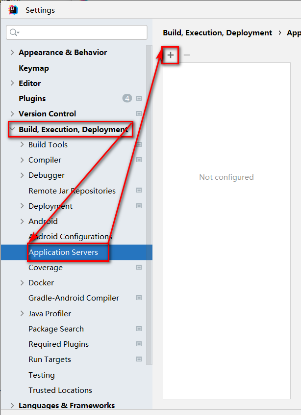
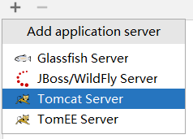
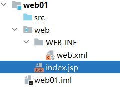
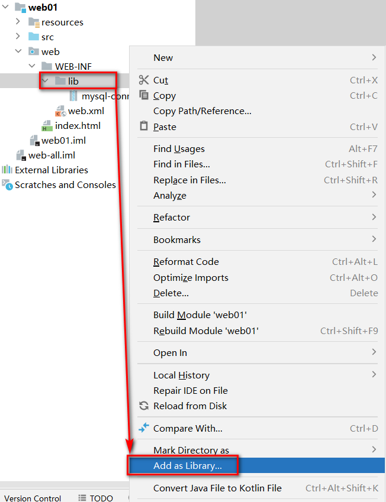
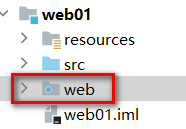
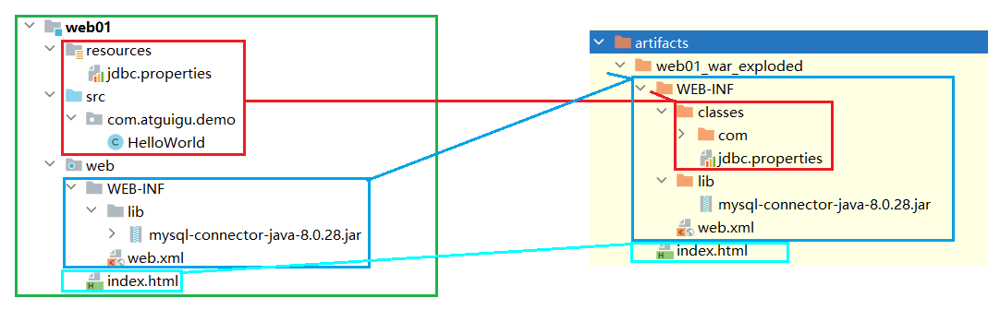
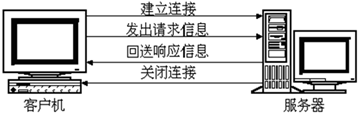
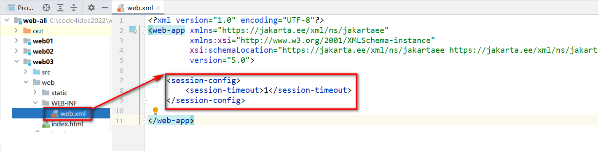

# 一、XML

## 一、XML概述

- XML是EXtensible Markup Language的缩写，翻译过来就是可扩展标记语言。所以很明显，XML和HTML一样都是标记语言，也就是说它们的基本语法都是标签
- **可扩展**三个字表面上的意思是XML允许自定义格式。但这不代表可以随便写
- 在XML基本语法规范的基础上，你使用的那些第三方应用程序、框架会通过XML约束的方式强制规定配置文件中可以写什么和怎么写
- XML基本语法这个知识点的定位是：我们不需要从零开始，从头到尾的一行一行编写XML文档，而是在第三方应用程序、框架已提供的配置文件的基础上修改。要改成什么样取决于你的需求，而怎么改取决XML基本语法和具体的XML约束

## 二、常见配置文件类型

1.  properties文件，例如druid连接池就是使用properties文件作为配置文件
2.  XML文件，例如Tomcat就是使用XML文件作为配置文件
3.  YAML文件，例如SpringBoot就是使用YAML作为配置文件
4.  json文件,，通常用来做文件传输，也可以用来做前端或者移动端的配置文件
5.  等等...

### 一、properties配置文件

- 由键值对组成

- 键和值之间的符号是等号

- 每一行都必须顶格写，前面不能有空格之类的其他符号

  ```properties
  sunny.jdbc.url=jdbc:mysql://localhost:3306/jdbc
  sunny.jdbc.driver=com.mysql.cj.jdbc.Driver
  sunny.jdbc.username=root
  sunny.jdbc.password=root
  ```

### 二、xml配置文件

1. 示例代码

   ```xml
   <?xml version="1.0" encoding="UTF-8"?>
   <students>
       <student>
           <name>张三</name>
           <age>18</age>
       </student>
       <student>
           <name>李四</name>
           <age>20</age>
       </student>
   </students>
   ```

2. XML的基本语法

   - XML的基本语法和HTML的基本语法简直如出一辙。其实这不是偶然的，XML基本语法+HTML约束=HTML语法。在逻辑上HTML确实是XML的子集

   - **XML文档声明**这部分基本上就是固定格式，要注意的是文档声明一定要从第一行第一列开始写

     ```xml
     <?xml version="1.0" encoding="UTF-8"?>
     ```

   - 根标签：根标签有且只能有一个。根标签的意思就是最外层的标签，可以随意定义，但是只能写一个

   - 标签关闭

     -   双标签：开始标签和结束标签必须成对出现。
     -   单标签：单标签在标签内关闭。

   - 标签嵌套：可以嵌套，但是不能交叉嵌套。

   - 注释不能嵌套

   - 标签名、属性名建议使用小写字母

   - 属性

     -   属性必须有值
     -   属性值必须加引号，单双都行

3. XML的约束

   - 将来我们主要就是根据XML约束中的规定来编写XML配置文件，而且会在我们编写XML的时候根据约束来提示我们编写, 而XML约束主要包括DTD和Schema两种

   - Schema约束要求我们一个XML文档中，所有标签，所有属性都必须在约束中有明确的定义，不能随便去定义

   - 以web.xml的约束声明为例来做个说明

     ```xml
     <web-app xmlns="http://xmlns.jcp.org/xml/ns/javaee"
              xmlns:xsi="http://www.w3.org/2001/XMLSchema-instance"
              xsi:schemaLocation="http://xmlns.jcp.org/xml/ns/javaee http://xmlns.jcp.org/xml/ns/javaee/web-app_4_0.xsd"
              version="4.0">
     ```

## 三、DOM4J进行XML解析

### 一、DOM4J的使用步骤

1.  导入jar包dom4j.jar
2.  创建解析器对象(SAXReader)
3.  解析xml获得Document对象
4.  获取根节点RootElement
5.  获取根节点下的子节点

### 二、DOM4J的API介绍

- Node节点
  - Element：元素节点
  - Attribute：属性节点
  - Text：文本节点

1. 创建SAXReader对象

```java
SAXReader saxReader = new SAXReader();
```

&#x20;2. 解析XML获取Document对象: 需要传入要解析的XML文件的字节输入流

```java
// 通过类加载器获取指定字节码根路径下的指定文件的输入流
InputStream inputStream = 当前类.class.getClassLoader().getResourceAsStream("要读取Resource的xml文件路径");
Document document = reader.read(inputStream);
```

&#x20;3\. 获取文档的根标签

```java
Element rootElement = documen.getRootElement()
```

&#x20;4\. 获取标签的子标签

```java
//获取所有子标签
List<Element> sonElementList = rootElement.elements();
//获取指定标签名的子标签
List<Element> sonElementList = rootElement.elements("标签名");
```

&#x20;5\. 获取标签体内的文本

```java
String text = element.getText();
```

&#x20;6\. 获取标签的某个属性的值

```java
String value = element.attribute.getValue("属性名");
```

7. 示例代码

```xml
<?xml version="1.0" encoding="UTF-8"?>
<jdbc>
    <dev id="001">
        <username>root</username>
        <password>root</password>
        <driver>com.mysql.cj.jdbc.Driver</driver>
        <url>jdbc:mysql://127.0.0.1:3306/jdbc</url>
    </dev>
    <test id="002">
        <username>root</username>
        <password>root</password>
        <driver>com.mysql.cj.jdbc.Driver</driver>
        <url>jdbc:mysql://127.0.0.1:3306/jdbc</url>
    </test>
    <prod id="003">
        <username>root</username>
        <password>root</password>
        <driver>com.mysql.cj.jdbc.Driver</driver>
        <url>jdbc:mysql://127.0.0.1:3306/jdbc</url>
    </prod>
</jdbc>
```

```java
// 通过类加载器获取指定字节码根路径下的指定文件的输入流
InputStream inputStream = 当前类.class.getClassLoader().getResourceAsStream("要读取Resource的xml文件路径");
// 获取根元素
Document rootDocument = reader.read(inputStream);
// 获取元素下的子元素
List<Element> elements = rootDocument.elements();
for(Element element:elements){
    // element.getName()获取元素的名称
    sout("\t"+element.getName);
    // 从元素上获取属性（也可获取指定属性）
    // attribute.getName则为获取属性的名称，attribute.getValue则为获取属性的值
    Attribute attribute = element.attribute("id");
    // 继续获取子元素，这是最后一层
    List<Element> eles = element.elements();
    for(Element ele:eles){
        sout("\t\t"+ele.getName()+":"+ele.getText())
    }
}
```

# 二、Tomcat

## 一、Web服务器

1. Web服务器通常由硬件和软件共同构成

2. 硬件：电脑，提供服务供其它客户电脑访问

3. 软件：电脑上安装的服务器软件，安装后能提供服务给网络中的其他计算机，将本地文件映射成一个虚拟的url地址供网络中的其他人访问

   

4. 常见的JavaWeb服务器

   - **Tomcat（Apache）**：当前应用最广的JavaWeb服务器
   - Jetty：更轻量级、更灵活的servlet容器
   - JBoss（Redhat红帽）：支持JavaEE，应用比较广EJB容器 –> SSH轻量级的框架代替
   - GlassFish（Orcale）：Oracle开发JavaWeb服务器，应用不是很广
   - Resin（Caucho）：支持JavaEE，应用越来越广
   - Weblogic（Orcale）：要钱的！支持JavaEE，适合大型项目
   - Websphere（IBM）：要钱的！支持JavaEE，适合大型项目

## 二、Tomcat服务器

### 一、Tomcat简介

- Tomcat是Apache软件基金会（Apache Software Foundation）的Jakarta项目中的一个核心项目，由Apache、Sun和其他一些公司及个人共同开发而成。最新的Servlet和JSP规范总是能在Tomcat中得到体现，因为Tomcat技术先进、性能稳定，而且免费，因而深受Java爱好者的喜爱并得到了部分软件开发商的认可，成为目前比较流行的Web应用服务器
- Tomcat是一款服务器软件，专门运行WEB的应用软件
- Tomcat是使用Java进行开发的，所以运行时需要使用JRE

### 二、Tomcat安装

1. [Tomcat官方网站](http://tomcat.apache.org/)下载。注意Java版本和Tomcat的版本，一般Java8下载Tomcat9就好了
   - 安装版：需要安装，一般不考虑使用
   - 解压版: 直接解压缩使用
2. 正确安装JDK并配置JAVA_HOME
3. 解压tomcat到非中文无空格目录
4. 点击bin/startup.bat启动
5. 打开浏览器输入 http://localhost:8080访问测试
6. 直接关闭窗口或者运行bin/shutdown.bat关闭tomcat
7. 处理dos窗口日志中文乱码问题: 修改conf/logging.properties，将控制台打印的UTF-8修改为GBK（大概在51行左右）。Linux系统不需要修改

### 三、Tomcat目录及测试

1. bin：该目录下存放的是二进制可执行文件，如果是安装版，那么这个目录下会有两个exe文件：tomcat10.exe、tomcat10w\.exe，前者是在控制台下启动Tomcat，后者是弹出GUI窗口启动Tomcat；如果是解压版，那么会有startup.bat和shutdown.bat文件，startup.bat用来启动Tomcat，但需要先配置JAVA\_HOME环境变量才能启动，shutdawn.bat用来停止Tomcat

2. conf：这是一个非常非常重要的目录，这个目录下有四个最为重要的文件：

   - **server.xml：配置整个服务器信息。例如修改端口号。默认HTTP请求的端口号是：8080**

   - tomcat-users.xml：存储tomcat用户的文件，这里保存的是tomcat的用户名及密码，以及用户的角色信息。可以按着该文件中的注释信息添加tomcat用户，然后就可以在Tomcat主页中进入Tomcat Manager页面了

     ``` html
     <tomcat-users xmlns="http://tomcat.apache.org/xml"
                   xmlns:xsi="http://www.w3.org/2001/XMLSchema-instance"
                   xsi:schemaLocation="http://tomcat.apache.org/xml tomcat-users.xsd"
                   version="1.0">	
     	<role rolename="admin-gui"/>
     	<role rolename="admin-script"/>
     	<role rolename="manager-gui"/>
     	<role rolename="manager-script"/>
     	<role rolename="manager-jmx"/>
     	<role rolename="manager-status"/>
     	<user 	username="admin" 
     			password="admin" 
     			roles="admin-gui,admin-script,manager-gui,manager-script,manager-jmx,manager-status"
     	/>
     </tomcat-users>
     ```

   - web.xml：部署描述符文件，这个文件中注册了很多MIME类型，即文档类型。这些MIME类型是客户端与服务器之间说明文档类型的，如用户请求一个html网页，那么服务器还会告诉客户端浏览器响应的文档是text/html类型的，这就是一个MIME类型。客户端浏览器通过这个MIME类型就知道如何处理它了。当然是在浏览器中显示这个html文件了。但如果服务器响应的是一个exe文件，那么浏览器就不可能显示它，而是应该弹出下载窗口才对。MIME就是用来说明文档的内容是什么类型的

   - context.xml：对所有应用的统一配置，通常我们不会去配置它

   - logging.properties：日志文件，一般输出日志以及打印配置在此

3. lib：Tomcat的类库，里面是一大堆jar文件。如果需要添加Tomcat依赖的jar文件，可以把它放到这个目录中，当然也可以把应用依赖的jar文件放到这个目录中，这个目录中的jar所有项目都可以共享之，但这样你的应用放到其他Tomcat下时就不能再共享这个目录下的jar包了，所以建议只把Tomcat需要的jar包放到这个目录下；

4. logs：这个目录中都是日志文件，记录了Tomcat启动和关闭的信息，如果启动Tomcat时有错误，那么异常也会记录在日志文件中。

5. temp：存放Tomcat的临时文件，这个目录下的东西可以在停止Tomcat后删除

6. **webapps：存放web项目的目录，其中每个文件夹都是一个项目**；如果这个目录下已经存在了目录，那么都是tomcat自带的项目。其中ROOT是一个特殊的项目，在地址栏中访问：http://127.0.0.1:8080，没有给出项目目录时，对应的就是ROOT项目。http://localhost:8080/examples，进入示例项目。其中examples就是项目名，即文件夹的名字

7. work：运行时生成的文件，最终运行的文件都在这里。通过webapps中的项目生成的！可以把这个目录下的内容删除，再次运行时会生再次生成work目录。当客户端用户访问一个JSP文件时，Tomcat会通过JSP生成Java文件，然后再编译Java文件生成class文件，生成的java和class文件都会存放到这个目录下

8. LICENSE：许可证

9. NOTICE：说明文件

### 四、WEB项目的标准结构

1. 一个标准的可以用于发布的WEB项目标准结构如下

   

2. 项目结构说明

   - app本应用根目录
     + static：非必要目录，约定俗成的名字，一般在此处放静态资源 (css、js、img)
     + WEB-INF：必要目录，必须叫WEB-INF，受保护的资源目录，浏览器通过url不可以直接访问的目录
       + classes：必要目录，src下源代码，配置文件，编译后会在该目录下，即为字节码根路径。web项目中如果没有源码，则该目录不会出现
       + lib：必要目录，项目依赖的jar编译后会出现在该目录下，web项目要是没有依赖任何jar，则该目录不会出现
       + web.xml：必要文件，web项目的基本配置文件，较新的版本中可能没有该文件
     + index.html：非必要文件，index.html/index.htm/index.jsp为默认的欢迎页

3. url的组成部分和项目中资源的对应关系

   - 客户端中的app就是上下文路径，即项目的访问路径（左侧中的app）
   - 服务器中的app就是项目部署目录（右侧中的app）
   - 上下文路径不一定和项目部署目录名称一致。可以在IDEA里面进行设置比较方便
   
   

### 五、WEB项目部署的方式

1.  直接将编译好的项目放在webapps目录下  (如上)

2. 将编译好的项目打成war包放在webapps目录下，tomcat启动后会自动解压war包(其实和第一种一样)

3. 可以将项目放在非webapps的其他目录下，在tomcat中通过配置文件指向app的实际磁盘路径

   - 在磁盘的自定义目录上准备一个app

     

   - 在tomcat的conf下创建Catalina/localhost目录，并在该目录下准备一个app.xml文件，因为要部署的项目名为app，所以xml文件的前缀名称最好使用要部署的项目

     ```xml
     <!-- 
     	path: 项目的访问路径,也是项目的上下文路径,就是在浏览器中,输入的项目名称
         docBase: 项目在磁盘中的实际路径
      -->
     <Context path="/app" docBase="D:\mywebapps\app" />
     ```

   - 启动tomcat访问测试即可

### 六、IDEA运行WEB项目

1. IDEA关联本地Tomcat

   - 可以在创建项目前设置本地tomcat，也可以在打开某个项目的状态下找到settings

     

   - 找到 Build,Execution,Eeployment下的Application Servers，找到+号

     

   - 选择Tomcat Server

     

   - 选择Tomcat的安装目录

     

   - 点击OK

     

   - 关联完毕

     

2. IDEA创建web工程

   - 推荐先创建一个空项目,这样可以在一个空项目下同时存在多个modules，不用后续来回切换之前的项目，当然也可以忽略此步直接创建web项目

     

     

   - 检查项目的SDK,语法版本,以及项目编译后的输出目录

     

     

   - 先创建一个普通的JAVA项目

     

   - 检查各项信息是否填写有误

     

   - 创建完毕后，为项目添加Tomcat依赖

     

     

     

     

   - 选择modules，添加framework support

     

   - 选择Web Application注意Version，勾选Create web.xml。如果Tomcat版本和JDK版本过新则需要在Project Setting -> Modules -> 点击需要设置的module -> Dependencies -> 选择Library -> 则可以选择Tomcat运行需要的jar包

     

   - 删除index.jsp，替换为index.html

     

     

   - 处理配置文件

     - 在工程下创建resources目录,专门用于存放配置文件(都放在src下也行,单独存放可以尽量避免文件集中存放造成的混乱)

     - 标记目录为资源目录，不标记的话则该目录不参与编译

       

     - 标记完成后,显示效果如下

       

   - 处理依赖jar包问题

     - 在WEB-INF下创建lib目录

     - 必须在WEB-INF下，且目录名必须叫lib！！！

     - 复制jar文件进入lib目录

       

     - 将lib目录添加为当前项目的依赖，后续可以用maven统一解决

       

       

     - 环境级别推荐选择module级别，降低对其他项目的影响，name可以空着不写

       

     - 查看当前项目有那些环境依赖

       

       

     - 在此位置，可以通过-号解除依赖

       

3. IDEA部署-运行web项目

   - 检查idea是否识别modules为web项目并存在将项目构建成发布结构的配置

     - 就是检查工程目录下，web目录有没有特殊的识别标记

       

     - 以及artifacts下，有没有对应 _war_exploded，如果没有，就点击+号添加

       

   - 点击向下箭头，出现 Edit Configurations选项

     

   - 出现运行配置界面

     

   - 点击+号，添加本地tomcat服务器

     

   - 因为IDEA关联了一个Tomcat，红色部分就只有一个Tomcat可选

     

   - 选择Deployment，通过+添加要部署到Tomcat中的artifact

     

   - applicationContext中是默认的项目上下文路径，也就是url中需要输入的路径，这里可以自己定义，可以和工程名称不一样，也可以不写，但是要保留/，这里暂时可以就用默认的

     

   - 点击apply应用后，回到Server部分。After Launch是配置启动成功后，是否默认自动打开浏览器并输入URL中的地址，HTTP port是Http连接器目前占用的端口号

     

   - 点击OK后，启动项目，访问测试。浏览器自动打开并自动访问了index.html欢迎页

   - 工程结构和可以发布的项目结构之间的目录对应关系

     

4. IDEA部署并运行项目的原理

  - idea并没有直接进将编译好的项目放入tomcat的webapps中
  - idea根据关联的tomcat，创建了一个tomcat副本，将项目部署到了这个副本中
  - idea的tomcat副本在C:\用户\当前用户\AppData\Local\JetBrains\IntelliJIdea2022.2\tomcat\中
  - idea的tomcat副本并不是一个完整的tomcat，副本里只是准备了和当前项目相关的配置文件而已（xml配置文件）
  - idea启动tomcat时，是让本地tomcat程序按照tomcat副本里的配置文件运行
  - idea的tomcat副本部署项目的模式是通过conf/Catalina/localhost/*.xml配置文件的形式实现项目部署的

  

# 三、HTTP

## 一、HTTP简介


- **HTTP 超文本传输协议** (HTTP-Hyper Text transfer protocol)，是一个属于应用层的面向对象的协议，由于其简捷、快速的方式，适用于分布式超媒体信息系统。它于1990年提出，经过十几年的使用与发展，得到不断地完善和扩展。**它是一种详细规定了浏览器和万维网服务器之间互相通信的规则**，通过因特网传送万维网文档的数据传送协议。客户端与服务端通信时传输的内容我们称之为**报文**。**HTTP协议就是规定报文的格式。**HTTP就是一个通信规则，这个规则规定了客户端发送给服务器的报文格式，也规定了服务器发送给客户端的报文格式。实际我们要学习的就是这两种报文**。客户端发送给服务器的称为"请求报文**"，**服务器发送给客户端的称为"响应报文"**
- 交互方式：请求，永远都是客户端向服务端发送；响应，永远都是服务端向客户端返回
- 数据格式：请求时发送的数据则为请求报文；响应时返回的数据则为响应报文
- 报文的格式：报文首行（行、头）、报文主体
- HTTP是应用层协议，使用的传输层协议是TCP协议（面向连接的协议），使用的网络层协议是IP协议
- HTTP支持持久连接以及缓存
  - 短连接：每次请求HTTP都会创建连接（三次握手），关闭连接（四次挥手）
  - 长连接：多个请求可以通过单个连接来完成

### 一、HTTP协议的会话方式

- 浏览器与服务器之间的通信过程要经历四个步骤

  

- 浏览器与WEB服务器的连接过程是短暂的，每次连接只处理一个请求和响应。对每一个页面的访问，浏览器与WEB服务器都要建立一次单独的连接

- 浏览器到WEB服务器之间的所有通讯都是完全独立分开的请求和响应对

### 二、HTTP1.0和HTTP1.1的区别

- 在HTTP1.0版本中，浏览器请求一个带有图片的网页，会由于下载图片而与服务器之间开启一个新的连接

- 在HTTP1.1版本中，允许浏览器在拿到当前请求对应的全部资源后再断开连接（也就是长连接），提高了效率

  

### 三、在浏览器中通过F12工具抓取请求响应报文包


## 二、请求和响应报文

### 一、报文的格式

1. 主体上分为报文首部和报文主体，中间空行隔开

   

2. 报文首部可以继续细分为"行"和"头"

   

### 二、请求报文

1. 客户端发给服务端的报文，请求报文格式如下

   -   请求首行（**请求行**）；GET/POST   资源路径?参数   HTTP/1.1
   -   请求头信息（**请求头**）
   -   空行
   -   请求体；POST请求才有请求体
   
2. 浏览器f12网络下查看请求数据包

   

3. form表单发送GET请求特点

   - 由于请求参数在请求首行中已经携带了，所以没有请求体，也没有请求空行
   - 请求参数拼接在url地址中，地址栏可见\[url?name1=value1\&name2=value2]，不安全
   - 由于参数在地址栏中携带，所以有大小限制\[地址栏数据大小一般限制为4k]，只能携带纯文本
   - get请求参数只能上传文本数据
   - 没有请求体。所以封装和解析都快，效率高， 浏览器默认提交的请求都是get请求比如：地址栏输入回车、超链接、表单默认的提交方式

4. 查看GET请求行、请求头、请求体

   - 请求行组成部分

     + 请求方式GET
     + 访问服务器的资源路径?参数1=值1&参数2=值2 ... ...
     + 协议及版本HTTP/1.1

     ```http
     GET /05_web_tomcat/login_success.html?username=admin&password=123213 HTTP/1.1
     ```

   - 请求头

     ```http
     -主机虚拟地址
     Host: localhost:8080   
     -长连接
     Connection: keep-alive 
     -请求协议的自动升级[http的请求，服务器却是https的，浏览器自动会将请求协议升级为https的]
     Upgrade-Insecure-Requests: 1  
     - 用户系统信息
     User-Agent: Mozilla/5.0 (Windows NT 6.1; WOW64) AppleWebKit/537.36 (KHTML, like Gecko) Chrome/68.0.3440.75 Safari/537.36
     - 浏览器支持的文件类型
     Accept:text/html,application/xhtml+xml,application/xml;q=0.9,image/webp,image/apng,*/*;q=0.8
     - 当前页面的上一个页面的路径[当前页面通过哪个页面跳转过来的]：   可以通过此路径跳转回上一个页面， 广告计费，防止盗链
     Referer: http://localhost:8080/05_web_tomcat/login.html
     - 浏览器支持的压缩格式
     Accept-Encoding: gzip, deflate, br
     - 浏览器支持的语言
     Accept-Language: zh-CN,zh;q=0.9,en-US;q=0.8,en;q=0.7
     ```

   - 请求空行

   - 请求体。GET请求数据不放在请求体

5. form表单发送post请求特点

   - post请求有请求体，而GET请求没有请求体
   - post请求数据在请求体中携带，请求体数据大小没有限制，可以用来上传所有内容\[文件、文本]
   - 只能使用post请求上传文件
   - post请求报文多了和请求体相关的配置\[请求头]
   - 地址栏参数不可见，相对安全
   - post效率比get低

6. post请求要求将form标签的method的属性设置为post

   

7. 查看post的请求行、请求头、请求体

   - 请求行组成部分

     + 请求方式POST
     + 访问服务器的资源路径?参数1=值1&参数2=值2 ... ...
     + 协议及版本HTTP/1.1

   - 请求头

     ```http
     Host: localhost:8080
     Connection: keep-alive
     Content-Length: 31     -请求体内容的长度
     Cache-Control: max-age=0  -无缓存
     Origin: http://localhost:8080
     Upgrade-Insecure-Requests: 1  -协议的自动升级
     Content-Type: application/x-www-form-urlencoded   -请求体内容类型[服务器根据类型解析请求体参数]
     User-Agent: Mozilla/5.0 (Windows NT 6.1; WOW64) AppleWebKit/537.36 (KHTML, like Gecko) Chrome/68.0.3440.75 Safari/537.36
     Accept:text/html,application/xhtml+xml,application/xml;q=0.9,image/webp,image/apng,*/*;q=0.8
     Referer: http://localhost:8080/05_web_tomcat/login.html
     Accept-Encoding: gzip, deflate, br
     Accept-Language: zh-CN,zh;q=0.9,en-US;q=0.8,en;q=0.7
     Cookie:JSESSIONID-
     ```

   - 请求空行

   - 请求体:浏览器提交给服务器的数据

     ```http
     username=admin&password=1232131
     ```

### 三、响应报文

1. 响应报文格式

   - 响应首行（**响应行**）； 协议/版本 状态码 状态码描述

     + 协议及版本 HTTP/1.1
     + 响应状态码 200
     + 状态描述  OK (缺省)

     ```http
     HTTP/1.1 200 OK
     说明：响应协议为HTTP1.1，响应状态码为200，表示请求成功
     ```

   - 响应头信息（**响应头**）

     ```http
     Server: Apache-Coyote/1.1   服务器的版本信息
     Accept-Ranges: bytes
     ETag: W/"157-1534126125811"
     Last-Modified: Mon, 13 Aug 2018 02:08:45 GMT
     Content-Type: text/html    响应体数据的类型[浏览器根据类型解析响应体数据]
     Content-Length: 157   响应体内容的字节数
     Date: Mon, 13 Aug 2018 02:47:57 GMT  响应的时间，这可能会有8小时的时区差
     ```

   - 空行

   - 响应体

     ```http
     <!--需要浏览器解析使用的内容[如果响应的是html页面，最终响应体内容会被浏览器显示到页面中]-->
     
     <!DOCTYPE html>
     <html>
       <head>
         <meta charset="UTF-8">
         <title>Insert title here</title>
       </head>
       <body>
         恭喜你，登录成功了...
       </body>
     </html>
     ```

     

     

2. 响应状态码：响应码对浏览器来说很重要，它告诉浏览器响应的结果。比较有代表性的响应码如下

   - **200：** 请求成功，浏览器会把响应体内容（通常是html）显示在浏览器中
   - **302：** 重定向，当响应码为302时，表示服务器要求浏览器重新再发一个请求，服务器会发送一个响应头Location指定新请求的URL地址
   - **304：** 使用了本地缓存
   - **404：** 请求的资源没有找到，说明客户端错误的请求了不存在的资源
   - **405：** 请求的方式不允许
   - **500：** 请求资源找到了，但服务器内部出现了错误

3. 更多的响应状态码

   - 100：继续。客户端应继续其请求
   - 101：切换协议。服务器根据客户端的请求切换协议。只能切换到更高级的协议，例如，切换到HTTP的新版本协议
   - 200：请求成功。一般用于GET与POST请求
   - 201：已创建。成功请求并创建了新的资源
   - 202：已接受。已经接受请求，但未处理完成
   - 203：非授权信息。请求成功。但返回的meta信息不在原始的服务器，而是一个副本
   - 204：无内容。服务器成功处理，但未返回内容。在未更新网页的情况下，可确保浏览器继续显示当前文档
   - 205：重置内容。服务器处理成功，用户终端（例如：浏览器）应重置文档视图。可通过此返回码清除浏览器的表单域
   - 206：部分内容。服务器成功处理了部分GET请求
   - 300：多种选择。请求的资源可包括多个位置，相应可返回一个资源特征与地址的列表用于用户终端（例如：浏览器）选择
   - 301：永久移动。请求的资源已被永久的移动到新URI，返回信息会包括新的URI，浏览器会自动定向到新URI。今后任何新的请求都应使用新的URI代替
   - 302：临时移动。与301类似。但资源只是临时被移动。客户端应继续使用原有URI
   - 303：查看其它地址。与301类似。使用GET和POST请求查看
   - 304：未修改。所请求的资源未修改，服务器返回此状态码时，不会返回任何资源。客户端通常会缓存访问过的资源，通过提供一个头信息指出客户端希望只返回在指定日期之后修改的资源
   - 305：使用代理。所请求的资源必须通过代理访问
   - 306：已经被废弃的HTTP状态码
   - 307：临时重定向。与302类似。使用GET请求重定向
   - 400：客户端请求的语法错误，服务器无法理解
   - 401：请求要求用户的身份认证
   - 402：保留，将来使用  
   - 403：服务器理解请求客户端的请求，但是拒绝执行此请求
   - 404：服务器无法根据客户端的请求找到资源（网页）。通过此代码，网站设计人员可设置"您所请求的资源无法找到"的个性页面  
   - 405：客户端请求中的方法被禁止
   - 406：服务器无法根据客户端请求的内容特性完成请求
   - 407：请求要求代理的身份认证，与401类似，但请求者应当使用代理进行授权
   - 408：服务器等待客户端发送的请求时间过长，超时  
   - 409：服务器完成客户端的PUT请求时可能返回此代码，服务器处理请求时发生了冲突  
   - 410：客户端请求的资源已经不存在。410不同于404，如果资源以前有现在被永久删除了可使用410代码，网站设计人员可通过301代码指定资源的新位置
   - 411：服务器无法处理客户端发送的不带Content-Length的请求信息
   - 412：客户端请求信息的先决条件错误
   - 413：由于请求的实体过大，服务器无法处理，因此拒绝请求。为防止客户端的连续请求，服务器可能会关闭连接。如果只是服务器暂时无法处理，则会包含一个Retry-After的响应信息  
   - 414：请求的URI过长（URI通常为网址），服务器无法处理
   - 415：服务器无法处理请求附带的媒体格式  
   - 416：客户端请求的范围无效  
   - 417：服务器无法满足Expect的请求头信息
   - 500：服务器内部错误，无法完成请求  
   - 501：服务器不支持请求的功能，无法完成请求  
   - 502：作为网关或者代理工作的服务器尝试执行请求时，从远程服务器接收到了一个无效的响应
   - 503：由于超载或系统维护，服务器暂时的无法处理客户端的请求。延时的长度可包含在服务器的Retry-After头信息中
   - 504：充当网关或代理的服务器，未及时从远端服务器获取请求  
   - 505：服务器不支持请求的HTTP协议的版本，无法完成处理

# 四、Servlet

## 一、Servlet简介

### 一、动态资源和静态资源

1. 静态资源
   - 无需在程序运行时通过代码运行生成的资源，在程序运行之前就写好的资源，例如：html css js img，音频文件和视频文件
2. 动态资源
   - 需要在程序运行时通过代码运行生成的资源，在程序运行之前无法确定的数据，运行时动态生成，例如Servlet、Thymeleaf......
   - 动态资源指的不是视图上的动画效果或者是简单的人机交互效果

### 二、Servlet简介

1. Servlet  (server applet) 是运行在服务端(tomcat)的Java小程序，是sun公司提供一套定义动态资源规范；从代码层面上来讲Servlet就是一个接口

2. 用来接收、处理客户端请求、响应给浏览器的动态资源。在整个Web应用中，Servlet主要负责接收处理请求、协同调度功能以及响应数据。我们可以把Servlet称为Web应用中的**控制器**

3. 不是所有的JAVA类都能用于处理客户端请求，能处理客户端请求并做出响应的一套技术标准就是Servlet

4. Servlet是运行在服务端的，所以Servlet必须在WEB项目中开发且在Tomcat这样的服务容器中运行

5. 请求响应与HttpServletRequest和HttpServletResponse之间的对应关系以及请求、响应数据的步骤

   
   
   - Tomcat接收到请求后，会将请求报文的信息转换为一个HttpServletRequest对象，该对象中包含了请求中的所有信息（请求行、请求头、请求体）
   
   - Tomcat在创建HttpServletRequest对象的同时创建了HttpServletResponse对象，该对象用于承装要响应给客户端的信息。后面该对象填充真正处理好的数据，然后被转为响应的报文（响应行、响应头、响应体）
   
   - Tomcat根据请求中的资源路径找到对应的servlet，将servlet实例化，调用servlet方法，同时将HttpServletRequest和HttpServletResponse对象传入
   
     ```java
     service(HttpServletRequest request,HttpServletResponse response){}
     
     // 此方法从request对象中获取请求的信息（主要是参数）、
     // 根据参数生成要响应给客户端的数据
     // 将响应的数据放入response对象中，将返回的数据转换为报文即完成
     ```
   
   - 处理好相应的请求将响应的数据放入HttpServletResponse对象中，将返回的数据转换为报文即完成

## 二、Servlet开发流程

### 一、目标

- 校验注册时，用户名是否被占用。通过客户端向一个Servlet发送请求，携带username，如果用户名是'sunny'，则向客户端响应NO，如果是其他，响应YES

### 二、开发过程

1. 开发一个web类型的module，参照之前的

2. 开发一个UserServlet

   ```java
   public class UserServlet extends HttpServlet {
       @Override
       protected void service(HttpServletRequest req, HttpServletResponse resp) throws ServletException, IOException {
           // 设置Content-Type响应头。Content-Type的类型存在Tomcat中的web.xml中
           // 此处设置时一定要正确设置
           // response.setHeader("Content-Type","text/html");
           response.setContentType("text/html");
           // 获取请求中的参数，根据参数名称获取参数值，无论参数是在url中，还是在请求体中
           String username = req.getParameter("username");
           if("sunny".equals(username)){
               //通过响应对象响应信息
               resp.getWriter().write("NO");
           }else{
               resp.getWriter().write("YES");
           }
       }
   }
   // 重写service()方法必需，如下
   // 从request对象中获取请求中的任何信息（参数等等）
   // 处理业务逻辑
   // 将要响应的数据放入response中，应该设置Content-Type响应头
   // 在web.xml配置此响应路径
   ```

   - 自定义一个类，要继承HttpServlet类
   - 重写service方法，该方法主要就是用于处理用户请求的服务方法
   - HttpServletRequest代表请求对象，是由请求报文经过tomcat转换而来的，通过该对象可以获取请求中的信息
   - HttpServletResponse代表响应对象，该对象会被tomcat转换为响应的报文，通过该对象可以设置响应中的信息
   - Servlet对象的生命周期(创建、初始化、处理服务、销毁)是由tomcat管理的，无需我们自己new
   - HttpServletRequest、HttpServletResponse两个对象也是有tomcat负责转换，在调用service方法时传入给我们用的

3. 在web.xml为UseServlet配置请求的映射路径

   ```xml
   <?xml version="1.0" encoding="UTF-8"?>
   <web-app xmlns="https://jakarta.ee/xml/ns/jakartaee"
            xmlns:xsi="http://www.w3.org/2001/XMLSchema-instance"
            xsi:schemaLocation="https://jakarta.ee/xml/ns/jakartaee https://jakarta.ee/xml/ns/jakartaee/web-app_5_0.xsd"
            version="5.0">
   
       <servlet>
           <!--给UserServlet起一个别名-->
           <servlet-name>userServlet</servlet-name>
           <servlet-class>com.sunny.servlet.UserServlet</servlet-class>
       </servlet>
   
       <servlet-mapping>
           <!--关联别名和映射路径-->
           <servlet-name>userServlet</servlet-name>
           <!--可以为一个Servlet匹配多个不同的映射路径,但是不同的Servlet不能使用相同的url-pattern-->
           <url-pattern>/userServlet</url-pattern>
          <!-- <url-pattern>/userServlet2</url-pattern>-->
           <!--
               /        表示通配所有资源,不包括jsp文件
               /*       表示通配所有资源,包括jsp文件
               /a/*     匹配所有以a前缀的映射路径
               *.action 匹配所有以action为后缀的映射路径
           -->
          <!-- <url-pattern>/*</url-pattern>-->
       </servlet-mapping>
   
   </web-app>
   ```

   - servlet并不是文件系统中实际存在的文件或者目录，所以为了能够请求到该资源，需要为其配置映射路径
   - servlet的请求映射路径配置在web.xml中
   - servlet-name作为servlet的别名，可以自己随意定义，见名知意就好
   - url-pattern标签用于定义Servlet的请求映射路径。通过url-pattern找到servlet-name对应类的别名，再通过别名去找servlet-class，找到真正的类后进行反射
   - 一个servlet-name可以对应多个不同的url-pattern
   - 多个servlet-name不能使用相同的url-pattern
   - 一个servlet标签可以对应多个servlet-mapping标签
   - 一个servlet类只能实现一个资源路径（访问路径可以多个）
   - url-pattern中可以使用一些通配写法
     + /             ：表示通配所有资源，不包括jsp文件
     + /*           ：表示通配所有资源，包括jsp文件
     + /a/*        ：匹配所有以a前缀的映射路径
     + *.action ：匹配所有以action为后缀的映射路径

4. 开发一个form表单，向servlet发送一个get请求并携带username参数

   ```html
   <!DOCTYPE html>
   <html lang="en">
   <head>
       <meta charset="UTF-8">
       <title>Title</title>
   </head>
   <body>
       <form action="userServlet">
           请输入用户名:<input type="text" name="username" /> <br>
           <input type="submit" value="校验">
       </form>
   </body>
   </html>
   ```

5. 启动项目，访问index.html，提交表单测试

6. 映射关系图

   
   
7. servlet-api.jar：编码的时候需要引入此jar包，运行的时候在服务器的环境中由服务软件（Tomcat）提供。因此，在JavaWeb项目中，打包或构建时不需携带此包

8. Content-Type

   - MIME类型响应头（请求头），能表示的类型有媒体类型、文件类型、响应的数据类型等。可以在Tomcat中的web.xml中查找响应的类型
   - MIME类型用于告诉客户端响应的数据是什么类型的数据，客户端以此类型决定用什么方式解析响应体

## 三、Servlet注解方式配置

1. #### @WebServlet注解源码

   ```java
   package jakarta.servlet.annotation;
   
   import java.lang.annotation.Documented;
   import java.lang.annotation.ElementType;
   import java.lang.annotation.Retention;
   import java.lang.annotation.RetentionPolicy;
   import java.lang.annotation.Target;
   
   /**
    * @since Servlet 3.0
    */
   @Target({ ElementType.TYPE })
   @Retention(RetentionPolicy.RUNTIME)
   @Documented
   public @interface WebServlet {
   
       /**
        * The name of the servlet
        * 相当于 servlet-name
        * @return the name of the servlet
        */
       String name() default "";
   
       /**
        * The URL patterns of the servlet
        * 如果只配置一个url-pattern ,则通过该属性即可,和urlPatterns属性互斥
        * @return the URL patterns of the servlet
        */
       String[] value() default {};
   
       /**
        * The URL patterns of the servlet
        * 如果要配置多个url-pattern ,需要通过该属性,和value属性互斥
        * @return the URL patterns of the servlet
        */
       String[] urlPatterns() default {};
   
       /**
        * The load-on-startup order of the servlet
        * 配置Servlet是否在项目加载时实例化
        * @return the load-on-startup order of the servlet
        */
       int loadOnStartup() default -1;
   
       /**
        * The init parameters of the servlet
        * 配置初始化参数
        * @return the init parameters of the servlet
        */
       WebInitParam[] initParams() default {};
   
       /**
        * Declares whether the servlet supports asynchronous operation mode.
        *
        * @return {@code true} if the servlet supports asynchronous operation mode
        * @see jakarta.servlet.ServletRequest#startAsync
        * @see jakarta.servlet.ServletRequest#startAsync( jakarta.servlet.ServletRequest,jakarta.servlet.ServletResponse)
        */
       boolean asyncSupported() default false;
   
       /**
        * The small-icon of the servlet
        *
        * @return the small-icon of the servlet
        */
       String smallIcon() default "";
   
       /**
        * The large-icon of the servlet
        *
        * @return the large-icon of the servlet
        */
       String largeIcon() default "";
   
       /**
        * The description of the servlet
        *
        * @return the description of the servlet
        */
       String description() default "";
   
       /**
        * The display name of the servlet
        *
        * @return the display name of the servlet
        */
       String displayName() default "";
   
   }
   
   ```
   
2. @WebServlet注解使用：使用@WebServlet注解替换Servlet配置

   ```java
@WebServlet(
           name = "userServlet",
           //value = "/user",
           urlPatterns = {"/userServlet1","/userServlet2","/userServlet"},
           initParams = {@WebInitParam(name = "encoding",value = "UTF-8")},
           loadOnStartup = 6
   )
   public class UserServlet  extends HttpServlet {
       @Override
       protected void service(HttpServletRequest req, HttpServletResponse resp) throws ServletException, IOException {
           String encoding = getServletConfig().getInitParameter("encoding");
           System.out.println(encoding);
           // 获取请求中的参数
           String username = req.getParameter("username");
           if("sunny".equals(username)){
               //通过响应对象响应信息
               resp.getWriter().write("NO");
           }else{
               resp.getWriter().write("YES");
           }
       }
   }
   ```

## 四、Servlet生命周期

### 一、生命周期简介

1. Servlet的生命周期介绍

   - 应用程序中的对象不仅在空间上有层次结构的关系，在时间上也会因为处于程序运行过程中的不同阶段而表现出不同状态和不同行为——这就是对象的生命周期
   - 简单的叙述生命周期，就是对象在容器中从开始创建到销毁的过程

2. Servlet容器

   - Servlet对象是Servlet容器创建的，生命周期方法都是由容器(目前我们使用的是Tomcat)调用的。这一点和我们之前所编写的代码有很大不同。在今后的学习中我们会看到，越来越多的对象交给容器或框架来创建，越来越多的方法由容器或框架来调用，开发人员要尽可能多的将精力放在业务逻辑的实现上

3. Servlet主要的生命周期执行特点

   |      生命周期      |                         对应方法                         |        执行时机        | 执行次数 |
   | :----------------: | :------------------------------------------------------: | :--------------------: | :------: |
   |       实例化       |                          构造器                          | 第一次请求或者容器启动 |    1     |
   |       初始化       |                          init()                          |       构造完毕后       |    1     |
   | 接收请求、处理请求 | service(HttpServletRequest req,HttpServletResponse resp) |        每次请求        |   多次   |
   |        销毁        |                        destory()                         |        容器关闭        |    1     |

### 二、生命周期测试

1. 开发servlet代码

   ```java
   package com.sunny.servlet;
   import jakarta.servlet.ServletException;
   import jakarta.servlet.http.HttpServlet;
   import jakarta.servlet.http.HttpServletRequest;
   import jakarta.servlet.http.HttpServletResponse;
   
   import java.io.IOException;
   
   public class ServletLifeCycle  extends HttpServlet {
       public ServletLifeCycle(){
           System.out.println("构造器");
       }
   
       @Override
       public void init() throws ServletException {
           System.out.println("初始化方法");
       }
   
       @Override
       protected void service(HttpServletRequest req, HttpServletResponse resp) throws ServletException, IOException {
           System.out.println("service方法");
       }
   
       @Override
       public void destroy() {
           System.out.println("销毁方法");
       }
   }
   
   ```

2. 配置Servlet

   ```xml
     
       <servlet>
           <servlet-name>servletLifeCycle</servlet-name>
           <servlet-class>com.sunny.servlet.ServletLifeCycle</servlet-class>
           <!--load-on-startup
               如果配置的是正整数则表示容器在启动时就要实例化Servlet,
               数字表示的是实例化的顺序
           -->
           <load-on-startup>1</load-on-startup>
       </servlet>
       <servlet-mapping>
           <servlet-name>servletLifeCycle</servlet-name>
           <url-pattern>/servletLiftCycle</url-pattern>
       </servlet-mapping>
   ```

3. 请求Servlet测试

### 三、生命周期总结

1. Servlet对象在容器中是单例的
2. 容器是可以处理并发的用户请求的，每个请求在容器中都会开启一个线程
3. 多个线程可能会使用相同的Servlet对象，所以在Servlet中不要轻易定义一些容易经常发生修改的成员变量
4. load-on-startup中定义的正整数表示tomcat容器启动时servlet的实例化顺序，如果数字重复了，容器会自行解决实例化顺序问题，但是应该避免重复。默认为-1，含义是tomcat启动时不会实例化该servlet，但是在请求时会实例化该servlet
5. Tomcat容器中，已经定义了一些随系统启动实例化的servlet，我们自定义的servlet的load-on-startup尽量不要占用数字1-5
6. default-servlet：在使用自定义的或者自带的servlet找不到路径时（即动态资源），会使用default-servlet进行匹配加载对应的静态资源。这也是能直接访问静态资源的原因

## 五、Servlet继承结构

### 一、Servlet接口

Servlet规范接口，所有的Servlet必须实现 

1. public void init(ServletConfig config) throws ServletException;   
   + 初始化方法，tomcat容器在构造servlet对象后，自动调用的方法，容器负责实例化一个ServletConfig对象，并在调用该方法时传入
   + ServletConfig对象可以为Servlet提供初始化参数
2. public ServletConfig getServletConfig();
   + 获取ServletConfig对象的方法，后续可以通过该对象获取Servlet初始化参数
3. public void service(ServletRequest req, ServletResponse res) throws ServletException, IOException;
   + 处理请求并做出响应的服务方法，每次请求产生时由容器调用
   + 容器创建一个ServletRequest对象和ServletResponse对象，容器在调用service方法时，传入这两个对象
4. public String getServletInfo();
   + 获取ServletInfo信息的方法
5. public void destroy();
   + Servlet实例在销毁之前调用的方法。Servlet在回收前，由tomcat调用的销毁方法，往往用于做资源的释放工作

### 二、GenericServlet抽象类

GenericServlet抽象类是对Servlet接口一些固定功能的粗糙实现，以及对service方法的再次抽象声明，并定义了一些其他相关功能方法

1. private transient ServletConfig config; 
   + 初始化配置对象作为属性
2. public GenericServlet() { } 
   + 构造器，为了满足继承而准备
3. public void destroy() { } 
   + 销毁方法的平庸实现
   + 将抽象方法重写为普通方法，在方法内部没有任何的实现代码
4. public String getInitParameter(String name) 
   + 获取初始参数的快捷方法
5. public Enumeration<String> getInitParameterNames() 
   + 返回所有初始化参数名的方法
6. public ServletConfig getServletConfig()
   +  获取初始Servlet初始配置对象ServletConfig的方法
7. public ServletContext getServletContext()
   +  获取上下文对象ServletContext的方法
8. public String getServletInfo() 
   + 获取Servlet信息的平庸实现
9. public void init(ServletConfig config) throws ServletException() 
   + 初始化方法的实现，并在此调用了init的重载方法
   + tomcat在调用init方法时，会读取配置信息进入一个ServletConfig对象并将该对象传入init方法中
10. public void init() throws ServletException 
    + 重载init方法，为了让我们自己定义初始化功能的方法
11. public void log(String msg) 
12. public void log(String message, Throwable t)
    +  打印日志的方法及重载
13. public abstract void service(ServletRequest req, ServletResponse res) throws ServletException, IOException; 
    + 服务方法再次声明
14. public String getServletName() 
    + 获取ServletName的方法

### 三、HttpServlet抽象类

abstract class HttpServlet extends GenericServlet。HttpServlet抽象类，除了基本的实现以外，增加了更多的基础功能

1. private static final String METHOD_DELETE = "DELETE";
2. private static final String METHOD_HEAD = "HEAD";
3. private static final String METHOD_GET = "GET";
4. private static final String METHOD_OPTIONS = "OPTIONS";
5. private static final String METHOD_POST = "POST";
6. private static final String METHOD_PUT = "PUT";
7. private static final String METHOD_TRACE = "TRACE";
   + 上述属性用于定义常见请求方式名常量值
8. public HttpServlet() {}
   + 构造器，用于处理继承
9. public void service(ServletRequest req, ServletResponse res) throws ServletException, IOException
   + 对服务方法的实现
   + 在该方法中，将请求和响应对象转换成对应HTTP协议的HttpServletRequest HttpServletResponse对象
   + 调用重载的service方法
10. public void service(HttpServletRequest req, HttpServletResponse res) throws ServletException, IOException
    + 重载的service方法，被重写的service方法所调用
    + 在该方法中，通过请求方式判断，调用具体的do***方法完成请求的处理
    + 如果此service()方法未被实现或者此方法中没有代码，则会自动找到HttpServlet中的service()中的do***方法，返回状态响应码405
    + 如果不实现service()方法，那么需要实现do***方法，否则请求时会返回405
11. protected void doGet(HttpServletRequest req, HttpServletResponse resp) throws ServletException, IOException
12. protected void doPost(HttpServletRequest req, HttpServletResponse resp) throws ServletException, IOException
13. protected void doHead(HttpServletRequest req, HttpServletResponse resp) throws ServletException, IOException
14. protected void doPut(HttpServletRequest req, HttpServletResponse resp) throws ServletException, IOException
15. protected void doDelete(HttpServletRequest req, HttpServletResponse resp) throws ServletException, IOException
16. protected void doOptions(HttpServletRequest req, HttpServletResponse resp) throws ServletException, IOException
17. protected void doTrace(HttpServletRequest req, HttpServletResponse resp) throws ServletException, IOException
    + 对应不同请求方式的处理方法
    + 除了doOptions和doTrace方法，其他的do*** 方法都在故意响应错误信息

### 四、自定义Servlet


自定义Servlet中，必须要对处理请求的方法进行重写

+ 要么重写service方法
+ 要么重写doGet/doPost方法
+ 继承HttpServlet后，同时重写service方法和doGet()/doPost()，只有service方法会生效
+ 部分程序员推荐在servlet中重写do***方法处理请求，因为service方法中可能做了一些处理，如果直接重写service方法，父类HttpServlet中的service方法的代码就会失效。当前目前重写service也没什么问题
+ 若使用了SpringMVC等框架，则无需继承HttpServlet，处理请求的方法也无需是do***方法、service()方法
+ 如果doGet和doPost方法中，我们定义的代码一样，可以一个方法直接调用另一个方法，但是不能互相调用

## 六、ServletConfig和ServletContext

### 一、ServletConfig的使用

1. ServletConfig的含义

   - 为Servlet提供初始配置参数的一种对象，每个Servlet都有自己独立唯一的ServletConfig对象
   - 容器会为每个Servlet实例化一个ServletConfig对象，并通过Servlet生命周期的init方法传入给Servlet作为属性

   

2. ServletConfig是一个接口，定义了如下API

   ```java
   package jakarta.servlet;
   import java.util.Enumeration;
   public interface ServletConfig {
       String getServletName();
       ServletContext getServletContext();
       String getInitParameter(String var1);
       Enumeration<String> getInitParameterNames();
   }
   ```

   |         方法名          |                             作用                             |
   | :---------------------: | :----------------------------------------------------------: |
   |    getServletName()     | 获取\<servlet-name>HelloServlet\</servlet-name>定义的Servlet名称 |
   |   getServletContext()   |                    获取ServletContext对象                    |
   |   getInitParameter()    |    获取配置Servlet时设置的『初始化参数』，根据名字获取值     |
   | getInitParameterNames() |          获取所有初始化参数名组成的Enumeration对象           |

3. ServletConfig的使用

   - 定义Servlet

     ```java
     public class ServletA extends HttpServlet {
         @Override
         protected void service(HttpServletRequest req, HttpServletResponse resp) throws ServletException, IOException {
             ServletConfig servletConfig = this.getServletConfig();
             // 根据参数名获取单个参数
             String value = servletConfig.getInitParameter("param1");
             System.out.println("param1:"+value);
             // 获取所有参数名
             Enumeration<String> parameterNames = servletConfig.getInitParameterNames();
             // 迭代并获取参数名
             while (parameterNames.hasMoreElements()) {
                 String paramaterName = parameterNames.nextElement();
            System.out.println(paramaterName+":"+servletConfig.getInitParameter(paramaterName));
             }
         }
     }
     
     public class ServletB extends HttpServlet {
         @Override
         protected void service(HttpServletRequest req, HttpServletResponse resp) throws ServletException, IOException {
             ServletConfig servletConfig = this.getServletConfig();
             // 根据参数名获取单个参数
             String value = servletConfig.getInitParameter("param1");
             System.out.println("param1:"+value);
             // 获取所有参数名
             Enumeration<String> parameterNames = servletConfig.getInitParameterNames();
             // 迭代并获取参数名
             while (parameterNames.hasMoreElements()) {
                 String paramaterName = parameterNames.nextElement();
                System.out.println(paramaterName+":"+servletConfig.getInitParameter(paramaterName));
             }
         }
     }
     ```
     
   - 配置Servlet

     ```xml
    <servlet>
            <servlet-name>ServletA</servlet-name>
            <servlet-class>com.sunny.servlet.ServletA</servlet-class>
            <!--配置ServletA的初始参数-->
            <init-param>
                <param-name>param1</param-name>
                <param-value>value1</param-value>
            </init-param>
            <init-param>
                <param-name>param2</param-name>
                <param-value>value2</param-value>
            </init-param>
        </servlet>
     
         <servlet>
             <servlet-name>ServletB</servlet-name>
             <servlet-class>com.sunny.servlet.ServletB</servlet-class>
             <!--配置ServletB的初始参数-->
             <init-param>
                 <param-name>param3</param-name>
                 <param-value>value3</param-value>
             </init-param>
             <init-param>
                 <param-name>param4</param-name>
                 <param-value>value4</param-value>
             </init-param>
         </servlet>
     
         <servlet-mapping>
             <servlet-name>ServletA</servlet-name>
             <url-pattern>/servletA</url-pattern>
         </servlet-mapping>
     
         <servlet-mapping>
             <servlet-name>ServletB</servlet-name>
             <url-pattern>/servletB</url-pattern>
         </servlet-mapping>
     ```
   
   - 请求Servlet测试

### 二、ServletContext的使用

1. ServletContext的作用

   - ServletContext对象有称为上下文对象，或者叫应用域对象
   - 容器会为每个app创建一个独立的唯一的ServletContext对象
   - ServletContext对象为所有的Servlet所共享
   - ServletContext可以为所有的Servlet提供初始配置参数

   

2. ServletContext的用法

   - 配置ServletContext参数

     ```xml
     <?xml version="1.0" encoding="UTF-8"?>
     <web-app xmlns="https://jakarta.ee/xml/ns/jakartaee"
              xmlns:xsi="http://www.w3.org/2001/XMLSchema-instance"
              xsi:schemaLocation="https://jakarta.ee/xml/ns/jakartaee https://jakarta.ee/xml/ns/jakartaee/web-app_5_0.xsd"
              version="5.0">
     
         <context-param>
             <param-name>paramA</param-name>
             <param-value>valueA</param-value>
         </context-param>
         <context-param>
             <param-name>paramB</param-name>
             <param-value>valueB</param-value>
         </context-param>
     </web-app>
     ```

   - 在Servlet中获取ServletContext并获取参数

     ```java
     package com.sunny.servlet;
     
     import jakarta.servlet.ServletConfig;
     import jakarta.servlet.ServletContext;
     import jakarta.servlet.ServletException;
     import jakarta.servlet.http.HttpServlet;
     import jakarta.servlet.http.HttpServletRequest;
     import jakarta.servlet.http.HttpServletResponse;
     
     import java.io.IOException;
     import java.util.Enumeration;
     
     public class ServletA extends HttpServlet {
         @Override
         protected void service(HttpServletRequest req, HttpServletResponse resp) throws ServletException, IOException {
            
             // 从ServletContext中获取为所有的Servlet准备的参数
             ServletContext servletContext = this.getServletContext();
             String valueA = servletContext.getInitParameter("paramA");
             System.out.println("paramA:"+valueA);
             // 获取所有参数名
             Enumeration<String> initParameterNames = servletContext.getInitParameterNames();
             // 迭代并获取参数名
             while (initParameterNames.hasMoreElements()) {
                 String paramaterName = initParameterNames.nextElement();
                System.out.println(paramaterName+":"+servletContext.getInitParameter(paramaterName));
             }
         }
     }
     ```

### 三、ServletContext其他重要API

1. 获取资源的真实路径

   ```java
   String realPath = servletContext.getRealPath("资源在web目录中的路径");
   ```

   - 例如我们的目标是需要获取项目中某个静态资源的路径，不是工程目录中的路径，而是**部署目录中的路径**（也就是Tomcat下web部署项目的路径）；我们如果直接拷贝其在我们电脑中的完整路径的话其实是有问题的，因为如果该项目以后部署到公司服务器上的话，路径肯定是会发生改变的，所以我们需要使用代码动态获取资源的真实路径.  只要使用了servletContext动态获取资源的真实路径，**那么无论项目的部署路径发生什么变化，都会动态获取项目运行时候的实际路径**，所以就不会发生由于写死真实路径而导致项目部署位置改变引发的路径错误问题

2. 获取项目的上下文路径

   ```java
   String contextPath = servletContext.getContextPath();
   ```

   - 项目的部署名称,也叫项目的上下文路径,在部署进入tomcat时所使用的路径,该路径是可能发生变化的,通过该API动态获取项目真实的上下文路径,可以**帮助我们解决一些后端页面渲染技术或者请求转发和响应重定向中的路径问题**

3. 域对象的相关API

   + 域对象： 一些用于存储数据和传递数据的对象，传递数据不同的范围，我们称之为不同的域，不同的域对象代表不同的域，共享数据的范围也不同

   + ServletContext代表应用，所以ServletContext域也叫作应用域，是webapp中最大的域，可以在本应用内实现数据的共享和传递。习惯上把ServletContext实例引用写为application

   + webapp中的三大域对象，分别是应用域、会话域、请求域。三大域对象API如下：

     |                     API                     |      功能解释       |
     | :-----------------------------------------: | :-----------------: |
     | void setAttribute(String key,Object value); | 向域中存储/修改数据 |
     |      Object getAttribute(String key);       |   获得域中的数据    |
     |      void removeAttribute(String key);      |   移除域中的数据    |

## 七、HttpServletRequest

### 一、HttpServletRequest简介

+ HttpServletRequest是一个接口，其父接口是ServletRequest

+ HttpServletRequest是Tomcat将请求报文转换封装而来的对象，在Tomcat调用service方法时传入

+ HttpServletRequest代表客户端发来的请求，所有请求中的信息都可以通过该对象获得

  

### 二、HttpServletRequest常见API

1. 获取请求行信息相关(方式、请求的url、协议及版本)

   - URI：统一资源标识符；interface URI{}；资源定位要求和规范
   - URL：统一资源定位符；class URL implements URI{}；一个具体的资源路径

   |              API              |                        功能解释                        |
   | :---------------------------: | :----------------------------------------------------: |
   | StringBuffer getRequestURL(); |         获取客户端请求的url，项目资源完整路径          |
   |    String getRequestURI();    |    获取客户端请求项目中的具体资源，项目内的资源路径    |
   |     int getServerPort();      | 获取客户端发送请求时的端口，可用于获取代理服务器端口号 |
   |      int getLocalPort();      |               获取本应用在所在容器的端口               |
   |     int getRemotePort();      |                  获取客户端程序的端口                  |
   |      String getScheme();      |                      获取请求协议                      |
   |     String getProtocol();     |                  获取请求协议及版本号                  |
   |      String getMethod();      |                      获取请求方式                      |

2. 获得请求头信息相关

   |                  API                  |        功能解释        |
   | :-----------------------------------: | :--------------------: |
   | String getHeader(String headerName);  |  根据头名称获取请求头  |
   | Enumeration<String> getHeaderNames(); |  获取所有的请求头名字  |
   |       String getContentType();        | 获取content-type请求头 |

3. 获得请求参数相关

   |                           API                           |               功能解释               |
   | :-----------------------------------------------------: | :----------------------------------: |
   |       String getParameter(String parameterName);        |   根据请求参数名获取请求单个参数值   |
   |   String[] getParameterValues(String parameterName);    | 根据请求参数名获取请求多个参数值数组 |
   |        Enumeration<String> getParameterNames();         |          获取所有请求参数名          |
   |        Map<String, String[]> getParameterMap();         |     获取所有请求参数的键值对集合     |
   |     BufferedReader getReader() throws IOException;      |      获取读取请求体的字符输入流      |
   | ServletInputStream getInputStream() throws IOException; |      获取读取请求体的字节输入流      |
   | ServletInputStream getInputStream() throws IOException; |      获取读取请求体的字节输入流      |

4. 其他API

   |                     API                      |          功能解释           |
   | :------------------------------------------: | :-------------------------: |
   |           String getServletPath();           | 获取请求的Servlet的映射路径 |
   |     ServletContext getServletContext();      |   获取ServletContext对象    |
   |            Cookie[] getCookies();            |   获取请求中的所有cookie    |
   |          HttpSession getSession();           |       获取Session对象       |
   | void setCharacterEncoding(String encoding) ; |      设置请求体字符集       |

## 八、HttpServletResponse

### 一、HttpServletResponse简介

- HttpServletResponse是一个接口，其父接口是ServletResponse

- HttpServletResponse是Tomcat预先创建的，在Tomcat调用service方法时传入

- HttpServletResponse代表对客户端的响应，该对象会被转换成响应的报文发送给客户端，通过该对象我们可以设置响应信息

  

### 二、HttpServletResponse的常见API

1. 设置响应行相关

   |            API             |    功能解释    |
   | :------------------------: | :------------: |
   | void setStatus(int  code); | 设置响应状态码 |

2. 设置响应头相关

   |                          API                           |                     功能解释                     |
   | :----------------------------------------------------: | :----------------------------------------------: |
   | void setHeader(String headerName, String headerValue); |              设置/修改响应头键值对               |
   |        void setContentType(String contentType);        | 设置content-type响应头及响应字符集(设置MIME类型) |

3. 设置响应体相关

   |                            API                            |                        功能解释                         |
   | :-------------------------------------------------------: | :-----------------------------------------------------: |
   |        PrintWriter getWriter() throws IOException;        |            获得向响应体放入信息的字符输出流             |
   | ServletOutputStream getOutputStream() throws IOException; |            获得向响应体放入信息的字节输出流             |
   |            void setContentLength(int length);             | 设置响应体的字节长度,其实就是在设置content-length响应头 |

4. 其他API

   |                             API                              |                      功能解释                       |
   | :----------------------------------------------------------: | :-------------------------------------------------: |
   | void sendError(int code, String message) throws IOException; | 向客户端响应错误信息的方法,需要指定响应码和响应信息 |
   |                void addCookie(Cookie cookie);                |                向响应体中增加cookie                 |
   |         void setCharacterEncoding(String encoding);          |                  设置响应体字符集                   |

5. MIME类型

   - MIME类型，可以理解为文档类型，用户表示传递的数据是属于什么类型的文档
   - 浏览器可以根据MIME类型决定该用什么样的方式解析接收到的响应体数据
   - 可以这样理解：前后端交互数据时，告诉对方发给对方的是html/css/js/图片/声音/视频/......
   - tomcat/conf/web.xml中配置了常见文件的拓展名和MIMIE类型的对应关系

6. 常见的MIME类型

   |         文件拓展名          |        MIME类型        |
   | :-------------------------: | :--------------------: |
   |            .html            |       text/html        |
   |            .css             |        text/css        |
   |             .js             | application/javascript |
   |   .png/.jpeg/.jpg/......    |       image/jpeg       |
   |  .mp3/.mpe/.mpeg/ ... ...   |       audio/mpeg       |
   |            .mp4             |       video/mp4        |
   | .m1v/.m1v/.m2v/.mpe/... ... |       video/mpeg       |

## 九、请求转发和响应重定向

### 一、概述

- 请求转发（forward）和响应重定向（redirect）是web应用中间接访问项目资源的两种手段，也是Servlet控制页面跳转的两种手段
- **请求转发通过HttpServletRequest实现，响应重定向通过HttpServletResponse实现**
- 请求转发生活举例: 张三找李四借钱，李四没有，李四找王五，让王五借给张三
- 响应重定向生活举例：张三找李四借钱，李四没有，李四让张三去找王五，张三自己再去找王五借钱
- **但凡请求转发和响应重定向都能实现页面转发，则优先使用重定向，如果重定向解决不了（例如：参数传递、访问WEB-INF下的资源重定向都解决不掉），则使用请求转发**

### 二、请求转发

1. 请求转发运行逻辑图

   

2. **请求转发特点**

   - 请求转发通过HttpServletRequest对象获取请求转发器实现，并实现forward方法
   - 请求转发是服务器内部的行为，对客户端是屏蔽的
   - 客户端只发送了一次请求，客户端地址栏不变
   - 服务端只产生了一对请求和响应对象，这一对请求和响应对象会继续传递给下一个资源
   - 因为全程只有一个HttpServletRequset对象，所以请求参数可以传递，请求域中的数据也可以传递
   - 请求转发可以转发给其他Servlet动态资源，也可以转发给一些静态资源以实现页面跳转
   - 请求转发可以转发给WEB-INF下受保护的资源
   - 请求转发不能转发到本项目以外的外部资源

3. 请求转发测试代码

   

   - ServletA

     ```java
     @WebServlet("/servletA")
     public class ServletA extends HttpServlet {
         @Override
         protected void service(HttpServletRequest req, HttpServletResponse resp) throws ServletException, IOException {
             //  获取请求转发器
             //  转发给servlet  ok
             RequestDispatcher  requestDispatcher = req.getRequestDispatcher("servletB");
             //  转发给一个视图资源 ok
             //RequestDispatcher requestDispatcher = req.getRequestDispatcher("welcome.html");
             //  转发给WEB-INF下的资源  ok
             //RequestDispatcher requestDispatcher = req.getRequestDispatcher("WEB-INF/views/view1.html");
             //  转发给外部资源   no
             //RequestDispatcher requestDispatcher = req.getRequestDispatcher("http://www.baidu.com");
             //  获取请求参数
             String username = req.getParameter("username");
             System.out.println(username);
             //  向请求域中添加数据
             req.setAttribute("reqKey","requestMessage");
             //  做出转发动作
             requestDispatcher.forward(req,resp);
         }
     }
     ```

   - ServletB

     ```java
     @WebServlet("/servletB")
     public class ServletB extends HttpServlet {
         @Override
         protected void service(HttpServletRequest req, HttpServletResponse resp) throws ServletException, IOException {
             // 获取请求参数
             String username = req.getParameter("username");
             System.out.println(username);
             // 获取请求域中的数据
             String reqMessage = (String)req.getAttribute("reqKey");
             System.out.println(reqMessage);
             // 做出响应
             resp.getWriter().write("servletB response");        
         }
     }
     ```

   - 打开浏览器，输入以下url测试

     ```http
     http://localhost:8080/web03_war_exploded/servletA?username=sunny
     ```

### 三、响应重定向

1. 响应重定向运行逻辑图

   

2. **响应重定向特点**

   + 响应重定向通过HttpServletResponse对象的sendRedirect方法实现
   + 响应重定向是服务端通过告诉客户端302响应码和需要重定向的路径，让客户端自己去找重定向的资源，是在服务端提示下的，客户端的行为
   + 客户端至少发送了两次请求，客户端地址栏是要变化的
   + 服务端产生了多对请求和响应对象，且请求和响应对象不会传递给下一个资源
   + 因为全程产生了多个HttpServletRequset对象，所以请求参数不可以传递，请求域中的数据也不可以传递
   + 重定向可以是其他Servlet动态资源，也可以是一些静态资源以实现页面跳转
   + 重定向不可以到给WEB-INF下受保护的资源
   + 重定向可以到本项目以外的外部资源

3. 响应重定向测试代码

   

   - ServletA

     ```java
     
     @WebServlet("/servletA")
     public class ServletA extends HttpServlet {
         @Override
         protected void service(HttpServletRequest req, HttpServletResponse resp) throws ServletException, IOException {
             // 获取请求参数
             String username = req.getParameter("username");
             System.out.println(username);
             // 向请求域中添加数据
             req.setAttribute("reqKey","requestMessage");
             // 响应重定向，sendRedirect有设置响应状态码302同时设置Location响应头的作用
             // 重定向到servlet动态资源 OK
             resp.sendRedirect("servletB");
             // 重定向到视图静态资源 OK
             //resp.sendRedirect("welcome.html");
             // 重定向到WEB-INF下的资源 NO
             //resp.sendRedirect("WEB-INF/views/view1");
             // 重定向到外部资源
             //resp.sendRedirect("http://www.baidu.com");
         }
     }
     ```

   - ServletB

     ```java
     @WebServlet("/servletB")
     public class ServletB extends HttpServlet {
         @Override
         protected void service(HttpServletRequest req, HttpServletResponse resp) throws ServletException, IOException {
             // 获取请求参数
             String username = req.getParameter("username");
             System.out.println(username);
             // 获取请求域中的数据
             String reqMessage = (String)req.getAttribute("reqKey");
             System.out.println(reqMessage);
             // 做出响应
             resp.getWriter().write("servletB response");
     
         }
     }
     ```

   - 打开浏览器，输入以下url测试

     ```http
     http://localhost:8080/web03_war_exploded/servletA?username=sunny
     ```

## 十、web乱码和路径问题总结

### 一、乱码问题产生的根本原因

- 数据的编码和解码使用的不是同一个字符集
- 使用了不支持某个语言文字的字符集

### 二、各个字符集的兼容性


- 由上图得知，上述字符集都兼容了ASCII
- ASCII中有英文字母和一些通常使用的符号，所以这些东西无论使用什么字符集都不会乱码

### 三、HTML乱码问题

1. 设置项目文件的字符集要使用一个支持中文的字符集

   - 查看当前文件的字符集

     

   - 查看项目字符集配置，将Global Encoding全局字符集，Project Encoding项目字符集，Properties Files属性配置文件字符集设置为UTF-8

     

2. 当前视图文件的字符集通过<meta charset="UTF-8"> 来告知浏览器通过什么字符集来解析当前文件

   ```html
   <!DOCTYPE html>
   <html lang="en">
   <head>
       <meta charset="UTF-8">
       <title>Title</title>
   </head>
   <body>
       中文
   </body>
   </html>
   ```

### 四、Tomcat控制台乱码

- 在tomcat10.1.7这个版本中，修改tomcat/conf/logging.properties中，所有的UTF-8为GBK即可

### 五、sout乱码问题

- 设置JVM加载.class文件时使用UTF-8字符集

- 设置虚拟机加载.class文件的字符集和编译时使用的字符集一致

  

### 六、请求乱码问题

#### 一、GET请求乱码

1. GET请求方式乱码分析

   - GET方式提交参数的方式是将参数放到URL后面，如果使用的不是UTF-8，那么会对参数进行URL编码处理
   - HTML中的<meta charset='字符集'/>影响了GET方式提交参数的URL编码
   - tomcat10.1.7的URI编码默认为UTF-8
   - 当GET方式提交的参数URL编码和tomcat10.1.7默认的URI编码不一致时，就会出现乱码

2. GET请求方式乱码解决

   - 设置GET方式提交的编码和Tomcat10.1.7的URL默认解析编码一致即可 (推荐)

   - 设置Tomcat10.1.7的URL解析字符集和GET请求发送时所使用URL转码时的字符集一致即可，修改conf/server.xml中Connecter添加URIEncoding="GBK"  (不推荐)

     

#### 二、POST请求乱码

1. POST请求方式乱码分析

   - POST请求将参数放在请求体中进行发送
   - 请求体使用的字符集受到了HTML中的<meta charset="字符集"/> 的影响
   - Tomcat10.1.7默认使用UTF-8字符集对请求体进行解析
   - 如果请求体的URL转码和Tomcat的请求体解析编码不一致，就容易出现乱码

2. POST请求方式乱码解决

   - 请求时，使用UTF-8字符集提交请求体 (推荐)，如在HTML中设置<meta charset="UTF-8"/> 

   - 后端在获取参数前，设置解析请求体使用的字符集和请求发送时使用的字符集一致 (不推荐)

     

### 七、响应乱码问题

1. 响应乱码分析
   - 在Tomcat10.1.7中,向响应体中放入的数据默认使用了工程编码UTF-8
   - 浏览器在接收响应信息时，使用了不同的字符集或者是不支持中文的字符集就会出现乱码
2. 响应乱码解决
   - 手动设定浏览器对本次响应体解析时使用的字符集(不推荐)
   
     ```java
     response.setCharacterEncoding("字符集");
     ```
   
   - 后端通过设置响应体的字符集和浏览器解析响应体的默认字符集一致(不推荐)
   
   - 通过设置content-type响应头,告诉浏览器以指定的字符集解析响应体(推荐)
   
     ```java
     // 设置响应体使用UTF-8编码，在新的Tomcat中可以省略此行代码
     response.setCharacterEncoding("字符集");
     // 设置Content-Type响应头，告诉客户端使用UTF-8进行解码
     response.setContentType("text/html;charset=UTF-8");
     ```

### 八、路径问题

#### 一、相对路径和绝对路径

1. 相对路径
   + 相对路径的规则是：以当前资源所在的路径为出发点去寻找目标资源
   + 相对路径不以`/`开头
   + 在file协议下，使用的是磁盘路径
   + 在http协议下，使用的是url路径来做相对路径，不要看磁盘结构
   + 相对路径中可以使用`./`表示当前资源所在路径，可以省略不写
   + 相对路径中可以使用`../`表示当前资源所在路径的上一层路径，需要时要手动添加
   + 相对路径的缺点：目标资源路径受到当前资源路径的影响，不同的位置，相对路径写法不同
2. 绝对路径
   + 绝对路径的规则是：使用以一个固定的路径做出出发点去寻找目标资源和当前资源所在的路径没有关系
   + 绝对路径要以`/`开头
   + 绝对路径的写法中，不以当前资源的所在路径为出发点，所以不会出现`./`和`../`
   + 不同的项目和不同的协议下，绝对路径的基础位置可能不同，要通过测试确定
   + 绝对路径的好处：无论当前资源位置在哪，寻找目标资源路径的写法都一致
   + 绝对路径的缺点：绝对路径要补充项目的上下文，项目上下文路径可能会发生改变，则绝对路径也修改手动修改
3. 应用场景
   - 前端代码中，href、src、action等属性
   - 请求转发和重定向中的路径

#### 二、前端路径问题

##### 一、前端项目结构


##### 二、相对路径情况分析

1. 相对路径情况1：web/index.html中引入web/static/img/logo.png

   - 访问index.html的url为   :  http://localhost:8080/web03_war_exploded/index.html
   - 当前资源为                    :  index.html
   - 当前资源的所在路径为  :  http://localhost:8080/web03_war_exploded/
   - 要获取的目标资源url为  :  http://localhost:8080/web03_war_exploded/static/img/logo.png
   - index.html中定义的了    : ``
   - 前端相对路径的规则就是在当前资源所在路径后，拼接目标资源路径，然后发送请求寻找目标资源
   - 寻找方式就是在当前资源所在路径(http://localhost:8080/web03_war_exploded/)后拼接src属性值(static/img/logo.png)，正好是目标资源正常获取的url(http://localhost:8080/web03_war_exploded/static/img/logo.png)

   ```html
   <!DOCTYPE html>
   <html lang="en">
   <head>
       <meta charset="UTF-8">
       <title>Title</title>
   </head>
   <body>
       
   </body>
   </html>
   ```

2. 相对路径情况2：web/a/b/c/test.html中引入web/static/img/logo.png

   - 访问test.html的url为      :  http://localhost:8080/web03_war_exploded/a/b/c/test.html
   - 当前资源为                    :  test.html
   - 当前资源的所在路径为  :  http://localhost:8080/web03_war_exploded/a/b/c/
   - 要获取的目标资源url为 :  http://localhost:8080/web03_war_exploded/static/img/logo.png
   - test.html中定义的了      : ``
   - 寻找方式就是在当前资源所在路径(http://localhost:8080/web03_war_exploded/a/b/c/)后拼接src属性值(../../../static/img/logo.png)，其中 ../可以抵消一层路径，正好是目标资源正常获取的url(http://localhost:8080/web03_war_exploded/static/img/logo.png)

   ```html
   <!DOCTYPE html>
   <html lang="en">
   <head>
       <meta charset="UTF-8">
       <title>Title</title>
   </head>
   <body>
       <!-- ../代表上一层路径 -->
       
   </body>
   </html>
   ```

3. 相对路径情况3：web/WEB-INF/views/view1.html中引入web/static/img/logo.png

   + view1.html在WEB-INF下，需要通过Servlet请求转发获得

     ```java
     @WebServlet("/view1Servlet")
     public class View1Servlet extends HttpServlet {
         @Override
         protected void service(HttpServletRequest req, HttpServletResponse resp) throws ServletException, IOException {
             RequestDispatcher requestDispatcher = req.getRequestDispatcher("WEB-INF/views/view1.html");
             requestDispatcher.forward(req,resp);
         }
     }
     ```

   + 访问view1.html的url为   :  http://localhost:8080/web03_war_exploded/view1Servlet

   + 当前资源为                    :  view1Servlet

   + 当前资源的所在路径为  :  http://localhost:8080/web03_war_exploded/

   + 要获取的目标资源url为  : http://localhost:8080/web03_war_exploded/static/img/logo.png

   + view1.html中定义的了   : ``

   + 寻找方式就是在当前资源所在路径(http://localhost:8080/web03_war_exploded/)后拼接src属性值(static/img/logo.png)，正好是目标资源正常获取的url(http://localhost:8080/web03_war_exploded/static/img/logo.png)

     ```html
     <!DOCTYPE html>
     <html lang="en">
     <head>
         <meta charset="UTF-8">
         <title>Title</title>
     </head>
     <body>
     
     
     </body>
     </html>
     ```

##### 三、绝对路径情况分析

1. 绝对路径情况1：web/index.html中引入web/static/img/logo.png

   - 访问index.html的url为   :  http://localhost:8080/web03_war_exploded/index.html
   - 绝对路径的基准路径为  :  http://localhost:8080
   - 要获取的目标资源url为  :  http://localhost:8080/web03_war_exploded/static/img/logo.png
   - index.html中定义的了    : ``
   - 寻找方式就是在基准路径(http://localhost:8080)后面拼接src属性值(/web03_war_exploded/static/img/logo.png)，得到的正是目标资源访问的正确路径

   ```html
   <!DOCTYPE html>
   <html lang="en">
   <head>
       <meta charset="UTF-8">
       <title>Title</title>
   </head>
   <body>
       <!-- 绝对路径写法 -->
       
   </body>
   </html>
   ```

2. 绝对路径情况2：web/a/b/c/test.html中引入web/static/img/logo.png

   - 访问test.html的url为   :  http://localhost:8080/web03_war_exploded/a/b/c/test.html
   - 绝对路径的基准路径为  :  http://localhost:8080
   - 要获取的目标资源url为 :  http://localhost:8080/web03_war_exploded/static/img/logo.png
   - test.html中定义的了    : ``
   - 寻找方式就是在基准路径(http://localhost:8080)后面拼接src属性值(/web03_war_exploded/static/img/logo.png)，得到的正是目标资源访问的正确路径

   ```html
   <!DOCTYPE html>
   <html lang="en">
   <head>
       <meta charset="UTF-8">
       <title>Title</title>
   </head>
   <body>
       <!-- 绝对路径写法 -->
       
   </body>
   </html>
   ```

3. 绝对路径情况3：web/WEB-INF/views/view1.html中引入web/static/img/logo.png

   - view1.html在WEB-INF下，需要通过Servlet请求转发获得

     ```java
     @WebServlet("/view1Servlet")
     public class View1Servlet extends HttpServlet {
         @Override
         protected void service(HttpServletRequest req, HttpServletResponse resp) throws ServletException, IOException {
             RequestDispatcher requestDispatcher = req.getRequestDispatcher("WEB-INF/views/view1.html");
             requestDispatcher.forward(req,resp);
         }
     }
     ```

   - 访问view1.html的url为   :  http://localhost:8080/web03_war_exploded/view1Servlet

   - 绝对路径的基准路径为  :  http://localhost:8080

   - 要获取的目标资源url为  :  http://localhost:8080/web03_war_exploded/static/img/logo.png

   - view1.html中定义的了   : ``

   - 寻找方式就是在基准路径(http://localhost:8080)后面拼接src属性值(/static/img/logo.png),得到的正是目标资源访问的正确路径

     ```html
     <!DOCTYPE html>
     <html lang="en">
     <head>
         <meta charset="UTF-8">
         <title>Title</title>
     </head>
     <body>
     
     
     </body>
     </html>
     ```

##### 四、base标签的使用

1. base标签定义页面相对路径公共前缀

   - base标签定义在head标签中，用于定义相对路径的公共前缀
   - base标签定义的公共前缀只在相对路径上有效，绝对路径中无效
   - 如果相对路径开头有 ./ 或者../修饰，则base标签对该路径同样无效

2. index.html和a/b/c/test.html以及view1Servlet中的路径处理

   ```html
   <!DOCTYPE html>
   <html lang="en">
   <head>
       <meta charset="UTF-8">
       <title>Title</title>
       <!--定义相对路径的公共前缀,将相对路径转化成了绝对路径-->
       <base href="/web03_war_exploded/">
   </head>
   <body>
       
   </body>
   </html>
   ```

##### 五、缺省项目上下文路径

1. 项目上下文路径变化问题
   - 通过base标签虽然解决了相对路径转问题，但是base中定义的是项目的上下文路径
   - 项目的上下文路径是可以随意变化的
   - 一旦项目的上下文路径发生变化，所有base标签中的路径都需要改
2. 解决方案
   - 将项目的上下文路径进行缺省设置，设置为`/`，所有的绝对路径中就不必填写项目的上下文了，直接就是`/`开头即可

#### 三、重定向中的路径问题

- 目标：由/x/y/z/servletA重定向到a/b/c/test.html

  ```java
  @WebServlet("/x/y/z/servletA")
  public class ServletA extends HttpServlet {
      @Override
      protected void service(HttpServletRequest req, HttpServletResponse resp) throws ServletException, IOException {
          
      }
  }
  
  ```

##### 一、相对路径写法

- 访问ServletA的url为       :  http://localhost:8080/web03_war_exploded/x/y/z/servletA

- 当前资源为                     :  servletA

- 当前资源的所在路径为   :  http://localhost:8080/web03_war_exploded/x/y/z/

- 要获取的目标资源url为   :  http://localhost:8080/web03_war_exploded/a/b/c/test.html

- ServletA重定向的路径    :  ../../../a/b/c/test/html

- 寻找方式就是在当前资源所在路径(http://localhost:8080/web03_war_exploded/x/y/z/)后拼接(../../../a/b/c/test/html)，形成(http://localhost:8080/web03_war_exploded/x/y/z/../../../a/b/c/test/html)每个../抵消一层目录,正好是目标资源正常获取的url(http://localhost:8080/web03_war_exploded/a/b/c/test/html)

- 重定向相对路径写法和前端相对路径规则一致

  ```java
  @WebServlet("/x/y/z/servletA")
  public class ServletA extends HttpServlet {
      @Override
      protected void service(HttpServletRequest req, HttpServletResponse resp) throws ServletException, IOException {
          // 相对路径重定向到test.html
          resp.sendRedirect("../../../a/b/c/test.html");
      }
  }
  ```

##### 二、绝对路径写法

1. 访问ServletA的url为      :  http://localhost:8080/web03_war_exploded/x/y/z/servletA

2. 绝对路径的基准路径为  :  http://localhost:8080

3. 要获取的目标资源url为  :  http://localhost:8080/web03_war_exploded/a/b/c/test.html

4. ServletA重定向的路径   :  /web03_war_exploded/a/b/c/test.html

5. 寻找方式就是在基准路径(http://localhost:8080)后面拼接(/web03_war_exploded/a/b/c/test.html)，得到( http://localhost:8080/web03_war_exploded/a/b/c/test.html)正是目标资源访问的正确路径

6. 重定向绝对路径写法和前端绝对路径规则一致

7. 绝对路径中需要填写项目上下文路径，但是上下文路径是变换的

   + 可以通过ServletContext的getContextPath()获取上下文路径
   + 可以将项目上下文路径定义为`/`缺省路径,那么路径中直接以/开头即可

   ```java
   // 绝对路径中,要写项目上下文路径
   //resp.sendRedirect("/web03_war_exploded/a/b/c/test.html");
   // 通过ServletContext对象动态获取项目上下文路径
   //resp.sendRedirect(getServletContext().getContextPath()+"/a/b/c/test.html");
   // 缺省项目上下文路径时,直接以/开头即可
   resp.sendRedirect("/a/b/c/test.html");
   ```

#### 四、请求转发中的路径问题

- 目标：由x/y/servletB请求转发到a/b/c/test.html

  ```java
  @WebServlet("/x/y/servletB")
  public class ServletB extends HttpServlet {
      @Override
      protected void service(HttpServletRequest req, HttpServletResponse resp) throws ServletException, IOException {
      }
  }
  ```

##### 一、相对路径写法

- 访问ServletB的url为       :  http://localhost:8080/web03_war_exploded/x/y/servletB

- 当前资源为                     :  servletB

- 当前资源的所在路径为   :  http://localhost:8080/web03_war_exploded/x/x/

- 要获取的目标资源url为   :  http://localhost:8080/web03_war_exploded/a/b/c/test.html

- ServletA请求转发路径    :  ../../a/b/c/test/html

- 寻找方式就是在当前资源所在路径(http://localhost:8080/web03_war_exploded/x/y/)后拼接(../../a/b/c/test/html),形成(http://localhost:8080/web03_war_exploded/x/y/../../a/b/c/test/html)每个../抵消一层目录,正好是目标资源正常获取的url(http://localhost:8080/web03_war_exploded/a/b/c/test/html)

- 请求转发相对路径写法和前端相对路径规则一致

  ```java
  @WebServlet("/x/y/servletB")
  public class ServletB extends HttpServlet {
      @Override
      protected void service(HttpServletRequest req, HttpServletResponse resp) throws ServletException, IOException {
          RequestDispatcher requestDispatcher = req.getRequestDispatcher("../../a/b/c/test.html");
          requestDispatcher.forward(req,resp);
      }
  }
  ```

##### 二、绝对路径写法

- 请求转发只能转发到项目内部的资源，其绝对路径无需添加项目上下文路径

- 除了请求转发中的绝对路径不用加项目上下文，其他的绝对路径写法都要加上项目上下文

- 请求转发绝对路径的基准路径相当于http://localhost:8080/web03_war_exploded

- 在项目上下文路径为缺省值时，也无需改变，直接以`/`开头即可

  ```java
  @WebServlet("/x/y/servletB")
  public class ServletB extends HttpServlet {
      @Override
      protected void service(HttpServletRequest req, HttpServletResponse resp) throws ServletException, IOException {
          RequestDispatcher requestDispatcher = req.getRequestDispatcher("/a/b/c/test.html");
          requestDispatcher.forward(req,resp);
      }
  }
  ```

##### 三、目标资源内相对路径处理

- 此时需要注意，请求转发是服务器行为，浏览器不知道，地址栏不变化，相当于我们访问test.html的路径为http://localhost:8080/web03_war_exploded/x/y/servletB

- 那么此时test.html资源的所在路径就是http://localhost:8080/web03_war_exploded/x/y/，所以test.html中相对路径要基于该路径编写，如果使用绝对路径则不用考虑

  ```html
  <!DOCTYPE html>
  <html lang="en">
  <head>
      <meta charset="UTF-8">
      <title>Title</title>
  </head>
  <body>
      <!--
  		当前资源路径是     http://localhost:8080/web03_war_exploded/x/y/servletB
          当前资源所在路径是  http://localhost:8080/web03_war_exploded/x/y/
          目标资源路径=所在资源路径+src属性值 
  		http://localhost:8080/web03_war_exploded/x/y/../../static/img/logo.png
          http://localhost:8080/web03_war_exploded/static/img/logo.png
  		得到目标路径正是目标资源的访问路径	
      -->
  
  </body>
  </html>
  ```

# 五、会话

## 一、会话管理概述

### 一、会话管理的作用

1. HTTP是无状态协议
2. 无状态就是不保存状态，即无状态协议(stateless)，HTTP协议自身不对请求和响应之间的通信状态进行保存，也就是说，在HTTP协议这个级别，协议对于发送过的请求或者响应都不做持久化处理
3. 简单理解：浏览器发送请求，服务器接收并响应，但是服务器不记录请求是否来自哪个浏览器，服务器没记录浏览器的特征，就是客户端的状态

### 二、会话管理实现的手段

1. Cookie和Session配合解决
2. cookie是在客户端保留少量数据的技术，主要通过响应头向客户端响应一些客户端要保留的信息
3. session是在服务端保留更多数据的技术，主要通过HttpSession对象保存一些和客户端相关的信息
4. cookie和session配合记录请求状态

## 二、Cookie

### 一、Cookie概述

1. cookie是一种客户端会话技术，cookie由服务端产生，它是服务器存放在浏览器的一小份数据，浏览器以后每次访问该服务器的时候都会将这小份数据携带到服务器去

   - 服务端创建cookie，将cookie放入响应对象中，Tomcat容器将cookie转化为set-cookie响应头，响应给客户端
   - 客户端在收到cookie的响应头时，在下次请求该服务的资源时，会以cookie请求头的形式携带之前收到的Cookie

   - cookie是一种键值对格式的数据，从tomcat8.5开始可以保存中文，但是不推荐

   - 由于cookie是存储于客户端的数据，比较容易暴露，一般不存储一些敏感或者影响安全的数据

6. 原理图

   

7. 应用场景举例

   - 记录用户名：当我们在用户名的输入框中输入完用户名后，浏览器记录用户名，下一次再访问登录页面时，用户名自动填充到用户名的输入框
   - 保存电影播放进度：在网页上播放电影的时候，如果中途退出浏览器了，下载再打开浏览器播放同一部电影的时候，会自动跳转到上次退出时候的进度，因为在播放的时候会将播放进度保存到cookie中

### 二、Cookie的使用

1. servletA向响应中增加Cookie

   ```java
   @WebServlet("/servletA")
   public class ServletA extends HttpServlet {
       @Override
       protected void service(HttpServletRequest req, HttpServletResponse resp) throws ServletException, IOException {
           // 创建Cookie
           Cookie cookie1 =new Cookie("c1","c1_message");
           Cookie cookie2 =new Cookie("c2","c2_message");
           // 将cookie放入响应对象
           resp.addCookie(cookie1);
           resp.addCookie(cookie2);
       }
   }
   ```

   

2. servletB从请求中读取Cookie

   ```java
   @WebServlet("/servletB")
   public class ServletB extends HttpServlet {
       @Override
       protected void service(HttpServletRequest req, HttpServletResponse resp) throws ServletException, IOException {
           //获取请求中的cookie
           Cookie[] cookies = req.getCookies();
           //迭代cookies数组
           if (null != cookies && cookies.length!= 0) {
               for (Cookie cookie : cookies) {
                   System.out.println(cookie.getName()+":"+cookie.getValue());
               }
           }
       }
   }
   ```

   

### 三、Cookie的时效性

1. 默认情况下Cookie的有效期是一次会话范围内，我们可以通过cookie的setMaxAge()方法让Cookie持久化保存到浏览器上

   - cookie.setMaxAge(int expiry)参数单位是秒，表示cookie的持久化时间，如果设置参数为0，表示将浏览器中保存的该cookie删除

2. 会话级Cookie

   - 服务器端并没有明确指定Cookie的存在时间
   - 在浏览器端，Cookie数据存在于内存中
   - 只要浏览器还开着，Cookie数据就一直都在
   - 浏览器关闭，内存中的Cookie数据就会被释放

3. 持久化Cookie

   - 服务器端明确设置了Cookie的存在时间
   - 在浏览器端，Cookie数据会被保存到硬盘上
   - Cookie在硬盘上存在的时间根据服务器端限定的时间来管控，不受浏览器关闭的影响
   - 持久化Cookie到达了预设的时间会被释放

4. servletA设置一个Cookie为持久化cookie

   ```java
   @WebServlet("/servletA")
   public class ServletA extends HttpServlet {
       @Override
       protected void service(HttpServletRequest req, HttpServletResponse resp) throws ServletException, IOException {
           // 创建Cookie
           Cookie cookie1 =new Cookie("c1","c1_message");
           cookie1.setMaxAge(60);
           Cookie cookie2 =new Cookie("c2","c2_message");
           // 将cookie放入响应对象
           resp.addCookie(cookie1);
           resp.addCookie(cookie2);
       }
   }
   ```

   

5. servletB接收Cookie，浏览器中间发生一次重启再请求servletB测试

   ```java
   @WebServlet("/servletB")
   public class ServletB extends HttpServlet {
       @Override
       protected void service(HttpServletRequest req, HttpServletResponse resp) throws ServletException, IOException {
           //获取请求中的cookie
           Cookie[] cookies = req.getCookies();
           //迭代cookies数组
           if (null != cookies && cookies.length!= 0) {
               for (Cookie cookie : cookies) {
                   System.out.println(cookie.getName()+":"+cookie.getValue());
               }
           }
       }
   }
   ```

   

### 四、Cookie的提交路径

1. 访问互联网资源时不能每次都需要把所有Cookie带上。访问不同的资源时，可以携带不同的cookie，我们可以通过cookie的setPath(String path) 对cookie的路径进行设置

2. 从ServletA中获取cookie

   ```java
   public class ServletA extends HttpServlet {
       @Override
       protected void service(HttpServletRequest req, HttpServletResponse resp) throws ServletException, IOException {
           // 创建Cookie
           Cookie cookie1 =new Cookie("c1","c1_message");
           // 设置cookie的提交路径
           cookie1.setPath("/web03_war_exploded/servletB");
           Cookie cookie2 =new Cookie("c2","c2_message");
           // 将cookie放入响应对象
           resp.addCookie(cookie1);
           resp.addCookie(cookie2);
       }
   }
   ```

   

3. 向ServletB请求时携带携带了c1

   

4. 向其他资源请求时就不携带c1了

   

## 三、Session

### 一、HttpSession概述

1. HttpSession是一种保留更多信息在服务端的一种技术，服务器会为每一个客户端开辟一块内存空间，即session对象。客户端在发送请求时，都可以使用自己的session。这样服务端就可以通过session来记录某个客户端的状态了
   - 服务端在为客户端创建session时，会同时将session对象的id，即JSESSIONID以cookie的形式放入响应对象
   - 后端创建完session后，客户端会收到一个特殊的cookie，叫做JSESSIONID
   - 客户端下一次请求时携带JSESSIONID，后端收到后根据JSESSIONID找到对应的session对象
   - 通过该机制，服务端通过session就可以存储一些专门针对某个客户端的信息了
   - session也是域对象
7. 原理图如下


8. 应用场景
   - 记录用户的登录状态。用户登录后将用户的账号等敏感信息存入session
   - 记录用户操作的历史。例如记录用户的访问痕迹，用户的购物车信息等临时性的信息

### 二、HttpSession的使用

1. 用户提交form表单到ServletA,携带用户名,ServletA获取session 将用户名存到Session,用户再请求其他任意Servlet,获取之间存储的用户

2. 定义表单页,提交用户名,提交后

   ```html
   <form action="servletA" method="post">
   	用户名:
   	<input type="text" name="username">
   	<input type="submit" value="提交">
   </form>
   ```

3. 定义ServletA,将用户名存入session

   ```java
   @WebServlet("/servletA")
   public class ServletA extends HttpServlet {
       @Override
       protected void service(HttpServletRequest req, HttpServletResponse resp) throws ServletException, IOException {
           // 获取请求中的参数
           String username = req.getParameter("username");
           // 获取session对象
           HttpSession session = req.getSession();
            // 获取Session的ID
           String jSessionId = session.getId();
           System.out.println(jSessionId);
           // 判断session是不是新创建的session
           boolean isNew = session.isNew();
           System.out.println(isNew);
           // 向session对象中存入数据
           session.setAttribute("username",username);
   
       }
   }
   ```

4. 响应中收到了一个JSESSIONID的cookie


5. 定义其他Servlet，从session中读取用户名

   ```java
   @WebServlet("/servletB")
   public class ServletB extends HttpServlet {
       @Override
       protected void service(HttpServletRequest req, HttpServletResponse resp) throws ServletException, IOException {
           // 获取session对象
           HttpSession session = req.getSession();
            // 获取Session的ID
           String jSessionId = session.getId();
           System.out.println(jSessionId);
           // 判断session是不是新创建的session
           boolean isNew = session.isNew();
           System.out.println(isNew);
           // 从session中取出数据
           String username = (String)session.getAttribute("username");
           System.out.println(username);
       }
   }
   ```

6. 请求中携带了一个JSESSIONID的cookie


​	7. getSession()方法的处理逻辑


### 三、HttpSession时效性

1. 要设置session的时效的原因
   - 用户量很大之后，Session对象相应的也要创建很多。如果一味创建不释放，那么服务器端的内存迟早要被耗尽
   - 客户端关闭行为无法被服务端直接侦测，或者客户端较长时间不操作也经常出现，类似这些的情况，就需要对session的时限进行设置了
2. 默认的session最大闲置时间(两次使用同一个session中的间隔时间) 在tomcat/conf/web.xml配置为30分钟


3. 我们可以自己在当前项目的web.xml对最大闲置时间进行重新设定



4. 也可以通过HttpSession的API对最大闲置时间进行设定

   ```java
   // 设置最大闲置时间，单位为秒
   session.setMaxInactiveInterval(60);
   ```

5. 也可以直接让session失效

   ```java
   // 直接让session失效
   session.invalidate();
   ```

## 四、三大域对象

### 一、域对象概述

1. 域对象: 一些用于存储数据和传递数据的对象，传递数据不同的范围，我们称之为不同的域，不同的域对象代表不同的域，共享数据的范围也不同

   - web项目中，我们一定要熟练使用的域对象分别是请求域、会话域、应用域
   - 请求域对象是HttpServletRequest，传递数据的范围是一次请求之内及请求转发
   - 会话域对象是HttpSession，传递数据的范围是一次会话之内，可以跨多个请求，但不可跨客户端
   - 应用域对象是ServletContext，传递数据的范围是本应用之内，可以跨多个会话，可跨请求也可跨客户端

2. 三大域对象的数据作用范围图解

   - 请求域

     

   - 会话域

     

   - 应用域

     

   - 所有域在一起

     

### 二、域对象的使用

1. 域对象的API

   |                     API                     |          功能           |
   | :-----------------------------------------: | :---------------------: |
   | void setAttribute(String name,String value) | 向域对象中添加/修改数据 |
   |      Object getAttribute(String name);      |   从域对象中获取数据    |
   |        removeAttribute(String name);        |   移除域对象中的数据    |

2. API测试

   - ServletA向三大域中放入数据

     ```java
     @WebServlet("/servletA")
     public class ServletA extends HttpServlet {
         @Override
         protected void service(HttpServletRequest req, HttpServletResponse resp) throws ServletException, IOException {
             // 向请求域中放入数据
             req.setAttribute("request","request-message");
             //req.getRequestDispatcher("servletB").forward(req,resp);
             // 向会话域中放入数据
             HttpSession session = req.getSession();
             session.setAttribute("session","session-message");
             // 向应用域中放入数据
             ServletContext application = getServletContext();
             application.setAttribute("application","application-message");
     
         }
     }
     
     ```

   - ServletB从三大于中取出数据

     ```java
     @WebServlet("/servletB")
     public class ServletB extends HttpServlet {
         @Override
         protected void service(HttpServletRequest req, HttpServletResponse resp) throws ServletException, IOException {
             // 从请求域中获取数据
             String reqMessage =(String)req.getAttribute("request");
             System.out.println(reqMessage);
             
             // 从会话域中获取数据
             HttpSession session = req.getSession();
             String sessionMessage =(String)session.getAttribute("session");
             System.out.println(sessionMessage);
             // 从应用域中获取数据
             ServletContext application = getServletContext();
             String applicationMessage =(String)application.getAttribute("application");
             System.out.println(applicationMessage);
         }
     }
     ```

3. 请求转发时，请求域可以传递数据`请求域内一般放本次请求业务有关的数据，如:查询到的所有的部门信息`

4. 同一个会话内不用请求转发，会话域可以传递数据`会话域内一般放本次会话的客户端有关的数据,如:当前客户端登录的用户` 

5. 同一个APP内不同的客户端，应用域可以传递数据`应用域内一般放本程序应用有关的数据 如:Spring框架的IOC容器`

# 六、过滤器

## 一、过滤器概述

1. Filter，即过滤器，是JAVAEE技术规范之一，作用目标资源的请求进行过滤的一套技术规范，是Java Web项目中最为实用的技术之

   - Filter接口定义了过滤器的开发规范，所有的过滤器都要实现该接口
   - Filter的工作位置是项目中所有目标资源之前，容器在创建HttpServletRequest和HttpServletResponse对象后，会先调用Filter的doFilter方法
   - Filter的doFilter方法可以控制请求是否继续，如果放行则请求继续，如果拒绝则请求到此为止，由过滤器本身做出响应
   - Filter不仅可以对请求做出过滤，也可以在目标资源做出响应前，对响应再次进行处理
   - Filter是GOF中责任链模式的典型案例
   - Filter的常用应用包括但不限于：登录权限检查、解决网站乱码、过滤敏感字符、日志记录、性能分析......

2. 过滤器开发中应用的场景

   - 日志的记录
   - 性能的分析
   - 乱码的处理
   - 事务的控制
   - 登录的控制
   - 跨域的处理
   - ... ...

3. 过滤器工作位置图解

   

4. Filter接口API

   - 源码

     ```java
     package jakarta.servlet;
     import java.io.IOException;
     
     public interface Filter {
         default public void init(FilterConfig filterConfig) throws ServletException {
         }
         public void doFilter(ServletRequest request, ServletResponse response, FilterChain chain)
                 throws IOException, ServletException;
         default public void destroy() {
         }
     }
     
     ```

   - API目标

     |                             API                              |                             目标                             |
     | :----------------------------------------------------------: | :----------------------------------------------------------: |
     |     default public void init(FilterConfig filterConfig)      |   初始化方法,由容器调用并传入初始配置信息filterConfig对象    |
     | public void doFilter(ServletRequest request, ServletResponse response, FilterChain chain) | 过滤方法,核心方法,过滤请求,决定是否放行,响应之前的其他处理等都在该方法中 |
     |                default public void destroy()                 |         销毁方法,容器在回收过滤器对象之前调用的方法          |

## 二、过滤器的使用

1. 目标：开发一个日志记录过滤器

   - 用户请求到达目标资源之前，记录用户的请求资源路径
   - 响应之前记录本次请求目标资源运算的耗时
   - 可以选择将日志记录进入文件，为了方便测试，这里将日志直接在控制台打印

2. 实现过滤器的步骤

   - 实现Filter接口
   - 重写过滤方法
   - 配置过滤器（web.xml、注解这两种方式进行配置）

3. 定义一个过滤器类，编写功能代码

   ```java
   package com.sunny.filters;
   
   import jakarta.servlet.*;
   import jakarta.servlet.annotation.WebFilter;
   import jakarta.servlet.http.HttpServletRequest;
   import jakarta.servlet.http.HttpServletResponse;
   import java.io.IOException;
   import java.text.SimpleDateFormat;
   import java.util.Date;
   public class LoggingFilter implements Filter {
   
       private SimpleDateFormat dateFormat = new SimpleDateFormat("yyyy-MM-dd HH:mm:ss");
       
       /**
       * doFilter方法的作用：过滤请求的和响应的方法
       *	1.请求到达目标资源之前，先经过该方法
       *	2.该方法有能力控制请求是否继续向后到达目标资源。也可以在该方法内直接向客户端做响	 *	   应处理
       *	3.请求到达目标之前后，响应之前，还会经过该资源
       * doFilter方法内部执行的步骤
       *	1.请求到达目标资源之前的功能代码
       *	2.放行代码
       *	3.响应之前：HttpServletResponse转换为响应报文之前的功能代码
       */
       @Override
       public void doFilter(ServletRequest servletRequest, ServletResponse servletResponse, FilterChain filterChain) throws IOException, ServletException {
           // 参数父转子
           HttpServletRequest request =(HttpServletRequest)  servletRequest;
           HttpServletResponse  response =(HttpServletResponse)  servletResponse;
           // 拼接日志文本
           String requestURI = request.getRequestURI();
           String time = dateFormat.format(new Date());
           String beforeLogging =requestURI+"在"+time+"被请求了";
           // 打印日志
           System.out.println(beforeLogging);
           // 获取系统时间
           long t1 = System.currentTimeMillis();
           // 放行请求
           filterChain.doFilter(request,response);
           // 获取系统时间
           long t2 = System.currentTimeMillis();
           //  拼接日志文本
           String afterLogging =requestURI+"在"+time+"的请求耗时:"+(t2-t1)+"毫秒";
           // 打印日志
           System.out.println(afterLogging);
       }
   }
   ```

   - doFilter方法中的请求和响应对象是以父接口的形式声明的，实际传入的实参就是HttpServletRequest和HttpServletResponse子接口级别的，可以安全强转
   - filterChain.doFilter(request,response); 这行代码的功能是放行请求，如果没有这一行代码，则请求到此为止，只会执行到此过滤器，不会执行想要执行的路径或资源
   - filterChain.doFilter(request,response); 在放行时需要传入request和response，意味着请求和响应对象要继续传递给后续的资源，这里没有产生新的request和response对象

4. 定义两个Servlet作为目标资源

   - ServletA

     ```java
     @WebServlet(urlPatterns = "/servletA",name = "servletAName")
     public class ServletA extends HttpServlet {
         @Override
         protected void service(HttpServletRequest req, HttpServletResponse resp) throws ServletException, IOException {
             // 处理器请求
             System.out.println("servletA处理请求的方法,耗时10毫秒");
             // 模拟处理请求耗时
             try {
                 Thread.sleep(10);
             } catch (InterruptedException e) {
                 throw new RuntimeException(e);
             }
     
         }
     }
     ```

   - ServletB

     ```java
     @WebServlet(urlPatterns = "/servletB", name = "servletBName")
     public class ServletB extends HttpServlet {
         @Override
         protected void service(HttpServletRequest req, HttpServletResponse resp) throws ServletException, IOException {
             // 处理器请求
             System.out.println("servletB处理请求的方法,耗时15毫秒");
             // 模拟处理请求耗时
             try {
                 Thread.sleep(15);
             } catch (InterruptedException e) {
                 throw new RuntimeException(e);
             }
         }
     }
     
     ```

5. 在web.xml中配置过滤器以及过滤器的过滤范围

   ```xml
   <?xml version="1.0" encoding="UTF-8"?>
   <web-app xmlns="https://jakarta.ee/xml/ns/jakartaee"
            xmlns:xsi="http://www.w3.org/2001/XMLSchema-instance"
            xsi:schemaLocation="https://jakarta.ee/xml/ns/jakartaee https://jakarta.ee/xml/ns/jakartaee/web-app_5_0.xsd"
            version="5.0">
   
       <!--配置filter,并为filter起别名-->
      <filter>
          <filter-name>loggingFilter</filter-name>
          <filter-class>com.sunny.filters.LoggingFilter</filter-class>
      </filter>
       <!--为别名对应的filter配置要过滤的目标资源-->
       <filter-mapping>
           <filter-name>loggingFilter</filter-name>
           <!--通过映射路径确定过滤资源-->
           <url-pattern>/servletA</url-pattern>
           <!--通过后缀名确定过滤资源-->
           <url-pattern>*.html</url-pattern>
           <!--通过servlet别名确定过滤资源-->
           <servlet-name>servletBName</servlet-name>
   
       </filter-mapping>
   </web-app>
   ```

   - filter-mapping标签中定义了过滤器对那些资源进行过滤
   - 子标签url-pattern通过映射路径确定过滤范围
     + /servletA精确匹配，表示对servletA资源的请求进行过滤
     + *.html表示对以.html结尾的路径进行过滤
     + /* 表示对所有资源进行过滤
     + 一个filter-mapping下可以配置多个url-pattern
   - 子标签servlet-name通过servlet别名确定对那些servlet进行过滤
     + 使用该标签确定目标资源的前提是servlet已经起了别名
     + 一个filter-mapping下可以定义多个servlet-name
     + 一个filter-mapping下，servlet-name和url-pattern子标签可以同时存在

6. 过滤过程图解

   

## 三、过滤器生命周期

- 过滤器作为web项目的组件之一，和Servlet的生命周期类似，略有不同，没有servlet的load-on-startup的配置，默认就是系统启动立刻构造

  |    阶段    |                           对应方法                           |   执行时机    | 执行次数 |
  | :--------: | :----------------------------------------------------------: | :-----------: | :------: |
  |  创建对象  |                            构造器                            | web应用启动时 |    1     |
  | 初始化方法 |             void init(FilterConfig filterConfig)             |   构造完毕    |    1     |
  |  过滤请求  | void doFilter(ServletRequest servletRequest, ServletResponse servletResponse, FilterChain filterChain) |   每次请求    |   多次   |
  |    销毁    |                    default void destroy()                    | web应用关闭时 |    1     |

## 四、过滤器链的使用

1. 一个web项目中，可以同时定义多个过滤器，多个过滤器对同一个资源进行过滤时，工作位置有先后，整体形成一个工作链，称之为过滤器链

   - 过滤器链中的过滤器的顺序由filter-mapping顺序决定
   - 每个过滤器过滤的范围不同，针对同一个资源来说，过滤器链中的过滤器个数可能是不同的
   - 如果某个Filter是使用ServletName进行匹配规则的配置，那么这个Filter执行的优先级要更低

2. 图解过滤器链

   

3. 过滤器链功能测试

   - 定义三个过滤器，对目标资源Servlet的请求进行过滤

   - 目标Servlet资源代码

     ```java
     package com.sunny.servlet;
     
     import jakarta.servlet.ServletException;
     import jakarta.servlet.annotation.WebServlet;
     import jakarta.servlet.http.HttpServlet;
     import jakarta.servlet.http.HttpServletRequest;
     import jakarta.servlet.http.HttpServletResponse;
     
     import java.io.IOException;
     
     @WebServlet("/servletC")
     public class ServletC extends HttpServlet {
         @Override
         protected void service(HttpServletRequest req, HttpServletResponse resp) throws ServletException, IOException {
             System.out.println("servletC service method  invoked");
         }
     }
     
     ```

   - 三个过滤器代码

     ```java
     public class Filter1 implements Filter {
         @Override
         public void doFilter(ServletRequest servletRequest, ServletResponse servletResponse, FilterChain filterChain) throws IOException, ServletException {
             System.out.println("filter1 before chain.doFilter code invoked");
     
             filterChain.doFilter(servletRequest,servletResponse);
     
             System.out.println("filter1 after  chain.doFilter code invoked");
     
         }
     }
     
     
     public class Filter2 implements Filter {
         @Override
         public void doFilter(ServletRequest servletRequest, ServletResponse servletResponse, FilterChain filterChain) throws IOException, ServletException {
             System.out.println("filter2 before chain.doFilter code invoked");
     
             filterChain.doFilter(servletRequest,servletResponse);
     
             System.out.println("filter2 after  chain.doFilter code invoked");
     
         }
     }
     
     
     public class Filter3 implements Filter {
         @Override
         public void doFilter(ServletRequest servletRequest, ServletResponse servletResponse, FilterChain filterChain) throws IOException, ServletException {
             System.out.println("filter3 before chain.doFilter code invoked");
     
             filterChain.doFilter(servletRequest,servletResponse);
     
             System.out.println("filter3 after  chain.doFilter code invoked");
     
         }
     }
     ```

   - 过滤器配置代码

     ```xml
     <?xml version="1.0" encoding="UTF-8"?>
     <web-app xmlns="https://jakarta.ee/xml/ns/jakartaee"
              xmlns:xsi="http://www.w3.org/2001/XMLSchema-instance"
              xsi:schemaLocation="https://jakarta.ee/xml/ns/jakartaee https://jakarta.ee/xml/ns/jakartaee/web-app_5_0.xsd"
              version="5.0">
         <filter>
             <filter-name>filter1</filter-name>
             <filter-class>com.sunny.filters.Filter1</filter-class>
         </filter>
     
         <filter>
             <filter-name>filter2</filter-name>
             <filter-class>com.sunny.filters.Filter2</filter-class>
         </filter>
     
         <filter>
             <filter-name>filter3</filter-name>
             <filter-class>com.sunny.filters.Filter3</filter-class>
         </filter>
     
         <!--filter-mapping的顺序决定了过滤器的工作顺序-->
         <filter-mapping>
             <filter-name>filter1</filter-name>
             <url-pattern>/servletC</url-pattern>
         </filter-mapping>
     
         <filter-mapping>
             <filter-name>filter2</filter-name>
             <url-pattern>/servletC</url-pattern>
         </filter-mapping>
     
         <filter-mapping>
             <filter-name>filter3</filter-name>
             <url-pattern>/servletC</url-pattern>
         </filter-mapping>
     
     </web-app>
     ```

   - 工作流程图解

     

## 五、注解方式配置过滤器

@WebFilter注解的使用

- 源码

  ```java
  package jakarta.servlet.annotation;
  
  import jakarta.servlet.DispatcherType;
  import java.lang.annotation.Documented;
  import java.lang.annotation.ElementType;
  import java.lang.annotation.Retention;
  import java.lang.annotation.RetentionPolicy;
  import java.lang.annotation.Target;
  
  @Target({ElementType.TYPE})
  @Retention(RetentionPolicy.RUNTIME)
  @Documented
  public @interface WebFilter {
      String description() default "";
  
      String displayName() default "";
  
      WebInitParam[] initParams() default {};
  
      String filterName() default "";
  
      String smallIcon() default "";
  
      String largeIcon() default "";
  
      String[] servletNames() default {};
  
      String[] value() default {};
  
      String[] urlPatterns() default {};
  
      DispatcherType[] dispatcherTypes() default {DispatcherType.REQUEST};
  
      boolean asyncSupported() default false;
  }
  
  ```

- 一个比较完整的Filter的XML配置

  ```xml
  <!--配置filter,并为filter起别名-->
  <filter>
      <filter-name>loggingFilter</filter-name>
      <filter-class>com.sunny.filters.LoggingFilter</filter-class>
      <!--配置filter的初始参数-->
      <init-param>
          <param-name>dateTimePattern</param-name>
          <param-value>yyyy-MM-dd HH:mm:ss</param-value>
      </init-param>
  </filter>
  <!--为别名对应的filter配置要过滤的目标资源-->
  <filter-mapping>
      <filter-name>loggingFilter</filter-name>
      <!--通过映射路径确定过滤资源-->
      <url-pattern>/servletA</url-pattern>
      <!--通过后缀名确定过滤资源-->
      <url-pattern>*.html</url-pattern>
      <!--通过servlet别名确定过滤资源-->
      <servlet-name>servletBName</servlet-name>
  </filter-mapping>
  ```

- 将xml配置转换成注解方式实现

  ```java
  package com.sunny.filters;
  
  
  import jakarta.servlet.*;
  import jakarta.servlet.annotation.WebFilter;
  import jakarta.servlet.annotation.WebInitParam;
  import jakarta.servlet.http.HttpServletRequest;
  import jakarta.servlet.http.HttpServletResponse;
  
  import java.io.IOException;
  import java.text.SimpleDateFormat;
  import java.util.Date;
  
  @WebFilter(
          filterName = "loggingFilter",
          initParams = {@WebInitParam(name="dateTimePattern",value="yyyy-MM-dd HH:mm:ss")},
          urlPatterns = {"/servletA","*.html"},
          servletNames = {"servletBName"}
  )
  public class LoggingFilter  implements Filter {
      private SimpleDateFormat dateFormat ;
  
      /*init初始化方法,通过filterConfig获取初始化参数
      * init方法中,可以用于定义一些其他初始化功能代码
      * */
      @Override
      public void init(FilterConfig filterConfig) throws ServletException {
          // 获取初始参数
          String dateTimePattern = filterConfig.getInitParameter("dateTimePattern");
          // 初始化成员变量
          dateFormat=new SimpleDateFormat(dateTimePattern);
      }
      @Override
      public void doFilter(ServletRequest servletRequest, ServletResponse servletResponse, FilterChain filterChain) throws IOException, ServletException {
          // 参数父转子
          HttpServletRequest request =(HttpServletRequest)  servletRequest;
          HttpServletResponse  response =(HttpServletResponse)  servletResponse;
          // 拼接日志文本
          String requestURI = request.getRequestURI();
          String time = dateFormat.format(new Date());
          String beforeLogging =requestURI+"在"+time+"被请求了";
          // 打印日志
          System.out.println(beforeLogging);
          // 获取系统时间
          long t1 = System.currentTimeMillis();
          // 放行请求
          filterChain.doFilter(request,response);
          // 获取系统时间
          long t2 = System.currentTimeMillis();
          String afterLogging =requestURI+"在"+time+"的请求耗时:"+(t2-t1)+"毫秒";
          // 打印日志
          System.out.println(afterLogging);
  
      }
  }
  ```
  
- 注解模式下过滤器链的执行顺序是根据@WebFilter注解的过滤器Java类的名称，类名字母或数字越靠前，就越先执行

# 七、监听器

## 一、监听器概述

### 一、监听器含义

监听器：专门用于对**域对象**对象身上发生的事件或状态改变进行监听和相应处理的对象

- 监听器是GOF设计模式中,观察者模式的典型案例
- 观察者模式: 当被观察的对象发生某些改变时, 观察者自动采取对应的行动的一种设计模式
- 监听器使用的感受类似JS中的事件,被观察的对象发生某些情况时,自动触发代码的执行
- 监听器并不监听web项目中的所有组件,仅仅是对三大域对象做相关的事件监听

### 二、监听器的分类

1. web中定义八个监听器接口作为监听器的规范，这八个接口按照不同的标准可以形成不同的分类
2. 按监听的对象划分
   + application域监听器：ServletContextListener、ServletContextAttributeListener 
   + session域监听器：HttpSessionListener、HttpSessionAttributeListener、HttpSessionBindingListener、HttpSessionActivationListener  
   + request域监听器：ServletRequestListener、ServletRequestAttributeListener 
3. 按监听的事件分
   + 域对象的创建和销毁监听器：ServletContextListener、HttpSessionListener、ServletRequestListener  
   + 域对象数据增删改事件监听器：ServletContextAttributeListener、HttpSessionAttributeListener、ServletRequestAttributeListener 
   + 其他监听器：HttpSessionBindingListener、HttpSessionActivationListener  

## 二、监听器的六个主要接口

### 一、application域监听器

1. ServletContextListener：监听ServletContext对象的创建与销毁

   - ServletContextEvent对象代表从ServletContext对象身上捕获到的事件，通过这个事件对象我们可以获取到ServletContext对象

   |                   方法名                    |           作用           |
   | :-----------------------------------------: | :----------------------: |
   | contextInitialized(ServletContextEvent sce) | ServletContext创建时调用 |
   |  contextDestroyed(ServletContextEvent sce)  | ServletContext销毁时调用 |

2. ServletContextAttributeListener：监听ServletContext中属性的添加、移除和修改

   |                        方法名                        |                 作用                 |
   | :--------------------------------------------------: | :----------------------------------: |
   |  attributeAdded(ServletContextAttributeEvent scab)   |   向ServletContext中添加属性时调用   |
   | attributeRemoved(ServletContextAttributeEvent scab)  |   从ServletContext中移除属性时调用   |
   | attributeReplaced(ServletContextAttributeEvent scab) | 当ServletContext中的属性被修改时调用 |

3. ServletContextAttributeEvent对象代表属性变化事件

   |       方法名        |           作用           |
   | :-----------------: | :----------------------: |
   |      getName()      |  获取修改或添加的属性名  |
   |     getValue()      | 获取被修改或添加的属性值 |
   | getServletContext() |  获取ServletContext对象  |

4. 测试代码

   - 定义监听器

     ```java
     package com.sunny.listeners;
     
     import jakarta.servlet.*;
     import jakarta.servlet.annotation.WebListener;
     
     @WebListener
     public class ApplicationListener implements ServletContextListener , ServletContextAttributeListener {
         // 监听初始化
         @Override
         public void contextInitialized(ServletContextEvent sce) {
             ServletContext application = sce.getServletContext();
             System.out.println("application"+application.hashCode()+" initialized");
         }
         // 监听销毁
         @Override
         public void contextDestroyed(ServletContextEvent sce) {
             ServletContext application = sce.getServletContext();
             System.out.println("application"+application.hashCode()+" destroyed");
         }
     
         // 监听数据增加
         @Override
         public void attributeAdded(ServletContextAttributeEvent scae) {
             String name = scae.getName();
             Object value = scae.getValue();
             ServletContext application = scae.getServletContext();
             System.out.println("application"+application.hashCode()+" add:"+name+"="+value);
         }
     
         // 监听数据移除
         @Override
         public void attributeRemoved(ServletContextAttributeEvent scae) {
             String name = scae.getName();
             Object value = scae.getValue();
             ServletContext application = scae.getServletContext();
             System.out.println("application"+application.hashCode()+" remove:"+name+"="+value);
         }
         // 监听数据修改
         @Override
         public void attributeReplaced(ServletContextAttributeEvent scae) {
             String name = scae.getName();
             Object value = scae.getValue();
             ServletContext application = scae.getServletContext();
             Object newValue = application.getAttribute(name);
             System.out.println("application"+application.hashCode()+" change:"+name+"="+value+" to "+newValue);
         }
     }
     
     ```

   - 定义触发监听器的代码

     ```java
     // ServletA用于向application域中放入数据
     @WebServlet(urlPatterns = "/servletA",name = "servletAName")
     public class ServletA extends HttpServlet {
         @Override
         protected void service(HttpServletRequest req, HttpServletResponse resp) throws ServletException, IOException {
             // 向application域中放入数据
             ServletContext application = this.getServletContext();
             application.setAttribute("k1","v1");
             application.setAttribute("k2","v2");
         }
     }
     
     
     // ServletB用于向application域中修改和移除数据
     @WebServlet(urlPatterns = "/servletB", name = "servletBName")
     public class ServletB extends HttpServlet {
         @Override
         protected void service(HttpServletRequest req, HttpServletResponse resp) throws ServletException, IOException {
             ServletContext appliation  = getServletContext();
             //  修改application域中的数据
             appliation.setAttribute("k1","value1");
             //  删除application域中的数据
             appliation.removeAttribute("k2");
         }
     }
     ```

### 二、 session域监听器

1. HttpSessionListener：监听HttpSession对象的创建与销毁

   - HttpSessionEvent对象代表从HttpSession对象身上捕获到的事件，通过这个事件对象我们可以获取到触发事件的HttpSession对象

   |                 方法名                 |           作用            |
   | :------------------------------------: | :-----------------------: |
   |  sessionCreated(HttpSessionEvent hse)  | HttpSession对象创建时调用 |
   | sessionDestroyed(HttpSessionEvent hse) | HttpSession对象销毁时调用 |

2. HttpSessionAttributeListener：监听HttpSession中属性的添加、移除和修改

   |                    方法名                     |               作用                |
   | :-------------------------------------------: | :-------------------------------: |
   |  attributeAdded(HttpSessionBindingEvent se)   |   向HttpSession中添加属性时调用   |
   | attributeRemoved(HttpSessionBindingEvent se)  |   从HttpSession中移除属性时调用   |
   | attributeReplaced(HttpSessionBindingEvent se) | 当HttpSession中的属性被修改时调用 |

3. HttpSessionBindingEvent对象代表属性变化事件

   |    方法名    |             作用              |
   | :----------: | :---------------------------: |
   |  getName()   |    获取修改或添加的属性名     |
   |  getValue()  |   获取被修改或添加的属性值    |
   | getSession() | 获取触发事件的HttpSession对象 |

4. 测试代码

   - 定义监听器

     ```java
     package com.sunny.listeners;
     
     import jakarta.servlet.*;
     import jakarta.servlet.annotation.WebListener;
     import jakarta.servlet.http.*;
     
     @WebListener
     public class SessionListener implements HttpSessionListener, HttpSessionAttributeListener {
         // 监听session创建
         @Override
         public void sessionCreated(HttpSessionEvent se) {
             HttpSession session = se.getSession();
             System.out.println("session"+session.hashCode()+" created");
         }
     
         // 监听session销毁
         @Override
         public void sessionDestroyed(HttpSessionEvent se) {
             HttpSession session = se.getSession();
             System.out.println("session"+session.hashCode()+" destroyed");
         }
         // 监听数据增加
         @Override
         public void attributeAdded(HttpSessionBindingEvent se) {
             String name = se.getName();
             Object value = se.getValue();
             HttpSession session = se.getSession();
             System.out.println("session"+session.hashCode()+" add:"+name+"="+value);
         }
         // 监听数据移除
         @Override
         public void attributeRemoved(HttpSessionBindingEvent se) {
             String name = se.getName();
             Object value = se.getValue();
             HttpSession session = se.getSession();
             System.out.println("session"+session.hashCode()+" remove:"+name+"="+value);
         }
         // 监听数据修改
         @Override
         public void attributeReplaced(HttpSessionBindingEvent se) {
             String name = se.getName();
             Object value = se.getValue();
             HttpSession session = se.getSession();
             Object newValue = session.getAttribute(name);
             System.out.println("session"+session.hashCode()+" change:"+name+"="+value+" to "+newValue);
         }
     
     }
     ```

   - 定义触发监听器的代码

     ```java
     // servletA用于创建session并向session中放数据
     @WebServlet(urlPatterns = "/servletA",name = "servletAName")
     public class ServletA extends HttpServlet {
         @Override
         protected void service(HttpServletRequest req, HttpServletResponse resp) throws ServletException, IOException {
             // 创建session,并向session中放入数据
             HttpSession session = req.getSession();
     
             session.setAttribute("k1","v1");
             session.setAttribute("k2","v2");
         }
     }
     
     
     // servletB用于修改删除session中的数据并手动让session不可用
     @WebServlet(urlPatterns = "/servletB", name = "servletBName")
     public class ServletB extends HttpServlet {
         @Override
         protected void service(HttpServletRequest req, HttpServletResponse resp) throws ServletException, IOException {
             HttpSession session = req.getSession();
             //  修改session域中的数据
             session.setAttribute("k1","value1");
             //  删除session域中的数据
             session.removeAttribute("k2");
             // 手动让session不可用
             session.invalidate();
         }
     }
     ```

### 三、request域监听器

1. ServletRequestListener：监听ServletRequest对象的创建与销毁

   - ServletRequestEvent对象代表从HttpServletRequest对象身上捕获到的事件，通过这个事件对象我们可以获取到触发事件的HttpServletRequest对象。另外还有一个方法可以获取到当前Web应用的ServletContext对象

   |                   方法名                    |             作用             |
   | :-----------------------------------------: | :--------------------------: |
   | requestInitialized(ServletRequestEvent sre) | ServletRequest对象创建时调用 |
   |  requestDestroyed(ServletRequestEvent sre)  | ServletRequest对象销毁时调用 |

2. ServletRequestAttributeListener：监听ServletRequest中属性的添加、移除和修改

   |                        方法名                        |                 作用                 |
   | :--------------------------------------------------: | :----------------------------------: |
   |  attributeAdded(ServletRequestAttributeEvent srae)   |   向ServletRequest中添加属性时调用   |
   | attributeRemoved(ServletRequestAttributeEvent srae)  |   从ServletRequest中移除属性时调用   |
   | attributeReplaced(ServletRequestAttributeEvent srae) | 当ServletRequest中的属性被修改时调用 |

3. ServletRequestAttributeEvent对象代表属性变化事件

   |        方法名        |               作用               |
   | :------------------: | :------------------------------: |
   |      getName()       |      获取修改或添加的属性名      |
   |      getValue()      |     获取被修改或添加的属性值     |
   | getServletRequest () | 获取触发事件的ServletRequest对象 |

4. 测试代码

   - 定义监听器

     ```java
     package com.sunny.listeners;
     
     import jakarta.servlet.*;
     import jakarta.servlet.annotation.WebListener;
     
     
     @WebListener
     public class RequestListener implements ServletRequestListener , ServletRequestAttributeListener {
         // 监听初始化
         @Override
         public void requestInitialized(ServletRequestEvent sre) {
             ServletRequest request = sre.getServletRequest();
             System.out.println("request"+request.hashCode()+" initialized");
         }
     
         // 监听销毁
         @Override
         public void requestDestroyed(ServletRequestEvent sre) {
             ServletRequest request = sre.getServletRequest();
             System.out.println("request"+request.hashCode()+" destoryed");
         }
     
     
         // 监听数据增加
         @Override
         public void attributeAdded(ServletRequestAttributeEvent srae) {
             String name = srae.getName();
             Object value = srae.getValue();
             ServletRequest request = srae.getServletRequest();
             System.out.println("request"+request.hashCode()+" add:"+name+"="+value);
         }
     
         //  监听数据移除
         @Override
         public void attributeRemoved(ServletRequestAttributeEvent srae) {
             String name = srae.getName();
             Object value = srae.getValue();
             ServletRequest request = srae.getServletRequest();
             System.out.println("request"+request.hashCode()+" remove:"+name+"="+value);
         }
         // 监听数据修改
         @Override
         public void attributeReplaced(ServletRequestAttributeEvent srae) {
             String name = srae.getName();
             Object value = srae.getValue();
             ServletRequest request = srae.getServletRequest();
             Object newValue = request.getAttribute(name);
             System.out.println("request"+request.hashCode()+" change:"+name+"="+value+" to "+newValue);
         }
     }
     ```

   - 定义触发监听器的代码

     ```java
     //  servletA向请求域中放数据
     @WebServlet(urlPatterns = "/servletA",name = "servletAName")
     public class ServletA extends HttpServlet {
         @Override
         protected void service(HttpServletRequest req, HttpServletResponse resp) throws ServletException, IOException {
             // 向request中增加数据
             req.setAttribute("k1","v1");
             req.setAttribute("k2","v2");
             // 请求转发
             req.getRequestDispatcher("servletB").forward(req,resp);
         }
     }
     
     // servletB修改删除域中的数据
     @WebServlet(urlPatterns = "/servletB", name = "servletBName")
     public class ServletB extends HttpServlet {
         @Override
         protected void service(HttpServletRequest req, HttpServletResponse resp) throws ServletException, IOException {
             //  修改request域中的数据
             req.setAttribute("k1","value1");
             //  删除session域中的数据
             req.removeAttribute("k2");
     
         }
     }
     ```

## 三、Session域的两个特殊监听器

### 一、session绑定监听器

1. HttpSessionBindingListener：监听当前监听器对象在Session域中的增加与移除

   |                   方法名                    |               作用                |
   | :-----------------------------------------: | :-------------------------------: |
   |  valueBound(HttpSessionBindingEvent event)  | 该类的实例被放到Session域中时调用 |
   | valueUnbound(HttpSessionBindingEvent event) |  该类的实例从Session中移除时调用  |

2. HttpSessionBindingEvent对象代表属性变化事件

   |    方法名    |             作用              |
   | :----------: | :---------------------------: |
   |  getName()   |   获取当前事件涉及的属性名    |
   |  getValue()  |   获取当前事件涉及的属性值    |
   | getSession() | 获取触发事件的HttpSession对象 |

3. 测试代码

   - 定义监听器

     ```java
     package com.sunny.listeners;
     
     import jakarta.servlet.http.HttpSession;
     import jakarta.servlet.http.HttpSessionBindingEvent;
     import jakarta.servlet.http.HttpSessionBindingListener;
     
     public class MySessionBindingListener  implements HttpSessionBindingListener {
         //  监听绑定
         @Override
         public void valueBound(HttpSessionBindingEvent event) {
             HttpSession session = event.getSession();
             String name = event.getName();
             System.out.println("MySessionBindingListener"+this.hashCode()+" binding into session"+session.hashCode()+" with name "+name);
         }
     
         // 监听解除绑定
         @Override
         public void valueUnbound(HttpSessionBindingEvent event) {
             HttpSession session = event.getSession();
             String name = event.getName();
             System.out.println("MySessionBindingListener"+this.hashCode()+" unbond outof session"+session.hashCode()+" with name "+name);
         }
     }
     ```

   - 定义触发监听器的代码

     ```java
     
     @WebServlet(urlPatterns = "/servletA",name = "servletAName")
     public class ServletA extends HttpServlet {
         @Override
         protected void service(HttpServletRequest req, HttpServletResponse resp) throws ServletException, IOException {
             HttpSession session = req.getSession();
             // 绑定监听器
             session.setAttribute("bindingListener",new MySessionBindingListener());
             // 解除绑定监听器
             session.removeAttribute("bindingListener");
         }
     }
     ```

### 二、钝化活化监听器

1. HttpSessionActivationListener：监听某个对象在Session中的序列化与反序列化

   - HttpSessionEvent对象代表事件对象，通过getSession()方法获取事件涉及的HttpSession对象

   |                  方法名                   |                             作用                             |
   | :---------------------------------------: | :----------------------------------------------------------: |
   | sessionWillPassivate(HttpSessionEvent se) | 该类实例和Session一起钝化到硬盘时调用。session对象即将钝化之前执行 |
   |  sessionDidActivate(HttpSessionEvent se)  | 该类实例和Session一起活化到内存时调用。session对象活化完毕之后执行 |

2. 钝化活化的含义

   - session对象在服务端是以对象的形式存储于内存的，session过多，服务器的内存也是吃不消的
   - 而且一旦服务器发生重启，所有的session对象都将被清除，也就意味着session中存储的不同客户端的登录状态丢失
   - 为了分摊内存压力并且为了保证session重启不丢失，可以设置将session进行钝化处理
   - 在关闭服务器前或者到达了设定时间时，对session进行序列化到磁盘，这种情况叫做session的钝化
   - 在服务器启动后或者再次获取某个session时，将磁盘上的session进行反序列化到内存，这种情况叫做session的活化
   - 简而言之，钝化就是将session序列化到磁盘上，活化就是将session反序列化到内存中

3. 配置钝化活化

   - 在web/META-INF目录下创建Context.xml

   - 文件中配置钝化

     ```xml
     <?xml version="1.0" encoding="UTF-8"?>
     <Context>
         <Manager className="org.apache.catalina.session.PersistentManager" maxIdleSwap="1">
             <Store className="org.apache.catalina.session.FileStore" directory="d:\mysession"></Store>
         </Manager>
     </Context>
     ```

   - 请求servletA，获得session，并存入数据，然后重启服务器

     ```java
     @WebServlet(urlPatterns = "/servletA",name = "servletAName")
     public class ServletA extends HttpServlet {
         @Override
         protected void service(HttpServletRequest req, HttpServletResponse resp) throws ServletException, IOException {
             HttpSession session = req.getSession();
             // 添加数据
             session.setAttribute("k1","v1");
         }
     }
     ```

   - 请求servletB获取session，获取重启前存入的数据

     ```java
     @WebServlet(urlPatterns = "/servletB", name = "servletBName")
     public class ServletB extends HttpServlet {
         @Override
         protected void service(HttpServletRequest req, HttpServletResponse resp) throws ServletException, IOException {
             HttpSession session = req.getSession();
             Object v1 = session.getAttribute("k1");
             System.out.println(v1);
         }
     }
     ```

4. 监听钝化活化

   - 定义监听器

     ```java
     package com.sunny.listeners;
     
     import jakarta.servlet.http.HttpSession;
     import jakarta.servlet.http.HttpSessionActivationListener;
     import jakarta.servlet.http.HttpSessionEvent;
     
     import java.io.Serializable;
     
     public class ActivationListener  implements HttpSessionActivationListener, Serializable {
         //  监听钝化
         @Override
         public void sessionWillPassivate(HttpSessionEvent se) {
             HttpSession session = se.getSession();
             System.out.println("session with JSESSIONID "+ session.getId()+" will passivate");
         }
     
         //  监听活化
         @Override
         public void sessionDidActivate(HttpSessionEvent se) {
             HttpSession session = se.getSession();
             System.out.println("session with JSESSIONID "+ session.getId()+" did activate");
         }
     }
     
     ```

   - 定义触发监听器的代码

     ```java
     @WebServlet(urlPatterns = "/servletA",name = "servletAName")
     public class ServletA extends HttpServlet {
         @Override
         protected void service(HttpServletRequest req, HttpServletResponse resp) throws ServletException, IOException {
             HttpSession session = req.getSession();
             // 添加数据
             session.setAttribute("k1","v1");
             // 添加钝化活化监听器
             session.setAttribute("activationListener",new ActivationListener());
         }
     }
     ```

# 八、Ajax

## 一、Ajax概述

1. AJAX：Asynchronous JavaScript and XML（异步的 JavaScript 和 XML）

2. AJAX不是新的编程语言，而是一种使用现有标准的新方法

3. AJAX最大的优点是在不重新加载整个页面的情况下，可以与服务器交换数据并更新部分网页内容

4. AJAX不需要任何浏览器插件，但需要用户允许JavaScript在浏览器上执行

5. XMLHttpRequest只是实现Ajax的一种方式

6. ajax工作原理

   

   - 简单来说，我们之前发的请求通过类似form表单标签，a标签这种方式，现在通过运行js代码动态决定什么时候发送什么样的请求
   - 通过运行JS代码发送的请求浏览器可以不用跳转页面，我们可以在JS代码中决定是否要跳转页面
   - 通过运行JS代码发送的请求，接收到返回结果后，我们可以将结果通过dom编程渲染到页面的某些元素上，实现局部更新

## 二、实现Ajax请求

原生js实现ajax方式

```html
<script>
  function loadXMLDoc(){
    var xmlhttp=new XMLHttpRequest();
      // 设置回调函数处理响应结果
    xmlhttp.onreadystatechange=function(){
      if (xmlhttp.readyState==4 && xmlhttp.status==200)
      {
        document.getElementById("myDiv").innerHTML=xmlhttp.responseText;
      }
    }
      // 设置请求方式和请求的资源路径
    xmlhttp.open("GET","/try/ajax/ajax_info.txt",true);
      // 发送请求
    xmlhttp.send();
  }
</script> 
```


