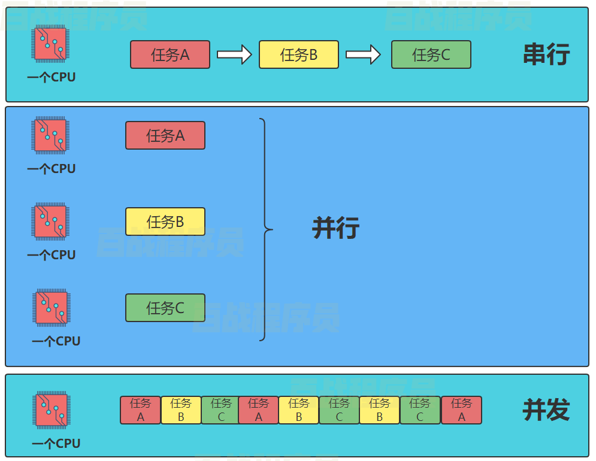
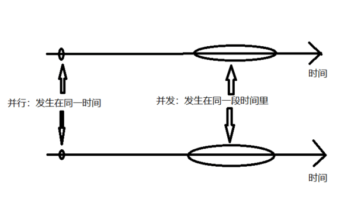

# 一、JUC简介

## 一、JUC概述

1. JUC 是 java.util.concurrent 的简写，在并发编程中使用的工具类 
2. 实现多线程有三种方式：Thread、Runnable、Callable，其中 Callable 就位于 concurrent 包下 

## 二、进程、线程和管程

1. 进程：进程是一个具有一定独立功能的程序，关于某个数据集合的一次运行活动。它是操作系统动态执行的基本单元，在传统的操作系统中，进程既是基本的分配单元，也是基本的执行单元
2. 线程：通常在一个进程中可以包含若干个线程，当然一个进程中至少有一个线程，不然没有存在的意义，线程可以利用进程所有拥有的资源。在引入线程的操作系统中，通常都是把进程作为分配资源的基本单位，而把线程作为独立运行和独立调度的基本单位，由于线程比进程小，基本上不拥有系统资源， 故对它的调度所付出的开销就会小得多，能更高效的提高系统多个程序间并发执行的程度
3. 管程：Monitor（锁），也就是我们平时所说的锁。Monitor 其实是一种**同步机制**，它的义务是保证（同一时间）只有一个线程可以访问被保护的数据和代码，JVM中同步是基于进入和退出监视器（Monitor管程对象）来实现的。Monitor 对象并不会随着 Java 对象的销毁而销毁，Java对象是在Java堆中创建的，而Monitor是与Java对象关联的、由JVM内部管理的机制。Monitor的创建和销毁并不直接对应于Java对象的创建和销毁。更确切地说，当Java对象被用作同步锁时，JVM会为该对象关联一个Monitor；而当该对象不再被用作同步锁，或者对象被垃圾回收时，与其关联的Monitor可能会被JVM内部释放或重新利用

## 三、并发和并行

1. 并发：并发是指两个或多个事件在同一时间间隔发生；并发侧重于在同一实体上；并发在一台处理器上同时处理多个任务 

2. 并行：并行是指两个或者多个事件在同一时刻发生；并行侧重于在不同实体上；并行在多台处理器上同时处理多个任务。并发指的是在宏观上多个程序或任务在同时运行，而在微观上这些程序交替执行，可以提高系统的资源利用率和吞吐量。通常一个CPU内核在一个时间片只能执行一个线程（某些CPU采用超线程技术，物理核心数和逻辑核心数形成一个 1：2 的关系，比如4核CPU，逻辑处理器会有8个，可以同时跑8个线程），如果N个内核同时执行N个线程，就叫做并行

   

   

## 四、线程分类

1. 用户线程：是系统的工作线程，它会完成这个程序需要完成的业务操作。默认都是用户线程

2. 守护线程：是一种特殊的线程为其他线程服务的，在后台默默地完成一些系统性的任务，比如垃圾回收线程就是最典型的例子。守护线程作为一个服务线程，没有服务对象就没有必要继续运行了，如果用户线程全部结束了，意味着程序需要完成的业务操作已经结束了，系统可以退出了。所以假如当系统只剩下守护线程的时候，守护线程伴随着JVM一同结束工作

   ```java
   /**
    * @author Guanghao Wei
    * @create 2023-04-10 10:59
    */
   public class DaemonDemo {
       public static void main(String[] args) {
           Thread t1 = new Thread(() -> {
               System.out.println(Thread.currentThread().getName() + " 开始运行," + (Thread.currentThread().isDaemon() ? "守护线程" : "用户线程"));
               while (true) {
   
               }
           }, "t1");
           t1.setDaemon(true);//通过设置属性Daemon来设置当前线程是否为守护线程
           t1.start();
           try {
               TimeUnit.SECONDS.sleep(3);
           } catch (InterruptedException e) {
               e.printStackTrace();
           }
   
           System.out.println(Thread.currentThread().getName() + " 主线程结束");
       }
   }
   
   
   输出：t1 开始运行,守护线程
   main 主线程结束--->在main主线程结束后，守护线程会伴随着JVM一同结束工作，即使还有循环没有结束
   ```

# 二、CompletableFuture

## 一、Future接口理论

