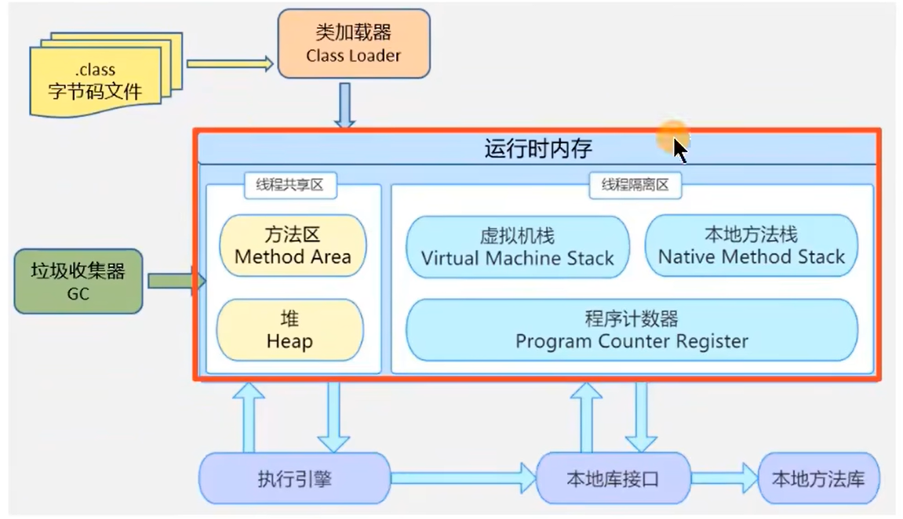
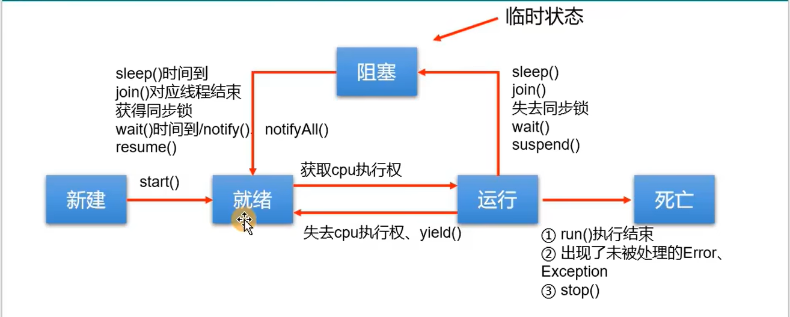
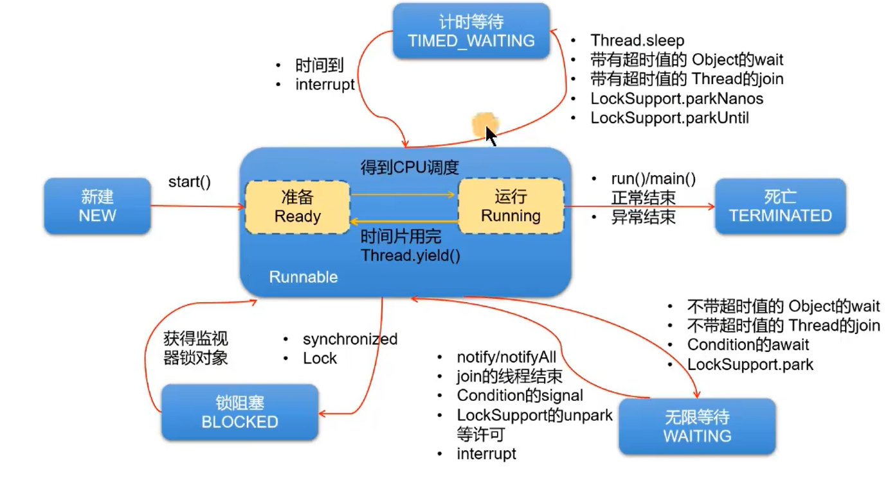
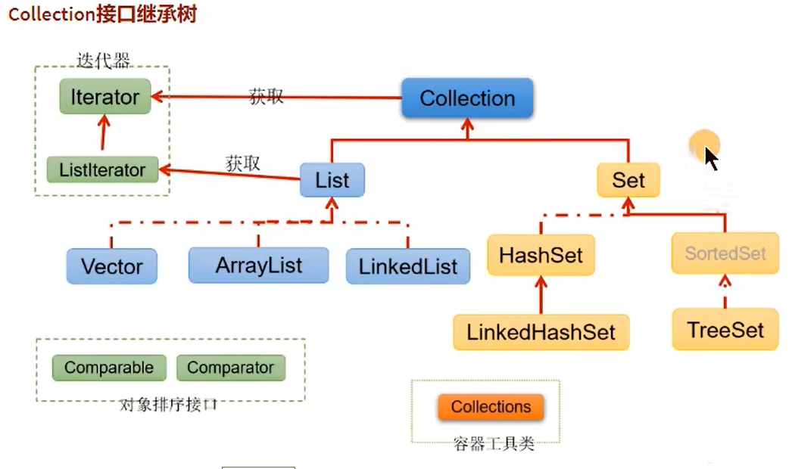
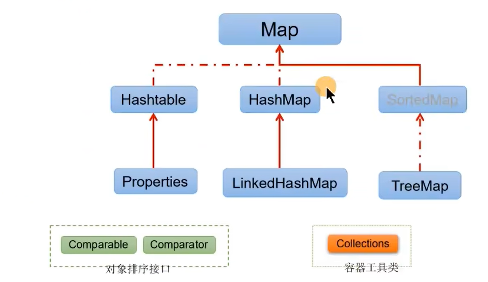

# 一、异常处理

### 一、异常的抛出机制

- Java中把不同的异常用不同的类表示，一旦发生某种异常，就创建该异常类型的对象，并且抛出（throw）。然后程序员可以捕获（catch）到这个异常并处理；如果没有捕获（catch）这个异常对象，那么这个异常对象将会导致程序终止

### 二、Java异常体系

##### 一、Throwable

1. java,lang.Throwable类是Java程序执行过程中发生的异常事件对应的类的根父类
2. Throwable中的常用方法
	- public void printStackTrace()：打印异常的详细信息。包含了异常的类型、异常的原因、异常出现的位置、在开发和调试阶段都得使用printStackTrace
	- public String getMessage()：获取异常的原因

##### 二、Error和Exception

1. Error（java.lang.Error）：java虚拟机无法解决的严重问题。如：JVM系统内部错误、资源耗尽等严重情况。一般不编写针对性的代码进行处理。也是非受检异常
	- 栈内存溢出（StackOverflowError）
	- 堆内存溢出（OutOfMemoryError），简称OOM
2. Exception（java.lang.Exception）：其他因编程错误或偶然的外在因素导致的一般性问题，需要使用针对性的代码进行处理，使程序继续运行。否则一旦发生异常，程序也会挂掉
	- 空指针访问
	- 试图读取不存在的文件
	- 网络连接中断
	- 数组角标越界

### 三、Exception的分类

##### 一、编译时期异常

1. 编译时期异常：即checked异常、受检异常，在代码编译阶段，编译器就能明确警示当前代码可能发生的异常，并明确督促程序员提前编写处理它的代码。如果程序员没有编写对应的异常处理代码，则编译器就会直接判定编译失败，从而不能生成字节码文件。通常，这类异常的发生不是由程序员的代码引起的，或者不是靠简单判断就可以避免的。开发中，编译时期的异常都需要处理
2. 常见的编译时期异常
	- ClassNotFoundException：未找到类异常
	- FileNotFoundException：文件未找到异常
	- IOException：输入输出异常

##### 二、运行时期异常

1. 运行时期异常，即runtime异常、unchecked异常、非手检异常，在代码编译阶段，编译器完全不做任何检查，无论该异常是否会发生，编译器都不给出任何提示。只有等代码运行起来并确定发生了某种异常，它才能被发现。通常，这类异常是程序员的代码编写不当引起的，只要稍加判断，或者细心检查既可以避免的。开发中，通常就不进行运行时期异常的处理，一旦在程序执行，出现了运行时异常那就根据异常的提示的信息进行修改代码
2. 常见的运行时期异常
	- ArrayIndexOutOfBoundsException：角标越界异常
	- NullPointerException：空指针异常
	- ClassCastException：类型转换异常
	- NumberFormatException：数字格式化异常
	- InputMismatchExcepton：填入异常不匹配异常
	- ArithmeticException：算数异常

### 四、异常处理方式

##### 一、try-catch-finally

1. 抛异常：程序在执行的过程中，一旦出现异常，就会在出现异常的代码处，生成对应异常类的对象，并将此对象抛出。一旦抛出，此程序就不执行其后的代码了

2. 抓异常：针对于抛出的异常的异常对象，进行捕获处理、一旦将异常进行了处理，代码就可以继续执行

3. 基本结构

	```java
	try{
	    // 可能产生异常的代码
	}
	catch(异常类型1 e){
	    // 当产生异常类型1型异常时的处置操作
	}
	catch(异常类型2 e){
	    // 当产生异常类型2型异常时的处置操作
	}
	finally{
	    // 无论是否发生异常，都无条件执行的语句
	}
	// 如果没有finally则此处可以继续执行
	```

4. try-catch使用细节

	- 将可能出现异常的代码声明在try语句中。一旦代码出现异常，就会自动生成一个对应异常类的对象，并将此对象抛出
	- 针对于try中抛出的异常类的对象，使用之后的catch语句进行匹配。一旦匹配上，就进入catch语句块进行处理。一旦处理结束，代码就可能继续向下执行
	- 如果声明了多个catch结构，不同的异常类型在不存在子父类关系的情况下，谁声明在上面，谁声明在下面都可以；如果多个异常类型满足子父类的关系，则必须将子类声明在父类结构上的上面，否则报错。无论是否有子父类的异常对象类型，从上至下匹配，捕获到的异常只会执行一次，
	- catch中异常处理的方式：自己编写输出的语句；printStackTrace()，打印异常的详细信息；getMessage()，获取发生异常的原因
	- try中声明的变量的只能在try中使用，出了try结构之后，就不能进行调用了
	- try-cath结构可以嵌套使用

5. finally使用细节

	- 将一定要执行的代码声明在finally结构中，如果没有声明finally，则后面的也会执行，就怕catch中有代码会抛异常或者报错
	- 无论try中或catch中是否存在仍未被处理的异常，无论try中或catch中是否存在return语句等，finally中声明的语句都会执行
	- 如果执行finally代码块之前有return的返回值，则先将返回值存放在操作数栈中，等待执行finally之后再去返回此值，即使finally代码块中操作过此值，返回也是return时候的值。当然finally中return新值会把try或catch中return返回的值覆盖
	- catch和finally都要搭配try使用，不能单独使用
	- 在开发过程中，有一些资源（输入流、输出流、数据库连接、Socket连接等资源），在使用完毕后，必须显示的进行关闭操作，否则，GC不会自动的回收这些资源，进而导致内存泄漏。为了保证这些资源在使用完毕之后，不管是否出现了未被处理的异常的情况下，这些资源能被关闭。我们必须将这些操作声明在finally中

##### 二、throws+异常类型

1. throws格式：在方法的声明处，使用 throws 异常类型1,异常类型2……{}
2. throws处理异常的结果
   - 从编译是否通过的角度看，看成是给出了异常万一要是出现的时候的解决方案，此方案就是继续向上抛出
   - 仅是将可能出现的异常抛给了此方法的调用者。此调用者仍然需要考虑如何处理相关异常，从这个角度来看，throws的方式不算是真正意义上处理了异常

三、开发中try-catch与throws的使用

1. 如果程序代码中，涉及到资源的调用（流、数据库连接、网络连接等），则必须考虑使用try-catch-finally来处理，保证不出现内存泄漏
2. 如果父类被重写的方法没有throws异常类型，则子类重写的方法中如果出现异常，只能考虑使用try-catcj-finally进行处理，不能throws
3. 开发中，方法a中依次调用了方法b,c,d等方法，方法b,c,d之间是递进关系。此时，如果方法b,c,d中有异常，我们通常选择使用throws，而方法a中通常选择使用try-catch-finally

### 五、手动抛出异常

##### 一、手动抛出异常的原因

- 在实际开发过程中，如果出现不满足具体场景的代码问题，我们就有必要手动抛出一个指定类型的异常对象

##### 二、手动抛出异常的格式

- throw + 异常类的对象
- throw抛出异常的方法声明上必须要有throws来抛出。throws后面的异常必须是与throw抛出的异常类型相同或是throw抛出的异常类型的的父类
- throw下一行不能写代码了
- 如果抛出的是运行时异常，则不需要捕获；如果抛出的是编译时异常，则需要捕获

##### 三、throw和throws的区别

- throws使用在方法声明上，作用是将异常向上抛出，属于异常处理。throws后面跟的是异常类型
- throw使用在方法内部，作用是将异常抛出，属于产生异常对象。throw后面跟得知异常类型对象

### 六、自定义异常

##### 一、自定义异常类的格式

- 继承于现有的异常体系。通常继承于RuntimeException/Exception
- 通常提供几个重载的构造器
- 提供一个全局常量，声明为：static final long serialVersionUID

##### 二、自定义异常类的使用

- 在具体的代码中，满足指定条件的情况下，需要手动的使用 throw + 自定义异常类的对象 这种方式，将异常对象抛出
- 如果自定义异常类是非运行时异常，则必须考虑如何处理此异常类的对象

##### 三、自定义异常类的意义

- 通过异常的名称就能直接判断此异常出现的原因。尽然如此，我们就有必要在实际开发场景中，不满足我们指定的条件时，指明我们自己特有的异常类。通过此异常类的名称就能判断出具体出现的问题

# 二、多线程

### 一、程序、进程与线程

1. 程序：为完成特定任务，用某种语言编写的一组指令的集合。即指一段静态的代码，静态对象

2. 进程：程序的一次执行过程，或是正在内存中运行的应用程序。每个进程都有一个独立的内存空间，系统运行一个程序即是一个进程创建、运行到消亡的过程（生命周期）。程序是静态的，进程是多态的。进程是操作系统调度和分配资源的最小单位（亦是系统运行程序运行的基本单位），系统在运行时会为每个进程分配不同的内存区域

3. 线程：进程可进一步细化为线程，是程序内部的一条执行路径。线程是CPU调度和执行的最小单位。一个进程中的多个线程会共享相同的内存单元，他们从同一个堆中分配对象，可以访问相同的变量和对象。这就使得线程间通信更简便、高效。但多个线程操作共享的系统资源可能会带来安全隐患

4. 线程调度

   - 分时调度，所有线程轮流使用CPU的使用权，并且平均分配每个线程占用的CPU的时间
   - 抢占式调度，让优先级高的线程以较大的概率优先使用CPU，如果线程的优先级相同，那么会随机选择一个（线程随机性）
   -  Java使用的为抢占式调度

5. 多线程程序的优点

   - 提高应用程序的响应。对图形化界面更有意义，可增强用户体验
   - 提高计算机系统CPU的利用率
   - 改善程序结构。将既长又复杂的进程分为多个线程，独立运行，利于理解和修改

6. JVM虚拟机图解

   - 一个进程占用一个内存空间，不同的进程之间是不共享内存的
   - 线程共享进程的内存有：方法区、堆
   - 线程独有的内存有：虚拟机栈、本地方法栈、程序计数器

   

### 二、并行与并发、串行

1. 并行（parallel）：指两个或多个事件在同一时刻发生（同时发生）。指在同一时刻，有多条指令在多个CPU上同时执行
2. 并发（concurrency）：指两个或多个事件在同一时间段内发生。即在一段时间内，有多条指令在单个CPU上快速轮换、交替执行，使得在宏观上具有多个进程同时执行的效果
3. 串行：一次只能取得一个任务并执行这个任务，这个任务执行完后面的任务才能继续

### 三、创建和启动线程

##### 一、概述

1. Java语言的JVM允许程序运行多个线程，使用java.lang.Thread类代表线程，所有的线程对象都必须是Thread类或其子类的实例
2. Thread类的特性
   - 每个线程都是通过某个特定的Thread对象的run()方法来完成操作的，因此把run()方法称为线程执行体
   - 通过该Thread对象的start()方法来启动这个线程，而非直接调用run()
   - 要想实现多线程，必须在主线程中创建新的线程对象

##### 二、继承Thread类

1. 定义Thread类的子类，并重写该类的run()方法，该run()方法的方法体就代表了线程需要完成的任务。执行不同逻辑的线程定义不同的子类，分别调用即可

2. 创建Thread子类的实例，即创建了线程对象

3. 调用线程对象的start()方法来启动该线程

4. 通过对象调用start()的作用：启动线程；调用当前线程的run()

5. 不能让已经start()的线程，再次执行start()，否则报异常

6. 如果Thread类的实例调用start()方法，放在的最后，则先会执行完main方法的逻辑，再开启线程

   ```java
   // 定义Thread类的子类
   class Father extends Thread{
   
       // 重写run()方法，实现业务逻辑
       @Override
       public void run() {
           for(int i=0;i<100;i++){
               if(i%2==0){
                   System.out.println(i+"");
               }
           }
       }
       
       public static void main(String[] args) {
           // 直接创建Thread子类的实例
           Father father = new Father();
           // 调用线程对象的start()方法来唤醒线程
           father.start();
           
           // 创建Thread类的匿名子类的匿名对象
           new Thread(){
               @Override
       		public void run() {
           		for(int i=0;i<100;i++){
               		if(i%2==0){
                   		System.out.println(i+"");
               		}
           		}
       		}
           }
       }
   }
   
   ```


##### 三、实现Runnable

1. 创建一个实现Runnable接口的类

2. 实现接口中run方法

3. 创建当前类的对象

4. 将此对象作为参数传递到Thread类的构造器中，创建Thread类的实例

5. Thread类的实例调用start()方法。这里的start()同上面用继承方式实现的start()方法

6. 如果Thread类的实例调用start()方法，放在的最后，则先会执行完main方法的逻辑，再开启线程

   ```java
   // 创建实现Runnable的类
   class Son implements Runnable {
   
       // 实现run方法
       @Override
       public void run() {
           for (int i = 0; i < 100; i++) {
               if (i % 2 == 0) {
                   System.out.println(Thread.currentThread().getName() + "->" + i);
               }
           }
       }
       
       public static void main(String[] args) {
           // 创建当前类的对象
           Son son = new Son();
           // 将此对象作为参数传递到Thread类的构造器中，创建Thread类的实例
           Thread thread = new Thread(son);
           // Thread类的实例调用start()方法
           thread.start();
           
           // 匿名实现类的匿名对象
           new Thread(new Runnable() {
               @Override
               public void run() {
                   for (int i = 0; i < 1000; i++) {
                       if (i % 2 == 0) {
                           System.out.println(Thread.currentThread().getName() + "->" + i);
                       }
                   }
               }
           }).start();
       }
   }
   
   
   ```

7. 继承Thread和实现Runnable的共同点和不同点

   - 共同点：

     1、启动线程，使用的都是Thread类中定义的start()

     2、创建的线程对象，都是Thread类或其子类的实例

   - 不同点：

     1、一个类的继承，一个是接口的实现。建议使用Runnable的方式

     2、实现Runnable的好处有：实现的方式避免类的单继承的局限性；更适合处理有共享数据的问题；实现了代码和数据的分离

   - 联系：

     public class Thread implements Runnable{} 顾名思义，Thread也是实现Runnable接口，此处就用到了代理模式

##### 三、实现Callable

1. 创建一个实现Callable的实现类
2. 实现call方法，将此线程需要执行的操作声明在call()中
3. 创建Callable接口实现类的对象
4. 将Callable接口实现类的对象作为参数传递到FutureTask构造器中，创建FutureTak的对象。FutureTak也是实现了Runnable接口
5. 将FutureTaks的对象作为参数传递到Thread类的构造器中，创建Thread对象并调用start()
6. 获取Callable中的call方法的返回值。get()返回值即为FutureTask构造器参数Callable实现类重写的call()方法的返回值
7. 实现Callable与实现Runnable的比较
   - call()可以有返回值，更灵活
   - call()可以使用throws的方式处理异常，更灵活
   - Callable使用了泛型参数，可以指明具体的call()的返回值类型，更灵活
   - 如果在主线程中需要获取分线程call()的返回值，则此时的主线程是阻塞状态的

##### 四、使用线程池

1. 使用线程池的步骤

   - 提供指定线程数量的线程池

   - 执行指定的线程的操作。需要提供实现Runnable接口或者Callable接口实现类的对象

   - 关闭连接池

     ```java
     class NumberThread1 implements Runnable{
     
         @Override
         public void run() {
             for (int i = 0; i <=100 ; i++) {
                 if(i%2==0){
                     System.out.println(Thread.currentThread().getName()+"："+i);
                 }
             }
         }
     }
     
     class NumberThread2 implements Runnable{
     
         @Override
         public void run() {
             for (int i = 0; i <=100 ; i++) {
                 if(i%2!=0){
                     System.out.println(Thread.currentThread().getName()+"："+i);
                 }
             }
         }
     }
     
     public class PrintNumberTest{
     
         public static void main(String[] args) {
             // 1、提供指定线程数量的线程池
             ExecutorService service = Executors.newFixedThreadPool(10);
             ThreadPoolExecutor executor = (ThreadPoolExecutor) service;
             // 设置线程池的属性。设置线程池中线程数的上线
             executor.setMaximumPoolSize(50);
             // 2、执行指定的线程的操作。需要提供实现Runnable接口或者Callable接口实现类的对象
             service.execute(new NumberThread1()); // 适用于Runnable
             service.execute(new NumberThread2()); // 适用于Runnable
             service.submit(Callable callable); // 适用于Callable
             service.shutdown();
         }
     }
     ```

2. 线程池的好处

   - 提高了程序执行的效率。因为线程已经提前创建好了
   - 提高了资源的复用率。因为执行完的线程并未销毁，而是可以继续执行其他的任务
   - 可以设置相关的参数，对线程池中的线程的使用进行管理

```java
// 1、创建一个实现Callable的实现类
public class PrintNumberTest implements Callable {

    // 2、实现call方法，将此线程需要执行的操作声明在call()中
    @Override
    public Object call() throws Exception {
        int sum = 0;
        for (int i = 0; i <= 100; i++) {
            System.out.println(Thread.currentThread().getName() + "：" + i);
            sum += i;
        }
        return sum;
    }
    
    public static void main(String[] args) {
        // 3、创建Callable接口实现类的对象
        PrintNumberTest print = new PrintNumberTest();
        // 4、将Callable接口实现类的对象作为参数传递到FutureTask构造器中
        FutureTask task = new FutureTask(print);
        // 将FutureTaks的对象作为参数传递到Thread类的构造器中
        Thread thread = new Thread(task);
        thread.start();

        try {
            // 6、获取Callable中的call方法的返回值。get()返回值即为FutureTask构造器参数Callable实现类重写				   的call()方法的返回值
            Object sum = task.get();
            System.out.println("总和：" + sum);
        } catch (InterruptedException e) {
            throw new RuntimeException(e);
        } catch (ExecutionException e) {
            throw new RuntimeException(e);
        }
    }
}
```

### 四、线程常用结构

##### 一、线程中的构造器

1. public Thread()：分配一个新的线程对象
2. public Thread(String name)：分配一个指定名字的新的线程对象
3. public Thread(Runnable target)：指定创建线程的目标对象，它实现了Runnable接口中的run方法
4. public Thread(Runnable trarget,String name)：分配一个带有指定目标新的线程对象并指定名字

##### 二、线程中常用方法

1. start()：启动线程；调用线程的run()
2. run()：将线程要执行的操作，声明在run()中
3. currentThread()：获取当前执行代码对应的线程
4. sleep(long millis)：静态方法，可以使得当前线程睡眠指定的毫秒数
5. yield()：静态方法，一旦执行到此方法就释放当前线程所占用的CPU使用权
6. join()：非静态方法，在线程a中通过线程b调用join()，意味着线程a进入阻塞状态，直到线程b执行结束，线程a才结束阻塞状态继续执行
7. isAlive()：判断当前线程是否存活
8. getPriority()：获取线程的优先级
9. setPriority：设置当前线程的优先级，范围为1-10，优先级高的线程只是有较大概率获取到CPU资源并不一定能获取到资源

##### 三、线程优先级

1. MAX_PRIORITY(10)：最高优先级
2. MIN_PRIORITY(1)：最低优先级
3. NORM_PRIORITY(5)：普通优先级，默认情况下main线程具有普通优先级

### 五、线程的生命周期

##### 一、jdk5之前：5种状态



##### 二、jdk5之后：6大种状态



### 六、同步代码块与同步方法

##### 一、同步代码块

1. 需要被同步的代码：即为操作共享数据的代码。共享数据即多个线程需要操作的数据。需要被同步的代码在被synchronized包裹之后，就使得一个线程在操作这些代码的过程中，其他代码必须等待
2. 同步监视器：即为锁。哪个线程获取了锁，哪个线程就能执行需要被同步的代码。同步监视器可以使用任何一个类的对象充当，但是，多个线程必须共用同一个同步监视器，也就是说充当同步监视器的类的对象要唯一。如果使用实现Runnable接口，同步监视器可以使用this代替；如果使用继承Thread类的方式实现，同步监视器可以使用当前类.class来代替，这个方法也可以使用在实现Runnable接口中

```java
// synchronized相当于线程进入操作代码块的入口，每次只能有一个线程进入，其他的线程在外等待
synchronized(同步监视器){
    // 需要被同步的代码
}
```

##### 二、同步方法

1. 如果操作共享数据的代码完整的声明在了一个方法中，那么我们就可以将此方法声明为通过不方法即可
2. 非静态的的同步方法，默认同步监视器是this；静态的同步方法，默认同步监视器是当前类本身

```java
public synchronized void show(){//如果使用实现Runnable方法则此处的同步监视器是this，也就是类的唯一实例；如果继承Thread类的方法，如需要在方法上再加上static，表示同步监视器为当前类的实例，也可以将synchronized写在此方法里面作为方法块使用。不要为了线程安全而丢掉操作
    // 需要被同步的代码
}
```

##### 三、synchronized的优劣势

1. 优势
   - 解决了线程的安全问题
2. 劣势
   - 在操作共享数据时，多线程是串行执行的，意味着性能低 

### 七、实现线程安全的懒汉式单例

```java
class Bank{

    public Bank() {
    }

    private static Bank instance = null;

    // 方式一：同步方法实现线程安全的懒汉式单例
    public synchronized static Bank getInstance(){
        if(instance == null){
            instance = new Bank();
        }
        return instance;
    }
   
}


class Bank{

    public Bank() {
    }

    private static Bank instance = null;

    // 方式二：同步代码块实现线程安全的懒汉式单例
    public static Bank getInstance(){
        synchronized (Bank.class){
            if(instance == null){
                instance = new Bank();
            }   
        }
        return instance;
    }
}


class Bank{

    public Bank() {
    }

    // 为了避免出现指令重排，需要将instance声明为volatile
    private static volatile Bank instance = null;

    // 方式三：同步代码块实现线程安全的懒汉式单例，双层判断相较于方式一和二效率更高
    public static Bank getInstance(){
        if(instance == instance){
            synchronized (Bank.class){
                if(instance == null){
                    instance = new Bank();
                }
            }   
        }
        return instance;
    }
}

```

### 八、死锁问题

1. 死锁概念：不同的线程分别占用对方需要的同步资源不放弃，都在等待对方放弃自己需要的同步资源，就形成了线程的死锁
2. 诱发死锁的原因（四个条件，缺一不可）
   - 互斥条件
   - 占用并等待
   - 不可抢夺（或不可抢占）
   - 循环等待
3. 解决死锁
   - 死锁一旦出现，基本很难人为干预，只能尽量避免。可以考虑打破上面的诱发条件
   - 针对互斥条件问题：互斥条件基本上无法被破坏。因为线程需要通过互斥解决安全问题
   - 针对占用并等待问题：可以考虑一次性申请所有所需的资源，这样就不存在等待的问题
   - 针对不可抢占问题：占用部分资源的线程在进一步申请其他资源时，如果申请不到，就主动释放掉已经占用的资源
   - 针对循环等待问题：可以将资源改为线性顺序。申请资源时，先申请序号较小的，这样避免循环等待问题

### 九、Lock锁机制

1. 使用Lock锁的步骤

   - 创建Lock的实例，需要确保多个线程共用一个Lock实例！需要考虑将此对象声明为static final

   - 执行lock()方法，锁定对共享资源的调用

   - 执行unlock()的调用，释放对共享数据的锁定

     ```java
     // 创建Lock的实例，需要确保多个线程共用一个Lock实例
     private static final ReentrantLock LOCK = new ReentrantLock();
     
     Thread thread1 = new Thread(new Runnable() {
     		@Override
              public void run() {
                  // 执行lock()方法，锁定对共享资源的调用
              	LOCK.lock();
                  
                  try {
                  	// 执行代码逻辑
                  }finally {
                     // 执行unlock()的调用，释放对共享数据的锁定。在try-finally中调用确保unlock方法执行
                  	LOCK.unlock();
                  }
     		}
     	}
      );
     ```

     

2. synchronized和Lock锁的对比

   - synchronized不管是同步代码块还是同步方法，都需要在结束一对{}之后，释放对同步监视器的调用
   - Lock是通过两个方法控制需要被同步的代码，更灵活一点
   - Lock作为接口，提供了多种实现方式，适合更多更复杂的场景，效率更高

### 十、线程的通信

##### 一、线程间的通信

- 当我们需要多个线程来共同完成一件任务，并且我们希望他们有规律的执行，那么多线程之间需要一些通信机制，可以协调它们的工作，以此实现多线程共同操作一份数据。所以我们使用等待唤醒机制来实现线程间的通信

##### 二、等待唤醒机制

1. 等待唤醒机制是多个线程间的一种协作机制

2. 在一个线程满足某个条件时，就进入等待状态（wait()/wait(time)），等待其他线程执行完他们的指定代码后再将其唤醒（notify()）;或可以指定wait的时间，等时间到了自动唤醒；在有多个线程进行等待时，如果需要，可以使用notifyAll()来唤醒所有的等待线程。wait/notify就是线程间的一种写作机制

   - wait：线程不再活动，不再参与调度，进入wait set中，因此不会浪费CPU资源，也不会去竞争锁，这时的线程状态为WAITING或TIMED_WAITING。它还要等着别的线程执行通知操作，也就是notify，或者等待时间到，在这个对象上等待的线程从wait set中释放出来，重新进入到调度队列（ready queue）中。简而言之，线程一旦执行此方法，就进入等待状态，同时会释放对同步监视器的调用
   - notify：则选取所通知对象的wait set中的一个线程释放。简而言之，一旦执行此方法，就会唤醒被wait()的线程中优先级最高的一个线程。如果被wait()的多个线程的优先级相同则随机唤醒一个。被唤醒的线程从当初被wait的位置继续执行
   - notifyAll：则释放所通知对象的wait set上的全部线程。简而言之，一旦执行此方法，就会唤醒所有被wait的线程

3. 注意点

   - wait、notify和notifyAll这三个方法必须声明在synchronized修饰的同步方法或同步代码块中 
   - wait、notify和notifyAll这三个方法的调用者必须是synchronized使用的相同的同步监视器
   - wait、notify和notifyAll这三个方法声明在Object类中

4. wait和sleep的区别

   - 相同点：一旦执行，当前线程都会进入阻塞状态

   - 不同点

     ① 声明的位置不同：wait声明在Object类中；sleep声明在Thread类中，而且是静态的

     ② 使用的场景不同：wait只能使用在同步代码块或同步方法中；sleep可以在任何需要使用的场景

     ③ 使用在同步代码块或同步方法中：wait一旦执行会释放同步监视器；sleep一旦执行不会释放同步监视器

     ④ 结束阻塞的方式：wait到达指定时间自动结束阻塞或通过被notify唤醒，结束阻塞；sleep达到指定时间自动结束阻塞

# 三、常用类和基础API

### 一、不可变字符序列：String

##### 一、String类的声明

```java
public final class String implements java.io.Serializable, Comparable<String>, CharSequence
```

1. final：String是不可继承的
2. Serializable：可序列化的接口。凡是实现此接口的类的对象就就可以通过网络或本地流进行数据的传输
3. Comparable：凡是实现此接口的类，其对象都可以比较大小

##### 二、String内部声明的属性

```java
private final char value[]; // jdk8此处的数组类型是char型的
private final byte value[]; // jdk9及其以后此处的数组类型是byte型的，为了节省内存空间，做了优化
```

- 存储字符串数据的容器。此处的final指明此value数组一旦初始化，其地址就不可变

##### 三、String字符串常量的存储位置

1. 字符串常量都存储在字符串常量池（StringTable）中

2. 字符串常量池中不允许存放两个相同的字符串常量

3. 字符串常量池，在不同的jdk版本中，存放位置不同。jdk7之前，字符串常量池存放在方法区中；jdk7及其后，字符串常量池存放在堆空间中

   ```java
   // 此处的name1和name2都指向常量池中的hello，所以name1和name2的地址相同
   String name1 = "hello";
   String name2 = "hello";
   ```

##### 四、String的不可变性的理解

1. 当对字符串变量重新赋值时，需要重新指定一个字符串常量的位置进行赋值，不能在原有的位置上修改
2. 当对现有字符串进行拼接操作时，需要重新开辟空间保存拼接以后的字符串，不能在原有的位置上修改
3. 当调用字符串的replace()替换现有的某个字符时，需要重新开辟空间保存修改以后的字符串，不能再原有的位置上修改

##### 五、String实例化的两种方式

1. 自变量的方式：String s = "hello"
2. 对象的方式：String s = new String("hello") -> 在内存中创建了两个对象，一个是堆空间中new的对象；另一个是在字符串常量池中生成的字面量

##### 六、String的连接操作：+

1. 常量+常量：结果仍然存储在字符串常量池中，返回此字面量的地址。此时的常量可能是字面量，也可能是final修饰的常量
2. 常量+变量 或 变量+变量：都会通过new的方式创建一个新的字符串，返回堆空间中此字符串对象的地址
3. 调用字符串的intern()：返回的是字符串常量池中字面量的地址。常量池中有此字面量则直接返回，无此字面量则创建新的再返回其新建字面量的地址
4. concat(参数)：不管是常量调用此方法，还是变量调用，同样不管参数是常量还是变量，总之，调用完concat()方法都返回一个新new的对象

##### 七、字符集问题

1. Unicode包罗万象，以下得字符集都包含
2. 在UTF-8中，一个汉字占用3个字节，一个字母占用1个字节
3. 在GDK中，一个汉字占用2个字节，一个字母占用1个字节
4. UTF-8、GDK等字符集中都向下兼容了ASCII码
5. 编码与解码
   - 编码：String转为字节或字节数组
   - 解码：字节或字节数组转为String
   - 解码时使用的字符集必须要与编码时使用的字符集一致，不一致就会乱码

##### 八、String的构造器和常用方法

1. public String()：初始化新创建的String对象，以使其表示空字符序列
2. public String(String original) ：初始化一个新创建的String对象，使其表示一个与参数相同的字符序列。换而言之，新创建的字符串是该参数字符串的副本
3. public String(char[] value)：通过当前参数中的字符数组来构造新的String
4. public String(char[] value,int offset,int count)：通过字符数组的一部分来构造新的String
5. public String(byte[] bytes)：通过使用平台的默认字符集解码当前参数中的字节数组来构造新的String
6. public String(byte[] bytes,String charsetName)：通过使用指定的字符集解码当前参数中的字节数组来构造新的String
7. String与char型数组转换
   - String转char数组：使用 字符串（常量或变量）.toCharArray()方法
   - char数组转String：使用 String的构造器，String(new char[])
8. String与byte型数组转换
   - String转byte数组：使用 字符串（常量或变量）.getBytes(可以指定字符集类型)方法
   - byte数组转String：使用 String的构造器，String(new byte[])
9. boolean isEmpty()：字符串是否为空
10. int length()：返回字符串长度
11. String concat(XX)：拼接字符串，返回一个新的字符串
12. boolean equals(Object obj)：比较字符串是否相等，区分大小写
13. boolean equalsIgnoreCase(Object obj)：比较字符串是否相等，不区分大小写
14. int compareTo(String other)：比较字符串大小，区分大小写，按照Unicode编码值比较大小，前值减去后值得到的大小
15. int compareToIgnoreCase(String other)：比较字符串大小，不区分大小写，按照Unicode编码值比较大小，前值减去后值得到的大小
16. String toLowerCase()：将字符串中大写字母转为小写
17. String toUpperCase()：将字符串中小写字母转为大写
18. String trim()：去掉字符串前后空白符
19. public String intern()：结果在常量池中共享
20. boolean contains(xx)：是否包含xx
21. int indexOf(xx)：从前往后找当前字符串中xx，即如果有返回第一次出现的下标，没有则返回-1
22. int indexOf(String str,int fromIndex)：返回指定子字符串在此字符串中第一次出现处的索引，从指定的索引开始
23. int lastIndexOf(xx)：从后往前找当前字符串中xx，即如果有返回最后一次出现的下标，没有则返回-1
24. int lastIndexOf(String str,int fromIndex)：返回指定子字符串在此字符串中最后一次出现处的索引，从指定的索引开始
25. String substring(int beginIndex)：返回一个新的字符串，它是此字符串的从beginIndex开始截取
26. String substring(int beginIndex,int endIndex)：返回一个新的字符串，它是此字符串的从beginIndex开始截取，到endIndex结束，但是不包括endIndex。也就是左闭右开原则
27. char charAt(index)：返回[index]位置的字符
28. char toCharArray()：将此字符串转换为一个新的字符数组返回
29. static String valueOf(char[] data)：返回指定数组中表示该字符序列的String
30. static String valueOf(char[] data,int offset,int count)：返回指定数组中表示该字符序列的String，从offset下标开始复制count个字符
31. static String copyValueOf(char[] data)：返回指定数组中表示该字符序列的String
32. static String copyValueOf(char[] data,int offset,int count)：返回指定数组中表示该字符序列的String，从offset下标开始复制count个字符
33. boolean startsWith(xx)：测试此字符串是否以指定的前缀开始
34. boolean startsWith(String prefix,int toffset)：测试此字符串从指定索引开始的子字符串是否以指定的前缀开始
35. boolean endWith(xx)：测试此字符串是否以指定的后缀结束
36. String replace(char oldChar,char newChar)：返回一个新的字符串，使用newChar替换所有oldChar字符
37. Sting replace(CharSequence target,CharSequence repalcement)：使用指定的字面值替换序列替换此字符串所有匹配的字面值目标序列的子字符串
38. String replaceAll(String regex,String replacement)：使用给定的replacement替换此字符串所有匹配给定的正则表达式的子字符串
39. String replaceFirst(String regex,String replacement)：使用给定的replacement替换此字符串匹配给定的正则表达式的第一个子字符串

### 二、StringBuffer与StringBuilder

##### 一、String、StringBuffer与StringBuilder的对比

1. String：不可变的字符序列；jdk8.0及之前底层使用char[]数组，jdk9.0及之后底层使用byte[]数组
2. StringBuffer：可变的字符序列；jdk1.0声明，线程安全；效率低，但是效率比String高；jdk8.0及之前底层使用char[]数组，jdk9.0及之后底层使用byte[]数组
3. StringBuilder：可变的字符序列；jdk5.0声明，线程不安全；效率高；jdk8.0及之前底层使用char[]数组，jdk9.0及之后底层使用byte[]数组

##### 二、StringBuffer与StringBuilder的可变性分析

1. 内部的属性
	- char[] value：存储字符序列
	- int count：实际存储的字符的个数
2. 添加数据：字符不断添加，一旦count要超过value.length时，就需要扩容，默认扩容为原有容量的2倍+2，并将原有value数组中的元素复制到新的数据中

##### 三、源码启示

1. 如果开发过程中需要频繁的针对字符串进行增、删、改、查等操作建议使用StringBuffer与StringBuilder替换String，因为使用String效率低
2. 如果开发中不涉及线程安全，建议使用StringBuilder替换StringBuffer，因为使用StringBuilder效率高
3. 如果开发中，大体确定要操作的字符的个数，建议使用带 int capacity参数的构造器，因为可以避免底层多次扩容操作，性能更高

##### 四、StringBuffer与StringBuilder的通用方法

1. StringBuffer/StringBuilder append(xx)：提供了很多append()方法，用于进行字符串追加的方式拼接
2. StringBuffer/StringBuilder delete(int start,int end)：删除[start,end)之间的字符
3. StringBuffer/StringBuilder deleteCharAt(int index)：删除[index]位置字符
4. StringBuffer/StringBuilder replace(int start,int end,String str)：替换[start,end)范围的字符序列为str
5. void setCharAt(int index,char c)：替换[index]位置的字符为c
6. char charAt(int index)：查找指定index位置上的字符
7. StringBuffer/StringBuilder insert(int index,xx)：在[index]位置插入xx
8. int int length()：返回存储的字符数据的长度
9. StringBuffer/StringBuilder  reverse()：字符反转
10. void setLength(int newLength)：设置字符的长度，如果设置的长度小于字符串实际的长度则按照设置的长度截取字符串；如果设置的长度大于字符串实际的长度则在字符串后面补充0

### 三、日期时间

##### 一、jdk8之前的API

1. System类中的CurrentTimeMillis()

   - 获取当前时间对应的毫秒数，long类型，时间戳。
   - 用来返回当前时间与1970年1月1日0时0分0秒之间以毫秒为单位的时间差

2. 两个Date类

   - java.util.Date：

     ① new Date()：创建一个基于当前系统时间的Date的实例

     ② new Date(Long 时间戳)：创建一个基于指定时间戳的Date的实例

     ③ toString：返回时间对象的时间型字符串，带有英文格式

     ④ getTime()：返回时间对象与1970年1月1日0时0分0秒之间以毫秒为单位的时间差

   - java.sql.Date：是java.util.Date的子类

     ① new Date(Long 时间戳)：创建一个基于指定时间戳的Date的实例

     ② toString：返回时间对象的时间型字符串，2023-01-01格式的

     ③ getTime()：返回时间对象与1970年1月1日0时0分0秒之间以毫秒为单位的时间差

3. SimpleDateFormat类

   - SimpleDateFormat类是一个不与语言环境有关的方式来格式化和解析日期的具体类

   - 格式化：日期转字符串

     ```java
      SimpleDateFormat simpleDateFormat = new SimpleDateFormat("时间格式化格式");
      Date date = new Date();
      String dateStr = simpleDateFormat.format(date);
     ```

   - 解析：字符串转日期

     ```java
      SimpleDateFormat simpleDateFormat = new SimpleDateFormat("时间格式化格式");
      try {
      		Date parse = simpleDateFormat.parse("此时间型字符串和构造器中的时间格式保持一致");
           } catch (ParseException e) {
           	throw new RuntimeException(e);
           }
     ```

4. Calendar类（日历类），抽象类

   - 实例化：由于Calendar是一个抽象类，所以我们需要创建其子类的实例。可以通过Calendar的静态方法getInstance()即可获取

   - 常用方法

     ① get(int field)：获取指定的属性

     ② set(int field)：设置指定的属性

     ③ add(int field,xx)：在指定的属性上加上指定的数量

     ④ getTIme()：返回一个时间类型的数据

     ⑤ setTime(Date date)：使用指定的Date重置Calendar

##### 二、jdk8中的API

1. 新的日期时间API包含

	- java.time：包含值对象的基础包
	- java.time.chrono：提供对不同的日历系统的访问
	- java.time.format：格式化和解析时间、日期
	- java.time.temporal：包含底层框架和扩展特性
	- java.time.zone：包含时区支持的类
	- 新的java.time中包含了所有有关时钟（Clock），本地日期（LocalDate）、本地时间（LocalTime）、本地日期时间（LocalDateTime）、时区（ZonedDateTime）和持续时间（Duration）的类

2. 本地日期时间：LocalDate、LocalTime、LocalDateTIme；不可变的日期时间类

	|                             方法                             |                             描述                             |
	| :----------------------------------------------------------: | :----------------------------------------------------------: |
	|                    now()/now(ZoneId zone)                    |        静态方法，根据当前时间创建对象/指定时区的对象         |
	|                     of(xx,xx,xx,xx,xxx)                      |             静态方法，根据指定日期/时间创建对象              |
	|                getDayOfMonth()/getDayOfYear()                |          获取月份天数（1-31）/获取年份天数（1-366）          |
	|                        getDayOfWeek()                        |            获取星期几（返回一个DayOfWeek枚举值）             |
	|                          getMonth()                          |                获取月份，返回一个Month枚举值                 |
	|                  getMonthValue()/getYear()                   |                  获得月份（1-12）/获得年份                   |
	|              getHours()/getMinute()/getSecond()              |               获取当前对象对应的小时、分钟、秒               |
	|   withDayOfMonth()/withDayOfYear()/withMonth()/withYear()    | 将月份天数、年份天数、月份、年份修改为指定的值并返回新的对象 |
	|                   with(TemporalAdjuster t)                   |           将当前日期时间设置为校对器指定的日期时间           |
	| plusDays()/plusWeeks()/plusMonths()/plusYears()/plusHours()  |        向当前对象添加几天、几周、几个月、几年、几小时        |
	| minusDays()/minusWeeks()/minusMonths()/minusYears()/minusHours() |       从当前对象中减去几天、几周、几个月、几年、几小时       |
	|      plus(TemporalAdjuster t)/minus(TemporalAdjuster t)      |                添加或减少一个Duration或Period                |
	|                     isBefore()/isAfter()                     |                      比较两个LocalDate                       |
	|                         isLeapYear()                         |            判断是否为闰年（在LocalDate类中使用）             |
	|                 format(DateTimeFormatter t)                  |             格式化本地日期、时间，返回一个字符串             |
	|                   parse(Charsequence text)                   |              将指定格式的字符串解析为日期、时间              |
	
3. 瞬时：Instant

   - Instant：时间线上的一个瞬时点。这可能被用来记录应用程序中的事件时间戳
   - java.time.Instant：表示时间线上的一点，而不需要任何上下文信息，例如，时区。概念上讲，它只是简单的表示自1970年1月1日0时0分0秒（UTC）开始的秒数

   |             方法              |                             描述                             |
   | :---------------------------: | :----------------------------------------------------------: |
   |             now()             |          静态方法，返回默认UTC时区的instant类的对象          |
   | ofEpochMilli(long epochMilli) | 静态方法，返回在1970-01-01 00:00:00基础上加上指定毫秒数之后的Instant类的对象 |
   |  atOffset(ZoneOffset offset)  |           结合即时的偏移量来创建一个OffsetDateTime           |
   |        toEpochMilli()         |    返回1970-01-01 00:00:00到当前时间的毫秒数，即为时间戳     |

4. DateTimeFormatter：类似于SimpleDateFormat。用于格式化和解析LocalDate、LocalTime、LocalDateTIme

   |            方法            |                             描述                             |
   | :------------------------: | :----------------------------------------------------------: |
   | ofPattern(String pattern)  |     静态方法，返回一个指定字符串格式的DateTimeFormatter      |
   | format(TemporalAccessor T) |               格式化一个日期、时间，返回字符串               |
   |  parse(CharSequence text)  | 将指定格式的字符序列解析为一个日期、时间。得到的是一个TemporalAccessor类，想要得到时间格式的还需要使用from(TemporalAccessor t)方法 |


### 四、Java比较器

##### 一、实现对象的排序

1. 自然排序（Comparable）
2. 定制排序（Comparator）

##### 二、实现Comparable接口的方式

1. 具体的类A实现Comparable接口

2. 重写Comparable接口中的compareTo(Object obj)方法，在此方法中指明比较类A的对象的大小的标准

3. 创建类A的多个实例，进行大小的比较或排序

	```java
	// 具体的类A实现Comparable接口
	class Student implements Comparable{
	
	    private String name;
	
	    private Integer age;
	
	    public Student(String name, Integer age) {
	        this.name = name;
	        this.age = age;
	    }
	
	    public String getName() {
	        return name;
	    }
	
	    public void setName(String name) {
	        this.name = name;
	    }
	
	    public Student(Integer age) {
	        this.age = age;
	    }
	
	    @Override
	    public String toString() {
	        return "Student{" +
	                "name='" + name + '\'' +
	                ", age='" + age + '\'' +
	                '}';
	    }
	
	    // 重写Comparable接口中的compareTo(Object obj)方法，在此方法中指明比较类A的对象的大小的标准
	    @Override
	    public int compareTo(Object o) {
	        if(this == o){
	            return 0;
	        }
	        if(o instanceof Student){
	            Student s = (Student) o;
	            int compare = this.age.compareTo(s.age);
	            if(compare != 0){
	                // 从大到小排序
	                return -compare;
	            }
	            int compare1 = this.name.compareTo(s.name);
	            // 从小到大排序
	            return compare1;
	        }
	        throw new RuntimeException("类型错误！");
	    }
	}
	
	```

##### 三、实现Comparator接口的方式

1. 创建一个实现了Comparator接口的实现类A（也可以是匿名内部类）

2. 实现类要求重写Comparator接口中的抽象方法compare(Object o1,Object o2)，在此方法中指明要比较大小的对象的大小关系

3. 创建此实现类A的对象，并将此对象传入到相关方法的参数位置即可（比如：Arrays.sort(..,类A的实例)）

	```java
	Arrays.sort(students, new Comparator<Student>() {
	            @Override
	            public int compare(Student o1, Student o2) {
	                if(o1 instanceof Student && o2 instanceof Student){
	                    Student student1 = o1;
	                    Student student2 = o2;
	                    int compare1 = Integer.compare(student1.getAge(), student2.getAge());
	                    return compare1;
	                }
	                throw new RuntimeException("类型错误！");
	            }
	        });
	```

##### 四、Comparable和Comparator的对比

1. Comparable是单一的，唯一的；Comparator灵活的，多样的
2. Comparable是一劳永逸的；Comparator临时的
3. Comparable对应的抽象方法为compareTo(Object obj);Comparator对应的抽象方法为compare(Object o1,Object o2)

### 五、其他常用类

##### 一、System类

1. 属性：in、out、error

2. 成员方法

	- native long currentTimeMillis()：返回时间戳

	- void exit(int status)：用于退出程序。其中status的值为0时代表正常退出，非零代表异常退出

	- void gc()：请求系统进行垃圾回收。至于系统是否立刻回收，则取决于系统中垃圾回收算法的实现以及系统执行时的情况

	- static void arrayCopy(Object src,int srcPos,Object dest,int destPos,int length)：从指定的

	- String  getProperty(String key)：获取系统中属性名为key的属性对应的值

		|    属性名    |      属性说明      |
		| :----------: | :----------------: |
		| java,version | java运行时环境版本 |
		|  java.hone   |    java安装目录    |
		|   os.name    |   操作系统的名称   |
		|  os.version  |   操作系统的版本   |
		|  user.name   |   用户的账户名称   |
		|  user;home   |    用户的主目录    |
		|  userr.dir   | 用户的当前工作目录 |

##### 二、Runtime类

- 运行时类
- 对应着Java进程的内存使用的运行时环境
- 单例的

##### 三、Math类

- 凡是与数学运算有关的计算，可以在这个类中找
- round（四舍五入）计算时技巧：可以向下取值+0.5，也就是floor(x+0.5)

##### 四、BigInteger类和BigDecimal类

1. BigInteger类：可以表示任意长度的整数
2. BigDecimal类：可以表示任意精度的浮点数

##### 五、Random类

- 获取指定范围的随机整数，nextInt(int bound)

# 四、集合框架

### 一、Java集合框架体系





- java.util.Collection：存储一个一个的数据
  - java.util.List：存储有序的、可重复的数据。动态数组
    - ArrayList
    - LinkedList
    - Vector
  - java.util.set：存储无序的、不可重复的数据
    - HashSet
    - LinkedHashSet
    - TreeSet
- java.util.Map：存储一对一对的数据（key-value键值对）
  - HashMap
  	- LinkedHashMap
  - TreeMap
  - Hashtable
    - Properties

### 二、Collection方法的使用

1. boolean add(E obj)：添加元素对象到当前集合中
2. boolean addAll(Collection other)：添加other集合中的所有元素对象到当前集合中
3. int size()：获取当前集合中实际存储的元素个数
4. boolean isEmpty()：判断当前集合是否为空集合
5. boolean contains(Object obj)：判断当前集合中是否存在一个与obj对象equals返回true的元素。重点在equals()方法上
6. boolean containsAll(Collection coll)：判断coll集合中的元素是否在当前集合中都存在，即判断coll是否为当前集合的子集
7. boolean equals(Object obj)：判断当前集合与obj是否相等
8. void clear()：清空集合元素
9. boolean remove(Object obj)：从当前集合中删除第一个找到的与obj对象equals返回true的元素
10. boolean removeAll(Collection coll)：从当前集合中删除所有与coll集合中相同的元素
11. boolean retainAll(Collection coll)：从当前集合中删除两个集合中不同的元素，使得当前集合仅保留与coll集合中的元素相同的元素，即当前集合中仅保留两个集合的交集
12. Object[] toArray()：返回包含当前集合中所有元素的数组
13. hashCode()：获取集合对象的哈希值
14. iterator()：返回迭代器对象，用于遍历集合

### 三、集合与数组的相互转换

1. 集合转数组：toArray()
2. 数组转集合：Arrays.toList(Object[] obj)
3. 注意点：数组中可以存储基本数据类型和引用数据类型，而集合中仅可存引用数据类型。在数组转集合的时候要注意这个细节

### 四、Collection添加元素的要求

- 要求元素所属的类一定要重写equals()方法
- 因为Collection中的相关方法（比如contains()/remove()）在使用时，要调用元素所在类的equals()方法

### 五、迭代器

##### 一、迭代器的作用

- 用来遍历集合元素

##### 二、获取迭代器对象

- Iterator iterator = (集合实例)coll.iterator()

##### 三、迭代器的方法

1. next()：指针下移；将下移以后集合位置上的元素返回
2. hashNext()：判断是否有下一个元素
3. remove()：移除元素

##### 三、实现集合的遍历

1. 使用Iterator迭代器遍历某个特定的集合时迭代器对象只能声明一次

	```java
	Iterator iterator = coll.iterator();
	while(iterator.hasNext){
	    System.out.println(iterator.next());
	}
	```

2. 增强for循环（foreach循环）

	- 增强for循环底层实现也是使用的Iterator迭代器
	- 增强for循环取出的引用数据数组或集合，会把数组或集合中的元素地址赋值给临时变量，改变临时变量的时候也就改变了原始元素。基本数据类型和不可变对象元素不变改变原来的值

	```java
	for(要遍历的集合或数组元素的类型 临时变量:要遍历的集合或数组变量){
		操作临时变量的输出
	}
	```

### 六、List接口的使用

##### 一、List接口中存储数据的特点

- 用于存储有序的、可以重复的
- 使用List替代数组，也就是动态数组
- 因为List是有序的，进而就有索引，进而就会增加一些针对索引操作的方法

##### 二、List接口中的常用方法

1. boolean  add(E obj)：添加元素对象到当前集合中
2. boolean addAll(Collection other)：添加other集合中的所有元素对象到当前集合中
3. int size()：获取当前集合中实际存储的元素个数
4. boolean isEmpty()：判断当前集合是否为空集合
5. boolean contains(Object obj)：判断当前集合中是否存在一个与obj对象equals返回true的元素。重点在equals()方法上
6. boolean containsAll(Collection coll)：判断coll集合中的元素是否在当前集合中都存在，即判断coll是否为当前集合的子集
7. boolean equals(Object obj)：判断当前集合与obj是否相等
8. void clear()：清空集合元素
9. boolean remove(Object obj)：从当前集合中删除第一个找到的与obj对象equals返回true的元素
10. boolean removeAll(Collection coll)：从当前集合中删除所有与coll集合中相同的元素
11. boolean retainAll(Collection coll)：从当前集合中删除两个集合中不同的元素，使得当前集合仅保留与coll集合中的元素相同的元素，即当前集合中仅保留两个集合的交集
12. Object[] toArray()：返回包含当前集合中所有元素的数组
13. hashCode()：获取集合对象的哈希值
14. iterator()：返回迭代器对象，用于遍历集合
15. void add(int index,Object ele)：在index位置上插入ele元素
16. boolean addAll(int index,Collection eles)：从index位置开始将eles中的所有元素添加进来
17. Object get(int index)：获取指定index位置的元素
18. List subList(int fromIndex,int toIndex)：返回从fromIndex到toIndex位置的子集合。左闭右开
19. int indexOf(Object obj)：返回obj在集合中首次出现的位置
20. int lastIndexOf(Object obj)：返回obj在当前集合中末次出现的位置
21. Object remove(int index)：移除指定index位置的元素，并返回此元素
22. Object set(int index,Object ele)：设置指定index位置的元素为ele

##### 三、List及其实现类特点

1. ArrayList：线程不安全；效率高；底层使用Object[]数组存储；在添加数据、查找数据时效率较高，在插入、删除数据时效率较低
2. Vector：线程安全；效率低；底层使用Object[]数组存储
3. LinkedList：底层使用双向链表的方式进行存储；在添加数据、查找数据时效率较低，在插入、删除数据时效率较高；在对集合中的数据进行频繁的删除、插入操作时，建议使用此类

### 七、Set接口的使用

##### 一、Set及其实现类特点

1. Set存储无序的、不可重复的数据
2. HashSet：主要实现类；底层实现的是HahsMap，即使用数组+单向连表+红黑树结构进行存储
3. LinkedHashSet：是HashSet的子类；在现有的数组+单向连表+红黑树结构的基础上，又添加了一组双向链表，又添加了一组双向链表，用于记录添加元素的先后顺序。用于频繁的查询操作
4. TreeSet：底层使用红黑树存储。可以按照添加元素的指定属性的大小顺序进行遍历

##### 二、开发中的使用频率及场景

1. 较List、Map来说，Set的使用频率比较少
2. 用来过滤重复数据

##### 三、Set中常用的方法

- 为Collection中声明的抽象方法，没有新增的方法

##### 四、Set中无序性、不可重复性的理解

1. 无序性
	- 不等于随机性
	- 添加元素的顺序和遍历元素的顺序不一致并不是无序性
	- 无序性是指与添加的元素的位置有关，不像ArrayList一样是依次紧密排列的
	- 根据添加的元素的哈希值，计算出其在数组中的存储位置。此位置不是依次排列的，表现为无序性
2. 不可重复性
	- 添加到Set中的元素是不能相同的
	- HashSet/LinkedHashSet比较的标准，需要先判断hashCode()得到的哈希值以及后判断equals()得到的结果
	- 哈希值相同且equals()返回true，则认为元素是相同的

##### 五、添加到HashSet/LinkedHashSet中元素的要求

- 要求元素所在的类要重写两个方法，equals()和hashCode()
- 同时，要求equals()和hashCode()要保持一致

##### 六、TreeSet的使用

1. 底层的数据结构
	- 红黑树
2. 添加数据后的特点
	- 可以按照添加元素的指定属性的大小顺序进行遍历
3. 向TreeSet中添加元素的要求
	- 要求添加到TreeSet中的元素必须是同一类型的对象，否则会报ClassCastException异常
	- 添加的元素需要考虑排序：自然排序（Comparable，自定义类实现Comparable即可）；定制排序（Comparator,在声明TreeSet时，把Comparator传入构造器中即可）
4. 判断元素是否相同的标准
	- 不再是考虑hashCode()和equals()方法了，也就意味着添加到TreeSet中的元素所在的类不需要重写hashCode()和equals()方法
	- 比较元素大小的或比较元素是否相等的标准就是考虑自然排序或定制排序中，compareTo()或compare()的返回值。compareTo()或compare()的返回值为0，则认为两个对象是相等的。由于TreeSet中不能存放相同的元素，则后一个相等的元素就不能添加到TreeSet中

### 八、Map接口的使用

##### 一、Map及其实现类

java.util.Map：存储一对一对的数据（key-value键值对）

1. HashMap：主要实现类；线程不安全（没用synchronized修饰）；效率高；可以添加null的key和value值：底层使用的是数组+单向链表+红黑树结构存储
	- LinkedHashMap：是HashMap的子类，在HashMap使用的数据结构的基础上，增加了一对双向链表，用于记录添加的元素的先后顺序，进而在遍历元素时，就可以按照添加的顺序显示。开发中，对于频繁的遍历操作，建议使用此类
2. TreeMap：底层使用的红黑树存储；可以按照添加的key-value中的key元素的指定属性的大小顺序进行遍历；需要考虑使用自然排序或定制排序
3. Hashtable：古老实现类；线程安全（使用synchronized修饰）；效率低；不可以添加null的key或value值；底层使用的是数组+单向链表 结构存储
	- Properties：是Hashtable的子类，存储的键值对都是String类型。常用来处置属性文件

##### 二、HashMap的特点

1. HashMap中的所有key彼此之间是不重复的、无序的。所有的key构成了一个Set集合，key所在的类要重写hashCode()和equals()方法
2. HashMap中所有的value彼此之间是可重复的、无序的。所有的value就构成了一个Collection集合，value所在的类只需要重写equals()方法即可
3. HashMap中的一个key-value，就构成了一个Entry
4. HashMap中的所有Entry彼此之间是不重复的、无序的。所有的entry就构成了一个Set集合

##### 三、Map的常用方法

1. Object put(Object key,Object value)：将指定key-value添加到（或修改）当前map对象中。当添加的指定的key在map中没有时，则返回null；当添加的key在map中存在时，则返回此key旧的value

2. void putAll(Map m)：将m中的所有key-value对存放到当前map中

3. Object remove(Object key)：移除指定key的key-value对，并返回value

4. void clear()：清空当前map中的所有数据

5. Object get(Object key)：获取指定key对应的value

6. boolean containsKey(Object key)：是否包含指定的key，需要重写key的hashCode()和equals()方法

7. boolean containValue(Object value)：是否包含指定的value，需要重写value的equals()方法

8. int size()：返回map中key-value对的个数

9. boolean isEmpty()：判断当前map是否为空

10. boolean equals(Object object)：判断当前对象和参数对象obj是否相等

11. Set keySet()：返回所有key构成的Set集合

12. Collection values()：返回所有value构成的Collection集合

13. Set entrySet()：返回所有key-value对构成的Set集合

14. 遍历时可以使用迭代器和增强for循环，分别遍历出来的key和value的位置还是一一对应的

    ```java
    Set entrySet = map.entrySet();
    Iterator iterator = entry.iterator();
    while(iterator.hasNext()){
        Map.Entry entry = (Map.Entry)iterator.next();
        System.out.println(entry.getKey()+entry.getValue())
    }
    ```

##### 四、TreeMap的使用

1. 底层使用的红黑树存储；可以按照添加的key-value中的key元素的指定属性的大小顺序进行遍历
2. 使用的key需要考虑使用自然排序或定制排序
3. 向TreeMap中添加的key必须是同一个类型的对象，value无所谓
4. 不再是考虑hashCode()和equals()方法了，也就意味着添加到TreeMap中的元素key所在的类不需要重写hashCode()和equals()方法
5. 比较key元素大小的或比较key元素是否相等的标准就是考虑自然排序或定制排序中，compareTo()或compare()的返回值。compareTo()或compare()的返回值为0，则认为两个key对象是相等的。由于TreeMap中不能存放相同的元素，则后一个相等的key元素的value的值则会替换这个相等的key元素的原来的value

##### 五、Hashtable与Properties的使用

1. Hashtable
   - 古老实现类
   - 线程安全（使用synchronized修饰）
   - 效率低
   - 不可以添加null的key或value值
   - 底层使用的是数组+单向链表 结构存储
2. Properties
   - Properties是Hashtable的子类，存储的键值对都是String类型。常用来处置属性文件
   - 使用Properties对象中load(文件流)加载流中文件的数据
   - 使用Properties对象中getProperty(key)获取value值

### 九、Collections

##### 一、Collections概述

- 操作数组的工具类为Arrays
- 操作Set、List和Mp等集合的工具类为Collections

##### 二、常用方法

1. reverse(List)：反转List中元素的顺序
2. shuffle(List)：对List集合元素进行随机排序
3. sort(List)：根据元素的自然顺序对指定的List集合元素按照升序排序
4. sort(List,Comparator)：根据指定的Comparator产生的顺序对List集合元素进行排序
5. swap(List,int,int)：将指定List集合中的i处元素和处元素进行交换
6. Object max(Collection)：根据元素的自然排序，返回给定集合中的最大元素，
7. Object max(Collection,Comparator)：根据Comparator指定的顺序，返回给定集合中的最大元素，默认排序完集合中最右边的最大，不一定是数值最大，也可能是最小的。同理min()取值的最左边的值
8. Object min(Collection)：根据元素的自然排序，返回给定集合中的最小元素
9. Object min(Collection,Comparator)：根据Comparator指定的顺序，返回给定集合中的最小元素
10. int binarySearch(List list,T key)：在List集合中查找某个元素的下标，但是List的元素必须是T或T的子类对象，而且必须是可比较大小的，即支持自然排序。而且集合本身也事先必须是有序的，否则结果不确定
11. int binarySearch(List list,T key,Comparator c)：在List集合中查找某个元素的下标，但是List的元素必须是T或T的子类对象。而且集合本身也事先必须是按照c比较器规则进行排序过的，否则结果不确定
12. int frequency(Collection c,Object o)：返回指定集合中指定元素的出现次数
13. void copy(List dest,List src)：将src中的内容复制到dest中
14. boolean replaceAll(List list,Object oldVal,Object newVal)：使用新值替换List对象中的所有旧值
15. 提供了多个unmodifiableXxx()方法，该方法返回指定Xxx的不可修改的视图。只能读不能写
16. boolean addAll(Collection c,T... elements)：将所有指定元素添加到指定的collection中
17. Collection类中提供了多个synchronizedXxx()方法，该方法可使将指定集合包装成线程安全的集合，从而可以解决多线程并发访问集合时的线程安全问题

##### 三、Collection和Collections的区别

1. Collection：集合框架中的用于存储一个一个元素的接口，又分为List和Set等子接口
2. Collections：用于操作集合框架（List、Set、Map）的工具类

# 五、泛型

# 六、数据结构


