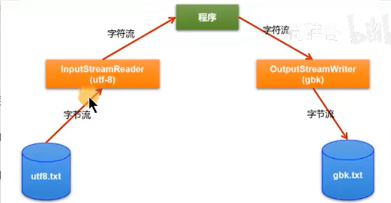
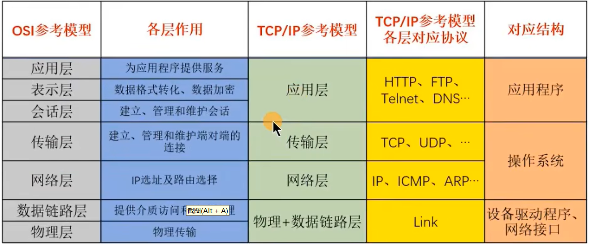
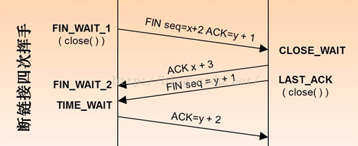
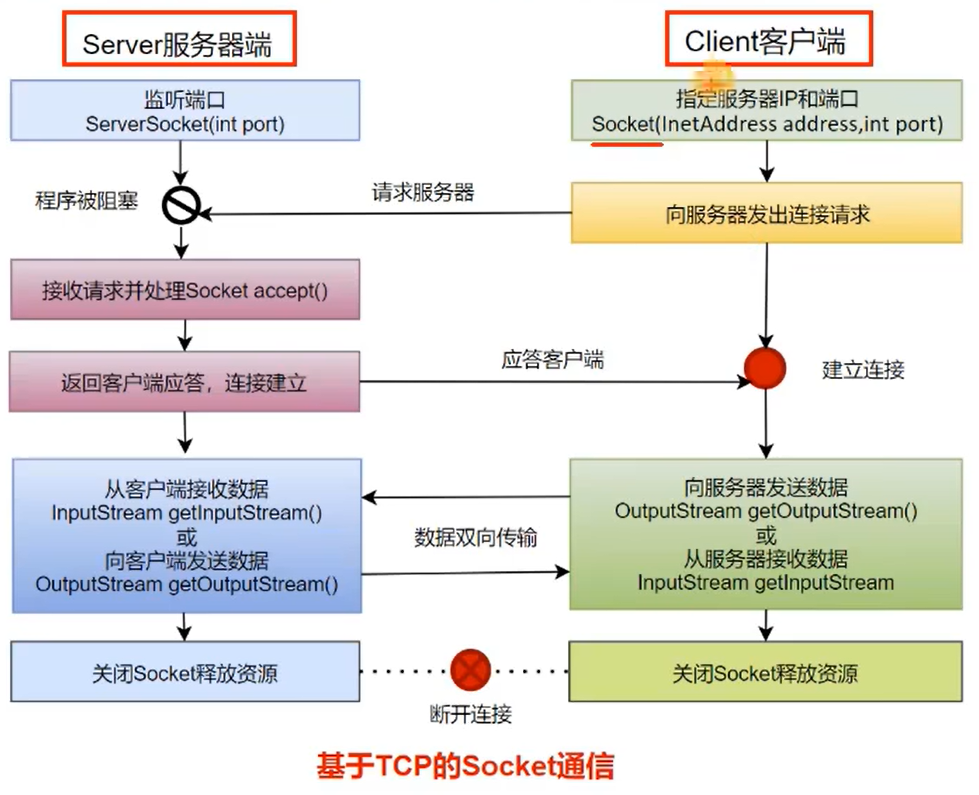

# 一、异常处理

### 一、异常的抛出机制

- Java中把不同的异常用不同的类表示，一旦发生某种异常，就创建该异常类型的对象，并且抛出（throw）。然后程序员可以捕获（catch）到这个异常并处理；如果没有捕获（catch）这个异常对象，那么这个异常对象将会导致程序终止

### 二、Java异常体系

##### 一、Throwable

1. java,lang.Throwable类是Java程序执行过程中发生的异常事件对应的类的根父类
2. Throwable中的常用方法
	- public void printStackTrace()：打印异常的详细信息。包含了异常的类型、异常的原因、异常出现的位置、在开发和调试阶段都得使用printStackTrace
	- public String getMessage()：获取异常的原因

##### 二、Error和Exception

1. Error（java.lang.Error）：java虚拟机无法解决的严重问题。如：JVM系统内部错误、资源耗尽等严重情况。一般不编写针对性的代码进行处理。也是非受检异常
	- 栈内存溢出（StackOverflowError）
	- 堆内存溢出（OutOfMemoryError），简称OOM
2. Exception（java.lang.Exception）：其他因编程错误或偶然的外在因素导致的一般性问题，需要使用针对性的代码进行处理，使程序继续运行。否则一旦发生异常，程序也会挂掉
	- 空指针访问
	- 试图读取不存在的文件
	- 网络连接中断
	- 数组角标越界

### 三、Exception的分类

##### 一、编译时期异常

1. 编译时期异常：即checked异常、受检异常，在代码编译阶段，编译器就能明确警示当前代码可能发生的异常，并明确督促程序员提前编写处理它的代码。如果程序员没有编写对应的异常处理代码，则编译器就会直接判定编译失败，从而不能生成字节码文件。通常，这类异常的发生不是由程序员的代码引起的，或者不是靠简单判断就可以避免的。开发中，编译时期的异常都需要处理
2. 常见的编译时期异常
	- ClassNotFoundException：未找到类异常
	- FileNotFoundException：文件未找到异常
	- IOException：输入输出异常

##### 二、运行时期异常

1. 运行时期异常，即runtime异常、unchecked异常、非手检异常，在代码编译阶段，编译器完全不做任何检查，无论该异常是否会发生，编译器都不给出任何提示。只有等代码运行起来并确定发生了某种异常，它才能被发现。通常，这类异常是程序员的代码编写不当引起的，只要稍加判断，或者细心检查既可以避免的。开发中，通常就不进行运行时期异常的处理，一旦在程序执行，出现了运行时异常那就根据异常的提示的信息进行修改代码
2. 常见的运行时期异常
	- ArrayIndexOutOfBoundsException：角标越界异常
	- NullPointerException：空指针异常
	- ClassCastException：类型转换异常
	- NumberFormatException：数字格式化异常
	- InputMismatchExcepton：填入异常不匹配异常
	- ArithmeticException：算数异常

### 四、异常处理方式

##### 一、try-catch-finally

1. 抛异常：程序在执行的过程中，一旦出现异常，就会在出现异常的代码处，生成对应异常类的对象，并将此对象抛出。一旦抛出，此程序就不执行其后的代码了

2. 抓异常：针对于抛出的异常的异常对象，进行捕获处理、一旦将异常进行了处理，代码就可以继续执行

3. 基本结构

	```java
	try{
	    // 可能产生异常的代码
	}
	catch(异常类型1 e){
	    // 当产生异常类型1型异常时的处置操作
	}
	catch(异常类型2 e){
	    // 当产生异常类型2型异常时的处置操作
	}
	finally{
	    // 无论是否发生异常，都无条件执行的语句
	}
	// 如果没有finally则此处可以继续执行
	```

4. try-catch使用细节

	- 将可能出现异常的代码声明在try语句中。一旦代码出现异常，就会自动生成一个对应异常类的对象，并将此对象抛出
	- 针对于try中抛出的异常类的对象，使用之后的catch语句进行匹配。一旦匹配上，就进入catch语句块进行处理。一旦处理结束，代码就可能继续向下执行
	- 如果声明了多个catch结构，不同的异常类型在不存在子父类关系的情况下，谁声明在上面，谁声明在下面都可以；如果多个异常类型满足子父类的关系，则必须将子类声明在父类结构上的上面，否则报错。无论是否有子父类的异常对象类型，从上至下匹配，捕获到的异常只会执行一次，
	- catch中异常处理的方式：自己编写输出的语句；printStackTrace()，打印异常的详细信息；getMessage()，获取发生异常的原因
	- try中声明的变量的只能在try中使用，出了try结构之后，就不能进行调用了
	- try-cath结构可以嵌套使用

5. finally使用细节

	- 将一定要执行的代码声明在finally结构中，如果没有声明finally，则后面的也会执行，就怕catch中有代码会抛异常或者报错
	- 无论try中或catch中是否存在仍未被处理的异常，无论try中或catch中是否存在return语句等，finally中声明的语句都会执行
	- 如果执行finally代码块之前有return的返回值，则先将返回值存放在操作数栈中，等待执行finally之后再去返回此值，即使finally代码块中操作过此值，返回也是return时候的值。当然finally中return新值会把try或catch中return返回的值覆盖
	- catch和finally都要搭配try使用，不能单独使用
	- 在开发过程中，有一些资源（输入流、输出流、数据库连接、Socket连接等资源），在使用完毕后，必须显示的进行关闭操作，否则，GC不会自动的回收这些资源，进而导致内存泄漏。为了保证这些资源在使用完毕之后，不管是否出现了未被处理的异常的情况下，这些资源能被关闭。我们必须将这些操作声明在finally中

##### 二、throws+异常类型

1. throws格式：在方法的声明处，使用 throws 异常类型1,异常类型2……{}
2. throws处理异常的结果
   - 从编译是否通过的角度看，看成是给出了异常万一要是出现的时候的解决方案，此方案就是继续向上抛出
   - 仅是将可能出现的异常抛给了此方法的调用者。此调用者仍然需要考虑如何处理相关异常，从这个角度来看，throws的方式不算是真正意义上处理了异常

三、开发中try-catch与throws的使用

1. 如果程序代码中，涉及到资源的调用（流、数据库连接、网络连接等），则必须考虑使用try-catch-finally来处理，保证不出现内存泄漏
2. 如果父类被重写的方法没有throws异常类型，则子类重写的方法中如果出现异常，只能考虑使用try-catcj-finally进行处理，不能throws
3. 开发中，方法a中依次调用了方法b,c,d等方法，方法b,c,d之间是递进关系。此时，如果方法b,c,d中有异常，我们通常选择使用throws，而方法a中通常选择使用try-catch-finally

### 五、手动抛出异常

##### 一、手动抛出异常的原因

- 在实际开发过程中，如果出现不满足具体场景的代码问题，我们就有必要手动抛出一个指定类型的异常对象

##### 二、手动抛出异常的格式

- throw + 异常类的对象
- throw抛出异常的方法声明上必须要有throws来抛出。throws后面的异常必须是与throw抛出的异常类型相同或是throw抛出的异常类型的的父类
- throw下一行不能写代码了
- 如果抛出的是运行时异常，则不需要捕获；如果抛出的是编译时异常，则需要捕获

##### 三、throw和throws的区别

- throws使用在方法声明上，作用是将异常向上抛出，属于异常处理。throws后面跟的是异常类型
- throw使用在方法内部，作用是将异常抛出，属于产生异常对象。throw后面跟得知异常类型对象

### 六、自定义异常

##### 一、自定义异常类的格式

- 继承于现有的异常体系。通常继承于RuntimeException/Exception
- 通常提供几个重载的构造器
- 提供一个全局常量，声明为：static final long serialVersionUID

##### 二、自定义异常类的使用

- 在具体的代码中，满足指定条件的情况下，需要手动的使用 throw + 自定义异常类的对象 这种方式，将异常对象抛出
- 如果自定义异常类是非运行时异常，则必须考虑如何处理此异常类的对象

##### 三、自定义异常类的意义

- 通过异常的名称就能直接判断此异常出现的原因。尽然如此，我们就有必要在实际开发场景中，不满足我们指定的条件时，指明我们自己特有的异常类。通过此异常类的名称就能判断出具体出现的问题

# 二、多线程

### 一、程序、进程与线程

1. 程序：为完成特定任务，用某种语言编写的一组指令的集合。即指一段静态的代码，静态对象

2. 进程：程序的一次执行过程，或是正在内存中运行的应用程序。每个进程都有一个独立的内存空间，系统运行一个程序即是一个进程创建、运行到消亡的过程（生命周期）。程序是静态的，进程是多态的。进程是操作系统调度和分配资源的最小单位（亦是系统运行程序运行的基本单位），系统在运行时会为每个进程分配不同的内存区域

3. 线程：进程可进一步细化为线程，是程序内部的一条执行路径。线程是CPU调度和执行的最小单位。一个进程中的多个线程会共享相同的内存单元，他们从同一个堆中分配对象，可以访问相同的变量和对象。这就使得线程间通信更简便、高效。但多个线程操作共享的系统资源可能会带来安全隐患

4. 线程调度

   - 分时调度，所有线程轮流使用CPU的使用权，并且平均分配每个线程占用的CPU的时间
   - 抢占式调度，让优先级高的线程以较大的概率优先使用CPU，如果线程的优先级相同，那么会随机选择一个（线程随机性）
   -  Java使用的为抢占式调度

5. 多线程程序的优点

   - 提高应用程序的响应。对图形化界面更有意义，可增强用户体验
   - 提高计算机系统CPU的利用率
   - 改善程序结构。将既长又复杂的进程分为多个线程，独立运行，利于理解和修改

6. JVM虚拟机图解

   - 一个进程占用一个内存空间，不同的进程之间是不共享内存的
   - 线程共享进程的内存有：方法区、堆
   - 线程独有的内存有：虚拟机栈、本地方法栈、程序计数器

   

### 二、并行与并发、串行

1. 并行（parallel）：指两个或多个事件在同一时刻发生（同时发生）。指在同一时刻，有多条指令在多个CPU上同时执行
2. 并发（concurrency）：指两个或多个事件在同一时间段内发生。即在一段时间内，有多条指令在单个CPU上快速轮换、交替执行，使得在宏观上具有多个进程同时执行的效果
3. 串行：一次只能取得一个任务并执行这个任务，这个任务执行完后面的任务才能继续

### 三、创建和启动线程

##### 一、概述

1. Java语言的JVM允许程序运行多个线程，使用java.lang.Thread类代表线程，所有的线程对象都必须是Thread类或其子类的实例
2. Thread类的特性
   - 每个线程都是通过某个特定的Thread对象的run()方法来完成操作的，因此把run()方法称为线程执行体
   - 通过该Thread对象的start()方法来启动这个线程，而非直接调用run()
   - 要想实现多线程，必须在主线程中创建新的线程对象

##### 二、继承Thread类

1. 定义Thread类的子类，并重写该类的run()方法，该run()方法的方法体就代表了线程需要完成的任务。执行不同逻辑的线程定义不同的子类，分别调用即可

2. 创建Thread子类的实例，即创建了线程对象

3. 调用线程对象的start()方法来启动该线程

4. 通过对象调用start()的作用：启动线程；调用当前线程的run()

5. 不能让已经start()的线程，再次执行start()，否则报异常

6. 如果Thread类的实例调用start()方法，放在的最后，则先会执行完main方法的逻辑，再开启线程

   ```java
   // 定义Thread类的子类
   class Father extends Thread{
   
       // 重写run()方法，实现业务逻辑
       @Override
       public void run() {
           for(int i=0;i<100;i++){
               if(i%2==0){
                   System.out.println(i+"");
               }
           }
       }
       
       public static void main(String[] args) {
           // 直接创建Thread子类的实例
           Father father = new Father();
           // 调用线程对象的start()方法来唤醒线程
           father.start();
           
           // 创建Thread类的匿名子类的匿名对象
           new Thread(){
               @Override
       		public void run() {
           		for(int i=0;i<100;i++){
               		if(i%2==0){
                   		System.out.println(i+"");
               		}
           		}
       		}
           }
       }
   }
   
   ```


##### 三、实现Runnable

1. 创建一个实现Runnable接口的类

2. 实现接口中run方法

3. 创建当前类的对象

4. 将此对象作为参数传递到Thread类的构造器中，创建Thread类的实例

5. Thread类的实例调用start()方法。这里的start()同上面用继承方式实现的start()方法

6. 如果Thread类的实例调用start()方法，放在的最后，则先会执行完main方法的逻辑，再开启线程

   ```java
   // 创建实现Runnable的类
   class Son implements Runnable {
   
       // 实现run方法
       @Override
       public void run() {
           for (int i = 0; i < 100; i++) {
               if (i % 2 == 0) {
                   System.out.println(Thread.currentThread().getName() + "->" + i);
               }
           }
       }
       
       public static void main(String[] args) {
           // 创建当前类的对象
           Son son = new Son();
           // 将此对象作为参数传递到Thread类的构造器中，创建Thread类的实例
           Thread thread = new Thread(son);
           // Thread类的实例调用start()方法
           thread.start();
           
           // 匿名实现类的匿名对象
           new Thread(new Runnable() {
               @Override
               public void run() {
                   for (int i = 0; i < 1000; i++) {
                       if (i % 2 == 0) {
                           System.out.println(Thread.currentThread().getName() + "->" + i);
                       }
                   }
               }
           }).start();
       }
   }
   
   
   ```

7. 继承Thread和实现Runnable的共同点和不同点

   - 共同点：

     1、启动线程，使用的都是Thread类中定义的start()

     2、创建的线程对象，都是Thread类或其子类的实例

   - 不同点：

     1、一个类的继承，一个是接口的实现。建议使用Runnable的方式

     2、实现Runnable的好处有：实现的方式避免类的单继承的局限性；更适合处理有共享数据的问题；实现了代码和数据的分离

   - 联系：

     public class Thread implements Runnable{} 顾名思义，Thread也是实现Runnable接口，此处就用到了代理模式

##### 三、实现Callable

1. 创建一个实现Callable的实现类
2. 实现call方法，将此线程需要执行的操作声明在call()中
3. 创建Callable接口实现类的对象
4. 将Callable接口实现类的对象作为参数传递到FutureTask构造器中，创建FutureTak的对象。FutureTak也是实现了Runnable接口
5. 将FutureTaks的对象作为参数传递到Thread类的构造器中，创建Thread对象并调用start()
6. 获取Callable中的call方法的返回值。get()返回值即为FutureTask构造器参数Callable实现类重写的call()方法的返回值
7. 实现Callable与实现Runnable的比较
   - call()可以有返回值，更灵活
   - call()可以使用throws的方式处理异常，更灵活
   - Callable使用了泛型参数，可以指明具体的call()的返回值类型，更灵活
   - 如果在主线程中需要获取分线程call()的返回值，则此时的主线程是阻塞状态的

##### 四、使用线程池

1. 使用线程池的步骤

   - 提供指定线程数量的线程池

   - 执行指定的线程的操作。需要提供实现Runnable接口或者Callable接口实现类的对象

   - 关闭连接池

     ```java
     class NumberThread1 implements Runnable{
     
         @Override
         public void run() {
             for (int i = 0; i <=100 ; i++) {
                 if(i%2==0){
                     System.out.println(Thread.currentThread().getName()+"："+i);
                 }
             }
         }
     }
     
     class NumberThread2 implements Runnable{
     
         @Override
         public void run() {
             for (int i = 0; i <=100 ; i++) {
                 if(i%2!=0){
                     System.out.println(Thread.currentThread().getName()+"："+i);
                 }
             }
         }
     }
     
     public class PrintNumberTest{
     
         public static void main(String[] args) {
             // 1、提供指定线程数量的线程池
             ExecutorService service = Executors.newFixedThreadPool(10);
             ThreadPoolExecutor executor = (ThreadPoolExecutor) service;
             // 设置线程池的属性。设置线程池中线程数的上线
             executor.setMaximumPoolSize(50);
             // 2、执行指定的线程的操作。需要提供实现Runnable接口或者Callable接口实现类的对象
             service.execute(new NumberThread1()); // 适用于Runnable
             service.execute(new NumberThread2()); // 适用于Runnable
             service.submit(Callable callable); // 适用于Callable
             service.shutdown();
         }
     }
     ```

2. 线程池的好处

   - 提高了程序执行的效率。因为线程已经提前创建好了
   - 提高了资源的复用率。因为执行完的线程并未销毁，而是可以继续执行其他的任务
   - 可以设置相关的参数，对线程池中的线程的使用进行管理

```java
// 1、创建一个实现Callable的实现类
public class PrintNumberTest implements Callable {

    // 2、实现call方法，将此线程需要执行的操作声明在call()中
    @Override
    public Object call() throws Exception {
        int sum = 0;
        for (int i = 0; i <= 100; i++) {
            System.out.println(Thread.currentThread().getName() + "：" + i);
            sum += i;
        }
        return sum;
    }
    
    public static void main(String[] args) {
        // 3、创建Callable接口实现类的对象
        PrintNumberTest print = new PrintNumberTest();
        // 4、将Callable接口实现类的对象作为参数传递到FutureTask构造器中
        FutureTask task = new FutureTask(print);
        // 将FutureTaks的对象作为参数传递到Thread类的构造器中
        Thread thread = new Thread(task);
        thread.start();

        try {
            // 6、获取Callable中的call方法的返回值。get()返回值即为FutureTask构造器参数Callable实现类重写				   的call()方法的返回值
            Object sum = task.get();
            System.out.println("总和：" + sum);
        } catch (InterruptedException e) {
            throw new RuntimeException(e);
        } catch (ExecutionException e) {
            throw new RuntimeException(e);
        }
    }
}
```

### 四、线程常用结构

##### 一、线程中的构造器

1. public Thread()：分配一个新的线程对象
2. public Thread(String name)：分配一个指定名字的新的线程对象
3. public Thread(Runnable target)：指定创建线程的目标对象，它实现了Runnable接口中的run方法
4. public Thread(Runnable trarget,String name)：分配一个带有指定目标新的线程对象并指定名字

##### 二、线程中常用方法

1. start()：启动线程；调用线程的run()
2. run()：将线程要执行的操作，声明在run()中
3. currentThread()：获取当前执行代码对应的线程
4. sleep(long millis)：静态方法，可以使得当前线程睡眠指定的毫秒数
5. yield()：静态方法，一旦执行到此方法就释放当前线程所占用的CPU使用权
6. join()：非静态方法，在线程a中通过线程b调用join()，意味着线程a进入阻塞状态，直到线程b执行结束，线程a才结束阻塞状态继续执行
7. isAlive()：判断当前线程是否存活
8. getPriority()：获取线程的优先级
9. setPriority：设置当前线程的优先级，范围为1-10，优先级高的线程只是有较大概率获取到CPU资源并不一定能获取到资源

##### 三、线程优先级

1. MAX_PRIORITY(10)：最高优先级
2. MIN_PRIORITY(1)：最低优先级
3. NORM_PRIORITY(5)：普通优先级，默认情况下main线程具有普通优先级

### 五、线程的生命周期

##### 一、jdk5之前：5种状态


##### 二、jdk5之后：6大种状态


### 六、同步代码块与同步方法

##### 一、同步代码块

1. 需要被同步的代码：即为操作共享数据的代码。共享数据即多个线程需要操作的数据。需要被同步的代码在被synchronized包裹之后，就使得一个线程在操作这些代码的过程中，其他代码必须等待
2. 同步监视器：即为锁。哪个线程获取了锁，哪个线程就能执行需要被同步的代码。同步监视器可以使用任何一个类的对象充当，但是，多个线程必须共用同一个同步监视器，也就是说充当同步监视器的类的对象要唯一。如果使用实现Runnable接口，同步监视器可以使用this代替；如果使用继承Thread类的方式实现，同步监视器可以使用当前类.class来代替，这个方法也可以使用在实现Runnable接口中

```java
// synchronized相当于线程进入操作代码块的入口，每次只能有一个线程进入，其他的线程在外等待
synchronized(同步监视器){
    // 需要被同步的代码
}
```

##### 二、同步方法

1. 如果操作共享数据的代码完整的声明在了一个方法中，那么我们就可以将此方法声明为通过不方法即可
2. 非静态的的同步方法，默认同步监视器是this；静态的同步方法，默认同步监视器是当前类本身

```java
public synchronized void show(){//如果使用实现Runnable方法则此处的同步监视器是this，也就是类的唯一实例；如果继承Thread类的方法，如需要在方法上再加上static，表示同步监视器为当前类的实例，也可以将synchronized写在此方法里面作为方法块使用。不要为了线程安全而丢掉操作
    // 需要被同步的代码
}
```

##### 三、synchronized的优劣势

1. 优势
   - 解决了线程的安全问题
2. 劣势
   - 在操作共享数据时，多线程是串行执行的，意味着性能低 

### 七、实现线程安全的懒汉式单例

```java
class Bank{

    public Bank() {
    }

    private static Bank instance = null;

    // 方式一：同步方法实现线程安全的懒汉式单例
    public synchronized static Bank getInstance(){
        if(instance == null){
            instance = new Bank();
        }
        return instance;
    }
   
}


class Bank{

    public Bank() {
    }

    private static Bank instance = null;

    // 方式二：同步代码块实现线程安全的懒汉式单例
    public static Bank getInstance(){
        synchronized (Bank.class){
            if(instance == null){
                instance = new Bank();
            }   
        }
        return instance;
    }
}


class Bank{

    public Bank() {
    }

    // 为了避免出现指令重排，需要将instance声明为volatile
    private static volatile Bank instance = null;

    // 方式三：同步代码块实现线程安全的懒汉式单例，双层判断相较于方式一和二效率更高
    public static Bank getInstance(){
        if(instance == instance){
            synchronized (Bank.class){
                if(instance == null){
                    instance = new Bank();
                }
            }   
        }
        return instance;
    }
}

```

### 八、死锁问题

1. 死锁概念：不同的线程分别占用对方需要的同步资源不放弃，都在等待对方放弃自己需要的同步资源，就形成了线程的死锁
2. 诱发死锁的原因（四个条件，缺一不可）
   - 互斥条件
   - 占用并等待
   - 不可抢夺（或不可抢占）
   - 循环等待
3. 解决死锁
   - 死锁一旦出现，基本很难人为干预，只能尽量避免。可以考虑打破上面的诱发条件
   - 针对互斥条件问题：互斥条件基本上无法被破坏。因为线程需要通过互斥解决安全问题
   - 针对占用并等待问题：可以考虑一次性申请所有所需的资源，这样就不存在等待的问题
   - 针对不可抢占问题：占用部分资源的线程在进一步申请其他资源时，如果申请不到，就主动释放掉已经占用的资源
   - 针对循环等待问题：可以将资源改为线性顺序。申请资源时，先申请序号较小的，这样避免循环等待问题

### 九、Lock锁机制

1. 使用Lock锁的步骤

   - 创建Lock的实例，需要确保多个线程共用一个Lock实例！需要考虑将此对象声明为static final

   - 执行lock()方法，锁定对共享资源的调用

   - 执行unlock()的调用，释放对共享数据的锁定

     ```java
     // 创建Lock的实例，需要确保多个线程共用一个Lock实例
     private static final ReentrantLock LOCK = new ReentrantLock();
     
     Thread thread1 = new Thread(new Runnable() {
     		@Override
              public void run() {
                  // 执行lock()方法，锁定对共享资源的调用
              	LOCK.lock();
                  
                  try {
                  	// 执行代码逻辑
                  }finally {
                     // 执行unlock()的调用，释放对共享数据的锁定。在try-finally中调用确保unlock方法执行
                  	LOCK.unlock();
                  }
     		}
     	}
      );
     ```

     

2. synchronized和Lock锁的对比

   - synchronized不管是同步代码块还是同步方法，都需要在结束一对{}之后，释放对同步监视器的调用
   - Lock是通过两个方法控制需要被同步的代码，更灵活一点
   - Lock作为接口，提供了多种实现方式，适合更多更复杂的场景，效率更高

### 十、线程的通信

##### 一、线程间的通信

- 当我们需要多个线程来共同完成一件任务，并且我们希望他们有规律的执行，那么多线程之间需要一些通信机制，可以协调它们的工作，以此实现多线程共同操作一份数据。所以我们使用等待唤醒机制来实现线程间的通信

##### 二、等待唤醒机制

1. 等待唤醒机制是多个线程间的一种协作机制

2. 在一个线程满足某个条件时，就进入等待状态（wait()/wait(time)），等待其他线程执行完他们的指定代码后再将其唤醒（notify()）;或可以指定wait的时间，等时间到了自动唤醒；在有多个线程进行等待时，如果需要，可以使用notifyAll()来唤醒所有的等待线程。wait/notify就是线程间的一种写作机制

   - wait：线程不再活动，不再参与调度，进入wait set中，因此不会浪费CPU资源，也不会去竞争锁，这时的线程状态为WAITING或TIMED_WAITING。它还要等着别的线程执行通知操作，也就是notify，或者等待时间到，在这个对象上等待的线程从wait set中释放出来，重新进入到调度队列（ready queue）中。简而言之，线程一旦执行此方法，就进入等待状态，同时会释放对同步监视器的调用
   - notify：则选取所通知对象的wait set中的一个线程释放。简而言之，一旦执行此方法，就会唤醒被wait()的线程中优先级最高的一个线程。如果被wait()的多个线程的优先级相同则随机唤醒一个。被唤醒的线程从当初被wait的位置继续执行
   - notifyAll：则释放所通知对象的wait set上的全部线程。简而言之，一旦执行此方法，就会唤醒所有被wait的线程

3. 注意点

   - wait、notify和notifyAll这三个方法必须声明在synchronized修饰的同步方法或同步代码块中 
   - wait、notify和notifyAll这三个方法的调用者必须是synchronized使用的相同的同步监视器
   - wait、notify和notifyAll这三个方法声明在Object类中

4. wait和sleep的区别

   - 相同点：一旦执行，当前线程都会进入阻塞状态

   - 不同点

     ① 声明的位置不同：wait声明在Object类中；sleep声明在Thread类中，而且是静态的

     ② 使用的场景不同：wait只能使用在同步代码块或同步方法中；sleep可以在任何需要使用的场景

     ③ 使用在同步代码块或同步方法中：wait一旦执行会释放同步监视器；sleep一旦执行不会释放同步监视器

     ④ 结束阻塞的方式：wait到达指定时间自动结束阻塞或通过被notify唤醒，结束阻塞；sleep达到指定时间自动结束阻塞

# 三、常用类和基础API

### 一、不可变字符序列：String

##### 一、String类的声明

```java
public final class String implements java.io.Serializable, Comparable<String>, CharSequence
```

1. final：String是不可继承的
2. Serializable：可序列化的接口。凡是实现此接口的类的对象就就可以通过网络或本地流进行数据的传输
3. Comparable：凡是实现此接口的类，其对象都可以比较大小

##### 二、String内部声明的属性

```java
private final char value[]; // jdk8此处的数组类型是char型的
private final byte value[]; // jdk9及其以后此处的数组类型是byte型的，为了节省内存空间，做了优化
```

- 存储字符串数据的容器。此处的final指明此value数组一旦初始化，其地址就不可变

##### 三、String字符串常量的存储位置

1. 字符串常量都存储在字符串常量池（StringTable）中

2. 字符串常量池中不允许存放两个相同的字符串常量

3. 字符串常量池，在不同的jdk版本中，存放位置不同。jdk7之前，字符串常量池存放在方法区中；jdk7及其后，字符串常量池存放在堆空间中

   ```java
   // 此处的name1和name2都指向常量池中的hello，所以name1和name2的地址相同
   String name1 = "hello";
   String name2 = "hello";
   ```

##### 四、String的不可变性的理解

1. 当对字符串变量重新赋值时，需要重新指定一个字符串常量的位置进行赋值，不能在原有的位置上修改
2. 当对现有字符串进行拼接操作时，需要重新开辟空间保存拼接以后的字符串，不能在原有的位置上修改
3. 当调用字符串的replace()替换现有的某个字符时，需要重新开辟空间保存修改以后的字符串，不能再原有的位置上修改

##### 五、String实例化的两种方式

1. 自变量的方式：String s = "hello"
2. 对象的方式：String s = new String("hello") -> 在内存中创建了两个对象，一个是堆空间中new的对象；另一个是在字符串常量池中生成的字面量

##### 六、String的连接操作：+

1. 常量+常量：结果仍然存储在字符串常量池中，返回此字面量的地址。此时的常量可能是字面量，也可能是final修饰的常量
2. 常量+变量 或 变量+变量：都会通过new的方式创建一个新的字符串，返回堆空间中此字符串对象的地址
3. 调用字符串的intern()：返回的是字符串常量池中字面量的地址。常量池中有此字面量则直接返回，无此字面量则创建新的再返回其新建字面量的地址
4. concat(参数)：不管是常量调用此方法，还是变量调用，同样不管参数是常量还是变量，总之，调用完concat()方法都返回一个新new的对象

##### 七、字符集问题

1. Unicode包罗万象，以下得字符集都包含
2. 在UTF-8中，一个汉字占用3个字节，一个字母占用1个字节
3. 在GDK中，一个汉字占用2个字节，一个字母占用1个字节
4. UTF-8、GDK等字符集中都向下兼容了ASCII码
5. 编码与解码
   - 编码：String转为字节或字节数组
   - 解码：字节或字节数组转为String
   - 解码时使用的字符集必须要与编码时使用的字符集一致，不一致就会乱码

##### 八、String的构造器和常用方法

1. public String()：初始化新创建的String对象，以使其表示空字符序列
2. public String(String original) ：初始化一个新创建的String对象，使其表示一个与参数相同的字符序列。换而言之，新创建的字符串是该参数字符串的副本
3. public String(char[] value)：通过当前参数中的字符数组来构造新的String
4. public String(char[] value,int offset,int count)：通过字符数组的一部分来构造新的String
5. public String(byte[] bytes)：通过使用平台的默认字符集解码当前参数中的字节数组来构造新的String
6. public String(byte[] bytes,String charsetName)：通过使用指定的字符集解码当前参数中的字节数组来构造新的String
7. String与char型数组转换
   - String转char数组：使用 字符串（常量或变量）.toCharArray()方法
   - char数组转String：使用 String的构造器，String(new char[])
8. String与byte型数组转换
   - String转byte数组：使用 字符串（常量或变量）.getBytes(可以指定字符集类型)方法
   - byte数组转String：使用 String的构造器，String(new byte[])
9. boolean isEmpty()：字符串是否为空
10. int length()：返回字符串长度
11. String concat(XX)：拼接字符串，返回一个新的字符串
12. boolean equals(Object obj)：比较字符串是否相等，区分大小写
13. boolean equalsIgnoreCase(Object obj)：比较字符串是否相等，不区分大小写
14. int compareTo(String other)：比较字符串大小，区分大小写，按照Unicode编码值比较大小，前值减去后值得到的大小
15. int compareToIgnoreCase(String other)：比较字符串大小，不区分大小写，按照Unicode编码值比较大小，前值减去后值得到的大小
16. String toLowerCase()：将字符串中大写字母转为小写
17. String toUpperCase()：将字符串中小写字母转为大写
18. String trim()：去掉字符串前后空白符
19. public String intern()：结果在常量池中共享
20. boolean contains(xx)：是否包含xx
21. int indexOf(xx)：从前往后找当前字符串中xx，即如果有返回第一次出现的下标，没有则返回-1
22. int indexOf(String str,int fromIndex)：返回指定子字符串在此字符串中第一次出现处的索引，从指定的索引开始
23. int lastIndexOf(xx)：从后往前找当前字符串中xx，即如果有返回最后一次出现的下标，没有则返回-1
24. int lastIndexOf(String str,int fromIndex)：返回指定子字符串在此字符串中最后一次出现处的索引，从指定的索引开始
25. String substring(int beginIndex)：返回一个新的字符串，它是此字符串的从beginIndex开始截取
26. String substring(int beginIndex,int endIndex)：返回一个新的字符串，它是此字符串的从beginIndex开始截取，到endIndex结束，但是不包括endIndex。也就是左闭右开原则
27. char charAt(index)：返回[index]位置的字符
28. char toCharArray()：将此字符串转换为一个新的字符数组返回
29. static String valueOf(char[] data)：返回指定数组中表示该字符序列的String
30. static String valueOf(char[] data,int offset,int count)：返回指定数组中表示该字符序列的String，从offset下标开始复制count个字符
31. static String copyValueOf(char[] data)：返回指定数组中表示该字符序列的String
32. static String copyValueOf(char[] data,int offset,int count)：返回指定数组中表示该字符序列的String，从offset下标开始复制count个字符
33. boolean startsWith(xx)：测试此字符串是否以指定的前缀开始
34. boolean startsWith(String prefix,int toffset)：测试此字符串从指定索引开始的子字符串是否以指定的前缀开始
35. boolean endWith(xx)：测试此字符串是否以指定的后缀结束
36. String replace(char oldChar,char newChar)：返回一个新的字符串，使用newChar替换所有oldChar字符
37. Sting replace(CharSequence target,CharSequence repalcement)：使用指定的字面值替换序列替换此字符串所有匹配的字面值目标序列的子字符串
38. String replaceAll(String regex,String replacement)：使用给定的replacement替换此字符串所有匹配给定的正则表达式的子字符串
39. String replaceFirst(String regex,String replacement)：使用给定的replacement替换此字符串匹配给定的正则表达式的第一个子字符串

### 二、StringBuffer与StringBuilder

##### 一、String、StringBuffer与StringBuilder的对比

1. String：不可变的字符序列；jdk8.0及之前底层使用char[]数组，jdk9.0及之后底层使用byte[]数组
2. StringBuffer：可变的字符序列；jdk1.0声明，线程安全；效率低，但是效率比String高；jdk8.0及之前底层使用char[]数组，jdk9.0及之后底层使用byte[]数组
3. StringBuilder：可变的字符序列；jdk5.0声明，线程不安全；效率高；jdk8.0及之前底层使用char[]数组，jdk9.0及之后底层使用byte[]数组

##### 二、StringBuffer与StringBuilder的可变性分析

1. 内部的属性
	- char[] value：存储字符序列
	- int count：实际存储的字符的个数
2. 添加数据：字符不断添加，一旦count要超过value.length时，就需要扩容，默认扩容为原有容量的2倍+2，并将原有value数组中的元素复制到新的数据中

##### 三、源码启示

1. 如果开发过程中需要频繁的针对字符串进行增、删、改、查等操作建议使用StringBuffer与StringBuilder替换String，因为使用String效率低
2. 如果开发中不涉及线程安全，建议使用StringBuilder替换StringBuffer，因为使用StringBuilder效率高
3. 如果开发中，大体确定要操作的字符的个数，建议使用带 int capacity参数的构造器，因为可以避免底层多次扩容操作，性能更高

##### 四、StringBuffer与StringBuilder的通用方法

1. StringBuffer/StringBuilder append(xx)：提供了很多append()方法，用于进行字符串追加的方式拼接
2. StringBuffer/StringBuilder delete(int start,int end)：删除[start,end)之间的字符
3. StringBuffer/StringBuilder deleteCharAt(int index)：删除[index]位置字符
4. StringBuffer/StringBuilder replace(int start,int end,String str)：替换[start,end)范围的字符序列为str
5. void setCharAt(int index,char c)：替换[index]位置的字符为c
6. char charAt(int index)：查找指定index位置上的字符
7. StringBuffer/StringBuilder insert(int index,xx)：在[index]位置插入xx
8. int int length()：返回存储的字符数据的长度
9. StringBuffer/StringBuilder  reverse()：字符反转
10. void setLength(int newLength)：设置字符的长度，如果设置的长度小于字符串实际的长度则按照设置的长度截取字符串；如果设置的长度大于字符串实际的长度则在字符串后面补充0

### 三、日期时间

##### 一、jdk8之前的API

1. System类中的CurrentTimeMillis()

   - 获取当前时间对应的毫秒数，long类型，时间戳。
   - 用来返回当前时间与1970年1月1日0时0分0秒之间以毫秒为单位的时间差

2. 两个Date类

   - java.util.Date：

     ① new Date()：创建一个基于当前系统时间的Date的实例

     ② new Date(Long 时间戳)：创建一个基于指定时间戳的Date的实例

     ③ toString：返回时间对象的时间型字符串，带有英文格式

     ④ getTime()：返回时间对象与1970年1月1日0时0分0秒之间以毫秒为单位的时间差

   - java.sql.Date：是java.util.Date的子类

     ① new Date(Long 时间戳)：创建一个基于指定时间戳的Date的实例

     ② toString：返回时间对象的时间型字符串，2023-01-01格式的

     ③ getTime()：返回时间对象与1970年1月1日0时0分0秒之间以毫秒为单位的时间差

3. SimpleDateFormat类

   - SimpleDateFormat类是一个不与语言环境有关的方式来格式化和解析日期的具体类

   - 格式化：日期转字符串

     ```java
      SimpleDateFormat simpleDateFormat = new SimpleDateFormat("时间格式化格式");
      Date date = new Date();
      String dateStr = simpleDateFormat.format(date);
     ```

   - 解析：字符串转日期

     ```java
      SimpleDateFormat simpleDateFormat = new SimpleDateFormat("时间格式化格式");
      try {
      		Date parse = simpleDateFormat.parse("此时间型字符串和构造器中的时间格式保持一致");
           } catch (ParseException e) {
           	throw new RuntimeException(e);
           }
     ```

4. Calendar类（日历类），抽象类

   - 实例化：由于Calendar是一个抽象类，所以我们需要创建其子类的实例。可以通过Calendar的静态方法getInstance()即可获取

   - 常用方法

     ① get(int field)：获取指定的属性

     ② set(int field)：设置指定的属性

     ③ add(int field,xx)：在指定的属性上加上指定的数量

     ④ getTIme()：返回一个时间类型的数据

     ⑤ setTime(Date date)：使用指定的Date重置Calendar

##### 二、jdk8中的API

1. 新的日期时间API包含

	- java.time：包含值对象的基础包
	- java.time.chrono：提供对不同的日历系统的访问
	- java.time.format：格式化和解析时间、日期
	- java.time.temporal：包含底层框架和扩展特性
	- java.time.zone：包含时区支持的类
	- 新的java.time中包含了所有有关时钟（Clock），本地日期（LocalDate）、本地时间（LocalTime）、本地日期时间（LocalDateTime）、时区（ZonedDateTime）和持续时间（Duration）的类

2. 本地日期时间：LocalDate、LocalTime、LocalDateTIme；不可变的日期时间类

	|                             方法                             |                             描述                             |
	| :----------------------------------------------------------: | :----------------------------------------------------------: |
	|                    now()/now(ZoneId zone)                    |        静态方法，根据当前时间创建对象/指定时区的对象         |
	|                     of(xx,xx,xx,xx,xxx)                      |             静态方法，根据指定日期/时间创建对象              |
	|                getDayOfMonth()/getDayOfYear()                |          获取月份天数（1-31）/获取年份天数（1-366）          |
	|                        getDayOfWeek()                        |            获取星期几（返回一个DayOfWeek枚举值）             |
	|                          getMonth()                          |                获取月份，返回一个Month枚举值                 |
	|                  getMonthValue()/getYear()                   |                  获得月份（1-12）/获得年份                   |
	|              getHours()/getMinute()/getSecond()              |               获取当前对象对应的小时、分钟、秒               |
	|   withDayOfMonth()/withDayOfYear()/withMonth()/withYear()    | 将月份天数、年份天数、月份、年份修改为指定的值并返回新的对象 |
	|                   with(TemporalAdjuster t)                   |           将当前日期时间设置为校对器指定的日期时间           |
	| plusDays()/plusWeeks()/plusMonths()/plusYears()/plusHours()  |        向当前对象添加几天、几周、几个月、几年、几小时        |
	| minusDays()/minusWeeks()/minusMonths()/minusYears()/minusHours() |       从当前对象中减去几天、几周、几个月、几年、几小时       |
	|      plus(TemporalAdjuster t)/minus(TemporalAdjuster t)      |                添加或减少一个Duration或Period                |
	|                     isBefore()/isAfter()                     |                      比较两个LocalDate                       |
	|                         isLeapYear()                         |            判断是否为闰年（在LocalDate类中使用）             |
	|                 format(DateTimeFormatter t)                  |             格式化本地日期、时间，返回一个字符串             |
	|                   parse(Charsequence text)                   |              将指定格式的字符串解析为日期、时间              |
	
3. 瞬时：Instant

   - Instant：时间线上的一个瞬时点。这可能被用来记录应用程序中的事件时间戳
   - java.time.Instant：表示时间线上的一点，而不需要任何上下文信息，例如，时区。概念上讲，它只是简单的表示自1970年1月1日0时0分0秒（UTC）开始的秒数

   |             方法              |                             描述                             |
   | :---------------------------: | :----------------------------------------------------------: |
   |             now()             |          静态方法，返回默认UTC时区的instant类的对象          |
   | ofEpochMilli(long epochMilli) | 静态方法，返回在1970-01-01 00:00:00基础上加上指定毫秒数之后的Instant类的对象 |
   |  atOffset(ZoneOffset offset)  |           结合即时的偏移量来创建一个OffsetDateTime           |
   |        toEpochMilli()         |    返回1970-01-01 00:00:00到当前时间的毫秒数，即为时间戳     |

4. DateTimeFormatter：类似于SimpleDateFormat。用于格式化和解析LocalDate、LocalTime、LocalDateTIme

   |            方法            |                             描述                             |
   | :------------------------: | :----------------------------------------------------------: |
   | ofPattern(String pattern)  |     静态方法，返回一个指定字符串格式的DateTimeFormatter      |
   | format(TemporalAccessor T) |               格式化一个日期、时间，返回字符串               |
   |  parse(CharSequence text)  | 将指定格式的字符序列解析为一个日期、时间。得到的是一个TemporalAccessor类，想要得到时间格式的还需要使用from(TemporalAccessor t)方法 |


### 四、Java比较器

##### 一、实现对象的排序

1. 自然排序（Comparable）
2. 定制排序（Comparator）

##### 二、实现Comparable接口的方式

1. 具体的类A实现Comparable接口

2. 重写Comparable接口中的compareTo(Object obj)方法，在此方法中指明比较类A的对象的大小的标准

3. 创建类A的多个实例，进行大小的比较或排序

	```java
	// 具体的类A实现Comparable接口
	class Student implements Comparable{
	
	    private String name;
	
	    private Integer age;
	
	    public Student(String name, Integer age) {
	        this.name = name;
	        this.age = age;
	    }
	
	    public String getName() {
	        return name;
	    }
	
	    public void setName(String name) {
	        this.name = name;
	    }
	
	    public Student(Integer age) {
	        this.age = age;
	    }
	
	    @Override
	    public String toString() {
	        return "Student{" +
	                "name='" + name + '\'' +
	                ", age='" + age + '\'' +
	                '}';
	    }
	
	    // 重写Comparable接口中的compareTo(Object obj)方法，在此方法中指明比较类A的对象的大小的标准
	    @Override
	    public int compareTo(Object o) {
	        if(this == o){
	            return 0;
	        }
	        if(o instanceof Student){
	            Student s = (Student) o;
	            int compare = this.age.compareTo(s.age);
	            if(compare != 0){
	                // 从大到小排序
	                return -compare;
	            }
	            int compare1 = this.name.compareTo(s.name);
	            // 从小到大排序
	            return compare1;
	        }
	        throw new RuntimeException("类型错误！");
	    }
	}
	
	```

##### 三、实现Comparator接口的方式

1. 创建一个实现了Comparator接口的实现类A（也可以是匿名内部类）

2. 实现类要求重写Comparator接口中的抽象方法compare(Object o1,Object o2)，在此方法中指明要比较大小的对象的大小关系

3. 创建此实现类A的对象，并将此对象传入到相关方法的参数位置即可（比如：Arrays.sort(..,类A的实例)）

	```java
	Arrays.sort(students, new Comparator<Student>() {
	            @Override
	            public int compare(Student o1, Student o2) {
	                if(o1 instanceof Student && o2 instanceof Student){
	                    Student student1 = o1;
	                    Student student2 = o2;
	                    int compare1 = Integer.compare(student1.getAge(), student2.getAge());
	                    return compare1;
	                }
	                throw new RuntimeException("类型错误！");
	            }
	        });
	```

##### 四、Comparable和Comparator的对比

1. Comparable是单一的，唯一的；Comparator灵活的，多样的
2. Comparable是一劳永逸的；Comparator临时的
3. Comparable对应的抽象方法为compareTo(Object obj);Comparator对应的抽象方法为compare(Object o1,Object o2)

### 五、其他常用类

##### 一、System类

1. 属性：in、out、error

2. 成员方法

	- native long currentTimeMillis()：返回时间戳

	- void exit(int status)：用于退出程序。其中status的值为0时代表正常退出，非零代表异常退出

	- void gc()：请求系统进行垃圾回收。至于系统是否立刻回收，则取决于系统中垃圾回收算法的实现以及系统执行时的情况

	- static void arrayCopy(Object src,int srcPos,Object dest,int destPos,int length)：从指定的

	- String  getProperty(String key)：获取系统中属性名为key的属性对应的值

		|    属性名    |      属性说明      |
		| :----------: | :----------------: |
		| java,version | java运行时环境版本 |
		|  java.hone   |    java安装目录    |
		|   os.name    |   操作系统的名称   |
		|  os.version  |   操作系统的版本   |
		|  user.name   |   用户的账户名称   |
		|  user;home   |    用户的主目录    |
		|  userr.dir   | 用户的当前工作目录 |

##### 二、Runtime类

- 运行时类
- 对应着Java进程的内存使用的运行时环境
- 单例的

##### 三、Math类

- 凡是与数学运算有关的计算，可以在这个类中找
- round（四舍五入）计算时技巧：可以向下取值+0.5，也就是floor(x+0.5)

##### 四、BigInteger类和BigDecimal类

1. BigInteger类：可以表示任意长度的整数
2. BigDecimal类：可以表示任意精度的浮点数

##### 五、Random类

- 获取指定范围的随机整数，nextInt(int bound)

# 四、集合框架

### 一、Java集合框架体系


- java.util.Collection：存储一个一个的数据
  - java.util.List：存储有序的、可重复的数据。动态数组
    - ArrayList
    - LinkedList
    - Vector
  - java.util.set：存储无序的、不可重复的数据
    - HashSet
    - LinkedHashSet
    - TreeSet
- java.util.Map：存储一对一对的数据（key-value键值对）
  - HashMap
  	- LinkedHashMap
  - TreeMap
  - Hashtable
    - Properties

### 二、Collection方法的使用

1. boolean add(E obj)：添加元素对象到当前集合中
2. boolean addAll(Collection other)：添加other集合中的所有元素对象到当前集合中
3. int size()：获取当前集合中实际存储的元素个数
4. boolean isEmpty()：判断当前集合是否为空集合
5. boolean contains(Object obj)：判断当前集合中是否存在一个与obj对象equals返回true的元素。重点在equals()方法上
6. boolean containsAll(Collection coll)：判断coll集合中的元素是否在当前集合中都存在，即判断coll是否为当前集合的子集
7. boolean equals(Object obj)：判断当前集合与obj是否相等
8. void clear()：清空集合元素
9. boolean remove(Object obj)：从当前集合中删除第一个找到的与obj对象equals返回true的元素
10. boolean removeAll(Collection coll)：从当前集合中删除所有与coll集合中相同的元素
11. boolean retainAll(Collection coll)：从当前集合中删除两个集合中不同的元素，使得当前集合仅保留与coll集合中的元素相同的元素，即当前集合中仅保留两个集合的交集
12. Object[] toArray()：返回包含当前集合中所有元素的数组
13. hashCode()：获取集合对象的哈希值
14. iterator()：返回迭代器对象，用于遍历集合

### 三、集合与数组的相互转换

1. 集合转数组：toArray()
2. 数组转集合：Arrays.toList(Object[] obj)
3. 注意点：数组中可以存储基本数据类型和引用数据类型，而集合中仅可存引用数据类型。在数组转集合的时候要注意这个细节

### 四、Collection添加元素的要求

- 要求元素所属的类一定要重写equals()方法
- 因为Collection中的相关方法（比如contains()/remove()）在使用时，要调用元素所在类的equals()方法

### 五、迭代器

##### 一、迭代器的作用

- 用来遍历集合元素

##### 二、获取迭代器对象

- Iterator iterator = (集合实例)coll.iterator()

##### 三、迭代器的方法

1. next()：指针下移；将下移以后集合位置上的元素返回
2. hashNext()：判断是否有下一个元素
3. remove()：移除元素

##### 三、实现集合的遍历

1. 使用Iterator迭代器遍历某个特定的集合时迭代器对象只能声明一次

	```java
	Iterator iterator = coll.iterator();
	while(iterator.hasNext){
	    System.out.println(iterator.next());
	}
	```

2. 增强for循环（foreach循环）

	- 增强for循环底层实现也是使用的Iterator迭代器
	- 增强for循环取出的引用数据数组或集合，会把数组或集合中的元素地址赋值给临时变量，改变临时变量的时候也就改变了原始元素。基本数据类型和不可变对象元素不变改变原来的值

	```java
	for(要遍历的集合或数组元素的类型 临时变量:要遍历的集合或数组变量){
		操作临时变量的输出
	}
	```

### 六、List接口的使用

##### 一、List接口中存储数据的特点

- 用于存储有序的、可以重复的
- 使用List替代数组，也就是动态数组
- 因为List是有序的，进而就有索引，进而就会增加一些针对索引操作的方法

##### 二、List接口中的常用方法

1. boolean  add(E obj)：添加元素对象到当前集合中
2. boolean addAll(Collection other)：添加other集合中的所有元素对象到当前集合中
3. int size()：获取当前集合中实际存储的元素个数
4. boolean isEmpty()：判断当前集合是否为空集合
5. boolean contains(Object obj)：判断当前集合中是否存在一个与obj对象equals返回true的元素。重点在equals()方法上
6. boolean containsAll(Collection coll)：判断coll集合中的元素是否在当前集合中都存在，即判断coll是否为当前集合的子集
7. boolean equals(Object obj)：判断当前集合与obj是否相等
8. void clear()：清空集合元素
9. boolean remove(Object obj)：从当前集合中删除第一个找到的与obj对象equals返回true的元素
10. boolean removeAll(Collection coll)：从当前集合中删除所有与coll集合中相同的元素
11. boolean retainAll(Collection coll)：从当前集合中删除两个集合中不同的元素，使得当前集合仅保留与coll集合中的元素相同的元素，即当前集合中仅保留两个集合的交集
12. Object[] toArray()：返回包含当前集合中所有元素的数组
13. hashCode()：获取集合对象的哈希值
14. iterator()：返回迭代器对象，用于遍历集合
15. void add(int index,Object ele)：在index位置上插入ele元素
16. boolean addAll(int index,Collection eles)：从index位置开始将eles中的所有元素添加进来
17. Object get(int index)：获取指定index位置的元素
18. List subList(int fromIndex,int toIndex)：返回从fromIndex到toIndex位置的子集合。左闭右开
19. int indexOf(Object obj)：返回obj在集合中首次出现的位置
20. int lastIndexOf(Object obj)：返回obj在当前集合中末次出现的位置
21. Object remove(int index)：移除指定index位置的元素，并返回此元素
22. Object set(int index,Object ele)：设置指定index位置的元素为ele

##### 三、List及其实现类特点

1. ArrayList：线程不安全；效率高；底层使用Object[]数组存储；在添加数据、查找数据时效率较高，在插入、删除数据时效率较低
2. Vector：线程安全；效率低；底层使用Object[]数组存储
3. LinkedList：底层使用双向链表的方式进行存储；在添加数据、查找数据时效率较低，在插入、删除数据时效率较高；在对集合中的数据进行频繁的删除、插入操作时，建议使用此类

### 七、Set接口的使用

##### 一、Set及其实现类特点

1. Set存储无序的、不可重复的数据
2. HashSet：主要实现类；底层实现的是HahsMap，即使用数组+单向连表+红黑树结构进行存储
3. LinkedHashSet：是HashSet的子类；在现有的数组+单向连表+红黑树结构的基础上，又添加了一组双向链表，又添加了一组双向链表，用于记录添加元素的先后顺序。用于频繁的查询操作
4. TreeSet：底层使用红黑树存储。可以按照添加元素的指定属性的大小顺序进行遍历

##### 二、开发中的使用频率及场景

1. 较List、Map来说，Set的使用频率比较少
2. 用来过滤重复数据

##### 三、Set中常用的方法

- 为Collection中声明的抽象方法，没有新增的方法

##### 四、Set中无序性、不可重复性的理解

1. 无序性
	- 不等于随机性
	- 添加元素的顺序和遍历元素的顺序不一致并不是无序性
	- 无序性是指与添加的元素的位置有关，不像ArrayList一样是依次紧密排列的
	- 根据添加的元素的哈希值，计算出其在数组中的存储位置。此位置不是依次排列的，表现为无序性
2. 不可重复性
	- 添加到Set中的元素是不能相同的
	- HashSet/LinkedHashSet比较的标准，需要先判断hashCode()得到的哈希值以及后判断equals()得到的结果
	- 哈希值相同且equals()返回true，则认为元素是相同的

##### 五、添加到HashSet/LinkedHashSet中元素的要求

- 要求元素所在的类要重写两个方法，equals()和hashCode()
- 同时，要求equals()和hashCode()要保持一致

##### 六、TreeSet的使用

1. 底层的数据结构
	- 红黑树
2. 添加数据后的特点
	- 可以按照添加元素的指定属性的大小顺序进行遍历
3. 向TreeSet中添加元素的要求
	- 要求添加到TreeSet中的元素必须是同一类型的对象，否则会报ClassCastException异常
	- 添加的元素需要考虑排序：自然排序（Comparable，自定义类实现Comparable即可）；定制排序（Comparator,在声明TreeSet时，把Comparator传入构造器中即可）
4. 判断元素是否相同的标准
	- 不再是考虑hashCode()和equals()方法了，也就意味着添加到TreeSet中的元素所在的类不需要重写hashCode()和equals()方法
	- 比较元素大小的或比较元素是否相等的标准就是考虑自然排序或定制排序中，compareTo()或compare()的返回值。compareTo()或compare()的返回值为0，则认为两个对象是相等的。由于TreeSet中不能存放相同的元素，则后一个相等的元素就不能添加到TreeSet中

### 八、Map接口的使用

##### 一、Map及其实现类

java.util.Map：存储一对一对的数据（key-value键值对）

1. HashMap：主要实现类；线程不安全（没用synchronized修饰）；效率高；可以添加null的key和value值：底层使用的是数组+单向链表+红黑树结构存储
	- LinkedHashMap：是HashMap的子类，在HashMap使用的数据结构的基础上，增加了一对双向链表，用于记录添加的元素的先后顺序，进而在遍历元素时，就可以按照添加的顺序显示。开发中，对于频繁的遍历操作，建议使用此类
2. TreeMap：底层使用的红黑树存储；可以按照添加的key-value中的key元素的指定属性的大小顺序进行遍历；需要考虑使用自然排序或定制排序
3. Hashtable：古老实现类；线程安全（使用synchronized修饰）；效率低；不可以添加null的key或value值；底层使用的是数组+单向链表 结构存储
	- Properties：是Hashtable的子类，存储的键值对都是String类型。常用来处置属性文件

##### 二、HashMap的特点

1. HashMap中的所有key彼此之间是不重复的、无序的。所有的key构成了一个Set集合，key所在的类要重写hashCode()和equals()方法
2. HashMap中所有的value彼此之间是可重复的、无序的。所有的value就构成了一个Collection集合，value所在的类只需要重写equals()方法即可
3. HashMap中的一个key-value，就构成了一个Entry
4. HashMap中的所有Entry彼此之间是不重复的、无序的。所有的entry就构成了一个Set集合

##### 三、Map的常用方法

1. Object put(Object key,Object value)：将指定key-value添加到（或修改）当前map对象中。当添加的指定的key在map中没有时，则返回null；当添加的key在map中存在时，则返回此key旧的value

2. void putAll(Map m)：将m中的所有key-value对存放到当前map中

3. Object remove(Object key)：移除指定key的key-value对，并返回value

4. void clear()：清空当前map中的所有数据

5. Object get(Object key)：获取指定key对应的value

6. boolean containsKey(Object key)：是否包含指定的key，需要重写key的hashCode()和equals()方法

7. boolean containValue(Object value)：是否包含指定的value，需要重写value的equals()方法

8. int size()：返回map中key-value对的个数

9. boolean isEmpty()：判断当前map是否为空

10. boolean equals(Object object)：判断当前对象和参数对象obj是否相等

11. Set keySet()：返回所有key构成的Set集合

12. Collection values()：返回所有value构成的Collection集合

13. Set entrySet()：返回所有key-value对构成的Set集合

14. 遍历时可以使用迭代器和增强for循环，分别遍历出来的key和value的位置还是一一对应的

    ```java
    Set entrySet = map.entrySet();
    Iterator iterator = entry.iterator();
    while(iterator.hasNext()){
        Map.Entry entry = (Map.Entry)iterator.next();
        System.out.println(entry.getKey()+entry.getValue())
    }
    ```

##### 四、TreeMap的使用

1. 底层使用的红黑树存储；可以按照添加的key-value中的key元素的指定属性的大小顺序进行遍历
2. 使用的key需要考虑使用自然排序或定制排序
3. 向TreeMap中添加的key必须是同一个类型的对象，value无所谓
4. 不再是考虑hashCode()和equals()方法了，也就意味着添加到TreeMap中的元素key所在的类不需要重写hashCode()和equals()方法
5. 比较key元素大小的或比较key元素是否相等的标准就是考虑自然排序或定制排序中，compareTo()或compare()的返回值。compareTo()或compare()的返回值为0，则认为两个key对象是相等的。由于TreeMap中不能存放相同的元素，则后一个相等的key元素的value的值则会替换这个相等的key元素的原来的value

##### 五、Hashtable与Properties的使用

1. Hashtable
   - 古老实现类
   - 线程安全（使用synchronized修饰）
   - 效率低
   - 不可以添加null的key或value值
   - 底层使用的是数组+单向链表 结构存储
2. Properties
   - Properties是Hashtable的子类，存储的键值对都是String类型。常用来处置属性文件
   - 使用Properties对象中load(文件流)加载流中文件的数据
   - 使用Properties对象中getProperty(key)获取value值

### 九、Collections

##### 一、Collections概述

- 操作数组的工具类为Arrays
- 操作Set、List和Mp等集合的工具类为Collections

##### 二、常用方法

1. reverse(List)：反转List中元素的顺序
2. shuffle(List)：对List集合元素进行随机排序
3. sort(List)：根据元素的自然顺序对指定的List集合元素按照升序排序
4. sort(List,Comparator)：根据指定的Comparator产生的顺序对List集合元素进行排序
5. swap(List,int,int)：将指定List集合中的i处元素和处元素进行交换
6. Object max(Collection)：根据元素的自然排序，返回给定集合中的最大元素，
7. Object max(Collection,Comparator)：根据Comparator指定的顺序，返回给定集合中的最大元素，默认排序完集合中最右边的最大，不一定是数值最大，也可能是最小的。同理min()取值的最左边的值
8. Object min(Collection)：根据元素的自然排序，返回给定集合中的最小元素
9. Object min(Collection,Comparator)：根据Comparator指定的顺序，返回给定集合中的最小元素
10. int binarySearch(List list,T key)：在List集合中查找某个元素的下标，但是List的元素必须是T或T的子类对象，而且必须是可比较大小的，即支持自然排序。而且集合本身也事先必须是有序的，否则结果不确定
11. int binarySearch(List list,T key,Comparator c)：在List集合中查找某个元素的下标，但是List的元素必须是T或T的子类对象。而且集合本身也事先必须是按照c比较器规则进行排序过的，否则结果不确定
12. int frequency(Collection c,Object o)：返回指定集合中指定元素的出现次数
13. void copy(List dest,List src)：将src中的内容复制到dest中
14. boolean replaceAll(List list,Object oldVal,Object newVal)：使用新值替换List对象中的所有旧值
15. 提供了多个unmodifiableXxx()方法，该方法返回指定Xxx的不可修改的视图。只能读不能写
16. boolean addAll(Collection c,T... elements)：将所有指定元素添加到指定的collection中
17. Collection类中提供了多个synchronizedXxx()方法，该方法可使将指定集合包装成线程安全的集合，从而可以解决多线程并发访问集合时的线程安全问题

##### 三、Collection和Collections的区别

1. Collection：集合框架中的用于存储一个一个元素的接口，又分为List和Set等子接口
2. Collections：用于操作集合框架（List、Set、Map）的工具类

# 五、泛型

### 一、 泛型的概念

- 所谓的泛型，就是允许在定义类、接口时通过一个‘标识’表示类中某个‘属性的类型’或者是某个方法的‘返回值或参数的类型’。这个类型参数将在使用时（例如，继承或实现这个接口、创建对象或调用方法时）确定（即传入实际的类型，也称为类型实参）。
- 泛型是程序中出现的不确定的类型
- 把一个集合中的内容限制为一个特定的数据类型，这就是泛型背后的核心思想

### 二、在集合中使用泛型之前可能存在的问题

1.  类型不安全。因为add()的参数是Object类型，意味着任何类型的对象都可以添加成功
2. 需要使用强转操作，繁琐。还可能导致ClassCastException异常

### 三、在集合、比较器中使用泛型

1. 在集合、Map中使用泛型时，泛型的类型就是具体使用的类型
2. 在比较器中使用泛型，泛型的类型就是要比较大小的那个类，如果比较的是类中的属性，传入泛型仍然是的类，而不是那个属性

### 四、使用说明

1. 集合框架在声明接口和其实现类时，使用了泛型（jdk5）
2. 在实例化集合中对象时，如果没有使用泛型，则认为操作的是Object类型的数据；如果使用了泛型，则需要指明泛型的具体类型。
3. 一旦指明了泛型的具体类型，则在集合的相关的方法中，凡是使用类的泛型的位置，都替换为具体的泛型类型

### 五、自定义泛型

##### 一、自定义泛型类/接口

1. 格式

	```java
	// 泛型参数可以有多个
	class A<T>{
	}
	
	interface B<T,E>{
	}
	```

2. 使用说明

	- 在声明完自定义泛型类以后，可以在类的内部（比如：属性、方法、构造器中）使用类的泛型
	- 在创建自定义泛型类的对象时，可以指明泛型参数类型。一旦指明，内部凡是使用类的泛型参数的位置，都具体化为指定的类的泛型类型
	- 如果在创建自定义泛型类的对象时，没有指明泛型参数类型，那么泛型将被擦除，泛型对应的类型均按照Object处理，但不等价于Object。泛型要使用一路使用；要不用，一路都不使用
	- 泛型指定中必须使用引用数据类型。不能使用基本数据类型，此时只能使用包装类进行替换
	- 除创建泛型类对象外，子类继承泛型类时、实现类实现泛型接口时，也可以确定泛型结构中的泛型参数。如果在给泛型类提供子类时，子类也不确定泛型的类型，则可以继续使用泛型参数。还可以在现有父类的泛型参数的基础上，新增泛型参数
	- 是否为泛型类或接口，只需看声明的此类是否有‘<>’，即使是继承有泛型的类或实现有泛型的接口，此类没有‘<>’也不是泛型

3. 注意点

	- 泛型类可能有多个参数，此时应将多个参数一起放在‘<>’中。比如：<E1,E2,E3>
	- jdk7开始，泛型的简化操作：ArrayList<Fruit> first = new ArrayList<>();
	- 如果泛型结构是一个接口或抽象类，则不可创建泛型类的对象
	- 不能使用new E[]。但是可以使用E[] elements = (E[]) new Object[capacity]
	- 在类/接口上声明的泛型，在本类或本接口中即代表某种类型，但不可以在静态方法中使用类的泛型
	- 异常类不能是带泛型的

##### 二、自定义泛型方法

1. 泛型方法的定义：在泛型类的方法中，使用了类的泛型参数，那么此方法是泛型方法

2. 格式

	```java
	权限修饰符 <T> 返回值类型 方法名(形参列表){
	    // 通常在形参列表或返回值类型的位置会出现泛型参数
	}
	
	public <E> E method(E e){
	}
	```

3. 说明

	- 声明泛型方法时，一定要添加泛型参数<T>
	- 在方法调用时，指明其具体的类型
	- 泛型方法可以声明为静态的
	- 泛型方法所属的类是否是一个泛型类，都可以

### 六、泛型在继承上的体现

1. 类SupereA是类A的父类，则G<SuperA>与G<A>的关系：G<SuperA>与G<A>是并列的两个类，没有任何子夫类的关系
2. 类SupereA是类A的父类或接口，SuperA<G>与A<G>的关系：SuperA<G>与A<G>有继承或实现的关系。即A<G>的实例可以赋值给SuperA<G>类型的引用（或变量），即多态

### 七、通配符的使用

1. 通配符：即‘?’
2. 使用说明
   - ArrayList<?> ：把‘<>’中具体的类型写为‘?’即可
   - G<``?``>可以看作是G<A>类型的父类，即可以将G<A>的对象赋值给G<`?`>类型的引用（或变量）
3. 读写数据的特点
   - 读取数据，是允许的，允许读取的值的类型为Object类型
   - 写入数据，是不允许的，特例，null能写入
4. 有限制条件的通配符
   - List<? extends A>：可以使用泛型类型为A及其子类的List
   - List<? super A>：可以使用泛型类型为A及其父类的List
5. 有限制条件的通配符的读写操作
   - List<? extends A>：可以读取数据，不能写入数据（例外，null），因为相当于写入的时候要继承A的子类太多了，无法确定类型
   - List<? super A>：可以读取数据，可以写入A类型或A类型子类的数据（例外，null），因为写入的数据要么是A要么是A的父类，最大类为Object，，最小类A，上下限已确定。要么可以使用多态写入A类型数据或A类型子类数据

# 六、数据结构

### 一、数据结构的含义

- 数据结构就是一种程序设计优化的方法论，研究数据的逻辑结构和物理结构以及它们之间相互关系，并对这种结构定义相应的运算，目的是加快程序的执行速度、减少内存占用的空间

### 二、数据结构的研究对象

##### 一、数据之间的逻辑关系

1. 数据的逻辑结构指反映数据元素之间的逻辑关系，而与数据的存储无关，是独立于计算机的
2. 集合结构：数据结构中的元素之间除了同属一个集合的相互关系外，别无其他关系。集合元素之间没有逻辑关系
3. 线性结构：数据结构中的元素存在一对一的相互关系。比如：排队。结构中必须存在唯一的首元素和唯一的尾元素。体现为：一维数组、链表、栈、队列
4. 树形结构：数据结构中的元素存在一对多的相互关系。比如：家谱、文件系统、组织架构
5. 图形结构：数据结构中的元素存在多对多的相互关系。比如：全国铁路网、地铁图

##### 二、数据的存储结构/物理结构

1. 数据的存储结构/物理结构包括数据元素的表示和关系的表示。数据的存储结构是逻辑结构用计算机语言的实现，它依赖于计算机语言
2. 顺序结构
   - 顺序结构就是使用一组连续的存储单元依次存储逻辑上相邻的各个元素
   - 优点：只需要申请存放数据本身的内存空间即可。支持下标访问，也可以实现随机访问
   - 缺点：必须静态分配连续空间，内存空间的利用率比较低。插入或删除可能需要移动大量元素，效率比较低
3. 链式结构
   - 不使用连续的存储空间存放结构的元素，而是为每一个元素构造一个节点。节点中除了存放数据本身以外，还需要存放指向下一个节点的指针
   - 优点：不采用连续的存储空间导致内存利用率比较高，克服顺序存储结构中预知元素个数的缺点。插入或删除元素时，不需要移动大量的元素
   - 缺点：需要额外的空间来表达数据之间的逻辑关系，不支持下标访问和随机访问
4. 索引结构
   - 除建立存储节点信息外，还建立附加的索引表来记录每个元素节点的地址。索引表由若干索引项组成，索引项的一般形式是：（关键字，地址）
   - 优点：用节点的索引号来确定结点存储地址，检索速度快
   - 缺点：增加了附加的索引表，会占用较多的存储空间。在增加和删除数据时要修改索引表，因而会花费较多的时间
5. 散列结构
   - 根据元素的关键字直接计算出该元素的存储空间，又称为Hash存储
   - 优点：检索、增加和删除节点的操作都很快
   - 缺点：不支持排序，一般比用线性存储需要更多的空间，并且记录的关键字不能重复
6. 开发中，更习惯如下的方式理解存储结构
   - 线性表（一对一关系）：一维数组、单项链表、双向链表、栈（先进入出）、队列（先进先出）
   - 树（一对多关系）：各种树。比如：二叉树、B+树
   - 图（多对多关系）：
   - 哈希表：如HashSet、HashMap

##### 三、运算结构

1. 施加在数据上的运算包括运算的定义和实现。运算的定义是针对逻辑结构的，指出运算的功能；运算的实现是针对存储结构的，指出运算的具体操作步骤
2. 分配资源，建立结构，释放资源
3. 插入和删除
4. 获取和遍历
5. 修改和排序

### 三、常见的存储结构

##### 一、常见存储结构之数组

1. 数组在存储时开辟连续的指定长度空间，每个槽位开辟的空间大小取决于数组存放的类型
2. 每一个槽位占用的空间大小为4个字节
3. byte、char、short、int、float在数组中的槽位空间大小都是占用4个字节；long、double在数组中的槽位大小都是占用8个字节，也就是两个槽位；引用数据类型的槽位大小是占用一个槽位，存放的地址

##### 二、常见存储结构之链表

1. 单向链表

   - 单向链表中的基本单位是节点（Node）

   - 节点的属性有存储的数据（Object data）和指向的下一个节点（Node next）

     ```java
     // 单向列表简略定义
     class Node{
     	Object data;
         Node next;
         
         public Node(Object data){
             this.data = data;
         }
     }
     
     // 创建对象
     Node node1 = new Node("AA");
     Node node2 = new Node("BB");
     node1.next = node2;
     ```

2. 双向链表

   - 双向链表中的基本单位是节点（Node）

   - 节点的属性有存储的数据（Object data）、指向的下一个节点（Node next）以及指向的上一个节点（Node prev）

     ```java
     // 双向列表简略定义
     class Node{
         Node prev;
     	Object data;
         Node next;
         
         public Node(Object data){
             this.data = data;
         }
         
         public Node(Node prev,Object data,Node next){
             this.prev = prev;
             this.data = data;
             this.next = next;
         }
     }
     
     // 创建对象
     Node node1 = new Node(null,"AA",null);
     Node node2 = new Node(node1,"BB",null);
     Node node3 = new Node(node2,"CC",null);
     // 连接双向
     node1.next = node2;
     node2.next = node3;
     ```

##### 三、常见存储结构之二叉树

1. 二叉树中的基本单位是节点（TreeNode）

2. 节点的属性有存储的数据（Object data）和指向的下一个节点（Node next）

   ```java
   // 单向列表简略定义
   class Node{
       TreeParent parent;-----------------也可以补充个父节点，也可以不用
       TreeNode left;
   	Object data;
       TreeNode right;
       
       public TreeNode(Object data){
           this.data = data;
       }
       
       public TreeNode(TreeNode left,Object data,TreeNode right){
           this.left = left;
           this.data = data;
           this.right = right;
       }
       
       public TreeNode(TreeParent parent,TreeNode left,Object data,TreeNode right){
           this.parent = parent;
           this.left = left;
           this.data = data;
           this.right = right;
       }
   }
   
   // 创建对象
   TreeNode node1 = new TreeNode(null,null"AA",null);
   TreeNode leftNode = new TreeNode(node1,null,"BB",null);
   TreeNode rughtNode = new TreeNode(node1,null,"CC",null);
   node1.left = leftNode;
   node2.right = rughtNode;
   ```

##### 四、常见存储结构之栈

- 栈的特点：stack、先进后出、first in last out、FILO、LIFO

- 属于抽象数据类型（ADT）

- 可以使用数组或链表来构建

  ```java
  // 数组实现栈
  class Stack{
  	Object[] values;
  	int size; //记录存储的元素个数
      
      public Stack(int length){
          values = new Object[length];
      }
      
      // 入栈
      public void push(Object ele){
          if(size >= values.length){
              throw new RuntimeException("栈空间已满，入栈失败！")；
          }
          values[size] = ele;
          size++;
      }
      
      // 出栈
      public void pop(){
      	if(size <=0){
           	throw new RuntimeException("栈空间已空，出栈失败！")；
          }  
          Object obj = values[size-1];
          values[size-1] = null;
          size--;
          return obj;
      }
  }
  ```

##### 五、常见存储之队列

- 队列的特点：queue、先进先出、first in first out、FIFO

- 属于抽象数据类型（ADT）

- 可以使用数据或链表来构建

  ```java
  // 数组实现队列
  class Queue{
      Object[] values;
      int size; // 记录存储的元素的个数
      
      public Queue(int length){
          values = new Object[length];
      }
      
      // 添加
      public void add(Object ele){
         if(size >= values.length){
              throw new RuntimeException("队列已满，添加失败！")；
          }
          values[size] = ele;
          size++; 
      }
      
      // 取值
      public Object get(){
      	if(size <=0){
           	throw new RuntimeException("队列已空，取值失败！")；
          }  
          // 队列取值永远取头部的那个
          Object obj = values[0];
          // 数据前移
          for(int i=0;i<size-1;i++){
              values[i] = values[i+1]
          }
          // 最后一个元素置空
          values[size-1]=null;
          size--;
          return obj;
      }
  }
  ```

##### 六、树与二叉树

1. 树的专有名词解释
   - 节点：树中的数据元素都称之为节点
   - 根节点：最上面的节点称之为根，一棵树只有一个根且由根发展而来，从另一个角度来说，每个节点都可以认为是其子树的根
   - 父节点：节点的上层节点
   - 子节点：节点的下层节点
   - 兄弟节点：具有相同父节点的节点称为兄弟节点
   - 节点的度数：每个节点所拥有的子树的个数称之为节点的度，只算子节点的个数，不再往下细数
   - 树叶：度数为0的节点，也叫做终端节点
   - 非终端节点（或分支节点）：树叶以外的节点，或度数不为0的节点
   - 树的深度（或高度）：树中节点的最大层次数
   - 节点的层数：从根节点到树中某节点所经路径上的分支树称为该节点的层数，根节点的层数规定为1，其余节点的层数等于其父类节点的层数+1
   - 同代：在同一棵树中具有相同层数的节点
2. 二叉树的基本概念
   - 二叉树的特点是每个节点最多只能有两颗子树，且有左右之分
3. 二叉树的遍历（记住根在什么时候遍历就是什么遍历）
   - 前序遍历：中左右（根左右）：即先访问根节点，再前序遍历左子树，最后再前序遍历右子树。前序遍历运算访问二叉树各节点是以根、左、右的顺序进行访问的
   - 中序遍历：左中右（左根右）：即先中序遍历左子树，然后再访问根节点，最后再中序遍历右子树。中序遍历运算访问二叉树各节点是以左、根、右的顺序进行访问的
   - 后序遍历：左右中（左右根）：即先后序遍历左子树，然后再后续遍历右子树，最后访问根节点。后序遍历运算访问二叉树各节点是以左、右、根的顺序进行访问的

### 四、List实现类底层刨析

##### 一、ArrayList

1. ArrayList的特点
   - 实现了List接口，存储有序的、可以重复的数据
   - 底层使用Object[]数组存储
   - 线程不安全
2. jdk7中ArrayList原码解析
   - 初始化ArrayList时，底层会初始化数组，数组的默认长度为10。即Object[] elementData = new Object[10]
   - 当要添加第11个元素时，底层的elementData数组已满，则需要扩容。默认扩容为原来长度的1.5倍。并将原有数组中的元素复制到新的数组中	
3. jdk8中ArrayList原码解析
   - 初始化ArrayList时，底层会动态初始化数组。即Object[] elementData = new Object[]{}
   - 首次添加元素的时候，会初始化数组elementData = new Object[10]，再把首个元素添加进去
   - 当要添加第11个元素时，底层的elementData数组已满，则需要扩容。默认扩容为原来长度的1.5倍。并将原有数组中的元素复制到新的数组中

##### 二、Vector

1. Vector的特点
   - 实现了List接口，存储有序的、可以重复的数据
   - 底层使用Object[]数组存储
   - 线程安全
2. Vector的底层源码解析
   - 初始化ArrayList时，底层会初始化数组，数组的默认长度为10。即Object[] elementData = new Object[10]
   - 当要添加第11个元素时，底层的elementData数组已满，则需要扩容。默认扩容为原来长度的2倍。并将原有数组中的元素复制到新的数组中	

##### 三、LinkedList

1. LinkedList的特点
   - 实现了List接口，存储有序的、可以重复的数据
   - 底层使用双向链表存储
   - 线程不安全
2. LinkedList的底层源码解析
   - 在初始化LinkedList的时候底层并未做什么。只是LinkedList里面有两个Node<E>属性first和last。而Node里面的属性又包括E item、Node<E> next、Node<E> prev
   - 在将第一个‘AA’元素封装到一个Node对象1中，list对象的属性first、last都指向此Node对象1
   - 在将第二个‘BB’元素封装到一个Node对象2中，对象1和对象2构成一个双向链表，同时last指向此Node对象2，first指向Node对象1。以此类推
   - 因为LinkedList使用的是双向链表，不需要考虑扩容问题

##### 四、开发启示和建议

1. Vector基本不使用了
2. ArrayList底层使用数组结构，查找和添加（尾部添加）操作效率高，时间复杂度为o(1)；删除和插入操作效率低，时间复杂度为o(n)
3. LinkedList底层使用双向链表结构，删除和插入操作效率高，时间复杂度为o(1)；查找和添加（尾部添加）操作效率低，时间复杂度为o(n)；添加操作有可能是o(1)
4. 在选择ArrayList的前提下，new ArrayList()底层创建长度为10的数组；new ArrayList(int capacity)底层创建指定capacity长度的数组。如果开发中大体确定数组的长度，则推荐使用new ArrayList(int capacity)构造器，避免了底层的扩容、赋值，效率会更好一点

### 五、Map实现类底层刨析

##### 一、HashMap

1. HashMap中元素的特点

   - HashMap中的所有key彼此之间是不重复的、无序的。所有的key构成了一个Set集合，key所在的类要重写hashCode()和equals()方法
   - HashMap中所有的value彼此之间是可重复的、无序的。所有的value就构成了一个Collection集合，value所在的类只需要重写equals()方法即可
   - HashMap中的一个key-value，就构成了一个Entry
   - HashMap中的所有Entry彼此之间是不重复的、无序的。所有的entry就构成了一个Set集合

2. jdk7中HashMap的底层源码解析

   - HashMap<String,Integer> map = new HashMap<>()在创建对象的过程中，底层会初始化数组Entry[] table = new Entry[16]。将(key1,value1)添加到当前map中，底层实现如下步骤

   - 首先把需要调用key1所在类的hashCode()方法，计算key1对应的哈希值1，此哈希值1经过某种算法（hash()）之后，得到哈希值2。哈希值2再经过某种算法（indexFor()）之后，就确定了(key1,value1)其在数组table中的索引位置i

   - 如果此索引位置i的数组上没有元素，则(key1,value1)添加成功------------->情况1

   - 如果此索引位置i的数组上有元素(key2,value2)，即哈希冲突

   - 如果有哈希冲突，则继续比较key1和key2的哈希值2。如果key1的哈希值2与key2的哈希值2不相同，则添加成功---------------------------------------------------------------------------------------------->情况2

   - 如果有哈希冲突，则继续比较key1和key2的哈希值2。如果key1的哈希值2与key2的哈希值2相同，则需要继续比较key1和key2的equals的情况。要调用key1所在类的equals()，将key2作为参数传递进去

   - 调用equals()方法，返回false，则(key1,value1)添加成功------------------->情况3

   - 调用equals()方法，返回true，则认为key1和key2是相同的。默认情况下，value1替换原有的value2

   - 说明，上述情况1，将(key1,value1)存放到数组的索引位置i；情况2和3，(key1,value1)元素与现有的(key2,value2)构成单向链表结构，(key1,value1)指向(key2,value2)，此时使用的是头插法，将新进来的(key1,value1)插在单向链表的首地址处。算法的角度来说，链表越短越好

   - 随着不断地添加元素，在满足元素的个数达到临界值时，就会扩容。默认的临界值为数组的长度`*`加载因子，也就是16`*`0.75 = 12。默认扩容为原来的两倍

   - Map中Entry数组的长度永远都是2的整数倍，在构造Map时传入的Entry大小无论是不是2的整数倍，底层都会做操作，使之称为2的整数倍

     ```java
     // 通过此循环，得到的capacity的最终值，此最终值决定了Entry数组的长度。此时的capacity一定是2的整数倍
     int capacity = 1;
     while(capacity<initialCapacity){
         capacity <<= 1;
     }
     ```

3. jdk8中HashMap的底层源码解析

4. jdk7和jdk8中HashMap的不同之处

   - 在jdk8中，当我们创建了HashMap实例以后，底层并没有初始化table数组。当首次添加(key,value)时，进行判断，如果发现table尚未初始化，则对数组进行初始化
   - 在jdk8中，HashMap底层定义了Node内部类，替换了jdk7中的Entry内部类，只是名称换了，换汤不换药。意味着，我们创建的数组是Node[]
   - 在jdk8中，如果当前的(key,value)经过一系列判断之后，可以添加到当前的数组角标i中。如果此时角标i位置上有元素，在jdk7中是将新的(key,value)指向已有的旧的元素，即头插法；而在jdk8中是旧的元素指向新的(key,value)元素，即尾插法
   - 在jdk7中使用的结构为数组+单向链表；而在jdk8中使用的结构为数组+单向链表+红黑树（是二叉排序树的一种）。
   - 如果数组索引位置i上的链表元素个数达到8，并且数组的长度达到64时，我们就将此索引i位置上的多个元素改为使用红黑树的结构进行存储。使用红黑树进行put()、get()或remove()操作的时间复杂度为o(logn)，比单向链表的时间复杂度o(n)的好，性能更高
   - 当使用红黑树的索引i位置上的元素的个数低于6的时候，就会将红黑树结构退化为单向链表。要转回单向链表是因为红黑树中的TreeNode是单向链表中Node所占空间的两倍，更费空间
   - 如果数组索引位置i上的链表元素个数达到8，但数组的长度未达到64时，则先进行数组的扩容；逐步扩容后，如果数组索引位置i上的链表元素个数达到8，但数组的长度达到64时，则实现单向链表转红黑树

5. 属性/字段

   ```java
   // 默认初始化容量
   static final int DEFAULT_INITIAL_CAPACITY = 1 << 4; // aka 16
   
   // 最大容量
   static final int MAXIMUM_CAPACITY = 1 << 30;
   
   // 默认加载因子
   static final float DEFAULT_LOAD_FACTOR = 0.75f;
   
   // 默认树化阈值8，当链表的长度达到这个值后，需要考虑树化
   static final int TREEIFY_THRESHOLD = 8;
   
   // 默认反树化阈值6，当树中节点的个数达到此阈值后，要考虑变为链表
   static final int UNTREEIFY_THRESHOLD = 6;
   
   // 当单个链表的节点个数达到8，并且table的长度达到64时，才会树化
   // 当单个链表的节点个数达到8，但是table的长度未达到64，会先扩容
   static final int MIN_TREEIFY_CAPACITY = 64;
   
   // 数组
   transient Node<K,V> table;
   
   // 记录有效映射关系的对数，也是Entry对象的个数
   transient int size;
   
   // 阈值，当size达到阈值时，考虑扩容
   int threshold;
   
   // 加载因子，影响扩容的频率
   final float loadFactor;
   ```

##### 二、LinkeHashMap

1. LinkeHashMap与HashMap的关系

   - LinkeHashMap是HashMap的子类

   - LinkeHashMap在HanshMap使用的数组+单向链表+红黑树的基础上，又增加了一对双向链表，用来记录添加的(key,value)的先后顺序，便于我们去遍历所有的key-value

   - LinkeHashMap重写了HashMap的如下方法

     ```java
     Node<K,V> newNode(int hash, K key, V value, Node<K,V> e) {
     	 LinkedHashMap.Entry<K,V> p = new LinkedHashMap.Entry<>(hash, key, value, e);
          linkNodeAtEnd(p);
          return p;
     }
     ```

2. LinkeHashMap底层结构

   - LinkedHashMap内部定义了一个Entry

     ```java
     static class Entry<K,V> extends HashMap.Node<K,V> {
     	Entry<K,V> before, after;
     	Entry(int hash, K key, V value, Node<K,V> next) {
     		super(hash, key, value, next);
     	}
     }
     ```

### 六、Set实现类底层刨析

##### 一、HashSet

- HashSet底层使用的是HashMap

##### 二、LinkedHashSet

- LinkedHashSet底层使用的是LinkedHashMap

# 七、File类与IO流

### 一、File类

##### 一、File类的理解

- Filie类位于java.io包下
- File类的一个对象，对应着操作系统下的一个文件或一个文件目录（或文件夹）
- File类中声明了新建、删除、获取名称等方法，并没有涉及到文件内容的读写操作，要想实现文件内容的读写，就需要使用IO流
- File类的对象，通常作为IO流操作的文件的端点出现的。代码层面，将File类的对象作为参数传递到IO流相关类的构造器中

##### 二、File内部API使用说明

1. 构造器
   - public File(String pathname)：以pathname为路径创建File对象，可以是绝对路径或者相对路径
   - public File(String parent,String child)：以parent为父路径，一定是一个文件；child为子路径创建File对象，可以是一个文件，也可以是一个文件目录
   - public File(File parent,String child)：根据一个父File对象和子文件路径创建File对象。以parent为父路径，一定是一个文件；child为子路径创建File对象，可以是一个文件，也可以是一个文件目录
   - 相对路径：相对于项目目录的路径；绝对路径：从盘符开始的路径。在IDEA中如果使用单元测试方法相对路径是相对于当前的module来讲；如果使用main()方法相对路径是相对于当前的project来讲的，也就是整个项目。在Java层面，路径的分隔符一般用‘/’或‘\\’表示
2. 方法
   - public String getName()：获取名称
   - public String getPath()：获取路径
   - public String getAbsolutePath()：获取绝对路径
   - public File getAbsoluteFile()：获取绝对路径表示的文件
   - public String getParent()：获取上层文件目录路径。若无则返回null
   - public long length()：获取文件长度（即：字节数）。不能获取目录的长度
   - public long lastModified()：获取最后一次的修改时间，毫秒值
   - public Sting[] list()：返回一个String数组，表示该File目录中的所有子文件或目录
   - public FIle[] listFiles()：返回一个File数组，表示该File目录中的所有子文件或目录
   - public boolean renameTo(File dest)：把文件重命名为指定的文件路径。file1.renameTo(file2)，file1必须存在且file2必须不存在，file2所在的文件目录需要存在
   - public boolean exists()：此File表示的文件或目录是否真实存在
   - public boolean isDirectory()：此File表示的是否为目录
   - public boolean isFile()：此File表示的是否为文件
   - public boolean canRead()：判断是否可读
   - public boolean canWrite()：判断是否可写
   - public boolean isHidden()：判断是否隐藏
   - public boolean createNewFile()：创建文件。若文件存在，则不创建，返回false
   - public boolean mkdir()：创建文件目录。如果此文件目录存在，就不创建。如果此文件目录上的上层目录不存在，也不创建
   - public boolean mkdirs()：创建文件目录。如果上层文件目录不存在，一并创建
   - public boolean delete()：删除文件或文件夹。删除注意事项有，Java中的删除不走回收站；要删除一个文件目录，请注意该文件目录内不能包含文件或者文件目录

### 二、IO流

##### 一、IO流的概念

- IO流中的I/O是Input/Output的缩写，IO流用于处理设备之间的数据传输，如读/写文件、网络通讯等
- 输入input：读取外部数据（磁盘、光盘等存储设备的数据）到程序（内存）中
- 输出output：将程序（内存）数据输出到磁盘、光盘等存储设备中

##### 二、流的分类

1. 按照数据的流向不同分为输入流和输出流

   - 输入流：把数据从其他设备上读取到内存中的流。以InputStream、Reader结尾

   - 输出流：把数据从内存中写到其他设备上的流。以OutputStream、Writer结尾

2. 按照操作数据单位的不同分为：字节流（8bit）和字符流（16bit）

   - 字节流：以字节为单位，读写数据的流。以InputStream、OutputStream结尾
   - 字符流：以字符为单位，读写数据的流。以Reader、Writer结尾

3. 根据IO流的角色不同分为：节点流和处理流

   - 节点流：直接从数据源或目的地读写数据
   - 处理流：不直接连接到数据源或目的地，而是连接在已存在的流（节点流或处理流）之上，通过对数据的处理为程序提供更为强大的读写功能

##### 三、流的API

- Java的IO流共涉及40多个类，实际上非常规则，都是从如下4个抽象基类派生的

  | 抽象基类 |   输入流    |    输出流    |
  | :------: | :---------: | :----------: |
  |  字节流  | InputStream | OutputStream |
  |  字符类  |   Reader    |    Writer    |

- 由这四个类派生出来的子类名称都是以其父类名作为子类名后缀

- 基础IO流的框架

  |   抽象基类   | 节点流（文件流） | 缓冲流（处理流之一） |
  | :----------: | :--------------: | :------------------: |
  | InputStream  | FileInputStream  | BufferedInputStream  |
  | OutputStream | FileOutputStream | BufferedOutputStream |
  |    Reader    |    FileReader    |    BufferedReader    |
  |    Writer    |    FileWriter    |    BufferedWriter    |

##### 四、基础流的使用

1. FileReader/FileWriter的使用

   - 创建读取或写出的File类的对象。对于输入流来说，要求File类的对象对应的物理磁盘上的文件必须存在，否则汇报FileNotFoundException；对于输出流来说，File类的对象对应的物理磁盘上的文件可以不存在，如果此文件不存在则在输出的过程中会自动创建此文件并写出数据到此文件中，如果此文件存在，文件覆盖（内容追加）与否取决于FileWriter()的构造器

   - 创建输入和输出流

   - 具体的读入或写出的过程。其中有缓冲数组，将读取或写入的数据，先在此数组中缓存，达到一定程度时集中性写出，减少与磁盘的交互，进而提升读写效率

   - 关闭流资源，否则会内存泄漏。关闭多个流的时候并无先后顺序，需要使用try-catch-finally的方式来处理异常

     ```java
     		// 以下代码为读取操作		
     		// 创建FIle类的对象，对应着要操作的文件
             File file = new File("hello.txt");
             // 创建输入型的字符流，用于读取数据
             FileReader fr = null;
             try {
                 fr = new FileReader(file);
                 // 判断是否读取完毕并操作数据
                 // 此读取方式较慢，与磁盘交互次数太多
                 int data ;
                 while ((data = fr.read()) != -1) {
                     System.out.print((char) data);
                 }
                 // 利用缓冲数组的方式读取数据，减少与磁盘的交互
                 char[] cbuffer = new char[5];
                 int len;
                 while((len=fr.read(cbuffer))!=-1){
                     for(int i=0;i<len;i++){
                         char c = cbuffer[i];
                     }
                 }
             } catch (FileNotFoundException e) {
                 e.printStackTrace();
             } catch (IOException e) {
                 e.printStackTrace();
             } finally {
                 // 关闭资源
                 try {
                     if (fr != null) {
                         fr.close();
                     }
                 } catch (IOException e) {
                     e.printStackTrace();
                 }
             }
     ```

     ```java
     		// 以下代码为写入操作		
     		// 创建FIle类的对象，对应着要操作的文件，文件不存在则会自动创建
             File file = new File("hello.txt");
             // 创建输出流
             FileWriter fw = null;
             try {
                 // 构造器中可以指定是覆盖原文件还是追加原文件
                 fw = new FileWriter(file);
                 // 写入数据
                 fw.write("I LOVE U!\n");
                 fw.write("LOVE LOVE LOVE");
             } catch (IOException e) {
                 e.printStackTrace();
             } finally {
                 try {
                     if (fw != null) {
                         fw.close();
                     }
                 } catch (IOException e) {
                     e.printStackTrace();
                 }
             }
     ```

     ```java
     		// 以下代码为读取写入操作合并
     		// 创建FIle类的对象，对应着要操作的文件
             File inputFile = new File("hello.txt");
             File outFile = new File("word.txt");
             // 创建输入输出流
             FileReader fr = null;
             FileWriter fw = null;
             try {
                 fr = new FileReader(inputFile);
                 fw = new FileWriter(outFile);
                 // 读取数据
                 char[] cbuffer = new char[10];
                 int len;
                 while ((len = fr.read(cbuffer)) != -1) {
                     // 写入文件
                     fw.write(cbuffer, 0, len);
                 }
             } catch (IOException e) {
                 e.printStackTrace();
             } finally {
                 try {
                     if (fw != null) {
                         fw.close();
                     }
                 } catch (IOException e) {
                     e.printStackTrace();
                 }
                 try {
                     if (fr != null) {
                         fr.close();
                     }
                 } catch (IOException e) {
                     e.printStackTrace();
                 }
             }
     ```

2. FileInputStream/FileOutputStream的使用

   - 创建相关的的File类对象

   - 创建相关的字节流

   - 数据的读入和写出

   - 关闭资源

   - 对于字符流，只能用来操作文本文件，不能用来处理非文本文件；对于字节流，通常是用来处理非文本文件的，但是涉及到文本文件的复制操作，也可以使用字节流

   - 文本文件：.txt、.java、.c、.cpp、.py等；非文本文件：.doc、.xls、.jpg、.mp3、.mp4等

     ```java
     // 创建相关的的File类对象
             File inputImg = new File("随心.jpg");
             File outImg = new File("copy.jpg");
             // 创建相关的字节流
             InputStream inputStream = null;
             OutputStream outputStream = null;
             try {
                 inputStream = new FileInputStream(inputImg);
                 outputStream = new FileOutputStream(outImg);
                 // 数据的读取与写入
                 byte[] buffer = new byte[1024];
                 // 记录每次读入到buffer中字节的个数
                 int len;
                 while((len = inputStream.read(buffer)) != -1){
                     outputStream.write(buffer,0,len);
                 }
             } catch (FileNotFoundException e) {
                 e.printStackTrace();
             } catch (IOException e) {
                 e.printStackTrace();
             } finally {
                 try {
                     if(inputStream != null){
                         inputStream.close();
                     }
                 }catch (IOException e){
                     e.printStackTrace();
                 }
                 try {
                     if(outputStream != null){
                         outputStream.close();
                     }
                 }catch (IOException e){
                     e.printStackTrace();
                 }
             }
     ```

##### 五、缓冲流（处理流之一）的使用

1. 缓冲流的作用

   - 提升文件读写的效率

2. 缓冲流的分类及方法

   - 处理非文本文件的字节流

     |        缓冲流        |           常用方法           |
     | :------------------: | :--------------------------: |
     | BufferedInputStream  |    read(byte[] buffer)等     |
     | BufferedOutputStream | write(byte[] buffer,0,len)等 |

   - 处理文本文件的字符流

     |     缓冲流     |             常用方法              |
     | :------------: | :-------------------------------: |
     | BufferedReader | read(byte[] cBuffer)/readLine()等 |
     | BufferedWriter |   write(byte[] cBuffer,0,len)等   |

3. 缓冲流的实现步骤

   - 创建File的对象、流的对象（包括文件流、缓冲流）

   - 使用缓冲流实现读取数据或写出数据的过程

     ① 读取：int read(char[] cbuffer / byte[] buffer)，每次将数据读入到cbuffer/buffer数组中，并返回读入到数组中字符或字节的个数

     ② 写出：void write(String str)/write(char[] cbuf)，将str或cbuf写出到文件中；void write(byte[] buffer)：将byte[]写出到文件中

   - 关闭资源。关闭资源时，先关闭外层资源再关闭内层资源，像脱衣服一样，先脱外再脱内。由于外层流的关闭会自动的对内层的流进行关闭操作，所以可以省略内层流的关闭

   - 注意点：BufferedReader中的readLine()每次读取一行不带换行符的内容并拼接到一块。无则返回null；所有操作IO的输出流都有flush操作，此操作为即时刷新操作，每当调用此方法时，就会主动的将内存中的数据写到磁盘文件中，如果没有此方法也会在执行close()方法时指向刷新操作

     ```java
      	    // 使用BufferedInputStream和BufferedOutputStream复制文件
     	    // 创建相关的的File类对象
             File inputImg = new File("随心.jpg");
             File outImg = new File("copy1.jpg");
             // 创建相关的字节流
             InputStream inputStream = null;
             OutputStream outputStream = null;
             // 创建相关的缓冲流
             BufferedInputStream bis = null;
             BufferedOutputStream bos = null;
             try {
                 inputStream = new FileInputStream(inputImg);
                 outputStream = new FileOutputStream(outImg);
                 bis = new BufferedInputStream(inputStream);
                 bos = new BufferedOutputStream(outputStream);
                 // 数据的读取与写入
                 byte[] buffer = new byte[1024];
                 // 记录每次读入到buffer中字节的个数
                 int len;
                 while((len = bis.read(buffer)) != -1){
                     bos.write(buffer,0,len);
                 }
             } catch (FileNotFoundException e) {
                 e.printStackTrace();
             } catch (IOException e) {
                 e.printStackTrace();
             } finally {
                 try {
                     if(bis != null){
                         bis.close();
                     }
                 }catch (IOException e){
                     e.printStackTrace();
                 }
                 try {
                     if(bos != null){
                         bos.close();
                     }
                 }catch (IOException e){
                     e.printStackTrace();
                 }
             }
     ```

     ```java
     		// 使用BufferedReader和BufferedWriter复制文件
     		// 创建相关的的File类对象
             File inputFile = new File("hello.txt");
             File outputFile = new File("world.txt");
             // 创建相关的输入输出流
             Reader is = null;
             Writer os = null;
             // 创建相关的缓存输入输出字符流
             BufferedReader br = null;
             BufferedWriter bw = null;
             try {
                 is = new FileReader(inputFile);
                 os = new FileWriter(outputFile);
                 br = new BufferedReader(is);
                 bw = new BufferedWriter(os);
                 // 操作数据写入文件中
                 String data;
                 while ((data = br.readLine()) != null) {
                     bw.write(data);
                     bw.newLine();
                     bw.flush();
                 }
             } catch (FileNotFoundException e) {
                 e.printStackTrace();
             } catch (IOException e) {
                 e.printStackTrace();
             } finally {
                 try {
                     if (br != null) {
                         br.close();
                     }
                 } catch (IOException e) {
                     e.printStackTrace();
                 }
                 try {
                     if (bw != null) {
                         bw.close();
                     }
                 } catch (IOException e) {
                     e.printStackTrace();
                 }
             }
     ```

##### 六、转换流（处理流之二）的使用

1. 字符编码解码

   - 字符编码：从字符、字符串、字符数组转为字节、字节数组（从我们能看得懂的转为我们看不懂的）
   - 字符解码：从字节、字节数组转为字符、字符串、字符数组（从我们看不懂的转为我们看的懂的）

2. 文件读取时乱码问题

   - 解码时使用的字符集必须与当初编码时使用的字符集得相同
   - 解码集必须要与编码集兼容。比如，文件编码使用的是GBK，解码时使用的是utf-8，如果文件中只有英文字符也不会出现乱码，因为GBK和utf-8都向下了

3. 转换流

   - 作用：实现字节与字符之间的转换

   - InputStreamReader：将一个输入型的字节流转为输入型的字符流

   - OutputStreamWriter：将一个输出型的字符流转为输出型的字节流

     ```java
     		// 创建相关的的File类对象
             File inputFile = new File("hello.txt");
             File outputFile = new File("world.txt");
             // 造流
             InputStream is = null;
             InputStreamReader isr = null;
             OutputStream os = null;
             OutputStreamWriter osw = null;
             try {
                 is = new FileInputStream(inputFile);
                 isr = new InputStreamReader(is,"UTF-8");
                 os = new FileOutputStream(outputFile);
                 osw = new OutputStreamWriter(os,"UTF-8");
                 char[] buffer = new char[5];
                 int len;
                 while ((len = isr.read(buffer)) != -1) {
                     osw.write(buffer, 0, len);
                 }
             } catch (FileNotFoundException e) {
                 e.printStackTrace();
             } catch (IOException e) {
                 e.printStackTrace();
             } finally {
                 try {
                     if(isr != null){
                         isr.close();
                     }
                 } catch (IOException e) {
                     e.printStackTrace();
                 }
                 try {
                     if(osw != null){
                         osw.close();
                     }
                 } catch (IOException e) {
                     e.printStackTrace();
                 }
             }
     ```

   

4. 在存储文件中字符集的理解

   - ASCII：主要存储英文字母、数字、常用的标点符号等。每个字符占用一个字节
   - GDK：主要存储英文字母、数字、常用的标点符号以及繁简中文等。除中文外每个字符占用一个字节，中文每个字符占用两个字节。向下兼容ASCII。使用了双字节编码
   - UTF-8：可以用来存储世界范围内主要的语言的所有的字符。除中文外每个字符占用一个字节，中文每个字符占用三个字节。使用1-4个不等的字节进行存储，可变的字节编码。

5. 在内存中字符集的理解

   - 一个字符（char）占用2个字节，在内存中使用的字符集称为Unicode字符集
   - 字符在内存层面和存储文件层面有不同的字节占用

##### 七、对象流（处理流之三）的使用

1. 数据流以及作用
   - DataOutputStream：可以将内存中的基本数据类型的变量、String类型的变量写出到具体的文件中
   - DateInputStream：将文件中保存的数据还原为内存中的基本数据类型的变量、String类型的变量
2. 对象流以及作用
   - ObjectOutputStream：可以写基本数据类型的变量、引用数据类型的变量
   - ObjectInputStream：可以读基本数据类型的变量、引用数据类型的变量
3. 对象的序列化机制
   - 对象序列化机制允许把内存中的Java对象转换为平台无关的二进制流，从而允许把这种二进制流持久的保存在磁盘上，或通过网络将这种二进制流传输到另一个网络节点。相当于写操作，也就是序列化过程
   - 当其他程序获取了这种二进制流，就可以恢复成原来的Java对象。相当于读操作，也就是反序列化过程
4. 序列化和反序列化过程使用的流
   - 序列化过程：使用ObjectOutputStream流实现。将内存中的Java对象保存在文件中或通过网络传输出去
   - 反序列化过程：使用ObjectInputStream流实现。将文件中的数据或网络传输过来的数据还原为内存中存的Java对象
5. 自定义类实现序列化机制的要求
   - 自定义类需要实现接口，Serializable（标识接口，即里面啥都没有）
   - 要求自定义类声明一个全局常量：static final long serialVersionUID = 随意但不重复的Long型数据。serialVersionUID 用来唯一标识当前的类。如果不声明全局常量serialVersionUID，系统会自动声明一个针对于当前类的serialVersionUID。如果修改此类的话，会导致serialVersionUID变化，进而导致反序列化时，出现InvalidClassException
   - 要求自定义类的各个属性必须是可序列化的。对于基本数据类型属性，默认就是可序列化的；对于引用数据类型属性，要求实现Serializable接口
   - 如果自定义类中有某个属性不需要可序列化，则该属性必须注明是瞬态的，使用transient关键字修饰
   - 静态变量的值不会序列化。因为静态变量的值不属于某个对象

##### 八、其他流的使用

1. 标准输入、输出流
   - System.in：标准的输入流，默认从键盘输入
   - System.out：标准的输出流，默认从显示器输出
   - 通过调用setIn(InputStream Is)和setOut(PrintStream ps)修改输入流和输出流的位置。即使此处的Is和ps是使用static final修饰的，也是可以修改的，因为底层代码是使用的C语言
2. 打印流
3. apache-common包的使用
   - 可以方便的操作IO

# 八、网络编程

### 一、软件架构

1. C/S架构：全称为Client/Server结构，是指客户端与服务器结构
2. B/S架构：全称为Browser/Server结构，是指浏览器和服务器结构

### 二、网络基础

1. 计算机网络：把分布在不同地理区域的计算机与专门的外部设备用通信线路互连成一个规模大、功能强的网络系统，从而使众多的计算机可以方便的互相传递消息、共享硬件、软件、数据信息等资源
2. 网络编程的目的：直接或间接地通过网络协议预备其他计算机实现数据交换，进行通讯

### 三、实现网络传输的三个要素

1. 使用IP地址（准确定位网络上的一台或多台主机）
2. 使用端口号（定位主机上特定的应用）
3. 规范网络通讯协议（可靠、高效的进行数据传输）

### 四、网络通信要素之一：IP地址

##### 一、IP地址的作用

- 用来给网络中的一台计算机设备做唯一的编号

##### 二、IP地址的分类

1. IPv4和IPv6
   - IPv4：占用4个字节
   - IPv6：占用16个字节
2. 万维网和局域网
   - 公网地址：万维网
   - 私有地址：局域网，以192.168开头

##### 三、本地回路地址

- 127.0.0.1

##### 四、域名

### 五、网络通信要素之二：端口号

1. 端口号可以唯一标识主机中的进程（应用程序）
2. 不同的进程分配不同的端口号
3. 端口号的范围为0-65535
   - 公认端口：0-1023。被预先定义的服务通信占用，如：HTTP(80)、FPT(21)、Telent(23)
   - 注册端口：1024-49151。分配给用户进程或应用程序。如：Tomcat(8080)、MySQL(3306)
   - 动态/私有端口：49152-65535

### 六、网络通信要素之三：网络通信协议

##### 一、网络传输模型

- OSI参考模型：将网络分为7层，过于理想化，没有实施起来
- TCP/IP参考模型：将网络分为4层，应用层、传输层、网络层、物理+数据链路层。实际上使用的标准



##### 二、网络通信协议的目的

- 为了实现可靠而高效的数据传输

### 七、InetAddress的使用

##### 一、InetAddress的作用

- InetAddress类的一个实例就代表一个具体的ip地址

##### 二、InetAddress实例化方式

1. InetAddress getByName(String host)：获取指定ip对应的InetAddress的实例。host可以是ip地址也可以是域名
2. InetAddress getLocalHost()：获取本地ip对应的InetAddress的实例

##### 三、InetAddress常用方法

1. getHostName()：获取域名
2. getHostAddress()：获取ip地址

### 八、传输层协议：TCP与UDP协议

##### 一、TCP与UDP协议的概念

- java.net包中包含的类和接口，他们提供低层次的通信细节，可以直接使用这些类和接口，专注于网络程序开发，而不用考虑通讯的细节。TCP和UDP都在java.net包下
- UDP：用户数据报协议（User Datagram Protocol）
- TCP：传输控制协议（Transmission Control Protocol）

##### 二、TCP与UDP协议的区别

1. TCP协议
   - TCP协议进行通信的两个应用程序：客户端、服务端
   - 使用TCP协议前，需先建立TCP连接（三次握手），形成基于字节流的传输数据通道
   - 传输前，采用三次握手的方式，点对点通信，是可靠的。TCP协议使用重发机制，当一个通信实体发送一个消息给另一个通信实体后，需要收到另一个通讯实体确认信息，如果没有收到另一个通讯实体确认信息，则会再次重复刚才发送的消息
   - 在连接中可进行大数据量的传输
   - 传输完毕，需释放已建立的连接，效率低
2. UDP协议
   - UDP协议进行通信的两个应用进程：发送端、接收端
   - 将数据、源、目的封装成数据包（传输的基本单位），不需要建立连接
   - 发送不管对方是否准备好，接收方收到也不确认，不能保证数据的完整性，故是不可靠的
   - 每个数据报的大小限制在64k内
   - 发送数据结束时无需释放资源，开销小，通信效率高
   - 适用场景：音频、视频和普通数据的传输

##### 三、TCP的三次握手和四次挥手

在建⽴TCP连接时，需要通过三次握⼿来建⽴，发送请求和回复报文，过程是：

1. 客户端向服务端发送⼀个SYN 
2. 服务端接收到SYN后，给客户端发送⼀个SYN_ACK
3. 客户端接收到SYN_ACK后，再给服务端发送⼀个ACK 


在断开TCP连接时，需要通过四次挥⼿来断开，过程是： 

1. 客户端向服务端发送FIN

2. 服务端接收FIN后，向客户端发送ACK，表示我接收到了断开连接的请求，客户端你可以不发数据了，不过服务端这边可能还有数据正在处理

3. 服务端处理完所有数据后，向客户端发送FIN，表示服务端现在可以断开连接 

4. 客户端收到服务端的FIN，向服务端发送ACK，表示客户端也会断开连接了 

   

### 九、Socket类

##### 一、Socket类的使用

1. 网络上具有唯一标识的IP地址和端口号组合在一起构成唯一能识别的标识符套接字（Socket）
2. 利用套接字（Socket）开发网络应用程序早已被广泛的采用，以至于成为事实上的标准。网络通讯其实就是Socket间的通信
3. 通讯的两端都要有Socket，是两台机器间通讯的端点
4. Socket允许程序把网络当成一个流，数据在两个Socket间通过IO传输
5. 一般主动发起通信的应用程序属于客户端，等待通信请求的为服务端
6. Socket分类
   - 流套接字（stream socket）：使用TCP提供可依赖的字节流服务。ServerSocket此类实现TCP服务器套接字，服务器套接字等待请求通过网络传入；Socket此类实现客户端套接字（也可以就叫“套接字”），套接字是两台机器间通信的端点
   - 数据报套接字（datagram socket）：使用UDP提供“尽力而为”的数据报服务。DatagramSocket此类表示用来发送和接收UDP数据报包的套接字

##### 二、Socket相关类的API

### 十、TCP网络编程

##### 一、TCP网络通信模型



##### 二、TCP编程步骤

1. 客户端编程

  ```java
  	   // 创建一个Socket
  	    Socket socket = null;
          OutputStream os = null;
          try {
              int port = 8989;
              // 声明要访问服务器的地址和端口号
              socket = new Socket("127.0.0.1",port);
              os = socket.getOutputStream();
              // 发送数据
              os.write("hell world".getBytes());
              // 客户端表明不再继续发送数据
              socket.shutdownOutput();
          } catch (IOException e) {
              e.printStackTrace();
          }finally {
              // 关闭连接，关闭时无先后顺序
              try {
                  if(socket != null){
                      socket.close();
                  }
              }catch (IOException e){
                  e.printStackTrace();
              }
              try {
                  if(os != null){
                      os.close();
                  }
              }catch (IOException e){
                  e.printStackTrace();
              }
          }
  ```

2. 服务端编程

	```java
			// 创建一个ServerSocket
		    ServerSocket serverSocket = null;
			// 调用accept()，接收客户端的Socket
	        Socket socket = null;
			// 接收数据的流
	        InputStream is = null;
	        try {
	            int port = 8989;
	            serverSocket = new ServerSocket(port);
	            socket = serverSocket.accept();
	            System.out.println("server start!");
	            is = socket.getInputStream();
	            byte[] buffer = new byte[1024];
	            int len;
	            // 内部维护了一个byte[]数组，将数据读取到内存中，操作文件的什么时候不用它
	            // 操作文件时还是把相应的文件读写操作的流嵌入进来即可
	            ByteArrayOutputStream baos = new ByteArrayOutputStream();
	            while ((len = is.read(buffer)) != -1){
	                //这种方式可能会出现乱码
				  //String str = new String(buffer,0,len);
				  //System.out.print(str);
	                // 使用此方法避免了编码问题
	                baos.write(buffer,0,len);
	            }
	            System.out.println(baos.toString());
	            System.out.println("accept end!");
	        }catch (IOException e){
	            e.printStackTrace();
	        }finally {
	            // 关闭连接，serverSocket可以不关闭，毕竟服务器一直要开启状态
	            try {
	                if(socket != null){
	                    socket.close();
	                }
	            }catch (IOException e){
	                e.printStackTrace();
	            }
	            try {
	                if(is != null){
	                    is.close();
	                }
	            }catch (IOException e){
	                e.printStackTrace();
	            }
	            try {
	                if(serverSocket != null){
	                    serverSocket.close();
	                }
	            }catch (IOException e){
	                e.printStackTrace();
	            }
	        }
	```

### 十一、UDP网络编程

1. 发送端编程

   ```java
   		// 建立Socket,发送端不需要在此指明端口号
           DatagramSocket ds = new DatagramSocket();
           // 将数据、目的地的ip、目的地的端口号都封装在DatagramPacket数据报中。如数据量过大，可创建    DatagramPacket数据进行发送
           InetAddress inetAddress = InetAddress.getByName("127.0.0.1");
           int port = 9090;
           byte[] bytes = "我是发送端".getBytes("utf-8");
           // 封装数据包
           DatagramPacket packet = new DatagramPacket(bytes,0,bytes.length,inetAddress,port);
           // 发送数据
           ds.send(packet);
           ds.close();
   ```

2. 接收端编程

   ```java
   		// 创建DatagramSocket的实例并指明端口号
           DatagramSocket ds = new DatagramSocket(9090);
           // 创建数据包的对象，用于接收发送端发送过来的数据
           byte[] buffer = new byte[1024*64];
           DatagramPacket packet = new DatagramPacket(buffer,0,buffer.length);
           // 接收数据
           ds.receive(packet);
           // 获取数据
           String str = new String(packet.getData(),0, packet.getLength());
           System.out.println(str);
           ds.close();
   ```

### 十二、URL编程

##### 一、URL的含义及其作用

1. URL含义：统一资源定位符（Uniform Resource Locator）
2. URL作用：一个具体的url就对应着互联网上某一资源的地址

##### 二、URL的格式

1. URL具体的格式：应用层协议	ip地址	端口号	资源地址	参数列表
2. URL具体的例子：http:            //  127.0.0.1:8080 / examples/abc?name=sun

##### 三、URL类的实例及其常用方法

1. URL url  = new URL(url字符串)
2. public String getProtocal()：获取该URL的协议名
3. public String getHost()：获取该URL的主机名
4. public String getPort()：获取该URL的端口号
5. public String getPath()：获取该URL的文件路径
6. public String getFile()：获取该URL的文件名
7. public String getQuey()：获取该URL的查询名

##### 四、URL编程步骤

```java
		HttpURLConnection urlConnection = null;
        InputStream is = null;
        FileOutputStream fos = null;
        try {
            // 获取URL实例
            URL url = new URL("https://img1.baidu.com/it/u=2559867097,3726275945&fm=253&fmt=auto&app=138&f=JPEG?w=1333&h=500");
            // 创建与服务器端的连接
            urlConnection = (HttpURLConnection) url.openConnection();
            // 获取输入流，创建输出流
            is = urlConnection.getInputStream();
            File file = new File("urltest.jpg");
            fos = new FileOutputStream(file);
            byte[] buffer = new byte[1024];
            int len;
            while((len = is.read(buffer))!=-1){
                fos.write(buffer,0,len);
            }
            System.out.println("文件下载完成");
        }catch (IOException e){
            e.printStackTrace();
        }finally {
            try {
                if(is !=null){
                    is.close();
                }
            }catch (IOException e){
                e.printStackTrace();
            }
            try {
                if(fos !=null){
                    fos.close();
                }
            }catch (IOException e){
                e.printStackTrace();
            }
            urlConnection.disconnect();
        }
```

# 九、反射机制

### 一、反射概述

- 反射（Reflection）是被视为动态语言的关键，反射机制允许程序在运行期间借助于Reflection API取得任何类的内部信息，并能直接操作任意对象的内部属性及方法
- 加载完类之后，在堆内存的方法区中就产生了一个class类型的对象（一个类只有一个Class对象），这个对象就包含了完整的类的结构信息。我们可以通过这个对象看到类的结构。这个对象就像一面镜子，透过这个镜子看到类的结构，所以，我们就形象的称之为反射
- 反射体现了动态性（可以在运行时动态的获取对象所属的类，动态的调用相关的方法），所以我们在设计框架的时候，会大量的使用反射。框架=注解+反射+设计模式
- 封装性体现的是是否建议我们调用内部API的问题 ，比如，private声明的结构意味着不建议调用；反射体现的是我们能否调用的问题，因为类的完整结构都加载到了内存中，所以我们就有能力进行调用

### 二、反射机制提供的功能

- 在运行时判断任意一个对象所属的类
- 在运行时构造任意一个类的对象
- 在运行时判断任意一个类所具有的成员变量和方法
- 在运行时获取泛型信息
- 在运行时调用任意一个对象的成员变量和方法、构造器
- 在运行时处理注解
- 生成动态代理

### 三、反射的优缺点

1. 优点
	- 提高了Java程序的灵活性和扩展性，降低了耦合性，提高自适应能力
	- 允许程序创建和控制任何类的对象，无需提前硬编码目标类
2. 缺点
	- 反射的性能较低，反射机制主要应用在对灵活性和扩展性要求很高的系统框架上
	- 反射会模糊程序内部逻辑，可读性较差

### 四、Class类

##### 一、Class类的理解

- 以Java类的加载为例说明，针对于编写好的.java源文件进行编译（使用javac.exe），会生成一个或多个.class字节码文件。接着，我们使用java.exe命令对指定的.class文件进行解释运行。这个解释运行的过程中，我们需要.class字节码文件加载（使用类的加载器）到内存中（存放在方法区）、加载到内存中的.class文件对应的结构即为Class的一个实例。
- 比如，加载到内存中的Person类或其他类吗，都作为Class的一个一个实例。Class clazz = Person.class。此时Person为运行时类，运行时类在内存中会缓存起来，在整个执行期间，只会加载一次，再执行类似的操作获取相同的类时，会直接在内存中（方法区）去拿

##### 二、获取Class类的实例

1. 调用运行时类的静态属性
2. 调用运行时类的对象getClass()
3. 调用Class类的静态方法forName(String className),className为类的包路径+类
4. 使用类的加载器的方式

```java
 // 1 调用运行时类的静态属性
        Class clazz1 = Server.class;

        // 2 调用运行时类的对象getClass()
        Server server = new Server();
        Class clazz2 = server.getClass();

        // 3 调用Class类的静态方法forName(String className),className为类的包路径+类
        Class clazz3 = Class.forName("com.ruoyi.system.domain.Server");

        // 4 使用类的加载器的方式
        Class clazz4 = ClassLoader.getSystemClassLoader().loadClass("com.ruoyi.system.domain.Server");
```

##### 三、Class对象对应的类型

1. class：外部类，成员类（成员内部类、静态内部类），局部内部类，匿名内部类
2. interface：接口
3. []：数组
4. enum：枚举
5. annotation：注解@interface
6. primitive type：基本数据类型
7. void 

##### 四、类的加载过程

1. 类的装载（loading）
	- 将类的class文件读入内存，并为之创建一个java.lang.Class对象，此过程由类加载器完成
2. 链接（linking）
	- 验证（Verify）：确保加载的类信息符合JVM规范，例如，以cafebabe开头，没有安全方面的问题
	- 准备（Prepare）：正式为类变量（static）分配内存并设置类变量默认初始值的阶段，这些内存都将在方法区中进行分配
	- 解析（Resolve）：虚拟机常量池内的符号引用（常量名）替换为直接引用（地址）的过程
3. 初始化（initialization）
	- 执行类构造器<clinit>()方法的过程
	- 类构造器<clinit>()方法是由编译期自动收集类中所有类变量的赋值动作和静态代码块中的语句合并产生的

##### 五、类的加载器

1. 类加载器的作用：负责类的加载，并对应于一个Class的实例
2. 类加载器的分类（JDK8）
	- BootstrapClassLoader：引导类加载器、启动类加载器。使用C/C++语言编写，不能通过Java代码获取实例；负责加载Java的核心库（JAVA_HOME/jre/lib/rt.jar或sun.boot.class.path路径下的内容）
	- 继承于ClassLoader的类加载器
		- ExtensionClassLoader：扩展类加载器。负责加载从java.ext.dirs系统属性所指定的目录中加载类库，或从JDK的安装目录的jre/lib/ext子目录下加载类库
		- SystemClassLoader/ApplicationClassLoader：系统类加载器、应用程序类加载器。默认使用的类加载器
		- 用户自定义类的加载器。实现应用的隔离（同一个类在一个应用程序中可以加载多份）；数据加密
3. 注意点：
	- 用户自定义的类使用的是系统类加载器加载的
	- 对于Java的核心API使用引导类加载器加载
	- 以上的类的加载器不存在继承关系，只是层级关系

##### 六、加载器加载指定的配置文件

```java
	    Properties pro = new Properties();
        InputStream is = ClassLoader.getSystemClassLoader().getResourceAsStream("info.properties");
        pro.load(is);
        String name = pro.getProperty("name");
        String pwd = pro.getProperty("pwd");
```

