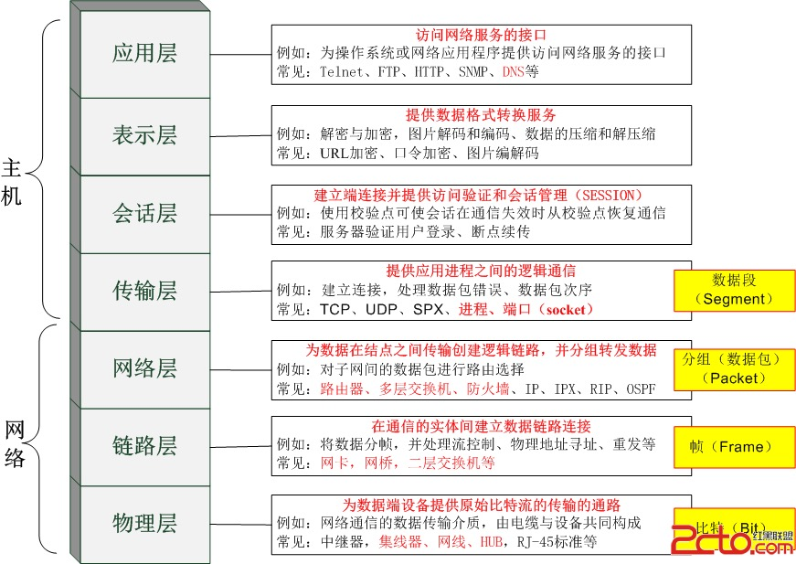
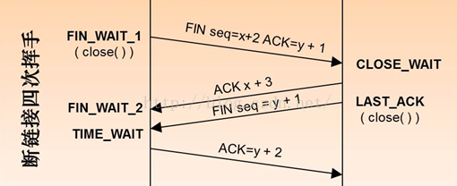

# 一、Java基础

## 一、Java编码规范

- 类注释、方法注释、代码逻辑块中尽可能有注释
- 提交规范：冗余的类、方法、代码块尽量都删除，不要提交无效的import，提交注释参考公司规范要求
- 编码风格：接口之间尽量解耦，不共用请求、相应类，每个接口都应该有请求响应体；常量尽量定义在常量类中；多张表的更新情况考虑使用事务，但是@Transactional事务不能滥用；非必要的业务逻辑单独提取出来，相同之处的代码优先考虑提取公共方法；类首字母大写、方法名首字母小写、变量首字母小写、包名全小写
- 命名规范：增删改查尽量对应各自的英文
- 日志规范：某些关键的地方、经常报错或逻辑复杂的方法的入口出口，又或者是某些业务代码块可适当加些日志，避免因加日志而产生的报错，例如：入口、出口加info级别的日志，代码块中debug级别；catch中异常要打印出来，加error级别的日志

## 二、面向对象

- 面向过程：更注重事情的每一个步骤及顺序
- 面向对象：更注重事情有哪些参与者(对象)、各自需要什么，也就是注重对象本身、对象属性以及对象的行为

面向对象的三大特征：

- 封装：封装的意义在于明确标识出允许外部使用的所有函数和数据项，内部细节对外部调用透明，外部调用无需修改或者关心内部实现
- 继承：继承基类的方法并作出自己的改变或扩展，子类共性的方法或者属性直接使用父类的，而不需要自己再定义，只需扩展自己个性化的
- 多态：基于对象所属类的不同，外部对同一个方法的调用，实际执行的逻辑不同

> 多态分为编译时多态和运行时多态，编译时多态是静态的，主要指的是方法的重载；运行时多态是动态绑定的，是Java运行时根据调用该方法实例的类型来决定选择调用哪个方法则称为运行时多态。
>
> 多态的三个必要条件分别为继承、重写以及向上转型，向上转型的意思就是在多态中需要将子类引用赋给父类对象。

## 三、JDK、JRE、JVM之间的区别

- JDK：Java Develpment Kit  Java工具包
- JRE：Java Runtime Environment  Java运行时环境
- JVM：Java Virtual Machine  Java虚拟机

> JDK包括JRE，JRE包括JVM；JDK > JRE > JVM

## 四、==与equals方法之间的区别

- equals：Object中默认采用的也是==比较，通常会重写，常用于比较两个引用类型的值是否相等

- ==：如果比较的是基本数据类型变量，则比较两个变量的值是否相等(不一定数量类型相等)，如果比较的是引用数据类型则比较两个对象的地址是否相同，即两个引用是否指向同一个地址值。

  **布尔类型不用 == 联系**

## 五、hashCode()与equals()之间的关系

HashCode介绍：hashCode()的作用是获取哈希码，也称散列码，它实际上返回的是一个int整数，这个哈希码的作用是确定该对象在哈希表中的索引位置。Java中的所有类都包含hashCode()函数。

散列表存储的是键值对(key-value)，它的特点是能根据键快速的检索出对应的值，这其中就利用到了散列码，可以快速找到对象

> 以HashSet如何检查重复为例来说明为什么要有HashCode：对象加入HashSet时，HashSet会先计算对象的HashCode值来判断对象加入的位置，看该位置是否有值，如果没有HashSet会假设对象没有重复出现，但是发现有值，这时会调用equals()方法来检查两个对象是否真相等。如果两者相同，HashSet就不会让其加入操作成功。如果不同的话就会重新散列到其他位置。
>
> 好处：这样就大大减少了equals的次数，相应就大大提高了执行速度。
>
> - 如果两个对象相等，则hashCode一定也相等
> - 如果两个对象相等，则对这两个对象分别调用equals方法都返回true
> - 如果两个对象的hashCode相等，则这两个对象的equals不一定相等
> - 如果两个对象的hashCode不相等，则这两个对象的equals一定不相等
> - 如果两个对象的equals相等，则这两个对象的hashCode也相等
> - 如果两个对象的equals不相等，则这两个对象的hashCode不一定不相等
>
> 因此equals方法被覆盖过，则HashCode方法也必须被覆盖。hashCode的默认行为是对堆上的对象产生独特值，如果没有重写hashCode，则该class的两个对象无论如何都不会相等(即使这两个对象指向相同的数据)

## 六、哈希冲突处理

哈希冲突是指不同的关键字通过同一个哈希函数可能得到同一个哈希地址，处理方法可以分为以下几种：

1. 开放地址法：指的是将哈希表中的空地址向处理冲突开发，当哈希表未满时，处理冲突时需要尝试另外的单元，直到找到空的单元为止。
   $$
   H(i)=(Hash(key)+F(i))\%m,i=1,2,3,......,n(n<= m-1);
   $$
   H(i)是指得到的地址序列；Hash(key)为哈希函数；m是哈希表长，取余的目的是使得得到的下一个地址一定落在哈希表中；F(i)是冲突解决方法，有以下几种：

   - 线性探测法：
   - 二次探测法
   - 伪随机数序列

2. 链地址法：将具有相同哈希地址的元素(或记录)存储在同一个线性链表中，链地址法是一种更加常用的哈希冲突解决方法。假设哈希函数产生的哈希地址区间为[0,m-1]，哈希表的表长为m，则可以将哈希表定义为一个有m个头节点组成的链表指针数组，这样在插入关键字的时候，只需要通过哈希函数计算出对应的哈希地址，然后将其以链表节点的形式插入到单链表中，可以插入到链表的随意位置；在查询的时候只需要通过哈希函数计算出对应的哈希地址，然后将对应的位置上的链表整个扫描一遍，比较链表中每个链节点的键值与查询的键值是否一致。

   相对于开放地址法，采用链地址法处理冲突时要多占用一些存储空间，主要是链节点占用空间，但是它的查找数据较快。

3. 再希法：同时构造多个不同的哈希函数，等发生哈希冲突时就使用第二个、第三个......等其他的哈希函数计算地址，直到不发生冲突为止，虽然不易发生聚集，但是增加了计算时间

4. 建立公共溢出区：将哈希表分为基本表和溢出表，将发生哈希冲突的都存放在溢出表中

## 七、final关键字的作用

1. 修饰类：表示类不可被继承
2. 修饰方法：表示子类不可被子类覆盖(重写)，但是可以重载
3. 修饰变量(包括修饰成员变量和修饰局部变量)：表示变量一旦被赋值就不可更改它的值
4. 修饰成员变量

> 如果final修饰的是类变量，只能在静态初始化块中指定初始值或者声明该类变量时指定初始值，而且初始值只能在一处给；如果不用final修饰则有默认值，也可以手动给默认值
>
> 如果final修饰的是成员变量，可以在非静态初始化块、声明该变量或者构造器中执行初始值，而且必须在以上一处指定初始值；如果不用final修饰则有默认值，也可以手动给默认值，可以在声明该变量时、非静态代码块中、构造器以及方法中给值

​	5.修饰局部变量

> 系统不会为局部变量进行初始化，局部变量必须由程序员显式初始值。因此使用final修饰局部变量时，既可以在定义时指定默认值（后面的代码不能对变量再赋值），也可以不指定默认值，但要在后面的代码中对final变量赋初值（仅一次）
>
> 局部内部类和匿名内部类只能访问局部final变量的原因：内部类和外部类是处于同一级别的，内部类不会因为定义在方法中就会随着方法的执行完毕就被销毁。当外部类的方法结束时，局部变量就会被销毁，但是内部类对象可能还存在（没有人再引用它时，才会死亡），这里就产生一个矛盾：内部类对象访问了一个不存在的变量，为了解决这个问题，就将局部变量复制了一份作为内部类的成员变量，这样当局部变量死亡后，内部类仍可以访问它，实际访问的是它的复制品。这样好像就延长了局部变量的生命周期。将局部变量复制为内部类的成员变量时，必须保证这两个变量是一样的，也就是如果我们在内部类中修改了成员变量，方法中的局部变量也得跟着改变，这样只能将局部变量设置为final，对它初始化后，不让其再去修改这个变量，这样就保证了内部类的成员变量和方法的局部变量的一致性。方法的局部变量设为final，则内部类的成员变量也设置为final，使得局部变量与内部类建立的拷贝保持一致

​	6.修饰基本数据类型：其数值一旦在初始化之后便不能更改

​	7.修饰引用数据类型：在对其初始化之后便不能再让其指向另一个对象，但是引用的值是可变的

## 八、类的分类

1. 外部类：外部类仅能用public或包权限进行修饰
2. 嵌套类：嵌套类就是在一个类中定义的类，可以用四种修饰符进行修饰，根据是否被static关键字修饰，嵌套类分为静态嵌套类以及非静态嵌套类（又叫内部类）
3. 特殊的内部类：定义在方法中的内部类，叫做局部类；定义在方法体中的，没有名字的内部类叫做匿名类

##  九、类的初始化顺序

1. 无继承初始化顺序：静态成员变量 >> 静态代码块 >> 成员变量 >> 非静态代码块 >> 构造器

2. 有继承初始化顺序：父类静态成员变量和静态代码块 >> 子类静态成员变量和静态代码块 >> 

   ​								父类非静态成员变量和非静态代码块 >> 父类构造方法 >> 

   ​								子类非静态成员变量和非静态代码块 >> 子类构造方法

## 十、String、StringBuffer、StringBuilder的区别

String是不可变的，如果尝试去修改，会生成一个字符串对象，StringBuffer和StringBuilder是可变的

StringBuffer是线程安全的，StringBuilder是线程不安全的，所以在单线程环境下StringBuilder效率更高

## 十一、重载和重写的区别

1. 重载：发生在同一个类中，方法名必须相同，参数类型不同、个数不同、顺序不同，与方法返回值、访问修饰符以及抛出的异常无关
2. 重写：发生在父子类中，方法名、参数列表必须相同，返回值范围小于等于父类，抛出的异常范围小于等于父类（如果父类中没有异常抛出而子类中有异常，则必须在子类中try catch或者在父类再重新抛出异常）；访问修饰符大于等于父类；如果父类方法访问修饰符为private则子类就不能重写该方法

## 十二、接口和抽象的区别

1. 成员的区别：抽象类中有构造方法，变量可以是成员变量也可以是常量，方法既可以是抽象的也可以是非抽象的；接口中没有构造方法，变量只能是常量（默认修饰符为public static final），方法在JDK1.7中只能是抽象的（默认修饰符为public abstract），在JDK1.8中可以写default和static开头的具体方法

2. 类和接口的关系区别：类与类继承关系只能是单继承但可以多层继承；类与接口实现关系可以单实现也可以多实现，类可以在继承一个类的同时实现多个接口；接口与接口继承关系可以单继承也可以多继承

3. 体现的理念不同：抽象类里面定义的都是一个继承体系中的共性问题；接口是功能的集合，是一个体系额外的功能，是暴露出来的规则

4. 使用接口和抽象类的依据：接口和抽象类的概念是不一样的，接口是对动作的抽象，抽象类是对根源的抽象。**抽象类表示的是这个对象是什么，接口表示的是这个对象能干什么**。所以在高级语言中，一个类只能继承一个类，但是可以实现多个接口。当你关注一个事务本质的时候使用抽象类，当你关注一个操作的时候用接口。抽象类的功能要远超接口，但是定义抽象类的代价高，因为对高级语言来说每个类只能继承一个类，在这个类中，你要编写出所有子类的共性。虽然接口在功能上会弱化许多，但是它只是针对一个动作的描述，而且你可以在一个类中同时实现多个接口，在设计阶段会降低难度

   > 接口方法引入default和static的目的：
   >
   > default：在之前的版本中，即使是个空的实现也要写出来，所以在新特性中添加的默认方法无需在实现类中实现，如果想实现，重写就可以；为接口添加新的默认方法不会破坏原有的接口实现；不需要修改接口的实现类就可以为接口添加新的实现方法；对于已经发布的版本是无法在给接口添加新方法的同时而不影响已有的实现。因此引进来default，目的就是为了解决接口修改已有的实现不兼容的问题
   >
   > static：只能在静态方法所属的类中来调用；必须有方法体即使方法体中没有实现；实现接口的类或子接口不会继承接口中的静态方法；static方法和default不能同时使用（由于static方法是属于类的方法，而不是对象实例的方法，因此它们在接口中是独立的，并不依赖于任何实现类。相反，默认方法是依赖于实例的具体实现的，因此它们可以被子类重写或覆盖）；静态的所以不能被实现类实现，常常作为工具型的方法，比如空值检查、集合类排查等。

## 十三、ArrayList和LinkedList的区别

1. 两者的底层数据结构不同，ArrayList底层是基于数组实现的，LinkedList底层是基于链表实现的
2. 两者的适应场景不同，ArrayList更适合随机查找，LinkedLIst更适合删除和添加
3. 两者对空间的使用不同：ArrayList的空间浪费主要体现在要在List列表的结尾预留一定的容量空间，而LinkedList的空间浪费则体现在它的每一个元素都要消耗相当的空间

## 十四、HashMap和HashTable的区别

区别：

- HashMap是非线程安全的，没有用synchronized修饰；而HashTable是线程安全的，只是在HashMap的put操作时加上了synchronized保证插入时阻塞其他线程的插入操作

- HashMap允许有一个key为null和多个value为null，在HashMap的源码中，求哈希值不是直接通过Object的hashCode()方法计算的，而是还要做一些额外的扰动处理，为了避免哈希碰撞概率。并且也没有对put操作的入参key和value做判空抛异常操作，所以HashMap是允许key和value为空的。之所以HashMap只允许一个null键，是因为当key为null时，它就会将key的哈希值直接赋值为0。HashMap允许多个value为null，因为key可以是任意值，所以键值对可以放在数组的任意位置，有多少个value为null的键值对都是不会有限制的

  而HashTable不允许key和value为null，其一HashTable的put操作时使用Object的hashCode()方法计算出来哈希值，如果key是null就会出现null.hashCode()的情况，直接导致出现空指针异常。其二是在并发环境下使用时会造成歧义问题，如果使用null值，就不能判断到底是映射的value是null，还是因为没有找到对应的key而为空

## 十五、HashMap的底层实现

1. JDK1.7中底层是数组和链表，JDK1.8中是数组、链表和红黑树，加入红黑树的目的是提高HashMap插入和查询整体效率

2. JDK1.7中链表插入使用的是头插法，JDK1.8中链表插入使用的是尾插法，因为JDK1.8中插入key和value时需要判断链表元素的个数，需要遍历链表并统计链表元素个数，所以正好就直接使用尾插法

3. JDK1.7中哈希算法比较复杂，存在各种各样右移与异或运算，JDK1.8中则进行了简化，因为复杂的哈希算法的目的就是提高散列性来提供HashMap的整体效率，而JDK1.8中新增了红黑树所以可以适当的简化哈希算法，节省CPU资源

4. 链表和红黑树相互转化
   
   
   
   - 当链表长度大于等于8且数组长度小于64时，此时会扩容
   - 当链表长度大于等于8且数组长度大于等于64时，此时会将链表转为红黑树
   - 在resize()方法扩容时，在将原Node数组迁移到扩容后的新Node数组的时候，如果该Node元素是一个红黑树，则对其拆分然后才迁移到新的Node数组中。如果拆分之后的子树数量小于等于6则将该子树转回为链表结构
   
5. 底层实现
   - 根据key通过哈希算法与运算得出数组下标
   - 如果数组下标位置元素为空，则将key和value封装为Entry对象（JDK1.7中是Entry对象，JDK1.8中是Node对象）并放入该位置
   - 如果数组下标元素不为空，则分情况讨论
     1. 如果是JDK1.7则先判断是否需要扩容，如需扩容则扩容，不需扩容就生成Entry对象并使用头插法添加到当前位置的链表中
     2. 如果是JDK1.8则会先判断当前位置上的Node类型
        - 如果是红黑树Node则将key和value封装为一个红黑树节点并添加到红黑树中，在这个过程中会判断红黑树是否存在当前key，如果存在则更新value
        - 如果此位置上的Node对象是链表节点，则将key和value封装为一个链表Node并通过尾插法插入到链表的最后位置去，因为是尾插法所以需要遍历链表，在遍历链表的过程中会判断是否存在当前key,，如果存在则更新value，当遍历完链表后将新链表Node插入到链表中，插入到链表后会看当前链表的节点个数，如果链表长度大于等于8且数组长度小于64则进行扩容，如果链表长度大于等于8且数组长度大于等于64则将该链表转为红黑树

## 十六、HashMap的扩容机制

当HashMap中的元素个数超过数组大小 * loadFactor（负载因子）时，就会进行数组扩容，loadFactor的默认值是0.75这是一个折中的取值，也就是说，默认情况下数组大小为16，那么当hashMap中的元素个数超过16*0.75 = 12 （阈值或者边界值的时候）就把数组的大小扩展为2 * 16 = 32，然后重新计算出每个元素在数组中的位置，而这是一个非常耗性能的操作，所以我们最好能够提前预知并设置元素的个数。

注意：当HashMap中的其中一个链表的对象个数达到了8个，此时如果数组长度没有达到64，那么hashMap会先扩容解决，如果达到了64，就会变成红黑树，节点类型由Node变成TreeNode类型，当然如果映射关系被移除后，下次执行resize()方法时会判断树的节点个数低于6也会再把树转换为链表。

> JDK1.7版本
>
> - 先⽣成新数组 
> - 遍历⽼数组中的每个位置上的链表中的每个元素
> - 取每个元素的key，并基于新数组⻓度，计算出每个元素在新数组中的下标
> - 将元素添加到新数组中去 
> -  所有元素转移完了之后，将新数组赋值给HashMap对象的table属性 
>
> JDK1.8版本
>
> - 先⽣成新数组
>
> - 遍历⽼数组中的每个位置上的链表或红⿊树 
>
> - 如果是链表，则直接将链表中的每个元素重新计算下标，并添加到新数组中去 
>
> - 如果是红⿊树，则先遍历红⿊树，先计算出红⿊树中每个元素对应在新数组中的下标位置 
>
>   1. 统计每个下标位置的元素个数
>2. 如果该位置下的元素个数超过了8，则⽣成⼀个新的红⿊树，并将根节点添加到新数组的对应位置
>   3. 如果该位置下的元素个数没有超过8，那么则⽣成⼀个链表，并将链表的头节点添加到新数组的对应位置
>4. 所有元素转移完了之后，将新数组赋值给HashMap对象的table属性 
>   

## 十七、HashMap保证线程安全

- 使用HashTable
- 使用Collection.SynchronizationMap
- 使用ConcurrentHashMap(线程安全、效率高)

## 十八、ConcurrentHashMap底层实现

在1.7中ConcurrenthashMap是由Segment数组和HashEntry数据结构(类似Map，底层也就是数组+链表)组成，Segment是一种可重入锁(ReentrantLock)，在ConcurrentHashMap里扮演锁的角色；HashEntry则用于存储键值对数据，一个ConcurrenthashMap里包含一个Segment数组，Segment的结构和HashMap类似，是一种数组和链表结构，Segment数组的每个节点都相当于一个小HashMap，这样就可以对单个Segment节点加锁，不会影响到所有数据都被锁上，原理跟HashMap差不多，都是用hash算法找位置(第一次hash找segment数组的某个节点，第二次hash找这个Segment节点下这个小hashMap的数组位置，就类似HahMap的操作了)


在1.8中数组结构采用的Node数组、链表和红黑树，在实现并发安全的时候使用synchronized+CAS，采用锁表头节点的方式降低了锁粒度，以较低的性能代价实现了线程安全。初始化数组或头节点时，ConcurentHashMap并没有加锁，而是使用CAS的方式进行原子替换(原子操作，基于unsafe类的原子操作Api)。插入数据时会进行加锁处理，但是锁定的不是整个数组，而是槽中的头节点，所以ConcurrentHashMap中锁的粒度是槽而不是整个数组，因此并发的性能很好。**扩容时会进行加锁处理**，锁定的仍然是头节点，并且支持多个线程同时对数组扩容提升并发能力，每个线程需先以CAS操作抢任务，争取一段连续槽位的数据转移权，抢到任务后，该线程会锁定槽内的头节点，然后将链表或树中的数据迁移到新的数组里。**查找数据时并不会加锁**，所以性能很好，另外在扩容的过程中依然可以支持查找操作，如果某个槽还未进行迁移则直接可以从旧数组里找到数据，如果某个槽已经迁移完毕，但是整个扩容还没结束则扩容线程会创建一个转发节点存入旧数组，届时查找线程根据转发节点的提示从新数组中找到目标数据


## 十九、ConcurrentHashMap的扩容机制

1. JDK1.7版本

   - ConcurrentHashMap是基于Segment分段实现的
   - 每个Segment相当于一个小型的HashMap
   - 每个Segment内部会进⾏扩容，和HashMap的扩容逻辑类似 
   -  先⽣成新的数组，然后转移元素到新数组中 
   - 扩容的判断也是每个Segment内部单独判断的，判断是否超过阈值 

2. JDK1.8版本

   - ConcurrentHashMap不再基于Segment实现

   - 当某个线程进⾏put时，如果发现ConcurrentHashMap正在进⾏扩容那么该线程⼀起进⾏扩容

   - 如果某个线程put时，发现没有正在进⾏扩容，则将key-value添加到ConcurrentHashMap中，然后判断是否超过阈值，超过了则进行扩容

   - ConcurrentHashMap是⽀持多个线程同时扩容的 

   -  扩容之前也先⽣成⼀个新的数组 

   - 在转移元素时，先将原数组分组，将每组分给不同的线程来进⾏元素的转移，每个线程负责⼀组或多组的元素转移⼯作 


## 二十、深拷贝和浅拷贝

深拷⻉和浅拷⻉就是指对象的拷⻉，⼀个对象中存在两种类型的属性，⼀种是基本数据类型，⼀种是实例对象的引⽤

1. 浅拷⻉是指，只会拷⻉基本数据类型的值，以及实例对象的引⽤地址，并不会复制⼀份引⽤地址所指向的对象，内部的引用数据类型属性指向的是同⼀个对象。浅拷贝的实现调用的clone方法，必须要让类实现Cloneable接口并且覆写clone方法(仅外部类实现则可实现浅拷贝)
2. 深拷⻉是指，既会拷⻉基本数据类型的值，也会针对实例对象的引⽤地址所指向的对象进⾏复制，深拷⻉出来的对象，内部的引用数据类型属性指向的不是同⼀个对象。深拷贝的实现方法有函数( Apache Commons Lang 库提供的 SerializationUtils.clone() 方法，可以对对象进行深拷贝)、重写clone()方法(类以及类中所使用的类都得重写clone方法则可实现深拷贝)以及Serializable序列化

> 深拷贝和浅拷贝最根本的区别在于是否真正获取一个对象的复制实体，而不是引用。
>
> 如何抉择使用哪一种拷贝, 如果对象的属性全是基本类型的，那么可以使用浅拷贝。 如果对象有引用属性，那就要基于具体的需求来选择浅拷贝还是深拷贝。 意思是如果对象引用任何时候都不会被改变，那么没必要使用深拷贝，只需要使用浅拷贝就行了。如果对象引用经常改变，那么就要使用深拷贝。没有一成不变的规则，一切都取决于具体需求。

## 二十一、Java中异常体系


- Java中的所有异常都来自顶级父类Throwable
- Throwable下有两个子类，分别为Error和Exception
- Error是程序无法处理的错误，一旦出现这个错误则程序将被迫停止运行
- Exception不会导致程序停止，Exception又可以分为RuntimeException运行时异常和CheckedException检查异常
- RuntimeException常常发生在程序运行过程中，会导致程序当前线程执行失败
- CheckedException常常发生在程序编译过程中，会导致程序编译不通过

## 二十二、try-catch-finally的执行顺序

```java
public class ExceptionTest {
	int age;
    public static void main(String []args) {
       System.out.println(test().age);
    }
	public static ExceptionTest test() {
        ExceptionTest test = new ExceptionTest();
        try {
            test.age = 10;
            return test;
        }catch (Exception e) {
            test.age = 20;
            return test;
        }finally {
            test = new ExceptionTest();
            test.age = 30;
		   return test;
        }
    }
}

```

- 不管有没有异常，finally块中代码都会执行
- 当try和catch中有return时，finally仍然会执行。在执行return语句之前，都会先执行finally语句
- finally是在return表达式运算前执行的（此时并没有返回运算的值，而是先把要返回的值保存起来。如果在finally中的代码重新赋值了，但是在finally里没有return则返回的值还是临时保存的值，如果在finally里有return则返回的值是finallly中的值）
- finally中最好不要包含return，否则程序会提前退出，这样返回值就不是try或catch中的值

# 二、JVM虚拟机


## 一、类的加载过程


1. Java源代码
2. Java源代码经过编译器进行编译生成Java字节码文件(.class文件)
3. Java字节码文件经过JVM虚拟机中加载、链接（验证、准备、解析）、初始化等等翻译成机器可执行的二进制机器码
7. 程序运行

## 二、Java中的类加载器

JDK自带的三个类加载器：BootstrapClassLoader、ExtClassLoader、AppClassLoader

1. BootstrapClassLoader（启动类加载器）是ExtClassLoader的父类加载器，默认负责加载%JAVA_HOME%lib下的jar和class文件
2. ExtClassLoader（扩展类加载器）是AppClassLoader的父类加载器，负责加载%JAVA_HOME%lib/ext文件夹下的jar和class类
3. AppClassLoader是自定义类加载器的父类，负责加载classpath下的类文件

## 三、类加载器的双亲委派机制

JVM在加载一个类时，会调用AppClassLoader的loadClass方法来加载这个类，不过在这个类中会先使用ExtClassLoader的loadClass方法来加载类，同样ExtClassLoader的loadClass方法中会先使用BootstrapClassLoader来加载类，如果BootstrapClassLoader加载到了就直接成功，如果BootstrapClassLoader没有加载到，那么ExtClassLoader就会自己尝试加载该类，如果没有加载到那么则会由AppClassLoader来加载该类。

所以双亲委派机制指的是JVM在加载类时会委派给Ext和Bootstrap进行加载，如果没加载到则由自己进行加载

打破双亲委派机制的方法是自定义类加载器，继承ClassLoader类，重写loadClass()方法和findClass()方法

## 四、内存模型以及分区

Java中的栈(stack)、堆(heap)、方法区(method)

Java栈与堆是不同的，每一个线程都有一个栈，栈的区域非常小，但是存储速度非常快，所以我们把快速执行的任务存储在stack中。特点是自动分配，连续空间，先进先出原则。存储的数据有基本数据类型、引用数据类型、方法的形参以及局部变量(在方法中定义，随着方法调用而存在，随着方法调用完毕而销毁，没有初始化的值，使用前必须定义和赋值)

堆在JVM只有一个，在虚拟机开启时创建，所有的线程都共用这一个堆。特点是不连续的，而且是被所有线程共享的内存区域。堆中存放的数据有创建new出来的对象，每个对象都包含一个与之对应的class信息，而new对象的引用地址会储存在栈中，还可以存储数组；

方法区又称静态区，特点是方法区与堆一样是被所有线程共享的内存区域，方法区包含的都是整个程序中永远唯一的元素。方法区中存储的数据主要有类、静态方法、静态变量、常量以及成员方法、常量池等

## 五、GC判断对象可以被回收的方法

- 引用计数法：每个对象有一个引用计数属性，新增一个引用时计数加1，引用释放时计数减1，计数为0时可以回收
- 可达性分析法：从GC Roots开始向下搜索，搜索所走过的路径称为引用链。当一个对象到GC Roots没有任何引用链相连时则证明此对象是不可用的，那么虚拟机就判断是可回收对象

> 引用计数法，可能会出现A引用了B，B又引用了A，这时候就算他们都不再使用了，但是因为相互引用计数器 = 1永远不会被回收
>
> GC Roots的对象有
>
> - 虚拟机栈（栈帧中的本地变量表）中引用的对象
> - 方法区中类静态属性引用的对象
> - 方法区中常量引用的对象
> - 本地方法栈中JNI（即一般说的Native方法）引用的对象
>
> 可达性算法中的不可达对象并不是立即死亡的，对象拥有一次自我拯救的机会。对象被系统宣告死亡至少要经历两次标记过程：第一次是经过可达性分析发现没有与GC Roots相连接的引用链，第二次是在由虚拟机自动建立的Finalizer队列中判断是否需要执行finalizer()方法
>
> 当对象变成（GC Roots）不可达时，GC会判断该对象是否覆盖了finalizer()方法，若未覆盖则直接将其回收，否则若对象为执行过finalizer()方法将其放入F-Queue队列中，由低一优先级线程执行该队列中对象的finalizer()方法。执行完finalizer()方法完毕后，GC会再次判断该对象是否可达，若不可达则进行回收，否则对象复活。每个对象只能触发一次finalizer()方法。

## 六、GC垃圾收集的方法

1. MarkSweep标记清除算法：这个算法分为两个阶段，标记阶段是指把垃圾内存标记出来；清除阶段是直接将垃圾内存回收。这种算法是比较简单的，但是有个严重的问题就是会产生大量的内存碎片
2. Copying拷贝算法：为了解决标记清除算法的内存碎片问题，就产生了拷贝算法。拷贝算法将内存分为大小相等的两半，每次只使用其中的一半。垃圾回收时，将当前这一块的存活对象全部拷贝到另一半，然后当前这一半内存就可以直接清除。这种算法没有内存碎片，但是它的问题就在于浪费空间，而且它的效率跟存活对象的个数有关
3. MarkCompack标记压缩算法：为了解决拷贝算法的缺陷，就提出了标记压缩算法。这种算法在标记阶段跟标记清除算法是一样的，但是在完成标记之后不是直接清理垃圾内存，而是将存活的对象往一端移动，然后将端边界以外的所有内存直接清除

## 七、一个对象从加载到JVM直至被清除的过程

1. 用户创建一个对象，JVM首先需要到方法区去找对象的类型信息，然后再创建对象
2. JVM要实例化一个对象，首先要在堆中先创建一个对象，此时为半初始化状态
3. 对象首先会分配在堆内存中新生代的Eden,，然后经过一次Minor GC，对象如果存活就会进入S区。在后续的每次GC中，如果对象一直存活就会在S区来回拷贝，每移动一次年龄加1。年龄最大为15，超过一定年龄后，对象转入老年代
4. 当方法执行结束后，栈中的指针会先移除掉
5. 堆中的对象，经过Full GC，就会被标记为垃圾，然后被GC线程处理掉

## 八、引用的分类

引用分为强引用、弱引用、软引用、虚引用

- 强引用是我们使用最广泛的引用，如果一个对象具有强引用，那么垃圾回收器绝对不会回收它，当内存不足时，垃圾回收器宁愿抛出OutOfMemoryError也不会回收具有强引用的对象。我们可以通过显式的将强引用对象置为null，让GC认为该对象不存在引用，从来回收它
- 软引用是用来描述一些有用但不是必须的对象，在JAVA中用SoftReference来表示，当一个对象只有软引用时，当内存不足时才会回收它。
- 弱引用时来描述一些可有可无的对象，在java中用WeakReference来表示，在垃圾回收时一旦发现一个对象只具有弱引用时，无论当前内存空间是否充足都会回收掉该对象。
- 虚引用就是一种可有可无的引用，无法用来表示对象的生命周期，任何时候都可能被回收，虚引用主要使用来跟踪对象被垃圾回收的活动。

# 三、反射

## 一、反射的概念

反射是在程序运行时能够动态获取到Java中要反射的类的字节码，获取字节码有三种方法，分别为Class.forName(className)、类名.class、this.getClass()。然后将字节码中的方法、变量、构造函数等映射成相应的Method、Filed、Constructor等类，这些类提供了丰富的方法可以被我们所使用

## 二、反射API的类别

反射API用来生成JVM中的类、接口或者对象的信息

- Class类：反射的核心类，可以获取类的属性、方法等信息
- Filed类：表示类的成员变量，可以用来获取和设置类中的属性值
- Method类：表示类的方法，它可以用来获取类中的方法信息或者执行方法
- Constructor类：表示类的构造方法

## 三、反射创建对象的效率高还是通过new创建的对象效率高

通过new创建对象的效率比较高，通过反射创建时，先查找类资源，使用类加载器创建，过程比较复杂，所以效率比较低

使用反射的目的是增加了程序的灵活性，避免将代码写死，降低了耦合性

## 四、实例化对象的方式

1. 用new语句来创建对象
2. 通过工厂方法返回对象
3. 运用反射手段调用java.lang.Class或者java.lang.reflect.Constructor类中的newInstance()实例方法
4. 调用对象的clone()方法
5. 通过IO流（包括反序列化）

## 五、反射的使用

1. JDBC中，利用反射动态加载了数据库驱动程序
2. Web服务器中利用反射调用了servlet的服务方法
3. 很多框架使用反射机制进行注入属性、调用方法等等

# 四、设计模式

## 一、设计模式的六大原则

1. 开闭原则：尽量通过扩展软件实体来解决需求变化，而不是通过修改已有的代码来完成需求变化。简而言之一个软件产品在生命周期内都会发生变化，既然变化是一个既定的事实，我们就应该在设计的时候尽量适应这些变化以提高项目的稳定性和灵活性
2. 里氏替换原则：使用的基类可以在任何地方使用继承的子类，完美的替换基类。大概的意思就是子类可以扩展父类的功能，但不能改变父类原有的功能。子类可以实现父类的抽象方法，但是不能覆盖父类的非抽象方法，子类中可以增加自己特有的方法。此原则的的目的就是增强程序的健壮性，即使增加了子类，原有的子类还可以继续运行，互不影响
3. 依赖倒转原则：核心思想是面向接口编程，依赖倒转原则要求我们在程序代码中传递参数时或在关联关系中尽量引用层次高的抽象层类，这个是开放封闭原则的基础。具体内容是对接口编程，依赖于抽象而不依赖于具体
4. 接口隔离原则：使用多个隔离的接口比使用单个接口要好，还是降低类之间的耦合度的意思。高内聚，低耦合。
5. 迪米特法则：一个对象应当对其他对象有尽可能少地了解，简称类间解耦。大概意思就是一个类尽量减少自己对其他对象的依赖，原则是高内聚低耦合，只有使各个模块之间的耦合尽量的低才能提高代码的复用率
6. 单一职责原则：一个方法一个类只负责一个职责，各个职责的程序改动不影响其他程序。优点是降低类与类之间的耦合，提高可读性，增强可维护性和可扩展性，降低可变性的风险

## 二、[常见的设计模式](https://mp.weixin.qq.com/s/n3vsRQZPe0j5oIOk3umj7A)


1. 模板模式&策略模式：在模板模式中，一个抽象类公开定义了执行它的方法的方式/模板，它的子类可以按照需求重写方法实现，但是调用将以抽象类中定义的方式进行，这种类型的设计模式属于行为型模式。

   ```java
   public abstract class Penguin {
       public void eating() {
           System.out.println("吃饭");
       }
       public void sleeping() {
           System.out.println("睡觉");
       }
       public abstract void beating();//定义了抽象方法作为模板
       public void everyDay() {
           this.eating();
           this.sleeping();
           this.beating();
       }
   }
   
   public class LittlePenguin extends penguin {
       @Override
       public void beating() {
           System.out.println("用小翅膀打豆豆");
       }
   }
   public class MiddlePenguin extends penguin {
       @Override
       public void beating() {
           System.out.println("用圆圆的肚子打豆豆");
       }
   }
   public class BigPenguin extends penguin {
       @Override
       public void beating() {
           System.out.println("拿鸡毛掸子打豆豆");
       }
   }
   ```

   在策略模式中，一个类的行为或其算法可以在运行时更改，这种类型的设计属于行为型模式。在策略模式中，我们创建表示各种策略的对象和一个行为随着策略对象改变而改变的context。策略对象改变context对象的执行算法

   ```java
   // 抽象出共同的行为
   public abstract class Penguin {
       public void eating() {
           System.out.println("吃饭");
       }
       public void sleeping() {
           System.out.println("睡觉");
       }
       public abstract void beating();
   }
   
   // 每个类实现自己的行为
   public class LittlePenguin extends penguin {
       @Override
       public void beating() {
           System.out.println("用小翅膀打豆豆");
       }
   }
   public class MiddlePenguin extends penguin {
       @Override
       public void beating() {
           System.out.println("用圆圆的肚子打豆豆");
       }
   }
   public class BigPenguin extends penguin {
       @Override
       public void beating() {
           System.out.println("拿鸡毛掸子打豆豆");
       }
   }
   
   // 创建一个行为随着策略对象改变而改变的context对象
   public class BehaviorContext {
       private penguin _penguin;
   
       public behaviorContext(penguin newPenguin) {
           _penguin = newPenguin;
       }
       public void setPenguin(penguin newPenguin) {
           _penguin = newPenguin;
       }
       public void everyDay() {
           _penguin.eating();
           _penguin.sleeping();
           _penguin.beating();
       }
   }
   
        // 调用方式
        public static void main(String[] args) {
           behaviorContext behavior = new behaviorContext(new littlePenguin());
           behavior.everyDay();
   
           behavior.setPenguin(new middlePenguin());
           behavior.everyDay();
   
           behavior.setPenguin(new bigPenguin());
           behavior.everyDay();
       }
   ```

   两者的相似之处

   - 模板模式和策略模式都可以用来满足开闭原则，使得软件在不改变代码的情况下易于扩展
   - 两种模式都表示通用function与该function的详细实现的分离

   两者的不同之处

   - 在策略模式中，客户与策略之间的耦合更加松散，而在模板方法中，两个模块耦合的更紧密
   - 在策略模式中，虽然抽象类也可以根据具体情况而使用，但大多使用一个接口而不是使用具体类，而在模板模式中大多使用抽象类或具体类，不使用接口
   - 在策略模式中，类的整体行为一般使用接口表示。在模板模式中用于减少代码重复，样板代码在基本框架或抽象类中定义，甚至可以有一个具有默认实现的具体类
   - 在策略模式中可以更改整个策略，但是在模板模式中只有一些事情发生变化而其他事件保持不变

2. 工厂模式：属于创建型模式，它提供了一种创建对象的最佳方式。在工厂模式中，我们在创建对象时不会对客户端暴露创建逻辑并且是通过使用一个共同的接口来指向新创建的对象

   ```java
   // 提出公共方法 生成抽象类
   public abstract class Penguin {
       public void eating() {
           System.out.println("吃饭");
       }
   
       public void sleeping() {
           System.out.println("睡觉");
       }
   
       public abstract void beating();
   
       public void everyDay() {
           this.eating();
           this.sleeping();
           this.beating();
       }
   }
   
   // 每个类的实现各自的功能
   public class LittlePenguin extends penguin {
       @Override
       public void beating() {
           System.out.println("用小翅膀打豆豆");
       }
   }
   public class MiddlePenguin extends penguin {
       @Override
       public void beating() {
           System.out.println("用圆圆的肚子打豆豆");
       }
   }
   public class BigPenguin extends penguin {
       @Override
       public void beating() {
           System.out.println("拿鸡毛掸子打豆豆");
       }
   }
   
   // 创建工厂
   public class penguinFactory {
       private static final Map<String, penguin> map = new HashMap<>();
       static {
           map.put("littlePenguin", new littlePenguin());
           map.put("middlePenguin", new middlePenguin());
           map.put("bigPenguin", new bigPenguin());
       }
       public static penguin getPenguin(String name) {
           return map.get(name);
       }
   }
   
   	// 创建对象
   	public static void main(String[] args) {
           penguin penguin_1 = penguinFactory.getPenguin("littlePenguin");
           penguin_1.everyDay();
           penguin penguin_2 = penguinFactory.getPenguin("middlePenguin");
           penguin_2.everyDay();
           penguin penguin_3 = penguinFactory.getPenguin("bigPenguin");
           penguin_3.everyDay();
       }
   ```

   实际场景

   - 去掉过多的if...else的场景
   - 选择多种支付方法等等

3. builder模式：将一个复杂对象的构建与它的表示分离，使得同样的构建过程可以创建不同的表示

   ```java
   public class penguin {
       private String  name;
       private Integer age;
       private String  sex;
       private Integer heignt;
   
       public void print() {
           String str = "name:" + name;
           str += (age == null) ? "" : ",age:" + age;
           str += (sex == null) ? "" : ",sex:" + sex;
           str += (heignt == null) ? "" : ",age:" + heignt;
           System.out.println(str);
       }
       private penguin(penguinBuilder builder) {
           this.age = builder.age;
           this.name = builder.name;
           this.sex = builder.sex;
           this.heignt = builder.heignt;
       }
       public static class penguinBuilder {
           private String  name;
           private Integer age;
           private String  sex;
           private Integer heignt;
   
           public penguinBuilder setName(String name) {
               this.name = name;
               return this;
           }
           public penguinBuilder setAge(Integer age) {
               this.age = age;
               return this;
           }
           public penguinBuilder setSex(String sex) {
               this.sex = sex;
               return this;
           }
           public penguinBuilder setHeignt(Integer heignt) {
               this.heignt = heignt;
               return this;
           }
           public penguin bulid() {
               return new penguin(this);
           }
       }
   }
   
   public static void main(String[] args) {
       penguin penguin1 = 
       new penguin.penguinBuilder().setName("楼仔").
                                     setSex("男").
                                     setHeignt(170).
                                     setAge(18).
                                     bulid();
       penguin penguin2 = 
       new penguin.penguinBuilder().setName("楼仔").
                                     setAge(18).
                                     bulid();                                            
       penguin1.print();
       penguin2.print();
   }
   ```

   builder模式构建的要点：

   - 定义一个静态内部类Builder，内部的成员变量和外部类一样
   - Builder类通过一系列的方法用于成员变量的赋值并返回当前对象本身(this)
   - Builder类提供一个外部类的创建方法(build、create等)，该方法内部调用了外部类的一个私有构造函数，入参就是内部类的Builder
   - 外部类提供一个私有构造函数供内部类调用，在该构造函数中完成成员变量的赋值，取值为Builder对象中对应的成员变量的值

   实际场景：当需要初始化一个对象时，但是对象里面有一堆成员变量，如果都使用set()方法去赋值，代码的可读性就太差了。这时可以采用Builder模式，让这些成员的赋值通过链式的方式去set，然后通过Builder去生成一个完整的对象

4. 组合模式：又叫做部分整体模式，是用于把一组相似的对象当成一个单一的对象。组合模式依据树形结构来组合对象，用来表示部分以及整体层次。这种类型的设计模式属于结构型模式，它创建了对象组的树形结构。对组合模式的理解，其实就是一个“总-分”的关系

   组合模式的层次主要包括一个抽象接口、组合对象节点和叶子节点

   - Component抽象组件：为组合中的所有对象提供一个接口，不管是叶子节点还是组合节点
   - Component组合节点对象：实现了接口的所有操作，并且持有子节点对象
   - Leaf叶子节点对象：叶子节点没有任何子节点，实现了接口中的某些操作

   ```java
   // 定义一个抽象类(Component抽象组件)
   public abstract class penguin {
       protected String name;
   
       public penguin(String name) {
           this.name = name;
       }
   
       public abstract void beating();
   
       public void add(penguin p) {
           throw new UnsupportedOperationException();
       }
       public void remove(penguin p) {
           throw new UnsupportedOperationException();
       }
       public penguin getChild(int i) {
           throw new UnsupportedOperationException();
       }
       public List<penguin> getChilds() {
           throw new UnsupportedOperationException();
       }
   }
   
   // Component组合节点对象，必须实现抽象组件的所有抽象方法
   public class batchPenguin extends penguin {
       private List<penguin> m_penguins = new ArrayList<>();
       public batchPenguin(String name) {
           super(name);
       }
       @Override
       public void beating() {
           System.out.println(this.name + "打豆豆");
           for (penguin p : m_penguins) {
               p.beating();
           }
       }
       @Override
       public void add(penguin p) {
           m_penguins.add(p);
       }
       @Override
       public void remove(penguin p) {
           m_penguins.remove(p);
       }
       @Override
       public penguin getChild(int i) {
           return m_penguins.get(i);
       }
       @Override
       public List<penguin> getChilds() {
           return m_penguins;
       }
   }
   
   // Leaf叶子节点
   public class leaf extends penguin{
       public leaf(String name) {
           super(name);
       }
       @Override
       public void beating() {
           System.out.println(name + "打豆豆");
       }
   }
   
   public static void main(String[] args) {
       batchPenguin grandFatherPenguin = new batchPenguin("grandFatherPenguin");
       batchPenguin fatherPenguin = new batchPenguin("fatherPenguin");
       batchPenguin motherPenguin = new batchPenguin("motherPenguin");
       batchPenguin childPenguin1 = new batchPenguin("childPenguin1");
       batchPenguin childPenguin2 = new batchPenguin("childPenguin2");
       batchPenguin childPenguin3 = new batchPenguin("childPenguin3");
       batchPenguin childPenguin4 = new batchPenguin("childPenguin4");
       leaf leaf1 = new leaf("leaf1");
   	leaf leaf2 = new leaf("leaf2");
   	leaf leaf3 = new leaf("leaf3");
   	leaf leaf4 = new leaf("leaf4");
   	childPenguin1.add(leaf1);
   	childPenguin2.add(leaf2);
   	childPenguin3.add(leaf3);
   	childPenguin4.add(leaf4);
       fatherPenguin.add(childPenguin1);
       fatherPenguin.add(childPenguin2);
       motherPenguin.add(childPenguin3);
       motherPenguin.add(childPenguin4);
       grandFatherPenguin.add(fatherPenguin);
       grandFatherPenguin.add(motherPenguin);
       grandFatherPenguin.beating();
   }
   ```

5. 单例模式：确保某一个类只有一个实例，而且自行实例化并向整个系统提供这个实例

   - 构造函数必须私有化，防止外部调用构造函数进行实例
   - 提供静态函数获取该单例
   - 类型分为懒汉模式和饿汉模式

   懒汉模式：在类加载时不创建实例，因此类加载速度快，但是运行时获取对象的速度慢

   - 单例使用volation修饰
   - 单例实例化时，要用synchronized进行同步处理
   - 双重null判断

   ```java
   public class penguin {
       private static volatile penguin m_penguin = null;
       // 避免通过new初始化对象
       private void penguin() {}
       public void beating() {
           System.out.println("打豆豆");
       };
       public static penguin getInstance() {
           if (null == m_penguin) {
               synchronized(penguin.class) {
                   if (null == m_penguin) {
                       m_penguin = new penguin();
                   }
               }
           }
           return m_penguin;
       }
   }
   ```

   饿汉模式：在类加载时就完成了初始化，所以类加载比较慢，但获取对象的速度快

   ```java
   public class penguin {
       private static penguin m_penguin = new penguin();
       private void penguin() {}
       public static penguin getInstance() {
           return m_penguin;
       }
   }
   ```

   单例模式的适用场景：单例模式只允许创建一个对象，因此节省内存，加快对象访问速度，因此对象需要在被公共的场合使用

   - 多个模块使用同一个数据源连接对象
   - 需要频繁实例化然后销毁的对象
   - 创建对象时耗时过多或损耗资源过多，但又经常使用的对象
   - 有状态的工具类对象
   - 频繁访问数据库或文件的对象

   单例模式的优点：

   - 在单例模式中，活动的单例只有一个实例，对单例类的所有实例化得到的都是相同的一个实例。这样就防止其他对象对自己的实例化，确保所有对象都访问一个实例
   - 单例模式具有一定的伸缩性，类自己来控制实例化进程，类就在改变实例化进程上有相应的伸缩性
   - 提供了对唯一实例的受控访问
   - 由于在系统内存中只存在一个对象，因此可以节约系统资源，当需要频繁创建和销毁对象时，单例模式无疑可以提高系统的性能
   - 避免对共享资源的多重占用

   单例模式的缺点：

   - 不适用于变化的对象，如果同一类型的对象总是要在不同的用例场景发生变化，单例就会引起数据的错误，不能保存彼此的状态
   - 由于单例模式总没有抽象层，因此单例类的扩展有很大的困难
   - 单例类的职责过重，在一定程度上违背了单一职责原则
   - 滥用单例将带来一定的负面问题，如为了节省资源将数据库连接池对象设计为单例类，可能会导致共享连接池对象的程序过多而出现连接池溢出；如果实例化的对象长时间不被利用，系统会认为是垃圾而被回收，这将导致对象状态的丢失

6. 代理模式：为其他对象提供一种代理以控制这个对象的访问。代理模式属于结构型模式，代理模式也叫委托模式，生活中，比如代购、打官司等等，实际上都是一种代理模式。代理模式可以分为静态代理和动态代理

   代理模式中涉及的角色：

   - Subject(抽象主题类)：接口或者抽象类，声明真实主题类与代理类的共同接口方法
   - RealSubject(真实主题类)：也叫作被代理类或被委托类，定义了代理所表示的真实对象，负责具体业务逻辑的执行，客户端可以通过代理类间接调用真实主题类的方法
   - Proxy(代理类)：也叫委托类，持有对真实主题类的引用，在其所实现的接口方法中调用真实主题类中的接口方法执行
   - Client(客户端类)：使用代理模式的地方

   静态代理

   ```java 
   // 创建抽象主题类(subject)
   public interface penguin {
       public void beating();
   }
   
   // 创建真实主题
   public class littlePenguin implements penguin {
       @Override
       public void beating() {
           System.out.println("打豆豆");
       }
   }
   
   // 创建静态代理
   public class penguinProxy {
       private penguin m_penguin;
       public penguinProxy(penguin p) {
           this.m_penguin = p;
       }
       public void beating() {
           System.out.println("打豆豆前");
           m_penguin.beating();
           System.out.println("打豆豆后");
       }
   }
   
   // 使用静态代理
   public static void main(String args[]) {
       penguin penguin1 = new littlePenguin();
       penguinProxy proxy = new penguinProxy(penguin1);
       proxy.beating();
   }
   ```

   动态代理

   ```java
   // 创建动态代理类
   public class penguinProxy implements InvocationHandler {
       private Object obj; // 被代理的对象
       public penguinProxy(Object obj) {
           this.obj = obj;
       }
       @Override
       public Object invoke(Object proxy, Method method, Object[] args)throws Throwable {
           System.out.println("海外动态代理调用方法:" + method.getName());
           Object result = method.invoke(obj, args);
           return result;
       }
   }
   
   // 使用方式
   public static void main(String args[]) {
       penguin penguin1 = new littlePenguin();
       // 创建动态代理
       penguinProxy proxy = new penguinProxy(penguin1);
       //获取ClassLoader
       ClassLoader loader = penguin1.getClass().getClassLoader();
       //通过Proxy创建代理实例，实际上通过反射来实现的
       penguin penguin2 = (penguin) Proxy.newProxyInstance(loader, new Class[]{penguin.class}, proxy);
       penguin2.beating();
   }
   ```

   静态代理类的缺点： 静态代理如果接口新增一个方法，除了所有实现类（真实主题类）需要实现这个方法外，所有代理类也需要实现此方法。增加了代码维护的复杂度。代理对象只服务于一种类型的对象，如果要服务多类型的对象。必须要为每一种对象都进行代理，静态代理在程序规模稍大时就无法胜任了 

   动态代理的优点： 可以通过一个代理类完成全部的代理功能，接口中声明的所有方法都被转移到调用处理器一个集中的方法中处理(InvocationHandler.invoke)。当接口方法数量较多时，我们可以进行灵活处理，而不需要像静态代理那样每一个方法进行中转。动态代理的应用使我们的类职责更加单一，复用性更强

   动态代理的缺点： 不能对类进行代理，只能对接口进行代理，如果我们的类没有实现任何接口，那么就不能使用这种方式进行动态代理（因为$Proxy()这个类集成了Proxy，Java的集成不允许出现多个父类） 

   代理的优点： 代理作为调用者和真实主题的中间层,降低了模块间和系统的耦合性。可以以一个小对象代理一个大对象，达到优化系统提高运行速度的目的。代理对象能够控制调用者的访问权限，起到了保护真实主题的作用 

   代理的缺点： 由于在调用者和真实主题之间增加了代理对象，因此可能会造成请求的处理速度变慢。实现代理模式需要额外的工作（有些代理模式的实现非常复杂），从而增加了系统实现的复杂度 

   适用场景： 当一个对象不能或者不想直接访问另一个对象时，可以通过一个代理对象来间接访问。为保证客户端使用的透明性，委托对象和代理对象要实现同样的接口。被访问的对象不想暴露全部内容时，可以通过代理去掉不想被访问的内容 。根据适用范围可分为以下几种。

   -  远程代理：为一个对象在不同的地址空间提供局部代表，这样系统可以将Server部分的事项隐藏 
   -  虚拟代理：如果要创建一个资源消耗较大的对象，可以先用一个代理对象表示，在真正需要的时候才真正创建 
   -  保护代理：用代理对象控制对一个对象的访问，给不同的用户提供不同的访问权限 
   -  智能引用：在引用原始对象的时候附加额外操作，并对指向原始对象的引用增加引用计数 

7. 装饰器模式： 允许向一个现有的对象添加新的功能，同时又不改变其结构。这种类型的设计模式属于结构型模式，它是作为现有的类的一个包装 

   适用场景：

   -  在不影响其他对象的情况下，以动态、透明的方式给单个对象添加职责 
   -  需要动态地给一个对象增加功能，这些功能也可以动态地被撤销。 当不能采用继承的方式对系统进行扩充或者采用继承不利于系统扩展和维护时 

   ```java
   // 定义一个抽象类
   public abstract class Food {
       protected String desc;
       public abstract String cook();
   }
   
   // 实例化两个对象
   public class Chicken extends Food {
       public Chicken() {
           this.desc = "鸡肉";
       }
       @Override
       public String cook() {
           return this.desc;
       }
   }
   
   public class Duck extends Food {
       public Duck() {
           this.desc = "鸭肉";
       }
       @Override
       public String cook() {
           return this.desc;
       }
   }
   
   // 定义一个装饰抽象类
   public abstract class FoodDecoration extends Food {
       @Override
       public abstract String cook();
   }
   
   // 定义两个不同的装饰类
   public class RoastFood extends FoodDecoration {
       private Food food;
       public RoastFood(Food f){
           this.food = f;
       }
       @Override
       public String cook() {
           return getDecoration() + food.cook();
       }
       private String getDecoration(){
           return "烤";
       }
   }
   
   public class SteamedFood extends FoodDecoration{
       private Food food;
       public SteamedFood(Food food) {
           this.food = food;
       }
       private String getDecoration() {
           return "蒸";
       }
       @Override
       public String cook() {
           return this.getDecoration() + food.cook();
       }
   }
   
   // 进行装饰
   public static void main(String args[]) {
       // 测试单纯的食物
       Chicken chicken = new Chicken();
       System.out.println(chicken.cook());
       // 测试单重修饰的食物
       RoastFood roastFood = new RoastFood(chicken);
       System.out.println(roastFood.cook());
       // 测试多重修饰的食物
       SteamedFood steamedFood = new SteamedFood(roastFood);
       System.out.println(steamedFood.cook());
   }
   ```

   装饰模式的优缺点：

   优点：

   - 装饰者模式可以提供比继承更多的灵活性
   -  可以通过一种动态的方式来扩展一个对象的功能，在运行时选择不同的装饰器，从而实现不同的行为 
   -  通过使用不同的具体装饰类以及这些装饰类的排列组合，可以创造出很多不同行为的组合。可以使用多个具体装饰类来装饰同一对象，得到功能更为强大的对象 
   -  具体构件类与具体装饰类可以独立变化，用户可以根据需要增加新的具体构件类和具体装饰类，在使用时再对其进行组合，原有代码无须改变，符合“开闭原则” 

   缺点：

   - 会产生很多的小对象，增加了系统的复杂性
   -  这种比继承更加灵活机动的特性，也同时意味着装饰模式比继承更加易于出错，排错也很困难，对于多次装饰的对象，调试时寻找错误可能需要逐级排查，较为烦琐 

8. 门面模式：相当于一个角色暴露给调用者，而此角色知晓其子系统里面的功能，当调用者想要调用哪个功能时，此角色便调用。 使用门面模式还有一个附带的好处，就是能够有选择性地暴露方法。一个模块中定义的方法可以分成两部分，一部分是给子系统外部使用的，一部分是子系统内部模块之间相互调用时使用的 

   -  门面(Facade)角色 ：客户端可以调用这个角色的方法。此角色知晓相关的（一个或者多个）子系统的功能和责任。在正常情况下，本角色会将所有从客户端发来的请求委派到相应的子系统去 
   -  子系统(SubSystem)角色 ：可以同时有一个或者多个子系统。每个子系统都不是一个单独的类，而是一个类的集合（如上面的子系统就是由ModuleA、ModuleB、ModuleC三个类组合而成）。每个子系统都可以被客户端直接调用，或者被门面角色调用。子系统并不知道门面的存在，对于子系统而言，门面仅仅是另外一个客户端而已 

   门面模式的优点：

   -  松散耦合：门面模式松散了客户端与子系统的耦合关系，让子系统内部的模块能更容易扩展和维护 
   -  简单易用：门面模式让子系统更加易用，客户端不再需要了解子系统内部的实现，也不需要跟众多子系统内部的模块进行交互，只需要跟门面类交互就可以了 
   -  更好的划分访问层次：通过合理使用门面，可以帮助我们更好地划分访问的层次。有些方法是对系统外的，有些方法是系统内部使用的。把需要暴露给外部的功能集中到门面中，这样既方便客户端使用，也很好地隐藏了内部的细节 

9. 责任链模式： 为请求创建了一个接收者对象的链。这种模式给予请求的类型，对请求的发送者和接收者进行解耦。这种类型的设计模式属于行为型模式 。 在这种模式中，通常每个接收者都包含对另一个接收者的引用。如果一个对象不能处理该请求，那么它会把相同的请求传给下一个接收者，依此类推。  在责任链模式中，客户只需要将请求发送到责任链上即可，无须关心请求的处理细节和请求的传递过程，所以责任链将请求的发送者和请求的处理者解耦了 

   ```java
   // 先创建一个抽象类，里面包括责任链等级，以及责任链的下一个元素
   public abstract class penguin {
       protected int level; // 责任链等级
       protected penguin nextPenguin; // 责任链中的下一个元素
   
       public void process(int level, String message) {
           if (level >= this.level) {
               // 如果输入的级别大于对象本身的级别，输出数据
               print(message);
           }
           if (this.nextPenguin != null) {
               // 如果存在下一个元素，就继续往下执行
               nextPenguin.process(level,message);
           }
       }
       public abstract void print(String message);
   }
   
   // 小企鹅子类
   public class littlePenguin extends penguin {
       public littlePenguin() {
           this.level = 1;
       }
       @Override
       public void print(String message) {
           System.out.println("Little Penguin:" + message);
       }
   }
   // 中企鹅子类
   public class middlePenguin extends penguin {
       public middlePenguin() {
           this.level = 2;
       }
       @Override
       public void print(String message) {
           System.out.println("Middle Penguin:" + message);
       }
   }
   // 大企鹅子类
   public class bigPenguin extends penguin {
       public bigPenguin() {
           this.level = 3;
       }
       @Override
       public void print(String message) {
           System.out.println("Big Penguin:" + message);
       }
   }
   
    	public static void main(String[] args) {
           littlePenguin penguin1 = new littlePenguin();
           middlePenguin penguin2 = new middlePenguin();
           bigPenguin penguin3 = new bigPenguin();
   
           penguin3.nextPenguin = penguin2;
           penguin2.nextPenguin = penguin1;
   
           penguin3.process(3, "print big/middle/small");
           penguin3.process(2, "print middle/small");
           penguin3.process(1, "print small");
       }
   
   // 输出结果
   Big Penguin:print big/middle/small
   Middle Penguin:print big/middle/small
   Little Penguin:print big/middle/small
   Middle Penguin:print middle/small
   Little Penguin:print middle/small
   Little Penguin:print small
   ```

   责任链模式的优点：

   -  降低了对象之间的耦合度。该模式使得一个对象无须知道到底是哪一个对象处理其请求以及链的结构，发送者和接收者也无须拥有对方的明确信息 
   -  增强了系统的可扩展性。可以根据需要增加新的请求处理类，满足开闭原则 
   -  增强了给对象指派职责的灵活性。当工作流程发生变化，可以动态地改变链内的成员或者调动它们的次序，也可动态地新增或者删除责任 
   -  责任链简化了对象之间的连接。每个对象只需保持一个指向其后继者的引用，不需保持其他所有处理者的引用，这避免了使用众多的 if 或者 if···else 语句 
   -  责任分担。每个类只需要处理自己该处理的工作，不该处理的传递给下一个对象完成，明确各类的责任范围，符合类的单一职责原则 

   责任链模式的缺点

   -  不能保证每个请求一定被处理。由于一个请求没有明确的接收者，所以不能保证它一定会被处理，该请求可能一直传到链的末端都得不到处理 
   -  对比较长的职责链，请求的处理可能涉及多个处理对象，系统性能将受到一定影响 
   -  职责链建立的合理性要靠客户端来保证，增加了客户端的复杂性，可能会由于职责链的错误设置而导致系统出错，如可能会造成循环调用 

   应用场景： 一个请求有多个对象可以处理，但每个对象的处理条件或权限不同 

   场景分类：

   -  有多个对象可以处理一个请求，哪个对象处理该请求由运行时刻自动确定 
   -  可动态指定一组对象处理请求，或添加新的处理者 
   -  在不明确指定请求处理者的情况下，向多个处理者中的一个提交请求

## 三、设计模式的分类

1. 创建型模式，共五种：
   -  工厂方法模式 
   - 抽象工厂模式
   - 单例模式 
   - 建造者模式 
   - 原型模式 
2. 结构型模式，共七种：
   - 适配器模式 
   - 装饰器模式
   - 代理模式
   - 外观模式
   - 桥接模式
   - 组合模式
   - 享元模式
3. 行为型模式，共十一种：
   - 策略模式 
   - 模板方法模式 
   - 观察者模式
   - 迭代子模式
   - 责任链模式
   - 命令模式
   - 备忘录模式
   - 状态模式
   - 访问者模式
   - 中介者模式
   - 解释器模式
4. 其他模式，共两种：
   - 并发型模式
   - 线程池模式

# 五、并发

## 一、JUC的概念

JUC是java.until.concurrent工具类的简称，这是一个处理线程的工具包。JUC常见的锁：ReentrantLock、CountDownLatch、CyclicBarrier、Phaser、ReadWriteLock、Semaphore、Exchanger、LockSupport

## 二、进程和线程

进程是指在系统中正在运行的一个应用程序，程序一旦运行就是进程，进程是资源分配的最小单位

线程是系统分配处理器时间资源的基本单位，或者说是进程内独立执行的一个单元执行，线程是程序执行的最小单位

## 三、并行与并发、串行

并行：并行是指多个处理器或者多核CPU同时处理多个不同的任务，并行是物理上的同时发生

并发：并发是指一个处理器同时处理多个任务，并发是逻辑上的同时发生，多个进程指令快速轮换执行

串行：串行在时间上不可能发生重叠，前一个任务没搞定，下一个任务就只能等着

## 四、管程

管程就是平时说的锁

## 五、用户线程和守护线程

用户线程：平时用到的普通线程，自定义线程

守护线程：运行在后台的一种特殊线程，比如垃圾回收线程，thread.setDaemon(true)必须在thread.start()之前设置

当主线程结束后，用户线程还在运行，JVM存活；如果没有用户线程，都是守护线程，JVM结束

## 六、线程的生命周期以及线程的状态

线程的状态分为五种：创建、就绪、运行、阻塞和死亡状态


1. 新建状态：新创建一个线程
2. 就绪状态：线程对象创建之后，其他线程调用了该对象的start方法。该状态的线程位于可运行线程池中变得可运行，等待获取CPU的使用权
3. 运行状态：就绪状态的线程获取了CPU，执行程序代码
4. 阻塞状态：阻塞状态是线程因为某种原因放弃CPU使用权暂时停止运行。直到线程进入就绪状态才有机会转到运行状态
5. 死亡状态：线程执行完了或者因异常退出了run方法，该线程结束生命周期

> 阻塞的情况又分为三类：
>
> - 等待阻塞：运行的线程执行wait方法，该线程会释放占用的所有资源，JVM会把该线程放入等待池中。进入这个状态后，是不能自动唤醒的，必须依靠其他线程调用notify或notifyAll方法才能被唤醒，wait是object类的方法
> - 同步阻塞：运行的线程在获取对象的同步锁（用synchronized或Lock修饰的类、方法或者代码块）时，若该同步锁被别的线程占用，则JVM会把该线程放入锁池中
> - 其他阻塞：运行的线程执行sleep或join方法，或者发出了I/O请求时，JVM会把该线程置为阻塞状态。当sleep状态超时、join等待线程终止或者超时、或者I/O处理完毕时，线程重新转入就绪状态。sleep是Thread类的方法

## 七、sleep()、wait()、join()、yield()之间的区别

锁池：所有需要竞争同步锁的线程都会放在锁池中。⽐如当前对象的锁已经被其中⼀个线程得到，则其他线程需要在这个锁池进⾏等待，当前⾯的线程释放同步锁后锁池中的线程去竞争同步锁，当某个线程得到后会进⼊就绪队列进⾏等待cpu资源分配

等待池：当我们调用wati()方法后，线程会放到等待池中，等待池中的线程是不会去竞争同步锁。只有调用了notify或notifyAll后线程才会开始去竞争锁。notify是随机从等待池选出一个线程放到锁池中，而notifyAll是将等待池中的所有线程放到锁池中

锁池和等待池的状态都是阻塞的

1. sleep是Thread类的静态本地方法，wait则是Object类的本地方法

2. sleep方法不会释放锁，但是wait会释放，而且会加入到等待队列中

   > sleep就是把cpu的执⾏资格和执⾏权释放出去，不再运⾏此线程，当定时时间结束再取回cpu资源， 
   >
   > 参与cpu的调度，获取到cpu资源后就可以继续运⾏了。⽽如果sleep时该线程有锁，那么sleep不会 
   >
   > 释放这个锁，⽽是把锁带着进⼊了冻结状态，也就是说其他需要这个锁的线程根本不可能获取到这个 
   >
   > 锁。也就是说⽆法执⾏程序

   

3. sleep⽅法不依赖于同步器synchronized，但是wait需要依赖synchronized关键字

4. sleep不需要被唤醒（休眠之后退出阻塞），但是wait需要（不指定时间需要被别的线程唤醒）

5. sleep ⼀般⽤于当前线程休眠，或者轮循暂停操作，wait 则多⽤于多线程之间的通信

6. sleep 会让出 CPU 执⾏时间且强制上下⽂切换，⽽ wait 则不⼀定，wait 后可能还是有机会重新竞 

   争到锁继续执⾏的

7. yield()执行后线程直接进入就绪状态，马上释放CPU的执行权，但是依然保留了CPU的执行资格，所以有可能CPU下次进行线程调度还会让这个线程获取到执行权继续执行

8. join()执行后线程进入阻塞状态，例如在线程B中调用线程A的join()，那线程B会进入到阻塞队列直到线程A结束或中断线程

## 八、创建线程的方式

1. 继承Thread类：重写run()方法，直接创建继承的类，.start()
2. 实现Runable接口：实现run()方法，通过new Thread()创建
3. 实现Callable接口：创建Callable实现类的实例，使用FutureTask类来包装Callable对象，使用FutureTask对象作为Thread对象的target创建并启动新线程
4. 线程池创建线程

## 九、使用线程池的好处以及线程池的参数

使用线程池的好处：

1. 降低资源消耗；提高线程利用率，降低创建和销毁线程的消耗
2. 提高响应速度；任务来了，直接有线程可用可执行，而不是先创建线程再执行
3. 提高线程的可管理性：线程是稀缺资源，使用线程池可以统一分配调优监控

线程池的参数：

1. corePoolSize：代表核心线程数，也就是正常情况下创建工作的线程数，这些线程创建后并不会消除，而是一种常驻线程
2. maxinumPoolSize：代表的是最大线程数，它与核心线程数相对应，表示最大允许被创建的线程数，比如当前任务较多，将核心线程数都用完了，还无法满足需求时，此时就会创建新的线程，但是线程池内线程总数不会超过最大线程数
3. keepAliveTime：表示超出核心线程数之外的线程的空闲存活时间，也就是核心线程数不会消除，但是超过核心线程数的数据的部分线程如果空闲一定的时间则会被消除，可以通过setKeepAliveTime来设置空闲时间
4. unit：TimeUnit枚举类型的值，代表keepAliveTime时间单位
5. workQueue：用来存放待执行的任务，假设现在核心线程都已被使用，还有任务进来则全部放入队列，直到整个队列被放满但任务还再持续进入则会开始创建新的线程（当workQueue队列已满时判断线程池数量是否超过最大线程数，若没超过则创建线程，若超过则执行handler拒绝策略）。阻塞队列通过阻塞可以保留住当前想要继续入队的任务
6. ThreadFactory：线程工厂，用来生产线程执行任务。可以默认选择使用通过阻塞的创建工厂，产生的线程都在同一个组内，拥有相同的优先级且都不是守护线程。可以根据业务来制定自定义线程工厂
7. handler：任务拒绝策略，有两种情况，第一种是我们调用shutdown等方法关闭线程池后，这时候即使线程池内部还有没执行完的任务正在执行，但是由于线程池已经关闭，我们再想线程池提交任务就会遭到拒绝。另一种情况就是当达到最大线程数，线程池已经没有能力继续处理新提交的任务时，也就拒绝了

## 十、线程池的分类

1. newFixedThreadPool为指定工作线程数量的线程池，每当提交一个任务就创建一个工作线程。超过线程数则放队列中
2. newSingleThreadExector：单线程化的Executor，保证了所有任务按照指定顺序执行，如果这个任务结束，会有另一个取代它以保证顺序执行
3. newCachedThreadPool：可缓存线程池，如果线程池长度超过处理需要，可灵活回收空闲线程，若无可回收则新建线程
4. newScheduledThreadPool：定长的线程池而且支持定时的以及周期性的任务执行

## 十一、线程池的底层工作原理

线程池内部是通过队列和线程实现的。线程池可以想象成一个工厂，线程是工人，队列是仓库，任务即是原材料。

- 如果此时线程池的线程数量小于corePoolSize，即使线程池的线程都处于空闲状态，也要创建新的线程来处理被添加的任务
- 如果此时线程池中的线程数量等于corePoolSize，但是阻塞队列workQueue未满，那么任务被放入阻塞队列
- 如果此时线程池中的线程数量大于等于corePoolSize，阻塞队列workQueue已满，并且线程池中的数量小于maxinumPoolSize，那么则新建线程来处理被添加的任务
- 如果此时线程池中的线程数量大于corePoolSize，阻塞队列workQueue已满，并且线程池中的数量等于maxinumPoolSize，那么通过handler所指定的策略来处理此任务
- 当线程池中的线程数量大于corePoolSize时，如果某线程（核心线程即使空闲也不会终止）空闲时间超过keepAliveTime，线程将会被终止。这样线程池可以动态的调整池中的线程数

## 十二、ThreaLocal的含义及好处

ThreadLocal即线程本地变量，是Thread的局部变量，如果创建了一个ThreadLocal变量，那么访问这个变量的每个线程都会有这个变量的本地拷贝。多个线程操作这个变量的时候，实际上是在操作自己本地内存里面的变量，从而起到线程隔离的作用，避免了并发场景下的线程安全问题

好处：在并发场景下会存在多个线程同时修改一个共享变量的场景，这就可能出现线程安全问题。为了解决线程安全问题可以用加锁的方式，比如使用synchronized或lock。但是加锁的方式，可能会导致系统变慢，所以使用ThreadLocal，以空间换时间的方式

## 十三、ThreadLocal的实现原理

Thread线程类内有一个类型为ThreadLocal.ThreaLocalMap的实例变量threadLocals，即每个线程都有一个属于自己的ThreadLocalMap；ThreadLocalMap内部维护着Entry数组，每个Entry代表一个完整的对象，key是ThreadLocal本身，value是ThreadLocal的泛型值；在并发多线程场景下，每个线程Thread在往ThreadLocal里设置值得时候，都是往自己的ThreadLocalMap里存，读也是从某个ThreadLocal作为引用在自己的map里找到对应的key从而可以实现线程隔离

threadLocal是作为当前线程中属性ThreadLocalMap集合中的某一个Entry的key值（Entry(threadLocal,value)）。虽然不同线程之间ThreadLocal这个key值是一样，但是不同的线程所拥有的ThreadLocalMap是独一无二的，也就是不同的线程同一个ThreadLocal(key)对应的存储的值(value)不一样，从而达到了线程间变量隔离的目的，但是在同一线程中这个value变量地址是一样的


## 十四、ThreadLocal不能直接用线程id作为可以的原因

一个使用类有两个共享变量，也就是说用了两个ThreadLocal成员变量的话，如果用线程id作为ThreadLocalMap的key就无法区分ThreadLocal的成员变量，因此还是需要使用ThreadLocal作为key来使用，每个ThreadLocal对象都可以由threadLocalHashCode属性唯一区分的

## 十五、ThreadLocal造成内存泄露的原因

内存泄漏：程序在申请内存后，无法释放已申请的内存空间，多次内存泄漏就会导致内存耗光的严重问题

ThreadLocal造成内存泄露的原因：因为当ThreadLocal对象使⽤完之后，应该要把设置的key，value，也就是Entry对象进⾏回收，但线程池中的线程不会回收，⽽线程对象是通过强引⽤指向ThreadLocalMap，ThreadLocalMap也是通过强引⽤指向Entry对象，线程不被回收，Entry对象也就不会被回收，从⽽出现内存泄漏，解决办法是，在使⽤了ThreadLocal对象之后，⼿动调⽤ThreadLocal的remove⽅法，⼿动清除Entry对象

## 十六、ThreadLocalMap中的key使用弱引用的原因

如果 key 是强引用，那么发生 GC 时 ThreadLocalMap 还持有 ThreadLocal 的强引用，会导致 ThreadLocal 不会被回收，从而导致内存泄漏。弱引用 ThreadLocal 不会内存泄漏，对应的 value 在下一次 ThreadLocalMap 调用 set、get、remove 方法时被清除

## 十七、ThreadLocal的应用场景和使用注意点

ThreadLocal的注意点：使用完要手动调用remove()方法

应用场景：

1. 使用日期工具类，当用到SimpleDateFormat，使用ThreadLocal保证线性安全
2. 全局存储用户信息（用户信息存入ThreadLocal，那么当前线程在任何地方需要时都可以使用）
3. 保证同一个线程获取的数据库连接connection是同一个，使用ThreadLocal来解决线程安全问题
4. 使用MDC保存日志信息

## 十八、并发的三大特性

1. 原子性：是指在一个操作中CPU不可以在中途暂停然后再调度，即不被中断操作。要不全部执行，要不都不执行。

   关键字：synchronized

2. 可见性：当多个线程访问同一个变量时，一个线程修改了这个变量的值，其他线程能够立即看得到修改的值

   关键字：synchronized、volatile、final

3. 有序性：虚拟机在进行代码编译时，对于那些改变顺序之后不会对最终结果造成影响的代码，虚拟机不一定会按照我们写的代码顺序来执行，有可能将他们重排序。实际上，对于有些代码进行重排序之后，虽然对变量的值没有造成影响，但有可能会出现线程安全问题

   关键字：synchronized、volatile

## 十九、synchronized关键字

synchronized是Java中的关键字，是一种同步锁，它可以修饰代码块、方法、静态方法以及类

- 修饰一个代码块，被修饰的代码块称为同步语句块，其作用的范围是大括号括起来的代码，作用的对象是调用这个代码块的对象
- 修饰一个方法，被修饰的方法称为同步方法，其作用的范围是整个方法，作用的对象是调用这个方法的对象
- 修饰一个静态方法，其作用的范围是整个静态方法，作用的对象是这个类的所有对象
- 修饰一个类，其作用的范围是synchronized后面括号括起来的部分，作用的对象是这个类的所有对象

synchronized的偏向锁、轻量级锁、重量级锁

- 偏向锁，在锁对象的对象头中记录一下当前获取到该锁的线程ID，该线程下次如果又来获取该锁就可以直接获取到
- 轻量级锁，由偏向锁升级而来，当一个线程获取到锁后，此时这把锁是偏向锁，如果有第二个线程来竞争锁，偏向锁就会升级为轻量级锁。轻量级锁底层是通过自旋锁来实现的并不会阻塞线程
- 如果自旋次数过多仍然没有获取到锁则会升级为重量级锁，重量级锁会导致线程阻塞
- 自旋锁是线程在获取锁的过程中不会去阻塞线程，也就无所谓唤醒线程，阻塞和唤醒这两个步骤都是需要操作系统去进行的，比较消耗时间。自旋锁是线程通过CAS获取预期的一个标记，如果没有获取到则继续循环获取，如果获取到了则表示获取到了锁，这个过程线程一直在运行中，相对而言没有使用太多的操作系统资源，比较轻量
- CAS：CAS的原理是拿期望的值和原来的一个值作比较，如果相同则更新成新的值，是一种无锁算法。步骤分为获取字段的期望值；计算出需要替换的新值；通过CAS将新值放在字段的内存地址上，如果失败则重复先前两步骤直到CAS成功，这种重复俗称为CAS自旋

## 二十、Lock锁

Lock锁实现提供了比使用同步方法和语句可以获得更广泛锁的操作。它们允许更灵活的结构，具有非常多不同的属性，并且可能支持多个关联的条件对象。Lock提供了比synchronized更多的功能

Lock锁和synchronized的区别：

- Lock不是Java内置的，synchronized是Java语言的关键字，因此是内置属性。Lock是一个类，通过这个类可以实现同步访问
- Lock和synchronized最大的不同是，synchronized不需要用户手动释放锁，当synchronized方法或synchronized代码块执行完之后，系统会自动让线程释放对锁的占用；而Lock则必须要用户去手动释放锁（在finally中释放），如果没有主动释放锁就有可能导致出现死锁问题
- Lock可以判断是否获取到锁，synchronized无法判断是否获取锁的状态
- synchronized锁可重入、不可中断、非公平；而Lock锁可重入、可判断、可公平（非公平也可）
- synchronized适用于少量代码的同步的问题；Lock锁适用于大量代码的同步问题

## 二十一、volatile

volatile写操作是原子性的，也就是数据操作完成后会立刻刷新到主内存中。但是被volatile修饰的变量可能在读得时候被多个线程读。例如i++操作，所以如果该变量是volatile修饰的，那完全可以保证此时取到的信息是最新的。但是在入栈和自增计算执行过程中，该变量有可能正在被其他线程修改，最后计算出来的结果照样存在问题，因此volatile并不能保证非原子操作的原子性，仅在单次读或单次写这样的原子操作中，volatile能够实现线程安全

volatile本身就包含了禁止指令重排序的语义。指令重排是通过插入内存屏障禁止在内存屏障前后的指令执行重排序优化。内存屏障的作用有保证特定操作的顺序，保证某些变量的内存可见性(利用该特性实现volatile的内存可见性)

volatile和synchronized的区别：

- volatile本质是在告诉JVM当前变量在寄存器（工作内存中是不确定的，需要从主存读取）；synchronized则是锁定当前变量，只有当前线程可以访问该变量，其他线程被阻塞
- volatile仅能使用在变量级别，synchronized可以使用在变量、方法和类级别中
- volatile仅能实现变量的修改可见性和有序性，不能保证原子性；而synchronized则可以保证变量的可见性、原子性以及有序性
- volatile不会造成线程的阻塞；synchronized可能会造成线程的阻塞
- volatile标记的变量不会被编译器优化；synchronized标记的变量可以被编译优化

## 二十二、Java避免死锁

造成死锁的原因：

- 一个资源每次只能被一个线程使用
- 一个线程在阻塞等待某个资源时，不释放已占有资源
- 一个线程已经获得的资源，在未使用完之前不能被强行剥夺
- 若干线程形成头尾相接的循环等待资源关系

这是造成死锁必须达到的四个条件，如果要避免死锁，只需要不满足其中某一个条件即可。而其中前三个条件是作为锁要符合的条件，所以要避免死锁就要打破第四个条件，不出现循环等待锁的关系

## 二十三、ReentrantLock中的公平锁和非公平锁的底层实现

首先不管是公平锁还是非公平锁，底层实现都会使用AQS来进行排队，它们的区别在于线程在使用lock()方法加锁时。如果是公平锁，会先检查AQS队列中是否存在线程在排队，如果有线程在排队则当前线程也进行排队，如果是非公平锁，则不会去检查是否有线程在排队，而是直接竞争锁。不管是公平锁还是非公平锁，一旦没竞争到锁都会进行排队。当锁释放时，都是唤醒排在最前面的线程，所以非公平锁只是体现在了线程加锁阶段，而没有体现在线程被唤醒阶段

ReentrantLock是可重入锁，不管是公平锁还是非公平锁都是可重入锁

## 二十四、ReentrantLock中tryLock()的Lock()

tryLock()表示尝试加锁，可能加到，也可能加不到，该方法不会阻塞线程，如果加到锁则返回true，没有加到则返回false

lock()表示阻塞加锁，线程会阻塞直到加到锁，方法也没有返回值

## 二十五、ReentrantLock和synchronized的区别

1. synchronized是一个关键字，sychronized的底层是JVM层⾯的锁；ReentrantLock是一个类，ReentrantLock是API层⾯的锁

2. synchronized会自动的加锁与释放锁，ReentrantLock需要认为的加锁与释放锁

3. sychronized是⾮公平锁，ReentrantLock可以选择公平锁或⾮公平锁

4. sychronized锁的是对象，锁信息保存在对象头中，ReentrantLock通过代码中int类型的state标识 

   来标识锁的状态

## 二十六、CountDownLatch和Semaphore的区别和底层原理

CountDownLatch表示计数器，可以给CountDownLatch设置一个数字，一个线程调用CountDownLatch的await()将会阻塞，其他线程可以调用CountDownLatch的countDown()方法来对CountDownLatch中的数字减一，当数字被减成0后，所有await的线程都将被唤醒。对应的底层原理就是调用await()方法的线程会利用AQS排序，一旦数字被减为0则会将AQS中排队的线程依次唤醒

Semaphore表示信号量，可以设置许可的个数，表示同时允许最多多少个线程使用该信号量，通过acquire()来获取许可，如果没有许可可用则线程阻塞并通过AQS来排队，可以通过release()方法来释放许可，当某个线程释放了某个许可后会从AQS中正在排队的第一个线程开始依次唤醒，直到没有空闲可用

## 二十七、AQS的含义以及AQS如何实现可重入锁

 AQS是⼀个JAVA线程同步的框架。是JDK中很多锁⼯具的核⼼实现框架

在AQS中，维护了⼀个信号量state和⼀个线程组成的双向链表队列。其中，这个线程队列，就是⽤来给线程排队的，⽽state就像是⼀个红绿灯，⽤来控制线程排队或者放⾏的。 在不同的场景下，有不同的意义

在可重⼊锁这个场景下，state就⽤来表示加锁的次数。0标识⽆锁，每加⼀次锁，state就加1。释放锁state就减1

## 二十八、Java中锁的分类

1. 悲观锁和乐观锁
   - 悲观锁：当前线程去操作数据的时候，总是认为别的线程会去修改数据，所以每次操作数据的时候都会上锁，别的线程去操作数据的时候就会阻塞，比如synchronized
   - 乐观锁：当前线程每次去操作数据的时候都认为别人不会修改，更新的时候会判断被人是否会更新数据，通过版本来判断，如果数据被修改了就拒绝更新，例如CAS是乐观锁，通过原子性来保证数据同步
   - 悲观锁适合写操作多的场景，乐观锁适合读操作多的场景，乐观锁的吞吐量会比悲观锁高
2. 公平锁和非公平锁
   - 公平锁：有多个线程按照申请锁的顺序来获取锁，就是说如果一个线程组里面，能够保证每个线程都能拿到锁，例如ReentrantLock（使用的同步队列FIFO）
   - 非公平锁：获取锁的方式是随机的，保证不了每个线程都拿得到锁，会存在线程饿死，一直拿不到锁，例如synchronized、ReentrantLock
   - 非公平锁性能高于公平锁，更能重复利用CPU的时间
3. 可重入锁和不可重入锁
   - 可重入锁：也叫递归锁，在外层使用锁之后，在内层还能使用并且不会产生死锁。可重入锁能一定程度的避免死锁，例如synchronized、ReentrantLock
   - 不可重入锁：在当前线程执行某个方法已经获取了该锁，那么在方法中尝试再次获取锁时就会获取不到被阻塞
4. 自旋锁：一个线程在获取锁的时候，如果锁已经被其他线程获取，那么该线程将循环等待，然后不断的判断锁是否能够被获取成功，直到获取到锁才会退出循环，任何时刻最多只能有一个执行单元获取到锁。不会发生线程状态的切换，一直处于用户状态，减少了线程上下文切换的消耗，缺点是循环会消耗CPU
5. 共享锁和独享锁
   - 共享锁：共享锁也叫读锁，可以查看数据，但是不能添加、修改和删除数据的一种锁，加锁后其他线程可以并发读取，该锁可被多个线程持有，用于资源数据共享
   - 独享锁：也叫排他锁、写锁、独占锁，该锁每次只能被一个线程锁持有。加锁后任何线程试图再次加锁都会被阻塞，直到当前线程解锁，获取独享锁的线程既能读取数据也能修改数据

## 二十九、IO模式：BIO、NIO、AIO 

同步与异步：

- 同步：就是发起一个调用后，被调用者未处理完请求之前，调用不返回
- 异步：就是发起一个调用后，立刻得到被调用者的回应表示已接收到请求，但是被调用者并没有返回结果，此时我们可以处理其他的请求，被调用者通常事件，回调等机制来通知调用者其返回结果
- 同步和异步的区别最大在于异步的话调用者不需要等待处理结果，被调用者会通过回调等机制来通知调用者其返回结果

阻塞与非阻塞：

- 阻塞：阻塞就是发起一个请求，调用者一直等待请求结果返回，也就是当前线程会被挂起，无法从事其他任务，只有当条件就绪才能继续
- 非阻塞：非阻塞就是发起一个请求，调用者不用一直等待结果返回，可以先去干其他事情

1. BIO（同步阻塞）：数据的读取写入必须阻塞在一个线程内等待其完成
2. NIO（同步非阻塞）：
3. AIO（异步非阻塞）

## 三十、Netty

 最流行的 NIO框架，由 JBOSS 提供的，整合了FTP,SMTP,HTTP协议 

1. API 简单
2. 成熟稳定
3. 社区活跃·
4. 经过大规模验证（互联网、大数据、网络游戏、电信通信）Elasticsearch、Hadoop 子项目 avro项目、阿里开源框架 Dubbo、使用 Netty

# 六、Spring开发框架

## 一、Spring的概念

Spring是一个轻量级的控制反转（IOC）和面向切面（AOP）的容器框架

AOP：将程序中的交叉业务逻辑（比如安全、日志、事务等），封装成一个切面，然后注入到目标对象（具体业务逻辑）中去

IOC：容器概念、控制反转、依赖注入

> IOC容器：实际上就是个Map，里面存的是各种对象，在项目启动的时候会读取配置文件里面的bean节点，根据全限类名使用反射创建对象放到Map里、扫描到打上注解的类也是通过反射创建对象放到Map里
>
> 控制反转：对象A与对象B之间失去了联系，当对象A运行到需要对象B的时候，IOC容器会主动创建一个对象B注入到对象A需要的地方。对象A获取对象B的过程由主动行为变为了被动行为。全部对象的控制权全部上缴给IOC容器，它起到了一种类似粘合剂的作用
>
> 依赖注入：控制反转之后，获取依赖对象的过程由自身管理变为了由IOC容器主动注入。依赖注入是实现IOC的方法，就是由IOC容器在运行期间动态的将某种依赖关系注入到对象之中

## 二、Spring支持的七种bean的作用域

1. singleton：默认，每个容器中只有一个bean对象，单例的模式由BeanFactory自身来维护，该对象的生命周期与Spring IOC容器是一致的（在第一次被注入时才会创建），
2. prototype：为每个bean请求提供一个实例，在每次注入时都会创建一个新对象
3. request：bean被定义为在每个HTTP请求中创建一个单例对象，也就是说在单个请求中都会复用这一个单例对象
4. session：与request范围类似，确保每个session中有一个bean的实例，在session过期后bean会随之失效
5. application：bean被定义为在servletContext的生命周期中复用的一个单例对象
6. websocket：bean被定义为在websocket的生命周期中复用的一个单例对象
7. global-session：全局作用域，global-session和Portlet应用相关。当应用部署在Portlet容器中工作时，它包含了很多Portlet。如果想要声明让所有的Protlet共用全局的存储变量的话，那么和全局变量需要存储在global-session中。全局作用域与Servlet中的session作用域效果相同

## 三、Spring事务的实现方式、原理以及隔离级别

在使用Spring框架时，可以有两种事务的实现方式，一种是编程式的，一种是声明式的，@Transactional注解就是声明式的

事务这个概念是数据库层面的，Spring事务底层是基于数据库事务和AOP机制的，Spring只是基于数据库中的事务进行了扩展以及提供一些更方便操作事务的方式。比如通过在某个方法上增加@Transactional就可以开启事务，这个方法中所有的sql都会在一个事务中执行，统一成功或者失败。在一个方法上加了@Transactional注解后，Spring会基于这个类生成一个代理对象，会将这个代理对象作为bean，当使用这个代理对象的方法时，如果这个方法上存在@Transactional注解，那么代理逻辑先把事务的自动提交设为false，然后再去执行原来的业务逻辑方法，如果执行业务逻辑方法没有出现异常，那么代理逻辑就会将事务进行提交，如果执行业务逻辑方法出现了异常，那么则会将事务进行回滚

Spring事务隔离级别就是数据库的隔离级别，外加一个默认级别，如果Spring和数据库的隔离级别不一样则以Spring设置的为准

- read uncommitted(未提交读)：不能解决任何问题
- read committed(提交读、不可重复读)：可避免脏读（脏读是指事务读到其他事务未提交的数据）
- repeatable read(可重复读)：可避免脏读和不可重复读（不可重复读是指在同一次事务前后查询数据不一致的问题）
- serializable(可串行化)：可避免脏读、幻读以及不可重复读（幻读是指一次事务前后数据量发生变化，用户产生不可预料的问题）

## 三、Spring事务的传播机制

多个事务⽅法相互调⽤时，事务如何在这些⽅法间传播，⽅法A是⼀个事务的⽅法，⽅法A执⾏过程中调⽤了⽅法B，那么⽅法B有⽆事务以及⽅法B对事务的要求不同都会对⽅法A的事务具体执⾏造成影响，同时⽅法A的事务对⽅法B的事务执⾏也有影响，这种影响具体是什么就由两个⽅法所定义的事务传播类型所决定。以下的当前事务则是事务A，自己则是事务B，都以在A方法中去调用B方法

1. REQUIRED(Spring默认的事务传播类型)：如果当前没有事务，则⾃⼰新建⼀个事务，如果当前存在事务，则加⼊这个事务

2. SUPPORTS：当前存在事务，则加⼊当前事务，如果当前没有事务，就以⾮事务⽅法执⾏

3. MANDATORY：当前存在事务，则加⼊当前事务，如果当前事务不存在，则抛出异常

4. REQUIRES_NEW：创建⼀个新事务，如果存在当前事务，则挂起该事务

5. NOT_SUPPORTED：以⾮事务⽅式执⾏，如果当前存在事务，则挂起当前事务

6. NEVER：不使⽤事务，如果当前事务存在，则抛出异常

7. NESTED：如果当前事务存在，则在嵌套事务中执⾏，否则和REQUIRED的操作⼀样（开启⼀个事 

   务） 

## 四、事务失效的场景

1. 发⽣⾃调⽤，类⾥⾯使⽤this调⽤本类的⽅法（this通常省略）

2. ⽅法不是public的：@Transactional 只能⽤于 public 的⽅法上，否则事务不会失效，如果要⽤在⾮public ⽅法上，可以开启 AspectJ 代理模式

   > 即使你的注解使用在了public方法上，但是如果被private的方法调用时，@Transactional仍会失效。@Transactional注解的方法只能被public修饰的根本原因在于被Aop增强的方法都应该是public的，而不能是private的，Aop的的实现是反射，而实现Aop的反射不能访问到private

   

3. 数据库不⽀持事务 

4. 没有被spring管理 

5. 异常被吃掉，事务不会回滚(或者抛出的异常没有被定义，默认为RuntimeException)

## 五、Spring中的Bean创建的生命周期以及Spring的线程安全问题

生命周期：

1. 推断构造⽅法 
2. 实例化
3. 填充属性，也就是依赖注⼊
4. 处理Aware回调 
5. 初始化前，处理@PostConstruct注解
6. 初始化，处理InitializingBean接⼝
7. 初始化后，进⾏AOP 

线程安全问题：

Spring本身并没有针对Bean做线程安全问题，这个对象是否线程安全，决定权在于这个对象本身是否为线程安全

## 六、ApplicationContext和BeanFactory的区别

BeanFactory是Spring中⾮常核⼼的组件，表示Bean⼯⼚，可以⽣成Bean，维护Bean，⽽ApplicationContext继承了BeanFactory，所以ApplicationContext拥有BeanFactory所有的特点，也是⼀个Bean⼯⼚，但是ApplicationContext除开继承了BeanFactory之外，还继承了诸如EnvironmentCapable、MessageSource、ApplicationEventPublisher等接⼝，从⽽ ApplicationContext还有获取系统环境变量、国际化、事件发布等功能，这是BeanFactory所不具备的

## 七、Spring容器的启动流程

1. ⾸先会进⾏扫描，扫描得到所有的BeanDefinition对象，并存在⼀个Map中
2. 然后筛选出⾮懒加载的单例BeanDefinition进⾏创建Bean，对于多例Bean不需要在启动过程中去进⾏创建，对于多例Bean会在每次获取Bean时利⽤BeanDefinition去创建
3. 利⽤BeanDefinition创建Bean就是Bean的创建⽣命周期，这期间包括了合并BeanDefinition、推断构造⽅法、实例化、属性填充、初始化前、初始化、初始化后等步骤，其中AOP就是发⽣在初始化后这⼀步骤中 
4. Bean创建完了之后，Spring会发布⼀个容器启动事件
5. Spring启动结束 

## 八、Spring Boot、Spring MVC 和 Spring 的区别

spring是⼀个IOC容器，⽤来管理Bean，使⽤依赖注⼊实现控制反转，可以很⽅便的整合各种框架，提供AOP机制弥补OOP的代码重复问题、更⽅便将不同类不同⽅法中的共同处理抽取成切⾯、⾃动注⼊给⽅法执⾏，⽐如⽇志、异常等

springmvc是spring对web框架的⼀个解决⽅案，提供了⼀个总的前端控制器Servlet，⽤来接收请求，然后定义了⼀套路由策略（url到handle的映射）及适配执⾏handle，将handle结果使⽤视图解析技术⽣成视图展现给前端

springboot是spring提供的⼀个快速开发⼯具包，让程序员能更⽅便、更快速的开发spring+springmvc应⽤，简化了配置（约定了默认配置），整合了⼀系列的解决⽅案（starter机制）、redis、 mongodb、es，可以开箱即⽤

## 九、Spring MVC ⼯作流程 


1. ⽤户发送请求⾄前端控制器 DispatcherServlet
2. DispatcherServlet 收到请求调⽤ HandlerMapping 处理器映射器
3. 处理器映射器找到具体的处理器(可以根据 xml 配置、注解进⾏查找)，⽣成处理器及处理器拦截器 (如果有则⽣成)⼀并返回给 DispatcherServlet
4. DispatcherServlet 调⽤ HandlerAdapter 处理器适配器
5. HandlerAdapter 经过适配调⽤具体的处理器(Controller，也叫后端控制器) 
6. Controller 执⾏完成返回 ModelAndView
7. HandlerAdapter 将 controller 执⾏结果 ModelAndView 返回给 DispatcherServlet
8. DispatcherServlet 将 ModelAndView 传给 ViewReslover 视图解析器
9. ViewReslover 解析后返回具体 View
10. DispatcherServlet 根据 View 进⾏渲染视图（即将模型数据填充⾄视图中）
11. DispatcherServlet 响应⽤户

注：Handler是⽤来⼲活的⼯具；HandlerMapping⽤于根据需要⼲的活找到相应的⼯具；HandlerAdapter是使⽤⼯具⼲活的⼈

## 十、Spring Boot ⾃动配置原理

@Import + @Configuration + Spring spi 

⾃动配置类由各个starter提供，使⽤@Configuration + @Bean定义配置类，放到META-INF/spring.factories下

使⽤Spring spi扫描META-INF/spring.factories下的配置类

使⽤@Import导⼊⾃动配置类

## 十一、Spring Boot中常⽤注解及其底层实现 

1. @SpringBootApplication注解：这个注解标识了⼀个SpringBoot⼯程，它实际上是另外三个注解的组合，这三个注解是：
   - @SpringBootConfiguration：这个注解实际就是⼀个@Configuration，表示启动类也是⼀个配置类
   - @EnableAutoConfiguration：向Spring容器中导⼊了⼀个Selector，⽤来加载ClassPath下 SpringFactories中所定义的⾃动配置类，将这些⾃动加载为配置Bean
   - @ComponentScan：标识扫描路径，因为默认是没有配置实际扫描路径，所以SpringBoot扫描的路径是启动类所在的当前⽬录
2. @Bean注解：⽤来定义Bean，类似于XML中的<bean>标签，Spring在启动时，会对加了@Bean注解的⽅法进⾏解析，将⽅法的名字做为beanName，并通过执⾏⽅法得到bean对象
3. @Controller、@Service、@ResponseBody、@Autowired等

## 十二、Spring Boot是启动Tomcat的过程

1. ⾸先，SpringBoot在启动时会先创建⼀个Spring容器 
2. 在创建Spring容器过程中，会利⽤@ConditionalOnClass技术来判断当前classpath中是否存在Tomcat依赖，如果存在则会⽣成⼀个启动Tomcat的Bean
3. Spring容器创建完之后，就会获取启动Tomcat的Bean，并创建Tomcat对象，并绑定端⼝等，然后启动Tomcat

## 十三、Spring Boot中配置⽂件的加载顺序

1. 命令⾏参数。所有的配置都可以在命令⾏上进⾏指定
2. Java系统属性（System.getProperties()）
3. 操作系统环境变量
4. jar包外部的application-{profile}.properties或application.yml(带spring.profile)配置⽂件
5. jar包内部的application-{profile}.properties或application.yml(带spring.profile)配置⽂件 再来加载不带profile 
6. jar包外部的application.properties或application.yml(不带spring.profile)配置⽂件 
7. jar包内部的application.properties或application.yml(不带spring.profile)配置⽂件 
8. @Configuration注解类上的@PropertySource 

# 七、Mybatis开发框架

## 一、Mybatis的XML文件，不同的XML映射文件，id可以重复

不同的XML映射文件，如果配置了namespace，那么id可以重复，如果没有配置namespace，那么id不能重复，毕竟namespace不是必须的，只是最佳实践而已

原因是namespace+id是作为Map<Sring,MappedStatement>的key使用的，如果没有namespace就剩下id，那么id重复会导致数据互相覆盖。有了namespace自然id就可以重复，namespace不同，namespace+id自然也就不同

Mybatis通过namespace与DAO建立联系，然后XML中的每段SQL会有一个id跟DAO中的接口进行关联

## 二、ORM

ORM是对象关系映射，它的作用是在关系型数据库和对象之间作一个映射，这样我们在具体操作数据库的时候就不需要再去和个复杂的SQL语句打交道，只要像平时操作对象一样操作它就可以了

## 三、Mybatis的三级缓存

1. 一级缓存：Mybatis默认开启了一级缓存，一级缓存是在SQLSession层面进行缓存的。即同一个SQLSession多次调用同一个Mapper和同一个方法的同一个参数只会进行一次数据库查询，然后把数据缓存到缓冲中，以后直接先从缓存中取出数据，不会直接去查数据库。但是不同的SQLSession对象，因为不同的SQLSession都是相互隔离的，所以相同的Mapper、参数和方法，它还是会再次发送SQL到数据库去执行，返回结果
2. 二级缓存：解决不同一个SQLSession多次调用同一个Mapper和同一个方法的同一个参数不会进行一次数据库查询的问题。二级缓存是在SQLSession层面给各个SQlsession对象共享。默认二级缓存是不开启的，需要手动开启。在mybatis-config.xml文件中添加<setting name="cacheEnable" value="true"/>。在xxxMapper.xml文件中添加<cache eviction="FIFO" flushInterval="6000" readOnly="false" size="1024"></cache>
3. 三级缓存即自定义缓存：自定义缓存对象，该对象必须实现org.apache.ibatis.cache.Cache接口

## 四、Mybatis批量插入实现方式

1. 通过foreach标签拼接SQL
2. 基于Session的ExecutorType进行批量添加

## 五、Mybatis的优缺点

优点：

1. 基于 SQL 语句编程，相当灵活，不会对应⽤程序或者数据库的现有设计造成任何影响，SQL 写在 XML ⾥，解除 sql 与程序代码的耦合，便于统⼀管理；提供 XML 标签， ⽀持编写动态 SQL 语句， 并可重⽤
2. 与 JDBC 相⽐，减少了 50%以上的代码量，消除了 JDBC ⼤量冗余的代码，不需要⼿动开关连接
3. 很好的与各种数据库兼容（ 因为 MyBatis 使⽤ JDBC 来连接数据库，所以只要JDBC ⽀持的数据库 MyBatis 都⽀持）
4. 能够与 Spring 很好的集成
5. 提供映射标签， ⽀持对象与数据库的 ORM 字段关系映射； 提供对象关系映射标签， ⽀持对象关系组件维护

缺点：

1. SQL 语句的编写⼯作量较⼤， 尤其当字段多、关联表多时， 对开发⼈员编写SQL 语句的功底有⼀定要求
2. SQL 语句依赖于数据库， 导致数据库移植性差， 不能随意更换数据库

## 六、Mybatis与Hibernate的区别

1. 开发速度对比：Hibernate的真正掌握要⽐Mybatis难些。Mybatis框架相对简单很容易上⼿，但也相对简陋些。如果是有复杂查询则选择Mybatis，否则则选择Hibernate
2. 开发工作量对比：Hibernate和MyBatis都有相应的代码⽣成⼯具。可以⽣成简单基本的DAO层⽅法。针对⾼级查询，Mybatis需要⼿动编写SQL语句，以及ResultMap。⽽Hibernate有良好的映射机制，开发者⽆需关⼼SQL的⽣成与结果映射，可以更专注于业务流程
3. SQL优化方面：Hibernate的查询会将表中的所有字段查询出来，这⼀点会有性能消耗。Hibernate也可以⾃⼰写SQL来指定需要查询的字段，但这样就破坏了Hibernate开发的简洁性。⽽Mybatis的SQL是⼿动编写的，所以可以按需求指定查询的字段。Hibernate具有⾃⼰的⽇志统计。Mybatis本身不带⽇志统计，使⽤Log4j进⾏⽇志记录
4. 对象管理对比：Hibernate 是完整的对象/关系映射解决⽅案，它提供了对象状态管理（state management）的功能，使开发者不再需要理会底层数据库系统的细节
5. 缓存机制对⽐：相同点是都可以实现⾃⼰的缓存或使⽤其他第三⽅缓存⽅案，创建适配器来完全覆盖缓存⾏为。不同的是因为Hibernate对查询对象有着良好的管理机制，⽤户⽆需关⼼SQL。所以在使⽤⼆级缓存时如果出现脏数据，系统会报出错误并提示。⽽MyBatis在这⼀⽅⾯，使⽤⼆级缓存时需要特别⼩⼼。如果不能完全确定数据更新操作的波及范围，避免Cache的盲⽬使⽤。否则，脏数据的出现会给系统的正常运⾏带来很⼤的隐患

## 七、\#{}和${}的区别

- \#{}是预编译处理、是占位符， ${}是字符串替换、是拼接符
- Mybatis 在处理#{}时，会将 sql 中的#{}替换为?号，调⽤ PreparedStatement 来赋值
- Myabtis在处理${}时，就是将{}替换为变量的值，调用Statement来赋值
- \#{} 的变量替换是在DBMS（数据库管理系统） 中、变量替换后，#{} 对应的变量⾃动加上单引号，{} 的变量替换是在DBMS 外、变量替换后，{} 对应的变量不会加上单引号

## 八、Mybatis分页原理

Mybatis使用RowBounds对象进行分页，它是针对ResultSet结果集执行的内存分页，而非物理分页，可以在SQL内直接书写带有物理分页的参数来完成物理分页功能，也可以使用分页插件完成物理分页。分页插件的基本原理是使用Mybatis提供的插件接口，实现自定义插件，在插件拦截方法内拦截待执行的SQL，根据Dialect方言，添加对应的物理分页语句和物理分页参数

## 九、Mybatis支持延迟加载的原理

Mybatis仅支持association关联对象和collection关联集合对象的延迟加载。association指的是一对一关系，collection指的是一对多关系。在Mybatis配置文件中，可以配置是否启动延迟加载lazyLoadingEnabled = true | false。

原理是使用CGLIB创建目标对象的代理对象，当调用目标方法时进入拦截器方法，比如调用a.getB().getName()，拦截器invoke()方法发现a.getB()是null值，那么就会单独发送事先保存好的查询关联B对象的SQL，把B查询上来，然后调用a.setB(b)，于是a的对象b属性就有值了，接着完成a.getB().getName()方法的调用，这就是延迟加载的基本原理

## 十、在mapper中如何传递多个参数

1. 顺序传递法：String name -> #{0}，int deptId -> #{1}
2. Param注解传参法：@Param("userName") String userName -> #{userName}
3. Map传参法：Map<Strring,Object> params -> #{userName}
4. JavaBean传参法

# 八、Mysql

## 一、索引的原理

索引⽤来快速地寻找那些具有特定值的记录。如果没有索引，⼀般来说执⾏查询时遍历整张表。索引的原理：就是把⽆序的数据变成有序的查询

Mysql中的索引是在存储引擎中实现的，不同存储引擎对索引的实现可能有所不同，常见的MyISAM（非聚簇索引）和Innodb（聚簇索引）都是使用B+树实现索引，但是两者是有所不同

B树能很好地解决查询效率和IO次数多的问题，但是当做范围查询时，B树要多次遍历，而且还是从根节点遍历，所以针对B树的情况，使用B+树可以解决，B+树的所有数据都存储在叶子节点，所有的叶子节点组成是一条链表，当我们进行范围查询时，查到叶节点后可以遍历链表，找到我们想到的数据。B+树要比B树具有更稳定的查询效率，所以大多数数据库常用B+树实现索引，但是也有用B树实现索引的，例如MongoDB

## 二、索引在MyISAM和Innodb中的实现

索引在MyISAM中的实现，MyISAM引擎使用B+树来实现索引，在B+树的叶子节点数据域中存放着Mysql数据记录的地址，所以特点就是数据和索引是分开存放的，在进行SQL查询时，会根据查询语句中的索引条件在B+树中找到相应的叶子节点，取出相应的数据地址，然后根据地址获取相关表记录

索引在Innodb中的实现，虽然Innodb也使用了B+树作为索引结构，但是它实现方式和MyISAM有所不同。在主键索引中，B+树叶子节点数据域中存储的是数据库表相关列的完整记录，在其他索引中，比如建立一个普通索引存放的是该列对应的主键值，这样我们在利用普通索引查找数据时就会先找出对应的主键值，然后再从主键索引中找到对应的行数据，这种也叫作回表查询，先定位主键值再定位行记录，所以说它的性能较扫一遍索引树更低。总之，Innodb实现的主键索引叶子节点保存了完整数据，非主键索引叶子节点保存了主键值

Innodb实现索引必须有主键，因为Innodb是通过主键索引去组织数据，如果没有主键索引，Mysql会自动找出能唯一标识行数据的一列作为主键值，如果也没有能唯一标识行数据唯一性的列则会生成一个默认的隐藏列作为主键去维护叶数据（称为辅助索引）

## 三、使用整形自增主键的优势

整形的好处：比如使用uuid作为主键也能起到主键唯一标识的作用，但是uuid是字符串，字符串在比较上比整形要麻烦，所以还是推荐使用整形主键

自增的优势：自增的主键每次都比原来B+树中的主键大，所以在新增数据时都会存储节点添加到最后一个叶子节点从而减少B+树维护平衡树的消耗

## 四、聚簇索引和非聚簇索引

聚簇索引：将数据存储与索引放到了⼀块、并且是按照⼀定的顺序组织的，找到索引也就找到了数据，数据的物理存放顺序与索引顺序是⼀致的，即：只要索引是相邻的，那么对应的数据⼀定也是相邻地存放在磁盘上的

非聚簇索引：叶⼦节点不存储数据、存储的是数据⾏地址，也就是说根据索引查找到数据⾏的位置再取磁盘查找数据

优势：

- 聚簇索引在进行主键索引查询时效率很高，直接找到相关叶子节点就可以找到相应数据记录；非聚簇索引还要根据数据地址去寻找数据记录。但是聚簇索引在辅助索引查询时效率低于非聚簇索引，因为需要检索两次B+树，第一次找到主键值，第二次根据主键值找到相应的记录
- 聚簇索引对于范围查询的效率很⾼，因为其数据是按照⼤⼩排列的
- 聚簇索引适合⽤在排序的场合，⾮聚簇索引不适合

劣势：

- 维护索引很昂贵，特别是插⼊新⾏或者主键被更新导⾄要分⻚(page split)的时候
- 表因为使⽤UUID（随机ID）作为主键，使数据存储稀疏，这就会出现聚簇索引有可能有⽐全表扫⾯更慢，所以建议使⽤int的auto_increment作为主键
- 如果主键⽐较⼤的话，那辅助索引将会变的更⼤，因为辅助索引的叶⼦存储的是主键值；过⻓的主键值，会导致⾮叶⼦节点占⽤更多的物理空间

## 五、索引设计的原则

1. 尽量不要出现重复索引

   重复索引是指相同的列以相同的顺序建立的同类索引，比如主键和唯一索引，id既是唯一索引也是主键索引，所以重复

2. 减少冗余索引

   冗余索引指的是前缀列相同，或是在联合索引中包含了主键索引。原因是因为Innodb的特性，Innodb会在每个索引的后边加上主键索引。前缀列相同就没必要建立独立索引，比如建立了联合索引(a,b,c)，就没必要建立独立索引a

3. 适合索引的列是出现在where⼦句中的列，或者连接⼦句中指定的列

4. 多列索引必须遵循最左匹配原则，索引顺序应该遵循离散度大的列放的越前，索引中排第一的列必须出现，索引才会生效。当在查询中出现范围查询时，存储引擎不能使用索引中范围条件右边的列，如果有order by或者group by的情景，也要注意索引都得有序性

5. 尽量使用覆盖索引（索引类包含查询列）

6. 前导模糊查询不能使用索引

7. union，in，or都能命中索引推荐使用in

   union、in、or都能命中索引，但是CPU耗费上，union < in < or，所以一般推荐使用in

8. 负向条件查询不能使用索引，可以优化为in查询，负向条件有!=、not in、not like等等

9. 建立索引的列，不能为null，联合索引不存全为null的值

10. 使用索引查询时避免强制类型转换，强制类型转换会导致全表扫描

11. 基数较⼩的表，索引效果较差，没有必要在此列建⽴索引

12. 使⽤短索引，如果对⻓字符串列进⾏索引，应该指定⼀个前缀⻓度，这样能够节省⼤量索引空间

13. 定义有外键的数据列⼀定要建⽴索引

14. 更新频繁字段不适合创建索引

15. 若是不能有效区分数据的列不适合做索引列(如性别，男⼥未知，最多也就三种，区分度实在太低) 

16. 对于定义为text、image和bit的数据类型的列不要建⽴索引

## 六、SQL优化

先定位到慢SQL，再执行explain进行分析，然后优化SQLx

1. 有索引而未被使用到，索引无效
   - where条件不符合最左匹配原则
   - 索引使用!= 或者<>操作符时，数据库引擎会放弃使用索引而进行全表扫描
   - 在where子句中对索引使用了表达式操作，索引失效
   - 在where子句中对索引进行null值判断，索引失效，可以默认值放弃使用null
   - 在where子句中使用or来连接条件，索引失效
2. 避免使用select * from，应该养成一个需要什么就取什么字段的习惯
3. order by语句优化：任何在order by语句的非索引项或者有计算表达式都将降低查询速度
   - 重写order by语句以使用索引
   - 为order by所使用的列建立另一个索引
   - 绝对避免在order by子句中使用表达式
4. group by语句优化，提高group by语句的效率，可以通过将不需要的记录在group by之前过滤掉
5. 使用varchar/nvarchar代替char
6. 能用distinct的就不用group by
7. 能用union all就不用union
8. 在join表的时候使用相当类型的列并将索引，比如user_id之类的，但是使用String类型关联时，还需要有相同的字符集才行

## 七、事务的基本特性和隔离级别

数据库事务的隔离级别同Spring中事务的隔离级别

事务的基本特性（ACID）：

- 原子性：指的是一个事务中的操作要么全部成功，要么全部失败
- 一致性：指的是数据库总是从一个一致性的状态转换为另外一个一致性的状态
- 隔离性：指的是一个事务的修改在最终提交前，对其他事务是不可见的
- 持久性：指的是一旦事务提交，所做的修改就会永久保存到数据库中

## 八、保证ACID的依据

- A原子性由undo log日志保证，它记录了需要回滚的日志信息，事务回滚时撤销已经执行成功的Sql

- C一致性由其他三大特性保证、程序代码要保证业务上的一致性

- I隔离性由MVCC来保证

- D持久性由内存+redo log来保证，mysql修改数据同时在内存和redo log记录这次操作，宕机的时候可以从redolog恢复

  > Innodb redo log写盘，Innodb事务进入prepare状态
  >
  > 如果前面prepare成功，binlog写盘，再继续将事务日志持久化到binlog，如果持久化成功，那么Innodb事务则进入commit状态（在redo log里面写一个commit记录）
  >
  > redo log的刷盘会在系统空闲时进行

## 九、MVCC

MVCC是多版本并发控制，读取数据时通过一种类似快照的方式将数据保存下来，这样读锁和写锁不冲突了，不同的事务session会看到自己特定版本的数据，数据链MVCC只在READ COMMITTED和REPEATABLE READ两个隔离级别下工作。其他两个隔离级别和MVCC不兼容，因为READ UNCOMMITTED总是读取最新的数据行，而不是符合当前事务版本的数据行。而SERIALIZABLE则会对所有读取的行加锁

## 十、分表后非sharding_key的查询处理方式

1. 可以做一个mapping表，比如商家查询用户的订单列表，可以做一个映射关系表，保存商家与用户的关系，查询订单的时候先通过给商家查询到用户列表，通过用户去查询订单
2. 宽表，对数据实时性要求不高的场景，比如查询订单列表，可以把订单表同步到离线（实时）数仓，再基于数仓做成一张宽表，再基于其他的如es提供查询操作
3. 数据量不是很⼤的话，⽐如后台的⼀些查询之类的，也可以通过多线程扫表，然后再聚合结果的⽅式来做。或者异步的形式也是可以的

## 十一、Mysql主从同步原理

Mysql的主从复制中主要有三个线程：master(binlog dump thread)、slave(I\O thread、SQL thread)，master一条线程和slave中的两条线程

- 主节点binlog，主从复制的基础是从库记录数据库的所有变更记录到binlog。binlog是数据库服务器启动的那一刻起，保存所有修改数据库或内容的一个文件
- 主节点log dump线程，当binlog有变动时，log dump线程读取其内容发送给从节点
- 从节点I/O线程接收binlog内容，并将其写入到relay log文件中
- 从节点的SQL线程读取relay log文件内容对数据更新进行重放，最终保证主从数据库的一致性

> 主从节点使用binlog文件+position偏移量来定位主从同步的位置，从节点会保存其已接收到的偏移量，如果从节点发生宕复制机重启，则会自动从position的位置发起同步
>
> 全同步复制：主库写入binlog后强制同步日志到从库，所有从库都执行完才返回给客户端，但是很明显这个方式的性能会受到严重影响

## 十二、MyISAM和Innodb的区别

MyISAM

- 不支持事务，但是每次查询都是原子性的
- 支持表级锁，即每次操作是对整张表加锁
- 存储表的总行数
- 一个MyISAM表有三个文件，索引文件、表结构文件、数据文件
- 采用非聚簇索引，索引文件的数据域存储指向数据文件的指针。辅索引和主索引基本一致，但是辅索引不用保证唯一性

Innodb

- 支持ACID事务，支持事务的四种合理级别
- 支持行级锁及外键约束，因此可以支持写并发
- 不存储总行数
- ⼀个Innodb引擎存储在⼀个⽂件空间（共享表空间，表⼤⼩不受操作系统控制，⼀个表可能分布在多个⽂件⾥），也有可能为多个（设置为独⽴表空，表⼤⼩受操作系统⽂件⼤⼩限制，⼀般为2G），受操作系统⽂件⼤⼩的限制
- 主键索引采⽤聚集索引（索引的数据域存储数据⽂件本身），辅索引的数据域存储主键的值；因此从辅索引查找数据，需要先通过辅索引找到主键值，再访问辅索引；最好使⽤⾃增主键，防⽌插⼊数据时，为维持B+树结构，⽂件的⼤调整

## 十三、Mysql中索引的类型

1. 普通索引：允许被索引的数据列包含重复的值
2. 唯一索引：可以保证数据记录的唯一性
3. 主键索引：是一种特殊的唯一索引，在一张表中只能定义一个主键索引，主键用于唯一标识一条记录，使用关键字primary key来创建
4. 联合索引：索引可以覆盖多个数据列，如像index(a,b)索引
5. 全文索引：通过建立倒排索引，可以极大地提升检索效率，解决判断字段是否包含的问题，是目前搜索引擎使用的一种关键技术

> 索引可以极⼤的提⾼数据的查询速度。通过使⽤索引，可以在查询的过程中，使⽤优化隐藏器，提⾼系统的性能。 但是会降低插⼊、删除、更新表的速度，因为在执⾏这些写操作时，还要操作索引⽂件。索引需要占物理空间，除了数据表占数据空间之外，每⼀个索引还要占⼀定的物理空间，如果要建⽴聚簇索引，那么需要的空间就会更⼤，如果⾮聚集索引很多，⼀旦聚集索引改变，那么所有⾮聚集索引都会跟着变

## 十四、Explain语句结果中各个字段的含义

- id：查询语句中每出现⼀个SELECT关键字，MySQL就会为它分配⼀个唯⼀的id值，某些⼦查询会被优化为join查询，那么出现的id会⼀样
- select_type ：SELECT关键字对应的那个查询的类型
- table：表名
- partitions：匹配的分区信息
- type：针对单表的查询方式（全表扫描、索引）
- possible_keys：可能用到的索引
- key：实际上用到的key
- key_len：实际使用到的索引长度
- ref：当使用索引列等值查询时，与索引列进行等值匹配的对象信息
- rows：预估的需要读到的记录条数
- filtered：某个表经过搜索条件过滤后剩余记录条数的百分⽐ 
- extra：一些额外的信息，比如排序等

## 十五、最左前缀匹配原则

当⼀个SQL想要利⽤索引是，就⼀定要提供该索引所对应的字段中最左边的字段，也就是排在最前⾯的字段，⽐如针对a,b,c三个字段建⽴了⼀个联合索引，那么在写⼀个sql时就⼀定要提供a字段的条件，这样才能⽤到联合索引，这是由于在建⽴a,b,c三个字段的联合索引时，底层的B+树是按照a,b,c三个字段从左往右去⽐较⼤⼩进⾏排序的，所以如果想要利⽤B+树进⾏快速查找也得符合这个规则

## 十六、B树和B+树的区别，使用B+树的原因

B树的特点：

- 节点排序
- 一个节点可以存多个元素，多个元素也排序了

B+树的特点：

- 拥有B树的特点
- 叶子节点之间有指针
- ⾮叶⼦节点上的元素在叶⼦节点上都冗余了，也就是叶⼦节点中存储了所有的元素，并且排好顺序 

Mysql索引使⽤的是B+树，因为索引是⽤来加快查询的，⽽B+树通过对数据进⾏排序所以是可以提⾼查询速度的，然后通过⼀个节点中可以存储多个元素，从⽽可以使得B+树的⾼度不会太⾼，在Mysql中⼀个Innodb⻚就是⼀个B+树节点，⼀个Innodb⻚默认16kb，所以⼀般情况下⼀颗两层的B+树可以存2000万⾏左右的数据，然后通过利⽤B+树叶⼦节点存储了所有数据并且进⾏了排序，并且叶⼦节点之间有指针，可以很好的⽀持全表扫描，范围查找等SQL语句

## 十七、Mysql的锁

按锁粒度分类：

1. 行锁：锁某⾏数据，锁粒度最⼩，并发度⾼
2. 表锁：锁整张表，锁粒度最⼤，并发度低
3. 间隙锁：锁的是一个区间

还可以分为：

1. 共享锁：也就是读锁，⼀个事务给某⾏数据加了读锁，其他事务也可以读，但是不能写
2. 排它锁：也就是写锁，⼀个事务给某⾏数据加了写锁，其他事务不能读，也不能写

又可分为：

1. 乐观锁：并不会真正的去锁某⾏记录，⽽是通过⼀个版本号来实现的 
2. 悲观锁：上⾯所的⾏锁、表锁等都是悲观锁

## 十八、Mysql慢sql优化

1. 检查是否⾛了索引，如果没有则优化SQL利⽤索引
2. 检查所利⽤的索引，是否是最优索引 
3. 检查所查字段是否都是必须的，是否查询了过多字段，查出了多余数据
4. 检查表中数据是否过多，是否应该进⾏分库分表了
5. 检查数据库实例所在机器的性能配置，是否太低，是否可以适当增加资源

# 九、Redis

## 一、RDB和AOF

RDB：Redis DataBase，在指定的时间间隔内将内存中的数据集快照写入磁盘，实际操作过程是fork一个子进程，先将数据集写入临时文件，写入成功后，再替换之前的文件，用二进制压缩文件

优点：

- 整个Redis数据库将只包含一个文件dump.rdb，方便持久化
- 容灾性好，方便备份
- 性能最大化，fork子进程来完成写操作，让主进程继续处理命令，所以是IO最大化。单独使用子进程来进行持久化，主进程不会进行任何IO操作，保证了Redis的高性能
- 相对于数据集大时，比AOF的启动效率高

缺点：

- 数据安全性低。RDB是间隔一段时间进行持久化，如果持久化之间Redis发生故障，会发生数据丢失。所以这种方式更适合数据要求不严谨的时候
- 由于RDB是通过fork子进程来协助完成数据持久化工作，因此，如果当数据集较大时，可能会导致整个服务器停止服务几百毫秒，甚至是一秒

AOF：Append Only File，以文件日志的形式记录服务器所处理的每一个写、删等操作，查询操作不会记录，以文本的方式记录，可以打开文件看到详细的操作记录

优点：

- 数据安全，Redis中提供了三种同步策略，即每秒同步、每修改同步和不同步。事实上，每秒同步也是异步完成的，其效率也是非常高的，所差的是一旦系统出现宕机现象，那么这一秒之内修改的数据将会丢失。每修改同步，我们可以将其视为同步持久化，即每次发生的数据变化都会被立即记录到磁盘中
- 通过append模式写文件，即使中途服务器宕机也不会破坏已经存在的内容，可以通过redis-check-aof工具来解决数据一致性问题
- AOF机制的rewrite模式。定期对AOF文件进行重写，以达到压缩的目的

缺点：

- AOF文件比RDB文件大，且恢复速度慢
- 数据集大的时候，比RDB启动效率低
- 运行效率没有RDB高

AOF文件比RDB更新频率高，优先使用AOF还原数据，AOF比RDB更安全也更大。RDB性能比AOF好，如果两个都配了优先加载AOF

## 二、Redis的过期键删除策略

Redis是key-value数据库，可以设置Redis中缓存key的过期时间。Redis的过期策略就是指当Redis中的缓存key过期了，Redis如何处理

- 惰性过期：只有当访问一个key时，才会判断该key是否过期，过期则清除。该策略可以最大化的节省CPU资源，却对内存非常不友好。极端情况可能出现大量的过期key没有被再次访问从而不会被清除，导致占用大量内存
- 定期过期：每隔一段时间，会扫描一定数量的数据库的expires字典中一定数量的key，并清除其中已过期的key。该策略是一个折中方案，通过调整定时扫描的时间间隔和每次扫描的限定耗时，可以在不同情况下使得CPU和内存资源达到最优的平衡效果
- 定时过期：每个设置过期时间的key都需要创建⼀个定时器，到过期时间就会⽴即清除。该策略可以⽴即清除过期的数据，对内存很友好；但是会占⽤⼤量的CPU资源去处理过期的数据，从⽽影响缓存的响应时间和吞吐量
- 分桶策略：定期过期的优化，将过期时间点相近的key放在⼀起，按时间扫描分桶

> expires字典会保存所有设置了过期时间的key的过期时间数据，其中，key是指向键空间中的某个键的指针，value是该键的毫秒精度的unix时间戳表示的过期时间。键空间是指该Redis集群中保存的所有键。
>
> Redis中同时使用了惰性过期和定时过期两种过期策略


## 三、Redis单线程快的原因

- 纯内存操作
- 核心是基于非阻塞的IO多路复用机制
- 单线程反而避免了多线程的频繁上下文切换带来的性能问题

## 四、Redis事务的实现

1. 事务开始

   *MULTI*命令的执⾏，标识着⼀个事务的开始。*MULTI*命令会将客户端状态的 flags 属性中打开REDIS_MULTI 标识来完成的

2. 命令入队

   当⼀个客户端切换到事务状态之后，服务器会根据这个客户端发送来的命令来执⾏不同的操作。如果客户端发送的命令为*MULTI*、*EXEC*、*WATCH*、*DISCARD*中的⼀个，⽴即执⾏这个命令，否则将命令放⼊⼀个事务队列⾥⾯，然后向客户端返回 QUEUED 回复

   - 如果客户端发送的命令为 EXEC、DISCARD、WATCH、MULTI 四个命令的其中⼀个，那么服务器⽴即执⾏这个命令
   - 如果客户端发送的是四个命令以外的其他命令，那么服务器并不⽴即执⾏这个命令。 ⾸先检查此命令的格式是否正确，如果不正确，服务器会在客户端状态（redisClient）的 flags 属性关闭 REDIS_MULTI 标识，并且返回错误信息给客户端。如果正确，将这个命令放⼊⼀个事务队列⾥⾯，然后向客户端返回QUEUED 回复

   事务队列是按照FIFO的⽅式保存⼊队的命令 

3. 事务执行

   客户端发送 EXEC 命令，服务器执⾏ EXEC 命令逻辑

   - 如果客户端状态的 flags 属性不包含 REDIS_MULTI 标识，或者包含 REDIS_DIRTY_CAS 或者 REDIS_DIRTY_EXEC 标识，那么就直接取消事务的执⾏
   - 否则客户端处于事务状态（flags 有 REDIS_MULTI 标识），服务器会遍历客户端的事务队列，然后执⾏事务队列中的所有命令，最后将返回结果全部返回给客户端

   redis 不⽀持事务回滚机制，但是它会检查每⼀个事务中的命令是否错误

   Redis 事务不⽀持检查那些程序员⾃⼰逻辑错误。例如对 String 类型的数据库键执⾏对 HashMap 类型的操作！

   - WATCH 命令是⼀个乐观锁，可以为 Redis 事务提供 check-and-set （CAS）⾏为。可以监控⼀个或多个键，⼀旦其中有⼀个键被修改（或删除），之后的事务就不会执⾏，监控⼀直持续到EXEC命令
   - MULTI命令⽤于开启⼀个事务，它总是返回OK。MULTI执⾏之后，客户端可以继续向服务器发送任意多条命令，这些命令不会⽴即被执⾏，⽽是被放到⼀个队列中，当EXEC命令被调⽤时，所有队列中的命令才会被执⾏
   - EXEC：执⾏所有事务块内的命令。返回事务块内所有命令的返回值，按命令执⾏的先后顺序排列。当操作被打断时，返回空值 nil
   - 通过调⽤DISCARD，客户端可以清空事务队列，并放弃执⾏事务， 并且客户端会从事务状态中退出
   - UNWATCH命令可以取消watch对所有key的监控

## 五、Redis主从复制的核心原理

通过执⾏slaveof命令或设置slaveof选项，让⼀个服务器去复制另⼀个服务器的数据。主数据库可以进⾏读写操作，当写操作导致数据变化时会⾃动将数据同步给从数据库。⽽从数据库⼀般是只读的，并接受主数据库同步过来的数据。⼀个主数据库可以拥有多个从数据库，⽽⼀个从数据库只能拥有⼀个主数据库

全量复制：

1. 主节点通过bgsave命令fork⼦进程进⾏RDB持久化，该过程是⾮常消耗CPU、内存(⻚表复制)、硬盘IO的
2. 主节点通过⽹络将RDB⽂件发送给从节点，对主从节点的带宽都会带来很⼤的消耗
3. 从节点清空⽼数据、载⼊新RDB⽂件的过程是阻塞的，⽆法响应客户端的命令；如果从节点执⾏bgrewriteaof，也会带来额外的消耗

部分复制：

1. 复制偏移量：执⾏复制的双⽅，主从节点，分别会维护⼀个复制偏移量offset
2. 复制积压缓冲区：主节点内部维护了⼀个固定⻓度的、先进先出(FIFO)队列作为复制积压缓冲区， 当主从节点offset的差距过⼤超过缓冲区⻓度时，将⽆法执⾏部分复制，只能执⾏全量复制
3. 服务器运⾏ID(runid)：每个Redis节点，都有其运⾏ID，运⾏ID由节点在启动时⾃动⽣成，主节点会将⾃⼰的运⾏ID发送给从节点，从节点会将主节点的运⾏ID存起来。 从节点Redis断开重连的时候，就是根据运⾏ID来判断同步的进度： 
   - 如果从节点保存的runid与主节点现在的runid相同，说明主从节点之前同步过，主节点会继续尝试使⽤部分复制(到底能不能部分复制还要看offset和复制积压缓冲区的情况
   - 如果从节点保存的runid与主节点现在的runid不同，说明从节点在断线前同步的Redis节点并不是当前的主节点，只能进⾏全量复制

## 六、Redis的数据结构

1. 字符串：可以⽤来做最简单的数据，可以缓存某个简单的字符串，也可以缓存某个json格式的字符串，Redis分布式锁的实现就利⽤了这种数据结构，还包括可以实现计数器、Session共享、分布式ID
2. 哈希表：可以⽤来存储⼀些key-value对，更适合⽤来存储对象 
3. 列表：Redis的列表通过命令的组合，既可以当做栈，也可以当做队列来使⽤，可以⽤来缓存类似微信公众号、微博等消息流数据
4. 集合：和列表类似，也可以存储多个元素，但是不能重复，集合可以进⾏交集、并集、差集操作，从⽽可以实现类似，我和某⼈共同关注的⼈、朋友圈点赞等功能
5. 有序集合：集合是⽆序的，有序集合可以设置顺序，可以⽤来实现排⾏榜功能 

## 七、Redis分布式锁底层的实现

1. ⾸先利⽤setnx来保证：如果key不存在才能获取到锁，如果key存在，则获取不到锁
2. 然后还要利⽤lua脚本来保证多个redis操作的原⼦性 
3. 同时还要考虑到锁过期，所以需要额外的⼀个看⻔狗定时任务来监听锁是否需要续约 
4. 同时还要考虑到redis节点挂掉后的情况，所以需要采⽤红锁的⽅式来同时向N/2+1个节点申请锁，都申请到了才证明获取锁成功，这样就算其中某个redis节点挂掉了，锁也不能被其他客户端获取到

## 八、Redis集群策略

1. 主从模式：这种模式⽐较简单，主库可以读写，并且会和从库进⾏数据同步，这种模式下，客户端直接连主库或某个从库，但是主库或从库宕机后，客户端需要⼿动修改IP，另外，这种模式也⽐较难进⾏扩容，整个集群所能存储的数据受到某台机器的内存容量，所以不可能⽀持特⼤数据量
2. 哨兵模式：这种模式在主从的基础上新增了哨兵节点，但主库节点宕机后，哨兵会发现主库节点宕机，然后在从库中选择⼀个库作为新的主库，另外哨兵也可以做集群，从⽽可以保证某⼀个哨兵节点宕机后，还有其他哨兵节点可以继续⼯作，这种模式可以⽐较好的保证Redis集群的⾼可⽤，但是仍然不能很好的解决Redis的容量上限问题
3. Cluster模式：Cluster模式是⽤得⽐较多的模式，它⽀持多主多从，这种模式会按照key进⾏槽位的分配，可以使得不同的key分散到不同的主节点上，利⽤这种模式可以使得整个集群⽀持更⼤的数据容量，同时每个主节点可以拥有⾃⼰的多个从节点，如果该主节点宕机，会从它的从节点中选举⼀个新的主节点

对于这三种模式，如果Redis要存的数据量不⼤，可以选择哨兵模式，如果Redis要存的数据量⼤，并且需要持续的扩容，那么选择Cluster模式

## 九、缓存穿透、缓存击穿、缓存雪崩

1. 缓存雪崩：如果缓存中某⼀时刻⼤批热点数据同时过期，那么就可能导致⼤量请求直接访问Mysql了，解决办法就是在过期时间上增加⼀点随机值，另外如果搭建⼀个⾼可⽤的Redis集群也是防⽌缓存雪崩的有效⼿段
2. 缓存击穿：和缓存雪崩类似，缓存雪崩是⼤批热点数据失效，⽽缓存击穿是指某⼀个热点key突然失效，也导致了⼤量请求直接访问Mysql数据库，这就是缓存击穿，解决⽅案就是考虑这个热点key不设过期时间 
3. 缓存穿透：假如某⼀时刻访问redis的⼤量key都在redis中不存在（⽐如⿊客故意伪造⼀些乱七⼋糟的key），那么也会给数据造成压⼒，这就是缓存穿透，解决⽅案是使⽤布隆过滤器，它的作⽤就是如果它认为⼀个key不存在，那么这个key就肯定不存在，所以可以在缓存之前加⼀层布隆过滤器来拦截不存在的key

## 十、Redis和Mysql保证数据一致的方法

1. 先更新Mysql，再更新Redis，如果更新Redis失败，可能仍然不⼀致
2. 先删除Redis缓存数据，再更新Mysql，再更新Redis，再次查询的时候在将数据添加到缓存中，这种⽅案能解决1 ⽅案的问题，但是在⾼并发下性能较低，⽽且仍然会出现数据不⼀致的问题，⽐如线程1删除了 Redis缓存数据，正在更新Mysql，此时另外⼀个查询再查询，那么就会把Mysql中⽼数据⼜查到Redis中 
3. 延时双删：先删除Redis缓存数据，再更新Mysql，延迟⼏百毫秒再删除Redis缓存数据，这样就算在更新Mysql时，有其他线程读了Mysql，把⽼数据读到了Redis中，那么也会被删除掉，从⽽把数据保持⼀致

# 十、分布式与微服务

## 一、CAP理论

CAP理论是分布式领域中非常重要的一个指导理论

- C(Consistency)：表示强一致性，⼀个分布式系统中各个结点之间能及时的同步数据，在数据同步过程中，是不能对外提供服务的，不然就会造成数据不⼀致，所以强⼀致性和可⽤性是不能同时满⾜的
- A(Availability)：表示可用性，⼀个分布式系统对外要保证可⽤
- P(Partition Tolerance)：表示分区容错性，⼀个系统虽然是分布式的，但是对外看上去应该是⼀个整体，不能由于分布式系统内部的某个结点挂点，或⽹络出现了故障，⽽导致系统对外出现异常。所以，对于分布式系统⽽⾔是⼀定要保证分区容错性的

一个分布式系统是必须要保证分区容错性，而在这个前提下，分布式系统要么保证CP，要么保证AP，无法同时保证CAP

## 二、BASE理论

1. BA：Basically Available，表示基本可⽤，表示可以允许⼀定程度的不可⽤，⽐如由于系统故障，请求时间变⻓，或者由于系统故障导致部分⾮核⼼功能不可⽤，都是允许的
2. S：Soft state，表示分布式系统可以处于⼀种中间状态，⽐如数据正在同步
3. E：Eventually consistent，表示最终⼀致性，不要求分布式系统数据实时达到⼀致，允许在经过⼀段时间后再达到⼀致，在达到⼀致过程中，系统也是可⽤的

## 三、分布式ID的使用以及解决方案

在开发中，我们通常会需要⼀个唯⼀ID来标识数据，如果是单体架构，我们可以通过数据库的主键，或直接在内存中维护⼀个⾃增数字来作为ID都是可以的，但对于⼀个分布式系统，就会有可能会出现ID冲突，此时有以下解决⽅案：

1. uuid，这种⽅案复杂度最低，但是会影响存储空间和性能
2. 利⽤单机数据库的⾃增主键，作为分布式ID的⽣成器，复杂度适中，ID⻓度较之uuid更短，但是受到单机数据库性能的限制，并发量⼤的时候，此⽅案也不是最优⽅案
3. 利⽤redis、zookeeper的特性来⽣成id，⽐如redis的⾃增命令、zookeeper的顺序节点，这种⽅案和单机数据库(mysql)相⽐，性能有所提⾼，可以适当选⽤
4. 雪花算法，⼀切问题如果能直接⽤算法解决，那就是最合适的，利⽤雪花算法也可以⽣成分布式ID，底层原理就是通过某台机器在某⼀毫秒内对某⼀个数字⾃增，这种⽅案也能保证分布式架构中的系统id唯⼀，但是只能保证趋势递增。业界存在tinyid、leaf等开源中间件实现了雪花算法

## 四、分布式锁的使用场景以及实现方案

在单体架构中，多个线程都是属于同⼀个进程的，所以在线程并发执⾏时，遇到资源竞争时，可以利⽤ReentrantLock、synchronized等技术来作为锁，来控制共享资源的使⽤。⽽在分布式架构中，多个线程是可能处于不同进程中的，⽽这些线程并发执⾏遇到资源竞争时，利⽤ReentrantLock、synchronized等技术是没办法来控制多个进程中的线程的，所以需要分布式锁，意思就是，需要⼀个分布式锁⽣成器，分布式系统中的应⽤程序都可以来使⽤这个⽣成器所提供的锁，从⽽达到多个进程中的线程使⽤同⼀把锁。 目前流行的分布式锁的实现方案有两种：

-  zookeeper：利⽤的是zookeeper的临时节点、顺序节点、watch机制来实现的，zookeeper分布式锁的特点是⾼⼀致性，因为zookeeper保证的是CP，所以由它实现的分布式锁更可靠，不会出现混乱
- redis：利⽤redis的setnx、lua脚本、消费订阅等机制来实现的，redis分布式锁的特点是⾼可⽤，因为redis保证的是AP，所以由它实现的分布式锁可能不可靠，不稳定（⼀旦redis中的数据出现了不⼀致），可能会出现多个客户端同时加到锁的情况

## 五、ZAB协议

ZAB协议是Zookeeper⽤来实现⼀致性的原⼦⼴播协议，该协议描述了Zookeeper是如何实现⼀致性的，分为三个阶段：

- 领导者选举阶段：从Zookeeper集群中选出⼀个节点作为Leader，所有的写请求都会由Leader节点来处理
- 数据同步阶段：集群中所有节点中的数据要和Leader节点保持⼀致，如果不⼀致则要进⾏同步
- 请求⼴播阶段：当Leader节点接收到写请求时，会利⽤两阶段提交来⼴播该写请求，使得写请求像事务⼀样在其他节点上执⾏，达到节点上的数据实时⼀致

## 六、Zookeeper中领导者选举的流程

1. 集群中各个节点⾸先都是观望状态（LOOKING），⼀开始都会投票给⾃⼰，认为⾃⼰⽐较适合作为leader
2. 然后相互交互投票，每个节点会收到其他节点发过来的选票，然后pk，先⽐较zxid，zxid⼤者获胜，zxid如果相等则⽐较myid，myid⼤者获胜
3. ⼀个节点收到其他节点发过来的选票，经过PK后，如果PK输了，则改票，此节点就会投给zxid或myid更⼤的节点，并将选票放⼊⾃⼰的投票箱中以及新的选票发送给其他节点 
4. 如果pk是平局则将接收到的选票放⼊⾃⼰的投票箱中
5. 如果pk赢了，则忽略所接收到的选票 
6. 当然⼀个节点将⼀张选票放⼊到⾃⼰的投票箱之后，就会从投票箱中统计票数，看是否超过⼀半的节点都和⾃⼰所投的节点是⼀样的，如果超过半数，那么则认为当前⾃⼰所投的节点是leader
7. 集群中每个节点都会经过同样的流程，pk的规则也是⼀样的，⼀旦改票就会告诉给其他服务器，所以最终各个节点中的投票箱中的选票也将是⼀样的，所以各个节点最终选出来的leader也是⼀样的，这样集群的leader就选举出来了

## 七、Dubbo支持的负载均衡策略

1. 随机：从多个服务提供者随机选择⼀个来处理本次请求，调⽤量越⼤则分布越均匀，并⽀持按权重设置随机概率
2. 轮询：依次选择服务提供者来处理请求， 并⽀持按权重进⾏轮询，底层采⽤的是平滑加权轮询算法
3. 最小活跃调用数：统计服务提供者当前正在处理的请求，下次请求过来则交给活跃数最⼩的服务器来处理
4. 一致性哈希：相同参数的请求总是发到同⼀个服务提供者 

## 八、负载均衡算法的分类

1. 轮询法：将请求按顺序轮流地分配到后端服务器上，它均衡地对待后端的每⼀台服务器，⽽不关⼼服务器实际的连接数和当前的系统负载
2. 随机法：通过系统的随机算法，根据后端服务器的列表⼤⼩值来随机选取其中的⼀台服务器进⾏访问。由概率统计理论可以得知，随着客户端调⽤服务端的次数增多，其实际效果越来越接近于平均分配调⽤量到后端的每⼀台服务器，也就是轮询的结果 
3. 源地址哈希法：源地址哈希的思想是根据获取客户端的IP地址，通过哈希函数计算得到的⼀个数值，⽤该数值对服务器列表的⼤⼩进⾏取模运算，得到的结果便是客服端要访问服务器的序号。采⽤源地址哈希法进⾏负载均衡，同⼀IP地址的客户端，当后端服务器列表不变时，它每次都会映射到同⼀台后端服务器进⾏访问
4. 加权轮询法：不同的后端服务器可能机器的配置和当前系统的负载并不相同，因此它们的抗压能⼒也不相同。给配置⾼、负载低的机器配置更⾼的权重，让其处理更多的请求；⽽配置低、负载⾼的机器，给其分配较低的权重，降低其系统负载，加权轮询能很好地处理这⼀问题，并将请求顺序且按照权重分配到后端
5. 加权随机法：与加权轮询法⼀样，加权随机法也根据后端机器的配置，系统的负载分配不同的权重。不同的是，它是按照权重随机请求后端服务器，⽽⾮顺序
6. 最⼩连接数法：最⼩连接数算法⽐较灵活和智能，由于后端服务器的配置不尽相同，对于请求的处理有快有慢，它是根据后端服务器当前的连接情况，动态地选取其中当前积压连接数最少的⼀台服务器来处理当前的请求，尽可能地提⾼后端服务的利⽤效率，将负责合理地分流到每⼀台服务器

## 九、分布式架构中，Session共享的方案

1. 采⽤⽆状态服务，抛弃session 
2. 存⼊cookie（有安全⻛险） 
3. 服务器之间进⾏ Session 同步，这样可以保证每个服务器上都有全部的 Session 信息，不过当服务器数量⽐较多的时候，同步是会有延迟甚⾄同步失败
4. IP 绑定策略，使⽤ Nginx （或其他复杂均衡软硬件）中的 IP 绑定策略，同⼀个 IP 只能在指定的同⼀个机器访问，但是这样做失去了负载均衡的意义，当挂掉⼀台服务器的时候，会影响⼀批⽤户的使⽤，⻛险很⼤
5. 使用Redis存储，把 Session 放到 Redis 中存储，虽然架构上变得复杂，并且需要多访问⼀次 Redis ，但是这种⽅案带来的好处也是很⼤的： 
   - 实现了 Session 共享
   - 可以⽔平扩展（增加 Redis 服务器）
   - 服务器重启 Session 不丢失（不过也要注意 Session 在 Redis 中的刷新/失效机制）
   - 不仅可以跨服务器 Session 共享，甚⾄可以跨平台（例如⽹⻚端和 APP 端）

## 十、Zookeeper和Eureka的区别

ZK：CP设计(强⼀致性)，⽬标是⼀个分布式的协调系统，⽤于进⾏资源的统⼀管理。当节点crash后，需要进⾏leader的选举，在这个期间内，zk服务是不可⽤的。

eureka：AP设计（⾼可⽤），⽬标是⼀个服务注册发现系统，专⻔⽤于微服务的服务发现注册

Eureka各个节点都是平等的，⼏个节点挂掉不会影响正常节点的⼯作，剩余的节点依然可以提供注册和查询服务。⽽Eureka的客户端在向某个Eureka注册时如果发现连接失败，会⾃动切换⾄其他节点，只要有⼀台Eureka还在，就能保证注册服务可⽤（保证可⽤性），只不过查到的信息可能不是最新的（不保证强⼀致性）。同时当eureka的服务端发现85%以上的服务都没有⼼跳的话，它就会认为⾃⼰的⽹络出了问题，就不会从服务列表中删除这些失去⼼跳的服务，同时eureka的客户端也会缓存服务信息。eureka对于服务注册发现来说是⾮常好的选择

## 十一、实现分库分表

将原本存储于单个数据库上的数据拆分到多个数据库，把原来存储在单张数据表的数据拆分到多张数据表中，实现数据切分，从⽽提升数据库操作性能。分库分表的实现可以分为两种⽅式：垂直切分和⽔平切分。可以使用sharding-jdbc分库分表

- ⽔平：将数据分散到多张表，涉及分区键
- 分库：每个库结构⼀样，数据不⼀样，没有交集。库多了可以缓解io和cpu压⼒
- 分表：每个表结构⼀样，数据不⼀样，没有交集。表数量减少可以提⾼sql执⾏效率、减轻cpu压⼒
- 垂直：将字段拆分为多张表，需要⼀定的重构 
- 分库：每个库结构、数据都不⼀样，所有库的并集为全量数据
- 分表：每个表结构、数据不⼀样，⾄少有⼀列交集，⽤于关联数据，所有表的并集为全量数据

## 十二、Spring Cloud常用组件及其作用

1. Eureka：注册中⼼ 
2. Nacos：注册中⼼、配置中⼼ 
3. Consul：注册中⼼、配置中⼼
4. Spring Cloud Config：配置中⼼
5. Feign/OpenFeign：RPC调⽤
6. Kong：服务⽹关 
7. Zuul：服务⽹关 
8. Spring Cloud Gateway：服务⽹关 
9. Ribbon：负载均衡
10. Spring CLoud Sleuth：链路追踪
11. Zipkin：链路追踪
12. Seata：分布式事务 
13. Dubbo：RPC调⽤
14. Sentinel：服务熔断
15. Hystrix：服务熔断

## 十三、Hystrix的实现机制

Hystrix是分布式容错框架：

- 阻⽌故障的连锁反应，实现熔断
- 快速失败，实现优雅降级
- 提供实时的监控和告警

资源隔离：线程隔离，信号量隔离：

- 线程隔离：Hystrix会给每⼀个Command分配⼀个单独的线程池，这样在进⾏单个服务调⽤的时候，就可以在独⽴的线程池⾥⾯进⾏，⽽不会对其他线程池造成影响 
- 信号量隔离：客户端需向依赖服务发起请求时，⾸先要获取⼀个信号量才能真正发起调⽤，由于信号量的数量有限，当并发请求量超过信号量个数时，后续的请求都会直接拒绝，进⼊fallback流程。信号量隔离主要是通过控制并发请求量，防⽌请求线程⼤⾯积阻塞，从⽽达到限流和防⽌雪崩的⽬的

熔断和降级：调⽤服务失败后快速失败。熔断是为了防⽌异常不扩散，保证系统的稳定性。降级是编写好调⽤失败的补救逻辑，然后对服务直接停⽌运⾏，这样这些接⼝就⽆法正常调⽤，但⼜不⾄于直接报错，只是服务⽔平下降

## 十四、Spring Cloud和Dubbo的区别

Spring Cloud是⼀个微服务框架，提供了微服务领域中的很多功能组件，Dubbo⼀开始是⼀个RPC调⽤框架，核⼼是解决服务调⽤间的问题，Spring Cloud是⼀个⼤⽽全的框架，Dubbo则更侧重于服务调⽤，所以Dubbo所提供的功能没有Spring Cloud全⾯，但是Dubbo的服务调⽤性能⽐Spring Cloud⾼，不过Spring Cloud和Dubbo并不是对⽴的，是可以结合起来⼀起使⽤的

## 十五、服务雪崩、服务限流、服务熔断、服务降级

- 服务雪崩：当服务A调⽤服务B，服务B调⽤C，此时⼤量请求突然请求服务A，假如服务A本身能抗住这些请求，但是如果服务C抗不住，导致服务C请求堆积，从⽽服务B请求堆积，从⽽服务A不可⽤，这就是服务雪崩，解决⽅式就是服务降级和服务熔断
- 服务限流：是指在⾼并发请求下，为了保护系统，可以对访问服务的请求进⾏数量上的限制，从⽽防⽌系统不被⼤量请求压垮，在秒杀中，限流是⾮常重要的
- 服务熔断：当服务A调⽤的某个服务B不可⽤时，上游服务A为了保证⾃⼰不受影响，从⽽不再调⽤服务B，直接返回⼀个结果，减轻服务A和服务B的压⼒，直到服务B恢复
- 服务降级：当发现系统压⼒过载时，可以通过关闭某个服务，或限流某个服务来减轻系统压⼒，这就是服务降级

## 十六、SOA、分布式、微服务的区别

1. 分布式架构是指将单体架构中的各个部分拆分，然后部署不同的机器或进程中去，SOA和微服务基本上都是分布式架构的
2. SOA是⼀种⾯向服务的架构，系统的所有服务都注册在总线上，当调⽤服务时，从总线上查找服务信息，然后调⽤
3. 微服务是⼀种更彻底的⾯向服务的架构，将系统中各个功能个体抽成⼀个个⼩的应⽤程序，基本保持⼀个应⽤对应的⼀个服务的架构

## 十七、拆分微服务

1. 微服务之间尽量不要有业务交叉

2. 微服务之前只能通过接⼝进⾏服务调⽤，⽽不能绕过接⼝直接访问对⽅的数据

3. ⾼内聚，低耦合

   ⾼内聚低耦合，是⼀种从上⽽下指导微服务设计的⽅法。实现⾼内聚低耦合的⼯具主要有 同步的接⼝调⽤和异步的事件驱动两种⽅式

# 十一、消息队列

## 一、消息队列的产品分类

1. Kafka：
   - 优点：吞吐量非常大，性能非常好，集群高可用
   - 缺点：会丢数据，功能比较单一
   - 使用场景：日志分析、大数据采集
2. RabbitMQ：
   - 优点：消息可靠性高，功能全面
   - 缺点：吞吐量比较低，消息积累会严重影响性能。erlang语言不好控制
   - 使用场景：小规模场景
3. RocketMQ：
   - 优点：高吞吐、高性能、高可用，功能非常全面
   - 缺点：来源版本功能不如云上商用版。官方文档和周边生态还不够成熟。客户端智只支持Java
   - 使用场景：几乎是全场景

## 二、RabbitMQ的架构设计

1. Broker：rabbitMq的服务节点， 一个RabbitMQ实例就是一个Broker 

2. Queue：队列，是RabbitMQ的内部结构，用于存储消息。RabbitMQ中消息只能存储在队列中。⽣产者投递消息到队列，消费者从队列中获取消息并消费。多个消费者可以订阅同⼀个队列，这时队列中的消息会被平均分摊(轮询)给多个消费者进⾏消费，⽽不是每个消费者都收到所有的消息进⾏消费。(注意：RabbitMQ不⽀持队列层⾯的⼴播消费，如果需要⼴播消费，可以采⽤⼀个交换器通过路由Key绑定多个队列，由多个消费者来订阅这些队列的⽅式

3. Exchange：交换机。⽣产者将消息发送到Exchange，由交换器将消息路由到⼀个或多个队列中。如果路由不到，或返回给⽣产者，或直接丢弃，或做其它处理

4. RoutingKey：路由Key。⽣产者将消息发送给交换器的时候，⼀般会指定⼀个RoutingKey，⽤来指定这个消息的路由规则。这个路由Key需要与交换器类型和绑定键(BindingKey)联合使⽤才能最终⽣效。在交换器类型和绑定键固定的情况下，⽣产者可以在发送消息给交换器时通过指定RoutingKey来决定消息流向哪⾥

5. Binding：绑定键。通过绑定将交换器和队列关联起来，在绑定的时候⼀般会指定⼀个绑定键，这样RabbitMQ就 可以指定如何正确的路由到队列了

   > 交换器和队列实际上是多对多关系。就像关系数据库中的两张表。他们通过BindingKey做关联(多对多 关系表)。在投递消息时，可以通过Exchange和RoutingKey(对应BindingKey)就可以找到相对应的队 
   >
   > 列

   

6. Channel： 管道，一条双向数据流通道。不管是发布消息、订阅队列还是接收消息，这些动作都是通过管道完成。因为对于操作系统来说，建立和销毁TCP都是非常昂贵的开销，所以引入了管道的概念，以复用一条TCP连接 


## 三、RabbitMQ确认消息发送，消息接收的方法

发送⽅确认机制：信道需要设置为 confirm 模式，则所有在信道上发布的消息都会分配⼀个唯⼀ ID。⼀旦消息被投递到queue（可持久化的消息需要写⼊磁盘），信道会发送⼀个确认给⽣产者（包含消息唯⼀ ID）。如果 RabbitMQ 发⽣内部错误从⽽导致消息丢失，会发送⼀条 nack（未确认）消息给⽣产 者。所有被发送的消息都将被 confirm（即 ack） 或者被nack⼀次。但是没有对消息被 confirm 的快慢做任何保证，并且同⼀条消息不会既被 confirm⼜被nack 发送⽅确认模式是异步的，⽣产者应⽤程序在等待确认的同时，可以继续发送消息。当确认消息到达⽣产者，⽣产者的回调⽅法会被触发

ConfirmCallback接⼝：只确认是否正确到达 Exchange 中，成功到达则回调 

ReturnCallback接⼝：消息失败返回时回调

接收⽅确认机制：消费者在声明队列时，可以指定noAck参数，当noAck=false时，RabbitMQ会等待消费者显式发回ack信号后才从内存(或者磁盘，持久化消息)中移去消息。否则，消息被消费后会被⽴即删除。 消费者接收每⼀条消息后都必须进⾏确认（消息接收和消息确认是两个不同操作）。只有消费者确认了消息，RabbitMQ 才能安全地把消息从队列中删除。RabbitMQ不会为未ack的消息设置超时时间，它判断此消息是否需要重新投递给消费者的唯⼀依据是消费该消息的消费者连接是否已经断开。这么设计的原因是RabbitMQ允许消费者消费⼀条消息的时间可以很⻓。保证数据的最终⼀致性； 如果消费者返回ack之前断开了链接，RabbitMQ 会重新分发给下⼀个订阅的消费者。（可能存在消息重复消费的隐患，需要去重）

## 四、RabbitMQ死信队列和延时队列

1. 消息被消费⽅否定确认，使⽤ channel.basicNack 或 channel.basicReject ，并且此时 requeue 属性被设置为 false
2. 消息在队列的存活时间超过设置的TTL时间
3. 消息队列的消息数量已经超过最⼤队列⻓度

那么该消息将成为“死信”。“死信”消息会被RabbitMQ进⾏特殊处理，如果配置了死信队列信息，那么该消息将会被丢进死信队列中，如果没有配置，则该消息将会被丢弃。为每个需要使⽤死信的业务队列配置⼀个死信交换机，这⾥同⼀个项⽬的死信交换机可以共⽤⼀个，然后为每个业务队列分配⼀个单独的路由key，死信队列只不过是绑定在死信交换机上的队列，死信交换机也不是什么特殊的交换机，只不过是⽤来接受死信的交换机，所以可以为任何类型【Direct、Fanout、Topic】

TTL：⼀条消息或者该队列中的所有消息的最⼤存活时间 

如果⼀条消息设置了TTL属性或者进⼊了设置TTL属性的队列，那么这条消息如果在TTL设置的时间内没有被消费，则会成为“死信”。如果同时配置了队列的TTL和消息的TTL，那么较⼩的那个值将会被使⽤

1. 死信队列：死信队列也是⼀个消息队列，它是⽤来存放那些没有成功消费的消息的，通常可以⽤来作为消息重试 
2. 延时队列就是⽤来存放需要在指定时间被处理的元素的队列，通常可以⽤来处理⼀些具有过期性操作的业务，⽐如⼗分钟内未⽀付则取消订单 

## 五、Direct、Fanout、Topic

1. Direct： direct为默认的交换器类型，也非常的简单，如果路由键匹配的话，消息就投递到相应的队列 
2. Fanout：发布/订阅模式，当你发送一条消息的时候，交换器会把消息广播到所有附加到这个交换器的队列上。 比如用户上传了自己的头像，这个时候图片需要清除缓存，同时用户应该得到积分奖励，你可以把这两个队列绑定到图片上传的交换器上，这样当有第三个、第四个上传完图片需要处理的需求的时候，原来的代码可以不变，只需要添加一个订阅消息即可，这样发送方和消费者的代码完全解耦，并可以轻而易举的添加新功能了 
3. Topic：匹配订阅模式， topic交换器运行和fanout类似，但是可以更灵活的匹配自己想要订阅的信息，这个时候routingKey路由键就派上用场了，使用路由键进行消息（规则）匹配 
   -   "*"匹配一个分段(用“.”分割)的内容 
   -  "#"匹配0和多个字符 

## 六、Kafka吞吐量高的原因

Kafka 是⼀种⾼吞吐量、分布式、基于发布/订阅的消息系统。Kafka的⽣产者采⽤的是异步发送消息机制，当发送⼀条消息时，消息并没有发送到Broker⽽是缓存起来，然后直接向业务返回成功，当缓存的消息达到⼀定数量时再批量发送给Broker。这种做法减少了⽹络io，从⽽提⾼了消息发送的吞吐量，但是如果消息⽣产者宕机，会导致消息丢失，业务出错，所以理论上kafka利⽤此机制提⾼了性能却降低了可靠性

## 七、Kafka的Pull和Push的优缺点

1. pull表示消费者主动拉取，可以批量拉取，也可以单条拉取，所以pull可以由消费者⾃⼰控制，根据⾃⼰的消息处理能⼒来进⾏控制，但是消费者不能及时知道是否有消息，可能会拉到的消息为空
2. push表示Broker主动给消费者推送消息，所以肯定是有消息时才会推送，但是消费者不能按⾃⼰的能⼒来消费消息，推过来多少消息，消费者就得消费多少消息，所以可能会造成⽹络堵塞，消费者压⼒⼤等问题

## 八、使用Kafka或消息队列的作用

缓存和削峰：上游数据时有突发流量，下游可能扛不住，或者下游没有⾜够多的机器来保证冗余，kafka在中间可以起到⼀个缓冲的作⽤，把消息暂存在kafka中，下游服务就可以按照⾃⼰的节奏进⾏慢慢处理

解耦和扩展性、异步：项⽬开始的时候，并不能确定具体需求。消息队列可以作为⼀个接⼝层，解耦重要的业务流程。只需要遵守约定，针对数据编程即可获取扩展能⼒

- 冗余：可以采⽤⼀对多的⽅式，⼀个⽣产者发布消息，可以被多个订阅topic的服务消费到，供多个毫⽆关联的业务使⽤
- 健壮性：消息队列可以堆积请求，所以消费端业务即使短时间死掉，也不会影响主要业务的正常进⾏
- 异步通信：很多时候，⽤户不想也不需要⽴即处理消息。消息队列提供了异步处理机制，允许⽤户把⼀个消息放⼊队列，但并不⽴即处理它。想向队列中放⼊多少消息就放多少，然后在需要的时候再去处理它们

## 九、Kafka⾼效⽂件存储设计特点

1. Kafka 把 topic 中⼀个 parition ⼤⽂件分成多个⼩⽂件段，通过多个⼩⽂件段，就容易定期清除或删除已经消费完⽂件，减少磁盘占⽤
2. 通过索引信息可以快速定位 message 和确定 response 的最⼤⼤⼩
3. 通过 index 元数据全部映射到 memory，可以避免 segment file 的 IO 磁盘操作
4. 通过索引⽂件稀疏存储，可以⼤幅降低 index ⽂件元数据占⽤空间⼤⼩

## 十、Kafka与传统消息系统之间有三个关键区别

1. Kafka 持久化⽇志，这些⽇志可以被重复读取和⽆限期保留
2. Kafka 是⼀个分布式系统：它以集群的⽅式运⾏，可以灵活伸缩，在内部通过复制数据提升容错能⼒和⾼可⽤性
3. Kafka ⽀持实时的流式处理

## 十一、Kafka中是怎么体现消息顺序性的

kafka每个partition中的消息在写⼊时都是有序的，消费时，每个partition只能被每⼀个group中的⼀个消费者消费，保证了消费时也是有序的。整个topic不保证有序。如果为了保证topic整个有序，那么将partition调整为1

## 十二、RocketMQ的实现原理

RocketMQ由NameServer注册中⼼集群、Producer⽣产者集群、Consumer消费者集群和若⼲Broker （RocketMQ进程）组成，它的架构原理是这样的： 

- Broker在启动的时候去向所有的NameServer注册，并保持⻓连接，每30s发送⼀次⼼跳
- Producer在发送消息的时候从NameServer获取Broker服务器地址，根据负载均衡算法选择⼀台服务器来发送消息 
- Conusmer消费消息的时候同样从NameServer获取Broker地址，然后主动拉取消息来消费

## 十三、RocketMQ速度快的原因

因为使⽤了顺序存储、Page Cache和异步刷盘。我们在写⼊commitlog的时候是顺序写⼊的，这样⽐随机写⼊的性能就会提⾼很多，写⼊commitlog的时候并不是直接写⼊磁盘，⽽是先写⼊操作系统的PageCache，最后由操作系统异步将缓存中的数据刷到磁盘

## 十四、消息队列保证消息可靠传输

1. 为了保证消息不多，也就是消息不能重复，也就是⽣产者不能重复⽣产消息，或者消费者不能重复消费消息 
2. ⾸先要确保消息不多发，这个不常出现，也⽐较难控制，因为如果出现了多发，很⼤的原因是⽣产者⾃⼰的原因，如果要避免出现问题，就需要在消费端做控制
3. 要避免不重复消费，最保险的机制就是消费者实现幂等性，保证就算重复消费，也不会有问题，通过幂等性，也能解决⽣产者重复发送消息的问题
4. 消息不能少，意思就是消息不能丢失，⽣产者发送的消息，消费者⼀定要能消费到，对于这个问 题，就要考虑以下两个⽅⾯
5. ⽣产者发送消息时，要确认broker确实收到并持久化了这条消息，⽐如RabbitMQ的confirm机制，Kafka的ack机制都可以保证⽣产者能正确的将消息发送给broker
6. broker要等待消费者真正确认消费到了消息时才删除掉消息，这⾥通常就是消费端ack机制，消费者接收到⼀条消息后，如果确认没问题了，就可以给broker发送⼀个ack，broker接收到ack后才会删除消息 

# 十二、网络

## 一、授权和认证

1. 认证：就是对系统访问者的身份进⾏确认
2. 授权：就是对系统访问者的⾏为进⾏控制。授权通常是在认证之后，对系统内的⽤户隐私数据进⾏保护。后台接⼝访问权限、前台控件的访问权限
3. RBAC模型： 主体 -> ⻆⾊ -> 资源 -> 访问系统的⾏为

认证和授权也是对⼀个权限认证框架进⾏扩展的两个主要的⽅⾯

## 二、如果没有Cookie,Session还能进⾏身份验证吗

当服务器tomcat第⼀次接收到客户端的请求时，会开辟⼀块独⽴的session空间，建⽴⼀个session对象，同时会⽣成⼀个session id，通过响应头的⽅式保存到客户端浏览器的cookie当中。以后客户端的每次请求，都会在请求头部带上这个session id，这样就可以对应上服务端的⼀些会话的相关信息，⽐如⽤户的登录状态。如果没有客户端的Cookie，Session是⽆法进⾏身份验证的

当服务端从单体应⽤升级为分布式之后，cookie+session这种机制要怎么扩展

1. session黏贴： 在负载均衡中，通过⼀个机制保证同⼀个客户端的所有请求都会转发到同⼀个tomcat实例当中。问题： 当这个tomcat实例出现问题之后，请求就会被转发到其他实例，这时候⽤户的session信息就丢了
2. session复制： 当⼀个tomcat实例上保存了session信息后，主动将session 复制到集群中的其他实例。问题： 复制是需要时间的，在复制过程中，容易产⽣session信息丢失
3. session共享： 就是将服务端的session信息保存到⼀个第三⽅中，⽐如Redis

## 三、CSRF攻击

CSRF： Cross Site Requst Forgery 跨站请求伪造，⼀个正常的请求会将合法⽤户的session id保存到浏览器的cookie。这时候，如果⽤户在浏览器中打来另⼀个tab⻚， 那这个tab⻚也是可以获得浏览器的cookie。⿊客就可以利⽤这个cookie信息进⾏攻击

防止方式：

1. 尽量使⽤POST请求，限制GET请求。POST请求可以带请求体，攻击者就不容易伪造出请求
2. 将cookie设置为HttpOnly : respose.setHeader("Set-Cookie","cookiename=cookievalue;HttpOnly")
3. 增加token
4. 在请求中放⼊⼀个攻击者⽆法伪造的信息，并且该信息不存在于cookie当中。这也是Spring Security框架中采⽤的防范⽅式

## 四、OAuth**2**.**0**协议

OAuth2.0是⼀个开放标准，允许⽤户授权第三⽅应⽤程序访问他们存储在另外的服务提供者上的信息， ⽽不需要将⽤户名和密码提供给第三⽅应⽤或分享他们数据的所有内容。OAuth2.0协议的认证流程，简单理解，就是允许我们将之前的授权和认证过程交给⼀个独⽴的第三⽅进⾏担保

OAuth2.0协议有四种认证⽅式： 

- 授权码模式
- 简化模式 
- 密码模式
- 客户端模式

## 五、SSO

OAuth2.0的使⽤场景通常称为联合登录， ⼀处注册，多处使⽤ 

SSO Single Sign On 单点登录。 ⼀处登录，多处同时登录 

SSO的实现关键是将Session信息集中存储 

## 六、设计⼀个开放授权平台

开放授权平台也可以按照认证和授权两个⽅向来梳理

1. 认证： 就可以按照OAuth2.0协议来规划认证的过程
2. 授权：
   - ⾸先需要待接⼊的第三⽅应⽤在开放授权平台进⾏注册，注册需要提供⼏个必要的信息clintID, 消息推送地址，密钥(⼀对公私钥，私钥由授权平台⾃⼰保存，公钥分发给第三⽅应⽤)
   - 然后，第三⽅应⽤引导客户发起请求时，采⽤公钥进⾏参数加密，授权开放平台使⽤对应的私钥解密
   - 接下来：授权开放平台同步响应第三⽅应⽤的只是消息是否处理成功的结果。⽽真正的业务数据由授权开放平台异步推动给第三⽅应⽤预留的推送地址

## 七、网络模型



## 八、TCP的三次握⼿和四次挥⼿

TCP协议是7层⽹络协议中的传输层协议，负责数据的可靠传输

在建⽴TCP连接时，需要通过三次握⼿来建⽴，过程是：

1. 客户端向服务端发送⼀个SYN 
2. 服务端接收到SYN后，给客户端发送⼀个SYN_ACK
3. 客户端接收到SYN_ACK后，再给服务端发送⼀个ACK 


在断开TCP连接时，需要通过四次挥⼿来断开，过程是： 

1. 客户端向服务端发送FIN
2. 服务端接收FIN后，向客户端发送ACK，表示我接收到了断开连接的请求，客户端你可以不发数据了，不过服务端这边可能还有数据正在处理
3. 服务端处理完所有数据后，向客户端发送FIN，表示服务端现在可以断开连接 
4. 客户端收到服务端的FIN，向服务端发送ACK，表示客户端也会断开连接了 



## 九、浏览器发出⼀个请求到收到响应经历的步骤

1. 浏览器解析⽤户输⼊的URL，⽣成⼀个HTTP格式的请求
2. 先根据URL域名从本地hosts⽂件查找是否有映射IP，如果没有就将域名发送给电脑所配置的DNS进⾏域名解析，得到IP地址
3. 浏览器通过操作系统将请求通过四层⽹络协议发送出去
4. 途中可能会经过各种路由器、交换机，最终到达服务器
5. 服务器收到请求后，根据请求所指定的端⼝，将请求传递给绑定了该端⼝的应⽤程序，⽐如8080被tomcat占⽤了
6. tomcat接收到请求数据后，按照http协议的格式进⾏解析，解析得到所要访问的servlet
7. 然后servlet来处理这个请求，如果是SpringMVC中的DispatcherServlet，那么则会找到对应的Controller中的⽅法，并执⾏该⽅法得到结果 
8. Tomcat得到响应结果后封装成HTTP响应的格式，并再次通过⽹络发送给浏览器所在的服务器
9. 浏览器所在的服务器拿到结果后再传递给浏览器，浏览器则负责解析并渲染

## 十、跨域请求

跨域是指浏览器在发起⽹络请求时，会检查该请求所对应的协议、域名、端⼝和当前⽹⻚是否⼀致，如果不⼀致则浏览器会进⾏限制，⽐如在www.baidu.com的某个⽹⻚中，如果使⽤ajax去访问www.jd.com是不⾏的，但是如果是img、iframe、script等标签的src属性去访问则是可以的，之所以浏览器要做这层限制，是为了⽤户信息安全。但是如果开发者想要绕过这层限制也是可以的： 

- response添加header，⽐如resp.setHeader("Access-Control-Allow-Origin", "*");表示可以访问所有⽹站，不受是否同源的限制
- jsonp的⽅式，该技术底层就是基于script标签来实现的，因为script标签是可以跨域的 
- 后台⾃⼰控制，先访问同域名下的接⼝，然后在接⼝中再去使⽤HTTPClient等⼯具去调⽤⽬标接⼝ 
- ⽹关，和第三种⽅式类似，都是交给后台服务来进⾏跨域访问 

## 十一、Nginx

 Nginx是一个 轻量级/高性能的反向代理Web服务器，他实现非常高效的反向代理、负载平衡，他可以处理2-3万并发连接数，官方监测能支持5万并发，现在中国使用nginx网站用户有很多，例如：新浪、网易、 腾讯等 

优点：

1.  跨平台、配置简单、方便代理、高并发连接：处理2-3万并发连接数，官方监测能支持5万并发，内存消耗小：开启10个nginx才占150M内存 ，nginx处理静态文件好，耗费内存少 
2. 而且Nginx内置的健康检查功能：如果有一个服务器宕机，会做一个健康检查，再发送的请求就不会发送到宕机的服务器了。重新将请求提交到其他的节点上 
3. 节省宽带：支持GZIP压缩，可以添加浏览器本地缓存
4. 稳定性高：宕机的概率非常小
5. 接收用户请求是异步的

缺点： 动态处理差：nginx处理静态文件好,耗费内存少，但是处理动态页面则很鸡肋，现在一般前端用nginx作为反向代理抗住压力 

性能高的原因：因为它的事件处理机制是异步非阻塞事件处理机制，运用了epoll模型，提供了一个队列，排队解决

应用场景：

1.  http服务器。Nginx是一个http服务可以独立提供http服务。可以做网页静态服务器 
2.  虚拟主机。可以实现在一台服务器虚拟出多个网站，例如个人网站使用的虚拟机 
3. 反向代理，负载均衡。当网站的访问量达到一定程度后，单台服务器不能满足用户的请求时，需要用多台服务器集群可以使用nginx做反向代理。并且多台服务器可以平均分担负载，不会应为某台服务器负载高宕机而某台服务器闲置的情况 
4. nginx 中也可以配置安全管理、比如可以使用Nginx搭建API接口网关,对每个接口服务进行拦截 

## 十二、Nginx处理请求的方法

nginx接收一个请求后，首先由listen和server_name指令匹配server模块，再匹配server模块里的location，location就是实际地址

```nginx
    server {            						# 第一个Server区块开始，表示一个独立的虚拟主机站点
        listen       80；      					# 提供服务的端口，默认80
        server_name  localhost；       			 # 提供服务的域名主机名
        location / {            				 # 第一个location区块开始
            root   html；       				     # 站点的根目录，相当于Nginx的安装目录
            index  index.html index.htm；      	  # 默认的首页文件，多个用空格分开
        }          								# 第一个location区块结果

```

正向代理： 一个位于客户端和原始服务器之间的服务器，为了从原始服务器取得内容，客户端向代理发送一个请求并指定目标(原始服务器)，然后代理向原始服务器转交请求并将获得的内容返回给客户端 


反向代理：以代理服务器来接受Internet上的连接请求，然后将请求转发给内部网络上的服务器，并将从服务器上得到的结果返回给Internet上请求连接的客户端，此时代理服务器对外就表现为一个服务器 

反向代理的好处：

-  可以起到保护网站安全的作用，因为任何来自Internet的请求都必须先经过代理服务器 
-  通过缓存静态资源，加速Web请求 
-  实现负载均衡。顺便说下，目前市面上，主流的负载均衡方案，硬件设备有F5，软件方案有四层负载均衡的LVS，七层负载均衡的Nginx、Haproxy等 


## 十三、Nginx集群分配策略

 在http节点下，添加upstream节点，添加tomcat集群 

1. #### none（轮询）： upstream按照轮询（默认）方式进行负载，每个请求按时间顺序逐一分配到不同的后端服务器，如果后端服务器down掉，能自动剔除。虽然这种方式简便、成本低廉。但缺点是：可靠性低和负载分配不均衡 

2. #### weight（权重）

3. #### ip_hash（访问ip）： 每个请求按访问ip的hash结果分配，这样每个访客固定访问一个后端服务器，可以解决session的问题 

4. #### fair（第三方）： 按后端服务器的响应时间来分配请求，响应时间短的优先分配。与weight分配策略类似 

5. #### url_hash（第三方）： 和IP哈希类似，只不过针对请求的url进行hash（基于缓存的server，页面静态化） 

## 十四、Nginx配置文件nginx.conf的属性模块

```nginx
worker_processes  1；                					# worker进程的数量
events {                              					# 事件区块开始
    worker_connections  1024；            				# 每个worker进程支持的最大连接数
}                                    					# 事件区块结束
http {                               					# HTTP区块开始
    include       mime.types；            				# Nginx支持的媒体类型库文件
    default_type  application/octet-stream；     		# 默认的媒体类型
    sendfile        on；       							# 开启高效传输模式
    keepalive_timeout  65；       						# 连接超时
    server {            							# 第一个Server区块开始，表示一个独立的虚拟主机站点
        listen       80；      							# 提供服务的端口，默认80
        server_name  localhost；       					# 提供服务的域名主机名
        location / {            						# 第一个location区块开始
            root   html；       						# 站点的根目录，相当于Nginx的安装目录
            index  index.html index.htm；      			# 默认的首页文件，多个用空格分开
        }          										# 第一个location区块结果
        error_page   500502503504  /50x.html；     		# 出现对应的http状态码时，使用50x.html回应客户
        location = /50x.html {          				# location区块开始，访问50x.html
            root   html；      							# 指定对应的站点目录为html
        }
    }  
    ......

```

## 十五、location的作用

 location指令的作用是根据用户请求的URI来执行不同的应用，也就是根据用户请求的网站URL进行匹配，匹配成功即进行相关的操作 

注意：~ 代表自己输入的英文字母

| 匹配符 | 匹配规则                     | 优先级 |
| ------ | ---------------------------- | ------ |
| =      | 精确匹配                     | 1      |
| ^~     | 以某个字符串开头             | 2      |
| ~      | 区分大小写的正则匹配         | 3      |
| ~*     | 不区分大小写的正则匹配       | 4      |
| !~     | 区分大小写不匹配的正则       | 5      |
| !~*    | 不区分大小写不匹配的正则     | 6      |
| /      | 通用匹配，任何请求都会匹配到 | 7      |

## 十六、TCP/UDP

1. TCP/IP即传输控制/网络协议，是面向连接的协议，发送数据前要先建立连接(发送方和接收方的成对的两个之间必须建 立连接)，TCP提供可靠的服务，也就是说，通过TCP连接传输的数据不会丢失，没有重复，并且按顺序到达
2.  UDP它是属于TCP/IP协议族中的一种。是无连接的协议，发送数据前不需要建立连接，是没有可靠性的协议。因为不需要建立连接所以可以在在网络上以任何可能的路径传输，因此能否到达目的地，到达目的地的时间以及内容的正确性都是不能被保证的 

区别：

1. TCP是面向连接的协议，发送数据前要先建立连接，TCP提供可靠的服务，也就是说，通过TCP连接传输的数据不会丢失，没有重复，并且按顺序到达
2. UDP是无连接的协议，发送数据前不需要建立连接，是没有可靠性 
3. TCP通信类似于于要打个电话，接通了，确认身份后，才开始进行通行 
4. UDP通信类似于学校广播，靠着广播播报直接进行通信 
5. TCP只支持点对点通信，UDP支持一对一、一对多、多对一、多对多
6. TCP是面向字节流的，UDP是面向报文的； 面向字节流是指发送数据时以字节为单位，一个数据包可以拆分成若干组进行发送，而UDP一个报文只能一次发完  
7. TCP首部开销（20字节）比UDP首部开销（8字节）要大
8. UDP 的主机不需要维持复杂的连接状态表

应用场景：对某些实时性要求比较高的情况使用UDP，比如游戏，媒体通信，实时直播，即使出现传输错误
也可以容忍；其它大部分情况下，HTTP都是用TCP，因为要求传输的内容可靠，不出现丢失的情况

## 十七、Socket

Socket的含义：

- 网络上的两个程序通过一个双向的通讯连接实现数据的交换，这个双向链路的一端称为一个Socket。Socket通常用来实现客户方和服务方的连接。Socket是TCP/IP协议的一个十分流行的编程界面，一个Socket由一个IP地址和一个端口号唯一确定 
- 但是，Socket所支持的协议种类也不光TCP/IP、UDP，因此两者之间是没有必然联系的。在Java环
  境下，Socket编程主要是指基于TCP/IP协议的网络编程 
- socket连接就是所谓的长连接，客户端和服务器需要互相连接，理论上客户端和服务器端一旦建立起连接将不会主动断掉的，但是有时候网络波动还是有可能的
- Socket偏向于底层。一般很少直接使用Socket来编程，框架底层使用Socket比较多
- Socket是应用层与TCP/IP协议族通信的中间软件抽象层，它是一组接口。在设计模式中，Socket其实就是一个外观模式，它把复杂的TCP/IP协议族隐藏在Socket接口后面，对用户来说，一组简单的接口就是全部，让Socket去组织数据，以符合指定的协议  
-  WebSocket则是一个典型的应用层协议 

## 十八、Http

Http的含义：

- Http协议是对客户端和服务器端之间数据之间实现可靠性的传输文字、图片、音频、视频等超文本数据的规范，格式简称为“超文本传输协议”
- Http协议属于应用层，及用户访问的第一层就是http 

## 十九、Socket和http的区别和应用场景

-  Socket连接就是所谓的长连接，理论上客户端和服务器端一旦建立起连接将不会主动断掉 
-  Socket适用场景：网络游戏，银行持续交互，直播，在线视屏等 
- http连接就是所谓的短连接，即客户端向服务器端发送一次请求，服务器端响应后连接即会断开等待下次连接
- http适用场景：公司OA服务，互联网服务，电商，办公，网站等等等等

## 二十、Http短连接、长连接以及WebSocket的区别

短连接：

1.  连接->传输数据->关闭连接 
2. HTTP是无状态的，浏览器和服务器每进行一次HTTP操作，就建立一次连接，但任务结束就中断连接。也可以这样说：短连接是指SOCKET连接后发送后接收完数据后马上断开连接
3. 一个request对应着一个response

长连接：

1.  连接->传输数据->保持连接 -> 传输数据-> 。。。 ->关闭连接 
2.  长连接指建立SOCKET连接后不管是否使用都保持连接，但安全性较差 
3. 一个request对应着一个response
4. HTTP1.1通过使用Connection:keep-alive进行长连接，HTTP 1.1默认进行持久连接。在一次 TCP 连接中可以完成多个 HTTP 请求，但是对每个请求仍然要单独发 header，Keep-Alive不会永久保持连接，它有一个保持时间，可以在不同的服务器软件（如Apache）中设定这个时间。这种长连接是一种“伪链接”

WebSocket：

1. Websocket是html5提出的一个协议规范，是为解决客户端与服务端实时通信。本质上是一个基于tcp，先通过HTTP/HTTPS协议发起一条特殊的http请求进行握手后创建一个用于交换数据的TCP连接 
2. 服务器与客户端之间交换的头信息很小
3. websocket的长连接，是一个真正的全双工。长连接第一次tcp链路建立之后，后续数据可以双方都进行发送，不需要发送请求头 
4. keep-alive双方并没有建立正真的连接会话，服务端可以在任何一次请求完成后关闭。WebSocket 它本身就规定了是真正的、双工的长连接，两边都必须要维持住连接的状态 

## 二十一、 http和https的区别

其实HTTPS就是从HTTP加上加密处理（一般是SSL安全通信线路）+认证+完整性保护

- http需要拿到ca证书，需要钱的
- 端口不一样，http是80，https443
- http是超文本传输协议，信息是明文传输，https则是具有安全性的ssl加密传输协议 
- http和https使用的是完全不同的连接方式（http的连接很简单，是无状态的；HTTPS 协议是由SSL+HTTP协议构建的可进行加密传输、身份认证的网络协议，比http协议安全。）

## 二十二、GET方法与POST方法的区别

1.  get重点在从服务器上获取资源，post重点在向服务器发送数据 
2.  get传输的数据量小，因为受URL长度限制，但效率较高； Post可以传输大量数据，所以上传文件时只能用Post方式 
3.  get是不安全的，因为get请求发送数据是在URL上，是可见的，可能会泄露私密信息，如密码等； post是放在请求头部的，是安全的 


