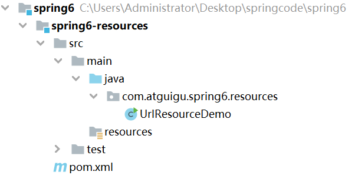
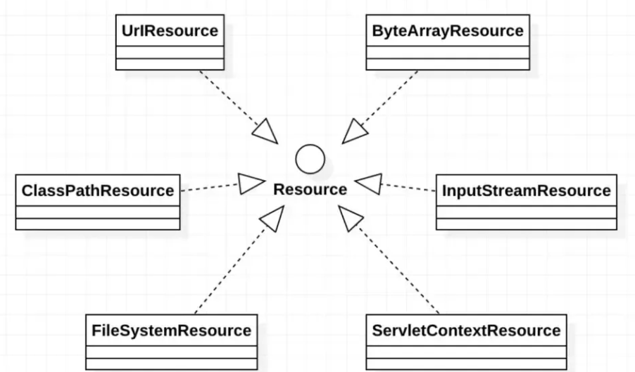

# 一、Spring概述

## 一、Spring概述

- Spring是一款主流的Java EE轻量级开源框架，其目的是用于简化Java企业级应用的开发难度和开发周期。Spring的用途不仅限于服务器端的开发。从简单性、可测试性和松耦合的角度而言，任何Java应用都可以从Spring中受益。Spring框架除了自己提供功能外，还提供整合其他技术和框架的能力
- Spring自诞生以来备受青睐，一直被广大开发人员作为Java企业级应用程序开发的首选。时至今日，Spring俨然成为了Java EE代名词，成为了构建Java EE应用的事实标准

## 二、Spring的狭义和广义

1. 广义的Spring：Spring技术栈

   - 广义上的Spring泛指以Spring Framework为核心的Spring技术栈

   - Spring已经不再是一个单纯的应用框架，而是逐渐发展成为一个由多个不同子项目（模块）组成的成熟技术，例如Spring Framework、Spring MVC、SpringBoot、Spring Cloud、Spring Data、Spring Security等，其中Spring Framework是其他子项目的基础
   - 这些子项目涵盖了从企业级应用开发到云计算等各方面的内容，能够帮助开发人员解决软件发展过程中不断产生的各种实际问题，给开发人员带来了更好的开发体验

2. 狭义的Spring：Spring Framework

   - 狭义的Spring特指Spring Framework，通常我们将它称为Spring框架

## 三、Spring核心模块

1. Spring框架是一个分层的、面向切面的Java应用程序的一站式轻量级解决方案，它是Spring技术栈的核心和基础，是为了解决企业级应用开发的复杂性而创建的
2. Spring有两个最核心模块： IoC 和 AOP
   - IoC：Inverse of Control 的简写，译为“控制反转”，指把创建对象过程交给Spring进行管理
   - AOP：Aspect Oriented Programming 的简写，译为“面向切面编程”。AOP用来封装多个类的公共行为，将那些与业务无关，却为业务模块所共同调用的逻辑封装起来，减少系统的重复代码，降低模块间的耦合度。另外，AOP 还解决一些系统层面上的问题，比如日志、事务、权限等

## 四、Spring Framework特点

- 非侵入式：使用Spring Framework开发应用程序时，Spring对应用程序本身的结构影响非常小。对领域模型可以做到零污染；对功能性组件也只需要使用几个简单的注解进行标记，完全不会破坏原有结构，反而能将组件结构进一步简化。这就使得基于Spring Framework开发应用程序时结构清晰、简洁优雅
- 控制反转：IoC——Inversion of Control，翻转资源获取方向。把自己创建资源、向环境索取资源变成环境将资源准备好，我们享受资源注入
- 面向切面编程：AOP——Aspect Oriented Programming，在不修改源代码的基础上增强代码功能
- 容器：Spring IoC是一个容器，因为它包含并且管理组件对象的生命周期。组件享受到了容器化的管理，替程序员屏蔽了组件创建过程中的大量细节，极大的降低了使用门槛，大幅度提高了开发效率
- 组件化：Spring实现了使用简单的组件配置组合成一个复杂的应用。在Spring中可以使用XML和Java注解组合这些对象。这使得我们可以基于一个个功能明确、边界清晰的组件有条不紊的搭建超大型复杂应用系统
- 一站式：在IoC和AOP的基础上可以整合各种企业应用的开源框架和优秀的第三方类库。而且Spring旗下的项目已经覆盖了广泛领域，很多方面的功能性需求可以在Spring Framework的基础上全部使用Spring来实现

## 五、Spring模块组成

1. [官网地址](https://spring.io/)

2. 图示

   

   

3. Spring Core（核心容器）

   - spring-core ：IOC和DI的基本实现
   - spring-beans：BeanFactory和Bean的装配管理(BeanFactory)
   - spring-context：Spring context上下文，即IOC容器(AppliactionContext)
   - spring-expression：spring表达式语言

4. Spring AOP

   - spring-aop：面向切面编程的应用模块，整合ASM，CGLib，JDK Proxy
   - spring-aspects：集成AspectJ，AOP应用框架
   - spring-instrument：动态Class Loading模块

5. Spring Data Access

   - spring-jdbc：spring对JDBC的封装，用于简化jdbc操作
   - spring-orm：java对象与数据库数据的映射框架
   - spring-oxm：对象与xml文件的映射框架
   - spring-jms： Spring对Java Message Service(java消息服务)的封装，用于服务之间相互通信
   - spring-tx：spring jdbc事务管理

6. Spring Web

   - spring-web：最基础的web支持，建立于spring-context之上，通过servlet或listener来初始化IOC容器
   - spring-webmvc：实现web mvc
   - spring-websocket：与前端的全双工通信协议
   - spring-webflux：Spring 5.0提供的，用于取代传统java servlet，非阻塞式Reactive Web框架，异步，非阻塞，事件驱动的服务

7. Spring Message

   - Spring-messaging：spring 4.0提供的，为Spring集成一些基础的报文传送服务

8. Spring test

   - spring-test：集成测试支持，主要是对junit的封装

# 二、Spring构建入门项目

## 一、构建模块

1. 构建父模块

   - 在idea中，依次单击File -> New -> Project -> New Project。使用Maven进行创建
   - 点击Create则完成
   - 删除src目录

2. 构建子模块

   - 右击点击新建的父模块名称，依次单击File -> New -> Mould -> New Mould。使用Maven进行创建
   - 创建子模块时artifactId不能和父模块重复

   - 点击Create则完成

## 二、程序开发

1. 使用Maven引入依赖

   ```xml
   <dependencies>
       <!--spring context依赖-->
       <!--当你引入Spring Context依赖之后，表示将Spring的基础依赖引入了-->
       <dependency>
           <groupId>org.springframework</groupId>
           <artifactId>spring-context</artifactId>
           <version>6.0.2</version>
       </dependency>
   
       <!--junit5测试-->
       <dependency>
           <groupId>org.junit.jupiter</groupId>
           <artifactId>junit-jupiter-api</artifactId>
           <version>5.3.1</version>
       </dependency>
   </dependencies>
   ```

2. 创建Java类

   ```java
   package org.sunny.spring6.bean;
   
   /**
    * @author sunsh
    * @date 2024年04月19日 21:35
    */
   public class HelloWorld {
   
       public void sayHello(){
           System.out.println("HelloWorld");
       }
   }
   
   ```

3. 创建配置文件

   - 在resources目录创建一个Spring配置文件beans.xml（配置文件名称可随意命名，如：springs.xml）

     

     ```xml
     <?xml version="1.0" encoding="UTF-8"?>
     <beans xmlns="http://www.springframework.org/schema/beans"
            xmlns:xsi="http://www.w3.org/2001/XMLSchema-instance"
            xsi:schemaLocation="http://www.springframework.org/schema/beans http://www.springframework.org/schema/beans/spring-beans.xsd">
     
         <!--
         配置HelloWorld所对应的bean，即将HelloWorld的对象交给Spring的IOC容器管理
         通过bean标签配置IOC容器所管理的bean
         属性：
             id：设置bean的唯一标识
             class：设置bean所对应类型的全类名
     	-->
         <bean id="helloWorld" class="com.sunny.spring6.bean.HelloWorld"></bean>
         
     </beans>
     ```

4. 创建测试类测试

   ```java
   package com.sunny.spring6.bean;
   
   import org.junit.jupiter.api.Test;
   import org.springframework.context.ApplicationContext;
   import org.springframework.context.support.ClassPathXmlApplicationContext;
   
   public class HelloWorldTest {
   
       @Test
       public void testHelloWorld(){
           ApplicationContext ac = new ClassPathXmlApplicationContext("beans.xml");
           HelloWorld helloworld = (HelloWorld) ac.getBean("helloWorld");
           helloworld.sayHello();
       }
   }
   ```

## 三、程序分析

1. 底层是通过反射机制调用无参数构造方法创建对象的

2. Spring创建对象的原理

   ```java
   // dom4j解析beans.xml文件，从中获取class属性值，类的全类名
    // 通过反射机制调用无参数构造方法创建对象
    Class clazz = Class.forName("com.atguigu.spring6.bean.HelloWorld");
    //Object obj = clazz.newInstance();
    Object object = clazz.getDeclaredConstructor().newInstance();
   ```

3. Spring把创建好的对象存储在Spring容器中，Spring容器在源码中就是一个map集合，存储bean的map在DefaultListableBeanFactory类中

   ```java
   private final Map<String, BeanDefinition> beanDefinitionMap = new ConcurrentHashMap<>(256);
   ```

   - Spring容器加载到Bean类时，会把这个类的描述信息,以包名加类名的方式存到beanDefinitionMap中，
     Map<String,BeanDefinition>其中String是Key，默认是类名首字母小写BeanDefinition，存的是类的定义(描述信息)，我们通常叫BeanDefinition接口为：bean的定义对象

## 四、启用Log4j2日志

### 一、Log4j2日志概述

1. 在项目开发中，日志十分的重要，不管是记录运行情况还是定位线上问题，都离不开对日志的分析。日志记录了系统行为的时间、地点、状态等相关信息，能够帮助我们了解并监控系统状态，在发生错误或者接近某种危险状态时能够及时提醒我们处理，同时在系统产生问题时，能够帮助我们快速的定位、诊断并解决问题
2. **Apache Log4j2**是一个开源的日志记录组件，使用非常的广泛。在工程中以易用方便代替了System.out等打印语句，它是JAVA下最流行的日志输入工具
3. Log4j2主要由几个重要的组件构成：
   - 日志信息的优先级：日志信息的优先级从低到高有TRACE < DEBUG < INFO < WARN < ERROR < FATAL
     - TRACE：追踪，是最低的日志级别，相当于追踪程序的执行
     - DEBUG：调试，一般在开发中，都将其设置为最低的日志级别
     - INFO：信息，输出重要的信息，使用较多
     - WARN：警告，输出警告的信息
     - ERROR：错误，输出错误信息
     - FATAL：严重错误       
     - 这些级别分别用来指定这条日志信息的重要程度；级别高的会自动屏蔽级别低的日志，也就是说，设置了WARN的日志，则INFO、DEBUG的日志级别的日志不会显示
   - 日志信息的输出目的地：志信息的输出目的地指定了日志将打印到控制台还是文件中
   - 日志信息的输出格式：输出格式则控制了日志信息的显示内容

### 二、引入Log4j2依赖

```xml
<!--log4j2的依赖-->
<dependency>
    <groupId>org.apache.logging.log4j</groupId>
    <artifactId>log4j-core</artifactId>
    <version>2.19.0</version>
</dependency>
<dependency>
    <groupId>org.apache.logging.log4j</groupId>
    <artifactId>log4j-slf4j2-impl</artifactId>
    <version>2.19.0</version>
</dependency>
```

### 三、加入日志配置文件

- 在类的根路径下提供log4j2.xml配置文件（文件名固定为：log4j2.xml，文件必须放到类根路径下，也就是resources）

  ```xml
  <?xml version="1.0" encoding="UTF-8"?>
  <configuration>
      <loggers>
          <!--
              level指定日志级别，从低到高的优先级：
                  TRACE < DEBUG < INFO < WARN < ERROR < FATAL
                  trace：追踪，是最低的日志级别，相当于追踪程序的执行
                  debug：调试，一般在开发中，都将其设置为最低的日志级别
                  info：信息，输出重要的信息，使用较多
                  warn：警告，输出警告的信息
                  error：错误，输出错误信息
                  fatal：严重错误
          -->
          <root level="DEBUG">
              <appender-ref ref="spring6log"/>
              <appender-ref ref="RollingFile"/>
              <appender-ref ref="log"/>
          </root>
      </loggers>
  
      <appenders>
          <!--输出日志信息到控制台-->
          <console name="spring6log" target="SYSTEM_OUT">
              <!--控制日志输出的格式-->
              <PatternLayout pattern="%d{yyyy-MM-dd HH:mm:ss SSS} [%t] %-3level %logger{1024} - %msg%n"/>
          </console>
  
          <!--文件会打印出所有信息，这个log每次运行程序会自动清空，由append属性决定，适合临时测试用-->
          <File name="log" fileName="d:/spring6_log/test.log" append="false">
              <PatternLayout pattern="%d{HH:mm:ss.SSS} %-5level %class{36} %L %M - %msg%xEx%n"/>
          </File>
  
          <!-- 这个会打印出所有的信息，
              每次大小超过size，
              则这size大小的日志会自动存入按年份-月份建立的文件夹下面并进行压缩，
              作为存档-->
          <RollingFile name="RollingFile" fileName="d:/spring6_log/app.log"
                       filePattern="log/$${date:yyyy-MM}/app-%d{MM-dd-yyyy}-%i.log.gz">
              <PatternLayout pattern="%d{yyyy-MM-dd 'at' HH:mm:ss z} %-5level %class{36} %L %M - %msg%xEx%n"/>
              <SizeBasedTriggeringPolicy size="50MB"/>
              <!-- DefaultRolloverStrategy属性如不设置，
              则默认为最多同一文件夹下7个文件，这里设置了20 -->
              <DefaultRolloverStrategy max="20"/>
          </RollingFile>
      </appenders>
  </configuration>
  ```

### 四、使用日志

```java
public class HelloWorldTest {

    private Logger logger = LoggerFactory.getLogger(HelloWorldTest.class);

    @Test
    public void testHelloWorld(){
        ApplicationContext ac = new ClassPathXmlApplicationContext("beans.xml");
        HelloWorld helloworld = (HelloWorld) ac.getBean("helloWorld");
        helloworld.sayHello();
        logger.info("执行成功");
    }
}
```

# 三、容器IoC

## 一、IoC概述

- IoC是Inversion of Control的简写，译为“控制反转”，它不是一门技术，而是一种设计思想，是一个重要的面向对象编程法则，能够指导我们如何设计出松耦合、更优良的程序
- Spring通过IoC容器来管理所有Java对象的实例化和初始化，控制对象与对象之间的依赖关系。我们将由IoC容器管理的Java对象称为Spring Bean，它与使用关键字new创建的Java对象没有任何区别
- IoC容器是Spring框架中最重要的核心组件之一，它贯穿了Spring从诞生到成长的整个过程

## 二、IoC容器核心实现

### 一、控制反转（IoC）

1. 控制反转是一种思想

2. 控制反转是为了降低程序耦合度，提高程序扩展力

3. 控制反转，反转的含义为

   - 将对象的创建权利交出去，交给第三方容器负责

   - 将对象和对象之间关系的维护权交出去，交给第三方容器负责

4. 控制反转这种思想如何实现方式为

   - DI（Dependency Injection）：依赖注入


### 二、依赖注入

1. DI（Dependency Injection）：依赖注入，依赖注入实现了控制反转的思想
2. DI的含义：指Spring创建对象的过程中，将对象依赖属性通过配置进行注入
3. 依赖注入常见的实现方式
   - set注入
   - 构造注入
4. IoC和DI的关系为：IoC就是一种控制反转的思想， 而DI是对IoC的一种具体实现
5. Bean管理的含义为：Bean对象的创建，以及Bean对象中属性的赋值（或者叫做Bean对象之间关系的维护）

### 三、IoC容器在Spring的实现

Spring的IoC容器就是IoC思想的一个落地的产品实现。IoC容器中管理的组件也叫做bean。在创建bean之前，首先需要创建IoC容器。Spring提供了IoC容器的以下两种实现方式：

1. BeanFactory

   - 这是IoC容器的基本实现，是Spring内部使用的接口。面向Spring本身，不提供给开发人员使用

2. ApplicationContext

   - BeanFactory的子接口，提供了更多高级特性。面向Spring的使用者，几乎所有场合都使用ApplicationContext而不是底层的BeanFactory

3. ApplicationContext的主要实现类

   

   |              类名               |                             描述                             |
   | :-----------------------------: | :----------------------------------------------------------: |
   | ClassPathXmlApplicationContext  |      通过读取类路径下的XML格式的配置文件创建IoC容器对象      |
   | FileSystemXmlApplicationContext |     通过文件系统路径读取XML格式的配置文件创建IoC容器对象     |
   | ConfigurableApplicationContext  | ApplicationContext的子接口，包含一些扩展方法refresh()和close()，让 ApplicationContext具有启动、关闭和刷新上下文的能力 |
   |      WebApplicationContext      | 专门为Web应用准备，基于Web环境创建IoC容器对象，并将对象引入存入 ServletContext域中 |

## 三、基于XML管理Bean

### 一、搭建子模块

1. 搭建模块：同入门搭建步骤

2. 引入配置文件：同入门配置文件

3. 添加依赖：同入门依赖包

   ```xml
   <dependencies>
       <!--spring context依赖-->
       <!--当你引入Spring Context依赖之后，表示将Spring的基础依赖引入了-->
       <dependency>
           <groupId>org.springframework</groupId>
           <artifactId>spring-context</artifactId>
           <version>6.0.3</version>
       </dependency>
   
       <!--junit5测试-->
       <dependency>
           <groupId>org.junit.jupiter</groupId>
           <artifactId>junit-jupiter-api</artifactId>
           <version>5.3.1</version>
       </dependency>
   
       <!--log4j2的依赖-->
       <dependency>
           <groupId>org.apache.logging.log4j</groupId>
           <artifactId>log4j-core</artifactId>
           <version>2.19.0</version>
       </dependency>
       <dependency>
           <groupId>org.apache.logging.log4j</groupId>
           <artifactId>log4j-slf4j2-impl</artifactId>
           <version>2.19.0</version>
       </dependency>
   </dependencies>
   ```

4. 创建java类

   ```java
   package org.sunny.spring6xml.bean;
   
   /**
    * @author sunsh
    * @date 2024年04月19日 21:35
    */
   public class HelloWorld {
   
       public HelloWorld(){
           System.out.println("我是无参构造函数");
       }
   
       public void sayHello(){
           System.out.println("HelloWorld");
       }
   }
   
   
   package org.sunny.spring6xml.bean;
   
   import org.junit.jupiter.api.Test;
   import org.slf4j.Logger;
   import org.slf4j.LoggerFactory;
   import org.springframework.context.ApplicationContext;
   import org.springframework.context.support.ClassPathXmlApplicationContext;
   
   /**
    * @author sunsh
    * @date 2024年04月19日 21:44
    */
   public class HelloWorldTest {
   
       private Logger logger = LoggerFactory.getLogger(HelloWorldTest.class);
   
       @Test
       public void testHelloWorld(){
           ApplicationContext ac = new ClassPathXmlApplicationContext("springs.xml");
           HelloWorld helloWorld = (HelloWorld) ac.getBean("helloWorld");
           helloWorld.sayHello();
           logger.info("我来测试了");
       }
   }
   ```

### 二、获取Bean

1. 根据id获取

   - 由于id属性指定了bean的唯一标识，所以根据bean标签的id属性可以精确获取到一个组件对象

   ```java
   ApplicationContext ac = new ClassPathXmlApplicationContext("springs.xml");
   HelloWorld helloWorld = (HelloWorld) ac.getBean("helloWorld");
   ```

2. 根据类型获取

   - 当根据类型获取bean时，要求IOC容器中指定类型的bean有且只能有一个

   ```java
   ApplicationContext ac = new ClassPathXmlApplicationContext("springs.xml");
   HelloWorld bean = ac.getBean(HelloWorld.class);
   ```

3. 根据id和类型

   ```java
   ApplicationContext ac = new ClassPathXmlApplicationContext("springs.xml");
   HelloWorld bean = ac.getBean("helloworld", HelloWorld.class);
   ```

4. 扩展知识

   - 如果组件类实现了接口，根据接口类型可以获取Bean：前提是Bean唯一
   - 如果一个接口有多个实现类，这些实现类都配置了Bean，根据接口类型不可以获取Bean：因为bean不唯一

5. 结论

   - 根据类型来获取Bean时，在满足Bean唯一性的前提下，其实只是看：『对象 **instanceof** 指定的类型』的返回结果，只要返回的是true就可以认定为和类型匹配，能够获取到
   - Java中，instanceof运算符用于判断前面的对象是否是后面的类，或其子类、实现类的实例。如果是返回true，否返回false。也就是说：用instanceof关键字做判断时， instanceof 操作符的左右操作必须有继承或实现关系

### 三、依赖注入之setter注入

1. 创建Student

   ```java
   package org.sunny.spring6xml.bean;
   
   /**
    * @author sunsh
    * @date 2024年04月20日 8:05
    */
   public class Student {
   
       private Integer id;
   
       private String name;
   
       private Integer age;
   
       private String sex;
   
       public Integer getId() {
           return id;
       }
   
       public void setId(Integer id) {
           this.id = id;
       }
   
       public String getName() {
           return name;
       }
   
       public void setName(String name) {
           this.name = name;
       }
   
       public Integer getAge() {
           return age;
       }
   
       public void setAge(Integer age) {
           this.age = age;
       }
   
       public String getSex() {
           return sex;
       }
   
       public void setSex(String sex) {
           this.sex = sex;
       }
   }
   ```

2. 配置Bean时为属性赋值

   ```xml
   <?xml version="1.0" encoding="UTF-8"?>
   <beans xmlns="http://www.springframework.org/schema/beans"
          xmlns:xsi="http://www.w3.org/2001/XMLSchema-instance"
          xsi:schemaLocation="http://www.springframework.org/schema/beans http://www.springframework.org/schema/beans/spring-beans.xsd">
   
       <!--
       配置HelloWorld所对应的bean，即将HelloWorld的对象交给Spring的IOC容器管理
       通过bean标签配置IOC容器所管理的bean
       属性：
           id：设置bean的唯一标识
           class：设置bean所对应类型的全类名
   	-->
       <bean id="helloWorld" class="org.sunny.spring6xml.bean.HelloWorld"></bean>
   
       <bean id="studentOne" class="org.sunny.spring6xml.bean.Student">
           <!-- property标签：通过组件类的setXxx()方法给组件对象设置属性 -->
           <!-- name属性：指定属性名（这个属性名是getXxx()、setXxx()方法定义的，和成员变量无关） -->
           <!-- value属性：指定属性值 -->
           <property name="id" value="1001"></property>
           <property name="name" value="张三"></property>
           <property name="age" value="23"></property>
           <property name="sex" value="男"></property>
       </bean>
   </beans>
   ```

3. 获取Bean

   ```java
   ApplicationContext ac = new ClassPathXmlApplicationContext("Springs.xml");
   Student student = ac.getBean("studentOne",Student.class);
   ```

### 四、依赖注入之构造器注入

1. 在Student类中添加有参构造

   ```java
   public Student(Integer id, String name, Integer age, String sex) {
       this.id = id;
       this.name = name;
       this.age = age;
       this.sex = sex;
   }
   ```

2. 配置Bean时为构造器赋值

   - 如果Bean实体类中有有参构造函数，则在配置Bean时必须要有constructor-arg标签

   ```xml
   <bean id="studentTwo" class="org.sunny.spring6xml.bean.Student">
       	<!-- constructor-arg标签：通过组件类的构造器方法给组件对象设置属性 -->
           <!-- index属性：构造器参数的索引位置，索引值从0开始，非必填 -->
           <!-- name属性：构造器参数的名称，非必填 -->
           <!-- value属性：指定属性值 -->
           <constructor-arg index="0" name="id" value="1002"></constructor-arg>
           <constructor-arg index="1" name="name" value="李四"></constructor-arg>
           <constructor-arg index="2" name="age" value="33"></constructor-arg>
           <constructor-arg index="3" name="sex" value="女"></constructor-arg>
   </bean>
   ```

3. 获取Bean

   ```java
   ApplicationContext ac = new ClassPathXmlApplicationContext("springs.xml");
   Student student = ac.getBean("studentOne",Student.class);
   ```

### 五、特殊值处理

1. 字面量赋值

   ```xml
   <!-- 使用value属性给bean的属性赋值时，Spring会把value属性的值看做字面量 -->
   <property name="name" value="张三"/>
   ```

2. null值

   ```xml
   <property name="name">
       <null />
   </property>
   
   <!-- 为name所赋的值是字符串null -->
   <property name="name" value="null"></property>
   ```

3. xml实体

   ```xml
   <!-- 小于号在XML文档中用来定义标签的开始，不能随便使用 -->
   <!-- 解决方案：使用XML实体来代替 -->
   <property name="expression" value="a &lt; b"/>
   ```

   |  字符名称  | 符号 |  转义字符  |
   | :--------: | :--: | :--------: |
   |   大于号   |  >   |   `&gt;`   |
   |   小于号   |  <   |  ``&lt;``  |
   |   不等于   |  <>  | `&lt;&gt;` |
   | 大于等于号 |  >=  |  `&gt;=`   |
   | 小于等于号 |  <=  |  `&lt;=`   |
   |     与     |  &   |  `&amp;`   |
   |   单引号   |  ''  |  `&apos;`  |
   |   双引号   |  ""  |  `&quot;`  |

4. CDATA节

   ```xml
   <property name="expression">
       <!-- 使用CDATA节 -->
       <!-- CDATA中的C代表Character，是文本、字符的含义，CDATA就表示纯文本数据 -->
       <!-- XML解析器看到CDATA节就知道这里是纯文本，就不会当作XML标签或属性来解析 -->
       <!-- 所以CDATA节中写什么符号都随意 -->
       <value><![CDATA[a < b]]></value>
   </property>
   ```

### 六、为对象类型属性赋值

1. 创建班级类Clazz

   ```java
   package org.sunny.spring6xml.bean;
   
   /**
    * @author sunsh
    * @date 2024年04月20日 9:01
    */
   public class Clazz {
   
       private Integer clazzId;
   
       private String clazzName;
   
       public Integer getClazzId() {
           return clazzId;
       }
   
       public void setClazzId(Integer clazzId) {
           this.clazzId = clazzId;
       }
   
       public String getClazzName() {
           return clazzName;
       }
   
       public void setClazzName(String clazzName) {
           this.clazzName = clazzName;
       }
   
       @Override
       public String toString() {
           return "Clazz{" +
                   "clazzId=" + clazzId +
                   ", clazzName='" + clazzName + '\'' +
                   '}';
       }
   }
   ```

2. 配置Bean

   - 引用外部Bean

     ```xml
     <bean id="clazzOne" class="org.sunny.spring6xml.bean.Clazz">
         <property name="clazzId" value="1111"></property>
         <property name="clazzName" value="财源滚滚班"></property>
     </bean>
     
     <bean id="studentThree" class="org.sunny.spring6xml.bean.Student">
         <property name="id" value="1004"></property>
         <property name="name" value="赵六"></property>
         <property name="age" value="26"></property>
         <property name="sex" value="女"></property>
         <!-- ref属性：引用IOC容器中某个bean的id，将所对应的bean为属性赋值 -->
         <property name="clazz" ref="clazzOne"></property>
     </bean>
     ```

   - 内部Bean

     ```xml
     <bean id="studentThree" class="org.sunny.spring6xml.bean.Student">
         <property name="id" value="1004"></property>
         <property name="name" value="赵六"></property>
         <property name="age" value="26"></property>
         <property name="sex" value="女"></property>
         <property name="clazz">
             <!-- 在一个bean中再声明一个bean就是内部bean -->
             <!-- 内部bean只能用于给属性赋值，不能在外部通过IOC容器获取，因此可以省略id属性 -->
             <bean id="clazzInner" class="org.sunny.spring6xml.bean.Clazz">
                 <property name="clazzId" value="93"></property>
                 <property name="clazzName" value="九年级三班"></property>
             </bean>
         </property>
     </bean>
     ```

   - 级联属性赋值

     ```xml
     <bean id="studentThree" class="org.sunny.spring6xml.bean.Student">
         <property name="id" value="1004"></property>
         <property name="name" value="赵六"></property>
         <property name="age" value="26"></property>
         <property name="sex" value="女"></property>
         
         <property name="clazz" ref="clazzOne"></property>
         <property name="clazz.clazzId" value="93"></property>
         <property name="clazz.clazzName" value="九年级三班"></property>
     </bean>
     ```

### 七、为数组类型属性赋值

1. 修改班级实体类，班级有多个学生，数组类型

   ```java
   package org.sunny.spring6xml.bean;
   
   import java.util.Arrays;
   
   /**
    * @author sunsh
    * @date 2024年04月20日 9:01
    */
   public class Clazz {
   
       private Integer clazzId;
   
       private String clazzName;
   
       private Student[] studentArr;
   
       public Integer getClazzId() {
           return clazzId;
       }
   
       public void setClazzId(Integer clazzId) {
           this.clazzId = clazzId;
       }
   
       public String getClazzName() {
           return clazzName;
       }
   
       public void setClazzName(String clazzName) {
           this.clazzName = clazzName;
       }
   
       public Student[] getStudentArr() {
           return studentArr;
       }
   
       public void setStudentArr(Student[] studentArr) {
           this.studentArr = studentArr;
       }
   
       @Override
       public String toString() {
           return "Clazz{" +
                   "clazzId=" + clazzId +
                   ", clazzName='" + clazzName + '\'' +
                   ", studentArr=" + Arrays.toString(studentArr) +
                   '}';
       }
   }
   ```

2. 配置Bean

   ```xml
   <bean id="clazzTwo" class="org.sunny.spring6xml.bean.Clazz">
           <property name="clazzId" value="93"></property>
           <property name="clazzName" value="九年级三班"></property>
           <property name="studentArr">
               <array>
                   <ref bean="studentOne"></ref>
                   <ref bean="studentTwo"></ref>
                   <ref bean="studentThree"></ref>
               </array>
           </property>
   </bean>
   ```

### 八、为集合类型属性赋值

#### 一、为List集合类型属性赋值

1. 修改班级实体类，班级有多个学生，List类型

   ```java
   package org.sunny.spring6xml.bean;
   
   import java.util.Arrays;
   import java.util.List;
   
   /**
    * @author sunsh
    * @date 2024年04月20日 9:01
    */
   public class Clazz {
   
       private Integer clazzId;
   
       private String clazzName;
   
       private Student[] studentArr;
   
       private List<Student> studentList;
   
       public Integer getClazzId() {
           return clazzId;
       }
   
       public void setClazzId(Integer clazzId) {
           this.clazzId = clazzId;
       }
   
       public String getClazzName() {
           return clazzName;
       }
   
       public void setClazzName(String clazzName) {
           this.clazzName = clazzName;
       }
   
       public Student[] getStudentArr() {
           return studentArr;
       }
   
       public void setStudentArr(Student[] studentArr) {
           this.studentArr = studentArr;
       }
   
       public List<Student> getStudentList() {
           return studentList;
       }
   
       public void setStudentList(List<Student> studentList) {
           this.studentList = studentList;
       }
   
       @Override
       public String toString() {
           return "Clazz{" +
                   "clazzId=" + clazzId +
                   ", clazzName='" + clazzName + '\'' +
                   ", studentArr=" + Arrays.toString(studentArr) +
                   ", studentList=" + studentList +
                   '}';
       }
   }
   ```

2. 配置Bean

   ```xml
   <bean id="clazzThree" class="org.sunny.spring6xml.bean.Clazz">
           <property name="clazzId" value="93"></property>
           <property name="clazzName" value="九年级三班"></property>
           <property name="studentList">
           <!-- 如果list的元素类型是非核心类，则使用ref 加上 bean标签的形式 -->
           <!-- 如果list的元素类型是核心类，如String或基本数据类型，list标签内则使用value标签 -->
           <!-- <value>测试</value> -->   
               <list>
                   <ref bean="studentOne"></ref>
                   <ref bean="studentTwo"></ref>
                   <ref bean="studentThree"></ref>
               </list>
           </property>
   </bean>
   ```

#### 二、为Map集合类型属性赋值

1. 创建教师类Teacher

   ```java
   package org.sunny.spring6xml.bean;
   
   /**
    * @author sunsh
    * @date 2024年04月20日 16:17
    */
   public class Teacher {
   
       private Integer teacherId;
   
       private String teacherName;
   
       public Integer getTeacherId() {
           return teacherId;
       }
   
       public void setTeacherId(Integer teacherId) {
           this.teacherId = teacherId;
       }
   
       public String getTeacherName() {
           return teacherName;
       }
   
       public void setTeacherName(String teacherName) {
           this.teacherName = teacherName;
       }
   
       @Override
       public String toString() {
           return "Teacher{" +
                   "teacherId=" + teacherId +
                   ", teacherName='" + teacherName + '\'' +
                   '}';
       }
   }
   ```

2. 在Student类中添加Teacher的Map集合

   ```xml
   <bean id="teacherOne" class="org.sunny.spring6xml.bean.Teacher">
           <property name="teacherId" value="10010"></property>
           <property name="teacherName" value="大宝"></property>
       </bean>
   
       <bean id="teacherTwo" class="org.sunny.spring6xml.bean.Teacher">
           <property name="teacherId" value="10086"></property>
           <property name="teacherName" value="二宝"></property>
   </bean>
   
   <bean id="studentFour" class="org.sunny.spring6xml.bean.Student">
           <constructor-arg index="0" value="1004"/>
           <constructor-arg index="1" value="赵六"/>
           <constructor-arg index="2" value="26"/>
           <constructor-arg index="3" value="女"/>
           <!-- ref属性：引用IOC容器中某个bean的id，将所对应的bean为属性赋值 -->
           <property name="clazz" ref="clazzOne"></property>
           <property name="teacherMap">
               <map>
                   <entry>
                       <key>
                           <value>语文老师</value>
                       </key>
                       <ref bean="teacherOne"></ref>
                   </entry>
                   <entry>
                       <key>
                           <value>数学老师</value>
                       </key>
                       <ref bean="teacherTwo"></ref>
                   </entry>
               </map>
           </property>
   </bean>
   ```

#### 三、引用集合类型的bean

1. 配置Bean

   ```xml
   <!--list集合类型的bean-->
   <util:list id="students">
       <ref bean="studentOne"></ref>
       <ref bean="studentTwo"></ref>
       <ref bean="studentThree"></ref>
   </util:list>
   <!--map集合类型的bean-->
   <util:map id="teacherMap">
       <entry>
           <key>
               <value>10010</value>
           </key>
           <ref bean="teacherOne"></ref>
       </entry>
       <entry>
           <key>
               <value>10086</value>
           </key>
           <ref bean="teacherTwo"></ref>
       </entry>
   </util:map>
   <bean id="clazzTwo" class="com.atguigu.spring6.bean.Clazz">
       <property name="clazzId" value="4444"></property>
       <property name="clazzName" value="Javaee0222"></property>
       <property name="students" ref="students"></property>
   </bean>
   <bean id="studentFour" class="com.atguigu.spring6.bean.Student">
       <property name="id" value="1004"></property>
       <property name="name" value="赵六"></property>
       <property name="age" value="26"></property>
       <property name="sex" value="女"></property>
       <!-- ref属性：引用IOC容器中某个bean的id，将所对应的bean为属性赋值 -->
       <property name="clazz" ref="clazzOne"></property>
       <property name="hobbies">
           <array>
               <value>抽烟</value>
               <value>喝酒</value>
               <value>烫头</value>
           </array>
       </property>
       <property name="teacherMap" ref="teacherMap"></property>
   </bean>
   ```

2. 单独使用集合类的注意点：使用util:list、util:map标签必须引入相应的命名空间

   ```xml
   <?xml version="1.0" encoding="UTF-8"?>
   <beans xmlns="http://www.springframework.org/schema/beans"
       xmlns:xsi="http://www.w3.org/2001/XMLSchema-instance"
          
       xmlns:util="http://www.springframework.org/schema/util"
       xsi:schemaLocation="http://www.springframework.org/schema/util                
       http://www.springframework.org/schema/util/spring-util.xsd
       http://www.springframework.org/schema/beans
       http://www.springframework.org/schema/beans/spring-beans.xsd">
       
       
   </beans>
   ```

3. 配置Bean

   ```xml
   <!--list集合类型的bean-->
       <util:list id="students">
           <ref bean="studentOne"></ref>
           <ref bean="studentTwo"></ref>
           <ref bean="studentThree"></ref>
       </util:list>
       <!--map集合类型的bean-->
       <util:map id="teacherMap">
           <entry>
               <key>
                   <value>语文老师</value>
               </key>
               <ref bean="teacherOne"></ref>
           </entry>
           <entry>
               <key>
                   <value>数学老师</value>
               </key>
               <ref bean="teacherTwo"></ref>
           </entry>
       </util:map>
   
       <bean id="clazzFour" class="org.sunny.spring6xml.bean.Clazz">
           <property name="clazzId" value="93"></property>
           <property name="clazzName" value="九年级三班"></property>
           <property name="studentList" ref="students"></property>
       </bean>
   
       <bean id="studentFive" class="org.sunny.spring6xml.bean.Student">
           <constructor-arg index="0" value="1005"/>
           <constructor-arg index="1" value="扭轱辘和珅"/>
           <constructor-arg index="2" value="26"/>
           <constructor-arg index="3" value="男"/>
           <constructor-arg index="4">
               <ref bean="clazzOne"></ref>
           </constructor-arg>
           <property name="teacherMap" ref="teacherMap"></property>
   </bean>
   ```

### 九、p命名空间

1. 引入p命名空间

   ```xml
   <?xml version="1.0" encoding="UTF-8"?>
   <beans xmlns="http://www.springframework.org/schema/beans"
          xmlns:xsi="http://www.w3.org/2001/XMLSchema-instance"
          xmlns:util="http://www.springframework.org/schema/util"
          xmlns:p="http://www.springframework.org/schema/p"
          xsi:schemaLocation="http://www.springframework.org/schema/util
          http://www.springframework.org/schema/util/spring-util.xsd
          http://www.springframework.org/schema/beans
          http://www.springframework.org/schema/beans/spring-beans.xsd">
   ```

2. 引入p命名空间后，可以通过以下方式为bean的各个属性赋值，比使用property或者constructor-arg更加简洁

   ```xml
   <bean id="studentSix" class="com.atguigu.spring6.bean.Student"
       p:id="1006" p:name="小明" p:clazz-ref="clazzOne" p:teacherMap-ref="teacherMap">
   </bean>
   ```

### 十、引入外部属性文件

1. 引入依赖

   ```xml
    <!-- MySQL驱动 -->
   <dependency>
       <groupId>mysql</groupId>
       <artifactId>mysql-connector-java</artifactId>
       <version>8.0.30</version>
   </dependency>
   
   <!-- 数据源 -->
   <dependency>
       <groupId>com.alibaba</groupId>
       <artifactId>druid</artifactId>
       <version>1.2.15</version>
   </dependency>
   ```

2. 创建外部属性文件jdbc.properties（此处的命名可随意，能引入即可），放在resources下，配置如下

   ```properties
   jdbc.user=root
   jdbc.password=282127
   jdbc.url=jdbc:mysql://localhost:3306/jdbc?serverTimezone=UTC
   jdbc.driver=com.mysql.cj.jdbc.Driver
   ```

3. 引入属性文件

   - 引入context名称空间

     ```xml
     <?xml version="1.0" encoding="UTF-8"?>
     <beans xmlns="http://www.springframework.org/schema/beans"
            xmlns:xsi="http://www.w3.org/2001/XMLSchema-instance"
            xmlns:context="http://www.springframework.org/schema/context"
            xsi:schemaLocation="http://www.springframework.org/schema/beans
            http://www.springframework.org/schema/beans/spring-beans.xsd
            http://www.springframework.org/schema/context
            http://www.springframework.org/schema/context/spring-context.xsd">
     
     </beans>
     ```

   - 引入外部属性文件

     ```xml
     <context:property-placeholder location="classpath:jdbc.properties"/>
     ```

   - 注意点：在使用`<context:property-placeholder>`元素加载外包配置文件功能前，首先需要在XML配置的一级标签 <beans> 中添加`<context>`相关的命名空间

4. 配置Bean

   ```xml
   <bean id="druidDataSource" class="com.alibaba.druid.pool.DruidDataSource">
       <property name="url" value="${jdbc.url}"/>
       <property name="driverClassName" value="${jdbc.driver}"/>
       <property name="username" value="${jdbc.user}"/>
       <property name="password" value="${jdbc.password}"/>
   </bean>
   ```

5. 测试

   ```java
   @Test
   public void testDataSource() throws SQLException {
       ApplicationContext ac = new ClassPathXmlApplicationContext("springs.xml");
       DataSource dataSource = ac.getBean(DataSource.class);
       Connection connection = dataSource.getConnection();
       System.out.println(connection);
   }
   ```

### 十一、Bean的作用域

1. Bean作用域概念

   - 在Spring中可以通过配置bean标签的scope属性来指定bean的作用域范围，各取值含义参加下表：

     |       取值        |                  含义                   | 创建对象的时机  |
     | :---------------: | :-------------------------------------: | :-------------: |
     | singleton（默认） | 在IoC容器中，这个Bean的对象始终为单实例 | IoC容器初始化时 |
     |     prototype     |      这个Bean在IoC容器中有多个实例      |   获取Bean时    |

   - 如果是在WebApplicationContext环境下还会有另外几个作用域：

     |  取值   |         含义         |
     | :-----: | :------------------: |
     | request | 在一个请求范围内有效 |
     | session | 在一个会话范围内有效 |

2. 创建User类

   ```java
   package org.sunny.spring6xml.bean;
   
   /**
    * @author sunsh
    * @date 2024年04月20日 21:44
    */
   public class User {
   
       private Integer id;
   
       private String username;
   
       private String password;
   
       private Integer age;
   
       public User() {
       }
   
       public User(Integer id, String username, String password, Integer age) {
           this.id = id;
           this.username = username;
           this.password = password;
           this.age = age;
       }
   
       public Integer getId() {
           return id;
       }
   
       public void setId(Integer id) {
           this.id = id;
       }
   
       public String getUsername() {
           return username;
       }
   
       public void setUsername(String username) {
           this.username = username;
       }
   
       public String getPassword() {
           return password;
       }
   
       public void setPassword(String password) {
           this.password = password;
       }
   
       public Integer getAge() {
           return age;
       }
   
       public void setAge(Integer age) {
           this.age = age;
       }
   
       @Override
       public String toString() {
           return "User{" +
                   "id=" + id +
                   ", username='" + username + '\'' +
                   ", password='" + password + '\'' +
                   ", age=" + age +
                   '}';
       }
   }
   ```

3. 配置Bean

   ```xml
   <!-- scope属性：取值singleton（默认值），bean在IOC容器中只有一个实例，IOC容器初始化时创建对象 -->
   <!-- scope属性：取值prototype，bean在IOC容器中可以有多个实例，getBean()时创建对象 -->
   <bean id="user" class="org.sunny.spring6xml.bean.User" scope="prototype"></bean>
   ```

4. 测试

   ```java
   @Test
   public void testBeanScope(){
   	 ApplicationContext ac = new ClassPathXmlApplicationContext("springs.xml");
        User user1 = ac.getBean(User.class);
        User user2 = ac.getBean(User.class);
        // 当scope="prototype"时，user1和user2不相等，说明此时User类创建的对象为多个
        // 当scope="singleton"时，user1和user2相等，说明此时User类创建的对象为同一个
        System.out.println(user1==user2);
   }
   ```

### 十二、Bean生命周期

1. 具体的生命周期过程

   - bean对象创建（调用无参构造器）
   - 给bean对象设置属性

   - bean的前置处理器（初始化之前）

   - bean对象初始化（需在配置bean时指定初始化方法）

   - bean的后置处理器（初始化之后）

   - bean对象就绪可以使用

   - bean对象销毁（需在配置bean时指定销毁方法）

   - IoC容器关闭

2. 修改User类

   ```java
   package org.sunny.spring6xml.bean;
   
   /**
    * @author sunsh
    * @date 2024年04月20日 21:44
    */
   public class User {
   
       private Integer id;
   
       private String username;
   
       private String password;
   
       private Integer age;
   
       public User() {
           System.out.println("生命周期：1、创建对象");
       }
   
       public User(Integer id, String username, String password, Integer age) {
           this.id = id;
           this.username = username;
           this.password = password;
           this.age = age;
       }
   
       public Integer getId() {
           return id;
       }
   
       public void setId(Integer id) {
           System.out.println("生命周期：2、依赖注入");
           this.id = id;
       }
   
       public String getUsername() {
           return username;
       }
   
       public void setUsername(String username) {
           this.username = username;
       }
   
       public String getPassword() {
           return password;
       }
   
       public void setPassword(String password) {
           this.password = password;
       }
   
       public Integer getAge() {
           return age;
       }
   
       public void setAge(Integer age) {
           this.age = age;
       }
   
       public void initMethod(){
           System.out.println("生命周期：3、初始化");
       }
   
       public void destroyMethod(){
           System.out.println("生命周期：5、销毁");
       }
   
       @Override
       public String toString() {
           return "User{" +
                   "id=" + id +
                   ", username='" + username + '\'' +
                   ", password='" + password + '\'' +
                   ", age=" + age +
                   '}';
       }
   }
   ```

   - 注意其中的initMethod()和destroyMethod()，可以通过配置bean指定为初始化和销毁的方法

3. 配置Bean

   ```xml
   <bean id="user" class="org.sunny.spring6xml.bean.User" scope="prototype"
         init-method="initMethod" destroy-method="destroyMethod">
           <property name="id" value="1001"></property>
           <property name="username" value="admin"></property>
           <property name="password" value="123456"></property>
           <property name="age" value="23"></property>
   </bean>
   ```

4. Bean的后置处理器

   - bean的后置处理器会在生命周期的初始化前后添加额外的操作，需要实现BeanPostProcessor接口，且配置到IOC容器中，需要注意的是，bean后置处理器不是单独针对某一个bean生效，而是针对IOC容器中所有bean都会执行

   - bean在初始化之前，依赖注入之后，也就是在调用postProcessBeforeInitialization方法的时候bean就能获取到依赖注入时对应的属性数据

   - 创建bean的后置处理器

     ```java
     package org.sunny.spring6xml.process;
     
     import org.springframework.beans.BeansException;
     import org.springframework.beans.factory.config.BeanPostProcessor;
     
     /**
      * @author sunsh
      * @date 2024年04月20日 22:07
      */
     public class MyBeanProcessor implements BeanPostProcessor {
     
         @Override
         public Object postProcessBeforeInitialization(Object bean, String beanName) throws BeansException {
             System.out.println("☆☆☆" + beanName + " = " + bean);
             return bean;
         }
     
         @Override
         public Object postProcessAfterInitialization(Object bean, String beanName) throws BeansException {
             System.out.println("★★★" + beanName + " = " + bean);
             return bean;
         }
     }
     ```

   - 在IOC容器中配置后置处理器

     ```xml
     <!-- bean的后置处理器要放入IOC容器才能生效 -->
     <bean id="myBeanProcessor" class="com.atguigu.spring6.process.MyBeanProcessor"/>
     ```

### 十三、FactoryBean

1. 简介

   - FactoryBean是Spring提供的一种整合第三方框架的常用机制。和普通的bean不同，配置一个FactoryBean类型的bean，在获取bean的时候得到的并不是class属性中配置的这个类的对象，而是getObject()方法的返回值。通过这种机制，Spring可以帮我们把复杂组件创建的详细过程和繁琐细节都屏蔽起来，只把最简洁的使用界面展示给我们
   - 将来我们整合Mybatis时，Spring就是通过FactoryBean机制来帮我们创建SqlSessionFactory对象的

2. 创建类UserFactoryBean

   ```java
   package org.sunny.spring6xml.bean;
   
   import org.springframework.beans.factory.FactoryBean;
   
   /**
    * @author sunsh
    * @date 2024年04月20日 22:20
    */
   public class UserFactoryBean implements FactoryBean<User> {
   
       @Override
       public User getObject() throws Exception {
           return new User();
       }
   
       @Override
       public Class<?> getObjectType() {
           return User.class;
       }
   
       // 指定Bean是否为单例，如果又在XML中配置了scope，则还是以XML中的配置为主
       @Override
       public boolean isSingleton() {
           return !FactoryBean.super.isSingleton();
       }
   }
   ```

3. 配置Bean

   ```xml
   <bean id="userTwo" class="org.sunny.spring6xml.bean.UserFactoryBean"></bean>
   ```

4. 测试

   ```java
   @Test
   public void testLife(){
   	ClassPathXmlApplicationContext ac = new ClassPathXmlApplicationContext("springs.xml");
   	User user1 = ac.getBean("userTwo",User.class);
   	User user2 = ac.getBean("userTwo",User.class);
   	System.out.println(user1.hashCode());
   	System.out.println(user2.hashCode());
   }
   ```

### 十四、基于xml自动装配

#### 一、自动装配概述

- 根据指定的策略，在IOC容器中匹配某一个bean，自动为指定的bean中所依赖的类类型或接口类型属性赋值
- 简而言之，A调用了B，B使用了自动装配，则A在使用B的时候就无需在去new一个来供A使用

#### 二、场景模拟

1. 创建类UserController

   ```java
   package org.sunny.spring6xml.controller;
   
   import org.sunny.spring6xml.service.IUserService;
   
   /**
    * @author sunsh
    * @date 2024年04月20日 22:37
    */
   public class UserController {
   
       private IUserService userService;
   
       public void setUserService(IUserService userService) {
           this.userService = userService;
       }
   
       public void saveUser(){
           userService.saveUser();
       }
   }
   ```

2. 创建接口IUserService

   ```java
   package org.sunny.spring6xml.service;
   
   /**
    * @author sunsh
    * @date 2024年04月20日 22:37
    */
   public interface IUserService {
   
       public void saveUser();
   }
   ```

3. 创建类UserServiceImpl实现接口UserService

   ```java
   package org.sunny.spring6xml.service.impl;
   
   import org.sunny.spring6xml.dao.IUserDao;
   import org.sunny.spring6xml.dao.IUserDao;
   import org.sunny.spring6xml.service.IUserService;
   
   /**
    * @author sunsh
    * @date 2024年04月20日 22:38
    */
   public class UserServiceImpl implements IUserService {
   
       private IUserDao userDao;
   
       public void setUserDao(IUserDao userDao) {
           this.userDao = userDao;
       }
   
       @Override
       public void saveUser() {
           userDao.saveUser();
       }
   }
   ```

4. 创建接口IUserDao

   ```java
   package org.sunny.spring6xml.dao;
   
   public interface IUserDao {
   
       public void saveUser();
   }
   ```

5. 创建类UserDaoImpl实现接口UserDao

   ```java
   package org.sunny.spring6xml.dao.impl;
   
   import org.sunny.spring6xml.dao.IUserDao;
   
   /**
    * @author sunsh
    * @date 2024年04月20日 22:44
    */
   public class UserDao implements IUserDao {
   
       @Override
       public void saveUser() {
           System.out.println("保存成功！");
       }
   }
   ```

#### 二、配置Bean

使用bean标签的autowire属性设置自动装配效果

1. 自动装配方式：byType

   - byType：根据类型匹配IOC容器中的某个兼容类型的bean，为属性自动赋值
   - 若在IOC中，没有任何一个兼容类型的bean能够为属性赋值，则该属性不装配，即值为默认值null
   - 若在IOC中，有多个兼容类型的bean能够为属性赋值，则抛出异常NoUniqueBeanDefinitionException
   -  通过属性的类型查找JavaBean依赖的对象并为其注入。比如类Computer有个属性printer，类型为Printer，那么，指定其autowire属性为byType后，Spring IoC容器会查找Class属性为Printer的bean，使用Seter方法为其注入 

   ```xml
   <bean id="userController" class="org.sunny.spring6xml.controller.UserController" autowire="byType"></bean>
   
   <bean id="userService" class="org.sunny.spring6xml.service.impl.UserServiceImpl" autowire="byType"></bean>
   
   <bean id="userDao" class="org.sunny.spring6xml.dao.impl.UserDaoImpl"></bean>
   ```

2. 自动装配方式：byName

   - byName：将自动装配的属性的属性名，作为bean的id在IOC容器中匹配相对应的bean进行赋值。也就是说要注入的bean的id的值和类里面属性的名称要一致 
   - 比如说类Computer有个属性printer，指定其autowire属性为byName后，Spring IoC容器会在配置文件中查找id/name属性为printer的bean，然后使用Seter方法为其注入 

   ```xml
   <bean id="userController" class="org.sunny.spring6xml.controller.UserController" autowire="byName"></bean>
   
   <bean id="userService" class="org.sunny.spring6xml.service.impl.UserServiceImpl" autowire="byName"></bean>
   <bean id="userServiceImpl" class="org.sunny.spring6xml.service.impl.UserServiceImpl" autowire="byName"></bean>
   
   <bean id="userDao" class="org.sunny.spring6xml.dao.impl.UserDaoImpl"></bean>
   <bean id="userDaoImpl" class="org.sunny.spring6xml.dao.impl.UserDaoImpl"></bean>
   ```

3. constructor：通byType一样，也是通过类型查找依赖对象。与byType的区别在于它不是使用Seter方法注入，而是使用构造器注入

   - 比如说类Computer有个属性printer，指定Computer（也就是**需要依赖的对象**）的autowire属性为constructor后，Spring IoC容器会在配置文件中查找id/name属性为printer的bean，然后使用构造器的方式为Computer注入依赖

4. autodetect：在byType和constructor之间自动的选择注入方式 

5. No：即不启用自动装配。Autowire默认的值。即使用property或constructor-arg为其依赖注入

## 四、基于注解管理Bean

### 一、Spring通过注解实现自动装配的步骤

1. 引入依赖
2. 开启组件扫描
3. 使用注解定义 Bean
4. 依赖注入

### 二、搭建子模块

1. 搭建模块：同入门搭建步骤
2. 引入配置文件：同入门配置文件
3. 添加依赖：同入门依赖包

### 三、开启组件扫描

- Spring默认不使用注解装配Bean，因此我们需要在Spring的XML配置中，通过 `<context:component-scan> `元素开启 Spring Beans的自动扫描功能。开启此功能后，Spring会自动从扫描指定的包（base-package属性设置）及其子包下的所有类，如果类上使用了@Component注解，就将该类装配到容器中
- 在使用`<context:component-scan>`元素开启自动扫描功能前，首先需要在XML配置的一级标签`<beans> `中添加 context相关的命名空间

```xml
<?xml version="1.0" encoding="UTF-8"?>
<beans xmlns="http://www.springframework.org/schema/beans"
       xmlns:xsi="http://www.w3.org/2001/XMLSchema-instance"
       xmlns:context="http://www.springframework.org/schema/context"
       xsi:schemaLocation="http://www.springframework.org/schema/beans
    http://www.springframework.org/schema/beans/spring-beans-3.0.xsd
    http://www.springframework.org/schema/context
            http://www.springframework.org/schema/context/spring-context.xsd">
    <!--开启组件扫描功能-->
    <context:component-scan base-package="org.sunny.spring6annotation"></context:component-scan>
</beans>
```

1. 最基本的扫描方式

   ```xml
   <!--开启组件扫描功能-->
   <context:component-scan base-package="org.sunny.spring6annotation"></context:component-scan>
   ```

2. 指定要排除的组件

   ```xml
   <context:component-scan base-package="org.sunny.spring6annotation">
       <!-- context:exclude-filter标签：指定排除规则 -->
       <!-- 
    		type：设置排除或包含的依据
   		type="annotation"，根据注解排除，expression中设置要排除的注解的全类名
   		type="assignable"，根据类型排除，expression中设置要排除的类型的全类名
   	-->
       <!-- 扫描时排除使用@Controller标注的类 -->
       <context:exclude-filter 
        type="annotation" 
        expression="org.springframework.stereotype.Controller"/>
           
       <!-- 扫描时排除UserController类 -->
   	<context:exclude-filter 
        type="assignable" 
        expression="org.sunny.spring6annotation"/>
   </context:component-scan>
   ```

3. 仅扫描指定组件

   ```xml
   <context:component-scan base-package="org.sunny.spring6annotation" use-default-filters="false">
       <!-- context:include-filter标签：指定在原有扫描规则的基础上追加的规则，
   								 注意排除context:exclude-filter标签和
   								 指定组件context:include-filter标签的写法区别 -->
       <!-- use-default-filters属性：取值false表示关闭默认扫描规则，默认为true时会扫描默认的组件过滤器，
   							   如@Bean之类的，而指定的或自定义的就会在原来的扫描规则上追加。
   	（use-default-filters="false"时表示仅扫描include-filter标签的，
   	  use-default-filters="true"时表示在原来扫描基础上追加include-filter标签的扫描规则） -->
       <!-- 此时必须设置use-default-filters="false"，因为默认规则即扫描指定包下所有类 -->
       <!-- 
    		type：设置排除或包含的依据
   		type="annotation"，根据注解排除，expression中设置要排除的注解的全类名
   		type="assignable"，根据类型排除，expression中设置要排除的类型的全类名
   	-->
       <context:include-filter 
        type="annotation" expression="org.springframework.stereotype.Controller"/>
       
   	<context:include-filter 
        type="assignable" expression="org.sunny.spring6annotation"/>
   </context:component-scan>
   ```

### 四、使用注解定义Bean

- Spring提供了以下多个注解，这些注解可以直接标注在Java类上，将它们定义成Spring Bean

|    注解     |                             说明                             |
| :---------: | :----------------------------------------------------------: |
| @Component  | 该注解用于描述Spring中的Bean，它是一个泛化的概念，仅仅表示容器中的一个组件（Bean），并且可以作用在应用的任何层次，例如Service层、Dao层等。使用时只需将该注解标注在相应类上即可 |
| @Repository | 该注解用于将数据访问层（Dao层）的类标识为Spring中的Bean，其功能与@Component相同 |
|  @Service   | 该注解通常作用在业务层（Service层），用于将业务层的类标识为Spring中的Bean，其功能与 @Component相同 |
| @Controller | 该注解通常作用在控制层（如SpringMVC的Controller），用于将控制层的类标识为Spring中的 Bean，其功能与@Component相同 |

### 五、@Autowired注入

1. 单独使用@Autowired注解，**默认根据类型装配**【默认是byType】
2. 源码重点关注
   - 使用范围：构造方法、方法、形参、属性、注解
   - required属性：默认值是true，表示在注入的时候要求被注入的Bean必须是存在的，如果不存在则报错。如果required属性设置为false，表示注入的Bean存在或者不存在都没关系，存在的话就注入，不存在的话，也不报错

#### 一、属性注入

1. 创建IUserDao接口

   ```java
   package org.sunny.spring6annotation.dao;
   
   public interface IUserDao {
   
       public void saveUser();
   }
   ```

2. 创建UserDaoImpl实现类

   ```java
   package org.sunny.spring6annotation.dao.impl;
   
   import org.springframework.stereotype.Repository;
   import org.sunny.spring6annotation.dao.IUserDao;
   
   /**
    * @author sunsh
    * @date 2024年04月20日 22:44
    */
   @Repository
   public class UserDaoImpl implements IUserDao {
   
       @Override
       public void saveUser() {
           System.out.println("Dao层执行结束");
       }
   }
   ```

3. 创建IUserService接口

   ```java
   package org.sunny.spring6annotation.service;
   
   /**
    * @author sunsh
    * @date 2024年04月20日 22:37
    */
   public interface IUserService {
   
       public void saveUser();
   }
   ```

4. 创建UserServiceImpl实现类

   ```java
   package org.sunny.spring6annotation.service.impl;
   
   import org.springframework.beans.factory.annotation.Autowired;
   import org.springframework.stereotype.Service;
   import org.sunny.spring6annotation.dao.IUserDao;
   import org.sunny.spring6annotation.service.IUserService;
   
   /**
    * @author sunsh
    * @date 2024年04月20日 22:38
    */
   @Service
   public class UserServiceImpl implements IUserService {
   
       @Autowired
       private IUserDao userDao;
   
       @Override
       public void saveUser() {
           userDao.saveUser();
       }
   }
   ```

5. 创建UserController类

   ```java
   package org.sunny.spring6annotation.controller;
   
   import org.springframework.beans.factory.annotation.Autowired;
   import org.springframework.stereotype.Controller;
   import org.sunny.spring6annotation.service.IUserService;
   
   /**
    * @author sunsh
    * @date 2024年04月20日 22:37
    */
   @Controller
   public class UserController {
   
       @Autowired
       private IUserService userService;
   
       public void saveUser() {
           userService.saveUser();
       }
   }
   ```

6. 测试

   ```java
   package org.sunny.spring6annotation.controller;;
   
   import org.junit.jupiter.api.Test;
   import org.slf4j.Logger;
   import org.slf4j.LoggerFactory;
   import org.springframework.context.ApplicationContext;
   import org.springframework.context.support.ClassPathXmlApplicationContext;
   import org.sunny.spring6annotation.controller.UserController;
   
   /**
    * @author sunsh
    * @date 2024年04月21日 7:33
    */
   public class UserControllerTest {
   
       private Logger logger = LoggerFactory.getLogger(UserControllerTest.class);
   
       @Test
       public void testUserController(){
           ApplicationContext context = new ClassPathXmlApplicationContext("springs.xml");
           UserController userController = context.getBean("userController", UserController.class);
           userController.saveUser();
           logger.info("执行成功");
       }
   }
   ```

#### 二、set注入

1. 修改UserServiceImpl类

   ```java
   @Service
   public class UserServiceImpl implements UserService {
   
       private UserDao userDao;
   
       // @Autowired使用在属性的set方法上
       @Autowired
       public void setUserDao(UserDao userDao) {
           this.userDao = userDao;
       }
   
       @Override
       public void out() {
           userDao.print();
           System.out.println("Service层执行结束");
       }
   }
   ```

2. 修改UserController类

   ```java
   @Controller
   public class UserController {
   
       private UserService userService;
   
    	// @Autowired使用在属性的set方法上
       @Autowired
       public void setUserService(UserService userService) {
           this.userService = userService;
       }
   
       public void out() {
           userService.out();
           System.out.println("Controller层执行结束。");
       }
   }
   ```

#### 三、构造方法注入

1. 修改UserServiceImpl类

   ```java
   @Service
   public class UserServiceImpl implements UserService {
   
       private UserDao userDao;
   
       // @Autowired使用在构造器上
       @Autowired
       public UserServiceImpl(UserDao userDao) {
           this.userDao = userDao;
       }
   
       @Override
       public void out() {
           userDao.print();
           System.out.println("Service层执行结束");
       }
   }
   ```

2. 修改UserController类

   ```java
   @Controller
   public class UserController {
   
       private UserService userService;
   
       // @Autowired使用在构造器上
       @Autowired
       public UserController(UserService userService) {
           this.userService = userService;
       }
   
       public void out() {
           userService.out();
           System.out.println("Controller层执行结束。");
       }
   }
   ```

#### 四、形参上注入

1. 修改UserServiceImpl类

   ```java
   @Service
   public class UserServiceImpl implements UserService {
   
       private UserDao userDao;
   
       // @Autowired使用在形参上
       public UserServiceImpl(@Autowired UserDao userDao) {
           this.userDao = userDao;
       }
   
       @Override
       public void out() {
           userDao.print();
           System.out.println("Service层执行结束");
       }
   }
   ```

2. 修改UserController类

   ```java
   @Controller
   public class UserController {
   
       private UserService userService;
   
   	// @Autowired使用在形参上
       public UserController(@Autowired UserService userService) {
           this.userService = userService;
       }
   
       public void out() {
           userService.out();
           System.out.println("Controller层执行结束。");
       }
   }
   ```

#### 五、只有一个构造函数，无注解

1. 修改UserServiceImpl类

   ```java
   @Service
   public class UserServiceImpl implements UserService {
   
       private UserDao userDao;
   
       public UserServiceImpl(UserDao userDao) {
           this.userDao = userDao;
       }
   
       @Override
       public void out() {
           userDao.print();
           System.out.println("Service层执行结束");
       }
   }
   ```

2. 当有参数的构造方法只有一个时，且有参构造方法的参数是注解定义Bean，@Autowired注解可以省略；若有多个构造方法则会报错，即使无参构造方法也会报错

#### 六、@Autowired注解和@Qualifier注解联合

1. 如果有多个实现IUserDao接口的类，如新增一个UserDaoRedisImpl实现类

   ```java
   package org.sunny.spring6annotation.dao.impl;
   
   import org.springframework.stereotype.Repository;
   import org.sunny.spring6annotation.dao.IUserDao;
   
   /**
    * @author sunsh
    * @date 2024年04月21日 7:56
    */
   @Repository
   public class UserDaoRedisImpl implements IUserDao {
   
       @Override
       public void saveUser() {
           System.out.println("我是Redis数据库");
       }
   }
   ```

2. 需要在调用有多个实现类的接口时，根据名称进行装配，也就是使用byName的方式自动装配

   ```java
   package org.sunny.spring6annotation.service.impl;
   
   import org.springframework.beans.factory.annotation.Autowired;
   import org.springframework.beans.factory.annotation.Qualifier;
   import org.springframework.stereotype.Service;
   import org.sunny.spring6annotation.dao.IUserDao;
   import org.sunny.spring6annotation.service.IUserService;
   
   /**
    * @author sunsh
    * @date 2024年04月20日 22:38
    */
   @Service
   public class UserServiceImpl implements IUserService {
   
       @Autowired
       // Qualifier中的值只能是实现类的类名首字母小写
       @Qualifier("userDaoRedisImpl")
       private IUserDao userDao;
   
       @Override
       public void saveUser() {
           System.out.println("Service层执行结束");
           userDao.saveUser();
       }
   }
   ```

#### 七、@Autowired注解总结

1. @Autowired注解可以出现在：属性上、构造方法上、构造方法的参数上、setter方法上
2. 当带参数的构造方法只有一个，@Autowired注解可以省略
3. @Autowired注解默认根据类型注入。如果要根据名称注入的话，需要配合@Qualifier注解一起使用

### 六、@Resource注入

#### 一、@Autowired和@Resource的区别

1. @Resource注解是JDK扩展包中的，也就是说属于JDK的一部分。所以该注解是标准注解，更加具有通用性
2. @Autowired注解是Spring框架自己的
3. **@Resource注解默认根据名称装配byName，未指定name时，使用属性名作为name。通过name找不到的话会自动启动通过类型byType装配**
4. **@Autowired注解默认根据类型装配byType，如果想根据名称装配，需要配合@Qualifier注解一起用**
5. @Resource注解用在属性上、setter方法上
6. @Autowired注解用在属性上、setter方法上、构造方法上、构造方法参数上

#### 二、@Resource的使用

- Resource注解属于JDK扩展包，所以不在JDK当中，需要额外引入以下依赖：【如果是JDK8的话不需要额外引入依赖。高于JDK11或低于JDK8需要引入以下依赖】

```xml
<dependency>
    <groupId>jakarta.annotation</groupId>
    <artifactId>jakarta.annotation-api</artifactId>
    <version>2.1.1</version>
</dependency>
```

#### 三、应用场景

##### 一、根据name注入

1. 修改UserDaoImpl类

   ```java
   // @Repository注解也可以不显示的指明Bean的名称或id，默认为类名首字母小写
   @Repository("myUserDao")
   public class UserDaoImpl implements UserDao {
   
       @Override
       public void print() {
           System.out.println("Dao层执行结束");
       }
   }
   ```

2. 修改UserServiceImpl类

   ```java
   @Service
   public class UserServiceImpl implements UserService {
   
       @Resource(name = "myUserDao")
       private UserDao userDao;
   
       @Override
       public void out() {
           myUserDao.print();
           System.out.println("Service层执行结束");
       }
   }
   ```

##### 二、name未知注入

1. 修改UserDaoImpl类

   ```java
   @Repository("myUserDao")
   public class UserDaoImpl implements UserDao {
   
       @Override
       public void print() {
           System.out.println("Dao层执行结束");
       }
   }
   ```

2. 修改UserServiceImpl类

   ```java
   @Service
   public class UserServiceImpl implements UserService {
   
       // 未使用@Resource(name = "myUserDao")指定依赖时，属性名称需要设置成和被依赖的Bean名称一致
       @Resource
       private UserDao myUserDao;
   
       @Override
       public void out() {
           myUserDao.print();
           System.out.println("Service层执行结束");
       }
   }
   ```

##### 三、其他情况

1. 修改UserServiceImpl类，userDao1属性名不存在

   ```java
   @Service
   public class UserServiceImpl implements UserService {
   
       @Resource
       private UserDao userDao1;
   
       @Override
       public void out() {
           userDao1.print();
           System.out.println("Service层执行结束");
       }
   }
   ```

2. 测试结果分析

   - 当通过name或者属性name找不到的时候，自然会启动byType进行注入，如果接口下有两个实现类根据类型注入就会报错
   - 通过byType进行注入时，如果接口下仅且只有一个实现类时，则会正常执行

### 七、Spring全注解开发

- 全注解开发就是不再使用spring配置文件了，写一个配置类来代替配置文件

- 配置类

  ```java
  package org.sunny.spring6annotation.config;
  
  import org.springframework.context.annotation.ComponentScan;
  import org.springframework.context.annotation.ComponentScans;
  import org.springframework.context.annotation.Configuration;
  
  /**
   * @author sunsh
   * @date 2024年04月21日 8:48
   */
  @Configuration
  @ComponentScan("org.sunny.spring6annotation")
  public class Spring6Config {
  }
  ```

- 测试使用配置类效果

  ```java
  package org.spring6.controller;
  
  import org.junit.jupiter.api.Test;
  import org.slf4j.Logger;
  import org.slf4j.LoggerFactory;
  import org.springframework.context.ApplicationContext;
  import org.springframework.context.annotation.AnnotationConfigApplicationContext;
  import org.springframework.context.support.ClassPathXmlApplicationContext;
  import org.sunny.spring6annotation.config.Spring6Config;
  import org.sunny.spring6annotation.controller.UserController;
  
  /**
   * @author sunsh
   * @date 2024年04月21日 7:33
   */
  public class UserControllerTest {
  
      private Logger logger = LoggerFactory.getLogger(UserControllerTest.class);
  
      @Test
      public void testUserController(){
          // 使用AnnotationConfigApplicationContext实现IoC容器
          ApplicationContext context = new AnnotationConfigApplicationContext(Spring6Config.class);
          UserController userController = context.getBean("userController", UserController.class);
          userController.saveUser();
          logger.info("执行成功");
      }
  }
  ```

# 四、手写IoC

## 一、Java反射

1. Java反射机制是在运行状态中，对于任意一个类，都能够知道这个类的所有属性和方法；对于任意一个对象，都能够调用它的任意方法和属性；这种动态获取信息以及动态调用对象方法的功能称为Java语言的反射机制。简单来说，反射机制指的是程序在运行时能够获取自身的信息

2. 要想解剖一个类，必须先要获取到该类的Class对象。Class对象是反射的根源。而剖析一个类或用反射解决具体的问题就是使用相关

   - java.lang.Class
   - java.lang.reflect

3. 自定义类

   ```java
   public class Car {
   
       //属性
       private String name;
       private int age;
       private String color;
   
       //无参数构造
       public Car() {
       }
   
       //有参数构造
       public Car(String name, int age, String color) {
           this.name = name;
           this.age = age;
           this.color = color;
       }
   
       //普通方法
       private void run() {
           System.out.println("私有方法-run.....");
       }
   
       //get和set方法
       public String getName() {
           return name;
       }
       public void setName(String name) {
           this.name = name;
       }
       public int getAge() {
           return age;
       }
       public void setAge(int age) {
           this.age = age;
       }
       public String getColor() {
           return color;
       }
       public void setColor(String color) {
           this.color = color;
       }
   
       @Override
       public String toString() {
           return "Car{" +
                   "name='" + name + '\'' +
                   ", age=" + age +
                   ", color='" + color + '\'' +
                   '}';
       }
   }
   ```

4. 测试类

   ```java
   public class TestCar {
   
       //1、获取Class对象多种方式
       @Test
       public void test01() throws Exception {
           //1 类名.class
           Class clazz1 = Car.class;
   
           //2 对象.getClass()
           Class clazz2 = new Car().getClass();
   
           //3 Class.forName("全路径")
           Class clazz3 = Class.forName("com.sunny.reflect.Car");
   
           //实例化
           Car car = (Car)clazz3.getConstructor().newInstance();
           System.out.println(car);
       }
   
       //2、获取构造方法
       @Test
       public void test02() throws Exception {
           Class clazz = Car.class;
           // 获取所有构造
           // getConstructors()获取所有public的构造方法
   	    // Constructor[] constructors = clazz.getConstructors();
           // getDeclaredConstructors()获取所有的构造方法publi或private等权限修饰符修饰的
           Constructor[] constructors = clazz.getDeclaredConstructors();
           for (Constructor c:constructors) {
               System.out.println("方法名称："+c.getName()+" 参数个数："+c.getParameterCount());
           }
   
           // 指定有参数构造创建对象
           // 1、构造public
   	   // Constructor c1 = clazz.getConstructor(String.class, int.class, String.class);
   	   // Car car1 = (Car)c1.newInstance("夏利", 10, "红色");
   	   // System.out.println(car1);
           
           // 2、构造private
           Constructor c2 = clazz.getDeclaredConstructor(String.class, int.class, String.class);
           c2.setAccessible(true);
           Car car2 = (Car)c2.newInstance("捷达", 15, "白色");
           System.out.println(car2);
       }
   
       //3、获取属性
       @Test
       public void test03() throws Exception {
           Class clazz = Car.class;
           Car car = (Car)clazz.getDeclaredConstructor().newInstance();
           // 获取所有public属性
           // Field[] fields = clazz.getFields();
           // 获取所有属性（包含私有属性）
           Field[] fields = clazz.getDeclaredFields();
           for (Field field:fields) {
               if(field.getName().equals("name")) {
                   //设置允许访问
                   field.setAccessible(true);
                   field.set(car,"五菱宏光");
                   System.out.println(car);
               }
               System.out.println(field.getName());
           }
       }
   
       //4、获取方法
       @Test
       public void test04() throws Exception {
           Car car = new Car("奔驰",10,"黑色");
           Class clazz = car.getClass();
           //1 public方法
           Method[] methods = clazz.getMethods();
           for (Method m1:methods) {
               //System.out.println(m1.getName());
               //执行方法 toString
               if(m1.getName().equals("toString")) {
                   String invoke = (String)m1.invoke(car);
                   //System.out.println("toString执行了："+invoke);
               }
           }
   
           //2 private方法
           Method[] methodsAll = clazz.getDeclaredMethods();
           for (Method m:methodsAll) {
               //执行方法 run
               if(m.getName().equals("run")) {
                   m.setAccessible(true);
                   m.invoke(car);
               }
           }
           
           //3 调用单个方法
           // 实例化对象
           Class clazz = Class.forName("org.sunny.spring6xml.bean.Student");
           Student student = (Student)clazz.getDeclaredConstructor(Integer.class,String.class,Integer.class,String.class).newInstance(1007,"小七",25,"男");
               Method toString = clazz.getMethod("toString");
               toString.setAccessible(true);
               Object invoke = toString.invoke(student);
               System.out.println(invoke.toString());
       }
   }
   ```

## 二、实现Spring的IoC

### 一、搭建子模块

1. 搭建模块：同入门搭建步骤
2. 引入配置文件：同入门配置文件
3. 添加依赖：同入门依赖包

### 二、创建测试使用到类和接口

1. 创建UserDao接口

   ```java
   public interface UserDao {
   
       public void print();
   }
   ```

2. 创建UserDaoImpl实现

   ```java
   public class UserDaoImpl implements UserDao {
   
       @Override
       public void print() {
           System.out.println("Dao层执行结束");
       }
   }
   
   ```

3. 创建UserService接口

   ```java
   public interface UserService {
   
       public void out();
   }
   ```

4. 创建UserServiceImpl实现类

   ```java
   @Bean
   public class UserServiceImpl implements UserService {
   
       @Di
       private UserDao userDao;
   
       @Override
       public void out() {
           userDao.print();
           System.out.println("Service层执行结束");
       }
   }
   ```

### 三、定义注解

通过注解的形式加载bean与实现依赖注入

1. bean注解

   ```java
   @Target(ElementType.TYPE)
   @Retention(RetentionPolicy.RUNTIME)
   public @interface Bean {
       // 此处的注解名称可以随意取名
   }
   ```

2. 依赖注入注解

   ```java
   @Target(ElementType.FIELD)
   @Retention(RetentionPolicy.RUNTIME)
   public @interface Di {
       // 此处的注解名称可以随意取名
   }
   ```

### 四、定义bean容器接口

```java
public interface ApplicationContext {

    Object getBean(Class clazz);
}
```

### 五、编写注解bean容器接口实现

- AnnotationApplicationContext基于注解扫描bean

```java
public class AnnotationApplicationContext implements ApplicationContext {

    //存储bean的容器
    private HashMap<Class, Object> beanFactory = new HashMap<>();

    @Override
    public Object getBean(Class clazz) {
        return beanFactory.get(clazz);
    }

    /**
     * 根据包扫描加载bean
     * @param basePackage
     */
    public AnnotationApplicationContext(String basePackage) {
        
    }
}
```

### 六、编写扫描bean逻辑

- 通过构造方法传入包的base路径，扫描被@Bean注解的java对象，完整代码如下：

```java
package org.sunny.spring6myioc.core;

import org.sunny.spring6myioc.core.annotation.Bean;

import java.io.File;
import java.net.URL;
import java.net.URLDecoder;
import java.util.Enumeration;
import java.util.HashMap;

/**
 * @author sunsh
 * @date 2024年04月21日 13:20
 */
public class AnnotationApplicationContext implements ApplicationContext{

    //存储bean的容器
    private HashMap<Class, Object> beanFactory = new HashMap<>();
    private static String rootPath;

    @Override
    public Object getBean(Class clazz) {
        return beanFactory.get(clazz);
    }

    /**
     * 根据包扫描加载bean
     * @param basePackage
     */
    public AnnotationApplicationContext(String basePackage) {
        try {
            String packageDirName = basePackage.replaceAll("\\.", "\\\\");
            Enumeration<URL> dirs =Thread.currentThread().getContextClassLoader().getResources(packageDirName);
            while (dirs.hasMoreElements()) {
                URL url = dirs.nextElement();
                String filePath = URLDecoder.decode(url.getFile(),"utf-8");
                rootPath = filePath.substring(0, filePath.length()-packageDirName.length());
                loadBean(new File(filePath));
            }

        } catch (Exception e) {
            throw new RuntimeException(e);
        }
    }

    private  void loadBean(File fileParent) {
        if (fileParent.isDirectory()) {
            File[] childrenFiles = fileParent.listFiles();
            if(childrenFiles == null || childrenFiles.length == 0){
                return;
            }
            for (File child : childrenFiles) {
                if (child.isDirectory()) {
                    //如果是个文件夹就继续调用该方法,使用了递归
                    loadBean(child);
                } else {
                    //通过文件路径转变成全类名,第一步把绝对路径部分去掉
                    String pathWithClass = child.getAbsolutePath().substring(rootPath.length() - 1);
                    //选中class文件
                    if (pathWithClass.contains(".class")) {
                        //com.sunny.dao.UserDao
                        //去掉.class后缀，并且把 \ 替换成 .
                        String fullName = pathWithClass.replaceAll("\\\\", ".").replace(".class", "");
                        try {
                            Class<?> aClass = Class.forName(fullName);
                            //把非接口的类实例化放在map中
                            if(!aClass.isInterface()){
                                Bean annotation = aClass.getAnnotation(Bean.class);
                                if(annotation != null){
                                    Object instance = aClass.newInstance();
                                    //判断一下有没有接口
                                    if(aClass.getInterfaces().length > 0) {
                                        //如果有接口把接口的class当成key，实例对象当成value
                                        System.out.println("正在加载【"+ aClass.getInterfaces()[0] +"】,实例对象是：" + instance.getClass().getName());
                                        beanFactory.put(aClass.getInterfaces()[0], instance);
                                    }else{
                                        //如果没有接口把自己的class当成key，实例对象当成value
                                        System.out.println("正在加载【"+ aClass.getName() +"】,实例对象是：" + instance.getClass().getName());
                                        beanFactory.put(aClass, instance);
                                    }
                                }
                            }
                        } catch (ClassNotFoundException | IllegalAccessException | InstantiationException e) {
                            e.printStackTrace();
                        }
                    }
                }
            }
        }
    }
}
```

### 七、java类标识Bean注解

```java
@Bean
public class UserServiceImpl implements UserService
    
@Bean
public class UserDaoImpl implements UserDao
```

### 八、测试Bean加载

```java
public class SpringIocTest {

    @Test
    public void testIoc() {
       ApplicationContext applicationContext = new AnnotationApplicationContext("org.sunny.spring6myioc.service");
        IUserService userService = (IUserService)applicationContext.getBean(IUserService.class);
        userService.saveUser();
        System.out.println("run success");
    }
}
```

### 九、依赖注入

```java
@Bean
public class UserServiceImpl implements UserService {

    @Di
    private UserDao userDao;

    @Override
    public void out() {
        userDao.print();
        System.out.println("Service层执行结束");
    }
}
```

### 十、依赖注入实现

```java
package org.sunny.spring6myioc.core;

import org.sunny.spring6myioc.core.annotation.Bean;
import org.sunny.spring6myioc.core.annotation.Di;

import java.io.File;
import java.lang.reflect.Field;
import java.net.URL;
import java.net.URLDecoder;
import java.util.Enumeration;
import java.util.HashMap;
import java.util.Map;

/**
 * @author sunsh
 * @date 2024年04月21日 13:20
 */
public class AnnotationApplicationContext implements ApplicationContext{

    //存储bean的容器
    private HashMap<Class, Object> beanFactory = new HashMap<>();
    private static String rootPath;

    @Override
    public Object getBean(Class clazz) {
        return beanFactory.get(clazz);
    }

    /**
     * 根据包扫描加载bean
     * @param basePackage
     */
    public AnnotationApplicationContext(String basePackage) {
        try {
            String packageDirName = basePackage.replaceAll("\\.", "\\\\");
            Enumeration<URL> dirs =Thread.currentThread().getContextClassLoader().getResources(packageDirName);
            while (dirs.hasMoreElements()) {
                URL url = dirs.nextElement();
                String filePath = URLDecoder.decode(url.getFile(),"utf-8");
                rootPath = filePath.substring(0, filePath.length()-packageDirName.length());
                loadBean(new File(filePath));
            }

        } catch (Exception e) {
            throw new RuntimeException(e);
        }

        //依赖注入
        loadDi();
    }

    private  void loadBean(File fileParent) {
        if (fileParent.isDirectory()) {
            File[] childrenFiles = fileParent.listFiles();
            if(childrenFiles == null || childrenFiles.length == 0){
                return;
            }
            for (File child : childrenFiles) {
                if (child.isDirectory()) {
                    //如果是个文件夹就继续调用该方法,使用了递归
                    loadBean(child);
                } else {
                    //通过文件路径转变成全类名,第一步把绝对路径部分去掉
                    String pathWithClass = child.getAbsolutePath().substring(rootPath.length() - 1);
                    //选中class文件
                    if (pathWithClass.contains(".class")) {
                        //com.sunny.dao.UserDao
                        //去掉.class后缀，并且把 \ 替换成 .
                        String fullName = pathWithClass.replaceAll("\\\\", ".").replace(".class", "");
                        try {
                            Class<?> aClass = Class.forName(fullName);
                            //把非接口的类实例化放在map中
                            if(!aClass.isInterface()){
                                Bean annotation = aClass.getAnnotation(Bean.class);
                                if(annotation != null){
                                    Object instance = aClass.newInstance();
                                    //判断一下有没有接口
                                    if(aClass.getInterfaces().length > 0) {
                                        //如果有接口把接口的class当成key，实例对象当成value
                                        System.out.println("正在加载【"+ aClass.getInterfaces()[0] +"】,实例对象是：" + instance.getClass().getName());
                                        beanFactory.put(aClass.getInterfaces()[0], instance);
                                    }else{
                                        //如果没有接口把自己的class当成key，实例对象当成value
                                        System.out.println("正在加载【"+ aClass.getName() +"】,实例对象是：" + instance.getClass().getName());
                                        beanFactory.put(aClass, instance);
                                    }
                                }
                            }
                        } catch (ClassNotFoundException | IllegalAccessException | InstantiationException e) {
                            e.printStackTrace();
                        }
                    }
                }
            }
        }
    }

    /**
    * 依赖注入实现
    */
    private void loadDi() {
        for(Map.Entry<Class,Object> entry : beanFactory.entrySet()){
            //就是咱们放在容器的对象
            Object obj = entry.getValue();
            Class<?> aClass = obj.getClass();
            Field[] declaredFields = aClass.getDeclaredFields();
            for (Field field : declaredFields){
                Di annotation = field.getAnnotation(Di.class);
                if( annotation != null ){
                    field.setAccessible(true);
                    try {
                        System.out.println("正在给【"+obj.getClass().getName()+"】属性【" + field.getName() + "】注入值【"+ beanFactory.get(field.getType()).getClass().getName() +"】");
                        field.set(obj,beanFactory.get(field.getType()));
                    } catch (IllegalAccessException e) {
                        e.printStackTrace();
                    }
                }
            }
        }
    }
}
```

- 完美实现
- 无论是IoC容器还是DI依赖注入底层都是使用的反射机制，通过找到指定的功能注解来实现控制反转和依赖注入

# 五、面向切面AOP

## 一、搭建子模块

1. 搭建模块：同入门搭建步骤
2. 引入配置文件：同入门配置文件
3. 添加依赖：同入门依赖包

## 二、模拟场景

1. 声明计算器接口Calculator，包含加减乘除的抽象方法

   ```java
   public interface Calculator {
       
       int add(int i, int j);
       
       int sub(int i, int j);
       
       int mul(int i, int j);
       
       int div(int i, int j);
       
   }
   ```

2. 创建带日志功能的实现类

## 三、代理模式

### 一、代理模式介绍

1. 代理模式的作用就是通过提供一个代理类，让我们在调用目标方法的时候，不再是直接对目标方法进行调用，而是通过代理类间接调用。让不属于目标方法核心逻辑的代码从目标方法中剥离出来——解耦。调用目标方法时先调用代理对象的方法，减少对目标方法的调用和打扰，同时让附加功能能够集中在一起也有利于统一维护

2. 代理模型图示

   

3. 相关术语

   - 代理：将非核心逻辑剥离出来以后，封装这些非核心逻辑的类、对象、方法
   - 目标：被代理“套用”了非核心逻辑代码的类、对象、方法

### 二、静态代理

1. 创建静态代理类：实现带日志的计算器操作

   ```java
   public class CalculatorStaticProxy implements Calculator {
       
       // 将被代理的目标对象声明为成员变量
       private Calculator target;
       
       public CalculatorStaticProxy(Calculator target) {
           this.target = target;
       }
       
       @Override
       public int add(int i, int j) {
       
           // 附加功能由代理类中的代理方法来实现
           System.out.println("[日志] add 方法开始了，参数是：" + i + "," + j);
       
           // 通过目标对象来实现核心业务逻辑
           int addResult = target.add(i, j);
       
           System.out.println("[日志] add 方法结束了，结果是：" + addResult);
       
           return addResult;
       }
   }
   ```

2. 静态代理的缺陷

   - 静态代理确实实现了解耦，但是由于代码都写死了，完全不具备任何的灵活性。就拿日志功能来说，将来其他地方也需要附加日志，那还得再声明更多个静态代理类，那就产生了大量重复的代码，日志功能还是分散的，没有统一管理
   - 提出进一步的需求：将日志功能集中到一个代理类中，将来有任何日志需求，都通过这一个代理类来实现。这就需要使用动态代理技术了

### 三、动态代理


1. 生产代理对象的工厂类：

   ```java
   public class ProxyFactory {
   
       private Object target;
   
       public ProxyFactory(Object target) {
           this.target = target;
       }
   
       public Object getProxy(){
   
           /**
            * newProxyInstance()：创建一个代理实例
            * 其中有三个参数：
            * 1、classLoader：加载动态生成的代理类的类加载器
            * 2、interfaces：目标对象实现的所有接口的class对象所组成的数组
            * 3、invocationHandler：设置代理对象实现目标对象方法的过程，即代理类中如何重写接口中的抽象方法
            */
           ClassLoader classLoader = target.getClass().getClassLoader();
           Class<?>[] interfaces = target.getClass().getInterfaces();
           InvocationHandler invocationHandler = new InvocationHandler() {
               @Override
               public Object invoke(Object proxy, Method method, Object[] args) throws Throwable {
                   /**
                    * proxy：代理对象
                    * method：代理对象需要实现的方法，即其中需要重写的方法
                    * args：method所对应方法的参数
                    */
                   Object result = null;
                   try {
                       System.out.println("[动态代理][日志] "+method.getName()+"，参数："+ Arrays.toString(args));
                       result = method.invoke(target, args);
                       System.out.println("[动态代理][日志] "+method.getName()+"，结果："+ result);
                   } catch (Exception e) {
                       e.printStackTrace();
                       System.out.println("[动态代理][日志] "+method.getName()+"，异常："+e.getMessage());
                   } finally {
                       System.out.println("[动态代理][日志] "+method.getName()+"，方法执行完毕");
                   }
                   return result;
               }
           };
   
           return Proxy.newProxyInstance(classLoader, interfaces, invocationHandler);
       }
   }
   ```

2. 测试

   ```java
   @Test
   public void testDynamicProxy(){
       ProxyFactory factory = new ProxyFactory(new CalculatorLogImpl());
       Calculator proxy = (Calculator) factory.getProxy();
       proxy.div(1,0);
       //proxy.div(1,1);
   }
   ```

## 四、AOP概念及相关术语

### 一、AOP概述

- AOP（Aspect Oriented Programming）是一种设计思想，是软件设计领域中的面向切面编程，它是面向对象编程的一种补充和完善，它以通过预编译方式和运行期动态代理方式实现，在不修改源代码的情况下，给程序动态统一添加额外功能的一种技术。利用AOP可以对业务逻辑的各个部分进行隔离，从而使得业务逻辑各部分之间的耦合度降低，提高程序的可重用性，同时提高了开发的效率

### 二、相关术语

1. 横切关注点

   - 分散在每个各个模块中解决同一样的问题，如用户验证、日志管理、事务处理、数据缓存都属于横切关注点
   - 从每个方法中抽取出来的同一类非核心业务。在同一个项目中，我们可以使用多个横切关注点对相关方法进行多个不同方面的增强
   - 这个概念不是语法层面的，而是根据附加功能的逻辑上的需要：有十个附加功能，就有十个横切关注点

2. 通知（增强）：

   - 增强，通俗说，就是你想要增强的功能，比如安全，事务，日志等
   - 每一个横切关注点上要做的事情都需要写一个方法来实现，这样的方法就叫通知方法
     - 前置通知：在被代理的目标方法**前**执行
     - 返回通知：在被代理的目标方法**成功结束**后执行（**寿终正寝**）
     - 异常通知：在被代理的目标方法**异常结束**后执行（**死于非命**）
     - 后置通知：在被代理的目标方法**最终结束**后执行（**盖棺定论**）
     - 环绕通知：使用try...catch...finally结构围绕**整个**被代理的目标方法，包括上面四种通知对应的所有位置

3. 切面：封装通知方法的类

4. 目标：被代理的目标对象

5. 代理：向目标对象应用通知之后创建的代理对象

6. 连接点：这是一个纯逻辑概念，不是语法定义的

   - 把方法排成一排，每一个横切位置看成x轴方向，把方法从上到下执行的顺序看成y轴，x轴和y轴的交叉点就是连接点。通俗说，就是spring允许你使用通知的地方

   

7. 切入点

   - 定位连接点的方式
   - 每个类的方法中都包含多个连接点，所以连接点是类中客观存在的事物（从逻辑上来说）
   - 如果把连接点看作数据库中的记录，那么切入点就是查询记录的SQL语句
   - Spring的AOP技术可以通过切入点定位到特定的连接点。通俗说，要实际去增强的方法
   - 切点通过org.springframework.aop.Pointcut接口进行描述，它使用类和方法作为连接点的查询条件

### 三、作用

1. 简化代码：把方法中固定位置的重复的代码抽取出来，让被抽取的方法更专注于自己的核心功能，提高内聚性
2. 代码增强：把特定的功能封装到切面类中，看哪里有需要，就往上套，被套用了切面逻辑的方法就被切面给增强了

## 五、基于注解的AOP

### 一、技术说明


- 动态代理分为JDK动态代理和cglib动态代理
- 当目标类有接口的情况使用JDK动态代理和cglib动态代理，没有接口时只能使用cglib动态代理
- JDK动态代理动态生成的代理类会在com.sun.proxy包下，类名为$proxy1，和目标类实现相同的接口
- cglib动态代理动态生成的代理类会和目标在在相同的包下，会继承目标类
- 动态代理（InvocationHandler）：JDK原生的实现方式，需要被代理的目标类必须实现接口。因为这个技术要求**代理对象和目标对象实现同样的接口**（兄弟两个拜把子模式）
- cglib：通过**继承被代理的目标类**（认干爹模式）实现代理，所以不需要目标类实现接口
- AspectJ：是AOP思想的一种实现。本质上是静态代理，**将代理逻辑“织入”被代理的目标类编译得到的字节码文件**，所以最终效果是动态的。weaver就是织入器。Spring只是借用了AspectJ中的注解

### 二、准备工作

1. 添加依赖

   ```xml
   <dependencies>
       <!--spring context依赖-->
       <!--当你引入Spring Context依赖之后，表示将Spring的基础依赖引入了-->
       <dependency>
           <groupId>org.springframework</groupId>
           <artifactId>spring-context</artifactId>
           <version>6.0.2</version>
       </dependency>
   
       <!--spring aop依赖-->
       <dependency>
           <groupId>org.springframework</groupId>
           <artifactId>spring-aop</artifactId>
           <version>6.0.2</version>
       </dependency>
       <!--spring aspects依赖-->
       <dependency>
           <groupId>org.springframework</groupId>
           <artifactId>spring-aspects</artifactId>
           <version>6.0.2</version>
       </dependency>
   
       <!--junit5测试-->
       <dependency>
           <groupId>org.junit.jupiter</groupId>
           <artifactId>junit-jupiter-api</artifactId>
           <version>5.3.1</version>
       </dependency>
   
       <!--log4j2的依赖-->
       <dependency>
           <groupId>org.apache.logging.log4j</groupId>
           <artifactId>log4j-core</artifactId>
           <version>2.19.0</version>
       </dependency>
       <dependency>
           <groupId>org.apache.logging.log4j</groupId>
           <artifactId>log4j-slf4j2-impl</artifactId>
           <version>2.19.0</version>
       </dependency>
   </dependencies>
   ```

2. 准备被代理的目标资源

   - 接口

     ```java
     public interface Calculator {
         
         int add(int i, int j);
         
         int sub(int i, int j);
         
         int mul(int i, int j);
         
         int div(int i, int j);
         
     }
     ```

   - 实现类

     ```java
     @Component
     public class CalculatorImpl implements Calculator {
         
         @Override
         public int add(int i, int j) {
         
             int result = i + j;
         
             System.out.println("方法内部 result = " + result);
         
             return result;
         }
         
         @Override
         public int sub(int i, int j) {
         
             int result = i - j;
         
             System.out.println("方法内部 result = " + result);
         
             return result;
         }
         
         @Override
         public int mul(int i, int j) {
         
             int result = i * j;
         
             System.out.println("方法内部 result = " + result);
         
             return result;
         }
         
         @Override
         public int div(int i, int j) {
         
             int result = i / j;
         
             System.out.println("方法内部 result = " + result);
         
             return result;
         }
     }
     ```

### 三、创建切面类并配置

1. 创建切面类

   ```java
   // @Aspect表示这个类是一个切面类
   @Aspect
   // @Component注解保证这个切面类能够放入IOC容器
   @Component
   public class LogAspect {
       
       @Before("execution(public int com.sunny.aop.annotation.CalculatorImpl.*(..))")
       public void beforeMethod(JoinPoint joinPoint){
           String methodName = joinPoint.getSignature().getName();
           String args = Arrays.toString(joinPoint.getArgs());
           System.out.println("Logger-->前置通知，方法名："+methodName+"，参数："+args);
       }
   
       @After("execution(* com.sunny.aop.annotation.CalculatorImpl.*(..))")
       public void afterMethod(JoinPoint joinPoint){
           String methodName = joinPoint.getSignature().getName();
           System.out.println("Logger-->后置通知，方法名："+methodName);
       }
   
       @AfterReturning(value = "execution(* com.sunny.aop.annotation.CalculatorImpl.*(..))", 		                     returning = "result")
       public void afterReturningMethod(JoinPoint joinPoint, Object result){
           String methodName = joinPoint.getSignature().getName();
           System.out.println("Logger-->返回通知，方法名："+methodName+"，结果："+result);
       }
   
       @AfterThrowing(value = "execution(* com.sunny.aop.annotation.CalculatorImpl.*(..))", 
                      throwing = "ex")
       public void afterThrowingMethod(JoinPoint joinPoint, Throwable ex){
           String methodName = joinPoint.getSignature().getName();
           System.out.println("Logger-->异常通知，方法名："+methodName+"，异常："+ex);
       }
       
       @Around("execution(* com.sunny.aop.annotation.CalculatorImpl.*(..))")
       public Object aroundMethod(ProceedingJoinPoint joinPoint){
           String methodName = joinPoint.getSignature().getName();
           String args = Arrays.toString(joinPoint.getArgs());
           Object result = null;
           try {
               System.out.println("环绕通知-->目标对象方法执行之前");
               //目标对象（连接点）方法的执行
               result = joinPoint.proceed();
               System.out.println("环绕通知-->目标对象方法返回值之后");
           } catch (Throwable throwable) {
               throwable.printStackTrace();
               System.out.println("环绕通知-->目标对象方法出现异常时");
           } finally {
               System.out.println("环绕通知-->目标对象方法执行完毕");
           }
           return result;
       }
   }
   ```

2. 配置切面

   ```xml
   <?xml version="1.0" encoding="UTF-8"?>
   <beans xmlns="http://www.springframework.org/schema/beans"
          xmlns:xsi="http://www.w3.org/2001/XMLSchema-instance"
          xmlns:context="http://www.springframework.org/schema/context"
          xmlns:aop="http://www.springframework.org/schema/aop"
          xsi:schemaLocation="http://www.springframework.org/schema/beans
          http://www.springframework.org/schema/beans/spring-beans.xsd
          http://www.springframework.org/schema/context
          http://www.springframework.org/schema/context/spring-context.xsd
          http://www.springframework.org/schema/aop
          http://www.springframework.org/schema/aop/spring-aop.xsd">
       <!--
           基于注解的AOP的实现：
           1、将目标对象和切面交给IOC容器管理（注解+扫描）
           2、开启AspectJ的自动代理，为目标对象自动生成代理
           3、将切面类通过注解@Aspect标识
       -->
       <context:component-scan base-package="com.sunny.aop.annotation"></context:component-scan>
   
       <aop:aspectj-autoproxy />
   </beans>
   ```

3. 执行测试

   ```java
   public class CalculatorTest {
   
       private Logger logger = LoggerFactory.getLogger(CalculatorTest.class);
   
       @Test
       public void testAdd(){
           ApplicationContext ac = new ClassPathXmlApplicationContext("springs.xml");
           Calculator calculator = ac.getBean(Calculator.class);
           int add = calculator.add(1, 1);
           logger.info("执行成功:"+add);
       }
   }
   ```

### 四、各种通知执行顺序

1. Spring版本5.3.x以前：
   - 前置通知
   - 目标操作
   - 后置通知
   - 返回通知或异常通知
2. Spring版本5.3.x以后：
   - 前置通知
   - 目标操作
   - 返回通知或异常通知
   - 后置通知
3.  环绕通知会在其他类型的通知之前执行 

### 五、切入点表达式语法

1. 作用

   

2. 语法细节

   - 用`*`号代替“权限修饰符”和“返回值”部分表示“权限修饰符”和“返回值”不限
   - 在包名的部分，一个`*`号只能代表包的层次结构中的一层，表示这一层是任意的
     - 例如：*.Hello匹配com.Hello，不匹配com.sunny.Hello
   - 在包名的部分，使用`*..`表示包名任意、包的层次深度任意
   - 在类名的部分，类名部分整体用`*`代替，表示类名任意
   - 在类名的部分，可以使用`*`代替类名的一部分
     - 例如：*Service匹配所有名称以Service结尾的类或接口

   - 在方法名部分，可以使用`*`表示方法名任意
   - 在方法名部分，可以使用`*`代替方法名的一部分
     - 例如：*Operation匹配所有方法名以Operation结尾的方法

   - 在方法参数列表部分，使用`(..)`表示参数列表任意
   - 在方法参数列表部分，使用`(int,..)`表示参数列表以一个int类型的参数开头
   - 在方法参数列表部分，基本数据类型和对应的包装类型是不一样的
     - 切入点表达式中使用int和实际方法中Integer是不匹配的
   - 在方法返回值部分，如果想要明确指定一个返回值类型，那么必须同时写明权限修饰符
     - 例如：execution(public int *..*Service.*(.., int))

   

### 六、重复切入点表达式

1. 声明切入点，也可以在通知里面声明，如@Around("execution(* com.sunny.aop.annotation.CalculatorImpl.*(..))")

   ```java
   @Pointcut("execution(* com.sunny.aop.annotation.*.*(..))")
   public void pointCut(){}
   ```

2. 在同一个切面中使用

   ```java
   @Before("pointCut()")
   public void beforeMethod(JoinPoint joinPoint){
       String methodName = joinPoint.getSignature().getName();
       String args = Arrays.toString(joinPoint.getArgs());
       System.out.println("Logger-->前置通知，方法名："+methodName+"，参数："+args);
   }
   ```

3. 在不同切面中使用

   ```java
   @Before("com.sunny.aop.CommonPointCut.pointCut()")
   public void beforeMethod(JoinPoint joinPoint){
       String methodName = joinPoint.getSignature().getName();
       String args = Arrays.toString(joinPoint.getArgs());
       System.out.println("Logger-->前置通知，方法名："+methodName+"，参数："+args);
   }
   ```

### 七、获取通知的相关信息

1. 获取连接点信息：获取连接点信息可以在通知方法的参数位置设置JoinPoint类型的形参

   ```java
   @Before("execution(public int com.sunny.aop.annotation.CalculatorImpl.*(..))")
   public void beforeMethod(JoinPoint joinPoint){
       //获取连接点的签名信息
       String methodName = joinPoint.getSignature().getName();
       //获取目标方法得到的实参信息
       String args = Arrays.toString(joinPoint.getArgs());
       System.out.println("Logger-->前置通知，方法名："+methodName+"，参数："+args);
   }
   ```

2. 获取目标方法的返回值：@AfterReturning中的属性returning，用来将通知方法的某个形参，接收目标方法的返回值

   ```java
   @AfterReturning(value = "execution(* com.sunny.aop.annotation.CalculatorImpl.*(..))", 
                   returning = "result")
   public void afterReturningMethod(JoinPoint joinPoint, Object result){
       String methodName = joinPoint.getSignature().getName();
       System.out.println("Logger-->返回通知，方法名："+methodName+"，结果："+result);
   }
   ```

3. 获取目标方法的异常：@AfterThrowing中的属性throwing，用来将通知方法的某个形参，接收目标方法的异常

   ```java
   @AfterThrowing(value = "execution(* com.sunny.aop.annotation.CalculatorImpl.*(..))", 
                  throwing = "ex")
   public void afterThrowingMethod(JoinPoint joinPoint, Throwable ex){
       String methodName = joinPoint.getSignature().getName();
       System.out.println("Logger-->异常通知，方法名："+methodName+"，异常："+ex);
   }
   ```

### 八、环绕通知

```java
@Around("execution(* com.sunny.aop.annotation.CalculatorImpl.*(..))")
public Object aroundMethod(ProceedingJoinPoint joinPoint){
    String methodName = joinPoint.getSignature().getName();
    String args = Arrays.toString(joinPoint.getArgs());
    Object result = null;
    try {
        System.out.println("环绕通知-->目标对象方法执行之前");
        //目标方法的执行，目标方法的返回值一定要返回给外界调用者
        result = joinPoint.proceed();
        System.out.println("环绕通知-->目标对象方法返回值之后");
    } catch (Throwable throwable) {
        throwable.printStackTrace();
        System.out.println("环绕通知-->目标对象方法出现异常时");
    } finally {
        System.out.println("环绕通知-->目标对象方法执行完毕");
    }
    return result;
}
```

### 九、切面得优先级

1. 相同目标方法上同时存在多个切面时，切面的优先级控制切面的**内外嵌套**顺序：
   - 优先级高的切面：外部，最外层的order最小
   - 优先级低的切面：内部，最内层的order最大
2. 使用@Order注解可以控制切面的优先级：
   - @Order(较小的数)：优先级高
   - @Order(较大的数)：优先级低


## 六、基于XML的AOP

### 一、准备工作

- 参考基于注解的AOP环境

### 二、XML配置实现

```xml
<context:component-scan base-package="com.sunny.aop.xml"></context:component-scan>

<aop:config>
    <!--配置切面类-->
    <aop:aspect ref="loggerAspect">
        <aop:pointcut id="pointCut" 
                 	  expression="execution(* com.sunny.aop.xml.CalculatorImpl.*(..))"/>
        <aop:before method="beforeMethod" 
                    pointcut-ref="pointCut"></aop:before>
        <aop:after method="afterMethod" 
                   pointcut-ref="pointCut"></aop:after>
        <aop:after-returning method="afterReturningMethod" 
                             returning="result" 
                             pointcut-ref="pointCut"></aop:after-returning>
        <aop:after-throwing method="afterThrowingMethod" 
                            throwing="ex" 
                            pointcut-ref="pointCut"></aop:after-throwing>
        <aop:around method="aroundMethod" 
                    pointcut-ref="pointCut"></aop:around>
    </aop:aspect>
</aop:config>
```

# 六、单元测试JUnit

- JUnit无法知晓我们是否使用了Spring框架，更不用说帮我们创建Spring容器了。Spring提供了一个运行器，可以读取配置文件（或注解）来创建容器。我们只需要告诉它配置文件位置就可以了。这样一来，我们通过Spring整合JUnit可以使程序创建spring容器了

## 一、整合JUnit5

### 一、搭建子模块

- 如入门搭建步骤

### 二、引入依赖

```xml
<dependencies>
    <!--spring context依赖-->
    <!--当你引入Spring Context依赖之后，表示将Spring的基础依赖引入了-->
    <dependency>
        <groupId>org.springframework</groupId>
        <artifactId>spring-context</artifactId>
        <version>6.0.2</version>
    </dependency>

    <!--spring对junit的支持相关依赖-->
    <dependency>
        <groupId>org.springframework</groupId>
        <artifactId>spring-test</artifactId>
        <version>6.0.2</version>
    </dependency>

    <!--junit5测试-->
    <dependency>
        <groupId>org.junit.jupiter</groupId>
        <artifactId>junit-jupiter-api</artifactId>
        <version>5.9.0</version>
    </dependency>

    <!--log4j2的依赖-->
    <dependency>
        <groupId>org.apache.logging.log4j</groupId>
        <artifactId>log4j-core</artifactId>
        <version>2.19.0</version>
    </dependency>
    <dependency>
        <groupId>org.apache.logging.log4j</groupId>
        <artifactId>log4j-slf4j2-impl</artifactId>
        <version>2.19.0</version>
    </dependency>
</dependencies>
```

### 三、添加配置文件

1. beans.xml文件

   ```xml
   <?xml version="1.0" encoding="UTF-8"?>
   <beans xmlns="http://www.springframework.org/schema/beans"
          xmlns:xsi="http://www.w3.org/2001/XMLSchema-instance"
          xmlns:context="http://www.springframework.org/schema/context"
          xsi:schemaLocation="http://www.springframework.org/schema/beans http://www.springframework.org/schema/beans/spring-beans.xsd
                              http://www.springframework.org/schema/context http://www.springframework.org/schema/context/spring-context.xsd">
       <context:component-scan base-package="com.sunny.spring6.bean"/>
   </beans>
   ```

2. log4j2.xml：直接复制之前的即可

### 四、添加java类

```java
@Component
public class User {

    public User() {
        System.out.println("run user");
    }
}
```

### 五、测试

```java
//两种方式均可获取Spring容器
//方式一
//@ExtendWith(SpringExtension.class)
//@ContextConfiguration("classpath:beans.xml")
//方式二
@SpringJUnitConfig(locations = "classpath:beans.xml")
public class SpringJUnit5Test {

    @Autowired
    private User user;

    @Test
    public void testUser(){
        System.out.println(user);
    }
}
```

## 二、整合JUnit4

### 一、添加依赖

```xml
<!-- junit测试 -->
<dependency>
    <groupId>junit</groupId>
    <artifactId>junit</artifactId>
    <version>4.12</version>
</dependency>
```

### 二、测试

```java
@RunWith(SpringJUnit4ClassRunner.class)
@ContextConfiguration("classpath:beans.xml")
public class SpringJUnit4Test {

    @Autowired
    private User user;

    @Test
    public void testUser(){
        System.out.println(user);
    }
}
```

# 七、事务Transaction

## 一、JdbcTemplate

## 二、简介

- Spring框架对JDBC进行封装，使用JdbcTemplate方便实现对数据库操作

## 三、准备工作

1. 搭建子模块

2. 加入依赖

   ```xml
   <dependencies>
       <!--spring jdbc  Spring 持久化层支持jar包-->
       <dependency>
           <groupId>org.springframework</groupId>
           <artifactId>spring-jdbc</artifactId>
           <version>6.0.2</version>
       </dependency>
       <!-- MySQL驱动 -->
       <dependency>
           <groupId>mysql</groupId>
           <artifactId>mysql-connector-java</artifactId>
           <version>8.0.30</version>
       </dependency>
       <!-- 数据源 -->
       <dependency>
           <groupId>com.alibaba</groupId>
           <artifactId>druid</artifactId>
           <version>1.2.15</version>
       </dependency>
   </dependencies>
   ```

3. 创建jdbc.properties

   ```properties
   jdbc.user=root
   jdbc.password=282127
   jdbc.url=jdbc:mysql://localhost:3306/jdbc?characterEncoding=utf8&useSSL=false
   jdbc.driver=com.mysql.cj.jdbc.Driver
   ```

4. 配置Spring的配置文件

   ```xml
   <?xml version="1.0" encoding="UTF-8"?>
   <beans xmlns="http://www.springframework.org/schema/beans"
          xmlns:xsi="http://www.w3.org/2001/XMLSchema-instance"
          xmlns:context="http://www.springframework.org/schema/context"
          xsi:schemaLocation="http://www.springframework.org/schema/beans
          http://www.springframework.org/schema/beans/spring-beans.xsd
          http://www.springframework.org/schema/context
          http://www.springframework.org/schema/context/spring-context.xsd">
   
       <!-- 导入外部属性文件 -->
       <context:property-placeholder location="classpath:jdbc.properties" />
   
       <!-- 配置数据源 -->
       <bean id="druidDataSource" class="com.alibaba.druid.pool.DruidDataSource">
           <property name="url" value="${jdbc.url}"/>
           <property name="driverClassName" value="${jdbc.driver}"/>
           <property name="username" value="${jdbc.user}"/>
           <property name="password" value="${jdbc.password}"/>
       </bean>
   
       <!-- 配置 JdbcTemplate -->
       <bean id="jdbcTemplate" class="org.springframework.jdbc.core.JdbcTemplate">
           <!-- 装配数据源 -->
           <property name="dataSource" ref="druidDataSource"/>
       </bean>
   
   </beans>
   ```

5. 准备数据库与测试表

   ```sql
   CREATE DATABASE `spring`;
   
   use `spring`;
   
   CREATE TABLE `t_emp` (
     `id` int(11) NOT NULL AUTO_INCREMENT,
     `name` varchar(20) DEFAULT NULL COMMENT '姓名',
     `age` int(11) DEFAULT NULL COMMENT '年龄',
     `sex` varchar(2) DEFAULT NULL COMMENT '性别',
     PRIMARY KEY (`id`)
   ) ENGINE=InnoDB DEFAULT CHARSET=utf8mb4;
   ```

## 四、实现CURD

1. 装配JdbcTemplate：创建测试类，整合JUnit，注入JdbcTemplate

   ```java
   @SpringJUnitConfig(locations = "classpath:springs.xml")
   public class JDBCTemplateTest {
   
       @Autowired
       private JdbcTemplate jdbcTemplate;
       
   }
   ```

2. 测试增删改功能

   ```java
   @Test
   //测试增删改功能
   public void testUpdate(){
       //添加功能
   	String sql = "insert into t_emp values(null,?,?,?)";
   	int result = jdbcTemplate.update(sql, "张三", 23, "男");
       
       //修改功能
   	//String sql = "update t_emp set name=? where id=?";
       //int result = jdbcTemplate.update(sql, "李四", 1);
   
       //删除功能
   	//String sql = "delete from t_emp where id=?";
   	//int result = jdbcTemplate.update(sql, 1);
   }
   ```

3. 查询数据返回对象

   ```java
   public class Emp {
   
       private Integer id;
       private String name;
       private Integer age;
       private String sex;
   
       //生成get和set方法
       //......
   
       @Override
       public String toString() {
           return "Emp{" +
                   "id=" + id +
                   ", name='" + name + '\'' +
                   ", age=" + age +
                   ", sex='" + sex + '\'' +
                   '}';
       }
   }
   ```

   ```java
   //查询：返回对象
   @Test
   public void testSelectObject() {
       //写法一
   //        String sql = "select * from t_emp where id=?";
   //        Emp empResult = jdbcTemplate.queryForObject(sql,
   //                (rs, rowNum) -> {
   //                    Emp emp = new Emp();
   //                    emp.setId(rs.getInt("id"));
   //                    emp.setName(rs.getString("name"));
   //                    emp.setAge(rs.getInt("age"));
   //                    emp.setSex(rs.getString("sex"));
   //                    return emp;
   //                }, 1);
   //        System.out.println(empResult);
   
       //写法二
       String sql = "select * from t_emp where id=?";
       Emp emp = jdbcTemplate.queryForObject(sql,
                     new BeanPropertyRowMapper<>(Emp.class),1);
       System.out.println(emp);
   }
   ```

4. 查询数据返回list集合

   ```java
   @Test
   //查询多条数据为一个list集合
   public void testSelectList(){
       String sql = "select * from t_emp";
       List<Emp> list = jdbcTemplate.query(sql, new BeanPropertyRowMapper<>(Emp.class));
       System.out.println(list);
   }
   ```

5. 查询返回单个的值

   ```java
   @Test
   //查询单行单列的值
   public void selectCount(){
       String sql = "select count(id) from t_emp";
       Integer count = jdbcTemplate.queryForObject(sql, Integer.class);
       System.out.println(count);
   }
   ```

## 五、声明式事务概念

### 一、事务基本概念

1. 事务概念：数据库事务(transaction)是访问并可能操作各种数据项的一个数据库操作序列，这些操作要么全部执行，要么全部不执行，是一个不可分割的工作单位。事务由事务开始与事务结束之间执行的全部数据库操作组成‘
2. 事务的特性
   - 原子性(Atomicity)：一个事务(transaction)中的所有操作，要么全部完成，要么全部不完成，不会结束在中间某个环节。事务在执行过程中发生错误，会被回滚（Rollback）到事务开始前的状态，就像这个事务从来没有执行过一样
   - 一致性(Consistency)：
     - 事务的一致性指的是在一个事务执行之前和执行之后数据库都必须处于一致性状态
     - 如果事务成功地完成，那么系统中所有变化将正确地应用，系统处于有效状态
     - 如果在事务中出现错误，那么系统中的所有变化将自动地回滚，系统返回到原始状态
   - 隔离性(Isolation)：指的是在并发环境中，当不同的事务同时操纵相同的数据时，每个事务都有各自的完整数据空间。由并发事务所做的修改必须与任何其他并发事务所做的修改隔离。事务查看数据更新时，数据所处的状态要么是另一事务修改它之前的状态，要么是另一事务修改它之后的状态，事务不会查看到中间状态的数据
   - 持久性(Durability)：指的是只要事务成功结束，它对数据库所做的更新就必须保存下来。即使发生系统崩溃，重新启动数据库系统后，数据库还能恢复到事务成功结束时的状态

### 二、编程式事务

1. 事务功能的相关操作全部通过自己编写代码来实现：

   ```java
   Connection conn = ...;
       
   try {
       
       // 开启事务：关闭事务的自动提交
       conn.setAutoCommit(false);
       
       // 核心操作
       
       // 提交事务
       conn.commit();
       
   }catch(Exception e){
       
       // 回滚事务
       conn.rollBack();
       
   }finally{
       
       // 释放数据库连接
       conn.close();
       
   }
   ```

2. 编程式的实现方式存在缺陷：

   - 细节没有被屏蔽：具体操作过程中，所有细节都需要程序员自己来完成，比较繁琐
   - 代码复用性不高：如果没有有效抽取出来，每次实现功能都需要自己编写代码，代码就没有得到复用

### 三、声明式事务

1. 既然事务控制的代码有规律可循，代码的结构基本是确定的，所以框架就可以将固定模式的代码抽取出来，进行相关的封装
2. 封装起来后，我们只需要在配置文件中进行简单的配置即可完成操作。这样做的好处有：
   - 提高开发效率
   - 消除了冗余的代码
   - 框架会综合考虑相关领域中在实际开发环境下有可能遇到的各种问题，进行了健壮性、性能等各个方面的优化
3. 编程式事务与声明式事务的区别
   - 编程式：自己写代码实现功能
   - 声明式：通过配置让框架实现功能

## 六、基于注解的声明式事务

### 一、准备工作

1. 添加配置：在springs,xml中添加配置

   ```xml
   <!--扫描组件-->
   <context:component-scan base-package="com.sunny.spring6"></context:component-scan>
   ```

2. 创建表

   ```sql
   CREATE TABLE `t_book` (
     `book_id` int(11) NOT NULL AUTO_INCREMENT COMMENT '主键',
     `book_name` varchar(20) DEFAULT NULL COMMENT '图书名称',
     `price` int(11) DEFAULT NULL COMMENT '价格',
     `stock` int(10) unsigned DEFAULT NULL COMMENT '库存（无符号）',
     PRIMARY KEY (`book_id`)
   ) ENGINE=InnoDB AUTO_INCREMENT=3 DEFAULT CHARSET=utf8;
   
   insert  into `t_book`(`book_id`,`book_name`,`price`,`stock`) 
   values (1,'斗破苍穹',80,100),(2,'斗罗大陆',50,100);
   
   CREATE TABLE `t_user` (
     `user_id` int(11) NOT NULL AUTO_INCREMENT COMMENT '主键',
     `username` varchar(20) DEFAULT NULL COMMENT '用户名',
     `balance` int(10) unsigned DEFAULT NULL COMMENT '余额（无符号）',
     PRIMARY KEY (`user_id`)
   ) ENGINE=InnoDB AUTO_INCREMENT=2 DEFAULT CHARSET=utf8;
   
   insert  into `t_user`(`user_id`,`username`,`balance`) values (1,'admin',50);
   ```

3. 创建组件

   - 创建BookController：

     ```java
     @Controller
     public class BookController {
     
         @Autowired
         private BookService bookService;
     
         public void buyBook(Integer bookId, Integer userId){
             bookService.buyBook(bookId, userId);
         }
     }
     ```

   - 创建接口BookService：

     ```java
     public interface BookService {
         void buyBook(Integer bookId, Integer userId);
     }
     ```

   - 创建实现类BookServiceImpl：

     ```java
     @Service
     public class BookServiceImpl implements BookService {
     
         @Autowired
         private BookDao bookDao;
     
         @Override
         public void buyBook(Integer bookId, Integer userId) {
             //查询图书的价格
             Integer price = bookDao.getPriceByBookId(bookId);
             //更新图书的库存
             bookDao.updateStock(bookId);
             //更新用户的余额
             bookDao.updateBalance(userId, price);
         }
     }
     ```

   - 创建接口BookDao：

     ```java
     public interface BookDao {
         Integer getPriceByBookId(Integer bookId);
     
         void updateStock(Integer bookId);
     
         void updateBalance(Integer userId, Integer price);
     }
     ```

   - 创建实现类BookDaoImpl：

     ```java
     @Repository
     public class BookDaoImpl implements BookDao {
     
         @Autowired
         private JdbcTemplate jdbcTemplate;
     
         @Override
         public Integer getPriceByBookId(Integer bookId) {
             String sql = "select price from t_book where book_id = ?";
             return jdbcTemplate.queryForObject(sql, Integer.class, bookId);
         }
     
         @Override
         public void updateStock(Integer bookId) {
             String sql = "update t_book set stock = stock - 1 where book_id = ?";
             jdbcTemplate.update(sql, bookId);
         }
     
         @Override
         public void updateBalance(Integer userId, Integer price) {
             String sql = "update t_user set balance = balance - ? where user_id = ?";
             jdbcTemplate.update(sql, price, userId);
         }
     }
     ```

### 二、测试无事务情况

1. 创建测试类

   ```java
   @SpringJUnitConfig(locations = "classpath:springs.xml")
   public class TxByAnnotationTest {
   
       @Autowired
       private BookController bookController;
   
       @Test
       public void testBuyBook(){
           bookController.buyBook(1, 1);
       }
   }
   ```

2. 模拟场景

   - 用户购买图书，先查询图书的价格，再更新图书的库存和用户的余额
   - 假设用户id为1的用户，购买id为1的图书
   - 用户余额为50，而图书价格为80
   - 购买图书之后，用户的余额为-30，数据库中余额字段设置了无符号，因此无法将-30插入到余额字段
   - 此时执行sql语句会抛出SQLException

3. 观察结果

   - 因为没有添加事务，图书的库存更新了，但是用户的余额没有更新
   - 显然这样的结果是错误的，购买图书是一个完整的功能，更新库存和更新余额要么都成功要么都失败

### 三、加入事务

1. 添加事务配置：在spring配置文件中引入tx命名空间

   ```xml
   <?xml version="1.0" encoding="UTF-8"?>
   <beans xmlns="http://www.springframework.org/schema/beans"
          xmlns:xsi="http://www.w3.org/2001/XMLSchema-instance"
          xmlns:context="http://www.springframework.org/schema/context"
          xmlns:tx="http://www.springframework.org/schema/tx"
          xsi:schemaLocation="http://www.springframework.org/schema/beans
          http://www.springframework.org/schema/beans/spring-beans.xsd
          http://www.springframework.org/schema/context
          http://www.springframework.org/schema/context/spring-context.xsd
          http://www.springframework.org/schema/tx
          http://www.springframework.org/schema/tx/spring-tx.xsd">
   ```

2. 在Spring的配置文件中添加配置

   ```xml
   <bean id="transactionManager" class="org.springframework.jdbc.datasource.DataSourceTransactionManager">
       <property name="dataSource" ref="druidDataSource"></property>
   </bean>
   
   <!--
       开启事务的注解驱动
       通过注解@Transactional所标识的方法或标识的类中所有的方法，都会被事务管理器管理事务
   -->
   <!-- transaction-manager属性的默认值是transactionManager，
        如果事务管理器bean的id正好就是这个默认值，则可以省略这个属性 
   -->
   <tx:annotation-driven transaction-manager="transactionManager" />
   ```

3. 添加事务注解

   - 因为service层表示业务逻辑层，一个方法表示一个完成的功能，因此处理事务一般在service层处理
   - 在BookServiceImpl的buybook()添加注解@Transactional

4. 观察结果

   - 由于使用了Spring的声明式事务，更新库存和更新余额都没有执行

### 四、@Transactional注解标识的位置

1. @Transactional标识在方法上，则只会影响该方法
2. @Transactional标识的类上，则会影响类中所有的方法

### 五、事务属性：只读

1. 介绍：对一个查询操作来说，如果我们把它设置成只读，就能够明确告诉数据库，这个操作不涉及写操作。这样数据库就能够针对查询操作来进行优化

2. 使用方式

   ```java
   @Transactional(readOnly = true)
   public void buyBook(Integer bookId, Integer userId) {
       //查询图书的价格
       Integer price = bookDao.getPriceByBookId(bookId);
       //更新图书的库存
       bookDao.updateStock(bookId);
       //更新用户的余额
       bookDao.updateBalance(userId, price);
       //System.out.println(1/0);
   }
   ```

3. 注意点：

   - 对增删改操作设置只读会抛出下面异常：Caused by: java.sql.SQLException: Connection is read-only. Queries leading to data modification are not allowed

### 六、事务属性：超时

1. 介绍：

   - 事务在执行过程中，有可能因为遇到某些问题，导致程序卡住，从而长时间占用数据库资源。而长时间占用资源，大概率是因为程序运行出现了问题（可能是Java程序或MySQL数据库或网络连接等等）。此时这个很可能出问题的程序应该被回滚，撤销它已做的操作，事务结束，把资源让出来，让其他正常程序可以执行
   - 概括来说就是一句话：超时回滚，释放资源

2. 使用方式

   ```java
   //超时时间单位秒
   @Transactional(timeout = 3)
   public void buyBook(Integer bookId, Integer userId) {
       try {
           TimeUnit.SECONDS.sleep(5);
       } catch (InterruptedException e) {
           e.printStackTrace();
       }
       //查询图书的价格
       Integer price = bookDao.getPriceByBookId(bookId);
       //更新图书的库存
       bookDao.updateStock(bookId);
       //更新用户的余额
       bookDao.updateBalance(userId, price);
       //System.out.println(1/0);
   }
   ```

3. 观察结果

   - 执行过程中抛出异常：org.springframework.transaction.**TransactionTimedOutException**: Transaction timed out: deadline was Fri Jun 04 16:25:39 CST 2022

### 七、事务属性：回滚策略

1. 介绍：

   - 声明式事务默认只针对运行时异常回滚，编译时异常不回滚
   - 可以通过@Transactional中相关属性设置回滚策略
     - rollbackFor属性：需要设置一个Class类型的对象， 默认是RuntimeException and Error异常方可回滚，当然也可以使用自定义异常类
     - rollbackForClassName属性：需要设置一个字符串类型的全类名

     - noRollbackFor属性：需要设置一个Class类型的对象， 指定哪些异常不会回滚,，默认没有指定，如果指定，应该在rollbackFor的范围内 
     - rollbackFor属性：需要设置一个字符串类型的全类名

2. 使用方式

   ```java
   @Transactional(noRollbackFor = ArithmeticException.class)
   //@Transactional(noRollbackForClassName = "java.lang.ArithmeticException")
   public void buyBook(Integer bookId, Integer userId) {
       //查询图书的价格
       Integer price = bookDao.getPriceByBookId(bookId);
       //更新图书的库存
       bookDao.updateStock(bookId);
       //更新用户的余额
       bookDao.updateBalance(userId, price);
       System.out.println(1/0);
   }
   ```

3. 观察结果

   - 虽然购买图书功能中出现了数学运算异常（ArithmeticException），但是我们设置的回滚策略是，当出现ArithmeticException不发生回滚，因此购买图书的操作正常执行

### 八、事务属性：隔离级别

1. 介绍：数据库系统必须具有隔离并发运行各个事务的能力，使它们不会相互影响，避免各种并发问题。一个事务与其他事务隔离的程度称为隔离级别。SQL标准中规定了多种事务隔离级别，不同隔离级别对应不同的干扰程度，隔离级别越高，数据一致性就越好，但并发性越弱

2. 隔离级别一共有四种：

   - 读未提交：READ UNCOMMITTED。允许Transaction01读取Transaction02未提交的修改
   - 读已提交：READ COMMITTED。要求Transaction01只能读取Transaction02已提交的修改

   - 可重复读：REPEATABLE READ。确保Transaction01可以多次从一个字段中读取到相同的值，即Transaction01执行期间禁止其它事务对这个字段进行更新

   - 串行化：SERIALIZABLE。确保Transaction01可以多次从一个表中读取到相同的行，在Transaction01执行期间，禁止其它事务对这个表进行添加、更新、删除操作。可以避免任何并发问题，但性能十分低下

3. 各个隔离级别解决并发问题的能力：

   |     隔离级别     | 脏读 | 不可重复读 | 幻读 |
   | :--------------: | :--: | :--------: | :--: |
   | READ UNCOMMITTED |  有  |     有     |  有  |
   |  READ COMMITTED  |  无  |     有     |  有  |
   | REPEATABLE READ  |  无  |     无     |  有  |
   |   SERIALIZABLE   |  无  |     无     |  无  |

4. 各种数据库产品对事务隔离级别的支持程度：

   |     隔离级别     | Oracle  |  MySQL  |
   | :--------------: | :-----: | :-----: |
   | READ UNCOMMITTED |    ×    |    √    |
   |  READ COMMITTED  | √(默认) |    √    |
   | REPEATABLE READ  |    ×    | √(默认) |
   |   SERIALIZABLE   |    √    |    √    |

5. 使用方式

   ```java
   @Transactional(isolation = Isolation.DEFAULT)//使用数据库默认的隔离级别
   @Transactional(isolation = Isolation.READ_UNCOMMITTED)//读未提交
   @Transactional(isolation = Isolation.READ_COMMITTED)//读已提交
   @Transactional(isolation = Isolation.REPEATABLE_READ)//可重复读
   @Transactional(isolation = Isolation.SERIALIZABLE)//串行化
   ```

### 九、事务属性：传播行为

1. 事务传播行为介绍：在service类中有a()方法和b()方法，a()方法上有事务，b()方法上也有事务，当a()方法执行过程中调用了b()方法，事务是如何传递的？合并到一个事务里？还是开启一个新的事务？这就是事务传播行为

2. 传播行为的分类：有事务注解的方法A调用有事务注解的方法B，当前事务指的是A，而事务传播行为注解一般放在B

   - REQUIRED：支持当前事务，如果不存在就新建一个(默认)**【没有就新建，有就加入】**
   - SUPPORTS：支持当前事务，如果当前没有事务，就以非事务方式执行**【有就加入，没有就不管了】**
   - MANDATORY：必须运行在一个事务中，如果当前没有事务正在发生，将抛出一个异常**【有就加入，没有就抛异常】**
   - REQUIRES_NEW：开启一个新的事务，如果一个事务已经存在，则将这个存在的事务挂起**【不管有没有，直接开启一个新事务，开启的新事务和之前的事务不存在嵌套关系，之前事务被挂起】**
   - NOT_SUPPORTED：以非事务方式运行，如果有事务存在，挂起当前事务**【不支持事务，存在就挂起】**
   - NEVER：以非事务方式运行，如果有事务存在，抛出异常**【不支持事务，存在就抛异常】**
   - NESTED：如果当前正有一个事务在进行中，则该方法应当运行在一个嵌套式事务中。被嵌套的事务可以独立于外层事务进行提交或回滚。如果外层事务不存在，行为就像REQUIRED一样**【有事务的话，就在这个事务里再嵌套一个完全独立的事务，嵌套的事务可以独立的提交和回滚。没有事务就和REQUIRED一样】**

3. 测试

   - 创建接口CheckoutService：

     ```java
     public interface CheckoutService {
         void checkout(Integer[] bookIds, Integer userId);
     }
     ```

   - 创建实现类CheckoutServiceImpl：

     ```java
     @Service
     public class CheckoutServiceImpl implements CheckoutService {
     
         @Autowired
         private BookService bookService;
     
         @Override
         @Transactional
         //一次购买多本图书
         public void checkout(Integer[] bookIds, Integer userId) {
             for (Integer bookId : bookIds) {
                 bookService.buyBook(bookId, userId);
             }
         }
     }
     ```

   - 在BookController中添加方法，在数据库中将用户的余额修改为100元

     ```java
     @Autowired
     private CheckoutService checkoutService;
     
     public void checkout(Integer[] bookIds, Integer userId){
         checkoutService.checkout(bookIds, userId);
     }
     ```

4. 观察结果

   - 可以通过@Transactional中的propagation属性设置事务传播行为
   - 修改BookServiceImpl中buyBook()上，注解@Transactional的propagation属性
   - @Transactional(propagation = Propagation.REQUIRED)，默认情况，表示如果当前线程上有已经开启的事务可用，那么就在这个事务中运行。经过观察，购买图书的方法buyBook()在checkout()中被调用，checkout()上有事务注解，因此在此事务中执行。所购买的两本图书的价格为80和50，而用户的余额为100，因此在购买第二本图书时余额不足失败，导致整个checkout()回滚，即只要有一本书买不了，就都买不了
   - @Transactional(propagation = Propagation.REQUIRES_NEW)，表示不管当前线程上是否有已经开启的事务，都要开启新事务。同样的场景，每次购买图书都是在buyBook()的事务中执行，因此第一本图书购买成功，事务结束，第二本图书购买失败，只在第二次的buyBook()中回滚，购买第一本图书不受影响，即能买几本就买几本

### 十、全注解配置事务

1. 添加配置类

   ```java
   @Configuration
   @ComponentScan("com.sunny.spring6")
   @EnableTransactionManagement
   public class SpringConfig {
   
       @Bean
       public DataSource getDataSource(){
           DruidDataSource dataSource = new DruidDataSource();
           dataSource.setDriverClassName("com.mysql.cj.jdbc.Driver");
           dataSource.setUrl("jdbc:mysql://localhost:3306/spring?characterEncoding=utf8&useSSL=false");
           dataSource.setUsername("root");
           dataSource.setPassword("282127");
           return dataSource;
       }
   
       @Bean(name = "jdbcTemplate")
       public JdbcTemplate getJdbcTemplate(DataSource dataSource){
           JdbcTemplate jdbcTemplate = new JdbcTemplate();
           jdbcTemplate.setDataSource(dataSource);
           return jdbcTemplate;
       }
   
       @Bean
       public DataSourceTransactionManager getDataSourceTransactionManager(DataSource dataSource){
           DataSourceTransactionManager dataSourceTransactionManager = new DataSourceTransactionManager();
           dataSourceTransactionManager.setDataSource(dataSource);
           return dataSourceTransactionManager;
       }
   }
   ```

2. 测试

   ```java
   public class TxByAllAnnotationTest {
   
       @Test
       public void testTxAllAnnotation(){
           ApplicationContext applicationContext = new AnnotationConfigApplicationContext(SpringConfig.class);
           BookController accountService = applicationContext.getBean("bookController", BookController.class);
           accountService.buyBook(1, 1);
       }
   }
   ```

## 七、基于XML的声明式事务

### 一、场景模拟

- 参考基于注解的声明式事务

### 二、修改Spring配置文件

1. 将Spring配置文件中去掉tx:annotation-driven 标签，并添加配置：

   ```xml
   <!-- 导入外部属性文件 -->
   <context:property-placeholder location="classpath:jdbc.properties" />
   
   <!-- 配置数据源 -->
   <bean id="druidDataSource" class="com.alibaba.druid.pool.DruidDataSource">
   	<property name="url" value="${jdbc.url}"/>
   	<property name="driverClassName" value="${jdbc.driver}"/>
   	<property name="username" value="${jdbc.user}"/>
   	<property name="password" value="${jdbc.password}"/>
   </bean>
   
   <bean id="transactionManager" class="org.springframework.jdbc.datasource.DataSourceTransactionManager">
       <property name="dataSource" ref="druidDataSource"></property>
   </bean>
   
   <aop:config>
       <!-- 配置事务通知和切入点表达式 -->
       <aop:advisor advice-ref="txAdvice" pointcut="execution(* com.spring.service.impl.*.*(..))"></aop:advisor>
   </aop:config>
   <!-- tx:advice标签：配置事务通知 -->
   <!-- id属性：给事务通知标签设置唯一标识，便于引用 -->
   <!-- transaction-manager属性：关联事务管理器 -->
   <tx:advice id="txAdvice" transaction-manager="transactionManager">
       <tx:attributes>
           <!-- tx:method标签：配置具体的事务方法 -->
           <!-- name属性：指定方法名，可以使用星号代表多个字符 -->
           <tx:method name="get*" read-only="true"/>
           <tx:method name="query*" read-only="true"/>
           <tx:method name="find*" read-only="true"/>
       
           <!-- read-only属性：设置只读属性 -->
           <!-- rollback-for属性：设置回滚的异常 -->
           <!-- no-rollback-for属性：设置不回滚的异常 -->
           <!-- isolation属性：设置事务的隔离级别 -->
           <!-- timeout属性：设置事务的超时属性 -->
           <!-- propagation属性：设置事务的传播行为 -->
           <tx:method name="save*" read-only="false" rollback-for="java.lang.Exception" propagation="REQUIRES_NEW"/>
           <tx:method name="update*" read-only="false" rollback-for="java.lang.Exception" propagation="REQUIRES_NEW"/>
           <tx:method name="delete*" read-only="false" rollback-for="java.lang.Exception" propagation="REQUIRES_NEW"/>
       </tx:attributes>
   </tx:advice>
   ```

2. 注意点：基于xml实现的声明式事务，必须引入aspectJ的依赖

   ```xml
   <dependency>
     <groupId>org.springframework</groupId>
     <artifactId>spring-aspects</artifactId>
     <version>6.0.2</version>
   </dependency>
   ```

# 八、资源操作Resources

## 一、Spring Resources概述

- Java的标准java.net.URL类和各种URL前缀的标准处理程序无法满足所有对low-level资源的访问，比如：没有标准化的 URL 实现可用于访问需要从类路径或相对于 ServletContext 获取的资源。并且缺少某些Spring所需要的功能，例如检测某资源是否存在等。**而Spring的Resource声明了访问low-level资源的能力**

## 二、Resource接口

1. Spring的Resource接口位于org.springframework.core.io中。 旨在成为一个更强大的接口，用于抽象对低级资源的访问。以下显示了Resource接口定义的方法

   ```java
   public interface Resource extends InputStreamSource {
   
       boolean exists();
   
       boolean isReadable();
   
       boolean isOpen();
   
       boolean isFile();
   
       URL getURL() throws IOException;
   
       URI getURI() throws IOException;
   
       File getFile() throws IOException;
   
       ReadableByteChannel readableChannel() throws IOException;
   
       long contentLength() throws IOException;
   
       long lastModified() throws IOException;
   
       Resource createRelative(String relativePath) throws IOException;
   
       String getFilename();
   
       String getDescription();
   }
   ```

2. Resource接口继承了InputStreamSource接口，提供了很多InputStreamSource所没有的方法。InputStreamSource接口，只有一个方法：

   ```java
   public interface InputStreamSource {
   
       InputStream getInputStream() throws IOException;
   
   }
   ```

3. Spring的Resource接口中方法

   - getInputStream()：找到并打开资源，返回一个InputStream以从资源中读取。预计每次调用都会返回一个新的InputStream()，调用者有责任关闭每个流
   - exists()：返回一个布尔值，表明某个资源是否以物理形式存在
   - isOpen()：返回一个布尔值，指示此资源是否具有开放流的句柄。如果为true，InputStream就不能够多次读取，只能够读取一次并且及时关闭以避免内存泄漏。对于所有常规资源实现，返回false，但是InputStreamResource除外
   - getDescription()：返回资源的描述，用来输出错误的日志。这通常是完全限定的文件名或资源的实际URL
   - isReadable()：表明资源的目录读取是否通过getInputStream()进行读取
   - isFile()：表明这个资源是否代表了一个文件系统的文件
   - getURL()：返回一个URL句柄，如果资源不能够被解析为URL，将抛出IOException
   - getURI()：返回一个资源的URI句柄
   - getFile()：返回某个文件，如果资源不能够被解析称为绝对路径，将会抛出FileNotFoundException
   - lastModified()：资源最后一次修改的时间戳
   - createRelative()：创建此资源的相关资源
   - getFilename()：资源的文件名是什么。例如：最后一部分的文件名为myfile.txt

## 三、Resource的实现类

Resource 接口是 Spring 资源访问策略的抽象，它本身并不提供任何资源访问实现，具体的资源访问由该接口的实现类完成——每个实现类代表一种资源访问策略。Resource一般包括这些实现类：

- UrlResource
- ClassPathResource
- FileSystemResource
- ServletContextResource
- InputStreamResource
- ByteArrayResource

### 一、UrlResource访问网络资源

1. UrlResource是Resource的一个实现类，用来访问网络资源，它支持URL的绝对路径

2. URL的前缀

   - http：该前缀用于访问基于HTTP协议的网络资源
   - ftp：该前缀用于访问基于FTP协议的网络资源
   - file：该前缀用于从文件系统中读取资源

3. 访问基于HTTP协议的网络资源

   - 创建一个maven子模块spring6-resources，配置Spring依赖（参考前面）

     

   - UrlResource实现类

     ```java
     public class UrlResourceDemo {
     
         public static void loadAndReadUrlResource(String path){
             // 创建一个 Resource 对象
             UrlResource url = null;
             try {
                 url = new UrlResource(path);
                 // 获取资源名
                 System.out.println(url.getFilename());
                 System.out.println(url.getURI());
                 // 获取资源描述
                 System.out.println(url.getDescription());
                 //获取资源内容
                 System.out.println(url.getInputStream().read());
             } catch (Exception e) {
                 throw new RuntimeException(e);
             }
         }
         
         public static void main(String[] args) {
             //访问网络资源
             loadAndReadUrlResource("http://www.baidu.com");
         }
     }
     ```

4. 在项目根路径下创建文件，从文件系统中读取资源，方法不变，修改调用传递路径

   ```java
   public static void main(String[] args) {
       //1 访问网络资源
   	//loadAndReadUrlResource("http://www.baidu.com");
       
       //2 访问文件系统资源
       loadAndReadUrlResource("file:spring.xml");
   }
   ```

### 二、ClassPathResource访问类路径下资源

1. ClassPathResource用来访问类加载路径下的资源，相对于其他的Resource实现类，其主要优势是方便访问类加载路径里的资源，尤其对于Web应用，ClassPathResource可自动搜索位于classes下的资源文件，无须使用绝对路径访问

2. 在类路径下创建文件spring.xml（随意的文件），使用ClassPathResource访问

3. ClassPathResource实现类

   ```java
   public class ClassPathResourceDemo {
   
       public static void loadAndReadUrlResource(String path) throws Exception{
           // 创建一个 Resource 对象
           ClassPathResource resource = new ClassPathResource(path);
           // 获取文件名
           System.out.println("resource.getFileName = " + resource.getFilename());
           // 获取文件描述
           System.out.println("resource.getDescription = "+ resource.getDescription());
           //获取文件内容
           InputStream in = resource.getInputStream();
           byte[] b = new byte[1024];
           while(in.read(b)!=-1) {
               System.out.println(new String(b));
           }
       }
   
       public static void main(String[] args) throws Exception {
           loadAndReadUrlResource("spring.xml");
       }
   }
   ```

4. ClassPathResource实例可使用ClassPathResource构造器显式地创建，但更多的时候它都是隐式地创建的。当执行Spring的某个方法时，该方法接受一个代表资源路径的字符串参数，当Spring识别该字符串参数中包含`classpath:`前缀后，系统会自动创建ClassPathResource对象

### 三、FileSystemResource访问文件系统资源

1. Spring提供的FileSystemResource类用于访问文件系统资源，使用FileSystemResource来访问文件系统资源并没有太大的优势，因为Java提供的File类也可用于访问文件系统资源

2. 使用FileSystemResource访问文件系统资源

   ```java
   public class FileSystemResourceDemo {
   
       public static void loadAndReadUrlResource(String path) throws Exception{
           //相对路径
           FileSystemResource resource = new FileSystemResource("spring.xml");
           //绝对路径
           //FileSystemResource resource = new FileSystemResource("C:\\spring.xml");
           // 获取文件名
           System.out.println("resource.getFileName = " + resource.getFilename());
           // 获取文件描述
           System.out.println("resource.getDescription = "+ resource.getDescription());
           //获取文件内容
           InputStream in = resource.getInputStream();
           byte[] b = new byte[1024];
           while(in.read(b)!=-1) {
               System.out.println(new String(b));
           }
       }
   
       public static void main(String[] args) throws Exception {
           loadAndReadUrlResource("spring.xml");
       }
   }
   ```

3. FileSystemResource实例可使用FileSystemResource构造器显示地创建，但更多的时候它都是隐式创建。执行Spring的某个方法时，该方法接受一个代表资源路径的字符串参数，当Spring识别该字符串参数中包含`file:`前缀后，系统将会自动创建FileSystemResource对象

### 四、ServletContextResource

- 这是ServletContext资源的Resource实现，它解释相关Web应用程序根目录中的相对路径。它始终支持流(stream)访问和URL访问，但只有在扩展Web应用程序存档且资源实际位于文件系统上时才允许java.io.File访问。无论它是在文件系统上扩展还是直接从JAR或其他地方（如数据库）访问，实际上都依赖于Servlet容器

### 五、InputStreamResource

- InputStreamResource 是给定的输入流(InputStream)的Resource实现。它的使用场景在没有特定的资源实现的时候使用(感觉和@Component 的适用场景很相似)。与其他Resource实现相比，这是已打开资源的描述符。 因此，它的isOpen()方法返回true。如果需要将资源描述符保留在某处或者需要多次读取流，请不要使用它

### 六、ByteArrayResource

- 字节数组的Resource实现类。通过给定的数组创建了一个ByteArrayInputStream。它对于从任何给定的字节数组加载内容非常有用，而无需求助于单次使用的InputStreamResource

## 四、Resource类图



## 五、ResourceLoader接口


