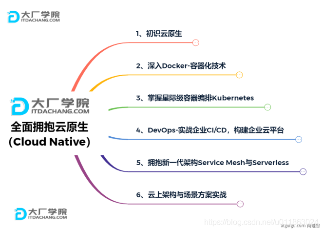

# 一、SpringBoot2介绍

## 一、SpringBoot官网

- [Spring Boot官网](https://spring.io/projects/spring-boot)
- [Spring Boot官方文档](https://docs.spring.io/spring-boot/docs/)

## 二、Spring生态圈

1. [Spring官网](https://spring.io/)

2. Spring的能力

   

3. Spring的生态

   - web开发
   - 数据访问
   - 安全控制
   - 分布式
   - 消息服务
   - 移动开发
   - 批处理

4. Spring5重大升级

   - 响应式编程

     

## 三、SpringBoot的优缺点

### 一、SpringBoot优点

1. 创建独立Spring应用
2. 内嵌web服务器
3. 自动starter依赖，简化构建配置
4. 自动配置Spring以及第三方功能
5. 提供生产级别的监控、健康检查及外部化配置
6. 无代码生成、无需编写XML
7. SpringBoot是整合Spring技术栈的一站式框架
8. SpringBoot是简化Spring技术栈的快速开发脚手架

### 二、SpringBoot缺点

1. 人称版本帝，迭代快，需要时刻关注变化
2. 封装太深，内部原理复杂，不容易精通

## 四、微服务与分布式

### 一、微服务概述

1. 微服务是一种架构风格
2. 一个应用拆分为一组小型服务
3. 每个服务运行在自己的进程内，也就是可独立部署和升级
4. 服务之间使用轻量级HTTP交互
5. 服务围绕业务功能拆分
6. 可以由全自动部署机制独立部署
7. 去中心化，服务自治。服务可以使用不同的语言、不同的存储技术

### 二、分布式的困难

1. 远程调用
2. 服务发现
3. 负载均衡
4. 服务容错
5. 配置管理
6. 服务监控
7. 链路追踪
8. 日志管理
9. 任务调度

### 三、分布式的解决

- SpringBoot + SpringCloud

### 四、云原生

- 原生应用如何上云。Cloud Native

### 五、上云的困难

1. 服务自愈
2. 弹性伸缩
3. 服务隔离
4. 自动化部署
5. 灰度发布
6. 流量治理

### 六、上云的解决



## 五、微服务与分布式的联系

1.  分布式系统是一种架构范式 
   - 分布式系统是一种软件架构的设计方式，用于解决多台计算机协同工作的问题。微服务架构是在这种分布式系统的背景下提出的一种服务组织方式 
2.  微服务是一种实现方式 
   - 微服务是一种软件架构风格，它可以在分布式系统中应用。微服务架构将一个大型应用划分为一组小型、自治的服务，每个服务都有自己的业务逻辑，可以独立开发、部署和运行。微服务通常运行在分布式环境中，利用分布式系统的特性 
   - 微服务是分布式系统的一种形式： 微服务是分布式系统的一种实现形式，它采用了分布式的原则和理念。微服务通过将应用划分为小型服务并通过网络进行通信，体现了分布式系统的核心概念 
3. 总体而言，微服务架构可以视为是在分布式系统的基础上演进而来的一种服务架构，它更强调服务的独立性、自治性和松耦合，适用于构建灵活、可维护的大型应用系统。分布式系统作为一种更广泛的概念，包括了各种架构和设计方式，而微服务是其中一种具体的实践方式 

# 二、SpringBoot入门案例

1.  可以使用Spring Initializr来初始化项目

   ```xml
   <?xml version="1.0" encoding="UTF-8"?>
   <project xmlns="http://maven.apache.org/POM/4.0.0" xmlns:xsi="http://www.w3.org/2001/XMLSchema-instance"
            xsi:schemaLocation="http://maven.apache.org/POM/4.0.0 https://maven.apache.org/xsd/maven-4.0.0.xsd">
       <modelVersion>4.0.0</modelVersion>
       <groupId>com.sunny</groupId>
       <artifactId>demo</artifactId>
       <version>0.0.1-SNAPSHOT</version>
       <name>demo</name>
       <description>demo</description>
       <properties>
           <java.version>1.8</java.version>
           <project.build.sourceEncoding>UTF-8</project.build.sourceEncoding>
           <project.reporting.outputEncoding>UTF-8</project.reporting.outputEncoding>
           <spring-boot.version>2.6.13</spring-boot.version>
       </properties>
       <dependencies>
           <dependency>
               <groupId>org.springframework.boot</groupId>
               <artifactId>spring-boot-starter-web</artifactId>
           </dependency>
   
           <dependency>
               <groupId>org.springframework.boot</groupId>
               <artifactId>spring-boot-starter-test</artifactId>
               <scope>test</scope>
           </dependency>
       </dependencies>
       <dependencyManagement>
           <dependencies>
               <dependency>
                   <groupId>org.springframework.boot</groupId>
                   <artifactId>spring-boot-dependencies</artifactId>
                   <version>${spring-boot.version}</version>
                   <type>pom</type>
                   <scope>import</scope>
               </dependency>
           </dependencies>
       </dependencyManagement>
   
       <build>
           <plugins>
               <plugin>
                   <groupId>org.apache.maven.plugins</groupId>
                   <artifactId>maven-compiler-plugin</artifactId>
                   <version>3.8.1</version>
                   <configuration>
                       <source>1.8</source>
                       <target>1.8</target>
                       <encoding>UTF-8</encoding>
                   </configuration>
               </plugin>
               <plugin>
                   <groupId>org.springframework.boot</groupId>
                   <artifactId>spring-boot-maven-plugin</artifactId>
                   <version>${spring-boot.version}</version>
                   <configuration>
                       <mainClass>com.sunny.bootdemo.DemoApplication</mainClass>
                       <skip>true</skip>
                   </configuration>
                   <executions>
                       <execution>
                           <id>repackage</id>
                           <goals>
                               <goal>repackage</goal>
                           </goals>
                       </execution>
                   </executions>
               </plugin>
           </plugins>
       </build>
   
   </project>
   
   ```

2. 创建主程序

   ```java
   @SpringBootApplication
   public class MainApplication {
   
       public static void main(String[] args) {
           SpringApplication.run(MainApplication.class, args);
       }
   }
   ```

3. 编写业务

   ```java
   @RestController
   public class HelloController {
       @RequestMapping("/hello")
       public String handle01(){
           return "Hello, Spring Boot 2!";
       }
   }
   ```

4. 运行并测试

   - 运行`MainApplication`类
   - 浏览器输入`http://localhost:8888/hello`，将会输出`Hello, Spring Boot 2!`

5. 设置配置

   - maven工程的resource文件夹中创建application.properties文件

     ```properties
     # 设置端口号
     server.port=8888
     ```

   - [更多配置信息](https://docs.spring.io/spring-boot/docs/2.3.7.RELEASE/reference/html/appendix-application-properties.html#common-application-properties-server)

6. 打包配置

   - 在pom.xml添加

     ```xml
     <build>
     	<plugins>
     		<plugin>
     			<groupId>org.springframework.boot</groupId>
     			<artifactId>spring-boot-maven-plugin</artifactId>
     		</plugin>
     	</plugins>
     </build>
     ```

   - 在IDEA的Maven插件上点击运行clean 、package，把helloworld工程项目的打包成jar包

   - 打包好的jar包被生成在helloworld工程项目的target文件夹内

   - 用cmd运行`java -jar boot-01-helloworld-1.0-SNAPSHOT.jar`，既可以运行helloworld工程项目

   - 将jar包直接在目标服务器执行即可


