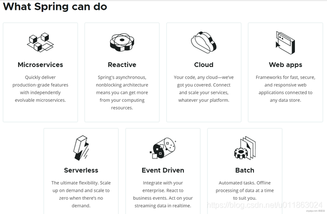
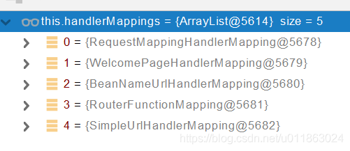

# 一、SpringBoot介绍

## 一、SpringBoot官网

- [Spring Boot官网](https://spring.io/projects/spring-boot)
- [Spring Boot官方文档](https://docs.spring.io/spring-boot/docs/)

## 二、Spring生态圈

1. [Spring官网](https://spring.io/)

2. Spring的能力

   

3. Spring的生态

   - web开发
   - 数据访问
   - 安全控制
   - 分布式
   - 消息服务
   - 移动开发
   - 批处理

4. Spring5重大升级

   - 响应式编程

     

## 三、SpringBoot的优缺点

### 一、SpringBoot优点

1. 创建独立Spring应用
2. 内嵌web服务器
3. 自动starter依赖，简化构建配置
4. 自动配置Spring以及第三方功能
5. 提供生产级别的监控、健康检查及外部化配置
6. 无代码生成、无需编写XML
7. SpringBoot是整合Spring技术栈的一站式框架
8. SpringBoot是简化Spring技术栈的快速开发脚手架

### 二、SpringBoot缺点

1. 人称版本帝，迭代快，需要时刻关注变化
2. 封装太深，内部原理复杂，不容易精通

## 四、微服务与分布式

### 一、微服务概述

1. 微服务是一种架构风格
2. 一个应用拆分为一组小型服务
3. 每个服务运行在自己的进程内，也就是可独立部署和升级
4. 服务之间使用轻量级HTTP交互
5. 服务围绕业务功能拆分
6. 可以由全自动部署机制独立部署
7. 去中心化，服务自治。服务可以使用不同的语言、不同的存储技术

### 二、分布式的困难

1. 远程调用
2. 服务发现
3. 负载均衡
4. 服务容错
5. 配置管理
6. 服务监控
7. 链路追踪
8. 日志管理
9. 任务调度

### 三、分布式的解决

- SpringBoot + SpringCloud

### 四、云原生

- 原生应用如何上云。Cloud Native

### 五、上云的困难

1. 服务自愈
2. 弹性伸缩
3. 服务隔离
4. 自动化部署
5. 灰度发布
6. 流量治理

### 六、上云的解决


## 五、微服务与分布式的联系

1.  分布式系统是一种架构范式 
    - 分布式系统是一种软件架构的设计方式，用于解决多台计算机协同工作的问题。微服务架构是在这种分布式系统的背景下提出的一种服务组织方式 
2.  微服务是一种实现方式 
    - 微服务是一种软件架构风格，它可以在分布式系统中应用。微服务架构将一个大型应用划分为一组小型、自治的服务，每个服务都有自己的业务逻辑，可以独立开发、部署和运行。微服务通常运行在分布式环境中，利用分布式系统的特性 
    - 微服务是分布式系统的一种形式： 微服务是分布式系统的一种实现形式，它采用了分布式的原则和理念。微服务通过将应用划分为小型服务并通过网络进行通信，体现了分布式系统的核心概念 
3.  总体而言，微服务架构可以视为是在分布式系统的基础上演进而来的一种服务架构，它更强调服务的独立性、自治性和松耦合，适用于构建灵活、可维护的大型应用系统。分布式系统作为一种更广泛的概念，包括了各种架构和设计方式，而微服务是其中一种具体的实践方式 

# 二、SpringBoot入门案例

1.  可以使用Spring Initializr来初始化项目

    ```xml
    <?xml version="1.0" encoding="UTF-8"?>
    <project xmlns="http://maven.apache.org/POM/4.0.0" xmlns:xsi="http://www.w3.org/2001/XMLSchema-instance"
             xsi:schemaLocation="http://maven.apache.org/POM/4.0.0 https://maven.apache.org/xsd/maven-4.0.0.xsd">
        <modelVersion>4.0.0</modelVersion>
        <groupId>com.sunny</groupId>
        <artifactId>demo</artifactId>
        <version>0.0.1-SNAPSHOT</version>
        <name>demo</name>
        <description>demo</description>
        <properties>
            <java.version>1.8</java.version>
            <project.build.sourceEncoding>UTF-8</project.build.sourceEncoding>
            <project.reporting.outputEncoding>UTF-8</project.reporting.outputEncoding>
            <spring-boot.version>2.6.13</spring-boot.version>
        </properties>
        <dependencies>
            <dependency>
                <groupId>org.springframework.boot</groupId>
                <artifactId>spring-boot-starter-web</artifactId>
            </dependency>
    
            <dependency>
                <groupId>org.springframework.boot</groupId>
                <artifactId>spring-boot-starter-test</artifactId>
                <scope>test</scope>
            </dependency>
        </dependencies>
        <dependencyManagement>
            <dependencies>
                <dependency>
                    <groupId>org.springframework.boot</groupId>
                    <artifactId>spring-boot-dependencies</artifactId>
                    <version>${spring-boot.version}</version>
                    <type>pom</type>
                    <scope>import</scope>
                </dependency>
            </dependencies>
        </dependencyManagement>
    
        <build>
            <plugins>
                <plugin>
                    <groupId>org.apache.maven.plugins</groupId>
                    <artifactId>maven-compiler-plugin</artifactId>
                    <version>3.8.1</version>
                    <configuration>
                        <source>1.8</source>
                        <target>1.8</target>
                        <encoding>UTF-8</encoding>
                    </configuration>
                </plugin>
                <plugin>
                    <groupId>org.springframework.boot</groupId>
                    <artifactId>spring-boot-maven-plugin</artifactId>
                    <version>${spring-boot.version}</version>
                    <configuration>
                        <mainClass>com.sunny.bootdemo.DemoApplication</mainClass>
                        <skip>true</skip>
                    </configuration>
                    <executions>
                        <execution>
                            <id>repackage</id>
                            <goals>
                                <goal>repackage</goal>
                            </goals>
                        </execution>
                    </executions>
                </plugin>
            </plugins>
        </build>
    
    </project>
    
    ```

2. 创建主程序

   ```java
   @SpringBootApplication
   public class MainApplication {
   
       public static void main(String[] args) {
           SpringApplication.run(MainApplication.class, args);
       }
   }
   ```

3. 编写业务

   ```java
   @RestController
   public class HelloController {
       @RequestMapping("/hello")
       public String handle01(){
           return "Hello, Spring Boot 2!";
       }
   }
   ```

4. 运行并测试

   - 运行`MainApplication`类
   - 浏览器输入`http://localhost:8888/hello`，将会输出`Hello, Spring Boot 2!`

5. 设置配置

   - maven工程的resource文件夹中创建application.properties文件

     ```properties
     # 设置端口号
     server.port=8888
     ```

   - [更多配置信息](https://docs.spring.io/spring-boot/docs/2.3.7.RELEASE/reference/html/appendix-application-properties.html#common-application-properties-server)

6. 打包配置

   - 在pom.xml添加

     ```xml
     <build>
     	<plugins>
     		<plugin>
     			<groupId>org.springframework.boot</groupId>
     			<artifactId>spring-boot-maven-plugin</artifactId>
     		</plugin>
     	</plugins>
     </build>
     ```

   - 在IDEA的Maven插件上点击运行clean 、package，把helloworld工程项目的打包成jar包

   - 打包好的jar包被生成在helloworld工程项目的target文件夹内

   - 用cmd运行`java -jar boot-01-helloworld-1.0-SNAPSHOT.jar`，既可以运行helloworld工程项目

   - 将jar包直接在目标服务器执行即可

# 三、SpringBoot特性

## 一、依赖管理特性

1. 父项目做依赖管理

   ```xml
   <!-- 依赖管理：在项目中引入spring-boot-starter-parent即可 -->
   <parent>
   	<groupId>org.springframework.boot</groupId>
   	<artifactId>spring-boot-starter-parent</artifactId>
   	<version>2.3.4.RELEASE</version>
   </parent>
   
   <!-- spring-boot-starter-parent的父依赖为spring-boot-dependencies，在项目中可以不引入。
        spring-boot-dependencies几乎声明了所有开发中常用的依赖的版本号，自动版本仲裁机制，
        即不需要在<dependency>标签中在声明<version>标签，使用默认的版本号 -->
   <parent>
   	<groupId>org.springframework.boot</groupId>
   	<artifactId>spring-boot-dependencies</artifactId>
   	<version>2.3.4.RELEASE</version>
   </parent>
   ```

2. 开发导入starter场景启动器

   - 见到很多`spring-boot-starter-*` ： `*`就某种场景，这种写法都是官方提供的依赖包

   - 只要引入`starter`，这个场景的所有常规需要的依赖我们都自动引入

   - [更多SpringBoot所有支持的场景](https://docs.spring.io/spring-boot/docs/current/reference/html/using-spring-boot.html#using-boot-starter)

   - 见到的  `*-spring-boot-starter`： 第三方为我们提供的简化开发的场景启动器，这种写法都是非官方或者自定义的依赖包

   - 所有场景启动器最底层的依赖

     ```xml
     <dependency>
     	<groupId>org.springframework.boot</groupId>
     	<artifactId>spring-boot-starter</artifactId>
     	<version>2.3.4.RELEASE</version>
     	<scope>compile</scope>
     </dependency>
     ```

3. 无需关注版本号，自动版本仲裁

   - 引入依赖默认都可以不写版本
   - 引入非版本仲裁的jar，要写版本号，可以先点进去看具体的版本是什么，然后需要修改再修改

4. 可以修改默认版本号

   - 查看spring-boot-dependencies里面规定当前依赖的版本用的key，如mysql驱动依赖包

     ```xml
     <!-- mysql驱动依赖包的key -->
     <mysql.version>8.0.33</mysql.version>
     
     <dependency>
             <groupId>mysql</groupId>
             <artifactId>mysql-connector-java</artifactId>
             <version>${mysql.version}</version>
             <exclusions>
               <exclusion>
                 <groupId>com.google.protobuf</groupId>
                 <artifactId>protobuf-java</artifactId>
               </exclusion>
             </exclusions>
     </dependency>
     ```

   - 在当前项目里面重写配置，只需要重写`<properties>`标签中的版本号即可，就可代表重新加载了指定版本的依赖包，如下面的代码

     ```xml
     <properties>
     	<mysql.version>5.1.43</mysql.version>
     </properties>
     
     ```

## 二、自动配置特性

1. 自动配好Tomcat

   - 引入Tomcat依赖
   - 配置Tomcat

   ```xml
   <dependency>
   	<groupId>org.springframework.boot</groupId>
   	<artifactId>spring-boot-starter-tomcat</artifactId>
   	<version>2.3.4.RELEASE</version>
   	<scope>compile</scope>
   </dependency>
   
   ```

2. 自动配好SpringMVC

   - 引入SpringMVC全套组件
   - 自动配好SpringMVC常用组件（功能）

3. 自动配好Web常见功能，如：字符编码问题、文件上传等

   - SpringBoot帮我们配置好了所有web开发的常见场景

   ```java
   public static void main(String[] args) {
       //1、返回我们IOC容器
       ConfigurableApplicationContext run = SpringApplication.run(MainApplication.class, args);
   
       //2、查看容器里面的组件
       String[] names = run.getBeanDefinitionNames();
       for (String name : names) {
           System.out.println(name);
       }
   }
   
   ```

4. 默认的包结构

   - 主程序所在包及其下面的所有子包里面的组件都会被默认扫描进来
   - 无需以前的包扫描配置，想要改变扫描路径则使用
     - @SpringBootApplication(scanBasePackages="com.sunny")
     - @ComponentScan("指定扫描路径")

5. @SpringBootApplication等同于@SpringBootConfiguration、@EnableAutoConfiguration、@ComponentScan("com.sunny")这三个注解加一起

6. 各种配置拥有默认值

   - 默认配置最终都是映射到某个类（大部分都是配置类）上，如：`MultipartProperties`
   - 配置文件的值最终会绑定每个类（大部分都是配置类）上，这个类会在容器中创建对象

7. 按需加载所有自动配置项

   - 因为有非常多的starter，在项目中引入了哪些场景则这个场景的自动配置才会开启
   - SpringBoot所有的自动配置功能都在spring-boot-autoconfigure包里面

8. ......

# 四、底层注解

## 一、@Configuration

1. @Configuration简介

   - @Configuration标注的类为配置类，配置类本身也是组件

2. 基本使用

   - Full模式与Lite模式
   - 示例

   ```java
   /**
    * 1、配置类里面使用@Bean标注在方法上给容器注册组件，默认也是单实例的
    * 2、配置类本身也是组件
    * 3、proxyBeanMethods：代理bean的方法
    *      Full(proxyBeanMethods = true)（保证每个@Bean方法被调用多少次返回的组件都是单实例的）（默认）
    *      Lite(proxyBeanMethods = false)（每个@Bean方法被调用多少次返回的组件都是新创建的）
    */
   @Configuration(proxyBeanMethods = false)
   // @Configuration注解告诉SpringBoot这是一个配置类，等同于配置文件
   public class MyConfig {
   
       /**
        * Full：外部无论对配置类中的这个组件注册方法调用多少次获取的都是之前注册容器中的单实例对象，
                外部调用对象时都需要检查一下容器中是否已存在该实例对象
        * Lite：外部对配置类中的这个组件注册方法调用获取的是注册容器中的实例对象，非单例对象，都是全新对象，
                外部调用对象时不需要检查容器中是否已存在该实例对象，直接创建
        * @return
        */
       @Bean 
       // 给容器中添加组件。以方法名作为组件的id，也可以在@bean中指定组件的id，@Bean("usero1")即可
       // 返回类型就是组件类型。
       // 返回的值，就是组件在容器中的实例
       public User user01(){
           User zhangsan = new User("zhangsan", 18);
           //user组件依赖了Pet组件
           zhangsan.setPet(tomcatPet());
           return zhangsan;
       }
   
       @Bean("tom")
       public Pet tomcatPet(){
           return new Pet("tomcat");
       }
   }
   
   ```

3. @Configuration测试代码如下

   ```java
   @SpringBootConfiguration
   @EnableAutoConfiguration
   @ComponentScan("com.sunny.boot")
   public class MainApplication {
   
       public static void main(String[] args) {
       	//1、返回IOC容器
           ConfigurableApplicationContext run = SpringApplication.run(MainApplication.class, args);
   
       	//2、查看容器里面的组件
           String[] names = run.getBeanDefinitionNames();
           for (String name : names) {
               System.out.println(name);
           }
   
       	//3、从容器中获取组件
           Pet tom01 = run.getBean("tom", Pet.class);
           Pet tom02 = run.getBean("tom", Pet.class);
           System.out.println("组件："+(tom01 == tom02));
   
      		//4、com.sunny.boot.config.MyConfig$$EnhancerBySpringCGLIB$$51f1e1ca@1654a892
           MyConfig bean = run.getBean(MyConfig.class);
           System.out.println(bean);
   
       	// 如果@Configuration(proxyBeanMethods = true)代理对象调用方法。
           // SpringBoot总会检查这个组件是否在容器中有。
           // 保持组件单实例
           User user = bean.user01();
           User user1 = bean.user01();
           System.out.println(user == user1);
   
           User user01 = run.getBean("user01", User.class);
           Pet tom = run.getBean("tom", Pet.class);
   
           System.out.println("用户的宠物："+(user01.getPet() == tom));
       }
   }
   
   ```

4. 最佳实战

   - 配置类组件之间**无依赖关系**用Lite模式加速容器启动过程，减少判断
   - 配置类组件之间**有依赖关系**，方法会被调用得到之前单实例组件，用Full模式（默认）

## 二、@Import

1. @Bean、@Component、@Controller、@Service、@Repository，它们是Spring的基本标签，在Spring Boot中并未改变它们原来的功能
2. @Import({User.class, DBHelper.class})给容器中自动创建出这两个类型的组件、**默认组件的名字就是全类名**
3. @Import注解一般放在有注解的类上

## 三、@Conditional

1. @Conditional简介

   - 条件装配：满足Conditional指定的条件，则进行组件注入
   - 使用范围：可以使用在类上，也可以使用在方法上，使用位置不同则作用范围不同

2. 派生类

   

3. 个别派生类使用举例

   ```java
   @Configuration(proxyBeanMethods = false)
   @ConditionalOnMissingBean(name = "tom")
   // @ConditionalOnMissingBean表示没有tom名字的Bean时，MyConfig类的Bean才能生效
   @ConditionalOnBean(name = "tom")
   // @ConditionalOnBean表示有tom名字的Bean时，MyConfig类的Bean才能生效
   public class MyConfig {
   
       @Bean
       public User user01(){
           User zhangsan = new User("zhangsan", 18);
           zhangsan.setPet(tomcatPet());
           return zhangsan;
       }
   
       @Bean("tom22")
       public Pet tomcatPet(){
           return new Pet("tomcat");
       }
   }
   
   ```


## 四、@ImportResource

1. 若之前的项目使用bean.xml文件生成配置bean，然而现在使用配置类来注入Bean，bean.xml还想用，那么就可以使用@ImportResource

2. bean.xml：

   ```xml
   <?xml version="1.0" encoding="UTF-8"?>
   <beans ...">
   
       <bean id="haha" class="com.lun.boot.bean.User">
           <property name="name" value="zhangsan"></property>
           <property name="age" value="18"></property>
       </bean>
   
       <bean id="hehe" class="com.lun.boot.bean.Pet">
           <property name="name" value="tomcat"></property>
       </bean>
   </beans>
   ```

3. 使用方法

   ```java
   @ImportResource("classpath:beans.xml")
   public class MyConfig {
   ...
   }
   ```

## 五、@ConfigurationProperties

1. @ConfigurationProperties的作用是使用Java读取到properties文件中的内容，并且把它封装到JavaBean中，以供随时使用

2. @ConfigurationProperties + @Component配合使用

   - 假设有配置文件application.properties

     ```properties
     mycar.brand=BYD
     mycar.price=100000
     ```

   - 只有在容器中的组件（任何组件都是如此），才会拥有SpringBoot提供的强大功能

     ```java
     @Component
     @ConfigurationProperties(prefix = "mycar")
     public class Car {
         
         private String brand;
         
         private String price;
         
     	...
     }
     ```

3. @EnableConfigurationProperties + @ConfigurationProperties配合使用

   - 开启Car配置绑定功能

   - 把这个Car这个组件自动注册到容器中

     ```java
     @EnableConfigurationProperties(Car.class)
     public class MyConfig {
     ...
     }
     
     
     @ConfigurationProperties(prefix = "mycar")
     public class Car {
         
         private String brand;
         
         private String price;
         
     	...
     }
     ```

# 五、自动配置源码分析

## 一、自动包规则原理

- SpringBoot应用的启动类

  ```java
  @SpringBootApplication
  public class MainApplication {
  
      public static void main(String[] args) {
          SpringApplication.run(MainApplication.class, args);
      }
  
  }
  ```

- 分析`@SpringBootApplication`

  ```java
  @Target(ElementType.TYPE)
  @Retention(RetentionPolicy.RUNTIME)
  @Documented
  @Inherited
  @SpringBootConfiguration
  @EnableAutoConfiguration
  @ComponentScan(
      excludeFilters = {@Filter(
      type = FilterType.CUSTOM,
      classes = {TypeExcludeFilter.class}
  ), @Filter(
      type = FilterType.CUSTOM,
      classes = {AutoConfigurationExcludeFilter.class}
  )}
  )
  public @interface SpringBootApplication {
      ...
  }
  ```

- `@SpringBootApplication`重点在于`@SpringBootConfiguration`，`@EnableAutoConfiguration`，`@ComponentScan`

### 一、@SpringBootConfiguration

- `@Configuration`代表当前是一个配置类

```java
@Target(ElementType.TYPE)
@Retention(RetentionPolicy.RUNTIME)
@Documented
@Configuration
public @interface SpringBootConfiguration {
    @AliasFor(
        annotation = Configuration.class
    )
    boolean proxyBeanMethods() default true;
}
```

### 二、@ComponentScan

- 指定扫描Spring注解

### 三、@EnableAutoConfiguration

- 意思为开启自动配置功能的注解
- 重点在于`@AutoConfigurationPackage`，`@Import(AutoConfigurationImportSelector.class)`

```java
@Target(ElementType.TYPE)
@Retention(RetentionPolicy.RUNTIME)
@Documented
@Inherited
@AutoConfigurationPackage
@Import(AutoConfigurationImportSelector.class)
public @interface EnableAutoConfiguration {
    String ENABLED_OVERRIDE_PROPERTY = "spring.boot.enableautoconfiguration";

    Class<?>[] exclude() default {};

    String[] excludeName() default {};
}
```

1. @AutoConfigurationPackage
   - 标签名直译为：自动配置包，指定了默认的包规则
   - 利用Registrar给容器中导入一系列组件
   - 将指定的一个包下的所有组件导入进MainApplication所在包下，也就是导入主程序所在包及子包下的所有组件
2. @Import(AutoConfigurationImportSelector.class)

## 二、初始加载自动配置类

- @Import(AutoConfigurationImportSelector.class)

1. `AutoConfigurationImportSelector.class`类利用`getAutoConfigurationEntry(annotationMetadata);`给容器中批量导入一些组件

2. 调用`List<String> configurations = getCandidateConfigurations(annotationMetadata, attributes)`获取到所有需要导入到容器中的配置类（组件）

3. 利用工厂加载 `Map<String, List<String>> loadSpringFactories(@Nullable ClassLoader classLoader);`得到所有的组件

4. 从包中`META-INF/spring.factories`位置来加载一个文件

   - 默认扫描我们当前系统里面所有`META-INF/spring.factories`位置的文件
   - `spring-boot-autoconfigure-2.3.4.RELEASE.jar`包里面也有`META-INF/spring.factories`，而且还是主要的
   - 在`spring-boot-autoconfigure-2.3.4.RELEASE.jar/META-INF/spring.factories`虽然有127个场景的所有自动配置启动的时候默认全部加载，但是`xxxxAutoConfiguration`按照条件装配规则（`@Conditional`），最终会按需配置

   

   ```properties
   # 文件里面写死了spring-boot一启动就要给容器中加载的所有配置类
   # 如spring-boot-autoconfigure-2.3.4.RELEASE.jar/META-INF/spring.factories
   # Auto Configure
   org.springframework.boot.autoconfigure.EnableAutoConfiguration=\
   org.springframework.boot.autoconfigure.admin.SpringApplicationAdminJmxAutoConfiguration,\
   org.springframework.boot.autoconfigure.aop.AopAutoConfiguration,\
   ...
   ```

## 三、自动配置流程

- 以`DispatcherServletAutoConfiguration`的内部类`DispatcherServletConfiguration`为例子

  ```java
  @Bean
  @ConditionalOnBean(MultipartResolver.class)  //容器中有这个类型组件
  @ConditionalOnMissingBean(name = DispatcherServlet.MULTIPART_RESOLVER_BEAN_NAME) //容器中没有这个名字multipartResolver的组件，但是用户配置了文件上传的配置类，也会导入此配置类
  public MultipartResolver multipartResolver(MultipartResolver resolver) {
  	//给@Bean标注的方法传入了对象参数，这个参数的值就会从容器中找
  	//SpringMVC multipartResolver。防止有些用户配置的文件上传解析器不符合规范
  	return resolver;//给容器中加入了文件上传解析器；
  }
  ```

- SpringBoot默认会在底层配好所有的组件，但是**如果用户自己配置了以用户的优先**

- 自动配置总结

  - SpringBoot先加载所有的自动配置类`xxxxxAutoConfiguration`
  - 每个自动配置类按照条件进行生效，默认都会绑定配置文件指定的值（xxxxProperties里面读取，xxxProperties和配置文件进行了绑定）
  - 生效的配置类就会给容器中装配很多组件
  - 只要容器中有这些组件，相当于这些功能就有了
  - 定制化配置
    - 用户直接自己@Bean替换底层的组件
    - 用户去看这个组件是获取的配置文件什么值就去修改配置文件中对应的值
  - **xxxxxAutoConfiguration ---> 组件 ---> xxxxProperties里面拿值  ----> application.properties**

# 六、SpringBoot最佳实践

## 一、SpringBoot应用如何编写

1. 引入场景依赖
   - [官方文档](https://docs.spring.io/spring-boot/docs/current/reference/html/using-spring-boot.html#using-boot-starter)
2. 查看自动配置了哪些（选做）
   - 自己分析，引入场景对应的自动配置一般都生效了
   - 配置文件中debug=true开启自动配置报告
     - Negative（不生效的自动配置类）
     - Positive（生效的自动配置类）
3. 是否需要修改或者自定义配置文件
   - 参照文档修改配置项
     - [官方文档](https://docs.spring.io/spring-boot/docs/current/reference/html/appendix-application-properties.html#common-application-properties)
     - 自己分析。xxxxProperties绑定了配置文件的哪些
   - 自定义加入或者替换组件
     - @Bean、@Component...
   - 自定义器XXXXXCustomizer
   - ......

## 二、Lombok简化开发

1. Lombok用标签方式代替构造器、getter/setter、toString()、hashCode()、equals()等鸡肋代码

2. Lombok的使用

   - 引入依赖

     ```xml
      <dependency>
          <groupId>org.projectlombok</groupId>
          <artifactId>lombok</artifactId>
     </dependency>
     ```

   - IDEA中File->Settings->Plugins，搜索安装Lombok插件

3. 常用方法替代

   ```java
   @NoArgsConstructor
   @AllArgsConstructor
   // 如果是使用无参-全参之间的构造器则需要重写自己手写构造器
   @Data
   @ToString
   @EqualsAndHashCode
   public class User {
   
       private String name;
       private Integer age;
   
       private Pet pet;
   
       public User(String name,Integer age){
           this.name = name;
           this.age = age;
       }
   }
   ```

4. 简化日志开发：使用`@Slf4j`即可，在代码中使用`log.`即可

   ```java
   @Slf4j
   @RestController
   public class HelloController {
       @RequestMapping("/hello")
       public String handle01(@RequestParam("name") String name){
           log.info("请求进来了....");
           return "Hello, Spring Boot 2!"+"你好："+name;
       }
   }
   ```

## 三、dev-tools热更新

1. dev-tools并不是真正意义上的热更新，只是重启项目而已，但是修改页面后不需要重新启动，Java代码修改后还是要重启

2. 添加依赖

   ```xml
   <dependencies>
       <dependency>
           <groupId>org.springframework.boot</groupId>
           <artifactId>spring-boot-devtools</artifactId>
           <optional>true</optional>
       </dependency>
   </dependencies>
   ```

3. 使用方法：在IDEA中，项目或者页面修改以后使用按键Ctrl+F9，也就是rebuild

## 四、Spring Initailizr

- [Spring Initailizr](https://start.spring.io/)是创建SpringBoot工程向导
- 在IDEA中，菜单栏New -> Project -> Spring Initailizr，需要什么依赖选择什么依赖即可

# 七、配置文件

1. YAML的意思其实是："Yet Another Markup Language"（仍是一种标记语言），同以前的properties用法。当properties文件与YAML文件同时存在时，先加载properties文件中的内容，再加载YAML文件中的内容，当properties文件中的内容与YAML文件的内容有重复时，则遵循优先原则，使用properties文件中的内容

2. YAML**非常适合用来做以数据为中心的配置文件**

3. 基本语法

   - key: value；kv之间有空格
   - 大小写敏感
   - 使用缩进表示层级关系
   - 缩进不允许使用tab，只允许空格，在IDEA中允许使用tab
   - 缩进的空格数不重要，只要相同层级的元素左对齐即可
   - '#'表示注释
   - 字符串无需加引号，如果要加，单引号''、双引号""表示字符串内容会被转义、不转义。也就是说单引号会将转义字符`/`再转义成普通字符串，而双引号不会处理转义字符。例如`"张三\n李四"`，则会换行，使用单引号时不会换行

4. 数据类型

   - 字面量：单个的、不可再分的值。date、boolean、string、number、null

     ```yaml
     k: v
     ```

   - 对象：键值对的集合。map、hash、set、object 

     ```yaml
     #行内写法：  
     
     k: {k1:v1,k2:v2,k3:v3}
     
     #或
     
     k: 
       k1: v1
       k2: v2
       k3: v3
     ```

   - 数组：一组按次序排列的值。array、list、queue

     ```yaml
     #行内写法：  
     
     k: [v1,v2,v3]
     
     #或者
     
     k:
      - v1
      - v2
      - v3
     ```

5. 实例

   - Java代码

     ```java
     @Data
     @Component
     @ConfigurationProperties(prefix="person")
     public class Person {
         private String userName;
         private Boolean boss;
         private Date birth;
         private Integer age;
         private Pet pet;
         private String[] interests;
         private List<String> animal;
         private Map<String, Object> score;
         private Set<Double> salarys;
         private Map<String, List<Pet>> allPets;
     }
     
     @Data
     public class Pet {
         private String name;
         private Double weight;
     }
     ```

   - yaml代码

     ```yaml
     person:
       userName: zhangsan
       boss: false
       birth: 2019/12/12 20:12:33
       age: 18
       pet: 
         name: tomcat
         weight: 23.4
       interests: [篮球,游泳]
       animal: 
         - jerry
         - mario
       score:
         english: 
           first: 30
           second: 40
           third: 50
         math: [131,140,148]
         chinese: {first: 128,second: 136}
       salarys: [3999,4999.98,5999.99]
       allPets:
         sick:
           - {name: tom}
           - {name: jerry,weight: 47}
         health: [{name: mario,weight: 47}]
     ```

6. YAML取值

   - @value注解方式： 读取到的数据特别零散 

     ```java
     @RestController
     @RequestMapping("/person")
     public class PersonController {
         
         @Value("${person.userName}")
         private String userName;
      
         @GetMapping("/{id}")
         public String getById(@PathVariable Integer id){
             System.out.println(userName);
             return "hello";
         }
     }
     ```

   - Environment对象：SpringBoot可以使用`@Autowired`注解注入`Environment`对象的方式读取数据。这种方式 SpringBoot会将配置文件中所有的数据封装到`Environment`对象中，如果需要使用哪个数据只需要通过调用 `Environment`对象的`getProperty(String name)`方法获取

     ```java
     @RestController
     @RequestMapping("/person")
     public class PersonController {
         
         @Autowired
         private Environment env;
         
         @GetMapping("/{id}")
         public String getById(@PathVariable Integer id){
             System.out.println(env.getProperty("person.userName"));
             return "hello , spring boot!";
         }
     }
     ```

   - 对自定义数据类型：将实体类bean的创建交给Spring管理，在类上添加@Component注解；使用@ConfigurationProperties注解表示加载配置文件，在该注解中也可以使用prefix属性指定只加载指定前缀的数据 

     ```java
     @RestController
     @RequestMapping("/person")
     public class PersonController {
         
         @Autowired
         private Person person;
         
         @GetMapping("/{id}")
         public String getById(@PathVariable Integer id){
             System.out.println(person.getUserName);
             return "hello , spring boot!";
         }
     }
     ```

7. 配置文件-自定义类绑定的配置提示

   - 自定义的类和配置文件绑定一般没有提示。若要提示，添加如下依赖：

     ```xml
     <dependency>
         <groupId>org.springframework.boot</groupId>
         <artifactId>spring-boot-configuration-processor</artifactId>
         <optional>true</optional>
     </dependency>
     
     <!-- 下面插件作用是工程打包时，不将spring-boot-configuration-processor打进包内，让其只在编码的时候有用 -->
     <build>
         <plugins>
             <plugin>
                 <groupId>org.springframework.boot</groupId>
                 <artifactId>spring-boot-maven-plugin</artifactId>
                 <configuration>
                     <excludes>
                         <exclude>
                             <groupId>org.springframework.boot</groupId>
                             <artifactId>spring-boot-configuration-processor</artifactId>
                         </exclude>
                     </excludes>
                 </configuration>
             </plugin>
         </plugins>
     </build>
     ```

# 八、Web场景开发

## 一、web开发之简介

1. 大多场景我们都无需自定义配置

2. 自动配置的资源有

   - 内容协商视图解析器和BeanName视图解析器
   - 静态资源（包括webjars）
   - 自动注册 `Converter，GenericConverter，Formatter `
   - 支持 `HttpMessageConverters` （配合内容协商理解原理）
   - 自动注册 `MessageCodesResolver` （国际化用）
   - 静态index.html 页支持
   - 自定义 `Favicon`  
   - 自动使用 `ConfigurableWebBindingInitializer` ，（DataBinder负责将请求数据绑定到JavaBean上）

   > If you want to keep those Spring Boot MVC customizations and make more [MVC customizations](https://docs.spring.io/spring/docs/5.2.9.RELEASE/spring-framework-reference/web.html#mvc) (interceptors, formatters, view controllers, and other features), you can add your own `@Configuration` class of type `WebMvcConfigurer` but **without** `@EnableWebMvc`.
   >
   > **不用@EnableWebMvc注解。使用** **`@Configuration`** **+** **`WebMvcConfigurer`** **自定义规则**

   > If you want to provide custom instances of `RequestMappingHandlerMapping`, `RequestMappingHandlerAdapter`, or `ExceptionHandlerExceptionResolver`, and still keep the Spring Boot MVC customizations, you can declare a bean of type `WebMvcRegistrations` and use it to provide custom instances of those components.
   >
   > **声明** **`WebMvcRegistrations`** **改变默认底层组件**

   > If you want to take complete control of Spring MVC, you can add your own `@Configuration` annotated with `@EnableWebMvc`, or alternatively add your own `@Configuration`-annotated `DelegatingWebMvcConfiguration` as described in the Javadoc of `@EnableWebMvc`.
   >
   > **使用** **`@EnableWebMvc+@Configuration+DelegatingWebMvcConfiguration 全面接管SpringMVC`**

## 二、web开发之静态资源规则与定制化

1. 静态资源目录

   - 只要静态资源放在类路径下： 也就是`resources`目录下`/static` or `/public` or `/resources` or `/META-INF/resources`

   - 访问：当前项目根路径/ + 静态资源名 

   - 原理：静态映射/**

   - 请求进来，先去找Controller看能不能处理。不能处理的所有请求又都交给静态资源处理器。静态资源也找不到则响应404页面

   - 也可以改变默认的静态资源路径，如果改变默认的资源路径，那么`/static`，`/public`,`/resources`, `/META-INF/resources`则会失效

     ```yaml
     resources:
       static-locations: [classpath:/abc/]
     ```

2. 静态资源访问前缀

   - 静态资源默认访问前缀为无，访问路径为：当前项目根路径/ + 静态资源名 

   - 设置前缀后的访问路径为：当前项目 + static-path-pattern + 静态资源名 = 静态资源文件夹下找

     ```yaml
     spring:
       mvc:
         static-path-pattern: /res/**
     ```

3. webjar

   - 可用jar方式添加css，js等资源文件

   - [官网](https://www.webjars.org/)

   - 例如，添加jquery

     ```java
     <dependency>
         <groupId>org.webjars</groupId>
         <artifactId>jquery</artifactId>
         <version>3.5.1</version>
     </dependency>
     ```

   - 访问地址：[http://localhost:8080/webjars/**jquery/3.5.1/jquery.js**](http://localhost:8080/webjars/jquery/3.5.1/jquery.js)  后面地址要按照依赖里面的包路径

## 三、web开发之welcome与favicon功能

- [官方文档](https://docs.spring.io/spring-boot/docs/2.3.8.RELEASE/reference/htmlsingle/#boot-features-spring-mvc-welcome-page)

1. 欢迎页支持

   - 使用controller能处理/index，进行跳转页面

   - 静态资源路径下index.html

     - 可以配置静态资源路径
     - 但是不可以配置静态资源的访问前缀，否则导致index.html不能被默认访问，最新版SpringBoot可能解决了这个bug

     ```yaml
     spring:
     #  mvc:
     #    static-path-pattern: /res/**   这个会导致welcome page功能失效
       resources:
         static-locations: [classpath:/anc/]
     ```

2. 自定义favicon

   - 指网页标签上的小图标
   - favicon.ico放在静态资源目录下即可，必须是favicon.ico这个名字

   ```properties
   spring:
   #  mvc:
   #    static-path-pattern: /res/**   这个会导致 Favicon 功能失效
   ```

## 四、web开发之静态资源原理源码分析

1. 静态资源原理大纲代码

   - SpringBoot启动默认加载自动配置类` xxxAutoConfiguration类`

   - SpringMVC功能的自动配置类`WebMvcAutoConfiguration`，生效

     ```java
     @Configuration(proxyBeanMethods = false)
     @ConditionalOnWebApplication(type = Type.SERVLET)
     @ConditionalOnClass({ Servlet.class, DispatcherServlet.class, WebMvcConfigurer.class })
     @ConditionalOnMissingBean(WebMvcConfigurationSupport.class)
     @AutoConfigureOrder(Ordered.HIGHEST_PRECEDENCE + 10)
     @AutoConfigureAfter({ DispatcherServletAutoConfiguration.class, TaskExecutionAutoConfiguration.class,
     		ValidationAutoConfiguration.class })
     public class WebMvcAutoConfiguration {
         ...
     }
     ```

   - 容器中配置文件的相关属性的绑定：WebMvcProperties（spring.mvc）、ResourceProperties（spring.resources）

     ```java
     @Configuration(proxyBeanMethods = false)
     @Import(EnableWebMvcConfiguration.class)
     @EnableConfigurationProperties({ WebMvcProperties.class, ResourceProperties.class })
     @Order(0)
     public static class WebMvcAutoConfigurationAdapter implements WebMvcConfigurer {
         ...
     }
     ```

2. `WebMvcAutoConfigurationAdapter`配置类只有一个有参构造器

   ```java
   ////有参构造器所有参数的值都会从容器中确定
   public WebMvcAutoConfigurationAdapter(WebProperties webProperties, WebMvcProperties mvcProperties,
   		ListableBeanFactory beanFactory, ObjectProvider<HttpMessageConverters> messageConvertersProvider,
   		ObjectProvider<ResourceHandlerRegistrationCustomizer> resourceHandlerRegistrationCustomizerProvider,
   		ObjectProvider<DispatcherServletPath> dispatcherServletPath,
   		ObjectProvider<ServletRegistrationBean<?>> servletRegistrations) {
   	this.mvcProperties = mvcProperties;
   	this.beanFactory = beanFactory;
   	this.messageConvertersProvider = messageConvertersProvider;
   	this.resourceHandlerRegistrationCustomizer = resourceHandlerRegistrationCustomizerProvider.getIfAvailable();
   	this.dispatcherServletPath = dispatcherServletPath;
   	this.servletRegistrations = servletRegistrations;
   	this.mvcProperties.checkConfiguration();
   }
   ```

   - ResourceProperties resourceProperties：获取和spring.resources绑定的所有的值的对象
   - WebMvcProperties mvcProperties：获取和spring.mvc绑定的所有的值的对象
   - ListableBeanFactory beanFactory：Spring的beanFactory
   - HttpMessageConverters：找到所有的HttpMessageConverters
   - ResourceHandlerRegistrationCustomizer：找到资源处理器的自定义器
   - DispatcherServletPath：找到DispatcherServlet的路径
   - ServletRegistrationBean：给应用注册Servlet、Filter....

3. 资源处理的默认规则

   ```java
   ...
   public class WebMvcAutoConfiguration {
       ...
   	public static class EnableWebMvcConfiguration extends DelegatingWebMvcConfiguration implements ResourceLoaderAware {
           ...
   		@Override
   		protected void addResourceHandlers(ResourceHandlerRegistry registry) {
   			super.addResourceHandlers(registry);
   			if (!this.resourceProperties.isAddMappings()) {
   				logger.debug("Default resource handling disabled");
   				return;
   			}
   			ServletContext servletContext = getServletContext();
   			addResourceHandler(registry, "/webjars/**", "classpath:/META-INF/resources/webjars/");
   			addResourceHandler(registry, this.mvcProperties.getStaticPathPattern(), (registration) -> {
   				registration.addResourceLocations(this.resourceProperties.getStaticLocations());
   				if (servletContext != null) {
   					registration.addResourceLocations(new ServletContextResource(servletContext, SERVLET_LOCATION));
   				}
   			});
   		}
           ...
           
       }
       ...
   }
   ```

   - 根据上述代码，我们可以同过配置禁止所有静态资源规则

     ```yaml
     spring:
       resources:
         add-mappings: false   #禁用所有静态资源规则
     ```

   - 静态资源规则：

     ```java
     @ConfigurationProperties(prefix = "spring.resources", ignoreUnknownFields = false)
     public class ResourceProperties {
     
         private static final String[] CLASSPATH_RESOURCE_LOCATIONS = { "classpath:/META-INF/resources/",
                 "classpath:/resources/", "classpath:/static/", "classpath:/public/" };
     
         /**
          * Locations of static resources. Defaults to classpath:[/META-INF/resources/,
          * /resources/, /static/, /public/].
          */
         private String[] staticLocations = CLASSPATH_RESOURCE_LOCATIONS;
         ...
     }
     
     ```

   - 欢迎页的处理规则

     ```java
     ...
     public class WebMvcAutoConfiguration {
         ...
     	public static class EnableWebMvcConfiguration extends DelegatingWebMvcConfiguration implements ResourceLoaderAware {
             ...
     		@Bean
     		public WelcomePageHandlerMapping welcomePageHandlerMapping(ApplicationContext applicationContext,
     				FormattingConversionService mvcConversionService, ResourceUrlProvider mvcResourceUrlProvider) {
     			WelcomePageHandlerMapping welcomePageHandlerMapping = new WelcomePageHandlerMapping(
     					new TemplateAvailabilityProviders(applicationContext), applicationContext, getWelcomePage(),
     					this.mvcProperties.getStaticPathPattern());
     			welcomePageHandlerMapping.setInterceptors(getInterceptors(mvcConversionService, mvcResourceUrlProvider));
     			welcomePageHandlerMapping.setCorsConfigurations(getCorsConfigurations());
     			return welcomePageHandlerMapping;
     		}
         
     ```

   - `WelcomePageHandlerMapping`的构造方法如下：

     ```java
     WelcomePageHandlerMapping(TemplateAvailabilityProviders templateAvailabilityProviders,
                               ApplicationContext applicationContext, Resource welcomePage, String staticPathPattern) {
         if (welcomePage != null && "/**".equals(staticPathPattern)) {
             //要用欢迎页功能，必须是/**
             logger.info("Adding welcome page: " + welcomePage);
             setRootViewName("forward:index.html");
         }
         else if (welcomeTemplateExists(templateAvailabilityProviders, applicationContext)) {
             //调用Controller /index
             logger.info("Adding welcome page template: index");
             setRootViewName("index");
         }
         // 这构造方法内的代码也解释了配置`static-path-pattern`，welcome页面和小图标失效的问题
     }
     ```

## 五、请求处理之Rest映射及源码解析

1. 请求映射

   - @xxxMapping：@GetMapping、@PostMapping、@PutMapping、@DeleteMapping

   - Rest风格支持（使用**HTTP**请求方式动词来表示对资源的操作）

     - GET-获取用户
     - DELETE-删除用户
     - PUT-修改用户
     - POST-保存用户

     - 核心Filter：HiddenHttpMethodFilter

2. Rest用法

   - 开启页面表单的Rest功能
   - 页面form的属性method=post，隐藏域 \_method=put、delete等（如果直接get或post，无需隐藏域）
   - 编写请求映射

   ```yaml
   spring:
     mvc:
       hiddenmethod:
         filter:
           enabled: true   #开启页面表单的Rest功能
   ```

   ```html
   <form action="/user" method="get">
       <input value="REST-GET提交" type="submit" />
   </form>
   
   <form action="/user" method="post">
       <input value="REST-POST提交" type="submit" />
   </form>
   
   <form action="/user" method="post">
       <input name="_method" type="hidden" value="DELETE"/>
       <input value="REST-DELETE 提交" type="submit"/>
   </form>
   
   <form action="/user" method="post">
       <input name="_method" type="hidden" value="PUT" />
       <input value="REST-PUT提交"type="submit" />
   <form>
   ```

   ```java
   @GetMapping("/user")
   //@RequestMapping(value = "/user",method = RequestMethod.GET)
   public String getUser(){
       return "GET-张三";
   }
   
   @PostMapping("/user")
   //@RequestMapping(value = "/user",method = RequestMethod.POST)
   public String saveUser(){
       return "POST-张三";
   }
   
   @PutMapping("/user")
   //@RequestMapping(value = "/user",method = RequestMethod.PUT)
   public String putUser(){
       return "PUT-张三";
   }
   
   @DeleteMapping("/user")
   //@RequestMapping(value = "/user",method = RequestMethod.DELETE)
   public String deleteUser(){
       return "DELETE-张三";
   }
   ```

3. Rest原理（表单提交要使用REST的时候）

   - 表单提交会带上`\_method=PUT`
   - 请求过来被`HiddenHttpMethodFilter`拦截，如果请求是正常的，并且是POST请求
     - 获取到`\_method`的值
     - 兼容的请求有：PUT、DELETE、PATCH
     - 原生request（post），包装模式requesWrapper重写了getMethod方法，返回的是传入的值
     - 过滤器链放行的时候用wrapper。以后的方法调用getMethod是调用requesWrapper的getMethod

   ```java
   public class HiddenHttpMethodFilter extends OncePerRequestFilter {
   
   	private static final List<String> ALLOWED_METHODS =
   			Collections.unmodifiableList(Arrays.asList(HttpMethod.PUT.name(),
   					HttpMethod.DELETE.name(), HttpMethod.PATCH.name()));
   
   	/** Default method parameter: {@code _method}. */
   	public static final String DEFAULT_METHOD_PARAM = "_method";
   
   	private String methodParam = DEFAULT_METHOD_PARAM;
   
   
   	/**
   	 * Set the parameter name to look for HTTP methods.
   	 * @see #DEFAULT_METHOD_PARAM
   	 */
   	public void setMethodParam(String methodParam) {
   		Assert.hasText(methodParam, "'methodParam' must not be empty");
   		this.methodParam = methodParam;
   	}
   
   	@Override
   	protected void doFilterInternal(HttpServletRequest request, HttpServletResponse response, FilterChain filterChain)
   			throws ServletException, IOException {
   
   		HttpServletRequest requestToUse = request;
   
   		if ("POST".equals(request.getMethod()) && request.getAttribute(WebUtils.ERROR_EXCEPTION_ATTRIBUTE) == null) {
   			String paramValue = request.getParameter(this.methodParam);
   			if (StringUtils.hasLength(paramValue)) {
   				String method = paramValue.toUpperCase(Locale.ENGLISH);
   				if (ALLOWED_METHODS.contains(method)) {
   					requestToUse = new HttpMethodRequestWrapper(request, method);
   				}
   			}
   		}
   
   		filterChain.doFilter(requestToUse, response);
   	}
   
   
   	/**
   	 * Simple {@link HttpServletRequest} wrapper that returns the supplied method for
   	 * {@link HttpServletRequest#getMethod()}.
   	 */
   	private static class HttpMethodRequestWrapper extends HttpServletRequestWrapper {
   
   		private final String method;
   
   		public HttpMethodRequestWrapper(HttpServletRequest request, String method) {
   			super(request);
   			this.method = method;
   		}
   
   		@Override
   		public String getMethod() {
   			return this.method;
   		}
   	}
   }
   ```

4. Rest使用客户端工具：如PostMan可直接发送put、delete等方式请求

## 六、请求处理之改变默认的\_method

```java
@Configuration(proxyBeanMethods = false)
@ConditionalOnWebApplication(type = Type.SERVLET)
@ConditionalOnClass({ Servlet.class, DispatcherServlet.class, WebMvcConfigurer.class })
@ConditionalOnMissingBean(WebMvcConfigurationSupport.class)
@AutoConfigureOrder(Ordered.HIGHEST_PRECEDENCE + 10)
@AutoConfigureAfter({ DispatcherServletAutoConfiguration.class, TaskExecutionAutoConfiguration.class,
		ValidationAutoConfiguration.class })
public class WebMvcAutoConfiguration {

    ...
    
    @Bean
    @ConditionalOnMissingBean(HiddenHttpMethodFilter.class)
    @ConditionalOnProperty(prefix = "spring.mvc.hiddenmethod.filter", name = "enabled", matchIfMissing = false)
    public OrderedHiddenHttpMethodFilter hiddenHttpMethodFilter() {
        return new OrderedHiddenHttpMethodFilter();
    }
    ...
}
```

- `@ConditionalOnMissingBean(HiddenHttpMethodFilter.class)`意味着在没有`HiddenHttpMethodFilter`时，才执行`hiddenHttpMethodFilter()`。因此，我们可以自定义filter，改变默认的`\_method`。例如：

```java
@Configuration(proxyBeanMethods = false)
public class WebConfig{
    //自定义filter
    @Bean
    public HiddenHttpMethodFilter hiddenHttpMethodFilter(){
        HiddenHttpMethodFilter methodFilter = new HiddenHttpMethodFilter();
        methodFilter.setMethodParam("_m");
        return methodFilter;
    }    
}
```

- 将`\_method`改成`_m`

```java
<form action="/user" method="post">
    <input name="_m" type="hidden" value="DELETE"/>
    <input value="REST-DELETE 提交" type="submit"/>
</form>
```

## 七、请求处理之请求映射原理


1. SpringMVC功能分析都从 `org.springframework.web.servlet.DispatcherServlet` ->  `doDispatch() `

   ```java
   protected void doDispatch(HttpServletRequest request, HttpServletResponse response) throws Exception {
       HttpServletRequest processedRequest = request;
       HandlerExecutionChain mappedHandler = null;
       boolean multipartRequestParsed = false;
   
       WebAsyncManager asyncManager = WebAsyncUtils.getAsyncManager(request);
   
       try {
           ModelAndView mv = null;
           Exception dispatchException = null;
   
           try {
               processedRequest = checkMultipart(request);
               multipartRequestParsed = (processedRequest != request);
   
               // 找到当前请求使用哪个Handler（Controller的方法）处理
               mappedHandler = getHandler(processedRequest);
   
               //HandlerMapping：处理器映射。/xxx->>xxxx
       ...
   }
           
   
   // getHandler()方法如下：
   @Nullable
   protected HandlerExecutionChain getHandler(HttpServletRequest request) throws Exception {
       if (this.handlerMappings != null) {
           for (HandlerMapping mapping : this.handlerMappings) {
               HandlerExecutionChain handler = mapping.getHandler(request);
               if (handler != null) {
                   return handler;
               }
           }
       }
       return null;
   }
   ```

2. `getHandler()`中`this.handlerMappings`在Debug模式展现的内容如下，其中保存了所有`@RequestMapping` 和`handler`的映射规则




3. 所有的请求映射都在HandlerMapping中：
   - SpringBoot自动配置欢迎页的WelcomePageHandlerMapping，访问`/`能访问到index.html
   - SpringBoot自动配置了默认的RequestMappingHandlerMapping
   - 请求进来，挨个尝试所有的HandlerMapping看是否有请求信息

     - 如果有就找到这个请求对应的handler
     - 如果没有就是下一个HandlerMapping
   - 我们需要一些自定义的映射处理，我们也可以自己给容器中放HandlerMapping，自定义HandlerMapping也就是注入`@Controller`

## 八、请求处理之常用参数注解使用

1. 注解

   - `@PathVariable`：路径变量
   - `@RequestHeader`：获取请求头
   - `@RequestParam`：获取请求参数（指问号后的参数，url?a=1&b=2）
   - `@CookieValue`：获取Cookie值
   - `@RequestAttribute`：获取request域属性
   - `@RequestBody`：获取请求体[POST]
   - `@MatrixVariable`：矩阵变量
   - `@ModelAttribute`

2. 使用用例

   ```java
   @RestController
   public class ParameterTestController {
   
   
       //  car/2/owner/zhangsan
       @GetMapping("/car/{id}/owner/{username}")
       public Map<String,Object> getCar(@PathVariable("id") Integer id,
                                        @PathVariable("username") String name,
                                        @PathVariable Map<String,String> pv,
                                        
                                        @RequestHeader("User-Agent") String userAgent,
                                        @RequestHeader Map<String,String> header,
                                        
                                        @RequestParam("age") Integer age,
                                        @RequestParam("inters") List<String> inters,
                                        @RequestParam Map<String,String> params,
                                        
                                        @CookieValue("_ga") String _ga,
                                        @CookieValue("_ga") Cookie cookie){
   
           Map<String,Object> map = new HashMap<>();
   
   //        map.put("id",id);
   //        map.put("name",name);
   //        map.put("pv",pv);
   //        map.put("userAgent",userAgent);
   //        map.put("headers",header);
           map.put("age",age);
           map.put("inters",inters);
           map.put("params",params);
           map.put("_ga",_ga);
           System.out.println(cookie.getName()+"===>"+cookie.getValue());
           return map;
       }
   
   
       @PostMapping("/save")
       public Map postMethod(@RequestBody String content){
           Map<String,Object> map = new HashMap<>();
           map.put("content",content);
           return map;
       }
   }
   ```

## 九、请求处理之@RequestAttribute

```java
@Controller
public class RequestController {

    @GetMapping("/goto")
    public String goToPage(HttpServletRequest request){

        request.setAttribute("msg","成功了...");
        request.setAttribute("code",200);
        return "forward:/success";  //转发到  /success请求
    }

    @GetMapping("/params")
    public String testParam(Map<String,Object> map,
                            Model model,
                            HttpServletRequest request,
                            HttpServletResponse response){
        map.put("hello","world666");
        model.addAttribute("world","hello666");
        request.setAttribute("message","HelloWorld");

        Cookie cookie = new Cookie("c1","v1");
        response.addCookie(cookie);
        return "forward:/success";
    }

    ///<-----------------主角@RequestAttribute在这个方法
    @ResponseBody
    @GetMapping("/success")
    public Map success(@RequestAttribute(value = "msg",required = false) String msg,
                       @RequestAttribute(value = "code",required = false)Integer code,
                       HttpServletRequest request){
        Object msg1 = request.getAttribute("msg");

        Map<String,Object> map = new HashMap<>();
        Object hello = request.getAttribute("hello");
        Object world = request.getAttribute("world");
        Object message = request.getAttribute("message");

        map.put("reqMethod_msg",msg1);
        map.put("annotation_msg",msg);
        map.put("hello",hello);
        map.put("world",world);
        map.put("message",message);

        return map;
    }
}
```

## 十、请求处理之@MatrixVariable

1. `@MatrixVariable`语法：请求路径如`/cars/sell;low=34;brand=byd,audi,yd`。 矩阵变量是在URI路径的片段中以 `path/to;key=value` 形式传递的参数 

2. SpringBoot默认是禁用了矩阵变量的功能

   - 手动开启：原理。对于路径的处理。UrlPathHelper的removeSemicolonContent设置为false，让其支持矩阵变量的。

3. 矩阵变量**必须**有url路径变量才能被解析

4. 手动开启矩阵变量

   - 方式一：实现`WebMvcConfigurer`接口

     ```java
     @Configuration(proxyBeanMethods = false)
     public class WebConfig implements WebMvcConfigurer {
         @Override
         public void configurePathMatch(PathMatchConfigurer configurer) {
     
             UrlPathHelper urlPathHelper = new UrlPathHelper();
             // 不移除；后面的内容。矩阵变量功能就可以生效
             urlPathHelper.setRemoveSemicolonContent(false);
             configurer.setUrlPathHelper(urlPathHelper);
         }
     }
     ```

   - 方式二：创建返回`WebMvcConfigurer`Bean

     ```java
     @Configuration(proxyBeanMethods = false)
     public class WebConfig{
         @Bean
         public WebMvcConfigurer webMvcConfigurer(){
             return new WebMvcConfigurer() {
                             @Override
                 public void configurePathMatch(PathMatchConfigurer configurer) {
                     UrlPathHelper urlPathHelper = new UrlPathHelper();
                     // 不移除；后面的内容。矩阵变量功能就可以生效
                     urlPathHelper.setRemoveSemicolonContent(false);
                     configurer.setUrlPathHelper(urlPathHelper);
                 }
             }
         }
     }
     ```

5. `@MatrixVariable`的用例

   ```java
   @RestController
   public class ParameterTestController {
   
       // /cars/sell;low=34;brand=byd,audi,yd;key1=value1;key2=value2
       @GetMapping("/cars/{path}")
       public Map carsSell(@MatrixVariable("low") Integer low,
                           @MatrixVariable("brand") List<String> brand,
                           @PathVariable("path") String path,
                           @PathVariable("matrixVars") Map matrixVars){
           Map<String,Object> map = new HashMap<>();
   
           map.put("low",low);
           map.put("brand",brand);
           map.put("path",path);
           return map;
       }
   
       // 若在一次请求中，请求中的矩阵变量相同取值方式
       // /boss/1;age=40/2;age=45
       // 此处的1和2分别代表{bossId}和{empId}，和参数本身并无关系，1和2后面分别跟着的才是参数值
       @GetMapping("/boss/{bossId}/{empId}")
       public Map boss(@MatrixVariable(value = "age",pathVar = "bossId") Integer bossAge,
                       @MatrixVariable(value = "age",pathVar = "empId") Integer empAge){
           Map<String,Object> map = new HashMap<>();
   
           map.put("bossAge",bossAge);
           map.put("empAge",empAge);
           return map;
   
       }
   }
   ```

## 十一、请求处理之各种类型参数解析原理

1. 从`DispatcherServlet`进行剖析

   ```java
   public class DispatcherServlet extends FrameworkServlet {
       
       protected void doDispatch(HttpServletRequest request, HttpServletResponse response) throws Exception {
           HttpServletRequest processedRequest = request;
           HandlerExecutionChain mappedHandler = null;
           boolean multipartRequestParsed = false;
   
           WebAsyncManager asyncManager = WebAsyncUtils.getAsyncManager(request);
   
           try {
               ModelAndView mv = null;
               Exception dispatchException = null;
   
               try {
                   processedRequest = checkMultipart(request);
                   multipartRequestParsed = (processedRequest != request);
   
                   // Determine handler for the current request.
                   mappedHandler = getHandler(processedRequest);
                   if (mappedHandler == null) {
                       noHandlerFound(processedRequest, response);
                       return;
                   }
   
                   // Determine handler adapter for the current request.
                   HandlerAdapter ha = getHandlerAdapter(mappedHandler.getHandler());
                   ...
   ```

   - `HandlerMapping`中找到能处理请求的`Handler`（Controller.method()）
   - 为当前Handler 找一个适配器 `HandlerAdapter`，用的最多的是**RequestMappingHandlerAdapter**
   - 适配器执行目标方法并确定方法参数的每一个值

2. `HandlerAdapter`：默认会加载所有`HandlerAdapter`

   ```java
   public class DispatcherServlet extends FrameworkServlet {
   
       /** Detect all HandlerAdapters or just expect "handlerAdapter" bean?. */
       private boolean detectAllHandlerAdapters = true;
   
       ...
       
       private void initHandlerAdapters(ApplicationContext context) {
           this.handlerAdapters = null;
   
           if (this.detectAllHandlerAdapters) {
               // Find all HandlerAdapters in the ApplicationContext, including ancestor contexts.
               Map<String, HandlerAdapter> matchingBeans =
                   BeanFactoryUtils.beansOfTypeIncludingAncestors(context, HandlerAdapter.class, true, false);
               if (!matchingBeans.isEmpty()) {
                   this.handlerAdapters = new ArrayList<>(matchingBeans.values());
                   // We keep HandlerAdapters in sorted order.
                   AnnotationAwareOrderComparator.sort(this.handlerAdapters);
               }
           }
        ...
   ```

3. `HandlerAdapter`的分类

   

   - 支持方法上标注`@RequestMapping` 
   - 支持函数式编程的
   - ......

4. 执行目标方法

   ```java
   public class DispatcherServlet extends FrameworkServlet {
       
   	protected void doDispatch(HttpServletRequest request, HttpServletResponse response) throws Exception {
           ModelAndView mv = null;
           
           ...
   
           // Determine handler for the current request.
           mappedHandler = getHandler(processedRequest);
           if (mappedHandler == null) {
               noHandlerFound(processedRequest, response);
               return;
           }
   
           // Determine handler adapter for the current request.
           HandlerAdapter ha = getHandlerAdapter(mappedHandler.getHandler());
   
           ...
   		//本节重点
           // Actually invoke the handler.
           mv = ha.handle(processedRequest, response, mappedHandler.getHandler());
   ```

   - `HandlerAdapter`接口实现类`RequestMappingHandlerAdapter`（主要用来处理`@RequestMapping`）

   ```java
   public class RequestMappingHandlerAdapter extends AbstractHandlerMethodAdapter
   		implements BeanFactoryAware, InitializingBean {
   
       ...
       
       //AbstractHandlerMethodAdapter类的方法，RequestMappingHandlerAdapter继承AbstractHandlerMethodAdapter
   	public final ModelAndView handle(HttpServletRequest request, HttpServletResponse response, Object handler)
           throws Exception {
   
           return handleInternal(request, response, (HandlerMethod) handler);
       }
   
   	@Override
   	protected ModelAndView handleInternal(HttpServletRequest request,
   			HttpServletResponse response, HandlerMethod handlerMethod) throws Exception {
       	ModelAndView mav;
           //handleInternal的核心
           mav = invokeHandlerMethod(request, response, handlerMethod);//解释看下节
   		//...
   		return mav;
       }
   }
   ```

5. 参数解析器

   - 确定将要执行的目标方法的每一个参数的值是什么

   - SpringMVC目标方法能写多少种参数类型。取决于**参数解析器argumentResolvers**

   - `this.argumentResolvers`在`afterPropertiesSet()`方法内初始化

     ```java
     public class RequestMappingHandlerAdapter extends AbstractHandlerMethodAdapter
     		implements BeanFactoryAware, InitializingBean {
     	
         @Nullable
         private HandlerMethodArgumentResolverComposite argumentResolvers;
         
         @Override
         public void afterPropertiesSet() {
             ...
         	if (this.argumentResolvers == null) {//初始化argumentResolvers
             	List<HandlerMethodArgumentResolver> resolvers = getDefaultArgumentResolvers();
                 this.argumentResolvers = new HandlerMethodArgumentResolverComposite().addResolvers(resolvers);
             }
             ...
         }
     
         //初始化了一堆的实现HandlerMethodArgumentResolver接口的
     	private List<HandlerMethodArgumentResolver> getDefaultArgumentResolvers() {
     		List<HandlerMethodArgumentResolver> resolvers = new ArrayList<>(30);
     
     		// Annotation-based argument resolution
     		resolvers.add(new RequestParamMethodArgumentResolver(getBeanFactory(), false));
     		resolvers.add(new RequestParamMapMethodArgumentResolver());
     		resolvers.add(new PathVariableMethodArgumentResolver());
     		resolvers.add(new PathVariableMapMethodArgumentResolver());
     		resolvers.add(new MatrixVariableMethodArgumentResolver());
     		resolvers.add(new MatrixVariableMapMethodArgumentResolver());
     		resolvers.add(new ServletModelAttributeMethodProcessor(false));
     		resolvers.add(new RequestResponseBodyMethodProcessor(getMessageConverters(), this.requestResponseBodyAdvice));
     		resolvers.add(new RequestPartMethodArgumentResolver(getMessageConverters(), this.requestResponseBodyAdvice));
     		resolvers.add(new RequestHeaderMethodArgumentResolver(getBeanFactory()));
     		resolvers.add(new RequestHeaderMapMethodArgumentResolver());
     		resolvers.add(new ServletCookieValueMethodArgumentResolver(getBeanFactory()));
     		resolvers.add(new ExpressionValueMethodArgumentResolver(getBeanFactory()));
     		resolvers.add(new SessionAttributeMethodArgumentResolver());
     		resolvers.add(new RequestAttributeMethodArgumentResolver());
     
     		// Type-based argument resolution
     		resolvers.add(new ServletRequestMethodArgumentResolver());
     		resolvers.add(new ServletResponseMethodArgumentResolver());
     		resolvers.add(new HttpEntityMethodProcessor(getMessageConverters(), this.requestResponseBodyAdvice));
     		resolvers.add(new RedirectAttributesMethodArgumentResolver());
     		resolvers.add(new ModelMethodProcessor());
     		resolvers.add(new MapMethodProcessor());
     		resolvers.add(new ErrorsMethodArgumentResolver());
     		resolvers.add(new SessionStatusMethodArgumentResolver());
     		resolvers.add(new UriComponentsBuilderMethodArgumentResolver());
     		if (KotlinDetector.isKotlinPresent()) {
     			resolvers.add(new ContinuationHandlerMethodArgumentResolver());
     		}
     
     		// Custom arguments
     		if (getCustomArgumentResolvers() != null) {
     			resolvers.addAll(getCustomArgumentResolvers());
     		}
     
     		// Catch-all
     		resolvers.add(new PrincipalMethodArgumentResolver());
     		resolvers.add(new RequestParamMethodArgumentResolver(getBeanFactory(), true));
     		resolvers.add(new ServletModelAttributeMethodProcessor(true));
     
     		return resolvers;
     	}
         
     }
     ```

   - `HandlerMethodArgumentResolverComposite`类如下：（众多**参数解析器argumentResolvers**的包装类）

   - `HandlerMethodArgumentResolver`的源码

     ```java
     public interface HandlerMethodArgumentResolver {
     
         //当前解析器是否支持解析这种参数
     	boolean supportsParameter(MethodParameter parameter);
     
     	@Nullable//如果支持，就调用 resolveArgument
     	Object resolveArgument(MethodParameter parameter, @Nullable ModelAndViewContainer mavContainer,
     			NativeWebRequest webRequest, @Nullable WebDataBinderFactory binderFactory) throws Exception;
     
     }
     ```

6. 返回值处理器：`ValueHandler`

   ```java
   @Nullable
   protected ModelAndView invokeHandlerMethod(HttpServletRequest request,
                                              HttpServletResponse response, HandlerMethod handlerMethod) throws Exception {
   
       ServletWebRequest webRequest = new ServletWebRequest(request, response);
       try {
           WebDataBinderFactory binderFactory = getDataBinderFactory(handlerMethod);
           ModelFactory modelFactory = getModelFactory(handlerMethod, binderFactory);
   
           ServletInvocableHandlerMethod invocableMethod = createInvocableHandlerMethod(handlerMethod);
           if (this.argumentResolvers != null) {
               invocableMethod.setHandlerMethodArgumentResolvers(this.argumentResolvers);
           }
           if (this.returnValueHandlers != null) {//<---关注点
               invocableMethod.setHandlerMethodReturnValueHandlers(this.returnValueHandlers);
           }
        ...
   
   ```

   - `this.returnValueHandlers`在`afterPropertiesSet()`方法内初始化

   ```java
   public class RequestMappingHandlerAdapter extends AbstractHandlerMethodAdapter
   		implements BeanFactoryAware, InitializingBean {
   	
   	@Nullable
   	private HandlerMethodReturnValueHandlerComposite returnValueHandlers;
       
   	@Override
   	public void afterPropertiesSet() {
   
           ...
           
   		if (this.returnValueHandlers == null) {
   			List<HandlerMethodReturnValueHandler> handlers = getDefaultReturnValueHandlers();
   			this.returnValueHandlers = new HandlerMethodReturnValueHandlerComposite().addHandlers(handlers);
   		}
   	}
       
       //初始化了一堆的实现HandlerMethodReturnValueHandler接口的
       private List<HandlerMethodReturnValueHandler> getDefaultReturnValueHandlers() {
   		List<HandlerMethodReturnValueHandler> handlers = new ArrayList<>(20);
   
   		// Single-purpose return value types
   		handlers.add(new ModelAndViewMethodReturnValueHandler());
   		handlers.add(new ModelMethodProcessor());
   		handlers.add(new ViewMethodReturnValueHandler());
   		handlers.add(new ResponseBodyEmitterReturnValueHandler(getMessageConverters(),
   				this.reactiveAdapterRegistry, this.taskExecutor, this.contentNegotiationManager));
   		handlers.add(new StreamingResponseBodyReturnValueHandler());
   		handlers.add(new HttpEntityMethodProcessor(getMessageConverters(),
   				this.contentNegotiationManager, this.requestResponseBodyAdvice));
   		handlers.add(new HttpHeadersReturnValueHandler());
   		handlers.add(new CallableMethodReturnValueHandler());
   		handlers.add(new DeferredResultMethodReturnValueHandler());
   		handlers.add(new AsyncTaskMethodReturnValueHandler(this.beanFactory));
   
   		// Annotation-based return value types
   		handlers.add(new ServletModelAttributeMethodProcessor(false));
   		handlers.add(new RequestResponseBodyMethodProcessor(getMessageConverters(),
   				this.contentNegotiationManager, this.requestResponseBodyAdvice));
   
   		// Multi-purpose return value types
   		handlers.add(new ViewNameMethodReturnValueHandler());
   		handlers.add(new MapMethodProcessor());
   
   		// Custom return value types
   		if (getCustomReturnValueHandlers() != null) {
   			handlers.addAll(getCustomReturnValueHandlers());
   		}
   
   		// Catch-all
   		if (!CollectionUtils.isEmpty(getModelAndViewResolvers())) {
   			handlers.add(new ModelAndViewResolverMethodReturnValueHandler(getModelAndViewResolvers()));
   		}
   		else {
   			handlers.add(new ServletModelAttributeMethodProcessor(true));
   		}
   
   		return handlers;
   	}
   }
   ```

   - `HandlerMethodReturnValueHandlerComposite`类如下：

   ```java
   public class HandlerMethodReturnValueHandlerComposite implements HandlerMethodReturnValueHandler {
   
   	private final List<HandlerMethodReturnValueHandler> returnValueHandlers = new ArrayList<>();
   
       ...
       
   	public HandlerMethodReturnValueHandlerComposite addHandlers(
   			@Nullable List<? extends HandlerMethodReturnValueHandler> handlers) {
   
   		if (handlers != null) {
   			this.returnValueHandlers.addAll(handlers);
   		}
   		return this;
   	}
   
   }
   ```

   - `HandlerMethodReturnValueHandler`接口：

   ```java
   public interface HandlerMethodReturnValueHandler {
   
   	boolean supportsReturnType(MethodParameter returnType);
   
   	void handleReturnValue(@Nullable Object returnValue, MethodParameter returnType,
   			ModelAndViewContainer mavContainer, NativeWebRequest webRequest) throws Exception;
   
   }
   ```

7. 回顾执行目标方法

   ```java
   public class DispatcherServlet extends FrameworkServlet {
       ...
   	protected void doDispatch(HttpServletRequest request, HttpServletResponse response) throws Exception {
           ModelAndView mv = null;
   		...
           mv = ha.handle(processedRequest, response, mappedHandler.getHandler());
   ```

   - `RequestMappingHandlerAdapter`的`handle()`方法：

   ```java
   public class RequestMappingHandlerAdapter extends AbstractHandlerMethodAdapter
   		implements BeanFactoryAware, InitializingBean {
   
       ...
       
       //AbstractHandlerMethodAdapter类的方法，RequestMappingHandlerAdapter继承AbstractHandlerMethodAdapter
   	public final ModelAndView handle(HttpServletRequest request, HttpServletResponse response, Object handler)
           throws Exception {
   
           return handleInternal(request, response, (HandlerMethod) handler);
       }
   
   	@Override
   	protected ModelAndView handleInternal(HttpServletRequest request,
   			HttpServletResponse response, HandlerMethod handlerMethod) throws Exception {
       	ModelAndView mav;
           //handleInternal的核心
           mav = invokeHandlerMethod(request, response, handlerMethod);//解释看下节
   		//...
   		return mav;
       }
   }
   ```

   - `RequestMappingHandlerAdapter`的`invokeHandlerMethod()`方法：

   ```java
   public class RequestMappingHandlerAdapter extends AbstractHandlerMethodAdapter
   		implements BeanFactoryAware, InitializingBean {
       
   	protected ModelAndView invokeHandlerMethod(HttpServletRequest request,
   			HttpServletResponse response, HandlerMethod handlerMethod) throws Exception {
   
   		ServletWebRequest webRequest = new ServletWebRequest(request, response);
   		try {
   			...
               
               ServletInvocableHandlerMethod invocableMethod = createInvocableHandlerMethod(handlerMethod);
   			if (this.argumentResolvers != null) {
   				invocableMethod.setHandlerMethodArgumentResolvers(this.argumentResolvers);
   			}
   			if (this.returnValueHandlers != null) {
   				invocableMethod.setHandlerMethodReturnValueHandlers(this.returnValueHandlers);
   			}
   			...
   
               //关注点：执行目标方法
   			invocableMethod.invokeAndHandle(webRequest, mavContainer);
   			if (asyncManager.isConcurrentHandlingStarted()) {
   				return null;
   			}
   
   			return getModelAndView(mavContainer, modelFactory, webRequest);
   		}
   		finally {
   			webRequest.requestCompleted();
   		}
   	}
   ```

   - `invokeAndHandle()`方法如下：

   ```java
   public class ServletInvocableHandlerMethod extends InvocableHandlerMethod {
   
   	public void invokeAndHandle(ServletWebRequest webRequest, ModelAndViewContainer mavContainer,
   			Object... providedArgs) throws Exception {
   
   		Object returnValue = invokeForRequest(webRequest, mavContainer, providedArgs);
   
           ...
           
   		try {
               //returnValue存储起来
   			this.returnValueHandlers.handleReturnValue(
   					returnValue, getReturnValueType(returnValue), mavContainer, webRequest);
   		}
   		catch (Exception ex) {
   			...
   		}
   	}
       
       @Nullable//InvocableHandlerMethod类的，ServletInvocableHandlerMethod类继承InvocableHandlerMethod类
   	public Object invokeForRequest(NativeWebRequest request, @Nullable ModelAndViewContainer mavContainer,
   			Object... providedArgs) throws Exception {
   
           ////获取方法的参数值
   		Object[] args = getMethodArgumentValues(request, mavContainer, providedArgs);
   
           ...
          
   		return doInvoke(args);
   	}
   
       @Nullable
   	protected Object doInvoke(Object... args) throws Exception {
   		Method method = getBridgedMethod();//@RequestMapping的方法
   		ReflectionUtils.makeAccessible(method);
   		try {
   			if (KotlinDetector.isSuspendingFunction(method)) {
   				return CoroutinesUtils.invokeSuspendingFunction(method, getBean(), args);
   			}
               //通过反射调用
   			return method.invoke(getBean(), args);//getBean()指@RequestMapping的方法所在类的对象。
   		}
   		catch (IllegalArgumentException ex) {
   			...
   		}
   		catch (InvocationTargetException ex) {
   			...
   		}
   	}
       
   }   
   ```

8. 确定目标方法每一个参数的值，重点在于`ServletInvocableHandlerMethod`的`getMethodArgumentValues`方法

   ```java
   public class ServletInvocableHandlerMethod extends InvocableHandlerMethod {
       ...
   
   	@Nullable//InvocableHandlerMethod类的，ServletInvocableHandlerMethod类继承InvocableHandlerMethod类
   	public Object invokeForRequest(NativeWebRequest request, @Nullable ModelAndViewContainer mavContainer,
   			Object... providedArgs) throws Exception {
   
           ////获取方法的参数值
   		Object[] args = getMethodArgumentValues(request, mavContainer, providedArgs);
   
           ...
          
   		return doInvoke(args);
   	}
    
       //本节重点，获取方法的参数值
   	protected Object[] getMethodArgumentValues(NativeWebRequest request, @Nullable ModelAndViewContainer mavContainer,
   			Object... providedArgs) throws Exception {
   
   		MethodParameter[] parameters = getMethodParameters();
   		if (ObjectUtils.isEmpty(parameters)) {
   			return EMPTY_ARGS;
   		}
   
   		Object[] args = new Object[parameters.length];
   		for (int i = 0; i < parameters.length; i++) {
   			MethodParameter parameter = parameters[i];
   			parameter.initParameterNameDiscovery(this.parameterNameDiscoverer);
   			args[i] = findProvidedArgument(parameter, providedArgs);
   			if (args[i] != null) {
   				continue;
   			}
               //查看resolvers是否有支持
   			if (!this.resolvers.supportsParameter(parameter)) {
   				throw new IllegalStateException(formatArgumentError(parameter, "No suitable resolver"));
   			}
   			try {
                   //支持的话就开始解析吧
   				args[i] = this.resolvers.resolveArgument(parameter, mavContainer, request, this.dataBinderFactory);
   			}
   			catch (Exception ex) {
   				....
   			}
   		}
   		return args;
   	}
       
   }
   ```

   - `this.resolvers`的类型为`HandlerMethodArgumentResolverComposite`

   ```java
   public class HandlerMethodArgumentResolverComposite implements HandlerMethodArgumentResolver {
       
   	@Override
   	public boolean supportsParameter(MethodParameter parameter) {
   		return getArgumentResolver(parameter) != null;
   	}
   
   	@Override
   	@Nullable
   	public Object resolveArgument(MethodParameter parameter, @Nullable ModelAndViewContainer mavContainer,
   			NativeWebRequest webRequest, @Nullable WebDataBinderFactory binderFactory) throws Exception {
   
   		HandlerMethodArgumentResolver resolver = getArgumentResolver(parameter);
   		if (resolver == null) {
   			throw new IllegalArgumentException("Unsupported parameter type [" +
   					parameter.getParameterType().getName() + "]. supportsParameter should be called first.");
   		}
   		return resolver.resolveArgument(parameter, mavContainer, webRequest, binderFactory);
   	}
       
       
       @Nullable
   	private HandlerMethodArgumentResolver getArgumentResolver(MethodParameter parameter) {
   		HandlerMethodArgumentResolver result = this.argumentResolverCache.get(parameter);
   		if (result == null) {
               //挨个判断所有参数解析器那个支持解析这个参数
   			for (HandlerMethodArgumentResolver resolver : this.argumentResolvers) {
   				if (resolver.supportsParameter(parameter)) {
   					result = resolver;
   					this.argumentResolverCache.put(parameter, result);//找到了，resolver就缓存起来，方便稍后resolveArgument()方法使用
   					break;
   				}
   			}
   		}
   		return result;
   	}
   }
   ```

## 十二、请求处理之Servlet API参数解析原理

1. 常用Servlet API

   - WebRequest
   - ServletRequest
   - MultipartRequest
   - HttpSession
   - javax.servlet.http.PushBuilder
   - Principal
   - InputStream
   - Reader
   - HttpMethod
   - Locale
   - TimeZone
   - ZoneId

2. ServletRequestMethodArgumentResolver用来处理以上的参数

   ```java
   public class ServletRequestMethodArgumentResolver implements HandlerMethodArgumentResolver {
   
   	@Nullable
   	private static Class<?> pushBuilder;
   
   	static {
   		try {
   			pushBuilder = ClassUtils.forName("javax.servlet.http.PushBuilder",
   					ServletRequestMethodArgumentResolver.class.getClassLoader());
   		}
   		catch (ClassNotFoundException ex) {
   			// Servlet 4.0 PushBuilder not found - not supported for injection
   			pushBuilder = null;
   		}
   	}
   
   
   	@Override
   	public boolean supportsParameter(MethodParameter parameter) {
   		Class<?> paramType = parameter.getParameterType();
   		return (WebRequest.class.isAssignableFrom(paramType) ||
   				ServletRequest.class.isAssignableFrom(paramType) ||
   				MultipartRequest.class.isAssignableFrom(paramType) ||
   				HttpSession.class.isAssignableFrom(paramType) ||
   				(pushBuilder != null && pushBuilder.isAssignableFrom(paramType)) ||
   				(Principal.class.isAssignableFrom(paramType) && !parameter.hasParameterAnnotations()) ||
   				InputStream.class.isAssignableFrom(paramType) ||
   				Reader.class.isAssignableFrom(paramType) ||
   				HttpMethod.class == paramType ||
   				Locale.class == paramType ||
   				TimeZone.class == paramType ||
   				ZoneId.class == paramType);
   	}
   
   	@Override
   	public Object resolveArgument(MethodParameter parameter, @Nullable ModelAndViewContainer mavContainer,
   			NativeWebRequest webRequest, @Nullable WebDataBinderFactory binderFactory) throws Exception {
   
   		Class<?> paramType = parameter.getParameterType();
   
   		// WebRequest / NativeWebRequest / ServletWebRequest
   		if (WebRequest.class.isAssignableFrom(paramType)) {
   			if (!paramType.isInstance(webRequest)) {
   				throw new IllegalStateException(
   						"Current request is not of type [" + paramType.getName() + "]: " + webRequest);
   			}
   			return webRequest;
   		}
   
   		// ServletRequest / HttpServletRequest / MultipartRequest / MultipartHttpServletRequest
   		if (ServletRequest.class.isAssignableFrom(paramType) || MultipartRequest.class.isAssignableFrom(paramType)) {
   			return resolveNativeRequest(webRequest, paramType);
   		}
   
   		// HttpServletRequest required for all further argument types
   		return resolveArgument(paramType, resolveNativeRequest(webRequest, HttpServletRequest.class));
   	}
   
   	private <T> T resolveNativeRequest(NativeWebRequest webRequest, Class<T> requiredType) {
   		T nativeRequest = webRequest.getNativeRequest(requiredType);
   		if (nativeRequest == null) {
   			throw new IllegalStateException(
   					"Current request is not of type [" + requiredType.getName() + "]: " + webRequest);
   		}
   		return nativeRequest;
   	}
   
   	@Nullable
   	private Object resolveArgument(Class<?> paramType, HttpServletRequest request) throws IOException {
   		if (HttpSession.class.isAssignableFrom(paramType)) {
   			HttpSession session = request.getSession();
   			if (session != null && !paramType.isInstance(session)) {
   				throw new IllegalStateException(
   						"Current session is not of type [" + paramType.getName() + "]: " + session);
   			}
   			return session;
   		}
   		else if (pushBuilder != null && pushBuilder.isAssignableFrom(paramType)) {
   			return PushBuilderDelegate.resolvePushBuilder(request, paramType);
   		}
   		else if (InputStream.class.isAssignableFrom(paramType)) {
   			InputStream inputStream = request.getInputStream();
   			if (inputStream != null && !paramType.isInstance(inputStream)) {
   				throw new IllegalStateException(
   						"Request input stream is not of type [" + paramType.getName() + "]: " + inputStream);
   			}
   			return inputStream;
   		}
   		else if (Reader.class.isAssignableFrom(paramType)) {
   			Reader reader = request.getReader();
   			if (reader != null && !paramType.isInstance(reader)) {
   				throw new IllegalStateException(
   						"Request body reader is not of type [" + paramType.getName() + "]: " + reader);
   			}
   			return reader;
   		}
   		else if (Principal.class.isAssignableFrom(paramType)) {
   			Principal userPrincipal = request.getUserPrincipal();
   			if (userPrincipal != null && !paramType.isInstance(userPrincipal)) {
   				throw new IllegalStateException(
   						"Current user principal is not of type [" + paramType.getName() + "]: " + userPrincipal);
   			}
   			return userPrincipal;
   		}
   		else if (HttpMethod.class == paramType) {
   			return HttpMethod.resolve(request.getMethod());
   		}
   		else if (Locale.class == paramType) {
   			return RequestContextUtils.getLocale(request);
   		}
   		else if (TimeZone.class == paramType) {
   			TimeZone timeZone = RequestContextUtils.getTimeZone(request);
   			return (timeZone != null ? timeZone : TimeZone.getDefault());
   		}
   		else if (ZoneId.class == paramType) {
   			TimeZone timeZone = RequestContextUtils.getTimeZone(request);
   			return (timeZone != null ? timeZone.toZoneId() : ZoneId.systemDefault());
   		}
   
   		// Should never happen...
   		throw new UnsupportedOperationException("Unknown parameter type: " + paramType.getName());
   	}
   
   
   	/**
   	 * Inner class to avoid a hard dependency on Servlet API 4.0 at runtime.
   	 */
   	private static class PushBuilderDelegate {
   
   		@Nullable
   		public static Object resolvePushBuilder(HttpServletRequest request, Class<?> paramType) {
   			PushBuilder pushBuilder = request.newPushBuilder();
   			if (pushBuilder != null && !paramType.isInstance(pushBuilder)) {
   				throw new IllegalStateException(
   						"Current push builder is not of type [" + paramType.getName() + "]: " + pushBuilder);
   			}
   			return pushBuilder;
   
   		}
   	}
   }
   ```

3. 用例：

   ```java
   @Controller
   public class RequestController {
   
       @GetMapping("/goto")
       public String goToPage(HttpServletRequest request){
   
           request.setAttribute("msg","成功了...");
           request.setAttribute("code",200);
           return "forward:/success";  //转发到  /success请求
       }
   }
   ```

## 十三、请求处理之Model、Map原理

1. 复杂参数

	- Map
	- Model（map、model里面的数据会被放在request的请求域request.setAttribute）
	- Errors/BindingResult
	- RedirectAttributes（ 重定向携带数据）
	- ServletResponse（response）
	- SessionStatus

	- UriComponentsBuilder
	- ServletUriComponentsBuilder

2. 用例

	```java
	@GetMapping("/params")
	public String testParam(Map<String,Object> map,
	                        Model model,
	                        HttpServletRequest request,
	                        HttpServletResponse response){
	    //下面三位都是可以给request域中放数据
	    map.put("hello","world666");
	    model.addAttribute("world","hello666");
	    request.setAttribute("message","HelloWorld");
	
	    Cookie cookie = new Cookie("c1","v1");
	    response.addCookie(cookie);
	    return "forward:/success";
	}
	
	@ResponseBody
	@GetMapping("/success")
	public Map success(@RequestAttribute(value = "msg",required = false) String msg,
	                   @RequestAttribute(value = "code",required = false)Integer code,
	                   HttpServletRequest request){
	    Object msg1 = request.getAttribute("msg");
	
	    Map<String,Object> map = new HashMap<>();
	    Object hello = request.getAttribute("hello");//得出testParam方法赋予的值 world666
	    Object world = request.getAttribute("world");//得出testParam方法赋予的值 hello666
	    Object message = request.getAttribute("message");//得出testParam方法赋予的值 HelloWorld
	
	    map.put("reqMethod_msg",msg1);
	    map.put("annotation_msg",msg);
	    map.put("hello",hello);
	    map.put("world",world);
	    map.put("message",message);
	
	    return map;
	}
	```

3. `Map<String,Object> map`、`Model model`、`HttpServletRequest request`都可以给request域中放数据，用`request.getAttribute()`获取

4. `Map<String,Object> map`参数用`MapMethodProcessor`处理

	```java
	public class MapMethodProcessor implements HandlerMethodArgumentResolver, HandlerMethodReturnValueHandler {
	
		@Override
		public boolean supportsParameter(MethodParameter parameter) {
			return (Map.class.isAssignableFrom(parameter.getParameterType()) &&
					parameter.getParameterAnnotations().length == 0);
		}
	
		@Override
		@Nullable
		public Object resolveArgument(MethodParameter parameter, @Nullable ModelAndViewContainer mavContainer,
				NativeWebRequest webRequest, @Nullable WebDataBinderFactory binderFactory) throws Exception {
	
			Assert.state(mavContainer != null, "ModelAndViewContainer is required for model exposure");
			return mavContainer.getModel();
		}
	    
	    ...
	    
	}
	```

	- `mavContainer.getModel()`如下：

	```java
	public class ModelAndViewContainer {
	
	    ...
	
		private final ModelMap defaultModel = new BindingAwareModelMap();
	
		@Nullable
		private ModelMap redirectModel;
	
	    ...
	
		public ModelMap getModel() {
			if (useDefaultModel()) {
				return this.defaultModel;
			}
			else {
				if (this.redirectModel == null) {
					this.redirectModel = new ModelMap();
				}
				return this.redirectModel;
			}
		}
	    
	    private boolean useDefaultModel() {
			return (!this.redirectModelScenario || (this.redirectModel == null && !this.ignoreDefaultModelOnRedirect));
		}
	    ...
	    
	}
	```

5. `Model model`用`ModelMethodProcessor`处理

	```java
	public class ModelMethodProcessor implements HandlerMethodArgumentResolver, HandlerMethodReturnValueHandler {
	
		@Override
		public boolean supportsParameter(MethodParameter parameter) {
			return Model.class.isAssignableFrom(parameter.getParameterType());
		}
	
		@Override
		@Nullable
		public Object resolveArgument(MethodParameter parameter, @Nullable ModelAndViewContainer mavContainer,
				NativeWebRequest webRequest, @Nullable WebDataBinderFactory binderFactory) throws Exception {
	
			Assert.state(mavContainer != null, "ModelAndViewContainer is required for model exposure");
			return mavContainer.getModel();
		}
	    ...
	}
	```

	- `return mavContainer.getModel();`这跟`MapMethodProcessor`的一致，`Model`也是另一种意义的`Map`

	

6. `Map<String,Object> map`与`Model model`使用`request.getAttribute()`获取的值的原理

	- 所有的数据都放在`ModelAndView`包含要访问的页面地址`View`，还包含`Model`数据

	- `NodelAndView`处理逻辑代码

		```java
		public class DispatcherServlet extends FrameworkServlet {
		    
		    ...
		    
			protected void doDispatch(HttpServletRequest request, HttpServletResponse response) throws Exception {
				...
		
				try {
					ModelAndView mv = null;
		            
		            ...
		
					// Actually invoke the handler.
					mv = ha.handle(processedRequest, response, mappedHandler.getHandler());
		            
		            ...
		            
					}
					catch (Exception ex) {
						dispatchException = ex;
					}
					catch (Throwable err) {
						// As of 4.3, we're processing Errors thrown from handler methods as well,
						// making them available for @ExceptionHandler methods and other scenarios.
						dispatchException = new NestedServletException("Handler dispatch failed", err);
					}
		        	//处理分发结果
					processDispatchResult(processedRequest, response, mappedHandler, mv, dispatchException);
				}
		        ...
		
			}
		
			private void processDispatchResult(HttpServletRequest request, HttpServletResponse response,
					@Nullable HandlerExecutionChain mappedHandler, @Nullable ModelAndView mv,
					@Nullable Exception exception) throws Exception {
		        ...
		
				// Did the handler return a view to render?
				if (mv != null && !mv.wasCleared()) {
					render(mv, request, response);
					...
				}
				...
			}
		
			protected void render(ModelAndView mv, HttpServletRequest request, HttpServletResponse response) throws Exception {
				...
		
				View view;
				String viewName = mv.getViewName();
				if (viewName != null) {
					// We need to resolve the view name.
					view = resolveViewName(viewName, mv.getModelInternal(), locale, request);
					if (view == null) {
						throw new ServletException("Could not resolve view with name '" + mv.getViewName() +
								"' in servlet with name '" + getServletName() + "'");
					}
				}
				else {
					// No need to lookup: the ModelAndView object contains the actual View object.
					view = mv.getView();
					if (view == null) {
						throw new ServletException("ModelAndView [" + mv + "] neither contains a view name nor a " +
								"View object in servlet with name '" + getServletName() + "'");
					}
				}
				view.render(mv.getModelInternal(), request, response);
		        
		        ...
			}
		}
		```

	- 在Debug模式下，`view`属为`InternalResourceView`类

		```java
		public class InternalResourceView extends AbstractUrlBasedView {
		    
		 	@Override//该方法在AbstractView，AbstractUrlBasedView继承了AbstractView
			public void render(@Nullable Map<String, ?> model, HttpServletRequest request,
					HttpServletResponse response) throws Exception {
				
		        ...
		        
				Map<String, Object> mergedModel = createMergedOutputModel(model, request, response);
				prepareResponse(request, response);
		        
		        //看下一个方法实现
				renderMergedOutputModel(mergedModel, getRequestToExpose(request), response);
			}
		    
		    @Override
			protected void renderMergedOutputModel(
					Map<String, Object> model, HttpServletRequest request, HttpServletResponse response) throws Exception {
		
				// Expose the model object as request attributes.
		        // 暴露模型作为请求域属性
				exposeModelAsRequestAttributes(model, request);//<---重点
		
				// Expose helpers as request attributes, if any.
				exposeHelpers(request);
		
				// Determine the path for the request dispatcher.
				String dispatcherPath = prepareForRendering(request, response);
		
				// Obtain a RequestDispatcher for the target resource (typically a JSP).
				RequestDispatcher rd = getRequestDispatcher(request, dispatcherPath);
				
		        ...
			}
		    
		    //该方法在AbstractView，AbstractUrlBasedView继承了AbstractView
		    protected void exposeModelAsRequestAttributes(Map<String, Object> model,
					HttpServletRequest request) throws Exception {
		
				model.forEach((name, value) -> {
					if (value != null) {
						request.setAttribute(name, value);
					}
					else {
						request.removeAttribute(name);
					}
				});
			}
		    
		}
		```

	- `exposeModelAsRequestAttributes`方法看出，`Map<String,Object> map`，`Model model`这两种类型数据可以给`request`域中放数据，用`request.getAttribute()`获取

## 十四、请求处理之自定义参数绑定原理

```java
@RestController
public class ParameterTestController {

    /**
     * 数据绑定：页面提交的请求数据（GET、POST）都可以和对象属性进行绑定
     * @param person
     * @return
     */
    @PostMapping("/saveuser")
    public Person saveuser(Person person){
        return person;
    }
}
```

```java
/**
 *     姓名： <input name="userName"/> <br/>
 *     年龄： <input name="age"/> <br/>
 *     生日： <input name="birth"/> <br/>
 *     宠物姓名：<input name="pet.name"/><br/>
 *     宠物年龄：<input name="pet.age"/>
 */
@Data
public class Person {
    
    private String userName;
    private Integer age;
    private Date birth;
    private Pet pet;
    
}

@Data
public class Pet {

    private String name;
    private String age;

}
```

- 封装过程用到`ServletModelAttributeMethodProcessor`

```java
public class ServletModelAttributeMethodProcessor extends ModelAttributeMethodProcessor {
	
    @Override//本方法在ModelAttributeMethodProcessor类，
	public boolean supportsParameter(MethodParameter parameter) {
		return (parameter.hasParameterAnnotation(ModelAttribute.class) ||
				(this.annotationNotRequired && !BeanUtils.isSimpleProperty(parameter.getParameterType())));
	}

	@Override
	@Nullable//本方法在ModelAttributeMethodProcessor类，
	public final Object resolveArgument(MethodParameter parameter, @Nullable ModelAndViewContainer mavContainer,
			NativeWebRequest webRequest, @Nullable WebDataBinderFactory binderFactory) throws Exception {

		...

		String name = ModelFactory.getNameForParameter(parameter);
		ModelAttribute ann = parameter.getParameterAnnotation(ModelAttribute.class);
		if (ann != null) {
			mavContainer.setBinding(name, ann.binding());
		}

		Object attribute = null;
		BindingResult bindingResult = null;

		if (mavContainer.containsAttribute(name)) {
			attribute = mavContainer.getModel().get(name);
		}
		else {
			// Create attribute instance
			try {
				attribute = createAttribute(name, parameter, binderFactory, webRequest);
			}
			catch (BindException ex) {
				...
			}
		}

		if (bindingResult == null) {
			// Bean property binding and validation;
			// skipped in case of binding failure on construction.
			WebDataBinder binder = binderFactory.createBinder(webRequest, attribute, name);
			if (binder.getTarget() != null) {
				if (!mavContainer.isBindingDisabled(name)) {
                    //web数据绑定器，将请求参数的值绑定到指定的JavaBean里面**
					bindRequestParameters(binder, webRequest);
				}
				validateIfApplicable(binder, parameter);
				if (binder.getBindingResult().hasErrors() && isBindExceptionRequired(binder, parameter)) {
					throw new BindException(binder.getBindingResult());
				}
			}
			// Value type adaptation, also covering java.util.Optional
			if (!parameter.getParameterType().isInstance(attribute)) {
				attribute = binder.convertIfNecessary(binder.getTarget(), parameter.getParameterType(), parameter);
			}
			bindingResult = binder.getBindingResult();
		}

		// Add resolved attribute and BindingResult at the end of the model
		Map<String, Object> bindingResultModel = bindingResult.getModel();
		mavContainer.removeAttributes(bindingResultModel);
		mavContainer.addAllAttributes(bindingResultModel);

		return attribute;
	}
}
```

- `WebDataBinder`利用它里面的`Converters`将请求数据转成指定的数据类型。再次封装到JavaBean中
- 在过程当中，用到GenericConversionService：在设置每一个值的时候，找它里面的所有converter那个可以将这个数据类型（request带来参数的字符串）转换到指定的类型

## 十五、请求处理之自定义Converter原理

- 可以给`WebDataBinder`里面放自己的`Converter`

```java
    //1、WebMvcConfigurer定制化SpringMVC的功能
    @Bean
    public WebMvcConfigurer webMvcConfigurer(){
        return new WebMvcConfigurer() {

            @Override
            public void addFormatters(FormatterRegistry registry) {
                registry.addConverter(new Converter<String, Pet>() {

                    @Override
                    public Pet convert(String source) {
                        // 啊猫,3
                        if(!StringUtils.isEmpty(source)){
                            Pet pet = new Pet();
                            String[] split = source.split(",");
                            pet.setName(split[0]);
                            pet.setAge(Integer.parseInt(split[1]));
                            return pet;
                        }
                        return null;
                    }
                });
            }
        };
    }
```

## 十六、响应处理之ReturnValueHandler原理


- 假设给前端自动返回json数据，需要引入相关的依赖

	```xml
	<dependency>
	    <groupId>org.springframework.boot</groupId>
	    <artifactId>spring-boot-starter-web</artifactId>
	</dependency>
	
	<!-- web场景自动引入了json场景 -->
	<dependency>
	    <groupId>org.springframework.boot</groupId>
	    <artifactId>spring-boot-starter-json</artifactId>
	    <version>2.3.4.RELEASE</version>
	    <scope>compile</scope>
	</dependency>
	```

- 控制层代码如下

	```java
	@Controller
	public class ResponseTestController {
	    
		@ResponseBody  //利用返回值处理器里面的消息转换器进行处理
	    @GetMapping(value = "/test/person")
	    public Person getPerson(){
	        Person person = new Person();
	        person.setAge(28);
	        person.setBirth(new Date());
	        person.setUserName("zhangsan");
	        return person;
	    }
	
	}
	```

- 返回值处理器`ReturnValueHandler`重点内容

	```java
	public class RequestMappingHandlerAdapter extends AbstractHandlerMethodAdapter
			implements BeanFactoryAware, InitializingBean {
	
	    ...
	    
		@Nullable
		protected ModelAndView invokeHandlerMethod(HttpServletRequest request,
				HttpServletResponse response, HandlerMethod handlerMethod) throws Exception {
	
			ServletWebRequest webRequest = new ServletWebRequest(request, response);
			try {
				
	            ...
	            
	            ServletInvocableHandlerMethod invocableMethod = createInvocableHandlerMethod(handlerMethod);
	                
				if (this.argumentResolvers != null) {
					invocableMethod.setHandlerMethodArgumentResolvers(this.argumentResolvers);
				}
				if (this.returnValueHandlers != null) {//<----关注点
					invocableMethod.setHandlerMethodReturnValueHandlers(this.returnValueHandlers);
				}
	
	            ...
	
				invocableMethod.invokeAndHandle(webRequest, mavContainer);//看下块代码
				if (asyncManager.isConcurrentHandlingStarted()) {
					return null;
				}
	
				return getModelAndView(mavContainer, modelFactory, webRequest);
			}
			finally {
				webRequest.requestCompleted();
			}
		}
	```

	```java
	public class ServletInvocableHandlerMethod extends InvocableHandlerMethod {
	    
		public void invokeAndHandle(ServletWebRequest webRequest, ModelAndViewContainer mavContainer,
				Object... providedArgs) throws Exception {
	
			Object returnValue = invokeForRequest(webRequest, mavContainer, providedArgs);
			
	        ...
	        
			try {
	            //看下块代码
				this.returnValueHandlers.handleReturnValue(
						returnValue, getReturnValueType(returnValue), mavContainer, webRequest);
			}
			catch (Exception ex) {
				...
			}
		}
	```

	```java
	public class HandlerMethodReturnValueHandlerComposite implements HandlerMethodReturnValueHandler {
	    
	    ...
	    
		@Override
		public void handleReturnValue(@Nullable Object returnValue, MethodParameter returnType,
				ModelAndViewContainer mavContainer, NativeWebRequest webRequest) throws Exception {
	
	        //selectHandler()实现在下面
			HandlerMethodReturnValueHandler handler = selectHandler(returnValue, returnType);
			if (handler == null) {
				throw new IllegalArgumentException("Unknown return value type: " + returnType.getParameterType().getName());
			}
	        //开始处理
			handler.handleReturnValue(returnValue, returnType, mavContainer, webRequest);
		}
	    
	   	@Nullable
		private HandlerMethodReturnValueHandler selectHandler(@Nullable Object value, MethodParameter returnType) {
			boolean isAsyncValue = isAsyncReturnValue(value, returnType);
			for (HandlerMethodReturnValueHandler handler : this.returnValueHandlers) {
				if (isAsyncValue && !(handler instanceof AsyncHandlerMethodReturnValueHandler)) {
					continue;
				}
				if (handler.supportsReturnType(returnType)) {
					return handler;
				}
			}
			return null;
		}
	```

- `@ResponseBody`注解，即`RequestResponseBodyMethodProcessor`，它实现`HandlerMethodReturnValueHandler`接口

	```java
	public class RequestResponseBodyMethodProcessor extends AbstractMessageConverterMethodProcessor {
	
	    ...
	    
		@Override
		public void handleReturnValue(@Nullable Object returnValue, MethodParameter returnType,
				ModelAndViewContainer mavContainer, NativeWebRequest webRequest)
				throws IOException, HttpMediaTypeNotAcceptableException, HttpMessageNotWritableException {
	
			mavContainer.setRequestHandled(true);
			ServletServerHttpRequest inputMessage = createInputMessage(webRequest);
			ServletServerHttpResponse outputMessage = createOutputMessage(webRequest);
	
	        // 使用消息转换器进行写出操作
			// Try even with null return value. ResponseBodyAdvice could get involved.
			writeWithMessageConverters(returnValue, returnType, inputMessage, outputMessage);
		}
	
	}
	```


## 十七、响应处理之HTTPMessageConverter原理

### 一、返回值处理器`ReturnValueHandler`原理

1. 返回值处理器判断是否支持这种类型返回值，方法为`supportsReturnType`
2. 返回值处理器调用`handleReturnValue`进行处理
3. `RequestResponseBodyMethodProcessor` 可以处理返回值标了`@ResponseBody`注解的方法或类，其原理是利用 `MessageConverters`进行处理将数据写为json
   - 内容协商（浏览器默认会以请求头的方式告诉服务器他能接受什么样的内容类型）
   - 服务器最终根据自己自身的能力，决定服务器能生产出什么样内容类型的数据
   - SpringMVC会挨个遍历所有容器底层的`HttpMessageConverter`，能到能处理此请求的`Converter`
     - 得到`MappingJackson2HttpMessageConverter`可以将对象写为json
     - 利用`MappingJackson2HttpMessageConverter`将对象转为json再写出去

```java

//RequestResponseBodyMethodProcessor继承这类
public abstract class AbstractMessageConverterMethodProcessor extends AbstractMessageConverterMethodArgumentResolver
		implements HandlerMethodReturnValueHandler {

    ...
    
    //承接上一节内容
    protected <T> void writeWithMessageConverters(@Nullable T value, MethodParameter returnType,
                ServletServerHttpRequest inputMessage, ServletServerHttpResponse outputMessage)
                throws IOException, HttpMediaTypeNotAcceptableException, HttpMessageNotWritableException {

            Object body;
            Class<?> valueType;
            Type targetType;

            if (value instanceof CharSequence) {
                body = value.toString();
                valueType = String.class;
                targetType = String.class;
            }
            else {
                body = value;
                valueType = getReturnValueType(body, returnType);
                targetType = GenericTypeResolver.resolveType(getGenericType(returnType), returnType.getContainingClass());
            }

			...

            //内容协商（浏览器默认会以请求头(参数Accept)的方式告诉服务器他能接受什么样的内容类型）
            MediaType selectedMediaType = null;
            MediaType contentType = outputMessage.getHeaders().getContentType();
            boolean isContentTypePreset = contentType != null && contentType.isConcrete();
            if (isContentTypePreset) {
                if (logger.isDebugEnabled()) {
                    logger.debug("Found 'Content-Type:" + contentType + "' in response");
                }
                selectedMediaType = contentType;
            }
            else {
                HttpServletRequest request = inputMessage.getServletRequest();
                List<MediaType> acceptableTypes = getAcceptableMediaTypes(request);
                //服务器最终根据自己自身的能力，决定服务器能生产出什么样内容类型的数据
                List<MediaType> producibleTypes = getProducibleMediaTypes(request, valueType, targetType);

                if (body != null && producibleTypes.isEmpty()) {
                    throw new HttpMessageNotWritableException(
                            "No converter found for return value of type: " + valueType);
                }
                List<MediaType> mediaTypesToUse = new ArrayList<>();
                for (MediaType requestedType : acceptableTypes) {
                    for (MediaType producibleType : producibleTypes) {
                        if (requestedType.isCompatibleWith(producibleType)) {
                            mediaTypesToUse.add(getMostSpecificMediaType(requestedType, producibleType));
                        }
                    }
                }
                if (mediaTypesToUse.isEmpty()) {
                    if (body != null) {
                        throw new HttpMediaTypeNotAcceptableException(producibleTypes);
                    }
                    if (logger.isDebugEnabled()) {
                        logger.debug("No match for " + acceptableTypes + ", supported: " + producibleTypes);
                    }
                    return;
                }

                MediaType.sortBySpecificityAndQuality(mediaTypesToUse);

                //选择一个MediaType
                for (MediaType mediaType : mediaTypesToUse) {
                    if (mediaType.isConcrete()) {
                        selectedMediaType = mediaType;
                        break;
                    }
                    else if (mediaType.isPresentIn(ALL_APPLICATION_MEDIA_TYPES)) {
                        selectedMediaType = MediaType.APPLICATION_OCTET_STREAM;
                        break;
                    }
                }

                if (logger.isDebugEnabled()) {
                    logger.debug("Using '" + selectedMediaType + "', given " +
                            acceptableTypes + " and supported " + producibleTypes);
                }
            }

        	
            if (selectedMediaType != null) {
                selectedMediaType = selectedMediaType.removeQualityValue();
                //本节主角：HttpMessageConverter
                for (HttpMessageConverter<?> converter : this.messageConverters) {
                    GenericHttpMessageConverter genericConverter = (converter instanceof GenericHttpMessageConverter ?
                            (GenericHttpMessageConverter<?>) converter : null);
                    
                    //判断是否可写
                    if (genericConverter != null ?
                            ((GenericHttpMessageConverter) converter).canWrite(targetType, valueType, selectedMediaType) :
                            converter.canWrite(valueType, selectedMediaType)) {
                        body = getAdvice().beforeBodyWrite(body, returnType, selectedMediaType,
                                (Class<? extends HttpMessageConverter<?>>) converter.getClass(),
                                inputMessage, outputMessage);
                        if (body != null) {
                            Object theBody = body;
                            LogFormatUtils.traceDebug(logger, traceOn ->
                                    "Writing [" + LogFormatUtils.formatValue(theBody, !traceOn) + "]");
                            addContentDispositionHeader(inputMessage, outputMessage);
							//开始写入
                            if (genericConverter != null) {
                                genericConverter.write(body, targetType, selectedMediaType, outputMessage);
                            }
                            else {
                                ((HttpMessageConverter) converter).write(body, selectedMediaType, outputMessage);
                            }
                        }
                        else {
                            if (logger.isDebugEnabled()) {
                                logger.debug("Nothing to write: null body");
                            }
                        }
                        return;
                    }
                }
            }
			...
        }
```

4. `HTTPMessageConverter`接口

```java
/**
 * Strategy interface for converting from and to HTTP requests and responses.
 */
public interface HttpMessageConverter<T> {

	/**
	 * Indicates whether the given class can be read by this converter.
	 */
	boolean canRead(Class<?> clazz, @Nullable MediaType mediaType);

	/**
	 * Indicates whether the given class can be written by this converter.
	 */
	boolean canWrite(Class<?> clazz, @Nullable MediaType mediaType);

	/**
	 * Return the list of {@link MediaType} objects supported by this converter.
	 */
	List<MediaType> getSupportedMediaTypes();

	/**
	 * Read an object of the given type from the given input message, and returns it.
	 */
	T read(Class<? extends T> clazz, HttpInputMessage inputMessage)
			throws IOException, HttpMessageNotReadableException;

	/**
	 * Write an given object to the given output message.
	 */
	void write(T t, @Nullable MediaType contentType, HttpOutputMessage outputMessage)
			throws IOException, HttpMessageNotWritableException;

}

```

5. `HttpMessageConverter`：看是否支持将此`Class`类型的对象，转为`MediaType`类型的数据。比如：`Person`对象转为`JSON`，或者`JSON`转为`Person`，这将用到`MappingJackson2HttpMessageConverter`

   

   ```java
   public class MappingJackson2HttpMessageConverter extends AbstractJackson2HttpMessageConverter {
   	...
   }
   ```

### 二、关于HttpMessageConverters的初始化

1. `DispatcherServlet`的初始化时会调用`initHandlerAdapters(ApplicationContext context)`

	```java
	public class DispatcherServlet extends FrameworkServlet {
	    
	    ...
	    
		private void initHandlerAdapters(ApplicationContext context) {
			this.handlerAdapters = null;
	
			if (this.detectAllHandlerAdapters) {
				// Find all HandlerAdapters in the ApplicationContext, including ancestor contexts.
				Map<String, HandlerAdapter> matchingBeans =
						BeanFactoryUtils.beansOfTypeIncludingAncestors(context, HandlerAdapter.class, true, false);
				if (!matchingBeans.isEmpty()) {
					this.handlerAdapters = new ArrayList<>(matchingBeans.values());
					// We keep HandlerAdapters in sorted order.
					AnnotationAwareOrderComparator.sort(this.handlerAdapters);
				}
			}
	      ...
	```

2. 上述代码会加载`ApplicationContext`的所有`HandlerAdapter`，用来处理`@RequestMapping`的`RequestMappingHandlerAdapter`实现`HandlerAdapter`接口，`RequestMappingHandlerAdapter`也被实例化

	```java
	public class RequestMappingHandlerAdapter extends AbstractHandlerMethodAdapter
			implements BeanFactoryAware, InitializingBean {
	    
	    ...
	
	    private List<HttpMessageConverter<?>> messageConverters;
	    
	    ...
	    
		public RequestMappingHandlerAdapter() {
			this.messageConverters = new ArrayList<>(4);
			this.messageConverters.add(new ByteArrayHttpMessageConverter());
			this.messageConverters.add(new StringHttpMessageConverter());
			if (!shouldIgnoreXml) {
				try {
					this.messageConverters.add(new SourceHttpMessageConverter<>());
				}
				catch (Error err) {
					// Ignore when no TransformerFactory implementation is available
				}
			}
			this.messageConverters.add(new AllEncompassingFormHttpMessageConverter());
		}
	```

3. 在构造器中看到一堆`HttpMessageConverter`。接着，重点查看`AllEncompassingFormHttpMessageConverter`类

	```java
	public class AllEncompassingFormHttpMessageConverter extends FormHttpMessageConverter {
	
		/**
		 * Boolean flag controlled by a {@code spring.xml.ignore} system property that instructs Spring to
		 * ignore XML, i.e. to not initialize the XML-related infrastructure.
		 * <p>The default is "false".
		 */
		private static final boolean shouldIgnoreXml = SpringProperties.getFlag("spring.xml.ignore");
	
		private static final boolean jaxb2Present;
	
		private static final boolean jackson2Present;
	
		private static final boolean jackson2XmlPresent;
	
		private static final boolean jackson2SmilePresent;
	
		private static final boolean gsonPresent;
	
		private static final boolean jsonbPresent;
	
		private static final boolean kotlinSerializationJsonPresent;
	
		static {
			ClassLoader classLoader = AllEncompassingFormHttpMessageConverter.class.getClassLoader();
			jaxb2Present = ClassUtils.isPresent("javax.xml.bind.Binder", classLoader);
			jackson2Present = ClassUtils.isPresent("com.fasterxml.jackson.databind.ObjectMapper", classLoader) &&
							ClassUtils.isPresent("com.fasterxml.jackson.core.JsonGenerator", classLoader);
			jackson2XmlPresent = ClassUtils.isPresent("com.fasterxml.jackson.dataformat.xml.XmlMapper", classLoader);
			jackson2SmilePresent = ClassUtils.isPresent("com.fasterxml.jackson.dataformat.smile.SmileFactory", classLoader);
			gsonPresent = ClassUtils.isPresent("com.google.gson.Gson", classLoader);
			jsonbPresent = ClassUtils.isPresent("javax.json.bind.Jsonb", classLoader);
			kotlinSerializationJsonPresent = ClassUtils.isPresent("kotlinx.serialization.json.Json", classLoader);
		}
	
	
		public AllEncompassingFormHttpMessageConverter() {
			if (!shouldIgnoreXml) {
				try {
					addPartConverter(new SourceHttpMessageConverter<>());
				}
				catch (Error err) {
					// Ignore when no TransformerFactory implementation is available
				}
	
				if (jaxb2Present && !jackson2XmlPresent) {
					addPartConverter(new Jaxb2RootElementHttpMessageConverter());
				}
			}
	
			if (jackson2Present) {
				addPartConverter(new MappingJackson2HttpMessageConverter());//<----重点看这里
			}
			else if (gsonPresent) {
				addPartConverter(new GsonHttpMessageConverter());
			}
			else if (jsonbPresent) {
				addPartConverter(new JsonbHttpMessageConverter());
			}
			else if (kotlinSerializationJsonPresent) {
				addPartConverter(new KotlinSerializationJsonHttpMessageConverter());
			}
	
			if (jackson2XmlPresent && !shouldIgnoreXml) {
				addPartConverter(new MappingJackson2XmlHttpMessageConverter());
			}
	
			if (jackson2SmilePresent) {
				addPartConverter(new MappingJackson2SmileHttpMessageConverter());
			}
		}
	
	}
	
	public class FormHttpMessageConverter implements HttpMessageConverter<MultiValueMap<String, ?>> {
	    
	    ...
	        
	    private List<HttpMessageConverter<?>> partConverters = new ArrayList<>();
	    
	    ...
	        
	    public void addPartConverter(HttpMessageConverter<?> partConverter) {
			Assert.notNull(partConverter, "'partConverter' must not be null");
			this.partConverters.add(partConverter);
		}
	    
	    ...
	}
	
	```

4. 在`AllEncompassingFormHttpMessageConverter`类构造器看到`MappingJackson2HttpMessageConverter`类的实例化，`AllEncompassingFormHttpMessageConverter`包含`MappingJackson2HttpMessageConverter`

### 三、ReturnValueHandler与MappingJackson2HttpMessageConverter关联

1. `RequestMappingHandlerAdapter`的回顾

	```java
	public class RequestMappingHandlerAdapter extends AbstractHandlerMethodAdapter
			implements BeanFactoryAware, InitializingBean {
	    
	    ...
	    @Nullable
		private HandlerMethodReturnValueHandlerComposite returnValueHandlers;//我们关注的returnValueHandlers
	    
	   	
	    @Override
		@Nullable//本方法在AbstractHandlerMethodAdapter
		public final ModelAndView handle(HttpServletRequest request, HttpServletResponse response, Object handler)
				throws Exception {
	
			return handleInternal(request, response, (HandlerMethod) handler);
		}
	        
	    @Override
		protected ModelAndView handleInternal(HttpServletRequest request,
				HttpServletResponse response, HandlerMethod handlerMethod) throws Exception {
			ModelAndView mav;
	        ...
	        mav = invokeHandlerMethod(request, response, handlerMethod);
	        ...
			return mav;
		}
	    
	    @Nullable
		protected ModelAndView invokeHandlerMethod(HttpServletRequest request,
				HttpServletResponse response, HandlerMethod handlerMethod) throws Exception {
	
			ServletWebRequest webRequest = new ServletWebRequest(request, response);
			try {
				WebDataBinderFactory binderFactory = getDataBinderFactory(handlerMethod);
				ModelFactory modelFactory = getModelFactory(handlerMethod, binderFactory);
	
				ServletInvocableHandlerMethod invocableMethod = createInvocableHandlerMethod(handlerMethod);
				if (this.argumentResolvers != null) {
					invocableMethod.setHandlerMethodArgumentResolvers(this.argumentResolvers);
				}
				if (this.returnValueHandlers != null) {//<---我们关注的returnValueHandlers
					invocableMethod.setHandlerMethodReturnValueHandlers(this.returnValueHandlers);
				}
	            
	            ...
	            
				invocableMethod.invokeAndHandle(webRequest, mavContainer);
				if (asyncManager.isConcurrentHandlingStarted()) {
					return null;
				}
	
				return getModelAndView(mavContainer, modelFactory, webRequest);
			}
			finally {
				webRequest.requestCompleted();
			}
		}
	    
	   @Override
		public void afterPropertiesSet() {
			// Do this first, it may add ResponseBody advice beans
			
	        ...
	        
			if (this.returnValueHandlers == null) {//赋值returnValueHandlers
				List<HandlerMethodReturnValueHandler> handlers = getDefaultReturnValueHandlers();
				this.returnValueHandlers = new HandlerMethodReturnValueHandlerComposite().addHandlers(handlers);
			}
		}
	    
	    private List<HandlerMethodReturnValueHandler> getDefaultReturnValueHandlers() {
			List<HandlerMethodReturnValueHandler> handlers = new ArrayList<>(20);
	
			...
			// Annotation-based return value types
	        //这里就是 ReturnValueHandler与 MappingJackson2HttpMessageConverter关联 的关键点
			handlers.add(new RequestResponseBodyMethodProcessor(getMessageConverters(),//<---MessageConverters也就传参传进来的
					this.contentNegotiationManager, this.requestResponseBodyAdvice));//
	        ...
	
			return handlers;
		}
	    
	    //------
	    
	    public List<HttpMessageConverter<?>> getMessageConverters() {
			return this.messageConverters;
		}
	    
	    //RequestMappingHandlerAdapter构造器已初始化部分messageConverters
	   	public RequestMappingHandlerAdapter() {
			this.messageConverters = new ArrayList<>(4);
			this.messageConverters.add(new ByteArrayHttpMessageConverter());
			this.messageConverters.add(new StringHttpMessageConverter());
			if (!shouldIgnoreXml) {
				try {
					this.messageConverters.add(new SourceHttpMessageConverter<>());
				}
				catch (Error err) {
					// Ignore when no TransformerFactory implementation is available
				}
			}
			this.messageConverters.add(new AllEncompassingFormHttpMessageConverter());
		}
	
	    ...
	              
	}
	```

2. 应用中`WebMvcAutoConfiguration`（底层是`WebMvcConfigurationSupport`实现）传入更多`messageConverters`，其中就包含`MappingJackson2HttpMessageConverter`

## 十八、响应处理之内容协商原理

1. 根据客户端接收能力不同，返回不同媒体类型的数据

2. 引入XML依赖

	```xml
	 <dependency>
	     <groupId>com.fasterxml.jackson.dataformat</groupId>
	     <artifactId>jackson-dataformat-xml</artifactId>
	</dependency>
	```

3. 可用Postman软件分别测试返回json和xml：只需要改变请求头中Accept字段（`application/json`、`application/xml`）

4. Http协议中规定的，Accept字段告诉服务器本客户端可以接收的数据类型

5. 内容协商原理：

	- 判断当前响应头中是否已经有确定的媒体类型`MediaType`
	- 获取客户端（PostMan、浏览器）支持接收的内容类型（获取客户端Accept请求头字段`application/json`、`application/xml`等）。`contentNegotiationManager`：内容协商管理器 默认使用基于请求头的策略；`HeaderContentNegotiationStrategy`：确定客户端可以接收的内容类型 
	- 遍历循环所有当前系统的 `MessageConverter`，看谁支持操作这个对象（例如，Person）
	- 找到支持操作Person的`converter`，把`converter`支持的媒体类型统计出来
	- 如果客户端需要`application/xml`，而服务端有10种`MediaType`，则进行内容协商的最佳匹配媒体类型，用支持将对象转为最佳匹配媒体类型的`converter`，调用它进行转化 

	```java
	
	//RequestResponseBodyMethodProcessor继承这类
	public abstract class AbstractMessageConverterMethodProcessor extends AbstractMessageConverterMethodArgumentResolver
			implements HandlerMethodReturnValueHandler {
	
	    ...
	    
	    //跟上一节的代码一致
	    protected <T> void writeWithMessageConverters(@Nullable T value, MethodParameter returnType,
	                ServletServerHttpRequest inputMessage, ServletServerHttpResponse outputMessage)
	                throws IOException, HttpMediaTypeNotAcceptableException, HttpMessageNotWritableException {
	
	            Object body;
	            Class<?> valueType;
	            Type targetType;
	
	            if (value instanceof CharSequence) {
	                body = value.toString();
	                valueType = String.class;
	                targetType = String.class;
	            }
	            else {
	                body = value;
	                valueType = getReturnValueType(body, returnType);
	                targetType = GenericTypeResolver.resolveType(getGenericType(returnType), returnType.getContainingClass());
	            }
	
				...
	
	            //本节重点
	            //内容协商（浏览器默认会以请求头(参数Accept)的方式告诉服务器他能接受什么样的内容类型）
	            MediaType selectedMediaType = null;
	            MediaType contentType = outputMessage.getHeaders().getContentType();
	            boolean isContentTypePreset = contentType != null && contentType.isConcrete();
	            if (isContentTypePreset) {
	                if (logger.isDebugEnabled()) {
	                    logger.debug("Found 'Content-Type:" + contentType + "' in response");
	                }
	                selectedMediaType = contentType;
	            }
	            else {
	                HttpServletRequest request = inputMessage.getServletRequest();
	                List<MediaType> acceptableTypes = getAcceptableMediaTypes(request);
	                //服务器最终根据自己自身的能力，决定服务器能生产出什么样内容类型的数据
	                List<MediaType> producibleTypes = getProducibleMediaTypes(request, valueType, targetType);
	
	                if (body != null && producibleTypes.isEmpty()) {
	                    throw new HttpMessageNotWritableException(
	                            "No converter found for return value of type: " + valueType);
	                }
	                List<MediaType> mediaTypesToUse = new ArrayList<>();
	                for (MediaType requestedType : acceptableTypes) {
	                    for (MediaType producibleType : producibleTypes) {
	                        if (requestedType.isCompatibleWith(producibleType)) {
	                            mediaTypesToUse.add(getMostSpecificMediaType(requestedType, producibleType));
	                        }
	                    }
	                }
	                if (mediaTypesToUse.isEmpty()) {
	                    if (body != null) {
	                        throw new HttpMediaTypeNotAcceptableException(producibleTypes);
	                    }
	                    if (logger.isDebugEnabled()) {
	                        logger.debug("No match for " + acceptableTypes + ", supported: " + producibleTypes);
	                    }
	                    return;
	                }
	
	                MediaType.sortBySpecificityAndQuality(mediaTypesToUse);
	
	                //选择一个MediaType
	                for (MediaType mediaType : mediaTypesToUse) {
	                    if (mediaType.isConcrete()) {
	                        selectedMediaType = mediaType;
	                        break;
	                    }
	                    else if (mediaType.isPresentIn(ALL_APPLICATION_MEDIA_TYPES)) {
	                        selectedMediaType = MediaType.APPLICATION_OCTET_STREAM;
	                        break;
	                    }
	                }
	
	                if (logger.isDebugEnabled()) {
	                    logger.debug("Using '" + selectedMediaType + "', given " +
	                            acceptableTypes + " and supported " + producibleTypes);
	                }
	            }
	
	        	
	            if (selectedMediaType != null) {
	                selectedMediaType = selectedMediaType.removeQualityValue();
	                //本节主角：HttpMessageConverter
	                for (HttpMessageConverter<?> converter : this.messageConverters) {
	                    GenericHttpMessageConverter genericConverter = (converter instanceof GenericHttpMessageConverter ?
	                            (GenericHttpMessageConverter<?>) converter : null);
	                    
	                    //判断是否可写
	                    if (genericConverter != null ?
	                            ((GenericHttpMessageConverter) converter).canWrite(targetType, valueType, selectedMediaType) :
	                            converter.canWrite(valueType, selectedMediaType)) {
	                        body = getAdvice().beforeBodyWrite(body, returnType, selectedMediaType,
	                                (Class<? extends HttpMessageConverter<?>>) converter.getClass(),
	                                inputMessage, outputMessage);
	                        if (body != null) {
	                            Object theBody = body;
	                            LogFormatUtils.traceDebug(logger, traceOn ->
	                                    "Writing [" + LogFormatUtils.formatValue(theBody, !traceOn) + "]");
	                            addContentDispositionHeader(inputMessage, outputMessage);
								//开始写入
	                            if (genericConverter != null) {
	                                genericConverter.write(body, targetType, selectedMediaType, outputMessage);
	                            }
	                            else {
	                                ((HttpMessageConverter) converter).write(body, selectedMediaType, outputMessage);
	                            }
	                        }
	                        else {
	                            if (logger.isDebugEnabled()) {
	                                logger.debug("Nothing to write: null body");
	                            }
	                        }
	                        return;
	                    }
	                }
	            }
				...
	        }
	```

## 十九、响应处理之基于请求参数的内容协商原理

1. 书接上回：获取客户端（PostMan、浏览器）支持接收的内容类型（获取客户端Accept请求头字段`application/xml`）

	- `contentNegotiationManager`：内容协商管理器 默认使用基于请求头的策略
	- `HeaderContentNegotiationStrategy`：确定客户端可以接收的内容类型

	```java
	//RequestResponseBodyMethodProcessor继承这类
	public abstract class AbstractMessageConverterMethodProcessor extends AbstractMessageConverterMethodArgumentResolver
			implements HandlerMethodReturnValueHandler {
	
	    ...
	    
	    //跟上一节的代码一致
	    protected <T> void writeWithMessageConverters(@Nullable T value, MethodParameter returnType,
	                ServletServerHttpRequest inputMessage, ServletServerHttpResponse outputMessage)
	                throws IOException, HttpMediaTypeNotAcceptableException, HttpMessageNotWritableException {
	
	            Object body;
	            Class<?> valueType;
	            Type targetType;
	        
	        	...
	        
	                    //本节重点
	            //内容协商（浏览器默认会以请求头(参数Accept)的方式告诉服务器他能接受什么样的内容类型）
	            MediaType selectedMediaType = null;
	            MediaType contentType = outputMessage.getHeaders().getContentType();
	            boolean isContentTypePreset = contentType != null && contentType.isConcrete();
	            if (isContentTypePreset) {
	                if (logger.isDebugEnabled()) {
	                    logger.debug("Found 'Content-Type:" + contentType + "' in response");
	                }
	                selectedMediaType = contentType;
	            }
	            else {
	                HttpServletRequest request = inputMessage.getServletRequest();
	                List<MediaType> acceptableTypes = getAcceptableMediaTypes(request);
	                //服务器最终根据自己自身的能力，决定服务器能生产出什么样内容类型的数据
	                List<MediaType> producibleTypes = getProducibleMediaTypes(request, valueType, targetType);
	            ...
	            
		}
	    
	    //在AbstractMessageConverterMethodArgumentResolver类内
	   	private List<MediaType> getAcceptableMediaTypes(HttpServletRequest request)
				throws HttpMediaTypeNotAcceptableException {
	
	        //内容协商管理器 默认使用基于请求头的策略
			return this.contentNegotiationManager.resolveMediaTypes(new ServletWebRequest(request));
		}
	}
	```

	```java
	public class ContentNegotiationManager implements ContentNegotiationStrategy, MediaTypeFileExtensionResolver {
		
	    ...
	    
	    public ContentNegotiationManager() {
			this(new HeaderContentNegotiationStrategy());//内容协商管理器 默认使用基于请求头的策略
		}
	    
	    @Override
		public List<MediaType> resolveMediaTypes(NativeWebRequest request) throws HttpMediaTypeNotAcceptableException {
			for (ContentNegotiationStrategy strategy : this.strategies) {
				List<MediaType> mediaTypes = strategy.resolveMediaTypes(request);
				if (mediaTypes.equals(MEDIA_TYPE_ALL_LIST)) {
					continue;
				}
				return mediaTypes;
			}
			return MEDIA_TYPE_ALL_LIST;
		}
	    ...
	    
	}
	```

	```java
	//基于请求头的策略
	public class HeaderContentNegotiationStrategy implements ContentNegotiationStrategy {
	
		/**
		 * {@inheritDoc}
		 * @throws HttpMediaTypeNotAcceptableException if the 'Accept' header cannot be parsed
		 */
		@Override
		public List<MediaType> resolveMediaTypes(NativeWebRequest request)
				throws HttpMediaTypeNotAcceptableException {
	
			String[] headerValueArray = request.getHeaderValues(HttpHeaders.ACCEPT);
			if (headerValueArray == null) {
				return MEDIA_TYPE_ALL_LIST;
			}
	
			List<String> headerValues = Arrays.asList(headerValueArray);
			try {
				List<MediaType> mediaTypes = MediaType.parseMediaTypes(headerValues);
				MediaType.sortBySpecificityAndQuality(mediaTypes);
				return !CollectionUtils.isEmpty(mediaTypes) ? mediaTypes : MEDIA_TYPE_ALL_LIST;
			}
			catch (InvalidMediaTypeException ex) {
				throw new HttpMediaTypeNotAcceptableException(
						"Could not parse 'Accept' header " + headerValues + ": " + ex.getMessage());
			}
		}
	
	}
	```

2. 开启浏览器参数方式内容协商功能

	- 为了方便内容协商，开启基于请求参数的内容协商功能

	```yaml
	spring:
	  mvc:
	    contentnegotiation:
	      favor-parameter: true  #开启请求参数内容协商模式
	```

	- 内容协商管理器，就会多了一个`ParameterContentNegotiationStrategy`（由Spring容器注入）

	```java
	public class ParameterContentNegotiationStrategy extends AbstractMappingContentNegotiationStrategy {
	
		private String parameterName = "format";//
	
	
		/**
		 * Create an instance with the given map of file extensions and media types.
		 */
		public ParameterContentNegotiationStrategy(Map<String, MediaType> mediaTypes) {
			super(mediaTypes);
		}
	
	
		/**
		 * Set the name of the parameter to use to determine requested media types.
		 * <p>By default this is set to {@code "format"}.
		 */
		public void setParameterName(String parameterName) {
			Assert.notNull(parameterName, "'parameterName' is required");
			this.parameterName = parameterName;
		}
	
		public String getParameterName() {
			return this.parameterName;
		}
	
	
		@Override
		@Nullable
		protected String getMediaTypeKey(NativeWebRequest request) {
			return request.getParameter(getParameterName());
		}
	    
	    //---以下方法在AbstractMappingContentNegotiationStrategy类
	    
	    @Override
		public List<MediaType> resolveMediaTypes(NativeWebRequest webRequest)
				throws HttpMediaTypeNotAcceptableException {
	
			return resolveMediaTypeKey(webRequest, getMediaTypeKey(webRequest));
		}
	
		/**
		 * An alternative to {@link #resolveMediaTypes(NativeWebRequest)} that accepts
		 * an already extracted key.
		 * @since 3.2.16
		 */
		public List<MediaType> resolveMediaTypeKey(NativeWebRequest webRequest, @Nullable String key)
				throws HttpMediaTypeNotAcceptableException {
	
			if (StringUtils.hasText(key)) {
				MediaType mediaType = lookupMediaType(key);
				if (mediaType != null) {
					handleMatch(key, mediaType);
					return Collections.singletonList(mediaType);
				}
				mediaType = handleNoMatch(webRequest, key);
				if (mediaType != null) {
					addMapping(key, mediaType);
					return Collections.singletonList(mediaType);
				}
			}
			return MEDIA_TYPE_ALL_LIST;
		}
	    
	
	}
	```

	- 然后，浏览器地址输入带format参数的URL

	```html
	http://localhost:8080/test/person?format=json
	或
	http://localhost:8080/test/person?format=xml
	```

	- 这样，后端会根据参数format的值，返回对应json或xml格式的数据

## 二十、响应处理之自定义MessageConverter

1. 实现多协议数据兼容。json、xml、x-sunsh（自创类型）

	- `@ResponseBody` 响应数据出去，调用`RequestResponseBodyMethodProcessor`处理
	- `Processor`处理方法返回值，通过`MessageConverter`处理

	- 所有`MessageConverter`合起来可以支持各种媒体类型数据的操作（读、写）

	- 内容协商找到最终的`messageConverter`

2. SpringMVC实现功能，一个入口给容器中添加一个`WebMvcConfigurer`

	```java
	@Configuration(proxyBeanMethods = false)
	public class WebConfig {
	    @Bean
	    public WebMvcConfigurer webMvcConfigurer(){
	        return new WebMvcConfigurer() {
	
	            @Override
	            public void extendMessageConverters(List<HttpMessageConverter<?>> converters) {
	                converters.add(new SunshMessageConverter());
	            }
	        }
	    }
	}
	```

	```java
	
	/**
	 * 自定义的Converter
	 */
	public class SunshMessageConverter implements HttpMessageConverter<Person> {
	
	    @Override
	    public boolean canRead(Class<?> clazz, MediaType mediaType) {
	        return false;
	    }
	
	    @Override
	    public boolean canWrite(Class<?> clazz, MediaType mediaType) {
	        return clazz.isAssignableFrom(Person.class);
	    }
	
	    /**
	     * 服务器要统计所有MessageConverter都能写出哪些内容类型
	     *
	     * application/x-guigu
	     * @return
	     */
	    @Override
	    public List<MediaType> getSupportedMediaTypes() {
	        return MediaType.parseMediaTypes("application/x-sunsh");
	    }
	
	    @Override
	    public Person read(Class<? extends Person> clazz, HttpInputMessage inputMessage) throws IOException, HttpMessageNotReadableException {
	        return null;
	    }
	
	    @Override
	    public void write(Person person, MediaType contentType, HttpOutputMessage outputMessage) throws IOException, HttpMessageNotWritableException {
	        //自定义协议数据的写出
	        String data = person.getUserName()+";"+person.getAge()+";"+person.getBirth();
	
	
	        //写出去
	        OutputStream body = outputMessage.getBody();
	        body.write(data.getBytes());
	    }
	}
	```

	```java
	import java.util.Date;
	
	@Controller
	public class ResponseTestController {
	
	    /**
	     * 1、浏览器发请求直接返回  xml  [application/xml]  jacksonXmlConverter
	     * 2、如果是ajax请求则返回  json  [application/json]  jacksonJsonConverter
	     * 3、如果Sunshapp发请求转返回自定义协议数据 [appliaction/x-sunsh] xxxxConverter
	     *    属性值1;属性值2;
	     *
	     * 步骤：
	     * 1、添加自定义的MessageConverter进系统底层
	     * 2、系统底层就会统计出所有MessageConverter能操作哪些类型
	     * 3、客户端内容协商 [sunsh--->sunsh]
	     *
	     * @return
	     */
	    @ResponseBody  
	    //利用返回值处理器里面的消息转换器进行处理
	    @GetMapping(value = "/test/person")
	    public Person getPerson(){
	        Person person = new Person();
	        person.setAge(28);
	        person.setBirth(new Date());
	        person.setUserName("zhangsan");
	        return person;
	    }
	
	}
	```

3. 用Postman发送`/test/person`（请求头`Accept:application/x-sunsh`)，将返回自定义协议数据的写出

## 二十一、响应处理之浏览器与PostMan内容协商完全适配

1. 假设想基于自定义请求参数的自定义内容协商功能，换句话说就是在地址栏输入`http://localhost:8080/test/person?format=gg`返回数据，跟`http://localhost:8080/test/person`且请求头参数`Accept:application/x-sunsh`的返回自定义协议数据的一致

	```java
	@Configuration(proxyBeanMethods = false)
	public class WebConfig /*implements WebMvcConfigurer*/ {
	
	    //1、WebMvcConfigurer定制化SpringMVC的功能
	    @Bean
	    public WebMvcConfigurer webMvcConfigurer(){
	        return new WebMvcConfigurer() {
	
	            /**
	             * 自定义内容协商策略
	             * @param configurer
	             */
	            @Override
	            public void configureContentNegotiation(ContentNegotiationConfigurer configurer) {
	                //Map<String, MediaType> mediaTypes
	                Map<String, MediaType> mediaTypes = new HashMap<>();
	                mediaTypes.put("json",MediaType.APPLICATION_JSON);
	                mediaTypes.put("xml",MediaType.APPLICATION_XML);
	                //自定义媒体类型
	                mediaTypes.put("gg",MediaType.parseMediaType("application/x-sunsh"));
	                //指定支持解析哪些参数对应的哪些媒体类型
	                ParameterContentNegotiationStrategy parameterStrategy = new ParameterContentNegotiationStrategy(mediaTypes);
	//                parameterStrategy.setParameterName("ff");
	
	                //还需添加请求头处理策略，否则accept:application/json、application/xml则会失效
	                HeaderContentNegotiationStrategy headeStrategy = new HeaderContentNegotiationStrategy();
	
	                configurer.strategies(Arrays.asList(parameterStrategy, headeStrategy));
	            }
	        }
	    }
	    
	    ...
	    
	}
	```

2. 日后开发要注意，有可能我们添加的自定义的功能会覆盖默认很多功能，导致一些默认的功能失效

## 二十二、视图解析之Thymeleaf初体验

### 一、thymeleaf官方

- [Thymeleaf官方文档](https://www.thymeleaf.org/documentation.html)

### 二、thymeleaf使用

1. 引入Starter

	```xml
	<dependency>
	    <groupId>org.springframework.boot</groupId>
	    <artifactId>spring-boot-starter-thymeleaf</artifactId>
	</dependency>
	```

2. 自动配置好了thymeleaf

	```java
	@Configuration(proxyBeanMethods = false)
	@EnableConfigurationProperties(ThymeleafProperties.class)
	@ConditionalOnClass({ TemplateMode.class, SpringTemplateEngine.class })
	@AutoConfigureAfter({ WebMvcAutoConfiguration.class, WebFluxAutoConfiguration.class })
	public class ThymeleafAutoConfiguration {
	    ...
	}
	```

3. 自动配好的策略

	- 所有`thymeleaf`的配置值都在`ThymeleafProperties`

	- 配置好了`SpringTemplateEngine`

	- 配好了`ThymeleafViewResolver`

	- 我们只需要直接开发页面

	- 配置页面所在的目录以及后缀名

		```java
		public static final String DEFAULT_PREFIX = "classpath:/templates/";//模板放置处
		public static final String DEFAULT_SUFFIX = ".html";//文件的后缀名
		```

	- 自定义控制器

		```java
		@Controller
		public class ViewTestController {
		    @GetMapping("/hello")
		    public String hello(Model model){
		        //model中的数据会被放在请求域中 request.setAttribute("a",aa)
		        model.addAttribute("msg","一定要大力发展工业文化");
		        model.addAttribute("link","http://www.baidu.com");
		        return "success";
		    }
		}
		```

	- `/templates/success.html`：

		```html
		<!DOCTYPE html>
		<html lang="en" xmlns:th="http://www.thymeleaf.org">
		<head>
		    <meta charset="UTF-8">
		    <title>Title</title>
		</head>
		<body>
		<h1 th:text="${msg}">nice</h1>
		<h2>
		    <a href="www.baidu.com" th:href="${link}">去百度</a>  <br/>
		    <a href="www.google.com" th:href="@{/link}">去百度</a>
		</h2>
		</body>
		</html>
		```

	- 设置`context-path`，访问url时要写`/app`，如`http://localhost:8080/app/hello.html`

### 三、thymeleaf基本语法

1. 表达式

	| 表达式名字 |                用途                |  语法  |
	| :--------: | :--------------------------------: | :----: |
	|  变量取值  |  获取请求域、session域、对象等值   | ${...} |
	|  选择变量  |          获取上下文对象值          | *{...} |
	|    消息    |           获取国际化等值           | #{...} |
	|    链接    |              生成链接              | @{...} |
	| 片段表达式 | jsp:include 作用，引入公共页面片段 | ~{...} |

2. 字面量

	- 文本值：'one text'、 'Another one!'、…
	- 数字：0、4、3.0、12.3、…
	- 布尔值：true、false
	- 空值：null
	- 变量：one、two、.... （变量不能有空格）

3. 文本操作

	- 字符串拼接：+
	- 变量替换：The name is ${name} 

4. 数学运算

	- 运算符：+ , - , * , / , %

5. 布尔运算

	- 运算符：and、or
	- 一元运算：!、not 

6. 比较运算符

	- 比较：>、<、>=、<=（gt、lt、ge、le）
	- 等式：==、!=（eq、ne） 

7. 条件运算

	- If-then : (if) ? (then)
	- If-then-else : (if) ? (then) : (else)
	- Default : (value) ?: (defaultvalue) 

8. 特殊操作

	- 无操作：_

9. 设置属性值 -> th:attr

	- 设置单个值

		```html
		<form action="subscribe.html" th:attr="action=@{/subscribe}">
		  <fieldset>
		    <input type="text" name="email" />
		    <input type="submit" value="Subscribe!" th:attr="value=#{subscribe.submit}"/>
		  </fieldset>
		</form>
		```

	- 设置多个值

		```html
		
		```

	- [官方文档 - 5 Setting Attribute Values](https://www.thymeleaf.org/doc/tutorials/3.0/usingthymeleaf.html#setting-attribute-values)

10. 迭代

	```html
	<tr th:each="prod : ${prods}">
	    <td th:text="${prod.name}">Onions</td>
	    <td th:text="${prod.price}">2.41</td>
	    <td th:text="${prod.inStock}? #{true} : #{false}">yes</td>
	</tr>
	
	<tr th:each="prod,iterStat : ${prods}" th:class="${iterStat.odd}? 'odd'">
	    <td th:text="${prod.name}">Onions</td>
	    <td th:text="${prod.price}">2.41</td>
	    <td th:text="${prod.inStock}? #{true} : #{false}">yes</td>
	</tr>
	```

11. 条件运算

	```html
	<a href="comments.html"
		th:href="@{/product/comments(prodId=${prod.id})}"
		th:if="${not #lists.isEmpty(prod.comments)}">view</a>
		
	<div th:switch="${user.role}">
	      <p th:case="'admin'">User is an administrator</p>
	      <p th:case="#{roles.manager}">User is a manager</p>
	      <p th:case="*">User is some other thing</p>
	</div>
	```

12. 属性优先级

	| Order | Feature                         | Attributes                                 |
	| ----- | ------------------------------- | ------------------------------------------ |
	| 1     | Fragment inclusion              | `th:insert` `th:replace`                   |
	| 2     | Fragment iteration              | `th:each`                                  |
	| 3     | Conditional evaluation          | `th:if` `th:unless` `th:switch` `th:case`  |
	| 4     | Local variable definition       | `th:object` `th:with`                      |
	| 5     | General attribute modification  | `th:attr` `th:attrprepend` `th:attrappend` |
	| 6     | Specific attribute modification | `th:value` `th:href` `th:src` `...`        |
	| 7     | Text (tag body modification)    | `th:text` `th:utext`                       |
	| 8     | Fragment specification          | `th:fragment`                              |
	| 9     | Fragment removal                | `th:remove`                                |

	[官方文档 - 10 Attribute Precedence](https://www.thymeleaf.org/doc/tutorials/3.0/usingthymeleaf.html#attribute-precedence)

## 二十三、web实验之后台管理系统基本功能

1. 项目创建，使用IDEA的Spring Initializr

	- thymeleaf、
	- web-starter、
	- devtools、
	- lombok

2. 登录页面

	- `/static` 放置css、js等静态资源

	- `/templates/login.html` 登录页

		```html
		<html lang="en" xmlns:th="http://www.thymeleaf.org"><!-- 要加这玩意thymeleaf才能用 -->
		
		<form class="form-signin" action="index.html" method="post" th:action="@{/login}">
		
		    ...
		    
		    <!-- 消息提醒 -->
		    <label style="color: red" th:text="${msg}"></label>
		    
		    <input type="text" name="userName" class="form-control" placeholder="User ID" autofocus>
		    <input type="password" name="password" class="form-control" placeholder="Password">
		    
		    <button class="btn btn-lg btn-login btn-block" type="submit">
		        <i class="fa fa-check"></i>
		    </button>
		    
		    ...
		    
		</form>
		```

3. `/templates/main.html` 主页

	- thymeleaf内联写法：

		```html
		<p>Hello, [[${session.user.name}]]!</p>
		```

4. 登录控制层

	```java
	@Controller
	public class IndexController {
	    /**
	     * 来登录页
	     * @return
	     */
	    @GetMapping(value = {"/","/login"})
	    public String loginPage(){
	        return "login";
	    }
	
	    @PostMapping("/login")
	    public String main(User user, HttpSession session, Model model){ //RedirectAttributes
	
	        if(StringUtils.hasLength(user.getUserName()) && "123456".equals(user.getPassword())){
	            //把登陆成功的用户保存起来
	            session.setAttribute("loginUser",user);
	            //登录成功重定向到main.html;  重定向防止表单重复提交
	            return "redirect:/main.html";
	        }else {
	            model.addAttribute("msg","账号密码错误");
	            //回到登录页面
	            return "login";
	        }
	    }
	    
	     /**
	     * 去main页面
	     * @return
	     */
	    @GetMapping("/main.html")
	    public String mainPage(HttpSession session, Model model){
	        
	        //最好用拦截器,过滤器
	        Object loginUser = session.getAttribute("loginUser");
	        if(loginUser != null){
	        	return "main";
	        }else {
	            //session过期，没有登陆过
	        	//回到登录页面
		        model.addAttribute("msg","请重新登录");
	    	    return "login";
	        }
	    }
	    
	}
	```

5. 模型

	```java
	@AllArgsConstructor
	@NoArgsConstructor
	@Data
	public class User {
	    private String userName;
	    private String password;
	}
	```

6. 抽取公共页面：[官方文档 - Template Layout](https://www.thymeleaf.org/doc/tutorials/3.0/usingthymeleaf.html#template-layout)

	- 公共页面`/templates/common.html`

		```html
		<!DOCTYPE html>
		<html lang="en" xmlns:th="http://www.thymeleaf.org"><!--注意要添加xmlns:th才能添加thymeleaf的标签-->
		<head th:fragment="commonheader">
		    <!--common-->
		    <link href="css/style.css" th:href="@{/css/style.css}" rel="stylesheet">
		    <link href="css/style-responsive.css" th:href="@{/css/style-responsive.css}" rel="stylesheet">
		    ...
		</head>
		<body>
		<!-- left side start-->
		<div id="leftmenu" class="left-side sticky-left-side">
			...
		
		    <div class="left-side-inner">
				...
		
		        <!--sidebar nav start-->
		        <ul class="nav nav-pills nav-stacked custom-nav">
		            <li><a th:href="@{/main.html}"><i class="fa fa-home"></i> <span>Dashboard</span></a></li>
		            ...
		            <li class="menu-list nav-active"><a href="#"><i class="fa fa-th-list"></i> <span>Data Tables</span></a>
		                <ul class="sub-menu-list">
		                    <li><a th:href="@{/basic_table}"> Basic Table</a></li>
		                    <li><a th:href="@{/dynamic_table}"> Advanced Table</a></li>
		                    <li><a th:href="@{/responsive_table}"> Responsive Table</a></li>
		                    <li><a th:href="@{/editable_table}"> Edit Table</a></li>
		                </ul>
		            </li>
		            ...
		        </ul>
		        <!--sidebar nav end-->
		    </div>
		</div>
		<!-- left side end-->
		
		
		<!-- header section start-->
		<div th:fragment="headermenu" class="header-section">
		
		    <!--toggle button start-->
		    <a class="toggle-btn"><i class="fa fa-bars"></i></a>
		    <!--toggle button end-->
			...
		
		</div>
		<!-- header section end-->
		
		<div id="commonscript">
		    <!-- Placed js at the end of the document so the pages load faster -->
		    <script th:src="@{/js/jquery-1.10.2.min.js}"></script>
		    <script th:src="@{/js/jquery-ui-1.9.2.custom.min.js}"></script>
		    <script th:src="@{/js/jquery-migrate-1.2.1.min.js}"></script>
		    <script th:src="@{/js/bootstrap.min.js}"></script>
		    <script th:src="@{/js/modernizr.min.js}"></script>
		    <script th:src="@{/js/jquery.nicescroll.js}"></script>
		    <!--common scripts for all pages-->
		    <script th:src="@{/js/scripts.js}"></script>
		</div>
		</body>
		</html>
		```

	- `/templates/table/basic_table.html`页面

		```html
		<!DOCTYPE html>
		<html lang="en" xmlns:th="http://www.thymeleaf.org">
		<head>
		  <meta charset="utf-8">
		  <meta name="viewport" content="width=device-width, initial-scale=1.0, maximum-scale=1.0">
		  <meta name="description" content="">
		  <meta name="author" content="ThemeBucket">
		  <link rel="shortcut icon" href="#" type="image/png">
		
		  <title>Basic Table</title>
		    <div th:include="common :: commonheader"> </div><!--将common.html的代码段 插进来-->
		</head>
		
		<body class="sticky-header">
		
		<section>
		<div th:replace="common :: #leftmenu"></div>
		    
		    <!-- main content start-->
		    <div class="main-content" >
		
		        <div th:replace="common :: headermenu"></div>
		        ...
		    </div>
		    <!-- main content end-->
		</section>
		
		<!-- Placed js at the end of the document so the pages load faster -->
		<div th:replace="common :: #commonscript"></div>
		
		
		</body>
		</html>
		
		```

	- [Difference between `th:insert` and `th:replace` (and `th:include`)](https://www.thymeleaf.org/doc/tutorials/3.0/usingthymeleaf.html#difference-between-thinsert-and-threplace-and-thinclude)

7. 遍历数据与页面bug修改

	- 控制层代码

		```java
		@GetMapping("/dynamic_table")
		public String dynamic_table(Model model){
		    //表格内容的遍历
		    List<User> users = Arrays.asList(new User("zhangsan", "123456"),
		                                     new User("lisi", "123444"),
		                                     new User("haha", "aaaaa"),
		                                     new User("hehe ", "aaddd"));
		    model.addAttribute("users",users);
		
		    return "table/dynamic_table";
		}
		```

	- 页面代码

		```html
		<table class="display table table-bordered" id="hidden-table-info">
		    <thead>
		        <tr>
		            <th>#</th>
		            <th>用户名</th>
		            <th>密码</th>
		        </tr>
		    </thead>
		    <tbody>
		        <tr class="gradeX" th:each="user,stats:${users}">
		            <td th:text="${stats.count}">Trident</td>
		            <td th:text="${user.userName}">Internet</td>
		            <td >[[${user.password}]]</td>
		        </tr>
		    </tbody>
		</table>
		```

		


