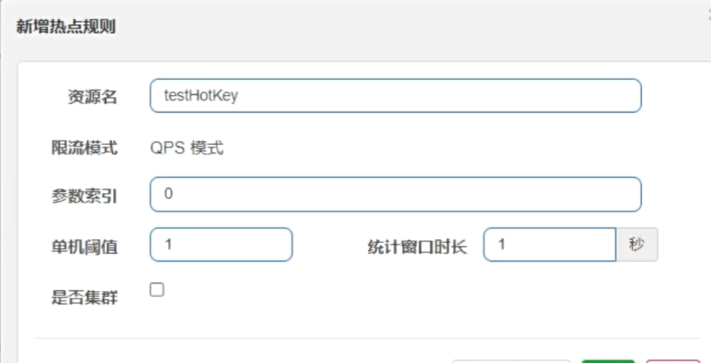

# 一、SpringCloud简介

## 一、SpringCloud版本选型

1. Java：Java17+
2. cloud：2023.0.0
3. boot：3.2.0，cloud版本的选择决定了boot的版本的选型
4. cloud：alibaba：2022.0.0.0-RC2
5. Maven：3.9+
6. MySQL：8.2+

## 二、SpringCould各个组件大纲


1. 服务注册与发现：实现服务治理（服务注册与发现）（核心组件） 
   - Eureka（不推荐使用）
   - Consul
   - Etcd
   - Nacos
2. 服务调用和负载均衡：主要提供客户侧的软件负载均衡算法 （核心组件） 
   - Ribbon（已过时）
   - OpenFeign
   - LoadBalancer
3. 分布式事务
   - Seata
   - LCN
   - Hmily
4. 服务熔断和降级：断路器，保护系统，控制故障范围 （核心组件） 
   - Hystrix（已过时）
   - Circuit Breaker，它仅仅是接口，实现时使用Resikience4J做支撑
   - Sentinel
5. 服务链路追踪
   - Sleuth + Zipkin（已过时）
   - Micrometer Tracing
6. 服务网关：api网关，路由，负载均衡等多种作用 （核心组件） 
   - Zuul（已过时）
   - Gate Way
7. 分布式配置管理：配置管理（核心组件） 
   - Config + Bus（已过时）
   - Consul
   - Naclos

# 二、微服务架构Base工程模块构建

## 一、搭建Maven父工程

1. 创建Maven工程中的新Project，聚合总工程的名字默认为下图中的Name，`GroupId`为`com.atguigu.cloud`

   

2. 字符编码

   

3. 注解生效激活

   

4. Java编译版本选自已的（Java17+）

5. File Type过滤：去掉不想看到的文件

6. 注意Maven版本以及Java版本，先检查一遍

7. 在pom文件中，加上`<packaging>pom</packaging>`则表示此Maven是父类，一般打包方式为pom的是父级项目且不会产生`jar/war`包。如果依赖一致飘红则先把`<dependencyManagement></dependencyManagement>`去掉先下载依赖后再加

   ```xml
   <?xml version="1.0" encoding="UTF-8"?>
   <project xmlns="http://maven.apache.org/POM/4.0.0"
            xmlns:xsi="http://www.w3.org/2001/XMLSchema-instance"
            xsi:schemaLocation="http://maven.apache.org/POM/4.0.0 http://maven.apache.org/xsd/maven-4.0.0.xsd">
       <modelVersion>4.0.0</modelVersion>
   
       <groupId>com.atguigu.cloud</groupId>
       <artifactId>cloud2024</artifactId>
       <version>1.0-SNAPSHOT</version>
       <packaging>pom</packaging>
       <modules>
           <module>mybatis_generator2024</module>
       </modules>
   
       <properties>
           <maven.compiler.source>21</maven.compiler.source>
           <maven.compiler.target>21</maven.compiler.target>
           <project.build.sourceEncoding>UTF-8</project.build.sourceEncoding>
           <hutool.version>5.8.22</hutool.version>
           <lombok.version>1.18.26</lombok.version>
           <druid.version>1.1.20</druid.version>
           <mybatis.springboot.version>3.0.2</mybatis.springboot.version>
           <mysql.version>8.0.11</mysql.version>
           <swagger3.version>2.2.0</swagger3.version>
           <mapper.version>4.2.3</mapper.version>
           <fastjson2.version>2.0.40</fastjson2.version>
           <persistence-api.version>1.0.2</persistence-api.version>
           <spring.boot.test.version>3.1.5</spring.boot.test.version>
           <!--<spring.boot.version>3.2.0</spring.boot.version>
           <spring.cloud.version>2023.0.0</spring.cloud.version>-->
   
           <!--仅为了整合openfeign + alibaba sentinel的案例，降低版本处理下-->
           <!--<spring.boot.version>3.0.9</spring.boot.version>
           <spring.cloud.version>2022.0.2</spring.cloud.version>-->
   
           <!--仅为了整合openfeign + alibaba seata的案例，降低版本处理下-->
           <spring.boot.version>3.1.7</spring.boot.version>
           <spring.cloud.version>2022.0.4</spring.cloud.version>
   
           <spring.cloud.alibaba.version>2022.0.0.0</spring.cloud.alibaba.version>
           <micrometer-tracing.version>1.2.0</micrometer-tracing.version>
           <micrometer-observation.version>1.12.0</micrometer-observation.version>
           <feign-micrometer.version>12.5</feign-micrometer.version>
           <zipkin-reporter-brave.version>2.17.0</zipkin-reporter-brave.version>
       </properties>
   
       <dependencyManagement>
           <dependencies>
               <!--springboot 3.2.0-->
               <dependency>
                   <groupId>org.springframework.boot</groupId>
                   <artifactId>spring-boot-starter-parent</artifactId>
                   <version>${spring.boot.version}</version>
                   <type>pom</type>
                   <scope>import</scope>
               </dependency>
               <!--springcloud 2023.0.0-->
               <dependency>
                   <groupId>org.springframework.cloud</groupId>
                   <artifactId>spring-cloud-dependencies</artifactId>
                   <version>${spring.cloud.version}</version>
                   <type>pom</type>
                   <scope>import</scope>
               </dependency>
               <!--springcloud alibaba 2022.0.0.0-RC2-->
               <dependency>
                   <groupId>com.alibaba.cloud</groupId>
                   <artifactId>spring-cloud-alibaba-dependencies</artifactId>
                   <version>${spring.cloud.alibaba.version}</version>
                   <type>pom</type>
                   <scope>import</scope>
               </dependency>
               <!--SpringBoot集成mybatis-->
               <dependency>
                   <groupId>org.mybatis.spring.boot</groupId>
                   <artifactId>mybatis-spring-boot-starter</artifactId>
                   <version>${mybatis.springboot.version}</version>
               </dependency>
               <!--Mysql数据库驱动8 -->
               <dependency>
                   <groupId>mysql</groupId>
                   <artifactId>mysql-connector-java</artifactId>
                   <version>${mysql.version}</version>
               </dependency>
               <!--SpringBoot集成druid连接池-->
               <dependency>
                   <groupId>com.alibaba</groupId>
                   <artifactId>druid-spring-boot-starter</artifactId>
                   <version>${druid.version}</version>
               </dependency>
               <!--通用Mapper4之tk.mybatis-->
               <dependency>
                   <groupId>tk.mybatis</groupId>
                   <artifactId>mapper</artifactId>
                   <version>${mapper.version}</version>
               </dependency>
               <!--persistence-->
               <dependency>
                   <groupId>javax.persistence</groupId>
                   <artifactId>persistence-api</artifactId>
                   <version>${persistence-api.version}</version>
               </dependency>
               <!-- fastjson2 -->
               <dependency>
                   <groupId>com.alibaba.fastjson2</groupId>
                   <artifactId>fastjson2</artifactId>
                   <version>${fastjson2.version}</version>
               </dependency>
               <!-- swagger3 调用方式 http://你的主机IP地址:5555/swagger-ui/index.html -->
               <dependency>
                   <groupId>org.springdoc</groupId>
                   <artifactId>springdoc-openapi-starter-webmvc-ui</artifactId>
                   <version>${swagger3.version}</version>
               </dependency>
               <!--hutool-->
               <dependency>
                   <groupId>cn.hutool</groupId>
                   <artifactId>hutool-all</artifactId>
                   <version>${hutool.version}</version>
               </dependency>
               <!--lombok-->
               <dependency>
                   <groupId>org.projectlombok</groupId>
                   <artifactId>lombok</artifactId>
                   <version>${lombok.version}</version>
                   <optional>true</optional>
               </dependency>
               <!-- spring-boot-starter-test -->
               <dependency>
                   <groupId>org.springframework.boot</groupId>
                   <artifactId>spring-boot-starter-test</artifactId>
                   <version>${spring.boot.test.version}</version>
                   <scope>test</scope>
               </dependency>
           </dependencies>
       </dependencyManagement>
   
   </project>
   ```

## 二、搭建mybatis_generator工程

1. 搭建一个普通的Maven工程

2. 引入pom文件依赖

   ```xml
   <?xml version="1.0" encoding="UTF-8"?>
   <project xmlns="http://maven.apache.org/POM/4.0.0"
            xmlns:xsi="http://www.w3.org/2001/XMLSchema-instance"
            xsi:schemaLocation="http://maven.apache.org/POM/4.0.0 http://maven.apache.org/xsd/maven-4.0.0.xsd">
       <modelVersion>4.0.0</modelVersion>
       <parent>
           <groupId>org.atguigu.cloud</groupId>
           <artifactId>cloud2024</artifactId>
           <version>1.0-SNAPSHOT</version>
           <relativePath>../pom.xml</relativePath>
       </parent>
   
       <artifactId>mybatis_generator2024</artifactId>
   
       <properties>
           <maven.compiler.source>21</maven.compiler.source>
           <maven.compiler.target>21</maven.compiler.target>
           <project.build.sourceEncoding>UTF-8</project.build.sourceEncoding>
       </properties>
   
       <dependencies>
           <!--Mybatis 通用mapper tk单独使用，自己独有+自带版本号-->
           <dependency>
               <groupId>org.mybatis</groupId>
               <artifactId>mybatis</artifactId>
               <version>3.5.13</version>
           </dependency>
           <!-- Mybatis Generator 自己独有+自带版本号-->
           <dependency>
               <groupId>org.mybatis.generator</groupId>
               <artifactId>mybatis-generator-core</artifactId>
               <version>1.4.2</version>
           </dependency>
           <!--通用Mapper-->
           <dependency>
               <groupId>tk.mybatis</groupId>
               <artifactId>mapper</artifactId>
           </dependency>
           <!--mysql8.0-->
           <dependency>
               <groupId>mysql</groupId>
               <artifactId>mysql-connector-java</artifactId>
           </dependency>
           <!--persistence-->
           <dependency>
               <groupId>javax.persistence</groupId>
               <artifactId>persistence-api</artifactId>
           </dependency>
           <!--hutool-->
           <dependency>
               <groupId>cn.hutool</groupId>
               <artifactId>hutool-all</artifactId>
           </dependency>
           <!--lombok-->
           <dependency>
               <groupId>org.projectlombok</groupId>
               <artifactId>lombok</artifactId>
               <optional>true</optional>
           </dependency>
           <dependency>
               <groupId>org.springframework.boot</groupId>
               <artifactId>spring-boot-starter-test</artifactId>
               <scope>test</scope>
               <exclusions>
                   <exclusion>
                       <groupId>org.junit.vintage</groupId>
                       <artifactId>junit-vintage-engine</artifactId>
                   </exclusion>
               </exclusions>
           </dependency>
       </dependencies>
   
       <build>
           <resources>
               <resource>
                   <directory>${basedir}/src/main/java</directory>
                   <includes>
                       <include>**/*.xml</include>
                   </includes>
               </resource>
               <resource>
                   <directory>${basedir}/src/main/resources</directory>
               </resource>
           </resources>
           <plugins>
               <plugin>
                   <groupId>org.springframework.boot</groupId>
                   <artifactId>spring-boot-maven-plugin</artifactId>
                   <configuration>
                       <excludes>
                           <exclude>
                               <groupId>org.projectlombok</groupId>
                               <artifactId>lombok</artifactId>
                           </exclude>
                       </excludes>
                   </configuration>
               </plugin>
               <plugin>
                   <groupId>org.mybatis.generator</groupId>
                   <artifactId>mybatis-generator-maven-plugin</artifactId>
                   <version>1.4.2</version>
                   <configuration>
                       <configurationFile>${basedir}/src/main/resources/generatorConfig.xml</configurationFile>
                       <overwrite>true</overwrite>
                       <verbose>true</verbose>
                   </configuration>
                   <dependencies>
                       <dependency>
                           <groupId>mysql</groupId>
                           <artifactId>mysql-connector-java</artifactId>
                           <version>8.0.33</version>
                       </dependency>
                       <dependency>
                           <groupId>tk.mybatis</groupId>
                           <artifactId>mapper</artifactId>
                           <version>4.2.3</version>
                       </dependency>
                   </dependencies>
               </plugin>
           </plugins>
       </build>
   
   </project>
   ```

3. 配置JDBC文件

   ```properties
   #t_pay表包名
   package.name=com.atguigu.cloud
   
   # mysql8.0
   jdbc.driverClass = com.mysql.cj.jdbc.Driver
   jdbc.url= jdbc:mysql://localhost:13306/db2024?characterEncoding=utf8&useSSL=false&serverTimezone=GMT%2B8&rewriteBatchedStatements=true&allowPublicKeyRetrieval=true
   jdbc.user = root
   jdbc.password = 282127
   ```

4. 配置mybatis插件生成

   ```xml
   <?xml version="1.0" encoding="UTF-8"?>
   <!DOCTYPE generatorConfiguration
           PUBLIC "-//mybatis.org//DTD MyBatis Generator Configuration 1.0//EN"
           "http://mybatis.org/dtd/mybatis-generator-config_1_0.dtd">
   
   <generatorConfiguration>
       <properties resource="config.properties"/>
   
       <context id="Mysql" targetRuntime="MyBatis3Simple" defaultModelType="flat">
           <property name="beginningDelimiter" value="`"/>
           <property name="endingDelimiter" value="`"/>
   
           <plugin type="tk.mybatis.mapper.generator.MapperPlugin">
               <property name="mappers" value="tk.mybatis.mapper.common.Mapper"/>
               <property name="caseSensitive" value="true"/>
           </plugin>
   
           <!-- 数据库配置 -->
           <jdbcConnection driverClass="${jdbc.driverClass}"
                           connectionURL="${jdbc.url}"
                           userId="${jdbc.user}"
                           password="${jdbc.password}">
           </jdbcConnection>
   
           <!-- 配置config.properties中文件的生成路径 -->
           <javaModelGenerator targetPackage="${package.name}.entities" targetProject="src/main/java"/>
   
           <sqlMapGenerator targetPackage="${package.name}.mapper" targetProject="src/main/java"/>
   
           <javaClientGenerator targetPackage="${package.name}.mapper" targetProject="src/main/java" type="XMLMAPPER"/>
   
           <!--配置想要生成的表名 -->
           <table tableName="t_pay" domainObjectName="Pay">
               <generatedKey column="id" sqlStatement="JDBC"/>
           </table>>
   
       </context>
   </generatorConfiguration>
   
   
   ```

5. 生成文件时，点击maven -> mybatis_generator2024 -> mybatis_generator -> mybatis_generator:generat即可自动生成entitiy和Mapper层的代码文件

## 三、微服务提供者支付工程

1. 构建完整的微服务步骤小口诀

   - 建module
   - 改pom
   - 写yml
   - 主启动
   - 业务类

2. 搭建cloud-provider-payment8001工程

3. 引入pom文件依赖

   ```xml
   <dependencies>
           <dependency>
               <groupId>org.springframework.cloud</groupId>
               <artifactId>spring-cloud-starter-bootstrap</artifactId>
           </dependency>
           <!--SpringCloud consul discovery -->
           <dependency>
               <groupId>org.springframework.cloud</groupId>
               <artifactId>spring-cloud-starter-consul-discovery</artifactId>
               <exclusions>
                   <exclusion>
                       <groupId>commons-logging</groupId>
                       <artifactId>commons-logging</artifactId>
                   </exclusion>
               </exclusions>
           </dependency>
           <!--SpringBoot通用依赖模块-->
           <dependency>
               <groupId>org.springframework.boot</groupId>
               <artifactId>spring-boot-starter-web</artifactId>
           </dependency>
           <dependency>
               <groupId>org.springframework.boot</groupId>
               <artifactId>spring-boot-starter-actuator</artifactId>
           </dependency>
           <!--SpringBoot集成druid连接池-->
           <dependency>
               <groupId>com.alibaba</groupId>
               <artifactId>druid-spring-boot-starter</artifactId>
           </dependency>
           <!-- Swagger3 调用方式 http://你的主机IP地址:5555/swagger-ui/index.html -->
           <dependency>
               <groupId>org.springdoc</groupId>
               <artifactId>springdoc-openapi-starter-webmvc-ui</artifactId>
           </dependency>
           <!--mybatis和springboot整合-->
           <dependency>
               <groupId>org.mybatis.spring.boot</groupId>
               <artifactId>mybatis-spring-boot-starter</artifactId>
           </dependency>
           <!--Mysql数据库驱动8 -->
           <dependency>
               <groupId>mysql</groupId>
               <artifactId>mysql-connector-java</artifactId>
           </dependency>
           <!--persistence-->
           <dependency>
               <groupId>javax.persistence</groupId>
               <artifactId>persistence-api</artifactId>
           </dependency>
           <!--通用Mapper4-->
           <dependency>
               <groupId>tk.mybatis</groupId>
               <artifactId>mapper</artifactId>
           </dependency>
           <!--hutool-->
           <dependency>
               <groupId>cn.hutool</groupId>
               <artifactId>hutool-all</artifactId>
           </dependency>
           <!-- fastjson2 -->
           <dependency>
               <groupId>com.alibaba.fastjson2</groupId>
               <artifactId>fastjson2</artifactId>
           </dependency>
           <!--lombok-->
           <dependency>
               <groupId>org.projectlombok</groupId>
               <artifactId>lombok</artifactId>
               <version>1.18.28</version>
               <scope>provided</scope>
           </dependency>
           <!--test-->
           <dependency>
               <groupId>org.springframework.boot</groupId>
               <artifactId>spring-boot-starter-test</artifactId>
               <scope>test</scope>
           </dependency>
       </dependencies>
   
       <build>
           <plugins>
               <plugin>
                   <groupId>org.springframework.boot</groupId>
                   <artifactId>spring-boot-maven-plugin</artifactId>
               </plugin>
           </plugins>
       </build>
   ```

4. 编写yml文件`application.yml`

   ```yaml
   server:
     port: 8001
   
   # ==========applicationName + druid-mysql8 driver===================
   spring:
     datasource:
       type: com.alibaba.druid.pool.DruidDataSource
       driver-class-name: com.mysql.cj.jdbc.Driver
       url: jdbc:mysql://localhost:3306/db2024?characterEncoding=utf8&useSSL=false&serverTimezone=GMT%2B8&rewriteBatchedStatements=true&allowPublicKeyRetrieval=true
       username: root
       password: 123456
     profiles:
       active: dev # 多环境配置加载内容dev/prod,不写就是默认default配置
   
   # ========================mybatis===================
   mybatis:
     mapper-locations: classpath:mapper/*.xml
     type-aliases-package: com.atguigu.cloud.entities
     configuration:
       map-underscore-to-camel-case: true
   ```

5. 在resources文件夹下添加mapper文件目录，放入mapper文件

6. 编写启动类Main8001，启动类的名称可以随便取，但是也要见名知意，但是一定要放在其他层级代码的顶级，如放在`com.atguigu.cloud`包下，这是SpringBoot的规则

   ```java
   @SpringBootApplication
   @MapperScan("com.atguigu.cloud.mapper")
   //tk.mybatis.spring.annotation.MapperScan可以省略在Mapper层写@Mapper
   public class Main8001 {
   
       public static void main(String[] args) {
           SpringApplication.run(Main8001.class,args);
       }
   }
   ```

7. 将一键生成的代码放入新工程下指定的目录下即可

8. 详谈目录结构

   - entities包：主实体类Pay（必须和数据库字段一一对应）、传递数值PayDTO（用于和页面进行交互，数据传输）
   - mapper包：java目录下的mapper包放mapper接口，resources/mapper下放mapper.xml文件
   - service包：包括service接口以及service接口的实现类，service的实现类一定要加`@Service`，在引入mapper接口时推荐使用`@Resource`
   - controller包：用于接口访问

9. CURD整套输出

   - controller

     ```java
     @RestController
     @RequestMapping("/pay")
     @Slf4j
     public class PayController {
     
         @Resource
         private IPayService payService;
     
         @PostMapping(value = "/addPay")
         public String addPay(@RequestBody Pay pay) {
             int i = payService.add(pay);
             return i > 0 ? "支付成功" : "支付失败";
         }
     
         @DeleteMapping(value = "/deletePay/{id}")
         public String delete(@PathVariable("id") Integer id) {
             int i = payService.delete(id);
             return i > 0 ? "支付删除成功" : "支付删除失败";
         }
     
         @PutMapping(value = "/updatePay")
         public String update(@RequestBody PayDTO payDTO) {
             Pay pay = new Pay();
             BeanUtil.copyProperties(payDTO, pay);
             int i = payService.update(pay);
             return i > 0 ? "支付修改成功" : "支付修改失败";
         }
     
         @GetMapping(value = "/getInfoById/{id}")
         public Map<String, Object> getInfoById(@PathVariable("id") Integer id) {
             Pay pay = payService.getInfoById(id);
             PayDTO payDTO = new PayDTO();
             BeanUtil.copyProperties(pay, payDTO);
             Map<String, Object> map = new HashMap<>();
             map.put("msg", "支付详情");
             map.put("data", payDTO);
             return map;
         }
     
         @GetMapping(value = "/getList")
         public Map<String, Object> getList() {
             List<Pay> payList = payService.getList();
             List<PayDTO> payDTOList = new ArrayList<>();
             for (Pay pay : payList) {
                 PayDTO payDTO = new PayDTO();
                 BeanUtil.copyProperties(pay,payDTO);
                 payDTOList.add(payDTO);
             }
             Map<String, Object> map = new HashMap<>();
             map.put("msg", "支付列表");
             map.put("data", payDTOList);
             return map;
         }
     }
     ```

   - service

     ```java
     public interface IPayService {
     
         public int add(Pay pay);
     
         public int delete(Integer id);
     
         public int update(Pay pay);
     
         public Pay getInfoById(Integer id);
     
         public List<Pay> getList();
     }
     ```

     ```java
     @Service
     public class PayServiceImpl implements IPayService {
     
         @Resource
         private PayMapper payMapper;
     
         @Override
         public int add(Pay pay) {
             return payMapper.insertSelective(pay);
         }
     
         @Override
         public int delete(Integer id) {
             return payMapper.deleteByPrimaryKey(id);
         }
     
         @Override
         public int update(Pay pay) {
             return payMapper.updateByPrimaryKeySelective(pay);
         }
     
         @Override
         public Pay getInfoById(Integer id) {
             return payMapper.selectByPrimaryKey(id);
         }
     
         @Override
         public List<Pay> getList() {
             return payMapper.selectAll();
         }
     }
     ```

   - entities

     ```java
     @Table(name = "t_pay")
     public class Pay {
         /**
          * id
          */
         @Id
         @GeneratedValue(generator = "JDBC")
         private Integer id;
     
         /**
          * 支付流水号
          */
         @Column(name = "pay_no")
         private String payNo;
     
         /**
          * 订单流水号
          */
         @Column(name = "order_no")
         private String orderNo;
     
         /**
          * 用户账号id
          */
         @Column(name = "user_id")
         private Integer userId;
     
         /**
          * 交易金额
          */
         private BigDecimal amount;
     
         /**
          * 删除标识（0不删除；1删除）
          */
         private Byte deleted;
     
         /**
          * 创建时间
          */
         @Column(name = "create_time")
         private Date createTime;
     
         /**
          * 更新时间
          */
         @Column(name = "update_time")
         private Date updateTime;
     
         /**
          * 获取id
          *
          * @return id - id
          */
         public Integer getId() {
             return id;
         }
     
         /**
          * 设置id
          *
          * @param id id
          */
         public void setId(Integer id) {
             this.id = id;
         }
     
         /**
          * 获取支付流水号
          *
          * @return payNo - 支付流水号
          */
         public String getPayNo() {
             return payNo;
         }
     
         /**
          * 设置支付流水号
          *
          * @param payNo 支付流水号
          */
         public void setPayNo(String payNo) {
             this.payNo = payNo;
         }
     
         /**
          * 获取订单流水号
          *
          * @return orderNo - 订单流水号
          */
         public String getOrderNo() {
             return orderNo;
         }
     
         /**
          * 设置订单流水号
          *
          * @param orderNo 订单流水号
          */
         public void setOrderNo(String orderNo) {
             this.orderNo = orderNo;
         }
     
         /**
          * 获取用户账号id
          *
          * @return userId - 用户账号id
          */
         public Integer getUserId() {
             return userId;
         }
     
         /**
          * 设置用户账号id
          *
          * @param userId 用户账号id
          */
         public void setUserId(Integer userId) {
             this.userId = userId;
         }
     
         /**
          * 获取交易金额
          *
          * @return amount - 交易金额
          */
         public BigDecimal getAmount() {
             return amount;
         }
     
         /**
          * 设置交易金额
          *
          * @param amount 交易金额
          */
         public void setAmount(BigDecimal amount) {
             this.amount = amount;
         }
     
         /**
          * 获取删除标识（0不删除；1删除）
          *
          * @return deleted - 删除标识（0不删除；1删除）
          */
         public Byte getDeleted() {
             return deleted;
         }
     
         /**
          * 设置删除标识（0不删除；1删除）
          *
          * @param deleted 删除标识（0不删除；1删除）
          */
         public void setDeleted(Byte deleted) {
             this.deleted = deleted;
         }
     
         /**
          * 获取创建时间
          *
          * @return createTime - 创建时间
          */
         public Date getCreateTime() {
             return createTime;
         }
     
         /**
          * 设置创建时间
          *
          * @param createTime 创建时间
          */
         public void setCreateTime(Date createTime) {
             this.createTime = createTime;
         }
     
         /**
          * 获取更新时间
          *
          * @return updateTime - 更新时间
          */
         public Date getUpdateTime() {
             return updateTime;
         }
     
         /**
          * 设置更新时间
          *
          * @param updateTime 更新时间
          */
         public void setUpdateTime(Date updateTime) {
             this.updateTime = updateTime;
         }
     }
     ```

     ```java
     @Data
     @AllArgsConstructor
     @NoArgsConstructor
     public class PayDTO implements Serializable {
         /**
          * id
          */
         private Integer id;
     
         /**
          * 支付流水号
          */
         private String payNo;
     
         /**
          * 订单流水号
          */
         private String orderNo;
     
         /**
          * 用户账号id
          */
         private Integer userId;
     
         /**
          * 交易金额
          */
         private BigDecimal amount;
     
         /**
          * 删除标识（0不删除；1删除）
          */
         private Byte deleted;
     
         /**
          * 创建时间
          */
         private Date createTime;
     
         /**
          * 更新时间
          */
         private Date updateTime;
     
     }
     ```

   - mapper

     ```java
     public interface PayMapper extends Mapper<Pay> {
     }
     ```

     ```xml
     <?xml version="1.0" encoding="UTF-8"?>
     <!DOCTYPE mapper PUBLIC "-//mybatis.org//DTD Mapper 3.0//EN" "http://mybatis.org/dtd/mybatis-3-mapper.dtd">
     <mapper namespace="com.atguigu.cloud.mapper.PayMapper">
       <resultMap id="BaseResultMap" type="com.atguigu.cloud.entities.Pay">
         <!--
           WARNING - @mbg.generated
         -->
         <id column="id" jdbcType="INTEGER" property="id" />
         <result column="pay_no" jdbcType="VARCHAR" property="payNo" />
         <result column="order_no" jdbcType="VARCHAR" property="orderNo" />
         <result column="user_id" jdbcType="INTEGER" property="userId" />
         <result column="amount" jdbcType="DECIMAL" property="amount" />
         <result column="deleted" jdbcType="TINYINT" property="deleted" />
         <result column="create_time" jdbcType="TIMESTAMP" property="createTime" />
         <result column="update_time" jdbcType="TIMESTAMP" property="updateTime" />
       </resultMap>
     </mapper>
     ```

10. swagger配置

    - 所需依赖

      ```xml
      <!-- swagger3 调用方式 http://你的主机IP地址:5555/swagger-ui/index.html -->
      <dependency>
          <groupId>org.springdoc</groupId>
          <artifactId>springdoc-openapi-starter-webmvc-ui</artifactId>
          <version>${swagger3.version}</version>
      </dependency>
      ```

    - swagger常用注解

      | 注解           | 标注位置          | 作用                   |
      | -------------- | ----------------- | ---------------------- |
      | `@Tag`         | controller类      | 标识controller作用     |
      | `@Parameter`   | 参数              | 标识参数作用           |
      | `@Parameters`  | 参数              | 参数多重说明           |
      | `@Schema`      | model层的JavaBean | 描述模型作用及每个属性 |
      | `Operation`    | 方法              | 描述方法作用           |
      | `@ApiResponse` | 方法              | 描述响应状态码等       |

    - 常用注解添加

      ```java
      @RestController
      @RequestMapping("/pay")
      @Slf4j
      @Tag(name = "支付微服务模块", description = "支付CRUD")
      public class PayController {
      
          @Resource
          private IPayService payService;
      
          @PostMapping(value = "/addPay")
          @Operation(summary = "新增", description = "新增支付流水方法，json做参数")
          public String addPay(@RequestBody @Parameter(name = "支付实体类", description = "封装用于支付的实体类") Pay pay) {
              int i = payService.add(pay);
              return i > 0 ? "支付成功" : "支付失败";
          }
      }
      ```

      ```java
      @Table(name = "t_pay")
      @Schema(name = "支付流水号实体类")
      public class Pay {
          /**
           * id
           */
          @Id
          @GeneratedValue(generator = "JDBC")
          private Integer id;
      
          /**
           * 支付流水号
           */
          @Column(name = "pay_no")
          @Schema(name = "支付流水号")
          private String payNo;
      
          /**
           * 订单流水号
           */
          @Column(name = "order_no")
          @Schema(name = "订单流水号")
          private String orderNo;
      
          /**
           * 用户账号id
           */
          @Column(name = "user_id")
          @Schema(name = "用户账号id")
          private Integer userId;
      
          /**
           * 交易金额
           */
          @Schema(name = "交易金额")
          private BigDecimal amount;
      
          /**
           * 删除标识（0不删除；1删除）
           */
          private Byte deleted;
      
          /**
           * 创建时间
           */
          @Column(name = "create_time")
          private Date createTime;
      
          /**
           * 更新时间
           */
          @Column(name = "update_time")
          private Date updateTime;
      
          /**
           * 获取id
           *
           * @return id - id
           */
          public Integer getId() {
              return id;
          }
      
          /**
           * 设置id
           *
           * @param id id
           */
          public void setId(Integer id) {
              this.id = id;
          }
      
          /**
           * 获取支付流水号
           *
           * @return payNo - 支付流水号
           */
          public String getPayNo() {
              return payNo;
          }
      
          /**
           * 设置支付流水号
           *
           * @param payNo 支付流水号
           */
          public void setPayNo(String payNo) {
              this.payNo = payNo;
          }
      
          /**
           * 获取订单流水号
           *
           * @return orderNo - 订单流水号
           */
          public String getOrderNo() {
              return orderNo;
          }
      
          /**
           * 设置订单流水号
           *
           * @param orderNo 订单流水号
           */
          public void setOrderNo(String orderNo) {
              this.orderNo = orderNo;
          }
      
          /**
           * 获取用户账号id
           *
           * @return userId - 用户账号id
           */
          public Integer getUserId() {
              return userId;
          }
      
          /**
           * 设置用户账号id
           *
           * @param userId 用户账号id
           */
          public void setUserId(Integer userId) {
              this.userId = userId;
          }
      
          /**
           * 获取交易金额
           *
           * @return amount - 交易金额
           */
          public BigDecimal getAmount() {
              return amount;
          }
      
          /**
           * 设置交易金额
           *
           * @param amount 交易金额
           */
          public void setAmount(BigDecimal amount) {
              this.amount = amount;
          }
      
          /**
           * 获取删除标识（0不删除；1删除）
           *
           * @return deleted - 删除标识（0不删除；1删除）
           */
          public Byte getDeleted() {
              return deleted;
          }
      
          /**
           * 设置删除标识（0不删除；1删除）
           *
           * @param deleted 删除标识（0不删除；1删除）
           */
          public void setDeleted(Byte deleted) {
              this.deleted = deleted;
          }
      
          /**
           * 获取创建时间
           *
           * @return createTime - 创建时间
           */
          public Date getCreateTime() {
              return createTime;
          }
      
          /**
           * 设置创建时间
           *
           * @param createTime 创建时间
           */
          public void setCreateTime(Date createTime) {
              this.createTime = createTime;
          }
      
          /**
           * 获取更新时间
           *
           * @return updateTime - 更新时间
           */
          public Date getUpdateTime() {
              return updateTime;
          }
      
          /**
           * 设置更新时间
           *
           * @param updateTime 更新时间
           */
          public void setUpdateTime(Date updateTime) {
              this.updateTime = updateTime;
          }
      }
      ```

    - swagger配置类，新建config/Swagger3Config

      ```java
      @Configuration
      public class Swagger3Config
      {
          @Bean
          public GroupedOpenApi PayApi()
          {
              return GroupedOpenApi.builder().group("支付微服务模块").pathsToMatch("/pay/**").build();
          }
          @Bean
          public GroupedOpenApi OtherApi()
          {
              return GroupedOpenApi.builder().group("其它微服务模块").pathsToMatch("/other/**", "/others").build();
          }
          /*@Bean
          public GroupedOpenApi CustomerApi()
          {
              return GroupedOpenApi.builder().group("客户微服务模块").pathsToMatch("/customer/**", "/customers").build();
          }*/
      
          @Bean
          public OpenAPI docsOpenApi()
          {
              return new OpenAPI()
                      .info(new Info().title("cloud2024")
                              .description("通用设计rest")
                              .version("v1.0"))
                      .externalDocs(new ExternalDocumentation()
                              .description("www.atguigu.com")
                              .url("https://yiyan.baidu.com/"));
          }
      }
      ```

    - 访问地址：`http://主机IP地址:模块端口号/swagger-ui/index.html`

11. 完善时间格式

    - 方法一：使用`@JsonFormat`注解

      ```java
      @JsonFormat(pattern = "yyyy-MM-dd",timezone = "GMT+8")
      @DateTimeFormat(pattern = "yyyy-MM-dd")
      // 两者选择一个即可
      private Date createTime;
      ```

    - 方法二：在application文件中指定配置

      ```yaml
      spring:
        jackson:
          date-format: yyyy-MM-dd
          time-zone: GMT+8
      ```

12. 统一返回值

    - 定义返回标准格式，三大标配

      - code状态码：由后端统一定义各种返回结果的状态码
      - message描述：本次接口调用的结果描述
      - data数据：本次返回的数据

    - 扩展，接口调用时间：timestamp

    - HTTP请求返回的状态码

      | 分类 | 区间      | 分类描述                                       |
      | ---- | --------- | ---------------------------------------------- |
      | 1**  | 100 - 199 | 信息，服务器收到请求，需要请求者继续执行操作   |
      | 2**  | 200 - 299 | 成功，操作被成功接收并处理                     |
      | 3**  | 300 - 399 | 重定向，需要进一步的操作以完成请求             |
      | 4**  | 400 - 499 | 客户端错误，请求包含语法错误或无法完成请求     |
      | 5**  | 500 - 599 | 服务器错误，服务器在处理请求的过程中发生了错误 |

    - 状态码枚举类

      ```java
      @Getter
      public enum ReturnCodeEnum {
      
          // 定义枚举类小口诀
          // 举值 - 构造 - 遍历
      
          // 举值
          RC999("999", "操作xxx失败"),
      
          RC200("200", "操作成功"),
      
          RC201("201", "服务开启降级保护，请稍后再试！"),
      
          RC202("202", "热点参数限流，请稍后再试！"),
      
          RC203("203", "系统规则不满足要求，请稍后再试！"),
      
          RC204("204", "授权规则不通过，请稍后再试！"),
      
          RC401("401", "匿名用户访问无权限资源时的异常"),
      
          RC403("403", "无访问权限，请联系管理员授予权限"),
      
          RC404("404", "404页面找不到的异常"),
      
          RC500("500", "系统异常，请稍后重试"),
      
          RC375("375", "数学运算异常，请稍后重试"),
      
          INVALID_TOKEN("2001", "访问令牌不合法"),
      
          ACCESS_DENIED("2003", "没有权限访问该资源");
      
          // 构造
          // 自定义状态码
          private final String code;
      
          // 自定义描述信息
          private final String msg;
      
          ReturnCodeEnum(String code, String msg) {
              this.code = code;
              this.msg = msg;
          }
      
          // 遍历
          // 传统版本
          public static ReturnCodeEnum getReturnCodeEnumByFor(String code) {
              for (ReturnCodeEnum element : ReturnCodeEnum.values()) {
                  if (element.getCode().equalsIgnoreCase(code)) {
                      return element;
                  }
              }
              return null;
          }
      
          // stream流式计算版本
          public static ReturnCodeEnum getReturnCodeEnumByStream(String code) {
              return Arrays.stream(ReturnCodeEnum.values()).filter(element -> element.getCode().equalsIgnoreCase(code)).findFirst().orElse(null);
          }
      }
      ```

    - 创建统一定义返回对象ResultData

      ```java
      @Data
      @Accessors(chain = true)
      // 开启链式编程   设置chain=true时，setter方法返回的是this（也就是对象自己），
      // 代替了默认的返回值void，直接链式操作对象
      public class ResultData<T> {
      
          private String code;
      
          private String msg;
      
          private T data;
      
          private long timestamp;
      
          public ResultData() {
              this.timestamp = System.currentTimeMillis();
          }
      
          public static <T> ResultData<T> success(T data){
              ResultData resultData = new ResultData();
         resultData.setCode(ReturnCodeEnum.RC200.getCode()).setMsg(ReturnCodeEnum.RC200.getMsg()).setData(data);
              return resultData;
          }
      
          public static <T> ResultData<T> fail(String code,String msg){
              ResultData resultData = new ResultData();
              resultData.setCode(code).setMsg(msg).setData(null);
              return resultData;
          }
      }
      
      ```

    - 完善过后的controller类

      ```java
      @RestController
      @RequestMapping("/pay")
      @Slf4j
      @Tag(name = "支付微服务模块", description = "支付CRUD")
      public class PayController {
      
          @Resource
          private IPayService payService;
      
          @PostMapping(value = "/addPay")
          @Operation(summary = "新增", description = "新增支付流水方法，json做参数")
          public ResultData<String> addPay(@RequestBody @Parameter(name = "支付实体类", description = "封装用于支付的实体类") Pay pay) {
              int i = payService.add(pay);
              String msg = i > 0 ? "支付成功" : "支付失败";
              return ResultData.success(msg);
          }
      
          @DeleteMapping(value = "/deletePay/{id}")
          public ResultData<String> delete(@PathVariable("id") Integer id) {
              int i = payService.delete(id);
              String msg = i > 0 ? "支付删除成功" : "支付删除失败";
              return ResultData.success(msg);
          }
      
          @PutMapping(value = "/updatePay")
          public ResultData<String> update(@RequestBody PayDTO payDTO) {
              Pay pay = new Pay();
              BeanUtil.copyProperties(payDTO, pay);
              int i = payService.update(pay);
              String msg = i > 0 ? "支付修改成功" : "支付修改失败";
              return ResultData.success(msg);
          }
      
          @GetMapping(value = "/getInfoById/{id}")
          public ResultData<PayDTO> getInfoById(@PathVariable("id") Integer id) {
              Pay pay = payService.getInfoById(id);
              PayDTO payDTO = new PayDTO();
              BeanUtil.copyProperties(pay, payDTO);
              return ResultData.success(payDTO);
          }
      
          @GetMapping(value = "/getList")
          public ResultData<List<PayDTO>> getList() {
              List<Pay> payList = payService.getList();
              List<PayDTO> payDTOList = new ArrayList<>();
              for (Pay pay : payList) {
                  PayDTO payDTO = new PayDTO();
                  BeanUtil.copyProperties(pay,payDTO);
                  payDTOList.add(payDTO);
              }
              return ResultData.success(payDTOList);
          }
      }
      ```

13. 全局异常接入返回的标准格式

    - 全局异常处理器的好处：不用再手写`try...catch`，当前二者并无冲突

    - 创建全局异常类

      ```java
      @Slf4j
      @RestControllerAdvice
      public class GlobalExceptionHandler {
      
          @ExceptionHandler(RuntimeException.class)
          @ResponseStatus(HttpStatus.INTERNAL_SERVER_ERROR)
          public ResultData<String> exception(Exception e){
              log.info("全局异常信息：{}",e.getMessage(),e);
              return ResultData.fail(ReturnCodeEnum.RC500.getCode(), e.getMessage());
          }
      }
      ```

    - `@RestControllerAdvice`的作用

      - 当我们在类上使用`@RestControllerAdvice`注解时，它相当于同时使用了`@ControllerAdvice`和`@ResponseBody`。这意味着被`@RestControllerAdvice`注解标记的类将被视为全局异常处理器，并且异常处理方法的返回值将以JSON格式直接写入响应体中
      - 通过在`@RestControllerAdvice`类中定义异常处理方法，我们可以捕获和处理控制器中抛出的异常，提供自定义的异常处理逻辑，以及返回适当的响应给客户端。这样可以统一处理应用程序中的异常情况，提高代码的可维护性和可读性

## 四、微服务消费者消费工程

1. 搭建cloud-consumer-order80工程

2. 引入pom文件依赖

   ```xml
   <dependencies>
           <!--web + actuator-->
           <dependency>
               <groupId>org.springframework.boot</groupId>
               <artifactId>spring-boot-starter-web</artifactId>
           </dependency>
           <dependency>
               <groupId>org.springframework.boot</groupId>
               <artifactId>spring-boot-starter-actuator</artifactId>
           </dependency>
           <!--lombok-->
           <dependency>
               <groupId>org.projectlombok</groupId>
               <artifactId>lombok</artifactId>
               <optional>true</optional>
           </dependency>
           <!--hutool-all-->
           <dependency>
               <groupId>cn.hutool</groupId>
               <artifactId>hutool-all</artifactId>
           </dependency>
           <!--fastjson2-->
           <dependency>
               <groupId>com.alibaba.fastjson2</groupId>
               <artifactId>fastjson2</artifactId>
           </dependency>
           <!-- swagger3 调用方式 http://你的主机IP地址:5555/swagger-ui/index.html -->
           <dependency>
               <groupId>org.springdoc</groupId>
               <artifactId>springdoc-openapi-starter-webmvc-ui</artifactId>
           </dependency>
       </dependencies>
   
       <build>
           <plugins>
               <plugin>
                   <groupId>org.springframework.boot</groupId>
                   <artifactId>spring-boot-maven-plugin</artifactId>
               </plugin>
           </plugins>
       </build>
   ```

3. 编写yml文件`application.yml`

   ```yaml
   server:
     port: 80
   ```

4. 配置RestTemplate

   - RestTemplate的作用：RestTemplate提供了多种便捷访问远程http服务的方法；RestTemplate是一种简单便捷的访问restful服务模板类，是Spring提供的用于访问Rest服务的客户端模板工具类

   - RestTemplate的使用时常用的三个参数

     - url：REST请求地址
     - requestMap：请求参数
     - ResponseBean.class：http响应转换被转换成的对象类型

   - RestTemplate常用的方法

     - *xxxForObject`：返回对象为响应体中数据转化成的对象，基本上可以理解为JSON
     - `xxxForEntity`：返回对象为ResponseEntity对象，包含了响应中的一些重要信息，比如响应头、响应状态码、响应体等

   - 创建RestTemplate的配置类

     ```java
     @Configuration
     public class RstTemplateConfig {
     
         @Bean
         public RestTemplate restTemplate(){
             return new RestTemplate();
         }
     }
     ```

   - 消费者CRUD

     ```javascript
     @RestController
     @RequestMapping("/consumer")
     public class OrderController {
     
         public static final String PAY_SERVICE_URL = "http://localhost:8001/pay";
     
         @Resource
         private RestTemplate restTemplate;
     
         @PostMapping(value = "/addPay")
         public ResultData addOrder(@RequestBody PayDTO payDTO) {
             return restTemplate.postForObject(PAY_SERVICE_URL + "/addPay", payDTO, ResultData.class);
         }
     
         @PutMapping(value = "/updatePay")
         public ResultData updateOrder(@RequestBody PayDTO payDTO) {
             restTemplate.put(PAY_SERVICE_URL + "/updatePay", payDTO);
             return ResultData.success("修改成功");
         }
     
         @DeleteMapping(value = "/deletePay/{id}")
         public ResultData deletePay(@PathVariable("id") Integer id) {
             restTemplate.delete(PAY_SERVICE_URL + "/deletePay/" + id);
             return ResultData.success("删除成功");
         }
     
         @GetMapping(value = "/getInfoById/{id}")
         public ResultData getInfoById(@PathVariable("id") Integer id) {
             return restTemplate.getForObject(PAY_SERVICE_URL + "/getInfoById/" + id, ResultData.class, id);
         }
     
         @GetMapping(value = "/getList")
         public ResultData getList() {
             return restTemplate.getForObject(PAY_SERVICE_URL + "/getList", ResultData.class);
         }
     }
     
     ```

## 五、搭建公共工程

1. 搭建普通的cloud-api-commons工程，并不需要启动类

2. 引入依赖

   ```xml
   <dependencies>
           <!--web + actuator-->
           <dependency>
               <groupId>org.springframework.boot</groupId>
               <artifactId>spring-boot-starter-web</artifactId>
           </dependency>
           <dependency>
               <groupId>org.springframework.boot</groupId>
               <artifactId>spring-boot-starter-actuator</artifactId>
           </dependency>
           <dependency>
               <groupId>org.projectlombok</groupId>
               <artifactId>lombok</artifactId>
               <optional>true</optional>
           </dependency>
           <!--hutool-->
           <dependency>
               <groupId>cn.hutool</groupId>
               <artifactId>hutool-all</artifactId>
           </dependency>
       </dependencies>
   
       <build>
           <plugins>
               <plugin>
                   <groupId>org.springframework.boot</groupId>
                   <artifactId>spring-boot-maven-plugin</artifactId>
               </plugin>
           </plugins>
       </build>
   ```

3. 提取共用类`PayDTO`、`GlobalExceptionHandler`、`ResultData`、`ReturnCodeEnum`，并将原来共同的包删除掉

4. 使用maven命令`mvn clean install`将cloud-api-commons工程打包

5. 在其他模块引入cloud-api-commons的jar包

   ```xml
   <!-- 引入自己定义的api通用包 -->
   <dependency>
       <groupId>com.atguigu.cloud</groupId>
       <artifactId>cloud-api-commons</artifactId>
       <version>1.0-SNAPSHOT</version>
   </dependency>
   ```

# 三、Consul服务注册与发现

## 一、Consul简介

1. [Consul官网](https://www.consul.io/)
2. Consul的定位：Consul是一个服务网络解决方案，它使团队能够管理服务之间以及跨本地和多云环境和运行时的安全网络连接。Consul提供服务发现、服务网格、流量管理和对网络基础设施设备的自动更新。可以单独使用这些功能，也可以在单个Consul部署中一起使用。Consul是一套开源的分布式服务发现和配置管理系统，由Go语言开发
3. Consul的作用
   - 服务发现：提供HTTP和DNS两种发现方式
   - 健康监测：支持多种方式，HTPP、TCP、Docker、Shell脚本定制等
   - KV存储：key、value的存储方式
   - 多数据中心：支持多数据中心
   - 可视化Web界面

## 二、安装并运行Consul

1. [Consul官网下载路径](https://developer.hashicorp.com/consul/install?product_intent=consul)
2. 解压后文件中仅有`consul.exe`文件，在`cmd`的切换到解压后的路径执行`consul -version`显示版本号即下载安装成功
3. 启动命令为`consul agent -dev`
4. 访问地址为`http://localhost:8500/`。在页面Services目录中显示consul为绿标即为启动正常

## 三、微服务服务注册Consul

1. 消费者和支付提供者两个工程中引入依赖

   ```xml
   <!--SpringCloud consul discovery -->
   <dependency>
       <groupId>org.springframework.cloud</groupId>
       <artifactId>spring-cloud-starter-consul-discovery</artifactId>
       <exclusions>
           <exclusion>
               <groupId>commons-logging</groupId>
               <artifactId>commons-logging</artifactId>
           </exclusion>
       </exclusions>
   </dependency>
   ```

2. 消费者和支付提供者两个工程中更改`application.yaml`文件中的配置信息

   ```yaml
   spring:
     application:
       name: cloud-consumer-service
     cloud:
       consul:
         host: localhost
         port: 8500
         discovery:
           service-name: ${spring.application.name}
           
           
   spring:
     application:
       name: cloud-payment-service
     cloud:
       consul:
         host: localhost
         port: 8500
         discovery:
           service-name: ${spring.application.name}
   ```

3. 消费者和支付提供者两个工程的主启动类中添加`@EnableDiscoveryClient`即可开启服务发现

4. 在Consul页面中显示两个微服务绿标即为服务发现成功

5. 修改`OrderController`中主机调用地址

   ```java
   //    public static final String PAY_SERVICE_URL = "http://localhost:8001/pay";
   public static final String PAY_SERVICE_URL = "http://cloud-payment-service/pay";
   ```

6. 由于Consul默认支持负载均衡，微服务是集群的，所以需要在RestTemplate的配置类中添加`@LoadBalanced`以支持负载均衡

7. 正常访问消费支付等url地址即可

## 四、CAP理论

1. CAP概念

   - C，Consistency，即强一致性
   - A，Availability，即可用性
   - P，Partition tolerance，即分区容错性

2. 经典CAP

   - 最多只能同时满足较好的两个
   - CAP理论的核心是，一个分布式系统不可能同时很好的满足一致性、可用性和分区容错性。因此，根据CAP原理将NoSQL数据库分成了满足CA原则、满足CP原则和满足AP原则三大类
     - CA，即单点集群，满足一致性，可用性的系统，通常在可扩展性上不太强大。当网络分区出现后，为了保证一致性，就必须
     - CP，即满足一致性，分区容错性的系统，通常性能不是特别高。当网络分区出现后，为了保证系统A与系统B 一致性，就必须拒绝请求，否则无法保证一致性，此时系统会返回错误码或错误信息。Consul遵循CP原则，保证了强一致性和分区容错性，且使用的是Raft算法，比zookeeper使用的Paxos算法更加简单。虽然保证了强一致性，但是可用性就相应下降了，例如服务注册的时间会稍微长一点，例如服务注册的时间会稍微长一些，因为Consul的Raft协议要求必须过半数的节点都写入成功才认为注册成功；在leader挂掉之后，重新选举出leader之前会导致Consul服务不可用
     - AP，即满足可用性，分区容错性的系统，通常可能对一致性要求低一些。如Eureka组件有系统A和系统B，当网络分区出现后，为了保证可用性，系统B可以返回旧值，保证系统的可用性。当数据出现不一致时，虽然A、B上的注册信息不完全相同，但每个Eureka节点依然能够正常对外提供服务，这会出现查询服务信息时如果请求A查不到，但请求B就能查到，即返回旧值。如此保证了可用性但牺牲了一致性结论，违背了一致性C的要求

3. 主流注册中心异同点

   | 组件名    | 语言 | CAP  | 服务健康检查 | 对外暴露接口 | SpringCloud集成与否 |
   | --------- | ---- | ---- | ------------ | ------------ | ------------------- |
   | Eureka    | Java | AP   | 可配支持     | HTTP         | 是                  |
   | Consul    | Go   | CP   | 支持         | HTTP/DNS     | 是                  |
   | Zookeeper | Java | CP   | 支持         | 客户端       | 是                  |

## 五、微服务服务配置Consul

1. 需求：通用全局配置信息，直接注册进Consul服务器

2. 消费者和支付提供者两个工程中引入依赖

   ```xml
   <!--SpringCloud consul config -->
   <dependency>
       <groupId>org.springframework.cloud</groupId>
       <artifactId>spring-cloud-starter-consul-config</artifactId>
   </dependency>
   <dependency>
       <groupId>org.springframework.cloud</groupId>
       <artifactId>spring-cloud-starter-bootstrap</artifactId>
   </dependency>
   ```

3. `bootstrap.yaml`和`application.yaml`的联系与区别：

   - `application.yaml`是用户级别的资源配置项
   - `bootstrap.yaml`是系统级的，优先级更高
   - `Bootstrap`属性有高优先级，默认情况下不会被本地配置覆盖。`Bootstrap context`和`Application context`有些不同的约定，所以新增一个`bootstrap.yaml`文件，保证`Bootstrap context`和`Application context`配置的分离
   - 一般情况下两种配置文件共存即可

4. 更改后`bootstrap.yaml`和`application.yaml`的内容

   - `application.yaml`

   ```yaml
   #cloud-payment-service
   server:
     port: 8001
   
   spring:
     datasource:
       type: com.alibaba.druid.pool.DruidDataSource
       driver-class-name: com.mysql.cj.jdbc.Driver
       url: jdbc:mysql://localhost:13306/db2024?characterEncoding=utf8&useSSL=false&serverTimezone=GMT%2B8&rewriteBatchedStatements=true&allowPublicKeyRetrieval=true
       username: root
       password: 282127
     # 多环境配置加载内容dev/prod,不写就是默认default配置
     profiles:
       active: default
     jackson:
       date-format: yyyy-MM-dd
       time-zone: GMT+8
   
   mybatis:
     mapper-locations: classpath:mapper/*.xml
     type-aliases-package: com.atguigu.cloud.entities
     configuration:
       map-underscore-to-camel-case: true
   
   
   # cloud-consumer-service
   server:
     port: 80
   ```

   - `bootstrap.yaml`

   ```yaml
   spring:
     application:
       name: cloud-payment-service
     cloud:
       consul:
         host: localhost
         port: 8500
         discovery:
           service-name: ${spring.application.name}
         config:
           profile-separator: '-'
           format: yaml
           
           
   spring:
     application:
       name: cloud-consumer-service
     cloud:
       consul:
         host: localhost
         port: 8500
         discovery:
           service-name: ${spring.application.name}
         config:
           profile-separator: '-'
           format: yaml
   ```

5. Consul服务器key/value配置填写

   - 在Consul页面key/value目录下创建`config/`文件夹，必须是这个名称

   - 在`config/`文件夹下创建`cloud-payment-service/`、`cloud-payment-service-dev/`、`cloud-payment-service-prod/`

   - `cloud-payment-service/`、`cloud-payment-service-dev/`、`cloud-payment-service-prod/`三个文件夹下分别创建data文件，data不再是文件夹

   - data的内容暂时写入以下内容

     ```yaml
     atguigu:
      info: welcome to my prod world
     # 此处不能使用Tab，使用一个空格即可
     ```

   - 获取Consul内容

     ```java
      @GetMapping(value = "/getInfoByConsul")
      public String getInfoByConsul(@Value("${atguigu.info}") String info) {
      	return port + "：info" + info;
      }
     ```

   - 当改变`application.yaml`中的`profiles.active`环境时，会自动根据`profiles.active`读取Consul中`cloud-payment-service/`、`cloud-payment-service-dev/`、`cloud-payment-service-prod/`相匹配的文件夹下的data内容

## 六、微服务动态刷新Consul

1. 需求：在Consul的key/value目录中修改了内容，能让各个服务都能立马刷新得到新的内容

2. 在主启动类中添加`@RefreshScope`实现动态刷新，如果不添加此注解，在修改完key/value的内容之后也会默认在55秒后进行刷新

   - `@RefreshScope`将这个注解加在需要动态刷新的Bean上，当一个Bean被`@RefreshScope`注解后，Spring容器会在监测到配置变动时重新实例化该Bean，并且注入最新的配置信息，这样就实现了配置的热更新 
   - 通常情况下，这个Bean还有个属性被`@Value`注解了，这样，当配置发生变化时，`@Value`注解会重新注入最新的配置值
   - 对于使用了`@Value`注解的类，不需要显式添加`@RefreshScope`注解，因为被`@Value`注解的属性值会在配置发生变化时自动更新，而对于其它没有使用`@Value`注解的类，比如只使用了`@Autowired`或者`@Resource`，那么就需要添加`@RefreshScope`注解 

3. 在`application.yaml`配置类中添加`wait-time`，最好不修改

   ```yaml
   spring:
     application:
       name: cloud-payment-service
     cloud:
       consul:
         host: localhost
         port: 8500
         discovery:
           service-name: ${spring.application.name}
         config:
           profile-separator: '-'
           format: yaml
           watch:
             wait-time: 10
   ```

## 七、Consul持久化

1. 在Consul解压文件下创建mydata文件夹

2. 在Consul解压文件下创建consul_start.bat，后缀名为.bat

   ```shell
   @echo.服务启动......  
   @echo off  
   @sc create Consul binpath= "D:\Program Files\consul-1.17\consul.exe agent -server -ui -bind=127.0.0.1 -client=0.0.0.0 -bootstrap-expect  1  -data-dir D:\Program Files\consul-1.17\mydata"
   @net start Consul
   @sc config Consul start= AUTO  
   @echo.Consul start is OK......success
   @pause
   ```

3. 右击选择管理员运行此consul_start.bat文件即可实现自启动

# 四、LoadBalancer负载均衡服务调用

## 一、负载均衡概述

1. LB，即负载均衡（Load Balancer），是高并发、高可用系统必不可少的关键组件，其目标是尽力将网络流量平均分发到多个服务器上，以提高系统整体的响应速度和可用性 
2. SpringCloud Balancer是由SpringCloud官方提供的一个开源的、简单易用的客户端负载均衡，它包含在SpringCloud-commons中用它来替代以前的Ribbon。相对于Ribbon，SpringCloud Balancer不仅能够支持RestTemplate，还支持WebClient（WeClient是Spring Web Flux中提供的功能，可以实现响应式异步请求）
3. 客户端负载均衡VS服务端负载均衡
   - Nginx是服务器负载均衡，客户端所有请求都会交给nginx，然后由nginx实现转发请求，即负载均衡是由服务端实现的。服务器充当指挥员，在请求过来的时候进行分配
   - loadbalancer本地负载均衡，在调用微服务接口时候，会在注册中心上获取注册信息服务列表之后缓存到JVM本地，从而在本地实现RPC远程服务调用技术。客户端自己有眼力价，自己看着哪个服务器不忙就去找哪个
4. 负载均衡算法分类
   - 轮询：将请求按顺序轮流地分配到每个节点上，不关心每个节点实际的连接数和当前的系统负载。优点是简单高效，易于水平扩展，每个节点满足字面意义上的均衡；缺点是没有考虑机器的性能问题，集群性能瓶颈更多的会受性能差的服务器影响。轮询的算法公式为rest接口第几次请求数%服务器集群总数量 = 实际调用服务器位置下标，每次服务重启后rest接口计数从1开始
   - 随机：将请求随机分配到各个节点。由概率统计理论得知，随着客户端调用服务端的次数增多，其实际效果越来越接近于平均分配，也就是轮询的结果 
   - 最小连接数法：根据每个节点当前的连接情况，动态地选取其中当前积压连接数最少的一个节点处理当前请求，尽可能地提高后端服务的利用效率，将请求合理地分流到每一台服务器。优点是动态，根据节点状况实时变化； 缺点是 提高了复杂度，每次连接断开需要进行计数
   - 最快响应速度法：根据请求的响应时间，来动态调整每个节点的权重，将响应速度快的服务节点分配更多的请求，响应速度慢的服务节点分配更少的请求，俗称能者多劳，扶贫救弱。优点是动态，实时变化，控制的粒度更细，更灵敏；缺点是复杂度更高，每次需要计算请求的响应速度  
   - 观察模式法：观察者模式是综合了最小连接数和最快响应度，同时考量这两个指标数，进行一个权重的分配  
   - 源地址哈希：根据客户端的IP地址，通过哈希计算得到一个数值，用该数值对服务器节点数进行取模，得到的结果便是要访问节点序号。采用源地址哈希法进行负载均衡，同一IP地址的客户端，当后端服务器列表不变时，它每次都会落到到同一台服务器进行访问。优点是相同的IP每次落在同一个节点，可以人为干预客户端请求方向；缺点是如果某个节点出现故障，会导致这个节点上的客户端无法使用，无法保证高可用。当某一用户成为热点用户，那么会有巨大的流量涌向这个节点，导致冷热分布不均衡，无法有效利用起集群的性能。所以当热点事件出现时，一般会将源地址哈希法切换成轮询法   
   - 一致性哈希：主要的特点就是Hash环，我们的请求可以构建成一个Hash环，按照顺时针记录hash和请求。当我们的服务挂了A时，我们只需要将A的请求交给A后面的B处理；当我们需要增加服务器C时，我们只需要在Hash环上划一块范围，然后交给C；这样就可以实现动态的扩容和缩容。一致性哈希用于解决分布式缓存系统中的节点选择和在增删服务器后，节点减少带来的数据缓存的消失与重新分配问题

## 二、LoadBalancer工作流程

1. 先选择ConsulServer从服务端查询并拉取服务列表，知道了它有多少个服务（每个服务的实现是完全一样的），默认轮询调用谁都可以正常执行。类似生活中的求医挂号，某个科室今日出诊的全部医生，客户端自己选一个
2. 按照指定的负载均衡策略从server取到的服务注册列表中由客户端自己选择一个地址。所以LoadBalancer是一个客户端的负载均衡器

## 三、LoadBalancer的实现

1. LoadBalancer只是相当于一个接口，实现它的方式有多种
   - RestTemplate
   - RestClient
   - WebClient
   - WebFlux WebClient with ReactorLoadBalancerExchangeFilterFunction
   
2. 完全将cloud-provider-payment8001复制一遍，新搭建一个cloud-provider-payment8002工程

3. 在消费者客户端工程中引入依赖

   ```xml
   <dependency>
   	<groupId>org.springframework.cloud</groupId>
   	<artifactId>spring-cloud-starter-loadbalancer</artifactId>
   </dependency>
   ```

4. 在消费者客户端工程`RestTemplateConfig`配置类中添加`@LoadBalanced`注解

   ```java
   @Configuration
   public class RestTemplateConfig {
   
       @Bean
       @LoadBalanced
       public RestTemplate restTemplate(){
           return new RestTemplate();
       }
   }
   ```

5. 在消费者客户端工程的controller包中添加如下方法

   ```java
   @GetMapping(value = "/getInfoByConsul")
   public String getInfoByConsul() {
   	return restTemplate.getForObject(PAY_SERVICE_URL + "/getInfoByConsul", String.class);
   }
   ```

6. 访问此地址的时间即可在采用轮询的方式进行服务的调用

7. 修改LoadBalancer的负载均衡算法的实现方式

   ```java
   @Configuration
   @LoadBalancerClient(value = "cloud-payment-service", configuration = RestTemplateConfig.class)
   // value指出具体的微服务采用非默认的负载均衡算法
   public class RestTemplateConfig {
   
       @Bean
       @LoadBalanced
       public RestTemplate restTemplate() {
           return new RestTemplate();
       }
   
       @Bean
       public ReactorLoadBalancer<ServiceInstance> randomLoadBalancer(Environment environment,
        LoadBalancerClientFactory loadBalancerClientFactory) {
           String name = environment.getProperty(LoadBalancerClientFactory.PROPERTY_NAME);
           return new RandomLoadBalancer(loadBalancerClientFactory.getLazyProvider(name, ServiceInstanceListSupplier.class), name);
       }
   }
   ```

# 五、OpenFeign服务接口调用

## 一、OpenFeign简介

1. Feign是一个声明性Web服务客户端，它使用编写Web服务客户端变得更容易。使用Feign创建一个接口并对其进行注释。在使用Feign时提供负载均衡的http客户端。简而言之，使用时只需要创建一个Rest接口并在该接口上添加`@FeignClient`即可。OpenFeign基本上就是当前微服务之间调用的事实标准
2. OpenFeign的作用
   - 可插拔的注解支持，包括Feign注解和JAX-RS注解
   - 支持可插拔的HTTP编码器和解码器
   - 支持Sentinel和它的Fallback，用于降级
   - 支持SpringCloud LoadBalancer的负载均衡
   - 支持HTTP请求和相应的压缩
   - OpenFeign是一种声明式、模板化的HTTP客户端，它使得调用RESTful网络服务变得简单。在Spring Cloud中使用OpenFeign，可以做到像调用本地方法一样使用HTTP请求访问远程服务，开发者无需关注远程HTTP请求的细节 
   - OpenFeign的Spring应用架构一般分为三部分，分别是注册中心、服务提供者和服务消费者。服务提供者向服务注册中心注册自己，然后服务消费者通过OpenFeign发送请求时，OpenFeign会向服务注册中心获取关于服务提供者的信息，然后再向服务提供者发送网络请求 

## 二、OpenFeign的使用


1. 搭建cloud-consumer-feign-order80工程

2. 在cloud-consumer-feign-order80工程中引入依赖

   ```xml
   <dependencies>
           <!--web + actuator-->
           <dependency>
               <groupId>org.springframework.boot</groupId>
               <artifactId>spring-boot-starter-web</artifactId>
           </dependency>
           <dependency>
               <groupId>org.springframework.boot</groupId>
               <artifactId>spring-boot-starter-actuator</artifactId>
           </dependency>
           <!--lombok-->
           <dependency>
               <groupId>org.projectlombok</groupId>
               <artifactId>lombok</artifactId>
               <optional>true</optional>
           </dependency>
           <!--hutool-all-->
           <dependency>
               <groupId>cn.hutool</groupId>
               <artifactId>hutool-all</artifactId>
           </dependency>
           <!--fastjson2-->
           <dependency>
               <groupId>com.alibaba.fastjson2</groupId>
               <artifactId>fastjson2</artifactId>
           </dependency>
           <!-- swagger3 调用方式 http://你的主机IP地址:5555/swagger-ui/index.html -->
           <dependency>
               <groupId>org.springdoc</groupId>
               <artifactId>springdoc-openapi-starter-webmvc-ui</artifactId>
           </dependency>
           <!-- 引入自己定义的api通用包 -->
           <dependency>
               <groupId>com.atguigu.cloud</groupId>
               <artifactId>cloud-api-commons</artifactId>
               <version>1.0-SNAPSHOT</version>
           </dependency>
           <!--SpringCloud consul discovery -->
           <dependency>
               <groupId>org.springframework.cloud</groupId>
               <artifactId>spring-cloud-starter-consul-discovery</artifactId>
               <exclusions>
                   <exclusion>
                       <groupId>commons-logging</groupId>
                       <artifactId>commons-logging</artifactId>
                   </exclusion>
               </exclusions>
           </dependency>
           <!--SpringCloud consul config -->
           <dependency>
               <groupId>org.springframework.cloud</groupId>
               <artifactId>spring-cloud-starter-consul-config</artifactId>
           </dependency>
           <dependency>
               <groupId>org.springframework.cloud</groupId>
               <artifactId>spring-cloud-starter-bootstrap</artifactId>
           </dependency>
           <dependency>
               <groupId>org.springframework.cloud</groupId>
               <artifactId>spring-cloud-starter-openfeign</artifactId>
           </dependency>
       </dependencies>
   
       <build>
           <plugins>
               <plugin>
                   <groupId>org.springframework.boot</groupId>
                   <artifactId>spring-boot-maven-plugin</artifactId>
               </plugin>
           </plugins>
       </build>
   ```

3. cloud-consumer-feign-order80工程中`bootstrap.yml`文件中配置如下

   ```yaml
   spring:
     application:
       name: cloud-consumer-service
     cloud:
       consul:
         host: localhost
         port: 8500
         discovery:
           service-name: ${spring.application.name}
           prefer-ip-address: true #优先使用服务ip进行注册
         config:
           profile-separator: '-'
           format: yaml
     # 如果启动报错，则加上以下代码解决The bean ‘xxxx.FeignClientSpecification‘ could not be registered   # 的问题。allow-bean-definition-overriding用于允许覆盖已经定义的bean定义
     main:
       allow-bean-definition-overriding: true
   ```

4. cloud-consumer-feign-order80工程启动类中添加注解并将cloud-consumer-order80的代码复制到cloud-consumer-feign-order80中并将RestTemplate配置类删除

   ```java
   @SpringBootApplication
   @EnableFeignClients
   // 启动feign客户端，定义服务+绑定接口，以声明式的方法优雅而简单的实现服务调用
   @EnableDiscoveryClient
   // 该注解用于向使用consul为注册中心时注册服务
   public class OpenFeignMain80 {
   
       public static void main(String[] args) {
           SpringApplication.run(OpenFeignMain80.class,args);
       }
   }
   ```

5. cloud-consumer-feign-order80工程中修改OrderController

   ```java
   @RestController
   @RequestMapping("/feign/pay")
   public class OrderController {
   
       @Resource
       private PayFeignApi payFeignApi;
   
       @PostMapping(value = "/addPay")
       public Result<Integer> addPay(@RequestBody PayDTO payDTO) {
           return payFeignApi.addPay(payDTO);
       }
   
       @DeleteMapping(value = "/deletePay/{id}")
       public Result<Integer> deletePay(@PathVariable("id") Integer id) {
           return payFeignApi.deletePay(id);
       }
   
       @PutMapping(value = "/updatePay")
       public Result<Integer> updatePay(@RequestBody PayDTO payDTO) {
           return payFeignApi.updatePay(payDTO);
       }
   
       @GetMapping(value = "/getInfoById/{id}")
       public Result<PayDTO> getInfoById(@PathVariable("id") Integer id) {
           return payFeignApi.getById(id);
       }
   
       @GetMapping(value = "/getList")
       public Result<List<PayDTO>> getList() {
           return payFeignApi.getAll();
       }
   
       @GetMapping(value = "/getInfoByConsul")
       public Result<String> getInfoByConsul() {
           return payFeignApi.getInfoByConsul();
       }
   }
   ```

6. 修改cloud-api-commons工程，将Feign接口定义在此。引入OpenFeign依赖

   ```xml
   <dependency>
   	<groupId>org.springframework.cloud</groupId>
   	<artifactId>spring-cloud-starter-openfeign</artifactId>
   </dependency>
   ```

7. cloud-api-commons工程中新建apis文件夹存放各个微服务的api接口，以支付接口为例

   ```java
   @FeignClient(value = "cloud-payment-service")
   // @RequestMapping("/pay")
   // 千万不要在interface上写@RequestMapping
   public interface PayFeignApi {
   
       @PostMapping(value = "/pay/addPay")
       public ResultData<String> addPay(@RequestBody PayDTO pay);
   
       @DeleteMapping(value = "/pay/deletePay/{id}")
       public ResultData<String> deletePay(@PathVariable("id") Integer id);
   
       @PutMapping(value = "/pay/updatePay")
       public ResultData<String> updatePay(@RequestBody PayDTO payDTO);
   
       @GetMapping(value = "/pay/getInfoById/{id}")
       public ResultData<PayDTO> getInfoById(@PathVariable("id") Integer id);
   
       @GetMapping(value = "/pay/getList")
       public ResultData<List<PayDTO>> getList();
   
       @GetMapping(value = "/pay/getInfoByConsul")
       public String getInfoByConsul();
   }
   ```

9. 测试时不需要启动原来的cloud-consumer-order80工程。即使不启动cloud-api-commons工程也会调用到接口，因为 类似于以前Dao接口上标注mapper注解，现在是一个微服务接口上面标注一个Feign注解即可对服务提供方的接口绑定， 如果对某个接口定义了`@FeignClient`注解，Feign就会针对这个接口创建一个动态代理， 要是调用那个接口，本质就是会调用Feign创建的动态代理，Feign的动态代理会根据你在接口上的`@RequestMapping`等注解，来动态构造出你要请求的服务的地址，然后构建请求，构造参数，发送请求，接受请求，解析返回值等

## 三、OpenFeign的高级特性

### 一、OpenFeign之超时控制

1. OpenFeign默认等待时间是60秒钟，超过后会报错

2. ymal文件中开启配置：`connectTimeout`即连接超时时间和`readTimeout`即请求处理超时时间

   - 全局配置

     ```yaml
     spring:
       application:
         name: cloud-consumer-feign-service
       cloud:
         consul:
           host: localhost
           port: 8500
           discovery:
             service-name: ${spring.application.name}
             prefer-ip-address: true #优先使用服务ip进行注册
           config:
             profile-separator: '-'
             format: yaml
         openfeign:
           client:
             config:
               #设置的全局超时时间，指定服务名称可以设置单个服务的超时时间
               #为cloud-payment-service设置全局变量，则把default改为cloud-payment-service即可
               default:
               	#连接超时时间
                 connect-timeout: 20000
                 #读取超时时间
                 read-timeout: 20000
       main:
         allow-bean-definition-overriding: true
     ```

   - 指定配置

     ```yaml
     spring:
       application:
         name: cloud-consumer-feign-service
       cloud:
         consul:
           host: localhost
           port: 8500
           discovery:
             service-name: ${spring.application.name}
             prefer-ip-address: true #优先使用服务ip进行注册
           config:
             profile-separator: '-'
             format: yaml
         openfeign:
           client:
             config:
               #设置的全局超时时间，指定服务名称可以设置单个服务的超时时间
               #为cloud-payment-service设置全局变量，则把default改为cloud-payment-service即可
               cloud-payment-service:
               	#连接超时时间
                 connect-timeout: 20000
                 #读取超时时间
                 read-timeout: 20000
       main:
         allow-bean-definition-overriding: true
     ```

   - 当全局配置和指定配置都存在时，当调用指定配置的服务时，指定配置启作用

### 二、OpenFeign之重试机制

1. 默认情况下会创建Retryer.NEVER_RETRY类型为Retryer的Bean，这将金庸重试。注意点是这种重试行为与Feign默认行为不同，它会自动重试IOExceptions，将它们视为与网络相关的瞬态异常，以及从ErrorDecoder抛出的任何RetryableException

2. cloud-consumer-feign-order80工程中新增FeignConfig配置类

   ```java
   @Configuration
   public class FeignConfig {
   
       @Bean
       public Retryer myRetryer(){
           // return new Retryer.NEVER_RETRY则是默认配置不走重试机制的
           // 最大请求次数为3(1+2) -> 初始一次，重试两次，初始间隔时间为100ms，重试间最大间隔时间为1s
           return new Retryer.Default(100,1,3);
       }
   }
   ```

3. 重试机制和超时控制机制配置使用时，如超时控制设置的时间为4s，重试机制的最大请求次数为3次，那么如果报错会等12秒之后出现报错信息（因为初始间隔时间为100ms，可以忽略不算，如果初始间隔时间设置的大则也要计算进去）

### 三、OpenFeign之HttpClient

1. OpenFeign如果不做特殊配置，OpenFeign默认使用的是JDK自带的HttpURLConnection发送HTTP请求。由于默认HttpURLConnection没有连接池，性能和效率比较低，如果采用默认，性能上不是最好的

2. 使用Apache HttpClient5替换OpenFeign默认的HttpURLConnection，**一定要替换，提供系统效率**

3. 在cloud-consumer-feign-order80工程中引入依赖

   ```xml
   <!-- httpclient5 -->
   <dependency>
   	<groupId>org.apache.httpcomponents.client5</groupId>
   	<artifactId>httpclient5</artifactId>
   	<version>5.3</version>
   </dependency>
   <!-- httpclient5 -->
   <dependency>
   	<groupId>io.github.openfeign</groupId>
   	<artifactId>feign-hc5</artifactId>
   	<version>13.1</version>
   </dependency>
   ```

4. ymal文件中开启配置：

   ```yaml
   spring:
     application:
       name: cloud-consumer-feign-service
     cloud:
       consul:
         host: localhost
         port: 8500
         discovery:
           service-name: ${spring.application.name}
           prefer-ip-address: true #优先使用服务ip进行注册
         config:
           profile-separator: '-'
           format: yaml
       openfeign:
         client:
           config:
             default:
               connect-timeout: 20000
               read-timeout: 20000
         httpclient: 
         #httpclient的超时时间配置用client中的connect-timeout和read-timeout即可
           hc5:
             enabled: true
     main:
       allow-bean-definition-overriding: true
   ```

### 四、OpenFeign之请求/相应压缩

1. OpenFeign之请求/相应压缩介绍：Spring Cloud OpenFeign支持对请求和响应进行GZIP压缩，以减少通信过程中的性能损耗

2. 配置文件中添如下配置，就能开启请求与相应的压缩功能

   ```properties
   spring.cloud.openfeign.compression.request.enabled = true
   spring.cloud.openfeign.compression.response.enabled = true
   ```

3. 细粒化设置：对请求压缩做一些更细致的设置，比如指定压缩的请求参数类型并设置请求压缩的大小下线，只有超过这个大小的请求才会进行压缩

   ```properties
   spring.cloud.openfeign.compression.request.enabled = true
   # 最小触发压缩的大小
   spring.cloud.openfeign.compression.response.min-request-size = 2028
   # 触发压缩数据类型
   spring.cloud.openfeign.compression.response.mime-types = text/xml,application/xml,application/json
   ```


### 五、OpenFeign之日志

1. OpenFeign日志可以了解Feign中Http请求的细节，可以通过配置来调整日志等级，简而言之就是对Feign接口的调用情况进行监控和输出

2. OpenFeign日志分类

	- NONE：默认的，不显示任何日志
	- BASIC：仅记录请求方法、URL、响应状态码以及执行时间
	- HEADERS：记录请求方法、URL、响应状态码、执行时间以及请求和响应的头信息
	- FULL：除了记录请求方法、URL、响应状态码、执行时间以及请求和响应的头信息，还记录请求和响应的正文及元数据

3. cloud-consumer-feign-order80工程FeignConfig配置类中配置日志Bean

	```java
	@Configuration
	public class FeignConfig {
	
	    // 重试机制
	    @Bean
	    public Retryer myRetryer() {
	        return new Retryer.Default();
	        // 初次间隔 最大间隔 最大请求次数(1+2) = 3
	//        return new Retryer.Default(100, 1, 3);
	    }
	
	    // 日志记录级别
	    @Bean
	    public Logger.Level feignLoggerLevel() {
	        return Logger.Level.FULL;
	    }
	}
	```

4. cloud-consumer-feign-order80工程yaml文件中添加Feign等级日志

	- 公式为：logging.level + 含有@FeignClient注解的完整带包名的接口名 + debug
	- 如果没有在配置文件中配置日志，则只会打印简单的日志，例如调用接口开始时间和结束时间

	```yaml
	#和Spring是等级的
	logging:
	  level:
	    com:
	      atguigu:
	      	cloud:
	        	apis:
	          		PayFeignApi: debug
	```

# 六、CircuitBreaker断路器

## 一、CircuitBreaker断路器介绍

1. CircuitBreaker断路器用于服务熔断和降级。Spring Cloud Circuit Breaker提供了跨不同断路器实现的抽象，它提供了在应用程序中使用的一致API，允许开发人员选择最合适的应用程序需求的断路器实现。CircuitBreaker支持实现的实现组件有Resilience4J（重点、核心）和Spring Retry，简而言之CircuitBreaker只是一套规范和接口，落地实现者是Resilience4J

2. CircuitBreaker的状态：CLOSED、OPEN和HALF_OPEN三个常用状态以及DISABLED和FORCED_OPEN两个特殊状态

   

   

3. CircuitBreaker的目的是保护分布式系统免受**故障和异常**，提高系统的可用性和健壮性。当一个组件或服务出现故障时，CircuitBreaker会迅速切换到开放OPEN状态（保险丝跳闸断电），阻止请求发送到该组件或服务从而避免更多的请求发送到该组件或请求。这可以减少对该组件或服务的负载，防止该组件或服务进一步崩溃，并使整个系统能够继续正常运行。同时，CircuitBreaker还可以提高系统的可用性和健壮性，因为它可以在分布式系统的各个组件之间自动切换，从而避免单点故障的问题。**服务熔断不是针对的某个接口出现故障时挂掉这个接口，而是挂掉整个服务，在半开状态下也不是某个挂掉的接口进行试探服务是否恢复，而是整个系统中某些接口去请求服务是否恢复，是否达到服务容错阈值也是根据某些接口请求服务去计算的，而不是针对某个已知挂掉的接口去多次请求而计算的**

4. CircuitBreaker断路器的前辈Hystrix（豪猪）：Hystrix是一个用于处理分布式系统的延迟和容错的开源库，在分布式系统中，许多依赖不可避免的会调用失败，比如超时、异常等，Hystrix能够保证一个依赖出问题的情况下，不会导致整体服务失败，避免级联故障，以提高分布式系统的弹性。但是Hystrix已不再维护，不推荐使用了

5. 断路器本身是一种开关装置，当某个服务单元发生故障之后，通过断路器的故障监控（类似熔断保险），向调用方返回一个符合预期的、可处理的备选响应（FallBack），而不是长时间的等待或者抛出调用方无法处理的异常，这样就保证了服务调用方的线程不会被长时间、不必要地占用，从而避免了故障在分布式系统中的蔓延，乃至雪崩

6. 服务雪崩概念：微服务调用链路中（A调用B，B调用C等链路）的某个服务故障，引起整个链路中的所有微服务都不可用，这就是雪崩

   - 避免因瞬时高并发流量而导致的服务故障，则采用流量控制
   - 避免因服务故障而引起的雪崩问题的解决方式，需采用超时处理、线程隔断、降级熔断等方式

7. 服务熔断概念：类似于保险丝，保险丝闭合状态可以正常使用，当达到最大服务访问时，直接拒绝访问跳闸限电，此时调用方会接受服务降级的处理并返回友好兜底提示。服务熔断和服务降级不是一个概念

8. 服务降级概念：比如提示服务器忙，请稍后再试，不让客户端等待并立刻返回一个友好提示，fallback

9. 服务限流概念：秒杀高并发等操作，严禁一窝蜂的过来拥挤，大家排队，一秒N个即可，有序进行

10. 服务限时概念：在程序允许的时间范围内访问，其他的时间不可访问

11. 服务预热概念：刚开始允许访问的请求少，一级一级的往上增加允许访问的条数

## 二、Resilience4J介绍


## 三、Resilience4J实现

### 一、服务熔断/降级（CircuitBreaker）

1. [官方文档](https://github.com/lmhmhl/Resilience4j-Guides-Chinese/blob/main/core-modules/CircuitBreaker.md)

2. 主要使用的的参数

   | 配置属性                              | 默认值      | 描述                                                         |
   | ------------------------------------- | ----------- | ------------------------------------------------------------ |
   | failureRateThreshold                  | 50          | 以百分比配置失败率阈值。当失败率等于或大于阈值时，断路器状态并关闭变为开启，并进行服务降级。当坏的调用达到50%时，那么整个服务都会被坏的请求拖垮，之前好的请求也不能用了 |
   | slidingWindowType                     | COUNT_BASED | 配置滑动窗口的类型，当断路器关闭时，将调用的结果记录在滑动窗口中。滑动窗口的类型可以是count-based（基于次数）或time-based（基于时间）。如果滑动窗口类型是COUNT_BASED，将会统计记录最近`slidingWindowSize`次调用的结果。如果是TIME_BASED，将会统计记录最近`slidingWindowSize`秒的调用结果 |
   | slidingWindowSize                     | 100         | 配置滑动窗口的大小。如果滑动窗口类型是COUNT_BASED，则10次调用中有50%失败（即5次）打开熔断断路器。如果是TIME_BASED，此时还需要额外设置两个属性。含义为在N秒内（sliding-window-size）100%（slow-call-rate-threshold）的请求超过N秒（slow-call-duration-threshold）打开断路器 |
   | slowCallRateThreshold                 | 100         | 以百分比的方式配置，断路器把调用时间大于`slowCallDurationThreshold`的调用视为满调用，当慢调用比例大于等于阈值时，断路器开启，并进行服务降级 |
   | slowCallDurationThreshold             | 60000 [ms]  | 配置调用时间的阈值，高于该阈值的呼叫视为慢调用，并增加慢调用比例 |
   | permittedNumberOfCallsInHalfOpenState | 10          | 断路器在半开状态下允许通过的调用次数                         |
   | minimumNumberOfCalls                  | 100         | 断路器计算失败率或慢调用率之前所需的最小调用数（每个滑动窗口周期）。例如，如果minimumNumberOfCalls为10，则必须至少记录10个调用，然后才能计算失败率。如果只记录了9次调用，即使所有9次调用都失败，断路器也不会开启 |
   | waitDurationInOpenState               | 60000 [ms]  | 断路器从开启过渡到半开应等待的时间                           |

3. 实战案例需求说明：6次访问中当执行方法的失败率达到50%时CircuitBreaker将进入OPEN状态（保险丝跳闸断电）拒绝所有请求，等待5秒后，CircuitBreaker将自动从开启OPEN状态过渡到半开HALF_OPEN状态，允许一些请求通过以测试服务是否恢复正常。如果还是异常，CircuitBreaker则重新进入开启OPEN状态；如正常将进入关闭CLOSED开合状态，恢复正常处理请求

4. 在cloud-provider-payment8001提供者工程中添加新的controller

   ```java
   @RestController
   @RequestMapping("/pay")
   @Slf4j
   public class PayCircuitController {
   
       @Resource
       private IPayService payService;
   
       /**
        * @return
        * Resilience4J CircuitBreaker的案例
        **/
       @GetMapping(value = "/getCircuitById/{id}")
       public String getInfoById(@PathVariable("id") Integer id) {
           if(id < 0){
               throw new RuntimeException("id不能为负数");
           }
   
           if(id > 999){
               try {
                   TimeUnit.SECONDS.sleep(5);
               }catch (InterruptedException e){
                   e.printStackTrace();
               }
           }
           return "Hello, CircuitBreaker inputId："+ id +" \t" + IdUtil.simpleUUID();
       }
   
   }
   ```

5. 在cloud-api-commons公共工程的PayFeignApi接口中添加新的接口

   ```java
   @GetMapping(value = "/pay/getCircuitById/{id}")
   public String getCircuitById(@PathVariable("id") Integer id);
   ```

6. 在cloud-consumer-feign-order80消费者工程添加CircuitBreaker配置，也就是在接口请求方添加保险丝

   - 添加依赖

   ```xml
   <!-- resilience4J circuitbreaker -->
   <dependency>
   	<groupId>org.springframework.cloud</groupId>
   	<artifactId>spring-cloud-starter-circuitbreaker-resilience4j</artifactId>
   </dependency>
   <!-- 由于断路保护等需要AOP实现，所以必须导入AOP包 -->
   <dependency>
   	<groupId>org.springframework.boot</groupId>
   	<artifactId>spring-boot-starter-aop</artifactId>
   </dependency>
   ```

   - yaml文件中添加配置

   ```yaml
   spring:
     application:
       name: cloud-consumer-feign-service
     cloud:
       consul:
         host: localhost
         port: 8500
         discovery:
           service-name: ${spring.application.name}
           prefer-ip-address: true #优先使用服务ip进行注册
         config:
           profile-separator: '-'
           format: yaml
       openfeign:
         client:
           config:
             default:
               connect-timeout: 20000
               read-timeout: 20000
         httpclient:
           hc5:
             enabled: true
         compression:
           request:
             enabled: true
             # 最小触发压缩的大小
             min-request-size: 2028
             # 触发压缩数据类型
             mime-types: text/xml,application/xml,application/json
           response:
             enabled: true
         # 开启circuitbreaker和分组激活spring.cloud.openfeign.circuitbreaker.enabled
         circuitbreaker:
           enabled: true
           group:
             # 没开分组永远不用分组的配置。
             # 精确优先，分组次之（如果开了分组之后，分组也是在精确之后），默认行为最后
             enabled: true
     main:
       allow-bean-definition-overriding: true
   
   logging:
     level:
       com:
         atguigu:
           cloud:
             apis:
               PayFeignApi: debug
   
   # 基于次数的降级
   resilience4j:
     timelimiter:
       configs:
         default:
           timeout-duration: 10s # 默认1s 超过1s直接降级 (坑)
     circuitbreaker: # 降级熔断
       configs:
         default:
           failure-rate-threshold: 50 
           # 调用失败达到50%后打开断路器，就跳闸。当坏的调用达到50%时，那么整个服务都会被坏的请求拖垮，
           # 之前好的请求也不能用了
           sliding-window-type: count_based 
           # 滑动窗口类型
           sliding-window-size: 6 
           # 滑动窗口大小 若count_based则表示6个请求 若time_base则表示6秒
           minimum-number-of-calls: 6 
           # 每个滑动窗口的周期，也就是在半开状态下探路先锋的最小数量，
           # 如果未达到指定数量，即使探路先锋全成功或全失败也不会改变此时的状态
           automatic-transition-from-open-to-half-open-enabled: true 
           # 开启过渡到半开状态，默认为true
           wait-duration-in-open-state: 5s 
           # 从开启到半开启需要5s
           permitted-number-of-calls-in-half-open-state: 2 
           # 半开状态允许通过的最大请求数，在半开状态下circuitBreaker将允许最多
           # permitted-number-of-calls-in-half-open-state个请求通过，
           # 如果其中有任何一个请求失败，circuitBreaker将重新进入开启状态
           record-exceptions:
             - java.lang.Exception
       instances:
         cloud-payment-service:
           base-config: default
   ```

   - 新建Controller来完成CircuitBreaker调用测试，并提供服务降级提示友好

   ```java
   @RestController
   @RequestMapping("/Circuit/pay")
   public class OrderCircuitController {
   
       @Resource
       private PayFeignApi payFeignApi;
   
       @GetMapping(value = "/getCircuitById/{id}")
       @CircuitBreaker(name = "cloud-payment-service",fallbackMethod = "myCircuitFallback")
       public String getCircuitById(@PathVariable("id") Integer id) {
           return payFeignApi.getCircuitById(id);
       }
   
       public String myCircuitFallback(Integer id, Throwable t){
           return "系统繁忙，请稍后再试";
       }
   }
   ```

7. 以上是基于次数的滑动窗口计算方式，基于时间的滑动窗口的计算方式为：是通过有N个桶的环形数组实现，如果滑动窗口的大小为10秒，这个环形数组总是有10个桶，每个桶统计了在这一秒钟发生的所有调用结果（部分统计结果），数组中的第一个桶存储了当前这一秒内的所有调用的结果，其他的桶存储了之前每秒调用的结果。滑动窗口不会单独存储所有的调用结果，而是对每个桶内的统计结果和总的统计值进行增量的更新，当新的调用结果被记录时，总的统计值会进行增量更新。每个桶在进行部分统计时存储了三个整形，分别为失败调用时间、慢调用数、总调用数，还有一个long类型变量，存储所有调用的响应时间

8. 在cloud-consumer-feign-order80消费者工程添加基于时间窗口滑动的CircuitBreaker配置

   ```yaml
   spring:
     application:
       name: cloud-consumer-feign-service
     cloud:
       consul:
         host: localhost
         port: 8500
         discovery:
           service-name: ${spring.application.name}
           prefer-ip-address: true #优先使用服务ip进行注册
         config:
           profile-separator: '-'
           format: yaml
       openfeign:
         client:
           config:
             default:
               connect-timeout: 20000
               read-timeout: 20000
         httpclient:
           hc5:
             enabled: true
         compression:
           request:
             enabled: true
             # 最小触发压缩的大小
             min-request-size: 2028
             # 触发压缩数据类型
             mime-types: text/xml,application/xml,application/json
           response:
             enabled: true
         # 开启circuitbreaker和分组激活spring.cloud.openfeign.circuitbreaker.enabled
         circuitbreaker:
           enabled: true
           group:
             # 没开分组永远不用分组的配置。
             # 精确优先，分组次之（如果开了分组之后，分组也是在精确之后），默认行为最后
             enabled: true
     main:
       allow-bean-definition-overriding: true
   
   logging:
     level:
       com:
         atguigu:
           cloud:
             apis:
               PayFeignApi: debug
   
   # 基于时间的降级
   resilience4j:
     timelimiter:
       configs:
         default:
           timeout-duration: 10s 
           # 默认1s 超过1s直接降级 (坑)
     circuitbreaker:
       configs:
         default:
           failure-rate-threshold: 50 
           # 调用失败达到50%后打开断路器
           slow-call-duration-threshold: 2s 
           # 慢调用时间阈值，高于这个阈值的则视为慢调用并增加慢调用比例
           slow-call-rate-threshold: 30 
           # 慢调用百分比峰值，断路器把调用时间大于slow-call-duration-threshold视为慢调用，
           # 当慢调用的比例高于阈值，断路器打开，并开启服务降级
           sliding-window-type: time_based 
           # 滑动窗口类型
           sliding-window-size: 6 
           # 滑动窗口大小 若count_based则表示6个请求 若time_base则表示6秒
           minimum-number-of-calls: 2 
           # 每个滑动窗口的周期
           automatic-transition-from-open-to-half-open-enabled: true 
           # 开始过度到半开状态
           wait-duration-in-open-state: 5s 
           # 从开启到半开启需要5s
           permitted-number-of-calls-in-half-open-state: 2 
           #半开状态允许通过的最大请求数
           record-exceptions:
             - java.lang.Exception
       instances:
         cloud-payment-service:
           base-config: default
   ```

### 二、隔离（BulkHead）

1. BulkHead的概念：舱壁隔离，类似于鸳鸯锅，两者锅底互不影响。主要用于限并发

2. BulkHead的作用：依赖隔离和负载保护，用来限制对于下游服务的最大并发数量的限制

3. Resilience4J提供了两种隔离的实现方式，可以限制并发执行的数量

   - SemaphoreBulkhead使用了信号量，可以在各种线程和I/O模型上正常工作，与Hystrix不同，它不提供基于shadow的thread选型，由客户端来确保正确的线程池大小与隔离配置
   - FixedThreadPoolBulkhead：使用了有界队列和固定大小线程池

4. 实现SemaphoreBulkhead（信号量舱壁）

   - SemaphoreBulkhea原理是当信号量有空闲时，进入系统的请求会直接获取信号量并开始业务处理。当信号量有空闲时，进入系统的请求会直接获取信号量并开始业务处理。当信号量全被占用时，接下来的请求将会进入阻塞状态，SemaphoreBulkhead提供了一个阻塞计时器；如果阻塞状态的请求在阻塞计时内无法获取到信号量则系统会拒绝这些请求；如果请求在阻塞计时内获取到了信号量，那将直接获取信号量并执行相应的业务处理

   - 在cloud-provider-payment8001提供者工程中的PayCircuitController新增接口

     ```java
     @RestController
     @RequestMapping("/pay")
     @Slf4j
     public class PayCircuitController {
     
         @Resource
         private IPayService payService;
     
         /**
          * @return
          * Resilience4J CircuitBreaker的案例
          **/
         @GetMapping(value = "/getBulkheadById/{id}")
         public String getBulkheadById(@PathVariable("id") Integer id) {
             if(id < 0){
                 throw new RuntimeException("id不能为负数");
             }
     
             if(id > 999){
                 try {
                     TimeUnit.SECONDS.sleep(5);
                 }catch (InterruptedException e){
                     e.printStackTrace();
                 }
             }
             return "Hello, CircuitBreaker inputId："+ id +" \t" + IdUtil.simpleUUID();
         }
     
     }
     ```

   - 在cloud-api-commons公共工程的PayFeignApi接口中添加新的接口

     ```java
     @GetMapping(value = "/pay/getBulkheadById/{id}")
     public String getBulkheadById(@PathVariable("id") Integer id);
     ```

   - 在cloud-consumer-feign-order80消费者工程添加Bulkhead依赖

     ```xml
     <!-- resilience4J bulkhead -->
     <dependency>
       <groupId>io.github.resilience4j</groupId>
       <artifactId>resilience4j-bulkhead</artifactId>
     </dependency>
     ```

   - 在cloud-consumer-feign-order80消费者工程添加Bulkhead的yaml配置

     ```yaml
     spring:
       application:
         name: cloud-consumer-feign-service
       cloud:
         consul:
           host: localhost
           port: 8500
           discovery:
             service-name: ${spring.application.name}
             prefer-ip-address: true #优先使用服务ip进行注册
           config:
             profile-separator: '-'
             format: yaml
         openfeign:
           client:
             config:
               default:
                 connect-timeout: 20000
                 read-timeout: 20000
           httpclient:
             hc5:
               enabled: true
           compression:
             request:
               enabled: true
               # 最小触发压缩的大小
               min-request-size: 2028
               # 触发压缩数据类型
               mime-types: text/xml,application/xml,application/json
             response:
               enabled: true
           # 开启circuitbreaker和分组激活spring.cloud.openfeign.circuitbreaker.enabled
           circuitbreaker:
             enabled: true
             group:
               # 没开分组永远不用分组的配置。
               # 精确优先，分组次之（如果开了分组之后，分组也是在精确之后），默认行为最后
               enabled: true
       main:
         allow-bean-definition-overriding: true
     
     logging:
       level:
         com:
           atguigu:
             cloud:
               apis:
                 PayFeignApi: debug
     
     # 基于次数的降级
     resilience4j:
       timelimiter:
         configs:
           default:
             timeout-duration: 10s # 默认1s 超过1s直接降级 (坑)
       circuitbreaker: # 降级熔断
         configs:
           default:
             failure-rate-threshold: 50 
             # 调用失败达到50%后打开断路器，就跳闸。当坏的调用达到50%时，那么整个服务都会被坏的请求拖垮，
             # 之前好的请求也不能用了
             sliding-window-type: count_based 
             # 滑动窗口类型
             sliding-window-size: 6 
             # 滑动窗口大小 若count_based则表示6个请求 若time_base则表示6秒
             minimum-number-of-calls: 6 
             # 每个滑动窗口的周期，也就是在半开状态下探路先锋的最小数量，
             # 如果未达到指定数量，即使探路先锋全成功或全失败也不会改变此时的状态
             automatic-transition-from-open-to-half-open-enabled: true 
             # 开启过渡到半开状态，默认为true
             wait-duration-in-open-state: 5s 
             # 从开启到半开启需要5s
             permitted-number-of-calls-in-half-open-state: 2 
             # 半开状态允许通过的最大请求数，在半开状态下circuitBreaker将允许最多
             # permitted-number-of-calls-in-half-open-state个请求通过，
             # 如果其中有任何一个请求失败，circuitBreaker将重新进入开启状态
             record-exceptions:
               - java.lang.Exception
         instances:
           cloud-payment-service:
             base-config: default
        
       # 信号量舱壁
       bulkhead:
           configs:
             default:
               max-concurrent-calls: 2
               # 舱壁允许的最大并发执行量，默认为25
               max-wait-duration: 1s
               # 尝试进入饱和舱壁时，应阻塞线程的最长时间，默认为0。
               # 此处设置为1s，过时不候进舱壁兜底fallback
           instances:
             cloud-payment-service:
               base-config: default     
     ```

   - 在cloud-consumer-feign-order80消费者工程中的OrderCircuitController新增接口

     ```java
     @GetMapping(value = "/getBulkheadById/{id}")
     @Bulkhead(name = "cloud-payment-service",fallbackMethod = "myBulkheadFallback",type = Bulkhead.Type.SEMAPHORE)
     public String getBulkheadById(@PathVariable("id") Integer id) {
     	return payFeignApi.getBulkheadById(id);
     }
     
     public String myBulkheadFallback(Integer id, Throwable t){
     	return "系统繁忙，请稍后再试";
     }
     ```

5. 实现FixedThreadPoolBulkhead（固定线程池舱壁）

   - FixedThreadPoolBulkhead原理的功能与SemaphoreBulkhead一样也是用于限制并发执行次数的，但是二者的实现原理存在差异而且表现效果也存在细微的差别。FixedThreadPoolBulkhead使用一个固定线程池和一个等待队列来实现舱壁。当线程池中存在空闲时，则此时进入系统的请求将直接进入线程池开启新线程或使用空闲线程来处理请求；当线程池无空闲时，接下来的请求将进入等待队列，若等待队列仍然无剩余空间时接下来的请求将直接拒绝，若队列中的请求等待线程池出现空闲时将进入线程池进行业务处理。FixedThreadPoolBulkhead只对CompletableFuture方法有效，所以必须创建返回CompletableFuture类型的方法来实现FixedThreadPoolBulkhead
   
   - 在cloud-consumer-feign-order80消费者工程添加Bulkhead的yaml配置
   
     ```yaml
     spring:
       application:
         name: cloud-consumer-feign-service
       cloud:
         consul:
           host: localhost
           port: 8500
           discovery:
             service-name: ${spring.application.name}
             prefer-ip-address: true #优先使用服务ip进行注册
           config:
             profile-separator: '-'
             format: yaml
         openfeign:
           client:
             config:
               default:
                 connect-timeout: 20000
                 read-timeout: 20000
           httpclient:
             hc5:
               enabled: true
           compression:
             request:
               enabled: true
               # 最小触发压缩的大小
               min-request-size: 2028
               # 触发压缩数据类型
               mime-types: text/xml,application/xml,application/json
             response:
               enabled: true
           # 开启circuitbreaker和分组激活spring.cloud.openfeign.circuitbreaker.enabled
           circuitbreaker:
             enabled: true
             group:
               # 没开分组永远不用分组的配置。
               # 精确优先，分组次之（如果开了分组之后，分组也是在精确之后），默认行为最后
               enabled: true
       main:
         allow-bean-definition-overriding: true
     
     logging:
       level:
         com:
           atguigu:
             cloud:
               apis:
                 PayFeignApi: debug
     
     # 基于次数的降级
     resilience4j:
       timelimiter:
         configs:
           default:
             timeout-duration: 10s # 默认1s 超过1s直接降级 (坑)
       circuitbreaker: # 降级熔断
         configs:
           default:
             failure-rate-threshold: 50 
             # 调用失败达到50%后打开断路器，就跳闸。当坏的调用达到50%时，
             # 那么整个服务都会被坏的请求拖垮，
             # 之前好的请求也不能用了
             sliding-window-type: count_based 
             # 滑动窗口类型
             sliding-window-size: 6 
             # 滑动窗口大小 若count_based则表示6个请求 若time_base则表示6秒
             minimum-number-of-calls: 6 
             # 每个滑动窗口的周期，也就是在半开状态下探路先锋的最小数量，
             # 如果未达到指定数量，即使探路先锋全成功或全失败也不会改变此时的状态
             automatic-transition-from-open-to-half-open-enabled: true 
             # 开启过渡到半开状态，默认为true
             wait-duration-in-open-state: 5s 
             # 从开启到半开启需要5s
             permitted-number-of-calls-in-half-open-state: 2 
             # 半开状态允许通过的最大请求数，在半开状态下circuitBreaker将允许最多
             # permitted-number-of-calls-in-half-open-state个请求通过，
             # 如果其中有任何一个请求失败，circuitBreaker将重新进入开启状态
             record-exceptions:
               - java.lang.Exception
         instances:
           cloud-payment-service:
             base-config: default
        
       # 信号量舱壁（基于线程池方式实现）
       bulkhead:
           configs:
             default:
               max-thread-pool-sezi: 4
               # 配置最大线程池大小，
               # 默认为Runtime.getRuntime().availableProcessors()代表数量
               core-thread-pool-size: 2
               # 配置核心线程池大小
               # 默认为Runtime.getRuntime().availableProcessors()-1
               queue-capacity: 100
               # 配置队列的容量，默认为100
               keep-alive-duration: 20ms
               # 当线程数大于核心数时，这是多余空闲线程在终止前等待新任务的最长时间
               # 默认20ms
           instances:
             cloud-payment-service:
               base-config: default    
           # spring.cloud.openfeign.circuitbreaker.group.enabled
           # 需要设置为false，新启线程需要和原来的主线程脱离
     ```
   
   - 在cloud-consumer-feign-order80消费者工程中的OrderCircuitController修改接口
   
   	```java
   	@GetMapping(value = "/getBulkheadById/{id}")
   	@Bulkhead(name = "cloud-payment-service",fallbackMethod = "myBulkheadThreadPoolFallback",type = Bulkhead.Type.THREADPOOL)
   	public CompletableFuture<String> getBulkheadThreadPoolById(@PathVariable("id") Integer id) {
   		return CompletableFuture.supplyAsync(() -> payFeignApi.getBulkheadById(id) + "\t" + "Bulkhead.Type.THREADPOOL");
   	}
   	
   	public CompletableFuture<String> myBulkheadThreadPoolFallback(Integer id, Throwable t){
   	    return CompletableFuture.supplyAsync(() -> "系统繁忙，请稍后再试");
   	}
   	```

### 三、限流（RateLimiter）

1. 限流的概念：限流就是限制最大访问流量，系统能提供的最大并发是有限的，同时来的请求又太多，就需要限流，限流是频率控制，比如商城秒杀业务，瞬时大量请求涌入，服务器忙不过来就只能排队限流。简而言之，限流就是通过对并发访问/请求进行**限速**，或者对一个时间窗口内的请求进行**限速**，以保护应用系统，一旦达到限制速率则可以拒绝服务、排队或等待、降级等处理

2. 限流的常见算法

  - 漏斗算法（Leaky Bucket）：使用一个固定容量的漏桶，按照设定常量固定速率流出水滴，也就是漏斗，类似于医院打吊针，不管源头流量多大，可以设定匀速流出。如果流入水滴超过了桶的容量，则流入的水滴将会溢出（被丢弃），而漏桶容量是不变的。但是漏桶算法对于存在突发特性的流量来说缺乏效率，因为漏斗的效率是匀速的，所以不会提高效率

  - 令牌桶算法（Token Bucket）：Spring Cloud默认使用该算法

  	

  - 滚动时间窗口（tumbling time window）：允许**固定数量**的请求进入（比如1秒取4个请求数据相加，4个请求数据加和次数超过25值就over）超过数量就拒绝或者排队，等下一个时间段进入。由于是在一个时间间隔内进行限制，如果用户在上个时间间隔结束前请求（但没有超过限制），同时在当前时间间隔刚开始请求（同样没抽过限制）。在各自的时间间隔内，这些请求都是正常的。但是间隔临界的一段时间内的请求就会超过系统限制，可能导致系统被压垮

  - 滑动时间窗口（sliding time window）：顾名思义该窗口是滑动的。窗口即需要定义窗口的大小；滑动即需要定义在窗口中滑动的大小，但理论上讲滑动的大小不能超过窗口的大小。滑动窗口算法是把固定时间片进行划分并且随着时间移动，移动方式为开始时间点变为时间列表中的第2个时间点，结束时间点增加一个时间点，通过这种方式可以巧妙的避开计数器的临界点的问题。如下

  	

3. 限流的实操

	- 在cloud-provider-payment8001提供者工程中的PayCircuitController新增接口

		```java
		@GetMapping("/pay/getRateLimitById/{id}")
		public Result<String> getRateLimitById(@PathVariable("id") Integer id) {
			return Result.success("Hello" + id + IdUtil.simpleUUID());
		}
		```

	- 在cloud-api-commons公共工程的PayFeignApi接口中添加新的接口

		```java
		@GetMapping("/pay/getRateLimitById/{id}")
		Result<String> getRateLimitById(@PathVariable("id") Integer id);
		```

	- 在cloud-consumer-feign-order80消费者工程添加Ratelimiter依赖

		```xml
		<!-- resilience4J bulkhead -->
		<dependency>
		  <groupId>io.github.resilience4j</groupId>
		  <artifactId>resilience4j-ratelimiter</artifactId>
		</dependency>
		```

	- 在cloud-consumer-feign-order80消费者工程配置yaml

		```yaml
		resilience4j:
		  ratelimiter:
		    configs:
		      default:
		        limit-for-period: 2 
		        # 一次刷新周期内允许最大的请求数，默认为50
		        limit-refresh-period: 1s 
		        # 限流器每隔limit-refresh-period刷新一次，
		        # 将允许处理的最大请求数量重置为limit-refresh-period
		        # 默认为500纳秒
		        timeout-duration: 1 
		        # 线程等待权限的默认等待时间，默认为5秒
		    instances:
		      cloud-payment-service:
		        base-config: default
		```

	- 在cloud-consumer-feign-order80消费者工程中的OrderCircuitController新增接口

		```java
		@GetMapping(value = "/getBulkheadById/{id}")
		@RateLimiter(name = "cloud-payment-service",fallbackMethod = "myRateLimiterFallback",type = Bulkhead.Type.SEMAPHORE)
		public String getBulkheadById(@PathVariable("id") Integer id) {
			return payFeignApi.getBulkheadById(id);
		}
		
		public String myRateLimiterFallback(Integer id, Throwable t){
			return "系统繁忙，请稍后再试";
		}
		```


# 七、Sleuth（Micrometer）+ ZipKin分布式链路追踪

## 一、分布式链路追踪概述

- 分布式链路追踪（Distributed Tracing），就是将一次分布式请求还原成调用链路，进行日志记录，性能监控并将一次分布请求的调用情况集中展示。比如各个服务节点上的耗时、请求具体到达哪台机器上、每个服务节点的请求状态等等
- Sleuth已经被Micrometer替代
- Spring Cloud Sleuth（Micrometer）是将一次分布式请求还原成调用链路，进行日志记录和性能监控，并将一次分布式请求的调用情况集中发送给zipkin，zipkin负责在web展示
- zipkin是一种分布式链路跟踪系统图形化工具，zipkin是Twitter开源的分布式跟踪系统，能够手机微服务运行过程中的实时调用链路信息，并能够将这些调用链路信息展示到Web图形化界面上供开发人员分析，开发人员能够从zipkin中分析除调用链路中的性能瓶颈，识别除存在问题的应用程序，进而定位问题和解决问题

## 二、分布式链路追踪原理

1. 假定微服务调用的链路为Service1调用Service2，Service2调用Service3和Service4

2. 一条链路追踪会在每个服务调用的时候加上TraceID（全局ID，也就是整个请求链路的ID）和SpanID（每次请求发送的ID）。链路是通过TraceID唯一标识；Span标识发起的请求信息，各Span通过parentId（也就是当前请求的上一个服务请求id）关联起来（Span：表示调用链路来源，通俗的理解span就是一次请求信息）

3. 相关概念

	- CS：Client Sent即客户端发送这个请求的时间
	- SR：Server Received即服务器接收到这个请求的时间
	- CR：Client Received即客户端接收到数据的时间
	- SS：Server Sent即服务端发送响应的时间
	- SR - CS = 网络传输时间（请求过去）
	- SS - SR = 业务处理时间
	- CR - CS = 远程调用耗时
	- CR - SS = 网络传输时间（响应过来）

4. 链路调用示例图

	- 通过parentId就可以找到父节点，整个链路即可以进行跟踪追溯了
	- 这整个过程每个节点的TraceID是相同的

	

## 三、zipkin下载及运行

1. [zipkin官网下载](https://zipkin.io/pages/quickstart.html)

2. zipkin运行命令

	```shell
	java -jar zipkin的jar名称.jar
	```

3. 打开网站地址`localhost:9411/zipkin`即可

## 四、分布式链路追踪案例

1. 在顶级pom文件中添加如下配置

	```xml
	<micrometer-tracing.version>1.2.0</micrometer-tracing.version>
	<micrometer-observation.version>1.12.0</micrometer-observation.version>
	<feign-micrometer.version>12.5</feign-micrometer.version>
	<zipkin-reporter-brave.version>2.17.0</zipkin-reporter-brave.version>
	
	
	<!--micrometer-tracing一系列包  -->
	<dependency>
	    <groupId>io.micrometer</groupId>
	    <artifactId>micrometer-tracing-bom</artifactId>
	    <version>${micrometer-tracing.version}</version>
	    <type>pom</type>
	    <scope>import</scope>
	</dependency>
	<dependency>
	    <groupId>io.micrometer</groupId>
	    <artifactId>micrometer-tracing</artifactId>
	    <version>${micrometer-tracing.version}</version>
	</dependency>
	<dependency>
	    <groupId>io.micrometer</groupId>
	    <artifactId>micrometer-tracing-bridge-brave</artifactId>
	    <version>${micrometer-tracing.version}</version>
	</dependency>
	<dependency>
	    <groupId>io.micrometer</groupId>
	    <artifactId>micrometer-observation</artifactId>
	    <version>${micrometer-observation.version}</version>
	</dependency>
	<dependency>
	    <groupId>io.github.openfeign</groupId>
	    <artifactId>feign-micrometer</artifactId>
	    <version>${feign-micrometer.version}</version>
	</dependency>
	<dependency>
	    <groupId>io.zipkin.reporter2</groupId>
	    <artifactId>zipkin-reporter-brave</artifactId>
	    <version>${zipkin-reporter-brave.version}</version>
	</dependency>
	```

2. 添加的依赖包的作用

	| 依赖包                          | 说明                                                         |
	| ------------------------------- | ------------------------------------------------------------ |
	| micrometer-tracing-bom          | 导入链路追踪版本中心，体系化说明                             |
	| micrometer-tracing              | 指标追踪                                                     |
	| micrometer-tracing-bridge-brave | 一个micrometer模块，用于与分布式跟踪工具brave集成，以收集应用程序的分布式跟踪数据，brave是一个开源的分布式跟踪工具，它可以帮助用户在分布式系统中跟踪请求的流转，它使用一种称为跟踪上下文的机制，将请求的跟踪信息存储在请求的头部，然后将请求传递给下一个服务，在整个请求链中，brave会将每个服务处理请求的时间和其他信息存储到跟踪数据中，以使用户可以了解整个请求的路径和性能 |
	| micrometer-observation          | 一个基于度量库micrometer的观测模块，用于收集应用程序的度量数据 |
	| feign-micrometer                | 一个Feign HTTP客户端的micrometer模块，用于收集客户端请求的度量数据 |
	| zipkin-reporter-brave           | 一个用于将brave跟踪数据报告到zipkin跟踪系统的库              |
	| spring-boot-starter-actuator    | SpringBoot框架的一个模块用于监视和管理应用程序。只是个补充包 |

3. 在cloud-provider-payment8001提供者工程和cloud-consumer-feign-order80消费者工程中配置依赖（最好牵扯到服务的pom都引入此依赖，公共工程不需要引入此依赖）

	```xml
	<!--micrometer-tracing一系列包  -->
	<dependency>
	    <groupId>io.micrometer</groupId>
	    <artifactId>micrometer-tracing</artifactId>
	</dependency>
	<dependency>
	    <groupId>io.micrometer</groupId>
	    <artifactId>micrometer-tracing-bridge-brave</artifactId>
	</dependency>
	<dependency>
	    <groupId>io.micrometer</groupId>
	    <artifactId>micrometer-observation</artifactId>
	</dependency>
	<dependency>
	    <groupId>io.github.openfeign</groupId>
	    <artifactId>feign-micrometer</artifactId>
	</dependency>
	<dependency>
	    <groupId>io.zipkin.reporter2</groupId>
	    <artifactId>zipkin-reporter-brave</artifactId>
	</dependency>
	```

4. 在cloud-provider-payment8001提供者工程和cloud-consumer-feign-order80消费者工程中配置yaml

	```yaml
	management:
	  zipkin:
	    tracing:
	      endpoint: http://localhost:9411/api/v2/spans
	  tracing:
	    sampling:
	      probability: 1.0 # 采样率百分比，默认值0.1(就是10%的链路会被记录下来)
	```

5. 在cloud-provider-payment8001提供者工程新建Controller

	```java
	@RestController
	@RequestMapping("/pay")
	public class PayMicrometerController {
	
	    @GetMapping("/getMicrometerById/{id}")
	    public String getMicrometerById(@PathVariable("id") Integer id) {
	        return "这是链路追踪, Id:" + IdUtil.simpleUUID();
	    }
	}
	```

6. 在cloud-api-commons公共工程的PayFeignApi接口中添加新的接口

	```java
	@GetMapping("/pay/getMicrometerById/{id}")
	Result<String> getMicrometerById(@PathVariable("id") Integer id);
	```

7. 在cloud-consumer-feign-order80消费者工程中新建Controller

	```java
	@RestController
	@RequestMapping("/micrometer/pay")
	public class OrderMicrometerController {
	
	    @Resource
	    private PayFeignApi payFeignApi;
	
	    @GetMapping("/getMicrometerById/{id}")
	    public String getMicrometerById(@PathVariable("id") Integer id) {
	        return payFeignApi.getMicrometerById(id);
	    }
	
	}
	```

8. 访问`http://localhost:9411`进行筛选即可看到服务的链路情况

# 八、Gateway网关服务

## 一、Gateway网关服务概述

1. Gateway是在Spring生态系统之上构建的API网关服务，基于Spring6，SpringBoot3和Project Reactor等技术。它旨在为微服务架构提供一种简单有效的统一的API路由管理方式，并未它们提供跨领域的关注点，例如：安全性、监控/度量和恢复能力

2. Gateway在微服务中的位置，在下图中负载均衡的典型代表则有nginx

   

3. Gateway的作用

   - 反向代理
   - 鉴权
   - 流量控制
   - 熔断
   - 日志监控

4. SpringCloud  Gateway组件核心是一系列的过滤器，通过这些过滤器将客户端的请求转发到对应的微服务中，是加在整个微服务最前沿的防火墙和代理器，隐藏微服务ip信息，从而加强安全保护。Gateway本身就是一个微服务，需要注册到服务注册中心中

   

## 二、Gateway三大核心

1. Route（路由）：路由是构建网关的基本模块，它由ID、目标URL，一系列的断言和过滤器组成，如果断言为true则匹配该路由
2. Predicate（断言）：参考的是Java8的Predicate。开发人员可以匹配HTTP请求中的所有内容（如请求头或请求参数），如果请求与断言相匹配则进行路由
3. Filter（过滤器）：指的是Spring框架中GatewayFilter的实例，使用过滤器可以在请求被路由前或者之后对请求进行修改
4. 三者之间的配合方式为：web前端请求，通过一些匹配条件，定位到真正的服务节点，并在这个转发过程的前后，进行一些精细化控制。predicate就是我们的匹配条件。filter就可以理解为一个无所不能的拦截器。有了这两个元素，再加上URI，就可以实现一个具体的路由了

## 三、Gateway工作流程


1. 客户端向Spring Cloud Gateway发出请求。然后再Gateway Handler Mapping中找到与请求相匹配的路由，将其发送到Gateway Web Handler
2. Gateway Web Handler再通过指定的过滤器链来将请求发送到我们实际的服务执行业务逻辑，然后返回
3. 过滤器之间用虚线分开是因为过滤器可能在发送代理请求之前（Pre）或之后（Post）执行业务逻辑
   - 在Pre类型的过滤器可以做参数校验、权限校验、流量监控、日志输出、协议转换等
   - 在Post类型的过滤器中可以做响应内容、响应头的修改、日志的输出、流量监控等有些非常重要的作用
4. 核心逻辑：路由转发 + 断言判断 + 执行过滤器链

## 四、Gateway实操

1. 创建新的Maven工程cloud-gateway9527

2. 引入相关的pom文件依赖包

   ```xml
   <dependencies>
       <!--gateway-->
       <dependency>
           <groupId>org.springframework.cloud</groupId>
           <artifactId>spring-cloud-starter-gateway</artifactId>
       </dependency>
       <!--consul-->
       <dependency>
           <groupId>org.springframework.cloud</groupId>
           <artifactId>spring-cloud-starter-consul-discovery</artifactId>
       </dependency>
       <dependency>
           <groupId>org.springframework.boot</groupId>
           <artifactId>spring-boot-starter-actuator</artifactId>
       </dependency>
   </dependencies>
   ```

3. 修改启动类。将Gateway注册到consul中

   ```java
   @SpringBootApplication
   @EnableDiscoveryClient
   public class Main9527 {
   
       public static void main(String[] args) {
           SpringApplication.run(Main9527.class,args);
       }
   }
   ```

4. 在cloud-provider-payment8001提供者工程新建Controller用来测试网关

   ```java
   @RestController
   @RequestMapping("/pay/gateway")
   public class PayGatewayController {
   
       @GetMapping("/getGatewayById/{id}")
       public String getGatewayById(@PathVariable("id") Integer id) {
           return "这是, Id:" + IdUtil.simpleUUID();
      }
   }
   ```

6. 在cloud-gateway9527中修改yaml文件，使之能匹配到`http://localhost:8001/pay/gateway/getGatewayById/1`

   ```yaml
   server:
     port: 9527
   
   spring:
     application:
       name: cloud-gateway
     cloud:
       consul:
         port: 8500
         host: localhost
         discovery:
           prefer-agent-address: true
           service-name: ${spring.application.name}
       gateway:
         routes:
           - id: pay_getById            # 路由ID, 要求唯一
             uri: http://localhost:8001 # 匹配后提供服务的地址
             predicates:
               - Path=/pay/gateway/getGatewayById/**    # 断言, 路径匹配后进行路由
   
           - id: pay_getInfo
             uri: http://localhost:8001 # 匹配后提供服务的地址
             predicates:
               - Path=/pay/gateway/getInfo/**
   
           - id: pay_getFilter
             uri: http://localhost:8001 # 匹配后提供服务的地址
             predicates:
               - Path=/pay/gateway/filter/**
   
   ```

6. 此时在页面上使用`http://localhost:9527/pay/gateway/getGatewayById/1`和使用`http://localhost:8001/pay/gateway/getGatewayById/1`都能访问到即可

7. 在cloud-api-commons公共工程的PayFeignApi接口中添加新的接口

	```java
	@GetMapping("/pay/gateway/getGatewayById/{id}")
	public String getGatewayById(@PathVariable("id") Integer id);
	```

8. 在cloud-consumer-feign-order80消费者工程中新建Controller

	```java
	@RestController
	@RequestMapping("/pay/gateway")
	public class OrderGatewayController {
	
	    @Resource
	    private PayFeignApi payFeignApi;
	
	    @GetMapping("/getGatewayById/{id}")
	    public String getGatewayById(@PathVariable("id") Integer id) {
	        return payFeignApi.getGatewayById(id);
	    }
	
	}
	```

9. 需要将cloud-api-commons公共工程的PayFeignApi中的`@FeignClient(value = "cloud-payment-service")`改为`@FeignClient(value = "cloud-gateway")`，不然调用接口时仍然会绕开网关

	```java
	@FeignClient(value = "cloud-gateway")
	// 千万不要在interface上写@RequestMapping
	public interface PayFeignApi {
	
	    @GetMapping("/pay/gateway/getGatewayById/{id}")
		public String getGatewayById(@PathVariable("id") Integer id);
	}
	```

10. 需要将cloud-gateway9527中路由地址改成服务名称地址

	```yaml
	server:
	  port: 9527
	
	spring:
	  application:
	    name: cloud-gateway
	  cloud:
	    consul:
	      port: 8500
	      host: localhost
	      discovery:
	        prefer-agent-address: true
	        service-name: ${spring.application.name}
	    gateway:
	      routes:
	        - id: pay_getById             # 路由ID, 要求唯一
	          uri: lb://cloud-payment-service  # 匹配后提供服务的地址
	          predicates:
	            - Path=/pay/gateway/getGatewayById/**    # 断言, 路径匹配后进行路由
	
	        - id: pay_getInfo
	          uri: lb://cloud-payment-service # 匹配后提供服务的地址
	          predicates:
	            - Path=/pay/gateway/getInfo/**
	
	        - id: pay_getFilter
	          uri: lb://cloud-payment-service # 匹配后提供服务的地址
	          predicates:
	            - Path=/pay/gateway/filter/**
	
	```
	
11. 如果在URI中使用微服务名称，访问时服务器报500，则使用以下网关服务器中使用

    ```java
    @Configuration
    public class HttpClientResolverFixConfig {
        @Bean
        public HttpClient webClient() {
            return HttpClient.create().resolver(DefaultAddressResolverGroup.INSTANCE);
        }
    }
    
    ```

## 五、Gateway高级特性

### 一、Route以微服务名-动态获取服务URI

- 将`spring.cloud.gateway.routes.uri`中的固定http地址转为以服务名称的方式

	```yaml
	uri: lb://cloud-payment-service  # 匹配后提供服务的地址
	```

### 二、Predicate断言

1. SpringCloud Gateway将路由匹配作为Spring WebFlux HandlerMapping基础框架的一部分。SpringCloud Gateway包括许多内置的Route Predicate工厂，所有这些Predicate都与HTTP请求的不同属性匹配，多个Route Predicate工厂可以进行组合。SpringCloud Gateway创建对象时，使用RoutePredicateFactory创建Predicate对象，Predicate对象可以赋值给Route。SpringCloud Gateway包含许多内置的Route Predicate Factories，所有这些谓词都匹配HTTP请求的不同的属性。多种谓词工厂可以组合，并通过逻辑and。谓词即Predicate

2. Predicate的配置方式

  - Shortcut Configuration即简述型配置：使用过滤器的过滤名称做主键，主键和值之间是等号，值如果是多个，则使用逗号（,）分割。目前主键的种类，也就是Route Predicate工厂，SpringCloud默认有12种，包括After、Before、Between、Cookie、header、Host、Method等等

  	```yaml
  	predicates:
  		- Cookie=mycookie,mycookievalue

    	```

  - Fully Expanded Arguments即Shortcut Configuration的完全版

    ```yaml
    predicates:
    	- name: Cookie
    	  args: 
    	  	name: mycookie
    	  	regexp: mycookievalue
    ```

3. Predicate配置案例

   ```yaml
   predicates:
   	- After=2024-05-25T10:07:52.714696600+08:00[Asia/Shanghai] 
   	#表示只能在指定的时间之后访问，Before、Between同理
   	
   	- Cookie=username,sunsh
   	#Cookie需要两个表达式值，一个是Cookie name，一个是正则表达式的值。
   	#路由规则会通过获取对应的Cookie name值和正则表达式去匹配，如果匹配上就会执行路由，否则不执行
   	#如 http://localhost:80/pay/gateway/getGatewayById/1 --cookie "username=sunsh"
   	
   	- Header=X-Request-Id,\d+
   	#请求头，有两个参数，一个是属性名称，一个是正则表达式，这个属性值和正则表达式匹配则执行
   	#如 http://localhost:80/pay/gateway/getGatewayById/1 -H "X-Request-Id:1234565"
   	
   	- Host=**.atguigu.com
   	#Host接收一组参数，一组匹配的域名列表，这个模板是一个ant分割的模板，用（.）作为分隔符
   	#它通过参=参数中的主机地址作为匹配规则
   	#如 http://localhost:80/pay/gateway/getGatewayById/1 -H "Host:java.atguigu.com"
   	
   	- Path=/pay/gateway/getGatewayById/**
   	#表示url地址匹配
   	
   	- Query=username,\d+
   	#Query支持两个参数，一个是属性名，一个是属性值。属性值可以是正则表达式
   	
   	- RemoteAddr=192.168.124.1/24
   	#控制访问地址，如上配置必须是192.168.127.*的ip访问地址的请求才能进行，并不是访问者的ip地址
   	#如 http://192.168.124.1:80/pay/gateway/getGatewayById/1
   	
   	- Method=GET,POST
   	#允许访问的请求方式
   ```

4. CMD命令访问地址

   ```shell
   curl http://localhost:80/pay/gateway/getGatewayById/1;
   # 不携带cookie
   curl http://localhost:80/pay/gateway/getGatewayById/1 --cookie "username=sunsh"
   ```

5. 自定义断言

   ```java
   @Component
   public class SunRoutePredicateFactory extends AbstractRoutePredicateFactory<xxxRoutePredicateFactory.Config> {
       
       public SunRoutePredicateFactory() {
           super(SunRoutePredicateFactory.Config.class);
       }
       
       @Override
       public Predicate<ServerWebExchange> apply(SunRoutePredicateFactory.Config config) {
           return new Predicate<ServerWebExchange>() {
               @Override
               public boolean test(ServerWebExchange serverWebExchange) {
                   String userType = serverWebExchange.getRequest().getQueryParams().getFirst("userType");
                   if(userType == null){
                       return false;
                   }
                   if(userType.equalsIgnoreCase(config.getUserType())){
                       return true;
                   }
                   return true;
               }
           };
       }
       
       @Override
       public List<String> shortcutFieldOrder() {
           return Collections.singletonList("userType");
       }
       
       @Validated
       public static class Config{
   
           @Setter
           @Getter
           @NotEmpty
           // 用户等级
           private String userType;
       }
   }
   ```

   - 自定义类必须要以`RoutePredicateFactory`结尾，并继承`AbstractRoutePredicateFactory`类，`AbstractRoutePredicateFactory`中的泛型必须为`xxxRoutePredicateFactory`中的静态内部类，静态内部类`Config`所定义的就是自定义的断言规则
   - `xxxRoutePredicateFactory`必须要有构造方法
   - `xxxRoutePredicateFactory`实现的方法中必须要实现的方法是`apply`执行入口以及`shortcutFieldOrder`排序规则

6. 在yaml配置新增自定义断言，先使用Fully Expanded Arguments方式

   ```yaml
   predicates:
   	- Sun=diamond
   ```

7. 访问地址`http://localhost:80/pay/gateway/getGatewayById/1?userType=diamond`

### 三、Filter过滤

1. Filter相当于SpringMVC里面的拦截器Interceptor、Servlet的过滤器。pre和post分别会在请求被执行前调用和被执行后调用，用来修改请求和响应信息

2. Filter的作用：请求鉴权、异常处理、记录接口调用时长统计等等

3. Filter的类型

   - 全局默认过滤器Global Filters：Gateway出厂默认已有的，直接用即可，主要用于所有的路由。不需要在配置文件中配置，作用在所有的路由上，实现GlobalFilter接口即可
   - 单一内置过滤器GatewayFilter：也称为网关过滤器，这种过滤器主要作用于单一路由或某个路由分组。目前SpringCloud有38个单一内置过滤器，一种过滤器一种功能
   - 自定义过滤器

4. 常用的内置过滤器

   - AddRequestHeader：在请求头中添加kv，在访问的时候不用手动添加请求头，但是添加如下配置后，代码会自动拿到配置后的请求头 

     ```yaml
     filters:
     	#请求头kv，若一头含有多参则重写一行设置
     	- AddRequestHeader=X-Request-atguigu1,atguiguValue1
     	- AddRequestHeader=X-Request-atguigu2,atguiguValue2
     ```

   - RemoveRequestHeader：通过请求头名称删除对应的请求头

     ```yaml
     filters:
     	#删除对应的请求头
     	- RemoveRequestHeader=X-Request-atguigu1
     ```

   - SetRequestHeader：通过请求头名称修改对应请求头的值

     ```yaml
     filters:
     	#删除对应的请求头
     	- SetRequestHeader=X-Request-atguigu2,setAtguiguValue2
     ```

   - AddRequestParameter：新增请求参数Paramter，k，v，但是请求路径中携带相同名字的请求参数，那么配置文件中此参数的值就会失效，使用的是请求路径中的值

     ```yaml
     filters:
     	- AddRequestParameter=userId,9527
     ```

   - RemoveRequestParameter：通过请求参数名称删除对应的请求参数，即使传递过来该请求参数也是null

     ```yaml
     filters:
     	- RemoveRequestParameter=userId
     ```

   - AddResponseHeader：在响应头中添加kv，在访问的时候不用手动添加请求头，代码会自动配置该响应头 

     ```yaml
     filters:
     	- AddResponseHeader=X-Request-atguigu1,atguiguValue1
     	- AddResponseHeader=X-Request-atguigu2,atguiguValue2
     ```

   - RemoveResponseHeader：通过响应头名称删除对应的响应头

     ```yaml
     filters:
     	- RemoveResponseHeader=X-Request-atguigu1
     ```

   - SetResponseHeader：通过响应头名称修改对应响应头的值

     ```yaml
     filters:
     	- SetResponseHeader=X-Request-atguigu2,setAtguiguValue2
     ```

   - PrefixPath：路径前缀匹配，可以和predicates中的Path补充使用，使用下述配置之后，URL地址可以使用`http://localhost:80/gateway/getGatewayById/1`来进行访问，GateWay会自动调用前缀

     ```yaml
     predicates:
     	- Path=/gateway/getGatewayById/**
     filter:
     	- PrefixPath=/pay
     ```

   - SetPath：相当于带占位符的地址替换，如下`{segment}`就是个占位符，等价于SetPath后面指定的`{segment}`内容，URL地址可以使用`http://localhost:80/XYZ/abc/getGatewayById/1`就相当于使用`http://localhost:80/pay/gateway/getGatewayById/1`进行访问了

     ```yaml
     predicates:
     	- Path=/XYZ/abc/{segment}
     filter:
     	- SetPath=/pay/gateway/{segment}
     ```

   - RedirectTo：重定向到某个页面或URL。如下配置相当于访问Path中的地址时出现302响应码则会跳转到i百度页面

     ```yaml
     predicates:
     	- Path=/gateway/getGatewayById/**
     filter:
     	- RedirectTo=302,http://www.baidu.com
     ```

5. 自定义过滤器

   - 自定义全局过滤器：在网关模块中添加配置类MyGlobalFilter，使之实现GlobalFilter和Ordered接口，实现的功能是在访问每一个接口的时候都会自动加上接口开始调用时间，以及请求的各种参数等等。自定义全局过滤器之后也不会再去配置yaml文件之类的，因为此全局过滤器会自动生效

     ```java
     @Component
     @Slf4j
     public class MyGlobalFilter implements GlobalFilter, Ordered {
     
         public static final String BEGIN_VISIT_TIME = "begin_visit_time";
         
         @Override
         public Mono<Void> filter(ServerWebExchange exchange, GatewayFilterChain chain) {
             // 1.先记录下访问接口的开始时间
             exchange.getAttributes().put(BEGIN_VISIT_TIME,System.currentTimeMillis());
             // 返回统计的各个结果
             return chain.filter(exchange).then(Mono.fromRunnable(() ->{
                 Long beginVisitTime = exchange.getAttribute(BEGIN_VISIT_TIME);
                 if(beginVisitTime != null){
                     log.info("访问接口主机："+exchange.getRequest().getURI().getHost());
                     log.info("访问接口端口号："+exchange.getRequest().getURI().getPort());
                     log.info("访问接口URL："+exchange.getRequest().getURI().getPath());
                     log.info("访问接口时长："+(System.currentTimeMillis() - beginVisitTime) + "毫秒");
                     System.out.println();
                 }
             }));
         }
     
         /**
          * 数字越小，优先级越高
          **/
         @Override
         public int getOrder() {
             return 0;
         }
     }
     ```

   - 自定义条件过滤器：自定义条件过滤器类的命名规则为后缀一定是`GatewayFilterFactory`并继承，`AbstractGatewayFilterFactory`类实现`apply`方法和`shortcutFieldOrder`方法，还要添加无参构造器以及实现内部类`Config`，如`SunshGatewayFilterFactory`
   
     ```java
     @Component
     @Slf4j
     public class SunshGatewayFilterFactory extends AbstractGatewayFilterFactory<SunshGatewayFilterFactory.Config> {
     
         public SunshGatewayFilterFactory() {
             super(SunshGatewayFilterFactory.Config.class);
         }
     
         @Override
         public GatewayFilter apply(Config config) {
             return new GatewayFilter() {
                 @Override
                 public Mono<Void> filter(ServerWebExchange exchange, GatewayFilterChain chain) {
                     ServerHttpRequest request = exchange.getRequest();
                     log.info("已进入自定义网关过滤器，status为："+config.status);
                     if(request.getQueryParams().containsKey("sunsh")){
                         return chain.filter(exchange);
                     }else {
                         exchange.getResponse().setStatusCode(HttpStatus.BAD_REQUEST);
                         return exchange.getResponse().setComplete();
                     }
                 }
             };
         }
     
         @Override
         public List<String> shortcutFieldOrder() {
             return Arrays.asList("status");
         }
     
         public static class Config{
     
             // 设定一个状态值/标志位，它等于多少，匹配才能可以访问
             @Setter
             @Getter
             private String status;
         }
     }
     
     ```
   
     ```yaml
     filter:
     	- Sunsh=sunsh
     ```
   
     现访问方式必须为`http://localhost:80/pay/gateway/getGatewayById/1?sunsh=java`

# 九、SpringCloud Alibaba

## 一、SpringCloud Alibaba概述

- SpringCloud Alibaba提供微服务开发的一站式解决方法，此项目包含开发分布式应用服务的必需组件，方便开发者通过SpringCloud编程模型轻松使用这些组件来开发分布式应用服务
- [SpringCloud Alibaba Github地址](https://github.com/alibaba/spring-cloud-alibaba)
- [SpringCloud Alibaba参考文档](https://spring-cloud-alibaba-group.github.io/github-pages/2022/zh-cn/2022.0.0.0-RC2.html)

## 二、SpringCloud Alibaba常用组件

1. Sentinel：把流量作为切入点，从流量控制、熔断降级、系统负载保护等多个维度保护服务的稳定性
2. Nacos：一个更易于构建云原生应用的动态服务发现、配置管理和服务管理平台
3. RocketMQ：一款分布式消息系统，基于高可用分布式集群技术，提供低延时、高可用的消息发布和订阅服务
4. Seata：一个易于使用的高性能微服务分布式事务解决方案
5. Alibaba Cloud OSS：阿里云对象存储服务，是阿里云提供的海量、安全、低成本、高可用的云存储服务，可以在任何应用、任何时间、任何地点存储和访问任意类型的数据
6. Alibaba Cloud SchedulerX：一款分布式任务调度产品，提供秒级、精确、高可用的定时（基于Cron表达式）任务调度服务
7. Alibaba Cloud SMS：覆盖全球的短信服务，友好、高效、智能的互联化通讯能力，帮助企业迅速搭建客户触达通道

## 三、SpringCloud Alibaba主要功能

1. 服务限流降级：默认支持WebServlet、WebFlux、OpenFeign、RestTemplate、Spring Cloud Gateway、Dubbo和RocketMQ限流降级功能的接入，可以在运行时通过控制台实时修改限流降级规则，还支持查看限流降级Metrics监控
2. 服务注册与发现：适配Spring Cloud服务注册与发现标准，默认集成对应的SpringCloud版本所支持的负载均衡组件的适配
3. 分布式配置管理：支持分布式系统中的外部化配置，配置更改时自动刷新
4. 消息驱动能力：基于SpringCloud Stream为微服务应用构建消息驱动能力
5. 分布式事务：使用`@GlobalTransactional`注解，高效并且对业务零侵入地解决分布式事务问题
6. 阿里云对象存储：阿里云提供的海量、安全、低成本、高可用的云存储服务。支持在任何应用、任何时间存储和访问任意类型的数据
7. 分布式任务调度：提供秒级、精准、高可用、高可靠的定时（基于Cron表达式）任务调度服务。同时提供分布式的任务执行模型，如网格任务。网络任务支持海量子任务均匀分配到所有Worker（schedulerx-client）上执行
8. 阿里云短信服务：覆盖全球的短息服务，友好、高效、智能的互联化通讯能力，帮助企业迅速搭建客户触达通道

## 四、Nacos服务注册与配置中心

### 一、Nacos概述

-  Nacos是一个更易于构建云原生应用的动态服务发现、配置管理和服务管理平台。简而言之Nacos就是注册中心和配置中心的组合
- Nacos可以替代Eureka/Consul做微服务注册中；也可以替代（Config+Bus）/Consul做服务配置中心和满足动态刷新广播通知
- [Nacos参考文档](https://nacos.io/docs/latest/what-is-nacos/)

### 二、Nacos下载安装

1. [Nacos版本选择下载地址](https://nacos.io/download/release-history/)
2. 解压安装包，直接运行bin目录下的startup.cmd即可
3. 在bin目录中输入`startup.cmd -m standalone`，如果启动报错`Please set the JAVA_HOME variable in your environment, We need java(x64)! jdk8 or later is better!`，则将Java21的配置环境直接写进startup.cmd文件中，代换`%JAVA_HOME%`
4. 网页访问地址为`http://localhost:8848/nacos`，账号密码均为nacos
5. 关闭Nacos的命令为`shutdown.cmd`

### 三、Nacos服务注册案例

1. 新建Maven工程`cloudalibaba-provider-payment9001`并引入依赖和配置yaml与主启动类

   ```xml
   <dependencies>
       <dependency>
           <groupId>com.alibaba.cloud</groupId>
           <artifactId>spring-cloud-starter-alibaba-nacos-discovery</artifactId>
       </dependency>
       <!-- 引入自定义api通用库-->
       <dependency>
           <groupId>com.sunsh.cloud</groupId>
           <artifactId>cloud-api-commons</artifactId>
           <version>1.0-SNAPSHOT</version>
       </dependency>
       <dependency>
           <groupId>org.springframework.boot</groupId>
           <artifactId>spring-boot-starter-web</artifactId>
       </dependency>
       <dependency>
           <groupId>org.springframework.boot</groupId>
           <artifactId>spring-boot-starter-actuator</artifactId>
       </dependency>
       <dependency>
           <groupId>cn.hutool</groupId>
           <artifactId>hutool-all</artifactId>
       </dependency>
       <dependency>
           <groupId>org.projectlombok</groupId>
           <artifactId>lombok</artifactId>
           <scope>provided</scope>
       </dependency>
       <dependency>
           <groupId>org.springframework.boot</groupId>
           <artifactId>spring-boot-starter-test</artifactId>
           <scope>test</scope>
       </dependency>
   </dependencies>
   ```

   ```yaml
   server:
     port: 9001
   spring:
     application:
       name: nacos-pay-provider
     cloud:
       nacos:
         discovery:
           server-addr: localhost:8848 # nacos地址
   
   ```

   ```java
   @SpringBootApplication
   @EnableDiscoveryClient
   public class Main9001 {
       public static void main(String[] args) {
           SpringApplication.run(Main9001.class);
       }
   }
   ```

2. 创建业务Controller

   ```java
   @RestController
   public class PayAlibabaController {
   
       @Value("${server.port}")
       private String serverPort;
   
       @GetMapping("/pay/nacos/{id}")
       public String getPayInfo(@PathVariable("id") Integer id) {
           return "nacos registry serverPost: " + serverPort + ", id: " + id;
       }
   
   }
   ```

3. 启动Main9001在Nacos的服务列表上看到`nacos-pay-provider`即是成功。也就是实现了Nacos Discovery（服务注册发现功能）

4. 新建Maven工程`cloudalibaba-consumer-nacos-order83`并引入依赖和配置yaml与主启动类。通过带有负载均衡的RestTemplate和Feign都是可以远程调用的，要与LoadBalanceClient相结合使用

   ```xml
   <dependencies>
       <!-- 引入自定义api通用库-->
       <dependency>
           <groupId>com.sunsh.cloud</groupId>
           <artifactId>cloud-api-commons</artifactId>
           <version>1.0-SNAPSHOT</version>
       </dependency>
       <dependency>
           <groupId>com.alibaba.cloud</groupId>
           <artifactId>spring-cloud-starter-alibaba-nacos-discovery</artifactId>
       </dependency>
       <dependency>
           <groupId>org.springframework.cloud</groupId>
           <artifactId>spring-cloud-starter-loadbalancer</artifactId>
       </dependency>
   
       <dependency>
           <groupId>org.springframework.boot</groupId>
           <artifactId>spring-boot-starter-web</artifactId>
       </dependency>
       <dependency>
           <groupId>org.springframework.boot</groupId>
           <artifactId>spring-boot-starter-actuator</artifactId>
       </dependency>
       <dependency>
           <groupId>org.projectlombok</groupId>
           <artifactId>lombok</artifactId>
           <scope>provided</scope>
       </dependency>
   </dependencies>
   ```

   ```yaml
   server:
     port: 83
   spring:
     application:
       name: nacos-order-consume
     cloud:
       nacos:
         discovery:
           server-addr: localhost:8848 # nacos地址
   
   service-url:
     nacos-user-service: http://nacos-pay-provider
   
   ```

   ```java
   @SpringBootApplication
   @EnableDiscoveryClient
   public class Main83 {
       public static void main(String[] args) {
           SpringApplication.run(Main83.class,args);
       }
   }
   ```

5. 配置RestTemplate

   ```java
   @Configuration
   public class RestTemplateConfig {
   
       @Bean
       @LoadBalanced
       public RestTemplate restTemplate() {
           return new RestTemplate();
       }
   
   }
   ```

6. 启动Main9001在Nacos的服务列表上看到`nacos-pay-provider`即是启动成功，网页上输入`http://localhost:83/order/pay/nacos/1`则表示流程配置没问题

### 四、Nacos负载均衡案例

1. 直接拷贝`cloudalibaba-provider-payment9001`，也就是如下图中点击右键点击`Main9001`选择`Copy Configuraton`，修改`Name`和`VM Options`即可，`Name`也就是相当于主启动类的名称；`VM Options`可以设置其端口号，`VM Options`参数为`-DServer.port=9002`。`Action profiles`参数可以不写

   

2. 由于在`cloudalibaba-consumer-nacos-order83`工程中引入了`loadbalancer`依赖包，所以Nacos会直接实现负载均衡

### 五、Nacos实现中心化全局配置的动态变更

1. 创建Maven工程`cloudalibaba-config-nacos-client3377`并引入依赖和配置yaml与主启动类。Nacos和Consul一样，在项目初始化时，要保证先从配置中心进行配置拉取，拉取配置之后才能保证项目的正常启动，为了满足动态刷新和全局广播通知，springboot中配置文件的加载是存在优先级的，bootstrap优先级高于application

   - pom文件

   ```xml
   <dependencies>
       <dependency>
           <groupId>org.springframework.cloud</groupId>
           <artifactId>spring-cloud-starter-bootstrap</artifactId>
       </dependency>
       <dependency>
           <groupId>com.alibaba.cloud</groupId>
           <artifactId>spring-cloud-starter-alibaba-nacos-config</artifactId>
       </dependency>
       <dependency>
           <groupId>com.alibaba.cloud</groupId>
           <artifactId>spring-cloud-starter-alibaba-nacos-discovery</artifactId>
       </dependency>
   
       <dependency>
           <groupId>org.springframework.boot</groupId>
           <artifactId>spring-boot-starter-web</artifactId>
       </dependency>
       <dependency>
           <groupId>org.springframework.boot</groupId>
           <artifactId>spring-boot-starter-actuator</artifactId>
       </dependency>
       <dependency>
           <groupId>org.projectlombok</groupId>
           <artifactId>lombok</artifactId>
           <scope>provided</scope>
       </dependency>
   </dependencies>
   
   <build>
       <plugins>
           <plugin>
               <groupId>org.springframework.boot</groupId>
               <artifactId>spring-boot-maven-plugin</artifactId>
           </plugin>
       </plugins>
   </build>
   ```

   - bootstrap

   ```yaml
   spring:
     application:
       name: nacos-config-client
     cloud:
       nacos:
         discovery:
           server-addr: localhost:8848
           # Nacos服务注册中心地址
         config:
           server-addr: localhost:8848
           # Nacos作为配置中心的地址
           file-extension: yaml
   
   ```

   - application

   ```yaml
   server:
     port: 3377
   spring:
     profiles:
       active: dev
   #    active: test
   #    active: prod
   
   ```

   - Main3377

   ```java
   @SpringBootApplication
   @EnableDiscoveryClient
   public class Main3377 {
       public static void main(String[] args) {
           SpringApplication.run(Main3377.class,args);
       }
   }
   ```

2. 实现Nacos的动态刷新，新建Controller

   ```java
   @RestController
   @RefreshScope // 支持Nacos动态刷新功能
   public class NacosConfigClientController {
   
       @Value("${config.info}")
       private String configInfo;
   
       @GetMapping("/config/info")
       public String getConfigInfo() {
           return configInfo;
       }
   }
   
   ```

3. 在Nacos中添加配置信息

   - Nacos配置文件DataId的命名规则是：`${prefix}-${spring.profile.active}.${spring.cloud.nacos.config.file-extension}`。`${Spring.application.name}`是`${prefix}`默认名，也可以通过`spring.cloud.nacos.config.prefix`来配置`${prefix}`，通常使用如下规则`${Spring.application.name}-${spring.profile.active}.${spring.cloud.nacos.config.file-extension}`命名DataId，DataId如`nacos-config-client-dev.yaml`

   - Nacos配置如图所示

     

4. bootstrap配置文件、application配置文件以及Nacos的配置文件三者合一才是我们整个Maven工程的配置

### 六、Nacos服务领域模型之数据模型

1. Nacos数据模型代表Namespace-Group-DataId，即命名空间-分组-DataId， Nacos数据模型的key由三元组唯一确定 

2. Nacos数据模型Namespace-Group-DataId名词解释

	- Namespace是可以区分部署环境的，默认公共命名空间是public，Namespace主要用来实现隔离，比如有三个环境即开发、测试和生产环境，那么就可以创建三个Namespace，不同的Namespace之间是隔离的。Namespace类似Java里面的package
	- Group可以把不同的微服务划分到同一个分组里面去，默认是DEFAULT_GROUP。Group类似Java里面的类名
	- Service（DataId）：一个Service可以包含一个或多个Cluster（集群），Nacos默认集群是DEFAULT，Cluster是对指定微服务的一个虚拟划分

	

3. Nacos服务的分级存储模型示例

	

### 七、Nacos解决多环境多项目配置

#### 一、DataID方案

- 指定`spring.profile.active`和配置文件的DataID来使不同环境下读取不同的配置

- 分配方式为：默认空间public + 默认分组DEFAULT_GROUP + 新建DataID

- Nacos页面上新建DataID为`nacos-config-client-test.yaml`，配置类似`nacos-config-client-dev.yaml`

	

- application配置文件中修改`spring.profile.active`的值为`test`，即可调用DataId为`nacos-config-client-test.yaml`的配置文件

	```yaml
	server:
	  port: 3377
	spring:
	  profiles:
	    active: test
	
	```

#### 二、Group方案

- 通过Group实现环境区分。配置方式为默认空间public + 新建GROUP + 新建DataID，此处的DataId复制之前的也可以，DateId的名称也可不用更改

- Nacos页面上新建DataID为`nacos-config-client-prod.yaml`，配置类似`nacos-config-client-dev.yaml`；Group的值为`PROD_GROUP`

- bootstrap配置文件中修改`group`的值为`PROD_GROUP`

	```yaml
	spring:
	  application:
	    name: nacos-config-client
	  cloud:
	    nacos:
	      discovery:
	        server-addr: localhost:8848
	        # Nacos服务注册中心地址
	      config:
	        server-addr: localhost:8848
	        # Nacos作为配置中心的地址
	        file-extension: yaml
	        group: PROD_GROUP
	
	```

- application配置文件中修改`spring.profile.active`的值为`prod`，即可调用Group为`PROD_GROUP`且DataId为`nacos-config-client-prod.yaml`的配置文件

	```yaml
	server:
	  port: 3377
	spring:
	  profiles:
	    active: prod
	
	```

#### 三、Namespace方案

- 通过Namespace实现命名空间环境区分。配置方式为新建Namespace + 新建Group + 新建DataID。新建Namespace时命名空间ID不填系统会自动生成

- Nacos命名空间目录中新建PROD_NAMESPACE + Nacos新建Group为`PROD_GROUP`且DataId为`nacos-config-client-prod.yaml`的配置文件

- bootstrap配置文件中修改`group`的值为`PROD_GROUP`、`namespace`的值为`PROD_NAMESPACE`

	```yaml
	spring:
	  application:
	    name: nacos-config-client
	  cloud:
	    nacos:
	      discovery:
	        server-addr: localhost:8848
	        # Nacos服务注册中心地址
	      config:
	        server-addr: localhost:8848
	        # Nacos作为配置中心的地址
	        file-extension: yaml
	        group: PROD_GROUP
	        namespace: PROD_NAMESPACE
	        # PROD_NAMESPACE是命名空间的id，如果是自动生成的则需要把自动生成的id复制到此处
	
	```

- application配置文件中修改`spring.profile.active`的值为`prod`，即可调用Namespace为`PROD_NAMESPACE`且Group为`PROD_GROUP`且DataId为`nacos-config-client-prod.yaml`的配置文件

	```yaml
	server:
	  port: 3377
	spring:
	  profiles:
	    active: prod
	
	```

## 五、Sentinel熔断与限流

### 一、Sentinel概述

1. [Sentinel哨兵官方文档](https://sentinelguard.io/zh-cn/)

2. Sentinel概念：Sentinel是面向分布式、多语言异构化服务架构的流量治理组件，主要以流量为切入点，从流量路由、流量控制、流量整形、熔断降级、系统自适应过载保护、热点流量防护等多个未读来帮助开发者保障微服务的稳定性。是轻量级的流量控制、熔断降级的Java库。简而言之就是阿里巴巴的保险丝

3. Sentinel流量降级与容错标准

	- Target，即针对怎样的流量：按名称划分（resourceName）、按HTTP请求进行划分，比如针对包含某个特定header的请求、按流量流向（IN/OUT）划分
	- Strategy，即针对怎样的流量治理策略：流量控制、流量平滑、并发请求控制、熔断器、自适应过载保护
	- FallbackAction，触发后的fallback行为：HTTP请求返回特定状态码和header以及body信息、RPC请求返回的特定的返回值或异常、流量调度至其他节点

4. Sentinel特征

	- 丰富的应用场景：秒杀（即突发流量控制在系统容量可以承受的范围）、消息削峰填谷、集群流量控制、实时熔断下游不可用应用等
	- 完备的实时监控：Sentinel同时提供实时的监控功能
	- 广泛的开源生态：Sentinel提供开箱即用的与其他开源框架/库的整合模块
	- 完善的SPI扩展机制：Sentinel提供简单易用、完善的SPI扩展接口。例如定制规则管理、适配动态数据源等

	

### 二、Sentinel下载安装

1. Sentinel分为两部分

	- 核心库（Java客户端）：不依赖任何框架/库，能够运行于所有Java运行时环境，同时对Dubbo/Spring Cloud等框架也有较好的支持
	- 控制台（Dashboard）：基于SpringBoot开发，打包后可以直接运行，不需要额外的Tomcat等应用容器
	- 后台端口是8719，前台端口是8080

2. [Sentinel Dashboard下载地址](https://github.com/alibaba/Sentinel/releases)下载jar包

3. Sentinel运行环境为JDK以及端口号8080

4. 运行命令`java -jar sentinel-dashboard-1.8.6.jar`

5. 访问Sentinel管理界面`localhost:8080`，账号和密码都是sentinel

6. 创建Maven工程`cloud-alibaba-sentinel-service8401`将被哨兵纳入管控的8401微服务提供者，引入依赖、修改配置文件和主启动类

	```xml
	<dependencies>
	    <dependency>
	        <groupId>com.alibaba.cloud</groupId>
	        <artifactId>spring-cloud-starter-alibaba-sentinel</artifactId>
	    </dependency>
	    <dependency>
	        <groupId>com.alibaba.cloud</groupId>
	        <artifactId>spring-cloud-starter-alibaba-nacos-discovery</artifactId>
	    </dependency>
	    <!-- 引入自定义api通用库-->
	    <dependency>
	        <groupId>edu.wong</groupId>
	        <artifactId>cloud-api-commons</artifactId>
	        <version>1.0-SNAPSHOT</version>
	    </dependency>
	    <dependency>
	        <groupId>org.springframework.boot</groupId>
	        <artifactId>spring-boot-starter-web</artifactId>
	    </dependency>
	    <dependency>
	        <groupId>org.springframework.boot</groupId>
	        <artifactId>spring-boot-starter-actuator</artifactId>
	    </dependency>
	    <dependency>
	        <groupId>cn.hutool</groupId>
	        <artifactId>hutool-all</artifactId>
	    </dependency>
	    <dependency>
	        <groupId>org.projectlombok</groupId>
	        <artifactId>lombok</artifactId>
	        <scope>provided</scope>
	    </dependency>
	    <dependency>
	        <groupId>org.springframework.boot</groupId>
	        <artifactId>spring-boot-starter-test</artifactId>
	        <scope>test</scope>
	    </dependency>
	</dependencies>
	<build>
	    <plugins>
	        <plugin>
	            <groupId>org.springframework.boot</groupId>
	            <artifactId>spring-boot-maven-plugin</artifactId>
	        </plugin>
	    </plugins>
	</build>
	```

	```yaml
	server:
	  port: 8401
	
	spring:
	  application:
	    name: cloud-alibaba-sentinel-service
	  cloud:
	    nacos:
	      discovery:
	        server-addr: localhost:8848
	    sentinel:
	      transport:
	        dashboard: localhost:8080
	        port: 8719 # 默认端口
	```

	```java
	@SpringBootApplication
	@EnableDiscoveryClient
	public class Main8401 {
	    public static void main(String[] args) {
	        SpringApplication.run(Main8401.class, args);
	    }
	}
	```

7. 新建FlowLimitController

	```java
	@Slf4j
	@RestController
	public class FlowLimitController {
	
	    @GetMapping("/testA")
	    public String testA() {
	        return "into ... A ...";
	    }
	
	    @GetMapping("/testB")
	    public String testB() {
	        return "into ... B ...";
	    }
	}
	
	```

8. 使用Sentinel对某个接口进行限流和降级等操作，一定要先访问下接口，是Sentinel检测出相应的接口，因为Sentinel默认采用的是懒加载

### 三、Sentinel之流控规则

1. Sentinel能够对流量进行控制，主要是监控应用的QPS流量或者并发线程数等指标，如果达到指定的阈值时，就会被流量进行控制，以避免服务被瞬时的高并发流量击垮，保证服务的高可靠性

2. Sentinel流控目录中页面右上角点击新增流控规则

	

3. 流控规则的重要属性

	

	

4. 流控模式的分类

	- 直接：默认的流控模式，当接口达到限流条件时，直接开启限流功能，可以有个类似fallback的兜底方法

	- 关联：当关联的资源达到阈值时，就限流自己；当与A关联的资源B达到阈值后，就限流A自己。如当关联资源`/testB`的QPS阈值超过1时，就限流`/testA`的Rest访问地址，当关联资源到阈值后限制配置好的资源名，B惹事了但是A也受到惩罚

		

	- 链路：来自不同链路的请求对同一个目标访问时，实施针对性的不同限流措施，比如C请求来访问就限流，D请求来访问就是OK的

5. 测试流控模式为链路的案例

	- 新建FlowLimitService服务类

		```java
		@Slf4j
		@Service
		public class FlowLimitService {
		
		    @SentinelResource("common")
		    public void common() {
		        log.info("into ... common ...");
		    }
		}
		```

	- 在FlowLimitController中新建接口

		```java
		@Slf4j
		@RestController
		public class FlowLimitController {
		    @Resource
		    private FlowLimitService flowLimitService;
		
		    @GetMapping("/testC")
		    public String testC() {
		        flowLimitService.common();
		        return "into ... C ...";
		    }
		
		    @GetMapping("/testD")
		    public String testD() {
		        flowLimitService.common();
		        return "into ... D ...";
		    }
		
		}
		```

	- 修改yaml配置

		```yaml
		server:
		  port: 8401
		
		spring:
		  application:
		    name: cloud-alibaba-sentinel-service
		  cloud:
		    nacos:
		      discovery:
		        server-addr: localhost:8848
		    sentinel:
		      transport:
		        dashboard: localhost:8080
		        port: 8719 
		        # 默认端口
		      web-context-unify: false
		      # 设置为false则controller层的方法对service层调用不认为是同一个根链路
		      # 默认是true
		
		```

	- 在控制台上簇点链路目录中选中某个需要流控的接口，点击右侧按钮流控即可进行设置

		

		

	- 当疯狂访问`/testC`接口时会报错，其他的接口不会

6. 流控效果的分类

	- 快速失败：默认的流控处理，直接失败
	- Warm Up：即预热/冷启动方式。当系统长期处于低水位的情况下，当流量突然增加时，直接把系统拉升到高水位可能瞬间把系统压垮。通过"冷启动"，让通过的流量缓慢增加，在一定时间内逐渐增加到阈值上限，给冷系统一个预热的时间，避免冷系统被压垮。公式为阈值除以冷却因子coldFactor（默认值为3），经过预热时长后才会达到阈值
	- 排队等待：这种方式会严格控制请求通过的间隔时间，也即是让请求以均匀的速度通过，对应的是漏桶算法。这种方式主要用于处理间隔性突发的流量，例如消息队列。想象一下这样的场景，在某一秒有大量的请求到来，而接下来的几秒则处于空闲状态，我们希望系统能够在接下来的空闲期间逐渐处理这些请求，而不是在第一秒直接拒绝多余的请求。但是匀速排队模式暂时不支持 QPS > 1000 的场景 

7. 流控效果之并发线程数

### 四、Sentinel之熔断规则

1. 熔断降级则为暂时切断不稳定调用，避免局部不稳定因素导致整体的雪崩。熔断降级作为保护自身的手段，通常在客户端（调用端）进行配置。当配置熔断规则后，当出现慢调用或者异常调用时，不会单纯的报异常信息，而是报Sentinel的提示信息（`Blocked by Sentinel（flow limiting）`），更好的进行服务熔断和降级

2. Sentinel 提供以下几种熔断策略

   - 慢调用比例 (`SLOW_REQUEST_RATIO`)：选择以慢调用比例作为阈值，需要设置允许的慢调用RT（即最大的响应时间），请求的响应时间大于该值则统计为慢调用。当单位统计时长（`statIntervalMs`）内请求数目大于设置的最小请求数目，并且慢调用的比例大于阈值，则接下来的熔断时长内请求会自动被熔断。经过熔断时长后熔断器会进入探测恢复状态（HALF-OPEN 状态），若接下来的一个请求响应时间小于设置的慢调用RT则结束熔断，若大于设置的慢调用RT则会再次被熔断
   - 异常比例 (`ERROR_RATIO`)：当单位统计时长（`statIntervalMs`）内请求数目大于设置的最小请求数目，并且异常的比例大于阈值，则接下来的熔断时长内请求会自动被熔断。经过熔断时长后熔断器会进入探测恢复状态（HALF-OPEN 状态），若接下来的一个请求成功完成（没有错误）则结束熔断，否则会再次被熔断。异常比率的阈值范围是 `[0.0, 1.0]`，代表 0% - 100%
   - 异常数 (`ERROR_COUNT`)：当单位统计时长内的异常数目超过阈值之后会自动进行熔断。经过熔断时长后熔断器会进入探测恢复状态（HALF-OPEN 状态），若接下来的一个请求成功完成（没有错误）则结束熔断，否则会再次被熔断

3. Sentinel熔断降级之慢调用比例案例

   

   - 进入熔断状态判断依据：在统计时长内，实际请求数目 > 设定的最小请求数且实际慢调用比例 > 比例阈值，进入熔断状态
   - 名词解释
     - 调用：一个请求发送到服务器，服务器给予响应，一个响应就是一个调用
     - 最大RT：即最大的响应时间，指系统对请求作出响应的业务处理时间
     - 慢调用：处理业务逻辑的实际时间 > 设置的的最大RT时间，这个调用叫做慢调用
     - 慢调用比例：在所有调用中，慢调用占有实际的比例 = 慢调用次数/总调用次数
     - 比例阈值：自己设定的。比例阈值 = 慢调用次数/调用次数
     - 统计时长：时间的判定依据
     - 最小请求数：设置的调用最小请求数。比如1秒钟进来10个请求线程（大于我们自己配置的5个），即调用被触发了
     - 熔断时长：即接口断开的时长，超过此时长，接口会自动派出探路先锋去调用接口，如果能调通则接口恢复，调不通则接口继续熔断
   - 使用方式：在Sentinel控制台上簇点链路目录中选中某个需要流控的接口，点击右侧按钮流控即可进行设置熔断策略为慢调用比例

4. Sentinel熔断降级之异常比例案例

   - 使用方式：在Sentinel控制台上簇点链路目录中选中某个需要流控的接口，点击右侧按钮流控即可进行设置熔断策略为异常比例

5. Sentinel熔断降级之异常数案例

   - 使用方式：在Sentinel控制台上簇点链路目录中选中某个需要流控的接口，点击右侧按钮流控即可进行设置熔断策略为异常数

### 五、Sentinel之@SentinelResource注解

1. `@SentinelResource`的概述：`SentinelResource`是一个流量防卫防护组件注解，用于指定防护资源，对配置的资源进行流量控制、熔断降级等功能

2. `@SentinelResource`注解中的主要方法描述

   | value              | 资源名称                                                     |
   | ------------------ | ------------------------------------------------------------ |
   | entryType          | entry类型，标记流量的方向，取值IN/OUT，默认是OUT             |
   | blockHandler       | 处理BlockException的函数名称，函数要求：<br/>1.必须是public<br/>2.返回类型、参数与原方法一致。如果原方法无参则必须在处理BlockException的函数的参数中添加BlockExceptioncan参数<br/>3.默认需和原方法在同一个类中。若希望使用其他类的函数，可配置blockHandlerClass，并指定blockHandlerClass里面的方法 |
   | blockHandlerClass  | 存放blockHandler的类，对应的处理函数必须static修饰           |
   | fallback           | 用于在抛出异常的时候提供fallback处理逻辑。fallback函数可以针对所有类型的异常（除了exceptionsToIgnore里面排除掉的异常类型）进行处理。函数要求：<br/>1.返回类型与原方法一致<br/>2.参数类型需要和原方法相匹配。如果原方法无参则必须在处理Exception的函数的参数中添加Throwable参数<br/>3.默认需和原方法在同一个类中。若希望使用其他类的函数，可配置fallbackClass ，并指定fallbackClass里面的方法<br/> |
   | fallbackClass      | 存放fallback的类。对应的处理函数必须static修饰               |
   | defaultFallback    | 用于通用的fallback逻辑。默认fallback函数可以针对所有类型的异常进行处理。若同时配置了fallback和defaultFallback，以fallback为准。函数要求：<br/>1.返回类型与原方法一致<br/>2.方法参数列表为空，或者有一个Throwable类型的参数。<br/>3.默认需要和原方法在同一个类中。若希望使用其他类的函数，可配置fallbackClass ，并指定 fallbackClass 里面的方法<br/> |
   | exceptionsToIgnore | 指定排除掉哪些异常。排除的异常不会计入异常统计，也不会进入fallback逻辑，而是原样抛出 |
   | exceptionsToTrace  | 需要trace的异常                                              |

3. `@SentinelResource`注解案例

   - 按照rest地址限流并默认限流提示返回

     - 在`cloud-alibaba-sentinel-service8401`工程中新建RateLimitController

       ```java
       @Slf4j
       @RestController
       public class RateLimitController {
       
           @GetMapping("/rateLimitByUrl")
           public String rateLimitByUrl() {
               return "按照rest地址限流测试，限流测试未使用注解";
           }
       
       }
       
       ```

     - 页面访问`http://localhost:8401/rateLimitByUrl`

     - `/rateLimitByUrl`新增流控规则，当单机阈值设置为1时，疯狂刷新接口时会报提示信息

       

   - 按照SentinelResource资源名称限流并自定义限流提示返回

     - 在RateLimitController中新加接口

       ```java
       @GetMapping("/rateLimitByResource")
       @SentinelResource(value = "ByResource", blockHandler = "byResourceHandler")
       public String rateLimitByResource() {
           return "按照资源名称SentinelResource限流测试";
       }
       
       public String byResourceHandler(BlockException blockException) {
           return "服务不可用, 这是自定义返回的字符串";
       }
       ```

     - `/rateLimitByResource`新增流控规则，当单机阈值设置为1时，疯狂刷新接口时会报自定义提示信息

       

   - 按照SentinelResource资源名称限流、自定义限流提示返回且服务降级处理

     - 在RateLimitController中新加接口

       ```java
       @GetMapping("/rateLimitByFallback/{i}")
       @SentinelResource(value = "rateLimitByFallback", blockHandler = "byBlockHandler", fallback = "byFallback")
       public String rateLimitByFallback(@PathVariable("i") Integer i) {
           if (i == 0) {
               throw new RuntimeException("i == 0 异常");
           }
           return "使用注解并使用, Fallback";
       }
       
       public String byBlockHandler(@PathVariable("i") Integer i, BlockException blockException) {
           log.error("配置了自定义限流, {}", blockException.getMessage());
           return "服务不可用, 这是自定义返回的字符串";
       }
       
       public String byFallback(@PathVariable("i") Integer i, Throwable throwable) {
           log.error("程序逻辑异常, {}", throwable.getMessage());
           return "逻辑异常, 这是自定义返回的字符串";
       }
       ```

     - `/rateLimitByFallback`新增流控规则，当单机阈值设置为1时，疯狂刷新接口时会报自定义提示信息

       

     - `blockHandler`和`fallback`的关系

       - `blockHandler`主要针对Sentinel配置后出现的违规情况处理
       - `fallback`主要针对程序JVM异常抛出的异常服务降级
       - `blockHandler`和`fallback`可以共存

### 六、Sentinel之热点规则

1. 热点规则概述：热点即经常访问的数据，很多时候希望统计或者限制某个热点数据中访问频次最高的TopN数据，并对其进行限流或者其他操作。热点参数限流会统计传入参数中的热点参数，并根据配置的限流阈值与模式，对包含热点参数的资源调用进行限流。热点参数限流可以看做是一种特殊的流量控制，仅对包含热点参数的资源调用生效。下图是对同一接口的不同位置的参数产生了不同的效果

	

2. 在`cloud-alibaba-sentinel-service8401`工程中的RateLimitController新增接口

	```java
	@GetMapping("/testHotKey")
	@SentinelResource(value = "testHotKey", blockHandler = "testHotKeyBlockHandler")
	public String testHotKey(@RequestParam(value = "p1", required = false) String p1,
	                         @RequestParam(value = "p2", required = false) String p2) {
	    return "testHotKey ...";
	}
	
	public String testHotKeyBlockHandler(@RequestParam(value = "p1", required = false) String p1,
	                                     @RequestParam(value = "p2", required = false) String p2, BlockException blockException) {
	    return "testHotKey blockException ...";
	}
	```

3. 在控制台上簇点链路目录中选中某个需要流控的接口，点击右侧按钮热点即可进行设置

	

	- `@SentinelResource`注解的方法参数索引，0代表第一个参数，1代表第二个参数，以此类推
	- 单机阈值以及统计窗口时长表示在此窗口时间超过阈值就限流
	- 上图的参数设置表示含有参数P1，当每秒访问的频率超过1次时，会触发Sentinel的限流操作，只要参数中含有P1就会起作用

4. 参数例外项：如期待上述案例中P1的参数当它是某个特殊值时，到达某个约定值后，那么P1的热点规则设置就会失效，而参数列外项的配置则会生效

	

### 七、Sentinel之授权规则

1. 授权规则概述：在某下场景下，需要根据调用接口的来源判断是否允许执行本次请求。此时就可以使用Sentinel提供的授权规则来实现，Sentinel的授权规则能够根据请求的来源判断是否允许本次请求通过。在Sentinel的授权规则中，提供了白名单和黑名单两种授权类型，白放行、黑禁止。若配置白名单则只有请求来源位于白名单内时才可通过；若配置黑名单则请求来源位于黑名单时不通过，其余的请求通过

2. 在`cloud-alibaba-sentinel-service8401`工程中新增EmpowerController

	```java
	@Slf4j
	@RestController
	public class EmpowerController {
	    @GetMapping("empower")
	    public String requestSentinel() {
	        log.info("授权规则");
	        return "授权规则";
	    }
	}
	```

3. 新建handler类MyRequestOriginParser，实现RequestOriginParser，即可实现官网说明信息：调用方信息通过 `ContextUtil.enter(resourceName, origin)` 方法中的 `origin` 参数传入 

	```java
	@Component
	public class CustomRequestOriginParser implements RequestOriginParser {
	    @Override
	    public String parseOrigin(HttpServletRequest httpServletRequest) {
	        return httpServletRequest.getParameter("serverName");
	    }
	}
	```

4. 在控制台上簇点链路目录中选中某个需要流控的接口，点击右侧按钮授权即可进行设置

	

5. 在页面访问`http://localhost:8401/empower?serverName=test`则会出现Sentinel提示信息，表示此访问在黑名单中

### 八、Sentinel之规则持久化

1. 持久化需求：将限流配置规则持久化进Nacos保存，只要刷新8401某个rest地址，sentinel控制台的流控规则就能看到，只要Nacos的配置不删除，针对8401上的sentinel上的流控规则持续有效

2. 在`cloud-alibaba-sentinel-service8401`工程中新增依赖

	```xml
	<dependency>
	    <groupId>com.alibaba.csp</groupId>
	    <artifactId>sentinel-datasource-nacos</artifactId>
	</dependency>
	```

3. 修改`cloud-alibaba-sentinel-service8401`工程中配置文件

	```yaml
	server:
	  port: 8401
	
	spring:
	  application:
	    name: cloudalibaba-sentinel-service
	  cloud:
	    nacos:
	      discovery:
	        server-addr: localhost:8848
	    sentinel:
	      transport:
	        dashboard: localhost:8080
	        port: 8719 # 默认端口
	      web-context-unify: false
	      datasource:
	        ds1:
	        # 可以自定义
	          nacos:
	            server-addr: localhost:8848
	            data-id: ${spring.application.name}
	            group-id: DEFAULT_GROUP
	            data-type: json
	            rule-type: flow 
	            # com.alibaba.cloud.sentinel.datasource.RuleType (flow代表流控)
	            # flow：流控
	            # degrade：熔断
	            # param-flow：热点
	            # system：系统保护
	            # authority：访问控制
			ds2:
	         # 可以自定义
	          nacos:
	            server-addr: localhost:8848
	            data-id: ${spring.application.name}
	            group-id: DEFAULT_GROUP
	            data-type: json
	            rule-type: degrade 
	
	```

4. 在Nacos控制台上新加配置，DataID为`cloudalibaba-sentinel-service`，配置格式选择JSON，如配置流控持久化，JSON的格式如下

	```json
	{
	  "resource":"/rateLimitByUrl",
	  "limitApp":"default",
	  "grade":1,
	  "count":1,
	  "strategy":0,
	  "controlBehavior":0,
	  "clusterMode":false
	}
	```

	- resource：资源名称
	- limitApp：来源应用
	- grade：阈值类型即0表示线程数，1表示QPS
	- count：单机阈值
	- strategy：流控模式即0表示直接，1表示关联，2表示链路
	- controlBehavior：流控效果即0表示快速失败，1表示Warm Up，2表示排队等待
	- clusterMode：是否集群

### 九、OpenFeign和Sentinel集成实现fallback服务降级

1. 需求说明

	

2. 在`cloudalibaba-provider-payment9001`工程中修改pom文件新增依赖

	```xml
	<dependency>
	    <groupId>org.springframework.cloud</groupId>
	    <artifactId>spring-cloud-starter-openfeign</artifactId>
	</dependency>
	<dependency>
	    <groupId>com.alibaba.cloud</groupId>
	    <artifactId>spring-cloud-starter-alibaba-sentinel</artifactId>
	</dependency>
	```

3. 在`cloudalibaba-provider-payment9001`工程中修改yaml配置文件

	```yaml
	server:
	  port: 9001
	spring:
	  application:
	    name: nacos-pay-provider
	  cloud:
	    nacos:
	      discovery:
	        server-addr: localhost:8848 # nacos地址
	    sentinel:
	      transport:
	        dashboard: localhost:8080
	        port: 8719 # 默认端口8719
	
	```

4. 在`cloudalibaba-provider-payment9001`工程中的PayAlibabaController新增接口

	```java
	// openfeign和sentinel
	@GetMapping("/pay/nacos/get/{orderNo}")
	@SentinelResource(value = "getPayByOrderNo", blockHandler = "handlerBlockHandler")
	public Result<PayDTO> getPayByOrderNo(@PathVariable("orderNo") String orderNo) {
	    // 模拟查询
	    PayDTO payDTO = new PayDTO(1024, orderNo, "pay" + IdUtil.simpleUUID(), 1, BigDecimal.valueOf(9.9));
	    return Result.success(payDTO);
	}
	
	public Result<PayDTO> handlerBlockHandler(String orderNo, BlockException e) {
	    return Result.fail("服务提供者" + e.getMessage());
	}
	```

5. 在`cloud-api-commons`工程中修改pom文件

	```xml
	<dependency>
	    <groupId>org.springframework.cloud</groupId>
	    <artifactId>spring-cloud-starter-openfeign</artifactId>
	</dependency>
	<dependency>
	    <groupId>com.alibaba.cloud</groupId>
	    <artifactId>spring-cloud-starter-alibaba-sentinel</artifactId>
	</dependency>
	```

6. 在`cloud-api-commons`工程中新建PayFeignSentinelApi

	```java
	@FeignClient(value = "nacos-pay-provider", fallback = PayFeignSentinelFallback.class)
	public interface PayFeignSentinelApi {
	
	    @GetMapping("/pay/nacos/get/{orderNo}")
	    Result<PayDTO> getPayByOrderNo(@PathVariable("orderNo") String orderNo);
	}
	```

7. 在`cloud-api-commons`工程中新建全局同一服务降级类PayFeignSentinelFallback

	```java
	@Component
	public class PayFeignSentinelFallback implements PayFeignSentinelApi {
	    @Override
	    public Result<PayDTO> getPayByOrderNo(String orderNo) {
	        return Result.fail("服务不可达");
	    }
	}
	```

8. 在`cloudalibaba-consumer-nacos-order83`工程中新增依赖

	```xml
	<dependency>
	    <groupId>org.springframework.cloud</groupId>
	    <artifactId>spring-cloud-starter-openfeign</artifactId>
	    <version>4.1.0</version>
	</dependency>
	<dependency>
	    <groupId>com.alibaba.cloud</groupId>
	    <artifactId>spring-cloud-starter-alibaba-sentinel</artifactId>
	    <version>2023.0.0.0-RC1</version>
	</dependency>
	```
	
9. 在`cloudalibaba-consumer-nacos-order83`工程中修改yaml配置文件

	```yaml
	server:
	  port: 9000
	spring:
	  application:
	    name: nacos-order-consume
	  cloud:
	    nacos:
	      discovery:
	        server-addr: localhost:8848 # nacos地址
	
	service-url:
	  nacos-user-service: http://nacos-pay-provider
	
	feign:
	  sentinel:
	    enabled: true
	
	```

10. 在`cloudalibaba-consumer-nacos-order83`工程主启动类增加注解`@EnableFeignClients`来激活Feign

11. 在`cloudalibaba-consumer-nacos-order83`工程新增业务类OrderNacosController

	```java
	@RestController
	public class OrderNacosController {
	
	    @Resource
	    private PayFeignSentinelApi payFeignSentinelApi;
	
	    @GetMapping("/consume/pay/nacos/get/{orderNo}")
	    Result<PayDTO> getPayByOrderNo(@PathVariable("orderNo") String orderNo){
	        return payFeignSentinelApi.getPayByOrderNo(orderNo);
	    }
	
	}
	```

12. 由于SpringCloud、SpringBoot和SpringCloud Alibaba的版本匹配度问题，所以在根pom文件中修改SpringCloud、SpringBoot的版本号。也可以将SpringCloud Alibaba的版本改为2023.0.1.0

    ```xml
    <spring.boot.version>3.0.9</spring.boot.version>
    <spring.cloud.version>2022.0.2</spring.cloud.version>
    <!-- 两者版本修改任选其一即可 -->
    <spring.cloud.alibaba.version>2023.0.1.0</spring.cloud.alibaba.version>
    ```

13. 本案例测试完毕后，需要恢复SpringCloud、SpringBoot的版本号

### 十、Gateway和Sentinel集成实现服务限流

1. 新建Maven工程`cloudalibaba-sentinel-gateway9528`引入依赖、修改yaml配置文件以及主启动类

   ```xml
   <dependencies>
       <dependency>
           <groupId>org.springframework.cloud</groupId>
           <artifactId>spring-cloud-starter-gateway</artifactId>
       </dependency>
       <dependency>
           <groupId>com.alibaba.csp</groupId>
           <artifactId>sentinel-transport-simple-http</artifactId>
           <version>1.8.6</version>
       </dependency>
       <dependency>
           <groupId>com.alibaba.csp</groupId>
           <artifactId>sentinel-spring-cloud-gateway-adapter</artifactId>
           <version>1.8.6</version>
       </dependency>
       <dependency>
           <groupId>com.alibaba.cloud</groupId>
           <artifactId>spring-cloud-starter-alibaba-nacos-discovery</artifactId>
       </dependency>
       <!-- loadbalancer -->
       <dependency>
           <groupId>org.springframework.cloud</groupId>
           <artifactId>spring-cloud-starter-loadbalancer</artifactId>
       </dependency>
       <dependency>
           <groupId>javax.annotation</groupId>
           <artifactId>javax.annotation-api</artifactId>
           <version>1.3.2</version>
           <scope>compile</scope>
       </dependency>
   </dependencies>
   ```

   ```yaml
   server:
     port: 9528
   
   spring:
     application:
       name: cloud-alibaba-sentinel-gateway
     cloud:
       nacos:
         discovery:
           server-addr: localhost:8848 
           # nacos地址
       gateway:
         routes:
           - id: pay_routh1
             uri: lb://nacos-pay-provider
             # uri: http://localhost:9001
             predicates:
               - Path=/pay/**
   ```

   ```java
   @SpringBootApplication
   @EnableDiscoveryClient
   public class Main9528 {
       public static void main(String[] args) {
           SpringApplication.run(Main9528.class,args);
       }
   }
   ```

2. Sentinel提供了SpringCloud Gateway的适配模块，可以提供两种资源维度的限流：

   - route维度：即在Spring配置文件中配置的路由条目，资源名为对应的routeId
   - 自定义API维度：用户可以利用Sentinel提供的API来自定义一些API分组

3. 新建配置类GatewayConfiguration

   ```java
   @Configuration
   public class GatewayConfiguration {
       private final List<ViewResolver> viewResolvers;
       private final ServerCodecConfigurer serverCodecConfigurer;
   
       public GatewayConfiguration(List<ViewResolver> viewResolvers, ServerCodecConfigurer serverCodecConfigurer) {
           this.viewResolvers = viewResolvers;
           this.serverCodecConfigurer = serverCodecConfigurer;
       }
   
       @Bean
       @Order(Ordered.HIGHEST_PRECEDENCE)
       public SentinelGatewayBlockExceptionHandler sentinelGatewayBlockExceptionHandler() {
           return new SentinelGatewayBlockExceptionHandler(viewResolvers, serverCodecConfigurer);
       }
   
       @Bean
       @Order(-1)
       public GlobalFilter sentinelGatewayFilter() {
           return new SentinelGatewayFilter();
       }
       
       // 以上内容均来自官网直接复制即可
   
       @PostConstruct
       public void doInit() {
           initBlockHandler();
       }
   
       // 处理自定义返回的例外信息内容，类似于调用接口触发了流控规则保护
       private void initBlockHandler() {
           Set<GatewayFlowRule> rules = new HashSet<>();
           rules.add(
               new GatewayFlowRule("pay_routh1")
               .setCount(2)
               .setIntervalSec(1)
           );
           GatewayRuleManager.loadRules(rules);
   
           BlockRequestHandler handler = (serverWebExchange, throwable) -> {
               HashMap<String, String> map = new HashMap<>();
               map.put("ErrorCode", HttpStatus.TOO_MANY_REQUESTS.getReasonPhrase());
               map.put("ErrorMessage", "请求过于频繁, 触发了sentinel限流 ... ");
               return ServerResponse.status(HttpStatus.TOO_MANY_REQUESTS)
                   .contentType(MediaType.APPLICATION_JSON)
                   .body(BodyInserters.fromValue(map));
           };
   
           GatewayCallbackManager.setBlockHandler(handler);
       }
   }
   
   ```

4. 页面疯狂访问`http://localhost:9528/pay/nacos/get/120`出现提示信息则说明配置成功

## 六、Seata处理分布式事务

### 一、Seata概述

1. Seata概述：Seata是一款简单可扩展的自治事务框架

2. Seata作用：Seata是一款开源的分布式事务解决方案，致力于在微服务架构下提供高性能和简单易用的分布式事务服务。Seata纵观分布式事务的管理，就是全局事务ID的传递和变更，要让开发者无感知，我们只需要使用一个`@GlobalTransactional`注解在业务方法上即分布式事务就可以处理了

3. Seata图示

   

4. Seata事务的协调与控制：使用的XID、TC、TM、RM相互配合的机制

   - XID是全局事务的唯一标识，它可以在服务的调用链中传递，绑定到服务的事务上下文中
   - Transaction Coordinator(TC)：事务协调者。维护全局和分支事务的状态，驱动全局事务提交或回滚。简而言之TC就是Seata本身，负责维护全局事务和分支事务的状态，驱动全局事务提交或回滚。全局有且只有一个。类似于一个班的班主任
   - Transaction Manager(TM)：事务管理者。定义全局事务的范围即开始全局事务、提交或回滚全局事务。简而言之TM就是标注全局`@GlobalTransactional`启动入口动作的微服务模块（比如订单模块），它是事务的发起者，负责定义全局事务的范围，并根据TC维护的全局事务和分支事务状态，做出开始事务、提交事务、回滚事务的决议。全局有且只有一个。类似于一个班的班长
   - Resource Manager(RM)：资源管理器。管理分支事务处理的资源，与TC交谈以注册分支事务和报告分支事务的状态，并驱动分支事务提交或回滚。简而言之RM就是数据库本身，负责管理分支事务上的资源，向TC注册分支事务，汇报分支事务状态，驱动分支事务的提交或回滚。可能会有多个
   - TC以Seata服务器（Server）形式独立部署，TM和RM则是以Seata Client的形式集成在微服务中运行。类似于一个班的学生

5. Seata的工作流程

   

   - TM向TC申请开启一个全局事务，全局事务创建成功并生成一个全局唯一的XID
   - XID在微服务调用链路的上下文中传播
   - RM向TC注册分支事务，将其纳入XID对应的全局事务的管辖
   - TM向TC发起针对XID的全局提交或回滚决议
   - TC调度XID下管辖的全部分支事务完成提交或回滚请求

6. Seata的四种事务模式

   - Seata AT模式
   - Seata TCC模式
   - Seata Sega模式
   - Seata XA模式

7. Seata资源目录介绍

   - client：存放client端sql脚本 (包含 undo_log表) ，参数配置

   - config-center：各个配置中心参数导入脚本，config.txt（包含server和client，原名nacos-config.txt）为通用参数文件

   - server：server端数据库脚本 (包含 lock_table、branch_table 与 global_table) 及各个容器配置

### 二、Seata下载安装

1. [Seata官网下载地址](https://seata.apache.org/zh-cn/unversioned/download/seata-server)

2. 准备MySQL8的环境，不推荐将MySQL放到Docker中

   - 创建seata数据库

   - 建立seata所需的表

     ```sql
     -- -------------------------------- The script used when storeMode is 'db' --------------------------------
     -- the table to store GlobalSession data
     CREATE TABLE IF NOT EXISTS `global_table`
     (
         `xid`                       VARCHAR(128) NOT NULL,
         `transaction_id`            BIGINT,
         `status`                    TINYINT      NOT NULL,
         `application_id`            VARCHAR(32),
         `transaction_service_group` VARCHAR(32),
         `transaction_name`          VARCHAR(128),
         `timeout`                   INT,
         `begin_time`                BIGINT,
         `application_data`          VARCHAR(2000),
         `gmt_create`                DATETIME,
         `gmt_modified`              DATETIME,
         PRIMARY KEY (`xid`),
         KEY `idx_status_gmt_modified` (`status` , `gmt_modified`),
         KEY `idx_transaction_id` (`transaction_id`)
     ) ENGINE = InnoDB
       DEFAULT CHARSET = utf8mb4;
     
     -- the table to store BranchSession data
     CREATE TABLE IF NOT EXISTS `branch_table`
     (
         `branch_id`         BIGINT       NOT NULL,
         `xid`               VARCHAR(128) NOT NULL,
         `transaction_id`    BIGINT,
         `resource_group_id` VARCHAR(32),
         `resource_id`       VARCHAR(256),
         `branch_type`       VARCHAR(8),
         `status`            TINYINT,
         `client_id`         VARCHAR(64),
         `application_data`  VARCHAR(2000),
         `gmt_create`        DATETIME(6),
         `gmt_modified`      DATETIME(6),
         PRIMARY KEY (`branch_id`),
         KEY `idx_xid` (`xid`)
     ) ENGINE = InnoDB
       DEFAULT CHARSET = utf8mb4;
     
     -- the table to store lock data
     CREATE TABLE IF NOT EXISTS `lock_table`
     (
         `row_key`        VARCHAR(128) NOT NULL,
         `xid`            VARCHAR(128),
         `transaction_id` BIGINT,
         `branch_id`      BIGINT       NOT NULL,
         `resource_id`    VARCHAR(256),
         `table_name`     VARCHAR(32),
         `pk`             VARCHAR(36),
         `status`         TINYINT      NOT NULL DEFAULT '0' COMMENT '0:locked ,1:rollbacking',
         `gmt_create`     DATETIME,
         `gmt_modified`   DATETIME,
         PRIMARY KEY (`row_key`),
         KEY `idx_status` (`status`),
         KEY `idx_branch_id` (`branch_id`),
         KEY `idx_xid` (`xid`)
     ) ENGINE = InnoDB
       DEFAULT CHARSET = utf8mb4;
     
     CREATE TABLE IF NOT EXISTS `distributed_lock`
     (
         `lock_key`       CHAR(20) NOT NULL,
         `lock_value`     VARCHAR(20) NOT NULL,
         `expire`         BIGINT,
         primary key (`lock_key`)
     ) ENGINE = InnoDB
       DEFAULT CHARSET = utf8mb4;
     
     INSERT INTO `distributed_lock` (lock_key, lock_value, expire) VALUES ('AsyncCommitting', ' ', 0);
     INSERT INTO `distributed_lock` (lock_key, lock_value, expire) VALUES ('RetryCommitting', ' ', 0);
     INSERT INTO `distributed_lock` (lock_key, lock_value, expire) VALUES ('RetryRollbacking', ' ', 0);
     INSERT INTO `distributed_lock` (lock_key, lock_value, expire) VALUES ('TxTimeoutCheck', ' ', 0);
     ```

3. 提前备份并更改seata的配置文件`application.yml`的`config`处

   ```yaml
   seata:
     config:
       # support: nacos, consul, apollo, zk, etcd3
       type: nacos
       nacos: 
           server-addr: 127.0.0.1:8848
           namespace: 
           group: SEATA_GROUP 
           #需要在Nacos中新建分组，不想建则使用默认的DEFAULT_GROUP
           username: nacos
           password: nacos
     registry:
       # support: nacos, eureka, redis, zk, consul, etcd3, sofa
       type: nacos
       nacos: 
           application: seata-server
           server-addr: 127.0.0.1:8848
           namespace: 
           group: SEATA_GROUP 
           #需要在Nacos中新建分组，不想建则使用默认的DEFAULT_GROUP
           cluster: default
           username: nacos
           password: nacos
     store:
       # support: file 、 db 、 redis 、 raft
       mode: db
       db:
         datasource: druid
         db-type: mysql
         driver-class-name: com.mysql.cj.jdbc.Driver
         url: jdbc:mysql://127.0.0.1:13306/seata?rewriteBatchedStatements=true
         user: root
         password: ******
         min-conn: 10
         max-conn: 100
         global-table: global_table
         branch-table: branch_table
         lock-table: lock_table
         distributed-lock-table: distributed_lock
         query-limit: 1000
         max-wait: 5000
   ```

4. 启动Seata之前一定要启动Nacos，启动Seata方式是在Seata的安装目录bin文件下执行`seata-server.bat`即可运行，在Nacos服务管理中出现seata-server以及访问地址`http://localhost:7091/`成功出现Seata的管控台则说明配置完成

### 三、Seata案例

1. 案例需求说明：存储订单、存储库存、存储账户信息三表之间进行关联，用于用户支付

2. 创建数据库以及表

	- 数据库：seata_order即存储订单的数据库、seata_storage即存储库存的数据库、seata_account即存储账户信息的数据库
	- 数据库表：按照上述三个数据库建立对应的undo_log回滚日志表（AT模式专用，其他模式不需要）、数据库对应的业务表

	```mysql
	create database seata_order;
	create database seata_storage;
	create database seata_account;
	
	
	use seata_order;
	
	create table t_order
	(
	    id	bigint auto_increment	primary key,
	    user_id    bigint      null comment '用户ID',
	    product_id bigint      null comment '产品ID',
	    count      int         null comment '数量',
	    money      decimal(11) null comment '金额',
	    status     int         null comment '订单状态: 0:创建中, 1:已完结'
	);
	
	INSERT INTO seata_order.t_order (id, user_id, product_id, count, money, status) VALUES (17, 1, 1, 1, 1, 1);
	INSERT INTO seata_order.t_order (id, user_id, product_id, count, money, status) VALUES (23, 1, 1, 1, 10, 1);
	
	create table undo_log
	(
	    branch_id     bigint       not null comment 'branch transaction id',
	    xid           varchar(128) not null comment 'global transaction id',
	    context       varchar(128) not null comment 'undo_log context,such as serialization',
	    rollback_info longblob     not null comment 'rollback info',
	    log_status    int          not null comment '0:normal status,1:defense status',
	    log_created   datetime(6)  not null comment 'create datetime',
	    log_modified  datetime(6)  not null comment 'modify datetime',
	    constraint ux_undo_log
	        unique (xid, branch_id)
	)
	    comment 'AT transaction mode undo table';
	
	create index ix_log_created on undo_log (log_created);
	
	
	use seata_storage;
	
	create table t_storage
	(
	    id	bigint auto_increment	primary key,
	    product_id bigint      null comment '用户ID',
	    total      decimal(11) null comment '总库存',
	    used       decimal(11) null comment '已用库存',
	    residue    decimal(11) null comment '剩余库存'
	);
	
	INSERT INTO seata_storage.t_storage (id, product_id, total, used, residue) VALUES (1, 1, 100, 2, 98);
	
	create table undo_log
	(
	    branch_id     bigint       not null comment 'branch transaction id',
	    xid           varchar(128) not null comment 'global transaction id',
	    context       varchar(128) not null comment 'undo_log context,such as serialization',
	    rollback_info longblob     not null comment 'rollback info',
	    log_status    int          not null comment '0:normal status,1:defense status',
	    log_created   datetime(6)  not null comment 'create datetime',
	    log_modified  datetime(6)  not null comment 'modify datetime',
	    constraint ux_undo_log
	        unique (xid, branch_id)
	)
	    comment 'AT transaction mode undo table';
	
	create index ix_log_created on undo_log (log_created);
	
	
	use seata_account;
	
	create table t_account
	(
	    id	bigint auto_increment primary key,
	    user_id bigint      null comment '用户ID',
	    total   decimal(11) null comment '总额度',
	    used    decimal(11) null comment '已用账户余额',
	    residue decimal(11) null comment '余额'
	);
	
	INSERT INTO seata_account.t_account (id, user_id, total, used, residue) VALUES (1, 1, 1000, 20, 980);
	
	create table undo_log
	(
	    branch_id     bigint       not null comment 'branch transaction id',
	    xid           varchar(128) not null comment 'global transaction id',
	    context       varchar(128) not null comment 'undo_log context,such as serialization',
	    rollback_info longblob     not null comment 'rollback info',
	    log_status    int          not null comment '0:normal status,1:defense status',
	    log_created   datetime(6)  not null comment 'create datetime',
	    log_modified  datetime(6)  not null comment 'modify datetime',
	    constraint ux_undo_log
	        unique (xid, branch_id)
	)
	    comment 'AT transaction mode undo table';
	
	create index ix_log_created on undo_log (log_created);
	
	
	```

3. 在`cloud-api-commons`工程中新增两个接口类为`AccountFeignApi`和`StorageFeignApi`

   ```java
   @FeignClient(value = "seata-account-service")
   public interface AccountFeignApi {
   
       /**
        * 余额扣减
        * @param userId 用户id
        * @param money 扣了多少钱
        * @return 结果集
        */
       @PostMapping("/account/decrease")
       public Result<Object> decrease(@RequestParam("userId") Long userId, @RequestParam("money") Long money);
   }
   
   ```

   ```java
   @FeignClient(value = "seata-storage-service")
   public interface StorageFeignApi {
   
       /**
        * 扣减库存
        * @param productId 商品ID
        * @param count 扣减数量
        * @return 结果集
        */
       @PostMapping("/storage/decrease")
       public Result<Object> decrease(@RequestParam("productId") Long productId, @RequestParam("count") Integer count);
   }
   
   ```

4. 新建订单Order微服务：新建`cloud-seata-order-service2001`工程引入依赖、修改yaml配置文件和主启动类以及业务代码

   ```xml
   <dependencies>
       <dependency>
           <groupId>com.alibaba.cloud</groupId>
           <artifactId>spring-cloud-starter-alibaba-nacos-discovery</artifactId>
       </dependency>
       <dependency>
           <groupId>com.alibaba.cloud</groupId>
           <artifactId>spring-cloud-starter-alibaba-seata</artifactId>
       </dependency>
       <dependency>
           <groupId>org.springframework.cloud</groupId>
           <artifactId>spring-cloud-starter-openfeign</artifactId>
       </dependency>
       <dependency>
           <groupId>org.springframework.cloud</groupId>
           <artifactId>spring-cloud-starter-loadbalancer</artifactId>
       </dependency>
       <!-- 引入自定义api通用库-->
       <dependency>
           <groupId>com.sunsh.cloud</groupId>
           <artifactId>cloud-api-commons</artifactId>
           <version>1.0-SNAPSHOT</version>
       </dependency>
       <dependency>
           <groupId>org.springframework.boot</groupId>
           <artifactId>spring-boot-starter-web</artifactId>
       </dependency>
       <dependency>
           <groupId>org.springframework.boot</groupId>
           <artifactId>spring-boot-starter-actuator</artifactId>
       </dependency>
       <dependency>
           <groupId>com.alibaba</groupId>
           <artifactId>druid-spring-boot-starter</artifactId>
       </dependency>
       <!-- http://localhost:8001/swagger-ui/index.html -->
       <dependency>
           <groupId>org.springdoc</groupId>
           <artifactId>springdoc-openapi-starter-webmvc-ui</artifactId>
       </dependency>
       <dependency>
           <groupId>org.mybatis.spring.boot</groupId>
           <artifactId>mybatis-spring-boot-starter</artifactId>
       </dependency>
       <dependency>
           <groupId>mysql</groupId>
           <artifactId>mysql-connector-java</artifactId>
       </dependency>
       <dependency>
           <groupId>javax.persistence</groupId>
           <artifactId>persistence-api</artifactId>
       </dependency>
       <dependency>
           <groupId>tk.mybatis</groupId>
           <artifactId>mapper</artifactId>
       </dependency>
       <dependency>
           <groupId>cn.hutool</groupId>
           <artifactId>hutool-all</artifactId>
       </dependency>
       <dependency>
           <groupId>com.alibaba.fastjson2</groupId>
           <artifactId>fastjson2</artifactId>
       </dependency>
       <dependency>
           <groupId>org.projectlombok</groupId>
           <artifactId>lombok</artifactId>
           <scope>provided</scope>
       </dependency>
       <dependency>
           <groupId>org.springframework.boot</groupId>
           <artifactId>spring-boot-starter-test</artifactId>
           <scope>test</scope>
       </dependency>
   </dependencies>
   ```

   ```yaml
   server:
     port: 2001
   
   spring:
     application:
       name: seata-order-service
     cloud:
       nacos:
         server-addr: localhost:8848
     datasource:
       type: com.alibaba.druid.pool.DruidDataSource
       driver-class-name: com.mysql.cj.jdbc.Driver
       url: jdbc:mysql://localhost:13306/seata_order?characterEncoding=utf-8&useSSL=false&serverTimezone=GMT%2B8&rewriteBatchedStatements=true&allowPublicKeyRetrieval=true
       username: root
       password: ******
   
   mybatis:
     mapper-locations: classpath:mapper/*.xml
     type-aliases-package: com.sunsh.cloud.entities
     configuration:
       map-underscore-to-camel-case: true
   
   seata:
     registry:
       type: nacos
       nacos:
         server-addr: localhost:8848
         namespace: ""
         group: SEATA_GROUP
         application: seata-server
     tx-service-group: default_tx_group 
     #事务组，由它获得TC服务的集群名称
     service:
       vgroup-mapping:
         default_tx_group: default
         #事务组与TC服务集群的映射关系
     data-source-proxy-mode: AT
     #默认代理模式为AT，此处可以不写
   
   logging:
     level:
       io:
         seata: info
   ```

   ```java
   @SpringBootApplication
   @EnableDiscoveryClient
   @EnableFeignClients
   @MapperScan("com.sunsh.cloud.mapper")
   public class Main2001 {
       public static void main(String[] args) {
           SpringApplication.run(Main2001.class,args);
       }
   }
   ```

   ```java
   @Table(name = "t_order")
   @ToString
   @Data
   public class Order implements Serializable {
       @Id
       @GeneratedValue(generator = "JDBC")
       private Long id;
   
       /**
        * 用户ID
        */
       @Column(name = "user_id")
       private Long userId;
   
       /**
        * 产品ID
        */
       @Column(name = "product_id")
       private Long productId;
   
       /**
        * 数量
        */
       private Integer count;
   
       /**
        * 金额
        */
       private Long money;
   
       /**
        * 订单状态: 0:创建中, 1:已完结
        */
       private Integer status;
       
   }
   
   public interface OrderMapper extends Mapper<Order> {
   }
   
   public interface OrderService {
   
       void create(Order order);
   }
   
   @Service
   @Slf4j
   public class OrderServiceImpl implements OrderService {
   
       @Resource
       private OrderMapper orderMapper;
       @Resource
       private StorageFeignApi storageFeignApi;
       @Resource
       private AccountFeignApi accountFeignApi;
   
       @Override
       @GlobalTransactional(name = "create-order-transaction", rollbackFor = Exception.class)
       public void create(Order order) {
           // xid全局事务检查
           String xid = RootContext.getXID();
   
           // 1. 新建订单
           log.info("-------------> 开始新建订单, XID: {}", xid);
           order.setStatus(0);
           int result = orderMapper.insertSelective(order);
   
           Order orderFromDB;
           if (result > 0) {
               orderFromDB = orderMapper.selectOne(order);
               log.info("-------------> 新建订单成功, OrderInfo: {}", orderFromDB);
   
               // 2. 扣减库存
               log.info("-------------> 开始扣减库存");
               storageFeignApi.decrease(orderFromDB.getProductId(), orderFromDB.getCount());
               log.info("-------------> 扣减库存成功");
   
               // 3. 扣减账户余额
               log.info("-------------> 开始扣减余额");
               accountFeignApi.decrease(order.getUserId(), order.getMoney());
               log.info("-------------> 扣余额存成功");
   
               // 4. 修改订单状态
               log.info("-------------> 开始修改订单状态");
               Example whereCondition = new Example(Order.class);
               Example.Criteria criteria = whereCondition.createCriteria();
               criteria.andEqualTo("id", orderFromDB.getId());
               criteria.andEqualTo("status", 0);
               orderFromDB.setStatus(1);
               int updateResult = orderMapper.updateByExampleSelective(orderFromDB, whereCondition);
               log.info("-------------> 修改订单状态成功");
   
   
           }
           log.info("-------------> 结束新建订单, XID: {}", xid);
       }
   }
   
   @Slf4j
   @RestController
   public class OrderController {
   
       @Resource
       private OrderService orderService;
   
       @GetMapping("/order/create")
       public Result<Order> create(Order order) {
           orderService.create(order);
           return Result.success(order);
       }
   
   }
   
   ```

5. 新建库存Storage微服务：新建`cloud-seata-storage-service2002`工程同`cloud-seata-order-service2001`工程类似引入依赖、修改yaml配置文件和主启动类以及业务代码

6. 新建账户Account微服务：新建`cloud-seata-account-service2003`工程同`cloud-seata-order-service2001`工程类似引入依赖、修改yaml配置文件和主启动类以及业务代码

7. 如果代码中没有使用`@GlobalTransactional(name = "create-order-transaction", rollbackFor = Exception.class)`时，接口链路中出现异常信息则数据不会恢复。而使用了此注解则不会出现数据逻辑上的错误

   - `name`定义`@GlobalTransactional`的唯一性
   - `rollbackFor `表示遇到什么样的异常会回滚

### 四、Seata运行原理

Seata是两阶段提交机制
- 在一阶段，Seata会拦截业务SQL
  - 解析SQL语句，找到业务SQL要更新的业务数据，在业务数据被更新前，将其保存成`before iamge`
  - 执行业务SQL更新业务数据，在业务数据更新之后其保存成`after iamge`
  - 以上操作全部在一个数据库事务中完成，这样保证了一阶段操作的原子性
- 在二阶段
  - 如果顺利提交，因为业务SQL在一阶段已经提交至数据库，所以Seata框架只需将一阶段保存的快照数据和行帧删掉，完成数据清理即可
  - 如果是异常回滚，Seata就需回滚一阶段已经执行的业务SQL，还原业务数据，回滚方式便是使用`before iamge`还原业务数据，但在还原前要首先检验脏写，对比数据库当前业务和`after iamge`，如果两份数据完全一致就说明没有脏写，可以还原业务数据，如果不一致就说明有脏写，出现脏写就需要转人工处理

