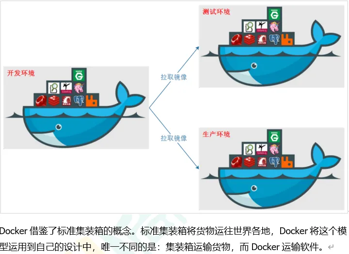

# 一、Docker简介

## 一、Docker概述

1. 假定正在开发一个大型的项目，您使用的是一台笔记本电脑而且您的开发环境具有特定的配置。其他开发人员身处的环境配置也各有不同。您正在开发的应用依赖于您当前的配置且还要依赖于某些配置文件。此外，您的企业还拥有标准化的测试和生产环境，且具有自身的配置和一系列支持文件。您希望尽可能多在本地模拟这些环境而不产生重新创建服务器环境的开销，那么可以使用容器，确保应用能够在不同的环境中运行和通过质量检测，在部署过程中不出现令人头疼的版本、配置问题，也无需重新编写代码和进行故障修复

2. Docker之所以发展如此迅速，也是因为它对此给出了一个标准化的解决方案 --> 系统平滑移植，容器虚拟化技术

3. 环境配置相当麻烦，换一台机器，就要重来一次，费力费时。很多人想到，能不能从根本上解决问题，软件可以带环境安装？也就是说，安装的时候，把原始环境一模一样地复制过来。开发人员利用 Docker 可以消除协作编码时“在我的机器上可正常工作”的问题

   

4. Docker就是将程序和程序所需要的环境一起打包部署，达到程序跨平台运行。解决了运行环境和配置问题的软件容器，方便做持续集成并有助于整体发布的容器虚拟化技术

## 二、Docker理念

1. Docker是基于Go语言实现的云开源项目

2. Docker的主要目标是“Build，Ship and Run Any App,Anywhere”，也就是通过对应用组件的封装、分发、部署、运行等生命周期的管理，使用户的APP（可以是一个WEB应用或数据库应用等等）及其运行环境能够做到“一次镜像，处处运行”

   

3. Linux容器技术的出现就解决了这样一个问题，而 Docker 就是在它的基础上发展过来的。将应用打成镜像，通过镜像成为运行在Docker容器上面的实例，而 Docker容器在任何操作系统上都是一致的，这就实现了跨平台、跨服务器。只需要一次配置好环境，换到别的机子上就可以一键部署好，大大简化了操作

## 三、容器与虚拟机比较

1. 容器发展简史

   

2. 传统虚拟机技术

   - 虚拟机（virtual machine）就是带环境安装的一种解决方案

   - 它可以在一种操作系统里面运行另一种操作系统，比如在Windows10系统里面运行Linux系统CentOS7。应用程序对此毫无感知，因为虚拟机看上去跟真实系统一模一样，而对于底层系统来说，虚拟机就是一个普通文件，不需要了就删掉，对其他部分毫无影响。这类虚拟机完美的运行了另一套系统，能够使应用程序，操作系统和硬件三者之间的逻辑不变

     

3. 虚拟机的缺点

   - 资源占用多
   - 冗余步骤多
   - 启动慢

4. 容器虚拟化技术

   - 由于前面虚拟机存在某些缺点，Linux发展出了另一种虚拟化技术：Linux容器（Linux Containers，缩写为 LXC）

   - Linux容器是与系统其他部分隔离开的一系列进程，从另一个镜像运行，并由该镜像提供支持进程所需的全部文件。容器提供的镜像包含了应用的所有依赖项，因而在从开发到测试再到生产的整个过程中，它都具有可移植性和一致性

   - Linux 容器不是模拟一个完整的操作系统而是对进程进行隔离。有了容器，就可以将软件运行所需的所有资源打包到一个隔离的容器中。容器与虚拟机不同，不需要捆绑一整套操作系统，只需要软件工作所需的库资源和设置。系统因此而变得高效轻量并保证部署在任何环境中的软件都能始终如一地运行

     

5.  比较 Docker 和传统虚拟化方式的不同之处：

   

   - 传统虚拟机技术是虚拟出一套硬件后，在其上运行一个完整操作系统，在该系统上再运行所需应用进程
   - 容器内的应用进程直接运行于宿主的内核，容器内没有自己的内核且也没有进行硬件虚拟。因此容器要比传统虚拟机更为轻便
   - 每个容器之间互相隔离，每个容器有自己的文件系统 ，容器之间进程不会相互影响，能区分计算资源

## 四、开发/运维（DevOps）新一代牛马

1. 一次构建、随处运行

   - 一次构建、随处运行：传统的应用开发完成后，需要提供一堆安装程序和配置说明文档，安装部署后需根据配置文档进行繁杂的配置才能正常运行。Docker化之后只需要交付少量容器镜像文件，在正式生产环境加载镜像并运行即可，应用安装配置在镜像里已经内置好，大大节省部署配置和测试验证时间
   - 更便捷的升级和扩缩容：随着微服务架构和Docker的发展，大量的应用会通过微服务方式架构，应用的开发构建将变成搭乐高积木一样，每个Docker容器将变成一块“积木”，应用的升级将变得非常容易。当现有的容器不足以支撑业务处理时，可通过镜像运行新的容器进行快速扩容，使应用系统的扩容从原先的天级变成分钟级甚至秒级
   - 更简单的系统运维：应用容器化运行后，生产环境运行的应用可与开发、测试环境的应用高度一致，容器会将应用程序相关的环境和状态完全封装起来，不会因为底层基础架构和操作系统的不一致性给应用带来影响，产生新的BUG。当出现程序异常时，也可以通过测试环境的相同容器进行快速定位和修复
   - 更高效的计算资源利用：Docker是内核级虚拟化，其不像传统的虚拟化技术一样需要额外的Hypervisor支持，所以在一台物理机上可以运行很多个容器实例，可大大提升物理服务器的CPU和内存的利用率

2. Docker应用场景

   

# 二、Docker安装

## 一、前提说明


1. 目前Docker的网站和github地址是访问不到的

2. 目前，CentOS 仅发行版本中的内核支持 Docker。Docker 运行在CentOS7（64-bit）上。要求系统为64位、Linux系统内核版本为3.8以上，这里选用Centos7.x

3. 查看自己的内核

   ```shell
   [root@CentOS201 sunsh]# cat /etc/redhat-release 
   CentOS Linux release 7.9.2009 (Core)
   [root@CentOS201 sunsh]# uname -r
   3.10.0-1160.71.1.el7.x86_64
   ```

## 二、Docker的基本组成


1. image镜像

   - Docker 镜像（Image）就是一个只读的模板。镜像可以用来创建 Docker 容器，一个镜像可以创建很多容器

   - 它也相当于是一个root文件系统。比如官方镜像 centos:7 就包含了完整的一套 centos:7 最小系统的 root 文件系统

   - 相当于容器的“源代码”，docker镜像文件类似于Java的类模板，而docker容器实例类似于java中new出来的实例对象

     

2. container容器

   - 从面向对象角度分析：Docker 利用容器（Container）独立运行的一个或一组应用，应用程序或服务运行在容器里面，容器就类似于一个虚拟化的运行环境，容器是用镜像创建的运行实例。就像是Java中的类和实例对象一样，镜像是静态的定义，容器是镜像运行时的实体。容器为镜像提供了一个标准的和隔离的运行环境，它可以被启动、开始、停止、删除。每个容器都是相互隔离的、保证安全的平台
   - 从镜像容器角度分析：可以把容器看做是一个简易版的 Linux 环境（包括root用户权限、进程空间、用户空间和网络空间等）和运行在其中的应用程序

3. repository仓库

   - 仓库（Repository）是集中存放镜像文件的场所
   - 类似于Maven仓库，存放各种jar包的地方；github仓库，存放各种git项目的地方；Docker公司提供的官方registry被称为Docker Hub，存放各种镜像模板的地方（已经不能访问）
   - 仓库分为公开仓库（Public）和私有仓库（Private）两种形式。最大的公开仓库是 Docker Hub，存放了数量庞大的镜像供用户下载。国内的公开仓库包括阿里云 、网易云等

4. 概念分析

   - Docker 本身是一个容器运行载体或称之为管理引擎。我们把应用程序和配置依赖打包好形成一个可交付的运行环境，这个打包好的运行环境就是image镜像文件。只有通过这个镜像文件才能生成Docker容器实例，类似Java中new出来一个对象
   - image 文件可以看作是容器的模板。Docker 根据 image 文件生成容器的实例。同一个 image 文件，可以生成多个同时运行的容器实例。image 文件生成的容器实例，本身也是一个文件，称为镜像文件
   - 容器实例：一个容器运行一种服务，当我们需要的时候，就可以通过docker客户端创建一个对应的运行实例，也就是我们的容器
   - 仓库：就是放一堆镜像的地方，我们可以把镜像发布到仓库中，需要的时候再从仓库中拉下来就可以了

## 三、Docker平台架构图解

- Docker 是一个 C/S 模式的架构，后端是一个松耦合架构，众多模块各司其职

  

  

## 四、安装步骤

1.  下载关于Docker的依赖环境 

   ```shell
   [root@CentOS201 sunsh]# yum -y install yum-utils device-mapper-persistent-datalvm2
   ```

2.  设置一下下载Docker的镜像源 

   ```java
   [root@CentOS201 sunsh]# yum-config-manager --add-repo http://mirrors.aliyun.com/docker-ce/linux/centos/docker-ce.repo
   ```

3.  首先，将软件包信息提前在本地缓存一份，用来提高搜索安装软件的速度 

   ```shell
   [root@CentOS201 sunsh]# yum makecache fast
   ```

4.  提高安装速度以后，安装docker相关的（docker-ce社区版，而ee是企业版） 

   ```shell
   [root@CentOS201 sunsh]# yum install docker-ce docker-ce-cli containerd.io
   ```

5.  启动Docker服务 

   ```shell
   [root@CentOS201 sunsh]# systemctl start docker
   ```

6.  设置开机自动启动 

   ```shell
   [root@CentOS201 sunsh]# systemctl enable docker
   ```

7.  测试 

   ```shell
   [root@CentOS201 sunsh]# docker version
   ```

## 五、卸载步骤

```shell
systemctl stop docker 
yum remove docker-ce docker-ce-cli containerd.io
rm -rf /var/lib/docker
rm -rf /var/lib/containerd
```

## 六、更换阿里镜像源

1. 登录[阿里网站](https://promotion.aliyun.com/ntms/act/kubernetes.html)

2. 获得加速器地址连接：登录阿里云开发者平台 -> 点击控制台 -> 选择容器镜像服务 -> 镜像工具 -> 获取加速器地址 -> 粘贴网站下方自动生成的脚本直接执行即可

   ```shell
   sudo mkdir -p /etc/docker
   sudo tee /etc/docker/daemon.json <<-'EOF'
   {
     "registry-mirrors": ["https://38h0dfa4.mirror.aliyuncs.com"]
   }
   EOF
   sudo systemctl daemon-reload
   sudo systemctl restart docker
   ```

3. 如果出现以下代码，说明运行成功

   ```shell
   [root@CentOS201 sunsh]# docker run hello-world
   Unable to find image 'hello-world:latest' locally
   latest: Pulling from library/hello-world
   1b930d010525: Pull complete 
   Digest: sha256:0e11c388b664df8a27a901dce21eb89f11d8292f7fca1b3e3c4321bf7897bffe
   Status: Downloaded newer image for hello-world:latest
    
   Hello from Docker!
   This message shows that your installation appears to be working correctly.
    
   To generate this message, Docker took the following steps:
    1. The Docker client contacted the Docker daemon.
    2. The Docker daemon pulled the "hello-world" image from the Docker Hub.
       (amd64)
    3. The Docker daemon created a new container from that image which runs the
       executable that produces the output you are currently reading.
    4. The Docker daemon streamed that output to the Docker client, which sent it
       to your terminal.
    
   To try something more ambitious, you can run an Ubuntu container with:
    $ docker run -it ubuntu bash
    
   Share images, automate workflows, and more with a free Docker ID:
    https://hub.docker.com/
    
   For more examples and ideas, visit:
    https://docs.docker.com/get-started/
   
   ```

   

## 七、Docker会比VM虚拟机快的原理

1. docker有着比虚拟机更少的抽象层：由于docker不需要Hypervisor（虚拟机）实现硬件资源虚拟化，运行在docker容器上的程序直接使用的都是实际物理机的硬件资源。因此在CPU、内存利用率上docker将会在效率上有明显优势

2. docker利用的是宿主机的内核，而不需要加载操作系统OS内核。当新建一个容器时，docker不需要和虚拟机一样重新加载一个操作系统内核。进而避免引寻、加载操作系统内核返回等比较费时费资源的过程，当新建一个虚拟机时，虚拟机软件需要加载OS，返回新建过程是分钟级别的。而docker由于直接利用宿主机的操作系统，则省略了返回过程，因此新建一个docker容器只需要几秒钟

   

   

# 三、Docker常用命令

## 一、帮助启动类命令

1. 启动docker： `systemctl start docker`
2. 停止docker： `systemctl stop docker`
3. 重启docker： `systemctl restart docker`
4. 查看docker状态： `systemctl status docker`
5. 开机启动： `systemctl enable docker`
6. 查看docker概要信息： `docker info`
7. 查看docker总体帮助文档： `docker --help`
8. 查看docker命令帮助文档：` docker 具体命令 --help`

## 二、镜像命令

1. 列出本地主机上的镜像：`docker images`

   

   - REPOSITORY：表示镜像的仓库源
   - TAG：镜像的标签版本号
   - IMAGE ID：镜像ID
   - CREATED：镜像创建时间，在仓库的创建时间，并不是拉取到本地的时间
   - SIZE：镜像大小
   - 同一仓库源可以有多个TAG版本，代表这个仓库源的不同个版本，我们使用 REPOSITORY:TAG来定义不同的镜像。如果你不指定一个镜像的版本标签，例如你只使用 ubuntu，docker 将默认使用 ubuntu:latest 镜像
   - OPTIONS说明：`docker images -a`
     - -a：列出本地所有的镜像（含历史映像层）
     - -q：只显示镜像ID

2. 在仓库搜索某个XXX镜像名字：`docker search [OPTIONS] 镜像名字`

   - OPTIONS说明：--limit，只列出N个镜像，默认25个，如`docker search --limit 5 redis`

   

   

3. 下载镜像：`docker pull 某个XXX镜像名字`

   - `docker pull 镜像名字[:TAG]`
   - `docker pull 镜像名字`：没有TAG就是最新版，等价于`docker pull 镜像名字:latest`

4. 查看镜像/容器/数据卷所占的空间：`docker system df`

   

5. 删除镜像：`docker rmi 某个XXX镜像名字ID`

   - 删除单个：`docker rmi -f 镜像ID`
   - 删除多个：`docker rmi -f 镜像名1:TAG 镜像名2:TAG`
   - 删除全部：`docker rmi -f $(docker images -qa)`

6. docker虚悬镜像

   - 仓库名、标签都是`<none>`的镜像，俗称虚悬镜像dangling image

## 三、容器命令

1. 有镜像才能创建容器， 这是根本前提。先下载某个镜像：`docker pull 某个XXX镜像名字`

2. 新建+启动容器：`docker run [OPTIONS] IMAGE [COMMAND] [ARG...]`

   - OPTIONS说明（常用）：有些是一个减号，有些是两个减号

     - --name="容器新名字"：为容器指定一个名称
     - -d：后台运行容器并返回容器ID，也即启动守护式容器（后台运行）
     - -i：以交互模式运行容器，通常与 -t 同时使用
     - -t：为容器重新分配一个伪输入终端，通常与 -i 同时使用，也即启动交互式容器（前台有伪终端，等待交互）
     - -P: 随机端口映射，大写P
     - -p: 指定端口映射，小写p，主机端口:容器端口

     

     

     如上图使用镜像centos:latest以交互模式启动一个容器，在容器内执行/bin/bash命令

     ```tex
     参数说明：
     	-i: 交互式操作
     	-t: 终端
     	centos : centos 镜像
     	/bin/bash：放在镜像名后的是命令，这里我们希望有个交互式 Shell，因此用的是 			   /bin/bash
     	要退出终端，直接输入 exit
     ```

3. 列出当前所有正在运行的容器：`docker ps [OPTIONS]`。OPTIONS说明

   - -a：列出当前所有正在运行的容器+历史上运行过的
   - -l：显示最近创建的容器
   - -n：显示最近n个创建的容器
   - -q：静默模式，只显示容器编号

4. 退出容器

   - `exit`：run进去容器，exit退出，容器停止
   - `ctrl+p+q`：run进去容器，ctrl+p+q退出，容器不停止

5. 启动已停止运行的容器：`docker start 容器ID或者容器名`

6. 重启容器：`docker restart 容器ID或者容器名`

7. 停止容器：`docker stop 容器ID或者容器名`

8. 强制停止容器：`docker kill 容器ID或容器名`

9. 删除已停止的容器：`docker rm 容器ID`

   - 一次性删除多个容器实例：`docker rm -f $(docker ps -a -q)`、`docker ps -a -q | xargs docker rm`

## 四、镜像容器的使用案例

1. 有镜像才能创建容器，这是根本前提

2. 启动守护式容器，即后台服务器。在大部分的场景下，我们希望 docker 的服务是在后台运行的， 我们可以过 -d 指定容器的后台运行模式

   - 命令为：`docker run -d 容器名`
   - 然后`docker ps -a`进行查看, 会发现容器已经退出

3. Docker容器后台运行，就必须有一个前台进程

4. 容器运行的命令如果不是那些一直挂起的命令（比如运行top，tail），就是会自动退出的。这个是docker的机制问题，比如你的web容器，我们以nginx为例，正常情况下，我们配置启动服务只需要启动响应的service即可。例如service nginx start。但是，这样做，nginx为后台进程模式运行，就导致docker前台没有运行的应用，这样的容器后台启动后，会立即自杀因为他觉得他没事可做了。所以，最佳的解决方案是将你要运行的程序以前台进程的形式运行，常见就是命令行模式，表示我还有交互操作，别中断。以Redis前后台启动演示case

   - 前台交互式启动：`docker run -it redis:6.0.8`
   - 后台守护式启动：`docker run -d redis:6.0.8`

5. 查看容器日志：`docker logs 容器ID`

6. 查看容器内运行的进程：`docker top 容器ID`

7. 查看容器内部细节：`docker inspect 容器ID`

8. 进入正在运行的容器并以命令行交互：`docker exec -it 容器ID bashShell`

   

   

   - 重新进入`docker attach 容器ID`

   - attach直接进入容器启动命令的终端，不会启动新的进程，用exit退出，会导致容器的停止

     

   - exec是在容器中打开新的终端，并且可以启动新的进程，用exit退出，不会导致容器的停止

     

   - 推荐使用`docker exec`命令，因为退出容器终端，不会导致容器的停止

   - 如用之前的Redis容器实例进入试试

     - `docker exec -it 容器ID /bin/bash`
     - `docker exec -it 容器ID redis-cli`
     - 一般用-d后台启动的程序，再用exec进入对应容器实例

9. 从容器内拷贝文件到主机上：`docker cp 容器ID:容器内路径 目的主机路径`

   

10. 导入和导出容器

    - `export `：导出容器的内容留作为一个tar归档文件[对应import命令]

    - `import `：从tar包中的内容创建一个新的文件系统再导入为镜像[对应export]

    - 案例：`docker export 容器ID > 文件名.tar`

      

    - `cat 文件名.tar | docker import - 镜像用户/镜像名:镜像版本号`

      

## 五、Docker常用命令总结


```tex
attach    Attach to a running container                 
# 当前 shell 下 attach 连接指定运行镜像

build     Build an image from a Dockerfile              
# 通过 Dockerfile 定制镜像

commit    Create a new image from a container changes   
# 提交当前容器为新的镜像

cp        Copy files/folders from the containers filesystem to the host path   
#从容器中拷贝指定文件或者目录到宿主机中

create    Create a new container                        
# 创建一个新的容器，同 run，但不启动容器

diff      Inspect changes on a container's filesystem   
# 查看 docker 容器变化

events    Get real time events from the server          
# 从 docker 服务获取容器实时事件

exec      Run a command in an existing container        
# 在已存在的容器上运行命令

export    Stream the contents of a container as a tar archive   
# 导出容器的内容流作为一个 tar 归档文件[对应 import ]

history   Show the history of an image                  
# 展示一个镜像形成历史

images    List images                                   
# 列出系统当前镜像

import    Create a new filesystem image from the contents of a tarball 
# 从tar包中的内容创建一个新的文件系统映像[对应export]

info      Display system-wide information               
# 显示系统相关信息

inspect   Return low-level information on a container  
# 查看容器详细信息

kill      Kill a running container                      
# kill 指定 docker 容器

load      Load an image from a tar archive              
# 从一个 tar 包中加载一个镜像[对应 save]

login     Register or Login to the docker registry server    
# 注册或者登陆一个 docker 源服务器

logout    Log out from a Docker registry server          
# 从当前 Docker registry 退出

logs      Fetch the logs of a container                
# 输出当前容器日志信息

port      Lookup the public-facing port which is NAT-ed to PRIVATE_PORT    
# 查看映射端口对应的容器内部源端口

pause     Pause all processes within a container        
# 暂停容器

ps        List containers                               
# 列出容器列表

pull      Pull an image or a repository from the docker registry server   
# 从docker镜像源服务器拉取指定镜像或者库镜像

push      Push an image or a repository to the docker registry server   
# 推送指定镜像或者库镜像至docker源服务器

restart   Restart a running container                   
# 重启运行的容器

rm        Remove one or more containers                 
# 移除一个或者多个容器

rmi       Remove one or more images       
# 移除一个或多个镜像[无容器使用该镜像才可删除，否则需删除相关容器才可继续或 -f 强制删除]

run       Run a command in a new container              
# 创建一个新的容器并运行一个命令

save      Save an image to a tar archive                
# 保存一个镜像为一个 tar 包[对应 load]

search    Search for an image on the Docker Hub         
# 在 docker hub 中搜索镜像

start     Start a stopped containers                   
# 启动容器

stop      Stop a running containers                    
# 停止容器

tag       Tag an image into a repository                
# 给源中镜像打标签

top       Lookup the running processes of a container   
# 查看容器中运行的进程信息

unpause   Unpause a paused container                    
# 取消暂停容器

version   Show the docker version information           
# 查看 docker 版本号

wait      Block until a container stops, then print its exit code   
# 截取容器停止时的退出状态值
```

## 六、Docker使用注意事项

1. 安装镜像的文件地址，修改配置文件
2. 外网访问Docker启动的容器
3. 不使用`docker pull`命令，也能将需要的镜像放入Docker中