# 一、Docker简介

## 一、Docker概述

1. 假定正在开发一个大型的项目，您使用的是一台笔记本电脑而且您的开发环境具有特定的配置。其他开发人员身处的环境配置也各有不同。您正在开发的应用依赖于您当前的配置且还要依赖于某些配置文件。此外，您的企业还拥有标准化的测试和生产环境，且具有自身的配置和一系列支持文件。您希望尽可能多在本地模拟这些环境而不产生重新创建服务器环境的开销，那么可以使用容器，确保应用能够在不同的环境中运行和通过质量检测，在部署过程中不出现令人头疼的版本、配置问题，也无需重新编写代码和进行故障修复

2. Docker之所以发展如此迅速，也是因为它对此给出了一个标准化的解决方案 --> 系统平滑移植，容器虚拟化技术

3. 环境配置相当麻烦，换一台机器，就要重来一次，费力费时。很多人想到，能不能从根本上解决问题，软件可以带环境安装？也就是说，安装的时候，把原始环境一模一样地复制过来。开发人员利用 Docker 可以消除协作编码时“在我的机器上可正常工作”的问题

   

4. Docker就是将程序和程序所需要的环境一起打包部署，达到程序跨平台运行。解决了运行环境和配置问题的软件容器，方便做持续集成并有助于整体发布的容器虚拟化技术

## 二、Docker理念

1. Docker是基于Go语言实现的云开源项目

2. Docker的主要目标是“Build，Ship and Run Any App,Anywhere”，也就是通过对应用组件的封装、分发、部署、运行等生命周期的管理，使用户的APP（可以是一个WEB应用或数据库应用等等）及其运行环境能够做到“一次镜像，处处运行”

   

3. Linux容器技术的出现就解决了这样一个问题，而 Docker 就是在它的基础上发展过来的。将应用打成镜像，通过镜像成为运行在Docker容器上面的实例，而 Docker容器在任何操作系统上都是一致的，这就实现了跨平台、跨服务器。只需要一次配置好环境，换到别的机子上就可以一键部署好，大大简化了操作

## 三、容器与虚拟机比较

1. 容器发展简史

   

2. 传统虚拟机技术

   - 虚拟机（virtual machine）就是带环境安装的一种解决方案

   - 它可以在一种操作系统里面运行另一种操作系统，比如在Windows10系统里面运行Linux系统CentOS7。应用程序对此毫无感知，因为虚拟机看上去跟真实系统一模一样，而对于底层系统来说，虚拟机就是一个普通文件，不需要了就删掉，对其他部分毫无影响。这类虚拟机完美的运行了另一套系统，能够使应用程序，操作系统和硬件三者之间的逻辑不变

     

3. 虚拟机的缺点

   - 资源占用多
   - 冗余步骤多
   - 启动慢

4. 容器虚拟化技术

   - 由于前面虚拟机存在某些缺点，Linux发展出了另一种虚拟化技术：Linux容器（Linux Containers，缩写为 LXC）

   - Linux容器是与系统其他部分隔离开的一系列进程，从另一个镜像运行，并由该镜像提供支持进程所需的全部文件。容器提供的镜像包含了应用的所有依赖项，因而在从开发到测试再到生产的整个过程中，它都具有可移植性和一致性

   - Linux 容器不是模拟一个完整的操作系统而是对进程进行隔离。有了容器，就可以将软件运行所需的所有资源打包到一个隔离的容器中。容器与虚拟机不同，不需要捆绑一整套操作系统，只需要软件工作所需的库资源和设置。系统因此而变得高效轻量并保证部署在任何环境中的软件都能始终如一地运行

     

5.  比较 Docker 和传统虚拟化方式的不同之处：

   

   - 传统虚拟机技术是虚拟出一套硬件后，在其上运行一个完整操作系统，在该系统上再运行所需应用进程
   - 容器内的应用进程直接运行于宿主的内核，容器内没有自己的内核且也没有进行硬件虚拟。因此容器要比传统虚拟机更为轻便
   - 每个容器之间互相隔离，每个容器有自己的文件系统 ，容器之间进程不会相互影响，能区分计算资源

## 四、开发/运维（DevOps）新一代牛马

1. 一次构建、随处运行

   - 一次构建、随处运行：传统的应用开发完成后，需要提供一堆安装程序和配置说明文档，安装部署后需根据配置文档进行繁杂的配置才能正常运行。Docker化之后只需要交付少量容器镜像文件，在正式生产环境加载镜像并运行即可，应用安装配置在镜像里已经内置好，大大节省部署配置和测试验证时间
   - 更便捷的升级和扩缩容：随着微服务架构和Docker的发展，大量的应用会通过微服务方式架构，应用的开发构建将变成搭乐高积木一样，每个Docker容器将变成一块“积木”，应用的升级将变得非常容易。当现有的容器不足以支撑业务处理时，可通过镜像运行新的容器进行快速扩容，使应用系统的扩容从原先的天级变成分钟级甚至秒级
   - 更简单的系统运维：应用容器化运行后，生产环境运行的应用可与开发、测试环境的应用高度一致，容器会将应用程序相关的环境和状态完全封装起来，不会因为底层基础架构和操作系统的不一致性给应用带来影响，产生新的BUG。当出现程序异常时，也可以通过测试环境的相同容器进行快速定位和修复
   - 更高效的计算资源利用：Docker是内核级虚拟化，其不像传统的虚拟化技术一样需要额外的Hypervisor支持，所以在一台物理机上可以运行很多个容器实例，可大大提升物理服务器的CPU和内存的利用率

2. Docker应用场景

   

# 二、Docker安装

## 一、前提说明


1. 目前Docker的网站和github地址是访问不到的

2. 目前，CentOS 仅发行版本中的内核支持 Docker。Docker 运行在CentOS7（64-bit）上。要求系统为64位、Linux系统内核版本为3.8以上，这里选用Centos7.x

3. 查看自己的内核

   ```shell
   [root@CentOS201 sunsh]# cat /etc/redhat-release 
   CentOS Linux release 7.9.2009 (Core)
   [root@CentOS201 sunsh]# uname -r
   3.10.0-1160.71.1.el7.x86_64
   ```

## 二、Docker的基本组成


1. image镜像

   - Docker 镜像（Image）就是一个只读的模板。镜像可以用来创建 Docker 容器，一个镜像可以创建很多容器

   - 它也相当于是一个root文件系统。比如官方镜像 centos:7 就包含了完整的一套 centos:7 最小系统的 root 文件系统

   - 相当于容器的“源代码”，docker镜像文件类似于Java的类模板，而docker容器实例类似于java中new出来的实例对象

     

2. container容器

   - 从面向对象角度分析：Docker 利用容器（Container）独立运行的一个或一组应用，应用程序或服务运行在容器里面，容器就类似于一个虚拟化的运行环境，容器是用镜像创建的运行实例。就像是Java中的类和实例对象一样，镜像是静态的定义，容器是镜像运行时的实体。容器为镜像提供了一个标准的和隔离的运行环境，它可以被启动、开始、停止、删除。每个容器都是相互隔离的、保证安全的平台
   - 从镜像容器角度分析：可以把容器看做是一个简易版的 Linux 环境（包括root用户权限、进程空间、用户空间和网络空间等）和运行在其中的应用程序

3. repository仓库

   - 仓库（Repository）是集中存放镜像文件的场所
   - 类似于Maven仓库，存放各种jar包的地方；github仓库，存放各种git项目的地方；Docker公司提供的官方registry被称为Docker Hub，存放各种镜像模板的地方（已经不能访问）
   - 仓库分为公开仓库（Public）和私有仓库（Private）两种形式。最大的公开仓库是 Docker Hub，存放了数量庞大的镜像供用户下载。国内的公开仓库包括阿里云 、网易云等

4. 概念分析

   - Docker 本身是一个容器运行载体或称之为管理引擎。我们把应用程序和配置依赖打包好形成一个可交付的运行环境，这个打包好的运行环境就是image镜像文件。只有通过这个镜像文件才能生成Docker容器实例，类似Java中new出来一个对象
   - image 文件可以看作是容器的模板。Docker 根据 image 文件生成容器的实例。同一个 image 文件，可以生成多个同时运行的容器实例。image 文件生成的容器实例，本身也是一个文件，称为镜像文件
   - 容器实例：一个容器运行一种服务，当我们需要的时候，就可以通过docker客户端创建一个对应的运行实例，也就是我们的容器
   - 仓库：就是放一堆镜像的地方，我们可以把镜像发布到仓库中，需要的时候再从仓库中拉下来就可以了

## 三、Docker平台架构图解

- Docker 是一个 C/S 模式的架构，后端是一个松耦合架构，众多模块各司其职

  

  

## 四、安装步骤

1.  下载关于Docker的依赖环境 

   ```shell
   [root@CentOS201 sunsh]# yum -y install yum-utils device-mapper-persistent-datalvm2
   ```

2.  设置一下下载Docker的镜像源 

   ```java
   [root@CentOS201 sunsh]# yum-config-manager --add-repo http://mirrors.aliyun.com/docker-ce/linux/centos/docker-ce.repo
   ```

3.  首先，将软件包信息提前在本地缓存一份，用来提高搜索安装软件的速度 

   ```shell
   [root@CentOS201 sunsh]# yum makecache fast
   ```

4.  提高安装速度以后，安装docker相关的（docker-ce社区版，而ee是企业版） 

   ```shell
   [root@CentOS201 sunsh]# yum install docker-ce docker-ce-cli containerd.io
   ```

5.  启动Docker服务 

   ```shell
   [root@CentOS201 sunsh]# systemctl start docker
   ```

6.  设置开机自动启动 

   ```shell
   [root@CentOS201 sunsh]# systemctl enable docker
   ```

7.  测试 

   ```shell
   [root@CentOS201 sunsh]# docker version
   ```

## 五、卸载步骤

```shell
systemctl stop docker 
yum remove docker-ce docker-ce-cli containerd.io
rm -rf /var/lib/docker
rm -rf /var/lib/containerd
```

## 六、更换阿里镜像源

1. 登录[阿里网站](https://promotion.aliyun.com/ntms/act/kubernetes.html)

2. 获得加速器地址连接：登录阿里云开发者平台 -> 点击控制台 -> 选择容器镜像服务 -> 镜像工具 -> 获取加速器地址 -> 粘贴网站下方自动生成的脚本直接执行即可

   ```shell
   sudo mkdir -p /etc/docker
   sudo tee /etc/docker/daemon.json <<-'EOF'
   {
     "registry-mirrors": ["https://38h0dfa4.mirror.aliyuncs.com"]
   }
   EOF
   sudo systemctl daemon-reload
   sudo systemctl restart docker
   ```

3. 如果出现以下代码，说明运行成功

   ```shell
   [root@CentOS201 sunsh]# docker run hello-world
   Unable to find image 'hello-world:latest' locally
   latest: Pulling from library/hello-world
   1b930d010525: Pull complete 
   Digest: sha256:0e11c388b664df8a27a901dce21eb89f11d8292f7fca1b3e3c4321bf7897bffe
   Status: Downloaded newer image for hello-world:latest
    
   Hello from Docker!
   This message shows that your installation appears to be working correctly.
    
   To generate this message, Docker took the following steps:
    1. The Docker client contacted the Docker daemon.
    2. The Docker daemon pulled the "hello-world" image from the Docker Hub.
       (amd64)
    3. The Docker daemon created a new container from that image which runs the
       executable that produces the output you are currently reading.
    4. The Docker daemon streamed that output to the Docker client, which sent it
       to your terminal.
    
   To try something more ambitious, you can run an Ubuntu container with:
    $ docker run -it ubuntu bash
    
   Share images, automate workflows, and more with a free Docker ID:
    https://hub.docker.com/
    
   For more examples and ideas, visit:
    https://docs.docker.com/get-started/
   
   ```

   

## 七、Docker会比VM虚拟机快的原理

1. docker有着比虚拟机更少的抽象层：由于docker不需要Hypervisor（虚拟机）实现硬件资源虚拟化，运行在docker容器上的程序直接使用的都是实际物理机的硬件资源。因此在CPU、内存利用率上docker将会在效率上有明显优势

2. docker利用的是宿主机的内核，而不需要加载操作系统OS内核。当新建一个容器时，docker不需要和虚拟机一样重新加载一个操作系统内核。进而避免引寻、加载操作系统内核返回等比较费时费资源的过程，当新建一个虚拟机时，虚拟机软件需要加载OS，返回新建过程是分钟级别的。而docker由于直接利用宿主机的操作系统，则省略了返回过程，因此新建一个docker容器只需要几秒钟

   

   

# 三、Docker常用命令

## 一、帮助启动类命令

1. 启动docker： `systemctl start docker`
2. 停止docker： `systemctl stop docker`
3. 重启docker： `systemctl restart docker`
4. 查看docker状态： `systemctl status docker`
5. 开机启动： `systemctl enable docker`
6. 查看docker概要信息： `docker info`
7. 查看docker总体帮助文档： `docker --help`
8. 查看docker命令帮助文档：` docker 具体命令 --help`

## 二、镜像命令

1. 列出本地主机上的镜像：`docker images`

   

   - REPOSITORY：表示镜像的仓库源
   - TAG：镜像的标签版本号
   - IMAGE ID：镜像ID
   - CREATED：镜像创建时间，在仓库的创建时间，并不是拉取到本地的时间
   - SIZE：镜像大小
   - 同一仓库源可以有多个TAG版本，代表这个仓库源的不同个版本，我们使用 REPOSITORY:TAG来定义不同的镜像。如果你不指定一个镜像的版本标签，例如你只使用 ubuntu，docker 将默认使用 ubuntu:latest 镜像
   - OPTIONS说明：`docker images -a`
     - -a：列出本地所有的镜像（含历史映像层）
     - -q：只显示镜像ID

2. 在仓库搜索某个XXX镜像名字：`docker search [OPTIONS] 镜像名字`

   - OPTIONS说明：--limit，只列出N个镜像，默认25个，如`docker search --limit 5 redis`

   

   

3. 下载镜像：`docker pull 某个XXX镜像名字`

   - `docker pull 镜像名字[:TAG]`
   - `docker pull 镜像名字`：没有TAG就是最新版，等价于`docker pull 镜像名字:latest`

4. 查看镜像/容器/数据卷所占的空间：`docker system df`

   

5. 删除镜像：`docker rmi 某个XXX镜像名字ID`

   - 删除单个：`docker rmi -f 镜像ID`
   - 删除多个：`docker rmi -f 镜像名1:TAG 镜像名2:TAG`
   - 删除全部：`docker rmi -f $(docker images -qa)`

6. docker虚悬镜像

   - 仓库名、标签都是`<none>`的镜像，俗称虚悬镜像dangling image

## 三、容器命令

1. 有镜像才能创建容器， 这是根本前提。先下载某个镜像：`docker pull 某个XXX镜像名字`

2. 新建+启动容器：`docker run [OPTIONS] IMAGE [COMMAND] [ARG...]`

   - OPTIONS说明（常用）：有些是一个减号，有些是两个减号

     - --name="容器新名字"：为容器指定一个名称
     - -d：后台运行容器并返回容器ID，也即启动守护式容器（后台运行）
     - -i：以交互模式运行容器，通常与 -t 同时使用
     - -t：为容器重新分配一个伪输入终端，通常与 -i 同时使用，也即启动交互式容器（前台有伪终端，等待交互）
     - -P: 随机端口映射，大写P
     - -p: 指定端口映射，小写p，主机端口:容器端口

     

     

     如上图使用镜像centos:latest以交互模式启动一个容器，在容器内执行/bin/bash命令

     ```tex
     参数说明：
     	-i: 交互式操作
     	-t: 终端
     	centos : centos 镜像
     	/bin/bash：放在镜像名后的是命令，这里我们希望有个交互式 Shell，因此用的是 			   /bin/bash
     	要退出终端，直接输入 exit
     ```

3. 列出当前所有正在运行的容器：`docker ps [OPTIONS]`。OPTIONS说明

   - -a：列出当前所有正在运行的容器+历史上运行过的
   - -l：显示最近创建的容器
   - -n：显示最近n个创建的容器
   - -q：静默模式，只显示容器编号

4. 退出容器

   - `exit`：run进去容器，exit退出，容器停止
   - `ctrl+p+q`：run进去容器，ctrl+p+q退出，容器不停止

5. 启动已停止运行的容器：`docker start 容器ID或者容器名`

6. 重启容器：`docker restart 容器ID或者容器名`

7. 停止容器：`docker stop 容器ID或者容器名`

8. 强制停止容器：`docker kill 容器ID或容器名`

9. 删除已停止的容器：`docker rm 容器ID`

   - 一次性删除多个容器实例：`docker rm -f $(docker ps -a -q)`、`docker ps -a -q | xargs docker rm`

## 四、镜像容器的使用案例

1. 有镜像才能创建容器，这是根本前提

2. 启动守护式容器，即后台服务器。在大部分的场景下，我们希望 docker 的服务是在后台运行的， 我们可以过 -d 指定容器的后台运行模式

   - 命令为：`docker run -d 容器名`
   - 然后`docker ps -a`进行查看, 会发现容器已经退出

3. Docker容器后台运行，就必须有一个前台进程

4. 容器运行的命令如果不是那些一直挂起的命令（比如运行top，tail），就是会自动退出的。这个是docker的机制问题，比如你的web容器，我们以nginx为例，正常情况下，我们配置启动服务只需要启动响应的service即可。例如service nginx start。但是，这样做，nginx为后台进程模式运行，就导致docker前台没有运行的应用，这样的容器后台启动后，会立即自杀因为他觉得他没事可做了。所以，最佳的解决方案是将你要运行的程序以前台进程的形式运行，常见就是命令行模式，表示我还有交互操作，别中断。以Redis前后台启动演示case

   - 前台交互式启动：`docker run -it redis:6.0.8`
   - 后台守护式启动：`docker run -d redis:6.0.8`

5. 查看容器日志：`docker logs 容器ID`

6. 查看容器内运行的进程：`docker top 容器ID`

7. 查看容器内部细节：`docker inspect 容器ID`

8. 进入正在运行的容器并以命令行交互：`docker exec -it 容器ID bashShell`

   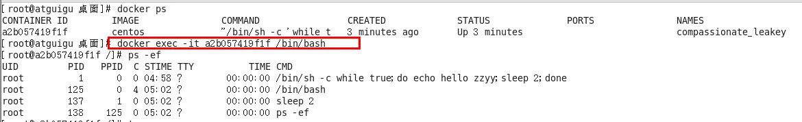

   

   - 重新进入`docker attach 容器ID`

   - attach直接进入容器启动命令的终端，不会启动新的进程，用exit退出，会导致容器的停止

     

   - exec是在容器中打开新的终端，并且可以启动新的进程，用exit退出，不会导致容器的停止

     

   - 推荐使用`docker exec`命令，因为退出容器终端，不会导致容器的停止

   - 如用之前的Redis容器实例进入试试

     - `docker exec -it 容器ID /bin/bash`
     - `docker exec -it 容器ID redis-cli`
     - 一般用-d后台启动的程序，再用exec进入对应容器实例

9. 从容器内拷贝文件到主机上：`docker cp 容器ID:容器内路径 目的主机路径`

   

10. 导入和导出容器

    - `export `：导出容器的内容留作为一个tar归档文件[对应import命令]

    - `import `：从tar包中的内容创建一个新的文件系统再导入为镜像[对应export]

    - 案例：`docker export 容器ID > 文件名.tar`

      

    - `cat 文件名.tar | docker import - 镜像用户/镜像名:镜像版本号`

      

## 五、Docker常用命令总结


```tex
attach    Attach to a running container                 
# 当前 shell 下 attach 连接指定运行镜像

build     Build an image from a Dockerfile              
# 通过 Dockerfile 定制镜像

commit    Create a new image from a container changes   
# 提交当前容器为新的镜像

cp        Copy files/folders from the containers filesystem to the host path   
#从容器中拷贝指定文件或者目录到宿主机中

create    Create a new container                        
# 创建一个新的容器，同 run，但不启动容器

diff      Inspect changes on a container's filesystem   
# 查看 docker 容器变化

events    Get real time events from the server          
# 从 docker 服务获取容器实时事件

exec      Run a command in an existing container        
# 在已存在的容器上运行命令

export    Stream the contents of a container as a tar archive   
# 导出容器的内容流作为一个 tar 归档文件[对应 import ]

history   Show the history of an image                  
# 展示一个镜像形成历史

images    List images                                   
# 列出系统当前镜像

import    Create a new filesystem image from the contents of a tarball 
# 从tar包中的内容创建一个新的文件系统映像[对应export]

info      Display system-wide information               
# 显示系统相关信息

inspect   Return low-level information on a container  
# 查看容器详细信息

kill      Kill a running container                      
# kill 指定 docker 容器

load      Load an image from a tar archive              
# 从一个 tar 包中加载一个镜像[对应 save]

login     Register or Login to the docker registry server    
# 注册或者登陆一个 docker 源服务器

logout    Log out from a Docker registry server          
# 从当前 Docker registry 退出

logs      Fetch the logs of a container                
# 输出当前容器日志信息

port      Lookup the public-facing port which is NAT-ed to PRIVATE_PORT    
# 查看映射端口对应的容器内部源端口

pause     Pause all processes within a container        
# 暂停容器

ps        List containers                               
# 列出容器列表

pull      Pull an image or a repository from the docker registry server   
# 从docker镜像源服务器拉取指定镜像或者库镜像

push      Push an image or a repository to the docker registry server   
# 推送指定镜像或者库镜像至docker源服务器

restart   Restart a running container                   
# 重启运行的容器

rm        Remove one or more containers                 
# 移除一个或者多个容器

rmi       Remove one or more images       
# 移除一个或多个镜像[无容器使用该镜像才可删除，否则需删除相关容器才可继续或 -f 强制删除]

run       Run a command in a new container              
# 创建一个新的容器并运行一个命令

save      Save an image to a tar archive                
# 保存一个镜像为一个 tar 包[对应 load]

search    Search for an image on the Docker Hub         
# 在 docker hub 中搜索镜像

start     Start a stopped containers                   
# 启动容器

stop      Stop a running containers                    
# 停止容器

tag       Tag an image into a repository                
# 给源中镜像打标签

top       Lookup the running processes of a container   
# 查看容器中运行的进程信息

unpause   Unpause a paused container                    
# 取消暂停容器

version   Show the docker version information           
# 查看 docker 版本号

wait      Block until a container stops, then print its exit code   
# 截取容器停止时的退出状态值
```

## 六、Docker使用注意事项

1. 安装镜像的文件地址，修改配置文件

   - 如果想要通过主机的文件修改容器内的配置文件，可以通过容器卷挂载的方式，如

     ```shell
     docker run  
     -p 6379:6379 
     --name myr3 
     --privileged=true 
     -v /sunshapp/redis/redis.conf:/etc/redis/redis.conf 
     -v /sunshapp/redis/data:/data 
     -d redis:6.0.8 redis-server /etc/redis/redis.conf
     ```

   - 如果想要使用容器内的命令修改，可以运行命令`docker exec -it 容器ID /bin/bash`，与容器进行交互，修改内容等等操作

2. 不使用`docker pull`命令，也能将需要的镜像放入Docker中

# 四、Docker镜像

## 一、Docker镜像概述

- Docker镜像是一种轻量级、可执行的独立软件包，它包含运行某个软件所需的所有内容，我们把应用程序和配置依赖打包好形成一个可交付的运行环境（包括代码、运行时需要的库、环境变量和配置文件等），这个打包好的运行环境就是image镜像文件
- 只有通过这个镜像文件才能生成Docker容器实例（类似Java中new出来一个对象）

### 一、镜像的分层

- 以我们的pull为例，在下载的过程中我们可以看到docker的镜像好像是在一层一层的在下载

  

### 二、UnionFS（联合文件系统）

1. UnionFS（联合文件系统）：Union文件系统（UnionFS）是一种分层、轻量级并且高性能的文件系统，它支持对文件系统的修改作为一次提交来一层层的叠加，同时可以将不同目录挂载到同一个虚拟文件系统下（unite several directories into a single virtual filesystem）。Union 文件系统是 Docker 镜像的基础。镜像可以通过分层来进行继承，基于基础镜像（没有父镜像），可以制作各种具体的应用镜像
2. 特性：一次同时加载多个文件系统，但从外面看起来，只能看到一个文件系统，联合加载会把各层文件系统叠加起来，这样最终的文件系统会包含所有底层的文件和目录

### 三、Docker镜像加载原理

1. docker的镜像实际上由一层一层的文件系统组成，这种层级的文件系统UnionFS

2. bootfs（boot file system）主要包含bootloader和kernel，bootloader主要是引导加载kernel，Linux刚启动时会加载bootfs文件系统，在Docker镜像的最底层是引导文件系统bootfs。这一层与我们典型的Linux/Unix系统是一样的，包含boot加载器和内核。当boot加载完成之后整个内核就都在内存中了，此时内存的使用权已由bootfs转交给内核，此时系统也会卸载bootfs

3. rootfs (root file system) ，在bootfs之上。包含的就是典型 Linux 系统中的 /dev, /proc, /bin, /etc 等标准目录和文件。rootfs就是各种不同的操作系统发行版，比如Ubuntu，Centos等等

   

4. 平时我们安装进虚拟机的CentOS都是好几个G，为什么docker这里才200M？？

   

   - 对于一个精简的OS，rootfs可以很小，只需要包括最基本的命令、工具和程序库就可以了，因为底层直接用Host的kernel，自己只需要提供 rootfs 就行了。由此可见对于不同的linux发行版，bootfs基本是一致的，rootfs会有差别,，因此不同的发行版可以公用bootfs

5. Docker镜像要采用分层结构的原因

   - 镜像分层最大的一个好处就是共享资源，方便复制迁移，就是为了复用
   - 比如说有多个镜像都从相同的 base 镜像构建而来，那么 Docker Host 只需在磁盘上保存一份 base 镜像
   - 同时内存中也只需加载一份 base 镜像，就可以为所有容器服务了。而且镜像的每一层都可以被共享

## 二、重点理解部分

1. Docker镜像层都是只读的，容器层是可写的。当容器启动时，一个新的可写层被加载到镜像的顶部。 这一层通常被称作“容器层”，“容器层”之下的都叫“镜像层”

2. 所有对容器的改动，无论添加、删除、还是修改文件都只会发生在容器层中。只有容器层是可写的，容器层下面的所有镜像层都是只读的

   

## 三、Docker镜像commit操作案例

- docker commit 提交容器副本使之成为一个新的镜像
- 命令为：`docker commit -m="提交的描述信息" -a="作者" 容器ID 要创建的目标镜像名:[标签名]`

### 一、案例演示ubuntu安装vim

1. 从仓库上下载ubuntu镜像到本地并成功运行

2. 原始的默认Ubuntu镜像是不带着vim命令的

   ```shell
   [root@CentOS201 sunsh]# docker images
   REPOSITORY    TAG       IMAGE ID       CREATED       SIZE
   tomcat        latest    fb5657adc892   2 years ago   680MB
   redis         latest    7614ae9453d1   2 years ago   113MB
   ubuntu        latest    ba6acccedd29   2 years ago   72.8MB
   hello-world   latest    feb5d9fea6a5   2 years ago   13.3kB
   [root@CentOS201 sunsh]# docker run -it ubuntu /bin/bash
   root@7d6818428038:/# ls     
   bin  boot  dev  etc  home  lib  lib32  lib64  libx32  media  mnt  opt  proc  root  run  sbin  srv  sys  tmp  usr  var
   root@7d6818428038:/# vim a.txt
   bash: vim: command not found
   ```

3. 外网连通的情况下，安装vim

   ```shell
   # 先更新包管理工具
   root@7d6818428038:/# apt-get update
   
   # 然后安装vim
   root@7d6818428038:/# apt-get install vim
   ```

4. docker容器内执行上述两条命令：`apt-get update`、`apt-get -y install vim`

5. 安装完成后，commit我们自己的新镜像

   ```shell
   # 940ca0751ce2为运行时容器的ID
   [root@CentOS201 sunsh]# docker commit -m="add my ubuntu vim cmd" -a="sunsh" 940ca0751ce2 myubuntu:1.1
   sha256:9f1f951606a4351b723242b4d846795e89e7c969790ba9d12aa7696d660305f4
   
   [root@CentOS201 sunsh]# docker images
   REPOSITORY    TAG       IMAGE ID       CREATED         SIZE
   myubuntu      1.1       9f1f951606a4   8 seconds ago   72.8MB
   tomcat        latest    fb5657adc892   2 years ago     680MB
   redis         latest    7614ae9453d1   2 years ago     113MB
   ubuntu        latest    ba6acccedd29   2 years ago     72.8MB
   hello-world   latest    feb5d9fea6a5   2 years ago     13.3kB
   ```

6. 启动我们的新镜像并和原来的对比

   ```shell
   [root@CentOS201 sunsh]# docker run -it 8d2447625e04
   root@3cbe89632be6:/# vim a.txt
   root@3cbe89632be6:/# 
   ```

   - 官网是默认下载的Ubuntu没有vim命令
   - 我们自己commit构建的镜像，新增加了vim功能，可以成功使用

### 二、案例总结

1. Docker中的镜像分层，支持通过扩展现有镜像，创建新的镜像。类似Java继承于一个Base基础类，自己再按需扩展

2. 新镜像是从 base 镜像一层一层叠加生成的。每安装一个软件，就在现有镜像的基础上增加一层

   

# 五、本地镜像发布到阿里云

## 一、本地镜像发布到阿里云流程


## 二、镜像的生成方法

- 基于当前容器创建一个新的镜像，新功能增强 `docker commit [OPTIONS] 容器ID [REPOSITORY[:TAG]]`
  
  - OPTIONS说明：-a为提交的镜像作者；-m为提交时的说明文字
  
- 制作一个自定义的镜像

  ```shell
  # 940ca0751ce2为运行时容器的ID
  [root@CentOS201 sunsh]# docker commit -m="add my ubuntu vim cmd" -a="sunsh" 940ca0751ce2 myubuntu:1.1
  sha256:9f1f951606a4351b723242b4d846795e89e7c969790ba9d12aa7696d660305f4
  
  [root@CentOS201 sunsh]# docker images
  REPOSITORY    TAG       IMAGE ID       CREATED         SIZE
  myubuntu      1.1       9f1f951606a4   8 seconds ago   72.8MB
  tomcat        latest    fb5657adc892   2 years ago     680MB
  redis         latest    7614ae9453d1   2 years ago     113MB
  ubuntu        latest    ba6acccedd29   2 years ago     72.8MB
  hello-world   latest    feb5d9fea6a5   2 years ago     13.3kB
  
  [root@CentOS201 sunsh]# docker run -it 9f1f951606a4
  root@3cbe89632be6:/# vim a.txt
  root@3cbe89632be6:/# 
  
  [root@CentOS201 sunsh]# docker ps
  CONTAINER ID   IMAGE          COMMAND       CREATED          STATUS          PORTS     NAMES
  9822d7d26858   9f1f951606a4   "/bin/bash"   11 seconds ago   Up 10 seconds             inspiring_montalcini
  ```

## 三、将本地镜像推送到阿里云

1. 本地镜像素材原型

   ```shell
   [root@CentOS201 sunsh]# docker images myubuntu
   REPOSITORY   TAG       IMAGE ID       CREATED         SIZE
   myubuntu     1.1       8d2447625e04   9 minutes ago   193MB
   ```

2. [阿里云开发者平台](https://promotion.aliyun.com/ntms/act/kubernetes.html)

### 一、创建仓库镜像

1. 选择控制台，进入容器镜像服务

   

2. 选择个人实例

   

3. 命令空间

   

   

4. 仓库名称

   

   

   

5. 进入管理界面获得脚本

   

### 二、将镜像推送到阿里云

1. 管理界面脚本：创建镜像的时候，阿里云上都会有命令提示

   

2. 脚本实例

   ```shell
   [root@CentOS201 sunsh]# docker login --username=sunang registry.cn-hangzhou.aliyuncs.com
   Password: 
WARNING! Your password will be stored unencrypted in /root/.docker/config.json.
   Configure a credential helper to remove this warning. See
   https://docs.docker.com/engine/reference/commandline/login/#credentials-store
   Login Succeeded
   
   [root@CentOS201 sunsh]# docker tag 8d2447625e04 registry.cn-hangzhou.aliyuncs.com/sunshapp/myubuntu:1.1
   
   [root@CentOS201 sunsh]# docker push registry.cn-hangzhou.aliyuncs.com/sunshapp/myubuntu:1.1
   The push refers to repository [registry.cn-hangzhou.aliyuncs.com/sunshapp/myubuntu]
   0a0a282da008: Pushed 
   9f54eef41275: Pushed 
   1.1: digest: sha256:c060837dff9c5e81722272b25f1c8a856c8b2285cdcdd624a61202eb8ed3c962 size: 741
   
   [root@CentOS201 sunsh]# 
   ```

### 三、将阿里云上的镜像下载到本地

```shell
[root@CentOS201 sunsh]# docker pull registry.cn-hangzhou.aliyuncs.com/sunshapp/myubuntu:1.1
1.1: Pulling from sunshapp/myubuntu
```

# 六、本地镜像发布到私有库

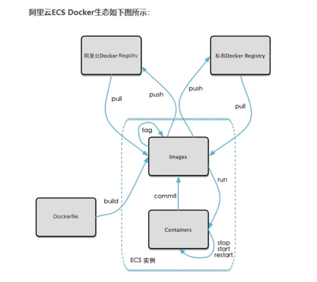

## 一、私有库概述

1. 官方Docker Hub地址：https://hub.docker.com/，中国大陆访问太慢了且准备被阿里云取代的趋势，不太主流
2. Dockerhub、阿里云这样的公共镜像仓库可能不太方便，涉及机密的公司不可能提供镜像给公网，所以需要创建一个本地私人仓库供给团队使用，基于公司内部项目构建镜像
3. Docker Registry是官方提供的工具，可以用于构建私有镜像仓库

## 二、将本地镜像推送到私有库

### 一、下载镜像Docker Registry

```shell
[root@CentOS201 sunsh]# docker pull registry
Using default tag: latest

[root@CentOS201 sunsh]# docker images
REPOSITORY                                            TAG       IMAGE ID       CREATED          SIZE
myubuntu                                              1.1       8d2447625e04   55 minutes ago   193MB
registry.cn-hangzhou.aliyuncs.com/sunshapp/myubuntu   1.1       8d2447625e04   55 minutes ago   193MB
tomcat                                                latest    fb5657adc892   2 years ago      680MB
redis                                                 latest    7614ae9453d1   2 years ago      113MB
registry                                              latest    b8604a3fe854   2 years ago      26.2MB
ubuntu                                                latest    ba6acccedd29   2 years ago      72.8MB
hello-world                                           latest    feb5d9fea6a5   2 years ago      13.3kB
```

### 二、运行私有库Registry，相当于本地有个私有Docker hub

```shell
[root@CentOS201 /]# docker run -d -p 5000:5000  -v /sunshapp/myregistry/:/tmp/registry --privileged=true registry
8abe1a3757d65f1ccad5557c8e8da9953b280a2cb9ae5af5ca0ce83e89c00624
```

- 默认情况，仓库被创建在容器的/var/lib/registry目录下，建议自行用容器卷映射，方便于宿主机联调

```shell
[root@CentOS201 /]# docker ps
CONTAINER ID   IMAGE          COMMAND                   CREATED             STATUS             PORTS                                       NAMES
8abe1a3757d6   registry       "/entrypoint.sh /etc…"   3 minutes ago       Up 3 minutes       0.0.0.0:5000->5000/tcp, :::5000->5000/tcp   sweet_hugle
9822d7d26858   8d2447625e04   "/bin/bash"               About an hour ago   Up About an hour                                               inspiring_montalcini
```

### 三、案例演示创建一个新镜像，ubuntu安装ifconfig命令

1. 从Hub上下载ubuntu镜像到本地并成功运行

2. 原始的Ubuntu镜像是不带着ifconfig命令的

   ```shell
   [root@CentOS201 /]# docker images
   REPOSITORY                                            TAG       IMAGE ID       CREATED             SIZE
   myubuntu                                              1.1       8d2447625e04   About an hour ago   193MB
   registry.cn-hangzhou.aliyuncs.com/sunshapp/myubuntu   1.1       8d2447625e04   About an hour ago   193MB
   tomcat                                                latest    fb5657adc892   2 years ago         680MB
   redis                                                 latest    7614ae9453d1   2 years ago         113MB
   registry                                              latest    b8604a3fe854   2 years ago         26.2MB
   ubuntu                                                latest    ba6acccedd29   2 years ago         72.8MB
   hello-world                                           latest    feb5d9fea6a5   2 years ago         13.3kB
   
   [root@CentOS201 /]# docker run -it 8d2447625e04
   root@847fb8756e69:/# ifconfig
   bash: ifconfig: command not found
   root@847fb8756e69:/# 
   ```

3. 外网连通的情况下，安装ifconfig命令并测试通过。docker容器内执行上述两条命令：`apt-get update`、`apt-get install net-tools`

   ```shell
   root@847fb8756e69:/# apt-get update
   
   root@847fb8756e69:/# apt-get install net-tools
   
   root@847fb8756e69:/# ifconfig
   eth0: flags=4163<UP,BROADCAST,RUNNING,MULTICAST>  mtu 1500
           inet 172.17.0.2  netmask 255.255.0.0  broadcast 172.17.255.255
           ether 02:42:ac:11:00:02  txqueuelen 0  (Ethernet)
           RX packets 257  bytes 1698339 (1.6 MB)
           RX errors 0  dropped 0  overruns 0  frame 0
           TX packets 236  bytes 14227 (14.2 KB)
           TX errors 0  dropped 0 overruns 0  carrier 0  collisions 0
   
   lo: flags=73<UP,LOOPBACK,RUNNING>  mtu 65536
           inet 127.0.0.1  netmask 255.0.0.0
           inet6 ::1  prefixlen 128  scopeid 0x10<host>
           loop  txqueuelen 1000  (Local Loopback)
           RX packets 0  bytes 0 (0.0 B)
           RX errors 0  dropped 0  overruns 0  frame 0
           TX packets 0  bytes 0 (0.0 B)
           TX errors 0  dropped 0 overruns 0  carrier 0  collisions 0
   
   ```

4. 安装完成后，commit我们自己的新镜像

   - 公式：`docker commit -m="提交的描述信息" -a="作者" 容器ID 要创建的目标镜像名:[标签名]`

   - 在容器外执行命令：`docker commit -m="ifconfig cmd add" -a="zzyy" a69d7c825c4f zzyyubuntu:1.2`

     ```shell
     [root@CentOS201 sunsh]# docker commit -m="add net-tools" -a="sunsh" 847fb8756e69 myubuntu:1.2
     sha256:900db28ad76304019341aa42a154a0e5e26518d37d29111e360f8ebd39104f59
     
     [root@CentOS201 /]# docker images
     REPOSITORY                                            TAG       IMAGE ID       CREATED              SIZE
     myubuntu                                              1.2       900db28ad763   About a minute ago   197MB
     myubuntu                                              1.1       8d2447625e04   About an hour ago    193MB
     registry.cn-hangzhou.aliyuncs.com/sunshapp/myubuntu   1.1       8d2447625e04   About an hour ago    193MB
     tomcat                                                latest    fb5657adc892   2 years ago          680MB
     redis                                                 latest    7614ae9453d1   2 years ago          113MB
     registry                                              latest    b8604a3fe854   2 years ago          26.2MB
     ubuntu                                                latest    ba6acccedd29   2 years ago          72.8MB
     hello-world                                           latest    feb5d9fea6a5   2 years ago          13.3kB
     ```

5. 启动我们的新镜像并和原来的对比

   ```shell
   [root@CentOS201 /]# docker run -it myubuntu:1.2
   root@5e14ffd7b9a9:/# ifconfig
   eth0: flags=4163<UP,BROADCAST,RUNNING,MULTICAST>  mtu 1500
           inet 172.17.0.2  netmask 255.255.0.0  broadcast 172.17.255.255
           ether 02:42:ac:11:00:02  txqueuelen 0  (Ethernet)
           RX packets 6  bytes 516 (516.0 B)
           RX errors 0  dropped 0  overruns 0  frame 0
           TX packets 0  bytes 0 (0.0 B)
           TX errors 0  dropped 0 overruns 0  carrier 0  collisions 0
   
   lo: flags=73<UP,LOOPBACK,RUNNING>  mtu 65536
           inet 127.0.0.1  netmask 255.0.0.0
           inet6 ::1  prefixlen 128  scopeid 0x10<host>
           loop  txqueuelen 1000  (Local Loopback)
           RX packets 0  bytes 0 (0.0 B)
           RX errors 0  dropped 0  overruns 0  frame 0
           TX packets 0  bytes 0 (0.0 B)
           TX errors 0  dropped 0 overruns 0  carrier 0  collisions 0
   
   ```

   - 官网是默认下载的Ubuntu没有ifconfig命令
   - 我们自己commit构建的新镜像，新增加了ifconfig功能，可以成功使用

### 四、curl验证私服库上的镜像

- `curl -XGET http://192.168.35.201:5000/v2/_catalog`。可以看到，目前私服库没有任何镜像上传过

  ```shell
  [root@CentOS201 /]# curl -XGET http://192.168.35.201:5000/v2/_catalog
  {"repositories":[]}
  ```

### 五、将新镜像myubuntu:1.2修改符合私服规范的Tag

1. 按照公式：`docker tag 镜像:Tag 自己Host:自己Port/Repository:Tag`

2. 使用命令docker tag将mybuntu:1.2 这个镜像修改为192.168.35.201:5000/myubuntu:1.2。命令为：`docker tag  myubuntu:1.2  192.168.35.201:5000/myubuntu:1.2`

   ```shell
   [root@CentOS201 /]# docker tag  myubuntu:1.2  192.168.35.201:5000/myubuntu:1.2
   [root@CentOS201 /]# docker images
   REPOSITORY                                            TAG       IMAGE ID       CREATED             SIZE
   myubuntu                                              1.2       900db28ad763   7 minutes ago       197MB
   192.168.35.201:5000/myubuntu                          1.2       900db28ad763   7 minutes ago       197MB
   myubuntu                                              1.1       8d2447625e04   About an hour ago   193MB
   registry.cn-hangzhou.aliyuncs.com/sunshapp/myubuntu   1.1       8d2447625e04   About an hour ago   193MB
   tomcat                                                latest    fb5657adc892   2 years ago         680MB
   redis                                                 latest    7614ae9453d1   2 years ago         113MB
   registry                                              latest    b8604a3fe854   2 years ago         26.2MB
   ubuntu                                                latest    ba6acccedd29   2 years ago         72.8MB
   hello-world                                           latest    feb5d9fea6a5   2 years ago         13.3kB
   
   ```

### 六、修改配置文件使之支持http

```shell
[root@CentOS201 /]# cat /etc/docker/daemon.json 
{
  "registry-mirrors": ["https://38h0dfa4.mirror.aliyuncs.com"],
  "insecure-registries": ["192.168.35.201:5000"]
}
```

- 别无脑照着复制，registry-mirrors 配置的是国内阿里提供的镜像加速地址，不用加速的话访问官网的会很慢

- 2个配置中间有个逗号`,`别漏了，这个配置是json格式的

- Docker命令外执行：`vim /etc/docker/daemon.json`。docker默认不允许http方式推送镜像，通过配置选项来取消这个限制。====> 修改完后如果不生效，建议重启docker

  ```json
  {
    "registry-mirrors": ["https://aa25jngu.mirror.aliyuncs.com"],
    "insecure-registries": ["192.168.111.162:5000"]
  }
  ```

### 七、push推送到私服库

- `docker push 192.168.35.201:5000/myubuntu:1.2`

  ```shell
  [root@CentOS201 /]# docker run -d -p 5000:5000  -v /sunshapp/myregistry/:/tmp/registry --privileged=true registry
  b11ba738acd024d1934731f4d8727aaafdf658819d63cff01910cb4dadaa7959
  [root@CentOS201 /]# docker push 192.168.35.201:5000/myubuntu:1.2
  The push refers to repository [192.168.35.201:5000/myubuntu]
  a3aa6c122976: Pushed 
  0a0a282da008: Pushed 
  9f54eef41275: Pushed 
  1.2: digest: sha256:3f880c539de8488301023ec793c9a17c2e1126039383455151390a413ec19b56 size: 952
  ```

### 八、curl再次验证私服库上的镜像

- `curl -XGET http://192.168.35.201:5000/v2/_catalog`。刚才push到本地的私服已经到位

  ```shell
  [root@CentOS201 /]# curl -XGET http://192.168.35.201:5000/v2/_catalog
  {"repositories":["myubuntu"]}
  ```

### 九、pull到本地并运行

- `docker pull 192.168.35.201:5000/myubuntu:1.2`

- `docker run -it 镜像ID /bin/bash`

  ```shell
  [root@CentOS201 /]# docker images
  REPOSITORY                                            TAG       IMAGE ID       CREATED          SIZE
  192.168.35.201:5000/myubuntu                          1.2       900db28ad763   20 minutes ago   197MB
  myubuntu                                              1.2       900db28ad763   20 minutes ago   197MB
  myubuntu                                              1.1       8d2447625e04   2 hours ago      193MB
  registry.cn-hangzhou.aliyuncs.com/sunshapp/myubuntu   1.1       8d2447625e04   2 hours ago      193MB
  tomcat                                                latest    fb5657adc892   2 years ago      680MB
  redis                                                 latest    7614ae9453d1   2 years ago      113MB
  registry                                              latest    b8604a3fe854   2 years ago      26.2MB
  ubuntu                                                latest    ba6acccedd29   2 years ago      72.8MB
  hello-world                                           latest    feb5d9fea6a5   2 years ago      13.3kB
  
  [root@CentOS201 /]# docker run -it 900db28ad763
  root@6a9137f05753:/# ifconfig
  eth0: flags=4163<UP,BROADCAST,RUNNING,MULTICAST>  mtu 1500
          inet 172.17.0.3  netmask 255.255.0.0  broadcast 172.17.255.255
          ether 02:42:ac:11:00:03  txqueuelen 0  (Ethernet)
          RX packets 6  bytes 516 (516.0 B)
          RX errors 0  dropped 0  overruns 0  frame 0
          TX packets 0  bytes 0 (0.0 B)
          TX errors 0  dropped 0 overruns 0  carrier 0  collisions 0
  
  lo: flags=73<UP,LOOPBACK,RUNNING>  mtu 65536
          inet 127.0.0.1  netmask 255.0.0.0
          inet6 ::1  prefixlen 128  scopeid 0x10<host>
          loop  txqueuelen 1000  (Local Loopback)
          RX packets 0  bytes 0 (0.0 B)
          RX errors 0  dropped 0  overruns 0  frame 0
          TX packets 0  bytes 0 (0.0 B)
          TX errors 0  dropped 0 overruns 0  carrier 0  collisions 0
  
  ```

# 七、Docker容器数据卷

## 一、参数--privileged

1. 容器卷记得加入：`--privileged=true`
2.  Docker挂载主机目录访问如果出现cannot open directory .: Permission denied
3. 解决方法：在挂载目录后多加一个`--privileged=true`参数即可。如果是CentOS7安全模块会比之前系统版本加强，不安全的会先禁止，所以目录挂载的情况被默认为不安全的行为，在SELinux里面挂载目录被禁止掉了，如果要开启，一般使用`--privileged=true`命令，扩大容器的权限解决挂载目录没有权限的问题，也使用该参数，使得container内的root拥有真正的root权限，否则，container内的root只是外部的一个普通用户权限

## 二、参数V


## 三、容器数据卷概述

1. 卷就是目录或文件，存在于一个或多个容器中，由docker挂载到容器，但不属于联合文件系统，因此能够绕过Union File System提供一些用于持续存储或共享数据的特性。卷的设计目的就是数据的持久化，完全独立于容器的生存周期，因此Docker不会在容器删除时删除其挂载的数据卷
2. 有点类似Redis里面的rdb和aof文件
3. 将docker容器内的数据保存进宿主机的磁盘中，运行一个带有容器卷存储功能的容器实例。命令为：`docker run -it --privileged=true -v /宿主机绝对路径目录:/容器内目录 镜像名`

## 四、容器数据卷作用

1. 将应用与运行的环境打包镜像，run后形成容器实例运行 ，但是我们对数据的要求希望是持久化的
2. Docker容器产生的数据，如果不备份，那么当容器实例删除后，容器内的数据自然也就没有了。为了能保存数据在docker中我们使用卷
3. 特点
   - 数据卷可在容器之间共享或重用数据
   - 卷中的更改可以直接实时生效
   - 数据卷中的更改不会包含在镜像的更新中
   - 数据卷的生命周期一直持续到没有容器使用它为止

## 五、数据卷案例

### 一、宿主和容器之间映射添加容器卷

1. 直接命令添加`docker run -it --privileged=true -v /宿主机绝对路径目录:/容器内目录 镜像名`。公式为：`docker run -it -v /宿主机目录:/容器内目录 ubuntu /bin/bash`、`docker run -it --name myu3 --privileged=true -v /tmp/myHostData:/tmp/myDockerData ubuntu /bin/bash`

   

2. 查看数据卷是否挂载成功

   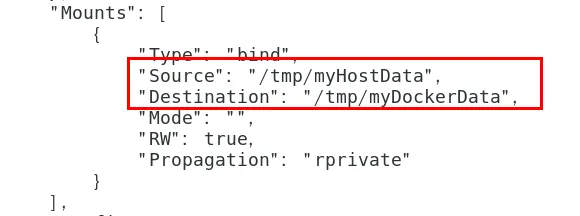

3. 容器和宿主机之间数据共享

   - docker修改，主机同步获得 

   - 主机修改，docker同步获得

   - docker容器stop，主机修改，docker容器重启后数据还是同步到docker中

     

### 二、读写规则映射添加说明

1. 默认读写：`docker run -it --privileged=true -v /宿主机绝对路径目录:/容器内目录:rw 镜像名`。rw = read + write

   

2. 只读：容器实例内部被限制，只能读取不能写

   

   - 容器目录:ro 镜像名：就能完成功能，此时容器自己只能读取不能写
   - ro = read only
   - 此时如果宿主机写入内容，可以同步给容器内，容器可以读取到
   - `docker run -it --privileged=true -v /宿主机绝对路径目录:/容器内目录:ro 镜像名`

### 三、卷的继承和共享

1. 容器1完成和宿主机的映射，命令为：`docker run -it  --privileged=true -v /mydocker/u:/tmp --name u1 ubuntu`

   

2. 容器2继承容器1的卷规则，命令为：`docker run -it  --privileged=true --volumes-from 父类  --name u2 ubuntu`

   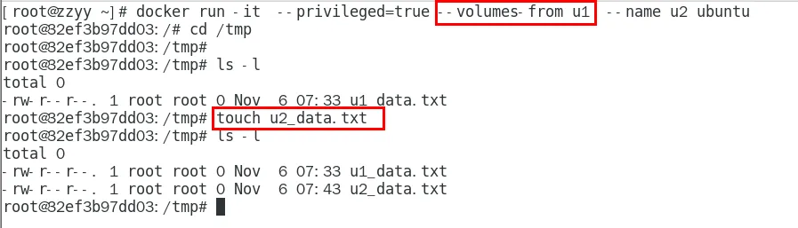

# 八、Docker常规安装简介

## 一、总体步骤

1. 搜索镜像
2. 拉取镜像
3. 查看镜像
4. 启动镜像 - 服务端口映射
5. 停止容器
6. 移除容器

## 二、安装tomcat

1. docker hub上面查找tomcat镜像：`docker search tomcat`

   ```shell
   [root@CentOS201 /]# docker search tomcat
   NAME                                            DESCRIPTION                                      STARS     OFFICIAL
   tomcat                                          Apache Tomcat is an open source implementati…   3676      [OK]
   tomee                                           Apache TomEE is an all-Apache Java EE certif…   115       [OK]
   ```

2. 从docker hub上拉取tomcat镜像到本地：`docker pull tomcat`

   ```shell
   [root@CentOS201 /]# docker pull tomcat
   Using default tag: latest
   ```

3. 查看是否有拉取到的tomcat：`docker images`

   ```shell
   [root@CentOS201 /]# docker images
   REPOSITORY                                            TAG       IMAGE ID       CREATED          SIZE
   192.168.35.201:5000/myubuntu                          1.2       900db28ad763   29 minutes ago   197MB
   myubuntu                                              1.2       900db28ad763   29 minutes ago   197MB
   registry.cn-hangzhou.aliyuncs.com/sunshapp/myubuntu   1.1       8d2447625e04   2 hours ago      193MB
   myubuntu                                              1.1       8d2447625e04   2 hours ago      193MB
   tomcat                                                latest    fb5657adc892   2 years ago      680MB
   redis                                                 latest    7614ae9453d1   2 years ago      113MB
   registry                                              latest    b8604a3fe854   2 years ago      26.2MB
   ubuntu                                                latest    ba6acccedd29   2 years ago      72.8MB
   hello-world                                           latest    feb5d9fea6a5   2 years ago      13.3kB
   ```

4. 使用tomcat镜像创建容器实例：`docker run -it -p 8080:8080 tomcat`

   ```shell
   [root@CentOS201 /]# docker run -it -p 8080:8080 tomcat
   ```

   

   - -p 小写，主机端口:docker容器端口
   - -P 大写，随机分配端口
   - -i 交互
   - -t 终端
   - -d 后台

5. 第一次访问猫首页出现404

   - 解决方案：可能没有映射端口或者没有关闭防火墙；把webapps.dist目录换成webapps

   - 先成功启动tomcat

   - 查看webapps文件夹查看为空

   - 把webapps.dist目录换成webapps

   - 一旦tomcat关闭，再启动还是会恢复原来的文件，可以将修改后的Tomcat容器变成我们自己的容器

     ```shell
     [root@CentOS201 /]# docker run -d -p 8080:8080 tomcat:latest
     3c439fcbeda8a8d1399f43ae4d1d48b1e799fb6511b4c28f3b580a81e3464ace
     
     [root@CentOS201 /]# docker ps
     CONTAINER ID   IMAGE           COMMAND                   CREATED              STATUS              PORTS                                       NAMES
     3c439fcbeda8   tomcat:latest   "catalina.sh run"         About a minute ago   Up About a minute   0.0.0.0:8080->8080/tcp, :::8080->8080/tcp   reverent_shtern
     b11ba738acd0   registry        "/entrypoint.sh /etc…"   26 minutes ago       Up 26 minutes       0.0.0.0:5000->5000/tcp, :::5000->5000/tcp   angry_sanderson
     
     [root@CentOS201 /]# docker exec -it 3c439fcbeda8 /bin/bash
     root@3c439fcbeda8:/usr/local/tomcat# ls
     BUILDING.txt  CONTRIBUTING.md  LICENSE  NOTICE  README.md  RELEASE-NOTES  RUNNING.txt  bin  conf  lib  logs  native-jni-lib  temp  webapps  webapps.dist  work
     
     root@3c439fcbeda8:/usr/local/tomcat# ls -l
     total 132
     -rw-r--r--. 1 root root 18994 Dec  2  2021 BUILDING.txt
     -rw-r--r--. 1 root root  6210 Dec  2  2021 CONTRIBUTING.md
     -rw-r--r--. 1 root root 60269 Dec  2  2021 LICENSE
     -rw-r--r--. 1 root root  2333 Dec  2  2021 NOTICE
     -rw-r--r--. 1 root root  3378 Dec  2  2021 README.md
     -rw-r--r--. 1 root root  6905 Dec  2  2021 RELEASE-NOTES
     -rw-r--r--. 1 root root 16517 Dec  2  2021 RUNNING.txt
     drwxr-xr-x. 2 root root  4096 Dec 22  2021 bin
     drwxr-xr-x. 1 root root    22 Jun 27 14:37 conf
     drwxr-xr-x. 2 root root  4096 Dec 22  2021 lib
     drwxrwxrwx. 1 root root    80 Jun 27 14:37 logs
     drwxr-xr-x. 2 root root   159 Dec 22  2021 native-jni-lib
     drwxrwxrwx. 2 root root    30 Dec 22  2021 temp
     drwxr-xr-x. 2 root root     6 Dec 22  2021 webapps
     drwxr-xr-x. 7 root root    81 Dec  2  2021 webapps.dist
     drwxrwxrwx. 2 root root     6 Dec  2  2021 work
     
     root@3c439fcbeda8:/usr/local/tomcat# cd webapps
     
     root@3c439fcbeda8:/usr/local/tomcat/webapps# ls
     
     root@3c439fcbeda8:/usr/local/tomcat/webapps# cd ..
     
     root@3c439fcbeda8:/usr/local/tomcat# cd webapps.dist/
     
     root@3c439fcbeda8:/usr/local/tomcat/webapps.dist# ls
     ROOT  docs  examples  host-manager  manager
     
     root@3c439fcbeda8:/usr/local/tomcat/webapps.dist# cd ..
     
     root@3c439fcbeda8:/usr/local/tomcat# rm -rf webapps
     
     root@3c439fcbeda8:/usr/local/tomcat# mv webapps.dist webapps
     
     root@3c439fcbeda8:/usr/local/tomcat# ls
     BUILDING.txt  CONTRIBUTING.md  LICENSE  NOTICE  README.md  RELEASE-NOTES  RUNNING.txt  bin  conf  lib  logs  native-jni-lib  temp  webapps  work
     root@3c439fcbeda8:/usr/local/tomcat# 
     ```

6. 免修改版说明：`docker pull billygoo/tomcat8-jdk8`、`docker run -d -p 8080:8080 --name mytomcat8 billygoo/tomcat8-jdk8`。这个不用修改配置，现在完直接访问就可以用了

   ```shell
   [root@CentOS201 /]# docker pull billygoo/tomcat8-jdk8
   Using default tag: latest
   
   [root@CentOS201 /]# docker images
   REPOSITORY                                            TAG       IMAGE ID       CREATED          SIZE
   mytomcat                                              1.1       1a0437135ab3   5 minutes ago    684MB
   192.168.35.201:5000/myubuntu                          1.2       900db28ad763   54 minutes ago   197MB
   myubuntu                                              1.2       900db28ad763   54 minutes ago   197MB
   myubuntu                                              1.1       8d2447625e04   2 hours ago      193MB
   registry.cn-hangzhou.aliyuncs.com/sunshapp/myubuntu   1.1       8d2447625e04   2 hours ago      193MB
   tomcat                                                latest    fb5657adc892   2 years ago      680MB
   redis                                                 latest    7614ae9453d1   2 years ago      113MB
   registry                                              latest    b8604a3fe854   2 years ago      26.2MB
   ubuntu                                                latest    ba6acccedd29   2 years ago      72.8MB
   hello-world                                           latest    feb5d9fea6a5   2 years ago      13.3kB
   billygoo/tomcat8-jdk8                                 latest    30ef4019761d   5 years ago      523MB
   
   [root@CentOS201 /]# docker run -d -p 8080:8080 --name mytomcat8 billygoo/tomcat8-jdk8
   8d5ea44af3479efbea25d5eb09d93538015a58b8d11eebe3cf888bb4f5d671c5
   ```

## 三、安装mysql

1. docker hub上面查找mysql镜像：`docker search mysql`

2. 从docker hub上（阿里云加速器）拉取mysql镜像到本地：`docker pull mysql`

3. 使用mysql镜像创建容器。命令出处

   

4. 简单版使用mysql镜像

   - 使用mysql镜像

     ```shell
     docker run -p 3306:3306 -e MYSQL_ROOT_PASSWORD=123456 -d mysql:latest
     docker ps
     docker exec -it 容器ID /bin/bash
     mysql -uroot -p
     ```

     

   - 建库建表插入数据

     

     

   - 外部Win10也来连接运行在dokcer上的mysql容器实例服务

     

   - 测试。插入中文数据。docker上默认字符集编码隐患，docker里面的mysql容器实例查看，内容如下：`SHOW VARIABLES LIKE 'character%'`

     

     

5. 实战版使用mysql镜像

   - 新建mysql容器实例

     ```shell
     docker run -d -p 3306:3306 
     --privileged=true 
     -v /sunshapp/mysql/log:/var/log/mysql 
     -v /sunshapp/mysql/data:/var/lib/mysql 
     -v /sunshapp/mysql/conf:/etc/mysql/conf.d 
     -eMYSQL_ROOT_PASSWORD=123456  
     --name mysql mysql:latest
     ```

     

   - 新建my.cnf，通过容器卷同步给mysql容器实例

     ```shell
     [client]
     default_character_set=utf8
     [mysqld]
     collation_server = utf8_general_ci
     character_set_server = utf8
     ```

     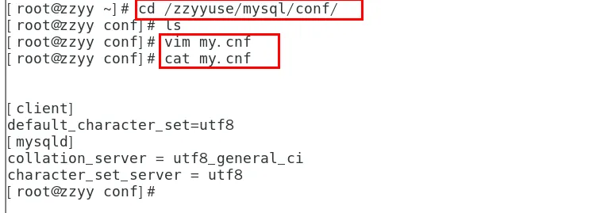

   - 重新启动mysql容器实例再重新进入并查看字符编码

     

     

   - 再新建库新建表再插入中文测试

     

     

   - 之前的DB无效，修改字符集操作+重启mysql容器实例；之后的DB有效，需要新建。docker安装完MySQL并run出容器后，建议请先修改完字符集编码后再新建mysql库-表-插数据。假如将当前容器实例删除，再重新来一次，之前建的db01实例还有吗？try

     

## 四、安装Redis

1. 从docker hub上（阿里云加速器）拉取redis镜像到本地标签为6.0.8

   

2. 入门命令

   

3. 命令提醒：容器卷记得加入--privileged=true

   - Docker挂载主机目录Docker访问出现cannot open directory .: Permission denied
   - 解决办法：在挂载目录后多加一个--privileged=true参数即可

4. 在CentOS宿主机下新建目录/app/redis：`mkdir -p /sunshapp/redis`

   

5. 将一个redis.conf文件模板拷贝进/sunshapp/redis目录下。将准备好的redis.conf文件放进/sunshapp/redis目录下

   

6. /sunshapp/redis目录下修改redis.conf文件。首先查看默认出厂的原始redis.conf

7. 使用redis6.0.8镜像创建容器

   ```shell
   docker run  
   -p 6379:6379 
   --name myr3 
   --privileged=true 
   -v /sunshapp/redis/redis.conf:/etc/redis/redis.conf 
   -v /sunshapp/redis/data:/data 
   -d redis:6.0.8 redis-server /etc/redis/redis.conf
   ```

   

8. 测试redis-cli连接上来：`docker exec -it 运行着Redis服务的容器ID redis-cli`

   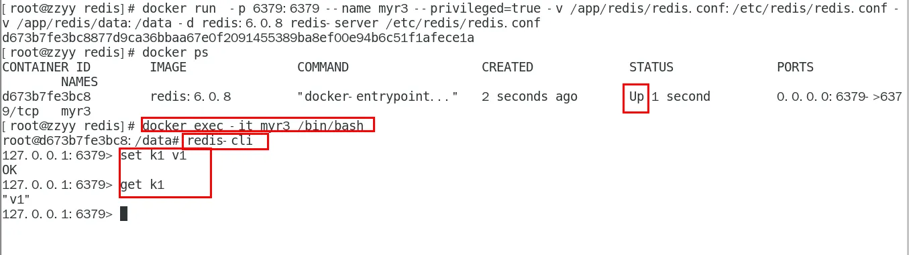

9. 请证明docker启动使用了我们自己指定的配置文件

   - 修改前：我们用的配置文件，数据库默认是16个

     

   - 修改后：宿主机的修改会同步给docker容器里面的配置。记得重启服务

     

10. 再次测试redis-cli连接上来

    

# 九、安装MySQL主从复制

## 一、新建主服务器容器

1. 新建主服务器容器实例3307

   ```shell
   docker run -p 3307:3306 --name mysql-master \
   -v /mydata/mysql-master/log:/var/log/mysql \
   -v /mydata/mysql-master/data:/var/lib/mysql \
   -v /mydata/mysql-master/conf:/etc/mysql \
   -e MYSQL_ROOT_PASSWORD=root  \
   -d mysql:5.7
   ```

2. 进入主服务器中的/mydata/mysql-master/conf目录下新建my.cnf。`vim my.cnf`

   ```shell
   [mysqld]
   ## 设置server_id，同一局域网中需要唯一
   server_id=101 
   ## 指定不需要同步的数据库名称
   binlog-ignore-db=mysql  
   ## 开启二进制日志功能
   log-bin=mall-mysql-bin  
   ## 设置二进制日志使用内存大小（事务）
   binlog_cache_size=1M  
   ## 设置使用的二进制日志格式（mixed,statement,row）
   binlog_format=mixed  
   ## 二进制日志过期清理时间。默认值为0，表示不自动清理。
   expire_logs_days=7  
   ## 跳过主从复制中遇到的所有错误或指定类型的错误，避免slave端复制中断。
   ## 如：1062错误是指一些主键重复，1032错误是因为主从数据库数据不一致
   slave_skip_errors=1062
   ```

3. 修改完配置后重启master实例：`docker restart mysql-master`

4. 进入mysql-master容器：`docker exec -it mysql-master /bin/bash`、`mysql -uroot -proot`

5. master容器实例内创建数据同步用户：`CREATE USER 'slave'@'%' IDENTIFIED BY '123456';`、`GRANT REPLICATION SLAVE, REPLICATION CLIENT ON *.* TO 'slave'@'%';`

## 二、新建从服务器容器

1. 新建从服务器容器实例3308

   ```shell
   docker run -p 3308:3306 --name mysql-slave \
   -v /mydata/mysql-slave/log:/var/log/mysql \
   -v /mydata/mysql-slave/data:/var/lib/mysql \
   -v /mydata/mysql-slave/conf:/etc/mysql \
   -e MYSQL_ROOT_PASSWORD=root  \
   -d mysql:5.7
   ```

2. 进入/mydata/mysql-slave/conf目录下新建my.cnf。`vim my.cnf`

   ```shell
   [mysqld]
   ## 设置server_id，同一局域网中需要唯一
   server_id=102
   ## 指定不需要同步的数据库名称
   binlog-ignore-db=mysql  
   ## 开启二进制日志功能，以备Slave作为其它数据库实例的Master时使用
   log-bin=mall-mysql-slave1-bin  
   ## 设置二进制日志使用内存大小（事务）
   binlog_cache_size=1M  
   ## 设置使用的二进制日志格式（mixed,statement,row）
   binlog_format=mixed  
   ## 二进制日志过期清理时间。默认值为0，表示不自动清理。
   expire_logs_days=7  
   ## 跳过主从复制中遇到的所有错误或指定类型的错误，避免slave端复制中断。
   ## 如：1062错误是指一些主键重复，1032错误是因为主从数据库数据不一致
   slave_skip_errors=1062  
   ## relay_log配置中继日志
   relay_log=mall-mysql-relay-bin  
   ## log_slave_updates表示slave将复制事件写进自己的二进制日志
   log_slave_updates=1  
   ## slave设置为只读（具有super权限的用户除外）
   read_only=1
   ```

3. 修改完配置后重启slave实例：`docker restart mysql-slave`

4. 在主数据库中查看主从同步状态：`show master status;`

5. 进入mysql-slave容器：`docker exec -it mysql-slave /bin/bash`、`mysql -uroot -proot`

6. 在从数据库中配置主从复制

   ```shell
   change master to master_host='宿主机ip', master_user='slave', master_password='123456', 
   master_port=3307, master_log_file='mall-mysql-bin.000001', master_log_pos=617, master_connect_retry=30;
   ```

   

   - 主从复制命令参数说明

   ```tex
   master_host：主数据库的IP地址；
   master_port：主数据库的运行端口；
   master_user：在主数据库创建的用于同步数据的用户账号；
   master_password：在主数据库创建的用于同步数据的用户密码；
   master_log_file：指定从数据库要复制数据的日志文件，通过查看主数据的状态，获取File参数；
   master_log_pos：指定从数据库从哪个位置开始复制数据，通过查看主数据的状态，获取Position参数；
   master_connect_retry：连接失败重试的时间间隔，单位为秒
   ```

7. 在从数据库中查看主从同步状态：`show slave status \G;`

   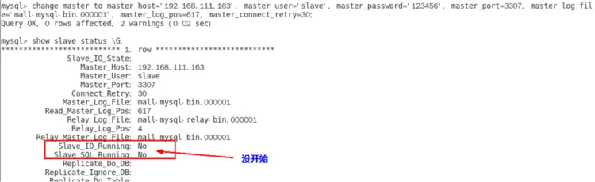

8. 在从数据库中开启主从同步：`start slave;`

   

9. 查看从数据库状态发现已经同步

   

10. 主从复制测试

    - 主机新建库-使用库-新建表-插入数据，ok
    - 从机使用库-查看记录，ok

# 十、安装Redis集群

## 一、Redis集群面试题

1. 1~2亿条数据需要缓存，设计这个存储的方式为：单机单台100%不可能，肯定是分布式存储。Redis集群的3种解决方案

2. 解决方案一：哈希取余分区

   

   ```tex
   2亿条记录就是2亿个k,v，我们单机不行必须要分布式多机，假设有3台机器构成一个集群，用户每次读写操作都是根据公式：
   	hash(key) % N个机器台数，计算出哈希值，用来决定数据映射到哪一个节点上
   	
   优点：
     简单粗暴，直接有效，只需要预估好数据规划好节点，例如3台、8台、10台，就能保证一段时间的数据支撑。使用Hash算法让固定的一部分请求落到同一台服务器上，这样每台服务器固定处理一部分请求（并维护这些请求的信息），起到负载均衡+分而治之的作用
   
   缺点：
      原来规划好的节点，进行扩容或者缩容就比较麻烦了，不管扩缩，每次数据变动导致节点有变动，映射关系需要重新进行计算，在服务器个数固定不变时没有问题，如果需要弹性扩容或故障停机的情况下，原来的取模公式就会发生变化：Hash(key)/3会变成Hash(key) /?。此时地址经过取余运算的结果将发生很大变化，根据公式获取的服务器也会变得不可控。某个redis机器宕机了，由于台数数量变化，会导致hash取余全部数据重新洗牌
   ```

3. 解决方案二：一致性哈希算法分区

   ```tex
   1、一致性哈希算法分区概述：提出一致性Hash解决方案。 目的是当服务器个数发生变动时， 尽量减少影响客户端到服务器的映射关系
   
   2、三大步骤
   	a.算法构建一致性哈希环：一致性哈希算法必然有个hash函数并按照算法产生hash值，这个算法的所有可能哈希值会构成一个全量集，这个集合可以成为一个hash空间[0,2^32-1]，这个是一个线性空间，但是在算法中，我们通过适当的逻辑控制将它首尾相连(0 = 2^32),这样让它逻辑上形成了一个环形空间。它也是按照使用取模的方法，前面介绍的节点取模法是对节点（服务器）的数量进行取模。而一致性Hash算法是对2^32取模，简单来说，一致性Hash算法将整个哈希值空间组织成一个虚拟的圆环，如假设某哈希函数H的值空间为0-2^32-1（即哈希值是一个32位无符号整形），整个哈希环如下图：整个空间按顺时针方向组织，圆环的正上方的点代表0，0点右侧的第一个点代表1，以此类推，2、3、4、……直到2^32-1，也就是说0点左侧的第一个点代表2^32-1， 0和2^32-1在零点中方向重合，我们把这个由2^32个点组成的圆环称为Hash环
   	b.服务器IP节点映射：节点映射是将集群中各个IP节点映射到环上的某一个位置。将各个服务器使用Hash进行一个哈希，具体可以选择服务器的IP或主机名作为关键字进行哈希，这样每台机器就能确定其在哈希环上的位置。假如4个节点NodeA、B、C、D，经过IP地址的哈希函数计算(hash(ip))，使用IP地址哈希后在环空间的位置分别在圆环的3点、6点、9点、12点位置
   	c.key落到服务器的落键规则：当我们需要存储一个kv键值对时，首先计算key的hash值，hash(key)，将这个key使用相同的函数Hash计算出哈希值并确定此数据在环上的位置，从此位置沿环顺时针“行走”，第一台遇到的服务器就是其应该定位到的服务器，并将该键值对存储在该节点上。如我们有Object A、Object B、Object C、Object D四个数据对象，经过哈希计算后，在环空间上的位置如下：根据一致性Hash算法，数据A会被定为到Node A上，B被定为到Node B上，C被定为到Node C上，D被定为到Node D上
   	
   3、优点
   	a.一致性哈希算法的容错性：假设Node C宕机，可以看到此时对象A、B、D不会受到影响，只有C对象被重定位到Node D。一般的，在一致性Hash算法中，如果一台服务器不可用，则受影响的数据仅仅是此服务器到其环空间中前一台服务器（即沿着逆时针方向行走遇到的第一台服务器）之间数据，其它不会受到影响。简单说，就是C挂了，受到影响的只是B、C之间的数据，并且这些数据会转移到D进行存储
   	b.一致性哈希算法的扩展性：数据量增加了，需要增加一台节点NodeX，X的位置在A和B之间，那收到影响的也就是A到X之间的数据，重新把A到X的数据录入到X上即可。不会导致hash取余全部数据重新洗牌
   
   4、缺点
   	一致性哈希算法的数据倾斜问题：一致性Hash算法在服务节点太少时，容易因为节点分布不均匀而造成数据倾斜（被缓存的对象大部分集中缓存在某一台服务器上）问题
   	
   5、小总结
   	为了在节点数目发生改变时尽可能少的迁移数据；
   	将所有的存储节点排列在收尾相接的Hash环上，每个key在计算Hash后会顺时针找到临近的存储节点存放；
   	将所有的存储节点排列在收尾相接的Hash环上，每个key在计算Hash后会顺时针找到临近的存储节点存放；
   	优点：加入和删除节点只影响哈希环中顺时针方向的相邻的节点，对其他节点无影响
   	缺点：数据的分布和节点的位置有关，因为这些节点不是均匀的分布在哈希环上的，所以数据在进行存储时达不到均匀分布的效果
   ```

   

   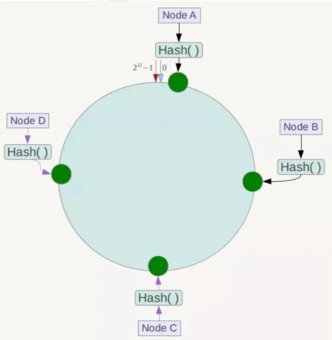

   

   

   

   

4. 哈希槽分区

   ```tex
   1、哈希槽分区出现的原因：解决一致性哈希算法的数据倾斜问题。哈希槽实质就是一个数组，数组[0,2^14 -1]形成hash slot空间
   
   2、可以解决均匀分配的问题，在数据和节点之间又加入了一层，把这层称为哈希槽（slot），用于管理数据和节点之间的关系，现在就相当于节点上放的是槽，槽里放的是数据。槽解决的是粒度问题，相当于把粒度变大了，这样便于数据移动。哈希解决的是映射问题，使用key的哈希值来计算所在的槽，便于数据分配
   
   3、一个集群只能有16384个槽，编号0-16383（0-2^14-1）。这些槽会分配给集群中的所有主节点，分配策略没有要求。可以指定哪些编号的槽分配给哪个主节点。集群会记录节点和槽的对应关系。解决了节点和槽的关系后，接下来就需要对key求哈希值，然后对16384取余，余数是几key就落入对应的槽里。slot = CRC16(key) % 16384。以槽为单位移动数据，因为槽的数目是固定的，处理起来比较容易，这样数据移动问题就解决了
   
   4、Redis 集群中内置了 16384 个哈希槽，redis 会根据节点数量大致均等的将哈希槽映射到不同的节点。当需要在 Redis 集群中放置一个 key-value时，redis 先对 key 使用 crc16 算法算出一个结果，然后把结果对 16384 求余数，这样每个 key 都会对应一个编号在 0-16383 之间的哈希槽，也就是映射到某个节点上。如下代码，key之A 、B在Node2， key之C落在Node3上
   ```

   

   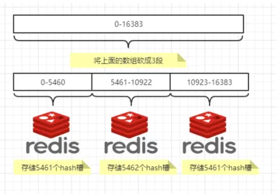

   

## 二、搭建步骤

1. 关闭防火墙+启动docker后台服务，`systemctl start docker`
2. 新建6个docker容器redis实例。命令分步解释
   - 创建并运行docker容器实例：`docker run`
   - 容器名字：`--name redis-node-6`
   - 使用宿主机的IP和端口，默认：`--net host`
   - 获取宿主机root用户权限：`--privileged=true`
   - 容器卷，宿主机地址:docker内部地址：`-v /data/redis/share/redis-node-6:/data`
   - redis镜像和版本号：`redis:6.0.8`
   - 开启redis集群：`--cluster-enabled yes`
   - 开启持久化：`--appendonly yes`
   - redis端口号：`--port 6386`
3. 进入容器redis-node-1并为6台机器构建集群关系
   - 进入容器：`docker exec -it redis-node-1 /bin/bash`
   - 构建主从关系
   - 链接进入6381作为切入点，查看集群状态：`cluster info`
   - 链接进入6381作为切入点，查看节点状态：`cluster nodes`
4. 主从容错切换迁移案例
   - 数据读写存储，启动6机构成的集群并通过exec进入
   - 对6381新增两个key，防止路由失效加参数-c并新增两个key
   - 查看集群信息
   - 容错切换迁移：主6381和从机切换，先停止主机6381；6381主机停了，对应的真实从机上位；6381作为1号主机分配的从机以实际情况为准，具体是几号机器就是几号
   - 再次查看集群信息
   - 先还原之前的3主3从
   - 先启6381：`docker start redis-node-1`
   - 再停6385：`docker stop redis-node-5`
   - 再启6385：`docker start redis-node-5`
   - 主从机器分配情况以实际情况为准
   - 查看集群状态：`redis-cli --cluster check 自己IP:6381`
5. 主从扩容案例
   - 新建6387、6388两个节点+新建后启动+查看是否8节点
   - 进入6387容器实例内部：`docker exec -it redis-node-7 /bin/bash`
   - 将新增的6387节点（空槽号）作为master节点加入原集群
   - 检查集群情况第1次
   - 重新分派槽号
   - 检查集群情况第2次
   - 槽号分派说明
   - 为主节点6387分配从节点6388
   - 检查集群情况第3次
6. 主从缩容案例
   - 目的：6387和6388下线
   - 检查集群情况1获得6388的节点ID
   - 将6388删除：从集群中将4号从节点6388删除
   - 将6387的槽号清空，重新分配，本例将清出来的槽号都给6381
   - 检查集群情况第二次
   - 将6387删除
   - 检查集群情况第三次

# 十一、DockerFile解析

## 一、Dockerfile概述

1. Dockerfile是用来构建Docker镜像的文本文件，是由一条条构建镜像所需的指令和参数构成的脚本

   

2. 构建三步骤

   - 编写Dockerfile文件
   - docker build 命令构建镜像
   - docker run 镜像 运行容器实例

## 二、DockerFile构建过程解析

### 一、 Dockerfile内容基础知识

1. 每条保留字指令都必须为大写字母且后面要跟随至少一个参数
2. 指令按照从上到下，顺序执行
3. \#表示注释
4. 每条指令都会创建一个新的镜像层并对镜像进行提交

### 二、Docker执行Dockerfile的大致流程

1. docker从基础镜像运行一个容器
2. 执行一条指令并对容器作出修改
3. 执行类似docker commit的操作提交一个新的镜像层
4. docker再基于刚提交的镜像运行一个新容器
5. 执行dockerfile中的下一条指令直到所有指令都执行完成

### 三、Dockerfile基础内容总结

1. 从应用软件的角度来看，Dockerfile、Docker镜像与Docker容器分别代表软件的三个不同阶段

   - Dockerfile是软件的原材料
   - Docker镜像是软件的交付品
   - Docker容器则可以认为是软件镜像的运行态，也即依照镜像运行的容器实例

2. Dockerfile面向开发，Docker镜像成为交付标准，Docker容器则涉及部署与运维，三者缺一不可，合力充当Docker体系的基石

   

   - Dockerfile，需要定义一个Dockerfile，Dockerfile定义了进程需要的一切东西。Dockerfile涉及的内容包括执行代码或者是文件、环境变量、依赖包、运行时环境、动态链接库、操作系统的发行版、服务进程和内核进程（当应用进程需要和系统服务和内核进程打交道，这时需要考虑如何设计namespace的权限控制）等等
   - Docker镜像，在用Dockerfile定义一个文件之后，docker build时会产生一个Docker镜像，当运行 Docker镜像时会真正开始提供服务
   - Docker容器，容器是直接提供服务的

## 三、DockerFile常用保留字指令

1. FROM：基础镜像，当前新镜像是基于哪个镜像的，指定一个已经存在的镜像作为模板，第一条必须是from

2. MAINTAINER：镜像维护者的姓名和邮箱地址

3. RUN：容器构建时需要运行的命令。有两种格式

   - shell格式：例如，`RUN yum -y install vim`

     

   - exec格式

     

   - RUN是在 docker build 时运行

4. EXPOSE：当前容器对外暴露出的端口

5. WORKDIR：指定在创建容器后，终端默认登陆的进来工作目录，一个落脚点

6. USER：指定该镜像以什么样的用户去执行，如果都不指定，默认是root

7. ENV：用来在构建镜像过程中设置环境变量。例如，`ENV MY_PATH /usr/mytest`

   - 这个环境变量可以在后续的任何RUN指令中使用，这就如同在命令前面指定了环境变量前缀一样
   - 也可以在其它指令中直接使用这些环境变量吗，例如，`WORKDIR $MY_PATH`

8. ADD：将宿主机目录下的文件拷贝进镜像且会自动处理URL和解压tar压缩包

9. COPY：类似ADD，拷贝文件和目录到镜像中。将从构建上下文目录中 <源路径> 的文件/目录复制到新的一层的镜像内的 <目标路径> 位置

   ```shell
   COPY src dest
   COPY ["src", "dest"]
   <src源路径>：源文件或者源目录
   <dest目标路径>：容器内的指定路径，该路径不用事先建好，路径不存在的话，会自动创建
   ```

10. VOLUME：容器数据卷，用于数据保存和持久化工作

11. CMD：指定容器启动后的要干的事情

    

    - Dockerfile 中可以有多个 CMD 指令，但只有最后一个生效，CMD 会被 docker run 之后的参数替换
    - CMD和RUN命令的区别
      - CMD是在 docker run 时运行
      - RUN是在 docker build 时运行

12. ENTRYPOINT：也是用来指定一个容器启动时要运行的命令。类似于 CMD 指令，但是ENTRYPOINT 不会被docker run后面的命令覆盖， 而且这些命令行参数会被当作参数送给 ENTRYPOINT 指令指定的程序

    - 命令格式：ENTRYPOINT可以和CMD一起用，一般是变参才会使用 CMD ，这里的 CMD 等于是在给 ENTRYPOINT 传参

      

    - 当指定了ENTRYPOINT后，CMD的含义就发生了变化，不再是直接运行其命令而是将CMD的内容作为参数传递给ENTRYPOINT指令，他两个组合会变成

      

    - 案例如下：假设已通过 Dockerfile 构建了 nginx:test 镜像：

      

      

    - 优点：在执行docker run的时候可以指定 ENTRYPOINT 运行所需的参数

    - 注意：如果 Dockerfile 中如果存在多个 ENTRYPOINT 指令，仅最后一个生效

13. 命令总结

    

## 四、自定义镜像

### 一、自定义镜像mycentosjava8

1. 要求：Centos7镜像具备vim+ifconfig+jdk8

   

2. [JDK的下载镜像地址](https://www.oracle.com/java/technologies/downloads/#java8)

3. 准备编写Dockerfile文件

   ```shell
   FROM centos
   MAINTAINER zzyy<zzyybs@126.com>
   
   ENV MYPATH /usr/local
   WORKDIR $MYPATH
   
   #安装vim编辑器
   RUN yum -y install vim
   #安装ifconfig命令查看网络IP
   RUN yum -y install net-tools
   #安装java8及lib库
   RUN yum -y install glibc.i686
   RUN mkdir /usr/local/java
   #ADD 是相对路径jar，把jdk-8u171-linux-x64.tar.gz添加到容器中，
   #安装包必须要和Dockerfile文件在同一位置
   ADD jdk-8u171-linux-x64.tar.gz /usr/local/java/
   #配置java环境变量
   ENV JAVA_HOME /usr/local/java/jdk1.8.0_171
   ENV JRE_HOME $JAVA_HOME/jre
   ENV CLASSPATH $JAVA_HOME/lib/dt.jar:$JAVA_HOME/lib/tools.jar:$JRE_HOME/lib:$CLASSPATH
   ENV PATH $JAVA_HOME/bin:$PATH
   
   EXPOSE 80
   
   CMD echo $MYPATH
   CMD echo "success--------------ok"
   CMD /bin/bash
   ```

4. 构建命令：`docker build -t 新镜像名字:TAG .`。例如，`docker build -t centosjava8:1.5 .`。注意，上面TAG后面有个空格，有个点

   

5. 运行命令：`docker run -it 新镜像名字:TAG`。例如，`docker run -it centosjava8:1.5 /bin/bash`

   

### 二、虚悬镜像

1. 虚悬镜像概述：仓库名、标签都是<none>的镜像，俗称dangling image

2. 模拟一个虚悬镜像

   - `vim Dockerfile`

   - `docker build .`

     

   - 查看：`docker image ls -f dangling=true`

     

   - 删除：`docker image prune`。虚悬镜像已经失去存在价值，可以删除

     

### 三、自定义镜像myubuntu

1. 准备编写DockerFile文件

   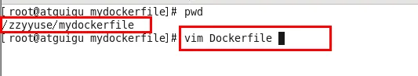

   ```shell
   FROM ubuntu
   MAINTAINER zzyy<zzyybs@126.com>
    
   ENV MYPATH /usr/local
   WORKDIR $MYPATH
    
   RUN apt-get update
   RUN apt-get install net-tools
   #RUN apt-get install -y iproute2
   #RUN apt-get install -y inetutils-ping
    
   EXPOSE 80
    
   CMD echo $MYPATH
   CMD echo "install inconfig cmd into ubuntu success--------------ok"
   CMD /bin/bash
   ```

2. 构建：`docker build -t 新镜像名字:TAG .`

3. 运行：`docker run -it 新镜像名字:TAG`

# 十二、Docker微服务实战

## 一、构建微服务项目

1. 创建maven以及新建Module，名称为docker_boot

2. 修改pom

   ```xml
   <?xml version="1.0" encoding="UTF-8"?>
   <project xmlns="http://maven.apache.org/POM/4.0.0" xmlns:xsi="http://www.w3.org/2001/XMLSchema-instance"
            xsi:schemaLocation="http://maven.apache.org/POM/4.0.0 https://maven.apache.org/xsd/maven-4.0.0.xsd">
     <modelVersion>4.0.0</modelVersion>
     <parent>
       <groupId>org.springframework.boot</groupId>
       <artifactId>spring-boot-starter-parent</artifactId>
       <version>2.5.6</version>
       <relativePath/>
     </parent>
     
     <groupId>com.atguigu.docker</groupId>
     <artifactId>docker_boot</artifactId>
     <version>0.0.1-SNAPSHOT</version>
     
     <properties>
       <project.build.sourceEncoding>UTF-8</project.build.sourceEncoding>
       <maven.compiler.source>1.8</maven.compiler.source>
       <maven.compiler.target>1.8</maven.compiler.target>
       <junit.version>4.12</junit.version>
       <log4j.version>1.2.17</log4j.version>
       <lombok.version>1.16.18</lombok.version>
       <mysql.version>5.1.47</mysql.version>
       <druid.version>1.1.16</druid.version>
       <mapper.version>4.1.5</mapper.version>
       <mybatis.spring.boot.version>1.3.0</mybatis.spring.boot.version>
     </properties>
     
     <dependencies>
       <!--SpringBoot通用依赖模块-->
       <dependency>
         <groupId>org.springframework.boot</groupId>
         <artifactId>spring-boot-starter-web</artifactId>
       </dependency>
       <dependency>
         <groupId>org.springframework.boot</groupId>
         <artifactId>spring-boot-starter-actuator</artifactId>
       </dependency>
       <!--test-->
       <dependency>
         <groupId>org.springframework.boot</groupId>
         <artifactId>spring-boot-starter-test</artifactId>
         <scope>test</scope>
       </dependency>
     </dependencies>
     
     <build>
       <plugins>
         <plugin>
           <groupId>org.springframework.boot</groupId>
           <artifactId>spring-boot-maven-plugin</artifactId>
         </plugin>
         <plugin>
           <groupId>org.apache.maven.plugins</groupId>
           <artifactId>maven-resources-plugin</artifactId>
           <version>3.1.0</version>
         </plugin>
       </plugins>
     </build>
     
   </project>
   ```

3. 修改YML

   ```properties
   server.port=6001
   ```

4. 主启动类

   ```java
   package com.atguigu.docker;
   
   import org.springframework.boot.SpringApplication;
   import org.springframework.boot.autoconfigure.SpringBootApplication;
   
   @SpringBootApplication
   public class DockerBootApplication
   {
       public static void main(String[] args)
       {
           SpringApplication.run(DockerBootApplication.class, args);
       }
       
   }
   ```

5. 业务类

   ```java
   package com.atguigu.docker.controller;
   
   import org.springframework.beans.factory.annotation.Value;
   import org.springframework.web.bind.annotation.RequestMapping;
   import org.springframework.web.bind.annotation.RequestMethod;
   import org.springframework.web.bind.annotation.RestController;
   
   import java.util.UUID;
   
   /**
    * @auther zzyy
    * @create 2021-10-25 17:43
    */
   @RestController
   public class OrderController
   {
       @Value("${server.port}")
       private String port;
   
       @RequestMapping("/order/docker")
       public String helloDocker()
       {
           return "hello docker"+"\t"+port+"\t"+ UUID.randomUUID().toString();
       }
   
       @RequestMapping(value ="/order/index",method = RequestMethod.GET)
       public String index()
       {
           return "服务端口号: "+"\t"+port+"\t"+UUID.randomUUID().toString();
       }
   }
   ```

## 二、Dockerfile发布微服务

1. IDEA工具里面搞定微服务jar包

   

2. 编写Dockerfile

   ```dockerfile
   # 基础镜像使用java
   FROM java:8
   # 作者
   MAINTAINER zzyy
   # VOLUME 指定临时文件目录为/tmp，
   # 在主机/var/lib/docker目录下创建了一个临时文件并链接到容器的/tmp
   VOLUME /tmp
   # 将jar包添加到容器中并更名为zzyy_docker.jar
   ADD docker_boot-0.0.1-SNAPSHOT.jar zzyy_docker.jar
   # 运行jar包
   RUN bash -c 'touch /zzyy_docker.jar'
   ENTRYPOINT ["java","-jar","/zzyy_docker.jar"]
   #暴露6001端口作为微服务
   EXPOSE 6001
   ```

3. 将微服务jar包和Dockerfile文件上传到同一个目录下/mydocker，并运行构建命令将其打包成镜像文件`docker build -t zzyy_docker:1.6 .`

   

4. 运行容器：`docker run -d -p 6001:6001 zzyy_docker:1.6`

   

5. 访问测试

   

# 十三、Docker网络

## 一、Docekr网络概述

1. Docker不启动时，默认网络情况

   

   ```tex
   在CentOS7的安装过程中如果有选择相关虚拟化的的服务安装系统后，启动网卡时会发现有一个以网桥连接的私网地址的virbr0网卡（virbr0网卡：它还有一个固定的默认IP地址192.168.122.1），是做虚拟机网桥的使用的，其作用是为连接其上的虚机网卡提供 NAT访问外网的功能
    
   我们之前学习Linux安装，勾选安装系统的时候附带了libvirt服务才会生成的一个东西，如果不需要可以直接将libvirtd服务卸载
   
   yum remove libvirt-libs.x86_64
   ```

2. Docker启动后，网络情况。会产生一个名为Docker0的虚拟网桥

   

3. 查看docker网络模式命令，默认创建3大网络模式

   

## 二、常用基本命令

1. ALL命令

   

2. 创建网络：` docker network create XXX网络名字 `

3. 查看网络：`docker network inspect XXX网络名字 `

4. 查看网络源数据：`docker network inspect XXX网络名字`

5. 删除网络：`docker network rm XXX网络名字`

6. 案例

   

## 三、Docekr网络的作用

1. 容器间的互联和通信以及端口映射， 可以使用容器的名称或IP地址来访问其他容器 
2. 容器IP变动时候可以通过服务名直接网络通信而不受到影响

## 四、网络模式

### 一、总体介绍

| 网络模式  | 描述                                                         |
| --------- | ------------------------------------------------------------ |
| bridge    | 为每一个容器分配、设置IP等，并将容器连接到一个docker0。虚拟网络，默认为此模式 |
| host      | 容器不会虚拟出自己的网卡，配置自己的IP等，而是使用宿主机的IP和端口 |
| none      | 容器有独立的Network Namespace，但并没有对其进行任何网络设置，如分配veth pair和网桥连接、IP等 |
| container | 新创建的容器不会创建自己的网卡和配置自己的IP，而是和一个指定的容器共享IP、端口范围等 |

- bridge模式：使用--network bridge指定，默认使用docker0
- host模式：使用--network host指定
- none模式：使用--network none指定
- container模式：使用--network container:NAME或者容器ID指定

### 二、容器实例内默认网络IP生产规则

1. 先启动两个ubuntu容器实例

   

2. docker inspect 容器ID or 容器名字

   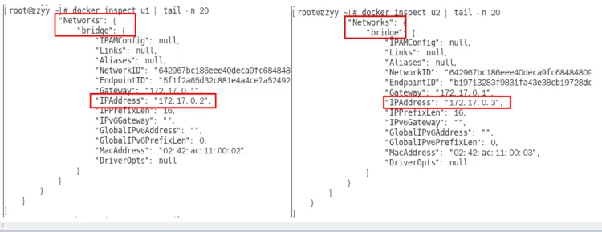

3. 关闭u2实例，新建u3，查看ip变化

   

4. 结论：docker容器内部的ip是有可能会发生改变的

### 三、案例说明

### 四、Docker平台架构图解

1. 整体说明。从其架构和运行流程来看，Docker 是一个 C/S 模式的架构，后端是一个松耦合架构，众多模块各司其职。 Docker 运行的基本流程为：

   - 用户是使用 Docker Client 与 Docker Daemon 建立通信，并发送请求给后者
   - Docker Daemon 作为 Docker 架构中的主体部分，首先提供 Docker Server 的功能使其可以接受 Docker Client 的请求
   - Docker Engine 执行 Docker 内部的一系列工作，每一项工作都是以一个 Job 的形式的存在
   - Job 的运行过程中，当需要容器镜像时，则从 Docker Registry 中下载镜像，并通过镜像管理驱动 Graph driver将下载镜像以Graph的形式存储
   - 当需要为 Docker 创建网络环境时，通过网络管理驱动 Network driver 创建并配置 Docker 容器网络环境
   - 当需要限制 Docker 容器运行资源或执行用户指令等操作时，则通过 Execdriver 来完成
   - Libcontainer是一项独立的容器管理包，Network driver以及Exec driver都是通过Libcontainer来实现具体对容器进行的操作

2. 整体架构

   

# 十四、Docker-compose容器编排

## 一、Docker-compose容器编排概述

1. Docker-Compose 是 Docker 官方的开源项目，负责实现对Docker容器集群的快速编排 、
2. Docker-Compose 可以管理多个Docker容器组成一个应用。需要定义一个yaml格式的配置文件 docker-compose.yml，配置好多个容器之间的调用关系，然后只需要一个命令就能同时启动/关闭这些容器
3. Docker建议我们每个容器中只运行一个服务，因为Docker容器本身占用资源极少，所以最好是将每个服务单独的分割开来。但是如果我们需要同时部署多个服务，每个服务单独构建镜像构建容器就会比较麻烦。所以 Docker 官方推出了 docker-compose 多服务部署的工具  
4. Compose允许用户通过一个单独的 docker-compose.yml 模板文件来定义一组相关联的应用容器为一个项目（project）。可以很容易的用一个配置文件定义一个多容器的应用，然后使用一条指令安装这个应用的所有依赖，完成构建
5. 核心概念
   - 服务（service）：一个个应用容器实例
   - 工程（project）：由一组关联的应用容器组成的一个完整业务单元，在docker-compose.yml中定义
6. Compose使用的三个步骤
   - 编写 Dockerfile 定义各个应用容器，并构建出对应的镜像文件
   - 编写 docker-compose.yml，定义一个完整的业务单元，安排好整体应用中的各个容器服务
   - 执行 docker-compose up 命令，其创建并运行整个应用程序，完成一键部署上线

## 二、安装docker-compose

1. Docker-Compose 的版本需要和 Docker 引擎版本对应，可以参照官网上的对应关系。https://docs.docker.com/compose/compose-file/compose-file-v3/ 

   

2. 安装Compose，可以参考官网：https://docs.docker.com/compose/install/standalone/ 

3. 下载docker-compose后，需要添加执行权限，然后才可以使用 

   ```shell
   # 例如从github下载 2.23.3 版本的docker-compose
   # 下载下来的文件放到 /usr/local/bin目录下，命名为 docker-compose
   curl -SL https://github.com/docker/compose/releases/download/v2.23.3/docker-compose-linux-x86_64 -o /usr/local/bin/docker-compose
   
   # 如果GitHub下载速度比较慢的话使用下面的地址：
   curl -L https://get.daocloud.io/docker/compose/releases/download/1.25.0/docker-compose-`uname -s`-`uname -m` > /usr/local/bin/docker-compose
   
   # 添加权限
   chmod +x /usr/local/bin/docker-compose
   
   # 验证
   docker-compose version
   ```

4. 卸载Compose：直接删除 `usr/local/bin/docker-compose`文件即可 

## 三、docker-compose常用命令

1. 执行命令时，需要在对应的docker-compose.yml文件所在目录下执行。查看帮助： 

   ```shell
   docker-compose -h
   ```

2. 创建并启动docker-compose服务：（类似 docker run） 

   ```shell
   docker-compose up
   # 后台运行
   docker-compose up -d
   ```

3. 停止并删除容器、网络、卷、镜像：（类似 docker stop +  docker rm） 

   ```shell
   docker-compose down
   ```

4. 进入容器实例内部： 

   ```shell
   docker-compose exec <yml里面的服务id> /bin/bash
   ```

5. 展示当前docker-compose编排过的运行的所有容器： 

   ```shell
   docker-compose ps
   ```

6. 展示当前docker-compose编排过的容器进程： 

   ```shell
   docker-compose top
   ```

7. 查看容器输出日志：

   ```shell
   docker-compose log <yml里面的服务id>
   ```

8. 检查配置： 

   ```shell
   docker-compose config
   # 有问题才输出
   docker-compose config -q
   ```

9. 重启服务： 

   ```shell
   docker-compose restart
   ```

10. 启动服务：（类似 docker start） 

    ```shell
    docker-compose start
    ```

11. 停止服务： 

    ```shell
    docker-compose stop
    ```

## 四、docker-compose配置规则

-  创建docker-compse.yml核心，参考官网地址：https://docs.docker.com/compose/compose-file/compose-file-v3/ 

- 示例

  ```yaml
  version: '' # 版本
  servers:  # 服务
    服务1: web
       # 服务的配置
       build
       network
       images
    服务2: redis
    服务3:
    服务4:
    ...
  # 其他配置 网络，全局的规则 数据卷
  volumes:
  configs:
  networks:
  ```

## 五、部署案例

[博客](https://www.cnblogs.com/auguse/articles/17865012.html)

# 十五、Docker轻量级可视化工具Portainer

1. Portainer概述：Portainer 是一款轻量级的应用，它提供了图形化界面，用于方便地管理Docker环境，包括单机环境和集群环境

2. 安装

   - [Portainer官网](https://www.portainer.io/)
   - [官网介绍](https://docs.portainer.io/v/ce-2.9/start/install/server/docker/linux)

3. 步骤

   - docker命令安装

     ```shell
     docker run -d -p 8000:8000 -p 9000:9000 
     --name portainer 
     --restart=always 
     -v /var/run/docker.sock:/var/run/docker.sock 
     -v portainer_data:/data 
     portainer/portainer 
     ```

   - 第一次登录需创建admin，访问地址：xxx.xxx.xxx.xxx:9000。用户名，直接用默认admin

     密码记得8位，随便写

     

   - 设置admin用户和密码后首次登陆

     

   - 选择local选项卡后本地docker详细信息展示

     

   - 对应的命令为`docker system df`

# 十六、Docker容器监控之CAdvisor+InfluxDB+Granfana