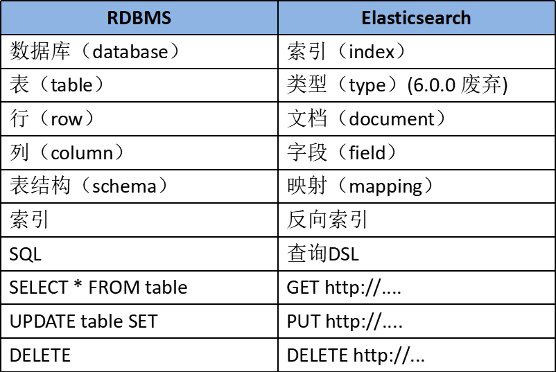

# 一、ElasticSearch知识体系

## 一、官方文档

- [低版本中文文档](https://www.elastic.co/guide/cn/elasticsearch/guide/current/foreword_id.html)
- [最新版官方文档](https://www.elastic.co/guide/en/elasticsearch/reference/7.x/index.html)
- [Java操作ES的客户端文档](https://www.elastic.co/guide/en/elasticsearch/client/java-rest/current/java-rest-high.html)
- [ Kibana数据可视化界面使用官方文档 ](https://www.elastic.co/guide/en/elasticsearch/client/java-rest/current/java-rest-high.html)

## 二、参考文档

- [ElasticSearch知识体系详解](https://www.pdai.tech/md/db/nosql-es/elasticsearch.html)
- [SpringBoot检索篇-整合ElasticSearch7.6.2](https://blog.csdn.net/weixin_41105242/article/details/107711634)

## 三、ElasticSearch前景

1. 在当前软件行业中，搜索是一个软件系统或平台的基本功能， 学习ElasticSearch就可以为相应的软件打造出良好的搜索体验
2. 其次，ElasticSearch具备非常强的大数据分析能力。虽然Hadoop也可以做大数据分析，但是ElasticSearch的分析能力非常高，具备Hadoop不具备的能力。比如有时候用Hadoop分析一个结果，可能等待的时间比较长
3. ElasticSearch可以很方便的进行使用，可以将其安装在个人的笔记本电脑，也可以在生产环境中，将其进行水平扩展
4. 国内比较大的互联网公司都在使用，比如小米、滴滴、携程等公司。另外，在腾讯云、阿里云的云平台上，也都有相应的ElasticSearch云产品可以使用
5. 在当今大数据时代，掌握近实时的搜索和分析能力，才能掌握核心竞争力，洞见未来

## 四、ElasticSearch概述

1. ELK 是 Elasticsearch、Logstash、Kibana 三大开源框架的首字母大写简称。市面上也被称为Elastic Stack 
2. ElasticSearch 是一款非常强大的、基于Lucene的开源搜索及分析引擎；它是一个实时的分布式搜索分析引擎，它能让你以前所未有的速度和规模，去探索你的数据 
3. Elasticsearch 被用作全文检索、结构化搜索、分析以及这三个功能的组合 
4. Elasticsearch 是使用 Java 编写的，它的内部使用 Lucene 做索引与搜索，但是它的目的是使全文检索变得简单，通过隐藏 Lucene 的复杂性，取而代之的提供一套简单一致的 RESTful API 
5. Elasticsearch 不仅仅是 Lucene，并且也不仅仅只是一个全文搜索引擎。 它可以被下面这样准确的形容：
   - 一个分布式的实时文档存储，每个字段可以被索引与搜索
   - 一个分布式实时分析搜索引擎
   - 能胜任上百个服务节点的扩展，并支持 PB 级别的结构化或者非结构化数据 

## 五、Elasticsearch和Solr比较

1. Elasticsearch 基本是开箱即用，非常简单。Solr 安装略微复杂一丢丢
2. Solr 利用 Zookeeper 进行分布式管理，而 Elasticsearch 自身带有分布式协调管理功能
3. Solr 支持更多格式的数据，比如JSON、XML、CSV，而 Elasticsearch 仅支持 JSON 文件格式
4. Solr 官方提供的功能更多，而 Elasticsearch 本身更注重于核心功能，高级功能多有第三方插件提供，例如图形化界面需要 kibana 友好支撑
5. Solr 查询快，但更新索引时慢（即插入删除慢），用于电商等查询多的应用；
   - Elasticsearch 建立索引快，即查询慢，即实时性查询快，用于facebook、新浪等搜索
   - Solr 是传统搜索应用的有力解决方案，但 Elasticsearch 更适用于新兴的实时搜索应用
6. Solr比较成熟，有一个更大，更成熟的用户、开发和贡献者社区，而 Elasticsearch 相对开发维护者较少，更新太快，学习使用成本较高

# 二、ES基础概念

## 一、ES核心名词

1. **Near Realtime（NRT）**： 近实时。数据提交索引后，立马就可以搜索到
2. **Cluster 集群**：一个集群有一个唯一的名字标识，默认为“elasticsearch”。集群名称非常重要，具有相同集群名的节点才会组成一个集群。集群名称可以在配置文件中指定
3. **Node 节点**：存储集群的数据，参与集群的索引和搜索功能。像集群有名字，节点也有自己的名称，默认在启动时会以一个随机的UUID的前七个字符作为节点的名字，也可以为其指定任意的名字。通过集群名在网络中发现同伴组成集群。一个节点也可是集群
4. **Index 索引**：一个索引是一个文档的集合。每个索引有唯一的名字，通过这个名字来操作它。一个集群中可以有任意多个索引
5. **Type 类型**：指在一个索引中，可以索引不同类型的文档，如用户数据、博客数据。从6.0.0版本起已废弃，一个索引中只存放一类数据
6. **Document 文档**：被索引的一条数据，索引的基本信息单元，以JSON格式来表示。
7. **Shard 分片**：在创建一个索引时可以指定分成多少个分片来存储。每个分片本身也是一个功能完善且独立的“索引”，可以被放置在集群的任意节点上
8. **Replication 备份**：一个分片可以有多个备份（副本）

## 二、ES名词和数据库名词对比



## 三、RESTful

1. RESTful 指的是一组架构约束条件和原则。满足这些约束条件和原则的应用程序或设计就是 RESTful。Web 应用程序最重要的 REST 原则是，客户端和服务器之间的交互在请求之间是无状态的。从客户端到服务器的每个请求都必须包含理解请求所必需的信息。如果服务器在请求之间的任何时间点重启，客户端不会得到通知。此外，无状态请求可以由任何可用服务器回答，这十分适合云计算之类的环境。客户端可以缓存数据以改进性能
2. 在服务器端，应用程序状态和功能可以分为各种资源。资源是一个有趣的概念实体，它向客户端公开。资源的例子有：应用程序对象、数据库记录、算法等等。每个资源都使用 URI (Universal Resource Identifier) 得到一个唯一的地址。所有资源都共享统一的接口，以便在客户端和服务器之间传输状态。使用的是标准的 HTTP 方法，比如 GET、PUT、POST 和 DELETE
3. 在 REST 样式的 Web 服务中，每个资源都有一个地址。资源本身都是方法调用的目标，方法列表对所有资源都是一样的。这些方法都是标准方法，包括 HTTP GET、POST、 PUT、DELETE，还可能包括 HEAD 和 OPTIONS。简单的理解就是，如果想要访问互联网上的资源，就必须向资源所在的服务器发出请求，请求体中必须包含资源的网络路径，以及对资源进行的操作（增删改查）

# 三、ES安装

## 一、官网相关教程

1. [官方网站](https://www.elastic.co/cn/)
2. [官方2.x中文教程中安装教程](https://www.elastic.co/guide/cn/elasticsearch/guide/current/running-elasticsearch.html)
3. [官方ElasticSearch下载地址](https://www.elastic.co/cn/downloads/elasticsearch)
4. [官方Kibana下载地址](https://www.elastic.co/cn/downloads/kibana)

## 二、安装ElasticSearch

### 一、安装注意事项

- ElasticSearch 是使用 java 开发的，且本版本的 es 需要的 JDK 版本要是 1.8 以上，所以安装
- ElasticSearch 之前保证 JDK1.8+ ，并正确的配置好JDK环境变量，否则会启动ElasticSearch失败 

### 二、Windows版本安装

#### 一、ElasticSearch安装

1. [Win版本下载ElasticSearch](https://artifacts.elastic.co/downloads/elasticsearch/elasticsearch-7.6.1.zip)

2. 文件目录

   ```tex
   bin：启动文件
   config：配置文件
       log4j2.properties：日志配置文件
       jvm.options：java虚拟机的配置
       elasticsearch.yml：es的配置文件
   data：索引数据目录
   lib：相关类库Jar包
   logs：日志目录
   modules：功能模块
   plugins：插件
   ```

3. 启动方式：双击 ElasticSearch 下的 bin 目录中的 elasticsearch.bat 启动 

4. 访问地址：http://localhost:9200 

#### 二、ES图形化插件Head安装

1. 注意点：需要NodeJS环境

2. Head 是 elasticsearch 的集群管理工具，可以用于数据的浏览查询！被托管在 github 上面 

3. [下载地址](https://github.com/mobz/elasticsearch-head/)

4. 解压并安装

   ```shell
   #安装依赖！
   cnpm install
   #运行
   npm run start
   ```

5. 修改配置文件 `elasticsearch.yml`。由于 ES 进程和客户端进程端口号不同，存在跨域问题，所以我们要在 ES 的配置文件中配置下跨域问题

   ```yaml
   # 跨域配置：
   http.cors.enabled: true
   http.cors.allow-origin: "*"
   ```

6. 启动测试

   - 启动 ElasticSearch
   - 并使用head工具进行连接测试！
   - 访问url：http://localhost:9100/

#### 三、Kibana安装

1. 注意版本对应关系：https://www.elastic.co/cn/downloads/kibana 

2. 解压后进入，双击`kibana.bat`启动服务就可以了，ELK基本上都是拆箱即用的

3. 访问地址：http://localhost:5601/。Kibana 会自动去访问9200，也就是 elasticsearch 的端口号（当然 elasticsearch 这个时候必须启动着），然后就可以使用 kibana 了！ 

4. 访问界面是英文，可修改成中文。只需要在配置文件 kibana.yml 中加入 

   ```shell
   i18n.locale: "zh-CN"
   ```

5. 重启即可

### 三、Linux版本安装

#### 一、ElasticSearch安装

1. 进入一个目录，进行下载

   ```shell
   curl -O https://artifacts.elastic.co/downloads/elasticsearch/elasticsearch-7.6.1-linux-x86_64.tar.gz
   ```
   
2. 解压

   ```shell
   tar zxvf /opt/elasticsearch-7.6.1-linux-x86_64.tar.gz
   ```

3. 增加 elasticSearch 用户。必须创建一个非 root 用户来运行 ElasticSearch 。 如果使用 root 用户来启动 ElasticSearch ，启动会报错 。ElasticSearch5 及以上版本，基于安全考虑，强制规定不能以 root 身份运行  

   ```shell
   [root@VM-0-6-centos elasticsearch-7.6.1]# useradd elasticsearch
   [root@VM-0-6-centos elasticsearch-7.6.1]# passwd elasticsearch
   Changing password for user elasticsearch.
   New password: 
   BAD PASSWORD: The password contains the user name in some form
   Retype new password: 
   passwd: all authentication tokens updated successfully.
   ```
   
4. 修改目录权限至新增的 elasticsearch 用户。没权限启动会报错，需要在 root 用户下执行命令

   ```shell
   [root@VM-0-6-centos ~]# chown -R elasticsearch /opt/elasticsearch-7.6.1
   ```

5. 启动

   ```shell
   #切换用户
   su elasticsearch
   #启动
   ./bin/elasticsearch -d
   ```

6. 查看安装是否安装

   ```shell
   [root@VM-0-6-centos ~]# netstat -ntlp | grep 9200
   tcp6       0      0 127.0.0.1:9200          :::*                    LISTEN      11601/java          
   tcp6       0      0 ::1:9200                :::*                    LISTEN      11601/java          
   #	访问成功
   [root@VM-0-6-centos ~]# curl 127.0.0.1:9200
   {
     "name" : "VM-0-6-centos",
     "cluster_name" : "elasticsearch",
     "cluster_uuid" : "sLGiUbfQQ5-btWB9QiOnxg",
     "version" : {
       "number" : "7.6.1",
       "build_flavor" : "default",
       "build_type" : "tar",
       "build_hash" : "aa751e09be0a5072e8570670309b1f12348f023b",
       "build_date" : "2020-02-29T00:15:25.529771Z",
       "build_snapshot" : false,
       "lucene_version" : "8.4.0",
       "minimum_wire_compatibility_version" : "6.8.0",
       "minimum_index_compatibility_version" : "6.0.0-beta1"
     },
     "tagline" : "You Know, for Search"
   }
   
   
   ```

#### 二、Kibana安装

- 安装 Kibana 及 ElasticSearch 相关配置请访问：https://www.pdai.tech/md/db/nosql-es/elasticsearch-x-install.html 

### 四、Docker版本安装

#### 一、基础安装

1. [官方文档](https://www.elastic.co/guide/en/kibana/current/docker.html)

2. 创建网络

   ```shell
   docker network create elastic
   ```

3. 加上内存限制启动ES

   ```shell
   docker run -d --name es01-test --net elastic -p 9200:9200 -p 9300:9300 -e "discovery.type=single-node" -e ES_JAVA_OPTS="-Xms64m -Xmx512m" elasticsearch:7.6.1
   ```

4. 启动Kibana

5. 可视化工具 Elasticsearch-head（可选） 

   ```shell
   docker run -d --name head-test --net elastic -p 9100:9100  mobz/elasticsearch-head:5
   ```

#### 二、配置密码访问

1. 修改ES配置：使用基本许可证时，默认情况下禁用 ElasticSearch 安全功能。[相关文档](https://www.elastic.co/guide/en/elasticsearch/reference/7.12/security-minimal-setup.html) 

2. 进入正在运行的容器

   ```shell
   docker exec -it 容器id /bin/bash
   #安装 vim
   yum -y install vim
   ```

3. 更改`config/elasticsearch.yml`文件，设置`xpack.security.enabled`为 true

   ```shell
   [root@06c5914709a5 config]# vim elasticsearch.yml
   [root@06c5914709a5 config]# cat elasticsearch.yml
   cluster.name: "docker-cluster"
   network.host: 0.0.0.0
   xpack.security.enabled: true
   
   ```

4. 重启ES容器

   ```shell
   [root@VM-0-6-centos z-test]# docker restart es01-test
   es01-test
   ```

5. 进入容器设置各个组件的密码

   ```java
   [root@06c5914709a5 elasticsearch]# ./bin/elasticsearch-setup-passwords interactive
   Initiating the setup of passwords for reserved users elastic,apm_system,kibana,logstash_system,beats_system,remote_monitoring_user.
   You will be prompted to enter passwords as the process progresses.
   Please confirm that you would like to continue [y/N]y
   
   
   Enter password for [elastic]: 
   Reenter password for [elastic]: 
   Enter password for [apm_system]: 
   Reenter password for [apm_system]: 
   Enter password for [kibana]: 
   Reenter password for [kibana]: 
   Enter password for [logstash_system]: 
   Reenter password for [logstash_system]: 
   Enter password for [beats_system]: 
   Reenter password for [beats_system]: 
   Enter password for [remote_monitoring_user]: 
   Reenter password for [remote_monitoring_user]: 
   Changed password for user [apm_system]
   Changed password for user [kibana]
   Changed password for user [logstash_system]
   Changed password for user [beats_system]
   Changed password for user [remote_monitoring_user]
   Changed password for user [elastic]
   
   ```

6. 修改`kibana.yml`

7. 进入容器

8. 添加配置：`elasticsearch.username: "elastic"`

   ```shell
   bash-4.2$ vi kibana.yml
   bash-4.2$ cat kibana.yml
   #
   # ** THIS IS AN AUTO-GENERATED FILE **
   #
   
   # Default Kibana configuration for docker target
   server.name: kibana
   server.host: "0"
   elasticsearch.hosts: [ "http://elasticsearch:9200" ]
   xpack.monitoring.ui.container.elasticsearch.enabled: true
   elasticsearch.username: "elastic"
   
   ```

9. 创建 kibana keystore 

   ```shell
   ./bin/kibana-keystore create
   ```

10. 在kibana keystore 中添加密码

    ```shell
    ./bin/kibana-keystore add elasticsearch.password
    ```

11. 再次访问：`ip:9200`，则需要输入账号和密码。账号为：elastic

# 四、ES索引和文档的基本操作

## 一、索引简单操作

### 一、创建索引

1. 通过 postman 创建索引，调用接口：`http://localhost:9200/shopping’

   

   ```json
   {
       //响应结果
       "acknowledged": true,
       //分片结果
       "shards_acknowledged": true,
       //索引名称
       "index": "shopping"
   }
   ```

2. 注意点：创建索引库的分片数默认 1 片，在 7.0.0 之前的 Elasticsearch 版本中，默认 5 片 

3. 使用 Kibana的 dev tool 进行测试。如果重复添加索引，会返回错误信息 

   

### 二、查看索引

1. 查看所有索引：`GET /_cat/indices?v`

   

   - 查看字段解释。这里请求路径中的`_cat`表示查看的意思，`indices`表示索引，所以整体含义就是查看当前 ES 服务器中的所有索引 

   - 返回字段含义

     | 字段           | 含义                                                         |
     | -------------- | ------------------------------------------------------------ |
     | health         | 当前服务器健康状态：<br/>green(集群完整)；yellow(单点正常、集群不完整)；red(单点不正常) |
     | status         | 索引打开、关闭状态                                           |
     | index          | 索引名                                                       |
     | uuid           | 索引统一编号                                                 |
     | pri            | 主分片数量                                                   |
     | rep            | 副本数量                                                     |
     | docs.count     | 可用文档数量                                                 |
     | docs.deleted   | 文档删除状态（逻辑删除）                                     |
     | store.size     | 主分片和副分片整体占空间大小                                 |
     | pri.store.size | 主分片占空间大小                                             |

2. 查看单个索引：`GET /shopping`

   - 查看索引向 ES 服务器发送的请求路径和创建索引是一致的。但是 HTTP 方法不一致 

   - 响应结果

     ```json
     {
       "shopping" : {//【索引名】
         "aliases" : { },//【别名】
         "mappings" : { },//"【映射】
         "settings" : {
           "index" : {
             "creation_date" : "1624201817578",//【创建时间】
             "number_of_shards" : "1",//【主分片数量】
             "number_of_replicas" : "1",//【副分片数量】
             "uuid" : "5fPfnRjcTuyxReq7AFKQnw",//【唯一标识】
             "version" : {
               "created" : "7060199"//【版本】
             },
             "provided_name" : "shopping"
           }
         }
       }
     }
     
     ```

3. mappting 和 setting

   - mappings是修改字段和类型的。mappings就是对索引库中索引的字段名称及其数据类型进行定义，类似于mysql中的表结构信息。不过es的mapping比数据库灵活很多，它可以动态识别字段。一般不需要指定mapping都可以，因为es会自动根据数据格式识别它的类型，如果你需要对某些字段添加特殊属性（如：定义使用其它分词器、是否分词、是否存储等），就必须手动添加mapping。在es中添加索引数据时不需要指定数据类型，es中有自动影射机制，字符串映射为string，数字映射为long。通过mappings可以指定数据类型是否存储等属性 
   - settings是修改分片和副本数的 

### 三、删除索引

- 删除索引命令：`DELETE /shopping`

  ```json
  {
    "acknowledged" : true
  }
  ```

### 四、批量索引文档_bulk

1. ES 还提供了批量操作，比如这里我们可以使用批量操作来插入一些数据。使用批量来批处理文档操作比单独提交请求要快得多，因为它减少了网络往返 

2. [下载测试数据](https://download.elastic.co/demos/kibana/gettingstarted/accounts.zip)

3. 数据格式如下

   ```json
   {
     "account_number": 0,
     "balance": 16623,
     "firstname": "Bradshaw",
     "lastname": "Mckenzie",
     "age": 29,
     "gender": "F",
     "address": "244 Columbus Place",
     "employer": "Euron",
     "email": "bradshawmckenzie@euron.com",
     "city": "Hobucken",
     "state": "CO"
   }
   
   ```

4. 把文件复制到 ES 的 data 目录下

   ```shell
   docker cp /home/accounts.json  06c5914709a5:/usr/share/elasticsearch/data/
   
   #然后执行
   curl -H "Content-Type: application/json" -XPOST "localhost:9200/bank/_bulk?pretty&refresh" --data-binary @accounts.json
   
   #如果在其他目录，例如 /opt/accounts.json
   curl -H "Content-Type: application/json" -XPOST "localhost:9200/bank/_bulk?pretty&refresh" --data-binary "@/opt/accounts.json"
   ```

5. 使用postman运行请求方式为POST的接口`http://localhost:9200/bank/_bulk` 

   -  两行为一个整体，index代表索引，也就是保存操作，下面一行为保存的数据 

     ```json
     {"index":{"_id":"1"}}
     {"name":"a"}
     {"index":{"_id":"2"}}
     {"name":"b"}
     ```

   - 语法格式：`action`即执行的动作，新增，修改，删除等；`metadata`即要操作的数据，比如id是多少

     ```json
     {action:{metadata}}
     {request body  }
     
     {action:{metadata}}
     {request body  }
     ```

   - 这里的批量操作，当发生某一条执行发生失败时，其他的数据仍然能够接着执行，也就是说彼此之间是独立的 

6. bulk API 以此按顺序执行所有的 action（动作）。如果一个单个的动作因任何原因而失败， 它将继续处理它后面剩余的动作。当 bulk API 返回时，它将提供每个动作的状态（与发送的顺序相同），所以可以检查是否一个指定的动作是不是失败了

7. bulk 案例

   - 案例说明：对于整个索引执行批量操作（需在kibana里Dev Tools执行）。当没指定任何索引时，就是对整个作批量操作 

   - 代码

     ```shell
     POST /_bulk
     {"delete":{"_index":"website","_id":"123"}}
     {"create":{"_index":"website","_id":"123"}}
     {"title":"my first blog post"}
     {"index":{"_index":"website"}}
     {"title":"my second blog post"}
     {"update":{"_index":"website","_id":"123"}}
     {"doc":{"title":"my updated blog post"}}
     ```

## 二、文档基本操作

### 一、添加数据PUT

1. 添加用户1

   ```json
   PUT /stars/_doc/1
   {
     "name": "蔡徐坤",
     "age": "22",
     "desc": "鸡你太美",
     "tags": ["唱","跳","rap","篮球"]
   }
   ```

2. 添加用户2

   ```shell
   PUT /stars/_doc/2
   {
     "name": "吴亦凡",
     "age": "29",
     "desc": "大碗宽面",
     "tags": ["加拿大","电鳗","说唱","嘻哈"]
   }
   ```

3. 添加用户3

   ```json
   PUT /stars/_doc/3
   {
     "name": "吴小凡",
     "age": "10",
     "desc": "一个吴小凡",
     "tags": ["帅哥","干饭"]
   }
   ```

### 二、查询数据GET

1. 简单查询

   ```shell
   GET /stars/_doc/1
   ```

   ```json
   {
     "_index" : "stars",
     "_type" : "_doc",
     "_id" : "1",
     "_version" : 1,
     "_seq_no" : 0,
     "_primary_term" : 1,
     "found" : true,
     "_source" : {
       "name" : "蔡徐坤",
       "age" : "22",
       "desc" : "鸡你太美",
       "tags" : [
         "唱",
         "跳",
         "rap",
         "篮球"
       ]
     }
   }
   
   ```

2. 条件查询`_search?q=`

   ```shell
   GET /stars/_search?q=name:吴小凡
   ```

   ```json
   {
     "took" : 996,
     "timed_out" : false,
     "_shards" : {
       "total" : 1,
       "successful" : 1,
       "skipped" : 0,
       "failed" : 0
     },
     "hits" : {
       "total" : {
         "value" : 2,
         "relation" : "eq"
       },
       "max_score" : 2.5902672,
       "hits" : [
         {
           "_index" : "stars",
           "_type" : "_doc",
           "_id" : "3",
           "_score" : 2.5902672,
           "_source" : {
             "name" : "吴小凡",
             "age" : "10",
             "desc" : "一个吴小凡",
             "tags" : [
               "帅哥",
               "干饭"
             ]
           }
         },
         {
           "_index" : "stars",
           "_type" : "_doc",
           "_id" : "2",
           "_score" : 1.3862942,
           "_source" : {
             "name" : "吴亦凡",
             "age" : "29",
             "desc" : "大碗宽面",
             "tags" : [
               "加拿大",
               "电鳗",
               "说唱",
               "嘻哈"
             ]
           }
         }
       ]
     }
   }
   ```

3. 查询所有

   ```shell
   GET /stars/_search
   {
     "query": { 
       "match_all": {} 
     }
   }
   ```

4. 相关字段解释 

   - `took`：Elasticsearch运行查询所花费的时间（以毫秒为单位）
   - `timed_out`：搜索请求是否超时
   - `_shards`：搜索了多少个碎片，以及成功，失败或跳过了多少个碎片的细目分类
   - `max_score`：找到的最相关文档的分数
   - `hits.total.value`：找到了多少个匹配的文档
   - `hits.sort`：文档的排序位置（不按相关性得分排序时）
   - `hits._score`：文档的相关性得分（使用match_all时不适用）

### 三、更新数据POST

1. 使用POST方式

   ```shell
   POST /stars/_update/1
   {
     "doc": {
       "name": "坤坤"
     }
   }
   ```

   ```json
   {
     "_index" : "stars",
     "_type" : "_doc",
     "_id" : "1",
     "_version" : 2,
     "result" : "updated",
     "_shards" : {
       "total" : 2,
       "successful" : 1,
       "failed" : 0
     },
     "_seq_no" : 3,
     "_primary_term" : 1
   }
   
   ```

   - `_version`：版本，也就是更新次数
   - `result`：操作结果为更新

2. 使用PUT方式也可覆盖数据

   ```shell
   PUT /stars/_doc/1
   {
     "name": "蔡坤坤",
     "age": "22",
     "desc": "鸡你太美",
     "tags": ["唱","跳","rap","篮球"]
   }
   ```

### 四、删除数据

1. 删除一个文档不会立即从磁盘上移除，它只是被标记成已删除（逻辑删除） 

2. 根据 ID 删除数据

   ```shell
   DELETE /stars/_doc/1
   ```

3. 条件删除文档：一般删除数据都是根据文档的唯一性标识进行删除，实际操作时，也可以根据条件对多条数据进行删除 

   ```shell
   POST /stars/_delete_by_query
   {
    "query":{
      "match":{
        "age": 22
      }
    }
   }
   ```

### 五、索引的自动创建

1. 添加数据时，没有索引会自动创建索引和字段

   ```shell
   PUT /customer/_doc/1
   {
     "name": "John Doe"
   }
   ```

2. 可以查看下这个索引的 mapping => `GET /customer/_mapping` 

   ```json
   {
     "customer" : {
       "mappings" : {
         "properties" : {
           "name" : {
             "type" : "text",
             "fields" : {
               "keyword" : {
                 "type" : "keyword",
                 "ignore_above" : 256
               }
             }
           }
         }
       }
     }
   }
   ```

3. 那么如果我们需要对这个建立索引的过程做更多的控制：比如想要确保这个索引有数量适中的主分片，并且在我们索引任何数据之前，分析器和映射已经被建立好。那么就会引入两点：第一个禁止自动创建索引，第二个是手动创建索引

4. 禁止自动创建索引：可以通过在 config/elasticsearch.yml 的每个节点下添加`action.auto_create_index: false` 

### 六、索引的格式

1.  在请求体里面传入设置或类型映射，如下所示：

   ```shell
   PUT /my_index
   {
       "settings": { ... any settings ... },
       "mappings": {
           "properties": { ... any properties ... }
       }
   }
   
   ```

2. settings：用来设置分片、副本等配置信息

3. mappings：字段映射、类型等

   - properties：由于 type 在后续版本中会被 Deprecated，所以无需被 type 嵌套

## 三、索引管理操作

### 一、创建索引

1. 创建一个 user 索引`test-index-users`，其中包含三个属性：name，age，remarks；存储在一个分片一个副本上 

   ```shell
   PUT /test-index-users
   {
     "settings": {
   		"number_of_shards": 1,
   		"number_of_replicas": 1
   	},
     "mappings": {
       "properties": {
         "name": {
           "type": "text",
           "fields": {
             "keyword": {
               "type": "keyword",
               "ignore_above": 256
             }
           }
         },
         "age": {
           "type": "long"
         },
         "remarks": {
           "type": "text"
         }
       }
     }
   }
   ```

2. 执行结果

   

3. 插入测试数据

   

4. 查看数据

   

5. 测试下不匹配的数据类型（age）：可以看到无法类型不匹配的错误

   ```shell
   POST /test-index-users/_doc
   {
     "name": "test user",
     "age": "error_age",
     "remarks": "hello eeee"
   }
   ```

   

### 二、修改索引

1. 查看刚才的索引` curl 'localhost:9200/_cat/indices?v' | grep users `  

2. 我们注意到刚创建的索引的状态是 yellow 的，因为此时是单点环境，无法创建副本，但是在上述`number_of_replicas`配置中设置了副本数是1；所以在这个时候我们需要修改索引的配置。修改副本数量为0

   ```shell
   PUT /test-index-users/_settings
   {
     "settings": {
       "number_of_replicas": 0
     }
   }
   ```

   

3.  再次查看状态

   ```shell
   green open test-index-users                          LSaIB57XSC6uVtGQHoPYxQ 1 1     1    0   4.4kb   4.4kb
   ```

### 三、关闭索引

1. 一旦索引被关闭，那么这个索引只能显示元数据信息，不能够进行读写操作

   

2.  当关闭以后，再插入数据时

   

### 四、打开索引

1. 打开索引

   

2. 打开后，又可以重新写数据了

   

### 五、删除索引

- 将创建的  test-index-users 删除：`DELETE /test-index-users`

  

### 六、查看索引

1. mapping：`GET /bank/_mapping`

   

2. setting：`GET /bank/_settings`

   

# 五、ES高级查询操作

## 一、SearchAPI概述

1. ES支持两种基本方式检索

   - 通过REST request uri 发送搜索参数（uri +检索参数）
   - 通过REST request body 来发送它们（uri+请求体）

2. 检索示例

   ```shell
   GET bank/_search?q=*&sort=account_number:asc
   
   #等价于
   GET bank/_search 
   {
       "query":{
           "match_all":{ }
       },
       "sort":[
           {
               "account_number":{
                   "order":"desc"
               }
           }
       ]
   }
   ```

## 二、查询数据Query DSL

### 一、指定字段查询match

-  查询 name 中含有坤或小

  ```shell
  GET /stars/_search
  {
    "query": {
      "match": {
        "name": "坤 小"
      }
    }
  }
  ```

### 二、查询短语匹配match_phrase

- 如果我们希望查询的条件是某字段中包含 "坤 小"，也就是将需要匹配的值当成一个整体单词（不分词）进行检索，使用`match_phrase`

  ```shell
  GET /stars/_search
  {
    "query": {
      "match_phrase": {
        "name": "坤 小"
      }
    }
  }
  ```

### 三、多字段匹配multi_match

- 查询 state 或者 address 包含`mill` 

  ```shell
   GET bank/_search 
  {
      "query":{
          "multi_match":{
              "query":"mill",
              "fields":[
                  "state",
                  "address"
              ]
          }
      }
  }
  ```

### 四、查询结果显示指定字段

- 查询结果只显示 age 和 desc 

  ```shell
  GET /stars/_search
  {
    "query": {
      "match": {
        "name": "凡"
      }
    },
    "_source":["age", "desc"] 
  }
  ```

### 五、排序

- asc 升序、desc 降序

  ```shell
  GET /stars/_search
  {
    "query": { "match_all": {} },
    "sort": [
      {
        "age.keyword": {
          "order": "desc"
        }
      }
    ]
  }
  ```

### 六、分页查询

- 本质上就是 from（开始位置）和 size（返回数据数目）两个字段

  ```shell
  GET /stars/_search
  {
    "query": { "match_all": {} },
    "from": 0,
    "size": 2
  }
  ```

### 七、多条件查询

1. must：相当于关系型数据库 and

   ```shell
   GET /stars/_search
   {
     "query": {
       "bool": {
         "must": [
           {
             "match": {
               "name": "吴亦凡"
             }
           },
           {
             "match": {
               "age": "29"
             }
           }
         ]
       }
     }
   }
   
   ```

2. should：相当于关系型数据库 or 

   ```shell
   GET /stars/_search
   {
     "query": {
       "bool": {
         "should": [
           {
             "match": {
               "name": "吴亦凡"
             }
           },
           {
             "match": {
               "age": "19"
             }
           }
         ]
       }
     }
   }
   ```

3. must_not：相当于关系型数据库 not 

### 八、结果过滤查询filter

- 查询 10岁<=age=<30岁 

  ```shell
  GET /stars/_search
  {
    "query": {
      "bool": {
        "filter": [
          {
            "range": {
              "age": {
                "gte": 10, 
                "lte": 30 
              }
            }
          }
        ]
      }
    }
  }
  ```

### 九、匹配多个条件查询

- 多个条件使用空格隔开 

- 查询 tags 有 唱跳 的 

  ```shell
  GET /stars/_search
  {
    "query": {
      "match": {
        "tags": "唱 跳"
      }
    }
  }
  ```

### 十、精确查询term

#### 一、关于分词

1. term：直接通过倒排索引指定的词条进行精确查询

   ```shell
   GET stars/_search
   {
     "query": {
       "bool": {
         "must": [
           {
             "term": {
               "name": "吴亦凡"
             }
           }
         ]
       }
     }
   }
   ```

   ```json
   {
     "took" : 0,
     "timed_out" : false,
     "_shards" : {
       "total" : 1,
       "successful" : 1,
       "skipped" : 0,
       "failed" : 0
     },
     "hits" : {
       "total" : {
         "value" : 0,
         "relation" : "eq"
       },
       "max_score" : null,
       "hits" : [ ]
     }
   }
   ```

2. match：先分析文档，再通过分析的文档进行查询。吴小凡 也会被查出来 

   

#### 二、两个字段类型

- text：会被分词器解析
- keyword：不会被分词器解析

1. 创建索引，用`mappings`指明类型，并插入数据

   ```shell
   PUT testdb
   {
       "mappings": {
           "properties": {
               "name": {
                   "type": "text"
               }, 
               "desc": {
                   "type": "keyword"
               }
           }
       }
   }
   
   
   PUT testdb/_doc/1
   {
     "name": "赵深宸 name",
     "desc": "致远 desc"
   }
   
   PUT testdb/_doc/2
   {
     "name": "赵深宸 name2",
     "desc": "致远 desc2"
   }
   ```

2. 上述中 testdb 索引中，字段name在被查询时会被分析器进行分析后匹配查询。而属于keyword类型不会被分析器处理 

   - keyword

     ```shell
     GET _analyze
     {
       "analyzer": "keyword",
       "text": "赵深宸 name"
     }
     ```

     ```json
     {
       "tokens" : [
         {
           "token" : "赵深宸 name",
           "start_offset" : 0,
           "end_offset" : 8,
           "type" : "word",
           "position" : 0
         }
       ]
     }
     
     ```

   - standard

     ```shell
     GET _analyze
     {
       "analyzer": "standard",
       "text": "赵深宸 name"
     }
     ```

     ```json
     {
       "tokens" : [
         {
           "token" : "赵",
           "start_offset" : 0,
           "end_offset" : 1,
           "type" : "<IDEOGRAPHIC>",
           "position" : 0
         },
         {
           "token" : "深",
           "start_offset" : 1,
           "end_offset" : 2,
           "type" : "<IDEOGRAPHIC>",
           "position" : 1
         },
         {
           "token" : "宸",
           "start_offset" : 2,
           "end_offset" : 3,
           "type" : "<IDEOGRAPHIC>",
           "position" : 2
         },
         {
           "token" : "name",
           "start_offset" : 4,
           "end_offset" : 8,
           "type" : "<ALPHANUM>",
           "position" : 3
         }
       ]
     }
     
     ```

   - 测试查询：只返回一条数据，查询结果没有 “致远 desc2” 

     ```shell
     GET testdb/_search
     {
       "query": {
         "match": {
          "desc": "致远 desc"
         }
       }
     }
     ```

#### 三、指定字段类型进行查询

```shell
GET stars/_search
{
  "query": {
    "bool": {
      "must": [
        {
          "match": {
            "name.keyword": "吴亦凡"
          }
        }
      ]
    }
  }
}
```

#### 四、查找多个精确值 

- [官方介绍](https://www.elastic.co/guide/cn/elasticsearch/guide/current/_finding_multiple_exact_values.html)

### 十一、高亮查询

1. 默认高亮标签

   ```shell
   GET stars/_search
   {
     "query": {
       "match": {
         "name": "吴亦凡"
       }
     },
     "highlight": {
       "fields": {
         "name": {}
       }
     }
   }
   ```

   ```json
   {
     "took" : 160,
     "timed_out" : false,
     "_shards" : {
       "total" : 1,
       "successful" : 1,
       "skipped" : 0,
       "failed" : 0
     },
     "hits" : {
       "total" : {
         "value" : 1,
         "relation" : "eq"
       },
       "max_score" : 2.9424872,
       "hits" : [
         {
           "_index" : "stars",
           "_type" : "_doc",
           "_id" : "2",
           "_score" : 2.9424872,
           "_source" : {
             "name" : "吴亦凡",
             "age" : "29",
             "desc" : "大碗宽面",
             "tags" : [
               "加拿大",
               "电鳗",
               "说唱",
               "嘻哈"
             ]
           },
           "highlight" : {
             "name" : [
               "<em>吴</em><em>亦</em><em>凡</em>"
             ]
           }
         }
       ]
     }
   }
   ```

2. 自定义高亮标签

   ```shell
   GET stars/_search
   {
     "query": {
       "match": {
         "name": "吴亦凡"
       }
     },
     "highlight": {
       "pre_tags": "<p class='key' style='color:red'>",
       "post_tags": "</p>", 
       "fields": {
         "name": {}
       }
     }
   }
   ```

   ```json
   "highlight" : {
             "name" : [
               "<p class='key' style='color:red'>吴</p><p class='key' style='color:red'>亦</p><p class='key' style='color:red'>凡</p>"
             ]
           }
   
   "highlight" : {
             "name" : [
               "<p class='key' style='color:red'>吴</p>小<p class='key' style='color:red'>凡</p>"
             ]
           }
   
   ```

## 三、聚合查询

- SQL 中有 group by，在 ES 中它叫 Aggregation，即聚合运算 

### 一、简单聚合

1. 比如我们希望计算出每个州的统计数量， 使用`aggs`关键字对`state`字段聚合，被聚合的字段无需对分词统计，所以使用`state.keyword`对整个字段统计

2. group_by_state 为取的名字，根据自己需求取名

   ```shell
   GET /bank/_search
   {
     "size": 0,
     "aggs": {
       "group_by_state": {
         "terms": {
           "field": "state.keyword"
         }
       }
     }
   }
   ```

   ```json
   {
     "took" : 1,
     "timed_out" : false,
     "_shards" : {
       "total" : 1,
       "successful" : 1,
       "skipped" : 0,
       "failed" : 0
     },
     "hits" : {
       "total" : {
         "value" : 1000,
         "relation" : "eq"
       },
       "max_score" : null,
       "hits" : [ ]
     },
     "aggregations" : {
       "group_by_state" : {
         "doc_count_error_upper_bound" : 0,
         "sum_other_doc_count" : 743,
         "buckets" : [
           {
             "key" : "TX",
             "doc_count" : 30
           },
           {
             "key" : "MD",
             "doc_count" : 28
           },
           {
             "key" : "ID",
             "doc_count" : 27
           },
           {
             "key" : "AL",
             "doc_count" : 25
           },
           {
             "key" : "ME",
             "doc_count" : 25
           },
           {
             "key" : "TN",
             "doc_count" : 25
           },
           {
             "key" : "WY",
             "doc_count" : 25
           },
           {
             "key" : "DC",
             "doc_count" : 24
           },
           {
             "key" : "MA",
             "doc_count" : 24
           },
           {
             "key" : "ND",
             "doc_count" : 24
           }
         ]
       }
     }
   }
   
   ```

3. 因为无需返回条件的具体数据, 所以设置size=0，返回hits为空。`doc_count`表示bucket中每个州的数据条数 

### 二、嵌套聚合

1. 比如承接上个例子，计算每个州的平均结余。涉及到的就是在对state分组的基础上，嵌套计算avg(balance)

   ```shell
   GET /bank/_search
   {
     "size": 0,
     "aggs": {
       "group_by_state": {
         "terms": {
           "field": "state.keyword"
         },
         "aggs": {
           "average_balance": {
             "avg": {
               "field": "balance"
             }
           }
         }
       }
     }
   }
   
   ```

2. 返回结果

   ```json
   {
     "took" : 49,
     "timed_out" : false,
     "_shards" : {
       "total" : 1,
       "successful" : 1,
       "skipped" : 0,
       "failed" : 0
     },
     "hits" : {
       "total" : {
         "value" : 1000,
         "relation" : "eq"
       },
       "max_score" : null,
       "hits" : [ ]
     },
     "aggregations" : {
       "group_by_state" : {
         "doc_count_error_upper_bound" : 0,
         "sum_other_doc_count" : 743,
         "buckets" : [
           {
             "key" : "TX",
             "doc_count" : 30,
             "average_balance" : {
               "value" : 26073.3
             }
           },
           {
             "key" : "MD",
             "doc_count" : 28,
             "average_balance" : {
               "value" : 26161.535714285714
             }
           },
           {
             "key" : "ID",
             "doc_count" : 27,
             "average_balance" : {
               "value" : 24368.777777777777
             }
           },
           {
             "key" : "AL",
             "doc_count" : 25,
             "average_balance" : {
               "value" : 25739.56
             }
           },
           {
             "key" : "ME",
             "doc_count" : 25,
             "average_balance" : {
               "value" : 21663.0
             }
           },
           {
             "key" : "TN",
             "doc_count" : 25,
             "average_balance" : {
               "value" : 28365.4
             }
           },
           {
             "key" : "WY",
             "doc_count" : 25,
             "average_balance" : {
               "value" : 21731.52
             }
           },
           {
             "key" : "DC",
             "doc_count" : 24,
             "average_balance" : {
               "value" : 23180.583333333332
             }
           },
           {
             "key" : "MA",
             "doc_count" : 24,
             "average_balance" : {
               "value" : 29600.333333333332
             }
           },
           {
             "key" : "ND",
             "doc_count" : 24,
             "average_balance" : {
               "value" : 26577.333333333332
             }
           }
         ]
       }
     }
   }
   
   ```

### 三、对聚合结果排序

1. 可以通过在aggs中对嵌套聚合的结果进行排序 

2. 比如承接上个例子， 对嵌套计算出的avg(balance)，这里是average_balance，进行排序

   ```shell
   GET /bank/_search
   {
     "size": 0,
     "aggs": {
       "group_by_state": {
         "terms": {
           "field": "state.keyword",
           "order": {
             "average_balance": "desc"
           }
         },
         "aggs": {
           "average_balance": {
             "avg": {
               "field": "balance"
             }
           }
         }
       }
     }
   }
   ```

# 六、索引管理

## 一、Mapping

### 一、字段类型

1. [官方文档](https://www.elastic.co/guide/en/elasticsearch/reference/7.17/mapping-types.html)
2. 核心数据类型
   - 字符串：text ⽤于全⽂索引，搜索时会自动使用分词器进⾏分词再匹配；keyword 不分词，搜索时需要匹配完整的值 
   - 数值型：整型有byte、short、integer、long；浮点型有float、half_float、scaled_float、double 
   - 日期类型：date
   - 范围型
     - integer_range、long_range、float_range、double_range、date_range
     - gt是大于；lt是小于；e是equals等于
     - age_limit的区间包含了此值的文档都算是匹配
   - 布尔：boolean 
   - 二进制：binary 会把值当做经过 base64 编码的字符串，默认不存储，且不可搜索 
   - 对象：object 一个对象中可以嵌套对象 
   - 数组
     - Array：嵌套类型
     - nested：用于json对象数组

### 二、映射

1. Mapping（映射）是用来定义一个文档（document），以及它所包含的属性（field）是如何存储和索引的 
2. 查看mapping信息：`GET /bank/_mapping`

## 二、索引管理操作

1. 创建索引并指定映射

   ```shell
   PUT /my_index
   {
     "mappings": {
       "properties": {
         "age": {
           "type": "integer"
         },
         "email": {
           "type": "keyword" # 指定为keyword
         },
         "name": {
           "type": "text" # 全文检索。保存时候分词，检索时候进行分词匹配
         }
       }
     }
   }
   ```

2. 查看映射

   ```shell
   GET /my_index
   ```

3. 添加新的字段映射

   ```shell
   PUT /my_index/_mapping
   {
     "properties": {
       "employee-id": {
         "type": "keyword",
         "index": false # 字段不能被检索。检索
       }
     }
   ```

   - 该`index`选项控制字段值是否被索引。它接受`true` or`false`并默认为`true`。未编入索引的字段不可查询 

4. 修改映射

   - 不能更新映射，对于已经存在的字段映射不能更新
   - 更新必须创建新的索引，进行数据迁移

## 三、数据迁移

1. [官方文档](https://www.elastic.co/guide/en/elasticsearch/reference/7.16/docs-reindex.html)

2. 先创建new_twitter的正确映射 

3. 然后使用如下方式进行数据迁移，把`twitter`迁移到`new_twitters` 

   ```shell
   POST _reindex
   {
     "source":{
         "index":"twitter"
      },
     "dest":{
         "index":"new_twitters"
      }
   }
   ```

# 七、分词

## 一、分词概述

1. 一个tokenizer（分词器）接收一个字符流，将之分割为独立的 tokens（词元，通常是独立的单词），然后输出 tokens流 

2. 例如：whitespace tokenizer 遇到空白字符时分割文本。它会将文本`"Quick brown fox!"`分割为`[Quick,brown,fox!]`

3. ElasticSearch提供了很多内置的分词器（标准分词器），可以用来构建 custom analyzers（自定义分词器）  

4. [官方文档](https://www.elastic.co/guide/en/elasticsearch/reference/7.17/analysis.html)

   ```shell
   POST _analyze
   {
     "analyzer": "standard",
     "text": "The 2 Brown-Foxes bone."
   }
   ```

   ```
   {
     "tokens" : [
       {
         "token" : "the",
         "start_offset" : 0,
         "end_offset" : 3,
         "type" : "<ALPHANUM>",
         "position" : 0
       },
       {
         "token" : "2",
         "start_offset" : 4,
         "end_offset" : 5,
         "type" : "<NUM>",
         "position" : 1
       },
       {
         "token" : "brown",
         "start_offset" : 6,
         "end_offset" : 11,
         "type" : "<ALPHANUM>",
         "position" : 2
       },
       {
         "token" : "foxes",
         "start_offset" : 12,
         "end_offset" : 17,
         "type" : "<ALPHANUM>",
         "position" : 3
       },
       {
         "token" : "bone",
         "start_offset" : 18,
         "end_offset" : 22,
         "type" : "<ALPHANUM>",
         "position" : 4
       }
     ]
   }
   ```

## 二、安装IK分词器插件

1. [下载地址（需要对应版本号）](https://github.com/medcl/elasticsearch-analysis-ik/releases)

2. 创建目录`elasticsearch/plugins/ik`，并在目录下解压，之后重启

3. 在命令行执行`elasticsearch-plugin list`命令，确认ik插件安装成功

4. 测试分词器

   - 使用默认分词器

     ```shell
     GET _analyze
     {
        "text":"我是中国人"
     }
     ```

   - 使用分词器

     ```shell
     GET _analyze
     {
        "analyzer": "ik_smart", 
        "text":"我是中国人"
     }
     ```

   - 使用另一个分词器

     ```shell
     GET _analyze
     {
        "analyzer": "ik_max_word", 
        "text":"我是中国人"
     }
     ```

## 三、自定义分词器

1. 修改/elasticsearch/plugins/ik/config中的`IKAnalyzer.cfg.xml`

2. 根据自己需求修改，如果是配置自己的扩展字典（本地），则在`ik/config`目录下新建文件 

   ```xml
   <?xml version="1.0" encoding="UTF-8"?>
   <!DOCTYPE properties SYSTEM "http://java.sun.com/dtd/properties.dtd">
   <properties>
   	<comment>IK Analyzer 扩展配置</comment>
   	<!--用户可以在这里配置自己的扩展字典 -->
   	<entry key="ext_dict"></entry>
   	 <!--用户可以在这里配置自己的扩展停止词字典-->
   	<entry key="ext_stopwords"></entry>
   	<!--用户可以在这里配置远程扩展字典 -->
   	<entry key="remote_ext_dict">http://192.168.56.10/es/fenci.txt</entry> 
   	<!--用户可以在这里配置远程扩展停止词字典-->
   	<!-- <entry key="remote_ext_stopwords">words_location</entry> -->
   </properties>
   
   ```

3. 修改完成后，需要重启elasticsearch容器，否则修改不生效

4. 更新完成后，es只会对于新增的数据用更新分词；历史数据是不会重新分词的，如果想要历史数据重新分词，需要执行：

   ```shell
   POST my_index/_update_by_query?conflicts=proceed
   ```

## 四、Elasticsearch-Rest-Client

1. [java-rest-high](https://www.elastic.co/guide/en/elasticsearch/client/java-rest/current/java-rest-high.html)
2. [安装](https://www.elastic.co/guide/en/elasticsearch/client/java-rest/current/java-rest-high-getting-started-initialization.html)
3. [API](https://www.elastic.co/guide/en/elasticsearch/client/java-rest/current/java-rest-high-document-index.html)

