# 一、Linux安装

## 一、安装vmware workstation

1. 无脑安装vmware workstation

	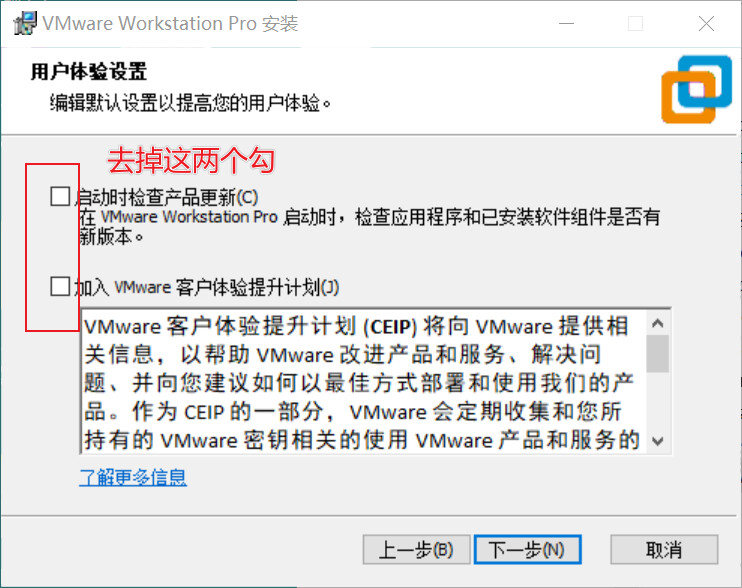

2. 编辑vmware workstation的虚拟网卡

	- 网卡模式区别

		- 桥接模式：虚拟机电脑在网络环境中的地位和宿主环境（开发电脑）是一样的，虚拟机可以上网，但是ip地址会变来变去，因为虚拟机的ip地址是由DHCP动态分配的
		- NAT模式：开发电脑（宿主环境）会通过虚拟网卡构建一个局域网，虚拟机电脑作为局域网中一个成员，由于局域网受开发电脑的控制，因此虚拟机电脑的ip地址可以是固定的，局域网中的成员（虚拟机）可以通过开发电脑（宿主环境）间接的连到外面的互联网
		- 仅主机模式：虚拟机相当于黑户，完全和外界隔绝，因此不能上网

	- 规划局域网

		- 网段：192.168.10.xx
		- 子网掩码：255.255.255.0
		- 网关：192.168.10.2

	- 编辑虚拟网卡（推荐使用10的网段，而不是使用图片中的19网段）

		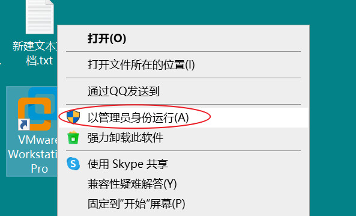

		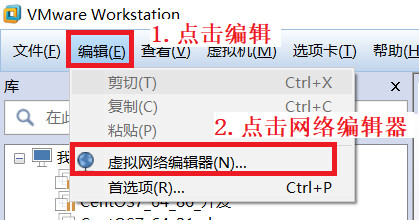

		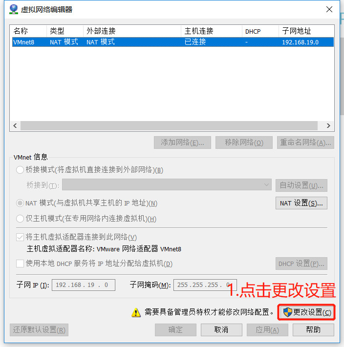

		

		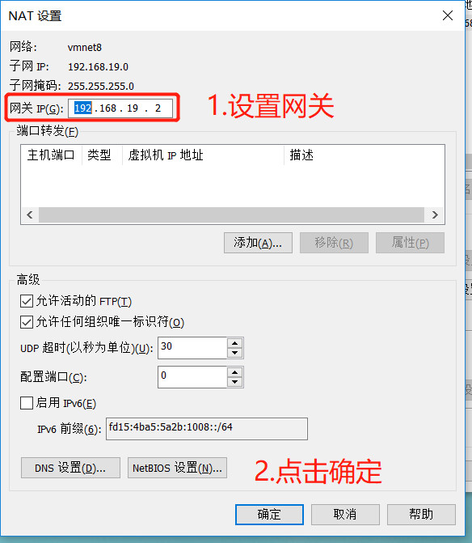

		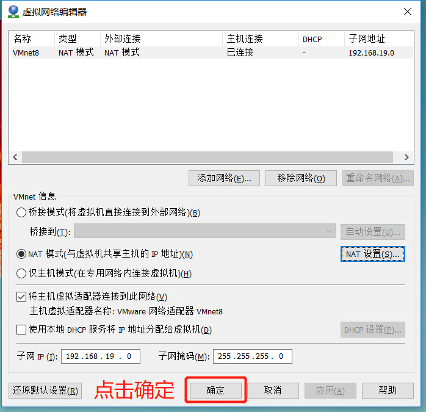

		

## 二、安装centos7

1. [VM安装CentOS7视频教程](https://www.bilibili.com/video/BV1Kh4y1m767/?spm_id_from=333.337.search-card.all.click&vd_source=0d890470387b4243e4e6e1ad09c32d2f)

2. 更改网络配置

	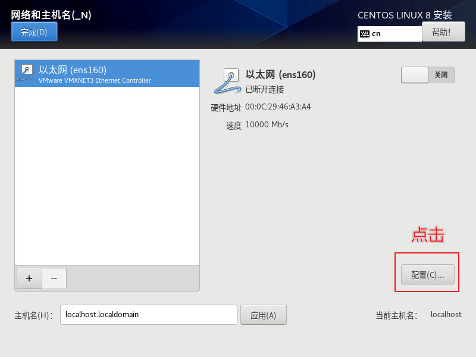

	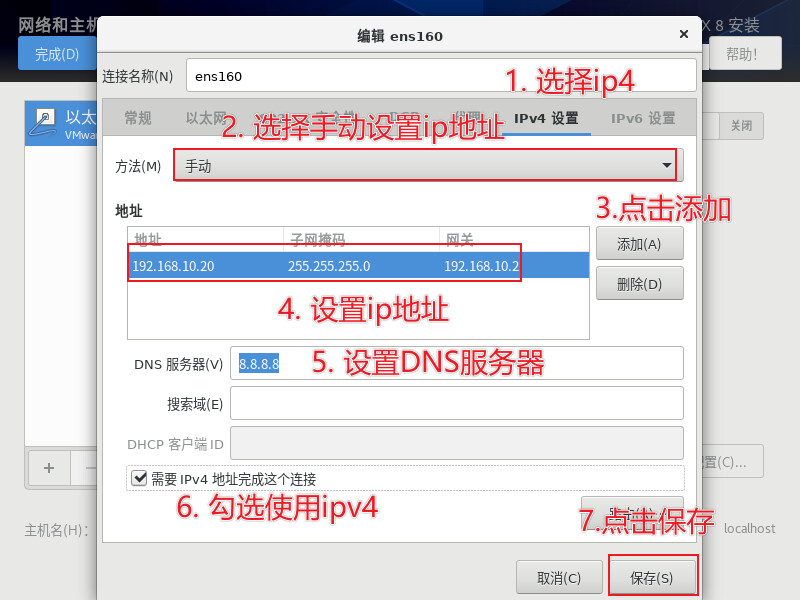

	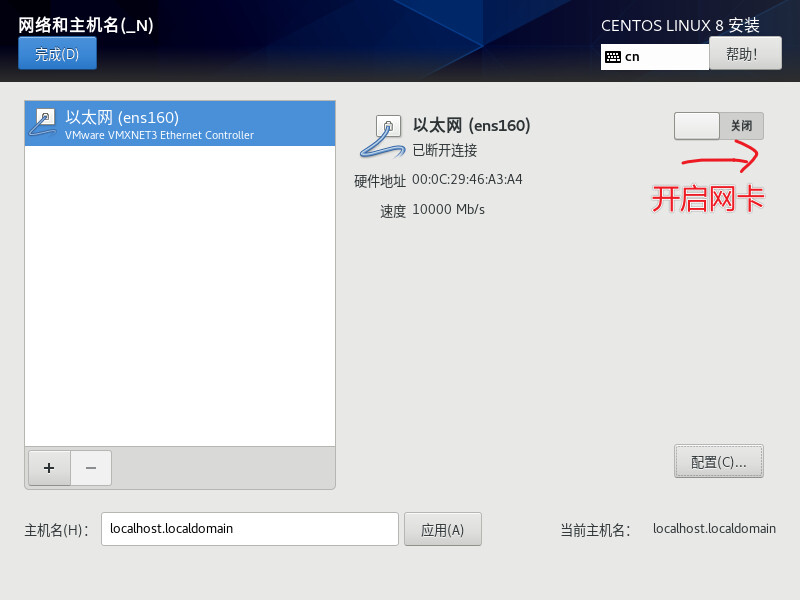

	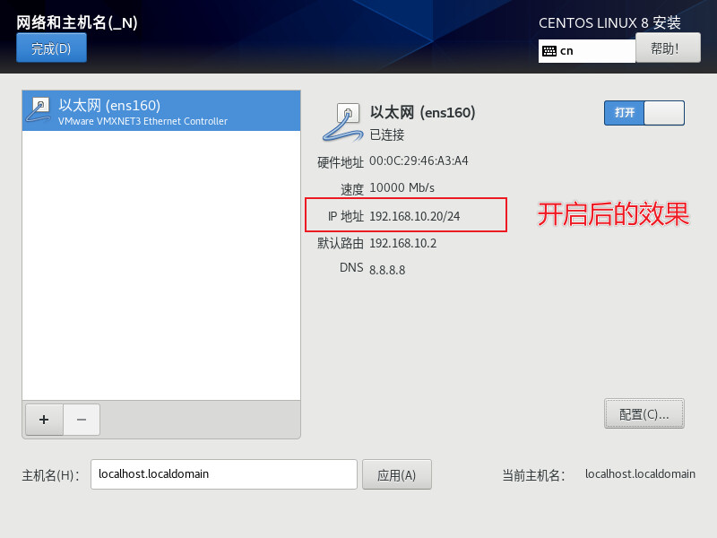

	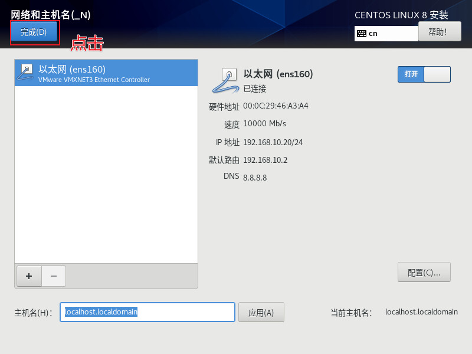

# 二、Linux基本目录

## 一、基本介绍

1. Linux的文件系统采用级层式子的树状目录结构，

2. 最上层是根目录`/`

	

3.  Linux世界里，一切皆文件

## 二、目录用途

1. `/bin` 是Binary的缩写，这个目录存放着最经常使用的命令
2. `/sbin`其中s就是Super User的意思，这里存放的是系统管理员使用的系统管理程序
3. `/home`该目录下存放普通用户的主目录，在Linux中每个用户都有一个自己的目录，一般该目录名是以用户的账号命名的
4. `/root`该目录为系统管理员，也称作超级权限者的用户主目录
5. `/lib`是系统开机所需要最基本的动态连接共享库，其作用类似于Windows里的DLL文件。几乎所有的应用程序都需要用到这些共享库
6. `/lost+found`这个目录一般情况下是空的，当系统非法关机后，这里就存放了一些文件
7. `/etc`是所有的系统管理所需要的配置文件和子目录my.conf
8. `/usr/local`是一个非常重要的目录，用户的很多应用程序和文件都放在这个目录下，类似于windows下的program files目录
9. `/boot`中存放的是启动Linux时使用的一些核心文件，包括一些连接文件以及镜像文件
10. `/proc`这个目录是一个虚拟的目录，它是系统内存的映射，访问这个目录来获取系统信息
11. `/srv`此目录名称是service的缩写，该目录存放一些服务启动之后需要提供的数据
12. `/sys`这是linux2.6内核的一个很大的变化。该目录下安装了2.6内核中新出现的一个文件系统sysfs
13. `/tmp`这个目录是用来存放一些临时文件的
14. `/dev`类似windows的设备管理器，把所有的硬件用文件的形式存储
15. `/media`在linux系统中会自动识别一些设备，例如U盘光驱等等，当识别后，linux会把识别的设备挂载到这个目录下
16. `/mnt`系统提供该目录是为了让用户临时挂载别的文件系统的，我们可以将外部的存储挂载在/mnt/上，然后进入该目录就可以查看里面的内容了
17. `/opt`这是给主机额外安装软件所摆放的目录，如安装ORACLE数据库就可放到该目录下。默认为空
18. `/usr/local`这是另一个给主机额外安装软件所安装的目录，一般是通过编译源码的方式安装的程序
19. `/var`这个目录中存放着在不断扩充着的东西，习惯将经常被修改的目录放在这个目录下，包括各种日志文件
20. `/selinux`这是一种安全子系统，它能控制程序只能访问特定文件

## 三、Linux目录总结

1. Linux的目录中有且只有一个根目录
2. Linux的各个目录存放的内容是规划好，不用乱放文件
3. Linux是以文件的形式管理我们的设备，因此linux系统，一切皆为文件。
4. Linux的各个文件目录下存放什么内容，必须有一个认识

# 三、vi和vim编辑器

## 一、vi和vim的基本介绍

1. 所有Linux系统都会内置vi文本编辑器

2. vim是vi的升级版，可以主动以字体颜色分辨语法的正确性，代码补完和编译，错误跳转等功能

3. vi/vim键盘图（在虚拟机左上角应用程序 -> 系统工具 -> 设置中添加中文输入法后，Win减+空格是切换输入法）

	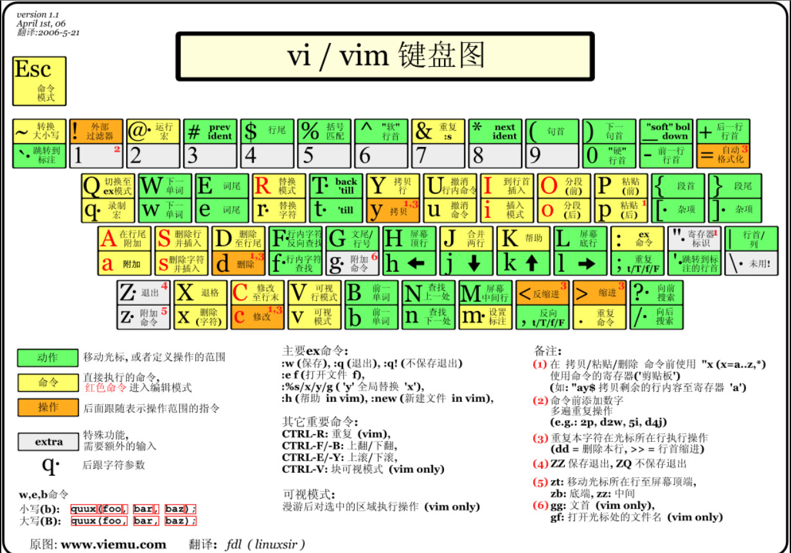

## 二、vi和vim的三种模式

1. 基本上vi/vim共分为三种模式，分别是命令模式（Command mode）、插入/编辑模式（Insert mode）和底线命令模式（Last line mode）
2. 命令模式
   - 一般模式下主要操作为删除、复制、粘贴
     - 用户刚刚启动vi/vim，便进入了正常模式。此状态下敲击键盘动作会被Vim识别为命令，而非输入字符。比如我们此时按下`i`，并不会输入一个字符，`i`被当作了一个命令
     - 常用的命令：
       - **i**：切换到插入/编辑模式，以输入字符
       - **x**：删除当前光标所在处的字符
       - **:**：切换到底线命令模式，以在最底一行输入命令
      - 若想要编辑文本：启动Vim，进入了命令模式，按下`i`，切换到输入模式
     - 命令模式只有一些最基本的命令，因此仍要依靠底线命令模式输入更多命令

3. 插入/编辑模式
   - 插入/编辑模式主要作用是编辑文本
     - 在命令模式下按下`i`就进入了插入/编辑模式
     - 在插入/编辑模式中，可以使用以下按键：
       - **字符按键以及Shift组合**：输入字符
       - **ENTER**：回车键，换行
       - **BACK SPACE**：退格键，删除光标前一个字符
       - **DEL**：删除键，删除光标后一个字符
       - **方向键**：在文本中移动光标
       - **HOME**/**END**：移动光标到行首/行尾
       - **Page Up**/**Page Down**：上/下翻页
       - **Insert**：切换光标为输入/替换模式，光标将变成竖线/下划线
       - **ESC**：退出输入模式，切换到命令模式

4. 底线命令模式
   - 底线命令模式可在末行输入一些命令对文件进行操作，如搜索、替换、保存、退出、高亮等
     - 在命令模式下按下`:`（英文冒号）就进入了底线命令模式进行命令的输入；在命令模式下按下`/`就进入了底线命令模式中的查找功能
     - 底线命令模式可以输入单个或多个字符的命令，可用的命令非常多
     - 在底线命令模式中，基本的命令有（已经省略了冒号）
       - q：退出程序
       - w：保存文件
     - 按ESC键可随时退出底线命令模式

5. 三种模式转换示意图

	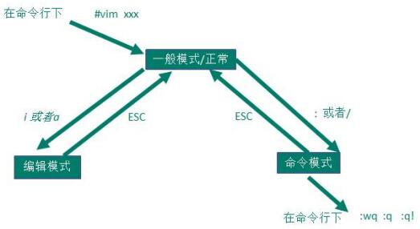

6. vi/vim使用实例

	- 使用vi/vim进入一般模式

		- 使用vim来建立一个名为runoob.txt的文件时，可以这样做：

			```shell
			$ vim runoob.txt
			```

		- 直接输入vi+文件名就能够进入vi的一般模式了。请注意，记得vi后面一定要加文件名，不管该文件存在与否

			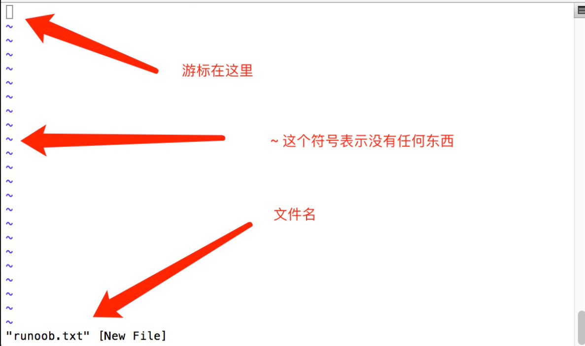

	- 按下`i`进入插入/编辑模式，开始编辑文字

		- 在一般模式之中，只要按下`i, o, a`等字符就可以进入输入模式了

		- 在编辑模式当中，你可以发现在左下角状态栏中会出现`–INSERT-`的字样，那就是可以输入任意字符的提示

		- 这个时候，键盘上除了**Esc**（退出插入/编辑模式回到命令模式中）这个按键之外，其他的按键都可以视作为一般的输入按钮了，所以你可以进行任何的编辑

			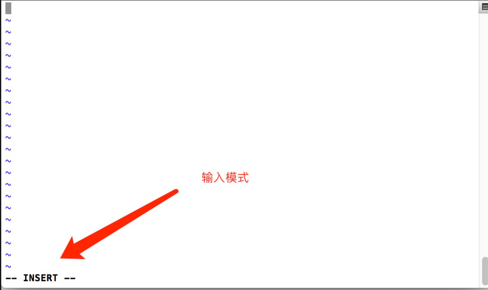

	- 按下ESC按钮回到命令模式：按下**Esc**这个按钮即可！就会发现画面左下角的`– INSERT – `不见了

	- 在命令模式中按下`:wq`储存后离开vi

7. Vim按键说明，一般模式的光标移动、搜索替换、复制粘贴。注意点有：

	- 光标移动时在查找过程中需要注意的是，要查找的字符串是严格区分大小写的，如查找"sunsh"和"SunSH"会得到不同的结果
- 光标移动时如果想忽略大小写，则输入命令` :set ic`；调整回来输入`:set noic`
	- 光标移动时如果在字符串中出现特殊符号，则需要加上转义字符`\`。常见的特殊符号有 `\`、`*`、`?`、`$ `等。如果出现这些字符，例如，要查找字符串"10$"，则需要在命令模式中输入 "/10\$"
	- 删除文本时注意的是被删除的内容并没有真正删除，都放在了剪贴板中。将光标移动到指定位置处，按下`p`键，就可以将刚才删除的内容又粘贴到此处
	
	|   移动光标的方法   |                           功能描述                           |
	| :----------------: | :----------------------------------------------------------: |
	| h 或 向左箭头键(←) |                     光标向左移动一个字符                     |
	| j 或 向下箭头键(↓) |                     光标向下移动一个字符                     |
	| k 或 向上箭头键(↑) |                     光标向上移动一个字符                     |
	| l 或 向右箭头键(→) |                     光标向右移动一个字符                     |
	|    [Ctrl] + [f]    |     屏幕『向下』移动一页，相当于 [Page Down]按键 (常用)      |
	|    [Ctrl] + [b]    |      屏幕『向上』移动一页，相当于 [Page Up] 按键 (常用)      |
	|    [Ctrl] + [d]    |                     屏幕『向下』移动半页                     |
	|    [Ctrl] + [u]    |                     屏幕『向上』移动半页                     |
	|         +          |                  光标移动到非空格符的下一行                  |
	|         -          |                  光标移动到非空格符的上一行                  |
	|      n<space>      | 那个n表示『数字』，例如20。按下数字后再按空格键，光标会向右移动这一行的n个字符。例如`20<space>`则光标会向后面移动20个字符距离 |
	|  0 或功能键[Home]  |      这是数字『 0 』，移动到这一行的最前面字符处 (常用)      |
	|  $ 或功能键[End]   |               移动到这一行的最后面字符处(常用)               |
	|         H          |         光标移动到这个屏幕的最上方那一行的第一个字符         |
	|         M          |          光标移动到这个屏幕的中央那一行的第一个字符          |
	|         L          |         光标移动到这个屏幕的最下方那一行的第一个字符         |
	|         G          |               移动到这个档案的最后一行（常用）               |
  |         nG         | n为数字。移动到这个档案的第n行。例如20G则会移动到这个档案的第 20行(可配合`:set nu`，显示行数) |
	|         gg         |           移动到这个档案的第一行，相当于1G（常用）           |
	|      n<Enter>      |               n为数字。光标向下移动n行（常用）               |
	
	| 搜索  |                           功能描述                           |
	| :---: | :----------------------------------------------------------: |
	| /word | 向光标之下寻找一个名称为word的字符串。例如要在档案内搜寻vbird这个字符串，就输入 /vbird 即可！ (常用) |
	| ?word |          向光标之上寻找一个字符串名称为word的字符串          |
	| /^abc |                     查找以abc为行首的行                      |
  | /abc$ |                     查找以abc为行尾的行                      |
	|   n   | 这个n是英文按键。代表重复前一个搜寻的动作。举例来说，如果刚刚我们执行/vbird去向下搜寻vbird这个字符串，则按下n后，会向下继续搜寻下一个名称为vbird的字符串。如果是执行?vbird的话，那么按下n则会向上继续搜寻名称为vbird的字符串 |
	|   N   | 这个N是英文按键。与n刚好相反，为『反向』进行前一个搜寻动作。例如 /vbird后，按下N则表示『向上』搜寻vbird |
	
	|    替换文本     |                           功能描述                           |
	| :-------------: | :----------------------------------------------------------: |
	|        r        |                    替换光标所在位置的字符                    |
	|        R        | 从光标所在位置开始替换字符，其输入内容会覆盖掉后面等长的文本内容，按**ESC**可以结束 |
	|   :s/a1/a2/g    |   将当前光标所在行中的所有a1用a2替换，不加g只会修改第一个    |
	| :n1,n2s/a1/a2/g |              将文件中n1到n2行中所有a1都用a2替换              |
	|   :%s/a1/a2/g   | 将文件中所有的a1都用a2替换。如果后面的/g替换为/gc，则操作时会有提示功能。例如，要将某文件中所有的"root" 替换为"sunsh"，则有两种输入命令，分别为： |
	
	```bash
	:1, $s/root/sunsh/g
	或
	:%s/root/sunsh/g
	
	# 上述命令是在编辑模式下操作的，表示的是从第一行到最后一行，
	# 即全文查找 "root"，然后替换成 "sunsh"
	
	# 如果刚才的命令变成 `:10,20 s/root/sunsh/g`，
	# 则只替换从第 10 行到第 20 行的 "root"
	```
	
	| 复制粘贴  |                         功能描述                          |
	| :-------: | :-------------------------------------------------------: |
	|     p     |               将剪贴板中的内容粘贴到光标后                |
	| P（大写） |               将剪贴板中的内容粘贴到光标前                |
	|     y     |                 复制已选中的文本到剪贴板                  |
	|    yy     | 将光标所在行复制到剪贴板，此命令前可以加数字n，可复制多行 |
	|    yw     |               将光标位置的单词复制到剪贴板                |
	
	| 删除文本 |                功能描述                |
	| :------: | :------------------------------------: |
	|    x     |         删除光标所在位置的字符         |
	|    dd    |             删除光标所在行             |
	|   ndd    |    删除当前行（包括此行）后n行文本     |
	|    dG    | 删除光标所在行一直到文件末尾的所有内容 |
	|    D     |        删除光标位置到行尾的内容        |
	| :a1,a2d  |       删除从a1行到a2行的文本内容       |
	
8. Vim的常见指令

	- Vim必须掌握的指令

		|                             指令                             |               功能描述               |
		| :----------------------------------------------------------: | :----------------------------------: |
		|                              yy                              |           复制光标当前一行           |
		|                             5yy                              |             拷贝当前5行              |
		|                              p                               |         箭头移动到目的行粘贴         |
		|                              u                               |              撤销上一步              |
		|                              dd                              |              删除当前行              |
		|                             5dd                              |         删除当前行向下的5行          |
		|                              x                               |       剪切一个字母，相当于del        |
		|                              X                               |      剪切一个字母，相当于退格键      |
		|                              yw                              |              复制一个词              |
		|                              dw                              |              删除一个词              |
		|          命令行输入 `/`（查找内容），按n查找下一个           |         在文件中查找某个单词         |
		|                set nu；取消文件行号：set nonu                |             设置文件行号             |
		|      命令模式下使用快捷键到达文档最末行：G；最首行：gg       |               编辑文件               |
		| 光标移动到某行：shift+g；显示行号：set nu；输入行号这个数；输入shift+g |               编辑文件               |
		|                              w                               | 向前移动一个单词（光标停在单词首部） |
		|                              b                               |  向后移动一个单词2b向后移动2个单词   |

	- 插入命令

		| 指令 |         说明         |
		| :--: | :------------------: |
		|  i   |  在当前位置生前插入  |
		|  I   |    在当前行首插入    |
		|  a   |   在当前位置后插入   |
		|  A   |    在当前行尾插入    |
		|  o   | 在当前行之后插入一行 |
		|  O   | 在当前行之前插入一行 |

	- 游标移动

		|      指令       |                          说明                           |
		| :-------------: | :-----------------------------------------------------: |
		|       gg        |                   移动到文件头。= [[                    |
		| G（shift + g）  |                   移动到文件尾。= ]]                    |
		|    行數 → G     |                       移動到第n行                       |
		| 冒号+行号，回车 |                比如跳到240行就是:240回车                |
		|        h        |                      左移一个字符                       |
		|        l        |        右移一个字符，这个命令很少用，一般用w代替        |
		|        k        |                      上移一个字符                       |
		|        j        |                      下移一个字符                       |
		|        w        |          向前移动一个单词（光标停在单词首部）           |
		|        b        |           向后移动一个单词 2b 向后移动2个单词           |
		|        e        |              同w，只不过是光标停在单词尾部              |
		|       ge        |                  同b，光标停在单词尾部                  |
		|        ^        |              移动到本行第一个非空白字符上               |
		|        0        |                 移动到本行第一个字符上                  |
		|      HOME       |               移动到本行第一个字符。同0键               |
		|        $        |            移动到行尾 3$ 移动到下面3行的行尾            |
		|    f（find）    | fx将找到光标后第一个为x的字符，3fd将找到第三个为d的字符 |
		|        F        |                      同f，反向查找                      |

	- 撤销和重做

		|   指令   |            说明            |
		| :------: | :------------------------: |
		|    u     |        撤销（Undo）        |
		|    U     |      撤销对整行的操作      |
		| Ctrl + r | 重做（Redo），即撤销的撤销 |

	- 删除命令

		|        指令         |                 说明                 |
		| :-----------------: | :----------------------------------: |
		|          x          |             删除当前字符             |
		|         3x          |     删除当前光标开始向后三个字符     |
		|          X          |    删除当前字符的前一个字符。X=dh    |
		|         dl          |          删除当前字符，dl=x          |
		|         dh          |            删除前一个字符            |
		|         dd          |              删除当前行              |
		|         dj          |              删除上一行              |
		|         dk          |              删除下一行              |
		|         10d         |         删除当前行开始的10行         |
		|          D          |       删除当前字符至行尾。D=d$       |
		|         d$          |  删除当前字符之后的所有字符（本行）  |
		|        kdgg         | 删除当前行之前所有行（不包括当前行） |
		| jdG（jd shift + g） | 删除当前行之后所有行（不包括当前行） |
		|       :1,10d        |              删除1-10行              |
		|       :11,$d        |        删除11行及以后所有的行        |
		|        :1,$d        |              删除所有行              |
		|    J(shift + j)     | 删除两行之间的空行，实际上是合并两行 |

	- 拷贝，剪贴和粘贴：正常模式下按v（逐字）或V（逐行）进入可视模式，然后用jklh命令移动即可选择某些行或字符，再按y即可复制

		|    指令     |                             说明                             |
		| :---------: | :----------------------------------------------------------: |
		|     yy      |                          拷贝当前行                          |
		|     nyy     |       拷贝当前后开始的n行，比如2yy拷贝当前行及其下一行       |
		|      p      | 在当前光标后粘贴,如果之前使用了yy命令来复制一行，那么就在当前行的下一行粘贴 |
		|   shift+p   |                        在当前行前粘贴                        |
		| :1,10 co 20 |                   将1-10行插入到第20行之后                   |
		|  :1,$ co $  |              将整个文件复制一份并添加到文件尾部              |
		|     ddp     |                     交换当前行和其下一行                     |
		|     xp      |                  交换当前字符和其后一个字符                  |
		|     ndd     |    剪切当前行之后的n行。利用p命令可以对剪切的内容进行粘贴    |
		|   :1,10d    |      将1-10行剪切。利用p命令可将剪切后的内容进行粘贴。       |
		| :1, 10 m 20 |                  将第1-10行移动到第20行之后                  |

	- 退出模式

		| 指令 |             说明             |
		| :--: | :--------------------------: |
		| :wq  |          保存并退出          |
		|  ZZ  |          保存并退出          |
		| :q!  |    强制退出并忽略所有更改    |
		| :e!  | 放弃所有修改，并打开原来文件 |
		|  :q  |        未修改直接退出        |

# 四、网络配置

## 一、三种网络模式详解

1. 网络模式分类

	- vmware提供了三种网络工作模式，它们分别是：Bridged（桥接模式）、NAT（网络地址转换模式）、Host-Only（仅主机模式）

	- 打开vmware虚拟机，可以在选项栏的“编辑”下的“虚拟网络编辑器”中看到VMnet0（桥接模式）、VMnet1（仅主机模式）、VMnet8（NAT模式）。VMnet0表示的是用于桥接模式下的虚拟交换机；VMnet1表示的是用于仅主机模式下的虚拟交换机；VMnet8表示的是用于NAT模式下的虚拟交换机

		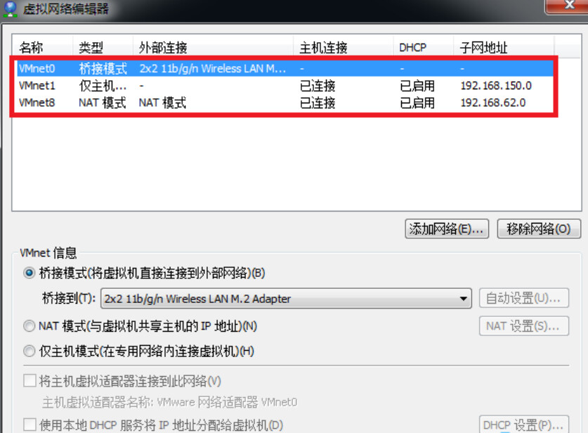

	- 同时，在主机上对应的有VMware Network Adapter VMnet1和VMware Network Adapter VMnet8两块虚拟网卡，它们分别作用于仅主机模式与NAT模式下。在“网络连接”中我们可以看到这两块虚拟网卡，如果将这两块卸载了，可以在vmware的“编辑”下的“虚拟网络编辑器”中点击“还原默认设置”，可重新将虚拟网卡还原

		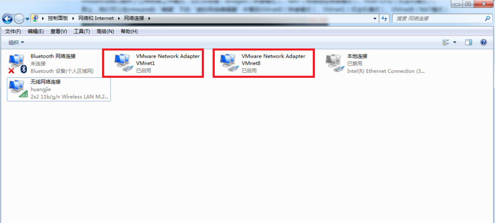

	- 真机上没有VMware Network Adapter VMnet0虚拟网卡

2. Bridged（桥接模式）

	- 桥接模式就是虚拟机直接连接外部物理网络的模式，主机起到了网桥的作用，在桥接模式下虚拟机可以直接访问外部网络，并且对外部网络是可见的。在桥接的作用下，类似于把物理主机虚拟为一个交换机，所有桥接设置的虚拟机连接到这个交换机的一个接口上，物理主机也同样插在这个交换机当中，所以所有桥接下的网卡与网卡都是交换模式的，相互可以访问而不干扰。在桥接模式下，虚拟机ip地址需要与主机在同一个网段，如果需要联网，则网关DNS需要与主机网卡一致。其网络结构如下图所示：

		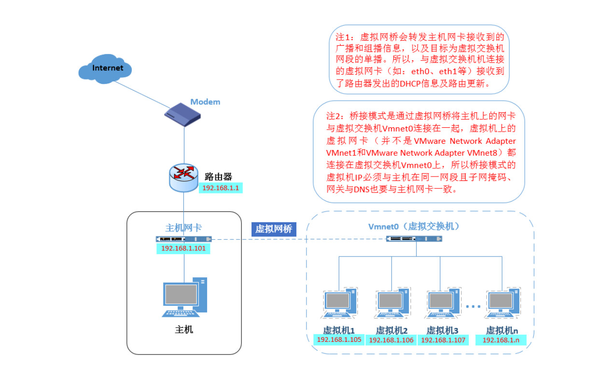

	- 点击“网络适配器”，选择“桥接模式”，然后“确定”

		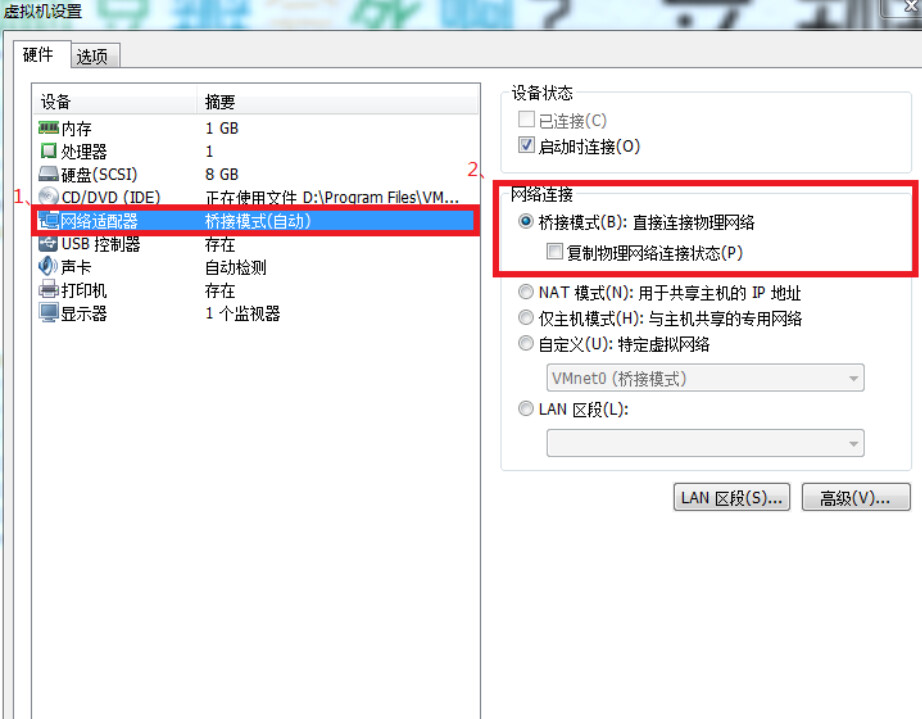

	- 在进入系统之前，先确认一下主机的ip地址、网关、DNS等信息

		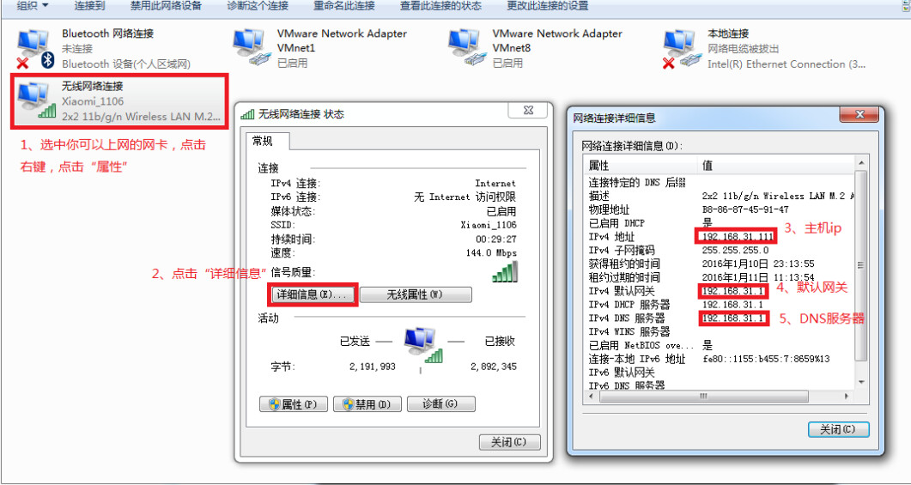

	- 然后，进入系统编辑网卡配置文件，在终端输入命令`vim /etc/sysconfig/network-scripts/ifcfg-eth0`。添加内容如下：

		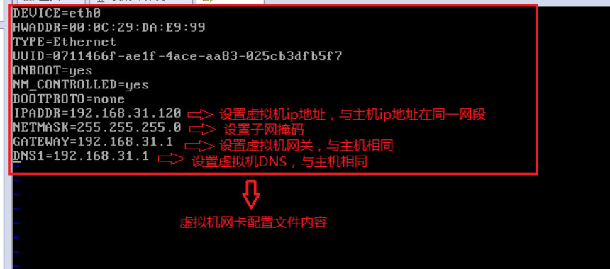

	- 编辑完成，保存退出，然后重启虚拟机网卡，使用ping命令ping外网ip，测试能否联网。能ping通外网ip，证明桥接模式设置成功。ping语法为：ping [主机地址]，例如ping www.baidu.com

		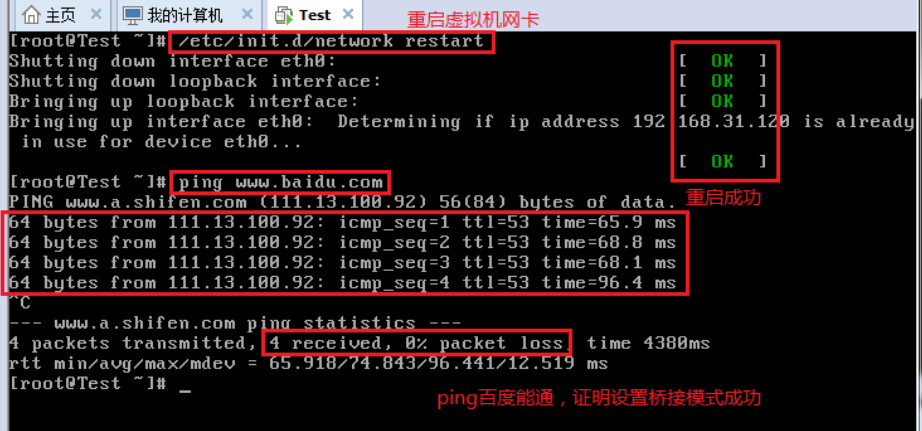

	- 主机与虚拟机之间的通信，可以使用远程工具来测试。使用远程工具能连接成功则说明通讯正常

		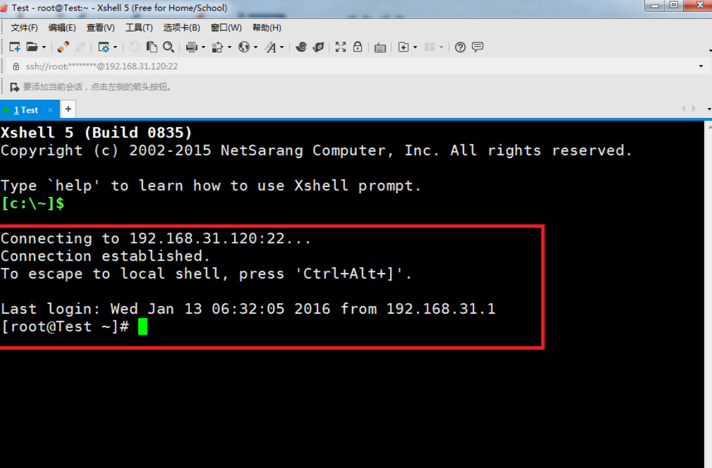

	- 桥接模式配置简单，但如果网络环境是ip资源很缺少或对ip管理比较严格的话，那桥接模式就不太适用了

3. NAT（地址转换模式）

  - 地址转换模式是虚拟机和主机构建一个专用网络，并且通过虚拟网络地址转换（NAT）设备对IP进行转换。虚拟机通过共享IP可以访问外部网络，但是外部网络无法访问虚拟机

  - 如果网络ip资源紧缺，但是又希望你的虚拟机能够联网，这时候NAT模式是最好的选择。NAT模式借助虚拟NAT设备和虚拟DHCP服务器，使得虚拟机可以联网。虚拟设备中主机就相当于NAT服务器和DHCP服务器。其网络结构如下图所示：

  	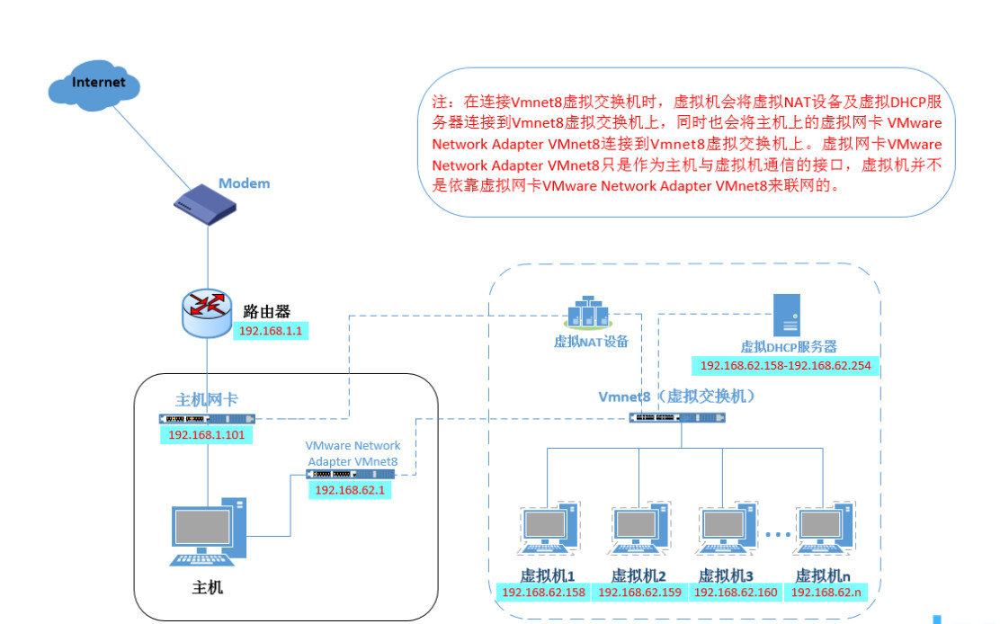

  - 在NAT模式中，主机网卡直接与虚拟NAT设备相连，然后虚拟NAT设备与虚拟DHCP服务器一起连接在虚拟交换机VMnet8上，这样就实现了虚拟机联网。VMware Network Adapter VMnet8虚拟网卡主要是为了实现主机与虚拟机之间的通信

  - 首先，设置虚拟机中NAT模式的选项，打开vmware，点击“编辑”下的“虚拟网络编辑器”，设置NAT参数及DHCP参数

  	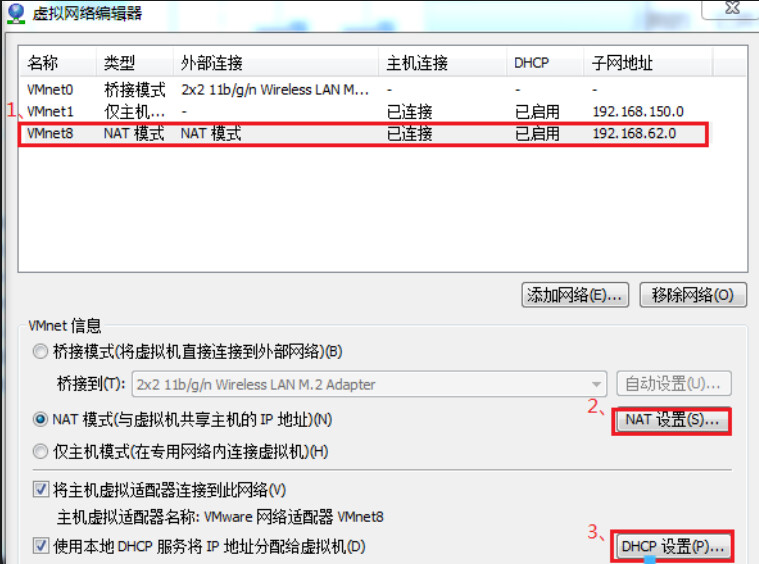

  	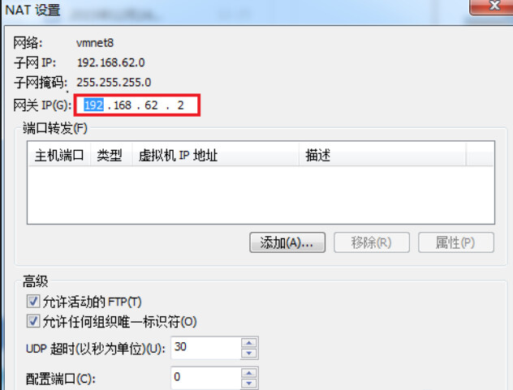

  	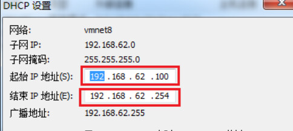

  - 将虚拟机的网络连接模式修改成NAT模式。首先点击“网络适配器”，选择“NAT模式”

  	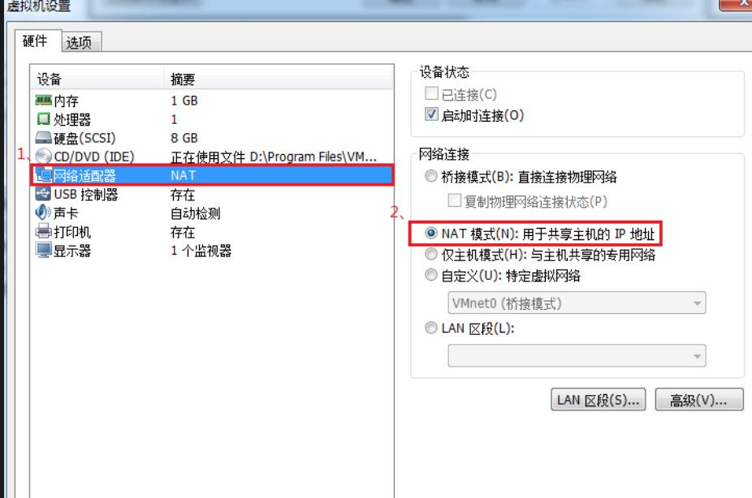

  - 然后开机启动系统，编辑网卡配置文件，在终端输入命令`vim /etc/sysconfig/network-scripts/ifcfg-eth0`。具体配置如下：

  	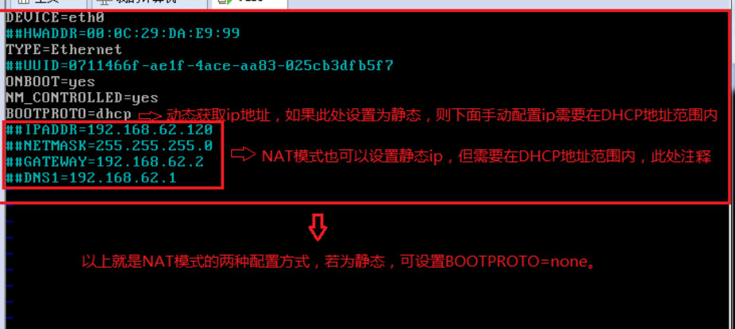

  - 编辑完成，保存退出，然后重启虚拟机网卡，动态获取ip地址，使用ping命令ping外网ip，测试能否联网

  	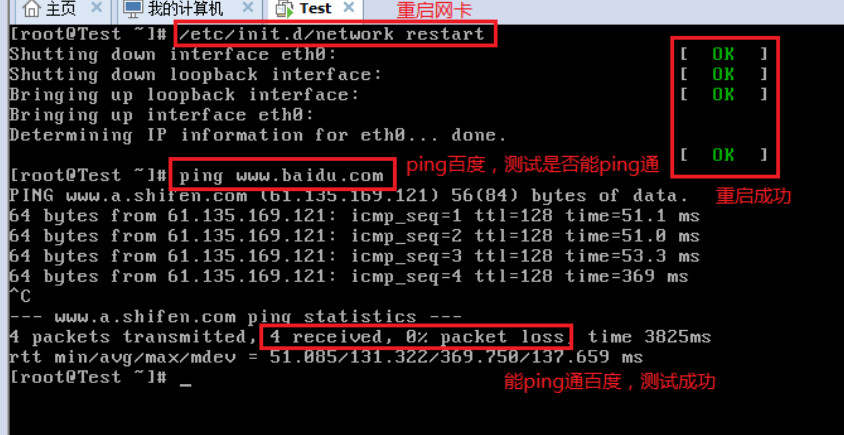

  - 之前，我们说过VMware Network Adapter VMnet8虚拟网卡的作用，那我们现在就来测试一下

  	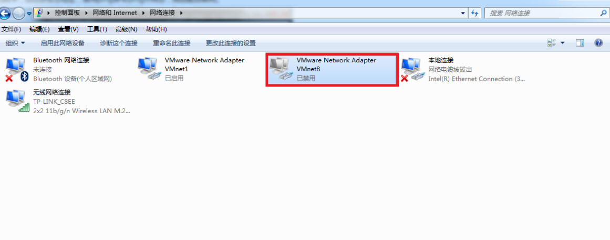

  	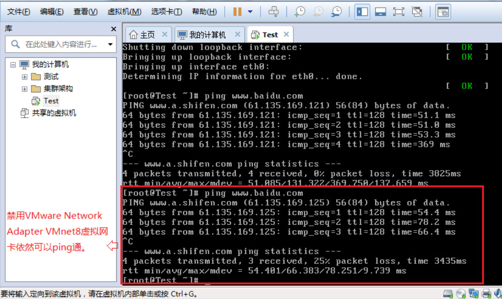

  - 如此看来，虚拟机能联通外网，确实不是通过VMware Network Adapter VMnet8虚拟网卡，那么为什么要有这块虚拟网卡呢？之前我们就说VMware Network Adapter VMnet8的作用是主机与虚拟机之间的通信，接下来，我们就用远程连接工具来测试一下发现连接失败

  	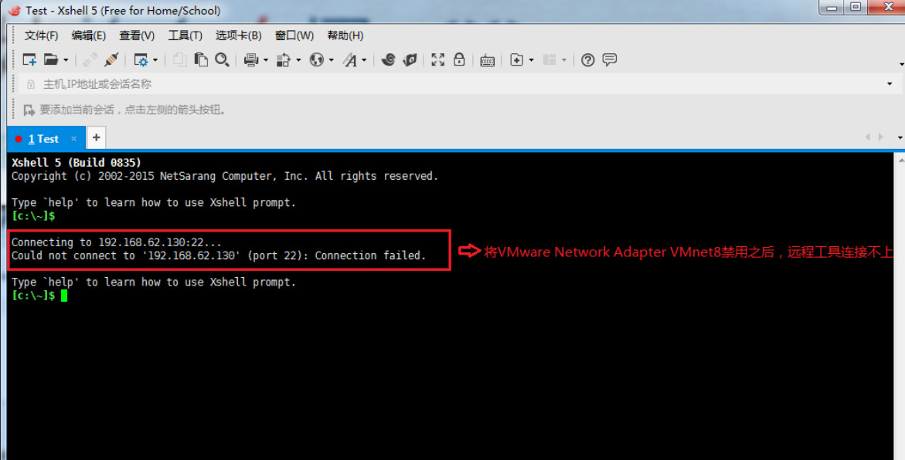

  - 然后，将VMware Network Adapter VMnet8启用之后，发现远程工具可以连接上虚拟机了

  - 那么，这就是NAT模式，利用虚拟的NAT设备以及虚拟DHCP服务器来使虚拟机连接外网，而VMware Network Adapter VMnet8虚拟网卡是用来与虚拟机通信的

4. Host-Only（仅主机模式）

	- Host-Only模式其实就是NAT模式去除了虚拟NAT设备，然后使用VMware Network Adapter VMnet1虚拟网卡连接VMnet1虚拟交换机来与虚拟机通信的，Host-Only模式将虚拟机与外网隔开，使得虚拟机成为一个独立的系统，只与主机相互通讯。其网络结构如下图所示：

		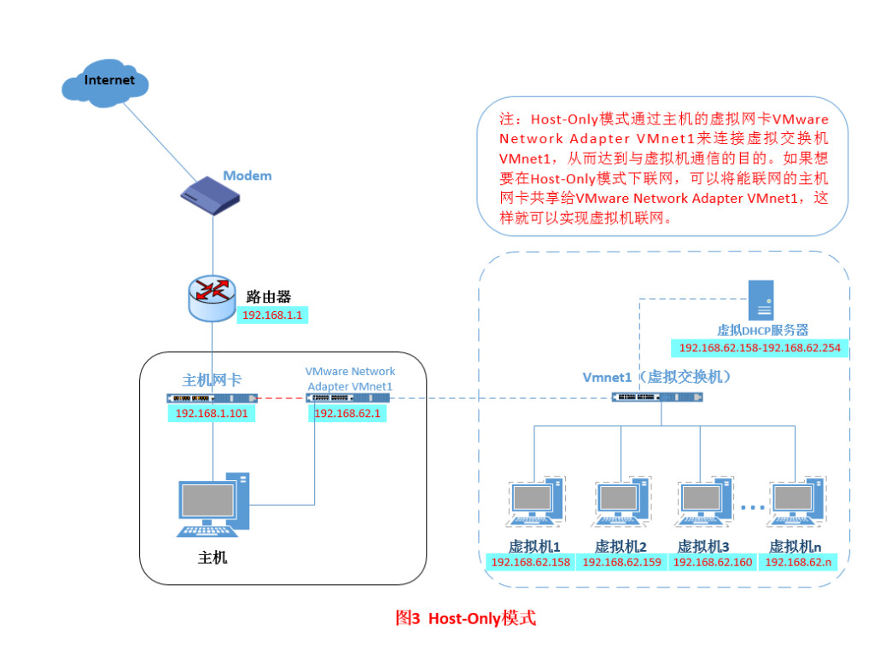

	- 通过上图，我们可以发现，如果要使得虚拟机能联网，可以将主机网卡共享给VMware Network Adapter VMnet1网卡，从而达到虚拟机联网的目的。接下来，我们就来测试一下。首先设置“虚拟网络编辑器”，可以设置DHCP的起始范围

		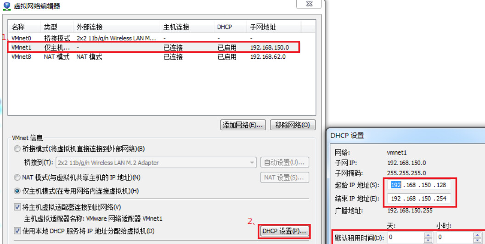

	- 设置虚拟机为Host-Only模式

		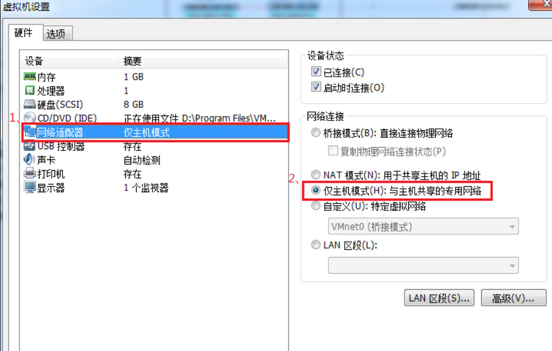

	- 开机启动系统，然后设置网卡文件

		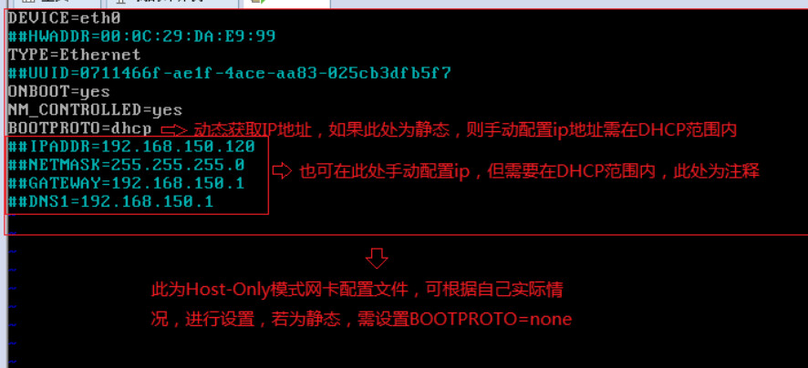

	- 保存退出，然后重启网卡，利用远程工具测试能否与主机通信

		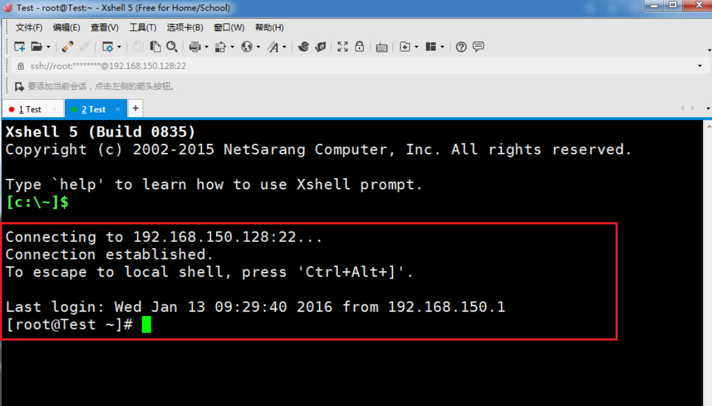

	- 主机与虚拟机之间可以通信，现在设置虚拟机联通外网

		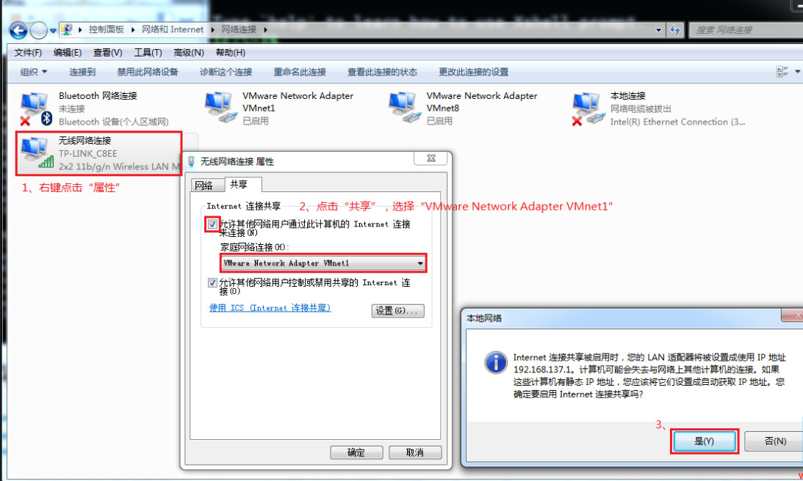

	- 我们可以看到上图有一个提示，强制将VMware Network Adapter VMnet1的ip设置成192.168.137.1，那么接下来，我们就要将虚拟机的DHCP的子网和起始地址进行修改，点击“虚拟网络编辑器”

		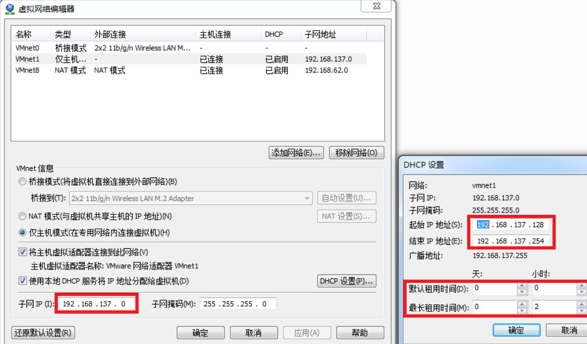

	- 重新配置网卡，将VMware Network Adapter VMnet1虚拟网卡作为虚拟机的路由

		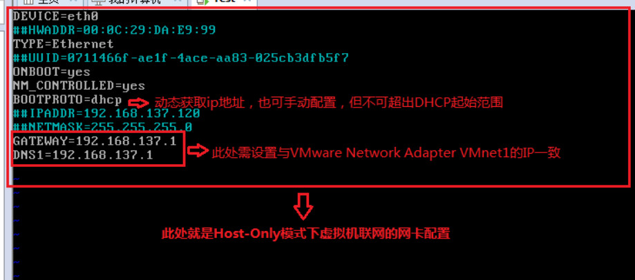

	- 重启网卡，然后通过远程工具测试能否联通外网以及与主机通信。测试结果证明可以使得虚拟机连接外网

## 二、查看网络IP和网关

1. 查看虚拟网络编辑器

	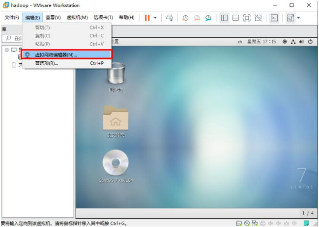

2. 修改虚拟网卡IP

	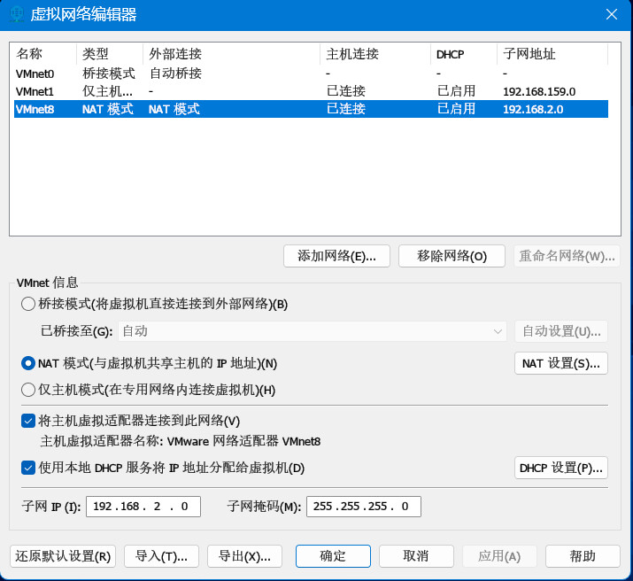

3. 查看网关

	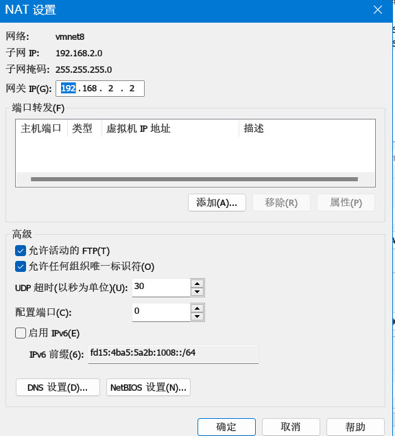

	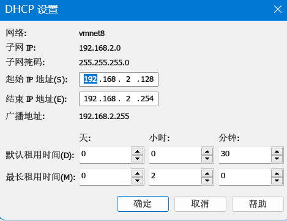

4. 查看windows环境的中VMnet8网络配置

	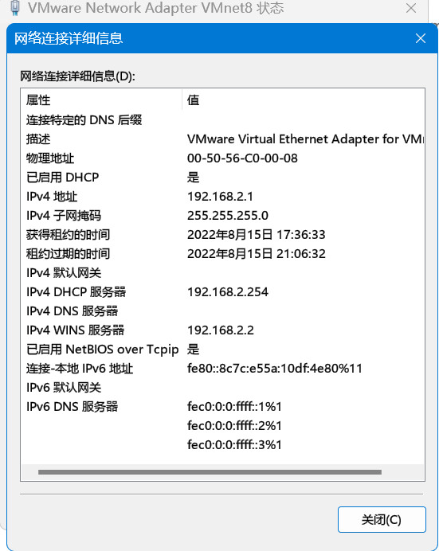

## 三、配置网络IP地址

1. 自动抓取：每次自动获取的ip地址可能不一样，不适用于做服务器

	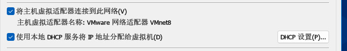

2. 指定ip地址

	- `ifconfig`查看当前网络配置

		```bash
		BOOTPROTO="static" 
		#IP 的配置方法[none|static|bootp|dhcp]（引导 时不 使用协议|静态分配 IP|BOOTP 协议|DHCP 协议）
		
		ONBOOT="yes" 
		#系统启动的时候网络接口是否有效（yes/no）
		
		#IP地址
		IPADDR=192.168.2.100 #网段必须符合要求，后面的主机地址自己设置
		#网关
		GATEWAY=192.168.2.2 #网关要和vm8虚拟交换机网关一样
		#域名解析器
		DNS1=192.168.2.2  #这个设置成和网关一样就行
		
		#子网掩码默认255.255.255.0
		```

	- 直接修改配置文件来指定IP，并可以连接到外网，编辑：vim /etc/sysconfig/network-scripts/ifcfg-ens160（centos7是ifcfg-ens33）

		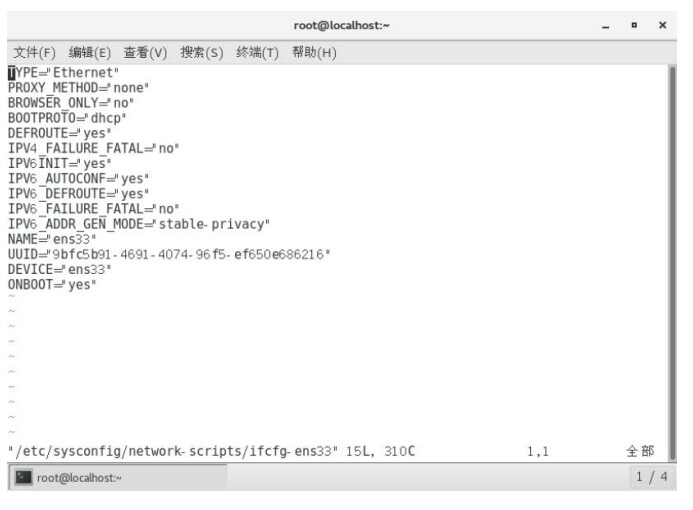

		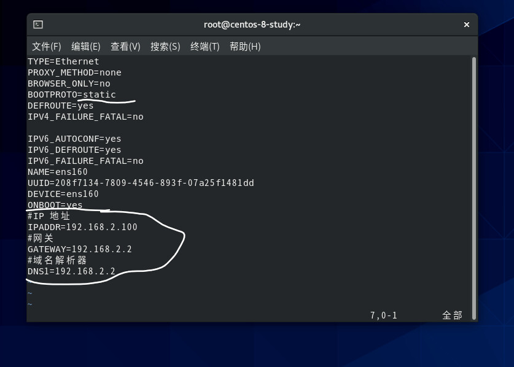

	- 重启网络服务：`service network restart`

		```bash
		# centos8重启网卡的方法
		
		# 重启⽹卡之前⼀定要重新载⼊⼀下配置⽂件，不然不能⽴即⽣效
		nmcli c reload
		
		# 重启⽹卡（下⾯的三条命令都可以）：
		nmcli c up ens160
		nmcli d reapply ens160
		nmcli d connect ens160
		```

3. 修改IP地址后可能会遇到的问题

	- 物理机能ping通虚拟机，但是虚拟机ping不通物理机，一般都是因为物理机的防火墙问题，把防火墙关闭就行
	- 虚拟机能ping通物理机，但是虚拟机ping不通外网，一般都是因为DNS的设置有问题 
	- 虚拟机 ping www.baidu.com 显示域名未知等信息,一般查看GATEWAY和DNS设置是否正确
	- 如果以上全部设置完还是不行，需要关闭NetworkManager服务 
		- systemctl stop NetworkManager：关闭  
		- systemctl disable NetworkManager：禁用 
	- 如果检查发现systemctl status network有问题 需要检查ifcfg-ens33

4. 配置主机名

	- 修改主机名称

		- `hostname` （功能描述：查看当前服务器的主机名称）
		- 如果感觉此主机名不合适，我们可以进行修改。通过编辑`vim /etc/hostname` 文件
		- 修改完成后重启生效。如果想立即生效可以通过`hostnamectl set-hostname sunsh`这个命令，然后重启终端就可以看到效果了

	- 修改hosts映射文件

		- 修改linux的主机映射文件（hosts文件），使用较多虚拟机时配置时，使用hosts文件进行映射比较方便简单，不用刻意记ip地址，让虚拟机之间通讯比较简单。命令为`vim /etc/host`。添加如下内容，重启设备，重启后查看主机名，已经修改成功

			```bash
			192.168.2.100 ds100
			192.168.2.101 ds101
			192.168.2.102 ds102
			192.168.2.103 ds103
			192.168.2.104 ds104
			192.168.2.105 ds105
			```

		- 修改 windows 的主机映射文件（hosts 文件）。进入 `C:\Windows\System32\drivers\etc` 路径。打开hosts文件并添加如下内容，需要先将该文件只读关闭，然后写入内容保存，最后恢复到只读状态。这时可以在windows通过`ping ds100`来测试是否通过虚拟机名称连通虚拟机

			```bash
			192.168.2.100 ds100
			192.168.2.101 ds101
			192.168.2.102 ds102
			192.168.2.103 ds103
			192.168.2.104 ds104
			192.168.2.105 ds105
			```

5. 远程登录

	- 使用SSH进行连接登录，命令为`ssh 虚拟机用户名称@虚拟机主机名称`，使用`exit`退出连接
	- [使用WindTerm进行远程连接](https://blog.51cto.com/yunskj/9941019)

# 五、系统管理

## 一、Linux中的进程和服务

- 计算机中，一个正在执行的程序或命令，被叫做“进程”（process）
- 启动之后一只存在、常驻内存的进程，一般被称作“服务”（service）

## 二、systemctl服务管理

### 一、systemctl介绍

1. CentOS7使用Systemd管理守护进程。CentOS7采用systemd管理，服务独立的运行在内存中，服务响应速度快，但占用更多内存。独立服务的服务启动脚本都在目录`/usr/lib/systemd/system`里。Systemd的新特性：

	- 系统引导时实现服务的并行启动
	- 按需激活进程
	- 系统实现快照
	- 基于依赖关系定义服务的控制逻辑
2. systemctl可用于内省和控制systemd系统和服务管理器的状态。centos7.x系统环境下我们经常使用此命令启停服务，实际上此命令除了其他独立服务还有很多其他用途

### 二、systemctl参数说明

1. 基本语法

	- `systemctl start | stop | restart | status | reload 服务名`
	- `systemctl`指令管理的服务在`/usr/lib/systemd/system` 
	- 查看查看服务的方法：`pwd /usr/lib/systemd/system`

2. 使用语法：`systemctl [OPTIONS…] {COMMAND} …`

3. OPTIONS参数说明

	| 参数            | 参数说明                                                     |
	| :-------------- | :----------------------------------------------------------- |
	| start           | 立刻启动后面接的unit                                         |
	| stop            | 立刻关闭后面接的unit                                         |
	| restart         | 立刻关闭后启动后面接的unit，亦即执行stop再start的意思        |
	| reload          | 不关闭后面接的unit的情况下，重载配置文件，让设定生效         |
	| enable          | 设定下次开机时，后面接的unit会被启动                         |
	| disable         | 设定下次开机时，后面接的unit不会被启动                       |
	| status          | 目前后面接的这个unit的状态，会列出是否正在执行、是否开机启动等信息 |
	| is-active       | 目前有没有正在运行中                                         |
	| is-enable       | 开机时有没有预设要启用这个unit                               |
	| kill            | 不要被kill这个名字吓着了，它其实是向运行unit的进程发送信号   |
	| show            | 列出unit的配置                                               |
	| mask            | 注销unit，注销后你就无法启动这个unit了                       |
	| unmask          | 取消对unit的注销                                             |
	| list-units      | 依据unit列出目前有启动的unit。若加上–all才会列出没启动的，等价于无参数 |
	| list-unit-files | 列出所有已安装unit以及他们的开机启动状态（enabled、disabled、static、mask） |
	| –type=TYPE      | 就是unit type，主要有service，socket，target等               |
	| get-default     | 取得目前的target                                             |
	| set-default     | 设定后面接的target成为默认的操作模式                         |
	| isolate         | 切换到后面接的模式                                           |

4. unit file结构

	- 文件通常由三部分组成：
		- Unit：定义与Unit类型无关的通用选项；用于提供unit的描述信息，unit行为及依赖关系等
		- Service：与特定类型相关的专用选项；此处为Service类型

		- Install：定义由"systemctl enable"及"systemctl disable"命令在实现服务启用或禁用时用到的一些选项

5. unit段的常用选项

	- Description：描述信息，意义性描述
	- After：定义unit的启动次序；表示当前unit应晚于哪些unit启动；其功能与Before相反
	- Requies：依赖到其它的units；强依赖，被依赖的units无法激活时，当前的unit即无法激活
	- Wants：依赖到其它的units；弱依赖
	- Confilcts：定义units 的冲突关系

6. Service段的常用选项

	- Type：用于定义影响ExecStart及相关参数的功能的unit进程类型；类型有：simple、forking、oneshot、dbus、notify、idle
	- EnvironmentFile：环境配置文件
	- ExecStart：指明启动unit要运行的命令或脚本；ExecStart, ExecStartPost
	- ExecStop：指明停止unit要运行的命令或脚本
	- Restart
	
7. Install段的常用配置

	- Alias：
	- RequiredBy：被哪些unit所依赖
	- WantBy：被哪些unit所依赖

8. unit文件样例

	```bash
	[root@s153 system]# cat chronyd.service
	[Unit]
	Description=NTP client/server
	Documentation=man:chronyd(8) man:chrony.conf(5)
	After=ntpdate.service sntp.service ntpd.service
	Conflicts=ntpd.service systemd-timesyncd.service
	ConditionCapability=CAP_SYS_TIME
	
	[Service]
	Type=forking
	PIDFile=/var/run/chronyd.pid
	EnvironmentFile=-/etc/sysconfig/chronyd
	ExecStart=/usr/sbin/chronyd $OPTIONS
	ExecStartPost=/usr/libexec/chrony-helper update-daemon
	PrivateTmp=yes
	ProtectHome=yes
	ProtectSystem=full
	
	[Install]
	WantedBy=multi-user.target
	```

### 三、systemctl使用示例

1. 查看开机启动列表

	```bash
	systemctl list-unit-files [ | grep 服务名] (查看服务开机启动状态, grep 可以进行过滤)
	[root@localhost ~]# systemctl list-unit-files
	[root@localhost ~]# systemctl list-unit-files | grep firewalld
	firewalld.service                             disabled
	
	#查看已启动的服务列表
	systemctl list-unit-files|grep enabled
	#显示所有已启动的服务
	systemctl list-units --type=service
	```
	

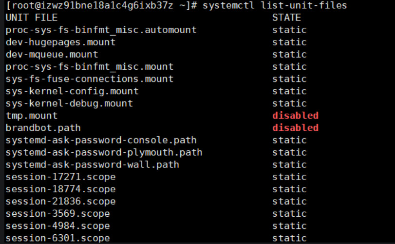
	
- 可以**写一半**再查看完整的服务名，一般也可以简写：`firewalld.service = firewall`
	

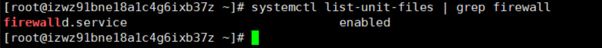
	
- 说明防火墙是一个自启的状态，Linux系统启动的时候防火墙也会自启
	
2. 设置开机启动：systemctl在enable、disable、mask子命令里面增加了–now选项，可以激活同时启动服务，激活同时停止服务等

	```bash
	# 设置开机启动并现在启动
	## 相当于同时执行了systemctl start 服务名
	systemctl enable --now firewalld
	
	# 查看服务启动状态
	root@localhost ~]# systemctl status firewalld
	```

3. 取消开机启动

	```bash
	# 取消开机启动并现在就停止服务
	systemctl disable --now firewalld
	## 查看服务状态是否停止
	[root@localhost ~]# systemctl status firewalld
	# 查看启动列表
	[root@localhost ~]# systemctl list-unit-files |grep firewalld
	firewalld.service                             disabled
	```

	- 使用 `systemctl disable firewalld`时，下次重启系统时防火墙还是处于关闭的状态

	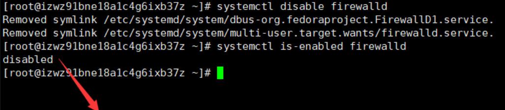

	- 重新打开自启动防火墙：
		- `systemctl enable 服务名` (设置服务开机启动)，对 `3` （无界面）和 `5` （GUI）运行级别都生效
		- `systemctl disable 服务名` (关闭服务开机启动)，对 `3` （无界面）和 `5` （GUI）运行级别都生效

	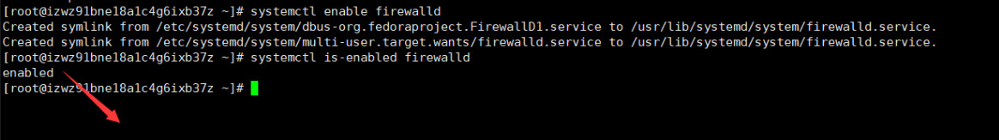

4. 开启服务，例如开启防火墙

	```bash
	systemctl start firewall
	```

	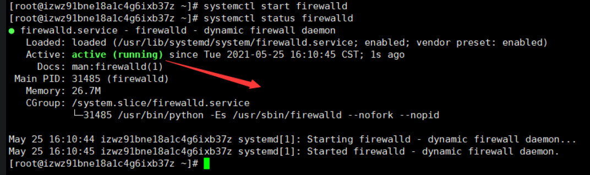

5. 关闭服务（但是下次开机还是会启动），例如关闭防火墙

	```
	systemctl stop firewall
	```

	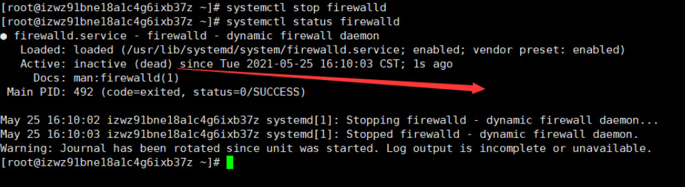

6. 重启服务

	```bash
	systemctl restart 服务名
	```

7. 重新加载配置

	```bash
	systemctl reload 服务名
	```

8. 输出服务运行的状态，例如查看防火墙的状态

	```bash
	systemctl status 服务名
	systemctl status firewalld
	```

	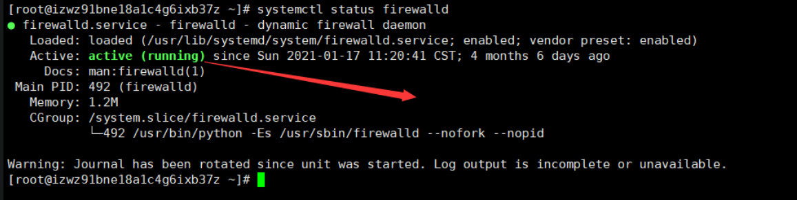

9. 检查service是否在启动状态

	```bash
	# systemctl is-active 服务名
	systemctl is-active NetworkManager
	# active
	```

10. 检测unit单元是否为自动启动

	```bash
	# systemctl is-enabled 服务名
	systemctl is-enabled firewalld
	# enabled
	```

	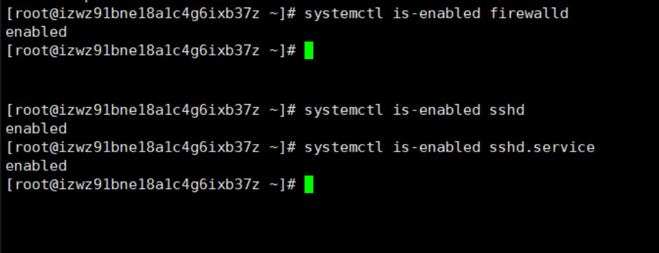

11. 注销一个服务（service）：systemctl mask 是注销服务的意思。注销服务意味着：该服务在系统重启的时候不会启动；该服务无法进行做systemctl start/stop操作；该服务无法进行systemctl enable/disable操作

	```bash
	systemctl mask firewalld
	```

12. 取消注销服务（service）

	```bash
	systemctl unmask firewalld
	```

13. 显示单元的手册页（前提是由unit提供）

	```bash
	systemctl help
	```

14. 当新增或修改service单元文件时，需要系统重新加载所有修改过的配置文件

	```bash
	systemctl daemon-reload
	```

15. 查看systemd资源使用率

	```bash
	systemd-cgtop
	```

16. 杀死服务

	```bash
	[root@s153 system]# systemctl kill xinetd
	[root@s153 system]# systemctl is-failed xinetd
	inactive
	```

## 三、系统运行级别

### 一、CentOS6运行级别CentOS6

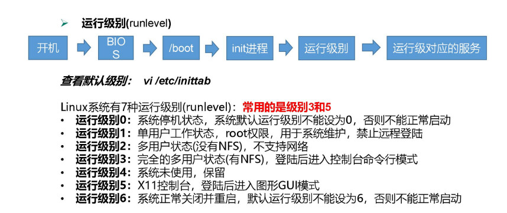

### 二、Centos7的启动流程图

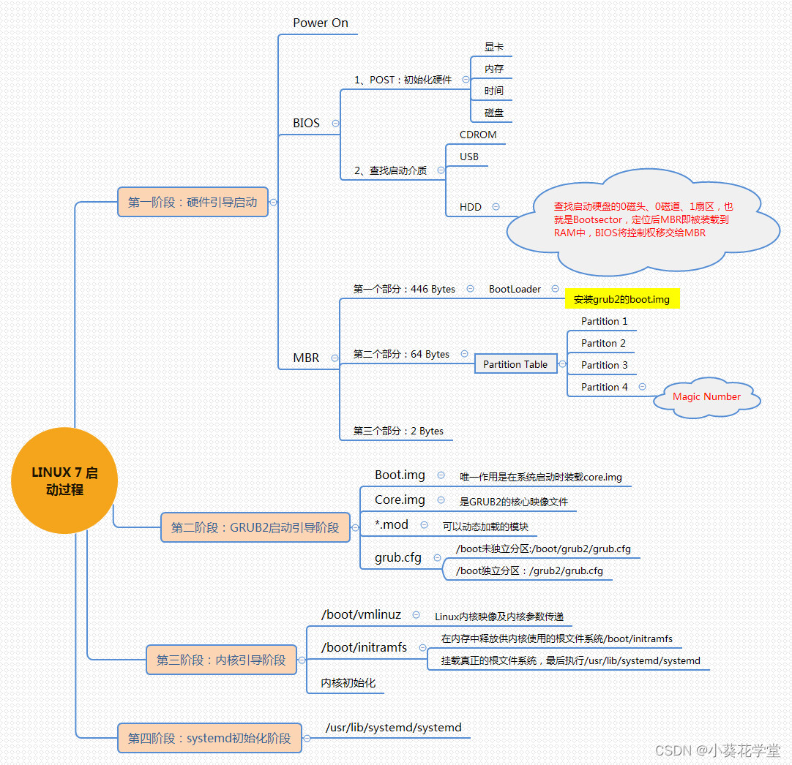

```bash
CentOS7中我们的初始化进程变为了systemd。执行默认target配置文件/etc/systemd/system/default.target（这是一个软链接，与默认运行级别有关）。然后执行sysinit.target来初始化系统和basic.target来准备操作系统。接着启动multi-user.target下的本机与服务器服务，并检查/etc/rc.d/rc.local文件是否有用户自定义脚本需要启动。最后执行multi-user下的getty.target及登录服务，检查default.target是否有其他的服务需要启动。

注意：/etc/systemd/system/default.target指向了/lib/systemd/system/目录下的graphical.target或multiuser.target。而graphical.target依赖multiuser.target，multiuser.target依赖basic.target，basic.target依赖sysinit.target，所以倒过来执行
```

1. CentOS7 的运行级别简化为:

	- multi-user.target等价于原运行级别3（多用户有网，无图形界面） 

	- graphical.target等价于原运行级别5（多用户有网，有图形界面）

2. 查看当前运行级别:

	```bash
	[root@localhost etc]# systemctl get-default
	multi-user.target
	```

3. 修改当前运行级别

	```bash
	[root@localhost etc]# systemctl set-default graphical.target
	```

	- centos7中取消了通过修改配置文件设置系统默认运行级别

	```bash
	[root@localhost etc]# cat /etc/inittab 
	# inittab is no longer used when using systemd.
	#
	# ADDING CONFIGURATION HERE WILL HAVE NO EFFECT ON YOUR SYSTEM.
	#
	# Ctrl-Alt-Delete is handled by /usr/lib/systemd/system/ctrl-alt-del.target
	#
	# systemd uses 'targets' instead of runlevels. By default, there are two main targets:
	#
	# multi-user.target: analogous to runlevel 3    #类似运行级别3
	# graphical.target: analogous to runlevel 5     #类似运行级别5
	#
	# To view current default target, run:
	# systemctl get-default                    #查看系统运行级别
	#
	# To set a default target, run:
	# systemctl set-default TARGET.target      #修改系统默认运行级别
	```

## 四、关机重启命令

1. 关机重启命令汇总

| 命令      | 功能                                                         | 用户权限           | 示例                                                         |
| :-------- | :----------------------------------------------------------- | :----------------- | :----------------------------------------------------------- |
| halt      | 停机，关闭系统但不断电                                       | root用户           | halt：只关闭系统，电源还在运行<br/>halt -p：关闭系统，关闭电源（先执行halt，再执行poweroff） |
| poweroff  | 关机，断电                                                   | root用户           | poweroff会发送一个关闭电源的信号给acpi                       |
| reboot    | 重启                                                         | root用户           | 等同于shutdown -r now                                        |
| shutdown  | -h：关机<br/>-r：重启<br/>-c：取消shutdown操作               | root用户           | shutdown实际上是调用init 0, init 0会cleanup一些工作然后调用halt或者poweroff<br/>shutdown -r now：一分钟后重启<br/>shutdown -r 05:30：最近的5:30重启<br/>shutdown -r +10：十分钟后重启 |
| init      | init 0：关机；init 6：重启                                   | root用户           | init：切换系统的运行级别                                     |
| systemctl | systemctl halt [-i]：关机 <br/>systemctl poweroff [-i]：关机 <br/>systemctl reboot [-i]：重启 | 普通用户、超级用户 | 普通用户需要加-i root用户不需要加-i                          |
| sync      | 将数据由内存同步到硬盘中                                     | root用户           | 在关机或者重启之前，执行3至4次sync，将在内存中还未保存到硬盘的数据更新到硬盘中，否则会造成数据的丢失。执行sync时要以管理员的身份运行，因为管理员具有所有文件的权限，而普通用户只具有自己的部分文件的权限 |

2. shutdown命令

	- 基本格式：shutdown [选项] [时间] [警告信息]

	- 选项：

		- -H：关机
		- -r：重启
		- -c：取消shutdown执行的关机或者重启命令
		- -k：不关机，发出警告

	- 时间：

		- shutdown：一分钟后关机（默认）
		- shutdown now：立刻关机
		- shutdown 10：10分钟后关机
		- shutdown 05:00：5点关机

	- 示例

		```bash
		shutdown -r now：系统立马重启，等同于reboot
		shutdown -r 05:30：最近的5:30重启
		shutdown -r 10：十分钟后重启
		
		shutdown -h now：立马关机，等同于poweroff
		shutdown -h 05:30：最近的5:30关机
		shutdown -h +10：十分钟后关机
		
		shutdown -c：取消上面的关机重启操作
		
		shutdown -k +10 “I will shutdown in 10 minutes”：10分钟后并不会真的关机，但是会把警告信息发给所有的用户
		```

3. sync命令

	- sync：linux同步数据命令，**将数据由内存同步到硬盘中**，包含已修改的 i-node、已延迟的块 I/O 和读写映射文件。如果不去手动的输入sync命令来真正的去写磁盘，linux系统也会周期性的去sync数据

		```bash
		[root@hadoop100 桌面]#sync 
		```

	- 使用场景

		- 在关机或者开机之前最好多执行这个几次，以确保数据写入硬盘
		- 挂载时，需要很长时间的操作动作（比如，cp 大文件，检测文件），在这个动作之后接sync
		- 卸载U盘或其他存储设备，需要很长时间，使用sync

4. 经验技巧

	- Linux系统中为了提高磁盘的读写效率，对磁盘采取了 “预读迟写”操作方式。当用户 保存文件时，Linux 核心并不一定立即将保存数据写入物理磁盘中，而是将数据保存在缓 冲区中，等缓冲区满时再写入磁盘，这种方式可以极大的提高磁盘写入数据的效率。但是， 也带来了安全隐患，如果数据还未写入磁盘时，系统掉电或者其他严重问题出现，则将导 致数据丢失。使用 sync 指令可以立即将缓冲区的数据写入磁盘

# 六、常用命令

## 一、帮助命令

1. 通常linux命令都十分简单，但是有些还是有些复杂度的。比如`find`，`ps`这种命令，如果要照顾到所有的场合，可能需要非常巨大的篇幅。`man [命令或配置文件]`命令可以帮助我们查询命令的使用。Linux上的每一个命令，都会有配套的帮助文件

2. 介绍一下下面的两个命令：这些帮助信息，仅集中在命令的作用域本身。对于它的组合使用场景，并没有过多信息。也就是说，它教会了你怎么用，但并没有告诉你用它能够来做什么

	- `man`用来显示某个命令的文档信息。比如：`man ls`
	- `info`可以认为和man是一样的，虽然有一些能够互补的内容。它们会在内容中进行提示的
	- `--help`很多命令通过参数`--help`提供非常简短的帮助信息。这通常是最有用最快捷的用例展示。如果你根本就记不住一个非常拗口的单词，那就找找这些地方吧

3. TAB补全：在终端里，输入`ca`，然后快速按2次`<TAB>`键盘，命令行会进入补全模式，显示以ca打头的所有命令

	```bash
	[root@localhost ~]# ca
	cacertdir_rehash     cache_dump           cache_repair         cache_writeback      
	ca-legacy            capsh                case                 catchsegv
	cache_check          cache_metadata_size  cache_restore        cal                  caller               captoinfo            cat                  catman
	```

## 二、文件和目录管理基础知识

### 一、文件系统的层次结构

- 在Linux操作系统中，所有的文件和目录都被组织成以一个根节点“/”开始的倒置的树状结构。其中，目录就相当于Windows中的文件夹，目录中存放的既可以是文件，也可以是其他的子目录，而文件中存储的是真正的信息
- 文件系统的最顶层是由根目录开始的，系统使用“/”来表示根目录，在根目录之下的既可以是目录，也可以是文件，而每一个目录中又可以包含（子）目录或文件。如此反复就可以构成一个庞大的文件系统。其实，使用这种树状、具有层次的文件结构主要目的是方便文件系统的管理和维护
- 目录名或文件名都是区分大小写的。完整的目录或文件路径是由一连串的目录名所组成的，其中每一个目录由“/”来分隔。如cat的完整路径是/home/cat
- 在文件系统中，有两个特殊的目录，一个是用户所在的工作目录，即当前目录，可用一个点“.”表示；另一个是当前目录的上一层目录，也叫父目录，用两个点“..”表示。如果一个目录或文件名是以一个点开始，就表示这个目录或文件是一个隐藏目录或文件。即以默认方式査找（后续会讲查找命令）时，不显示该目录或文件
- 为了方便管理和维护，Linux系统采用了文件系统层次标准，也称为FHS标准，它规定了根目录下各个目录应该存在哪些类型的文件（或子目录），比如说，在/bin和/sbin目录中存放的应该是可执行文件，有关各个目录存放文件的类型

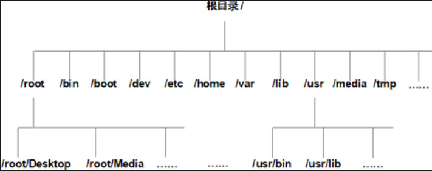

### 二、绝对路径和相对路径详解

- 在Linux中，简单的理解一个文件的路径，指的就是该文件存放的位置，例如， /home/cat 就表示的是cat文件所存放的位置。只要我们告诉Linux系统某个文件存放的准确位置，那么它就可以找到这个文件。指明一个文件存放的位置，有2种方法，分别是使用绝对路径和相对路径。Linux系统中所有的文件（目录）都被组织成以根目录“/”开始的倒置的树状结构

- 绝对路径一定是由根目录“/”开始写起。例如，使用绝对路径的表示方式指明bin文件所在的位置，该路径应写为/usr/bin，测试代码如下，如果仅传递给Linux系统一个文件名，它无法找到指定文件；而当将bin文件的绝对路径传递Linux系统时，它就可以成功找到

	```bash
	[root@localhost ~]# bin
	bash： bin： command not found  <-- 没有找到
	[root@localhost ~]# /usr/bin
	bash: /usr/bin: is a directory  <-- 是一个文件
	```

- 相对路径不是从根目录“/”开始写起，而是从当前所在的工作目录开始写起。使用相对路径表明某文件的存储位置时，经常会用到前面讲到的2个特殊目录，即当前目录（用`.`表示）和父目录（用`..`表示）。举个例子，当使用root身份登录Linux系统时，当前工作目录默认为 /root，如果此时需要将当前工作目录调整到root的子目录Desktop中，当然可以使用绝对路径，示例代码如下，可以看到，通过使用绝对路径，能成功地改变了当前工作路径。但除此之外，使用相对路径的方式会更简单。因为目前处于/root的位置，而Desktop就位于当前目录下。此代码中，./Desktop表示的就是Destop文件相对于/root所在的路径

	```bash
	[root@localhost ~]# pwd   <-- 显示当前所在的工作路径
	/root
	[root@localhost ~]# cd /root/Desktop
	[root@localhost Desktop]# pwd
	/root/Desktop
	```

- 如果以root身份登录Linux系统，并实现将当前工作目录由/root转换为/usr目录，有以下2种方式：

	```bash
	#使用绝对路径
	[root@localhost ~]# pwd <-- 显示当前所在的工作路径
	/root
	[root@localhost ~]# cd /usr
	[root@localhost ~]# pwd
	/usr
	#使用相对路径
	[root@localhost ~]# pwd <-- 显示当前所在的工作路径
	/root
	[root@localhost ~]# cd ../usr <-- 相对 root，usr 位于其父目录 /，因此这里要用到 ..
	[root@localhost ~]# pwd
	/usr
	```

- 总之，绝对路径是相对于根路径“/”的，只要文件不移动位置，那么它的绝对路径是恒定不变的；而相对路径是相对于当前所在目录而言的，随着程序的执行，当前所在目录可能会改变，因此文件的相对路径不是固定不变的

### 三、文件及目录命名规则

1. Linux系统中，文件和目录的命名规则如下：

	- 除了字符“/”之外，所有的字符都可以使用，但是要注意，在目录名或文件名中，使用某些特殊字符并不是明智之举。例如，在命名时应避免使用<、>、？、*和非打印字符等。如果一个文件名中包含了特殊字符，例如空格，那么在访问这个文件时就需要使用引号将文件名括起来
	- 目录名或文件名的长度不能超过255个字符
	- 目录名或文件名是区分大小写的。即使互不相同的目录名或文件名，但使用字符大小写来区分不同的文件或目录，也是不明智的
	- 与Windows操作系统不同，文件的扩展名对Linux操作系统没有特殊的含义，换句话说，Linux系统并不以文件的扩展名开分区文件类型。例如，dog.exe只是一个文件，其扩展名 .exe并不代表此文件就一定是可执行文件
	- 需要注意的是，在Linux系统中，硬件设备也是文件，也有各自的文件名称。Linux系统内核中的udev设备管理器会自动对硬件设备的名称进行规范，目的是让用户通过设备文件的名称，就可以大致猜测处设备的属性以及相关信息

2. udev设备管理器会一直以进程的形式运行，并侦听系统内核发出的信号来管理位于/dev目录下的设备文件

3. Linux系统中常见硬件设备的文件名

	| 硬件设备      | 文件名称                                                     |
	| ------------- | ------------------------------------------------------------ |
	| IDE设备       | /dev/hd[a-d]，现在的 IDE设备已经很少见了，因此一般的硬盘设备会以 /dev/sd 开头。 |
	| SCSI/SATA/U盘 | /dev/sd[a-p]，一台主机可以有多块硬盘，因此系统采用 a~p 代表 16 块不同的硬盘。 |
	| 软驱          | /dev/fd[0-1]                                                 |
	| 打印机        | /dev/lp[0-15]                                                |
	| 光驱          | /dev/cdrom                                                   |
	| 鼠标          | /dev/mouse                                                   |
	| 磁带机        | /dev/st0 或 /dev/ht0                                         |

### 四、命令提示符

1. 登录系统后，第一眼看到的内容是：`[root@localhost ~]#`这就是Linux系统的命令提示符

	- []：这是提示符的分隔符号，没有特殊含义
	- root：显示的是当前的登录用户，笔者现在使用的是root用户登录
	- @：分隔符号，没有特殊含义
	- localhost：当前系统的简写主机名（完整主机名是localhost.localdomain）
	- ~：代表用户当前所在的目录，此例中用户当前所在的目录是家目录
	- \#：命令提示符，Linux用这个符号标识登录的用户权限等级。如果是超级用户，提示符就是#；如果是普通用户，提示符就是$

2. 家目录（又称主目录）：用户登录后，要有一个初始登录的位置，这个初始登录位置就称为用户的家

	- 超级用户的家目录：/root
	- 普通用户的家目录：/home/用户名

3. 用户在自己的家目录中拥有完整权限，所以建议操作实验可以放在家目录中进行。切换一下用户所在目录。如果切换用户所在目录，那么命令提示符中的会变成用户当前所在目录的最后一个目录（不显示完整的所在目录/usr/ local，只显示最后一个目录local）

	```bash
	[root@localhost ~]# cd /usr/local
	[root@localhost local]#
	```


### 五、命令基本格式

1. 基本格式：`[root@localhost ~]# 命令[选项][参数]`

	- 命令格式中的[]代表可选项，也就是有些命令可以不写选项或参数，也能执行。用Linux中最常见的ls命令来解释一下命令的格式。如果按照命令的分类，那么ls命令应该属于目录操作命令。示例

	  ```bash
    [root@localhost ~]# ls
	  anaconda-ks.cfg install.log install.log.syslog`
	  ```
	
2. 选项的作用

	- ls命令之后不加选项和参数也能执行，不过只能执行最基本的功能，即显示当前目录下的文件名。那么加入一个选项，会出现什么结果

		```bash
		[root@localhost ~]# ls -l
		总用量44
		-rw-------.1 root root 1207 1 月 14 18:18 anaconda-ks.cfg
		-rw-r--r--.1 root root 24772 1 月 14 18:17 install.log
		-rw-r--r--.1 root root 7690 1 月 14 18:17 install.log.syslog
		```

	- 如果加一个"-l"选项，则可以看到显示的内容明显增多了。"-l"是长格式（long list）的意思，也就是显示文件的详细信息。可以看到选项的作用是调整命令功能。如果没有选项，那么命令只能执行最基本的功能；而一旦有选项，则可以显示更加丰富的数据

	- Linux的选项又分为短格式选项（-l）和长格式选项（--all）。短格式选项是英文的简写，用一个减号调用，例如：

		```bash
		[root@localhost ~]# ls -l
		
		# 而长格式选项是英文完整单词，一般用两个减号调用，例如：
		[root@localhost ~]# ls --all
		```

	- 一般情况下，短格式选项是长格式选项的缩写，也就是一个短格式选项会有对应的长格式选项。当然也有例外，比如ls命令的短格式选项-l就没有对应的长格式选项

3. 参数的作用

	- 参数是命令的操作对象，一般文件、目录、用户和进程等可以作为参数被命令操作。例如：

		```bash
		[root@localhost ~]# ls -l anaconda-ks.cfg
		-rw-------.1 root root 1207 1 月 14 18:18 anaconda-ks.cfg
		```

	- ls命令可以省略参数，那是因为有默认参数。命令一般都需要加入参数，用于指定命令操作的对象是谁。如果可以省略参数，则一般都有默认参数。例如：

		```bash
		[root@localhost ~]# ls
		anaconda-ks.cfg install.log install.log.syslog
		```

	- 这个ls命令后面没有指定参数，默认参数是当前所在位置，所以会显示当前目录下的文件名

4. 命令的选项用于调整命令功能，而命令的参数是这个命令的操作对象

## 三、文件目录类命令

### 一、pwd显示当前工作目录的绝对路径

1. 到现在为止，我们还不知道自己在系统的什么地方。在浏览器上，我们能够通过导航栏上的url，了解到自己在互联网上的具体坐标。相似的功能，是由`pwd`命令提供的，它能够输出当前的工作目录。我们使用root用户默认登陆后，就停留在`/root`目录中。Linux中的目录层次，是通过`/`进行划分的。使用其他账户登录的时候，默认停留在`/home/用户名`目录中

2. `pwd`命令是非常非常常用的命令，尤其是在一些命令提示符设置不太友好的机器上。另外，它也经常用在shell脚本中，用来判断当前的运行目录是否符合需求

3. 有很多线上事故，都是由于没有确认当前目录所引起的。比如`rm -rf *`这种危险的命令。在执行一些高危命令时，随时确认当前目录，是个好的习惯

4. 选项与参数

   - -P：显示出确实的路径，而非使用链接（link）路径

5. 实例显示出实际的工作目录，而非链接档本身的目录名而已

   ```shell
   [root@www ~]# cd /var/mail   <==注意，/var/mail是一个链接档
   [root@www mail]# pwd
   /var/mail         <==列出目前的工作目录
   [root@www mail]# pwd -P
   /var/spool/mail   <==怎么回事？有没有加 -P 差很多～
   [root@www mail]# ls -ld /var/mail
   lrwxrwxrwx 1 root root 10 Sep  4 17:54 /var/mail -> spool/mail
   # 看到这里应该知道为啥了吧？因为 /var/mail 是链接档，链接到 /var/spool/mail 
   # 所以，加上 pwd -P 的选项后，会不以链接档的数据显示，而是显示正确的完整路径啊！
   ```

### 二、ls列出目录的内容

1. ls能够列出相关目录的文件信息，语法有：

   ```shell
   [root@www ~]# ls [-aAdfFhilnrRSt] 目录名称
   [root@www ~]# ls [--color={never,auto,always}] 目录名称
   [root@www ~]# ls [--full-time] 目录名称
   ```

2. 选项与参数：

   - -a ：全部的文件，连同隐藏文件（开头为`.`的文件）一起列出来（常用）。直接在/root目录里，执行`ls -al`，会看到更多东西。这些额外的隐藏文件，都是以`.`开头，以配置文件居多，这就是参数`a`的作用。可以使用`ls -al --full-time`查看可读的日期

     ```shell
     [root@localhost ~]# ls -al
     total 28
     dr-xr-x---.  2 root root  135 Nov  4 07:53 .
     dr-xr-xr-x. 17 root root  224 Nov  3 20:28 ..
     -rw-------.  1 root root 1273 Nov  3 20:28 anaconda-ks.cfg
     -rw-------.  1 root root  246 Nov  4 11:41 .bash_history
     -rw-r--r--.  1 root root   18 Dec 28  2013 .bash_logout
     -rw-r--r--.  1 root root  176 Dec 28  2013 .bash_profile
     -rw-r--r--.  1 root root  176 Dec 28  2013 .bashrc
     -rw-r--r--.  1 root root  100 Dec 28  2013 .cshrc
     -rw-r--r--.  1 root root  129 Dec 28  2013 .tcshrc
     ```

   - -d ：仅列出目录本身，而不是列出目录内的文件数据（常用）

   - -l ：长数据串列出，包含文件的属性与权限等等数据（常用）。每行列出的信息依次是： 文件类型与权限、链接数、文件属主、文件属组、文件大小用byte来表示、建立或最近修改的时间、名字

     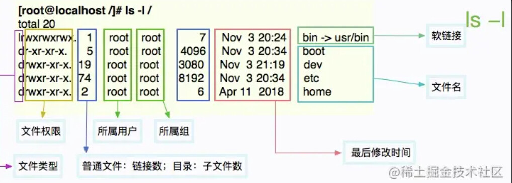

     ```shell
     [root@localhost /]# ls /
     # 注意：ls可以接受路径参数，你不用先跳转，就可以输出相关信息
     bin  boot  dev  etc  home  lib  lib64  media  mnt  opt  proc  root  run  sbin  srv  sys  tmp  usr  var
     [root@localhost /]# ls -l /
     # 带上 -l参数，能够看到文件的一些权限信息已经更新日期等
     total 20
     lrwxrwxrwx.   1 root root    7 Nov  3 20:24 bin -> usr/bin
     dr-xr-xr-x.   5 root root 4096 Nov  3 20:34 boot
     drwxr-xr-x.  19 root root 3080 Nov  3 21:19 dev
     drwxr-xr-x.  74 root root 8192 Nov  3 20:34 etc
     drwxr-xr-x.   2 root root    6 Apr 11  2018 home
     lrwxrwxrwx.   1 root root    7 Nov  3 20:24 lib -> usr/lib
     lrwxrwxrwx.   1 root root    9 Nov  3 20:24 lib64 -> usr/lib64
     drwxr-xr-x.   2 root root    6 Apr 11  2018 media
     drwxr-xr-x.   2 root root    6 Apr 11  2018 mnt
     drwxr-xr-x.   2 root root    6 Apr 11  2018 opt
     dr-xr-xr-x. 108 root root    0 Nov  3 21:19 proc
     dr-xr-x---.   2 root root  135 Nov  4 07:53 root
     drwxr-xr-x.  24 root root  740 Nov  3 21:20 run
     lrwxrwxrwx.   1 root root    8 Nov  3 20:24 sbin -> usr/sbin
     drwxr-xr-x.   2 root root    6 Apr 11  2018 srv
     dr-xr-xr-x.  13 root root    0 Nov  3 21:19 sys
     drwxrwxrwt.   9 root root 4096 Nov  4 03:40 tmp
     drwxr-xr-x.  13 root root  155 Nov  3 20:24 usr
     drwxr-xr-x.  19 root root  267 Nov  3 20:34 var
     ```

### 三、cd切换目录

1. `.`表示的是当前目录，`..`表示的是上层目录
2. 执行cd命令，可以将工作目录切换到目标文件夹
3. 切换到当前目录上级n层目录，只需使用多层级的`../`即可
4. 常用的cd命令
   - `../` 指的是上层目录
   - `../../` 指的是上两层目录
   - `./` 指的是当前目录
   - `~` 指的是当前的用户目录，这是一个缩写符号
   - `-` 使用它，可以在最近两次的目录中来回切换

### 四、mkdir创建一个新的目录

1. 语法：`mkdir [-mp] 目录名称`

2. 选项与参数

   - -m ：配置文件的权限，直接配置，不需要看默认权限 (umask) 的脸色

     ```shell
     [root@www tmp]# mkdir -m 711 test2
     #（-m 711 来给予新的目录 drwx--x--x 的权限）
     [root@www tmp]# ls -l
     drwxr-xr-x  3 root  root 4096 Jul 18 12:50 test
     drwxr-xr-x  3 root  root 4096 Jul 18 12:53 test1
     drwx--x--x  2 root  root 4096 Jul 18 12:54 test2
     ```

   - -p ：直接将所需要的目录（包含上一级目录）递归创建起来

     ```shell
     [root@www ~]# cd /tmp
     [root@www tmp]# mkdir test    <==创建一名为 test 的新目录
     [root@www tmp]# mkdir test1/test2/test3/test4
     mkdir: cannot create directory `test1/test2/test3/test4': 
     No such file or directory       <== 没办法直接创建此目录啊！
     [root@www tmp]# mkdir -p test1/test2/test3/test4
     ```

### 五、rmdir删除空的目录

1. 语法：`mkdir [-mp] 目录名称`

2. 选项与参数：

   - -p ：从该目录起，一次删除多级空目录

3. 示例：利用-p这个选项，立刻就可以将test1/test2/test3/test4一次删除。删除完test4发现test3是空目录继续删除，以此类推。不过要注意的是，这个rmdir仅能删除空的目录，可以使用rm 命令来删除非空目录

   ```shell
   [root@www tmp]# ls -l   <==看看有多少目录存在？
   drwxr-xr-x  3 root  root 4096 Jul 18 12:50 test
   drwxr-xr-x  3 root  root 4096 Jul 18 12:53 test1
   drwx--x--x  2 root  root 4096 Jul 18 12:54 test2
   [root@www tmp]# rmdir test   <==可直接删除掉，没问题
   [root@www tmp]# rmdir test1  <==因为尚有内容，所以无法删除！
   rmdir: `test1': Directory not empty
   [root@www tmp]# rmdir -p test1/test2/test3/test4
   [root@www tmp]# ls -l        <==您看看，底下的输出中test与test1不见了！
   drwx--x--x  2 root  root 4096 Jul 18 12:54 test2
   ```

### 六、touch创建空文件

1. 语法：`touch 文件名称`

2. 示例

   ```shell
   [root@hadoop101 ~]# touch xiyou/dssz/sunwukong.txt
   ```

### 七、cp复制文件或目录

1. 语法

   ```shell
   [root@www ~]# cp [-adfilprsu] 来源档(source) 目标档(destination)
   [root@www ~]# cp [options] source1 source2 source3 .... directory
   ```

2. 选项与参数

   - -i：若目标档（destination）已经存在时，在覆盖时会先询问动作的进行
   - -p：连同文件的属性一起复制过去，而非使用默认属性
   - -r：递归持续复制，用于目录的复制行为
   - -f：为强制（force）的意思，若目标文件已经存在且无法开启，则移除后再尝试一次

3. 示例：用root身份，将root目录下的.bashrc复制到/tmp下，并命名为bashrc

   ```shell
   [root@www ~]# cp ~/.bashrc /tmp/bashrc
   [root@www ~]# cp -i ~/.bashrc /tmp/bashrc
   cp: overwrite `/tmp/bashrc'? n  <==n不覆盖，y为覆盖
   ```

### 八、rm删除文件或目录

1. rm是强大的删除命令，它可以永久性地删除文件系统中指定的文件或目录。在使用rm命令删除文件或目录时，系统不会产生任何提示信息

2. 语法：`rm [-fir] 文件或目录`

3. 选项与参数

   - -f ：就是force的意思，忽略不存在的文件，不会出现警告信息
   - -i ：互动模式，在删除前会询问使用者是否动作
   - -r ：递归删除啊！最常用在目录的删除了！这是非常危险的选项

4. 注意点：rm命令是一个具有破坏性的命令，因为rm命令会永久性地删除文件或目录，这就意味着，如果没有对文件或目录进行备份，一旦使用rm命令将其删除，将无法恢复，因此，尤其在使用rm命令删除目录时，要慎之又慎

5. 示例一：rm命令如果任何选项都不加，则默认执行的是`rm -i 文件名`，也就是在删除一个文件之前会先询问是否删除

   ```shell
   [root@localhost ~]# touch cangls
   [root@localhost ~]# rm cangls
   rm:是否删除普通空文件"cangls"?y
   #删除前会询问是否删除
   ```

6. 示例二 ：如果需要删除目录，则需要使用`-r`选项。如果每级目录和每个文件都需要确认，那么在实际使用中简直是灾难

   ```shell
   [root@localhost ~]# mkdir -p /test/lm/movie/jp
   #递归建立测试目录
   [root@localhost ~]# rm /test
   rm:无法删除"/test/": 是一个目录
   #如果不加"-r"选项，则会报错
   [root@localhost ~]# rm -r /test
   rm:是否进入目录"/test"?y
   rm:是否进入目录"/test/lm/movie"?y
   rm:是否删除目录"/test/lm/movie/jp"?y
   rm:是否删除目录"/test/lm/movie"?y
   rm:是否删除目录"/test/lm"?y
   rm:是否删除目录"/test"?y
   #会分别询问是否进入子目录、是否删除子目录
   ```

7. 示例三：强制删除。如果要删除的目录中有1万个子目录或子文件，那么普通的rm删除最少需要确认1万次。所以，在真正删除文件的时候，我们会选择强制删除。加入了强制功能之后，删除就会变得很简单，但是需要注意，数据强制删除之后无法恢复，除非依赖第三方的数据恢复工具，如`extundelete`等。但要注意，数据恢复很难恢复完整的数据，一般能恢复70%~80%就很难得了。所以，与其把宝压在数据恢复上，不如养成良好的操作习惯。虽然`-rf`选项是用来删除目录的，但是删除文件也不会报错。所以，为了使用方便，一般不论是删除文件还是删除目录，都会直接使用`-rf`选项

### 九、mv移动文件与目录或重命名

1. 语法：

   ```shell
   [root@www ~]# mv [-fiu] source destination
   [root@www ~]# mv [options] source1 source2 source3 .... directory
   ```

2. 选项与参数：

   - -f：force强制的意思，如果目标文件已经存在，不会询问而直接覆盖
   - -i：若目标文件（destination）已经存在时，就会询问是否覆盖
   - -u：若目标文件已经存在，且source比较新，才会升级 (update)

3. 示例一：复制一文件，创建一目录，将文件移动到目录中。将某个文件移动到某个目录去，就是这样做

   ```shell
   [root@www ~]# cd /tmp
   [root@www tmp]# cp ~/.bashrc bashrc
   [root@www tmp]# mkdir mvtest
   [root@www tmp]# mv bashrc mvtest
   ```

4. 示例二：将目录或文件改名

   ```shell
   [root@www tmp]# mv mvtest mvtest2
   ```

### 十、cat查看文件内容

1. cat的作用：为了查看文件的生成效果，可以使用`cat`命令检测。`cat`命令将会把文件的内容，输出打印到终端上。如果加上参数`n`，甚至可以打印行号。效果如下

   ```shell
   [root@localhost ~]# cat spring
   10
   11
   12
   [root@localhost ~]# cat -n spring
   1	10
   2	11
   3	12
   ```

2. 除了查看文件内容，cat命令通常用和其他命令联合起来

   ```shell
   # 合并a文件和b文件到c文件
   cat a  b>> c
   
   # 把a文件的内容作为输入，使用管道处理
   cat a | cmd
   
   # 写入内容到指定文件。在shell脚本中非常常用
   cat > index.html <<EOF
   <html>
       <head><title></title></head>
       <body></body>
   </html>
   EOF
   ```

3. 由于我们的文件不大，`cat`命令没有什么危害。但假如文件有几个`GB`，使用`cat`就危险的多，这只叫做猫的小命令，会在终端上疯狂的进行输出，你可以通过多次按`ctrl+c`来终止它

### 十一、less分屏显示文件内容

1. 既然`cat`命令不适合操作大文件，那一定有替换的方案。`less`和`mor`e就是。由于`less`的加载速度比`more`快一些，所以现在一般都使用`less`。它最主要的用途，是用来分页浏览文件内容，并提供一些快速查找的方式。less是一个交互式的命令，你需要使用一些快捷键来控制它

2. 为了方面用户浏览文本内容，`less`命令还提供了以下几个功能：

   - 使用光标键可以在文本文件中前后（左后）滚屏
   - 用行号或百分比作为书签浏览文件
   - 提供更加友好的检索、高亮显示等操作
   - 兼容常用的字处理程序（如 Vim、Emacs）的键盘操作
   - 阅读到文件结束时，`less`命令不会退出
   - 屏幕底部的信息提示更容易控制使用，而且提供了更多的信息

3. `less`命令的基本格式如下：`less [选项] 文件名`

4. `less`命令可用的选项以及各自的含义如表所示

   | 选项            | 选项含义                                             |
   | --------------- | ---------------------------------------------------- |
   | -N              | 显示每行的行号                                       |
   | -S              | 行过长时将超出部分舍弃                               |
   | -e              | 当文件显示结束后，自动离开                           |
   | -g              | 只标志最后搜索到的关键词                             |
   | -Q              | 不使用警告音                                         |
   | -i              | 忽略搜索时的大小写                                   |
   | -m              | 显示类似more命令的百分比                             |
   | -f              | 强迫打开特殊文件，比如外围设备代号、目录和二进制文件 |
   | -s              | 显示连续空行为一行                                   |
   | -b <缓冲区大小> | 设置缓冲区的大小                                     |
   | -o <文件名>     | 将less输出的内容保存到指定文件中                     |
   | -x <数字>       | 将【Tab】键显示为规定的数字空格                      |

5. 在使用`less`命令查看文件内容的过程中，和`more`命令一样，也会进入交互界面，因此需要掌握一些常用的交互指令

   - `空格`：向下滚屏翻页
   - `b`：向上滚屏翻页
   - `/`：进入查找模式，比如`/1111`将查找1111字样
   - `q`：退出less
   - `g`：到开头
   - `G`：去结尾
   - `j`：向下滚动，和vim的作用非常像
   - `k`：向上滚动，和vim的作用非常像

6. 示例：使用`less`命令查看`/boot/grub/grub.cfg`文件中的内容。可以看到，less在屏幕底部显示一个冒号`:`，等待用户输入命令，比如说，用户想向下翻一页，可以按空格键；如果想向上翻一页，可以按b键

   ```shell
   [root@localhost ~]# less /boot/grub/grub.cfg
   #
   #DO NOT EDIT THIS FILE
   #
   #It is automatically generated by grub-mkconfig using templates from /etc/grub.d and settings from /etc/default/grub
   #
   
   ### BEGIN /etc/grub.d/00_header ###
   if [ -s $prefix/grubenv ]; then
    set have_grubenv=true
    load_env
   fi
   set default="0"
   if [ "$ {prev_saved_entry}" ]; then
    set saved_entry="${prev_saved_entry}"
    save_env saved_entry
    set prev_saved_entry= save_env prev_saved_entry
    set boot_once=true
   fi
   
   function savedefault {
    if [ -z "${boot_once}" ]; then
   :
   ```

### 十二、echo输出内容到控制台

1. 语法：`echo [选项] [输出内容]`

2. 选项：

   - -e：支持反斜线控制的字符转换

3. 控制字符

   | 控制字符 | 作用              |
   | -------- | ----------------- |
   | \\       | 输出\本身         |
   | \n       | 换行符            |
   | \t       | 制表符，也就是Tab |

4. 示例

   ```shell
   [atguigu@hadoop101 ~]$ echo “hello\tworld”
   hello\tworld
   [atguigu@hadoop101 ~]$ echo -e “hello\tworld”
   hello world
   ```

### 十三、head显示文件头部内容

1. `head`取出文件前面几行

2. 语法：`head [-n number] 文件`

3. 选项与参数

   - -n ：后面接数字，代表显示几行的意思。默认十行

4. 示例：显示前20行

   ```shell
   [root@www ~]# head -n 20 /etc/man.config
   ```

### 十四、tail输出文件尾部内容

1. `tail`取出文件后面几行

2. 语法：`tail [-n number] 文件`

3. 选项与参数

   - -n ：后面接数字，代表显示几行的意思。默认最后十行
   - -f ：表示持续侦测后面所接的档名，要等到按下`ctrl+c`才会结束tail的侦测
   - -F：能够监控到重新创建的文件。比如像一些log4j等日志是按天滚动的，`tail -f`无法监控到这种变化

4. 示例一：

   ```shell
   [root@www ~]# tail /etc/man.config
   # 默认的情况中，显示最后的十行！若要显示最后的 20 行，就得要这样：
   [root@www ~]# tail -n 20 /etc/man.config
   ```

5. 示例二：

   - `tail -f`或许是最常用的命令之一。它可以在控制终端，实时监控文件的变化，来看一些滚动日志。比如查看nginx或者tomcat日志等等。这条命令会显示文件的最后10行内容，而且光标不会退出命令，每隔一秒会检查一下文件是否增加新的内容，如果增加就追加到原来的输出结果后面并显示

   ```shell
   # 滚动查看系统日志
   [root@localhost ~]#tail -f anaconda-ks.cfg
   @server-platform
   @server-policy
   pax
   oddjob
   sgpio
   certmonger
   pam_krb5
   krb5-workstation
   perl-DBD-SQLite
   %end
   #光标不会退出文件，而会一直监听在文件的结尾处
   ```

   - 通常情况下，日志滚动的过快，依然会造成一些困扰，需要配合grep命令达到过滤效果

   ```shell
   # 滚动查看包含info字样的日志信息
   tail -f /var/log/messages | grep info
   ```

### 十五、>输出重定向和>>追加

1. 基本语法

   - `ls -l > 文件`：列表的内容写入文件中（覆盖写）
   - `ls -al >> 文件`：列表的内容追加到文件的末尾
   - `cat 文件 1 > 文件 2` ：将文件1的内容覆盖到文件2
   - `cat 文件1 文件2 > 文件3`：将文件1和2的内容合并后输出到文件3中
   - `echo “内容” >> 文件`

2. 示例

   - 将`ls`查看信息写入到文件中：`ls -l>a.tx`

   - 将`ls`查看信息追加到文件中：`ls -l>>b.txt`

   - 采用`echo`将hello单词追加到文件中：`echo hello>>c.txt`

   - 将文件file1.txt和file2.txt的内容合并后输出到文件file3.txt中

     ```shell
     [root@localhost base]# ls
     file1.txt    file2.txt
     [root@localhost base]# cat file1.txt
     ds(file1.txt)
     [root@localhost base]# cat file2.txt
     is great(file2.txt)
     [root@localhost base]# cat file1.txt file2.txt > file3.txt
     [root@localhost base]# more file3.txt
     #more 命令可查看文件中的内容
     ds(file1.txt)
     is great(file2.txt)
     [root@localhost base]# ls
     file1.txt    file2.txt    file3.txt
     ```

### 十六、history查看已经执行过历史命令

1. 基本语法：`history `查看已经执行过历史命令
2. 示例
   - 查看已经执行过的历史命令：`history`
   - 显示最近3条命令历史：`histroy 3`
   - 清除历史记录：`history -c`

### 十七、ln软链接

1. 软链接也称为符号链接，类似于windows里的快捷方式，有自己的数据块，主要存放了链接其他文件的路径

2. 基本语法：`	ln -s [原文件或目录] [软链接名] `

3. 注意点：

   - 删除软链接是`rm -rf 软链接名`，而不是`rm -rf 软链接名/`。如果使用 `rm -rf 软链接名/`删除，会把软链接对应的真实目录下内容删掉
   - 查询软连接是通过`ll`就可以查看，列表属性第1位是`l`，尾部会有位置指向

4. 示例

   - 创建软连接

     ```shell
     [root@hadoop101 ~]# mv houge.txt xiyou/dssz/
     [root@hadoop101 ~]# ln -s xiyou/dssz/houge.txt ./houzi
     [root@hadoop101 ~]# ll
     lrwxrwxrwx. 1 root root 20 6 月 17 12:56 houzi ->
     xiyou/dssz/houge.txt
     ```

   - 删除软连接

     ```shell
     [root@hadoop101 ~]# rm -rf houzi
     ```

   - 进入软连接实际物理路径

     ```shell
     [root@hadoop101 ~]# ln -s xiyou/dssz/ ./dssz
     [root@hadoop101 ~]# cd -P dssz/
     ```

### 十八、文件目录类命令总结

1. 文件剪贴删除复制重名等

   - `pwd`：显示当前工作目录的绝对路径

   - `ls`：

     - `ls -a`：显示当前目录所有的文件和目录，包括隐藏的

     * `ls -l`：以列表的方式显示信息

   - `cd`：

     - `cd ~`：回到自己的家目录
     - `cd …`：回到当前目录的上一级目录

   - `mkdir`：创建目录

     - `mkdir -P`：创建多级目录

   - `rmdir`：删除空目录。`rmdir`不能删除非空的目录。如果需要删除非空的目录，需要使用`rm -rf`

   - `cp`：拷贝文件到指定目录

     * `cp -rf`：递归复制整个文件夹。强制覆盖不提示的方法

   - `rm`：移除文件或目录

     * `rm -r`：递归删除整个文件夹
     * `rm -f`：强制删除不提示

   - `mv`：移动文件与目录或重命名，两种功能

   - `touch`：创建空文件。可以一次性创建多个文件

   - `ln`：给文件创建一个软连接

     * 基本用法`ln -s [源文件或目录][软连接名]`

2. 文件查看

   - `cat`：查看文件内容。只能浏览文件，而不能修改文件
     * `cat -n`：显示行号
     * `cat | more`：分页显示，不会全部一下显示完
   - `more`：是一个基于VI编辑器的文本过滤器，它以全屏幕的方式按页显示文本文件的内容。more还内置了很多快捷键：
     * `空白键（Space）`：向下翻一页
     * `Enter`：向下翻一行
     * `q`：立刻离开more，不再显示该文件内容
     * `Ctrl + F`：向下滚动一屏
     * `Ctrl + B`：返回上一屏
     * `=` ：输出当前行的行号
     * `:f`：输出文件名和当前行的行号
   - `less`：用来分屏查看文件内容，与`more`相似，但是更强大，支持各种显示终端。`less`指令在显示文件内容时，并不是一次将整个文件加载之后才显示，而是根据显示需要加载内容。对于显示大型文件具有较高的效率
   - `head`：显示文件的开头部分
     - `head -n 5`：看前面5行内容
   - `tail`：输出文件中尾部的内容
     * `tail -n 5`：看后面5行内容
     * `tail -f`：实时追踪该文档的所有更新
   - `>指令`：输出重定向。如果不存在会创建文件，否则会将原来的文件内容覆盖
   - `>>指令`：追加。如果不存在会创建文件，否则不会覆盖原来的文件内容，而是追加到文件的尾部
   - `echo`：输出内容到控制台
   - `history`：查看历史指令	

## 四、时间日期类命令

### 一、显示当前日期

1. 基本语法
   - `date`：显示当前时间
   - `date +%Y`：显示当前年份
   - `date +%m`：显示当前月份
   - `date +%d`：显示当前是哪一天
   - `date "+%Y-%m-%d %H:%M:%S"`：显示年月日时分秒
   - `date +%s`：显示当前日期时间戳
2. 示例
   - 显示当前时间信息：`date`
   - 显示当前时间年月日：`date "+%Y-%m-%d"`
   - 显示当前时间年月日时分秒：`date "+%Y-%m-%d %H:%M:%S"`
   - 显示当前时间戳：`date "+%s"`

### 二、显示非当前时间

1. `date -d '1 days ago'`：显示昨天时间
2. `date -d '-1 days ago'`：显示明天时间

### 三、设置日期

1. 基本语法：`date -s 字符串时间`

2. 示例：设置系统当前时间，比如设置成`2030-1-01 20:00:10`

   ```shell
   date -s "2030-1-01 20:00:10"
   ```

### 四、cal指令

1. 查看日历指令`cal`

2. 基本语法：`cal [选项]`。不加选项，显示本月日历

3. 示例

   - 显示当前日历：`cal`

     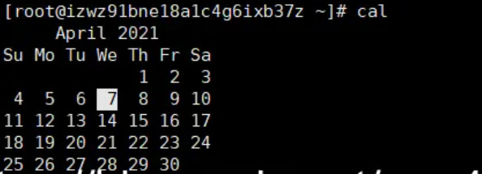

   - 显示2021年日历：`cal 2021`

     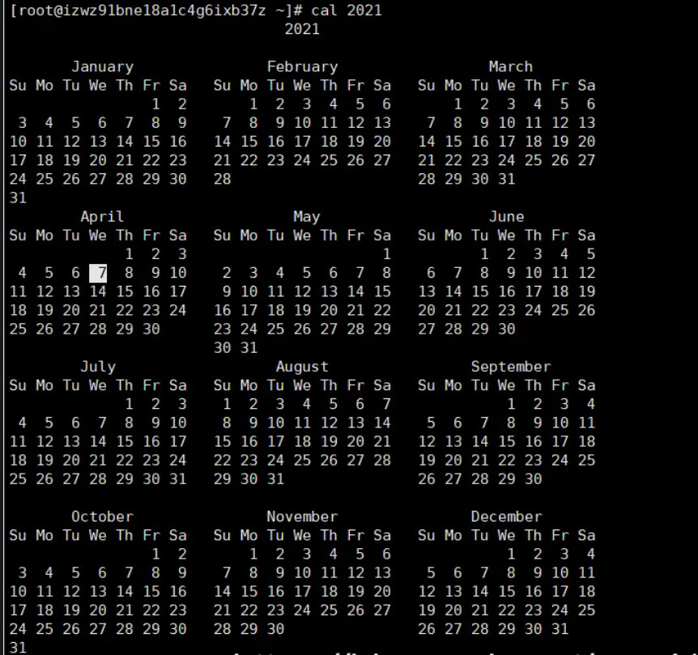

## 五、用户管理类命令

### 一、useradd添加新用户

1. 基本语法

   - `useradd 用户名`：添加新用户
   - `useradd -g 组名 用户名`：添加新用户到某个组

2. 示例

   ```shell
   [root@localhost ~]#useradd sunsh
   ```

### 二、passwd设置用户密码

1. 基本语法：`passwd 用户名`

2. 示例

   - 使用root账户修改sunsh普通用户的密码，可以使用如下命令：

     ```shell
     [root@localhost ~]#passwd sunsh
     Changing password for user lamp.
     New password: <直接输入新的口令，但屏幕不会有任何反应
     BAD PASSWORD: it is WAY too short <口令太简单或过短的错误！这里只是警告信息，输入的密码依旧能用
     Retype new password: <再次验证输入的密码，再输入一次即可
     passwd: all authentication tokens updated successfully. <提示修改密码成功
     ```

   - 也可以使用passwd命令修改当前系统已登录用户的密码，但要注意的是，需省略掉"选项" 和"用户名"。例如，我们登陆sunsh用户，并使用passwd命令修改lamp的登陆密码，执行过程如下：

     ```shell
     [root@localhost ~]#passwd
     #passwd直接回车代表修改当前用户的密码
     Changing password for user vbird2.
     Changing password for vbird2
     (current) UNIX password: <这里输入『原有的旧口令』
     New password: <这里输入新口令
     BAD PASSWORD: it is WAY too short <口令检验不通过，请再想个新口令
     New password: <这里再想个来输入吧
     Retype new password: <通过口令验证！所以重复这个口令的输入
     passwd: all authentication tokens updated successfully. <成功修改用户密码
     ```

3. 注意点

   - 普通用户只能使用 passwd 命令修改自己的密码，而不能修改其他用户的密码
   - 与使用root账户修改普通用户的密码不同，普通用户修改自己的密码需要先输入自己的旧密码，只有旧密码输入正确才能输入新密码。不仅如此，此种修改方式对密码的复杂度有严格的要求，新密码太短、太简单，都会被系统检测出来并禁止用户使用。很多Linux发行版为了系统安装，都使用了PAM模块进行密码的检验，设置密码太短、与用户名相同、是常见字符串等，都会被PAM模块检查出来，从而禁止用户使用此类密码
   - 使用root用户，无论是修改普通用户的密码，还是修改自己的密码，都可以不遵守PAM模块设定的规则。在实际应用中，就算是root身份，在设定密码时也要严格遵守密码规范，因为只有好的密码规范才是服务器安全的基础

### 三、id查看用户是否存在

1. id命令可以查询用户的UID、GID和附加组的信息

2. 基本语法：`id 用户名`

3. 示例

   ```shell
   [root@localhost ~]# id lamp
   uid=501(lamp) gid=501(lamp) groups=501(lamp)
   #能看到uid(用户ID)、gid(初始组ID), groups是用户所在组，
   #这里既可以看到初始组，如果有附加组，则也能看到附加组
   
   [root@localhost ~]# usermod -G root lamp
   #把用户加入root组
   [root@localhost ~]# id lamp
   uid=501(lamp) gid=501(lamp) groups=501(lamp),0(root)
   #root组中加入了lamp用户的附加组信息
   ```

### 四、cat /etc/passwd查看创建了哪些用户

#### 一、/etc/passwd文件的概述

1. Linux系统中的/etc/passwd文件，是系统用户配置文件，存储了系统中所有用户的基本信息，并且所有用户都可以对此文件执行读操作

2. 打开文件查看内容

   ```shell
   [root@localhost ~]# vim /etc/passwd
   #查看一下文件内容
   root:x:0:0:root:/root:/bin/bash
   bin:x:1:1:bin:/bin:/sbin/nologin
   daemon:x:2:2:daemon:/sbin:/sbin/nologin
   adm:x:3:4:adm:/var/adm:/sbin/nologin
   ...省略部分输出...
   ```

   - /etc/passwd文件中的内容非常规律，每行记录对应一个用户
   - 这些用户中的绝大多数是系统或服务正常运行所必需的用户，这种用户通常称为系统用户或伪用户。系统用户无法用来登录系统，但也不能删除，因为一旦删除，依赖这些用户运行的服务或程序就不能正常执行，会导致系统问题
   - 每行用户信息都以 "：" 作为分隔符，划分为 7 个字段，每个字段所表示的含义如下。用户名：密码：UID（用户ID）：GID（组ID）：描述性信息：主目录：默认Shell

#### 二、用户信息详解

1. 用户名

   - 用户名，就是一串代表用户身份的字符串
   - 用户名仅是为了方便用户记忆，Linux系统是通过UID来识别用户身份，分配用户权限的。/etc/passwd文件中就定义了用户名和UID之间的对应关系

2. 密码

   - "x"表示此用户设有密码，但不是真正的密码，真正的密码保存在/etc/shadow文件中
   - 在早期的UNIX中，这里保存的就是真正的加密密码串，但由于所有程序都能读取此文件，非常容易造成用户数据被窃取
   - 虽然密码是加密的，但是采用暴力破解的方式也是能够进行破解的。因此，现在Linux系统把真正的加密密码串放置在/etc/shadow文件中，此文件只有root用户可以浏览和操作，这样就最大限度地保证了密码的安全
   - 需要注意的是，虽然"x"并不表示真正的密码，但也不能删除，如果删除了"x"，那么系统会认为这个用户没有密码，从而导致只输入用户名而不用输入密码就可以登陆（只能在使用无密码登录，远程是不可以的），除非特殊情况（如破解用户密码），这当然是不可行的

3. UID

   - UID，也就是用户ID。每个用户都有唯一的一个UID，Linux系统通过UID来识别不同的用户

   - UID就是一个0~65535之间的数，不同范围的数字表示不同的用户身份

     | UID范围   | 用户身份                                                     |
     | --------- | ------------------------------------------------------------ |
     | 0         | 超级用户。UID为0就代表这个账号是管理员账号。在Linux中，只需把其他用户的UID修改为0就可以将普通用户升级为管理员。不过不建议建立多个管理员账号 |
     | 1~499     | 系统用户（伪用户）。也就是说，此范围的UID保留给系统使用。其中，1~99 用于系统自行创建的账号；100~499分配给有系统账号需求的用户。  其实，除了0之外，其他的UID并无不同，这里只是默认500以下的数字给系统作为保留账户，只是一个公认的习惯而已 |
     | 500~65535 | 普通用户。通常这些UID已经足够用户使用了。在2.6内核之后Linux系统已经可以支持232个UID了 |

4. GID

   - GID全称为“Group ID”，简称“组ID”，表示用户初始组的组ID号
   - 初始组，指用户登陆时就拥有这个用户组的相关权限。每个用户的初始组只能有一个，通常就是将和此用户的用户名相同的组名作为该用户的初始组。比如说，我们手工添加用户 lamp，在建立用户lamp的同时，就会建立lamp组作为lamp用户的初始组
   - 附加组，指用户可以加入多个其他的用户组，并拥有这些组的权限。每个用户只能有一个初始组，除初始组外，用户再加入其他的用户组，这些用户组就是这个用户的附加组。附加组可以有多个，而且用户可以有这些附加组的权限
   - 举例来说，刚刚的lamp用户除属于初始组lamp外，又把它加入了users组，那么lamp用户同时属于lamp组和users组，其中lamp是初始组，users是附加组
   - 当然，初始组和附加组的身份是可以修改的，但是我们在工作中不修改初始组，只修改附加组，因为修改了初始组有时会让管理员逻辑混乱
   - 需要注意的是，在/etc/passwd文件的第四个字段中看到的ID是这个用户的初始组

5. 描述性信息：用来解释这个用户的意义而已

6. 主目录

   - 主目录，也就是用户登录后有操作权限的访问目录，通常称为用户的主目录
   - 例如，root超级管理员账户的主目录为/root，普通用户的主目录为/home/yourIDname，即在/home/目录下建立和用户名相同的目录作为主目录，如lamp用户的主目录就是/home/lamp/目录

7. 默认的Shell

   - Shell就是Linux的命令解释器，是用户和Linux内核之间沟通的桥梁

   - 用户登陆Linux系统后，通过使用Linux命令完成操作任务，但系统只认识类似0101的机器语言，这里就需要使用命令解释器。也就是说，Shell命令解释器的功能就是将用户输入的命令转换成系统可以识别的机器语言

   - 通常情况下，Linux系统默认使用的命令解释器是bash（/bin/bash），当然还有其他命令解释器，例如sh、csh等

   - 在/etc/passwd文件中，可以把这个字段理解为用户登录之后所拥有的权限。如果这里使用的是bash命令解释器，就代表这个用户拥有权限范围内的所有权限。例如：

     ```shell
     [root@localhost ~]# vim /etc/passwd
     lamp:x:502:502::/home/lamp:/bin/bash
     ```

   - 添加了lamp用户，它使用的是bash命令解释器，那么这个用户就可以使用普通用户的所有权限。如果把lamp用户的Shell命令解释器修改为/sbin/nologin，那么，这个用户就不能登录了，例如：

     ```shell
     [root@localhost ~]# vim /etc/passwd
     lamp:x:502:502::/home/lamp:/sbin/nologin
     ```

   - 因为/sbin/nologin就是禁止登录的Shell。同样，如果在这里放入的系统命令，如/usr/bin/passwd，例如：

     ```shell
     [root@localhost ~]#vim /etc/passwd
     lamp:x:502:502::/home/lamp:/usr/bin/passwd
     ```

   - 那么这个用户可以登录，但登录之后就只能修改自己的密码。但是，这里不能随便写入和登陆没有关系的命令（如ls），系统不会识别这些命令

### 五、su临时切换用户身份

#### 一、基本使用

1. su是最简单的用户切换命令，通过该命令可以实现任何身份的切换，包括从普通用户切换为root用户、从root用户切换为普通用户以及普通用户之间的切换

2. 普通用户之间切换以及普通用户切换至root用户，都需要知晓对方的密码，只有正确输入密码，才能实现切换；从root用户切换至其他用户，无需知晓对方密码，直接可切换成功

3. su的基本语法：`su [选项] 用户名``

4. 选项及参数

   - `-`：当前用户不仅切换为指定用户的身份，同时所用的工作环境也切换为此用户的环境（包括PATH变量、MAIL变量等），使用`-`选项可省略用户名，默认会切换为root用户
   - `-l`：同`-`的使用类似，也就是在切换用户身份的同时，完整切换工作环境，但后面需要添加欲切换的使用者账号
   - `-p`：表示切换为指定用户的身份，但不改变当前的工作环境（不使用切换用户的配置文件）
   - `-m`：和`-p`一样
   - `-c`命令：仅切换用户执行一次命令，执行后自动切换回来，该选项后通常会带有要执行的命令

5. 示例

   ```shell
   [lamp@localhost ~]$ su 
   或者
   [lamp@localhost ~]$ su - root
   或者
   [lamp@localhost ~]$ su - 
   密码： <-- 输入 root 用户的密码
   #"-"代表连带环境变量一起切换，不能省略
   
   
   [lamp@localhost ~]$ whoami
   lamp
   #当前我是lamp
   [lamp@localhost ~]$ su - -c "useradd user1" root
   密码：
   #不切换成root，但是执行useradd命令添加user1用户
   [lamp@localhost ~]$ whoami
   lamp
   #我还是lamp
   [lamp@localhost ~]$ grep "user1' /etc/passwd
   userl:x:502:504::/home/user1:/bin/bash
   #user用户已经添加了
   
   
   #执行一条命令后用户身份会随即自动切换回来，
   #其他切换用户的方式不会自动切换，只能使用 exit 命令进行手动切换
   [lamp@localhost ~]$ whoami
   lamp
   #当前我是lamp
   [lamp@localhost ~]$ su - lamp1
   Password:  <--输入lamp1用户的密码
   #切换至 lamp1 用户的工作环境
   [lamp@localhost ~]$ whoami
   lamp1
   #什么也不做，立即退出切换环境
   [lamp1@localhost ~]$ exit
   logout
   [lamp@localhost ~]$ whoami
   lamp
   ```

#### 二、su和su -的区别

1. 使用su命令时，有`-`和没有`-`是完全不同的，`-`选项表示在切换用户身份的同时，连当前使用的环境变量也切换成指定用户的。我们知道，环境变量是用来定义操作系统环境的，因此如果系统环境没有随用户身份切换，很多命令无法正确执行
2. 例如，普通用户lamp通过su命令切换成root用户，但没有使用`-`选项，这样情况下，虽然看似是root用户，但系统中的`$PATH`环境变量依然是lamp的（而不是root的），因此当前工作环境中，并不包含/sbin、/usr/sbin等超级用户命令的保存路径，这就导致很多管理员命令根本无法使用。不仅如此，当root用户接受邮件时，会发现收到的是lamp用户的邮件，因为环境变量​`$MAIL`也没有切换
3. 简单理解为有`-`选项，切换用户身份更彻底；反之，只切换了一部分，这会导致某些命令运行出现问题或错误（例如无法使用service命令）

### 六、userdel删除用户

1. userdel就是删除用户的的相关数据，此命令只有root用户才能使用

2. 用户的相关数据包括

   - 用户基本信息：存储在/etc/passwd文件中
   - 用户个人文件：主目录默认位于/home/用户名

3. userdel命令的作用就是从用户基本信息文件和用户个人文件中，删除与指定用户有关的数据信息

4. 基本语法：`userdel -r 用户名`

5. 选项与参数

   - `-r`选项表示在删除用户的同时删除用户的家目录

6. 注意点：

   - 在删除用户的同时如果不删除用户的家目录，那么家目录就会变成没有属主和属组的目录，也就是垃圾文件
   - 如果要删除的用户已经使用过系统一段时间，那么此用户可能在系统中留有其他文件，因此，如果我们想要从系统中彻底的删除某个用户，最好在使用userdel命令之前，先通过 `find -user 用户名` 命令查出系统中属于该用户的文件，然后再加以删除

7. 示例

   - 删除用户但保存用户主目录

     ```shell
     [root@localhost ~]#userdel tangseng
     [root@localhost ~]#ll /home/
     ```

   - 删除用户和用户主目录，都删除

     ```shell
     [root@localhost ~]#useradd zhubajie 
     [root@localhost ~]#ll /home/
     
     [root@localhost ~]#userdel -r zhubajie
     [root@localhost ~]#ll /home/
     ```

### 七、who查看登录用户信息

1. 基本语法：

   - `whoami`：显示自身用户名称。用来打印当前执行操作的用户名
   - `who am i`：显示登录用户的用户名以及登陆时间。用来打印登陆当前Linux系统的用户名

2. 示例

   - 首先使用用户名为“lamp”登陆Linux 系统，然后执行如下命令

     ```shell
     [lamp@localhost ~]$ whoami
     lamp
     [lamp@localhost ~]$ who am i
     lamp  pts/0  2021-10-09 15:30 (:0.0)
     ```

   - 在此基础上，使用su命令切换到root用户下，再执行一遍上面的命令

     ```shell
     [lamp@localhost ~] su - root
     [root@localhost ~]$ whoami
     root
     [root@localhost ~]$ who am i
     lamp  pts/0  2017-10-09 15:30 (:0.0)
     ```

3. 运行机制：使用su或者sudo命令切换用户身份，骗得过`whoami`，但骗不过`who am i`。要解释这背后的运行机制，需要搞清楚什么是实际用户（UID）和有效用户（EUID，即 Effective UID）

   - 所谓实际用户，指的是登陆Linux系统时所使用的用户，因此在整个登陆会话过程中，实际用户是不会发生变化的；而有效用户，指的是当前执行操作的用户，也就是说真正决定权限高低的用户，这个是能够利用su或者sudo命令进行任意切换的
   - 一般情况下，实际用户和有效用户是相同的，如果出现用户身份切换的情况，它们会出现差异。需要注意的是，实际用户和有效用户出现差异，切换用户并不是唯一的触发机制

4. 使用场景

   - `whoami`的使用场景：通常，对那些经常需要切换用户的系统管理员来说，经常需要明确当前使用的是什么身份；另外，对于某些shell脚本，或者需要特别的用户才能执行。这两种情况需要使用`whoami`
   - `who am i`：一些shell脚本，一定要某个特别用户才能执行，即便使用su或者sudo命令切换到此身份都不行，此时就需要利用`who am i`来确认

### 八、sudo设置普通用户具有root权限

1. 使用su命令可以让普通用户切换到root身份去执行某些特权命令，但存在一些问题

   - 仅仅为了一个特权操作就直接赋予普通用户控制系统的完整权限
   - 当多人使用同一台主机时，如果大家都要使用su命令切换到root身份，那势必就需要root 的密码，这就导致很多人都知道root的密码

2. 考虑到使用su命令可能对系统安装造成的隐患，最常见的解决方法是使用sudo命令，此命令也可以让你切换至其他用户的身份去执行命令。相对于使用su命令还需要新切换用户的密码，sudo命令的运行只需要知道自己的密码即可，甚至于，我们可以通过手动修改sudo的配置文件，使其无需任何密码即可运行

3. sudo命令默认只有root用户可以运行

4. sudo命令的执行过程

   - 当用户运行sudo命令时，系统会先通过/etc/sudoers文件，验证该用户是否有运行sudo 的权限
   - 确定用户具有使用sudo命令的权限后，还要让用户输入自己的密码进行确认。出于对系统安全性的考虑，如果用户在默认时间内（默认是5分钟）不使用sudo命令，此后使用时需要再次输入密码
   - 密码输入成功后，才会执行sudo命令后接的命令

5. 修改sudo配置文件

   - 能否使用sudo命令，取决于对/etc/sudoers文件的配置（默认情况下，此文件中只配置有 root用户）。对/etc/sudoers文件进行合理的修改使sudo可以对其他用户使用

     ```shell
     [root@localhost ~]#vim /etc/sudoers 
     ```

   - 修改/etc/sudoers文件，找到下面一行（91 行），在root下面添加一行，如下所示：

     ```shell
     ## Allow root to run any commands anywhere
     root ALL=(ALL) ALL
     lamp ALL=(ALL) ALL
     #用户名 被管理主机的地址=(可使用的身份) 授权命令(绝对路径)
     #%wheel ALL=(ALL) ALL
     #%组名 被管理主机的地址=(可使用的身份) 授权命令(绝对路径)
     ```

   - 或者配置成采用sudo命令时，不需要输入密码

     ```shell
     ## Allow root to run any commands anywhere
     root ALL=(ALL) ALL
     lamp ALL=(ALL) NOPASSWD:ALL
     ```

   - 修改完毕，现在可以用lamp帐号登录，然后用命令sudo，即可获得root权限进行操作

6. 对以上2个模板的各部分进行详细的说明

   |       模块       |                             含义                             |
   | :--------------: | :----------------------------------------------------------: |
   |  用户名或群组名  |       表示系统中的那个用户或群组，可以使用sudo这个命令       |
   | 被管理主机的地址 | 用户可以管理指定IP地址的服务器。这里如果写ALL，则代表用户可以管理任何主机；如果写固定IP，则代表用户可以管理指定的服务器。如果我们在这里写本机的 IP地址，不代表只允许本机的用户使用指定命令，而是代表指定的用户可以从任何 IP地址来管理当前服务器 |
   |   可使用的身份   | 就是把来源用户切换成什么身份使用，（ALL）代表可以切换成任意身份。这个字段可以省略 |
   |     授权命令     | 表示root把什么命令授权给用户，换句话说，可以用切换的身份执行什么命令。需要注意的是，此命令必须使用绝对路径写。默认值是ALL，表示可以执行任何命令 |

7. 示例一：用普通用户在/opt目录下创建一个文件夹

   ```shell
   [lamp@localhost opt]$ sudo mkdir module
   [root@localhost opt]# chown lamp:lamp module/
   ```

8. 示例二：假设现在有pro1，pro2，pro3这3个用户，还有一个group群组，我们可以通过在/etc/sudoers文件配置wheel群组信息，令这3个用户同时拥有管理系统的权限

   - 首先，向/etc/sudoers文件中添加群组配置信息

     ```shell
     ....(前面省略)....
     %group     ALL=(ALL)    ALL
     #在 84 行#wheel这一行后面写入
     ```

   - 此配置信息表示，group这个群组中的所有用户都能够使用sudo切换任何身份，执行任何命令。接下来，我们使用usermod命令将pro1加入group群组

     ```shell
     [root@localhost ~]# usermod -a -G group pro1
     [pro1@localhost ~]# sudo tail -n 1 /etc/shadow <==注意身份是 pro1
     ....(前面省略)....
     Password:  <==输入 pro1 的口令喔！
     pro3:$1$GfinyJgZ$9J8IdrBXXMwZIauANg7tW0:14302:0:99999:7:::
     [pro2@localhost ~]# sudo tail -n 1 /etc/shadow <==注意身份是 pro2
     Password:
     pro2 is not in the sudoers file.  This incident will be reported.
     #此错误信息表示 pro2 不在 /etc/sudoers 的配置中。
     ```

   - 可以看到，由于pro1加入到了group群组，因此pro1就可以使用sudo命令，而pro2不行。同样的道理，如果我们想让pro3也可以使用sudo命令，不用再修改/etc/sudoers文件，只需要将pro3加入group群组即可

### 九、usermod修改用户

1. 基本语法：`usermod -g 用户组 用户`

2. 选项说明

   - `-g`：修改用户的初始登录组，给定的组必须存在。默认组id是1

3. 示例：将用户加入到用户组

   ```shell
   [root@dselegent-study /]# groupadd group
   [root@dselegent-study lamp]# usermod -g group lamp
   [root@dselegent-study lamp]# id lamp
   uid=1001(lamp) gid=1002(group) 组=1002(group)
   ```

## 六、用户组管理类命令

### 一、用户和用户组

- Linux是多用户多任务操作系统，换句话说，Linux系统支持多个用户在同一时间内登陆，不同用户可以执行不同的任务，并且互不影响。例如，某台Linux服务器上有4个用户，分别是 root、www、ftp和mysql，在同一时间内，root用户可能在查看系统日志、管理维护系统；www用户可能在修改自己的网页程序；ftp用户可能在上传软件到服务器；mysql用户可能在执行自己的SQL查询，每个用户互不干扰，有条不紊地进行着自己的工作。与此同时，每个用户之间不能越权访问，比如www用户不能执行mysql用户的SQL查询操作，ftp用户也不能修改www用户的网页程序
- 不同用户具有不问的权限，毎个用户在权限允许的范围内完成不间的任务，Linux正是通过这种权限的划分与管理，实现了多用户多任务的运行机制
- 因此，如果要使用Linux系统的资源，就必须向系统管理员申请一个账户，然后通过这个账户进入系统（账户和用户是一个概念）。通过建立不同属性的用户，一方面可以合理地利用和控制系统资源，另一方面也可以帮助用户组织文件，提供对用户文件的安全性保护
- 每个用户都有唯一的用户名和密码。在登录系统时，只有正确输入用户名和密码，才能进入系统和自己的主目录
- 用户组是具有相同特征用户的逻辑集合。简单的理解，有时我们需要让多个用户具有相同的权限，比如查看、修改某一个文件的权限，一种方法是分别对多个用户进行文件访问授权，如果有10个用户的话，就需要授权10次。显然，这种方法不太合理。最好的方式是建立一个组，让这个组具有查看、修改此文件的权限，然后将所有需要访问此文件的用户放入这个组中。那么，所有用户就具有了和组一样的权限，这就是用户组
- 将用户分组是Linux系统中对用户进行管理及控制访问权限的一种手段，通过定义用户组，很多程序上简化了对用户的管理工作

### 二、用户和组的关系

1. 用户和用户组的对应关系有以下4种：

   - 一对一：一个用户可以存在一个组中，是组中的唯一成员
   - 一对多：一个用户可以存在多个用户组中，此用户具有这多个组的共同权限
   - 多对一：多个用户可以存在一个组中，这些用户具有和组相同的权限
   - 多对多：多个用户可以存在多个组中，也就是以上3种关系的扩展

2. 用户和组之间的关系可以用图来表示：

   

### 三、用户ID和组ID

1. 登陆Linux系统时，虽然输入的是自己的用户名和密码，但其实Linux并不认识你的用户名称，它只认识用户名对应的ID号（也就是一串数字）。Linux系统将所有用户的名称与ID的对应关系都存储在/etc/passwd文件中。说白了，用户名并无实际作用，仅是为了方便用户的记忆而已

2. Linux系统中，每个用户的ID细分为2种，分别是用户ID（User ID，简称UID）和组 ID（Group ID，简称GID），这与文件有拥有者和拥有群组两种属性相对应

   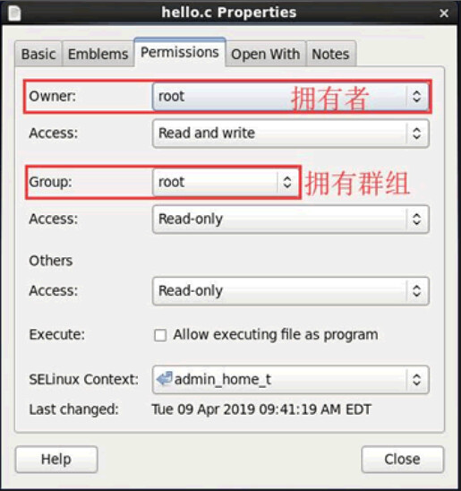

   - 从图中可以看到，该文件的拥有者是超级管理员root，拥有群组也是root。既然Linux系统不认识用户名，文件判别它的拥有者名称和群组名称的原理是每个文件都有自己的拥有者ID和群组ID，当显示文件属性时，系统会根据/etc/passwd和/etc/group文件中的内容，分别找到UID和GID对应的用户名和群组名，然后显示出来
   - 在/etc/passwd文件中，利用UID可以找到对应的用户名；在/etc/group文件中，利用GID 可以找到对应的群组名

### 四、groupadd新增组

1. 基本语法：`groupadd [选项] 组名`

2. 选项

   - `g GID`：指定组ID
   - `-r`：创建系统群组

3. 示例

   ```shell
   [root@localhost ~]# groupadd group1
   #添加group1组
   [root@localhost ~]# grep "group1" /etc/group
   /etc/group:group1:x:502:
   /etc/gshadow:group1:!::
   ```

### 五、groupdel删除组

1. 基本语法：`groupdel 组名`

2. 使用`groupdel`命令删除群组，其实就是删除/etc/gourp文件和/etc/gshadow文件中有关目标群组的数据信息

   ```shell
   [root@localhost ~]#grep "group1" /etc/group /etc/gshadow
   /etc/group:group1:x:505:
   /etc/gshadow:group1:!::
   [root@localhost ~]#groupdel group1
   [root@localhost ~]#grep "group1" /etc/group /etc/gshadow
   [root@localhost ~]#
   ```

3. 注意点：不能使用`groupdel`命令随意删除群组。此命令仅适用于删除那些"不是任何用户初始组"的群组，换句话说，如果有群组还是某用户的初始群组，则无法使用`groupdel`命令成功删除。例如：

   ```shell
   [root@localhost ~]# useradd temp
   #运行如下命令，可以看到 temp 用户建立的同时，还创建了 temp 群组，且将其作为 temp用户的初始组（组ID都是 505）
   [root@localhost ~]# grep "temp" /etc/passwd /etc/group /etc/gshadow
   /etc/passwd:temp:x:505:505::/home/temp:/bin/bash
   /etc/group:temp:x:505:
   /etc/gshadow:temp:!::
   #下面尝试删除 temp 群组
   [root@localhost ~]# groupdel temp
   groupdel:cannot remove the primary group of user 'temp'
   ```

   - 可以看到，groupdel命令删除temp群组失败，且提示“不能删除temp用户的初始组”。如果一定要删除temp群组，要么修改temp用户的GID，也就是将其初始组改为其他群组，要么先删除temp用户
   - 切记，虽然我们已经学了如何手动删除群组数据，但胡乱地删除群组可能会给其他用户造成不小的麻烦，因此更改文件数据要格外慎重

### 六、groupmod修改组

1. 基本语法：`groupmod [选现] 新组名 旧组名`

2. 选项

   - `-g GID`：修改组ID
   - `-n 新组名`：修改组名

3. 示例

   ```shell
   [root@localhost ~]# groupmod -n testgrp group1
   #把组名group1修改为testgrp
   [root@localhost ~]# grep "testgrp" /etc/group
   testgrp:x:502:
   #注意GID还是502，但是组名已经改变
   ```

4. 注意点：用户名不要随意修改，组名和GID也不要随意修改，因为非常容易导致管理员逻辑混乱。如果非要修改用户名或组名，则建议先删除旧的，再建立新的

### 七、cat /etc/group查看创建了哪些组

#### 一、/etc/group概述

1. /ect/group文件是用户组配置文件，即用户组的所有信息都存放在此文件中

2. 此文件是记录组ID（GID）和组名相对应的文件。etc/passwd 件中每行用户信息的第四个字段记录的是用户的初始组ID，那么，此GID的组名就要从/etc/group文件中查找

3. /etc/group文件的内容可以通过Vim看到：

   ```shell
   [root@localhost ~]#vim /etc/group
   root:x:0:
   bin:x:1:bin,daemon
   daemon:x:2:bin,daemon
   …省略部分输出…
   lamp:x:502:
   ```

   - 此文件中每一行各代表一个用户组。曾创建lamp用户，系统默认生成一个lamp用户组，在此可以看到，此用户组的GID为 502，目前它仅作为lamp用户的初始组
   - 各用户组中，还是以":"作为字段之间的分隔符，分为4个字段，每个字段对应的含义为组名：密码：GID：该用户组中的用户列表

#### 二、用户组信息详解

1. 组名：也就是是用户组的名称，由字母或数字构成。同/etc/passwd中的用户名一样，组名也不能重复
2. 组密码
   - 和/etc/passwd文件一样，这里的"x"仅仅是密码标识，真正加密后的组密码默认保存在/etc/gshadow文件中
   - 用户设置密码是为了验证用户的身份，用户组密码主要是用来指定组管理员的，由于系统中的账号可能会非常多，root用户可能没有时间进行用户的组调整，这时可以给用户组指定组管理员，如果有用户需要加入或退出某用户组，可以由该组的组管理员替代root 进行管理。但是这项功能目前很少使用，也很少设置组密码。如果需要赋予某用户调整某个用户组的权限，则可以使用sudo命令代替
3. 组ID (GID)
   - 就是群组的ID号，Linux系统就是通过GID来区分用户组的，同用户名一样，组名也只是为了便于管理员记忆
   - 这里的组GID与/etc/passwd文件中第4个字段的GID相对应，实际上，/etc/passwd文件中使用GID对应的群组名，就是通过/ect/group文件对应得到的
4. 组中的用户
   - 此字段列出每个群组包含的所有用户。需要注意的是，如果该用户组是这个用户的初始组，则该用户不会写入这个字段，可以这么理解，该字段显示的用户都是这个用户组的附加用户。举个例子，lamp组的组信息为`"lamp:x:502:"`，可以看到，第四个字段没有写入lamp用户，因为lamp组是lamp用户的初始组。如果要查询这些用户的初始组，则需要先到/etc/passwd文件中查看GID（第四个字段），然后到/etc/group文件中比对组名
   - 每个用户都可以加入多个附加组，但是只能属于一个初始组。所以我们在实际工作中，如果需要把用户加入其他组，则需要以附加组的形式添加。例如，我们想让lamp也加入root这个群组，那么只需要在第一行的最后一个字段加入lamp，即`root:x:0:lamp`就可以了
   - 一般情况下，用户的初始组就是在建立用户的同时建立的和用户名相同的组
   - /etc/passwd、/etc/shadow、/etc/group三者之间的关系可以这样理解，即先在/etc/group 文件中查询用户组的GID和组名；然后在/etc/passwd文件中查找该GID是哪个用户的初始组，同时提取这个用户的用户名和UID；最后通过UID到/etc/shadow文件中提取和这个用户相匹配的密码

## 七、文件权限类命令

### 一、权限管理的重要性

1. 和Windows系统不同，Linux系统为每个文件都添加了很多的属性，最大的作用就是维护数据的安全。举个简单的例子，在Linux系统中，和系统服务相关的文件通常只有root用户才能读或写，就拿/etc/shadow这个文件来说，此文件记录了系统中所有用户的密码数据，非常重要，因此绝不能让任何人读取（否则密码数据会被窃取），只有root才可以有读取权限

2. 如果有一个软件开发团队，希望团队中的每个人都可以使用某一些目录下的文件，而非团队的其他人则不予以开放，那么只需要将团队中的所有人加入新的群组，并赋予此群组读写目录的权限，即可实现要求。反之，如果目录权限没有做好，就很难防止其他人在系统中乱搞。比如说，本来root 用户才能做的开关机、ADSL拨接程序以及新增或删除用户等命令，一旦允许任何人拥有这些权限，系统很可能会经常莫名其妙的挂掉。而且，万一root用户的密码被其他人获取，他们就可以登录你的系统，从事一些只有root用户才能执行的操作，这是绝对不允许发生的。因此，在服务器上，绝对不是所有的用户都使用root身份登录，而要根据不同的工作需要和职位需要，合理分配用户等级和权限等级

3. 在Linux中可以使用ll或者`ls -l`命令来显示一个文件的属性以及文件所属的用户和组

   ```shell
   [root@localhost ~]# ls -al
   total 156
   drwxr-x---.   4    root   root     4096   Sep  8 14:06 .
   drwxr-xr-x.  23    root   root     4096   Sep  8 14:21 ..
   -rw-------.   1    root   root     1474   Sep  4 18:27 anaconda-ks.cfg
   -rw-------.   1    root   root      199   Sep  8 17:14 .bash_history
   -rw-r--r--.   1    root   root       24   Jan  6  2007 .bash_logout
   ...									
   ```

### 二、权限位

1. Linux系统，最常见的文件权限有3种，即对文件的读（用r表示）、写（用w表示）和执行（用x表示，针对可执行文件或目录）权限。在Linux系统中，每个文件都明确规定了不同身份用户的访问权限，通过ls命令即可看到。除此之外，我们有时会看到s（针对可执行文件或目录，使文件在执行阶段，临时拥有文件所有者的权限）和t（针对目录，任何用户都可以在此目录中创建文件，但只能删除自己的文件），文件设置s和t权限，会占用x权限的位置

2. 使用root执行以下指令，查看权限

   ```shell
   [root@localhost ~]# ls -al
   total 156
   drwxr-x---.   4    root   root     4096   Sep  8 14:06 .
   drwxr-xr-x.  23    root   root     4096   Sep  8 14:21 ..
   -rw-------.   1    root   root     1474   Sep  4 18:27 anaconda-ks.cfg
   -rw-------.   1    root   root      199   Sep  8 17:14 .bash_history
   -rw-r--r--.   1    root   root       24   Jan  6  2007 .bash_logout
   ...
   ```

   - 可以看到，每行的第一列表示的就是各文件针对不同用户设定的权限，一共11位，但第1位用于表示文件的具体类型，最后一位是此文件受SELinux的安全规则管理

   - 为文件设定不同用户的读、写和执行权限，仅涉及到9位字符，以ls命令输出信息中的 .bash_logout文件为例，设定不同用户的访问权限是rw-r--r--，各权限位的含义如图所示

     

   - 从图中可以看到，Linux将访问文件的用户分为3类，分别是文件的所有者，所属组（也就是文件所属的群组）以及其他人

   - 除了所有者，以及所属群组中的用户可以访问文件外，其他用户（其他群组中的用户）也可以访问文件，这部分用户都归为其他人范畴

   - Linux 系统为 3 种不同的用户身份，分别规定了是否对文件有读、写和执行权限。比如文件权限为rw-r--r--，那么文件所有者拥有对文件的读和写权限，但是没有执行权限；所属群组中的用户只拥有读权限，也就是说，这部分用户只能读取文件内容，无法修改文件；其他人也是只能读取文件

   - Linux系统中，多数文件的文件所有者和所属群组都是root（都是root账户创建的），这也就是root用户是超级管理员，权限足够大的原因

### 三、读写执行权限（-r、-w、-x）的含义

1. 从左到右的10个字符表示

   

   - 如果没有权限，就会出现减号`-`而已
   - 0首位表示类型：在Linux中第一个字符代表这个文件是目录（d）、文件（-）或链接文件（l）等等
   - 第1-3位确定属主（该文件的所有者）拥有该文件的权限
   - 第4-6位确定属组（所有者的同组用户）拥有该文件的权限
   - 第7-9位确定其他用户拥有该文件的权限

2. rwx作用到文件的意义

   - ` r `代表可读（read），可以读取和查看 
   - `w`代表可写（write），可以修改，但是不代表可以删除该文件，删除一个文件的前提条件是对该文件所在的目录有写权限，才能删除该文件

   - `x`代表可执行（execute），可以被系统执行

3. rwx作用到目录的意义

   - `r`代表可读（read），可以读取，ls查看目录内容 
   - `w`代表可写（write），可以修改，目录内创建+删除+重命名目录 
   - `x`代表可执行（execute），可以进入该目录

4. 示例

   ```shell
   [root@hadoop101 ~]# ll
   总用量 104
   -rw-------. 1 root root 1248 1 月 8 17:36 anaconda-ks.cfg
   drwxr-xr-x. 2 root root 4096 1 月 12 14:02 dssz
   lrwxrwxrwx. 1 root root 20 1 月 12 14:32 houzi -> xiyou/dssz/houge.tx
   ```

   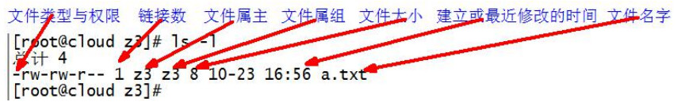

   - 如果查看到是文件：链接数指的是硬链接个数
   - 如果查看的是文件夹：链接数指的是子文件夹个数

### 四、chmod命令使用数字修改文件权限（常用）

1. Linux 系统中，文件的基本权限由9个字符组成，以`rwxrw-r-x`为例，我们可以使用数字来代表各个权限，各个权限与数字的对应关系如下：

   ```shell
   r --> 4
   w --> 2
   x --> 1
   ```

2. 由于这9个字符分属3类用户，因此每种用户身份包含3个权限（r、w、x），通过将3个权限对应的数字累加，最终得到的值即可作为每种用户所具有的权限。777y也就是最大的权限

3. 以`rwxrw-r-x`为例，所有者、所属组和其他人分别对应的权限值为如下，此权限对应的权限值就是765

   ```shell
   所有者 = rwx = 4+2+1 = 7
   所属组 = rw- = 4+2 = 6
   其他人 = r-x = 4+1 = 5
   ```

4. 使用数字修改文件权限的chmod命令基本格式为：`chmod [-R] 权限值 文件名`

5. 选项及参数

   - -R（注意是大写）选项表示连同子目录中的所有文件，也都修改设定的权限

6. 示例：以Vim编辑Shell文件批处理文件后，文件权限通常是rw-r--r--（644），那么，如果要将该文件变成可执行文件，并且不让其他人修改此文件，则只需将此文件的权限该为 rwxr-xr-x（755）即可

   ```shell
   [root@localhost ~]# chmod -R 755 .bashrc
   ```

### 五、chmod命令使用字母修改文件权限

1. 既然文件的基本权限就是3种用户身份（所有者、所属组和其他人）搭配3种权限（rwx），chmod命令中用u、g、o分别代表3种身份，还用a表示全部的身份（all的缩写）。另外，chmod命令仍使用r、w、x分别表示读、写、执行权限

2. 使用字母修改文件权限的chmod命令，其基本格式如图所示

   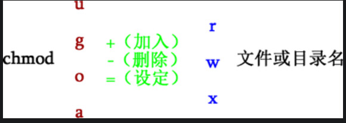

3. 示例一：如果我们要设定.bashrc文件的权限为`rwxr-xr-x`，则可执行如下命令

   ```shell
   [root@localhost ~]# chmod u=rwx,go=rx .bashrc
   [root@localhost ~]# ls -al .bashrc
   -rwxr-xr-x. 1 root root 176 Sep 22 2004 .bashrc
   ```

4. 示例二：增加.bashrc文件的每种用户都可做写操作的权限，可以使用如下命令

   ```shell
   [root@localhost ~]# ls -al .bashrc
   -rwxr-xr-x. 1 root root 176 Sep 22 2004 .bashrc
   [root@localhost ~]# chmod a+w .bashrc
   [root@localhost ~]# ls -al .bashrc
   -rwxrwxrwx. 1 root root 176 Sep 22 2004 .bashrc
   ```

### 六、chown改变文件所有者和所属组

1. chown命令，可以认为是"change owner"的缩写，主要用于修改文件（或目录）的所有者，除此之外，这个命令也可以修改文件（或目录）的所属组

2. chown命令的基本格式：`chown [-R] 所有者 文件或目录`

3. 选项及参数：

   - -R（注意大写）选项表示连同子目录中的所有文件，都更改所有者

4. 同时更改所有者和所属组，chown命令的基本格式为：`chown [-R] 所有者:所属组 文件或目录`

   - 在chown命令中，所有者和所属组中间也可以使用点`.`
   - 建议使用`:`连接所有者和所属组

5. 注意点：

   - chown命令也支持单纯的修改文件或目录的所属组，例如`chown :group install.log`就表示修改install.log文件的所属组，但修改所属组通常使用chgrp命令，因此并不推荐使用chown命令
   - 使用chown命令修改文件或目录的所有者（或所属者）时，要保证使用者用户（或用户组）存在，否则该命令无法正确执行，会提示 "invalid user" 或者 "invaild group"

6. 示例一：通过修改file文件的所有者，user用户从其他人身份（只对此文件有读取权限）转变成了所有者身份，对此文件拥有读和写权限

   ```shell
   [root@localhost ~]# touch file
   #由root用户创建file文件
   [root@localhost ~]# ll file
   -rw-r--r--. 1 root root 0 Apr 17 05:12 file
   #文件的所有者是root，普通用户user对这个文件拥有只读权限
   [root@localhost ~]# chown user file
   #修改文件的所有者
   [root@localhost ~]# ll file
   -rw-r--r--. 1 user root 0 Apr 17 05:12 file
   #所有者变成了user用户，这时user用户对这个文件就拥有了读、写权限
   ```

7. 示例二：Linux系统中，用户等级权限的划分是非常清楚的，root用户拥有最高权限，可以修改任何文件的权限，而普通用户只能修改自己文件的权限（所有者是自己的文件）。例如user用户无权更改所有者为root用户文件的权限，只有普通用户是这个文件的所有者，才可以修改文件的权限

   ```shell
   [root@localhost ~]# cd /home/user
   #进入user用户的家目录
   [root@localhost user]# touch test
   #由root用户新建文件test
   [root@localhost user]# ll test
   -rw-r--r--. 1 root root 0 Apr 17 05:37 test
   #文件所有者和所属组都是root用户
   [root@localhost user]# su - user
   #切换为user用户
   [user@localhost ~]$ chmod 755 test
   chmod:更改"test"的权限：不允许的操作 #user用户不能修改test文件的权限
   [user@localhost ~]$ exit
   #退回到root身份
   [root@localhost user]# chown user test
   #由root用户把test文件的所有者改为user用户
   [root@localhost user]# su - user
   #切换为user用户
   [user@localhost ~]$ chmod 755 test
   #user用户由于是test文件的所有者，所以可以修改文件的权限
   [user@localhost ~]$ ll test
   -rwxr-xr-x. 1 user root 0 Apr 17 05:37 test
   #查看权限
   ```

### 七、chgrp改变所属组

1. chgrp命令用于修改文件（或目录）的所属组。可以将chgrp理解为"change group"的缩写

2. chgrp命令其基本格式为：`chgrp [-R] 所属组 文件名（目录名）`

3. 选项及参数

   - -R（注意是大写）选项作用于更改目录的所属组，表示更改连同子目录中所有文件的所属组信息

4. 注意点：要被改变的群组名必须是真实存在的，否则命令无法正确执行，会提示 "invaild group name"

5. 示例：当以root身份登录Linux系统时，主目录中会存在一个名为install.log的文件，可以使用如下方法修改此文件的所属组。例如在具有group1群组的前提下，能成功修改install.log文件的所属组，但再次试图将所属组修改为testgroup时，命令执行失败，就是因为系统的/etc/group文件中，没有testgroup群组

   ```shell
   [root@localhost ~]# groupadd group1
   #新建用于测试的群组 group1
   [root@localhost ~]# chgrp group1 install.log
   #修改install.log文件的所属组为group1
   [root@localhost ~]# ll install.log
   -rw-r--r--. 1 root group1 78495 Nov 17 05:54 install.log
   #修改生效
   [root@localhost ~]# chgrp testgroup install.log
   chgrp: invaild group name 'testgroup'
   ```

## 八、搜索查找类命令

### 一、find查找文件或者目录

1. find的作用

   - find命令用来在指定目录下查找文件。任何位于参数之前的字符串都将被视为欲查找的目录名或文件名
   - 如果使用该命令时，不设置任何参数，则find命令将在当前目录下查找子目录与文件。并且将查找到的子目录和文件全部进行显示
   - find命令有非常大的灵活性，可以向其指定丰富的搜索条件（如文件权限、属主、属组、文件类型、日期和大小等）来定位系统中的文件和目录
   - find还支持对搜索到的结果进行多种类型的命令操作

2. 基本语法：`find [搜索范围] [选项]`

3. 搜索范围：一般设置某个目录即可

4. 选项说明

   - -name<查询方式>：按照指定的文件名查找模式查找文件
   - -user<用户名>：查找属于指定用户名所有文件
   - -size<文件大小>：按照指定的文件大小查找文件，单位为
     - b —— 块（512 字节）
     - c —— 字节 
     - w —— 字（2 字节） 
     - k —— 千字节 
     - M —— 兆字节 
     - G —— 吉字节

5. 示例

   - 按文件名：根据名称查找`/tmp`目录下的`*.log`文件

     ```shell
     [root@CentOS201 /]# find tmp/ -name "*.log"
     ```

   - 将当前目录及其子目录下所有文件后缀为`.c`的文件列出来

     ```shell
     [root@CentOS201 /]# find . -name "*.c"
     ```

   - 按拥有者：查找`/home/sunsh/`目录下，所属用户名称为`sunsh`的文件

     ```shell
     [root@CentOS201 /]# find /home/sunsh/ -user sunsh
     ```

   - 按文件大小：在/home目录下查找大于200m的文件（+n：大于；-n：小于；n：等于）

     ```shell
     [root@CentOS201 /]# find /home -size +204800
     ```

### 二、locate快速定位文件路径

1. locate的作用和原理：

   - locate命令用于查找符合条件的文档，他会去保存文档和目录名称的数据库内，查找合乎范本样式条件的文档或目录
   - locate指令无需遍历整个文件系统，查询速度较快。为了保证查询结果的准确度，管理员必须定期更新locate时刻

2. 基本语法：`locate 搜索文件`

3. locate与find的区别：

   - find是去硬盘找，locate只在/var/lib/slocate资料库中找
   - locate的速度比find快，它并不是真的查找，而是查数据库，一般文件数据库在 /var/lib/slocate/slocate.db中，所以locate的查找并不是实时的，而是以数据库的更新为准，一般是系统自己维护，也可以手工升级数据库 ，命令为：`updatedb`

4. 示例：

   - 查询文件夹

     ```shell
     [root@hadoop101 ~]#updatedb
     [root@hadoop101 ~]#locate tmp
     ```

   - 查找passwd文件

     ```shell
     [root@hadoop101 ~]# locate passwd
     ```

### 三、grep过滤查找

1. grep的作用：

   - grep命令用于查找文件里符合条件的字符串
   - grep指令用于查找内容包含指定的范本样式的文件，如果发现某文件的内容符合所指定的范本样式，预设grep指令会把含有范本样式的那一列显示出来。若不指定任何文件名称，或是所给予的文件名为`-`，则grep指令会从显示屏读取数据

2. 基本语法：`grep 选项 查找内容 源文件`

3. 选项说明：

   - `-n 或 --line-number`：在显示符合样式的那一行之前，标示出该行的列数编号

4. 示例：在当前目录中，查找后缀有file字样的文件，且文件内容包含test字符串

   ```shell
   [root@hadoop101 ~]#grep test *file 
   ```

### 四、"|"管道符

1. 管道符的作用：管道符主要用于多重命令处理，前面命令的打印结果作为后面命令的输入。简单点说就是，就像工厂的流水线一样，进行完一道工序后，继续传送给下一道工序处理…

   

2. 示例一：使用两个管道，利用第一个管道将cat命令（显示passwd文件的内容）的输出送给grep命令，grep命令找出含有`/bin/bash`的所有行

   ```shell
   [root@hadoop101 ~]#cat /etc/passwd | grep /bin/bash
   ```

3. 示例二：查找某文件在第几行

   ```shell
   [root@hadoop101 ~]#ls | grep -n test
   ```

### 五、wc计算字数

1. wc的作用：

   - wc命令用于计算字数
   - 利用wc指令我们可以计算文件的Byte数、字数、或是列数，若不指定文件名称、或是所给予的文件名为`-`，则wc指令会从显示屏读取数据

2. 语法：`wc [-clw][--help][--version][文件...]`

3. 选项及参数

   - -c或--bytes或--chars：只显示Bytes数
   - -l或--lines：显示行数
   - -w或--words：只显示字数
   - --help：在线帮助
   - --version：显示版本信息

4. 示例一：在默认的情况下，wc将计算指定文件的行数、字数，以及字节数

   ```shell
   [root@hadoop101 ~]#wc testfile           # testfile文件的统计信息  
   3 92 598 testfile       # testfile文件的行数为3、单词数92、字节数598 
   ```

5. 示例二：同时统计多个文件的信息，例如同时统计testfile、testfile_1、testfile_2

   ```shell
   [root@hadoop101 ~]#wc testfile testfile_1 testfile_2   #统计三个文件的信息  
   3 92 598 testfile                #第一个文件行数为3、单词数92、字节数598  
   9 18 78 testfile_1               #第二个文件的行数为9、单词数18、字节数78  
   3 6 32 testfile_2                #第三个文件的行数为3、单词数6、字节数32  
   15 116 708 总用量                #三个文件总共的行数为15、单词数116、字节数708 
   ```

## 九、压缩和解压类命令

### 一、打包（归档）和压缩

1. 归档，也称为打包，指的是一个文件或目录的集合，而这个集合被存储在一个文件中。归档文件没有经过压缩，因此，它占用的空间是其中所有文件和目录的总和
2. 和归档文件类似，压缩文件也是一个文件和目录的集合，且这个集合也被存储在一个文件中，但它们的不同之处在于，压缩文件采用了不同的存储方式，使其所占用的磁盘空间比集合中所有文件大小的总和要小
3. 压缩是指利用算法将文件进行处理，以达到保留最大文件信息，而让文件体积变小的目的。其基本原理为，通过查找文件内的重复字节，建立一个相同字节的词典文件，并用一个代码表示。比如说，在压缩文件中，有不止一处出现了"C语言中文网"，那么，在压缩文件时，这个词就会用一个代码表示并写入词典文件，这样就可以实现缩小文件体积的目的。由于计算机处理的信息是以二进制的形式表示的，因此，压缩软件就是把二进制信息中相同的字符串以特殊字符标记，只要通过合理的数学计算，文件的体积就能够被大大压缩。把一个或者多个文件用压缩软件进行压缩，形成一个文件压缩包，既可以节省存储空间，又能方便在网络上传送
4. 对文件进行压缩，很可能损坏文件中的内容，因此，压缩又可以分为有损压缩和无损压缩。无损压缩很好理解，指的是压缩数据必须准确无误；有损压缩指的是即便丢失个别的数据，对文件也不会造成太大的影响。有损压缩广泛应用于动画、声音和图像文件中，典型代表就是影碟文件格式mpeg、音乐文件格式mp3以及图像文件格式jpg
5. 采用压缩工具对文件进行压缩，生成的文件称为压缩包，该文件的体积通常只有原文件的一半甚至更小。需要注意的是，压缩包中的数据无法直接使用，使用前需要利用压缩工具将文件数据还原，此过程又称解压缩
6. Linux下，常用归档命令有2个，分别是tar和dd（相对而言，tar的使用更为广泛。tar命令也可以作为压缩命令，也很常用）；常用的压缩命令有很多，比如gzip、zip、bzip2等

### 二、gzip/gunzip压缩

#### 一、gzip压缩

1. gzip是Linux系统中经常用来对文件进行压缩和解压缩的命令，通过此命令压缩得到的新文件，其扩展名通常标记为“.gz”。gzip命令只能用来压缩文件，不能压缩目录，即便指定了目录，也只能压缩目录内的所有文件

2. 在Linux中，打包和压缩是分开处理的。而gzip命令只会压缩，不能打包，所以才会出现没有打包目录，而只把目录下的文件进行压缩的情况

3. gzip命令得基本格式：`gzip [选项] 源文件`。命令中的源文件，当进行压缩操作时，指的是普通文件；当进行解压缩操作时，指的是压缩文件

4. 选项及参数

   - `-c`：将压缩数据输出到标准输出中，并保留源文件
   - `-d`：对压缩文件进行解压缩
   - `-r`：递归压缩指定目录下以及子目录下的所有文件
   - `-v`：对于每个压缩和解压缩的文件，显示相应的文件名和压缩比
   - `-l`：对每一个压缩文件，显示的字段有压缩文件的大小、未压缩文件的大小、压缩比、未压缩文件的名称
   - `-数字`：用于指定压缩等级，-1压缩等级最低，压缩比最差；-9压缩比最高。默认压缩比是-6

5. 示例一：gzip压缩命令非常简单，甚至不需要指定压缩之后的压缩包名，只需指定源文件名即可

   ```shell
   [root@localhost ~]# gzip install.log
   #压缩instal.log 文件
   [root@localhost ~]# ls
   anaconda-ks.cfg install.log.gz install.log.syslog
   #压缩文件生成，但是源文件也消失了
   ```

6. 示例二：保留源文件压缩。在使用gzi 命令压缩文件时，不让源文件消失，也生成压缩文件

   ```shell
   [root@localhost ~]# gzip -c anaconda-ks.cfg >anaconda-ks.cfg.gz
   #使用-c选项，但是不让压缩数据输出到屏幕上，而是重定向到压缩文件中，
   #这样可以缩文件的同时不删除源文件
   [root@localhost ~]# ls
   anaconda-ks.cfg anaconda-ks.cfg.gz install.log.gz install.log.syslog
   #可以看到压缩文件和源文件都存在
   ```

7. 示例三：压缩目录。并不会直接压缩目录，而是压缩目录下的文件

   ```shell
   [root@localhost ~]# mkdir test
   [root@localhost ~]# touch test/test1
   [root@localhost ~]# touch test/test2
   [root@localhost ~]# touch test/test3 #建立测试目录，并在里面建立几个测试文件
   [root@localhost ~]# gzip -r test/
   #压缩目录，并没有报错
   [root@localhost ~]# ls
   anaconda-ks.cfg anaconda-ks.cfg.gz install.log.gz install.log.syslog test
   #但是查看发现test目录依然存在，并没有变为压缩文件
   [root@localhost ~]# ls test/
   testl .gz test2.gz test3.gz
   #原来gzip命令不会打包目录，而是把目录下所有的子文件分别压缩
   ```

#### 二、gunzip解压缩文件

1. gunzip是一个使用广泛的解压缩命令，它用于解压被gzip压缩过的文件（扩展名为.gz）。对于解压被gzip压缩过的文件，还可以使用gzip自己，即``gzip -d`压缩包

2. gunzip命令的基本格式为：`gunzip [选项] 文件`

3. 选项及参数

   - `-r`：递归处理，解压缩指定目录下以及子目录下的所有文件
   - `-c`：把解压缩后的文件输出到标准输出设备
   - `-f`：强制解压缩文件，不理会文件是否已存在等情况
   - `-l`：列出压缩文件内容
   - `-v`：显示命令执行过程
   - `-t`：测试压缩文件是否正常，但不对其做解压缩操作

4. 示例一：直接解压缩文件

   ```shell
   [root@localhost ~]# gunzip install.log.gz
   ```

5. 示例二：``gunzip -r`依然只会解压缩目录下的文件，而不会解打包。要想解压缩".gz"格式，还可以使用`gzip -d`命令

   ```shell
   [root@localhost ~]# gzip -d anaconda-ks.cfg.gz
   ```

6. 示例三：要解压缩目录下的内容，则需使用"-r"选项

   ```shell
   [root@localhost ~]# gunzip -r test/
   ```

7. 示例四：如果我们压缩的是一个纯文本文件，则可以直接使用zcat命令在不解压缩的情况下查看这个文本文件中的内容

   ```shell
   [root@localhost ~]# zcat anaconda-ks.cfg.gz
   ```

#### 三、gzip/gunzip压缩总结

1. 只能压缩文件不能压缩目录
2. 默认不保留原来的文件
3. 同时多个文件会产生多个压缩包

### 三、zip/unzip压缩

#### 一、zip压缩

1. 会在Windows系统上使用“.zip”格式压缩文件，其实“.zip”格式文件是Windows和Linux系统都通用的压缩文件类型，属于几种主流的压缩格式（zip、rar等）之一，是一种相当简单的分别压缩每个文件的存储格式。zip压缩命令需要手工指定压缩之后的压缩包名，注意写清楚扩展名，以便解压缩时使用

2. zip压缩命令在windows/linux都通用，可以压缩目录且保留源文件

3. zip命令的基本格式：`zip [选项] 压缩包名 源文件或源目录列表`

4. 选项及参数

   - `-r`：递归压缩目录，及将制定目录下的所有文件以及子目录全部压缩
   - `-m`：将文件压缩之后，删除原始文件，相当于把文件移到压缩文件中
   - `-v`：显示详细的压缩过程信息
   - `-q`：在压缩的时候不显示命令的执行过程
   - `-压缩级别`：压缩级别是从 1~9 的数字，-1 代表压缩速度更快，-9 代表压缩效果更好
   - `-u`：更新压缩文件，即往压缩文件中添加新文件

5. 示例一：zip命令的基本使用

   ```shell
   [root@localhost ~]# zip ana.zip anaconda-ks.cfg
   adding: anaconda-ks.cfg (deflated 37%)
   #压缩
   [root@localhost ~]# ll ana.zip
   -rw-r--r-- 1 root root 935 6月 1716:00 ana.zip
   #压缩文件生成
   
   
   #一个命令可以同时压缩多个文件
   [root@localhost ~]# zip test.zip install.log install.log.syslog
   adding: install.log (deflated 72%)
   adding: install.log.syslog (deflated 85%)
   #同时压缩多个文件到test.zip压缩包中
   [root@localhost ~]#ll test.zip
   -rw-r--r-- 1 root root 8368 6月 1716:03 test.zip
   #压缩文件生成
   ```

6. 示例二：使用zip命令压缩目录，需要使用“-r”选项

   ```shell
   [root@localhost ~]# mkdir dir1
   #建立测试目录
   [root@localhost ~]# zip -r dir1.zip dir1
   adding: dir1/(stored 0%)
   #压缩目录
   [root@localhost ~]# ls -dl dir1.zip
   -rw-r--r-- 1 root root 160 6月 1716:22 dir1.zip
   #压缩文件生成
   ```

#### 二、unzip解压zip文件

1. unzip命令可以查看和解压缩zip文件

2. unzip命令格式：`unzip [选项] 压缩包名`

3. 选项及参数

   - `-d 目录名`：将压缩文件解压到指定目录下
   - `-h`：解压时并不覆盖已经存在的文件
   - `-o`：解压时覆盖已经存在的文件，并且无需用户确认
   - `-v`：查看压缩文件的详细信息，包括压缩文件中包含的文件大小、文件名以及压缩比等，但并不做解压操作
   - `-t`：测试压缩文件有无损坏，但并不解压
   - `-x 文件列表`：解压文件，但不包含文件列表中指定的文件

4. 示例一：不论是文件压缩包，还是目录压缩包，都可以直接解压缩

   ```shell
   [root@localhost ~]# unzip dir1.zip
   Archive: dir1.zip
   creating: dirl/
   #解压缩
   ```

5. 示例二：使用-d选项手动指定解压缩位置

   ```shell
   [root@localhost ~]# unzip -d /tmp/ ana.zip
   Archive: ana.zip
   inflating: /tmp/anaconda-ks.cfg
   #把压缩包解压到指定位置
   ```

### 四、tar打包

- Linux系统中，最常用的归档（打包）命令就是tar，该命令可以将许多文件一起保存到一个单独的磁带或磁盘中进行归档。不仅如此，该命令还可以从归档文件中还原所需文件，也就是打包的反过程，称为解打包
- 使用tar命令归档的包通常称为tar包（ta包文件都是以“.tar”结尾的）

#### 一、tar命令做打包操作

1. tar打包命令的基本格式：`tar [选项] 源文件或目录`

2. 选项及参数

   - `-z`：打包同时压缩
   - `-c`：将多个文件或目录进行打包
   - `-A`：追加tar文件到归档文件
   - `-f 包名`：指定包的文件名。包的扩展名是用来给管理员识别格式的，所以一定要正确指定扩展名
   - `-v`：显示打包文件过程

3. 注意点：使用tar命令指定选项时可以不在选项前面输入“-”。例如，使用“cvf”选项和“-cvf”起到的作用一样

4. 示例一：打包文件和目录。选项"-cvf"一般是习惯用法，记住打包时需要指定打包之后的文件名，而且要用".tar"作为扩展名。打包目录也是如此

   ```shell
   #打包多个文件
   [root@localhost ~]# tar -cvf anaconda-ks.cfg.tar anaconda-ks.cfg
   #把anacondehks.cfg打包为 anacondehks.cfg.tar文件
   
   
   #打包目录
   [root@localhost ~]# ll -d test/
   drwxr-xr-x 2 root root 4096 6月 17 21:09 test/
   #test是我们之前的测试目录
   [root@localhost ~]# tar -cvf test.tar test/
   test/
   test/test3
   test/test2
   test/test1
   #把目录打包为test.tar文件
   
   
   #tar命令同时可以打包多个文件或目录，只要用空格分开即可
   [root@localhost ~]# tar -cvf ana.tar anaconda-ks.cfg /tmp/
   #把anaconda-ks.cfg文件和/tmp目录打包成ana.tar文件包
   ```

5. 示例二：打包并压缩多个文件

   ```shell
   [root@hadoop101 opt]# tar -zcvf houma.tar.gz houge.txt bailongma.txt
   houge.txt
   bailongma.txt
   [root@hadoop101 opt]# ls
   houma.tar.gz houge.txt bailongma.txt
   ```

6. 示例三：打包压缩目录

   ```shell
   [root@hadoop101 ~]# tar -zcvf xiyou.tar.gz xiyou/
   xiyou/
   xiyou/mingjie/
   xiyou/dssz/
   xiyou/dssz/houge.txt
   ```

#### 二、tar命令做解打包操作

1. tar解打包命令的基本格式：`tar [选项] 源文件或目录`

2. 选项及参数

   - `-x`：对tar包做解打包操作
   - `-f`：指定要解压的tar包的包名
   - `-t`：只查看tar包中有哪些文件或目录，不对tar包做解打包操作
   - `-C 目录`：指定解打包位置
   - `-v`：显示解打包的具体过程

3. 其实解打包和打包相比，只是把打包选项"-cvf"更换为"-xvf"

4. 示例一：tar解打包基本操作。如果使用"-xvf"选项，则会把包中的文件解压到当前目录下。如果想要指定解压位置，则需要使用"-C(大写)"选项

   ```shell
   [root@localhost ~]# tar -xvf anaconda-ks.cfg. tar
   #解打包到当前目录下
   
   
   #指定解压位置
   [root@localhost ~]# tar -xvf test.tar -C /tmp
   #把文件包test.tar解打包到/tmp/目录下
   ```

5. 示例二：如果只想查看文件包中有哪些文件，则可以把解打包选项"-x"更换为测试选项"-t"

   ```shell
   [root@localhost ~]# tar -tvf test.tar
   drwxr-xr-x root/root 0 2016-06-17 21:09 test/
   -rw-r-r- root/root 0 2016-06-17 17:51 test/test3
   -rw-r-r- root/root 0 2016-06-17 17:51 test/test2
   -rw-r-r- root/root 0 2016-06-17 17:51 test/test1
   #会用长格式显示test.tar文件包中文件的详细信息
   ```

## 十、磁盘查看和分区类命令


