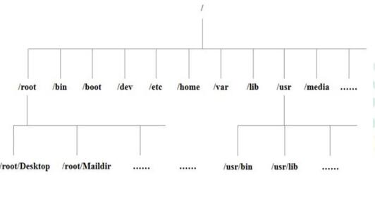

# 一、Linux安装

## 一、安装vmware workstation

1. 无脑安装vmware workstation

	

2. 编辑vmware workstation的虚拟网卡

	- 网卡模式区别

		- 桥接模式：虚拟机电脑在网络环境中的地位和宿主环境（开发电脑）是一样的，虚拟机可以上网，但是ip地址会变来变去，因为虚拟机的ip地址是由DHCP动态分配的
		- NAT模式：开发电脑（宿主环境）会通过虚拟网卡构建一个局域网，虚拟机电脑作为局域网中一个成员，由于局域网受开发电脑的控制，因此虚拟机电脑的ip地址可以是固定的，局域网中的成员（虚拟机）可以通过开发电脑（宿主环境）间接的连到外面的互联网
		- 仅主机模式：虚拟机相当于黑户，完全和外界隔绝，因此不能上网

	- 规划局域网

		- 网段：192.168.10.xx
		- 子网掩码：255.255.255.0
		- 网关：192.168.10.2

	- 编辑虚拟网卡（推荐使用10的网段，而不是使用图片中的19网段）

		

		

		

		

		

		

		

## 二、安装centos7

1. [VM安装CentOS7视频教程](https://www.bilibili.com/video/BV1Kh4y1m767/?spm_id_from=333.337.search-card.all.click&vd_source=0d890470387b4243e4e6e1ad09c32d2f)

2. 更改网络配置

	

	

	

	

	

# 二、Linux基本目录

## 一、基本介绍

1. Linux的文件系统采用级层式子的树状目录结构，

2. 最上层是根目录`/`

	

3.  Linux世界里，一切皆文件

## 二、目录用途

1. `/bin` 是Binary的缩写，这个目录存放着最经常使用的命令
2. `/sbin`其中s就是Super User的意思，这里存放的是系统管理员使用的系统管理程序
3. `/home`该目录下存放普通用户的主目录，在Linux中每个用户都有一个自己的目录，一般该目录名是以用户的账号命名的
4. `/root`该目录为系统管理员，也称作超级权限者的用户主目录
5. `/lib`是系统开机所需要最基本的动态连接共享库，其作用类似于Windows里的DLL文件。几乎所有的应用程序都需要用到这些共享库
6. `/lost+found`这个目录一般情况下是空的，当系统非法关机后，这里就存放了一些文件
7. `/etc`是所有的系统管理所需要的配置文件和子目录my.conf
8. `/usr/local`是一个非常重要的目录，用户的很多应用程序和文件都放在这个目录下，类似于windows下的program files目录
9. `/boot`中存放的是启动Linux时使用的一些核心文件，包括一些连接文件以及镜像文件
10. `/proc`这个目录是一个虚拟的目录，它是系统内存的映射，访问这个目录来获取系统信息
11. `/srv`此目录名称是service的缩写，该目录存放一些服务启动之后需要提供的数据
12. `/sys`这是linux2.6内核的一个很大的变化。该目录下安装了2.6内核中新出现的一个文件系统sysfs
13. `/tmp`这个目录是用来存放一些临时文件的
14. `/dev`类似windows的设备管理器，把所有的硬件用文件的形式存储
15. `/media`在linux系统中会自动识别一些设备，例如U盘光驱等等，当识别后，linux会把识别的设备挂载到这个目录下
16. `/mnt`系统提供该目录是为了让用户临时挂载别的文件系统的，我们可以将外部的存储挂载在/mnt/上，然后进入该目录就可以查看里面的内容了
17. `/opt`这是给主机额外安装软件所摆放的目录，如安装ORACLE数据库就可放到该目录下。默认为空
18. `/usr/local`这是另一个给主机额外安装软件所安装的目录，一般是通过编译源码的方式安装的程序
19. `/var`这个目录中存放着在不断扩充着的东西，习惯将经常被修改的目录放在这个目录下，包括各种日志文件
20. `/selinux`这是一种安全子系统，它能控制程序只能访问特定文件

## 三、Linux目录总结

1. Linux的目录中有且只有一个根目录
2. Linux的各个目录存放的内容是规划好，不用乱放文件
3. Linux是以文件的形式管理我们的设备，因此linux系统，一切皆为文件。
4. Linux的各个文件目录下存放什么内容，必须有一个认识

# 三、vi和vim编辑器

## 一、vi和vim的基本介绍

1. 所有Linux系统都会内置vi文本编辑器

2. vim是vi的升级版，可以主动以字体颜色分辨语法的正确性，代码补完和编译，错误跳转等功能

3. vi/vim键盘图（在虚拟机左上角应用程序 -> 系统工具 -> 设置中添加中文输入法后，Win减+空格是切换输入法）

	

## 二、vi和vim的三种模式

1. 基本上vi/vim共分为三种模式，分别是命令模式（Command mode）、插入/编辑模式（Insert mode）和底线命令模式（Last line mode）
2. 命令模式
   - 一般模式下主要操作为删除、复制、粘贴
     - 用户刚刚启动vi/vim，便进入了正常模式。此状态下敲击键盘动作会被Vim识别为命令，而非输入字符。比如我们此时按下`i`，并不会输入一个字符，`i`被当作了一个命令
     - 常用的命令：
       - **i**：切换到插入/编辑模式，以输入字符
       - **x**：删除当前光标所在处的字符
       - **:**：切换到底线命令模式，以在最底一行输入命令
      - 若想要编辑文本：启动Vim，进入了命令模式，按下`i`，切换到输入模式
     - 命令模式只有一些最基本的命令，因此仍要依靠底线命令模式输入更多命令

3. 插入/编辑模式
   - 插入/编辑模式主要作用是编辑文本
     - 在命令模式下按下`i`就进入了插入/编辑模式
     - 在插入/编辑模式中，可以使用以下按键：
       - **字符按键以及Shift组合**：输入字符
       - **ENTER**：回车键，换行
       - **BACK SPACE**：退格键，删除光标前一个字符
       - **DEL**：删除键，删除光标后一个字符
       - **方向键**：在文本中移动光标
       - **HOME**/**END**：移动光标到行首/行尾
       - **Page Up**/**Page Down**：上/下翻页
       - **Insert**：切换光标为输入/替换模式，光标将变成竖线/下划线
       - **ESC**：退出输入模式，切换到命令模式

4. 底线命令模式
   - 底线命令模式可在末行输入一些命令对文件进行操作，如搜索、替换、保存、退出、高亮等
     - 在命令模式下按下`:`（英文冒号）就进入了底线命令模式进行命令的输入；在命令模式下按下`/`就进入了底线命令模式中的查找功能
     - 底线命令模式可以输入单个或多个字符的命令，可用的命令非常多
     - 在底线命令模式中，基本的命令有（已经省略了冒号）
       - q：退出程序
       - w：保存文件
     - 按ESC键可随时退出底线命令模式

5. 三种模式转换示意图

	

6. vi/vim使用实例

	- 使用vi/vim进入一般模式

		- 使用vim来建立一个名为runoob.txt的文件时，可以这样做：

			```shell
			$ vim runoob.txt
			```

		- 直接输入vi+文件名就能够进入vi的一般模式了。请注意，记得vi后面一定要加文件名，不管该文件存在与否

			

	- 按下`i`进入插入/编辑模式，开始编辑文字

		- 在一般模式之中，只要按下`i, o, a`等字符就可以进入输入模式了

		- 在编辑模式当中，你可以发现在左下角状态栏中会出现`–INSERT-`的字样，那就是可以输入任意字符的提示

		- 这个时候，键盘上除了**Esc**（退出插入/编辑模式回到命令模式中）这个按键之外，其他的按键都可以视作为一般的输入按钮了，所以你可以进行任何的编辑

			

	- 按下ESC按钮回到命令模式：按下**Esc**这个按钮即可！就会发现画面左下角的`– INSERT – `不见了

	- 在命令模式中按下`:wq`储存后离开vi

7. Vim按键说明，一般模式的光标移动、搜索替换、复制粘贴。注意点有：

	- 光标移动时在查找过程中需要注意的是，要查找的字符串是严格区分大小写的，如查找"sunsh"和"SunSH"会得到不同的结果
- 光标移动时如果想忽略大小写，则输入命令` :set ic`；调整回来输入`:set noic`
	- 光标移动时如果在字符串中出现特殊符号，则需要加上转义字符`\`。常见的特殊符号有 `\`、`*`、`?`、`$ `等。如果出现这些字符，例如，要查找字符串"10$"，则需要在命令模式中输入 "/10\$"
	- 删除文本时注意的是被删除的内容并没有真正删除，都放在了剪贴板中。将光标移动到指定位置处，按下`p`键，就可以将刚才删除的内容又粘贴到此处
	
	|   移动光标的方法   |                           功能描述                           |
	| :----------------: | :----------------------------------------------------------: |
	| h 或 向左箭头键(←) |                     光标向左移动一个字符                     |
	| j 或 向下箭头键(↓) |                     光标向下移动一个字符                     |
	| k 或 向上箭头键(↑) |                     光标向上移动一个字符                     |
	| l 或 向右箭头键(→) |                     光标向右移动一个字符                     |
	|    [Ctrl] + [f]    |     屏幕『向下』移动一页，相当于 [Page Down]按键 (常用)      |
	|    [Ctrl] + [b]    |      屏幕『向上』移动一页，相当于 [Page Up] 按键 (常用)      |
	|    [Ctrl] + [d]    |                     屏幕『向下』移动半页                     |
	|    [Ctrl] + [u]    |                     屏幕『向上』移动半页                     |
	|         +          |                  光标移动到非空格符的下一行                  |
	|         -          |                  光标移动到非空格符的上一行                  |
	|      n<space>      | 那个n表示『数字』，例如20。按下数字后再按空格键，光标会向右移动这一行的n个字符。例如`20<space>`则光标会向后面移动20个字符距离 |
	|  0 或功能键[Home]  |      这是数字『 0 』，移动到这一行的最前面字符处 (常用)      |
	|  $ 或功能键[End]   |               移动到这一行的最后面字符处(常用)               |
	|         H          |         光标移动到这个屏幕的最上方那一行的第一个字符         |
	|         M          |          光标移动到这个屏幕的中央那一行的第一个字符          |
	|         L          |         光标移动到这个屏幕的最下方那一行的第一个字符         |
	|         G          |               移动到这个档案的最后一行（常用）               |
  |         nG         | n为数字。移动到这个档案的第n行。例如20G则会移动到这个档案的第 20行(可配合`:set nu`，显示行数) |
	|         gg         |           移动到这个档案的第一行，相当于1G（常用）           |
	|      n<Enter>      |               n为数字。光标向下移动n行（常用）               |
	
	| 搜索  |                           功能描述                           |
	| :---: | :----------------------------------------------------------: |
	| /word | 向光标之下寻找一个名称为word的字符串。例如要在档案内搜寻vbird这个字符串，就输入 /vbird 即可！ (常用) |
	| ?word |          向光标之上寻找一个字符串名称为word的字符串          |
	| /^abc |                     查找以abc为行首的行                      |
  | /abc$ |                     查找以abc为行尾的行                      |
	|   n   | 这个n是英文按键。代表重复前一个搜寻的动作。举例来说，如果刚刚我们执行/vbird去向下搜寻vbird这个字符串，则按下n后，会向下继续搜寻下一个名称为vbird的字符串。如果是执行?vbird的话，那么按下n则会向上继续搜寻名称为vbird的字符串 |
	|   N   | 这个N是英文按键。与n刚好相反，为『反向』进行前一个搜寻动作。例如 /vbird后，按下N则表示『向上』搜寻vbird |
	
	|    替换文本     |                           功能描述                           |
	| :-------------: | :----------------------------------------------------------: |
	|        r        |                    替换光标所在位置的字符                    |
	|        R        | 从光标所在位置开始替换字符，其输入内容会覆盖掉后面等长的文本内容，按**ESC**可以结束 |
	|   :s/a1/a2/g    |   将当前光标所在行中的所有a1用a2替换，不加g只会修改第一个    |
	| :n1,n2s/a1/a2/g |              将文件中n1到n2行中所有a1都用a2替换              |
	|   :%s/a1/a2/g   | 将文件中所有的a1都用a2替换。如果后面的/g替换为/gc，则操作时会有提示功能。例如，要将某文件中所有的"root" 替换为"sunsh"，则有两种输入命令，分别为： |
	
	```bash
	:1, $s/root/sunsh/g
	或
	:%s/root/sunsh/g
	
	# 上述命令是在编辑模式下操作的，表示的是从第一行到最后一行，
	# 即全文查找 "root"，然后替换成 "sunsh"
	
	# 如果刚才的命令变成 `:10,20 s/root/sunsh/g`，
	# 则只替换从第 10 行到第 20 行的 "root"
	```
	
	| 复制粘贴  |                         功能描述                          |
	| :-------: | :-------------------------------------------------------: |
	|     p     |               将剪贴板中的内容粘贴到光标后                |
	| P（大写） |               将剪贴板中的内容粘贴到光标前                |
	|     y     |                 复制已选中的文本到剪贴板                  |
	|    yy     | 将光标所在行复制到剪贴板，此命令前可以加数字n，可复制多行 |
	|    yw     |               将光标位置的单词复制到剪贴板                |
	
	| 删除文本 |                功能描述                |
	| :------: | :------------------------------------: |
	|    x     |         删除光标所在位置的字符         |
	|    dd    |             删除光标所在行             |
	|   ndd    |    删除当前行（包括此行）后n行文本     |
	|    dG    | 删除光标所在行一直到文件末尾的所有内容 |
	|    D     |        删除光标位置到行尾的内容        |
	| :a1,a2d  |       删除从a1行到a2行的文本内容       |
	
8. Vim的常见指令

	- Vim必须掌握的指令

		|                             指令                             |               功能描述               |
		| :----------------------------------------------------------: | :----------------------------------: |
		|                              yy                              |           复制光标当前一行           |
		|                             5yy                              |             拷贝当前5行              |
		|                              p                               |         箭头移动到目的行粘贴         |
		|                              u                               |              撤销上一步              |
		|                              dd                              |              删除当前行              |
		|                             5dd                              |         删除当前行向下的5行          |
		|                              x                               |       剪切一个字母，相当于del        |
		|                              X                               |      剪切一个字母，相当于退格键      |
		|                              yw                              |              复制一个词              |
		|                              dw                              |              删除一个词              |
		|          命令行输入 `/`（查找内容），按n查找下一个           |         在文件中查找某个单词         |
		|                set nu；取消文件行号：set nonu                |             设置文件行号             |
		|      命令模式下使用快捷键到达文档最末行：G；最首行：gg       |               编辑文件               |
		| 光标移动到某行：shift+g；显示行号：set nu；输入行号这个数；输入shift+g |               编辑文件               |
		|                              w                               | 向前移动一个单词（光标停在单词首部） |
		|                              b                               |  向后移动一个单词2b向后移动2个单词   |

	- 插入命令

		| 指令 |         说明         |
		| :--: | :------------------: |
		|  i   |  在当前位置生前插入  |
		|  I   |    在当前行首插入    |
		|  a   |   在当前位置后插入   |
		|  A   |    在当前行尾插入    |
		|  o   | 在当前行之后插入一行 |
		|  O   | 在当前行之前插入一行 |

	- 游标移动

		|      指令       |                          说明                           |
		| :-------------: | :-----------------------------------------------------: |
		|       gg        |                   移动到文件头。= [[                    |
		| G（shift + g）  |                   移动到文件尾。= ]]                    |
		|    行數 → G     |                       移動到第n行                       |
		| 冒号+行号，回车 |                比如跳到240行就是:240回车                |
		|        h        |                      左移一个字符                       |
		|        l        |        右移一个字符，这个命令很少用，一般用w代替        |
		|        k        |                      上移一个字符                       |
		|        j        |                      下移一个字符                       |
		|        w        |          向前移动一个单词（光标停在单词首部）           |
		|        b        |           向后移动一个单词 2b 向后移动2个单词           |
		|        e        |              同w，只不过是光标停在单词尾部              |
		|       ge        |                  同b，光标停在单词尾部                  |
		|        ^        |              移动到本行第一个非空白字符上               |
		|        0        |                 移动到本行第一个字符上                  |
		|      HOME       |               移动到本行第一个字符。同0键               |
		|        $        |            移动到行尾 3$ 移动到下面3行的行尾            |
		|    f（find）    | fx将找到光标后第一个为x的字符，3fd将找到第三个为d的字符 |
		|        F        |                      同f，反向查找                      |

	- 撤销和重做

		|   指令   |            说明            |
		| :------: | :------------------------: |
		|    u     |        撤销（Undo）        |
		|    U     |      撤销对整行的操作      |
		| Ctrl + r | 重做（Redo），即撤销的撤销 |

	- 删除命令

		|        指令         |                 说明                 |
		| :-----------------: | :----------------------------------: |
		|          x          |             删除当前字符             |
		|         3x          |     删除当前光标开始向后三个字符     |
		|          X          |    删除当前字符的前一个字符。X=dh    |
		|         dl          |          删除当前字符，dl=x          |
		|         dh          |            删除前一个字符            |
		|         dd          |              删除当前行              |
		|         dj          |              删除上一行              |
		|         dk          |              删除下一行              |
		|         10d         |         删除当前行开始的10行         |
		|          D          |       删除当前字符至行尾。D=d$       |
		|         d$          |  删除当前字符之后的所有字符（本行）  |
		|        kdgg         | 删除当前行之前所有行（不包括当前行） |
		| jdG（jd shift + g） | 删除当前行之后所有行（不包括当前行） |
		|       :1,10d        |              删除1-10行              |
		|       :11,$d        |        删除11行及以后所有的行        |
		|        :1,$d        |              删除所有行              |
		|    J(shift + j)     | 删除两行之间的空行，实际上是合并两行 |

	- 拷贝，剪贴和粘贴：正常模式下按v（逐字）或V（逐行）进入可视模式，然后用jklh命令移动即可选择某些行或字符，再按y即可复制

		|    指令     |                             说明                             |
		| :---------: | :----------------------------------------------------------: |
		|     yy      |                          拷贝当前行                          |
		|     nyy     |       拷贝当前后开始的n行，比如2yy拷贝当前行及其下一行       |
		|      p      | 在当前光标后粘贴,如果之前使用了yy命令来复制一行，那么就在当前行的下一行粘贴 |
		|   shift+p   |                        在当前行前粘贴                        |
		| :1,10 co 20 |                   将1-10行插入到第20行之后                   |
		|  :1,$ co $  |              将整个文件复制一份并添加到文件尾部              |
		|     ddp     |                     交换当前行和其下一行                     |
		|     xp      |                  交换当前字符和其后一个字符                  |
		|     ndd     |    剪切当前行之后的n行。利用p命令可以对剪切的内容进行粘贴    |
		|   :1,10d    |      将1-10行剪切。利用p命令可将剪切后的内容进行粘贴。       |
		| :1, 10 m 20 |                  将第1-10行移动到第20行之后                  |

	- 退出模式

		| 指令 |             说明             |
		| :--: | :--------------------------: |
		| :wq  |          保存并退出          |
		|  ZZ  |          保存并退出          |
		| :q!  |    强制退出并忽略所有更改    |
		| :e!  | 放弃所有修改，并打开原来文件 |
		|  :q  |        未修改直接退出        |

# 四、网络配置

## 一、三种网络模式详解

1. 网络模式分类

	- vmware提供了三种网络工作模式，它们分别是：Bridged（桥接模式）、NAT（网络地址转换模式）、Host-Only（仅主机模式）

	- 打开vmware虚拟机，可以在选项栏的“编辑”下的“虚拟网络编辑器”中看到VMnet0（桥接模式）、VMnet1（仅主机模式）、VMnet8（NAT模式）。VMnet0表示的是用于桥接模式下的虚拟交换机；VMnet1表示的是用于仅主机模式下的虚拟交换机；VMnet8表示的是用于NAT模式下的虚拟交换机

		

	- 同时，在主机上对应的有VMware Network Adapter VMnet1和VMware Network Adapter VMnet8两块虚拟网卡，它们分别作用于仅主机模式与NAT模式下。在“网络连接”中我们可以看到这两块虚拟网卡，如果将这两块卸载了，可以在vmware的“编辑”下的“虚拟网络编辑器”中点击“还原默认设置”，可重新将虚拟网卡还原

		

	- 真机上没有VMware Network Adapter VMnet0虚拟网卡

2. Bridged（桥接模式）

	- 桥接模式就是虚拟机直接连接外部物理网络的模式，主机起到了网桥的作用，在桥接模式下虚拟机可以直接访问外部网络，并且对外部网络是可见的。在桥接的作用下，类似于把物理主机虚拟为一个交换机，所有桥接设置的虚拟机连接到这个交换机的一个接口上，物理主机也同样插在这个交换机当中，所以所有桥接下的网卡与网卡都是交换模式的，相互可以访问而不干扰。在桥接模式下，虚拟机ip地址需要与主机在同一个网段，如果需要联网，则网关DNS需要与主机网卡一致。其网络结构如下图所示：

		

	- 点击“网络适配器”，选择“桥接模式”，然后“确定”

		

	- 在进入系统之前，先确认一下主机的ip地址、网关、DNS等信息

		

	- 然后，进入系统编辑网卡配置文件，在终端输入命令`vim /etc/sysconfig/network-scripts/ifcfg-eth0`。添加内容如下：

		

	- 编辑完成，保存退出，然后重启虚拟机网卡，使用ping命令ping外网ip，测试能否联网。能ping通外网ip，证明桥接模式设置成功。ping语法为：ping [主机地址]，例如ping www.baidu.com

		

	- 主机与虚拟机之间的通信，可以使用远程工具来测试。使用远程工具能连接成功则说明通讯正常

		

	- 桥接模式配置简单，但如果网络环境是ip资源很缺少或对ip管理比较严格的话，那桥接模式就不太适用了

3. NAT（地址转换模式）

  - 地址转换模式是虚拟机和主机构建一个专用网络，并且通过虚拟网络地址转换（NAT）设备对IP进行转换。虚拟机通过共享IP可以访问外部网络，但是外部网络无法访问虚拟机

  - 如果网络ip资源紧缺，但是又希望你的虚拟机能够联网，这时候NAT模式是最好的选择。NAT模式借助虚拟NAT设备和虚拟DHCP服务器，使得虚拟机可以联网。虚拟设备中主机就相当于NAT服务器和DHCP服务器。其网络结构如下图所示：

  	

  - 在NAT模式中，主机网卡直接与虚拟NAT设备相连，然后虚拟NAT设备与虚拟DHCP服务器一起连接在虚拟交换机VMnet8上，这样就实现了虚拟机联网。VMware Network Adapter VMnet8虚拟网卡主要是为了实现主机与虚拟机之间的通信

  - 首先，设置虚拟机中NAT模式的选项，打开vmware，点击“编辑”下的“虚拟网络编辑器”，设置NAT参数及DHCP参数

  	

  	

  	

  - 将虚拟机的网络连接模式修改成NAT模式。首先点击“网络适配器”，选择“NAT模式”

  	

  - 然后开机启动系统，编辑网卡配置文件，在终端输入命令`vim /etc/sysconfig/network-scripts/ifcfg-eth0`。具体配置如下：

  	

  - 编辑完成，保存退出，然后重启虚拟机网卡，动态获取ip地址，使用ping命令ping外网ip，测试能否联网

  	

  - 之前，我们说过VMware Network Adapter VMnet8虚拟网卡的作用，那我们现在就来测试一下

  	

  	

  - 如此看来，虚拟机能联通外网，确实不是通过VMware Network Adapter VMnet8虚拟网卡，那么为什么要有这块虚拟网卡呢？之前我们就说VMware Network Adapter VMnet8的作用是主机与虚拟机之间的通信，接下来，我们就用远程连接工具来测试一下发现连接失败

  	

  - 然后，将VMware Network Adapter VMnet8启用之后，发现远程工具可以连接上虚拟机了

  - 那么，这就是NAT模式，利用虚拟的NAT设备以及虚拟DHCP服务器来使虚拟机连接外网，而VMware Network Adapter VMnet8虚拟网卡是用来与虚拟机通信的

4. Host-Only（仅主机模式）

	- Host-Only模式其实就是NAT模式去除了虚拟NAT设备，然后使用VMware Network Adapter VMnet1虚拟网卡连接VMnet1虚拟交换机来与虚拟机通信的，Host-Only模式将虚拟机与外网隔开，使得虚拟机成为一个独立的系统，只与主机相互通讯。其网络结构如下图所示：

		

	- 通过上图，我们可以发现，如果要使得虚拟机能联网，可以将主机网卡共享给VMware Network Adapter VMnet1网卡，从而达到虚拟机联网的目的。接下来，我们就来测试一下。首先设置“虚拟网络编辑器”，可以设置DHCP的起始范围

		

	- 设置虚拟机为Host-Only模式

		

	- 开机启动系统，然后设置网卡文件

		

	- 保存退出，然后重启网卡，利用远程工具测试能否与主机通信

		

	- 主机与虚拟机之间可以通信，现在设置虚拟机联通外网

		

	- 我们可以看到上图有一个提示，强制将VMware Network Adapter VMnet1的ip设置成192.168.137.1，那么接下来，我们就要将虚拟机的DHCP的子网和起始地址进行修改，点击“虚拟网络编辑器”

		

	- 重新配置网卡，将VMware Network Adapter VMnet1虚拟网卡作为虚拟机的路由

		

	- 重启网卡，然后通过远程工具测试能否联通外网以及与主机通信。测试结果证明可以使得虚拟机连接外网

## 二、查看网络IP和网关

1. 查看虚拟网络编辑器

	

2. 修改虚拟网卡IP

	

3. 查看网关

	

	

4. 查看windows环境的中VMnet8网络配置

	

## 三、配置网络IP地址

1. 自动抓取：每次自动获取的ip地址可能不一样，不适用于做服务器

	

2. 指定ip地址

	- `ifconfig`查看当前网络配置

		```bash
		BOOTPROTO="static" 
		#IP 的配置方法[none|static|bootp|dhcp]（引导 时不 使用协议|静态分配 IP|BOOTP 协议|DHCP 协议）
		
		ONBOOT="yes" 
		#系统启动的时候网络接口是否有效（yes/no）
		
		#IP地址
		IPADDR=192.168.2.100 #网段必须符合要求，后面的主机地址自己设置
		#网关
		GATEWAY=192.168.2.2 #网关要和vm8虚拟交换机网关一样
		#域名解析器
		DNS1=192.168.2.2  #这个设置成和网关一样就行
		
		#子网掩码默认255.255.255.0
		```

	- 直接修改配置文件来指定IP，并可以连接到外网，编辑：vim /etc/sysconfig/network-scripts/ifcfg-ens160（centos7是ifcfg-ens33）

		

		

	- 重启网络服务：`service network restart`

		```bash
		# centos8重启网卡的方法
		
		# 重启⽹卡之前⼀定要重新载⼊⼀下配置⽂件，不然不能⽴即⽣效
		nmcli c reload
		
		# 重启⽹卡（下⾯的三条命令都可以）：
		nmcli c up ens160
		nmcli d reapply ens160
		nmcli d connect ens160
		```

3. 修改IP地址后可能会遇到的问题

	- 物理机能ping通虚拟机，但是虚拟机ping不通物理机，一般都是因为物理机的防火墙问题，把防火墙关闭就行
	- 虚拟机能ping通物理机，但是虚拟机ping不通外网，一般都是因为DNS的设置有问题 
	- 虚拟机 ping www.baidu.com 显示域名未知等信息,一般查看GATEWAY和DNS设置是否正确
	- 如果以上全部设置完还是不行，需要关闭NetworkManager服务 
		- systemctl stop NetworkManager：关闭  
		- systemctl disable NetworkManager：禁用 
	- 如果检查发现systemctl status network有问题 需要检查ifcfg-ens33

4. 配置主机名

	- 修改主机名称

		- `hostname` （功能描述：查看当前服务器的主机名称）
		- 如果感觉此主机名不合适，我们可以进行修改。通过编辑`vim /etc/hostname` 文件
		- 修改完成后重启生效。如果想立即生效可以通过`hostnamectl set-hostname sunsh`这个命令，然后重启终端就可以看到效果了

	- 修改hosts映射文件

		- 修改linux的主机映射文件（hosts文件），使用较多虚拟机时配置时，使用hosts文件进行映射比较方便简单，不用刻意记ip地址，让虚拟机之间通讯比较简单。命令为`vim /etc/host`。添加如下内容，重启设备，重启后查看主机名，已经修改成功

			```bash
			192.168.2.100 ds100
			192.168.2.101 ds101
			192.168.2.102 ds102
			192.168.2.103 ds103
			192.168.2.104 ds104
			192.168.2.105 ds105
			```

		- 修改 windows 的主机映射文件（hosts 文件）。进入 `C:\Windows\System32\drivers\etc` 路径。打开hosts文件并添加如下内容，需要先将该文件只读关闭，然后写入内容保存，最后恢复到只读状态。这时可以在windows通过`ping ds100`来测试是否通过虚拟机名称连通虚拟机

			```bash
			192.168.2.100 ds100
			192.168.2.101 ds101
			192.168.2.102 ds102
			192.168.2.103 ds103
			192.168.2.104 ds104
			192.168.2.105 ds105
			```

5. 远程登录

	- 使用SSH进行连接登录，命令为`ssh 虚拟机用户名称@虚拟机主机名称`，使用`exit`退出连接
	- [使用WindTerm进行远程连接](https://blog.51cto.com/yunskj/9941019)

# 五、系统管理

## 一、Linux中的进程和服务

- 计算机中，一个正在执行的程序或命令，被叫做“进程”（process）
- 启动之后一只存在、常驻内存的进程，一般被称作“服务”（service）

## 二、systemctl服务管理

### 一、systemctl介绍

1. CentOS7使用Systemd管理守护进程。CentOS7采用systemd管理，服务独立的运行在内存中，服务响应速度快，但占用更多内存。独立服务的服务启动脚本都在目录`/usr/lib/systemd/system`里。Systemd的新特性：

	- 系统引导时实现服务的并行启动
	- 按需激活进程
	- 系统实现快照
	- 基于依赖关系定义服务的控制逻辑
2. systemctl可用于内省和控制systemd系统和服务管理器的状态。centos7.x系统环境下我们经常使用此命令启停服务，实际上此命令除了其他独立服务还有很多其他用途

### 二、systemctl参数说明

1. 基本语法

	- `systemctl start | stop | restart | status | reload 服务名`
	- `systemctl`指令管理的服务在`/usr/lib/systemd/system` 
	- 查看查看服务的方法：`pwd /usr/lib/systemd/system`

2. 使用语法：`systemctl [OPTIONS…] {COMMAND} …`

3. OPTIONS参数说明

	| 参数            | 参数说明                                                     |
	| :-------------- | :----------------------------------------------------------- |
	| start           | 立刻启动后面接的unit                                         |
	| stop            | 立刻关闭后面接的unit                                         |
	| restart         | 立刻关闭后启动后面接的unit，亦即执行stop再start的意思        |
	| reload          | 不关闭后面接的unit的情况下，重载配置文件，让设定生效         |
	| enable          | 设定下次开机时，后面接的unit会被启动                         |
	| disable         | 设定下次开机时，后面接的unit不会被启动                       |
	| status          | 目前后面接的这个unit的状态，会列出是否正在执行、是否开机启动等信息 |
	| is-active       | 目前有没有正在运行中                                         |
	| is-enable       | 开机时有没有预设要启用这个unit                               |
	| kill            | 不要被kill这个名字吓着了，它其实是向运行unit的进程发送信号   |
	| show            | 列出unit的配置                                               |
	| mask            | 注销unit，注销后你就无法启动这个unit了                       |
	| unmask          | 取消对unit的注销                                             |
	| list-units      | 依据unit列出目前有启动的unit。若加上–all才会列出没启动的，等价于无参数 |
	| list-unit-files | 列出所有已安装unit以及他们的开机启动状态（enabled、disabled、static、mask） |
	| –type=TYPE      | 就是unit type，主要有service，socket，target等               |
	| get-default     | 取得目前的target                                             |
	| set-default     | 设定后面接的target成为默认的操作模式                         |
	| isolate         | 切换到后面接的模式                                           |

4. unit file结构

	- 文件通常由三部分组成：
		- Unit：定义与Unit类型无关的通用选项；用于提供unit的描述信息，unit行为及依赖关系等
		- Service：与特定类型相关的专用选项；此处为Service类型

		- Install：定义由"systemctl enable"及"systemctl disable"命令在实现服务启用或禁用时用到的一些选项

5. unit段的常用选项

	- Description：描述信息，意义性描述
	- After：定义unit的启动次序；表示当前unit应晚于哪些unit启动；其功能与Before相反
	- Requies：依赖到其它的units；强依赖，被依赖的units无法激活时，当前的unit即无法激活
	- Wants：依赖到其它的units；弱依赖
	- Confilcts：定义units 的冲突关系

6. Service段的常用选项

	- Type：用于定义影响ExecStart及相关参数的功能的unit进程类型；类型有：simple、forking、oneshot、dbus、notify、idle
	- EnvironmentFile：环境配置文件
	- ExecStart：指明启动unit要运行的命令或脚本；ExecStart, ExecStartPost
	- ExecStop：指明停止unit要运行的命令或脚本
	- Restart
	
7. Install段的常用配置

	- Alias：
	- RequiredBy：被哪些unit所依赖
	- WantBy：被哪些unit所依赖

8. unit文件样例

	```bash
	[root@s153 system]# cat chronyd.service
	[Unit]
	Description=NTP client/server
	Documentation=man:chronyd(8) man:chrony.conf(5)
	After=ntpdate.service sntp.service ntpd.service
	Conflicts=ntpd.service systemd-timesyncd.service
	ConditionCapability=CAP_SYS_TIME
	
	[Service]
	Type=forking
	PIDFile=/var/run/chronyd.pid
	EnvironmentFile=-/etc/sysconfig/chronyd
	ExecStart=/usr/sbin/chronyd $OPTIONS
	ExecStartPost=/usr/libexec/chrony-helper update-daemon
	PrivateTmp=yes
	ProtectHome=yes
	ProtectSystem=full
	
	[Install]
	WantedBy=multi-user.target
	```

### 三、systemctl使用示例

1. 查看开机启动列表

	```bash
	systemctl list-unit-files [ | grep 服务名] (查看服务开机启动状态, grep 可以进行过滤)
	[root@localhost ~]# systemctl list-unit-files
	[root@localhost ~]# systemctl list-unit-files | grep firewalld
	firewalld.service                             disabled
	
	#查看已启动的服务列表
	systemctl list-unit-files|grep enabled
	#显示所有已启动的服务
	systemctl list-units --type=service
	```
	


	
- 可以**写一半**再查看完整的服务名，一般也可以简写：`firewalld.service = firewall`
	


	
- 说明防火墙是一个自启的状态，Linux系统启动的时候防火墙也会自启
	
2. 设置开机启动：systemctl在enable、disable、mask子命令里面增加了–now选项，可以激活同时启动服务，激活同时停止服务等

	```bash
	# 设置开机启动并现在启动
	## 相当于同时执行了systemctl start 服务名
	systemctl enable --now firewalld
	
	# 查看服务启动状态
	root@localhost ~]# systemctl status firewalld
	```

3. 取消开机启动

	```bash
	# 取消开机启动并现在就停止服务
	systemctl disable --now firewalld
	## 查看服务状态是否停止
	[root@localhost ~]# systemctl status firewalld
	# 查看启动列表
	[root@localhost ~]# systemctl list-unit-files |grep firewalld
	firewalld.service                             disabled
	```

	- 使用 `systemctl disable firewalld`时，下次重启系统时防火墙还是处于关闭的状态

	

	- 重新打开自启动防火墙：
		- `systemctl enable 服务名` (设置服务开机启动)，对 `3` （无界面）和 `5` （GUI）运行级别都生效
		- `systemctl disable 服务名` (关闭服务开机启动)，对 `3` （无界面）和 `5` （GUI）运行级别都生效

	

4. 开启服务，例如开启防火墙

	```bash
	systemctl start firewall
	```

	

5. 关闭服务（但是下次开机还是会启动），例如关闭防火墙

	```
	systemctl stop firewall
	```

	

6. 重启服务

	```bash
	systemctl restart 服务名
	```

7. 重新加载配置

	```bash
	systemctl reload 服务名
	```

8. 输出服务运行的状态，例如查看防火墙的状态

	```bash
	systemctl status 服务名
	systemctl status firewalld
	```

	

9. 检查service是否在启动状态

	```bash
	# systemctl is-active 服务名
	systemctl is-active NetworkManager
	# active
	```

10. 检测unit单元是否为自动启动

	```bash
	# systemctl is-enabled 服务名
	systemctl is-enabled firewalld
	# enabled
	```

	

11. 注销一个服务（service）：systemctl mask 是注销服务的意思。注销服务意味着：该服务在系统重启的时候不会启动；该服务无法进行做systemctl start/stop操作；该服务无法进行systemctl enable/disable操作

	```bash
	systemctl mask firewalld
	```

12. 取消注销服务（service）

	```bash
	systemctl unmask firewalld
	```

13. 显示单元的手册页（前提是由unit提供）

	```bash
	systemctl help
	```

14. 当新增或修改service单元文件时，需要系统重新加载所有修改过的配置文件

	```bash
	systemctl daemon-reload
	```

15. 查看systemd资源使用率

	```bash
	systemd-cgtop
	```

16. 杀死服务

	```bash
	[root@s153 system]# systemctl kill xinetd
	[root@s153 system]# systemctl is-failed xinetd
	inactive
	```

## 三、系统运行级别

### 一、CentOS6运行级别CentOS6


### 二、Centos7的启动流程图


```bash
CentOS7中我们的初始化进程变为了systemd。执行默认target配置文件/etc/systemd/system/default.target（这是一个软链接，与默认运行级别有关）。然后执行sysinit.target来初始化系统和basic.target来准备操作系统。接着启动multi-user.target下的本机与服务器服务，并检查/etc/rc.d/rc.local文件是否有用户自定义脚本需要启动。最后执行multi-user下的getty.target及登录服务，检查default.target是否有其他的服务需要启动。

注意：/etc/systemd/system/default.target指向了/lib/systemd/system/目录下的graphical.target或multiuser.target。而graphical.target依赖multiuser.target，multiuser.target依赖basic.target，basic.target依赖sysinit.target，所以倒过来执行
```

1. CentOS7 的运行级别简化为:

	- multi-user.target等价于原运行级别3（多用户有网，无图形界面） 

	- graphical.target等价于原运行级别5（多用户有网，有图形界面）

2. 查看当前运行级别:

	```bash
	[root@localhost etc]# systemctl get-default
	multi-user.target
	```

3. 修改当前运行级别

	```bash
	[root@localhost etc]# systemctl set-default graphical.target
	```

	- centos7中取消了通过修改配置文件设置系统默认运行级别

	```bash
	[root@localhost etc]# cat /etc/inittab 
	# inittab is no longer used when using systemd.
	#
	# ADDING CONFIGURATION HERE WILL HAVE NO EFFECT ON YOUR SYSTEM.
	#
	# Ctrl-Alt-Delete is handled by /usr/lib/systemd/system/ctrl-alt-del.target
	#
	# systemd uses 'targets' instead of runlevels. By default, there are two main targets:
	#
	# multi-user.target: analogous to runlevel 3    #类似运行级别3
	# graphical.target: analogous to runlevel 5     #类似运行级别5
	#
	# To view current default target, run:
	# systemctl get-default                    #查看系统运行级别
	#
	# To set a default target, run:
	# systemctl set-default TARGET.target      #修改系统默认运行级别
	```

## 四、关机重启命令

1. 关机重启命令汇总

| 命令      | 功能                                                         | 用户权限           | 示例                                                         |
| :-------- | :----------------------------------------------------------- | :----------------- | :----------------------------------------------------------- |
| halt      | 停机，关闭系统但不断电                                       | root用户           | halt：只关闭系统，电源还在运行<br/>halt -p：关闭系统，关闭电源（先执行halt，再执行poweroff） |
| poweroff  | 关机，断电                                                   | root用户           | poweroff会发送一个关闭电源的信号给acpi                       |
| reboot    | 重启                                                         | root用户           | 等同于shutdown -r now                                        |
| shutdown  | -h：关机<br/>-r：重启<br/>-c：取消shutdown操作               | root用户           | shutdown实际上是调用init 0, init 0会cleanup一些工作然后调用halt或者poweroff<br/>shutdown -r now：一分钟后重启<br/>shutdown -r 05:30：最近的5:30重启<br/>shutdown -r +10：十分钟后重启 |
| init      | init 0：关机；init 6：重启                                   | root用户           | init：切换系统的运行级别                                     |
| systemctl | systemctl halt [-i]：关机 <br/>systemctl poweroff [-i]：关机 <br/>systemctl reboot [-i]：重启 | 普通用户、超级用户 | 普通用户需要加-i root用户不需要加-i                          |
| sync      | 将数据由内存同步到硬盘中                                     | root用户           | 在关机或者重启之前，执行3至4次sync，将在内存中还未保存到硬盘的数据更新到硬盘中，否则会造成数据的丢失。执行sync时要以管理员的身份运行，因为管理员具有所有文件的权限，而普通用户只具有自己的部分文件的权限 |

2. shutdown命令

	- 基本格式：shutdown [选项] [时间] [警告信息]

	- 选项：

		- -H：关机
		- -r：重启
		- -c：取消shutdown执行的关机或者重启命令
		- -k：不关机，发出警告

	- 时间：

		- shutdown：一分钟后关机（默认）
		- shutdown now：立刻关机
		- shutdown 10：10分钟后关机
		- shutdown 05:00：5点关机

	- 示例

		```bash
		shutdown -r now：系统立马重启，等同于reboot
		shutdown -r 05:30：最近的5:30重启
		shutdown -r 10：十分钟后重启
		
		shutdown -h now：立马关机，等同于poweroff
		shutdown -h 05:30：最近的5:30关机
		shutdown -h +10：十分钟后关机
		
		shutdown -c：取消上面的关机重启操作
		
		shutdown -k +10 “I will shutdown in 10 minutes”：10分钟后并不会真的关机，但是会把警告信息发给所有的用户
		```

3. sync命令

	- sync：linux同步数据命令，**将数据由内存同步到硬盘中**，包含已修改的 i-node、已延迟的块 I/O 和读写映射文件。如果不去手动的输入sync命令来真正的去写磁盘，linux系统也会周期性的去sync数据

		```bash
		[root@hadoop100 桌面]#sync 
		```

	- 使用场景

		- 在关机或者开机之前最好多执行这个几次，以确保数据写入硬盘
		- 挂载时，需要很长时间的操作动作（比如，cp 大文件，检测文件），在这个动作之后接sync
		- 卸载U盘或其他存储设备，需要很长时间，使用sync

4. 经验技巧

	- Linux系统中为了提高磁盘的读写效率，对磁盘采取了 “预读迟写”操作方式。当用户 保存文件时，Linux 核心并不一定立即将保存数据写入物理磁盘中，而是将数据保存在缓 冲区中，等缓冲区满时再写入磁盘，这种方式可以极大的提高磁盘写入数据的效率。但是， 也带来了安全隐患，如果数据还未写入磁盘时，系统掉电或者其他严重问题出现，则将导 致数据丢失。使用 sync 指令可以立即将缓冲区的数据写入磁盘

# 六、常用命令

## 一、帮助命令

1. 通常linux命令都十分简单，但是有些还是有些复杂度的。比如`find`，`ps`这种命令，如果要照顾到所有的场合，可能需要非常巨大的篇幅。`man [命令或配置文件]`命令可以帮助我们查询命令的使用。Linux上的每一个命令，都会有配套的帮助文件，这远比网络上那些转来转去的信息，正确的多

2. 介绍一下下面的两个命令：这些帮助信息，仅集中在命令的作用域本身。对于它的组合使用场景，并没有过多信息。也就是说，它教会了你怎么用，但并没有告诉你用它能够来做什么

	- `man`用来显示某个命令的文档信息。比如：`man ls`
	- `info`可以认为和man是一样的，虽然有一些能够互补的内容。它们会在内容中进行提示的
	- `--help`很多命令通过参数`--help`提供非常简短的帮助信息。这通常是最有用最快捷的用例展示。如果你根本就记不住一个非常拗口的单词，那就找找这些地方吧

3. TAB补全：在终端里，输入`ca`，然后快速按2次`<TAB>`键盘，命令行会进入补全模式，显示以ca打头的所有命令

	```bash
	[root@localhost ~]# ca
	cacertdir_rehash     cache_dump           cache_repair         cache_writeback      
	ca-legacy            capsh                case                 catchsegv
	cache_check          cache_metadata_size  cache_restore        cal                  caller               captoinfo            cat                  catman
	```

## 二、文件和目录管理基础知识

### 一、文件系统的层次结构

- 平时打交道的都是文件，那么，应该如何找到它们呢？很简单，在 Linux 操作系统中，所有的文件和目录都被组织成以一个根节点“/”开始的倒置的树状结构。其中，目录就相当于 Windows 中的文件夹，目录中存放的既可以是文件，也可以是其他的子目录，而文件中存储的是真正的信息
- 文件系统的最顶层是由根目录开始的，系统使用“/”来表示根目录，在根目录之下的既可以是目录，也可以是文件，而每一个目录中又可以包含（子）目录或文件。如此反复就可以构成一个庞大的文件系统。其实，使用这种树状、具有层次的文件结构主要目的是方便文件系统的管理和维护，想象一下，如果所有的文件都放在一个目录下，其文件系统的管理和维护将变成一场噩梦
- 目录名或文件名都是区分大小写的，如 dog、DOG 和 Dog 为 3 个不同的目录或文件。完整的目录或文件路径是由一连串的目录名所组成的，其中每一个目录由“/”来分隔。如 cat 的完整路径是 /home/cat
- 在文件系统中，有两个特殊的目录，一个是用户所在的工作目录，即当前目录，可用一个点“.”表示；另一个是当前目录的上一层目录，也叫父目录，用两个点“..”表示。如果一个目录或文件名是以一个点开始，就表示这个目录或文件是一个隐藏目录或文件。即以默认方式査找（后续会讲查找命令）时，不显示该目录或文件
- 为了方便管理和维护，Linux 系统采用了文件系统层次标准，也称为 FHS 标准，它规定了根目录下各个目录应该存在哪些类型的文件（或子目录），比如说，在 /bin 和 /sbin 目录中存放的应该是可执行文件，有关各个目录存放文件的类型


### 二、绝对路径和相对路径详解

- 在 Linux 中，简单的理解一个文件的路径，指的就是该文件存放的位置，例如， /home/cat 就表示的是 cat 文件所存放的位置。只要我们告诉 Linux 系统某个文件存放的准确位置，那么它就可以找到这个文件。指明一个文件存放的位置，有 2 种方法，分别是使用绝对路径和相对路径。我们知道，Linux 系统中所有的文件（目录）都被组织成以根目录“/”开始的倒置的树状结构

- 绝对路径一定是由根目录 / 开始写起。例如，使用绝对路径的表示方式指明 bin 文件所在的位置，该路径应写为 /usr/bin，测试代码如下，如果仅传递给 Linux 系统一个文件名，它无法找到指定文件；而当将 bin 文件的绝对路径传递 Linux 系统时，它就可以成功找到

	```bash
	[root@localhost ~]# bin
	bash： bin： command not found  <-- 没有找到
	[root@localhost ~]# /usr/bin
	bash: /usr/bin: is a directory  <-- 是一个文件
	```

- 相对路径不是从根目录 / 开始写起，而是从当前所在的工作目录开始写起。使用相对路径表明某文件的存储位置时，经常会用到前面讲到的 2 个特殊目录，即当前目录（用 . 表示）和父目录（用 .. 表示）。举个例子，当我们使用 root 身份登录 Linux 系统时，当前工作目录默认为 /root，如果此时需要将当前工作目录调整到 root 的子目录 Desktop 中，当然可以使用绝对路径，示例代码如下，可以看到，通过使用绝对路径，我们成功地改变了当前工作路径。但除此之外，使用相对路径的方式会更简单。因为目前处于 /root 的位置，而 Desktop 就位于当前目录下。此代码中，./Desktop 表示的就是 Destop 文件相对于 /root 所在的路径

	```bash
	[root@localhost ~]# pwd   <-- 显示当前所在的工作路径
	/root
	[root@localhost ~]# cd /root/Desktop
	[root@localhost Desktop]# pwd
	/root/Desktop
	```

- 如果以 root 身份登录 Linux 系统，并实现将当前工作目录由 /root 转换为 /usr 目录，有以下 2 种方式：

	```bash
	#使用绝对路径
	[root@localhost ~]# pwd <-- 显示当前所在的工作路径
	/root
	[root@localhost ~]# cd /usr
	[root@localhost ~]# pwd
	/usr
	#使用相对路径
	[root@localhost ~]# pwd <-- 显示当前所在的工作路径
	/root
	[root@localhost ~]# cd ../usr <-- 相对 root，usr 位于其父目录 /，因此这里要用到 ..
	[root@localhost ~]# pwd
	/usr
	```

- 总之，绝对路径是相对于根路径 / 的，只要文件不移动位置，那么它的绝对路径是恒定不变的；而相对路径是相对于当前所在目录而言的，随着程序的执行，当前所在目录可能会改变，因此文件的相对路径不是固定不变的

### 三、文件及目录命名规则

1. Linux 系统中，文件和目录的命名规则如下：

	- 除了字符“/”之外，所有的字符都可以使用，但是要注意，在目录名或文件名中，使用某些特殊字符并不是明智之举。例如，在命名时应避免使用 <、>、？、* 和非打印字符等。如果一个文件名中包含了特殊字符，例如空格，那么在访问这个文件时就需要使用引号将文件名括起来。
	- 目录名或文件名的长度不能超过 255 个字符。
	- 目录名或文件名是区分大小写的。如 DOG、dog、Dog 和 DOg ，是互不相同的目录名或文件名，但使用字符大小写来区分不同的文件或目录，也是不明智的。
	- 与 Windows 操作系统不同，文件的扩展名对 Linux 操作系统没有特殊的含义，换句话说，Linux 系统并不以文件的扩展名开分区文件类型。例如，dog.exe 只是一个文件，其扩展名 .exe 并不代表此文件就一定是可执行文件。
		需要注意的是，在 Linux 系统中，硬件设备也是文件，也有各自的文件名称。Linux 系统内核中的 udev 设备管理器会自动对硬件设备的名称进行规范，目的是让用户通过设备文件的名称，就可以大致猜测处设备的属性以及相关信息

2. udev 设备管理器会一直以进程的形式运行，并侦听系统内核发出的信号来管理位于 /dev 目录下的设备文件

3. Linux 系统中常见硬件设备的文件名

	| 硬件设备      | 文件名称                                                     |
	| ------------- | ------------------------------------------------------------ |
	| IDE设备       | /dev/hd[a-d]，现在的 IDE设备已经很少见了，因此一般的硬盘设备会以 /dev/sd 开头。 |
	| SCSI/SATA/U盘 | /dev/sd[a-p]，一台主机可以有多块硬盘，因此系统采用 a~p 代表 16 块不同的硬盘。 |
	| 软驱          | /dev/fd[0-1]                                                 |
	| 打印机        | /dev/lp[0-15]                                                |
	| 光驱          | /dev/cdrom                                                   |
	| 鼠标          | /dev/mouse                                                   |
	| 磁带机        | /dev/st0 或 /dev/ht0                                         |

### 四、命令提示符

1. 登录系统后，第一眼看到的内容是：`[root@localhost ~]#`这就是 Linux 系统的命令提示符

	- []：这是提示符的分隔符号，没有特殊含义
	- root：显示的是当前的登录用户，笔者现在使用的是 root 用户登录
	- @：分隔符号，没有特殊含义。
	- localhost：当前系统的简写主机名（完整主机名是 localhost.localdomain）
	- ~：代表用户当前所在的目录，此例中用户当前所在的目录是家目录
	- \#：命令提示符，Linux 用这个符号标识登录的用户权限等级。如果是超级用户，提示符就是 #；如果是普通用户，提示符就是 $

2. 家目录（又称主目录）是什么？ Linux 系统是纯字符界面，用户登录后，要有一个初始登录的位置，这个初始登录位置就称为用户的家：

	- 超级用户的家目录：/root
	- 普通用户的家目录：/home/用户名

3. 用户在自己的家目录中拥有完整权限，所以我们也建议操作实验可以放在家目录中进行。我们切换一下用户所在目录，看看有什么效果

	```bash
	[root@localhost ~]# cd /usr/local
	[root@localhost local]#
	```

4. 仔细看，如果切换用户所在目录，那么命令提示符中的会变成用户当前所在目录的最后一个目录（不显示完整的所在目录 /usr/ local，只显示最后一个目录 local)

### 五、命令基本格式

1. 基本格式：`[root@localhost ~]# 命令[选项][参数]`

	- 命令格式中的 [] 代表可选项，也就是有些命令可以不写选项或参数，也能执行。那么，我们就用 Linux 中最常见的 ls 命令来解释一下命令的格式。如果按照命令的分类，那么 ls 命令应该属于目录操作命令

	- 示例

		```bash
		`[root@localhost ~]# ls
		anaconda-ks.cfg install.log install.log.syslog`
		```

2. 选项的作用

	- ls 命令之后不加选项和参数也能执行，不过只能执行最基本的功能，即显示当前目录下的文件名。那么加入一个选项，会出现什么结果

		```bash
		[root@localhost ~]# Is -l
		总用量44
		-rw-------.1 root root 1207 1 月 14 18:18 anaconda-ks.cfg
		-rw-r--r--.1 root root 24772 1 月 14 18:17 install.log
		-rw-r--r--.1 root root 7690 1 月 14 18:17 install.log.syslog
		```

	- 如果加一个"-l"选项，则可以看到显示的内容明显增多了。"-l"是长格式（long list）的意思，也就是显示文件的详细信息。至于 "-l" 选项的具体含义，我们稍后再详细讲解。可以看到选项的作用是调整命令功能。如果没有选项，那么命令只能执行最基本的功能；而一旦有选项，则可以显示更加丰富的数据

	- Linux 的选项又分为短格式选项（-l）和长格式选项（--all）。短格式选项是英文的简写，用一个减号调用，例如：

		```bash
		[root@localhost ~]# ls -l
		
		# 而长格式选项是英文完整单词，一般用两个减号调用，例如：
		[root@localhost ~]# ls --all
		```

	- 一般情况下，短格式选项是长格式选项的缩写，也就是一个短格式选项会有对应的长格式选项。当然也有例外，比如 ls 命令的短格式选项 -l 就没有对应的长格式选项。所以具体的命令选项可以通过后面我们要学习的帮助命令来进行査询

3. 参数的作用

	- 参数是命令的操作对象，一般文件、目录、用户和进程等可以作为参数被命令操作。例如：

		```bash
		[root@localhost ~]# ls -l anaconda-ks.cfg
		-rw-------.1 root root 1207 1 月 14 18:18 anaconda-ks.cfg
		```

	- 但是为什么一开始 ls 命令可以省略参数？那是因为有默认参数。命令一般都需要加入参数，用于指定命令操作的对象是谁。如果可以省略参数，则一般都有默认参数。例如：

		```bash
		[root@localhost ~]# ls
		anaconda-ks.cfg install.log install.log.syslog
		```

	- 这个 ls 命令后面没有指定参数，默认参数是当前所在位置，所以会显示当前目录下的文件名

	- 总结一下：命令的选项用于调整命令功能，而命令的参数是这个命令的操作对象

## 三、文件目录类命令

### 一、pwd显示当前工作目录的绝对路径

1. 到现在为止，我们还不知道自己在系统的什么地方。在浏览器上，我们能够通过导航栏上的url，了解到自己在互联网上的具体坐标。相似的功能，是由`pwd`命令提供的，它能够输出当前的工作目录。我们使用root用户默认登陆后，就停留在`/root`目录中。Linux中的目录层次，是通过`/`进行划分的。使用其他账户登录的时候，默认停留在`/home/用户名`目录中

2. `pwd`命令是非常非常常用的命令，尤其是在一些命令提示符设置不太友好的机器上。另外，它也经常用在shell脚本中，用来判断当前的运行目录是否符合需求

3. 有很多线上事故，都是由于没有确认当前目录所引起的。比如`rm -rf *`这种危险的命令。在执行一些高危命令时，随时确认当前目录，是个好的习惯

4. 选项与参数

   - -P：显示出确实的路径，而非使用链接（link）路径

5. 实例显示出实际的工作目录，而非链接档本身的目录名而已

   ```shell
   [root@www ~]# cd /var/mail   <==注意，/var/mail是一个链接档
   [root@www mail]# pwd
   /var/mail         <==列出目前的工作目录
   [root@www mail]# pwd -P
   /var/spool/mail   <==怎么回事？有没有加 -P 差很多～
   [root@www mail]# ls -ld /var/mail
   lrwxrwxrwx 1 root root 10 Sep  4 17:54 /var/mail -> spool/mail
   # 看到这里应该知道为啥了吧？因为 /var/mail 是链接档，链接到 /var/spool/mail 
   # 所以，加上 pwd -P 的选项后，会不以链接档的数据显示，而是显示正确的完整路径啊！
   ```

### 二、ls列出目录的内容

1. ls能够列出相关目录的文件信息，语法有：

   ```shell
   [root@www ~]# ls [-aAdfFhilnrRSt] 目录名称
   [root@www ~]# ls [--color={never,auto,always}] 目录名称
   [root@www ~]# ls [--full-time] 目录名称
   ```

2. 选项与参数：

   - -a ：全部的文件，连同隐藏文件（开头为`.`的文件）一起列出来（常用）。直接在/root目录里，执行`ls -al`，会看到更多东西。这些额外的隐藏文件，都是以`.`开头，以配置文件居多，这就是参数`a`的作用。可以使用`ls -al --full-time`查看可读的日期

     ```shell
     [root@localhost ~]# ls -al
     total 28
     dr-xr-x---.  2 root root  135 Nov  4 07:53 .
     dr-xr-xr-x. 17 root root  224 Nov  3 20:28 ..
     -rw-------.  1 root root 1273 Nov  3 20:28 anaconda-ks.cfg
     -rw-------.  1 root root  246 Nov  4 11:41 .bash_history
     -rw-r--r--.  1 root root   18 Dec 28  2013 .bash_logout
     -rw-r--r--.  1 root root  176 Dec 28  2013 .bash_profile
     -rw-r--r--.  1 root root  176 Dec 28  2013 .bashrc
     -rw-r--r--.  1 root root  100 Dec 28  2013 .cshrc
     -rw-r--r--.  1 root root  129 Dec 28  2013 .tcshrc
     ```

   - -d ：仅列出目录本身，而不是列出目录内的文件数据（常用）

   - -l ：长数据串列出，包含文件的属性与权限等等数据（常用）。每行列出的信息依次是： 文件类型与权限、链接数、文件属主、文件属组、文件大小用byte来表示、建立或最近修改的时间、名字

     

     ```shell
     [root@localhost /]# ls /
     # 注意：ls可以接受路径参数，你不用先跳转，就可以输出相关信息
     bin  boot  dev  etc  home  lib  lib64  media  mnt  opt  proc  root  run  sbin  srv  sys  tmp  usr  var
     [root@localhost /]# ls -l /
     # 带上 -l参数，能够看到文件的一些权限信息已经更新日期等
     total 20
     lrwxrwxrwx.   1 root root    7 Nov  3 20:24 bin -> usr/bin
     dr-xr-xr-x.   5 root root 4096 Nov  3 20:34 boot
     drwxr-xr-x.  19 root root 3080 Nov  3 21:19 dev
     drwxr-xr-x.  74 root root 8192 Nov  3 20:34 etc
     drwxr-xr-x.   2 root root    6 Apr 11  2018 home
     lrwxrwxrwx.   1 root root    7 Nov  3 20:24 lib -> usr/lib
     lrwxrwxrwx.   1 root root    9 Nov  3 20:24 lib64 -> usr/lib64
     drwxr-xr-x.   2 root root    6 Apr 11  2018 media
     drwxr-xr-x.   2 root root    6 Apr 11  2018 mnt
     drwxr-xr-x.   2 root root    6 Apr 11  2018 opt
     dr-xr-xr-x. 108 root root    0 Nov  3 21:19 proc
     dr-xr-x---.   2 root root  135 Nov  4 07:53 root
     drwxr-xr-x.  24 root root  740 Nov  3 21:20 run
     lrwxrwxrwx.   1 root root    8 Nov  3 20:24 sbin -> usr/sbin
     drwxr-xr-x.   2 root root    6 Apr 11  2018 srv
     dr-xr-xr-x.  13 root root    0 Nov  3 21:19 sys
     drwxrwxrwt.   9 root root 4096 Nov  4 03:40 tmp
     drwxr-xr-x.  13 root root  155 Nov  3 20:24 usr
     drwxr-xr-x.  19 root root  267 Nov  3 20:34 var
     ```

### 三、cd切换目录

1. `.`表示的是当前目录，`..`表示的是上层目录
2. 执行cd命令，可以将工作目录切换到目标文件夹
3. 切换到当前目录上级n层目录，只需使用多层级的`../`即可
4. 常用的cd命令
   - `../` 指的是上层目录
   - `../../` 指的是上两层目录
   - `./` 指的是当前目录
   - `~` 指的是当前的用户目录，这是一个缩写符号
   - `-` 使用它，可以在最近两次的目录中来回切换

### 四、mkdir创建一个新的目录

1. 语法：`mkdir [-mp] 目录名称`

2. 选项与参数

   - -m ：配置文件的权限，直接配置，不需要看默认权限 (umask) 的脸色

     ```shell
     [root@www tmp]# mkdir -m 711 test2
     #（-m 711 来给予新的目录 drwx--x--x 的权限）
     [root@www tmp]# ls -l
     drwxr-xr-x  3 root  root 4096 Jul 18 12:50 test
     drwxr-xr-x  3 root  root 4096 Jul 18 12:53 test1
     drwx--x--x  2 root  root 4096 Jul 18 12:54 test2
     ```

   - -p ：直接将所需要的目录（包含上一级目录）递归创建起来

     ```shell
     [root@www ~]# cd /tmp
     [root@www tmp]# mkdir test    <==创建一名为 test 的新目录
     [root@www tmp]# mkdir test1/test2/test3/test4
     mkdir: cannot create directory `test1/test2/test3/test4': 
     No such file or directory       <== 没办法直接创建此目录啊！
     [root@www tmp]# mkdir -p test1/test2/test3/test4
     ```

### 五、rmdir删除空的目录

1. 语法：`mkdir [-mp] 目录名称`

2. 选项与参数：

   - -p ：从该目录起，一次删除多级空目录

3. 示例：利用-p这个选项，立刻就可以将test1/test2/test3/test4一次删除。删除完test4发现test3是空目录继续删除，以此类推。不过要注意的是，这个rmdir仅能删除空的目录，可以使用rm 命令来删除非空目录

   ```shell
   [root@www tmp]# ls -l   <==看看有多少目录存在？
   drwxr-xr-x  3 root  root 4096 Jul 18 12:50 test
   drwxr-xr-x  3 root  root 4096 Jul 18 12:53 test1
   drwx--x--x  2 root  root 4096 Jul 18 12:54 test2
   [root@www tmp]# rmdir test   <==可直接删除掉，没问题
   [root@www tmp]# rmdir test1  <==因为尚有内容，所以无法删除！
   rmdir: `test1': Directory not empty
   [root@www tmp]# rmdir -p test1/test2/test3/test4
   [root@www tmp]# ls -l        <==您看看，底下的输出中test与test1不见了！
   drwx--x--x  2 root  root 4096 Jul 18 12:54 test2
   ```

### 六、touch创建空文件

1. 语法：`touch 文件名称`

2. 示例

   ```shell
   [root@hadoop101 ~]# touch xiyou/dssz/sunwukong.txt
   ```

### 七、cp复制文件或目录

1. 语法

   ```shell
   [root@www ~]# cp [-adfilprsu] 来源档(source) 目标档(destination)
   [root@www ~]# cp [options] source1 source2 source3 .... directory
   ```

2. 选项与参数

   - -i：若目标档（destination）已经存在时，在覆盖时会先询问动作的进行
   - -p：连同文件的属性一起复制过去，而非使用默认属性
   - -r：递归持续复制，用于目录的复制行为
   - -f：为强制（force）的意思，若目标文件已经存在且无法开启，则移除后再尝试一次

3. 示例：用root身份，将root目录下的.bashrc复制到/tmp下，并命名为bashrc

   ```shell
   [root@www ~]# cp ~/.bashrc /tmp/bashrc
   [root@www ~]# cp -i ~/.bashrc /tmp/bashrc
   cp: overwrite `/tmp/bashrc'? n  <==n不覆盖，y为覆盖
   ```

### 八、rm删除文件或目录

1. rm是强大的删除命令，它可以永久性地删除文件系统中指定的文件或目录。在使用rm命令删除文件或目录时，系统不会产生任何提示信息

2. 语法：`rm [-fir] 文件或目录`

3. 选项与参数

   - -f ：就是force的意思，忽略不存在的文件，不会出现警告信息
   - -i ：互动模式，在删除前会询问使用者是否动作
   - -r ：递归删除啊！最常用在目录的删除了！这是非常危险的选项

4. 注意点：rm命令是一个具有破坏性的命令，因为rm命令会永久性地删除文件或目录，这就意味着，如果没有对文件或目录进行备份，一旦使用rm命令将其删除，将无法恢复，因此，尤其在使用rm命令删除目录时，要慎之又慎

5. 示例一：rm命令如果任何选项都不加，则默认执行的是`rm -i 文件名`，也就是在删除一个文件之前会先询问是否删除

   ```shell
   [root@localhost ~]# touch cangls
   [root@localhost ~]# rm cangls
   rm:是否删除普通空文件"cangls"?y
   #删除前会询问是否删除
   ```

6. 示例二 ：如果需要删除目录，则需要使用`-r`选项。如果每级目录和每个文件都需要确认，那么在实际使用中简直是灾难

   ```shell
   [root@localhost ~]# mkdir -p /test/lm/movie/jp
   #递归建立测试目录
   [root@localhost ~]# rm /test
   rm:无法删除"/test/": 是一个目录
   #如果不加"-r"选项，则会报错
   [root@localhost ~]# rm -r /test
   rm:是否进入目录"/test"?y
   rm:是否进入目录"/test/lm/movie"?y
   rm:是否删除目录"/test/lm/movie/jp"?y
   rm:是否删除目录"/test/lm/movie"?y
   rm:是否删除目录"/test/lm"?y
   rm:是否删除目录"/test"?y
   #会分别询问是否进入子目录、是否删除子目录
   ```

7. 示例三：强制删除。如果要删除的目录中有1万个子目录或子文件，那么普通的rm删除最少需要确认1万次。所以，在真正删除文件的时候，我们会选择强制删除。加入了强制功能之后，删除就会变得很简单，但是需要注意，数据强制删除之后无法恢复，除非依赖第三方的数据恢复工具，如`extundelete`等。但要注意，数据恢复很难恢复完整的数据，一般能恢复70%~80%就很难得了。所以，与其把宝压在数据恢复上，不如养成良好的操作习惯。虽然`-rf`选项是用来删除目录的，但是删除文件也不会报错。所以，为了使用方便，一般不论是删除文件还是删除目录，都会直接使用`-rf`选项

### 九、mv移动文件与目录或重命名

1. 语法：

   ```shell
   [root@www ~]# mv [-fiu] source destination
   [root@www ~]# mv [options] source1 source2 source3 .... directory
   ```

2. 选项与参数：

   - -f：force强制的意思，如果目标文件已经存在，不会询问而直接覆盖
   - -i：若目标文件（destination）已经存在时，就会询问是否覆盖
   - -u：若目标文件已经存在，且source比较新，才会升级 (update)

3. 示例一：复制一文件，创建一目录，将文件移动到目录中。将某个文件移动到某个目录去，就是这样做

   ```shell
   [root@www ~]# cd /tmp
   [root@www tmp]# cp ~/.bashrc bashrc
   [root@www tmp]# mkdir mvtest
   [root@www tmp]# mv bashrc mvtest
   ```

4. 示例二：将目录或文件改名

   ```shell
   [root@www tmp]# mv mvtest mvtest2
   ```

### 十、cat查看文件内容

1. cat的作用：为了查看文件的生成效果，可以使用`cat`命令检测。`cat`命令将会把文件的内容，输出打印到终端上。如果加上参数`n`，甚至可以打印行号。效果如下

   ```shell
   [root@localhost ~]# cat spring
   10
   11
   12
   [root@localhost ~]# cat -n spring
   1	10
   2	11
   3	12
   ```

2. 除了查看文件内容，cat命令通常用和其他命令联合起来

   ```shell
   # 合并a文件和b文件到c文件
   cat a  b>> c
   
   # 把a文件的内容作为输入，使用管道处理
   cat a | cmd
   
   # 写入内容到指定文件。在shell脚本中非常常用
   cat > index.html <<EOF
   <html>
       <head><title></title></head>
       <body></body>
   </html>
   EOF
   ```

3. 由于我们的文件不大，`cat`命令没有什么危害。但假如文件有几个`GB`，使用`cat`就危险的多，这只叫做猫的小命令，会在终端上疯狂的进行输出，你可以通过多次按`ctrl+c`来终止它

### 十一、less分屏显示文件内容

1. 既然`cat`命令不适合操作大文件，那一定有替换的方案。`less`和`mor`e就是。由于`less`的加载速度比`more`快一些，所以现在一般都使用`less`。它最主要的用途，是用来分页浏览文件内容，并提供一些快速查找的方式。less是一个交互式的命令，你需要使用一些快捷键来控制它

2. 为了方面用户浏览文本内容，`less`命令还提供了以下几个功能：

   - 使用光标键可以在文本文件中前后（左后）滚屏
   - 用行号或百分比作为书签浏览文件
   - 提供更加友好的检索、高亮显示等操作
   - 兼容常用的字处理程序（如 Vim、Emacs）的键盘操作
   - 阅读到文件结束时，`less`命令不会退出
   - 屏幕底部的信息提示更容易控制使用，而且提供了更多的信息

3. `less`命令的基本格式如下：`less [选项] 文件名`

4. `less`命令可用的选项以及各自的含义如表所示

   | 选项            | 选项含义                                             |
   | --------------- | ---------------------------------------------------- |
   | -N              | 显示每行的行号                                       |
   | -S              | 行过长时将超出部分舍弃                               |
   | -e              | 当文件显示结束后，自动离开                           |
   | -g              | 只标志最后搜索到的关键词                             |
   | -Q              | 不使用警告音                                         |
   | -i              | 忽略搜索时的大小写                                   |
   | -m              | 显示类似more命令的百分比                             |
   | -f              | 强迫打开特殊文件，比如外围设备代号、目录和二进制文件 |
   | -s              | 显示连续空行为一行                                   |
   | -b <缓冲区大小> | 设置缓冲区的大小                                     |
   | -o <文件名>     | 将less输出的内容保存到指定文件中                     |
   | -x <数字>       | 将【Tab】键显示为规定的数字空格                      |

5. 在使用`less`命令查看文件内容的过程中，和`more`命令一样，也会进入交互界面，因此需要掌握一些常用的交互指令

   - `空格`：向下滚屏翻页
   - `b`：向上滚屏翻页
   - `/`：进入查找模式，比如`/1111`将查找1111字样
   - `q`：退出less
   - `g`：到开头
   - `G`：去结尾
   - `j`：向下滚动，和vim的作用非常像
   - `k`：向上滚动，和vim的作用非常像

6. 示例：使用`less`命令查看`/boot/grub/grub.cfg`文件中的内容。可以看到，less在屏幕底部显示一个冒号`:`，等待用户输入命令，比如说，用户想向下翻一页，可以按空格键；如果想向上翻一页，可以按b键

   ```shell
   [root@localhost ~]# less /boot/grub/grub.cfg
   #
   #DO NOT EDIT THIS FILE
   #
   #It is automatically generated by grub-mkconfig using templates from /etc/grub.d and settings from /etc/default/grub
   #
   
   ### BEGIN /etc/grub.d/00_header ###
   if [ -s $prefix/grubenv ]; then
    set have_grubenv=true
    load_env
   fi
   set default="0"
   if [ "$ {prev_saved_entry}" ]; then
    set saved_entry="${prev_saved_entry}"
    save_env saved_entry
    set prev_saved_entry= save_env prev_saved_entry
    set boot_once=true
   fi
   
   function savedefault {
    if [ -z "${boot_once}" ]; then
   :
   ```

### 十二、echo输出内容到控制台

1. 语法：`echo [选项] [输出内容]`

2. 选项：

   - -e：支持反斜线控制的字符转换

3. 控制字符

   | 控制字符 | 作用              |
   | -------- | ----------------- |
   | \\       | 输出\本身         |
   | \n       | 换行符            |
   | \t       | 制表符，也就是Tab |

4. 示例

   ```shell
   [atguigu@hadoop101 ~]$ echo “hello\tworld”
   hello\tworld
   [atguigu@hadoop101 ~]$ echo -e “hello\tworld”
   hello world
   ```

### 十三、head显示文件头部内容

1. `head`取出文件前面几行

2. 语法：`head [-n number] 文件`

3. 选项与参数

   - -n ：后面接数字，代表显示几行的意思。默认十行

4. 示例：显示前20行

   ```shell
   [root@www ~]# head -n 20 /etc/man.config
   ```

### 十四、tail输出文件尾部内容

1. `tail`取出文件后面几行

2. 语法：`tail [-n number] 文件`

3. 选项与参数

   - -n ：后面接数字，代表显示几行的意思。默认最后十行
   - -f ：表示持续侦测后面所接的档名，要等到按下`ctrl+c`才会结束tail的侦测
   - -F：能够监控到重新创建的文件。比如像一些log4j等日志是按天滚动的，`tail -f`无法监控到这种变化

4. 示例一：

   ```shell
   [root@www ~]# tail /etc/man.config
   # 默认的情况中，显示最后的十行！若要显示最后的 20 行，就得要这样：
   [root@www ~]# tail -n 20 /etc/man.config
   ```

5. 示例二：

   - `tail -f`或许是最常用的命令之一。它可以在控制终端，实时监控文件的变化，来看一些滚动日志。比如查看nginx或者tomcat日志等等。这条命令会显示文件的最后10行内容，而且光标不会退出命令，每隔一秒会检查一下文件是否增加新的内容，如果增加就追加到原来的输出结果后面并显示

   ```shell
   # 滚动查看系统日志
   [root@localhost ~]#tail -f anaconda-ks.cfg
   @server-platform
   @server-policy
   pax
   oddjob
   sgpio
   certmonger
   pam_krb5
   krb5-workstation
   perl-DBD-SQLite
   %end
   #光标不会退出文件，而会一直监听在文件的结尾处
   ```

   - 通常情况下，日志滚动的过快，依然会造成一些困扰，需要配合grep命令达到过滤效果

   ```shell
   # 滚动查看包含info字样的日志信息
   tail -f /var/log/messages | grep info
   ```

### 十五、>输出重定向和>>追加

1. 基本语法

   - `ls -l > 文件`：列表的内容写入文件中（覆盖写）
   - `ls -al >> 文件`：列表的内容追加到文件的末尾
   - `cat 文件 1 > 文件 2` ：将文件1的内容覆盖到文件2
   - `cat 文件1 文件2 > 文件3`：将文件1和2的内容合并后输出到文件3中
   - `echo “内容” >> 文件`

2. 示例

   - 将`ls`查看信息写入到文件中：`ls -l>a.tx`

   - 将`ls`查看信息追加到文件中：`ls -l>>b.txt`

   - 采用`echo`将hello单词追加到文件中：`echo hello>>c.txt`

   - 将文件file1.txt和file2.txt的内容合并后输出到文件file3.txt中

     ```shell
     [root@localhost base]# ls
     file1.txt    file2.txt
     [root@localhost base]# cat file1.txt
     ds(file1.txt)
     [root@localhost base]# cat file2.txt
     is great(file2.txt)
     [root@localhost base]# cat file1.txt file2.txt > file3.txt
     [root@localhost base]# more file3.txt
     #more 命令可查看文件中的内容
     ds(file1.txt)
     is great(file2.txt)
     [root@localhost base]# ls
     file1.txt    file2.txt    file3.txt
     ```

### 十六、history查看已经执行过历史命令

1. 基本语法：`history `查看已经执行过历史命令
2. 示例
   - 查看已经执行过的历史命令：`history`
   - 显示最近3条命令历史：`histroy 3`
   - 清除历史记录：`history -c`

### 十七、ln软链接

1. 软链接也称为符号链接，类似于windows里的快捷方式，有自己的数据块，主要存放了链接其他文件的路径

2. 基本语法：`	ln -s [原文件或目录] [软链接名] `

3. 注意点：

   - 删除软链接是`rm -rf 软链接名`，而不是`rm -rf 软链接名/`。如果使用 `rm -rf 软链接名/`删除，会把软链接对应的真实目录下内容删掉
   - 查询软连接是通过`ll`就可以查看，列表属性第1位是`l`，尾部会有位置指向

4. 示例

   - 创建软连接

     ```shell
     [root@hadoop101 ~]# mv houge.txt xiyou/dssz/
     [root@hadoop101 ~]# ln -s xiyou/dssz/houge.txt ./houzi
     [root@hadoop101 ~]# ll
     lrwxrwxrwx. 1 root root 20 6 月 17 12:56 houzi ->
     xiyou/dssz/houge.txt
     ```

   - 删除软连接

     ```shell
     [root@hadoop101 ~]# rm -rf houzi
     ```

   - 进入软连接实际物理路径

     ```shell
     [root@hadoop101 ~]# ln -s xiyou/dssz/ ./dssz
     [root@hadoop101 ~]# cd -P dssz/
     ```

### 十八、文件目录类命令总结

1. 文件剪贴删除复制重名等

   - `pwd`：显示当前工作目录的绝对路径

   - `ls`：

     - `ls -a`：显示当前目录所有的文件和目录，包括隐藏的

     * `ls -l`：以列表的方式显示信息

   - `cd`：

     - `cd ~`：回到自己的家目录
     - `cd …`：回到当前目录的上一级目录

   - `mkdir`：创建目录

     - `mkdir -P`：创建多级目录

   - `rmdir`：删除空目录。`rmdir`不能删除非空的目录。如果需要删除非空的目录，需要使用`rm -rf`

   - `cp`：拷贝文件到指定目录

     * `cp -rf`：递归复制整个文件夹。强制覆盖不提示的方法

   - `rm`：移除文件或目录

     * `rm -r`：递归删除整个文件夹
     * `rm -f`：强制删除不提示

   - `mv`：移动文件与目录或重命名，两种功能

   - `touch`：创建空文件。可以一次性创建多个文件

   - `ln`：给文件创建一个软连接

     * 基本用法`ln -s [源文件或目录][软连接名]`

2. 文件查看

   - `cat`：查看文件内容。只能浏览文件，而不能修改文件
     * `cat -n`：显示行号
     * `cat | more`：分页显示，不会全部一下显示完
   - `more`：是一个基于VI编辑器的文本过滤器，它以全屏幕的方式按页显示文本文件的内容。more还内置了很多快捷键：
     * `空白键（Space）`：向下翻一页
     * `Enter`：向下翻一行
     * `q`：立刻离开more，不再显示该文件内容
     * `Ctrl + F`：向下滚动一屏
     * `Ctrl + B`：返回上一屏
     * `=` ：输出当前行的行号
     * `:f`：输出文件名和当前行的行号
   - `less`：用来分屏查看文件内容，与`more`相似，但是更强大，支持各种显示终端。`less`指令在显示文件内容时，并不是一次将整个文件加载之后才显示，而是根据显示需要加载内容。对于显示大型文件具有较高的效率
   - `head`：显示文件的开头部分
     - `head -n 5`：看前面5行内容
   - `tail`：输出文件中尾部的内容
     * `tail -n 5`：看后面5行内容
     * `tail -f`：实时追踪该文档的所有更新
   - `>指令`：输出重定向。如果不存在会创建文件，否则会将原来的文件内容覆盖
   - `>>指令`：追加。如果不存在会创建文件，否则不会覆盖原来的文件内容，而是追加到文件的尾部
   - `echo`：输出内容到控制台
   - `history`：查看历史指令	

## 四、时间日期类命令