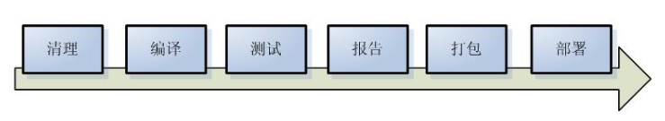
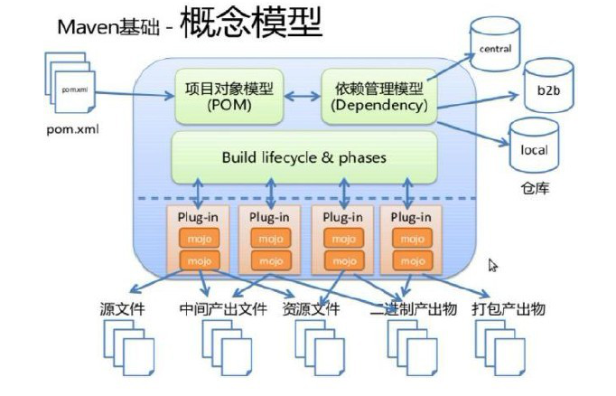
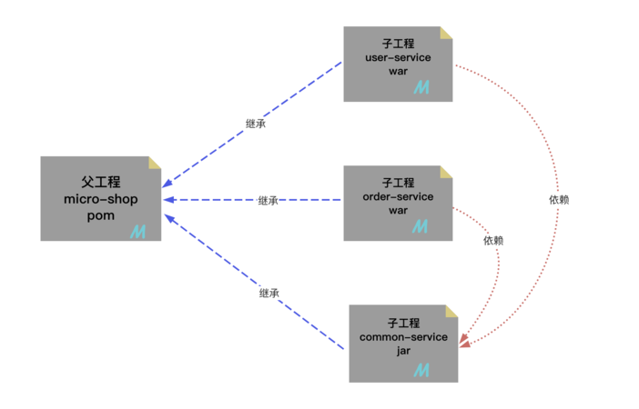

# 一、Maven简介

## 一、使用Maven的意义

### 一、Maven是一个依赖管理工具

1. jar包的规模

   - 随着我们使用越来越多的框架，或者框架封装程度越来越高，项目中使用的jar包也越来越多。项目中，一个模块里面用到上百个jar包是非常正常的
   - 而使用Maven则可简化引入包的过程

2. jar包的来源问题

   - 这个jar包所属技术的官网。官网通常是英文界面，网站的结构又不尽相同，甚至找到下载链接还发现需要通过特殊的工具下载
   - 第三方网站提供下载。问题是不规范，在使用过程中会出现各种问题
     - jar包的名称
     - jar包的版本
     - jar包内的具体细节
   - 而使用Maven后，依赖对应的jar包能够**自动下载**，方便、快捷又规范

3. jar包的导入问题

   - 在web工程中，jar包必须存放在指定位置：web/WEB-INF/lib/

   - 在使用Maven之后，通过配置依赖(jar包)的坐标，查找本地仓库中相应jar包，若本地仓库没有，则统一从镜像网站或中央仓库中下载

     

4. jar包之间的依赖

   - 框架中使用的 jar 包，不仅数量庞大，而且彼此之间存在错综复杂的依赖关系。依赖关系的复杂程度，已经上升到了完全不能靠人力手动解决的程度。另外，jar包之间有可能产生冲突。进一步增加了我们在jar包使用过程中的难度
   - 而实际上jar包之间的依赖关系是普遍存在的，如果要由程序员手动梳理无疑会增加极高的学习成本，而这些工作又对实现业务功能毫无帮助
   - 而使用Maven则几乎不需要管理这些关系，极个别的地方调整一下即可，极大的减轻了我们的工作量

### 二、Maven是一个构件工具

1. 可以不使用Maven，但是构建必须要做。当我们使用IDEA进行开发时，构建是IDEA替我们做的

2. 脱离IDE环境仍需构建

   

### 三、结论

1. 管理规模庞大的jar包，需要专门工具
2. 脱离IDE环境执行构建操作，需要专门工具

## 二、Maven介绍

- [Maven介绍网站](https://maven.apache.org/what-is-maven.html)
- Maven是一款为Java项目管理构建、依赖管理的工具（软件），使用Maven可以自动化构建、测试、打包和发布项目，大大提高了开发效率和质量
- Maven就是一个软件，掌握安装、配置、以及基本功能 **（项目构建、依赖管理）** 的理解和使用即可

### 一、依赖管理

- Maven可以管理项目的依赖，包括自动下载所需依赖库、自动下载依赖需要的依赖并且保证版本没有冲突、依赖版本管理等。通过Maven，我们可以方便地维护项目所依赖的外部库，避免版本冲突和转换错误等，而我们仅仅需要编写配置即可

### 二、构件管理

- 项目构建是指将源代码、配置文件、资源文件等转化为能够运行或部署的应用程序或库的过

- Maven可以管理项目的编译、测试、打包、部署等构建过程。通过实现标准的构建生命周期，Maven可以确保每一个构建过程都遵循同样的规则和最佳实践。同时，Maven的插件机制也使得开发者可以对构建过程进行扩展和定制。主动触发构建，只需要简单的命令操作即可

  

### 三、使用场景

1. 场景一
   - 例如我们项目需要第三方依赖如：Druid连接池、MySQL数据库驱动和Jackson JSON等处理。那么我们可以将想要的依赖项的信息编写到Maven工程的配置文件，Maven就会自动下载并复制这些依赖项到项目中，无需自己导入jar包，管理jar
2. 场景二
   - 项目完成开发，我们想要打成war部署到服务器中，使用Maven的构建命令可以快速打包！节省大量时间

## 三、Maven软件工作原理模型图



# 二、Maven安装和配置

## 一、Maven安装

1. [Maven下载地址](https://maven.apache.org/docs/history.html>)

2. 安装条件：Maven需要本机安装Java环境

3. 软件安装：右键解压即可

4. 软件结构

   

   - **bin**：含有Maven的运行脚本
   - boot：含有plexus-classworlds类加载器框架
   - **conf**：含有Maven的核心配置文件
   - lib：含有Maven运行时所需要的Java类库
   - LICENSE、NOTICE、README.txt：针对Maven版本，第三方软件等简要介绍

## 二、Maven环境配置

1. 配置MAVEN_HOME

   

2. 配置Path

   

3. 命令测试

   ```bash
   mvn -v 
   # 输出版本信息即可，如果错误，请仔细检查环境变量即可！
   ```

## 三、Maven功能配置

>我们需要需改**maven/conf/settings.xml**配置文件，来修改maven的一些默认配置。我们主要休要修改的有三个配置：
>
>1.依赖本地缓存位置（本地仓库位置）
>
>2.maven下载镜像
>
>3.maven选用编译项目的jdk版本

1. 配置本地仓库地址

   ```xml
   <!-- localRepository
      | The path to the local repository maven will use to store artifacts.
      |
      | Default: ${user.home}/.m2/repository
     <localRepository>/path/to/local/repo</localRepository>
     -->
    <!-- conf/settings.xml 55行 -->
    <localRepository>D:\maven-repository</localRepository>
   ```

2. 配置国内阿里镜像

   ```xml
   <!--在mirrors节点(标签)下添加中央仓库镜像 160行附近-->
   <mirror>
       <id>alimaven</id>
       <name>aliyun maven</name>
       <url>http://maven.aliyun.com/nexus/content/groups/public/</url>
       <mirrorOf>central</mirrorOf>
   </mirror>
   ```

3. 配置jdk版本项目构建，以17为例

   ```xml
   <!--在profiles节点(标签)下添加jdk编译版本 268行附近-->
   <profile>
       <id>jdk-17</id>
       <activation>
         <activeByDefault>true</activeByDefault>
         <jdk>17</jdk>
       </activation>
       <properties>
         <maven.compiler.source>17</maven.compiler.source>
         <maven.compiler.target>17</maven.compiler.target>
         <maven.compiler.compilerVersion>17</maven.compiler.compilerVersion>
       </properties>
   </profile>
   ```

## 四、IDEA配置本地Maven软件

- 我们需要将配置好的maven软件，配置到idea开发工具中即可！ 注意：idea工具默认自带maven配置软件，但是因为没有修改配置，建议替换成本地配置好的maven

- 选择本地maven软件

  

- 如果本地仓库地址不变化，只有一个原因，就是maven/conf/settings.xml配置文件编写错误！仔细检查即可

- 一定保证User settings file对应之前修改的settings.xml的路径，若不一致，选中Override复选框，手动选择配置文件

# 三、基于IDEA创建Maven工程

## 一、概念梳理Maven工程的GAVP

1. Maven工程相对之前的项目，多出一组gavp属性，gav需要我们在创建项目的时候指定，p有默认值
2. Maven中的GAVP是指GroupId、ArtifactId、Version、Packaging等四个属性的缩写，其中前三个是必要的，而Packaging属性为可选项。这四个属性主要为每个项目在maven仓库中做一个标识，类似人的姓-名。有了具体标识，方便后期项目之间相互引用依赖等
3. **GroupID格式**：com.{公司/BU }.业务线.\[子业务线]，最多4级
4. **ArtifactID格式**：产品线名-模块名。语义不重复不遗漏，先到仓库中心去查证一下
5. **Version版本号格式推荐**：主版本号.次版本号.修订号
   - 主版本号：当做了不兼容的API修改，或者增加了能改变产品方向的新功能
   - 次版本号：当做了向下兼容的功能性新增（新增类、接口等）
   - 修订号：修复bug，没有修改方法签名的功能加强，保持API兼容性
6. **Packaging定义规则：**
   - 指示将项目打包为什么类型的文件，idea根据packaging值，识别maven项目类
   - packaging属性为jar（默认值），代表普通的Java工程，打包以后是.jar结尾的文件
   - packaging属性为war，代表Java的web工程，打包以后.war结尾的文件
   - packaging属性为pom，代表不会打包，用来做继承的父工程

## 二、Idea构件Maven Java SE工程


- 验证maven工程是否创建成功，当创建完毕maven工程之后，idea中会自动打开Maven视图，如下:

  

## 三、Idea构建Maven Java Web工程

### 一、手动创建

1. 创建一个maven的javase工程

   

2. 修改pom.xml文件打包方式。修改位置：项目下/pom.xml

   ```xml
   <groupId>com.sunny</groupId>
   <artifactId>maven_web</artifactId>
   <version>1.0-SNAPSHOT</version>
   <!-- 新增一列打包方式packaging -->
   <packaging>war</packaging>
   ```

3. 设置**web资源路径**和**web.xml路径**。点击File-->Project Structure

   1. 

      

4. 刷新和校验

   


### 二、插件创建

1. 安装插件JBLJavaToWeb

2. 创建一个javasemaven工程

3. 右键、使用插件快速补全web项目

   

## 四、Maven工程项目结构说明

- Maven是一个强大的构建工具，它提供一种标准化的项目结构，可以帮助开发者更容易地管理项目的依赖、构建、测试和发布等任务。以下是Maven Web程序的文件结构及每个文件的作用：

  ```xml
  |-- pom.xml                               # Maven 项目管理文件 
  |-- src
      |-- main                              # 项目主要代码
      |   |-- java                          # Java 源代码目录
      |   |   `-- com/example/myapp         # 开发者代码主目录
      |   |       |-- controller            # 存放 Controller 层代码的目录
      |   |       |-- service               # 存放 Service 层代码的目录
      |   |       |-- dao                   # 存放 DAO 层代码的目录
      |   |       `-- model                 # 存放数据模型的目录
      |   |-- resources                     # 资源目录，存放配置文件、静态资源等
      |   |   |-- log4j.properties          # 日志配置文件
      |   |   |-- spring-mybatis.xml        # Spring Mybatis 配置文件
      |   |   `-- static                    # 存放静态资源的目录
      |   |       |-- css                   # 存放 CSS 文件的目录
      |   |       |-- js                    # 存放 JavaScript 文件的目录
      |   |       `-- images                # 存放图片资源的目录
      |   `-- webapp                        # 存放 WEB 相关配置和资源
      |       |-- WEB-INF                   # 存放 WEB 应用配置文件
      |       |   |-- web.xml               # Web 应用的部署描述文件
      |       |   `-- classes               # 存放编译后的 class 文件
      |       `-- index.html                # Web 应用入口页面
      `-- test                              # 项目测试代码
          |-- java                          # 单元测试目录
          `-- resources                     # 测试资源目录
  ```

- pom.xml：Maven 项目管理文件，用于描述项目的依赖和构建配置等信息

- src/main/java：存放项目的 Java 源代码

- src/main/resources：存放项目的资源文件，如配置文件、静态资源等

- src/main/webapp/WEB-INF：存放 Web 应用的配置文件

- src/main/webapp/index.jsp：Web 应用的入口页面

- src/test/java：存放项目的测试代码

- src/test/resources：存放测试相关的资源文件，如测试配置文件等

# 四、基于IDEA进行Maven工程构建

## 一、构建概念和构建过程

- 项目构建是指将源代码、依赖库和资源文件等转换成可执行或可部署的应用程序的过程，在这个过程中包括编译源代码、链接依赖库、打包和部署等多个步骤

- 项目构建是软件开发过程中至关重要的一部分，它能够大大提高软件开发效率，使得开发人员能够更加专注于应用程序的开发和维护，而不必关心应用程序的构建细节

- 同时，项目构建还能够将多个开发人员的代码汇合到一起，并能够自动化项目的构建和部署，大大降低了项目的出错风险和提高开发效率。常见的构建工具包括Maven、Gradle、Ant等

  

## 二、命令方式项目构建

|    命令     |            描述             |
| :---------: | :-------------------------: |
| mvn compile |  编译项目，生成target文件   |
| mvn package | 打包项目，生成jar或war文件  |
|  mvn clean  | 清理编译或打包后的项目结构  |
| mvn install |  打包后上传到maven本地仓库  |
| mvn deploy  | 只打包，上传到maven私服仓库 |
|  mvn site   |          生成站点           |
|  mvn test   |        执行测试源码         |

- war包打包插件和jdk版本不匹配：pom.xml 添加以下代码即可

  ```xml
  <build>
      <!-- jdk17 和 war包版本插件不匹配 -->
      <plugins>
          <plugin>
              <groupId>org.apache.maven.plugins</groupId>
              <artifactId>maven-war-plugin</artifactId>
              <version>3.2.2</version>
          </plugin>
      </plugins>
  </build>
  ```

- 命令执行示例

  ```bash
  mvn 命令 命令
  
  #清理
  mvn clean
  #清理，并重新打包
  mvn clean package
  #执行测试代码
  mvn test
  ```

## 三、可视化方式项目构建


打包（package）和安装（install）的区别

- 打包是将工程打成jar或war文件，保存在target目录下
- 安装是将当前工程所生成的jar或war文件，安装到本地仓库，会按照坐标保存到指定位置‘

## 四、构建插件、命令、生命周期命令之间关系

1. 构建生命周期

   - 当我们执行package命令也会自动执行compile命令。这种行为就是因为构建生命周期产生的！构建生命周期可以理解成是一组固定构建命令的有序集合，触发周期后的命令，会自动触发周期前的命令
   - 构建周期作用：会简化构建过程。例如：项目打包   mvn clean package即可

2. 默认周期

   ```base
   包含命令：compile -  test - package - install - deploy
   ```

3. 插件、命令、周期三者关系

   - 周期→包含若干命令→命令包含若干插件
   - 使用周期命令构建，简化构建过程
   - 最终进行构建的是插件

# 五、基于IDEA进行Maven依赖管理

## 一、依赖管理概念

- Maven依赖管理是Maven软件中最重要的功能之一。Maven的依赖管理能够帮助开发人员自动解决软件包依赖问题，使得开发人员能够轻松地将其他开发人员开发的模块或第三方框架集成到自己的应用程序或模块中，避免出现版本冲突和依赖缺失等问题
- 我们通过定义POM文件，Maven能够自动解析项目的依赖关系，并通过Maven仓库自动下载和管理依赖，从而避免了手动下载和管理依赖的繁琐工作和可能引发的版本冲突问题
- 总之，Maven的依赖管理是Maven软件的一个核心功能之一，使得软件包依赖的管理和使用更加智能和方便，简化了开发过程中的工作，并提高了软件质量和可维护性

## 二、Maven工程核心信息配置和解读(GAVP)

```xml
<!-- 模型版本 -->
<modelVersion>4.0.0</modelVersion>
<!-- 公司或者组织的唯一标志，并且配置时生成的路径也是由此生成， 如com.sunny，
maven会将该项目打成的jar包放本地路径：/com/sunny -->
<groupId>com.sunny</groupId>
<!-- 项目的唯一ID，一个groupId下面可能多个项目，就是靠artifactId来区分的 -->
<artifactId>project</artifactId>
<!-- 版本号 -->
<version>1.0.0</version>

<!--打包方式
    默认：jar
    jar指的是普通的java项目打包方式！ 项目打成jar包！
    war指的是web项目打包方式！项目打成war包！
    pom不会讲项目打包！这个项目作为父工程，被其他工程聚合或者继承！后面会讲解两个概念
-->
<packaging>jar/pom/war</packaging>
```

## 三、Maven工程依赖管理配置

```xml
<!-- 
   通过编写依赖jar包的gav必要属性，引入第三方依赖！
   scope属性是可选的，可以指定依赖生效范围！
   依赖信息查询方式：
      1. maven仓库信息官网 https://mvnrepository.com/
      2. mavensearch插件搜索
 -->
<dependencies>
    <!-- 引入具体的依赖包 -->
    <dependency>
        <groupId>log4j</groupId>
        <artifactId>log4j</artifactId>
        <version>1.2.17</version>
        <!-- 依赖范围 -->
        <scope>runtime</scope>
    </dependency>
</dependencies>
```

依赖版本统一提取和维护

```xml
<!--声明版本-->
<properties>
  <!--命名随便,内部制定版本号即可！-->
  <junit.version>4.12</junit.version>
  <!-- 也可以通过maven规定的固定的key，配置maven的参数！如下配置编码格式！-->
  <project.build.sourceEncoding>UTF-8</project.build.sourceEncoding>
  <project.reporting.outputEncoding>UTF-8</project.reporting.outputEncoding>
</properties>

<dependencies>
  <dependency>
    <groupId>junit</groupId>
    <artifactId>junit</artifactId>
    <!--引用properties声明版本 -->
    <version>${junit.version}</version>
  </dependency>
</dependencies>
```

## 四、依赖范围

通过设置坐标的依赖范围(scope)，可以设置 对应jar包的作用范围：编译环境、测试环境、运行环境

|   依赖范围   | 描述                                                         |
| :----------: | :----------------------------------------------------------- |
| **compile**  | 编译依赖范围，scope元素的缺省值。使用此依赖范围的Maven依赖，对于三种classpath均有效，即该Maven依赖在编译环境、测试环境、运行环境三种classpath均会被引入。例如，log4j 在编译、测试、运行过程都是必须的 |
|   **test**   | 测试依赖范围。使用此依赖范围的Maven依赖，只对测试classpath有效。例如Junit依赖只有在测试阶段才需要 |
| **provided** | 已提供依赖范围。使用此依赖范围的Maven依赖，只对编译classpath和测试classpath有效。例如，servlet-api依赖对于编译、测试阶段而言是需要的，但是运行阶段，由于外部容器（如Tomcat）已经提供，故不需要Maven重复引入该依赖 |
|   runtime    | 运行时依赖范围。使用此依赖范围的Maven依赖，只对测试classpath、运行classpath有效。例如，JDBC驱动实现依赖，其在编译时只需JDK提供的JDBC接口即可，只有执行测试、运行阶段才需要实现了JDBC接口的驱动 |
|    system    | 系统依赖范围，其效果与provided的依赖范围一致。其用于添加非Maven仓库的本地依赖，通过依赖元素dependency中的systemPath元素指定本地依赖的路径。鉴于使用其会导致项目的可移植性降低，一般不推荐使用。需要引用第三方本地jar包的时候使用，即别人给的jar包 |
|    import    | 导入依赖范围，该依赖范围只能与dependencyManagement元素配合使用，其功能是将目标 pom.xml文件中dependencyManagement的配置导入合并到当前pom.xml的 dependencyManagement中 |

## 五、Maven工程依赖下载失败错误解决

### 一、依赖项下载失败的原因

1. 下载依赖时出现网络故障或仓库服务器宕机等原因，导致无法连接至Maven仓库，从而无法下载依赖
2. 依赖项的版本号或配置文件中的版本号错误，或者依赖项没有正确定义，导致Maven下载的依赖项与实际需要的不一致，从而引发错误
3. 本地Maven仓库或缓存被污染或损坏，导致Maven无法正确地使用现有的依赖项

### 二、解决方案

1. 检查网络连接和Maven仓库服务器状态

2. 确保依赖项的版本号与项目对应的版本号匹配，并检查POM文件中的依赖项是否正确

3. 清除本地Maven仓库缓存（lastUpdated 文件），因为只要存在lastupdated缓存文件，刷新也不会重新下载。本地仓库中，根据依赖的gav属性依次向下查找文件夹，最终删除内部的文件，刷新重新下载即可。清除遵循以下步骤：

   - pom.xml依赖

     ```xml
     <dependency>
       <groupId>com.alibaba</groupId>
       <artifactId>druid</artifactId>
       <version>1.2.8</version>
     </dependency>
     ```

   - 文件

     

4. 可以将清除**lastUpdated文件**的操作写在一个脚本文件中，手动创建文件"clearLastUpdated.bat"，名字任意，但是后缀必须是bat，将以下内容复制到文件中

   ```bat
   cls 
   @ECHO OFF 
   SET CLEAR_PATH=D: 
   SET CLEAR_DIR=D:\maven-repository(本地仓库路径)
   color 0a 
   TITLE ClearLastUpdated For Windows 
   GOTO MENU 
   :MENU 
   CLS
   ECHO. 
   ECHO. * * * *  ClearLastUpdated For Windows  * * * * 
   ECHO. * * 
   ECHO. * 1 清理*.lastUpdated * 
   ECHO. * * 
   ECHO. * 2 查看*.lastUpdated * 
   ECHO. * * 
   ECHO. * 3 退 出 * 
   ECHO. * * 
   ECHO. * * * * * * * * * * * * * * * * * * * * * * * * 
   ECHO. 
   ECHO.请输入选择项目的序号： 
   set /p ID= 
   IF "%id%"=="1" GOTO cmd1 
   IF "%id%"=="2" GOTO cmd2 
   IF "%id%"=="3" EXIT 
   PAUSE 
   :cmd1 
   ECHO. 开始清理
   %CLEAR_PATH%
   cd %CLEAR_DIR%
   for /r %%i in (*.lastUpdated) do del %%i
   ECHO.OK 
   PAUSE 
   GOTO MENU 
   :cmd2 
   ECHO. 查看*.lastUpdated文件
   %CLEAR_PATH%
   cd %CLEAR_DIR%
   for /r %%i in (*.lastUpdated) do echo %%i
   ECHO.OK 
   PAUSE 
   GOTO MENU 
   ```

   

## 六、Maven工程Build构建配置

1. 项目构建是指将源代码、依赖库和资源文件等转换成可执行或可部署的应用程序的过程，在这个过程中包括编译源代码、链接依赖库、打包和部署等多个步骤

2. 默认情况下，构建不需要额外配置，都有对应的缺省配置。当然了，我们也可以在pom.xml定制一些配置，来修改默认构建的行为和产物

   - 指定构建打包文件的名称，非默认名称
   - 制定构建打包时，指定包含文件格式和排除文件
   - 打包插件版本过低，配置更高版本插件

3. 构建配置是在pom.xml/build标签中指定

   - 指定打包命名

     ```xml
     <!-- 默认的打包名称：artifactid+verson.打包方式 -->
     <build>
       <finalName>定义打包名称</finalName>
     </build>  
     ```

   - 指定打包文件

     >① 如果在java文件夹中添加java类，会自动打包编译到classes文件夹下！
     >
     >② 但是在java文件夹中添加xml文件，默认不会被打包！
     >
     >③ 默认情况下，按照maven工程结构放置的文件会默认被编译和打包！
     >
     >④ 除此之外、我们可以使用resources标签，指定要打包资源的文件夹要把哪些静态资源打包到classes根目录下
     >
     >⑤ 应用场景：mybatis中有时会将用于编写SQL语句的映射文件和mapper接口都写在src/main/java下的某个包中，此时映射文件就不会被打包，解决方式
     >
     >

     ```xml
     <build>
       <!-- 配置项目的源代码目录，默认为 "src/main/java" -->
       <sourceDirectory>src/main/java</sourceDirectory>
       <!-- 配置项目的测试代码目录，默认为 "src/test/java" -->
       <testSourceDirectory>src/test/java</testSourceDirectory>
         
       <!--解决上述问题只需从这开始-->
       <!--设置要打包的资源位置-->
       <resources>
       	<resource>
       	<!--设置资源所在目录-->
       		<directory>src/main/java</directory>
              <includes>
                 <!--设置包含的资源类型-->
              	<include>**/*.xml</include>
              </includes>
       	</resource>
       </resources>
       <!--解决上述问题只需从这结束-->
         
       <!-- 配置项目的测试资源文件目录，默认为 "src/test/resources" -->
       <testResources>
         <testResource>
           <directory>src/test/resources</directory>
         </testResource>
       </testResources>
      
       <!-- 配置项目的输出目录，默认为 "target/classes" -->
       <outputDirectory>target/classes</outputDirectory>
       <!-- 配置项目的测试输出目录，默认为 "target/test-classes" -->
       <testOutputDirectory>target/test-classes</testOutputDirectory>
     </build>
     ```

   - 配置依赖插件

     > ①  <plugin> 元素可以配置指定插件的用途。其中，<groupId>、<artifactId> 和 <version> 元素指定了插件的坐标信息，用于确定要使用的插件。在 <configuration> 元素中可以指定插件的具体配置参数，例如Java 编译的源代码版本和目标版本
     >
     > ② 通过在pom.xml文件中配置插件，开发人员可以定制Maven构建过程，包括编译、测试、打包、部署等各个阶段的行为。不同的插件可以用于执行不同的任务，从而满足项目特定的需求。 总之，Maven的pom.xml文件中的 <plugin> 元素用于配置Maven插件，以定制项目的构建过程和执行特定的构建任务
     >
     > ③ dependencies标签下引入开发需要的jar包；可以在build/plugins/plugin标签引入插件定制化dependencies下jar的使用
     >
     > ④ 常用的插件：修改jdk版本、tomcat插件、mybatis分页插件、mybatis逆向工程插件等等
     >
     > 

     ```xml
     <build>
       <plugins>
           <!-- java编译插件，配jdk的编译版本 -->
           <plugin>
             <groupId>org.apache.maven.plugins</groupId>
             <artifactId>maven-compiler-plugin</artifactId>
             <configuration>
               <source>1.8</source>
               <target>1.8</target>
               <encoding>UTF-8</encoding>
             </configuration>
           </plugin>
           <!-- tomcat插件 -->
           <plugin>
             <groupId>org.apache.tomcat.maven</groupId>
             <artifactId>tomcat7-maven-plugin</artifactId>
              <version>2.2</version>
               <configuration>
               <port>8090</port>
               <path>/</path>
               <uriEncoding>UTF-8</uriEncoding>
               <server>tomcat7</server>
             </configuration>
           </plugin>
         </plugins>
     </build>
     ```

# 六、Maven依赖传递和依赖冲突

## 一、Maven依赖传递特性

1. 概念

   - 假如有Maven项目A，项目B依赖A，项目C依赖B。那么我们可以说C依赖A。也就是说，依赖的关系为：C—>B—>A， 那么我们执行项目C时，会自动把B、A都下载导入到C项目的jar包文件夹中，这就是依赖的传递性

2. 作用

   - 简化依赖导入过程
   - 确保依赖版本正确

3. 传递的原则

   - 在A依赖B，B依赖C的前提下，C是否能够传递到A，取决于B依赖C时使用的依赖范围以及配置

   - B依赖C时使用compile范围：可以传递

   - B依赖C时使用test或provided范围：不能传递，所以需要这样的jar包时，就必须在需要的地方明确配置依赖才可以

   - B依赖C时，若配置了以下标签，则不能传递

     ```xml
     <dependency>
         <groupId>com.alibaba</groupId>
         <artifactId>druid</artifactId>
         <version>1.2.15</version>
         <optional>true</optional>
     </dependency>
     ```

4. 依赖传递终止

   -   非compile范围进行依赖传递
   -   使用optional配置终止传递
   -   依赖冲突（传递的依赖已经存在）

## 二、Maven依赖冲突特性

1. 当直接引用或者间接引用出现了相同的jar包。这时呢，一个项目就会出现相同的重复jar包，这就算作冲突！依赖冲突避免出现重复依赖，并且终止依赖传递

   

2. maven自动解决依赖冲突问题能力，会按照自己的原则（即自动选择原则），进行重复依赖选择。同时也提供了手动解决的冲突的方式（即手动排除方式），不过不推荐

3. 自动选择原则

   - 短路优先原则（第一原则）

     >A—>B—>C—>D—>E—>X(version 0.0.1)
     >
     >A—>F—>X(version 0.0.2)
     >
     >则A依赖于X(version 0.0.2)
     >
     >

   - 依赖路径长度相同情况下，则“先声明优先”（第二原则）

     >A—>E—>X(version 0.0.1)
     >
     >A—>F—>X(version 0.0.2)
     >
     >在\<depencies>\</depencies>中，先声明的，路径相同，会优先选择

4. 手动排除

   ```xml
   <dependency>
     <groupId>com.atguigu.maven</groupId>
     <artifactId>pro01-maven-java</artifactId>
     <version>1.0-SNAPSHOT</version>
     <scope>compile</scope>
     <!-- 使用excludes标签配置依赖的排除  -->
     <exclusions>
       <!-- 在exclude标签中配置一个具体的排除 -->
       <exclusion>
         <!-- 指定要排除的依赖的坐标（不需要写version） -->
         <groupId>commons-logging</groupId>
         <artifactId>commons-logging</artifactId>
       </exclusion>
     </exclusions>
   </dependency>
   ```

# 七、Maven工程继承和聚合关系

## 一、Maven工程继承关系

### 一、继承概念

- Maven 继承是指在Maven的项目中，让一个项目从另一个项目中继承配置信息的机制。继承可以让我们在多个项目中共享同一配置信息，简化项目的管理和维护工作

### 二、继承作用

1. 在父工程中统一管理项目中的依赖信息
2. 它的背景是：
   -   对一个比较大型的项目进行了模块拆分
   -   一个project下面，创建了很多个module
   -   每一个module都需要配置自己的依赖信息
3. 它背后的需求是
   -   在每一个module中各自维护各自的依赖信息很容易发生出入，不易统一管理
   -   使用同一个框架内的不同jar包，它们应该是同一个版本，所以整个项目中使用的框架版本需要统一
   -   使用框架时所需要的jar包组合（或者说依赖信息组合）需要经过长期摸索和反复调试，最终确定一个可用组合。这个耗费很大精力总结出来的方案不应该在新的项目中重新摸索。
       通过在父工程中为整个项目维护依赖信息的组合既保证了整个项目使用规范、准确的jar 包；又能够将以往的经验沉淀下来，节约时间和精力

### 三、继承语法

- 父工程

  ```xml
    <groupId>com.sunny.maven</groupId>
    <artifactId>pro03-maven-parent</artifactId>
    <version>1.0-SNAPSHOT</version>
    <!-- 当前工程作为父工程，它要去管理子工程，所以打包方式必须是 pom -->
    <packaging>pom</packaging>
  ```

- 子工程

  ```xml
  <!-- 使用parent标签指定当前工程的父工程 -->
  <parent>
    <!-- 父工程的坐标 -->
    <groupId>com.sunny.maven</groupId>
    <artifactId>pro03-maven-parent</artifactId>
    <version>1.0-SNAPSHOT</version>
  </parent>
  
  <!-- 子工程的坐标 -->
  <!-- 如果子工程坐标中的groupId和version与父工程一致，那么可以省略 -->
  <!-- <groupId>com.sunny.maven</groupId> -->
  <artifactId>pro04-maven-module</artifactId>
  <!-- <version>1.0-SNAPSHOT</version> -->
  ```

###       四、父工程依赖统一管理

- 父工程声明版本

  ```xml
  <!-- 使用dependencyManagement标签配置对依赖的管理 -->
  <!-- 被管理的依赖并没有真正被引入到工程 -->
  <dependencyManagement>
    <dependencies>
      <dependency>
        <groupId>org.springframework</groupId>
        <artifactId>spring-core</artifactId>
        <version>6.0.10</version>
      </dependency>
      <dependency>
        <groupId>org.springframework</groupId>
        <artifactId>spring-beans</artifactId>
        <version>6.0.10</version>
      </dependency>
      <dependency>
        <groupId>org.springframework</groupId>
        <artifactId>spring-context</artifactId>
        <version>6.0.10</version>
      </dependency>
      <dependency>
        <groupId>org.springframework</groupId>
        <artifactId>spring-expression</artifactId>
        <version>6.0.10</version>
      </dependency>
      <dependency>
        <groupId>org.springframework</groupId>
        <artifactId>spring-aop</artifactId>
        <version>6.0.10</version>
      </dependency>
    </dependencies>
  </dependencyManagement>
  ```

- 子工程引用版本

  ```xml
  <!-- 子工程引用父工程中的依赖信息时，可以把版本号去掉。  -->
  <!-- 把版本号去掉就表示子工程中这个依赖的版本由父工程决定。 -->
  <!-- 具体来说是由父工程的dependencyManagement来决定。 -->
  <dependencies>
    <dependency>
      <groupId>org.springframework</groupId>
      <artifactId>spring-core</artifactId>
    </dependency>
    <dependency>
      <groupId>org.springframework</groupId>
      <artifactId>spring-beans</artifactId>
    </dependency>
    <dependency>
      <groupId>org.springframework</groupId>
      <artifactId>spring-context</artifactId>
    </dependency>
    <dependency>
      <groupId>org.springframework</groupId>
      <artifactId>spring-expression</artifactId>
    </dependency>
    <dependency>
      <groupId>org.springframework</groupId>
      <artifactId>spring-aop</artifactId>
    </dependency>
  </dependencies>
  ```

## 二、Maven工程聚合关系

1. 聚合概念

   - Maven聚合是指将多个项目组织到一个父级项目中，以便一起构建和管理的机制。聚合可以帮助我们更好地管理一组相关的子项目，同时简化它们的构建和部署过程

2. 聚合作用

   - 管理多个子项目：通过聚合，可以将多个子项目组织在一起，方便管理和维护
   - 构建和发布一组相关的项目：通过聚合，可以在一个命令中构建和发布多个相关的项目，简化了部署和维护工作
   - 优化构建顺序：通过聚合，可以对多个项目进行顺序控制，避免出现构建依赖混乱导致构建失败的情况
   - 统一管理依赖项：通过聚合，可以在父项目中管理公共依赖项和插件，避免重复定义

3. 聚合语法

   - 父项目中包含的子项目列表

     ```xml
     <project>
       <groupId>com.example</groupId>
       <artifactId>parent-project</artifactId>
       <packaging>pom</packaging>
       <version>1.0.0</version>
       <modules>
         <module>child-project1</module>
         <module>child-project2</module>
       </modules>
     </project>
     ```

4. 聚合演示

   - 通过触发父工程构建命令、引发所有子模块构建！产生反应堆

# 八、Maven私服

## 一、Maven私服简介

1. Maven私服简介

   - Maven私服是一种特殊的Maven远程仓库，它是架设在局域网内的仓库服务，用来代理位于外部的远程仓库（中央仓库、其他远程公共仓库）

   - 当然也并不是说私服只能建立在局域网，也有很多公司会直接把私服部署到公网，具体还是得看公司业务的性质是否是保密的等等，因为局域网的话只能在公司用，部署到公网的话员工在家里也可以办公使用

   - 建立了Maven私服后，当局域网内的用户需要某个构件时，会按照如下顺序进行请求和下载

     >① 请求本地仓库，若本地仓库不存在所需构件，则跳转到第 2 步
     >② 请求Maven私服，将所需构件下载到本地仓库，若私服中不存在所需构件，则跳转到第3步
     >③ 请求外部的远程仓库，将所需构件下载并缓存到Maven私服，若外部远程仓库不存在所需构件，则Maven直接报错
     >
     >

   - 此外，一些无法从外部仓库下载到的构件，也能从本地上传到私服供其他人使用

     

2. Maven私服的优势

   - 节省外网带宽：消除对外部远程仓库的大量重复请求（会消耗很大量的带宽），降低外网带宽压力

   - 下载速度更快：Maven私服位于局域网内，从私服下载构建更快更稳定

   - 便于部署第三方构件：有些构件无法从任何一个远程仓库中获得（如：公司或组织内部的私有构件、Oracle的JDBC驱动等），建立私服之后，就可以将这些构件部署到私服中，供内部Maven项目使用

   - 提高项目的稳定性，增强对项目的控制：如果不建立私服，那么Maven项目的构件就高度依赖外部的远程仓库，若外部网络不稳定，则项目的构建过程也会变得不稳定。建立私服后，即使外部网络状况不佳甚至中断，只要私服中已经缓存了所需的构件，Maven也能够正常运行。私服软件（如：Nexus）提供了很多控制功能（如：权限管理、RELEASE/SNAPSHOT版本控制等），可以对仓库进行一些更加高级的控制。

   - 降低中央仓库得负荷压力：由于私服会缓存中央仓库得构件，避免了很多对中央仓库的重复下载，降低了中央仓库的负荷

3. 常见的Maven私服产品

   - Apache的Archiva
   - JFrog的Artifactory
   - Sonatype的Nexus（[ˈneksəs]）（当前最流行、使用最广泛）

## 二、Nexus下载安装

1. [Nexus下载](https://help.sonatype.com/repomanager3/product-information/download)
2. 解压，以管理员身份打开CMD，进入bin目录下，执行./nexus/run命令启动
3. 访问Nexus首页，首页地址为http://localhost:8081/，8081为默认端口号

## 三、初始化设置

- 用户名：admin
- 密码：查看 **安装目录\admin.password** 文件


- 继续执行初始化

  

  

  ​      启用匿名登录后，后续操作比较简单，这里禁用匿名登录的操作（也可允许匿名登录）：

  

- 初始化完毕：

  

## 四、 Nexus上的各种仓库

- 初始状态下，这几个仓库都没有内容的


| 仓库类型 |                    说明                    |
| :------: | :----------------------------------------: |
|  proxy   |             某个远程仓库的代理             |
|  group   |      存放：通过Nexus获取的第三方jar包      |
|  hosted  | 存放：本团队其他开发人员部署到Nexus的jar包 |

|    仓库名称     |                             说明                             |
| :-------------: | :----------------------------------------------------------: |
|  maven-central  |                  Nexus对Maven中央仓库的代理                  |
|  maven-public   |          Nexus默认创建，供开发人员下载使用的组仓库           |
| maven-releases  | Nexus默认创建，供开发人员部署自己jar包的宿主仓库，要求releases版本 |
| maven-snapshots | Nexus默认创建，供开发人员部署自己jar包的宿主仓库，要求snapshots版本 |

1. maven-releases:
   - 用于存储发布版本（Release versions）的仓库
   - 当准备好发布一个稳定、可靠的版本时，应该将构建产物部署到maven-releases仓库中
   - 发布到maven-releases仓库的构件具有固定的版本号，是经过严格测试和验证的稳定版本
   - 一旦构建部署到maven-releases仓库，应该保持不变，不应该再修改或覆盖
2. **maven-snapshots**:
   - 用于存储快照版本（Snapshot versions）的仓库
   - 快照版本是处于开发阶段的、不稳定的版本，通常包含最新的代码更改和功能增加
   - 每次构建产生的快照版本都会更新仓库中相应的快照构件，因此它们是可以覆盖和更新的
   - 开发人员在进行持续集成和开发过程中经常使用maven-snapshots仓库来共享最新的构建产物

## 五、通过Nexus下载jar包

1. 修改本地maven的核心配置文件settings.xml，设置新的本地仓库地址

   ```xml
   <!-- 配置一个新的 Maven 本地仓库 -->
   <localRepository>D:/maven-repository-new</localRepository>
   ```

2. 把原来配置阿里云仓库地址的mirror标签改成下面这样

   ```xml
   <mirror>
   	<id>nexus-mine</id>
   	<mirrorOf>central</mirrorOf>
   	<name>Nexus mine</name>
       <!-- url可通过Nexus网页版获取，如下 -->
   	<url>http://localhost:8081/repository/maven-public/</url>
   </mirror>
   ```

   - 这里的url标签是这么来的

   

   

   - 把上图中看到的地址复制出来即可。如果我们在前面允许了匿名访问，到这里就够了。但如果我们禁用了匿名访问，那么接下来我们还要继续配置settings.xml

     ```xml
     <server>
       <id>nexus-mine</id>
       <username>admin</username>
       <password>atguigu</password>
     </server>
     ```

   - 这里需要**格外注意**：server标签内的id标签值必须和mirror标签中的id值一样

3. 执行命令即可本地下载完成

   ```bash
   mvn clean compile
   // 下载后，Nexus服务器和本地上就有了jar包，在maven-public包下
   ```

4. 若下载速度太慢，可以设置私服中中央仓库的地址为[阿里云仓库地址](http://maven.aliyun.com/nexus/content/groups/public/)

   

   

## 六、将jar包部署到Nexus

1. maven工程中配置

   ```xml
   <!--将jar包上传到maven-snapshots-->
   <distributionManagement>
       <!--snapshotRepository的id标签必须和settings.xml中指定的mirror标签的id属性一致-->
       <snapshotRepository>
           <id>nexus-mine</id>
           <name>Nexus Snapshot</name>
           <url>http://localhost:8081/repository/maven-snapshots/</url>
       </snapshotRepository>
   </distributionManagement>
   
   <!--将jar包上传到maven-releases-->
   <distributionManagement>
       <repository>
           <id>your-releases-repo</id>
           <url>https://your-nexus-url/repository/maven-releases/</url>
       </repository>
   </distributionManagement>
   ```

2. 执行命令

   ```bash
   mvn deploy
   // 上传后，Nexus服务器就有了jar包，在maven-snapshot或maven-releases包下
   ```

## 七、引用别人部署的jar包

```xml
<repositories>
    <repository>
        <id>nexus-mine</id>
        <name>nexus-mine</name>
        <!--url为别人的jar包地址-->
        <url>http://localhost:8081/repository/maven-snapshots/</url>
        <snapshots>
            <enabled>true</enabled>
        </snapshots>
        <releases>
            <enabled>true</enabled>
        </releases>
    </repository>
</repositories>
```


## 八、将第三方jar打入本地仓库

```bash
# 基本命令
mvn install:install-file 
-Dfile=<jar-path> 
-DgroupId=<groupId> 
-DartifactId=<artifactId> 
-Dversion=<version> 
-Dpackaging=jar

# 示例命令
mvn install:install-file 
-Dfile=F:\maven\apache-maven-3.8.6\Maven-repo\new\RSNetDevice-2.2.2.jar 
-DgroupId=RSNetDevice.examples 
-DartifactId=examples 
-Dversion=1.0.0.0 
-Dpackaging=jar
```

- 将`<jar-path>`替换为要安装的JAR文件的完整路径
- 将`<groupId>`、`<artifactId>`和`<version>`替换为JAR文件分配的Maven坐标（组ID、项目ID和版本）
- 如果JAR文件不是JAR扩展名，则需要修改`-Dpackaging`参数为适当的扩展名（例如，对于 WAR 文件，将其修改为 `war`）

# 九、Maven综合案例

## 一、项目需求和结构分析



1. 用户服务：负责处理用户相关的逻辑，例如用户信息的管理、用户注册、登录等
   - spring-context 6.0.6 
   - spring-core 6.0.6
   - spring-beans 6.0.6
   - common-service
2. 订单服务：负责处理订单相关的逻辑，例如订单的创建、订单支付、退货、订单查看等
   - spring-context 6.0.6 
   - spring-core 6.0.6
   - spring-beans 6.0.6
   - spring-security 6.0.6
   - common-service
3. 通用模块：负责存储其他服务需要通用工具类，其他服务依赖此模块
   - commons-io 2.11.0
   - junit 5.9.2

## 二、项目搭建和统一构建

### 一、父模块 (micro-shop)

1. 创建工程

   

2. pom.xml配置

   ```xml
   <?xml version="1.0" encoding="UTF-8"?>
   <project xmlns="http://maven.apache.org/POM/4.0.0"
            xmlns:xsi="http://www.w3.org/2001/XMLSchema-instance"
            xsi:schemaLocation="http://maven.apache.org/POM/4.0.0 http://maven.apache.org/xsd/maven-4.0.0.xsd">
       <modelVersion>4.0.0</modelVersion>
   
       <groupId>com.sunny</groupId>
       <artifactId>micro-shop</artifactId>
       <version>1.0-SNAPSHOT</version>
       <!--知识点：父工程的打包方式为pom-->
       <packaging>pom</packaging>
   
       <properties>
           <spring.version>6.0.6</spring.version>
           <jackson.version>2.15.0</jackson.version>
           <commons.version>2.11.0</commons.version>
           <junit.version>5.9.2</junit.version>
           <maven.compiler.source>17</maven.compiler.source>
           <maven.compiler.target>17</maven.compiler.target>
           <project.build.sourceEncoding>UTF-8</project.build.sourceEncoding>
       </properties>
   
       <!-- 依赖管理 -->
       <dependencyManagement>
           <dependencies>
               <!-- spring-context会依赖传递core/beans -->
               <dependency>
                   <groupId>org.springframework</groupId>
                   <artifactId>spring-context</artifactId>
                   <version>${spring.version}</version>
               </dependency>
   
               <!-- jackson-databind会依赖传递core/annotations -->
               <dependency>
                   <groupId>com.fasterxml.jackson.core</groupId>
                   <artifactId>jackson-databind</artifactId>
                   <version>${jackson.version}</version>
               </dependency>
   
               <!-- commons-io -->
               <dependency>
                   <groupId>commons-io</groupId>
                   <artifactId>commons-io</artifactId>
                   <version>${commons.version}</version>
               </dependency>
   
               <!-- https://mvnrepository.com/artifact/org.junit.jupiter/junit-				jupiter-api -->
               <dependency>
                   <groupId>org.junit.jupiter</groupId>
                   <artifactId>junit-jupiter-api</artifactId>
                   <version>${junit.version}</version>
                   <scope>test</scope>
               </dependency>
   
           </dependencies>
       </dependencyManagement>
   
       <!-- 统一更新子工程打包插件-->
       <build>
           <!-- 解决jdk17和war包版本插件不匹配 -->
           <plugins>
               <plugin>
                   <groupId>org.apache.maven.plugins</groupId>
                   <artifactId>maven-war-plugin</artifactId>
                   <version>3.2.2</version>
               </plugin>
           </plugins>
       </build>
   
   </project>
   ```

3. 可选操作：删除src目录（习惯于删掉）

### 二、通用模块 (common-service)

1. 创建工程

   

   

2. pom.xml配置

   ```xml
   <?xml version="1.0" encoding="UTF-8"?>
   <project xmlns="http://maven.apache.org/POM/4.0.0"
            xmlns:xsi="http://www.w3.org/2001/XMLSchema-instance"
            xsi:schemaLocation="http://maven.apache.org/POM/4.0.0 http://maven.apache.org/xsd/maven-4.0.0.xsd">
       <parent>
           <artifactId>micro-shop</artifactId>
           <groupId>com.sunny</groupId>
           <version>1.0-SNAPSHOT</version>
       </parent>
       <modelVersion>4.0.0</modelVersion>
   
       <artifactId>common-service</artifactId>
       <!--知识点：打包方式默认就是jar，因此可以省略-->
       <packaging>jar</packaging>
   
       <properties>
           <maven.compiler.source>17</maven.compiler.source>
           <maven.compiler.target>17</maven.compiler.target>
           <project.build.sourceEncoding>UTF-8</project.build.sourceEncoding>
       </properties>
   
       <dependencies>
           <!-- 配置spring-context，继承父工程版本，自动传递 core / beans -->
           <dependency>
               <groupId>org.springframework</groupId>
               <artifactId>spring-context</artifactId>
           </dependency>
           <!-- 配置jackson-databind，继承父工程版本，自动传递 core / annotations -->
           <dependency>
               <groupId>com.fasterxml.jackson.core</groupId>
               <artifactId>jackson-databind</artifactId>
           </dependency>
           <!-- 配置commons-io，继承父工程版本 -->
           <dependency>
               <groupId>commons-io</groupId>
               <artifactId>commons-io</artifactId>
           </dependency>
           <!-- 配置junit，继承父工程版本 -->
           <dependency>
               <groupId>org.junit.jupiter</groupId>
               <artifactId>junit-jupiter-api</artifactId>
               <scope>test</scope>
           </dependency>
       </dependencies>
   
   </project>
   ```

### 三、用户模块 (user-service)

1. 创建工程

   

   

2. pom.xml配置

   ```xml
   <?xml version="1.0" encoding="UTF-8"?>
   <project xmlns="http://maven.apache.org/POM/4.0.0"
            xmlns:xsi="http://www.w3.org/2001/XMLSchema-instance"
            xsi:schemaLocation="http://maven.apache.org/POM/4.0.0 http://maven.apache.org/xsd/maven-4.0.0.xsd">
       <parent>
           <artifactId>micro-shop</artifactId>
           <groupId>com.sunny</groupId>
           <version>1.0-SNAPSHOT</version>
       </parent>
       <modelVersion>4.0.0</modelVersion>
   
       <artifactId>user-service</artifactId>
       <!-- web工程打包方式为war -->
       <packaging>war</packaging>
   
       <properties>
           <maven.compiler.source>17</maven.compiler.source>
           <maven.compiler.target>17</maven.compiler.target>
           <project.build.sourceEncoding>UTF-8</project.build.sourceEncoding>
       </properties>
   
       <dependencies>
           <!-- 配置common-service，所需依赖会传递到当前工程（仅限compile范围） -->
           <dependency>
               <groupId>com.sunny</groupId>
               <artifactId>common-service</artifactId>
               <version>1.0-SNAPSHOT</version>
           </dependency>
       </dependencies>
   
   </project>
   ```

### 四、订单模块 (order-service)

1. 创建工程，并使用插件转为web工程（同用户模块）

2. pom.xml配置

   ```xml
   <?xml version="1.0" encoding="UTF-8"?>
   <project xmlns="http://maven.apache.org/POM/4.0.0"
            xmlns:xsi="http://www.w3.org/2001/XMLSchema-instance"
            xsi:schemaLocation="http://maven.apache.org/POM/4.0.0 http://maven.apache.org/xsd/maven-4.0.0.xsd">
       <parent>
           <artifactId>micro-shop</artifactId>
           <groupId>com.suny</groupId>
           <version>1.0-SNAPSHOT</version>
       </parent>
       <modelVersion>4.0.0</modelVersion>
   
       <artifactId>order-service</artifactId>
       <!-- web工程打包方式为war -->
       <packaging>war</packaging>
   
       <properties>
           <maven.compiler.source>17</maven.compiler.source>
           <maven.compiler.target>17</maven.compiler.target>
           <project.build.sourceEncoding>UTF-8</project.build.sourceEncoding>
       </properties>
   
       <dependencies>
           <!-- 配置common-service，所需依赖会传递到当前工程（仅限compile范围） -->
           <dependency>
               <groupId>com.suny</groupId>
               <artifactId>common-service</artifactId>
               <version>1.0-SNAPSHOT</version>
           </dependency>
       </dependencies>
   
   </project>
   ```

3. 此时，查看父工程的pom.xml，会发现其中已经自动聚合了子工程：

   ```xml
   <modules>
       <module>common-service</module>
       <module>user-service</module>
       <module>order-service</module>
   </modules>
   ```

