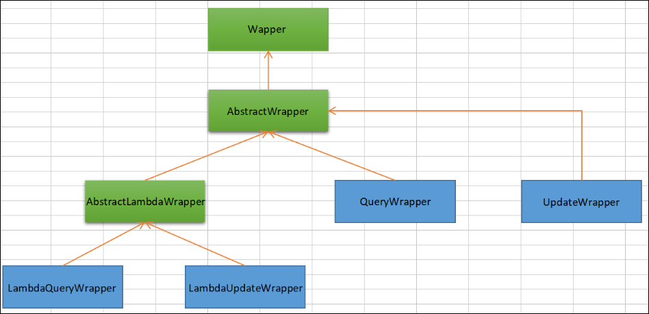

# 一、MyBatis-Plus概述

## 一、简介

- [MyBatis-Plus (opens new window)](https://github.com/baomidou/mybatis-plus)（简称 MP）是一个[MyBatis (opens new window)](https://www.mybatis.org/mybatis-3/)的增强工具，在MyBatis的基础上只做增强不做改变，为简化开发、提高效率而生

## 二、特性

- **无侵入**：只做增强不做改变，引入它不会对现有工程产生影响，如丝般顺滑
- **损耗小**：启动即会自动注入基本CURD，性能基本无损耗，直接面向对象操作
- **强大的CRUD操作**：内置通用Mapper、通用Service，仅仅通过少量配置即可实现单表大部分CRUD 操作，更有强大的条件构造器，满足各类使用需求
- **支持Lambda形式调用**：通过Lambda表达式，方便的编写各类查询条件，无需再担心字段写错
- **支持主键自动生成**：支持多达4种主键策略（内含分布式唯一ID生成器 - Sequence），可自由配置，完美解决主键问题
- **支持ActiveRecord模式**：支持ActiveRecord形式调用，实体类只需继承Model类即可进行强大的CRUD操作
- **支持自定义全局通用操作**：支持全局通用方法注入（ Write once, use anywhere ）
- **内置代码生成器**：采用代码或者Maven插件可快速生成Mapper、Model、Service、 Controller层代码，支持模板引擎，更有超多自定义配置等您来使用
- **内置分页插件**：基于MyBatis物理分页，开发者无需关心具体操作，配置好插件之后，写分页等同于普通List查询
- **分页插件支持多种数据库**：支持MySQL、MariaDB、Oracle、DB2、H2、HSQL、SQLite、Postgre、SQLServer等多种数据库
- **内置性能分析插件**：可输出SQL语句以及其执行时间，建议开发测试时启用该功能，能快速揪出慢查询
- **内置全局拦截插件**：提供全表delete 、 update操作智能分析阻断，也可自定义拦截规则，预防误操作

## 三、支持数据库

- MySQL，Oracle，DB2，H2，HSQL，SQLite，PostgreSQL，SQLServer，Phoenix，Gauss ，ClickHouse，Sybase，OceanBase，Firebird，Cubrid，Goldilocks，csiidb
- 达梦数据库，虚谷数据库，人大金仓数据库，南大通用(华库)数据库，南大通用数据库，神通数据库，瀚高数据库

## 四、框架结构


## 五、官网

- [官方网站](https://baomidou.com/)
- [官方文档](https://baomidou.com/pages/24112f/)

# 二、入门案例

## 一、创建工程

1. 使用`Spring Initializer`快速初始化一个Spring Boot工程

   - 如若新版IDEA版本太新导致Java版本选择不了旧版本。就替换下载数据源：可以将https://start.spring.io/ 替换成 https://start.aliyun.com/阿里云的下载地址 

   

   

   

   

2. 引入`MyBatis-Plus`的依赖

   ```xml
   <dependency>
       <groupId>com.baomidou</groupId>
       <artifactId>mybatis-plus-boot-starter</artifactId>
       <version>3.5.1</version>
   </dependency>
   ```

3. 安装`Lombok`插件

   

## 二、配置编码

1. 配置`application.yml`文件

   ```yml
   #配置端口
   server:
     port: 80
   
   spring:
     #配置数据源
     datasource:
       #配置数据源类型
       type: com.zaxxer.hikari.HikariDataSource
       #配置连接数据库的信息
       driver-class-name: com.mysql.cj.jdbc.Driver
       url: jdbc:mysql://localhost:3306/mybatis_plus?characterEncoding=utf-8&useSSL=false
       username: {username}
       password: {password}
   
   #MyBatis-Plus相关配置
   mybatis-plus:
     configuration:
       #配置日志
       log-impl: org.apache.ibatis.logging.stdout.StdOutImpl
   ```

2. 在Spring Boot启动类中添加 `@MapperScan` 注解，扫描Mapper文件夹

   ```java
   @SpringBootApplication
   @MapperScan("指定Mapper接口所在的包")
   public class MybatisPlusDemoApplication {
   	public static void main(String[] args) {
   		SpringApplication.run(MybatisPlusDemoApplication.class, args);
   	}
   }
   ```

3. 编写实体类 `User.java`

   ```java
   @Data
   public class User {
       private Long id;
       private String name;
       private Integer age;
       private String email;
   }
   ```

4. 编写Mapper包下的 `UserMapper`接口

   ```java
   public interface UserMapper extends BaseMapper<User> {}
   ```

# 三、CRUD

## 一、BaseMapper&lt;T>

- 通用CRUD封装BaseMapper接口，为 `Mybatis-Plus` 启动时自动解析实体表关系映射转换为`Mybatis` 内部对象注入容器
- 泛型 `T` 为任意实体对象
- 参数 `Serializable` 为任意类型主键 `Mybatis-Plus` 不推荐使用复合主键约定每一张表都有自己的唯一 `id` 主键
- 对象 `Wrapper` 为条件构造器
- MyBatis-Plus中的基本CRUD在内置的BaseMapper中都已得到了实现，因此我们继承该接口以后可以直接使用

## 二、BaseMapper中提供的CRUD方法

1. 增加：Insert

   ```java
   // 插入一条记录
   int insert(T entity);
   ```

2. 删除：Delete

   ```java
   // 根据 entity 条件，删除记录
   int delete(@Param(Constants.WRAPPER) Wrapper<T> wrapper);
   // 删除（根据ID 批量删除）
   int deleteBatchIds(@Param(Constants.COLLECTION) Collection<? extends Serializable> idList);
   // 根据 ID 删除
   int deleteById(Serializable id);
   // 根据 columnMap 条件，删除记录
   int deleteByMap(@Param(Constants.COLUMN_MAP) Map<String, Object> columnMap);
   ```

3. 修改：Update

   ```java
   // 根据 whereWrapper 条件，更新记录
   int update(@Param(Constants.ENTITY) T updateEntity, @Param(Constants.WRAPPER) Wrapper<T> whereWrapper);
   // 根据 ID 修改
   int updateById(@Param(Constants.ENTITY) T entity);
   ```

4. 查询：Select

   ```java
   // 根据 ID 查询
   T selectById(Serializable id);
   // 根据 entity 条件，查询一条记录
   T selectOne(@Param(Constants.WRAPPER) Wrapper<T> queryWrapper);
   
   // 查询（根据ID 批量查询）
   List<T> selectBatchIds(@Param(Constants.COLLECTION) Collection<? extends Serializable> idList);
   // 根据 entity 条件，查询全部记录
   List<T> selectList(@Param(Constants.WRAPPER) Wrapper<T> queryWrapper);
   // 查询（根据 columnMap 条件）
   List<T> selectByMap(@Param(Constants.COLUMN_MAP) Map<String, Object> columnMap);
   // 根据 Wrapper 条件，查询全部记录
   List<Map<String, Object>> selectMaps(@Param(Constants.WRAPPER) Wrapper<T> queryWrapper);
   // 根据 Wrapper 条件，查询全部记录。注意： 只返回第一个字段的值
   List<Object> selectObjs(@Param(Constants.WRAPPER) Wrapper<T> queryWrapper);
   
   // 根据 entity 条件，查询全部记录（并翻页）
   IPage<T> selectPage(IPage<T> page, @Param(Constants.WRAPPER) Wrapper<T> queryWrapper);
   // 根据 Wrapper 条件，查询全部记录（并翻页）
   IPage<Map<String, Object>> selectMapsPage(IPage<T> page, @Param(Constants.WRAPPER) Wrapper<T> queryWrapper);
   // 根据 Wrapper 条件，查询总记录数
   Integer selectCount(@Param(Constants.WRAPPER) Wrapper<T> queryWrapper);
   ```

## 三、调用Mapper层实现CRUD

1. 插入：最终执行的结果为Mybatis-plus自动生成的主键。这是因为MyBatis-Plus在实现插入数据时，会默认基于雪花算法的策略生成id

   ```java
   @Test
   public void testInsert(){
       User user = new User();
       user.setName("Vz");
       user.setAge(21);
       user.setEmail("vz@oz6.cn");
       int result = userMapper.insert(user);
       System.out.println(result > 0 ? "添加成功！" : "添加失败！");
       System.out.println("受影响的行数为：" + result);
       //1527206783590903810（当前 id 为雪花算法自动生成的id）
       System.out.println("id自动获取" + user.getId());
   }
   ```

2. 删除

   ```java
   
   // 删除一条数据
   // int deleteById(Serializable id)
   @Test
   public void testDeleteById(){
       int result = userMapper.deleteById(1527206783590903810L);
       System.out.println(result > 0 ? "删除成功！" : "删除失败！");
       System.out.println("受影响的行数为：" + result);
   }
   
   // 根据ID批量删除数据
   // int deleteBatchIds(@Param(Constants.COLLECTION) Collection<? extends Serializable> idList);
   @Test
   public void testDeleteBatchIds(){
       List<Long> ids = Arrays.asList(6L,7L,8L);
       int result = userMapper.deleteBatchIds(ids);
       System.out.println(result > 0 ? "删除成功！" : "删除失败！");
       System.out.println("受影响的行数为：" + result);
   }
   
   // 根据Map条件删除数据
   // int deleteByMap(@Param(Constants.COLUMN_MAP) Map<String, Object> columnMap);
   @Test
   public void testDeleteByMap(){
       //当前演示为根据name和age删除数据
       //执行SQL为：DELETE FROM user WHERE name = ? AND age = ?
       Map<String,Object> map = new HashMap<>();
       map.put("name","Vz");
       map.put("age",21);
       int result = userMapper.deleteByMap(map);
       System.out.println(result > 0 ? "删除成功！" : "删除失败！");
       System.out.println("受影响的行数为：" + result);
   }
   ```

3. 修改

   ```java
   // 调用方法：int updateById(@Param(Constants.ENTITY) T entity);
   @Test
   public void testUpdateById(){
       //执行SQL为： UPDATE user SET name=?, age=?, email=? WHERE id=?
       User user = new User();
       user.setId(6L);
       user.setName("VzUpdate");
       user.setAge(18);
       user.setEmail("Vz@sina.com");
       int result = userMapper.updateById(user);
       System.out.println(result > 0 ? "修改成功！" : "修改失败！");
       System.out.println("受影响的行数为：" + result);
   }
   ```

4. 查询

   ```java
   // 根据ID查询用户信息
   // 调用方法：T selectById(Serializable id);
   @Test
   public void testSelectById(){
       User user = userMapper.selectById(1L);
       System.out.println(user);
   }
   
   // 根据多个ID查询多个用户信息
   // 调用方法：List<T> selectBatchIds(@Param(Constants.COLLECTION) Collection<? extends 		Serializable> idList);
   @Test
   public void testSelectBatchIds(){
       //执行SQL为：SELECT id,name,age,email FROM user WHERE id IN ( ? , ? , ? )
       List<Long> ids = Arrays.asList(1L,2L,3L);
       List<User> users = userMapper.selectBatchIds(ids);
       users.forEach(System.out::println);
   }
   
   // 根据Map条件查询用户信息
   // List<T> selectByMap(@Param(Constants.COLUMN_MAP) Map<String, Object> columnMap);
   @Test
   public void testSelectByMap(){
       //执行SQL为：SELECT id,name,age,email FROM user WHERE age = ?
       Map<String,Object> map = new HashMap<>();
       map.put("age",18);
       List<User> users = userMapper.selectByMap(map);
       users.forEach(System.out::println);
   }
   
   // 查询所有用户信息
   // 调用方法：List<T> selectList(@Param(Constants.WRAPPER) Wrapper<T> queryWrapper);
   @Test
   void testSelectList(){
       List<User> users = userMapper.selectList(null);
       users.forEach(System.out::println);
   }
   ```

## 四、通用Service

- 通用Service CRUD封装`IService`接口，进一步封装CRUD采用 `get 查询单行` `remove 删除` `list 查询集合` `page 分页` 前缀命名方式区分 `Mapper` 层避免混淆
- 泛型 `T` 为任意实体对象
- 建议如果存在自定义通用Service方法的可能，请创建自己的 `IBaseService` 继承 `Mybatis-Plus` 提供的基类
- 对象 `Wrapper` 为 条件构造器
- MyBatis-Plus中有一个接口 **`IService`**和其实现类 **`ServiceImpl`**，封装了常见的业务层逻辑
- 因此我们在使用的时候仅需在自己定义的**`Service`**接口中继承**`IService`**接口，在自己的实现类中实现自己的Service并继承**`ServiceImpl`**即可

## 五、调用Iservic中的CRUD方法

1. 增加：Save、SaveOrUpdate

   ```java
   // 插入一条记录（选择字段，策略插入）
   boolean save(T entity);
   // 插入（批量）
   boolean saveBatch(Collection<T> entityList);
   // 插入（批量）
   boolean saveBatch(Collection<T> entityList, int batchSize);
   
   // TableId 注解存在更新记录，否则插入一条记录
   boolean saveOrUpdate(T entity);
   // 根据updateWrapper尝试更新，否则继续执行saveOrUpdate(T)方法进行插入操作
   boolean saveOrUpdate(T entity, Wrapper<T> updateWrapper);
   // 批量修改插入
   boolean saveOrUpdateBatch(Collection<T> entityList);
   // 批量修改插入
   boolean saveOrUpdateBatch(Collection<T> entityList, int batchSize);
   ```

2. 删除：Remove

   ```java
   // 根据 entity 条件，删除记录
   boolean remove(Wrapper<T> queryWrapper);
   // 根据 ID 删除
   boolean removeById(Serializable id);
   // 根据 columnMap 条件，删除记录
   boolean removeByMap(Map<String, Object> columnMap);
   // 删除（根据ID 批量删除）
   boolean removeByIds(Collection<? extends Serializable> idList);
   ```

3. 修改：Update

   ```java
   // 根据 UpdateWrapper 条件，更新记录 需要设置sqlset
   boolean update(Wrapper<T> updateWrapper);
   // 根据 whereWrapper 条件，更新记录
   boolean update(T updateEntity, Wrapper<T> whereWrapper);
   // 根据 ID 选择修改
   boolean updateById(T entity);
   // 根据ID 批量更新
   boolean updateBatchById(Collection<T> entityList);
   // 根据ID 批量更新
   boolean updateBatchById(Collection<T> entityList, int batchSize);
   ```

4. 查询：Get、List、Count

   ```java
   // 根据 ID 查询
   T getById(Serializable id);
   // 根据 Wrapper，查询一条记录。结果集，如果是多个会抛出异常，随机取一条加上限制条件 wrapper.last("LIMIT 1")
   T getOne(Wrapper<T> queryWrapper);
   // 根据 Wrapper，查询一条记录
   T getOne(Wrapper<T> queryWrapper, boolean throwEx);
   // 根据 Wrapper，查询一条记录
   Map<String, Object> getMap(Wrapper<T> queryWrapper);
   // 根据 Wrapper，查询一条记录
   <V> V getObj(Wrapper<T> queryWrapper, Function<? super Object, V> mapper);
   
   
   // 查询所有
   List<T> list();
   // 查询列表
   List<T> list(Wrapper<T> queryWrapper);
   // 查询（根据ID 批量查询）
   Collection<T> listByIds(Collection<? extends Serializable> idList);
   // 查询（根据 columnMap 条件）
   Collection<T> listByMap(Map<String, Object> columnMap);
   // 查询所有列表
   List<Map<String, Object>> listMaps();
   // 查询列表
   List<Map<String, Object>> listMaps(Wrapper<T> queryWrapper);
   // 查询全部记录
   List<Object> listObjs();
   // 查询全部记录
   <V> List<V> listObjs(Function<? super Object, V> mapper);
   // 根据 Wrapper 条件，查询全部记录
   List<Object> listObjs(Wrapper<T> queryWrapper);
   // 根据 Wrapper 条件，查询全部记录
   <V> List<V> listObjs(Wrapper<T> queryWrapper, Function<? super Object, V> mapper);
   
   // 查询总记录数
   int count();
   // 根据 Wrapper 条件，查询总记录数
   int count(Wrapper<T> queryWrapper);
   ```

5. 分页：Page

   ```java
   // 根据 ID 查询
   T getById(Serializable id);
   // 根据Wrapper查询一条记录。结果集，如果是多个会抛出异常，随机取一条加上限制条件wrapper.last("LIMIT 1")
   T getOne(Wrapper<T> queryWrapper);
   // 根据 Wrapper，查询一条记录
   T getOne(Wrapper<T> queryWrapper, boolean throwEx);
   // 根据 Wrapper，查询一条记录
   Map<String, Object> getMap(Wrapper<T> queryWrapper);
   // 根据 Wrapper，查询一条记录
   <V> V getObj(Wrapper<T> queryWrapper, Function<? super Object, V> mapper);
   ```

## 六、调用Service层操作数据

- 我们在自己的Service接口中通过继承MyBatis-Plus提供的IService接口，不仅可以获得其提供的CRUD方法，而且还可以使用自身定义的方法

- 创建`UserService`并继承`IService`

  ```java
  /**
    * UserService继承IService模板提供的基础功能 
    */
  public interface UserService extends IService<User> {}
  ```

- 创建`UserService`的实现类并继承`ServiceImpl`

  ```java
  /**
    * ServiceImpl实现了IService，提供了IService中基础功能的实现 
    * 若ServiceImpl无法满足业务需求，则可以使用自定的UserService定义方法，并在实现类中实现
    */
  @Service
  public class UserServiceImpl extends ServiceImpl<UserMapper,User> implements UserService{}
  ```

- 测试查询记录数：int count();

  ```
  @Test
  public void testGetCount(){
      //查询总记录数
      //执行的SQL为：SELECT COUNT( * ) FROM user
      long count = userService.count();
      System.out.println("总记录数：" + count);
  }
  ```

- 测试批量插入数据：boolean saveBatch(Collection<T> entityList);

  ```java
  @Test
  public void test(){
      List<User> list = new ArrayList<>();
      for (int i = 1; i <= 10; i++) {
          User user = new User();
          user.setName("Vz"+i);
          user.setAge(20+i);
          list.add(user);
      }
      boolean b = userService.saveBatch(list);
      System.out.println(b ? "添加成功！" : "添加失败！");
  }
  ```

# 四、常用注解

## 一、@TableName

1. 在使用MyBatis-Plus实现基本的CRUD时，我们并没有指定要操作的表，只是在Mapper接口继承BaseMapper时，若设置了泛型User，而操作的表为user表，由此得出结论，MyBatis-Plus在确定操作的表时，由BaseMapper的泛型决定，即实体类型决定，且默认操作的表名和实体类型的类名一致（实体类是驼峰式命名，数据库表是下划线式命名也可对应）

2. 如若表名和实体名称不一致则会抛出异常Table 'mybatis_plus.user' doesn't exist

3. 解决表名和实体名称不一样的问题

   - 使用注解解决问题：在实体类类型上添加`@TableName("表名")`，标识实体类对应的表，即可成功执行SQL语句

     ```java
     @Data
     @TableName("t_user")
     public class User {
         private Long id;
         private String name;
         private Integer age;
         private String email;
     }
     ```

   - 使用全局配置解决问题：在开发的过程中，我们经常遇到以上的问题，即实体类所对应的表都有固定的前缀，例如 `t_` 或 `tbl_` 此时，可以使用MyBatis-Plus提供的全局配置，为实体类所对应的表名设置默认的前缀，那么就不需要在每个实体类上通过@TableName标识实体类对应的表

     ```yaml
     mybatis-plus:
       global-config:
         db-config:
           # 设置实体类所对应的表的统一前缀
           table-prefix: t_
     ```

## 二、@TableId

1. MyBatis-Plus在实现CRUD时，会默认将id作为主键列，并在插入数据时，默认基于雪花算法的策略生成id

2. 若主键id不是属性id则会抛出异常`Field '属性' doesn't have a default value`

3. 解决问题：在实体类中uid属性上通过`@TableId`将其标识为主键，即可成功执行SQL语句

   ```java
   @Date
   public class User {
       @TableId
       private Long uid;
       private String name;
       private Integer age;
       private String email;
   }
   ```

4. @TableId的value属性：若实体类中主键对应的属性为id，而表中表示主键的字段为uid，此时若只在属性id上添加注解@TableId，则抛出异常**Unknown column 'id' in 'field list'**，即MyBatis-Plus仍然会将id作为表的主键操作，而表中表示主键的是字段uid此时需要通过@TableId注解的value属性，指定表中的主键字段，`@TableId("uid")`或`@TableId(value="uid")`

5. @TableId的type属性

   - type属性用来定义主键策略：默认雪花算法

   - 常用的主键策略

     |            值            |                            描述                            |
     | :----------------------: | :--------------------------------------------------------: |
     | IdType.ASSIGN_ID（默认） |  基于雪花算法的策略生成数据id，与数据库id是否设置自增无关  |
     |       IdType.AUTO        | 使用数据库的自增策略，注意，该类型请确保数据库设置了id自增 |

   - 配置全局主键策略

     ```yaml
     #MyBatis-Plus相关配置
     mybatis-plus:
       configuration:
         #配置日志
         log-impl: org.apache.ibatis.logging.stdout.StdOutImpl
       global-config:
         db-config:
           #配置mp的主键策略为自增
           id-type: auto
           # 设置实体类所对应的表的统一前缀
           table-prefix: t_
     ```

## 三、@TbaleField

- MyBatis-Plus在执行SQL语句时，要保证实体类中的属性名和表中的字段名一致

  - 若实体类中的属性使用的是驼峰命名风格，而表中的字段使用的是下划线命名风格。此时MyBatis-Plus会自动将下划线命名风格转化为驼峰命名风格

  - 若实体类中的属性和表中的字段不满足驼峰式和下划线式命名，则需要在实体类属性上使用`@TableField("数据库字段名")`设置属性所对应的字段名

    ```java
    public class User {
        @TableId("uid")
        private Long id;
        @TableField("username")
        private String name;
        private Integer age;
        private String email;
    }
    ```

## 四、@TableLogic

1. 逻辑删除概述

   - 物理删除：真实删除，将对应数据从数据库中删除，之后查询不到此条被删除的数据
   - 逻辑删除：假删除，将对应数据中代表是否被删除字段的状态修改为“被删除状态”，之后在数据库中仍旧能看到此条数据记录
   - 使用场景：可以进行数据恢复

2. 实现逻辑删除

   - 数据库中创建逻辑删除状态列，设置默认值为0

   - 实体类中添加逻辑删除属性

     ```java
     @TableLogic
     private int isDeleted;
     ```

   - 执行删除功能代码，真正执行的是修改代码

     ```java
     public void testDeleteById(){
         int result = userMapper.deleteById(id数值);
         System.out.println(result > 0 ? "删除成功！" : "删除失败！");
         System.out.println("受影响的行数为：" + result);
     }
     ```

# 五、条件构造器

## 一、Wrapper介绍



- `Wrapper` ： 条件构造抽象类，最顶端父类

  - `AbstractWrapper `：用于查询条件封装，生成sql的where条件
    - `QueryWrapper `：查询条件封装

    - `UpdateWrapper `：Update条件封装

    - `AbstractLambdaWrapper `：使用Lambda 语法
      - `LambdaQueryWrapper `：用于Lambda语法使用的查询Wrapper
      - `LambdaUpdateWrapper `：Lambda 更新封装Wrapper

## 二、QueryWrapper

1. 组装查询条件

   ```java
   public void test01(){
       //查询用户名包含a，年龄在20到30之间，邮箱信息不为null的用户信息
       QueryWrapper<User> queryWrapper = new QueryWrapper<>();
       queryWrapper.like("username","a").between("age",20,30).isNotNull("email");
       List<User> users = userMapper.selectList(queryWrapper);
       users.forEach(System.out::println);
   }
   ```

2. 组装排序条件

   ```java
   public void test02(){
       //查询用户信息，按照年龄的降序排序，若年龄相同，则按照id升序排序
       QueryWrapper<User> queryWrapper = new QueryWrapper<>();
       queryWrapper.orderByDesc("age").orderByAsc("id");
       List<User> users = userMapper.selectList(queryWrapper);
       users.forEach(System.out::println);
   }
   ```

3. 组装删除条件

   ```java
   public void test03(){
       //删除邮箱地址为null的用户信息
       QueryWrapper<User> queryWrapper = new QueryWrapper<>();
       queryWrapper.isNull("email");
       int result = userMapper.delete(queryWrapper);
       System.out.println(result > 0 ? "删除成功！" : "删除失败！");
       System.out.println("受影响的行数为：" + result);
   }
   ```

4. 条件的优先级

   ```java
   // 括号的优先级最高
   // and的优先级高于or
   public void test04(){
       //将（年龄大于20并且用户名中包含有a）或邮箱为null的用户信息修改
       UpdateWrapper<User> updateWrapper = new UpdateWrapper<>();
       updateWrapper.gt("age",20).like("username","a").or().isNull("email");
       User user = new User();
       user.setName("Oz");
       user.setEmail("test@oz6.com");
   
       int result = userMapper.update(user, updateWrapper);
       System.out.println(result > 0 ? "修改成功！" : "修改失败！");
       System.out.println("受影响的行数为：" + result);
   }
   
   public void test05(){
       //将用户名中包含有a并且（年龄大于20或邮箱为null）的用户信息修改
       UpdateWrapper<User> updateWrapper = new UpdateWrapper<>();
       // 通过username筛选完成后，再通过其他条件筛选
       updateWrapper.like("username","a").and(i->i.gt("age",20).or().isNull("email"));
       User user = new User();
       user.setName("Vz7797");
       user.setEmail("test@ss8o.com");
   
       int result = userMapper.update(user, updateWrapper);
       System.out.println(result > 0 ? "修改成功！" : "修改失败！");
       System.out.println("受影响的行数为：" + result);
   }
   ```

5. 组装select子句

   ```java
   public void test06(){
       //查询用户的用户名、年龄、邮箱信息
       QueryWrapper<User> queryWrapper = new QueryWrapper<>();
       queryWrapper.select("username","age","email");
       List<Map<String, Object>> maps = userMapper.selectMaps(queryWrapper);
       maps.forEach(System.out::println);
   }
   ```

6. 实现子查询

   ```java
   public void test07(){
       //查询id小于等于100的用户信息
       QueryWrapper<User> queryWrapper = new QueryWrapper<>();
       queryWrapper.inSql("uid", "select uid from t_user where uid <= 100");
       List<User> list = userMapper.selectList(queryWrapper);
       list.forEach(System.out::println);
   }
   ```

7. 实现复杂SQL语句，还是使用Mybatis的方法，直接在xml中使用即可

## 三、UpdateWrapper

- UpdateWrapper不仅拥有QueryWrapper的组装条件功能，还提供了set方法进行修改对应条件的数据库信息

  ```java
  public void test08(){
      //将用户名中包含有a并且（年龄大于20或邮箱为null）的用户信息修改
      UpdateWrapper<User> updateWrapper = new UpdateWrapper<>();
      updateWrapper.like("username","a").and( i ->      i.gt("age",20).or().isNull("email")).set("email","svip@qq.com");
      int result = userMapper.update(null, updateWrapper);
      System.out.println(result > 0 ? "修改成功！" : "修改失败！");
      System.out.println("受影响的行数为：" + result);
  }
  ```

## 四、condition

1. 在真正开发的过程中，组装条件是常见的功能，而这些条件数据来源于用户输入，是可选的，因此我们在组装这些条件时，必须先判断用户是否选择了这些条件，若选择则需要组装该条件，若没有选择则一定不能组装，以免影响SQL执行的结果

2. 方法一：low🖊写法

   ```java
   public void test09(){
        String username = "a";
        Integer ageBegin = null;
        Integer ageEnd = 30;
        QueryWrapper<User> queryWrapper = new QueryWrapper<>();
        if(StringUtils.isNotBlank(username)){
            //isNotBlank判断某个字符创是否不为空字符串、不为null、不为空白符
            queryWrapper.like("user_name", username);
        }
        if(ageBegin != null){
            queryWrapper.ge("age", ageBegin);
        }
        if(ageEnd != null){
            queryWrapper.le("age", ageEnd);
        }
        List<User> list = userMapper.selectList(queryWrapper);
        list.forEach(System.out::println);
    }
   ```

3. 方法二：华丽写法

   ```java
   public void test10(){
       String username = "a";
       Integer ageBegin = null;
       Integer ageEnd = 30;
       QueryWrapper<User> queryWrapper = new QueryWrapper<>();
       queryWrapper.like(StringUtils.isNotBlank(username), "user_name", username)
           .ge(ageBegin != null, "age", ageBegin)
           .le(ageEnd != null, "age", ageEnd);
       List<User> list = userMapper.selectList(queryWrapper);
       list.forEach(System.out::println);
   }
   ```

## 五、LambdaQueryWrapper

- 功能等同于QueryWrapper，提供了Lambda表达式的语法可以避免填错列名

  ```java
  public void test11(){
      String username = "a";
      Integer ageBegin = null;
      Integer ageEnd = 30;
      LambdaQueryWrapper<User> queryWrapper = new LambdaQueryWrapper<>();
      queryWrapper.like(StringUtils.isNotBlank(username), User::getName, username)
          .ge(ageBegin != null, User::getAge, ageBegin)
          .le(ageEnd != null, User::getAge, ageEnd);
      List<User> list = userMapper.selectList(queryWrapper);
      list.forEach(System.out::println);
  }
  ```

## 六、LambdaUpdateWrapper

- 功能等同于UpdateWrapper，提供了Lambda表达式的语法可以避免填错列名

  ```java
  public void test12(){
      //将用户名中包含有a并且（年龄大于20或邮箱为null）的用户信息修改
      LambdaUpdateWrapper<User> updateWrapper = new LambdaUpdateWrapper<>();
      updateWrapper.like(User::getName, "a")
          .and(i -> i.gt(User::getAge, 20).or().isNull(User::getEmail));
      updateWrapper.set(User::getName, "小黑").set(User::getEmail,"abc@atguigu.com");
      int result = userMapper.update(null, updateWrapper);
      System.out.println("result："+result);
  }
  ```

# 六、常用插件

