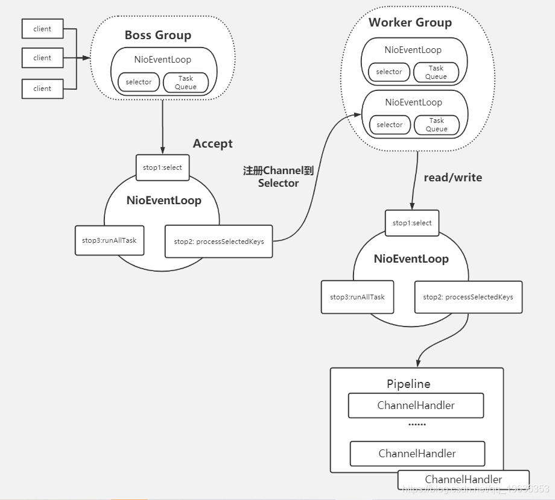
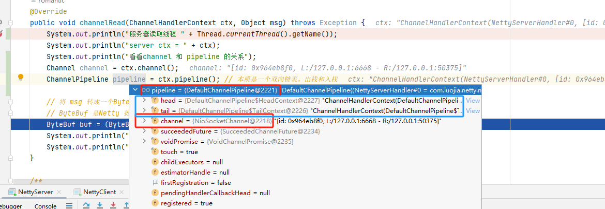
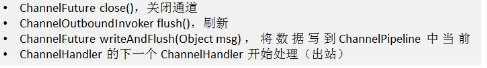
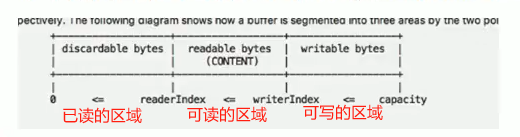

# 一、Netty介绍

## 一、Netty概述

1. Netty是由JBOSS提供的一个Java开源框架，现为Github上的独立项目
2. Netty是一个异步的、基于事件驱动的网络应用框架，用以快速开发高性能、高可
   靠性的网络lO程序
3. Netty主要针对在TCP协议下，面向Clients端的高并发应用，或者Peer-to-Peer场景下的大量数据持续传输的应用
4. Netty本质是一个NIO框架，适用于服务器通讯相关的多种应用场景

## 二、Netty的应用场景

1. 互联网行业：在分布式系统中，各个节点之间需要远程服名调用，高性能的RPC框架必不可少，Netty作为**异步高性能的通信框架**，往往作为基础通信组件被这些RPC框架使用。如阿里分布式服务框架Dubbo的RPC框架使用Dubbo协议进行节点间通信，Dubbo协议默认使用Netty作为基础通信组件，用于实现各进程节点之间的内部通信
2. 游戏行业：无论是手游服务端还是大型的网络游戏Java语言得到了越来越广泛的应用。Netty 作为高性能的基础通信组件，提供了TCP/UDP和HTTP协议栈，方便定制和开发私有协议栈，账号登录服务器。地图服务器之间可以方便的通过Netty进行高性能的通信
3. 大数据领域：经典的Hadoop的高性能通信和序列化组件（AVRO实现数据文件共享）的RPC框架，默认采用Netty进行跨界点通信，它的Netty Service基于Netty框架二次封装实现

## 三、IO模型基本说明

1.  I/O模型简单的理解：就是用什么样的通道进行数据的发送和接收，很大程度上决定了程序通信的性能
2. Java共支持3种网络编程模型IO模式：BIO、NIO、AIO
3.  Java BIO：同步并阻塞（**传统阻塞型**）， 服务器实现模式为一个连接一个线程，即客户端有连接请求时服务器端就需要启动一个线程进行处理，如果这个连接不做任何事情会造成不必要的线程开销
4. Java NIO：**同步非阻塞**，服务器实现模式为一个线程处理多个请求/连接，即客户端发送的连接请求都会注册到多路复用器上，多路复用器轮询到连接有I/O请求就进行处理
5. Java AIO（NIO.2）：**异步非阻塞**，AIO引入异步通道的概念，采用了Proactor模式， 简化了程序编写，有效的请求才启动线程，它的特点是先由操作系统完成后才通知服务端程序启动线程去处理，一般适用于连接数较多且连接时间较长的应用

## 四、BIO、NIO、AIO适用场景分析

1. BIO方式适用于连接数目比较小且固定的架构，这种方式对服务器资源要求比较高，并发局限于应用中，JDK1 .4以前的唯一选择，但程序简单易理解
2.  NIO方式适用于连接数目多且连接比较短（轻操作）的架构，比如聊天服务器，弹幕系统，服务器间通讯等。编程比较复杂，JDK1.4开始支持
3. AIO方式使用于连接数目多且连接比较长（重操作）的架构，比如相册服务器，充分调用OS参与并发操作，编程比较复杂，JDK7开始支持

# 二、Java BIO基本介绍

## 一、Java BIO概述

1. Java BIO就是传统的java io编程，其相关的类和接口在java.io
2. BIO（blocking I/O）：**同步阻塞**，服务器实现模式为一个连接一个线程， 即客户端有连接请求时服务器端就需要启动一个线程进行处理，如果这个连接不做任何事倩会造成不必要的线程开销，可以通过线程池机制改善（实现多个客户连接服务器）
3. BIO方式适用于连接数目比较小且固定的架构，这种方式对服务器资源要求比较高，
   并发局限于应用中，JDK1.4以前的唯一选择， 程序简单易理解

## 二、Java BIO问题分析

1. 每个请求都需要创建独立的线程，与对应的客户端进行数据Read+业务处理，数据Write
2. 当并发数较大时，需要创建大量线程来处理连接，系统资源占用较大
3. 连接建立后，如果当前线程暂时没有数据可读，则线程就阻塞在Read操作上，造成线程资源浪费

## 三、BIO应用实例

1. 使用BIO模型编写一个服务器端。监听6666端口，当有客户端连接时，就启动一个线程与之通讯

2. 要求使用线程池机制改善，可以连接多个客户端

3. 服务器端可以接收客户端发送的效据（telnet方式即可，启动服务端，通过telnet方式，连接服务IP和断后，输入Ctrl+]，Send+需要发送的内容，就能发消息被服务端监听到）

   ```java
   package com.luojia.netty.nettypro.bio;
   
   import java.io.IOException;
   import java.io.InputStream;
   import java.net.ServerSocket;
   import java.net.Socket;
   import java.util.concurrent.ExecutorService;
   import java.util.concurrent.Executors;
   
   public class BIOServer {
       public static void main(String[] args) throws IOException {
           // 创建一个线程池
           ExecutorService newCachedThreadPool = Executors.newCachedThreadPool();
           // 创建 serverSocket
           ServerSocket serverSocket = new ServerSocket(6666);
           System.out.println("服务器启动了");
   
           while (true) {
               System.out.println("等待连接");
               // 监听，等待客户端连接, BIO,一直阻塞在等待连接部分
               Socket accept = serverSocket.accept();
               System.out.println("连接到一个客户端");
               newCachedThreadPool.execute(new Runnable() {
                   @Override
                   public void run() {
                       handler(accept);
                   }
               });
           }
       }
   
       // 编写一个handler和客户端通信
       public static void handler(Socket socket) {
           System.out.println("线程信息 ID = " + Thread.currentThread().getId() +
                   "线程名字 = " + Thread.currentThread().getName());
           byte[] bytes = new byte[1024];
           try (InputStream inputStream = socket.getInputStream()) {
               // 循环读取客户端发送的请求
               while (true) {
                   System.out.println("等待读取...");
                   int read = inputStream.read(bytes);
                   if (read != -1) {
                       // 输出客户端发送的数据
                       System.out.println(new String(bytes, 0, read));
                   } else {
                       break;
                   }
               }
           } catch (IOException e) {
               throw new RuntimeException(e);
           }
       }
   }
   ```

# 三、Java NIO基本介绍

## 一、Java NIO概述

1. Java Nl0全称 java non-blocking lO，是指JDK提供的新API。从JDK1.4开始，Java提供了一系列改进的输入/输出的新特性，被统称为NIO（即NewIO），是同步非阻塞的
2. NIO相关类都被放在java.nio包及子包下，并且对原java.io包中的很多类进行改写
3. NIO有三大核心部分：Channel即通道，Buffer即缓冲区，Selector即选择器
4. NIO是面向缓冲区，或者面向块编程的。数据读取到一个它稍后处理的缓冲区，需要时可在缓冲区中前后移动，这就增加了处理过程中的灵活性，使用它可以提供非阻塞式的高伸缩性网络
5. Java NIO的非阻塞模式，使一个线程从某通道发送请求或者读取数据，但是它仅能得到目前可用的数据，如果目前没有数据可用时，就什么都不会获取，而**不是保持线程阻塞**，所以直至数据变的可以读取之前，该线程可以继续做其他的事情。非阻塞写也是如此，一个线程请求写入一些数据到某通道，但不需要等待它完全写入，这个线程同时可以去做别的事情
6. 通俗理解为NIO是可以做到用一个线程来处理多个操作的。假设有10000个请求过来根据实际情况，可以分配50或者100个线程来处理。不像之前的阻塞IO那样，非得分配10000
7. HTTP2.0使用了多路复用的技术，做到同一个连接并发处理多个请求，而且并发请求的数量比HTTP1.1大了好几个数量级

## 二、NIO和BIO的比较

1. BI0以流的方式处理数据，而NIO以块的方式处理数据，块I/O的效率比流I/O高很多
2. BIO是阻塞的，NIO则是非阻塞的
3. BIO基于字节流和字符流进行操作，而NI0基于Channel（通道）和Buffer（缓冲区）进行操作，数据总是从通道读取到缓冲区中，或者从缓冲区写入到通道中。Selector（选择器）用于监听多个通道的事件（比如：连接请求，数据到达等），因此使用**单个线程就可以监听多个客户端通道**

## 三、selector、channel、buffer关系说明


1. 每个channel都会对应一个Buffer
2. 一个Selector对应一个线程，一个Selector对应多个channel/连接
3. 程序切换到哪个channel是由事件决定的，Event就是一个重要的概念
4. Selector会根据不同的事件，在各个通道上切换
5. 数据的读取写入是通过Buffer，这个和BIO有区别，BIO中要么是输入流，或者是输出流，不能双向，但是NIO的Buffer是可以读也可以写，需要fip方法切换
6. channel是双向的，可以返回底层操作系统的情况，比如Linux，底层的操作系统通道就是双向的

## 四、Buffer缓冲区

1. Buffer缓冲区：缓冲区本质上是一个可以读写数据的内存块，可以理解成是一个容器对象（含数组），该对象提供了一组方法，可以更轻松地使用内存块，缓冲区对象内置了一些机制，能够跟踪和记录缓冲区的状态变化情况。Channel提供从文件、网络读取数据的渠道，但是读取或写入的数据都必须经由Buffer，如图：

   

2. Bufter类定义了所有的缓冲区都具有的四个属性来提供关于其所包含的数据元素的信息

   ```java
   // Invariants: mark <= position <= limit <= capacity
   // 标记
   private int mark = -1;
   // 位置，下一个要被读或写的元素的索引，每次读写缓冲区数据时都会改变该值，为下次读写做准备
   private int position = 0;
   // 表示缓冲区的当前终点，不能对缓冲区超过极限的位置进行读写操作。且极限是可以修改的
   private int limit;
   // 容量，即可以容纳的最大数源量，在缓冲区创建时被设定并且不能改变
   private int capacity;
   ```

## 五、Channel通道

1. NIO的通道类似于流，但有些区别如下：
   - 通道可以同时进行读写，而流只能读或者只能写
   - 通道可以实现异步读写数据
   - 通道可以从缓冲读数据，也可以写数据到缓冲
2. BIO中的stream是单向的，例如FilelnputStream对象只能进行读取数据的操作，而NIO中的Channel通道是双向的，可以读操作，也可以写操作
3. Channel在NIO中是一个接口public interface Channel extends Closeable{}
4. 常用的Channel类有：FileChannel、DatagramChanhel、ServerSocketChannel和SocketChannel
5. FileChannel用于文件的数据读写；DatagramChannel用于UDP的数据读写；ServerSocketChannel和SocketChannel用于TCP的数据读写

## 六、关于Buffer和Channel的注意事项和细节

1. ByteBuffer支持类型化的put和get，put放入的是什么数据类型，get就应该使用相应的数据类型来取出，否则可能有BufferUnderflowException异常
2. 可以将一个普通Buffer转成只读Buffer
3. NIO还提供了MappedByteBuffer，可以让文件直接在内存（堆外的内存）中进行修改，而如何同步到文件由NIO来完成
4. 前面的读写操作，都是通过一个Buffer完成的，NIO还支持通过多个Buffer（即Buffer数组）完成读写操作，即Scattering和Gatering

## 七、Selector选择器

1. Selector选择器基本介绍

   - Java的NIO，用非阻塞的IO方式。可以用一个线程，处理多个的客户端连接，就会使用到Selector选择器
   - Selector能够检测多个注册的通道上是否有事件发生（注意：多个Channel以事件的方式可以注册到同一个Selector），如果有事件发生，便获取事件然后针对每个事件进行相应的处理。这样就可以只用一个单线程去管理多个通道，也就是管理多个连接和请求
   - 只有在连接/通道
   - 真正有读写事件发生时，才会进行读写，就大大地减少了系统开销，并且不必为每个连接都创建一个线程，不用去维护多个线程
   - 避免了多线程之间的上下文切换导致的开销

2. Selector选择器特点说明

   - Netty的IO线程NioEventLoop（聚合了Selector选择器，也叫多路复用器），可以同时并发处理成百上千个容户端连接
   - 当线程从某客户端Socket通道进行读写数据时，若没有数据可用时，该线程可以进行其他任务
   - 线程通常将非阻塞IO的空闲时间用于在其他通道上执行I0操作，所以单独的线程可以管理多个输入和输出通道
   - 由于读写操作都是非阻塞的，这就可以充分提升IO线程的运行效率，避免由于频繁IO阻塞导致的线程挂起
   - 一个I/O线程可以并发处理N个客户端连接和读写操作，这从根本上解决了传统同步阻塞I/O一连接一线程模型，架构的性能、弹性伸缩能力和可靠性都得到了极大的提升

3. NIO非阻塞网络编程原理分析图：NIO非阻塞网络编程相关的（Selector、SelectionKey、ServerSocketChannel和SocketChannel）关系梳理

   

   - 当客户端连接时，会通过ServerSocketChannel得到SocketChannel
   - Selector开始监听
   - 将SocketChannel注册到Selector上，调用register(Selector sel, int ops)，一个Selector上可以注册多个SocketChannel
   - 注册后返回一个SelectionKey，会和该Selector关联（集合关系）
   - Selector实例进行监听select方法，返回有事件发生的通道个数
   - 进一步得到各个selectionKey（有事件发生的selectionKey）
   - 再通过SelectionKey反向获取到SocketChannel ，方法为Channel()
   - 通过得到的SocketChannel，完成业务处理

4. NIOServer

   ```java
   package com.luojia.netty.nettypro.nio;
   
   import java.io.IOException;
   import java.net.InetSocketAddress;
   import java.nio.ByteBuffer;
   import java.nio.channels.*;
   import java.util.Iterator;
   import java.util.Set;
   
   public class NIOServer {
       public static void main(String[] args) throws IOException {
           // 创建ServerSocketChannel -> serverSocket
           ServerSocketChannel serverSocketChannel = ServerSocketChannel.open();
           // 得到一个Selector 对象
           Selector selector = Selector.open();
           // 绑定一个端口6666，在服务端监听
           serverSocketChannel.socket().bind(new InetSocketAddress(6666));
           // 设置为非阻塞
           serverSocketChannel.configureBlocking(false);
           // 把 serverSocketChannel 注册到Selector 关心事件为 OP_ACCEPT
           serverSocketChannel.register(selector, SelectionKey.OP_ACCEPT);
   
           // 循环等待客户链接
           while (true) {
               // 非阻塞，立即返回
               // if (selector.selectNow() == 0) {
               // select，阻塞指定时间毫秒，无链接就阻塞指定时间返回
               if (selector.select(1000) == 0) {
                   System.out.println("服务器等待了1秒，无连接");
                   continue;
               }
   
               // 如果返回的 >0，就获取到了selectionKey集合
               // 1.如果返回大于0，表示已经获取到了关注的集合
               // 2.selector.selectedKeys()返回关注时间的集合
               Set<SelectionKey> selectionKeys = selector.selectedKeys();
               // 通过 selectionKeys 反向获取通道
               Iterator<SelectionKey> keyIterator = selectionKeys.iterator();
               while (keyIterator.hasNext()) {
                   SelectionKey key = keyIterator.next();
                   // 根据key，对应的通道发生的事件做相应的处理
                   if (key.isAcceptable()) {
                       // serverSocketChannel的accept()是不阻塞的
                       SocketChannel sockerChannel = serverSocketChannel.accept();
                       sockerChannel.configureBlocking(false);
                       // 将SocketChannel 注册到Selector，关注事件为 OP_READ
                       sockerChannel.register(selector, SelectionKey.OP_READ, ByteBuffer.allocate(1024));
                   }
                   // 发生事件 OP_READ
                   if (key.isReadable()) {
                       // 通过key，反向获取到Channel
                       SocketChannel socketChannel = (SocketChannel)key.channel();
                       // 获取到该Channel关联的Buffer
                       ByteBuffer buffer = (ByteBuffer)key.attachment();
                       socketChannel.read(buffer);
                       System.out.println("form 客户端 " + new String(buffer.array()));
                   }
   
                   // 手动从集合中移动当前的selectionKey，防止迭代器中重复遍历
                   keyIterator.remove();
               }
           }
       }
   }
   ```

5. NIOClient

   ```java
   package com.luojia.netty.nettypro.nio;
   
   import java.io.IOException;
   import java.net.InetSocketAddress;
   import java.nio.ByteBuffer;
   import java.nio.channels.SocketChannel;
   
   public class NIOClient {
       public static void main(String[] args) throws IOException {
           // 得到一个网络通道
           SocketChannel socketChannel = SocketChannel.open();
           // 设置非阻塞
           socketChannel.configureBlocking(false);
           // 绑定服务器ip和端口
           InetSocketAddress inetSocketAddress = new InetSocketAddress("127.0.0.1", 6666);
           // 连接服务器
           if (!socketChannel.connect(inetSocketAddress)) {
               while (!socketChannel.finishConnect()) {
                   System.out.println("暂未连接上服务器，客户端不会阻塞，可以做其他操作");
               }
           }
   
           // 如果链接成功，发送数据
           String str = "连接成功，发送数据";
           // ByteBuffer buffer = ByteBuffer.allocate(1024);
           ByteBuffer buffer = ByteBuffer.wrap(str.getBytes());
           socketChannel.write(buffer);
           // 让客户端停留在此处
           System.in.read();
       }
   }
   ```

## 八、NIO与零拷贝

### 一、零拷贝基本介绍

1. 零拷贝是网络编程的关键，很多性能优化都离不开
2. 在Java程序中，常用的零拷贝有mmap（内存映射）和sendFile

### 二、传统IO数据读写


### 三、mmap优化

- mmap通过内存映射，将文件映射到内核缓冲区，同时，用户空间可以共享内核空间的数据。这样，在进行网络传输时，就可以减少内核空间到用户空间的拷贝次数。如下图

  

### 四、sendFile

- Linux在2.4版本中，做了一些修改，避免了从内核缓冲区拷贝到Socketbuffer的操作，直接拷贝到协议栈，从而再一次减少了数据拷贝。具体如下图和小结：

  

### 五、mmap和sendFile的区别

1. mmap适合小数据量读写，sendFile适合大文件传输

2. mmap需要4次上下文切换，3次数据拷贝；sendFile需要3次上下文切换，最少2次数据拷贝

3. sendFile可以利用DMA方式，减少CPU拷贝，mmap则不能（必须从内核拷贝到Socket缓冲区）

   channel.transferTo(0, channel.size(), socketChannel);该方法就使用到了零拷贝

### 六、代码实现

1. NIOServer

   ```java
   package com.luojia.netty.nettypro.nio.zerocopy;
   
   import java.io.IOException;
   import java.net.InetSocketAddress;
   import java.nio.ByteBuffer;
   import java.nio.channels.ServerSocketChannel;
   import java.nio.channels.SocketChannel;
   
   public class NIOServer {
       public static void main(String[] args) throws IOException {
           InetSocketAddress address = new InetSocketAddress(7001);
           ServerSocketChannel serverSocketChannel = ServerSocketChannel.open();
           serverSocketChannel.socket().bind(address);
   
           // 创建Buffer
           ByteBuffer buffer = ByteBuffer.allocate(4096);
           while (true) {
               SocketChannel socketChannel = serverSocketChannel.accept();
               int readCount = 0;
               while (-1 != readCount) {
                   readCount = socketChannel.read(buffer);
               }
               buffer.rewind(); // 倒带，让数据可以重读
           }
       }
   }
   ```

2. NIOClient

   ```java
   package com.luojia.netty.nettypro.nio.zerocopy;
   
   import java.io.FileInputStream;
   import java.io.IOException;
   import java.net.InetSocketAddress;
   import java.nio.channels.FileChannel;
   import java.nio.channels.SocketChannel;
   
   public class NIOClient {
       public static void main(String[] args) throws IOException {
           SocketChannel socketChannel = SocketChannel.open();
           socketChannel.connect(new InetSocketAddress("127.0.0.1", 7001));
           String fileName = "F:\\nginx-1.23.4.zip";
           FileChannel channel = new FileInputStream(fileName).getChannel();
           
           // 准备发送
           long start = System.currentTimeMillis();
           // 在Linux下一个transferTo 方法就可以完成传输
           // 在Windows下一个transferTo 只能发送8M，需要分段传输文件，需要注意传输的位置
           // transferTo 底层使用到零拷贝
           long transferCount = channel.transferTo(0, channel.size(), socketChannel);
   
           System.out.println("发送的总的字节数 = " + transferCount + "  耗时：" + (System.currentTimeMillis() - start));
           channel.close();
       }
   }
   ```

# 四、Netty详解

## 一、原生NIO存在的问题

1. NIO的类库和API繁杂，使用麻烦：需要熟练掌握Selector、ServerSocketChannel、SocketChannel、ByteBuffer等
2. 需要具备其他的额外技能：要熟悉Java多线程编程，因为NIO编程涉及到Reactor模式，必须对多线程和网络编程非常熟悉，才能编写出高质量的NIO程序
3. 开发工作量和难度都非常大：例如客户端面临断连重连、网络闪断、半包读写、失败缓存、网络拥塞和异常流的处理等等
4. JDK NIO的Bug：例如臭名昭著的Epoll Bug，它会导致Selector空轮询，最终导致CPU 100%。直到JDK1.7版本该问题仍旧存在，没有被根本解决

## 二、Netty优点

1. Netty对JDK自带的NIO的APL进行了封装，解决了上述问题
2. 设计优雅：适用于各种传输类型的统一 API阻塞和非阻塞Socket；基于灵活且可扩展的事件模型，可以清晰地分离关注点；高度可定制的线程模型， 单线程，一个或多个线程池
3. 使用方便：详细记录的Javadoc，用户指南和示例；没有其他依项，JDK5（Netty3.x）或JDK6（Netty4.x）就足够了
4. 高性能、吞吐量更高：延迟更低；减少资源消耗；最小化不必要的内存复制
5. 安全：完整的SSL/TLS和StartTls支持
6. 社区活跃、不断更新：社区活跃，版本迭代周期短，发现的Bug可以被及时修复，同时，更多的新功能会被加入

## 三、Netty架构设计

1. 线程模型基本介绍

   - 不同的线程模式，对程序的性能有很大影响
   - 目前存在的线程模型有：传统阻塞I/O服务模型、Reactor模式
   - 根据Reactor的数量和处理资源池线程的数量不同，有3种典型的实现
     - 单Reactor、单线程
     - 单Reactor、多线程
     - 主从Reactor、多线程
   - Netty线程模式（Netty主要**基于主从Reactor多线程模型**做了一定的改进，其中主从Reactor多线程模型有多个Reactor）

2. 传统阻塞I/O服务模型

   - 工作原理图：黄色的框表示对象，蓝色的框表示线程，白色的框表示方法(API)

     

   - 模型特点：采用阻塞IO模式获取输入的数据；每个连接都需要独立的线程完成数据的输入，业务处理，数据返回

   - 问题分析：当并发数很大，就会创建大量的线程，占用很大系统资源；连接创建后，如果当前线程暂时没有数据可读，该线程会阻塞在read操作，造成线程资源浪费

## 四、Reactor模式

1. 针对传统阻塞I/O服务模型的2个缺点，解决方案

   - 基于I/O复用模型：多个连接共用一个阻塞对象，应用程序只需要在一个阻塞对象等待，无需阻塞等待所有连接。当某个连接有新的数据可以处理时，操作系统通知应用程序，线程从阻塞状态返回，开始进行业务处理
   - 基于线程池复用线程资源：不必再为每个连接创建线程，将连接完成后的业务处理任务分配给线程进行处理，一个线程可以处理多个连接的业务

2. I/O复用结合线程池，就是Reactor模式基本设计思想，如图：

   

   - Reactor模式，通过一个或多个输入同时传递给服务处理器的模式（基于事件驱动）
   - 服务器端程序处理传入的多个请求，并将它们同步分派到相应的处理线程，因此Reactor模式也叫Dispatcher模式（观察者模式）
   - Reactor模式使用IO复用监听事件收到事件后，分发给某个线程/进程，这点就是网络服务器高并发处理关键

3. Reactor模式中核心组成

   - Reactor：Reactor在一个单独的线程中运行，负责监听和分发事件，分发给适当的处理程序来对IO事件做出反应。它就像公司的电话接线员，它接听来自客户的电话并将线路转移到适当的联系人
   - Handlers：处理程序执行I/O事件要完成的实际事件，类似于客户想要与之交谈的公司中的实际官员。Reactor通过调度适当的处理程序来响应I/O事件，处理程序执行非阻塞操作

4. 单Reactor、单线程

   

   - Select是前面I/O复用模型介绍的标准网络编程API，可以实现应用程序通过一个阻塞对象监听多路连接请求
   - Reactor对象通过Select监控客户端请求事件，收到事件后通过Dispatch进行分发
   - 如果是建立连接请求事件，则由Acceptor通过Accept处理连接请求，然后创建一个Handler对象处理连接完成后的后续业务处理
   - 如果不是建立连接事件，则Reactor会分发调用连接对应的Handler来响应
   - Handler会完成Read→业务处理→Send的完整业务流程
   - 结合实例：服务器端用一个线程通过多路复用搞定所有的IO操作（包括连接，读、写等），编码简单，清晰明了，但是如果客户端连接数量较多，将无法支撑
   - 优点：模型简单，没有多线程、进程通信、竞争的问题，全部都在一个线程中完成
   - 缺点：性能问题，只有一个线程，无法完全发挥多核CPU的性能。Handler在处理某个连接上的业务时，整个进程无法处理其他连接事件，很容易导致性能瓶颈；可靠性问题，线程意外终止，或者进入死循环，会导致整个系统通信模块不可用，不能接收和处理外部消息，造成节点故障
   - 使用场景：客户端的数量有限，业务处理非常快速，比如Redis在业务处理的时间复杂度 0(1) 的情况

5. 单Reactor、多线程

   

   - Reactor对象通过select监控客户端请求事件，收到事件后，通过dispatch进行分发
   - 如果建立连接请求，则由Acceptor通过accept处理连接请求，然后创建一个Handler对象处理完成连接后的各种事件
   - 如果不是连接请求，则由reactor分发调用连接对应的handler来处理
   - handler只负责响应事件，不做具体的业务处理，通过read读取数据后，会分发给后面的worker线程池的某个线程处理业务
   - worker线程池会分配独立线程完成真正的业务，并将结果返回给handler
   - handler收到响应后，通过send将结果返回给client
   - 优点：可以充分的利用多核cpu的处理能力
   - 缺点：多线程数据共享和访问比较复杂，reactor处理所有的事件的监听和响应，在单线程运行，在高并发场景容易出现性能瓶颈

6. 主从Reactor、多线程

   

   - 针对单Reactor多线程模型中，Reactor在单线程中运行，高并发场景下容易成为性能瓶颈，可以让Reactor在多线程中运行
   - Reactor主线程MainReactor对象通过select监听连接事件，收到事件后，通过Acceptor处理连接事件
   - 当Acceptor处理连接事件后，MainReactor将连接分配给SubReactor
   - subReactor将连接加入到连接队列进行监听，并创建handler进行各种事件处理
   - 当有新事件发生时，subReactor就会调用对应的hander处理
   - handler 通过read读取数据，分发给后面的worker线程处理
   - worker线程池分配独立的worker线程进行业务处理，并返回结果
   - handler收到响应的结果后，再通过send将结果返回给client
   - Reactor主线程可以对应多个Reactor子线程，即MainRecator可以关联多个SubReactor

# 五、Netty模型

## 一、工作原理示意图

1. 简单版：Netty主要基于主从Reactors多线程模型（如图）做了一定的改进，其中主从 Reactor多线程模型有多个Reactor

   

2. 进阶版

   

3. 详细版

   

   - Netty抽象出两组线程池，BossGroup专门负责接收客户端的连接，WorkerGroup专门负责网络的读写
   - BossGroup和WorkerGroup类型都是NioEventLoopGroup，多个NioEventLoop组成了NioEventLoopGroup
   - NioEventLoopGroup相当于一个事件循环组，这个组中含有多个事件循环，每一个事件循环是NioEventLoop
   - NioEventLoop表示一个不断循环的执行处理任务的线程，每个NioEventLoop都有一个selector，用于监听绑定在其上的socket的网络通讯
   - NioEventLoopGroup可以有多个线程，即可以含有多个NioEventLoop
   - 每个Boss NioEventLoop循环执行的步骤有3步
     - 轮询accept事件
     - 处理accept事件，与client建立连接，生成**NioScocketChannel**，并将其注册到某个worker NioEventLoop上的selector
     - 处理任务队列的任务，即runAllTasks
   - 每个Worker NioEventLoop循环执行的步骤
     - 轮询read、write事件
     - 处理IO事件，在对应NioScocketChannel处理事件，即read、write事件
     - 处理任务队列的任务，即runAllTasks
   - 每个Worker NioEventLoop处理业务时，会使用pipeline（管道），pipeline中包含了 channel，即通过pipeline可以获取到对应通道，管道中维护了很多的处理器

4. 设置NioEventLoopGroup线程大小，不设置默认是CPU核数*2。如下图workerGroup线程数为2，同时每一个worker线程都有单独的一个Selector

   ```java
   // bossGroup 和 workerGroup 含有的子线程(NioEventLoop)的个数，默认是CPU核数 * 2
   NioEventLoopGroup bossGroup = new NioEventLoopGroup(1);
   NioEventLoopGroup workerGroup = new NioEventLoopGroup(2);
   ```

   

   

5. 当客户端连接个数超过定义线程个数时，会发现worker线程并不会由于之前的请求而一直阻塞，实现了线程的复用

   

6. channel管道和pipeline之间的关系，其实他们就是你中有我，我中有你的关系

   

7. pipeline：pipeline其实是一个双向链表，里面有头节点有尾节点，并且也有当前channel的信息

   

## 二、任务队列中的Task有三种典型使用场景

1. 用户程序自定义的普通任务：taskqueue参数查看方法，找到ctx -> pipeline -> channel -> eventLoop -> taskQueue

   

2. 用户自定义定时任务：scheduleTaskQueue参数查看方法：找到ctx -> pipeline -> channel -> eventLoop -> scheduleTaskQueue

   

## 三、Netty模型方案再说明

1. Netty抽象出两组线程池，BossGroup专门负责接收客户端连接，WorkerGroup专门负击网络读写操作
2. NioEventloop表示一个不断循环执行处理任务的线程，每个NioEventLoop都有一个selector，用于监听绑定在其上的socket网络通道
3. NioEventloop内部采用串行化设计，从消息的读取 -> 解码 -> 处理 -> 编码 -> 发送，始终由IO线程NioEventLoop负责
   - NioEventLoopGroup下包含多个NioEventLoop
   - 每个NioEventLoop中包含有一个Selector，taskQueue
   - 每个NioEventLoop的Selector上可以注册监听多个NioChannel
   - 每个NioChannel只会绑定在唯一的NioEventLoop上
   - 每个NioChannel都绑定有一个自己的ChannelPipeline

## 四、代码分析

1. NettyServer

   ```java
   package com.luojia.netty.nettypro.netty.simple;
   
   import io.netty.bootstrap.ServerBootstrap;
   import io.netty.channel.ChannelFuture;
   import io.netty.channel.ChannelInitializer;
   import io.netty.channel.ChannelOption;
   import io.netty.channel.nio.NioEventLoopGroup;
   import io.netty.channel.socket.SocketChannel;
   import io.netty.channel.socket.nio.NioServerSocketChannel;
   
   public class NettyServer {
       public static void main(String[] args) throws InterruptedException {
   
           // 创建bossGroup和workGroup
           // bossGroup只是处理连接请求，真正的和客户端业务处理请求会交给workerGroup完成
           // 两个都是无限循环
           // bossGroup 和 workerGroup 含有的子线程(NioEventLoop)的个数，默认是 CPU 核数 * 2
           NioEventLoopGroup bossGroup = new NioEventLoopGroup(1);
           NioEventLoopGroup workerGroup = new NioEventLoopGroup(2);
   
           // 创建服务器端的启动对象，配置参数
           ServerBootstrap bootstrap = new ServerBootstrap();
   
           try {
               // 使用链式编程来进行设置
               bootstrap.group(bossGroup, workerGroup) // 设置两个线程组
                       .channel(NioServerSocketChannel.class) // 使用 NioServerSocketChannel 作为服务器的通道实现
                       .option(ChannelOption.SO_BACKLOG, 128) // 设置线程队列等待连接个数
                       .childOption(ChannelOption.SO_KEEPALIVE, true) // 设置保持活动连接状态
                       .childHandler(new ChannelInitializer<SocketChannel>() {
                           // 给pipeline 设置处理器
                           @Override
                           protected void initChannel(SocketChannel ch) throws Exception {
                               ch.pipeline().addLast(new NettyServerHandler());
                           }
                       }); // 给我们的workGroup 的EventLoop 对应的管道设置处理器
               System.out.println("... 服务器 is ready...");
               // 绑定一个端口并且同步，生成一个 ChannelFuture 对象
               ChannelFuture cf = bootstrap.bind(6668).sync();
               // 对关闭通道进行监听
               cf.channel().closeFuture().sync();
           } finally {
               bossGroup.shutdownGracefully();
               workerGroup.shutdownGracefully();
           }
       }
   }
   ```

2. NettyServerHandler

   ```java
   package com.luojia.netty.nettypro.netty.simple;
   
   import io.netty.buffer.ByteBuf;
   import io.netty.buffer.Unpooled;
   import io.netty.channel.Channel;
   import io.netty.channel.ChannelHandlerContext;
   import io.netty.channel.ChannelInboundHandlerAdapter;
   import io.netty.channel.ChannelPipeline;
   import io.netty.util.CharsetUtil;
   
   import java.util.concurrent.TimeUnit;
   
   /**
    * 我们自定义一个Handler 需要继承netty 规定好的某个HandlerAdapter(规范)
    * 这时我们自定义一个Handler，才能称为一个handler
    */
   public class NettyServerHandler extends ChannelInboundHandlerAdapter {
   
       /**
        * 读取数据（这里读取客户端发送的消息）
        * @param ctx 上下文对象，含有管道pipeline， 通道Channel，地址
        * @param msg 客户端发送的数据，默认Object
        * @throws Exception
        */
       @Override
       public void channelRead(ChannelHandlerContext ctx, Object msg) throws Exception {
           // 1.正常读写
           System.out.println("服务器读取线程 " + Thread.currentThread().getName());
           System.out.println("server ctx = " + ctx);
           System.out.println("看看channel 和 pipeline 的关系");
           Channel channel = ctx.channel();
           ChannelPipeline pipeline = ctx.pipeline(); // 本质是一个双向链表，出栈和入栈
   
           // 将 msg 转成一个ByteBuf
           // ByteBuf 是Netty 提供的，不是NIO的 ByteBuffer
           ByteBuf buf = (ByteBuf) msg;
           System.out.println("客户端发送消息是：" + buf.toString(CharsetUtil.UTF_8));
           System.out.println("客户端地址：" + ctx.channel().remoteAddress());
   
           // 2. 如果这里是一个非常耗时的业务 -> 异步执行 -> 提交该channel对应的 NIOEventLoop 的 taskQueue中
           /**
            * TimeUnit.SECONDS.sleep(10);
            * ctx.writeAndFlush(Unpooled.copiedBuffer("hello 这是一个耗时的操作", CharsetUtil.UTF_8));
            */
           // 解决方案1，用户程序自定义的普通任务
           ctx.channel().eventLoop().execute(new Runnable() {
               @Override
               public void run() {
                   try {
                       // 模拟超时操作
                       TimeUnit.SECONDS.sleep(3);
                       ctx.writeAndFlush(Unpooled.copiedBuffer("hello 这是一个耗时的操作", CharsetUtil.UTF_8));
                   } catch (InterruptedException e) {
                       System.out.println("发生异常" + e.getMessage());
                   }
               }
           });
   
           ctx.channel().eventLoop().execute(() -> {
               try {
                   // 模拟超时操作
                   TimeUnit.SECONDS.sleep(5);
                   ctx.writeAndFlush(Unpooled.copiedBuffer("hello 这是另一个耗时的操作", CharsetUtil.UTF_8));
               } catch (InterruptedException e) {
                   System.out.println("发生异常" + e.getMessage());
               }
           });
   
           // 用户自定义定时任务 -> 该任务是提交到 scheduleTaskQueue 中
           ctx.channel().eventLoop().schedule(() -> {
               try {
                   // 模拟超时操作
                   TimeUnit.SECONDS.sleep(5);
                   ctx.writeAndFlush(Unpooled.copiedBuffer("hello 这是 scheduleTaskQueue 的操作", CharsetUtil.UTF_8));
               } catch (InterruptedException e) {
                   System.out.println("发生异常" + e.getMessage());
               }
           }, 5, TimeUnit.SECONDS);
   
           System.out.println("go on ...");
   
       }
   
       /**
        * 数据读取完后，执行的操作
        * @param ctx
        * @throws Exception
        */
       @Override
       public void channelReadComplete(ChannelHandlerContext ctx) throws Exception {
           // writeAndFlush 是 write和flush
           // 将数据写入缓存并刷新，一般我们需要对发送的数据进行编码
           ctx.writeAndFlush(Unpooled.copiedBuffer("hello, 客户端", CharsetUtil.UTF_8));
       }
   
       // 处理异常，需要关闭通道
       @Override
       public void exceptionCaught(ChannelHandlerContext ctx, Throwable cause) throws Exception {
           ctx.close();
       }
   }
   ```

3. NettyClient

   ```java
   package com.luojia.netty.nettypro.netty.simple;
   
   import io.netty.bootstrap.Bootstrap;
   import io.netty.bootstrap.ServerBootstrap;
   import io.netty.channel.ChannelFuture;
   import io.netty.channel.ChannelInitializer;
   import io.netty.channel.nio.NioEventLoopGroup;
   import io.netty.channel.socket.SocketChannel;
   import io.netty.channel.socket.nio.NioSocketChannel;
   
   public class NettyClient {
       public static void main(String[] args) throws InterruptedException {
   
           // 客户端需要一个事件循环组
           NioEventLoopGroup group = new NioEventLoopGroup();
   
           try {
               // 创建客户端启动对象
               // 注意客户端使用的不是 ServerBootstrap 而是 Bootstrap
               Bootstrap bootstrap = new Bootstrap();
               bootstrap.group(group) // 设置线程组
                       .channel(NioSocketChannel.class) // 设置客户端通道的视线类(反射)
                       .handler(new ChannelInitializer<SocketChannel>() {
                           @Override
                           protected void initChannel(SocketChannel socketChannel) throws Exception {
                               // 加入自己的处理器
                               socketChannel.pipeline().addLast(new NettyClientHandler());
                           }
                       });
   
               System.out.println("客户端 OK ...");
   
               // 启动客户端连接服务端
               // 关于 ChannelFuture 要分析，设计到netty 的异步模型
               ChannelFuture channelFuture = bootstrap.connect("127.0.0.1", 6668).sync();
               // 对关闭进行监听
               channelFuture.channel().closeFuture().sync();
           } finally {
               group.shutdownGracefully();
           }
       }
   }
   ```

4. NettyClientHandler

   ```java
   package com.luojia.netty.nettypro.netty.simple;
   
   import io.netty.buffer.ByteBuf;
   import io.netty.buffer.Unpooled;
   import io.netty.channel.ChannelHandlerContext;
   import io.netty.channel.ChannelInboundHandlerAdapter;
   import io.netty.util.CharsetUtil;
   
   import java.nio.charset.StandardCharsets;
   
   public class NettyClientHandler extends ChannelInboundHandlerAdapter {
   
       /**
        * 当通道就绪就触发该方法
        * @param ctx
        * @throws Exception
        */
       @Override
       public void channelActive(ChannelHandlerContext ctx) throws Exception {
           System.out.println("client " + ctx);
           ctx.writeAndFlush(Unpooled.copiedBuffer("hello, server: 你好", StandardCharsets.UTF_8));
       }
   
       /**
        * 读取数据，当通道有数据时触发
        * @param ctx 上下文对象，含有管道pipeline， 通道Channel，地址
        * @param msg 客户端发送的数据，默认Object
        * @throws Exception
        */
       @Override
       public void channelRead(ChannelHandlerContext ctx, Object msg) throws Exception {
           System.out.println("client ctx = " + ctx);
           // 将 msg 转成一个ByteBuf
           // ByteBuf 是Netty 提供的，不是NIO的 ByteBuffer
           ByteBuf buf = (ByteBuf) msg;
           System.out.println("服务器回复的消息：" + buf.toString(CharsetUtil.UTF_8));
           System.out.println("服务器地址：" + ctx.channel().remoteAddress());
       }
   
       @Override
       public void exceptionCaught(ChannelHandlerContext ctx, Throwable cause) throws Exception {
           ctx.close();
       }
   }
   ```

# 六、异步模型

## 一、异步模型基本介绍

1. 异步的概念和同步相对。当一个异步过程调用发出后，调用者不能立刻得到结果。实际处理这个调用的组件在完成后，通过状态、通知和回调来通知调用者
2. Netty中的I/O操作是异步的，包括Bind、Write、Connect等操作会简单的返回一个ChannelFuture
3. 调用者并不能立刻获得结果，而是通过Future-Listener机制，用户可以方便的主动获取或者通过通知机制获得IO操作结果
4. Netty的异步模型是建立在future和callback之上的。callback就是回调
   - Future，它的核心思想是：假设一个方法fun，计算过程可能非常耗时，等待fun返回显然不合适。那么可以在调用fun的时候，立马返回一个Future，后续可以通过Future去监控方法fun的处理过程，即：Future-Listener机制

## 二、Future说明

- Future表示异步的执行结果，可以通过它提供的方法来检测执行是否完成，比如检索计算等等
- ChannelFuture是一个接口：`public interface ChannelFuture extends Future<Void>`我们可以添加监听器，当监听的事件发生时，就会通知到监听器

## 三、工作原理示意图


- 在使用Netty进行编程时，拦截操作和转换出入站数据只需要提供callback或利用future即可。这使得链式操作简单、高效，并有利于编写可重用的、通用的代码。Netly框架的目标就是让你的业务逻辑从网络基础应用编码中分离出来、解脱出来

# 七、快速入门实例-HTTP服务

1. 对于浏览器发出的同一个长链接请求，都会使用同一个管道进行处理

   

2. 当重启浏览器或者其他浏览器访问时，会发现管道hashcode发生了变化，因为请求不是同一个长链接

   

3. TestServer

   ```java
   package com.luojia.netty.nettypro.netty.http;
   
   import io.netty.bootstrap.ServerBootstrap;
   import io.netty.channel.ChannelFuture;
   import io.netty.channel.EventLoopGroup;
   import io.netty.channel.nio.NioEventLoopGroup;
   import io.netty.channel.socket.nio.NioServerSocketChannel;
   
   public class TestServer {
       public static void main(String[] args) throws InterruptedException {
           EventLoopGroup bossGroup = new NioEventLoopGroup(1);
           EventLoopGroup workerGroup = new NioEventLoopGroup();
   
           try {
               ServerBootstrap bootstrap = new ServerBootstrap();
               bootstrap.group(bossGroup, workerGroup)
                       .channel(NioServerSocketChannel.class)
                       .childHandler(new TestServerInitializer());
   
               // 通过浏览器当客户端访问时，端口号需要大于7000才行，
               // 不然会被认为不安全禁止访问
               ChannelFuture channelFuture = bootstrap.bind(7001).sync();
               channelFuture.channel().closeFuture().sync();
           } finally {
               bossGroup.shutdownGracefully();
               workerGroup.shutdownGracefully();
           }
       }
   }
   ```

4. TestServerInitializer

   ```java
   package com.luojia.netty.nettypro.netty.http;
   
   import io.netty.channel.ChannelInitializer;
   import io.netty.channel.ChannelPipeline;
   import io.netty.channel.socket.SocketChannel;
   import io.netty.handler.codec.http.HttpServerCodec;
   
   public class TestServerInitializer extends ChannelInitializer<SocketChannel> {
       @Override
       protected void initChannel(SocketChannel ch) throws Exception {
           // 向官方中加入处理器
           // 得到管道
           ChannelPipeline pipeline = ch.pipeline();
           // 加入一个netty 提供的 HttpServerCodec codec => [codec - decoder]
           // HttpServerCodec 说明
           // 1.HttpServerCodec 是netty 提供的处理http 的编-解码器
           pipeline.addLast("MyHttpServerCodec", new HttpServerCodec());
           // 2.增加一个自定义的handler
           pipeline.addLast("MyTestHttpServerHandler", new TestHttpServerHandler());
       }
   }
   ```

5. TestHttpServerHandler

   ```java
   package com.luojia.netty.nettypro.netty.http;
   
   import io.netty.buffer.ByteBuf;
   import io.netty.buffer.Unpooled;
   import io.netty.channel.ChannelHandlerContext;
   import io.netty.channel.SimpleChannelInboundHandler;
   import io.netty.handler.codec.http.*;
   import io.netty.util.CharsetUtil;
   
   import java.net.URI;
   import java.nio.charset.StandardCharsets;
   
   /**
    * 说明
    * SimpleChannelInboundHandler 是 ChannelInboundHandlerAdapter
    * HttpObject 客户端和服务器端相互通讯的数据被封装成HttpObject
    */
   public class TestHttpServerHandler extends SimpleChannelInboundHandler<HttpObject> {
   
       // channelRead0 读取客户端数据
       @Override
       protected void channelRead0(ChannelHandlerContext ctx, HttpObject msg) throws Exception {
           // 判断 msg 是不是 httpRequest请求
           if (msg instanceof HttpRequest) {
   
               System.out.println("pipeline hashcode = " + ctx.pipeline().hashCode()
               + "  TestHttpServerHandler hashcode = " + this.hashCode());
   
               System.out.println("msg 类型= " + msg.getClass());
               System.out.println("客户端地址：" + ctx.channel().remoteAddress());
   
               // 浏览器会有两次请求，一个是正常数据请求，还有一次是网站图标请求
               // 获取到数据
               HttpRequest httpRequest = (HttpRequest)msg;
               // 获取URI
               URI uri = new URI(httpRequest.uri());
               if ("/favicon.ico".equals(uri.getPath())) {
                   System.out.println("请求了 favicon.ico，不做响应");
                   return;
               }
   
               // 回复信息给浏览器[http 协议]
               ByteBuf content = Unpooled.copiedBuffer("hello，我是服务器，现在给你返回数据", CharsetUtil.UTF_8);
               // 构建一个http响应，即httpresponse
               // 当前响应的版本号和状态码
               FullHttpResponse response = new DefaultFullHttpResponse(HttpVersion.HTTP_1_1, HttpResponseStatus.OK, content);
               response.headers().set(HttpHeaderNames.CONTENT_TYPE, "text/plain;charset=utf-8");
               response.headers().set(HttpHeaderNames.CONTENT_LENGTH, content.readableBytes());
               // 返回请求
               ctx.writeAndFlush(response);
           }
       }
   }
   ```

# 八、Netty核心组件

1. Bootstrap、ServerBootstrap

   

2. Future、ChannelFuture

   - Netty中所有的IO操作都是异步的，不能立刻得知消息是否被正确处理。但是可以过一会等它执行完成或者直接注册一个监听，具体的实现就是通过Future和Channelfutures，他们可以注册一个监听，当操作执行成功或失败时监听会自动触发注册的监听事件
   - 常见的方法有
     - Channelchannel()，返回当前正在进行IO操作的通道
     - ChannelFuturesync()，等待异步操作执行完毕

3. Channel

   - Netty网络通信的组件，能够用于执行网络I/O操作
   - 通过Channel可获得当前网络连接的通道的状态

   - 通过Channel可获得网络连接的配置参数，例如接收缓冲区大小

   - Channel提供异步的网络I/O操作，如建立连接，读写，绑定端口，异步调用意味着任何 I/O调用都将立即返回，并且不保证在调用结束时所请求的I/O操作已完成

   - 调用立即返回一个ChannelFuture实例，通过注册监听器到ChannelFuture上，可以I/O操作成功、失败或取消时回调通知调用方

   - 支持关联I/O操作与对应的处理程序

   - 不同协议、不同的阻塞类型的连接都有不同的Channel类型与之对应，常用的Channel类型：

     - NioSocketChannel，异步的客户端TCP Socket连接
     - NioServerSocketChannel，异步的服务器端TCP Socket连接
     - NioDatagramChannel，异步的UDP连接
     - NioSctpChannel，异步的客户端Sctp连接，这些通道涵盖了UDP和TCP网络IO以及文件IO

4. Selector

   - Netty基于Selector对象实现I/O多路复用，通过Selector一个线程可以监听多个连接的 Channel事件
   - 当向一个Selector中注册Channel后，Selector内部的机制就可以自动不断地査询（Select） 这些注册的Channel是否有已就绪的I/O事件（例如可读，可写，网络连接完成等），这样程序就可以很简单地使用一个线程高效地管理多个Channel

5. ChannelHandler及其实现类

   - ChannelHandler是一个接口，处理I/O事件或拦截I/O 操作，并将其转发到其ChannelPipeline（业务处理链）中的下一个处理程序

   - ChannelHandler本身并没有提供很多方法，因为这个接口有许多的方法需要实现，方便使用期间，可以继承它的子类

   - ChannelHandler及其实现类一览图

     

6. Pipeline和ChannelPipeline

   - ChannelPipeline是一个Handler的集合，它负责处理和拦截inbound或者outbound的事件和操作，相当于一个贯穿Netty的链。也可以这样理解：ChannelPipeline是保存 ChannelHandler的List，用于处理或拦截Channel的入站事件和出站操作

   - ChannelPipeline实现了一种高级形式的拦截过滤器模式，使用户可以完全控制事件的处理方式，以及Channel中各个的ChannelHandler如何相互交互

   - 在Netty中每个channel都有且仅有一个channelPipeline与之对应，它们的组成关系如下

     

     - 一个Channel包含了一个ChannelPipeline，而ChannelPlpeline中又维护了一个由 ChannelHandlerContext组成的双向链表，并且每个ChannelHandlerContext中又关联着一个ChannelHandler
     - 入站事件和出站事件在一个双向链表中，入站事件会从链表head往后传递到最后一个入站的handler，出站事件会从链表tail往前传递到最前一个出站的handler，两种类型的handler互不干扰

7. ChannelHandlerContext

   - 保存Channel相关的所有上下文信息，同时关联一个ChannelHandler对象。即ChannelHandlerContext中包含一个具体的事件处理器ChannelHandler，同时ChannelHandlerContext中也绑定了对应的pipeline和Channel的信息，方便对 ChannelHandler进行调用

   - 常用方法

     

8. ChannelOption

   - Netty在创建Channel实例后，一般都需要设置ChannelOption参数
   - ChannelOption参数如下：
     - channelOption.SO_BACKLOG：对应TCP/IP协议listen函数中的backlog参数，用来初始化服务器可连接队列大小。服务端处理客户端连接请求是顺序处理的，所以同一时间只能处理一个客户端连接。多个客户端来的时候，服务端将不能处理的客户端连接请求放在队列中等待处理，backlog参数指定了队列的大小
     - ChannelOption.SO_KEEPALIVE：一直保持连接活动状态

9. EventLoopGroup和其实现类NioEventLoopGroup

   - EventLoopGroup是一组EventLoop的抽象，Netty为了更好的利用多核CPU资源，一般会有多个EventLoop同时工作，每个EventLoop维护着一个Selector实例

   - EventLoopGroup提供next接口，可以从组里面按照一定规则获取其中一个EventLoop来处理任务。在Netty服务器端编程中，我们一般都需要提供两个EventLoopGroup，例如：BossEventLoopGroup和WorkerEventLoopGroup

   - 通常一个服务端口即一个 ServerSocketChannel 对应一个Selector和一个EventLoop线程。BossEventLoop负责接收客户端的连接并将SocketChannel交给 WorkerEventLoopGroup来进行IO处理，如下图所示

     

     - BossEventLoopGroup通常是一个单线程的EventLoop，EventLoop维护着一个注册了ServerSocketChannel的Selector实例， BossEventLoop不断轮询Selector将连接事件分离出来
     - 通常是OP_ACCEPT事件，然后将接收到的SocketChannel交给WorkerEventLoopGroup
     - WorkerEventLoopGroup会由next选择其中一个EventLoop来将这个Socketchannel注册到其维护的Selector并对其后续的IO事件进行处理

10. EventLoopGroup和其实现类NioEventLoopGroup

    - 常用方法：
      - public NioEventLoopGroup(); 构造方法
      - public Future<?>shutdownGracefuly(); 断开连接，关闭线程

11. Unpooled类

    - Netty提供一个专门用来操作缓冲区（即Netty的数据容器）的工具类

    - 常用方法如下所示：通过给定的数据和字符编码返回一个ByteBuf对象（类似于NIO中的ByteBuffer，但有区别）

      ```java
      public static ByteBuf copiedBuffer(CharSequence string, Charset charset);
      
      ByteBuf content = Unpooled.copiedBuffer("hello，我是服务器，现在给你返回数据", CharsetUtil.UTF_8);
      ```

      

# 九、Netty群聊系统

1. GroupChatServer

   ```java
   package com.luojia.netty.nettypro.netty.groupchat;
   
   import io.netty.bootstrap.ServerBootstrap;
   import io.netty.channel.ChannelFuture;
   import io.netty.channel.ChannelInitializer;
   import io.netty.channel.ChannelOption;
   import io.netty.channel.ChannelPipeline;
   import io.netty.channel.nio.NioEventLoopGroup;
   import io.netty.channel.socket.SocketChannel;
   import io.netty.channel.socket.nio.NioServerSocketChannel;
   import io.netty.handler.codec.string.StringDecoder;
   import io.netty.handler.codec.string.StringEncoder;
   
   public class GroupChatServer {
   
       private int port; // 监听端口
       
       public GroupChatServer(int port) {
           this.port = port;
       }
       
       // 编写run 方法，处理客户端的请求
       public void run() throws InterruptedException {
           NioEventLoopGroup bossGroup = new NioEventLoopGroup();
           NioEventLoopGroup workerGroup = new NioEventLoopGroup();
   
           try {
               ServerBootstrap serverBootstrap = new ServerBootstrap();
               serverBootstrap.group(bossGroup, workerGroup)
                       .channel(NioServerSocketChannel.class)
                       .option(ChannelOption.SO_BACKLOG, 128)
                       .childOption(ChannelOption.SO_KEEPALIVE, true)
                       .childHandler(new ChannelInitializer<SocketChannel>() {
                           @Override
                           protected void initChannel(SocketChannel ch) throws Exception {
                               // 获取到 Pipeline
                               ChannelPipeline pipeline = ch.pipeline();
                               // 向 pipeline 加入解码器
                               pipeline.addLast("decoder", new StringDecoder());
                               // 向 pipeline 加入编码器
                               pipeline.addLast("encoder", new StringEncoder());
                               // 加入自己业务的处理器
                               pipeline.addLast("myGroupChatServerHandler", new GroupChatServerHandler());
                           }
                       });
   
               System.out.println("netty 服务器已启动");
               ChannelFuture future = serverBootstrap.bind(port).sync();
   
               // 监听关闭
               future.channel().closeFuture().sync();
           } finally {
               bossGroup.shutdownGracefully();
               workerGroup.shutdownGracefully();
           }
   
       }
   
       public static void main(String[] args) throws InterruptedException {
           new GroupChatServer(7001).run();
       }
   }
   ```

2. GroupChatServerHandler

   ```java
   package com.luojia.netty.nettypro.netty.groupchat;
   
   import io.netty.channel.Channel;
   import io.netty.channel.ChannelHandlerContext;
   import io.netty.channel.SimpleChannelInboundHandler;
   import io.netty.channel.group.ChannelGroup;
   import io.netty.channel.group.DefaultChannelGroup;
   import io.netty.util.concurrent.GlobalEventExecutor;
   
   import java.text.SimpleDateFormat;
   import java.util.Date;
   
   public class GroupChatServerHandler extends SimpleChannelInboundHandler<String> {
   
       // 定义一个Channel组，管理所有的Channel
       // GlobalEventExecutor.INSTANCE 是全局的事件执行器，是一个单例
       private static ChannelGroup channelGroup = new DefaultChannelGroup(GlobalEventExecutor.INSTANCE);
       SimpleDateFormat sdf = new SimpleDateFormat("yyyy-MM-dd HH:mm:ss");
   
       // handlerAdded 表示链接建立，第一个被执行
       // 将当前Channel 加入到 channelGroup
       @Override
       public void handlerAdded(ChannelHandlerContext ctx) throws Exception {
           Channel channel = ctx.channel();
           // 将该客户加入聊天的信息推送给其他在线的客户端
           // channelGroup.writeAndFlush 该方法会将 channelGroup 中所有的channel 遍历，并发送消息
           channelGroup.writeAndFlush(sdf.format(new Date()) + " [客户端]" + channel.remoteAddress() + "加入聊天\n");
           channelGroup.add(channel);
       }
   
       // 断开链接，将 XXX 客户离开信息推送给当前在线的客户
       @Override
       public void handlerRemoved(ChannelHandlerContext ctx) throws Exception {
           Channel channel = ctx.channel();
           channelGroup.writeAndFlush(sdf.format(new Date()) + " [客户端]" + channel.remoteAddress() + "离开聊天\n");
           // 此处不用手动的remove 离线的channel，它会自动帮我们remove
           // channelGroup.remove(channel);
           System.out.println("channelGroup size: " + channelGroup.size());
       }
   
       // 表示 channel 处于活动状态，提示 XXX上线了
       @Override
       public void channelActive(ChannelHandlerContext ctx) throws Exception {
           System.out.println(ctx.channel().remoteAddress() + " 上线了~");
       }
   
       // 表示 channel 处于不活动状态，提示 XXX离线了
       @Override
       public void channelInactive(ChannelHandlerContext ctx) throws Exception {
           System.out.println(ctx.channel().remoteAddress() + " 离线了~");
       }
   
       // 读取数据
       @Override
       protected void channelRead0(ChannelHandlerContext ctx, String msg) throws Exception {
           // 获取到当前 channel
           Channel channel = ctx.channel();
           // 遍历 channelGroup,根据不同的情况发送不同的消息
           channelGroup.forEach(ch -> {
               if (channel != ch) {
                   // 不是当前客户端，需要转发消息
                   ch.writeAndFlush(sdf.format(new Date()) + " [客户端：] " + channel.remoteAddress() + " 发送了消息： " + msg + "\n");
               } else {
                   // 当前channel是自己，不用处理
                   ch.writeAndFlush(sdf.format(new Date()) + " [回显：] " + msg + "\n");
                   System.out.println("当前channel是自己，不用处理");
               }
           });
       }
   
       @Override
       public void exceptionCaught(ChannelHandlerContext ctx, Throwable cause) throws Exception {
           // 关闭通道
           ctx.close();
       }
   
   }
   ```

3. GroupChatClient

   ```java
   package com.luojia.netty.nettypro.netty.groupchat;
   
   import io.netty.bootstrap.Bootstrap;
   import io.netty.channel.ChannelFuture;
   import io.netty.channel.ChannelInitializer;
   import io.netty.channel.ChannelPipeline;
   import io.netty.channel.EventLoopGroup;
   import io.netty.channel.nio.NioEventLoopGroup;
   import io.netty.channel.socket.SocketChannel;
   import io.netty.channel.socket.nio.NioSocketChannel;
   import io.netty.handler.codec.string.StringDecoder;
   import io.netty.handler.codec.string.StringEncoder;
   
   import java.util.Scanner;
   
   public class GroupChatClient {
       // 属性
       private final String host;
       private final int port;
   
       public GroupChatClient(String host, int port) {
           this.host = host;
           this.port = port;
       }
   
       public void run() throws InterruptedException {
           EventLoopGroup eventLoopGroup = new NioEventLoopGroup();
           Bootstrap bootstrap = new Bootstrap();
           try {
               bootstrap.group(eventLoopGroup)
                       .channel(NioSocketChannel.class)
                       .handler(new ChannelInitializer<SocketChannel>() {
                           @Override
                           protected void initChannel(SocketChannel ch) throws Exception {
                               // 得到 Pipeline
                               ChannelPipeline pipeline = ch.pipeline();
                               pipeline.addLast("decoder", new StringDecoder());
                               // 向 pipeline 加入编码器
                               pipeline.addLast("encoder", new StringEncoder());
                               // 加入自己业务的处理器
                               pipeline.addLast("myGroupChatServerHandler", new GroupChatClientHandler());
                           }
                       });
               ChannelFuture future = bootstrap.connect(host, port).sync();
               // 客户端需要输入信息
               Scanner scanner = new Scanner(System.in);
               while (scanner.hasNextLine()) {
                   String msg = scanner.nextLine();
                   future.channel().writeAndFlush(msg + "\r\n");
               }
   
               // 上面会一直循环读取数据
               future.channel().closeFuture().sync();
           } finally {
               eventLoopGroup.shutdownGracefully();
           }
       }
   
       public static void main(String[] args) throws InterruptedException {
           new GroupChatClient("127.0.0.1", 7001).run();
       }
   }
   ```

4. GroupChatClientHandler

   ```java
   package com.luojia.netty.nettypro.netty.groupchat;
   
   import io.netty.channel.ChannelHandlerContext;
   import io.netty.channel.SimpleChannelInboundHandler;
   
   public class GroupChatClientHandler extends SimpleChannelInboundHandler<String> {
       @Override
       protected void channelRead0(ChannelHandlerContext ctx, String msg) throws Exception {
           System.out.println("读取到的消息：" + msg);
       }
   }
   ```

# 十、Netty心跳检测机制

1. Myserver

   ```java
   package com.luojia.netty.nettypro.netty.heartbeat;
   
   import io.netty.bootstrap.ServerBootstrap;
   import io.netty.channel.ChannelFuture;
   import io.netty.channel.ChannelInitializer;
   import io.netty.channel.ChannelPipeline;
   import io.netty.channel.EventLoopGroup;
   import io.netty.channel.nio.NioEventLoopGroup;
   import io.netty.channel.socket.SocketChannel;
   import io.netty.channel.socket.nio.NioServerSocketChannel;
   import io.netty.handler.logging.LogLevel;
   import io.netty.handler.logging.LoggingHandler;
   import io.netty.handler.timeout.IdleStateHandler;
   
   import java.util.concurrent.TimeUnit;
   
   public class Myserver {
   
       public static void main(String[] args) throws InterruptedException {
           EventLoopGroup bossGroup = new NioEventLoopGroup(1);
           EventLoopGroup workerGroup = new NioEventLoopGroup();
   
           ServerBootstrap serverBootstrap = new ServerBootstrap();
           try {
               serverBootstrap.group(bossGroup, workerGroup)
                       .channel(NioServerSocketChannel.class)
                       .handler(new LoggingHandler(LogLevel.INFO)) // 在bossGroup 增加一个日志处理器
                       .childHandler(new ChannelInitializer<SocketChannel>() {
                           @Override
                           protected void initChannel(SocketChannel ch) throws Exception {
                               ChannelPipeline pipeline = ch.pipeline();
                               // IdleStateHandler 是netty 提供的处理空闲状态的处理器
                               /** 参数分别代表
                                * long readerIdleTime：有多长时间没有读，就会发送一个心跳检测包检测是否连接
                                * long writerIdleTime：有多长时间没有写，就会发送一个心跳检测包检测是否连接
                                * long allIdleTime：有多长时间没有读写，就会发送一个心跳检测包检测是否连接
                                * TimeUnit unit：检测心跳的时间单位
                                * 当 IdleStateHandler 触发后，就会传递给管道的下一个handler去处理，通过调用(触发)下一个handler 的 userEventTiggered，
                                * 在该方法中去处理 IdleStateHandler 的 读空闲、写空闲、读写空闲
                                */
                               pipeline.addLast(new IdleStateHandler(3, 5, 7, TimeUnit.SECONDS));
                               // 加入一个对空闲检测进一步处理的handler（自定义）
                               pipeline.addLast(new MyServerHandler());
                           }
                       });
               // 启动服务器
               ChannelFuture future = serverBootstrap.bind(7001).sync();
               future.channel().closeFuture().sync();
           } finally {
               bossGroup.shutdownGracefully();
               workerGroup.shutdownGracefully();
           }
       }
   }
   ```

2. MyServerHandler

   ```java
   package com.luojia.netty.nettypro.netty.heartbeat;
   
   import io.netty.channel.ChannelHandlerContext;
   import io.netty.channel.ChannelInboundHandlerAdapter;
   import io.netty.handler.timeout.IdleStateEvent;
   import io.netty.handler.timeout.IdleStateHandler;
   
   public class MyServerHandler extends ChannelInboundHandlerAdapter {
   
       @Override
       public void userEventTriggered(ChannelHandlerContext ctx, Object evt) throws Exception {
   
           if (evt instanceof IdleStateEvent) {
               // 将 evt 向下转型 IdleStateHandler
               IdleStateEvent event = (IdleStateEvent)evt;
               String eventType = null;
               switch (event.state()) {
                   case READER_IDLE:
                       eventType = "读空闲";
                       break;
                   case WRITER_IDLE:
                       eventType = "写空闲";
                       break;
                   case ALL_IDLE:
                       eventType = "读写空闲";
                       break;
               }
               System.out.println(ctx.channel().remoteAddress() + "--超时事件-- " + eventType);
           }
       }
   
   }
   ```

# 十一、TCP粘包和拆包

## 一、TCP粘包和拆包基本介绍

1. TCP是面向连接的，面向流的，提供高可靠性服务。收发两端（客户端和服务器端）都要有一一成对的socket，因此，发送端为了将多个发给接收端的包，能更有效的发给对方，使用了优化方法（Nagle算法），将多次间隔较小且数据量小的数据，合并成一个大的数据块，然后进行封包。这样做虽然提高了效率，但是接收端就难于分辨出完整的数据包了，因为面向流的通信是无消息保护边界的

2. 由于TCP无消息保护边界，需要在接收端处理消息边界问题，也就是我们所说的粘包、拆包问题，假设客户端分别发送了两个数据包D1和D2给服务端，由于服务端一次读取到字节数是不确定的，故可能存在以下四种情况:

   

   - 服务端分两次读取到了两个独立的数据包分别是D1和D2，没有粘包和拆包
   - 服务端一次接受到了两个数据包，D1和D2粘合在一起，称之为TCP粘包
   - 服务端分两次读取到了数据包，第一次读取到了完整的D1包和D2包的部分内容，第二次读取到了D2包的剩余内容，这称之为TCP拆包
   - 服务端分两次读取到了数据包，第一次读取到了D1包的部分内容D1_1，第二次读取到了D1包的剩余部分内容D1_2和完整的D2包

## 二、TCP粘包和拆包解决方案

1. 使用自定义协议 + 编解码器来解决
2. 关键就是要解决服务器端每次读取数据长度的问题，这个问题解决，就不会出现服务器多读或少读数据的问题，从而避免的TCP粘包、拆包