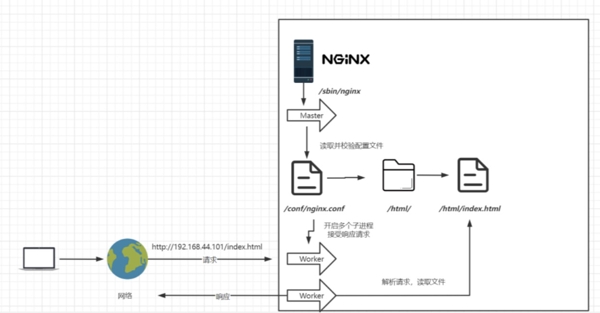
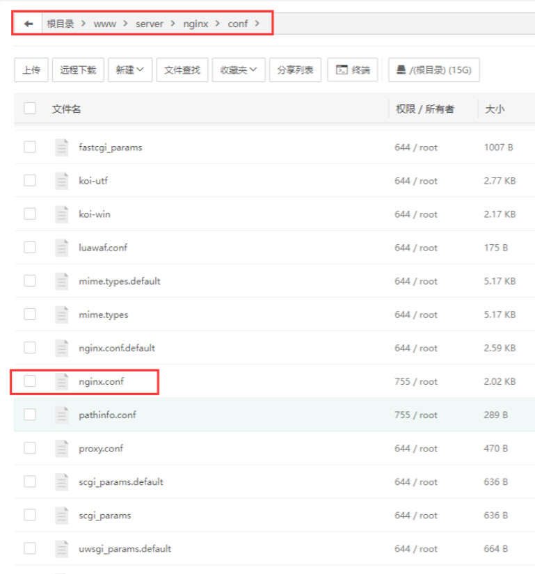
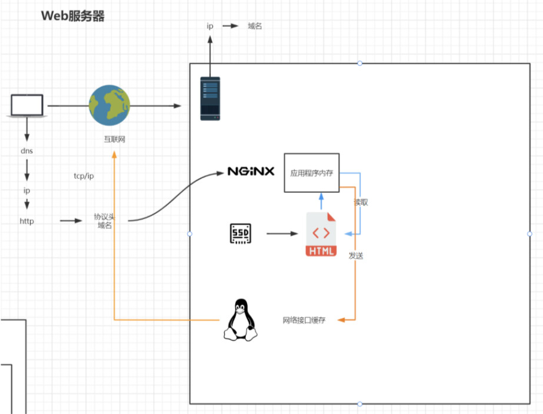
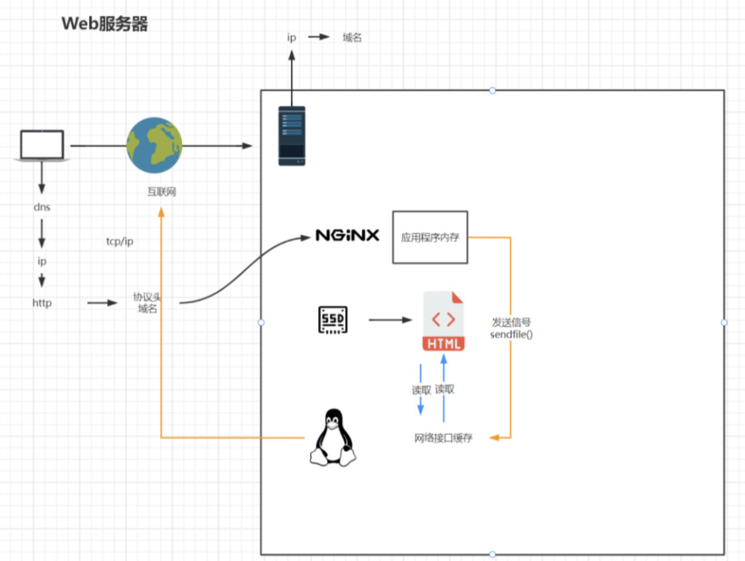
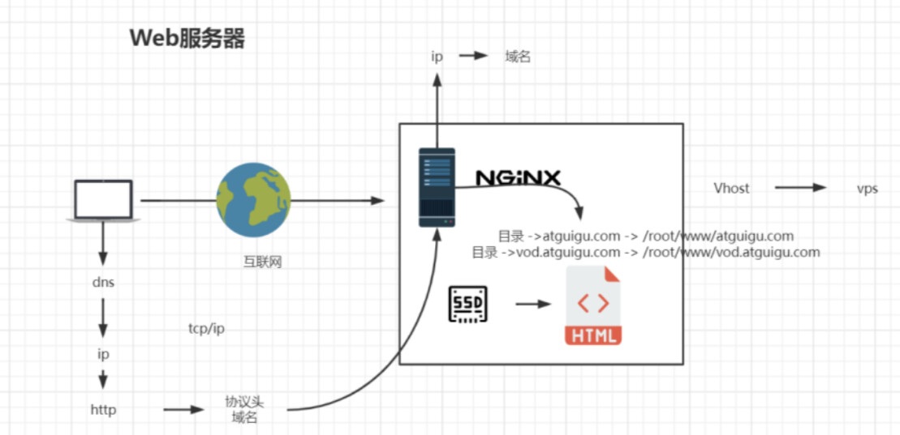

# 一、Nginx安装部署

## 一、安装VM虚拟机

## 二、安装并设置CentOS7系统

1. 安装CentOS7系统

2. 修改ip为静态ip

   ```shell
   #配置静态ip首先需要打开网卡配置文件
   vi /etc/sysconfig/network-scripts/ifcfg-ens33
   
   TYPE=Ethernet
   PROXY_METHOD=none
   BROWSER_ONLY=no
   BOOTPROTO=static
   DEFROUTE=yes
   IPV4_FAILURE_FATAL=no
   IPV6INIT=yes
   IPV6_AUTOCONF=yes
   IPV6_DEFROUTE=yes
   IPV6_FAILURE_FATAL=no
   IPV6_ADDR_GEN_MODE=stable-privacy
   NAME=ens33
   UUID=10ac735e-0b8f-4b19-9747-ff28b58a1547
   DEVICE=ens33
   ONBOOT=yes
   IPADDR=192.168.35.201
   NETMASK=255.255.255.0
   GATEWAY=192.168.35.1
   DNS1=8.8.8.8
   ```

3. 一些公网DNS服务器

   ```shell
   #阿里
   223.5.5.5
   223.6.6.6
   
   #腾讯
   119.29.29.29
   182.254.118.118
   
   #百度
   180.76.76.76
   
   #114DNS
   114.114.114.114
   114.114.115.115
   
   #谷歌
   8.8.8.8
   8.8.4.4
   ```

## 三、Nginx的安装

1. Nginx版本区别

   - Nginx开源版：http://nginx.org/ 
   - Nginx plus 商业版：https://www.nginx.com 
   - openresty：http://openresty.org/cn/ 
   - Tengine：http://tengine.taobao.org/

2. 编译安装

   - 查看[Nginx官](http://nginx.org/en/download.html)网的最新稳定版本

   ```shell
   #官网直接下载也可，然后上传到CentOS中
   yum install wget
   wget https://nginx.org/download/nginx-1.26.1.tar.gz
   
   tar -zxvf nginx-1.26.1.tar.gz
   
   cd nginx-1.26.1/
   
   ./configure --prefix=/usr/local/nginx
   make
   make install
   ```

3. 如果出现警告或报错

   ```shell
   #提示
   checking for OS
   + Linux 3.10.0-693.el7.x86_64 x86_64
   checking for C compiler ... not found
   ./configure: error: C compiler cc is not found
   
   #安装gcc
   yum install -y gcc
   
   #提示
   ./configure: error: the HTTP rewrite module requires the PCRE library.
   You can either disable the module by using --without-http_rewrite_module
   option, or install the PCRE library into the system, or build the PCRE library
   statically from the source with nginx by using --with-pcre=<path> option.
   
   #安装perl库
   yum install -y pcre pcre-devel
   
   #提示
   ./configure: error: the HTTP gzip module requires the zlib library.
   You can either disable the module by using --without-http_gzip_module
   option, or install the zlib library into the system, or build the zlib library
   statically from the source with nginx by using --with-zlib=<path> option.
   
   #安装zlib库
   yum install -y zlib zlib-devel
   make
   make install
   ```

4. 启动Nginx

   ```shell
   #进入安装好的目录 /usr/local/nginx/sbin
   ./nginx 启动
   ./nginx -s stop 快速停止
   ./nginx -s quit 优雅关闭，在退出前完成已经接受的连接请求
   ./nginx -s reload 重新加载配置
   ```

5. 关于防火墙

   ```shell
   关闭防火墙
   systemctl stop firewalld.service
   禁止防火墙开机启动
   systemctl disable firewalld.service
   放行端口和http
   firewall-cmd --add-service=http --permanent 
   firewall-cmd --zone=public --add-port=80/tcp --permanent
   重启防火墙
   firewall-cmd --reload
   ```

6. 安装成系统服务

   ```shell
   #创建服务脚本
   vi /usr/lib/systemd/system/nginx.service
   
   #服务脚本内容
   [Unit]
   Description=nginx - web server
   After=network.target remote-fs.target nss-lookup.target
   [Service]
   Type=forking
   PIDFile=/usr/local/nginx/logs/nginx.pid
   ExecStartPre=/usr/local/nginx/sbin/nginx -t -c /usr/local/nginx/conf/nginx.conf
   ExecStart=/usr/local/nginx/sbin/nginx -c /usr/local/nginx/conf/nginx.conf
   ExecReload=/usr/local/nginx/sbin/nginx -s reload
   ExecStop=/usr/local/nginx/sbin/nginx -s stop
   ExecQuit=/usr/local/nginx/sbin/nginx -s quit
   PrivateTmp=true
   [Install]
   WantedBy=multi-user.target
   
   #重新加载系统服务
   systemctl daemon-reload
   
   #启动服务
   systemctl start nginx.service
   
   #开机启动
   systemctl enable nginx.service
   ```


# 二、Nginx目录介绍

## 一、Nginx目录结构


```shell
[root@localhost ~]# tree /usr/local/nginx
/usr/local/nginx
├── client_body_temp                 # POST 大文件暂存目录
├── conf                             # Nginx所有配置文件的目录
│   ├── fastcgi.conf                 # fastcgi相关参数的配置文件
│   ├── fastcgi.conf.default         # fastcgi.conf的原始备份文件
│   ├── fastcgi_params               # fastcgi的参数文件
│   ├── fastcgi_params.default       
│   ├── koi-utf
│   ├── koi-win
│   ├── mime.types                   # 媒体类型
│   ├── mime.types.default
│   ├── nginx.conf                   #这是Nginx默认的主配置文件，日常使用和修改的文件
│   ├── nginx.conf.default
│   ├── scgi_params                  # scgi相关参数文件
│   ├── scgi_params.default  
│   ├── uwsgi_params                 # uwsgi相关参数文件
│   ├── uwsgi_params.default
│   └── win-utf
├── fastcgi_temp                     # fastcgi临时数据目录
├── html                             # Nginx默认站点目录
│   ├── 50x.html                     # 错误页面优雅替代显示文件，例如出现502错误时会调用此页面
│   └── index.html                   # 默认的首页文件
├── logs                             # Nginx日志目录
│   ├── access.log                   # 访问日志文件
│   ├── error.log                    # 错误日志文件
│   └── nginx.pid                    # pid文件，Nginx进程启动后，会把所有进程的ID号写到此文件
├── proxy_temp                       # 临时目录
├── sbin                             # Nginx 可执行文件目录
│   └── nginx                        # Nginx 二进制可执行程序
├── scgi_temp                        # 临时目录
└── uwsgi_temp                       # 临时目录
```

1. 其中这几个文件夹在刚安装后是没有的，主要用来存放运行过程中的临时文件 

   -  client_body_temp
   - fastcgi_temp proxy_temp
   - scgi_temp  

2. 主要的目录是conf、html、log及sbin

   - conf目录放的是核心配置文件

   - html目录放的是静态页面：50x.html是发生错误展示的页面，index.html是默认的访问页面。可以在该目录下新建html，然后在浏览器中访问，例如在该目录下新建hello.html，内容是hello，然后访问：http://localhost:80/hello.html，页面会显示hello

   - logs文件夹用于存放日志信息。其中error.log是放出错的信息，nginx.pid存放的是当前nginx的pid

     

   - sbin存放的是可执行文件，可以用`./nginx`启动nginx

     

## 二、Nginx基本运行原理



1. Nginx的进程是使用经典的「Master-Worker」模型
2. Nginx在启动后，会有一个master进程和多个worker进程
3. master进程主要用来管理worker进程，包含：接收来自外界的信号，向各worker进程发送信号，监控worker进程的运行状态，当worker进程退出后（异常情况下），会自动重新启动新的worker进程
4. worker进程主要处理基本的网络事件，多个worker进程之间是对等的，他们同等竞争来自客户端的请求，各进程互相之间是独立的。一个请求，只可能在一个worker进程中处理，一个worker进程，不可能处理其它进程的请求
5. worker进程的个数是可以设置的，一般会设置与机器cpu核数一致，这里面的原因与nginx的进程模型以及事件处理模型是分不开的

## 三、Nginx基本配置文件

1. Nginx的默认配置文件是nginx.conf。有一个文件是`nginx.conf.default`，那个就是`nginx.conf`初始内容，出了问题可以对照着找问题

   

2. nginx.conf 去掉注释的简单版如下：

   ```shell
   worker_processes  1; 
   #允许进程数量，建议设置为cpu核心数或者auto自动检测，
   #注意的是Windows服务器上虽然可以启动多个processes，但是实际只会用其中一个
   
   events {
       #单个进程最大连接数（最大连接数=连接数*进程数）
       #根据硬件调整，和前面工作进程配合起来用，尽量大，但是别把cpu跑到100%就行。
       worker_connections  1024;
   }
   
   
   http {
       #文件扩展名与文件类型映射表(是conf目录下的一个文件)
       include       mime.types;
       #默认文件类型，如果mime.types预先定义的类型没匹配上，默认使用二进制流的方式传输
       default_type  application/octet-stream;
   
       #sendfile指令指定nginx是否调用sendfile 函数（zero copy 方式）来输出文件，
       #对于普通应用，必须设为on。如果用来进行下载等应用磁盘IO重负载应用，可设置为off，
       #以平衡磁盘与网络IO处理速度。
       sendfile        on;
       
        #长连接超时时间，单位是秒
       keepalive_timeout  65;
   
    	#虚拟主机的配置
       server {
       	#监听端口
           listen       80;
           #域名，可以有多个，用空格隔开
           server_name  localhost;
   
   	    #配置根目录以及默认页面
           location / { 
               # 文件根目录(这里是以nginx文件夹为根目录)
               root   html;
               #默认页名称
               index  index.html index.htm;
           }
   
   		#出错页面配置
           error_page   500 502 503 504  /50x.html;
           #/50x.html文件所在位置
           location = /50x.html {
               root   html;
           }
           
       }
   
   }
   ```

   - worker_processes：默认为1，表示开启一个业务进程 

   - worker_connections：默认为1024; 单个业务进程可接受连接数 

   - include mime.types：引入http mime类型 

   - default_type application/octet-stream：如果mime类型没匹配上，默认使用二进制流的方式传输 

   - sendfile：默认为on，使用 linux 的 sendfile（socket, file, len）高效网络传输，也就是数据0拷贝
     未开启sendfile的流程

     

     开启sendfile的流程

     

   - keepalive_timeout：默认为65，保持连接，超时时间

   - server

     


# 三、Nginx虚拟主机和域名解析

