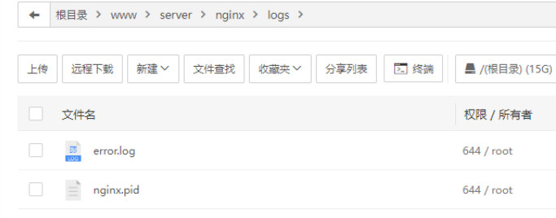
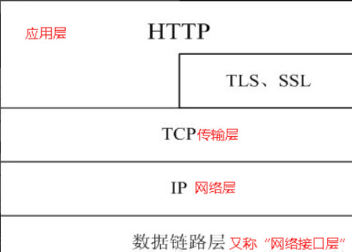
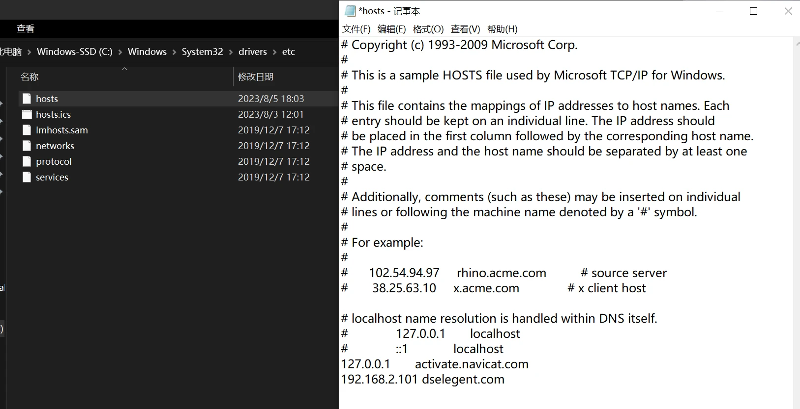
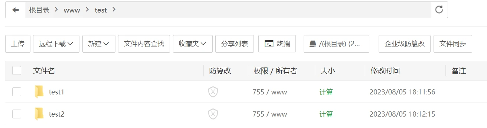
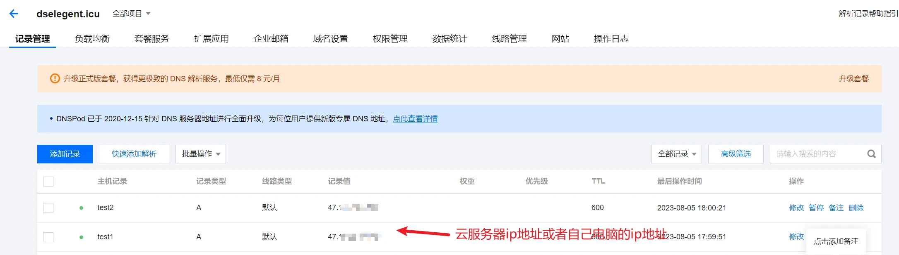
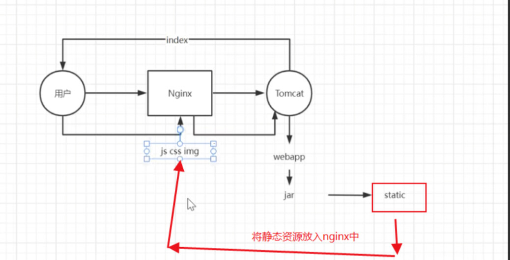
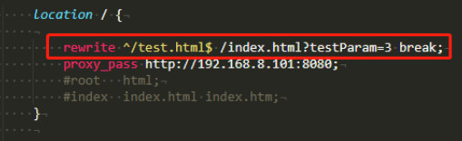
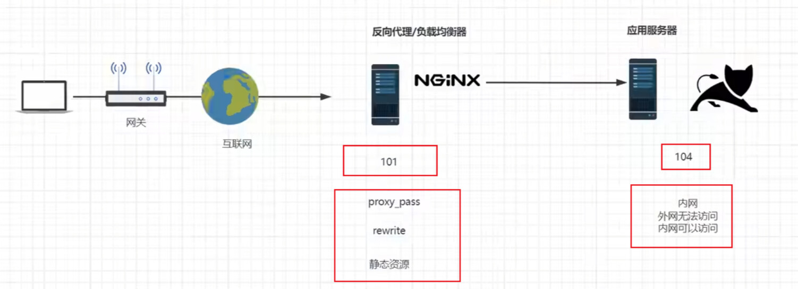
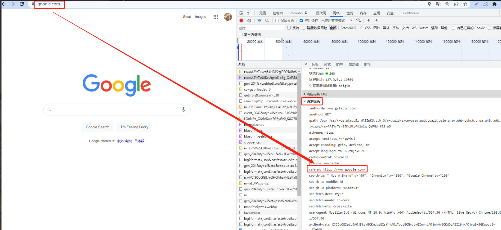
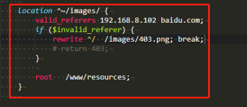

# 一、Nginx安装部署

## 一、安装VM虚拟机

## 二、安装并设置CentOS7系统

1. 安装CentOS7系统

2. 修改ip为静态ip

   ```shell
   #配置静态ip首先需要打开网卡配置文件
   vi /etc/sysconfig/network-scripts/ifcfg-ens33
   
   TYPE=Ethernet
   PROXY_METHOD=none
   BROWSER_ONLY=no
   BOOTPROTO=static
   DEFROUTE=yes
   IPV4_FAILURE_FATAL=no
   IPV6INIT=yes
   IPV6_AUTOCONF=yes
   IPV6_DEFROUTE=yes
   IPV6_FAILURE_FATAL=no
   IPV6_ADDR_GEN_MODE=stable-privacy
   NAME=ens33
   UUID=10ac735e-0b8f-4b19-9747-ff28b58a1547
   DEVICE=ens33
   ONBOOT=yes
   IPADDR=192.168.35.201
   NETMASK=255.255.255.0
   GATEWAY=192.168.35.1
   DNS1=8.8.8.8
   ```

3. 一些公网DNS服务器

   ```shell
   #阿里
   223.5.5.5
   223.6.6.6
   
   #腾讯
   119.29.29.29
   182.254.118.118
   
   #百度
   180.76.76.76
   
   #114DNS
   114.114.114.114
   114.114.115.115
   
   #谷歌
   8.8.8.8
   8.8.4.4
   ```

## 三、Nginx的安装

1. Nginx版本区别

   - Nginx开源版：http://nginx.org/ 
   - Nginx plus 商业版：https://www.nginx.com 
   - openresty：http://openresty.org/cn/ 
   - Tengine：http://tengine.taobao.org/

2. 编译安装

   - 查看[Nginx官](http://nginx.org/en/download.html)网的最新稳定版本

   ```shell
   #官网直接下载也可，然后上传到CentOS中
   yum install wget
   wget https://nginx.org/download/nginx-1.26.1.tar.gz
   
   tar -zxvf nginx-1.26.1.tar.gz
   
   cd nginx-1.26.1/
   
   ./configure --prefix=/usr/local/nginx
   make
   make install
   ```

3. 如果出现警告或报错

   ```shell
   #提示
   checking for OS
   + Linux 3.10.0-693.el7.x86_64 x86_64
   checking for C compiler ... not found
   ./configure: error: C compiler cc is not found
   
   #安装gcc
   yum install -y gcc
   
   #提示
   ./configure: error: the HTTP rewrite module requires the PCRE library.
   You can either disable the module by using --without-http_rewrite_module
   option, or install the PCRE library into the system, or build the PCRE library
   statically from the source with nginx by using --with-pcre=<path> option.
   
   #安装perl库
   yum install -y pcre pcre-devel
   
   #提示
   ./configure: error: the HTTP gzip module requires the zlib library.
   You can either disable the module by using --without-http_gzip_module
   option, or install the zlib library into the system, or build the zlib library
   statically from the source with nginx by using --with-zlib=<path> option.
   
   #安装zlib库
   yum install -y zlib zlib-devel
   make
   make install
   ```

4. 启动Nginx

   ```shell
   #进入安装好的目录 /usr/local/nginx/sbin
   ./nginx 启动
   ./nginx -s stop 快速停止
   ./nginx -s quit 优雅关闭，在退出前完成已经接受的连接请求
   ./nginx -s reload 重新加载配置
   ```

5. 关于防火墙

   ```shell
   关闭防火墙
   systemctl stop firewalld.service
   禁止防火墙开机启动
   systemctl disable firewalld.service
   放行端口和http
   firewall-cmd --add-service=http --permanent 
   firewall-cmd --zone=public --add-port=80/tcp --permanent
   重启防火墙
   firewall-cmd --reload
   ```

6. 安装成系统服务

   ```shell
   #创建服务脚本
   vi /usr/lib/systemd/system/nginx.service
   
   #服务脚本内容
   [Unit]
   Description=nginx - web server
   After=network.target remote-fs.target nss-lookup.target
   [Service]
   Type=forking
   PIDFile=/usr/local/nginx/logs/nginx.pid
   ExecStartPre=/usr/local/nginx/sbin/nginx -t -c /usr/local/nginx/conf/nginx.conf
   ExecStart=/usr/local/nginx/sbin/nginx -c /usr/local/nginx/conf/nginx.conf
   ExecReload=/usr/local/nginx/sbin/nginx -s reload
   ExecStop=/usr/local/nginx/sbin/nginx -s stop
   ExecQuit=/usr/local/nginx/sbin/nginx -s quit
   PrivateTmp=true
   [Install]
   WantedBy=multi-user.target
   
   #重新加载系统服务
   systemctl daemon-reload
   
   #启动服务
   systemctl start nginx.service
   
   #开机启动
   systemctl enable nginx.service
   ```

# 二、Nginx目录介绍

## 一、Nginx目录结构


```shell
[root@localhost ~]# tree /usr/local/nginx
/usr/local/nginx
├── client_body_temp                 # POST 大文件暂存目录
├── conf                             # Nginx所有配置文件的目录
│   ├── fastcgi.conf                 # fastcgi相关参数的配置文件
│   ├── fastcgi.conf.default         # fastcgi.conf的原始备份文件
│   ├── fastcgi_params               # fastcgi的参数文件
│   ├── fastcgi_params.default       
│   ├── koi-utf
│   ├── koi-win
│   ├── mime.types                   # 媒体类型
│   ├── mime.types.default
│   ├── nginx.conf                   # Nginx默认的主配置文件，日常使用和修改的文件
│   ├── nginx.conf.default
│   ├── scgi_params                  # scgi相关参数文件
│   ├── scgi_params.default  
│   ├── uwsgi_params                 # uwsgi相关参数文件
│   ├── uwsgi_params.default
│   └── win-utf
├── fastcgi_temp                     # fastcgi临时数据目录
├── html                             # Nginx默认站点目录
│   ├── 50x.html                     # 错误页面优雅替代显示文件，
								  # 例如出现502错误时会调用此页面
│   └── index.html                   # 默认的首页文件
├── logs                             # Nginx日志目录
│   ├── access.log                   # 访问日志文件
│   ├── error.log                    # 错误日志文件
│   └── nginx.pid                    # pid文件，Nginx进程启动后，
                                     # 会把所有进程的ID号写到此文件
├── proxy_temp                       # 临时目录
├── sbin                             # Nginx 可执行文件目录
│   └── nginx                        # Nginx 二进制可执行程序
├── scgi_temp                        # 临时目录
└── uwsgi_temp                       # 临时目录
```

1. 其中以下文件夹在刚安装后是没有的，主要用来存放运行过程中的临时文件 

   -  client_body_temp
   - fastcgi_temp proxy_temp
   - scgi_temp  

2. 主要的目录是conf、html、log及sbin

   - conf目录放的是核心配置文件

   - html目录放的是静态页面：50x.html是发生错误展示的页面，index.html是默认的访问页面。可以在该目录下新建html，然后在浏览器中访问，例如在该目录下新建hello.html，内容是hello，然后访问：http://localhost:80/hello.html，页面会显示hello

   - logs文件夹用于存放日志信息。其中error.log是放出错的信息，nginx.pid存放的是当前nginx的pid

     

   - sbin存放的是可执行文件，可以用`./nginx`启动nginx

     

## 二、Nginx基本运行原理


1. Nginx的进程是使用经典的「Master-Worker」模型
2. Nginx在启动后，会有一个master进程和多个worker进程
3. master进程主要用来管理worker进程，包含：接收来自外界的信号，向各worker进程发送信号，监控worker进程的运行状态，当worker进程退出后（异常情况下），会自动重新启动新的worker进程
4. worker进程主要处理基本的网络事件，多个worker进程之间是对等的，他们同等竞争来自客户端的请求，各进程互相之间是独立的。一个请求，只可能在一个worker进程中处理，一个worker进程，不可能处理其它进程的请求
5. worker进程的个数是可以设置的，一般会设置与机器cpu核数一致，这里面的原因与nginx的进程模型以及事件处理模型是分不开的

## 三、Nginx基本配置文件

1. Nginx的默认配置文件是nginx.conf。有一个文件是`nginx.conf.default`，那个就是`nginx.conf`初始内容，出了问题可以对照着找问题

   

2. nginx.conf 去掉注释的简单版如下：

   ```shell
   worker_processes  1; 
   #允许工作进程数量，建议设置为cpu核心数或者auto自动检测，
   #注意的是Windows服务器上虽然可以启动多个processes，但是实际只会用其中一个
   
   events {
       #单个进程最大连接数（总的最大连接数=连接数*进程数）
       #根据硬件调整，和前面工作进程配合起来用，尽量大，但是别把cpu跑到100%就行。
       worker_connections  1024;
   }
   
   
   http {
       #文件扩展名与文件类型映射表(是conf目录下的一个文件)
       include       mime.types;
       #默认文件类型，如果mime.types预先定义的类型没匹配上，默认使用二进制流的方式传输
       default_type  application/octet-stream;
   
       #sendfile指令指定nginx是否调用sendfile 函数（zero copy 方式）来输出文件，
       #对于普通应用，必须设为on。如果用来进行下载等应用磁盘IO重负载应用，可设置为off，
       #以平衡磁盘与网络IO处理速度。
       sendfile        on;
       
       #长连接超时时间，单位是秒
       keepalive_timeout  65;
   
    	#虚拟主机的配置，一个server代表一个主机。多个虚拟主机也叫vhost
       server {
       	#监听端口，当前服务器的端口号，每个主机的端口号不同
           listen       80;
           #配置域名或者主机名,可以有多个，用空格隔开
           server_name  localhost;
           
           #https://www.sunsh.com/xxxooo/index.html
           #其中www.sunsh.com是域名
           #/xxxooo/index.html，即URI，也就是location的配置
   
   	    #配置根目录以及默认页面
           location / { 
               # 文件根目录(这里是以nginx文件夹为根目录)
               # 此处的root也就是nginx的安装路径，也就是/usr/local/nginx
               # 此处的html是默认目录
               root   html;
               #默认页名称
               index  index.html index.htm;
           }
   
   	    #出错页面配置，也就是直接转#https://www.sunsh.com/50x.html
           error_page   500 502 503 504  /50x.html;
           #出错页/50x.html文件所在位置
           location = /50x.html {
               root   html;
        	}
   	}
   }
   ```

   - worker_processes：默认为1，表示开启一个业务进程 

   - worker_connections：默认为1024; 单个业务进程可接受连接数 
   
   - include mime.types：引入http mime类型 
   
   - default_type application/octet-stream：如果mime类型没匹配上，默认使用二进制流的方式传输 
   
   - sendfile：默认为on，使用 linux 的 sendfile（socket, file, len）高效网络传输，也就是数据0拷贝
     未开启sendfile的流程
   
     
   
     开启sendfile的流程，开启后Nginx不需要再复制一份磁盘上的文件数据，而是通过Nginx直接使用sendfile()函数给操作系统发送信息，操作系统的网络接口来读取磁盘上的文件数据，通过网络直接发送给客户端
   
     
   
   - keepalive_timeout：默认为65，保持连接，超时时间
   
   - server
   
     

# 三、Nginx虚拟主机和域名解析

- 虚拟主机使用特殊的软硬件技术，把一台运行在因特网上的服务器主机分成一台台“虚拟”的主机，每一台虚拟主机都具有独立的域名，具有完整的Internet服务器（WWW、FTP、Email等）功能，虚拟主机之间完全独立，并可由用户自行管理，在外界看来，每一台虚拟主机和一台独立的主机完全一样
- 域名解析就是域名到IP地址的转换过程，IP地址是网路上标识站点的数字地址，为了简单好记，采用域名来代替ip地址标识站点地址，域名的解析工作由DNS服务器完成

## 一、域名、DNS、IP地址的关系

### 一、域名、DNS、IP地址的概述

1. 域名是相对网站来说的，IP是相对网络来说的。当输入一个域名的时候，网页所作的处理是：输入域名 —> 域名解析服务器（DNS）解析成IP地址 —> 访问IP地址 —> 完成访问的内容 —> 返回信息
2. Internet上的计算机IP是唯一的，一个IP地址对应一个计算机。一台计算机上面可以有很多个服务，也就是一个ip地址对应了很多个域名，即一个计算机上有很多网站

### 二、IP地址和DNS地址的区别

1. IP地址是指单个主机的唯一IP地址，而DNS服务器地址是用于域名解析的地址
2. IP地址是私网地址，DNS服务器地址是公网地址
3. IP地址是作为主机的逻辑标志，DNS地址是作为域名解析服务器的访问地址

### 三、IP地址详解

1. IP，就是Internet Protocol的缩写，是一种通信协议，我们用的因特网基本是IP网组成的
2. IP地址就是因特网上的某个设备的一个编号
3. IP地址一般由网络号，主机号，掩码来组成。IP地址=网络地址+主机地址。例如IP为`192.168.100.1`，网络号为`192.168.100.0`，主机号为`0.0.0.1`
4. IP网络上有很多路由器，路由器之间转发、通信都是只认这个IP地址。类似于寄包裹，写上发件人地址，发件人姓名，收件人地址，收件人姓名。发件人地址就是发送信息电脑的IP的网络号，发件人姓名就是发送信息电脑的主机号。收件人地址就是要访问的IP的网络号，收件人的姓名就是访问IP的主机号
5. 现在还有了更复杂的IPV6，还有IPV9

### 四、DNS详解

- 我们访问因特网必须知道对端的IP地址，可是我们访问网站一般只知道域名
- 通过DNS作为中转站，电脑先访问DNS服务器，查找域名对应的IP，于是你的电脑就知道要发包的IP地址了

## 二、HTTP协议

1. HTTP是一个应用层协议，由请求和响应构成，是一个标准的客户端服务器模型。HTTP是一个无状态的协议

2. HTTP协议通常承载于TCP协议之上，有时也承载于TLS或SSL协议层之上，这个时候，就成了我们常说的HTTPS。如下图所示：

   

3. 客户端与服务器的数据交互的流程

   - 首先客户机与服务器需要建立TCP连接。只要单击某个超级链接，HTTP的工作开始，下图是TCP连接流程

     

   - 建立连接后，客户机发送一个请求给服务器，请求方式的格式为：统一资源标识符（URL）、协议版本号，后边是MIME信息包括请求修饰符、客户机信息和可能的内容

   - 服务器接到请求后，给予相应的响应信息，其格式为一个状态行，包括信息的协议版本号、一个成功或错误的代码，后边是MIME信息包括服务器信息、实体信息和可能的内容，例如返回一个HTML的文本

   - 客户端接收服务器所返回的信息通过浏览器显示在用户的显示屏上，然后客户机与服务器断开连接。如果在以上过程中的某一步出现错误，那么产生错误的信息将返回到客户端，由显示屏输出。对于用户来说，这些过程是由HTTP自己完成的，用户只要用鼠标点击，等待信息显示就可以了

## 三、虚拟机原理

1. 虚拟主机是为了在同一台物理机器上运行多个不同的网站，提高资源利用率引入的技术
2. 一般的web服务器一个ip地址的80端口只能正确对应一个网站。web服务器在不使用多个ip地址和端口的情况下，如果需要支持多个相对独立的网站就需要一种机制来分辨同一个ip地址上的不同网站的请求，这就出现了主机头绑定的方法。简单的说就是，将不同的网站空间对应不同的域名，以连接请求中的域名字段来分发和应答正确的对应空间的文件执行结果。举个例子来说，一台服务器ip地址为192.168.8.101，有两个域名和对应的空间在这台服务器上，使用的都是192.168.8.101的80端口来提供服务。如果只是简单的将两个域名A和B的域名记录解析到这个ip地址，那么web服务器在收到任何请求时反馈的都会是同一个网站的信息，这显然达不到要求。接下来我们使用主机头绑定域名A和B到他们对应的空间文件夹C和D。当含有域名A的web请求信息到达192.168.8.101时，web服务器将执行它对应的空间C中的首页文件，并返回给客户端，含有域名B的web请求信息同理，web服务器将执行它对应的空间D中的首页文件，并返回给客户端，所以在使用主机头绑定功能后就不能使用ip地址访问其上的任何网站了，因为请求信息中不存在域名信息，所以会出错

## 四、使用host文件解析域名

1. 使用host文件解析域名或者使用阿里云进行域名配置都可以，在阿里云配置域名更具实战性

2. 在宿主主机电脑中修改host文件，访问虚拟机的IP解析的域名

   

   

3. 还可以通过域名解析然后连接到内网：我们在阿里云的dns域名解析上面添加添加了我们域名和内网ip的对应关系，仅仅只是对应关系，所以我们ping域名可以解析成我们的内网ip，由于终端与对应机器在同一局域网所以能通，你换个不在同一内网的不行

## 五、虚拟机域名配置

1. 在根目录的`www`目录下创建文件夹`test`，里面在创建两个文件夹`test1`和`test2`，分别创建`index.html`：

   

   - 使用腾讯云`DNSPod`添加域名解析记录：

   

2. 修改`nginx.conf`

   ```shell
         server {
           listen 80;
           server_name test1.dselegent.icu;
           location /
           {
              root /www/test/test1;
              index index.html index.htm;
           }
         }
         
           server {
           listen 80;
           server_name test2.dselegent.icu;
           location /
           {
              root /www/test/test2;
              index index.html index.htm;
           }
         }
   ```

3. 运行命令重新加载服务：`systemctl reload nginx`

4. 注意点：

   - listen 80;		server_name  www.website.com;
   - listen 88;		server_name qqq.website.com;
   - 两者组合起来不重复就可以了

## 六、泛域名

1. 所谓“泛域名解析”是指：利用通配符`*`来做次级域名以实现所有的次级域名均指向同一IP地址

2. 泛域名的好处

   - 可以让域名支持无限的子域名(这也是泛域名解析最大的用途
   - 防止用户错误输入导致的网站不能访问的问题
   - 可以让直接输入网址登陆网站的用户输入简洁的网址即可访问网站
   - 泛域名在实际使用中作用是非常广泛的，比如实现无限二级域名功能，提供免费的url转发，在IDC部门实现自动分配免费网址，在大型企业中实现网址分类管理等等，都发挥了巨大的作用

3. 在腾讯云的域名配置如下：

   

## 七、域名解析规则

1. 可以在同一个`server_name`中配置多个域名

2. 完整匹配。server中可以配置多个域名，例如：`server_name  test1.dselegent.icu  test2.dselegent.icu;`

3. 通配符匹配：

   - 使用方式：`server_name  *.dselegent.icu;`
   - 注意点：完整匹配的优先级大于通配符匹配和正则匹配

4. 通配符结束匹配。使用通配符结束匹配的方式如下：`server_name  www.dselegent.*;`

5. 正则匹配

   - 使用正则匹配的方式如下：`server_name  ~^[0-9]+\.dselegent\.icu$`
   - 访问地址如`123456.dselegent.icu`
   - 正则匹配格式，必须以`~`开头，比如：`server_name ~^www\d+\.example\.net$;`。如果开头没有~，则nginx认为是精确匹配。在逻辑上，需要添加^和$锚定符号。注意，正则匹配格式中.为正则元字符，如果需要匹配.，则需要反斜线转义。如果正则匹配中含有{和}则需要双引号引用起来，避免nginx报错，如果没有加双引号，则nginx会报如下错误：`directive "server_name" is not terminated by ";" in ...`

6. 匹配顺序

   ```shell
   1. 精确的名字
   2. 以*号开头的最长通配符名称，例如 *.example.org
   3. 以*号结尾的最长通配符名称，例如 mail.*
   4. 第一个匹配的正则表达式（在配置文件中出现的顺序）
   ```

# 四、动静分离和URLRewrite

## 一、动静分离介绍

1. 为了提高网站的响应速度，减轻程序服务器（Tomcat，Jboss等）的负载，对于静态资源，如图片、js、css等文件，可以在反向代理服务器中进行缓存，这样浏览器在请求一个静态资源时，代理服务器就可以直接处理，而不用将请求转发给后端服务器。对于用户请求的动态文件，如servlet、jsp，则转发给Tomcat，Jboss服务器处理，这就是动静分离。即动态文件与静态文件的分离

   

2. 动静分离可通过location对请求url进行匹配，将网站静态资源（HTML，JavaScript，CSS，img等文件）与后台应用分开部署，提高用户访问静态代码的速度，降低对后台应用访问。通常将静态资源放到nginx中，动态资源转发到tomcat服务器中

## 二、Nginx动静分离配置

1. 动静分离是让动态网站里的动态网页根据一定规则把不变的资源和经常变的资源区分开来，动静资源做好了拆分以后，我们就可以根据静态资源的特点将其做缓存操作，这就是网站静态化处理的核心思路

2. 在Nginx中的html目录中放入这样的资源

   

3. 其中路径引入的方式需要以根路径的方式引入

   ```html
   <!DOCTYPE html>
   <html lang="en">
     <head>
       <meta charset="UTF-8" />
       <meta http-equiv="X-UA-Compatible" content="IE=edge" />
       <meta name="viewport" content="width=device-width, initial-scale=1.0" />
       <title>Document</title>
       <link rel="stylesheet" href="/css/index.css" />
       <script src="/js/index.js"></script>
     </head>
     <body>
       
       <p>我是ds</p>
     </body>
   </html>
   ```

4. 直接访问Nginx服务器地址是能看到图片的

5. 由于服务器是使用了nginx的，每次访问这些资源都被代理了一次，但其实这些资源是不需要被改变的，这样很浪费性能，所以我们把这些静态资源放在nginx服务器上

6. 修改Nginx服务器的`nginx.conf`配置文件

   ```shell
      server {
           listen 80;
           server_name  localhost;
           location / {
               proxy_pass http://192.168.8.101:8080;
           }
           # 所有静态请求都由nginx处理，存放目录为nginx中的html
     	    location ~ .(gif|jpg|jpeg|png|bmp|swf|css|js)$ {
               root html;
           }
       }
   ```

   - `location ~ .(gif|jpg|jpeg|png|bmp|swf|css|js)${root html;} `这行的意思是匹配到这些后缀名的文件，就把资源引入的地址指向html目录中，将html文件夹作为这些资源引入的根目录
   - 例1：`/css/index.css`的这个`/`就是相对于html目录中来说的
   - 例2：当我们后缀为gif的时候，Nginx默认会从html中获取到当前请求的动态图文件返回，当然这里的静态文件跟Nginx是同一台服务器，我们也可以在另外一台服务器，然后通过反向代理和负载均衡配置过去就好了，只要搞清楚了最基本的流程，很多配置就很简单了

## 三、location匹配顺序

### 一、常见的Nginx正则表达式

```bash
^ ：匹配输入字符串的起始位置
$ ：匹配输入字符串的结束位置
* ：匹配前面的字符零次或多次。如“ol*”能匹配“o”及“ol”、“oll”
+ ：匹配前面的字符一次或多次。如“ol+”能匹配“ol”及“oll”、“olll”，但不能匹配“o”
? ：匹配前面的字符零次或一次，例如“do(es)?”能匹配“do”或者“does”，”?”等效于”{0,1}”
. ：匹配除“\n”之外的任何单个字符，若要匹配包括“\n”在内的任意字符，请使用诸如“[.\n]”之类的模式
\ ：将后面接着的字符标记为一个特殊字符或一个原义字符或一个向后引用。如“\n”匹配一个换行符，而“\$”则匹配“$”
\d ：匹配纯数字
{n} ：重复 n 次
{n,} ：重复 n 次或更多次
{n,m} ：重复 n 到 m 次
[] ：定义匹配的字符范围
[c] ：匹配单个字符 c
[a-z] ：匹配 a-z 小写字母的任意一个
[a-zA-Z0-9] ：匹配所有大小写字母或数字
() ：表达式的开始和结束位置
| ：或运算符  //例(js|img|css)
```

### 二、location正则

```bash
#location大致可以分为三类
精准匹配：location = /{}
一般匹配：location /{}
正则匹配：location ~/{}

#location常用的匹配规则：
= ：进行普通字符精确匹配，也就是完全匹配
^~ ：表示前缀字符串匹配（不是正则匹配，需要使用字符串），如果匹配成功，则不再匹配其它 location。
~ ：区分大小写的匹配（需要使用正则表达式）
~* ：不区分大小写的匹配（需要使用正则表达式）
!~ ：区分大小写的匹配取非（需要使用正则表达式）
!~* ：不区分大小写的匹配取非（需要使用正则表达式）

#优先级
首先精确匹配 =
其次前缀匹配 ^~
其次是按文件中顺序的正则匹配 ~ 或 ~*
然后匹配不带任何修饰的前缀匹配
最后是交给 / 通用匹配
```

1. location正则注意点

   - 精确匹配： `=` ， 后面的表达式中写的是纯字符串
   - 字符串匹配： `^~` 和 `无符号匹配` ， 后面的表达式中写的是纯字符串
   - 正则匹配： `~` 和 `~*` 和 `!~` 和 `!~*` ， 后面的表达式中写的是正则表达式

2. location的说明

   ```shell
    (1）location = / {}
   =为精确匹配 / ，主机名后面不能带任何字符串，比如访问 / 和 /data，则 / 匹配，/data 不匹配
   再比如 location = /abc，则只匹配/abc ，/abc/或 /abcd不匹配。若 location  /abc，则即匹配/abc 、/abcd/ 同时也匹配 /abc/。
   
   （2）location / {}
   因为所有的地址都以 / 开头，所以这条规则将匹配到所有请求 比如访问 / 和 /data, 则 / 匹配， /data 也匹配，
   但若后面是正则表达式会和最长字符串优先匹配（最长匹配）
   
   （3）location /documents/ {}
   匹配任何以 /documents/ 开头的地址，匹配符合以后，还要继续往下搜索其它 location
   只有其它 location后面的正则表达式没有匹配到时，才会采用这一条
   
   （4）location /documents/abc {}
   匹配任何以 /documents/abc 开头的地址，匹配符合以后，还要继续往下搜索其它 location
   只有其它 location后面的正则表达式没有匹配到时，才会采用这一条
   
   （5）location ^~ /images/ {}
   匹配任何以 /images/ 开头的地址，匹配符合以后，停止往下搜索正则，采用这一条
   
   （6）location ~* \.(gif|jpg|jpeg)$ {}
   匹配所有以 gif、jpg或jpeg 结尾的请求
   然而，所有请求 /images/ 下的图片会被 location ^~ /images/ 处理，因为 ^~ 的优先级更高，所以到达不了这一条正则
   
   （7）location /images/abc {}
   最长字符匹配到 /images/abc，优先级最低，继续往下搜索其它 location，会发现 ^~ 和 ~ 存在
   
   （8）location ~ /images/abc {}
   匹配以/images/abc 开头的，优先级次之，只有去掉 location ^~ /images/ 才会采用这一条
   
   （9）location /images/abc/1.html {}
   匹配/images/abc/1.html 文件，如果和正则 ~ /images/abc/1.html 相比，正则优先级更高
   
   优先级总结：
   (location =) > (location 完整路径) > (location ^~ 路径) > (location ~,~* 正则顺序) > (location 部分起始路径) > (location /)
   ```

3. location匹配顺序

   - 多个正则location直接按书写顺序匹配，成功后就不会继续往后面匹配 
   - 普通（非正则）location会一直往下，直到找到匹配度最高的（最大前缀匹配） 
   - 当普通location与正则location同时存在，如果正则匹配成功,则不会再执行普通匹配 
   - 所有类型location存在时，“=”匹配 > “^~”匹配 > 正则匹配 > 普通（最大前缀匹配） 

4. 实际网站使用中，至少有三个匹配规则定义

   - 必选规则一：直接匹配网站根，通过域名访问网站首页比较频繁，使用这个会加速处理，比如说官网。这里是直接转发给后端应用服务器了，也可以是一个静态首页

     ```shell
     location = / {
         proxy_pass http://127.0.0.1:8080/; 
     }
     ```

   - 必须规则二：处理静态文件请求，这是nginx作为http服务器的强项，有两种配置模式，目录匹配或后缀匹配，任选其一或搭配使用

     ```shell
     location ^~ /static/ {
         root /www/www/static;
     }
     
     location ~* \.(html|gif|jpg|jpeg|png|css|js|ico)$ {
         root /www/www/;
     }
     ```

   - 通用规则，用来转发动态请求到后端应用服务器

     ```shell
     location /api/ {
         proxy_pass http://127.0.0.1:3000/
     }
     ```

## 四、URLRewrite

### 一、URLRewrite优缺点

1. 优点：掩藏真实的url以及url中可能暴露的参数，以及隐藏web使用的编程语言，提高安全性便于搜索引擎收录
2. 缺点：降低效率，影响性能。如果项目是内网使用，比如公司内部软件，则没有必要配置

### 二、URLRewrite概述

```
rewrite是实现URL重写的关键指令，根据regex(正则表达式)部分内容，重定向到repacement，结尾是flag标记

rewrite 	<regex> 	<replacement> 	[flag];
关键字 	 正则 		替代内容 		flag标记
```

1. 关键字：其中关键字error_log不能改变
2. 正则：perl兼容正则表达式语句进行规则匹配 
3. 替代内容：将正则匹配的内容替换成replacement 
4. flag标记：rewrite支持的flag标记 
5. rewrite参数的标签段位置： server,location,if 
6. flag标记说明
   - last：本条规则匹配完成后，继续向下匹配新的location URI规则 
   - break：本条规则匹配完成即终止，不再匹配后面的任何规则 
   - redirect：返回302临时重定向，浏览器地址会显示跳转后的URL地址   (防爬虫)
   - permanent：返回301永久重定向，浏览器地址栏会显示跳转后的URL地址

### 三、配置Nginx



1. 上图配置的意思是如果路径是`/index.html?testParms=3`就重写成`/test.html`

2. 也可以用正则表达式的形式：

   ```shell
   rewrite ^/[0-9]+.html$ /index.html?testParam=$1 break; 
   //$1表示第一个匹配的字符串 
   ```

3. 访问`/index.html?testParam=2`

## 五、负载均衡+URLRewrite



1. 上面的操作都是在101服务器上使用反向代理到102服务器展示出来的，如果直接访问102服务器也能访问到，这种事是不应该的，所以要配置一下

2. 以下命令都是在102服务器操作

   - 开启102的防火墙

   ```shell
   systemctl start firewalld
   ```

   - 重载规则

   ```shell
   firewall-cmd --reload
   ```

   - 添加指定端口和ip访问（添加之后记得重新启动防火墙）

   ```shell
   firewall-cmd --permanent --add-rich-rule="rule family="ipv4" source address="192.168.8.101" port protocol="tcp" port="8080" accept"
   ```

   - 移除规则

   ```shell
   firewall-cmd --permanent --remove-rich-rule="rule family="ipv4" source address="192.168.8.101" port protocol="tcp" port="8080" accept"
   ```

   - 查看已配置规则  

   ```shell
   firewall-cmd --list-all
   ```

   - 重启防火墙

   ```shell
   firewall-cmd --reload
   ```

   - 这个时候只有一台服务器102，如果102服务器崩了，那么将无法访问，所以要配置负载均衡。这时也要用防火墙配置103服务器的规则


   ```bash
   ...
   http {
   
   #定义一组服务器
   upstream httpds{
       server 192.168.8.101:8080 weight=8 down;
       server 192.168.8.103:8080 weight=2 backup;
   }
   ...
    	#虚拟主机的配置
       server {
       	#监听端口
           listen       80;
           #域名，可以有多个，用空格隔开
           server_name  localhost;
   
   		#配置根目录以及默认页面
           location / {
               proxy_pass http://httpds;
           }
           
       }
   }
   ```

3. 测试

   - 现在直接访问http://192.168.8.102/就访问不了了
   - 访问http://192.168.8.101/可以正常访问
   - 访问http://192.168.8.103/可以正常访问

# 五、防盗链

## 一、防盗链概述

- 盗链是指服务提供商自己不提供服务的内容，通过技术手段绕过其它有利益的最终用户界面（如广告），直接在自己的网站上向最终用户提供其它服务提供商的服务内容，骗取最终用户的浏览和点击率。受益者不提供资源或提供很少的资源，而真正的服务提供商却得不到任何的收益

## 二、Nginx防盗链配置

### 一、基本使用

- 为了模拟盗链，在这里让101为服务站点，102为网关服务器，103访问102进行盗链

- 102的nginx.conf

  ```shell
  http {
      server {
          listen       80;
          server_name  localhost;
  
  
          location / {
              proxy_pass http://192.168.8.101:8080;
          }
          
          
          location ^~/images/ {
              root   /www/resources;
          }
         
      }
  }
  ```

- 103的nginx.cfg

  ```shell
  http {
  
      server {
          listen       80;
          server_name  localhost;
  
          location / {
              proxy_pass http://192.168.8.102;
          }
  
      }
  }
  ```

- 访问http://192.168.8.103/

- 如果不想被盗链，可以对网关服务器102做如下配置

  ```shell
  http {
  
      server {
          listen       80;
          server_name  localhost;
  
  
          location / {
              proxy_pass http://192.168.8.101:8080;
          }
          
          
          
          location ^~/images/ {
              valid_referers 192.168.8.102; 
              #valid_referers指令，配置是否允许referer头部以及允许哪些referer访问。			   #192.168.8.102不是ip而是域名（去掉http:// 前缀）
              if ($invalid_referer) {  # 注意这里if后要加空格
                  return 403; ## 返回错误码
              }
              
              root   /www/resources;
          }
         
  
      }
  }
  ```

  

  

### 二、valid_referers解释

1. valid_referers作用：可以同时携带多个参数，表示多个 referer 头部都生效

2. 参数值

   - none：允许没有 referer 信息的请求访问，即直接通过url访问
   - blocked：请求头Referer字段不为空（即存在Referer），但是值可以为空（值被代理或者防火墙删除了），并且允许refer不以“http://”或“https://”开头，通俗点说就是允许“http://”或"https//"以外的请求
   - server_names：若 referer 中站点域名与 server_name 中本机域名某个匹配，则允许该请求访问
   - 其他字符串类型：检测referer与字符串是否匹配，如果匹配则允许访问，可以采用通配符*
   - 正则表达式：若 referer 的值匹配上了正则，就允许访问

3. valid_referers变量

   - 允许访问时变量值为空
   - 不允许访问时变量值为 1

   ```shell
   server {
       server_name referer.test.com;
       listen 80;
   
       error_log logs/myerror.log debug;
       root html;
       location / {
           valid_referers none server_names
                          *.test.com www.test.org.cn/nginx/;
           if ($invalid_referer) {
                   return 403; # 返回错误码
           }
           return 200 'valid\n';
       }
   }
   
   # none：表示没有 referer 的可以访问
   # server_names：表示本机 server_name 也就是 referer.test.com 可以访问
   # *.test.com：匹配上了正则的可以访问
   # www.test.org.cn/nginx/：该页面发起的请求可以访问
   
   ```

### 三、配置错误提示页面

1. 返回错误页面：在102nginx的html目录中添加403.html

   ```html
   <!DOCTYPE html>
   <html>
   <head>
   <meta charset="utf-8">
   <title>Error</title>
   <style>
   html { color-scheme: light dark; }
   body { width: 35em; margin: 0 auto;
   font-family: Tahoma, Verdana, Arial, sans-serif; }
   </style>
   </head>
   <body>
   <h1>An error occurred.</h1>
   <p>非法请求.</p>
   
   </body>
   </html>
   ```

2. 修改nginx.conf

   ```shell
   http {
       server {
           listen       80;
           server_name  localhost;
   
           location / {
               proxy_pass http://192.168.8.101:8080;
           }
           
           
           location ^~/images/ {
               valid_referers 192.168.8.102 baidu.com;
               if ($invalid_referer) {
                   return 403; # 返回错误码
               }
               
               root   /www/resources;
           }
           
   
           error_page   403  /403.html;
           location = /403.html {
               root   html;
           }
           error_page   500 502 503 504  /50x.html;
           location = /50x.html {
               root   html;
           }
   
           
       }
   
   }
   ```

3. 访问http://192.168.8.103/images/bg.jpg

### 四、返回出错图片

1. 修改网关服务器102

   

   

2. 访问192.168.8.103

   


