# 一、MQ的相关概念

## 一、MQ概述

-  MQ（message queue），从字面意思上看，本质是个队列，FIFO 先入先出，只不过队列中存放的内容是 message 而已，还是一种跨进程的通信机制，用于上下游传递消息。在互联网架构中，MQ 是一种非常常见的上下游“逻辑解耦+物理解耦”的消息通信服务。使用了 MQ 之后，消息发送上游只需要依赖 MQ，不用依赖其他服务 

## 二、MQ的作用

1. 流量削峰

   - 举个例子，如果订单系统最多能处理一万次订单，这个处理能力应付正常时段的下单时绰绰有余，正常时段我们下单一秒后就能返回结果。但是在高峰期，如果有两万次下单操作系统是处理不了的，只能限制订单超过一万后不允许用户下单。使用消息队列做缓冲，我们可以取消这个限制，把一秒内下的订单分散成一段时间来处理，这时有些用户可能在下单十几秒后才能收到下单成功的操作，但是比不能下单的体验要好 

2. 应用解耦

   - 以电商应用为例，应用中有订单系统、库存系统、物流系统、支付系统。用户创建订单后，如果耦合调用库存系统、物流系统、支付系统，任何一个子系统出了故障，都会造成下单操作异常。当转变成基于消息队列的方式后，系统间调用的问题会减少很多，比如物流系统因为发生故障，需要几分钟来修复。在这几分钟的时间里，物流系统要处理的内存被缓存在消息队列中，用户的下单操作可以正常完成。当物流系统恢复后，继续处理订单信息即可，中间用户感受不到物流系统的故障，提升系统的可用性 

     

3. 异步处理

   - 有些服务间调用是异步的，例如 A 调用 B，B 需要花费很长时间执行，但是 A 需要知道 B 什么时候可以执行完 

   - 以前一般有两种方式，A 过一段时间去调用 B 的查询 api 查询。或者 A 提供一个 callback api， B 执行完之后调用 api 通知 A 服务。这两种方式都不是很优雅

   - 使用消息总线，可以很方便解决这个问题， A 调用 B 服务后，只需要监听 B 处理完成的消息，当 B 处理完成后，会发送一条消息给 MQ，MQ 会将此消息转发给 A 服务。这样 A 服务既不用循环调用 B 的查询 api，也不用提供 callback api。同样B 服务也不用 做这些操作。A 服务还能及时的得到异步处理成功的消息  

     

## 三、MQ的分类

1. ActiveMQ 
   - 优点：单机吞吐量万级，时效性 ms 级，可用性高，基于主从架构实现高可用性，消息可靠性较低的概率丢失数据 
   - 官方社区现在对 ActiveMQ 5.x 维护越来越少，高吞吐量场景较少使用 
2. Kafka 
   - 大数据的杀手锏，谈到大数据领域内的消息传输，则绕不开 Kafka，这款为大数据而生的消息中间件， 以其百万级 TPS 的吞吐量名声大噪，迅速成为大数据领域的宠儿，在数据采集、传输、存储的过程中发挥 着举足轻重的作用。目前已经被 LinkedIn、Uber,、Twitter,、Netflix 等大公司所采纳 
   - 优点：性能卓越，单机写入 TPS 约在百万条/秒，最大的优点，就是吞吐量高。时效性 ms 级可用性非常高，kafka 是分布式的，一个数据多个副本，少数机器宕机，不会丢失数据，不会导致不可用，消费者采用 Pull 方式获取消息,，消息有序，通过控制能够保证所有消息被消费且仅被消费一次；有优秀的第三方Kafka Web 管理界面 Kafka-Manager；在日志领域比较成熟，被多家公司和多个开源项目使用；功能支持：功能较为简单，主要支持简单的 MQ 功能，在大数据领域的实时计算以及日志采集被大规模使用
   - 缺点：Kafka 单机超过 64 个队列/分区，Load 会发生明显的飙高现象，队列越多，load 越高，发送消息响应时间变长，使用短轮询方式，实时性取决于轮询间隔时间，消费失败不支持重试；支持消息顺序， 但是一台代理宕机后，就会产生消息乱序，社区更新较慢  
3. RocketMQ 
   - RocketMQ 出自阿里巴巴的开源产品，用 Java 语言实现，在设计时参考了 Kafka，并做出了自己的一些改进。被阿里巴巴广泛应用在订单，交易，充值，流计算，消息推送，日志流式处理，binglog 分发等场景
   - 优点：单机吞吐量十万级，可用性非常高，分布式架构，消息可以做到 0 丢失，MQ 功能较为完善，还是分布式的，扩展性好，支持 10 亿级别的消息堆积，不会因为堆积导致性能下降，源码是 java 我们可以自己阅 读源码，定制自己公司的 MQ 
   - 缺点：支持的客户端语言不多，目前是 java 及 c++，其中 c++不成熟；社区活跃度一般,没有在 MQ 核心中去实现 JMS 等接口，有些系统要迁移需要修改大量代码  
4. RabbitMQ 
   - 2007 年发布，是一个在AMQP（高级消息队列协议）基础上完成的，可复用的企业消息系统，是当前最主流的消息中间件之一
   - 优点：由于 erlang 语言的高并发特性，性能较好；吞吐量到万级，MQ 功能比较完备，健壮、稳定、易用、跨平台、支持多种语言，如：Python、Ruby、.NET、Java、JMS、C、PHP、ActionScript、XMPP、STOMP 等，支持 AJAX 文档齐全；开源提供的管理界面非常棒，用起来很好用，社区活跃度高；更新频率相当高
   - 官网更新：https://www.rabbitmq.com/news.html  
   - 缺点：商业版需要收费，学习成本较高

## 四、MQ的选择

- Kafka：Kafka 主要特点是基于 Pull 的模式来处理消息消费，追求高吞吐量，一开始的目的就是用于日志收集和传输，适合产生大量数据的互联网服务的数据收集业务。大型公司建议可以选用，如果有日志采集功能， 肯定是首选 kafka 了
- RocketMQ：天生为金融互联网领域而生，对于可靠性要求很高的场景，尤其是电商里面的订单扣款，以及业务削峰，在大量交易涌入时，后端可能无法及时处理的情况。RoketMQ 在稳定性上可能更值得信赖，这些业务场景在阿里双 11 已经经历了多次考验，如果你的业务有上述并发场景，建议可以选择 RocketMQ
- RabbitMQ：结合 erlang 语言本身的并发优势，性能好时效性微秒级，社区活跃度也比较高，管理界面用起来十分方便，如果你的数据量没有那么大，中小型公司优先选择功能比较完备的 RabbitMQ

# 二、RabbitMQ相关概念

## 一、RabbitMQ的概念

1. RabbitMQ 是一个消息中间件：它接受并转发消息 

2. 可以把它当做一个快递站点，当你要发送一个包裹时，你把你的包裹放到快递站，快递员最终会把你的快递送到收件人那里，按照这种逻辑 RabbitMQ 是一个快递站，一个快递员帮你传递快件。RabbitMQ 与快递站的主要区别在于，它不处理快件而是接收， 存储和转发消息数据 

3. RabbitMQ特性

   

4.  [官方网站](https://www.rabbitmq.com/#features)

## 二、四大核心概念

1. 生产者：产生数据发送消息的程序是生产者
2. 交换机：交换机是 RabbitMQ 非常重要的一个部件，一方面它接收来自生产者的消息，另一方面它将消息推送到队列中。交换机必须确切知道如何处理它接收到的消息，是将这些消息推送到特定队列还是推送到多个队列，亦或者是把消息丢弃，这个得有交换机类型决定
3. 队列：队列是 RabbitMQ 内部使用的一种数据结构，尽管消息流经 RabbitMQ 和应用程序，但它们只能存储在队列中。队列仅受主机的内存和磁盘限制的约束，本质上是一个大的消息缓冲区。许多生产者可以将消息发送到一个队列，许多消费者可以尝试从一个队列接收数据。这就是我们使用队列的方式
4. 消费者：消费与接收具有相似的含义。消费者大多时候是一个等待接收消息的程序。请注意生产者，消费者和消息中间件很多时候并不在同一机器上。同一个应用程序既可以是生产者又是可以是消费者

## 三、名词解释


1. Broker：接收和分发消息的应用，RabbitMQ Server 就是 Message Broker
2. Virtual host：出于多租户和安全因素设计的，把 AMQP 的基本组件划分到一个虚拟的分组中，类似于网络中的 namespace 概念。当多个不同的用户使用同一个 RabbitMQ server 提供的服务时，可以划分出多个 vhost，每个用户在自己的 vhost 创建 exchange／queue 等
3. Connection：publisher／consumer 和 broker 之间的 TCP 连接
4. Channel：如果每一次访问 RabbitMQ 都建立一个 Connection，在消息量大的时候建立 TCP Connection 的开销将是巨大的，效率也较低。Channel 是在 connection 内部建立的逻辑连接，如果应用程序支持多线程，通常每个 thread 创建单独的 channel 进行通讯，AMQP method 包含了 channel id 帮助客户端和 message broker 识别 channel，所以 channel 之间是完全隔离的。Channel 作为轻量级的 Connection 极大减少了操作系统建立 TCP connection 的开销
5. Exchange：message 到达 broker 的第一站，根据分发规则，匹配查询表中的 routing key，分发消息到 queue 中去。常用的类型有：direct (point-to-point)、topic (publish-subscribe) 以及 fanout (multicast)
6. Queue：消息最终被送到这里等待 consumer 取走
7. Binding：exchange 和 queue 之间的虚拟连接，binding 中可以包含 routing key，Binding 信息被保存到 exchange 中的查询表中，用于 message 的分发依据

# 三、RabbitMQ安装

## 一、下载

1. [官网下载地址](https://www.rabbitmq.com/download.html)
2. 可供选择的版本
   - rmp包下载：rabbitmq-server-3.8.8-1.el7.noarch.rpm 
     - [GitHub](https://github.com/rabbitmq/rabbitmq-server/releases/tag/v3.8.8)
     - [加速下载](https://packagecloud.io/rabbitmq/rabbitmq-server/packages/el/7/rabbitmq-server-3.8.8-1.el7.noarch.rpm)
   - erlang环境安装：erlang-21.3.8.21-1.el7.x86_64.rpm 
     - [官网](https://www.erlang-solutions.com/downloads/)
     - [加速下载](https://packagecloud.io/rabbitmq/erlang/packages/el/7/erlang-21.3.8.21-1.el7.x86_64.rpm)
   - Red Hat 8、CentOS 8 和 modern Fedora 版本，把 “el7” 替换成 “el8” 

## 二、安装启动

1. 上传到 `/usr/local/software` 目录下（如果没有 software 需要自己创建）

   ```shell
   #erlang环境安装
   curl -s https://packagecloud.io/install/repositories/rabbitmq/erlang/script.rpm.sh | sudo bash
   
   sudo yum install erlang-21.3.8.21-1.el7.x86_64
   
   #rabbitmq安装
   wget https://packagecloud.io/rabbitmq/rabbitmq-server/packages/el/7/rabbitmq-server-3.8.8-1.el7.noarch.rpm
   yum install socat -y
   
   rpm -ivh rabbitmq-server-3.8.8-1.el7.noarch.rpm
   
   ```

2. 启动

   ```shell
   # 启动服务
   systemctl start rabbitmq-server
   # 查看服务状态
   systemctl status rabbitmq-server
   # 开机自启动
   systemctl enable rabbitmq-server
   # 停止服务
   systemctl stop rabbitmq-server
   # 重启服务
   systemctl restart rabbitmq-server
   
   ```

## 三、Web管理界面及授权操作

1. 安装，默认情况下，是没有安装web端的客户端插件，需要安装才可以生效 

   ```shell
   rabbitmq-plugins enable rabbitmq_management
   ```

2. 安装完毕以后，重启服务即可 

   ```shell
   systemctl restart rabbitmq-server
   ```

3. 启动成功后访问`http://localhost:15672`，默认情况只能在 localhost 本机下访问（默认账号密码都是guest），所以需要添加一个远程登录的用户 

4. 如果防火墙未关闭，需要开放端口号

   ```shell
   firewall-cmd --zone=public --add-port=15672/tcp --permanent
   firewall-cmd --reload
   ```

5. 添加用户

   ```shell
   # 创建账号和密码
   rabbitmqctl add_user admin *****
   # 设置用户角色
   rabbitmqctl set_user_tags admin administrator
   
   # 为用户添加资源权限
   # set_permissions [-p <vhostpath>] <user> <conf> <write> <read>
   rabbitmqctl set_permissions -p "/" admin ".*" ".*" ".*"
   # 添加配置、写、读权限
   
   ```

6. 用户级别

   - administrator：可以登录控制台、查看所有信息、可以对 rabbitmq 进行管理
   - monitoring：监控者登录控制台，查看所有信息
   - policymaker：策略制定者 登录控制台，指定策略
   - managment：普通管理员 登录控制台

7. 重置命令

   - 关闭应用的命令为：`rabbitmqctl stop_app`
   - 清除的命令为：`rabbitmqctl reset`
   - 重新启动命令为：`rabbitmqctl start_app`

## 四、Docker安装

1. [官方网站](https://registry.hub.docker.com/_/rabbitmq/)

2. 命令

   ```shell
   docker run -id --name myrabbit -e RABBITMQ_DEFAULT_USER=admin -e RABBITMQ_DEFAULT_PASS=123456 -p 15672:15672 rabbitmq:3-management
   ```

# 四、RabbitMQ简单案例

## 一、案例简介

1. 我们将用 Java 编写两个程序。发送单个消息的生产者和接收消息并打印出来的消费者 

2. 在下图中，“ P” 是我们的生产者，“ C” 是我们的消费者。中间的框是一个队列 RabbitMQ 代表使用者保留的消息缓冲区 

   

3.  连接的时候，需要开启 5672 端口 

   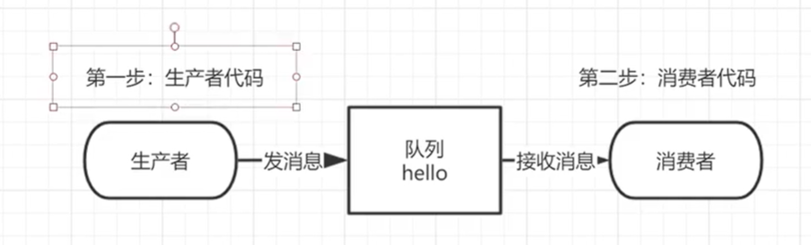

## 二、开发步骤

1. 创建maven

2. 修改pom

   ```xml
   <!--指定 jdk 编译版本-->
   <build>
       <plugins>
           <plugin>
               <groupId>org.apache.maven.plugins</groupId>
               <artifactId>maven-compiler-plugin</artifactId>
               <configuration>
                   <source>8</source>
                   <target>8</target>
               </configuration>
           </plugin>
       </plugins>
   </build>
   <dependencies>
       <!--rabbitmq 依赖客户端-->
       <dependency>
           <groupId>com.rabbitmq</groupId>
           <artifactId>amqp-client</artifactId>
           <version>5.8.0</version>
       </dependency>
       <!--操作文件流的一个依赖-->
       <dependency>
           <groupId>commons-io</groupId>
           <artifactId>commons-io</artifactId>
           <version>2.6</version>
       </dependency>
   </dependencies>
   
   ```

3. 消息生产者：发送消息

   ```java
   
   import com.rabbitmq.client.Channel;
   import com.rabbitmq.client.Connection;
   import com.rabbitmq.client.ConnectionFactory;
   
   /**
    * @author zhiyuan
    */
   public class Producer {
       private final static String QUEUE_NAME = "hello";
   
       public static void main(String[] args) throws Exception {
           //创建一个连接工厂
           ConnectionFactory factory = new ConnectionFactory();
           factory.setHost("42.192.149.71");
           factory.setUsername("admin");
           factory.setPassword("123456");
           //channel 实现了自动 close 接口 自动关闭 不需要显示关闭
           //创建连接
           Connection connection = factory.newConnection();
           //获取信道
           Channel channel = connection.createChannel();
           /**
            * 生成一个队列
            * 1.队列名称
            * 2.队列里面的消息是否持久化 也就是是否用完就删除
            * 3.该队列是否只供一个消费者进行消费 是否进行共享 true 可以多个消费者消费
            * 4.是否自动删除 最后一个消费者端开连接以后 该队列是否自动删除 true 自动删除
            * 5.其他参数
            */
           channel.queueDeclare(QUEUE_NAME, false, false, false, null);
           String message = "hello world";
           /**
            * 发送一个消息
            * 1.发送到那个交换机
            * 2.路由的 key 是哪个
            * 3.其他的参数信息
            * 4.发送消息的消息体
            */
           channel.basicPublish("", QUEUE_NAME, null, message.getBytes());
           System.out.println("消息发送完毕");
   
       }
       
   }
   ```

4. 消息消费者： 获取“生产者”发出的消息 

   ```java
   
   import com.rabbitmq.client.*;
   
   /**
    * @author zhiyuan
    */
   public class Consumer {
       private final static String QUEUE_NAME = "hello";
   
       public static void main(String[] args) throws Exception {
           ConnectionFactory factory = new ConnectionFactory();
           factory.setHost("42.192.149.71");
           factory.setUsername("admin");
           factory.setPassword("123456");
           Connection connection = factory.newConnection();
           Channel channel = connection.createChannel();
   
           System.out.println("等待接收消息.........");
   
           //推送的消息如何进行消费的接口回调
           DeliverCallback deliverCallback = (consumerTag, delivery) -> {
               String message = new String(delivery.getBody());
               System.out.println(message);
           };
           //取消消费的一个回调接口 如在消费的时候队列被删除掉了
           CancelCallback cancelCallback = (consumerTag) -> {
               System.out.println("消息消费被中断");
           };
           /**
            * 消费者消费消息 - 接受消息
            * 1.消费哪个队列
            * 2.消费成功之后是否要自动应答 true 代表自动应答 false 手动应答
            * 3.消费者未成功消费的回调
            * 4.消息被取消时的回调
            */
           channel.basicConsume(QUEUE_NAME, true, deliverCallback, cancelCallback);
       }
   
   }
   
   ```

## 三、Work Queues

### 一、Work Queues概述

- Work Queues即工作队列（又称任务队列）的主要思想是避免立即执行资源密集型任务，而不得不等待它完成。相反我们安排任务再之后执行。我们把任务封装为消息并将其发送到队列。在后台运行的工作进程将弹出任务并最终执行作业。当有多个工作线程时，这些工作线程将一起处理这些任务 

### 二、轮训分发消息

1. 在这个案例中我们会启动两个工作线程，一个消息发送线程，我们来看看他们两个工作线程是如何工作的 

2. 抽取工具类

   ```java
   package com.oddfar.utils;
   
   import com.rabbitmq.client.Channel;
   import com.rabbitmq.client.Connection;
   import com.rabbitmq.client.ConnectionFactory;
   
   public class RabbitMqUtils {
       //得到一个连接的 channel
       public static Channel getChannel() throws Exception {
           //创建一个连接工厂
           ConnectionFactory factory = new ConnectionFactory();
           factory.setHost("42.192.149.71");
           factory.setUsername("admin");
           factory.setPassword("123456");
           Connection connection = factory.newConnection();
           Channel channel = connection.createChannel();
           return channel;
       }
   }
   
   ```

3. 启动两个工作线程来接受消息

   ```java
   
   import com.oddfar.utils.RabbitMqUtils;
   import com.rabbitmq.client.CancelCallback;
   import com.rabbitmq.client.Channel;
   import com.rabbitmq.client.DeliverCallback;
   
   /**
    * 这是一个工作线程，相当于之前的消费者
    *
    * @author zhiyuan
    */
   public class Worker01 {
   
       private static final String QUEUE_NAME = "hello";
   
       public static void main(String[] args) throws Exception {
   
           Channel channel = RabbitMqUtils.getChannel();
   
           //消息接受
           DeliverCallback deliverCallback = (consumerTag, delivery) -> {
               String receivedMessage = new String(delivery.getBody());
               System.out.println("接收到消息:" + receivedMessage);
           };
           //消息被取消
           CancelCallback cancelCallback = (consumerTag) -> {
               System.out.println(consumerTag + "消费者取消消费接口回调逻辑");
   
           };
   
           System.out.println("C1 消费者启动等待消费.................. ");
           channel.basicConsume(QUEUE_NAME, true, deliverCallback, cancelCallback);
   
       }
   }
   
   ```

4. 选中 `Allow multiple instances` 

   

   

5. 启动一个发送消息线程

   ```java
   public class Task01 {
       public static final String QUEUE_NAME = "hello";
   
       public static void main(String[] args) throws Exception {
   
           Channel channel = RabbitMqUtils.getChannel();
   
           Scanner scanner = new Scanner(System.in);
           while (scanner.hasNext()) {
               String message = scanner.next();
               channel.basicPublish("", QUEUE_NAME, null, message.getBytes());
               System.out.println("消息发送完成：" + message);
           }
   
       }
   }
   
   ```

6. 结果展示：通过程序执行发现生产者总共发送 4 个消息，消费者 1 和消费者 2 分别分得两个消息，并且是按照有序的一个接收一次消息 

   

## 四、消息应答

- 消费者完成一个任务可能需要一段时间，如果其中一个消费者处理一个长的任务并仅只完成了部分突然它挂掉了，会发生什么情况。RabbitMQ一旦向消费者传递了一条消息，便立即将该消息标记为删除。在这种情况下，突然有个消费者挂掉了，我们将丢失正在处理的消息。以及后续发送给该消费者的消息，因为它无法接收到
- 为了保证消息在发送过程中不丢失，引入消息应答机制，消息应答就是：消费者在接收到消息并且处理该消息之后，告诉 rabbitmq 它已经处理了，rabbitmq 可以把该消息删除了

### 一、自动应答

- 消息发送后立即被认为已经传送成功，这种模式需要在高吞吐量和数据传输安全性方面做权衡，因为这种模式如果消息在接收到之前，消费者那边出现连接或者 channel 关闭，那么消息就丢失了，当然另一方面这种模式消费者那边可以传递过载的消息，没有对传递的消息数量进行限制，当然这样有可能使得消费者这边由于接收太多还来不及处理的消息，导致这些消息的积压，最终使得内存耗尽，最终这些消费者线程被操作系统杀死，所以这种模式仅适用在消费者可以高效并以某种速率能够处理这些消息的情况下使用

### 二、手动消息应答方法

1. Channel.basicAck：用于肯定确认。RabbitMQ 已知道该消息并且成功的处理消息，可以将其丢弃了

2. Channel.basicNack：用于否定确认

3. Channel.basicReject：用于否定确认。与 Channel.basicNack 相比少一个参数，不处理该消息了直接拒绝，可以将其丢弃了 

4. Multiple 的解释：手动应答的好处是可以批量应答并且减少网络拥堵

   

   - true 代表批量应答 channel 上未应答的消息。比如说 channel 上有传送 tag 的消息 5,6,7,8，当前 tag 是8，那么此时 5-8 的这些还未应答的消息都会被确认收到消息应答 
   - false 同上面相比只会应答 tag=8 的消息 5,6,7 这三个消息依然不会被确认收到消息应答

   

### 三、消息自动重新入队

- 如果消费者由于某些原因失去连接（其通道已关闭，连接已关闭或 TCP 连接丢失），导致消息未发送 ACK 确认，RabbitMQ 将了解到消息未完全处理，并将对其重新排队。如果此时其他消费者可以处理，它将很快将其重新分发给另一个消费者。这样，即使某个消费者偶尔死亡，也可以确保不会丢失任何消息

   

### 四、消息手动应答代码

1. 默认消息采用的是自动应答，所以我们要想实现消息消费过程中不丢失，需要把自动应答改为手动应答

2. 消费者在上面代码的基础上增加了以下内容

   ```java
   channel.basicAck(delivery.getEnvelope().getDeliveryTag(), false);
   ```

3. 消息生产者

   ```java
   package com.oddfar.three;
   
   import com.oddfar.utils.RabbitMqUtils;
   import com.rabbitmq.client.Channel;
   
   import java.util.Scanner;
   
   /**
    * 消息生产者,消息在手动应答时是不丢失的，放回队列重新消费
    *
    * @author zhiyuan
    */
   public class Task02 {
       private static final String TASK_QUEUE_NAME = "ack_queue";
   
       public static void main(String[] args) throws Exception {
           Channel channel = RabbitMqUtils.getChannel();
           //声明队列
           channel.queueDeclare(TASK_QUEUE_NAME, false, false, false, null);
           Scanner sc = new Scanner(System.in);
           System.out.println("请输入信息");
           while (sc.hasNext()) {
               String message = sc.nextLine();
               //发布消息
               channel.basicPublish("", TASK_QUEUE_NAME, null, message.getBytes("UTF-8"));
               System.out.println("生产者发出消息" + message);
           }
       }
   
   }
   
   ```

4. 消费者01

   ```java
   import com.oddfar.utils.RabbitMqUtils;
   import com.rabbitmq.client.Channel;
   
   import java.util.Scanner;
   
   /**
    * 消息生产者,消息在手动应答时是不丢失的，放回队列重新消费
    *
    * @author zhiyuan
    */
   public class Task02 {
       private static final String TASK_QUEUE_NAME = "ack_queue";
   
       public static void main(String[] args) throws Exception {
           Channel channel = RabbitMqUtils.getChannel();
           //声明队列
           channel.queueDeclare(TASK_QUEUE_NAME, false, false, false, null);
           Scanner sc = new Scanner(System.in);
           System.out.println("请输入信息");
           while (sc.hasNext()) {
               String message = sc.nextLine();
               //发布消息
               channel.basicPublish("", TASK_QUEUE_NAME, null, message.getBytes("UTF-8"));
               System.out.println("生产者发出消息" + message);
           }
       }
   
   }
   
   ```

5. 消费者02

   ```java
   import com.oddfar.utils.RabbitMqUtils;
   import com.rabbitmq.client.CancelCallback;
   import com.rabbitmq.client.Channel;
   import com.rabbitmq.client.DeliverCallback;
   
   /**
    * 消费者01
    *
    * @author zhiyuan
    */
   public class Work03 {
       private static final String TASK_QUEUE_NAME = "ack_queue";
   
       public static void main(String[] args) throws Exception {
           Channel channel = RabbitMqUtils.getChannel();
           System.out.println("C1 等待接收消息处理时间较短");
   
           DeliverCallback deliverCallback = (consumerTag, delivery) -> {
               String message = new String(delivery.getBody());
               try {
                   Thread.sleep(1000);
               } catch (InterruptedException e) {
                   e.printStackTrace();
               }
               System.out.println("接收到消息:" + message);
               /**
                * 1.消息标记 tag
                * 2.是否批量应答未应答消息
                */
               channel.basicAck(delivery.getEnvelope().getDeliveryTag(), false);
           };
   
           CancelCallback cancelCallback = (s) -> {
               System.out.println(s + "消费者取消消费接口回调逻辑");
           };
   
           //采用手动应答
           boolean autoAck = false;
           channel.basicConsume(TASK_QUEUE_NAME, autoAck, deliverCallback, cancelCallback);
   
       }
   }
   
   ```

6.  手动应答效果演示：正常情况下消息发送方发送两个消息 C1 和 C2 分别接收到消息并进行处理 

   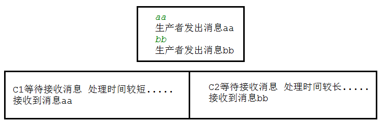

   - 在发送者发送消息 dd，发出消息之后的把 C2 消费者停掉，按理说该 C2 来处理该消息，但是由于它处理时间较长，在还未处理完，也就是说 C2 还没有执行 ack 代码的时候，C2 被停掉了，此时会看到消息被 C1 接收到了，说明消息 dd 被重新入队，然后分配给能处理消息的 C1 处理了 

     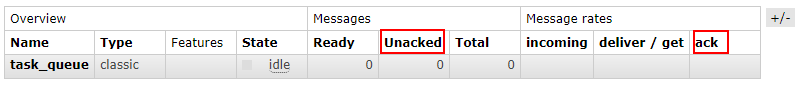

     

## 五、RabbitMQ持久化

1. 当 RabbitMQ 服务停掉以后，消息生产者发送过来的消息不丢失要如何保障？默认情况下 RabbitMQ 退出或由于某种原因崩溃时，它忽视队列和消息，除非告知它不要这样做。确保消息不会丢失需要做两件事：我们需要将队列和消息都标记为持久化

2. 队列实现持久化方式：之前我们创建的队列都是非持久化的，rabbitmq 如果重启的话，该队列就会被删除掉，如果要队列实现持久化需要在声明队列的时候把 durable 参数设置为持久化

   ```java
   //让队列持久化
   boolean durable = true;
   //声明队列
   channel.queueDeclare(TASK_QUEUE_NAME, durable, false, false, null);
   
   ```

3. 注意：如果之前声明的队列不是持久化的，需要把原先队列先删除，或者重新创建一个持久化的队列，不然就会出现错误

   

4. 以下为控制台中持久化与非持久化队列的 UI 显示区

   

5. 消息实现持久化：需要在消息生产者修改代码，`MessageProperties.PERSISTENT_TEXT_PLAIN` 添加这个属性 

   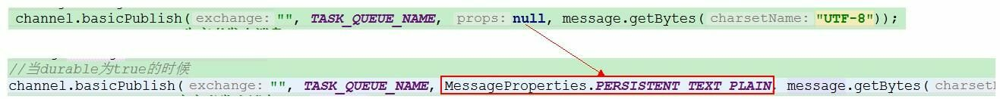

6. 将消息标记为持久化并不能完全保证不会丢失消息。尽管它告诉 RabbitMQ 将消息保存到磁盘，但是这里依然存在当消息刚准备存储在磁盘的时候，但是还没有存储完，消息还在缓存的一个间隔点。此时并没有真正写入磁盘。持久性保证并不强，但是对于我们的简单任务队列而言，这已经绰绰有余了。如果需要更强有力的持久化策略，参考发布确认 

## 六、不公平分发

1. 在最开始的时候我们学习到 RabbitMQ 分发消息采用的轮训分发，但是在某种场景下这种策略并不是很好，比方说有两个消费者在处理任务，其中有个消费者1处理任务的速度非常快，而另外一个消费者2处理速度却很慢，这个时候我们还是采用轮训分发的话，就会导致处理速度快的这个消费者很大一部分时间处于空闲状态，而处理慢的那个消费者一直在干活，这种分配方式在这种情况下其实就不太好，但是 RabbitMQ 并不知道这种情况，它依然很公平的进行分发 

2. 为了避免这种情况，在消费者中消费之前，我们可以设置参数`channel.basicQos(1);` 

   ```java
   //不公平分发
   int prefetchCount = 1;
   channel.basicQos(prefetchCount);
   //采用手动应答
   boolean autoAck = false;
   channel.basicConsume(TASK_QUEUE_NAME, autoAck, deliverCallback, cancelCallback);
   
   ```

   

   

   - 意思就是如果这个任务我还没有处理完或者我还没有应答你，你先别分配给我，我目前只能处理一个任务，然后 rabbitmq 就会把该任务分配给没有那么忙的那个空闲消费者，当然如果所有的消费者都没有完成手上任务，队列还在不停的添加新任务，队列有可能就会遇到队列被撑满的情况，这个时候就只能添加新的 worker 或者改变其他存储任务的策略

## 七、预取值分布

1. 带权的消息分布

2. 本身消息的发送就是异步发送的，所以在任何时候，channel上肯定不止只有一个消息，另外来自消费者的手动确认本质上也是异步的。因此这里就存在一个未确认的消息缓冲区，因此希望开发人员能限制此缓冲区的大小**，**以避免缓冲区里面无限制的未确认消息问题。这个时候就可以通过使用 basic.qos 方法设置“预取计数”值来完成的

3. 该值定义通道上允许的未确认消息的最大数量。一旦数量达到配置的数量，RabbitMQ 将停止在通道上传递更多消息，除非至少有一个未处理的消息被确认，例如，假设在通道上有未确认的消息 5、6、7，8，并且通道的预取计数设置为 4（此时的4对应的是数量，并不是 4 这个传递的消息），此时 RabbitMQ 将不会在该通道上再传递任何消息，除非至少有一个未应答的消息被 ack。比方说 tag=6 这个消息刚刚被确认 ACK，RabbitMQ 将会感知这个情况并再发送一条消息。消息应答和 QoS 预取值对用户吞吐量有重大影响

4. 通常，增加预取将提高向消费者传递消息的速度。虽然自动应答传输消息速率是最佳的，但是，在这种情况下已传递但尚未处理的消息的数量也会增加，从而增加了消费者的 RAM 消耗（随机存取存储器），应该小心使用具有无限预处理的自动确认模式或手动确认模式，消费者消费了大量的消息如果没有确认的话，会导致消费者连接节点的内存消耗变大，所以找到合适的预取值是一个反复试验的过程，不同的负载该值取值也不同， 100 到 300 范围内的值通常可提供最佳的吞吐量，并且不会给消费者带来太大的风险

5. 预取值为 1 是最保守的。当然这将使吞吐量变得很低，特别是消费者连接延迟很严重的情况下，特别是在消费者连接等待时间较长的环境中。对于大多数应用来说，稍微高一点的值将是最佳的

   

# 五、RabbitMQ发布确认

## 一、发布确认逻辑

- 生产者将信道设置成 confirm 模式，一旦信道进入 confirm 模式，所有在该信道上面发布的消息都将会被指派一个唯一的 ID（从 1 开始），一旦消息被投递到所有匹配的队列之后，broker 就会发送一个确认给生产者（包含消息的唯一 ID），这就使得生产者知道消息已经正确到达目的队列了，如果消息和队列是可持久化的，那么确认消息会在将消息写入磁盘之后发出，broker 回传给生产者的确认消息中 delivery-tag 域包含了确认消息的序列号，此外 broker 也可以设置 basic.ack 的 multiple 域，表示到这个序列号之前的所有消息都已经得到了处理
- confirm 模式最大的好处在于它是异步的，一旦发布一条消息，生产者应用程序就可以在等信道返回确认的同时继续发送下一条消息，当消息最终得到确认之后，生产者应用便可以通过回调方法来处理该确认消息，如果 RabbitMQ 因为自身内部错误导致消息丢失，就会发送一条 nack 消息， 生产者应用程序同样可以在回调方法中处理该 nack 消息

## 二、发布确认的策略

1. 发布确认默认是没有开启的，如果要开启需要调用方法 confirmSelect，每当你要想使用发布确认，都需要在 channel 上调用该方法

   ```java
   //开启发布确认
   channel.confirmSelect();
   ```

2. 单个确认发布

   - 这是一种简单的确认方式，它是一种**同步确认发布**的方式，也就是发布一个消息之后只有它被确认发布，后续的消息才能继续发布，`waitForConfirmsOrDie(long)` 这个方法只有在消息被确认的时候才返回，如果在指定时间范围内这个消息没有被确认那么它将抛出异常
   - 这种确认方式有一个最大的缺点就是：发布速度特别的慢，因为如果没有确认发布的消息就会阻塞所有后续消息的发布，这种方式最多提供每秒不超过数百条发布消息的吞吐量。当然对于某些应用程序来说这可能已经足够了

   ```java
   /**
    * 单个发送
    */
   public static void publishMessageIndividually() throws Exception {
       Channel channel = RabbitMqUtils.getChannel();
       //队列声明
       String queueName = UUID.randomUUID().toString();
       channel.queueDeclare(queueName, true, false, false, null);
       //开启发布确认
       channel.confirmSelect();
   
       long begin = System.currentTimeMillis();
   
       for (int i = 0; i < MESSAGE_COUNT; i++) {
           String message = i + "";
           channel.basicPublish("", queueName, null, message.getBytes());
           //服务端返回 false 或超时时间内未返回，生产者可以消息重发
           boolean flag = channel.waitForConfirms();
           if (flag) {
               System.out.println("消息发送成功");
           }
       }
   
       long end = System.currentTimeMillis();
       System.out.println("发布" + MESSAGE_COUNT + "个单独确认消息,耗时" + (end - begin) + "ms");
   
   }
   
   ```

3. 批量确认发布

   - 单个确认发布那种方式非常慢，与单个等待确认消息相比，先发布一批消息然后一起确认可以极大地提高吞吐量，当然这种方式的缺点就是：当发生故障导致发布出现问题时，不知道是哪个消息出问题了，我们必须将整个批处理保存在内存中，以记录重要的信息而后重新发布消息。当然这种方案仍然是**同步**的，也一样阻塞消息的发布 

   ```java
   /**
    * 批量
    */
   public static void publishMessageBatch() throws Exception {
       Channel channel = RabbitMqUtils.getChannel();
       //队列声明
       String queueName = UUID.randomUUID().toString();
       channel.queueDeclare(queueName, true, false, false, null);
       //开启发布确认
       channel.confirmSelect();
       //批量确认消息大小
       int batchSize = 100;
       //未确认消息个数
       int outstandingMessageCount = 0;
       long begin = System.currentTimeMillis();
   
       for (int i = 0; i < MESSAGE_COUNT; i++) {
           String message = i + "";
           channel.basicPublish("", queueName, null, message.getBytes());
           outstandingMessageCount++;
           if (outstandingMessageCount == batchSize) {
               channel.waitForConfirms();
               outstandingMessageCount = 0;
           }
       }
       //为了确保还有剩余没有确认消息 再次确认
       if (outstandingMessageCount > 0) {
           channel.waitForConfirms();
       }
       long end = System.currentTimeMillis();
       System.out.println("发布" + MESSAGE_COUNT + "个批量确认消息,耗时" + (end - begin) + "ms");
   }
   
   ```

4. 异步确认发布

   - 异步确认虽然编程逻辑比上两个要复杂，但是性价比最高，无论是可靠性还是效率都没得说， 他是利用回调函数来达到消息可靠性传递的，这个中间件也是通过函数回调来保证是否投递成功 
   - 处理异步未处理消息的解决方案：把未确认的消息放到一个基于内存的并且能被发布线程访问的队列， 比如说用 ConcurrentLinkedQueue 这个队列在 confirm callbacks 与发布线程之间进行消息的传递 

   

5. 单个确认发布、批量确认发布以及异步确认发布速度对比

   - 单个确认发布：同步等待确认，简单，但吞吐量非常有限
   - 批量确认发布：批量同步等待确认，简单，合理的吞吐量，一旦出现问题但很难推断出是那条消息出现了问题
   - 异步确认发布：最佳性能和资源使用，在出现错误的情况下可以很好地控制，但是实现起来稍微难些

# 六、RabbitMQ交换机 

## 一、Exchanges概述

1. RabbitMQ 消息传递模型的核心思想是: **生产者生产的消息从不会直接发送到队列**。实际上，通常生产者甚至都不知道这些消息传递传递到了哪些队列中
2. 相反，**生产者只能将消息发送到交换机（exchange）**，交换机工作的内容非常简单，一方面它接收来自生产者的消息，另一方面将它们推入队列。交换机必须确切知道如何处理收到的消息。是应该把这些消息放到特定队列还是说把它们到许多队列中还是说应该丢弃它们。这就的由交换机的类型来决定

## 二、Exchanges类型

1. Exchanges类型可分为：直接(direct)、主题(topic)、标题(headers)、扇出(fanout)

2. 无名exchange：在前面部分我们对 exchange 一无所知，但仍然能够将消息发送到队列。之前能实现的原因是因为我们使用的是默认交换，我们通过空字符串(“”)进行标识   

   

   - 第一个参数是交换机的名称。空字符串表示默认或无名称交换机：消息能路由发送到队列中其实是由 routingKey(bindingkey)，即将消息路由到指定队列的关键字绑定 key 指定的，如果它存在的话

## 三、临时队列

1. 之前的章节我们使用的是具有特定名称的队列（也就是使用过的 hello 和 ack_queue ）。队列的名称我们来说至关重要，我们需要指定我们的消费者去消费哪个队列的消息

2. 每当我们连接到 Rabbit 时，我们都需要一个全新的空队列，为此我们可以创建一个具有**随机名称的队列**，或者能让服务器为我们选择一个随机队列名称那就更好了。其次一旦我们断开了消费者的连接，队列将被自动删除 

3. 创建临时队列的方式如下：

   ```java
   String queueName = channel.queueDeclare().getQueue();
   ```

   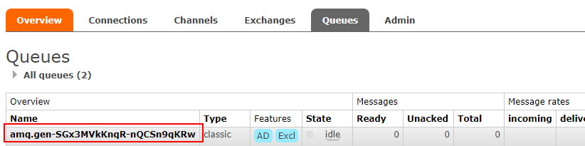

## 四、绑定bindings

- binding 其实是 exchange 和 queue 之间的桥梁，它告诉我们 exchange 和哪个队列进行了绑定关系。比如说下面这张图告诉我们的就是 X 与 Q1 和 Q2 进行了绑定 

  

  

## 五、Fanout exchange

### 一、Fanout介绍

- Fanout 这种类型非常简单。正如从名称中猜到的那样，它是将接收到的所有消息广播到它知道的所有队列中。系统中默认有些 exchange 类型
- Fanout 不需要路由键 routingKey 
- Fanout 会把所有的消息发布到所有与之关联的队列，连接对应队列的消费者都会消费所有接收到的消息。也就是生产者可能会把所有的消息都传播出去，所有的消费者都可能消费所有的消息


### 二、Fanout实战

1. Fanout流程图

   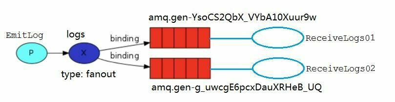

2. Logs 和临时队列的绑定关系如下图

   

3. 为了说明这种模式，我们将构建一个简单的日志系统。它将由两个程序组成:第一个程序将发出日志消 息，第二个程序是消费者。其中我们会启动两个消费者，其中一个消费者接收到消息后把日志存储在磁盘 

4. ReceiveLogs01 将接收到的消息打印在控制台

   ```java
   import com.oddfar.utils.RabbitMqUtils;
   import com.rabbitmq.client.Channel;
   import com.rabbitmq.client.DeliverCallback;
   
   /**
    * @author zhiyuan
    */
   public class ReceiveLogs01 {
       private static final String EXCHANGE_NAME = "logs";
   
       public static void main(String[] args) throws Exception {
   
           Channel channel = RabbitMqUtils.getChannel();
           channel.exchangeDeclare(EXCHANGE_NAME, "fanout");
           /**
            * 生成一个临时的队列 队列的名称是随机的
            * 当消费者断开和该队列的连接时 队列自动删除
            */
           String queueName = channel.queueDeclare().getQueue();
           //把该临时队列绑定我们的 exchange 其中 routingkey(也称之为 binding key)为空字符串
           channel.queueBind(queueName, EXCHANGE_NAME, "");
           System.out.println("等待接收消息,把接收到的消息打印在屏幕........... ");
   
           //发送回调
           DeliverCallback deliverCallback = (consumerTag, delivery) -> {
               String message = new String(delivery.getBody(), "UTF-8");
               System.out.println("控制台打印接收到的消息" + message);
           };
           channel.basicConsume(queueName, true, deliverCallback, consumerTag -> {});
   
       }
   }
   
   ```

5. ReceiveLogs02 把消息写出到文件

   ```java
   public class ReceiveLogs02 {
       private static final String EXCHANGE_NAME = "logs";
   
       public static void main(String[] args) throws Exception {
   
           Channel channel = RabbitMqUtils.getChannel();
           channel.exchangeDeclare(EXCHANGE_NAME, "fanout");
           /**
            * 生成一个临时的队列 队列的名称是随机的
            * 当消费者断开和该队列的连接时 队列自动删除
            */
           String queueName = channel.queueDeclare().getQueue();
           //把该临时队列绑定我们的 exchange 其中 routingkey(也称之为 binding key)为空字符串
           channel.queueBind(queueName, EXCHANGE_NAME, "");
           System.out.println("等待接收消息,把接收到的消息写到文件........... ");
   
           //发送回调
           DeliverCallback deliverCallback = (consumerTag, delivery) -> {
               String message = new String(delivery.getBody(), "UTF-8");
               File file = new File("D:\\test\\rabbitmq_info.txt");
               FileUtils.writeStringToFile(file,message,"UTF-8");
               System.out.println("数据写入文件成功");
           };
           channel.basicConsume(queueName, true, deliverCallback, consumerTag -> {});
   
       }
   }
   
   ```

6. EmitLog 发送消息给两个消费者接收

   ```java
   public class EmitLog {
       private static final String EXCHANGE_NAME = "logs";
   
       public static void main(String[] args) throws Exception {
           Channel channel = RabbitMqUtils.getChannel();
   
           /**
            * 声明一个 exchange
            * 1.exchange 的名称
            * 2.exchange 的类型
            */
           channel.exchangeDeclare(EXCHANGE_NAME, "fanout");
           Scanner sc = new Scanner(System.in);
           System.out.println("请输入信息");
           while (sc.hasNext()) {
               String message = sc.nextLine();
               channel.basicPublish(EXCHANGE_NAME, "", null, message.getBytes("UTF-8"));
               System.out.println("生产者发出消息" + message);
           }
       }
       
   }
   
   ```

## 六、Direct exchange

### 一、Direct介绍

1. 在 Fanout exchange 中，我们构建了一个简单的日志记录系统。我们能够向许多接收者广播日志消息。在 Direct exchange 中，我们将向其中添加一些特别的功能——让某个消费者订阅发布的部分消息。例如我们只把严重错误消息定向存储到日志文件（以节省磁盘空间），同时仍然能够在控制台上打印所有日志消息

2. bindings，即是交换机和队列之间的桥梁关系。也可以这么理解：**队列只对它绑定的交换机的消息感兴趣**。绑定用参数：routingKey 来表示，也可称该参数为 binding key。创建绑定我们用代码：`channel.queueBind(queueName, EXCHANGE_NAME, "routingKey");  `

3. 绑定之后的意义由其交换类型决定 

4. Fanout exchange 中的我们的日志系统将所有消息广播给所有消费者，对此我们想做一些改变，例如我们希望将日志消息写入磁盘的程序仅接收严重错误（erros），而不存储哪些警告（warning）或信息（info）日志消息以此避免浪费磁盘空间。Fanout 这种交换类型并不能给我们带来很大的灵活性，它只能进行无意识的广播，在这里我们将使用 direct 这种类型来进行替换，这种类型的工作方式是，消息只去到它绑定的 routingKey 队列中去

   

5. 在上面这张图中，我们可以看到 X 绑定了两个队列，绑定类型是 direct 。队列 Q1 绑定键为 orange，队列 Q2 绑定键有两个：一个绑定键为 black，另一个绑定键为 green。在这种绑定情况下，生产者发布消息到 exchange 上，绑定键为 orange 的消息会被发布到队列 Q1。绑定键为 black和green 的消息会被发布到队列 Q2，其他消息类型的消息将被丢弃

### 二、多重绑定

- 如果 exchange 的绑定类型是direct，**但是它绑定的多个队列的 key 如果都相同**，在这种情况下虽然绑定类型是 direct **但是它表现的就和 fanout 有点类似了**，就跟广播差不多，如上图所示 

  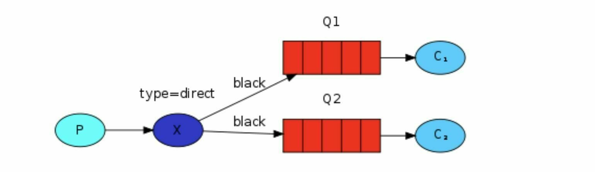

### 三、Direct实战

1. 关系

   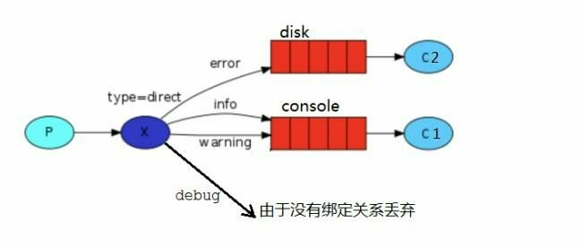

2. 交换机

   

   - c1：绑定console，routingKey为info、warning 
   - c2：绑定disk，routingKey为error 

3. c1代码

   ```java
   public class ReceiveLogsDirect01 {
       private static final String EXCHANGE_NAME = "direct_logs";
   
       public static void main(String[] args) throws Exception {
           Channel channel = RabbitMqUtils.getChannel();
           channel.exchangeDeclare(EXCHANGE_NAME, BuiltinExchangeType.DIRECT);
   
           String queueName = "console";
           //队列声明
           channel.queueDeclare(queueName, false, false, false, null);
           //队列绑定
           channel.queueBind(queueName, EXCHANGE_NAME, "info");
           channel.queueBind(queueName, EXCHANGE_NAME, "warning");
   
           System.out.println("等待接收消息...");
   
           //发送回调
           DeliverCallback deliverCallback = (consumerTag, delivery) -> {
               String message = new String(delivery.getBody(), "UTF-8");
               message = "接收绑定键:" + delivery.getEnvelope().getRoutingKey() + ",消息:" + message;
               System.out.println("info和warning 消息已经接收：\n" + message);
           };
           channel.basicConsume(queueName, true, deliverCallback, consumerTag -> {
           });
       }
   }
   ```

4. c2代码

   ```java
   public class ReceiveLogsDirect02 {
       private static final String EXCHANGE_NAME = "direct_logs";
   
       public static void main(String[] args) throws Exception {
           Channel channel = RabbitMqUtils.getChannel();
           channel.exchangeDeclare(EXCHANGE_NAME, BuiltinExchangeType.DIRECT);
   
           String queueName = "disk";
           //队列声明
           channel.queueDeclare(queueName, false, false, false, null);
           //队列绑定
           channel.queueBind(queueName, EXCHANGE_NAME, "error");
           System.out.println("等待接收消息...");
   
           //发送回调
           DeliverCallback deliverCallback = (consumerTag, delivery) -> {
               String message = new String(delivery.getBody(), "UTF-8");
               message = "接收绑定键:" + delivery.getEnvelope().getRoutingKey() + ",消息:" + message;
               System.out.println("error 消息已经接收：\n" + message);
           };
           channel.basicConsume(queueName, true, deliverCallback, consumerTag -> {
           });
       }
   }
   ```

5. EmitLogDirect

   ```java
   public class EmitLogDirect {
       private static final String EXCHANGE_NAME = "direct_logs";
   
       public static void main(String[] args) throws Exception {
           Channel channel = RabbitMqUtils.getChannel();
           channel.exchangeDeclare(EXCHANGE_NAME, BuiltinExchangeType.DIRECT);
   
           //创建多个 bindingKey
           Map<String, String> bindingKeyMap = new HashMap<>();
           bindingKeyMap.put("info", "普通 info 信息");
           bindingKeyMap.put("warning", "警告 warning 信息");
           bindingKeyMap.put("error", "错误 error 信息");
           //debug 没有消费这接收这个消息 所以就丢失了
           bindingKeyMap.put("debug", "调试 debug 信息");
   
           for (Map.Entry<String, String> bindingKeyEntry : bindingKeyMap.entrySet()) {
               //获取 key value
               String bindingKey = bindingKeyEntry.getKey();
               String message = bindingKeyEntry.getValue();
   
               channel.basicPublish(EXCHANGE_NAME, bindingKey, null, message.getBytes("UTF-8"));
               System.out.println("生产者发出消息:" + message);
           }
       }
   }
   
   ```

## 七、Topics exchange

### 一、Topics介绍

1. 在上一个小节中，我们改进了日志记录系统。我们没有使用只能进行随意广播的 fanout 交换机，而是使用了 direct 交换机，从而有能实现有选择性地接收日志
2. 尽管使用 direct 交换机改进了我们的系统，但是它仍然存在局限性——比方说我们想接收的日志类型有 info.base 和 info.advantage，某个队列只想 info.base 的消息，那这个时候direct 就办不到了。这个时候就只能使用 **topic** 类型的交换机

### 二、Topic的要求 

1. 发送到类型是 topic 交换机的消息的 routing_key 不能随意写，必须满足一定的要求，它必须是**一个单词列表**，**以点号分隔开**。这些单词可以是任意单词
   - 比如说："stock.usd.nyse", "nyse.vmw", "quick.orange.rabbit".这种类型的
   - 当然这个单词列表最多不能超过 255 个字节
2.  在这个规则列表中，其中有两个替换符是大家需要注意的： 
   - `*`可以代替一个单词
   - `#`可以替代零个或多个单词

### 三、Topic匹配案例

1.  绑定关系如下 

   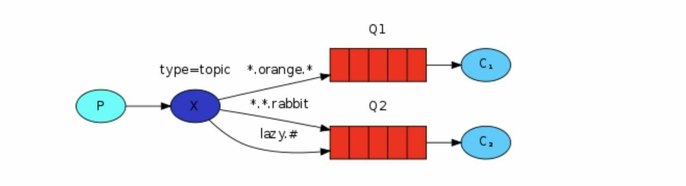

   - Q1-->绑定的是中间带 orange 带 3 个单词的字符串 `(*.orange.*)`
   - Q2-->绑定的是最后一个单词是rabbit的3个单词 `(*.*.rabbit)`以及第一个单词是lazy的多个单词`(lazy.#)`

2. Topic匹配注意点

   - 当一个队列绑定键是#，那么这个队列将接收所有数据，就有点像 fanout 了
   - 如果队列绑定键当中没有#和*出现，那么该队列绑定类型就是 direct 了

### 四、Topic实战

1. 图示

   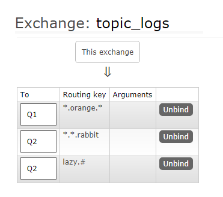

2. EmitLogTopic

   ```java
   public class EmitLogTopic {
       private static final String EXCHANGE_NAME = "topic_logs";
   
       public static void main(String[] args) throws Exception {
           Channel channel = RabbitMqUtils.getChannel();
           channel.exchangeDeclare(EXCHANGE_NAME, BuiltinExchangeType.TOPIC);
   
           /**
            * Q1-->绑定的是
            *      中间带 orange 带 3 个单词的字符串(*.orange.*)
            * Q2-->绑定的是
            *      最后一个单词是 rabbit 的 3 个单词(*.*.rabbit)
            *      第一个单词是 lazy 的多个单词(lazy.#)
            *
            */
           Map<String, String> bindingKeyMap = new HashMap<>();
           bindingKeyMap.put("quick.orange.rabbit", "被队列 Q1Q2 接收到");
           bindingKeyMap.put("lazy.orange.elephant", "被队列 Q1Q2 接收到");
           bindingKeyMap.put("quick.orange.fox", "被队列 Q1 接收到");
           bindingKeyMap.put("lazy.brown.fox", "被队列 Q2 接收到");
           bindingKeyMap.put("lazy.pink.rabbit", "虽然满足两个绑定但只被队列 Q2 接收一次");
           bindingKeyMap.put("quick.brown.fox", "不匹配任何绑定不会被任何队列接收到会被丢弃");
           bindingKeyMap.put("quick.orange.male.rabbit", "是四个单词不匹配任何绑定会被丢弃");
           bindingKeyMap.put("lazy.orange.male.rabbit", "是四个单词但匹配 Q2");
           for (Map.Entry<String, String> bindingKeyEntry : bindingKeyMap.entrySet()) {
               String bindingKey = bindingKeyEntry.getKey();
               String message = bindingKeyEntry.getValue();
   
               channel.basicPublish(EXCHANGE_NAME, bindingKey, null, message.getBytes("UTF-8"));
               System.out.println("生产者发出消息：" + message);
           }
       }
   }
   ```

3. ReceiveLogsTopic01 

   ```java
   public class ReceiveLogsTopic01 {
       private static final String EXCHANGE_NAME = "topic_logs";
   
       public static void main(String[] args) throws Exception {
           Channel channel = RabbitMqUtils.getChannel();
           channel.exchangeDeclare(EXCHANGE_NAME, BuiltinExchangeType.TOPIC);
           //声明 Q1 队列与绑定关系
           String queueName = "Q1";
           //声明
           channel.queueDeclare(queueName, false, false, false, null);
           //绑定
           channel.queueBind(queueName, EXCHANGE_NAME, "*.orange.*");
           System.out.println("等待接收消息........... ");
   
           DeliverCallback deliverCallback = (consumerTag, delivery) -> {
               String message = new String(delivery.getBody(), "UTF-8");
               System.out.println(" 接收队列:" + queueName + " 绑定键:" + delivery.getEnvelope().getRoutingKey() + ",消息:" + message);
           };
           channel.basicConsume(queueName, true, deliverCallback, consumerTag -> {
           });
       }
   }
   
   ```

4. ReceiveLogsTopic02

   ```java
   public class ReceiveLogsTopic02 {
       private static final String EXCHANGE_NAME = "topic_logs";
   
       public static void main(String[] args) throws Exception {
           Channel channel = RabbitMqUtils.getChannel();
           channel.exchangeDeclare(EXCHANGE_NAME, BuiltinExchangeType.TOPIC);
           //声明 Q2 队列与绑定关系
           String queueName = "Q2";
           //声明
           channel.queueDeclare(queueName, false, false, false, null);
           //绑定
           channel.queueBind(queueName, EXCHANGE_NAME, "*.*.rabbit");
           channel.queueBind(queueName, EXCHANGE_NAME, "lazy.#");
   
           System.out.println("等待接收消息........... ");
   
           DeliverCallback deliverCallback = (consumerTag, delivery) -> {
               String message = new String(delivery.getBody(), "UTF-8");
               System.out.println(" 接收队列:" + queueName + " 绑定键:" + delivery.getEnvelope().getRoutingKey() + ",消息:" + message);
           };
           channel.basicConsume(queueName, true, deliverCallback, consumerTag -> {
           });
       }
   }
   
   ```

## 八、Headers exchange

### 一、Headers介绍

1. Headers exchange 类似于 Direct exchange。但是它是通过匹配 AMQP 消息的 heade 而非路由键 

   

2. Headers 交换机是通过 Headers 头部来将消息映射到队列的 ，有点像 HTTP 的 Headers 

3. Hash结构中要求携带一个键 "x-match"，这个键的Value可以是any或者all，这代表消息携带的 Hash 是需要全部匹配（all），还是仅匹配一个键（any）就可以了

4. 相比 Direct exchange ，Headers exchange 的优势是匹配的规则不被限定为 String 而是 Object 类型 

   - all：在发布消息时携带的所有 Entry 必须和绑定在队列上的所有 Entry 完全匹配
   - any：只要在发布消息时携带的有一对键值对 headers 满足队列定义的多个参数 arguments 的其中一个就能匹配上 ，注意这里是键值对的完全匹配，只匹配到键了，值却不—样是不行的

5. 使用 Headers exchange 的时候匹配规则和当前的 routeKey 无关

6. 这里的匹配，主要是消息携带的参数与消费者定义的参数比较，占据主动的是消费者，最终解释权归属消费者

7. 需要注意的是：x- 开头的参数都不算匹配项；当消费者没有参数的时候，消息都会被路由到该消费者   

### 二、Headers实战

1. 消费者1

   ```java
    
   /**
    * 消费者1
    * @Tag 主题交换Topic exchange
    */
   public class MQConsumerOne {
    
       public static void main(String[] args) {
           try {
               consumerMsg("header.exchange");
           } catch (Exception e) {
               e.printStackTrace();
           }
       }
    
       /**
        * 构建参数
        */
       public static Map buildArgs()
       {
           HashMap<String,String> args = new HashMap<>();
           args.put("name","张三");
           args.put("age","32");
           args.put("x-match","any");
           return args;
       }
    
       /**
        * 消费者逻辑
        * @param exchangeName
        * @throws IOException
        * @throws TimeoutException
        */
       public static void consumerMsg(String exchangeName) throws IOException, TimeoutException {
           //创建连接工厂
           ConnectionFactory connectionFactory = new ConnectionFactory();
           //设置连接地址
           connectionFactory.setHost("192.168.239.128");
           //设置连接端口
           connectionFactory.setPort(5672);
           //设置连接的虚拟机
           connectionFactory.setVirtualHost("mqtest");
           //设置连接用户
           connectionFactory.setUsername("mqtest");
           //设置连接用户密码
           connectionFactory.setPassword("test123");
           //创建连接
           Connection connection = connectionFactory.newConnection();
           //创建通道
           Channel channel = connection.createChannel();
           //声明交换机
           channel.exchangeDeclare(exchangeName, BuiltinExchangeType.HEADERS);
           //声明队列(临时排它队列)
           String queueName = channel.queueDeclare().getQueue();
           //构建参数
           Map args = buildArgs();
           //绑定交换机
           channel.queueBind(queueName,exchangeName,"",args);
           //消费消息（主动确认）
           channel.basicConsume(queueName,true,(tag,msg)->{
               System.out.println(new String(msg.getBody(),"UTF-8"));
           },(cancel)->{
    
           });
          /* //关闭连接
           channel.close();
           connection.close();*/
       }
   }
   ```

2. 消费者2

   ```java
   /**
    * 消费者2
    * @Tag 主题交换Topic exchange
    */
   public class MQConsumerTwo {
    
       public static void main(String[] args) {
           try {
               consumerMsg("header.exchange");
           } catch (Exception e) {
               e.printStackTrace();
           }
       }
    
       /**
        * 构建参数
        */
       public static Map buildArgs()
       {
           HashMap<String,String> args = new HashMap<>();
           args.put("name","李四");
           args.put("age","32");
           args.put("x-match","all");
           return args;
       }
    
       /**
        * 消费者逻辑
        * @param exchangeName
        * @throws IOException
        * @throws TimeoutException
        */
       public static void consumerMsg(String exchangeName) throws IOException, TimeoutException {
           //创建连接工厂
           ConnectionFactory connectionFactory = new ConnectionFactory();
           //设置连接地址
           connectionFactory.setHost("192.168.239.128");
           //设置连接端口
           connectionFactory.setPort(5672);
           //设置连接的虚拟机
           connectionFactory.setVirtualHost("mqtest");
           //设置连接用户
           connectionFactory.setUsername("mqtest");
           //设置连接用户密码
           connectionFactory.setPassword("test123");
           //创建连接
           Connection connection = connectionFactory.newConnection();
           //创建通道
           Channel channel = connection.createChannel();
           //声明交换机
           channel.exchangeDeclare(exchangeName, BuiltinExchangeType.HEADERS);
           //声明队列(临时排它队列)
           String queueName = channel.queueDeclare().getQueue();
           //构建标头参数
           Map map = buildArgs();
           //绑定交换机
           channel.queueBind(queueName,exchangeName,"",map);
           //消费消息（主动确认）
           channel.basicConsume(queueName,true,(tag,msg)->{
               System.out.println(new String(msg.getBody(),"UTF-8"));
           },(cancel)->{
    
           });
          /* //关闭连接
           channel.close();
           connection.close();*/
       }
   }
   ```

3. 生产者

   ```java
   /**
    * 生产者
    * @Tag 主题交换Topic exchange
    */
   public class MQProducer {
    
       public static void main(String[] args) {
           try {
               producerMsg("header.exchange","想要我的消息？就看你有没得这个本事！");
           } catch (Exception e) {
               e.printStackTrace();
           }
       }
    
       /**
        * 构建参数
        */
       public static Map buildArgs()
       {
           HashMap<String,String> args = new HashMap<>();
           args.put("name","李四");
           args.put("age","32");
           args.put("weight","180");
           return args;
       }
    
       /**
        * 生产者
        * @param exchangeName
        * @param msg
        * @throws IOException
        * @throws TimeoutException
        */
       public static void producerMsg(String exchangeName,String msg) throws IOException, TimeoutException {
           //创建连接工厂
           ConnectionFactory connectionFactory = new ConnectionFactory();
           //设置连接地址
           connectionFactory.setHost("192.168.239.128");
           //设置连接端口
           connectionFactory.setPort(5672);
           //设置连接的虚拟机
           connectionFactory.setVirtualHost("mqtest");
           //设置连接用户
           connectionFactory.setUsername("mqtest");
           //设置连接用户密码
           connectionFactory.setPassword("test123");
           //创建连接
           Connection connection = connectionFactory.newConnection();
           //创建通道
           Channel channel = connection.createChannel();
           //声明临时交换机
           channel.exchangeDeclare(exchangeName, BuiltinExchangeType.HEADERS,false);
           //构建标头参数
           Map map = buildArgs();
           AMQP.BasicProperties basicProperties = new AMQP.BasicProperties.Builder().headers(map).build();
           //创建生产者
           channel.basicPublish(exchangeName,"",basicProperties,msg.getBytes("UTF-8"));
           //关闭连接
           channel.close();
           connection.close();
       }
   }
   ```

   - 完成代码逻辑过后，分别启动消费者1、消费者2和唯一的生产者，观察消息的收发情况。这里消费者1、消费者2都收到了消息

     

   - 消费者1的Headers中特殊参数 x-match 为 any，表示只要来的消息能任意匹配到Headers参数中任意一个参数与其值就可以了，满足一个就收了这个消息。生产者的Headers集合中刚好有一个age与消费者1的age参数匹配，消费者1该收到消息

   - 消费者2的Headers中特殊参数 x-match 为 all，表示要全部满足消费者2的参数要求，它才会将对应的消息收下。这里生产者的Headers集合中有两个参数满足消费者2的要求，name和age两个的参数与值都匹配，看上去还差 x-match 没匹配到，但是上面提过，x- 开头的不算进匹配项，特殊参数匹配的时候略过，忽略 x-match 后这里全部匹配，消费者2该收到消息 


## 九、BindingKey和RoutingKey的区别

1. 路由键（Routingkey）：
   - 定义：Routing Key 是在生产者发送消息时附加到消息的属性，用于路由消息到特定的交换机（Exchange）
   - 作用：Routing Key 决定了消息将被发送到哪个交换机，它是交换机与队列之间的关键匹配条件
   - 特点：Routing Key 通常是一个简单的字符串，它可以直接指定交换机将消息发送到哪个队列
2. 绑定键（Bindingkey）：
   - 定义：Binding Key 是在消费者创建队列与交换机之间的绑定时指定的条件。它告诉交换机如何将消息路由到与之绑定的队列
   - 作用：Binding Key 用于交换机确定如何将消息发送到与之绑定的队列，它与交换机类型（direct、topic等）及其配置密切相关
   - 特点：Binding Key 可以是一个模式（pattern），用于灵活地匹配消息的 Routing Key
3. 总结：
   - 用途：Routing Key 用于生产者确定消息发送的路由路径，而 Binding Key 用于消费者确定接收消息的路由路径
   - 关联对象：Routing Key 用于消息和交换机直接关联，而 Binding Key 用于队列和交换机之间的绑定关联
   - 灵活性：Routing Key 通常是直接的文本字符串，而 Binding Key 可以使用通配符进行模式匹配

# 七、RabbitMQ死信队列

## 一、死信的概念

1. 死信，顾名思义就是无法被消费的消息，字面意思可以这样理解，一般来说，producer 将消息投递到 broker 或者直接到 queue 里了，consumer 从 queue 取出消息进行消费，但某些时候由于特定的原因**导致 queue 中的某些消息无法被消费**，这样的消息如果没有后续的处理，就变成了死信，有死信自然就有了死信队列
2. 应用场景：为了保证订单业务的消息数据不丢失，需要使用到 RabbitMQ 的死信队列机制，当消息消费发生异常时，将消息投入死信队列中。还有比如说：用户在商城下单成功并点击去支付后在指定时间未支付时自动失效

## 二、死信的来源

1. 消息 TTL 过期：TTL 是 Time To Live 的缩写，也就是生存时间
2. 队列达到最大长度：队列满了，无法再添加数据到 mq 中
3. 消息被拒绝：(basic.reject 或 basic.nack) 并且 requeue=false

## 三、死信实战

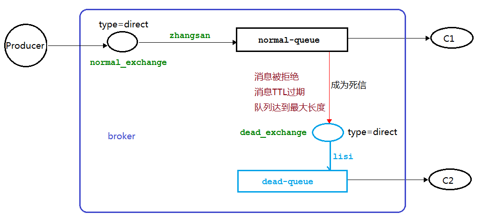

### 一、死信之TTL

1. 消费者 C1 代码： 

   ```java
   public class Consumer01 {
   
       //普通交换机名称
       private static final String NORMAL_EXCHANGE = "normal_exchange";
       //死信交换机名称
       private static final String DEAD_EXCHANGE = "dead_exchange";
   
       public static void main(String[] args) throws Exception {
           Channel channel = RabbitMqUtils.getChannel();
   
           //声明死信和普通交换机 类型为 direct
           channel.exchangeDeclare(NORMAL_EXCHANGE, BuiltinExchangeType.DIRECT);
           channel.exchangeDeclare(DEAD_EXCHANGE, BuiltinExchangeType.DIRECT);
   
           //声明死信队列
           String deadQueue = "dead-queue";
           channel.queueDeclare(deadQueue, false, false, false, null);
           //死信队列绑定：队列、交换机、路由键（routingKey）
           channel.queueBind(deadQueue, DEAD_EXCHANGE, "lisi");
   
           //正常队列绑定死信队列信息
           Map<String, Object> params = new HashMap<>();
           //正常队列设置死信交换机 参数 key 是固定值
           params.put("x-dead-letter-exchange", DEAD_EXCHANGE);
           //正常队列设置死信 routing-key 参数 key 是固定值
           params.put("x-dead-letter-routing-key", "lisi");
   
           //正常队列
           String normalQueue = "normal-queue";
           channel.queueDeclare(normalQueue, false, false, false, params);
           channel.queueBind(normalQueue, NORMAL_EXCHANGE, "zhangsan");
   
           System.out.println("等待接收消息........... ");
           DeliverCallback deliverCallback = (consumerTag, delivery) -> {
               String message = new String(delivery.getBody(), "UTF-8");
               System.out.println("Consumer01 接收到消息" + message);
           };
           channel.basicConsume(normalQueue, true, deliverCallback, consumerTag -> {
           });
       }
   
   }
   ```

2. 生产者代码

   ```java
   public class Producer {
       private static final String NORMAL_EXCHANGE = "normal_exchange";
   
       public static void main(String[] argv) throws Exception {
           Channel channel = RabbitMqUtils.getChannel();
   
           channel.exchangeDeclare(NORMAL_EXCHANGE, BuiltinExchangeType.DIRECT);
           //设置消息的 TTL 时间 10s
           AMQP.BasicProperties properties = new AMQP.BasicProperties().builder().expiration("10000").build();
           //该信息是用作演示队列个数限制
           for (int i = 1; i < 11; i++) {
               String message = "info" + i;
               channel.basicPublish(NORMAL_EXCHANGE, "zhangsan", properties, message.getBytes());
               System.out.println("生产者发送消息:" + message);
           }
       }
   }
   
   ```

3. 启动 C1 ，之后关闭消费者，模拟其接收不到消息。再启动 Producer 

   

4. 消费者 C2 代码如下，以上步骤完成后，启动 C2 消费者，它消费死信队列里面的消息 

   ```java
   public class Consumer02 {
       //死信交换机名称
       private static final String DEAD_EXCHANGE = "dead_exchange";
   
       public static void main(String[] args) throws Exception {
           Channel channel = RabbitMqUtils.getChannel();
   
           //声明交换机
           channel.exchangeDeclare(DEAD_EXCHANGE, BuiltinExchangeType.DIRECT);
           //声明队列
           String deadQueue = "dead-queue";
           channel.queueDeclare(deadQueue, false, false, false, null);
           channel.queueBind(deadQueue, DEAD_EXCHANGE, "lisi");
   
           System.out.println("等待接收死信消息........... ");
           DeliverCallback deliverCallback = (consumerTag, delivery) -> {
               String message = new String(delivery.getBody(), "UTF-8");
               System.out.println("Consumer02 接收到消息" + message);
           };
           channel.basicConsume(deadQueue, true, deliverCallback, consumerTag -> {
           });
       }
   }
   
   ```

### 二、死信之最大长度

1. 消息生产者代码去掉 TTL 属性

   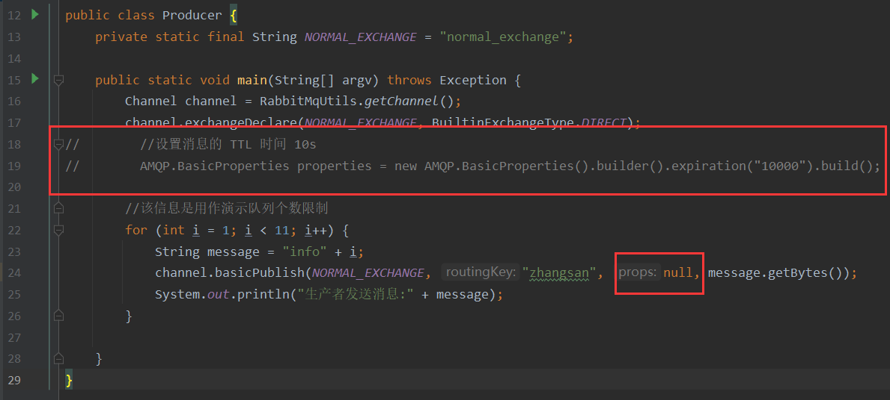

2. C1 消费者修改以下代码（启动之后关闭该消费者 模拟其接收不到消息）。注意此时需要把原先队列删除，因为参数改变了 

   

   ```java
   //设置正常队列的长度限制，例如发10个，4个则为死信
   params.put("x-max-length",6);
   ```

3. C2 消费者代码不变（启动 C2 消费者）

   

### 三、死信之消息被拒

1. 消息生产者代码同上生产者一致 

2. C1 消费者代码（启动之后关闭该消费者，模拟其接收不到消息）。模拟拒收消息 "info5" 

   ```java
   public class Consumer01 {
   
       //普通交换机名称
       private static final String NORMAL_EXCHANGE = "normal_exchange";
       //死信交换机名称
       private static final String DEAD_EXCHANGE = "dead_exchange";
   
       public static void main(String[] args) throws Exception {
           Channel channel = RabbitMqUtils.getChannel();
   
           //声明死信和普通交换机 类型为 direct
           channel.exchangeDeclare(NORMAL_EXCHANGE, BuiltinExchangeType.DIRECT);
           channel.exchangeDeclare(DEAD_EXCHANGE, BuiltinExchangeType.DIRECT);
   
           //声明死信队列
           String deadQueue = "dead-queue";
           channel.queueDeclare(deadQueue, false, false, false, null);
           //死信队列绑定：队列、交换机、路由键（routingKey）
           channel.queueBind(deadQueue, DEAD_EXCHANGE, "lisi");
           
           //正常队列绑定死信队列信息
           Map<String, Object> params = new HashMap<>();
           //正常队列设置死信交换机 参数 key 是固定值
           params.put("x-dead-letter-exchange", DEAD_EXCHANGE);
           //正常队列设置死信 routing-key 参数 key 是固定值
           params.put("x-dead-letter-routing-key", "lisi");
   //        //设置正常队列的长度限制，例如发10个，4个则为死信
   //        params.put("x-max-length",6);
           
           //正常队列
           String normalQueue = "normal-queue";
           channel.queueDeclare(normalQueue, false, false, false, params);
           channel.queueBind(normalQueue, NORMAL_EXCHANGE, "zhangsan");
   
           System.out.println("等待接收消息........... ");
           
           DeliverCallback deliverCallback = (consumerTag, delivery) -> {
               String message = new String(delivery.getBody(), "UTF-8");
               if (message.equals("info5")) {
                   System.out.println("Consumer01 接收到消息" + message + "并拒绝签收该消息");
                   //requeue 设置为 false 代表拒绝重新入队 该队列如果配置了死信交换机将发送到死信队列中
                   channel.basicReject(delivery.getEnvelope().getDeliveryTag(), false);
               } else {
                   System.out.println("Consumer01 接收到消息" + message);
                   channel.basicAck(delivery.getEnvelope().getDeliveryTag(), false);
               }
   
           };
           //开启手动应答
           channel.basicConsume(normalQueue, false, deliverCallback, consumerTag -> {
           });
       }
   
   }
   
   ```

   

3. C2 消费者代码不变。启动消费者 1 然后再启动消费者 2 

   

