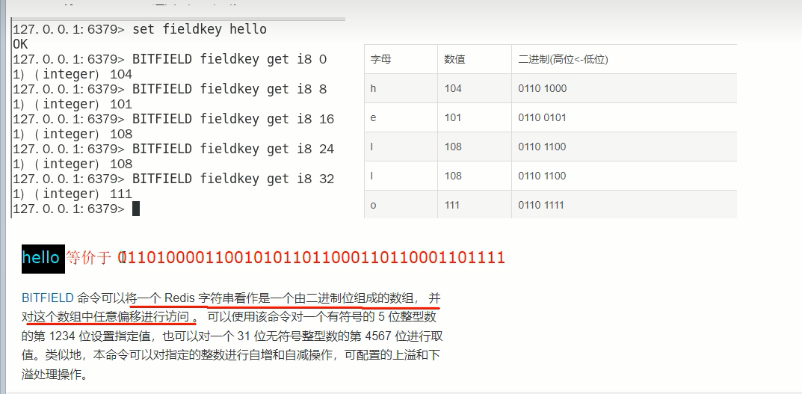
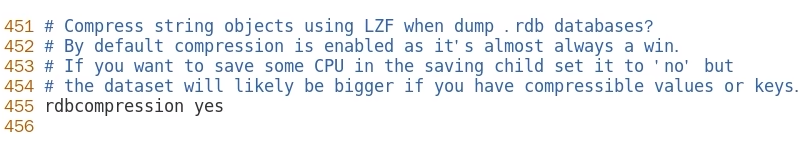

#  一、Redis入门概述

## 一、Redis概述

- Remote Dictionary Server（远程字典服务器）是完全开源的，使用ANSIC语言编写遵守BSD协议，是一个高性能的Key-Value数据库，提供了丰富的数据结构，例如String、Hash、List、Set、SortedSet等等。数据是存在内存中的，同时Redis支持事务、持久化、LUA脚本、发布/订阅、缓存淘汰、流技术等多种功能，提供了主从模式、Redis Sentinel和Redis Cluster集群架构方案

## 二、Redis主流功能与应用

1. 分布式缓存，挡在MySQL数据库之前的带刀护卫

   

   - Redis是key-value数据库(NoSQL一种)，MySQL是关系型数据库
   - Redis数据操作主要在内存，而MySQL主要存储在磁盘
   - Redis在某一些场景使用中要明显优于MySQL，比如计数器、排行榜等方面
   - Redis通常用于一些特定场景，需要与MySQL一起配合使用
   - Redis和MySQL两者并不是相互替换和竞争的关系，而是共用和配合使用

2. 内存存储和持久化（RDB和AOF）：Redis支持异步将内存中的数据写到硬盘上，同时不影响继续服务

3. 高可用架构搭配：单机、主从、哨兵、集群

4. 缓存穿透、击穿、雪崩

5. 分布式锁

6. 队列

   - Redis提供list和Set操作，这使得Redis能作为一个很好的消息队列平台来使用
   - 我们常通过Redis的队列功能做购买限制。比如到了节假日或者推广期间，进行一些活动，对用户购买行为进行限制，限制今天只能购买几次商品或者一段时间内只能购买一次。也比较适合使用

7. 排行榜+点赞

   - 在互联网应用中，有各种各样的排行榜，如电商网站的月度销量排行榜、社交APP的礼物排行榜、小程序的投票排行榜等等。Redis提供的zset数据类型能够快速实现这些复杂的排行榜
   - 比如小说网站对小说进行排名，根据排名，将排名靠前的小说推荐给用户

8. 总体功能概述

   

## 三、Redis的优势

1. 性能极高-Redis读的速度是110000次/秒，写的速度是81000次/秒
2. Redis数据类型丰富，不仅仅支持简单的Key-Value类型的数据，同时还提供list，set，zset，hash等数据结构的存储
3. Redis支持数据的持久化，可以将内存中的数据保持在磁盘中，重启的时候可以再次加载进行使用
4. Redis支持数据的备份，即master-slave模式的数据备份

## 四、Redis应用架构图


## 五、Redis官网

1. 官方网站

   - [中文官网](https://www.redis.com.cn/documentation.html)
   - [英文网站](https://redis.io/)

2. Redis7新特性

   | 新特点                            | 描述                                                         |
   | --------------------------------- | ------------------------------------------------------------ |
   | 多AOF文件支持                     | 7.0 版本中一个比较大的变化就是 aof 文件由一个变成了多个，主要分为两种类型:基本文件(base files)、增量文件(incr files)，请注意这些文件名称是复数形式说明每一类文件不仅仅只有一个。在此之外还引入了一个清单文件(manifest) 用于跟踪文件以及文件的创建和应用顺序(恢复) |
   | config命令增强                    | 对于Config Set 和Get命令，支持在一次调用过程中传递多个配置参数。例如，现在我们可以在执行一次Config Set命今中更改多个参数: config set maxmemory 10000001 maxmemory-clients 50% port 6399 |
   | 限制客户端内存使用Client-eviction | 一旦 Redis 连接较多，再加上每个连接的内存占用都比较大的时候， Redis总连接内存占用可能会达到maxmemory的上限，可以增加允许限制所有客户端的总内存使用量配置项，redis.config 中对应的配置项<br/>两种配置形式：指定内存大小、基于 maxmemory 的百分比<br/>maxmemory-client 1g<br/>maxmemory-client 10% |
   | listpack紧凑列表调整              | listpack 是用来替代 ziplist 的新数据结构，在 7.0 版本已经没有 ziplist 的配置了 (6.0版本仅部分数据类型作为过渡阶段在使用）listpack已经替换了ziplist类似hash-max-ziplist-entries 的配置 |
   | 访问安全性增强ACLV2               | 在redis.conf配置文件中protected-mode默认为yes，只有当你希望你的客户端在没有授权的情况下可以连接到Redis server的时候可以将protect-mode设置为no |
   | redis function                    | Redis函数，一种新的通过服务端脚本扩展Redis的方式，函数与数据本身一起存储。简言之，redis自己要去抢夺Lua脚本的饭碗 |
   | RDB保存时间调整                   | 将持久化文件RDB的保存规则发生了改变，尤其是时间记录频度变化  |
   | 命令新增和变动                    | Zset (有序集合)增加 ZMPOP、BZMPOP、ZINTERCARD 等命令<br/>Set (集合)增加 SINTERCARD 命令<br/>LIST(列表)增加 LMPOP、BLMPOP ，从提供的键名列表中的第一个非空列表键中弹出一个或多个元素 |
   | 性能资源利用率、安全等改进        | 自身底层部分优化改动，Redis核心在许多方面进行了重构和改进主动碎片整理V2：增强版主动碎片整理，配合Jemalloc版本更新，更快更智能，延时更低<br/>HyperLogLog改进:在Redis5.0中，HyperLogLog算法得到改进，优化了计数统计时的内存使用效率，7更加优秀更好的内存统计报告 |

# 二、Redis安装

1. Redis在CentOS7 64位操作系统中安装的环境要求

   - 必有gcc环境。安装命令为`yum -y install gcc c++`，查看gcc版本命令`gcc -v`
   - Redis版本最好选择7，很少有bug

2. 使用命令下载获取redis-7.0.5.tar.gz后将它放入我们的Linux目录/opt

   ```shell
   #下载命令
   wget http://download.redis.io/releases/redis-7.0.5.tar.gz
   mv redis-7.0.5.tar.gz /opt
   ```

3. /opt目录下解压redis，`tar -zxvf redis-7.0.5.tar.gz`，解压后会多一个redis-7.0.0的文件夹

4. 进入目录，`cd redis-7.0.5`

5. 在redis-7.0.0目录下执行make命令

   ```shell
   make && make install
   ```

6. 查看默认安装目录：/usr/local/bin，Linux下的/usr/local类似我们Windows系统的C:\Program Files，安装完成后，去/usr/local/bin下查看

   - redis-benchmark：性能测试工具，服务启动后运行该命令，看看自己电脑性能如何
   - redis-check-aof：修复有问题的AOF文件
   - redis-check-dump：修复有问题的dump.rdb文件
   - redis-cli：客户端操作入口
   - redis-sentinel：redis集群使用
   - reids-server：redis服务器启动命令

7. 将默认的/opt/redis-7.0.5/redis.conf拷贝一下命令为`cp redis.conf redis7.conf`

8. 修改redis7.conf配置文件做初始化设置。redis7.conf配置文件，改完后确保生效，记得重启

   - 默认daemonize no：改为daemonize yes。后台直接启动
   - 默认protected-mode yes：改为 protected-mode no。去除保护模式，可以远程连接
   - 默认bind 127.0.0.1：直接注释掉（默认bind 127.0.0.1只能本机访问）或改成本机IP，否则影响远程IP连接
   - 默认redis密码：改为 requirepass `******`（自己设定的密码）

9. 运行redis-server命令，启用redis7.conf配置文件。执行命令为

   ```shell
   #需要指定命令全路径来执行
   /usr/local/bin/redis-server /opt/redis-7.0.5/redis7.conf 
   
   #创建全局链接，方便后续执行
   sudo ln -s /usr/local/bin/redis-server /usr/bin/redis-server
   sudo ln -s /usr/local/bin/redis-cli /usr/bin/redis-cli
   ```

10. 连接服务：`redis-cli -a 密码-p 6379(-a 后面是redis设置的密码)`

11. 关闭Redis服务器

    ```shell
    #单实例关闭：在Redis服务器外面关闭命令：
    redis-cli -a ****** shutdown
    #如果在Redis服务器里面可以直接使用shutdown命令
    127.0.0.1:6379>shutdown
    
    #多实例服务器关闭，指定端口关闭：指定多个端口号即可
    redis-cli -p 6379 shutdown
    ```

12. Redis的卸载

    ```shell
    #先停止redis服务
    redis-cli -a ****** shutdown
    
    ls -l /usr/local/bin/redis-*
    ls -l /usr/bin/redis-*
    
    rm -rf /usr/local/bin/redis-*
    rm -rf /usr/bin/redis-*
    ```

# 三、Redis十大数据类型

## 一、Redis十大数据类型概述

- 十大数据类型是value的数据类型，key的类型都是字符串


### 一、redis字符串（String）

1. String是redis最基本的数据类型，一个key对应一个value
2. string类型是二进制安全的，意思是redis的string可以包含任何数据，比如jpg图片或者序列化的对象
3. string类型是Redis最基本的数据类型，一个redis中字符串value最多可以是512M

### 二、redis列表（List）

- Redis列表是最简单的字符串列表，按照插入顺序排序。你可以添加一个元素到列表的头部或者尾部，它的底层实际是个双端链表，最多可以包含（2^32-1）个元素（4294967295，每个列表超过40亿个元素）


### 三、redis哈希表（Hash）

1. Redis Hash是一个string类型的field（字段）和value（值）的映射表，Hash特别适合用户存储对象
2. Redis中每个Hash可以存储（2^32-1）个键值对（40多亿）

### 四、redis集合（Set）

1. Redis的Set是string类型的无序集合。集合成员是唯一的，这就意味着集合中不能出现重复的数据，集合对象的编码可以是intset或者Hashtable
2. Redis中Set集合是通过哈希表实现的，所以添加，删除，查找的复杂度都是O(1)
3. 集合中最大的成员数为（2^32-1）（4294967295，每个集合可存储40多亿个成员）

### 五、redis有序集合（ZSet）

1. zset：sorted set，即有序集合
2. Redis zset和Set一样也是string类型元素的集合，且不允许重复的成员
3. Redis zset和Set不同的是每个元素都会关联一个double类型的分数，Redis正是通过分数来为集合中的成员进行从小到大的排序
4. zset的成员是唯一的，但是分数（score）却可以重复
5. zset集合是通过哈希表实现的，所以添加，删除，查找的复杂度都是O(1)。集合中最大的成员数是2^32-1

### 六、redis地理空间（GEO）

Redis GEO主要用于存储地理位置信息，并对存储的信息进行操作，包括：

- 添加地理位置的坐标
- 获取地理位置的坐标
- 计算两个位置之间的距离
- 根据用户给定的经纬度坐标来获取指定范围内的地址位置集合

### 七、redis基数统计（HyperLogLog）

1. HyperLogLog是用来做基数统计的算法，HyperLogLog的优点是，在输入元素的数量或者体积非常非常大时，计算基数所需要的空间总是固定且是很小的
2. 在Redis里面，每个HyperLogLog键只需要花费12KB内存，就可以计算接近2^64个不同元素的基数。这和计算基数时，元素越多耗费内存就越多的集合形成鲜明对比
3. 但是，因为HyperLogLog只会根据输入元素来计算基数，而不会存储输入元素本身，所以HyperLogLog不能像集合那样，返回输入的各个元素

### 八、redis位图（bitmap）


- 由0和1状态表现的二进制位的bit数组


### 九、redis位域（bitfield）

1. 通过bitfield命令可以一次性操作多个比特位域（指的是连续的多个比特位），它会执行一系列操作并返回一个响应数组，这个数组中的元素对应参数列表中的相应的执行结果
2. 说白了就是通过bitfield命令我们可以一次性对多个比特位域进行操作

### 十、redis流（Stream）

1. Redis Stream是Redis5.0版本新增加的数据结构
2. Redis Stream主要用于消息队列（MQ，Message Queue），Redis本身就是一个Redis发布订阅（pub/sub）来实现消息队列的功能，但它有个缺点就是消息无法持久化，如果出现网络断开、Redis宕机等，消息就会被丢弃。
3. 简单来说发布订阅（pub/sub）可以分发消息，但无法记录历史消息
4. 而Redis Stream提供了消息的持久化和主备复制功能，可以让任何客户端访问任何时刻的数据，并且能记住每一个客户端的访问位置，还能保证消息不丢失

## 二、数据类型命令及落地运用

1. 命令不区分大小写，而key是区分大小写的
2. 永远的帮助命令，help @类型
   - help @string
   - help @list
   - help @hash
   - help @hyperloglog

## 三、Redis键（key）示例

1. keys *：查看当前库所有的key

   ```shell
   127.0.0.1:6379> keys *
   (empty array)
   127.0.0.1:6379> set key1 1
   OK
   127.0.0.1:6379> set key2 2
   OK
   ```

2. exists key：判断某个key是否存在。存在则返回1，不存在则返回0

     ```shell
   127.0.0.1:6379> exists key1
   (integer) 1
   127.0.0.1:6379> exists key3
   (integer) 0
   ```

3. type key：查看key的类型

     ```shell
   127.0.0.1:6379> type key1
   string
   ```

4. del key：删除指定的key数据。删除成功则返回1，删除失败则返回0

     ```shell
   127.0.0.1:6379> del key3
   (integer) 0
   127.0.0.1:6379> del key2
   (integer) 1
   ```

5. unlink

     ```shell
   127.0.0.1:6379> unlink key2
   (integer) 0
   127.0.0.1:6379> unlink key1
   (integer) 1
   ```

   - unlink key 是非阻塞删除，仅仅将keys从keyspace元数据中删除，真正的删除会在后续异步中操作
   - del key 是原子的删除，只有删除成功了才会返回删除结果，如果是删除大key用del会将后面的操作都阻塞，而 unlink key 不会阻塞，它会在后台异步删除数据

6. ttl key：查看还有多少秒过期，-1表示永不过期，-2表示已过期（过期或不存在的key都会返回 -2）

     ```shell
   127.0.0.1:6379> ttl key1
   (integer) -1
   ```

7. expire key 秒钟：为给定的key设置过期时间。只需要指定key即可

     ```shell
   127.0.0.1:6379> expire key1 10
   (integer) 1
   ```

8. move key dbindex[0-15]：将当前数据库的key移动到给定的数据库DB当中

     ```shell
   #重新添加key1、key2、key3
   127.0.0.1:6379> set key1 1
   OK
   127.0.0.1:6379> set key2 2
   OK
   127.0.0.1:6379> set key3 3
   OK
   
   #将key3移动到第二个库中，移动成功后显示1，移动失败则显示0
   #将指定的key移动之后，本库中则不存在此key
   127.0.0.1:6379> move key3 1
   (integer) 1
   ```

9. select dbindex：切换数据库【0-15】，默认为0。数据库的数量可以在配置文件中进行修改

     ```shell
   #第一个库下标为[0]，默认不显示
   127.0.0.1:6379> select 1
   OK
   
   #第二个库下标为[1]，则显示[1]
   127.0.0.1:6379[1]> keys *
   1) "key3"
   ```

10. dbsize：查看当前数据库key的数量

      ```shell
    127.0.0.1:6379[1]> select 0
    OK
    127.0.0.1:6379> dbsize
    (integer) 2
      ```

11. flushdb：清空当前库

      ```shell
    127.0.0.1:6379[1]> flushdb
    OK
    127.0.0.1:6379[1]> keys *
    (empty array)
      ```

12. flushall：通杀全部库

      ```shell
    127.0.0.1:6379[1]> flushall
    OK
    127.0.0.1:6379[1]> select 0
    OK
    127.0.0.1:6379> keys *
    (empty array)
      ```

## 四、redis字符串（String）应用

1. redis String类型是单key单value的

2. 常用命令：`set key value `和` get key`

   - 设置成功则返回OK，返回nil为未执行Set命令，如不满足NX，XX条件等
   - 若使用GET参数，则返回该键原来的值，或在键不存在时nil
   - 如何获得设置指定的key过期的Unix时间，单位为秒

   

   ```shell
   #设置s1的值，nx的意思是当s1这个键不存在时才能设置键值，key存在时设置键值会失败
   127.0.0.1:6379> set s1 v1 nx
   OK
   127.0.0.1:6379> set s1 v1 nx
   (nil)
   
   #设置s1的值，xx的意思是当s1这个键存在时才能设置键值
   #key不存在时设置键值会失败
   #key存在会覆盖原来的值
   127.0.0.1:6379> set s2 v2 xx
   (nil)
   127.0.0.1:6379> set s1 v1 xx
   OK
   
   #先获取key对应的原始值，然后再设置新值
   127.0.0.1:6379> set s1 v1 xx get
   "v1"
   127.0.0.1:6379> set s1 v1 get
   
   #设置s2的过期时间
   127.0.0.1:6379> set s2 v2 ex 120
   OK
   127.0.0.1:6379> ttl s2
   (integer) 113
   #为key设置新值时，它会将原来的过期时间默认覆盖掉，除非设置新的过期时间
   127.0.0.1:6379> set s2 v22
   OK
   127.0.0.1:6379> ttl s2
   (integer) -1
   127.0.0.1:6379> set s2 v2 ex 120
   OK
   127.0.0.1:6379> ttl s2
   (integer) 117
   
   #保留最开始设置的过期时间，它不会被新值所覆盖
   127.0.0.1:6379> set s2 v222 keepttl
   OK
   127.0.0.1:6379> ttl s2
   (integer) 69
   127.0.0.1:6379> 
   ```

3. 同时设置/获取多个键值：要么都成功，要么都失败

   ```shell
   MSET key value [key value...]
   
   MGET key [key ...]
   ```

   ```shell
   127.0.0.1:6379> mset s3 v3 s4 v4
   OK
   127.0.0.1:6379> mget s1 s2 s3 s4
   1) "v31"
   2) (nil)
   3) "v3"
   4) "v4"
   ```

4. 获取或替换某个key对应的value指定区间范围内的值：getrange/setrange

   - `getrange key 开始索引 结束索引`
   - `setrange key 开始替换的索引 替换的内容`

   ```shell
   #设置新的值
   127.0.0.1:6379> set s5 abcde12345
   OK
   #使用getrange时一定要指定范围，end标识位为-1则表示字符串最后一位
   127.0.0.1:6379> getrange s5
   (error) ERR wrong number of arguments for 'getrange' command
   127.0.0.1:6379> getrange s5 0 -1
   "abcde12345"
   127.0.0.1:6379> getrange s5 0 2
   "abc"
   127.0.0.1:6379> setrange s5 5 6789
   (integer) 10
   127.0.0.1:6379> get s5
   "abcde67895"
   127.0.0.1:6379> 
   ```

5. 数值增减

   - 一定要是数字才能进行加减
   - 递增数字：`incr key`
   - 增加指定的整数：`incrby key increment`
   - 递减数值：`decr key`
   - 减少指定的整数：`decrby key decrement`

   ```shell
   #设置数字进行自加自减操作
   127.0.0.1:6379> set s6 v6
   OK
   127.0.0.1:6379> incr s6
   (error) ERR value is not an integer or out of range
   127.0.0.1:6379> set s6 6
   OK
   
   #自加操作
   127.0.0.1:6379> incr s6
   (integer) 7
   127.0.0.1:6379> get s6
   "7"
   127.0.0.1:6379> incr s6
   (integer) 8
   127.0.0.1:6379> get s6
   "8"
   127.0.0.1:6379> incrby s6 2
   (integer) 10
   127.0.0.1:6379> get s6
   "10"
   
   #自减操作
   127.0.0.1:6379> decr s6
   (integer) 9
   127.0.0.1:6379> get s6
   "9"
   127.0.0.1:6379> decrby s6 3
   (integer) 6
   ```

6. 获取字符串长度和内容追加

   - 获取字符串长度：`strlen key`
   - 字符串内容追加：`append key value`

   ```shell
   127.0.0.1:6379> set s7 v7
   OK
   127.0.0.1:6379> strlen s7
   (integer) 2
   127.0.0.1:6379> append s7 China
   (integer) 7
   127.0.0.1:6379> get s7
   "v7China"
   ```

7. 分布式锁

   - setnx key value：如果不存在则添加，存在则不添加
   - setex 键 秒 值：设置带有过期时间的键值对

   

   ```shell
   #setnx如果key不存在则添加，存在则添加失败返回0
   127.0.0.1:6379> setnx string1 value1
   1
   127.0.0.1:6379> setnx string1 value1
   0
   127.0.0.1:6379> setnx string1 value2
   0
   127.0.0.1:6379> get string1
   value1
   
   #两步设置key的过期时间
   127.0.0.1:6379> set string2 value2
   OK
   127.0.0.1:6379> expire string2 10
   1
   127.0.0.1:6379> ttl string2
   4
   #一步设置key的过期时间，效果是一样的
   127.0.0.1:6379> setex string2 10 value2
   OK
   127.0.0.1:6379> ttl string2
   6
   ```

8. getset：先get再set

   - getset：将给定key的值设为value，并返回key的旧值(old value)。简而言之，先get然后立即set
   - 如果没有旧值则返回nil，再set新值

   ```shell
   127.0.0.1:6379> set s9 v9
   OK
   127.0.0.1:6379> getset s9 v99
   "v9"
   127.0.0.1:6379> getset s10 v10
   (nil)
   127.0.0.1:6379> get s10
   "v10"
   ```

## 五、redis列表（List）应用

1. redis List类型是单key多value的

2. redis List类型说明

   - redis是一个双端链表的结构。容量是2的32次方减1个元素，大概40多亿，主要功能有push/pop等，一般用在栈、队列、消息队列等场景。left、right都可以插入添加。对两端的作性能很高，通过索引下标的操作中间的节点性能会较差

     

   - 如果键不存在，创建新的链表；**如果键已存在，追加内容**；如果值全移除，对应的键也就消失了

   - 如果是同一个列表从左边插入的数据，则第一个插入的数据排头往中间走；如果是同一个列表从右边插入的数据，则第一个插入的数据也排头往中间走

3. lpush/rpush/lrange：从左侧或从右侧插入数据/获取数据

   ```shell
   #插入数据时会返回列表的总长度
   127.0.0.1:6379> lpush list1 1 2 3 4 5 
   (integer) 5
   127.0.0.1:6379> rpush list1 6
   (integer) 6
   127.0.0.1:6379> lrange list 0 -1
   (empty array)
   127.0.0.1:6379> lrange list1 0 -1
   1) "5"
   2) "4"
   3) "3"
   4) "2"
   5) "1"
   6) "6"
   ```

4. lpop/rpop：从左侧或从右侧删除数据。默认只删除第一个，也可指定长度进行删除

   ```shell
   127.0.0.1:6379> lpop list1
   "5"
   127.0.0.1:6379> lrange list1 0 -1
   1) "4"
   2) "3"
   3) "2"
   4) "1"
   5) "6"
   
   127.0.0.1:6379> rpop list1
   "6"
   127.0.0.1:6379> lrange list1 0 -1
   1) "4"
   2) "3"
   3) "2"
   4) "1"
   
   127.0.0.1:6379> rpop list1 2
   1) "1"
   2) "2"
   127.0.0.1:6379> lrange list1 0 -1
   1) "4"
   2) "3"
   ```

5. lindex：按照索引下标获得元素（从上到下），必须指定索引

   ```shell
   127.0.0.1:6379> lrange list1 0 -1
   1) "2"
   2) "1"
   3) "4"
   4) "3"
   127.0.0.1:6379> lindex list1
   (error) ERR wrong number of arguments for 'lindex' command
   127.0.0.1:6379> lindex list1 0
   "2"
   127.0.0.1:6379> lindex list1 -1
   "3"
   ```

6. llen：获取List列表中元素的个数

   ```shell
   127.0.0.1:6379> llen list1
   (integer) 4
   ```

7. lrem key 数字N 给定值v1：删除N个值等于v1的元素

   - 从left往right删除N个值等于v1的元素，返回的值为实际删除的数量

   ```shell
   #从左往后删除全部等于3的值
   127.0.0.1:6379> lrem list1 0 3
   (integer) 1
   127.0.0.1:6379> lrange list1 0 -1
   1) "2"
   2) "1"
   3) "4"
   ```

8. ltrim key 开始index 结束index：截取指定范围的值后再赋值给此key

   ```shell
   27.0.0.1:6379> lrange list1 0 -1
   1) "2"
   2) "1"
   3) "4"
   127.0.0.1:6379> ltrim list1 1 2
   OK
   127.0.0.1:6379> lrange list1 0 -1
   1) "1"
   2) "4"
   ```

9. rpoplpush 源列表  目的列表：移除列表的最后一个元素，并将该元素添加到另一个列表并返回被移动的元素

   ```shell
   127.0.0.1:6379> lpush list1 s1 s2 s3
   (integer) 3
   127.0.0.1:6379> lpush list2 s9 s8 s7
   (integer) 3
   127.0.0.1:6379> lrange list 0 -1
   (empty array)
   127.0.0.1:6379> lrange list1 0 -1
   1) "s3"
   2) "s2"
   3) "s1"
   127.0.0.1:6379> lrange list2 0 -1
   1) "s7"
   2) "s8"
   3) "s9"
   127.0.0.1:6379> rpoplpush list1 list2
   "s1"
   127.0.0.1:6379> lrange list1 0 -1
   1) "s3"
   2) "s2"
   127.0.0.1:6379> lrange list2 0 -1
   1) "s1"
   2) "s7"
   3) "s8"
   4) "s9"
   ```

10. lset key index value：让指定数组集合的索引位置值替换成新值

    ```shell
    127.0.0.1:6379> lrange list2 0 -1
    1) "s1"
    2) "s7"
    3) "s8"
    4) "s9"
    127.0.0.1:6379> lset list2 0 s6
    OK
    127.0.0.1:6379> lrange list2 0 -1
    1) "s6"
    2) "s7"
    3) "s8"
    4) "s9"
    #必须是索引位置有数据，否则报错
    127.0.0.1:6379> lset list2 10 s6
    (error) ERR index out of range
    ```

11. linsert key before/after：在指定值的前后位置插入的新值

    ```shell
    127.0.0.1:6379> lrange list2 0 -1
    1) "s1"
    2) "s7"
    3) "s8"
    4) "s9"
    127.0.0.1:6379> lset list2 0 s6
    OK
    127.0.0.1:6379> lrange list2 0 -1
    1) "s6"
    2) "s7"
    3) "s8"
    4) "s9"
    127.0.0.1:6379> lrange list2 10 -1
    (empty array)
    127.0.0.1:6379> lset list2 10 s6
    (error) ERR index out of range
    ```

## 六、redis哈希（Hash）应用

1. KV模式不变，但V是一个键值对  Map<String, Map<Object, Object>>

2. hset：hset key field value [field value ... ]

   ```shell
   #必须要用key-value 一一对应
   127.0.0.1:6379> hset user:001 id 1 name sun age
   (error) ERR wrong number of arguments for 'hset' command
   127.0.0.1:6379> hset user:001 id 1 name sun age 18
   (integer) 3
   ```

3. hget：只能获取单个field的value

   ```shell
   127.0.0.1:6379> hget user:001 name
   "sun"
   ```

4. hmset：在redis7这个版本中hset和hmset的功能一致，hmset已经被弃用

   ```shell
   127.0.0.1:6379> hmset user:003 id 3 name xing age 20
   OK
   127.0.0.1:6379> hget user:003 name
   "xing"
   ```

5. hmget：可以获取多个filed的值

   ```shell
   127.0.0.1:6379> hmget user:001 id name age
   1) "1"
   2) "sun"
   3) "18"
   ```

6. hgetall：通过key可以获取到全部field的值

   ```shell
   127.0.0.1:6379> hgetall user:001
   1) "id"
   2) "1"
   3) "name"
   4) "sun"
   5) "age"
   6) "18"
   ```

7. hdel：通过key可以删除多个field

   ```shell
   127.0.0.1:6379> hdel user:003 name age
   (integer) 2
   127.0.0.1:6379> hmget user:003 id name age
   1) "3"
   2) (nil)
   3) (nil)
   ```

8. hlen：获取某个key内的全部数量

   ```shell
   127.0.0.1:6379> hlen user:001
   (integer) 3
   ```

9. hexists key：查看指定的field值是否在指定的key中，存在则返回1，不存在则返回0

   ```shell
   127.0.0.1:6379> hexists user:001 name
   (integer) 1
   127.0.0.1:6379> hexists user:001 class
   (integer) 0
   ```

10. hkeys/hvals

    - hkeys key：查询出key所有的field
    - hvals key：查询出key所有的field对应的值

    ```shell
    127.0.0.1:6379> hkeys user:001
    1) "id"
    2) "name"
    3) "age"
    127.0.0.1:6379> hvals user:001
    1) "1"
    2) "sun"
    3) "18"
    ```

11. hincrby/hincrbyfloat

    - hincrby key field 增加的值：使对应的field增加特定的数值
    - hincrbyfloat key  field 增加的值：使对应的field增加特定的浮点值

    ```shell
    127.0.0.1:6379> hset user:001 score 95
    (integer) 1
    127.0.0.1:6379> hgetall user:001
    1) "id"
    2) "1"
    3) "name"
    4) "sun"
    5) "age"
    6) "18"
    7) "score"
    8) "95"
    
    #在value是整数的情况下可以使用hincrby也可以使用hincrbyfloat
    #在value是浮点数的情况下只能使用hincrbyfloat
    127.0.0.1:6379> hincrby user:001 score 1
    (integer) 96
    127.0.0.1:6379> hincrbyfloat user:001 score 1
    "97"
    127.0.0.1:6379> hincrbyfloat user:001 score 1.5
    "98.5"
    127.0.0.1:6379> hincrby user:001 score 1
    (error) ERR hash value is not an integer
    127.0.0.1:6379> hgetall user:001
    1) "id"
    2) "1"
    3) "name"
    4) "sun"
    5) "age"
    6) "18"
    7) "score"
    8) "98.5"
    ```

12. hsetnx：不存在赋值，存在了则赋值无效

    ```shell
    127.0.0.1:6379> hset user:001 email 3781236@qq.com
    (integer) 1
    127.0.0.1:6379> hset user:001 email 3781454@qq.com
    (integer) 0
    ```

## 七、redis集合（Set）应用

1. 单值多value，且不可重复

2.  set数据类型本身是无序的，但是使用`SMEMBERS`命令来获取set中的所有成员时，redis会返回已排序的结果。这是因为redis在内部使用了一种称为"skip list"的数据结构来实现set，它天生就支持快速的插入、删除和有序遍历操作。而且set的无序是针对的存储时是无序的，并不是输出的时候，

3. sadd key member [member ...]：添加元素，可以多次向同一个key中设置不同值，不会覆盖之前的值

   ```shell
   #set会自动去重
   127.0.0.1:6379> sadd set1  1 1 2 3 5
   (integer) 4
   127.0.0.1:6379> smembers set1
   1) "1"
   2) "2"
   3) "3"
   4) "5"
   ```

4. smembers key：遍历集合中的所有元素

   ```shell
   127.0.0.1:6379> smembers set1
   1) "1"
   2) "2"
   3) "3"
   4) "5"
   ```

5. sismember key member：判断元素是否在集合中。在集合中则返回1，不在则返回0

   ```shell
   127.0.0.1:6379> sismember set1 2
   (integer) 1
   127.0.0.1:6379> sismember set1 9
   (integer) 0
   ```

6. srem key member [member ...]：删除元素：未删除则返回0，删除成功则返回删除的个数

   ```shell
   127.0.0.1:6379> srem set1 3 5
   (integer) 2
   127.0.0.1:6379> smembers set1
   1) "1"
   2) "2"
   ```

7. scard key：获取集合里面的元素个数

   ```shell
   127.0.0.1:6379> scard set1
   (integer) 2
   ```

8. srandmember key [数字]：从集合中随机展现指定个数的元素，元素不删除

   ```shell
   127.0.0.1:6379> srandmember set1 3
   1) "1"
   2) "2"
   127.0.0.1:6379> srandmember set1 1
   1) "2"
   127.0.0.1:6379> srandmember set1 1
   1) "2"
   127.0.0.1:6379> srandmember set1 1
   1) "2"
   127.0.0.1:6379> srandmember set1 1
   1) "1"
   ```

9. spop key [数字]：从集合中随机弹出指定个数的某几个元素，弹出几个删除几个

   ```shell
   127.0.0.1:6379> spop set1 2
   1) "1"
   2) "2"
   127.0.0.1:6379> spop set1 2
   (empty array)
   ```

10. smove key1 key2 value：将key1里已存在的某个值赋给key2，并在key1将此值删除

    ```shell
    127.0.0.1:6379> sadd set1 7 8 9
    (integer) 3
    127.0.0.1:6379> sadd set2 3 5 4
    (integer) 3
    127.0.0.1:6379> smembers set1
    1) "7"
    2) "8"
    3) "9"
    127.0.0.1:6379> smembers set2
    1) "3"
    2) "4"
    3) "5"
    
    127.0.0.1:6379> smove set1 set2 8
    (integer) 1
    127.0.0.1:6379> smembers set1
    1) "7"
    2) "9"
    127.0.0.1:6379> smembers set2
    1) "3"
    2) "4"
    3) "5"
    ```

11. 集合运算-集合的差集运算A-B：属于A但是不属于B的元素构成的集合，sdiff key [key ...]，可以计算多个元素的差集

    ```shell
    127.0.0.1:6379> sadd set1 4 5
    (integer) 2
    127.0.0.1:6379> smembers set1
    1) "4"
    2) "5"
    3) "7"
    4) "9"
    127.0.0.1:6379> smembers set2
    1) "3"
    2) "4"
    3) "5"
    4) "8"
    
    127.0.0.1:6379> sdiff set1 set2
    1) "7"
    2) "9"
    ```

12. 集合运算-集合的并集运算A∪B：属于A或者属于B的元素构成的集合，sunion key [key ...]

    ```shell
    127.0.0.1:6379> sunion set1 set2
    1) "3"
    2) "4"
    3) "5"
    4) "7"
    5) "8"
    6) "9"
    ```

13. 集合运算-集合的交集运算A∩B：属于A同时也属于B的共同拥有的元素构成的集合

    - sinter key [key ...]
    - sintercard numkeys key [ey ...] [limit limit]：numkeys 要和输入key的个数保持一致；sintercard为redis7新命令，它不返回结果集，而是返回结果的基数。返回由所有给定集合的交集产生的集合的基数。基数是用于表示事物个数的数

    ```shell
    #计算属于set1，也属于set2的集合
    127.0.0.1:6379> sinter set1 set2
    1) "4"
    2) "5"
    
    #sintercard 返回输入集合key交集的基数
    127.0.0.1:6379> sintercard 2 set1 set2
    (integer) 2
    
    #limit后面的数值小于真实基数值时，返回limit后面的值
    #limit后面的数值大于真实基数值时，返回最大基数的值
    #sintercard 2 set1 set2 limit 1中2只是巧合和基数的值一样了，不能当作基数处理
    127.0.0.1:6379> sintercard 2 set1 set2 limit 1
    (integer) 1
    127.0.0.1:6379> sintercard 2 set1 set2 limit 2
    (integer) 2
    127.0.0.1:6379> sintercard 2 set1 set2 limit 3
    (integer) 2
    ```

## 八、redis有序集合（Zset）应用

1. 向有序集合中加入一个元素和该元素的分数。在set基础上，每个val值前加一个score分数值。之前set是k1 v1 v2 v3，现在zset是 k1 score1 v1 score2 v2

2. zaadd key score member [score member ...]：添加元素

   - 相同的 member 前面的值会被后面的覆盖掉
   - 一致的 score 则按照插入顺序进行再排序  

   ```shell
   127.0.0.1:6379> zadd zset1 10 v10 20 v20 5 v5
   (integer) 3
   ```

3. zrange key start stop [withscores]：按照元素分数从小到大的顺序返回索引从start到stop之间的所有元素

   ```shell
   127.0.0.1:6379> zrange zset1 1 2 withscores
   1) "v10"
   2) "10"
   3) "v20"
   4) "20"
   ```

4. zrevrange key start stop [with scores]：反转集合，按照元素分数从大到小的顺序返回索引从start到stop之间的所有元素

   ```shell
   127.0.0.1:6379> zrevrange zset1 1 2 withscores
   1) "v10"
   2) "10"
   3) "v5"
   4) "5"
   ```

5. zrangebyscore key min max [withscores] [limit offset count]：获取指定分数范围的元素，可以在min和max前面加个`(`，表示不包含。limit作用是返回限制，limit开始下标步，一共多少步

   ```shell
   127.0.0.1:6379> zrangebyscore zset1 (10 20 withscores 
   1) "v20"
   2) "20"
   127.0.0.1:6379> zrangebyscore zset1 (10 20 
   1) "v20"
   127.0.0.1:6379> zrangebyscore zset1 10 20 
   1) "v10"
   2) "v20"
   127.0.0.1:6379> zrangebyscore zset1 (10 20 
   1) "v20"
   127.0.0.1:6379> zrangebyscore zset1 (10 20 withscores 
   1) "v20"
   2) "20"
   
   127.0.0.1:6379> zrangebyscore zset1 10 20 withscores limit  0 1
   1) "v10"
   2) "10"
   127.0.0.1:6379> zrangebyscore zset1 10 20 withscores limit  0 2
   1) "v10"
   2) "10"
   3) "v20"
   4) "20"
   #当limit的数量大于集合中的数量时，会显示全部
   127.0.0.1:6379> zrangebyscore zset1 10 20 withscores limit  0 5
   1) "v10"
   2) "10"
   3) "v20"
   4) "20"
   ```

6. zscore key member：获取元素的分数

   ```shell
   127.0.0.1:6379> zscore zset1 v10
   "10"
   ```

7. zcard key：获取集合中元素的数量

   ```shell
   127.0.0.1:6379> zcard zset1
   (integer) 3
   ```

8. zrem key member [member ...]：某个value值，相对应的score值也被删除

   ```shell
   127.0.0.1:6379> zrem zset1 v5
   (integer) 1
   127.0.0.1:6379> zrange zset1 0 -1
   1) "v10"
   2) "v20"
   ```

9. zincrby key increment member：增加某个元素的分数

   ```shell
   127.0.0.1:6379> zincrby zset1 30 v20
   "50"
   127.0.0.1:6379> zrange zset1 0 -1 withscores
   1) "v10"
   2) "10"
   3) "v20"
   4) "50"
   ```

10. zcount key min max：获得指定分数内的元素个数。获取的元素个数是大于等于第一个分数，小于第二个分数

    ```shell
    127.0.0.1:6379> zcount zset1 20 40
    (integer) 0
    127.0.0.1:6379> zcount zset1 20 50
    (integer) 1
    127.0.0.1:6379> zcount zset1 10 50
    (integer) 2
    127.0.0.1:6379> zcount zset1 (10 50
    (integer) 1
    ```

11. zmpop numkeys key [key ...] min|max [count count]：从key列表中的第一个非空排序集中弹出一个或多个元素，也就是成员分数对，弹出几个删除几个

    - numkeys 代表的是后面key的实际个数
    - min|max 代表的是从第一个非空的集合中弹出score最小或最大的一个值，而不是在所有集中弹出score最小或最大的一个值
    - count：默认值是1

    ```shell
    127.0.0.1:6379> zrange zset1 0 -1 withscores
    1) "v10"
    2) "10"
    3) "v20"
    4) "50"
    127.0.0.1:6379> zmpop 1 zset1 min count 1
    1) "zset1"
    2) 1) 1) "v10"
          2) "10"
          
    #不指定count的值，则默认弹出一个
    127.0.0.1:6379> zmpop 1 zset1 min
    1) "zset1"
    2) 1) 1) "v20"
          2) "50"
    127.0.0.1:6379> zrange zset1 0 -1 withscores
    (empty array)
    ```

12. zrank key member：作用是通过 member 获得下标值

    ```shell
    127.0.0.1:6379> zadd zset1 10 v10 20 v20 10 v5
    (integer) 3
    127.0.0.1:6379> zrange zset1 0 -1 withscores
    1) "v10"
    2) "10"
    3) "v5"
    4) "10"
    5) "v20"
    6) "20"
    127.0.0.1:6379> zrank zset1 v10
    (integer) 0
    127.0.0.1:6379> zrank zset1 v20
    (integer) 2
    ```

13. zrevrank key member [withscore]：作用是通过 member 逆序获得下标值

    ```shell
    127.0.0.1:6379> zrevrank zset1 v10
    (integer) 2
    127.0.0.1:6379> zrevrank zset1 v20
    (integer) 0
    ```

## 九、redis位图（bitmap）应用

1. 由0和1状态表现的二进制位的bit数组

   

   - bitmap是用String类型作为底层数据结构实现的一种统计二值状态的数据类型
   - bitmap本质是数组，它是基于String数据类型的按位的操作。该数组由多个二进制位组成，每个二进制位都对应一个偏移量（我们称之为一个索引）
   - bitmap支持的最大位数是2^32位，它可以极大的节约存储空间，使用512M内存就可以存储多达42.9亿的字节信息(2^32=4294967296)

2. bitmap的适用场景

   - 用于状态统计，Y、N类似AtomicBoolean
   - 用户是否登陆过Y、N，比如软件的每日签到功能
   - 电影、广告是否被点击播放过
   - 钉钉打卡上下班，签到统计

3. 基本命令

   

4. setbit key offset value：setbit的键偏移位只能零或者1。bitmap的偏移量从零开始计算的

   

   ```shell
   127.0.0.1:6379> setbit bit1 0 0
   (integer) 0
   127.0.0.1:6379> setbit bit1 1 0
   (integer) 0
   127.0.0.1:6379> setbit bit1 1 1
   (integer) 0
   127.0.0.1:6379> setbit bit1 2 1
   (integer) 0
   
   #实锤底层使用的是String
   127.0.0.1:6379> type bit1
   string
   ```

5. getbit key offset：获取键偏移位的值。默认是0

   ```shell
   127.0.0.1:6379> getbit bit1 0
   (integer) 0
   127.0.0.1:6379> getbit bit1 1
   (integer) 1
   127.0.0.1:6379> getbit bit1 2
   (integer) 1
   127.0.0.1:6379> getbit bit1 3
   (integer) 0
   ```

6. strlen key：统计字节数占用多少。不是字符串长度而是占据几个字节，超过8位后自己按照8位一组**byte（字节）**再扩容

   ```shell
   127.0.0.1:6379> strlen bit1
   (integer) 1
   ```

7. bitcount key [start end [byte|bit]]：全部key里面包含有1的有多少个byte或bit，默认单位为bit

   ```shell
   127.0.0.1:6379> bitcount bit1
   (integer) 2
   ```
   
8. bitop operation(and|or|xor|not) destkey key [key ...]

   - 统计连续2天都签到的用户数量。假如某个网站或者系统，它的用户有1000W，我们可以使用redis的HASH结构和bitmap结构做个用户id和位置的映射

   ```shell
   #通过map结构添加用户数据
   127.0.0.1:6379> hset uid:map 0 uid-092iok-ljz
   (integer) 1
   127.0.0.1:6379> hset uid:map 1 uid-7388c-xxx
   (integer) 1
   ......很多很多很多用户
   
   #日期作为bitmap的key，用户的id作为bitmap的offset，val为1则说明用户已签到
   127.0.0.1:6379> setbit 20240601 0 1
   (integer) 0
   127.0.0.1:6379> setbit 20240601 1 1
   (integer) 0
   127.0.0.1:6379> setbit 20240601 2 1
   (integer) 0
   127.0.0.1:6379> setbit 20240601 3 1
   (integer) 0
   127.0.0.1:6379> setbit 20240602 0 1
   (integer) 0
   127.0.0.1:6379> setbit 20240602 1 1
   (integer) 0
   
   #统计连续两天都签到的用户数量，统计成功则返回1
   127.0.0.1:6379> bitop and towDay 20240601 20240602
   (integer) 1
   #显示连续两天都签到的用户数量
   127.0.0.1:6379> bitcount towDay
   (integer) 2
   ```

## 十、redis基数统计（HyperLogLog）

1. 使用HyperLogLog的需求

   - 用户搜索网站关键词的数量
   - 统计用户每天搜索不同词条个数
   - 统计某个网站的UV、统计某个文章的UV（Unique Visitor，独立访客，一般理解为客户端IP，需要去重考虑）

2. HyperLogLog概述

   - 去重复统计功能的基数估计算法-就是HyperLogLog

     ```tex
     Redis在2.8.9版本添加了HyperLogLog结构
     Redis HyperLogLog是用来做基数统计的算法
     HyperLogLog的优点是，在输入元素的数量或者体积非常非常大时，计算基数所需的空间总是固定的、并且是很小的
     在Redis里面，每个HyperLogLog键只需要花费12KB内存，就可以计算接近2^64个不同元素的基数。这和计算基数时，元素越多耗费，内存就越多的集合形成鲜明对比
     但是，因为HyperLogLog只会根据输入元素来计算基数，而不会储存输入元素本身，所以HyperLogLog不能像集合那样，返回输入的各个元素
     ```

   - 基数：是一种数据集，去重复后的真实个数

     ```tex
     (全集)={2,4,6,8,77,39,4,8,10}
     去掉重复的内容
     基数={2,4,6,8,77,39,10} = 7
     ```

   - 基数统计：用于统计一个集合中不重复的元素个数，就是对集合去重复后剩余元素的计算

3. 基本命令

   

   ```shell
   #添加成功后则返回1
   127.0.0.1:6379> pfadd pf1 1 2 5 8 9 5 8 9
   (integer) 1
   127.0.0.1:6379> pfadd pf2 1 4 7 8 5 2 3 5 8
   (integer) 1
   127.0.0.1:6379> pfcount pf1
   (integer) 5
   127.0.0.1:6379> pfcount pf2
   (integer) 7
   
   #合并后基数的个数
   127.0.0.1:6379> pfcount pf1 pf2
   (integer) 8
   
   #合并后形成新的HyperLogLog
   127.0.0.1:6379> pfmerge pf3 pf1 pf2
   OK
   127.0.0.1:6379> pfcount pf3
   (integer) 8
   ```

## 十一、redis地理空间（GEO）

1. GEO简介：地球上的地理位置是使用二维的经纬度表示，经度范围(-180,180]，纬度范围(-90，90]，只要我们确定一个点的经纬度就可以取得他在地球的位置。例如滴滴打车，最直观的操作就是实时记录更新各个车的位置，然后当我们要找车时，在数据库中查找距离我们(坐标x0,y0)附近r公里范围内部的车辆，使用如下SQL即可:

   ```sql
   select taxi from position where x0-r< X < x0 + r and y0-r< y < y0+r
   ```

   这样直接使用SQL的问题：

   - 查询性能问题，如果并发高，数据量大这种查询是要搞垮数据库的
   - 这个查询的是一个矩形访问，而不是以我为中心r公里为半径的圆形访问
   - 精准度的问题，我们知道地球不是平面坐标系，而是一个圆球，这种矩形计算在长距离计算时会有很大误差

2. GEO原理

   

3. geoadd key longitude latitude member [longitude latitude member]：多个经度(longitude)、纬度(latitude)、位置名称(member)添加到指定的key中。geo类型实际上是zset，可以使用zset相关的命令对其进行遍历，如果遍历出现中文乱码可以使用如下命令：redis-cli --raw

   ```shell
   127.0.0.1:6379> geoadd city 116.403963 39.915119 "天安门" 116.403414 39.924091 "故宫" 116.024067 40.362639 "长城"
   (integer) 3
   ```

4. geopos key member [member]：从键里面返回所有指定名称（member）元素的位置（经度和纬度），不存在返回nil

   ```shell
   127.0.0.1:6379> geopos city 天安门 故宫 长城
   1) 1) "116.40396326780319214"
      2) "39.91511970338637383"
   2) 1) "116.40341609716415405"
      2) "39.92409008156928252"
   3) 1) "116.02406591176986694"
      2) "40.36263993239462167"
   ```

5. geodist key member1 member2 [m|km|ft|mi]：返回两个给定位置之间的距离

   - m-米
   - km-千米
   - ft-英寸
   - mi-英里

   ```shell
   127.0.0.1:6379> geodist city 长城 故宫 KM
   58.4777
   ```

6. georadius key longitude latitude radius m|km|ft|mi \[withcoord] \[withdist] \[withhash] [count count [any]：以给定的经纬度为中心，返回与中心的距离不超过给定最大距离的所有元素位置

   - withdist：在返回位置元素的同时， 将位置元素与中心之间的距离也一并返回。 距离的单位和用户给定的范围单位保持一致
   - withcoord：将位置元素的经度和维度也一并返回
   - withhash：以 52 位有符号整数的形式， 返回位置元素经过原始 geohash 编码的有序集合分值。 这个选项主要用于底层应用或者调试，实际中的作用并不大
   - count：限定返回的记录数

   ```shell
   127.0.0.1:6379> georadius city 116.403963 39.915119 10 KM withcoord withhash count 10 desc
   故宫
   4069885568908290
   116.40341609716415405
   39.92409008156928252
   天安门
   4069885555089531
   116.40396326780319214
   39.91511970338637383
   127.0.0.1:6379> georadius city 116.403963 39.915119 10 KM withdist withcoord withhash count 10 desc
   故宫
   0.9989
   4069885568908290
   116.40341609716415405
   39.92409008156928252
   天安门
   0.0001
   4069885555089531
   116.40396326780319214
   39.91511970338637383
   ```

7. georadiusbymember：和 georadius 类似

   ```shell
   127.0.0.1:6379> georadiusbymember city 天安门  10 KM withdist withcoord withhash count 10 desc
   故宫
   0.9988
   4069885568908290
   116.40341609716415405
   39.92409008156928252
   天安门
   0.0000
   4069885555089531
   116.40396326780319214
   39.91511970338637383
   ```

8. geohash：返回一个或多个位置元素的GEOhash表示。geohash算法生成的base32编码值，3维变2维变1维

   ```shell
   127.0.0.1:6379> geohash city 天安门 故宫 长城
   wx4g0f6f2v0
   wx4g0gfqsj0
   wx4t85y1kt0
   ```

## 十二、redis流（Stream）应用

1. 实现Redis消息队列的方案

   - List实现消息队列，List实现方式其实就是点对点的模式

     

   - Pub/Sub

     

   - Redis5.0版本新增了一个更强大的数据结构---Stream：Stream流就是Redis版的MQ消息中间件+阻塞队列

2. Redis Stream能实现消息队列，它支持消息的持久化、支持自动生成全局唯一ID、支持ack确认消息的模式、支持消费组模式等，让消息队列更加的稳定和可靠 

3. Redis Stream底层结构和原理说明

   

   - 一个消息链表，将所有加入的消息都串起来，每个消息都有一个唯一的ID和对应的内容

   - 参数说明

     

4. 队列相关指令

   - xadd：

     - 添加消息到队列末尾，消息ID必须要比上一个ID大，默认用`*`表示自动生成ID；`*`用于XADD命令中，让系统自动生成ID
     - XADD用于向Stream队列中添加消息，如果指定的Stream队列不存在，则该命令执行时会新建一个Stream队列
     - 消息ID说明：信息条目指的是序列号，在相同的毫秒下序列号从0开始递增，序列号是64位长度，理论上在同一毫秒内生成的数据量无法到达这个级别，因此不用担心序列号会不够用。milisecondsTime指的是Redis节点服务器的本地时间，如果存在当前的毫秒时间截比以前已经存在的数据的时间戳小的话（本地时间钟后跳），那么系统将会采用以前相同的毫秒创建新的ID，也即 redis 在增加信息条目时会检查当前 id 与上一条目的 id，自动纠正错误的情况，一定要保证后面的 id 比前面大，流中信息条目的ID必须是单调增的，这是流的基础。Redis对于ID有强制要求，格式必须是**时间戳-自增Id**这样的方式，且后续ID不能小于前一个ID
     - Stream的消息内容，它的结构类似Hash结构，以kev-value的形式存在

     ```shell
     127.0.0.1:6379> xadd stream1 * id 11 cname sun
     1718525601252-0
     127.0.0.1:6379> xadd stream1 * id 12 cname li
     1718525610760-0
     127.0.0.1:6379> xadd stream1 * id 12 cname qian
     1718525624890-0
     ```

   - xrange key start end [count count]：用于获取消息列表（可以指定范围），忽略删除的消息。默认显示全部的消息

     - start：表示开始值，-代表最小值
     - end：表示结束值，+代表最大值
     - count：表示最多获取多少个值

     ```shell
     127.0.0.1:6379> xrange stream1 - +
     1718525601252-0
     id
     11
     cname
     sun
     1718525610760-0
     id
     12
     cname
     li
     1718525624890-0
     id
     12
     cname
     qian
     
     127.0.0.1:6379> xrange stream1 - + count 1
     1718525601252-0
     id
     11
     cname
     sun
     ```

   - xrevrange key end start [count count]：根据ID降序输出

     ```shell
     127.0.0.1:6379> xrevrange stream1 + - count 1
     1718525624890-0
     id
     12
     cname
     qian
     ```

   - xdel key id [id ...]：删除指定的消息id

     ```shell
     127.0.0.1:6379> xdel stream1 1718525624890-0
     1
     127.0.0.1:6379> xrevrange stream1 + - count 1
     1718525610760-0
     id
     12
     cname
     li
     ```

   - xlen key

     ```shell
     127.0.0.1:6379> xrevrange stream1 + - 
     1718525610760-0
     id
     12
     cname
     li
     1718525601252-0
     id
     11
     cname
     sun
     127.0.0.1:6379> xlen stream1
     2
     ```

   - xtrim key maxlen|minid：用于对Stream的长度进行截取，如超长会进行截取

     - maxlen：允许的最大长度，在流中先根据消息id大小降序，然后对流进行修剪限制长度，在此Stream中超过此长度的消息id，将会被删除
     - minid：允许的最小id，从某个id值开始比该id值小的将会被删除

     ```shell
     127.0.0.1:6379> xtrim stream1 maxlen 1
     1
     127.0.0.1:6379> xrevrange stream1 + - 
     1718525610760-0
     id
     12
     cname
     li
     
     #删除完毕之后就空了
     127.0.0.1:6379> xtrim stream1 minid 1718527084620-1
     1
     127.0.0.1:6379> xrevrange stream1 + - 
     
     ```

   - xread [count count] [block milliseconds] streams key [key ...] id [id ...]：可以读取多个key

     - 用于获取消息（阻塞/非阻塞）：只会返回大于指定ID的消息，COUNT最多读取多少条消息；BLOCK是否以阻塞的方式读取消息，默认不阻塞，如果milliseconds设置为0，表示永远阻塞
     - 非阻塞：`$`表特殊ID，表示以当前Stream已经存储的最大的ID作为最后一个ID，当前Stream中不存在大于当前最大ID的消息，因此此时返回nil。`$`一般用在阻塞流中。0-0（0、00/000也都是可以的）代表从最小的ID开始获取Stream中的消息，当不指定count，将会返回Stream中的所有消息
     - 阻塞：类似Java里面的阻塞队列

     ```shell
     127.0.0.1:6379> xadd stream1 * id 11 cname sun
     1718527677549-0
     127.0.0.1:6379> xadd stream1 * id 12 cname qian
     1718527682000-0
     127.0.0.1:6379> xadd stream1 * id 13 cname li
     1718527685224-0
     127.0.0.1:6379> xrange stream1 - +
     1718527677549-0
     id
     11
     cname
     sun
     1718527682000-0
     id
     12
     cname
     qian
     1718527685224-0
     id
     13
     cname
     li
     
     #非阻塞的读取
     127.0.0.1:6379> xread count 2 streams stream1 $
     
     127.0.0.1:6379> xread count 2 streams stream1 1718527682000-0
     stream1
     1718527685224-0
     id
     13
     cname
     li
     127.0.0.1:6379> xread count 2 streams stream1 0-0
     stream1
     1718527677549-0
     id
     11
     cname
     sun
     1718527682000-0
     id
     12
     cname
     qian
     127.0.0.1:6379> xrange stream1 - +
     1718527677549-0
     id
     11
     cname
     sun
     1718527682000-0
     id
     12
     cname
     qian
     1718527685224-0
     id
     13
     cname
     li
     
     #以阻塞方式读取
     127.0.0.1:6379> xread count 2 block 0  streams stream1 0-0
     stream1
     1718527677549-0
     id
     11
     cname
     sun
     1718527682000-0
     id
     12
     cname
     qian
     ```

   - Stream的基础方法，使用XADD存入消息和XREAD循环阻塞读取消息的方式可以实现简易版的消息队列

     

5. 消费组相关指令

   - xgroup create key group id|$：用于创建消费组

     - 创建消费组的时候必须指定ID
     - 不能在不同的 Stream 中创建同一个消费者组，更不能在相同的 Stream 中创建同一个消费者组
     - $表示从Stream尾部开始往后消费
     - 0表示从Stream头部开始往后消费

     ```shell
     127.0.0.1:6379> xgroup create stream1 group1 0
     OK
     127.0.0.1:6379> xgroup create stream1 group1 $
     BUSYGROUP Consumer Group name already exists
     
     127.0.0.1:6379> xgroup create stream1 group2 $
     OK
     ```

   - xreadgroup group group [count count] [block milliseconds] streams key id：

     - `>`：表示从第一条尚未被消费的消息开始读取

     - stream中的消息一旦被消费者组里的一个消费者读取了，就不能再被该消费者组内的其他消费者读取了。即同一个消费者组里的消费者不能消费同一条消息。但是不同消费者组里的消费者可以读取同一条消息

     - 消费者的目的是让组内的多个消费者共同分担读取消息，所以，我们通常会让每个消费者读取部分消息，从而实现消息读取负载在多个消费者间是均衡分部的

     - 基于 Stream 实现的消息队列，保证消费者在发生故障或宕机再次重启后，仍然可以读取未处理完的消息的原理是 Streams 会自动使用内部队列（也称为 PENDING List）留存消费组里每个消费者读取的消息保底措施，直到消费者使用 XACK 命令通知 Streams"消息已经处理完成”。消费确认增加了消息的可靠性，一般在业务处理完成之后，需要执行 XACK 命令确认消息已经被消费完成，Stream可以删掉此消息了

       

     ```shell
     127.0.0.1:6379> xgroup create stream1 group1 0
     OK
     127.0.0.1:6379> xgroup create stream1 group1 $
     BUSYGROUP Consumer Group name already exists
     
     127.0.0.1:6379> xgroup create stream1 group2 $
     OK
     
     127.0.0.1:6379> xreadgroup group group1 consumer1 streams stream1 >
     stream1
     1718527677549-0
     id
     11
     cname
     sun
     1718527682000-0
     id
     12
     cname
     qian
     1718527685224-0
     id
     13
     cname
     li
     ```

   - xpending：查询每个消费组内所有消费组已读取、但尚未确认的消息

     ```shell
     127.0.0.1:6379> xpending stream1 group1
     3			   #总共读取的消息数量
     1718527677549-0 #所有消费者读取的消息最小ID
     1718527685224-0 #所有消费者读取的消息最大ID
     consumer1 	    #消息的消费者
     3			   #此消费者读取的消息数量
     ```

   - xack key group id [id...]：向消息队列确认消息处理已完成

     ```shell
     127.0.0.1:6379> xpending stream1 group1
     2
     1718527682000-0 
     1718527685224-0
     consumer1
     2
     127.0.0.1:6379> xack stream1 group1 1718527682000-0
     1
     127.0.0.1:6379> xpending stream1 group1
     1
     1718527685224-0
     1718527685224-0
     consumer1
     1
     ```

   - xinfo：用于打印Stream\Consumer\Group的详细信息 

     ```shell
     127.0.0.1:6379> xinfo stream stream1
     length
     3
     radix-tree-keys
     1
     radix-tree-nodes
     2
     last-generated-id
     1718527685224-0
     max-deleted-entry-id
     0-0
     entries-added
     6
     recorded-first-entry-id
     1718527677549-0
     groups
     2
     first-entry
     1718527677549-0
     id
     11
     cname
     sun
     last-entry
     1718527685224-0
     id
     13
     cname
     li
     ```

6. 四个特殊符号

   | 符号 | 说明                                                         |
   | ---- | ------------------------------------------------------------ |
   | - +  | 最小和最大可能出现的Id                                       |
   | $    | $表示只消费新的消息，当前流中最大的Id，可用于将要到来的信息  |
   | >    | 用于XREADGROUP命令，表示迄今还没有发送给组中使用者的信息，会更新消费者组的最后Id |
   | *    | 用于XADD命令，让系统自动生成Id                               |

## 十三、redis位域（Bitfield）应用

1. Redis Bitfield的作用是位域修改、溢出控制

   

2. Redis Bitfield将一个Redis字符串看作是**一个由二进制位组成的数组**并能对变长位宽和任意没有字节对齐的指定整型位域进行寻址和修改

   

3. [Ascii码表](https://ascii.org.cn)

4. bitfield key [get type offset]

   

5. bitfield key set type offstet value

   

6. bitfield key [incrby type offset increment]

   - 如果偏移量后面的值发生溢出（大于127），redis对此也有对应的溢出控制，默认情况下，INCRBY使用WRAP参数

   

7. overflow [wrap|sat|fail]：溢出控制

   - WRAP：使用回绕(wrap around)方法处理有符号整数和无符号整数溢出情况

     

   - SAT：使用饱和计算(saturation arithmetic)方法处理溢出，下溢计算的结果为最小的整数值，而上溢计算的结果为最大的整数值

     

   - fail：命令将拒绝执行那些会导致上溢或者下溢情况出现的计算，并向用户返回空值表示计算未被执行

     

# 四、Redis持久化

## 一、Redis持久化概述

1. 官方解释：将Redis数据写入到磁盘中

   

2. 持久化方案

   

   - **RDB**：Redis DataBase，即快照
   - **AOF**：Append Only File

## 二、RDB

### 一、RDB概述

1. RDB官网介绍
   - RDB（Redis 数据库）：RDB持久化以指定的时间间隔执行数据集的时间点快照	
2. RDB概述
   - 在指定的时间间隔，执行数据集的时间点快照
   - 实现类似照片记录效果的方式，就是把某一时刻的数据和状态以文件的形式写到磁盘上，也就是快照。这样一来即使故障宕机，快照文件也不会丢失，数据的可靠性也就得到了保证
   - 这个快照文件就称为RDB文件（dump.rdb）。其中，RDB就是Redis DataBase的缩写
3. RDB作用
   - 在指定的时间间隔内将内存中的数据集快照写入磁盘，也就是行话讲的snapshot内存快照，它恢复时再将硬盘快照文件直接读回到内存里
   - Redis的数据都在内存中，保存备份时它执行的是全量快照，也就是说，把内存中的所有数据都记录到磁盘中，一锅端
   - RDB保存的是dump.rdb文件

### 二、RDB实现示例

1. 需求说明

   

2. 配置文件

   - Redis6.0.16及以下配置文件

     

     

   - Redis6.2以及Redis-7.0.0：默认的时间发生了改变

     

3. 操作步骤

   

   - 自动触发

     - Redis7版本，按照redis.conf里配置的`save \<seconds> \<changes>`。例如5秒内有2两个key发生了变化

       

     - 修改dump文件保存路径，使用命令`config get dir 端口号|目录等`可以获取redis配置文件里面配置的端口号、目录等配置有关信息

       

     - 修改dump文件名称

       

     - 触发备份：第一种情况，5秒内保存2次；第二种情况，两次保存间隔超过5秒

       

       

     - 自动触发注意点：

       - RDB 持久化是 Redis 的一种持久化机制，它会在 Redis 数据发生修改时对内存中的数据进行快照，然后保存到磁盘，以保证数据的持久性。通常情况下，RDB 保存快照的时间间隔由配置文件中的参数 save 决定，格式为 save \<seconds> \<changes>，表示在 \<seconds> 秒内，如果数据有 \<changes> 次修改，则会进行一次快照
       - 在本案例描述的情况下，RDB 设置了每 5 秒进行一次快照，但是如果在 5 秒内修改次数超过了 2 次，也会进行快照。这是因为在 Redis 中，保存快照并不是在规定的时间到达后才进行，而是在修改数据时和时间间隔条件的双重限制下才进行的
       - 如果限制只按时间间隔来进行保存快照，则会出现两个问题：如果时间间隔太大，那么 Redis 持久化的数据可能会丢失，并且故障恢复时的数据可能会受到影响；如果时间间隔太小，那么数据的保存成本就会过高，并可能导致 Redis 运行效率下降。因此，Redis 引入了按时间和数据修改次数双重限制的快照保存机制，以在灵活性和效率之间取得平衡。如果在 5 秒内修改的次数超过 2 次，则说明数据的变化较快，在此情况下保存快照并不会带来明显的性能问题。因此，Redis 将其纳入保存快照的范围，以保证数据的安全和一致性

     - 自动触发恢复的方法

       - 将备份文件（dump.rdb）移动到 Redis 安装目录并启动服务即可
       - 测试恢复的方法：物理恢复，一定要将服务产生的RDB文件备份一份，然后分机隔离，避免生产上物理损坏后备份文件也挂了。备份成功后故意用flushdb清空redis，然后将备份表重新移动到redis dir目录中，表名恢复到与配置的文件名称一致即可，看看是否可以恢复数据
       - 执行flushall/flushdb、shutdown命令也会产生dump.rdb文件，但里面是空的，无意义

   - 手动触发：使用save或者bgsave命令

     

     

     

     ```shell
127.0.0.1:6379> save
     OK

     127.0.0.1:6379> bgsave
OK
     ```
     
     - save：在主程序中执行会**阻塞**当前redis服务器，直到持久化工作完成执行save命令期间，Redis不能处理其他命令，**线上禁止使用**
     
     - bgsave（默认）：redis会在后台异步进行快照操作，**不阻塞**快照同时还可以相应客户端请求，该触发方式会fork一个子进程由子进程复制持久化过程
     
       - Redis会使用bgsave对当前内存中的所有数据做快照，这个操作是子进程在后台完成的，这就允许主进程同时可以修改数据
     
       - fork：在Linux程序中，fork()会产生一个和父进程完全相同的子进程，但子进程在此后会exec系统调用，处于效率考虑，尽量避免膨胀
     
       - LASTSAVE：可以通过lastsave命令获取最后一次成功执行快照的时间
     
         

### 三、RDB优劣

1. 优势

   - RDB 是 Redis 数据的一个非常紧凑的单文件时间点表示。RDB文件非常适合备份。例如，您可能希望在最近的24小时内每小时归档一次RDB文件，并在30天内每天保存一个RDB快照。这使您可以在发生灾难时轻松恢复不同版本的数据集
   - RDB非常适合灾难恢复，它是一个可以传输到远程数据中心或Amazon S3（可能已加密）的压缩文件
   - RDB 最大限度地提高了 Redis 的性能，因为 Redis 父进程为了持久化而需要做的唯一工作就是派生一个将完成所有其余工作的子进程。父进程永远不会执行磁盘I/О或类似操作
   - 与 AOF 相比，RDB 允许使用大数据集更快地重启
   - 在副本上，RDB 支持重启和故障转移后的部分重新同步

2. 劣势

   - 如果您需要在 Redis 停止工作时（例如断电后）将数据丢失的可能性降到最低，那么RDB 并不好。您可以配置生成 RDB 的不同保存点（例如，在对数据集至少5分钟和100次写入之后，您可以有多个保存点）。但是，您通常会每五分钟或更长时间创建一次 RDB 快照，因此，如果 Redis 由于任何原因在没有正确关闭的情况下停止工作，您应该准备好丢失最新分钟的数据
   - RDB 需要经常fork()以便使用子进程在磁盘上持久化。如果数据集很大，fork()可能会很耗时，并且如果数据集很大而且 CPU 性能不是很好，可能会导致 Redis 停止为客户端服务几毫秒甚至一秒钟。AOF 也需要fork()但频率较低，您可以调整要重写日志的频率，而不需要对持久性进行任何权衡

3. 优劣势总结

   - RDB适合大规模的数据恢复
   - RDB可以按照业务定时备份
   - RDB对数据完整性和一致性要求不高
   - RDB文件在内存中的加载速度要比AOF快很多
   - 由于RDB是在一定间隔时间做一次备份，所以如果redis意外down掉的话，就会丢失从当前至最近一次快照期间的数据，**快照之间的数据会丢失**
   - 由于RDB是内存数据的全量同步，如果数据量太大会导致IO严重影响服务器性能
   - 由于RDB依赖于主进程的fork，在更大的数据集中，这可能会导致服务请求的瞬间延迟。fork的时候内存中的数据被克隆了一份，大致2倍的膨胀性，需要考虑

4. 模拟数据丢失：

   

### 四、RDB快照文件

1. 检查修复dump.rdb文件：进入到redis安装目录，执行redis-check-rdb命令 `redis-check-rdb ./redisconfig/dump.rdb`

2. 会触发RDB快照的情况

   - 配置文件中默认的快照配置
   - 手动save/bgsave命令
   - 执行flushdb/fulshall、shutdown命令也会产生dump.rdb文件，但是也会将命令记录到dump.rdb文件中，恢复后依旧是空，无意义
   - 执行shutdown且没有设置开启AOF持久化
   - 主从复制时，主节点自动触发

3. 禁用快照的方式

   - 动态所有停止RDB保存规则的方法：`redis-cli config set value ""`

   - 手动修改配置文件

     

4. RDB优化配置项详解：配置文件SNAPSHOTTING模块

   - save \<seconds> \<changes>：配置快照保存条件

   - dir：配置快照保存目录地址

   - dbfilename：配置快照的文件名

   - stop-writes-on-bgsave-error：默认yes，如果配置成no，表示不在乎数据不一致或者有其他的手段发现和控制这种不一致，那么在快照写入失败时，也能确保redis继续接受新的请求

     

   - rdbcompression：默认yes，对于存储到磁盘中的快照，可以设置是否进行压缩存储。如果是的话，Redis会采用LZF算法进行压缩。如果你不想消耗CPU来进行压缩的话，可以设置为关闭此功能

     

   - rdbchecksum：默认yes，在存储快照后，还可以让redis使用CRC64算法来进行数据校验，但是这样做会增加大约10%的性能消耗，如果希望获取到最大的性能提升，可以关闭此功能

     

   - rdb-del-sync-files：在没有持久化的情况下删除复制中使用的RDB文件。默认情况下no，此选项是禁用的

     


### 五、RDB小总结


## 三、AOF

### 一、AOF概述

1. AOF 是以日志的形式来记录每个写操作，将 Redis 执行过的所有写指令记录下来（读操作不记录)，只许追加文件但是不可以改写文件，Redis 启动之初会读取该文件重新构建数据，换言之，Redis 重启的话就根据日志文件的内容将写指令从前到后执行一次以完成数据的恢复工作
2. 默认情况下，redis是没有开启AOF的。开启AOF功能需要设置配置：appendonly yes
3. AOF 保存的是appendonly.aof文件

### 二、AOF持久化工作流程


1. Client作为命令的来源，会有多个源头以及源源不断的请求命令
2. 在这些命令到达 Redis Server 以后并不是直接写入 AOF 文件，会将其这些命令先放入 AOF缓存中进行保存。这里的 AOF 缓冲区实际上是内存中的一片区域，存在的目的是当这些命令达到一定量以后再写入磁盘，避免频繁的磁盘IO操作
3. AOF 缓冲会根据 AOF 缓冲区**同步文件的三种写回策略**将命令写入磁盘上的AOF文件
4. 随着写入 AOF 内容的增加为避免文件膨胀，会根据规则进行命令的合并（**又称 AOF 重写**），从而起到 AOF 文件压缩的目的
5. 当 Redis Server 服务器重启的时候会对 AOF 文件载入数据

### 三、AOF缓冲区三种写回策略


1. ALways：同步写回，每个写命令执行完立刻同步地将日志写会磁盘
2. Everysec：每秒写回，每个写命令执行完，只是先把日志写到 AOF 文件的内存缓冲区，每隔1秒把缓冲区中的内容写入到磁盘
3. No：操作系统控制的写回，每个写命令执行完，只是先把日志写到 AOF 文件的内存缓冲区，由操作系统决定何时将缓冲区内容写回磁盘

### 四、AOF实现示例

1. 配置文件说明

   - 开启AOF的配置

     

   - 使用默认写回策略

     

   - AOF文件-保存路径

     - redis6及以前：AOF保存文件的位置和RDB保存文件的位置一样，都是通过redis.conf配置文件的dir配置

       .jpg)

     - redis7最新：圈起来的部分加起来就是AOF的保存的目录

       .jpg)

     - redis新老版本比较

       

   - AOF文件-保存名称

     - redis6及以前 ，有且仅有一个

       .jpg)

     - Redis7 Multi Part AOF的设计：从1个文件到3个文件

       .jpg)

   - MP-AOF实现

     - MP-AOF概述：顾名思义，MP-AOF 就是将原来的单个 AOF 文件拆分成多个 AOF 文件。在MP-AOF中，AOF 分为三种类型

       - BASE：表示基础 AOF，它一般由子进程通过重写产生，该文件最多只有一个
       - INCR：表示增量 AOF，它一般会在 AOFRW 开始执行时被创建，该文件可能存在多个
       - HISTORY：表示历史 AOF，它由 BASE 和 INCR AOF 变化而来，每次 AOFRW 成功完成时，本次 AOFRW 之前对应的 BASE 和 INCR AOF 都将变为HISTORY，HISTORY 类型的 AOF 会被 Redis 自动删除。也就是MANIFEST清单文件，MANIFEST清单文件负责管理 BASE 和 INCR AOF 文件
     - 为了管理这些 AOF 文件，我们引入了一个manifest（清单）文件来跟踪、管理这些 AOF。同时，为了便于 AOF 备份和拷贝，我们将所有的 AOF 文件和manifest文件放入一个单独的文件目录中，目录名由appenddirname配置（Redis 7.0新增配置项）决定
     
   - 总结一下Redis7.0 config中对应的配置项
   
      

2. 正常恢复

   - 正常恢复的前提是已经修改过默认的appendonly no，改为yes
   - 写操作继续，生成 AOF 文件到指定目录（然后将appendonly文件备份，使用flushdb+shutdown服务器来模拟 Redis 宕机数据丢失，删除生成的新 AOF 文件，将备份文件恢复）
     
   - 恢复：重启 Redis 然后重新加载，结果OK，将数据重新写入到了 Redis

3. 异常恢复

   - 故意胡乱改动正常的 AOF 文件，模拟网络闪断文件写入不完整等其他异常情况

     

   - 重启Redis之后就会进行AOF文件的载入
     

   - 异常修复命令：`redis-check-aof --fix`进行修复
     

   - 启动后OK

### 五、AOF优劣势

1. 优势
   - 更好的保护数据不丢失、性能高、可做紧急恢复
   - 使用 AOF，Redis 更加持久。可以有不同的fsync策略:，根本不fsync、每秒fsync、每次查询时fsync。使用每秒fsync的默认策略，写入性能仍然很棒。fsync是使用后台线程执行的，当没有fsync正在进行时，主线程将努力执行写入，因此最多只会丢失一秒钟的写入
   - AOF 日志是一个仅附加日志，因此不会出现寻道问题，也不会在断电时出现损坏问题。即使由于某种原因（磁盘已满或其他原因）日志以写一半的命令结尾，redis-check-aof 工具也能够轻松修复它
   - 当 AOF 变得太大时，Redis 能够在后台自动重写 AOF。重写是完全安全的，因为当 Redis 继续附加到旧文件时，会使用创建当前数据集所需的最少操作集生成一个全新的文件，一旦第二个文件准备就绪，Redis 就会切换两者并开始附加到新的那一个
   - AOF 以易于理解和解析的格式依次包含所有操作的日志。甚至可以轻松导出AOF文件。例如，即使不小心使用FLUSHALL命令刷新了所有内容，只要在此期间没有执行日志重写，仍然可以通过停止服务器、删除最新命令并重新启动 Redis 来保存数据集
2. 劣势
   - 相同数据集的数据而言 AOF 文件要远大于 RDB 文件，恢复速度慢于 RDB
   - AOF 运行效率要慢于 RDB，每秒同步策略效率较好，不同步效率和 RDB 相同
   - AOF 文件通常比相同数据集的等效 RDB 文件大
   - 根据确切的fsync策略，AOF 可能比 RDB 慢。一般来说，将fsync设置为每秒性能仍然非常高，并且在禁用fsync的情况下，即使在高负载下它也应该与 RDB 一样快。即使在巨大的写入负载的情况下，RDB 仍然能够提供关于最大延迟的更多保证

### 六、AOF重写机制

1. AOF 重写机制概述：

   - 由于 AOF 持久化是 Redis 不断将写命令记录到 AOF 文件中，随着 Redis 不断的进行，AOF 的文件会越来越大，占用服务器内存越大以及 AOF 恢复要求时间越长
   - 为了解决这个问题，Redis 新增了重写机制，当 AOF 文件的大小超过所设定的峰值时，Redis 就会自动启动 AOF 文件的内容压缩，只保留可以恢复数据的最小指令集或者可以手动使用命令bgrewriteaof
   - AOF 重写机制也就是启动AOF文件的内容压缩，只保留可以恢复数据的最小指令集
   - AOF 重写不仅降低了文件的占用空间，同时更小的 AOF 也可以更快地被 Redis 加载

2. 触发机制

   - 官网默认配置

     

   - 自动触发：满足配置文件中的选项后，Redis 会记录上次重写时的 AOF 大小，默认配置是当 AOF 文件大小是上次rewrite后大小的一倍且文件大于64M时

   - 手动触发：客户端向服务器发送bgrewriteaof命令

3. AOF重写机制的操作示例

   - 需求说明：启动 AOF 文件的内容压缩，只保留可以恢复数据的最小指令集

     ```tex
     比如有个key
     1、set k1 v1
     2、set k1 v2
     3、set k1 v3
     如果不重写，那么这3条语句都在aof文件中，内容占空间不说，启动的时候都要执行一遍，
     共计3条命令，但是，我们实际效果只需要set k1 v3这一条，
     所以，开启重写后，只需要保存set k1 3就可以了只需要保留最后一次修改值，相当于给aof文件瘦身减肥，性能更好
     ```

   - 触发配置前置准备

     - 开启aof，appendonly yes，设置aof持久化开启

     - 重写峰值修改为1k

       

     - 关闭混合，设置为no

       

     - 删除之前的全部aof和rdb，清除干扰项

   - 自动触发案例步骤：

     - 完成上述正确配置，重启redis服务器，执行`set k1 v1`查看aof文件是否正常

     - 查看aof三大配置文件，appendonly.aof.1.base.aof；appendonly.aof.1.incr.aof；appendonly.aof.manifest

     - k1不停的更新值

       

     - 自动触发案例步骤四：重写触发，文件名称都变了

       

       

   - 自动触发结论：

     - 也就是说 AOF 文件重写并不是对原文件进行重新整理，而是直接读取服务器现有的键值对，然后用一条命令去代替之前记录这个键值对的多条命令，生成一个新的文件后去替换原来的 AOF 文件
     - AOF 文件重写触发机制：通过redis.conf配置文件中的auto-aof-rewrite-percentage默认值为100，以及auto-aof-rewrite-min-size:值64mb配置，也就是说默认 Redis 会记录上次重写时的 AOF 大小，默认配置是当 AOF 文件大小是上次rewrite后大小的一倍且文件大于64M时触发

   - 手动触发案例步骤：客户端向服务器发送bgrewriteaof命令

     

4. 重写原理

   - 在重写开始前，Redis会创建一个“重写子进程”，这个子进程会读取现有的AOF文件，并将其包含的指令进行分析压缩并写入到一个临时文件中
   - 与此同时，主进程会将新接收到的写指令一边累积到内存缓冲区中，一边继续写入到原有的AOF文件中，这样做是保证原有的AOF文件的可用性，避免在重写过程中出现意外
   - 当“重写子进程”完成重写工作后，它会给父进程发一个信号，父进程收到信号后就会将内存中缓存的写指令追加到新AOF文件中
   - 当追加结束后，Redis就会用新AOF文件来代替旧AOF文件，之后再有新的写指令，就都会追加到新的AOF文件中
   - 重写AOF文件的操作，并没有读取旧的AOF文件，而是将整个内存中的数据库内容用命令的方式重写了一个新的AOF文件，这点和快照有点类似

### 七、AOF优化配置项详解

- 配置文件 APPEND ONLY MODE模块

  

### 八、AOF小总结


## 四、RDB-AOF混合持久化

1. RDB 和 AOF 共存时会优先加载 AOF 文件，而不会加载 RDB 文件

2. 数据恢复顺序和加载流程

   

3. RDB VS AOF

   - RDB 持久化方式能够在指定的时间间隔对数据进行快照存储
   - AOF 持久化方式记录每次对服务器写的操作，当服务器重启的时候会重新执行这些命令来恢复原始的数据，AOF 命令以 Redis 协议追加保存每次写的操作到文件末尾

4. 同时开启两种持久化方式

   - 在这种情况下，当 Redis 重启的时候会优先载入 AOF 文件来恢复原始的数据，因为在通常情况下 AOF 文件保存的数据集要比 RDB 文件保存的数据集要完整
   - RDB 的数据不实时，同时使用两者时服务器重启也只会找 AOF 文件。但是也不建议只使用 AOF 方式备份，因为 RDB 更适合用于备份数据库（AOF在不断的变化不好备份），留着 RDB 作为一个万一的手段

5. 推荐方式：RDB+AOF混合方式

   - 开启混合方式设置：设置aof-use-rdb-preamble的值为yes， yes表示开启，设置为no表示禁用

   - RDB+AOF 的混合方式结论：RDB 镜像做全量持久化，AOF 做增量持久化

     - 先使用 RDB 进行快照存储，然后使用 AOF 持久化记录所有的写操作，当重写策略满足或手动触发重写的时候，将最新的数据存储为新的 RDB 记录。这样的话，重启服务的时候会从 RDB 和 AOF 两部分恢复数据，既保证了数据完整性，又提高了恢复数据的性能
     - 简单来说，混合持久化方式产生的文件一部分是 RDB 格式，一部分是 AOF 格式。即 AOF 包括了 RDB 头部 + AOF 混写

     

## 五、纯缓存模式

- 同时关闭 RDB+AOF，专心做缓存
  - save ""：禁用RDB。禁用 RDB 持久化模式下，我们仍然可以使用命令save、bgsave生成RDB文件
  - appendonly no：禁用AOF。禁用AOF持久化模式下，我们仍然可以使用命令bgrewriteaof生成AOF文件

# 五、Redis事务

## 一、Redis事务概述

1. [Redis事务官网](https://redis.io/docs/manual/transactions/)
2. 可以一次执行多个命令，本质是一组命令的集合，一个事务中的所有命令都会序列化，按顺序地串行化执行而不会被其他命令插入，不许加塞
3. Redis的事务也就是一个队列中，一次性、顺序性、排他性的执行一系列命令

## 二、Redis事务 VS 数据库事务

| Redis事务与数据库事务的区别 | 描述                                                         |
| --------------------------- | ------------------------------------------------------------ |
| 单独的隔离操作              | Redis的事务仅仅是保证事务里的操作会被连续独占的执行，Redis命令执行是单线程架构，在执行完事务内所有指令前是不可能再去同时执行其他客户端的请求的 |
| 没有隔离级别的概念          | 因为事务提交前任何指令都不会被实际执行，也就不存在”事务内的查询要看到事务里的更新，在事务外查询不能看到”这种问题了，也就是不会产生类似于数据库脏读、幻读、不可重复读等问题 |
| 不保证原子性                | Redis的事务不保证原子性，也就是不保证所有指令同时成功或同时失败，只有决定是否开始执行全部指令的能力，没有执行到一半进行回滚的能力 |
| 排它性                      | Redis会保证一个事务内的命令依次执行，而不会被其它命令插入    |

## 三、Redis事务的操作

### 一、常用命令


### 二、正常执行 MULTI EXEC

```shell
127.0.0.1:6379> multi
OK
127.0.0.1:6379(TX)> set k1 v1
QUEUED
127.0.0.1:6379(TX)> set k2 v2
QUEUED
127.0.0.1:6379(TX)> set k3 v3
QUEUED
127.0.0.1:6379(TX)> exec
1) OK
2) OK
3) OK
4) (integer) 1
127.0.0.1:6379> get k3
"v3"
127.0.0.1:6379> get count
"1"
```

### 三、放弃事务 MULTI DISCARD

```shell
127.0.0.1:6379> multi
OK
127.0.0.1:6379(TX)> set k1 v11
QUEUED
127.0.0.1:6379(TX)> set k2 v22
QUEUED
127.0.0.1:6379(TX)> set k3 v33
QUEUED
127.0.0.1:6379(TX)> discard
OK
127.0.0.1:6379> get count
"1"
127.0.0.1:6379> get k3
"v3"
```

### 四、全体连坐

- 一个语法出错，全体连坐。如果任何一个命令语法有错，Redis会直接返回错误，所有的命令都不会执行

```shell
127.0.0.1:6379> multi
OK
127.0.0.1:6379(TX)> set k1 v111
QUEUED
127.0.0.1:6379(TX)> set k2 v222
QUEUED
127.0.0.1:6379(TX)> set k3 v333
QUEUED
127.0.0.1:6379(TX)> set k4
(error) ERR wrong number of arguments for 'set' command
127.0.0.1:6379(TX)> exec
(error) EXECABORT Transaction discarded because of previous errors.
127.0.0.1:6379> get k3
"v3"
```

### 五、冤头债主

- 在语法检查阶段没有发现错误，执行时却有错误的命令则不会导致其他命令无法执行
- Redis不提供事务回滚功能，开发者必须在事务执行出错后，自行恢复数据状态

```shell
127.0.0.1:6379> multi
OK
127.0.0.1:6379(TX)> set k1 v111
QUEUED
127.0.0.1:6379(TX)> set k2 v222
QUEUED
127.0.0.1:6379(TX)> incr k3
QUEUED
127.0.0.1:6379(TX)> exec
1) OK
2) OK
3) (error) ERR value is not an integer or out of range
```

### 六、watch监控

1. Redis使用Watch来提供乐观锁定，类似于CAS（Check-and-Set）

   - 悲观锁：悲观锁（Pessimistic Lock），顾名思义，就是很悲观，每次去拿数据的时候都认为别人会修改，所以每次在拿数据的时候都会上锁，这样别人想拿这个数据就会block直到它拿到锁

   - 乐观锁：乐观锁（Optimistic Lock），顾名思义，就是很乐观，每次去拿数据的时候都认为别人不会修改，所以不会上锁，但是在更新的时候会判断一下在此期间别人有没有去更新这个数据

   - 乐观锁策略：提交版本必须大于记录当前版本才能执行更新

   - CAS

     

2. watch key [key ...]

   - 初始化k1和balance两个key，先监控在开启multi，保证两个key变动在同一个事务内

     

   - 有加塞篡改：watch命令是一种乐观锁的实现，Redis在修改的时候会检测数据是否被更改，如果被更改了，则执行失败。图中3和4不管哪个先执行，最终的结果都是整个事务执行失败

     

3. unwatch

   - 

4. watch监控小总结

   - 一旦执行了exec之前加的监控锁都会被取消掉
   - 当客户端连接丢失的时候（比如退出链接），所有东西都会被取消监视

### 七、Redis事务常用总结

1. 开启：以multi命令开始一个事务
2. 入队：将多个命令入队到事务中，接到这些命令并不会立即执行，而是放到等待执行的事务队列里面
3. 执行：由exec等命令触发事务

# 六、Redis管道

## 一、Redis管道出现的背景

1. Redis是一种基于**客户端-服务端模型**以及请求/响应协议的TCP服务。一个请求会遵循以下步骤

   - 客户端向服务端发送命令分四步（发送命令 → 命令排队 → 命令执行 → 返回结果），并监听Socket返回，通常以阻塞模式等待服务端响应
   - 服务端处理命令，并将结果返回给客户端
   - 上述两步称为：Round Trip Time（简称RTT，数据包往返于两端的时间）

   

2. 如果同时需要执行大量的命令，那么就要等待上一条命令应答后再执行，这中间不仅仅多了RTT (Round Time Trip) ，而且还频繁调用系统IO， 发送网络请求，同时需要Redis调用多次read()和write()系统方法， 系统方法会将数据从用户态转移到内核态，这样就会对进程上下文有比较大的影响了，性能不太好。这时候Redis管道就出现了

## 二、Redis管道概述

1. 管道（pipeline）可以一次性发送多条命令给服务端，服务端依次处理完毕后，通过一条响应一次性将结果返回，通过减少客户端与redis的通信次数来实现降低往返延时时间。pipeline实现的原理是队列，先进先出特性就保证数据的顺序性

   

2. 管道（pipeline）定义：pipeline是为了解决RTT往返时，仅仅是将命令打包一次性发送，对整个Redis的执行不造成其他任何影响。管道（pipeline）是批处理命令变种优化措施，类似Redis的原生批命令（mget和mset）

## 三、Redis管道实操


## 四、Redis管道总结

1. pipeline与原生批量命令对比
   - 原生批量命令是原子性（例如：mset、mget），pipeline是非原子性的
   - 原生批量命令一次只能执行一种类型的命令（例如：mset、mget），pipeline支持批量执行不同类型的命令
   - 原生批量命令是服务端实现，而pipeline需要服务端与客户端共同完成
2. pipeline与事务对比
   - 管道不具有原子性。事务具有原子性（事务具备原子性，但是不完全具备）。 Redis 的事务与关系型数据库中的事务是两个不同概念，Redis 的事务**不支持回滚**，只能算是 Redis 中的一种特殊标记，可以将这个事务范围内的请求以指定的顺序执行，中间不会被插入其余的请求，可以保证多个命令执行的原子性，当命令出现类似于Java中的运行时异常时并不会回滚，所以并不能完全保证原子性
   - 管道一次性将多条命令发送到服务器，事务是一条一条的发，事务只有在接收到exec命令后才会执行，管道不会
   - 执行事务时会阻塞其他命令的执行，而执行管道中的命令时不会
3. 使用pipeline注意事项
   - pipeline缓冲的指令只是会依次执行，不保证原子性，如果执行中指令发生异常，将会继续执行后续的指令
   - 使用pipeline组装的命令个数不能太多，不然数量过大客户端阻塞的时间可能过久，同时服务端此时也被迫回复一个队列答复，占用很多内存。如果命令太多，可以将命令分成不同的文件，进行批处理管道，比如100条命令是一个文件

# 七、Redis发布订阅

## 一、Redis发布订阅介绍

1. Redis发布订阅定义：一种消息通信模式：发送者(PUBLISH)发送消息，订阅者(SUBSCRIBE)接收消息，可以实现进程间的消息传递

2. [官方解释](https://redis.io/docs/manual/pubsub/)

3. 简而言之，Redis可以实现消息中间件MQ的功能，通过发布订阅实现消息的引导和分流。但是目前不推荐使用该功能，专业的事情交给专业的中间件处理，Redis就做好分布式缓存功能即可

4. Redis发布订阅功能的概述

   - Redis客户端可以订阅任意数量的频道，类似我们微信关注多个公众号

     

   - 当有新消息通过publish命令发送给频道channel1时，订阅客户端都会收到消息

     

5. Redis发布订阅其实是一个轻量的队列

   

## 二、Redis发布订阅常用命令


1. `SUBSCRIBE channel [channel ...]`：订阅给定的一个或多个频道的信息。推荐先执行订阅然后在发布，订阅成功之前发布的消息是收不到的。订阅的客户端每次可以收到一个3个参数的消息

   - 消息种类
   - 始发频道的名称
   - 实际的消息内容

   

2. `PUBLISH channel message`：发布消息到指定的频道

3. `PSUBSCRIBE pattern [pattern ...]`：按照模式批量订阅，订阅一个或多个符合给定模式（支持`*`、`?`之类的）的频道

4. `PUBSUB subcommand [argument [argument ...]]`：查看订阅与发布系统

   - `PUBSUB CHANNELS`：由活跃频道组成的列表

     ```shell
     127.0.0.1:6379> PUBSUB CHANNELS
     "C1"
     ```

   - `PUBSUB NUMSUB [channel [channel ...]]`：某个频道有几个订阅者

     ```shell
     127.0.0.1:6379> PUBSUB NUMSUB
     "C1"
     (integer)2
     ```

   - `PUBSUB NUMPAT`：只统计使用PSUBSCRIBE命令执行的返回客户端订阅的唯一模式的数量

     

5. `UNSUBSCRIBE [channel [channel ...]]`：退订给定的频道

6. `PUNSUBSCRIBE [pattern [pattern ...]]`：退订所有给定模式的频道

## 三、Redis发布订阅实操

1. 开启3个客户端，演示客户端A、B订阅消息，客户端C发布消息

   

2. 演示批量订阅和发布

   

3. 取消订阅

   

## 四、Redis发布订阅总结

1. Redis发布订阅可以实现消息中间件MQ的功能，通过发布订阅实现消息的引导和分流。但是不推荐使用该功能，专业的事情交给专业的中间件处理，Redis就做好分布式缓存功能
2. PUB/SUB缺点
   - 发布的消息在Redis系统中不能持久化，因此，必须先执行订阅，在等待消息发布。如果先发布了消息，那么该消息由于没有订阅者，消息将被直接丢弃
   - 消息只管发送，对于发布者而言消息是即发即失，不管接受，也没有ACK机制，无法保证消息的消费成功
   - 以上的缺点导致Redis的Pub/Sub模式就像个小玩具，在生产环境中几乎无用武之地，为此Redis5.0版本新增了Stream数据结构，不但支持多播，还支持数据持久化，相比Pub/Sub更加的强大

# 八、Redis复制

## 一、Redis复制概述

1. Redis复制概述

   - [官方解释](https://redis.io/docs/management/replication/)

     

   - 就是主从复制，master以写为主，slave以读为主，当master数据变化的时候，自动将新的数据异步同步到其他的slave数据库

2. Redis复制的作用

   - 读写分离
   - 容灾恢复
   - 数据备份
   - 水平扩容支撑高并发

3. Redis复制的操作

   - 配从（库）不配主（库）

   - **权限细节**，master如果配置了requirepass参数，需要密码登录 ，那么slave就要配置masterauth来设置校验密码，否则的话master会拒绝slave的访问请求

     

   - 基本操作命令

     - `info replication`：可以查看复制结点的主从关系和配置信息
     - `replicaof 主库IP 主库端口`：一般写入进Redis.conf配置文件内，重启后依然生效。也就是通过修改配置文件使从库与主库建立连接
     - `slaveof 主库IP 主库端口`：每次与master断开之后，都需要重新连接，除非你配置进了redis.conf文件；在运行期间修改slave节点的信息，如果该数据库已经是某个主数据库的从数据库，那么会停止和原主数据库的同步关系。转而和新的主数据库同步，重新拜码头。也就是通过手动敲命令使从库与主库建立连接
     - `slaveof no one`：使当前数据库停止与其他数据库的同步，转成主数据库，自己做自己的王

## 二、Redis复制实操

### 一、配置文件修改

1. 架构说明

   - 一个Master两个Slave，三台虚拟机，每台都安装redis
   - 拷贝多个redis.conf文件，分别为redis6379.conf、redis6380.conf、redis6381.conf

2. 三台虚拟机需要能相互ping通且需要注意防火墙配置

3. 主从复制三大命令

   - 主从复制：`replicaof 主库IP 主库端口`，配从（库）不配主（库）
   - 改换门庭：`slaveof 新主库IP 新主库端口`

   - 自立为王：`slaveof no one`

4. 修改配置文件细节操作：从机需要配置，主机不用。以redis6379.conf为例，步骤如下：

   - 开启daemonize yes

     

   - 注释掉bind 127.0.0.1

   - protected-mode no

     

   - 指定端口，port

   - 指定当前工作目录，dir。此处可以使用绝对路径

     

   - pid文件名字，pidfile

     

   - log文件名字，logfile。如果日志文件和启动文件同级，这里可以配置为`./6379.log`，否则这里一定要写绝对路径

     

   - requiredpass：本机访问密码

     

   - dump.rdb名字

     

   - aof文件，appendfilename

     

   - 从机访问主机的通行密码masterauth，必须配置

     

### 二、一主二仆

#### 一、方案一：配置文件固定写死主从关系

1. 配置文件执行命令为：`replicaof 主库IP 主库端口`

2. 配从（库）不配（主）库：配置从机

   

3. 先master后两台slave依次启动

   - 启动master

     ```shell
     redis-server /opt/redis-7.0.5/redis6379.conf
     ```

   - 分别启动两台slave

     ```shell
     redis-server /opt/redis-7.0.5/redis6380.conf
     redis-server /opt/redis-7.0.5/redis6381.conf
     ```

   - 连接master redis：连接master时可以不设置端口

     ```shell
     redis-cli -a 282127
     ```

   - 连接slave redis：连接slave时必须写上配置的端口，并且连接的密码不是master的密码，而是slave自己的密码，master的密码在slave的配置文件中，slave会自己去解析连接

     ```shell
     redis-cli -a 282127 -p 6380
     
     redis-cli -a 282127 -p 6381
     ```

4. 主从关系查看：下方的截图均来自网上

   - 主机日志

     

   - 从机日志

     

   - 命令：info replication命令查看

     

5. 主从问题总结

   - slave不可以执行写命令
   - slave是从头开始复制还是从切入点开始复制：首次复制直接一锅端复制，后续跟随，master写，slave跟
   - master shutdown后，slave不会上位：slave不动，原地待命，从机数据可以正常使用，等待master重启归来
   - master shutdown后，重启后主从关系还在，slave还能顺利复制
   - 某台slave down后，master继续，slave重启后可以跟上大部队

#### 二、方案二：命令操作手动主从关系指令

1. 从机停机去掉配置文件中的配置项，3台目前都是主机状态，各不从属

   

2. 3台master

   

3. 预设的slave上执行命令：`salveof 主库IP 主库端口`

   

4. 用命令使用的话，2台slave重启后，主从关系不复存在了

5. 方案一与方案二的区别：配置，持久稳定永久生效；命令，当即生效，但不持久，重启或关机之后主从关系将不复存在

### 三、薪火相传

1. 上一个slave可以是下一个slave的master，slave同样可以接收其他slaves的连接和同步请求，那么该slave作为了链条中下一个的master，可以有效减轻主master的写压力，但是这个链条中间的slave仍然是slave,=，仍不能执行写操作
2. 中途变更转向：会清除之前的数据，重新建立主从关系并拷贝最新的。命令为：`slaveof 新主库IP 新主库端口`

### 四、反客为主

- `slaveof no one`：使当前数据库停止与其他数据库的同步关系

## 三、Redis复制原理和工作流程

1. slave启动，同步初请

   - slave启动成功连接到master后会发送一个sync命令
   - slave首次全新连接master，一次完全同步（全量复制）将被自动执行，slave自身原有数据会被master数据覆盖清除

2. 首次连接，全量复制

   - master节点收到sync命令后会开始在后台保存快照（即RDB持久化，主从复制时会触发RDB），同时收集所有接收到的用于修改数据集的命令并缓存起来，master节点执行RDB持久化完后，master将RDB快照文件和所有缓存的命令发送到所有slave，即完成一次完全同步
   - 而slave服务在接收到数据库文件数据后，将其存盘并加载到内存中，从而完成复制初始化

3. 心跳持续，保持通信

   - repl-ping-replica-period 10

     

4. 进入平稳，增量复制

   - master继续将新的所有收集到的修改命令自动依次传送给slave，完成同步

5. 从机下线，重连续传

   - master会检查backlog里面的offset，master和slave都会保存一个复制的offset还有一个masterId，offset是保存在backlog中的。master只会把已经缓存的offset后面的数据复制给slave，类似断点续传

6. 复制的缺点

   - 复制延时，信号衰减：由于所有的写操作都是先在master上操作，然后同步更新到slave上，所以从master同步到slave机器有一定的延迟，当系统很繁忙的时候，延迟问题会更加严重，slave机器数量的增加也会使这个问题更加严重

     

   - master挂了后的情况：默认情况下，不会在slave节点中自动选一个master，所以就需要使用到哨兵和集群

# 九、Redis哨兵

## 一、Redis哨兵介绍

1. Redis哨兵概述：吹哨人巡查监控后台master主机是否故障，如果故障了根据投票数自动将某一个从库转换为新主库，继续对外服务。俗称无人值守运维

2. Redis哨兵作用

   - 监控master和slave的运行状态
   - 当master宕机后，能自动将slave切换成新master

   

3. Redis哨兵的四大功能

   - 主从监控：监控主从redis库运行是否正常
   - 消息通知：哨兵可以将故障转移的结果发送给客户端
   - 故障转移：如果master异常，则会进行主从切换，将其中一个slave作为新master
   - 配置中心：客户端通过连接哨兵来获得当前Redis服务的主节点地址

## 二、Redis哨兵配置参数说明

### 一、Redis Sentinel架构，前提说明

1. 3个哨兵：自动监控和维护集群，不存放数据，只是吹哨人

2. 1主2从：用于数据读取和存放

   

### 二、操作步骤

1. myredis目录下新建或者拷贝sentinel.conf文件，名字绝对不能错

2. 先查看Redis默认的sentinel.conf文件内容

3. 默认的sentinel.conf文件重要参数项说明

   - bind：服务监听地址，用于客户端连接，默认本机地址

   - daemonize：是否以后台daemon方式运行

   - protected-model：安全保护模式

   - port：端口

   - logfile：日志文件路径

   - pidfile：pid文件路径

   - dir：工作目录

   - `sentinel monitor <master-name> <ip> <redis-port> <quorum>`：设置要监控的master服务器。quorum表示最少有几个哨兵认可客观下线，同意故障迁移的法定票数

     

     网络是不可靠的，有时候一个sentinel会因为网络堵塞而误以为master redis已经死掉，在sentinel集群环境下需要多个sentinel互相沟通来确认某个master是否真的死掉了，quorum这个参数是进行客观下线的一个依据，意思是至少有quorum个sentinel认为这个master有故障，才会对这个master进行下线以及故障转移。因为有的时候，某个sentinel节点可能因为自身网络原因，导致无法连接master，而此时master并没有出现故障，所以，这就需要多个sentinel都一致认为改master有问题，才可以进行下一步操作，这就保证了公平性和高可用

   - `sentinel auth-pass <master-name> <password>`：master设置了密码，连接master服务的密码

4. 其他参数

   | 参数                                                         | 说明                                                         |
   | ------------------------------------------------------------ | ------------------------------------------------------------ |
   | sentinel down-after-milliseconds <master-name>  <milliseconds> | 指定多少毫秒之后，主节点没有应答哨兵，此时哨兵主观上认为主节点下线 |
   | sentinel parallel-syncs <master-name> <nums>                 | 表示允许并行同步的slave个数，当master挂了后，哨兵会选出新的master，此时，剩余的slave会向新的master发起同步数据 |
   | sentinel failover-timeout <master-name> <milliseconds>       | 故障转移的超时时间，进行故障转移时，如果超过设置的毫秒，表示故障转移失败 |
   | sentinel notification-script <master-name> <script-path>     | 配置当某一事件发生时所需要执行的脚本                         |
   | sentinel client-reconfig-script <master-name> <script-path>  | 客户端重新配置主节点参数脚本                                 |

## 三、Redis Sentinel通用配置及主从配置

1. 新建三台虚拟机

2. sentinel6382.conf、sentinel6383.conf、sentinel63824.conf文件配置

   

3. 最终配置

   

4. master主机配置文件说明：理论上sentinel配置文件应该部署在不同的服务器上，做成集群，内存够大，虚拟机可以开六台，内存不够大，虚拟机三台足以

   

5. 先启动一主二从3个redis实例，测试正常的主从复制

   - 架构说明， 在这种情况下，所有哨兵实例都监听相同的Redis主/从服务器

     

   - 主机6379配置修改：6379后续可能会变成从机，需要设置访问新主机的密码，所以此处会设置masterauth，不然后续可能会报错 master_link_status:down

     

   - 3台不同的虚拟机实例，启动三台真是机器实例并连接

     ```shell
     redis-server redis6379.conf
     
     redis-server redis6380.conf
     
     redis-server redis6381.conf
     
     redis-cli -a 123456 -p 6379
     
     redis-cli -a 123456 -p 6380
     
     redis-cli -a 123456 -p 6381
     ```

   - sentinel的两种启动方式

     

   - 再启动3个哨兵监控后再测试一次主从复制

     ```shell
     redis-server sentinel26379.conf --sentinel
     
     redis-server sentinel26380.conf --sentinel
     
     redis-server sentinel26381.conf --sentinel
     ```

     

   - 启动后我们会发现sentinel配置文件会自动在配置文件中加上部分配置

     

## 四、主节点异常情况

1. 手动关闭6379服务器，模拟master挂了

2. 引出的问题及答案

   - master挂掉之后，所有的slave数据都是好的

     

   - master挂掉之后，会投票选出新的master主机

     

   - master挂掉之后重启，不会出现双master，旧的master会降级为slave

3. 对比配置文件

   - 老master的redis6379.conf文件

     

   - 新master的redis6381.conf文件

     

4. 主节点异常之后的结论

   - 文件的内容，在运行期间会被sentinel动态进行更改
   - Master-Slave切换后，master_redis.conf、slave_redis.conf、sentinel.conf的内容都会发生改变，即master_redis.conf中会多一行slaveof的配置，而升级为master的主机会去掉原来的slaveof配置，sentinel.conf的监控目标会随之调换

5. 其他备注

   - 生产上都是不同机房不同服务器，很少出现3个哨兵全部挂掉的情况

   - 可以同时监听多个master，一行一个

     

## 五、哨兵运行流程和选举原理

- 当一个主从配置中master失效后，sentinel可以选举出一个新的master用于自动接替原master的工作，主从配置中的其他redis服务器自动指向新的master同步数据，一般建议sentinel采取奇数台，防止某一台sentinel无法连接到master导致误切换

### 一、运行流程，故障切换，选举步骤

1. 三个哨兵监控一主二从，正常运行中

   

2. SDown主观下线（Subjectively Down）

   - SDOWN（主观不可用）是单个sentinel自己主观上检测到的关于master的状态，从sentinel的角度来看，如果发送了PING心跳后，在一定时间内没有收到合法的回复，就达到了SDOWN的条件

   - sentinel配置文件中的down-after-milliseconds设置了判断主观下线的时间长度，默认30秒

     

3. ODown客观下线（Objectively Down）

   - ODOWN需要一定数量的sentinel，多个哨兵达成一致意见才能认为一个master客观上已经宕机

     

   - quorum这个参数是进行客观下线的一个依据，法定人数/法定票数

4. 选举出领导者哨兵（哨兵中选出兵王）

   

   - 当主节点被判断客观下线后，各个哨兵节点会进行协商，先选举出一个领导者哨兵节点（兵王）并由该领导者也即被选举出的兵王进行failover（故障转移）。由兵王选择出新的master。哨兵日志文件解读分析

     

   - 哨兵领导者，兵王选择算法为Raft算法

     

     监视该主节点的所有哨兵都有可能被选为领导者，选举使用的算法是Raft算法。Raft算法的基本思路是先到先得，即在一轮选举中，哨兵A向B发送成为领导者的申请、如果B没有同意过其他哨兵，则会同意A成为领导者

5. 由兵王开始推动故障切换流程并选出新的master

   - 新王登基

     - 某个slave被选中成为新master

     - 选出新master的规则，剩余slave节点健康前提下，会按下图规则进行选举

       

     - redis.conf文件中，优先级slave-priority或者replica-priority最高的从节点（数字越小优先级越高）

     - 复制偏移位置offset最大的从节点（也就是在master还没有宕机时，复制到的数据比其他slave要多）

     - 最小Run ID的从节点，字典顺序，ASCII码

   - 群臣俯首

     - 一朝天子一朝臣，换个码头重新拜
     - 执行`slaveof no one`命令让选出来的从节点成为新的主节点，并通过slaveof命令让其他节点成为其从节点
     - sentinel leader会对选举出的新master执行`slaveof on one`操作，将其提升为master节点
     - sentinel leader向其他slave发送命令`slaveof 主库IP 主库端口`，让剩余的slave成为新的master节点的slave

   - 旧主拜服

     - 老master回来也认怂，会被降级为slave
     - 老master重新上线后，会将它设置为新选出的master的从节点
     - sentinel leader会让原来的master降级为slave并恢复正常工作

   - 兵王选举的master总结：failover操作均由sentinel自己独自完成，完全不需要人工干预

     

### 二、哨兵使用建议

1. 哨兵节点的数量应为多个，哨兵本身应该集群，保证高可用
2. 哨兵节点的数量应该是奇数
3. 各个哨兵节点的配置应一致
4. 如果哨兵节点部署在Docker等容器里面，尤其要注意端口的正确映射
5. 哨兵集群+主从复制，并不能保证数据零丢失，所以需要使用集群

# 十、Redis集群

## 一、Redis集群介绍

1. Redis集群概述：由于数据量过大，单个master复制集难以承担。因此需要对多个复制集进行集群，形成水平扩展每个复制集只负责存储整个数据集的一部分，这就是Redis的集群，其作用是提供在多个Redis节点间共享数据的程序集

2. 集群的密钥空间被分成16384个槽，有效地设置了16384个主节点的集群大小上限（但是，建议的最大节点大小约为1000个节点）。集群中的每个主节点处理16384个哈希槽的一个子集。当没有集群重新配置正在进行时（即哈希槽从一个节点移动到另一个节点），集群是稳定的。当集群稳定时，单个哈希槽将由单个节点提供服务（但是，服务节点可以有一个或多个副本，在网络分裂或故障的情况下替换它，并且可以用于扩展读取陈旧数据是可接受的操作）

3. Redis集群是一个提供在多个Redis节点间共享数据的程序集，Redis集群可以支持多个master

   

4. Redis集群作用
   - Redis集群支持多个master，每个master又可以挂载多个slave
     - 读写分离
     - 支持数据的高可用
     - 支持海量数据的读写存储操作
   - 由于Cluster自带Sentinel的故障转移机制，内置了高可用的支持，无需再去使用哨兵功能
   - 客户端与Redis的节点连接，不再需要连接集群中所有的节点，只需要任意连接集群中的一个可用节点即可
   - 槽位slot负责分配到各个物理服务节点，由对应的集群来负责维护节点、插槽和数据之间的关系

## 二、集群算法-分片-槽位slot

1. Redis集群的槽位slot

   - Redis集群的数据分片

   - Redis集群没有使用一致性hash，而是引入了哈希槽的概念

   - Redis集群有16384个哈希槽，每个key通过CRC16校验后对16384取模来决定放置哪个槽，集群的每个节点负责一部分hash槽，举个例子，比如当前集群有3个节点，那么：

     

2. Redis集群的分片

   - Redis集群分片概述：使用Redis集群时我们会将存储的数据分散到多台Redis机器上，这称为分片。简言之，集群中的每个Redis实例都被认为是整个数据的一个分片
   - 快速找到给定key分片的方法：为了找到给定key的分片，我们对key进行CRC16（key）算法处理并通过对总分片数量取模。然后，使用确定性哈希函数，这意味着给定的key将多次始终映射到同一个分片，我们可以推断将来读取特定key的位置

3. 分片和槽位的优势

   - 最大优势，方便扩缩容和数据分派查找

   - 这种结构很容易添加或者删除节点，比如如果我想添加个节点D，我需要从节点A，B，C中得部分槽位到D上。如果我想一出节点A，需要将A中的槽移动到B和C节点上，然后将没有任何槽的节点从集群中移除即可。由于一个结点将哈希槽移动到另一个节点不会停止服务，所以无论添加删除或者改变某个节点的哈希槽的数量都不会造成集群不可用的状态

     

## 三、slot槽位映射方案

### 一、哈希取余分区


1. 2亿条记录就是2亿个k,v，我们单机不行必须要分布式多机，假设有3台机器构成一个集群，用户每次读写操作都是根据公式：hash(key) % N个机器台数，计算出哈希值，用来决定数据映射到哪一个节点上
2. 优点：简单粗暴，直接有效，只需要预估好数据规划好节点，例如3台、8台、10台，就能保证一段时间的数据支撑。使用Hash算法让固定的一部分请求落到同一台服务器上，这样每台服务器固定处理一部分请求（并维护这些请求的信息）， 起到负载均衡+分而治之的作用
3. 缺点：原来规划好的节点，进行扩容或者缩容就比较麻烦了，不管扩缩，每次数据变动导致节点有变动，映射关系需要重新进行计算，在服务器个数固定不变时没有问题，如果需要弹性扩容或故障停机的情况下，原来的取模公式就会发生变化：Hash(key)/3会变成Hash(key) /?。此时地址经过取余运算的结果将发生很大变化，根据公式获取的服务器也会变得不可控。某个redis机器宕机了，由于台数数量变化，会导致hash取余全部数据重新洗牌
4. 此方案适用于小厂

### 二、一致性哈希算法分区

1. 一致性哈希算法分区概述：设计目标是为了解决分布式缓存数据变动和映射问题，某个机器宕机了，分母数量改变了，自然取余数不行了

2. 一致性哈希算法作用：提出一致性Hash解决方案。目的是当服务器个数发生变动时，尽量减少影响客户端到服务器的映射关系

3. 三大步骤

   - 算法构建一致性哈希环：一致性哈希算法必然有个hash函数并按照算法产生hash值，这个算法的所有可能哈希值会构成一个全量集，这个集合可以成为一个hash空间[0,2^32^-1]，这个是一个线性空间，但是在算法中，我们通过适当的逻辑控制将它首尾相连(O= 2^32^),这样让它逻辑上形成了一个环形空间。它也是按照使用取模的方法，节点取模法是对节点（服务器）的数量进行取模。而一致性Hash算法是对2^32^ 取模，简单来说，一致性Hash算法将整个哈希值空间组织成一个虚拟的圆环，如假设某哈希函数H的值空间为0-2^32^-1(即哈希值是一个32位无符号整形），整个哈希环如下图：整个空间按顺时针方向组织，圆环的正上方的点代表0，0点右侧的第一个点代表1，以此类推，2、3、4、……直到2^32^-1，也就是说0点左侧的第一个点代表2^32^-1，0和2个^32^-1在零点中方向重合，我们把这个由2^32^个点组成的圆环称为Hash环

     

   - 服务器IP节点映射：将集群中各个IP节点映射到环上的某一个位置。将各个服务器使用Hash进行一个哈希，具体可以选择服务器的IP或主机名作为关键字进行哈希，这样每台机器就能确定其在哈希环上的位置。假如4个节点NodeA、B、C、D，经过IP地址的哈希函数计算（hash(ip)），使用IP地址哈希后在环空间的位置如下：

     

   - key落到服务器的落键规则：当我们需要存储一个kv键值对时，首先计算key的hash值，hash(key)，将这个key使用相同的函数Hash计算出哈希值并确定此数据在环上的位置，从此位置沿环顺时针“行走”，第一台遇到的服务器就是其应该定位到的服务器，并将该键值对存储在该节点上。如我们有Object A、 Object B、 Object C. object D四个数据对象，经过哈希计算后，在环空间上的位置如下:根据一致性Hash算法，数据A会被定为到Node A上，B被定为到Node B上，C被定为到Node C上，D被定为到Node D上

     

4. 优点

   - 一致性哈希算法的容错性：假设Node C宕机，可以看到此时对象A、B、D不会受到影响。一般的，在一致性Hash算法中，如果一台服务器不可用，则受影响的数据仅仅是此服务器到其环空间中前一台服务悉〈即沿着逆时针方向行走遇到的第一台服务器）之间数据，其它不会受到影响。简单说，就是C挂了，受到影响的只是B、C之间的数据且这些数据会转移到D进行存储

     

   - 一致性哈希算法的扩展性：数据量增加了，需要增加一台节点NodeX，X的位置在A和B之间，那收到影响的也就是A到X之间的数据，重新把A到X的数据录入到X上即可，不会导致hash取余全部数据重新洗牌

     

5. 缺点

   - 一致性哈希算法的数据倾斜问题

   - 一致性Hash算法在服务节点太少时，容易因为节点分布不均匀而造成数据倾斜（被缓存的对象大部分集中缓存在某一台服务器上）问题，例如系统中只有两台服务器：

     

6. 一致性哈希算法分区总结

   - 为了在节点数目发生改变时尽可能少的迁移数据
   - 将所有的存储节点排列在收尾相接的Hash环上，每个key在计算Hash后会顺时针找到临近的存储节点存放。而当有节点加入或退出时仅影响该节点在Hash环上顺时针相邻的后续节点
   - 优点：加入和删除节点只影响哈希环中顺时针方向的相邻的节点，对其他节点无影响
   - 缺点：数据的分布和节点的位置有关，因为这些节点不是均匀的分布在哈希环上的，所以数据在进行存储时达不到均匀分布的效果

7. 此方案适用于中厂

### 三、哈希槽分区

1. 哈希槽分区概述：HASH_SLOT = CRC16(key) mod 16384。哈希槽实质就是一个数组，数组[0, 2^14^ - 1]形成hash slot空间

2. 哈希槽分区的作用：解决均匀分配的问题，在数据和节点之间又加入了一层，把这层称为哈希槽(slot)，用于管理数据和节点之间的关系，现在就相当于节点上放的是槽，槽里面放的是数据。槽解决的是粒度问题，相当于把粒度变大了，这样便于数据移动。哈希解决的是映射问题，使用key的哈希值来计算所在的槽，便于数据分配

3. 哈希槽分区hash的数量：一个集群只能有16384个槽，编号0-16383(0-2^14^-1)。这些槽会分配给集群中的所有主节点，分配策略没有要求。集群会记录节点和槽的对应关系，解决了节点和槽的关系后，接下来就需要对key求哈希值，然后对16384取模，余数是几key就落入对应的槽里。HASH_SLOT = CRC16(key) mod 16384。以槽为单位移动数据，因为槽的数目是固定的，处理起来比较容易，这样数据移动问题就解决了

4. 哈希槽计算：Redis集群中内置了16384个哈希槽，redis 会根据节点数量大致均等的将哈希槽映射到不同的节点。当需要在Redis集群中放置一个key-valuel时，redis先对key使用crc16算法算出一个结果然后用结果对16384求余数[ CRC16(key) % 16384]，这样每个key都会对应一个编号在0-16383之间的哈希槽，也就是映射到某个节点上。如下代码，key之A、B在Node2， key之C落在Node3上

   

5. 此方案适用于大厂

### 四、Redis集群不保证强一致性

- redis集群不保证强一致性，这意味着在特定的条件下，Redis集群可能会丢掉一些被系统收到的写入请求命令

## 四、三主三从Redis集群配置

1. 找3台真实虚拟机，各自新建。`mkdir -p /myredis/cluster`

2. 新建6个独立的Redis实例服务

   - IP：192.168.0.100 + 端口6381/6382

   - vim /myredis/cluster/redisCluster6381.conf

     ```shell
     bind 0.0.0.0
     daemonize yes
     protected-mode no
     port 6381
     logfile "/myredis/cluster/cluster6381.log"
     pidfile /myredis/cluster6381.pid
     dir /myredis/cluster
     dbfilename dump6381.rdb
     appendonly yes
     appendfilename "appendonly6381.aof"
     requirepass 123456
     masterauth 123456
     
     cluster-enabled yes
     cluster-config-file nodes-6381.conf
     cluster-node-timeout 5000
     ```

   - vim /myredis/cluster/redisCluster6382.conf

   - IP：192.168.0.100 + 端口6383/6384

   - vim /myredis/cluster/redisCluster6383.conf

   - vim /myredis/cluster/redisCluster6384.conf

   - IP：192.168.0.100 + 端口6385/6386

   - vim /myredis/cluster/redisCluster6385.conf

   - vim /myredis/cluster/redisCluster6386.conf

   - 启动6台主机实例

     ```shell
     redis-server /myredis/cluster/redisCluster6381.conf
     ...
     redis-server /myredis/cluster/redisCluster6386.conf
     ```

   - 

3. 通过redis-cli 命令为6台机器构建集群关系

   ```shell
   // 一定要注意，此处要修改自己的IP为真实IP
   redis-cli -a 123456 --cluster create --cluster-replicas 1 192.168.111.175:6381 192.168.111.175:6382 192:168.111.172:6383 192.168.111.172:6384 192.168.111.174:6385 192.168.111.174:6386
   ```

   - --cluster- replicas 1 表示为每个master创建一一个slave节点

   

   - 一切OK的话，3主3从搞定

   

4. 6381作为切入点，查看并检验集群状态

   - 连接进6381作为切入点，查看节点状态

     

   - cluster nodes

     

   - CLUSTER INFO

     

## 五、三主三从Redis集群读写

1. 对6381新增连个key，看看效果如何

   

2. 报错原因

   

3. 解决方案

   - 防止路由失效加参数-c并新增两个key：`redis-cli -a 123456 -p 6381 -c`

   

4. 服务加上-c后查看集群信息

   - 信息无变化

   

5. 查看某个key该属于对应的槽位值 cluster keyslot 键名称

   

## 六、主从容错切换迁移

1. 容错切换迁移

   - 主6381和从机切换，先停止主机6381；6381主机停了，对应的真实从机上位；6381作为1号主机分配的从机以实际情况为准，具体是几号机器就是几号机器

   - 再次查看集群信息，本次6381主6384从

     

   - 停止主机6381，再次查看集群信息

     

   - 随后，6381原来的主机回来了， 6381不会上位并以从节点形式回归

     恢复前

     

     恢复后

     

2. 集群不保证数据一致性100%OK，是会有数据丢失的情况

   - Redis集群不保证强一致性这意味着在特定的条件下，Redis集群可能会丢掉一些被系统收到的写入请求命令

3. 手动故障转移or节点从属调整该处理方案

   - 上面6381宕机后，6381和6384主从对调了，和原始设计图不一样了,该如何调换主从位置呢

   - 重新登录6381机器 

   - 常用命令：cluster failover

     

## 七、主从扩容案例

1. 新建6387、6388两个服务实例配置文件+新建后启动

   - IP：192.168.11.174+端口6387/端口6388

   - vim /myredis/cluster/redisCluster6387.conf

     

   - vim /myredis/cluster/redisCluster6388.conf

2. 启动87/88两个新的节点实例，此时他们自己都是master

   - redis-server /myredis/cluster/redisCluster6387.conf
   - redis-server /myredis/cluster/redisCluster6388.conf

3. 将新增的6387节点（空槽位）作为master节点加入集群

   - 将新增的6387作为master节点加入原有集群，命令为：`redis-cli -a 密码 --cluster add-node 自己实际IP地址:6387 自己实际IP地址:6381`

   - 6387就是将要作为master新增节点

   - 6381就是原来集群节点里面的领路人，相当于6387拜6381的码头从而找到组织加入集群`redis-cli -a 123456 --cluster add-node 192.168.111.174:6387 192.168.111.175:6381`

     

4. 检查集群情况第一次，命令为：`redis-cli -a 密码 --cluster check 真实ip地址:6381`

   

5. 重新分派槽位，命令为：`redis-cli -a 密码 --cluster reshard IP地址:端口号`

   

   

6. 检查集群情况第二次，命令为：`redis-cli --cluster check 真实IP地址：6381`

   

7. 槽位分派说明

   - 为什么6387是3个新的区间，以前的还是连续？

   - 重新分配成本太高，所以前3家各自匀出来一部分，从6381/6383/6385三个旧节点分别匀出1367个坑位给信节点6387

     

8. 为主节点6387分配从节点6388

   - 命令为：`redis-cli -a 密码 --cluster add-node ip:新slave端口 IP :新master端口 --cluster-slave --cluster-master-id 新主机节ID`

   - 例如`redis-cli -a 111111 --cluster add-node 192.168.111.174:6388 192.168.111.174:6387 --cluster-slave
     --cluster-master-id 4feb6a7ee0ed2b39f86474cf4189ab2a554a40f`。其中cluster-master-id是6387的编号，按照自己的实际情况来

     

9. 检查集群情况第三次，命令为：`redis-cli --cluster check 真实IP地址：6381`

   

## 八、主从缩容案例

1. 目的：6387和6388下线

2. 检查集群情况第一次，先获得从节点6388的节点ID，例如命令`redis-cli -a 123456 --cluster check 192.168.111.174:6388`

   

3. 从集群中将4号结点6388删除，例如命令`redis-cli -a 123456 --cluster del-node 192.168.111.174:6388 218e7b8b4f81be54ff173e4776b4f4faaf7c13da`

   

4. 将6387的槽号清空，重新分配，本例将清出来的槽号都给6381，例如命令`redis-cli -a 123456 --cluster reshard 192.168.111.175:6381`

   

   

5. 检查集群情况第二次，例如命令：`redis-cli -a 123456 --cluster check 192.168.111.175:6381`。4096个槽位都指给6381，它变成了8192个槽位，相当于全部都给6381了，不然要输入三次 Source node

   

6. 将6387删除，例如命令：`redis-cli -a 123456 --cluster del-node 192.168.111.174:6387 307a5f6617a6eeb4949f3cb9124ed04c6962c348`

   

7. 检查集群情况第三次 6387/6388被彻底删除，例如命令：`redis-cli -a 123456 --cluster check 192.168.111.174:6381`

   

## 九、CRC16算法分析

1. 不在同一个slot槽位下的多键操作支持不好，通识占位符登场

   

2. 不在同一个slot槽位下的键值无法使用mset、mget等多键操作

3. 可以通过{}来定义同一个组的概念，使key中{}内相同内容的键值对放到一个slot槽位去，对照下图类似k1k2k3都映射为x，自然槽位一样

   

4. Redis集群有16384个哈希槽，每个key通过CRC16校验后对16384取模来决定放置哪个槽。集群的每个节点负责一部分hash槽

5. CRC16源码浅谈：cluster.c源码分析

   

## 十、集群常用操作命令

1. 查看集群是否完整才能对外提供服务

   

   - cluster-require-full-coverage
   - 默认YES，现在集群架构是3主3从的redis cluster由3个master平分16384个slot，每个master的小集群负责1/3的slot，对应一部分数据。cluster-require-full-coverage：默认值yes，即需要集群完整性，方可对外提供服务通常情况，如果这3个小集群中，任何一个(1主1从）挂了，你这个集群对外可提供的数据只有2/3了，整个集群是不完整的，redis默认在这种情况下，是不会对外提供服务的
   - 如果你的诉求是，集群不完整的话也需要对外提供服务，需要将该参数设置为no，这样的话你挂了的那个小集群是不行了，但是其他的小集群仍然可以对外提供服务

2. `CLUSTER COUNTKEYSINSLOT 槽位数字编号`。例如`CLUSTER COUNTKEYSINSLOT 12706`。返回结果：

   - 1表示该槽位被占用
   - 0表示该槽位没有被占用

3. `CLUSTER KEYSLOT 键名称`。例如`CLUSTER KEYSLOT k1`。返回对应key的槽位数据，key不存在则返回0

# 十一、SpringBoot集成Redis

## 一、SpringBoot集成Redis简介

1. 本地Java连接Redis常见问题

   - bind配置请注释掉
   - 保护模式设置为no
   - Linux系统的防火墙设置
   - Redis服务器的IP地址和密码是否正确
   - 忘记写访问redis的服务端口号和auth密码

2. 集成Jedis

   - Jedis概述：Jedis Client是Redis官网推荐的一个面向Java客户端，库文件实现了对各类API进行封装调用

   - 创建Maven

   - 修改pom

     ```xml
     <properties>
         <project.build.sourceEncoding>UTF-8</project.build.sourceEncoding>
         <maven.compiler.source>1.8</maven.compiler.source>
         <maven.compiler.target>1.8</maven.compiler.target>
         <junit.version>4.12</junit.version>
         <log4j.version>1.2.17</log4j.version>
         <lombok.version>1.16.18</lombok.version>
     </properties>
     
     <dependencies>
         <!--SpringBoot 通用依赖模块-->
         <dependency>
             <groupId>org.springframework.boot</groupId>
             <artifactId>spring-boot-starter-web</artifactId>
         </dependency>
         <!-- jedis -->
         <dependency>
             <groupId>redis.clients</groupId>
             <artifactId>jedis</artifactId>
             <version>4.3.1</version>
         </dependency>
         <!-- 通用基础配置 -->
         <dependency>
             <groupId>junit</groupId>
             <artifactId>junit</artifactId>
             <version>${junit.version}</version>
         </dependency>
         <dependency>
             <groupId>log4j</groupId>
             <artifactId>log4j</artifactId>
             <version>${log4j.version}</version>
         </dependency>
         <dependency>
             <groupId>org.projectlombok</groupId>
             <artifactId>lombok</artifactId>
             <version>${lombok.version}</version>
         </dependency>
     
         <dependency>
             <groupId>org.springframework.boot</groupId>
             <artifactId>spring-boot-starter-test</artifactId>
             <scope>test</scope>
         </dependency>
     </dependencies>
     <build>
         <plugins>
             <plugin>
                 <groupId>org.springframework.boot</groupId>
                 <artifactId>spring-boot-maven-plugin</artifactId>
             </plugin>
         </plugins>
     </build>
     ```

   - 写入yaml

     ```properties
     server.port=7777
     spring.application.name=redis7_study
     ```

   - 创建主启动

   - 业务类

3. 集成letter

   - letter概述：Lettuce是一个Redis的Java驱动包，Lettuce翻译为生菜

4. lettuce VS Jedis

   

## 二、RedisTemplate

### 一、连接单机

1. 创建Maven

2. 修改pom

   ```xml
   <?xml version="1.0" encoding="UTF-8"?>
   <project xmlns="http://maven.apache.org/POM/4.0.0"
            xmlns:xsi="http://www.w3.org/2001/XMLSchema-instance"
            xsi:schemaLocation="http://maven.apache.org/POM/4.0.0 http://maven.apache.org/xsd/maven-4.0.0.xsd">
       <modelVersion>4.0.0</modelVersion>
   
       <parent>
           <groupId>org.springframework.boot</groupId>
           <artifactId>spring-boot-starter-parent</artifactId>
           <version>3.2.2</version>
       </parent>
   
       <groupId>com.sunsh.redis</groupId>
       <artifactId>redis-stand-alone</artifactId>
       <version>1.0-SNAPSHOT</version>
   
       <properties>
           <maven.compiler.source>21</maven.compiler.source>
           <maven.compiler.target>21</maven.compiler.target>
           <project.build.sourceEncoding>UTF-8</project.build.sourceEncoding>
       </properties>
   
       <dependencies>
           <dependency>
               <groupId>org.springframework.boot</groupId>
               <artifactId>spring-boot-starter-web</artifactId>
           </dependency>
           <!-- SpringBoot 与Redis整合依赖 -->
           <dependency>
               <groupId>org.springframework.boot</groupId>
               <artifactId>spring-boot-starter-data-redis</artifactId>
           </dependency>
           <dependency>
               <groupId>org.apache.commons</groupId>
               <artifactId>commons-pool2</artifactId>
           </dependency>
           <dependency>
               <groupId>org.projectlombok</groupId>
               <artifactId>lombok</artifactId>
           </dependency>
       </dependencies>
   </project>
   ```

3. 写入yaml

   ```properties
   server:
       port: 7777
   spring:
       application:
           name: redis7_study
       mvc:
           pathmatch:
               matching-strategy: ant_path_matcher
       data:
           redis: # Redis连接配置
               host: 192.168.35.202  # Redis主机地址
               port: 6379  # Redis端口号
               password: 123456  # 访问Redis所需密码
               database: 0  # 使用的数据库编号
               lettuce: #Lettuce客户端配置
                   pool: # 连接池配置
                       max-active: 8  # 最大活跃连接数
                       max-wait: -1  # 最大等待时间（-1表示无限等待）
                       max-idle: 8  # 最大空闲连接数
                       min-idle: 0  # 最小空闲连接数
   ```

4. 创建主启动

   ```java
   package com.sunsh.alone;
   
   import org.springframework.boot.SpringApplication;
   import org.springframework.boot.autoconfigure.SpringBootApplication;
   
   @SpringBootApplication
   public class Main {
       public static void main(String[] args) {
           SpringApplication.run(Main.class,args);
       }
   }
   
   ```

5. 业务类

   - 配置类

     ```java
     package com.luojia.redis7_study.config;
     
     import org.springframework.context.annotation.Bean;
     import org.springframework.context.annotation.Configuration;
     import org.springframework.data.redis.connection.lettuce.LettuceConnectionFactory;
     import org.springframework.data.redis.core.RedisTemplate;
     import org.springframework.data.redis.serializer.GenericJackson2JsonRedisSerializer;
     import org.springframework.data.redis.serializer.StringRedisSerializer;
     
     @Configuration
         public class RedisConfig {
     
         /**
          * *redis序列化的工具定置类，下面这个请一定开启配置
          * *127.0.0.1:6379> keys *
          * *1) “ord:102” 序列化过
          * *2)“\xaclxedlxeelx05tixeelaord:102” 野生，没有序列化过
          * *this.redisTemplate.opsForValue(); //提供了操作string类型的所有方法
          * *this.redisTemplate.opsForList();// 提供了操作List类型的所有方法
          * *this.redisTemplate.opsForset(); //提供了操作set类型的所有方法
          * *this.redisTemplate.opsForHash(); //提供了操作hash类型的所有方认
          * *this.redisTemplate.opsForZSet(); //提供了操作zset类型的所有方法
          * param LettuceConnectionFactory
          * return
          */
         @Bean
         public RedisTemplate<String, Object> redisTemplate(LettuceConnectionFactory lettuceConnectionFactory) {
             RedisTemplate<String,Object> redisTemplate = new RedisTemplate<>();
             redisTemplate.setConnectionFactory(lettuceConnectionFactory);
             // 设置key序列化方式string
             redisTemplate.setKeySerializer(new StringRedisSerializer());
             // 设置value的序列化方式json，使用GenericJackson2JsonRedisSerializer替换默认序列化
             redisTemplate.setValueSerializer(new GenericJackson2JsonRedisSerializer());
     
             redisTemplate.setHashKeySerializer(new StringRedisSerializer());
             redisTemplate.setHashValueSerializer(new GenericJackson2JsonRedisSerializer());
             redisTemplate.afterPropertiesSet();
             return redisTemplate;
         }
     }
     ```

   - service

     ```java
     package com.luojia.redis7_study.service;
     
     import lombok.extern.slf4j.Slf4j;
     import org.springframework.beans.factory.annotation.Autowired;
     import org.springframework.data.redis.core.RedisTemplate;
     import org.springframework.stereotype.Service;
     
     import java.util.UUID;
     import java.util.concurrent.ThreadLocalRandom;
     
     @Service
     @Slf4j
     public class OrderService {
     
         @Autowired
         private RedisTemplate redisTemplate;
     
         public static final String ORDER_KEY="ord:";
     
         public void addOrder() {
             int keyId = ThreadLocalRandom.current().nextInt(1000) + 1;
             String serialNo = UUID.randomUUID().toString();
             String key = ORDER_KEY+keyId;
             String value = "JD" + serialNo;
             redisTemplate.opsForValue().set(key, value);
             log.info("***key:{}", key);
             log.info("***value:{}", value);
     
         }
     
         public String getOrderById(Integer keyId) {
             return (String)redisTemplate.opsForValue().get(ORDER_KEY+keyId);
         }
     }
     ```

   - controller

     ```java
     package com.luojia.redis7_study.controller;
     
     import com.luojia.redis7_study.service.OrderService;
     import io.swagger.annotations.Api;
     import io.swagger.annotations.ApiOperation;
     import io.swagger.models.auth.In;
     import lombok.extern.slf4j.Slf4j;
     import org.springframework.beans.factory.annotation.Autowired;
     import org.springframework.web.bind.annotation.GetMapping;
     import org.springframework.web.bind.annotation.PostMapping;
     import org.springframework.web.bind.annotation.RestController;
     
     @RestController
     @Slf4j
     @Api(tags="订单接口")
     public class OrderController {
     
         @Autowired
         private OrderService orderService;
     
         @ApiOperation("新增订单")
         @PostMapping("/order/add")
         public void addOrder() {
             orderService.addOrder();
         }
     
         @ApiOperation("根据keyId查询订单")
         @GetMapping("/order/query")
         public String queryOrder(Integer keyId) {
             return orderService.getOrderById(keyId);
         }
     
     }
     ```

   - 项目启动，使用postman测试结果如下

     

     

   - 如果出现序列化问题，则显示如下

     

   - 出现的原因是因为RedisTemplate使用的是JDK序列化方式（默认）

     

     

### 二、连接集群

1. 启动Redis集群6台实例

2. 第一次改写YML

   ```properties
   # ===========================redis集群===========================
   spring.redis.password=123456
   # 获取失败 最大重定向次数
   spring.redis.cluster.max-redirects=3
   spring.redis.lettuce.pool.max-active=8
   spring.redis.1ettuce.pool.max-wait=-1ms
   spring.redis.1ettuce.pool.max-idle=8
   spring.redis.lettuce.pool.min-idle=0
   spring.redis.cluster.nodes=192.168.111.175:6381,192.168.111.175:6382,192.168.111.176:6383,192.168.111.176:6384
   ```

3. 直接通过地址访问Redis集群。http://localhost:7777/swagger-ui.html

4. 人为模拟，master-6381机器意外宕机，手动shutdown

   - 先对redis集群用命令的方式，手动验证各种读写命令，看看6384是否上位

   - Redis Cluster集群能自动感知并自动完成主备切换，对应的slave6384会被选举为新的master节点

   - 通过redis客户端连接6384可以正常进行读写操作

     - 客户端再次读写访问试试

     - SpringBoot客户端没有动态感知RedisCluster的最新集群信息

     - Redis Cluster集群部署采用了3主3从拓扑结构，数据读写访问master节点，slave节点负责备份。当master宕机主从切换成功，redis手动OK，but 2个经典故障

       

     - 导致原因：SpringBoot 2.X版本，Redis默认的连接池采用Lettuce，当Redis集群节点发生变化后，Letture默认是不会刷新节点拓扑

5. 解决方案一：排除lettuce采用Jedis（不推荐）

   

6. 解决方案二：重写连接工厂实例（不推荐）

   

7. 解决方案三：刷新节点集群拓扑动态感应

   

   - 调用 RedisClusterClient.reloadPartitions
   - 后台基于时间间隔的周期刷新
   - 后台基于持续的断开和移动、重定向的自适应更新