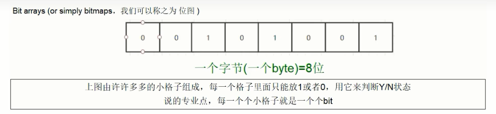
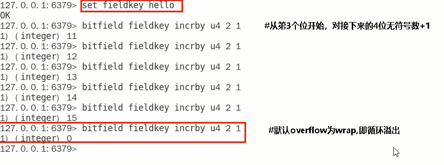

#  一、Redis入门概述

## 一、Redis概述

- Remote Dictionary Server（远程字典服务器）是完全开源的，使用ANSIC语言编写遵守BSD协议，是一个高性能的Key-Value数据库，提供了丰富的数据结构，例如String、Hash、List、Set、SortedSet等等。数据是存在内存中的，同时Redis支持事务、持久化、LUA脚本、发布/订阅、缓存淘汰、流技术等多种功能，提供了主从模式、Redis Sentinel和Redis Cluster集群架构方案

## 二、Redis主流功能与应用

1. 分布式缓存，挡在MySQL数据库之前的带刀护卫

   

   - Redis是key-value数据库(NoSQL一种)，MySQL是关系型数据库
   - Redis数据操作主要在内存，而MySQL主要存储在磁盘
   - Redis在某一些场景使用中要明显优于MySQL，比如计数器、排行榜等方面
   - Redis通常用于一些特定场景，需要与MySQL一起配合使用
   - Redis和MySQL两者并不是相互替换和竞争的关系，而是共用和配合使用

2. 内存存储和持久化（RDB和AOF）：Redis支持异步将内存中的数据写到硬盘上，同时不影响继续服务

3. 高可用架构搭配：单机、主从、哨兵、集群

4. 缓存穿透、击穿、雪崩

5. 分布式锁

6. 队列

   - Redis提供list和Set操作，这使得Redis能作为一个很好的消息队列平台来使用
   - 我们常通过Redis的队列功能做购买限制。比如到了节假日或者推广期间，进行一些活动，对用户购买行为进行限制，限制今天只能购买几次商品或者一段时间内只能购买一次。也比较适合使用

7. 排行榜+点赞

   - 在互联网应用中，有各种各样的排行榜，如电商网站的月度销量排行榜、社交APP的礼物排行榜、小程序的投票排行榜等等。Redis提供的zset数据类型能够快速实现这些复杂的排行榜
   - 比如小说网站对小说进行排名，根据排名，将排名靠前的小说推荐给用户

8. 总体功能概述

   

## 三、Redis的优势

1. 性能极高-Redis读的速度是110000次/秒，写的速度是81000次/秒
2. Redis数据类型丰富，不仅仅支持简单的Key-Value类型的数据，同时还提供list，set，zset，hash等数据结构的存储
3. Redis支持数据的持久化，可以将内存中的数据保持在磁盘中，重启的时候可以再次加载进行使用
4. Redis支持数据的备份，即master-slave模式的数据备份

## 四、Redis应用架构图


## 五、Redis官网

1. 官方网站

   - [中文官网](https://www.redis.com.cn/documentation.html)
   - [英文网站](https://redis.io/)

2. Redis7新特性

   | 新特点                            | 描述                                                         |
   | --------------------------------- | ------------------------------------------------------------ |
   | 多AOF文件支持                     | 7.0 版本中一个比较大的变化就是 aof 文件由一个变成了多个，主要分为两种类型:基本文件(base files)、增量文件(incr files)，请注意这些文件名称是复数形式说明每一类文件不仅仅只有一个。在此之外还引入了一个清单文件(manifest) 用于跟踪文件以及文件的创建和应用顺序(恢复) |
   | config命令增强                    | 对于Config Set 和Get命令，支持在一次调用过程中传递多个配置参数。例如，现在我们可以在执行一次Config Set命今中更改多个参数: config set maxmemory 10000001 maxmemory-clients 50% port 6399 |
   | 限制客户端内存使用Client-eviction | 一旦 Redis 连接较多，再加上每个连接的内存占用都比较大的时候， Redis总连接内存占用可能会达到maxmemory的上限，可以增加允许限制所有客户端的总内存使用量配置项，redis.config 中对应的配置项<br/>两种配置形式：指定内存大小、基于 maxmemory 的百分比<br/>maxmemory-client 1g<br/>maxmemory-client 10% |
   | listpack紧凑列表调整              | listpack 是用来替代 ziplist 的新数据结构，在 7.0 版本已经没有 ziplist 的配置了 (6.0版本仅部分数据类型作为过渡阶段在使用）listpack已经替换了ziplist类似hash-max-ziplist-entries 的配置 |
   | 访问安全性增强ACLV2               | 在redis.conf配置文件中protected-mode默认为yes，只有当你希望你的客户端在没有授权的情况下可以连接到Redis server的时候可以将protect-mode设置为no |
   | redis function                    | Redis函数，一种新的通过服务端脚本扩展Redis的方式，函数与数据本身一起存储。简言之，redis自己要去抢夺Lua脚本的饭碗 |
   | RDB保存时间调整                   | 将持久化文件RDB的保存规则发生了改变，尤其是时间记录频度变化  |
   | 命令新增和变动                    | Zset (有序集合)增加 ZMPOP、BZMPOP、ZINTERCARD 等命令<br/>Set (集合)增加 SINTERCARD 命令<br/>LIST(列表)增加 LMPOP、BLMPOP ，从提供的键名列表中的第一个非空列表键中弹出一个或多个元素 |
   | 性能资源利用率、安全等改进        | 自身底层部分优化改动，Redis核心在许多方面进行了重构和改进主动碎片整理V2：增强版主动碎片整理，配合Jemalloc版本更新，更快更智能，延时更低<br/>HyperLogLog改进:在Redis5.0中，HyperLogLog算法得到改进，优化了计数统计时的内存使用效率，7更加优秀更好的内存统计报告 |

# 二、Redis安装

1. Redis在CentOS7 64位操作系统中安装的环境要求

   - 必有gcc环境。安装命令为`yum -y install gcc c++`，查看gcc版本命令`gcc -v`
   - Redis版本最好选择7，很少有bug

2. 使用命令下载获取redis-7.0.5.tar.gz后将它放入我们的Linux目录/opt

   ```shell
   #下载命令
   wget http://download.redis.io/releases/redis-7.0.5.tar.gz
   mv redis-7.0.5.tar.gz /opt
   ```

3. /opt目录下解压redis，`tar -zxvf redis-7.0.5.tar.gz`，解压后会多一个redis-7.0.0的文件夹

4. 进入目录，`cd redis-7.0.5`

5. 在redis-7.0.0目录下执行make命令

   ```shell
   make && make install
   ```

6. 查看默认安装目录：/usr/local/bin，Linux下的/usr/local类似我们Windows系统的C:\Program Files，安装完成后，去/usr/local/bin下查看

   - redis-benchmark：性能测试工具，服务启动后运行该命令，看看自己电脑性能如何
   - redis-check-aof：修复有问题的AOF文件
   - redis-check-dump：修复有问题的dump.rdb文件
   - redis-cli：客户端操作入口
   - redis-sentinel：redis集群使用
   - reids-server：redis服务器启动命令

7. 将默认的/opt/redis-7.0.5/redis.conf拷贝一下命令为`cp redis.conf redis7.conf`

8. 修改redis7.conf配置文件做初始化设置。redis7.conf配置文件，改完后确保生效，记得重启

   - 默认daemonize no：改为daemonize yes。后台直接启动
   - 默认protected-mode yes：改为 protected-mode no。去除保护模式，可以远程连接
   - 默认bind 127.0.0.1：直接注释掉（默认bind 127.0.0.1只能本机访问）或改成本机IP，否则影响远程IP连接
   - 默认redis密码：改为 requirepass `******`（自己设定的密码）

9. 运行redis-server命令，启用redis7.conf配置文件。执行命令为

   ```shell
   #需要指定命令全路径来执行
   /usr/local/bin/redis-server /opt/redis-7.0.5/redis7.conf 
   
   #创建全局链接，方便后续执行
   sudo ln -s /usr/local/bin/redis-server /usr/bin/redis-server
   sudo ln -s /usr/local/bin/redis-cli /usr/bin/redis-cli
   ```

10. 连接服务：`redis-cli -a 密码-p 6379(-a 后面是redis设置的密码)`

11. 关闭Redis服务器

    ```shell
    #单实例关闭：在Redis服务器外面关闭命令：
    redis-cli -a ****** shutdown
    #如果在Redis服务器里面可以直接使用shutdown命令
    127.0.0.1:6379>shutdown
    
    #多实例服务器关闭，指定端口关闭：指定多个端口号即可
    redis-cli -p 6379 shutdown
    ```

12. Redis的卸载

    ```shell
    #先停止redis服务
    redis-cli -a ****** shutdown
    
    ls -l /usr/local/bin/redis-*
    ls -l /usr/bin/redis-*
    
    rm -rf /usr/local/bin/redis-*
    rm -rf /usr/bin/redis-*
    ```

# 三、Redis十大数据类型

## 一、Redis十大数据类型概述

- 十大数据类型是value的数据类型，key的类型都是字符串


### 一、redis字符串（String）

1. String是redis最基本的数据类型，一个key对应一个value
2. string类型是二进制安全的，意思是redis的string可以包含任何数据，比如jpg图片或者序列化的对象
3. string类型是Redis最基本的数据类型，一个redis中字符串value最多可以是512M

### 二、redis列表（List）

- Redis列表是最简单的字符串列表，按照插入顺序排序。你可以添加一个元素到列表的头部或者尾部，它的底层实际是个双端链表，最多可以包含（2^32-1）个元素（4294967295，每个列表超过40亿个元素）


### 三、redis哈希表（Hash）

1. Redis Hash是一个string类型的field（字段）和value（值）的映射表，Hash特别适合用户存储对象
2. Redis中每个Hash可以存储（2^32-1）个键值对（40多亿）

### 四、redis集合（Set）

1. Redis的Set是string类型的无序集合。集合成员是唯一的，这就意味着集合中不能出现重复的数据，集合对象的编码可以是intset或者Hashtable
2. Redis中Set集合是通过哈希表实现的，所以添加，删除，查找的复杂度都是O(1)
3. 集合中最大的成员数为（2^32-1）（4294967295，每个集合可存储40多亿个成员）

### 五、redis有序集合（ZSet）

1. zset：sorted set，即有序集合
2. Redis zset和Set一样也是string类型元素的集合，且不允许重复的成员
3. Redis zset和Set不同的是每个元素都会关联一个double类型的分数，Redis正是通过分数来为集合中的成员进行从小到大的排序
4. zset的成员是唯一的，但是分数（score）却可以重复
5. zset集合是通过哈希表实现的，所以添加，删除，查找的复杂度都是O(1)。集合中最大的成员数是2^32-1

### 六、redis地理空间（GEO）

Redis GEO主要用于存储地理位置信息，并对存储的信息进行操作，包括：

- 添加地理位置的坐标
- 获取地理位置的坐标
- 计算两个位置之间的距离
- 根据用户给定的经纬度坐标来获取指定范围内的地址位置集合

### 七、redis基数统计（HyperLogLog）

1. HyperLogLog是用来做基数统计的算法，HyperLogLog的优点是，在输入元素的数量或者体积非常非常大时，计算基数所需要的空间总是固定且是很小的
2. 在Redis里面，每个HyperLogLog键只需要花费12KB内存，就可以计算接近2^64个不同元素的基数。这和计算基数时，元素越多耗费内存就越多的集合形成鲜明对比
3. 但是，因为HyperLogLog只会根据输入元素来计算基数，而不会存储输入元素本身，所以HyperLogLog不能像集合那样，返回输入的各个元素

### 八、redis位图（bitmap）


- 由0和1状态表现的二进制位的bit数组


### 九、redis位域（bitfield）

1. 通过bitfield命令可以一次性操作多个比特位域（指的是连续的多个比特位），它会执行一系列操作并返回一个响应数组，这个数组中的元素对应参数列表中的相应的执行结果
2. 说白了就是通过bitfield命令我们可以一次性对多个比特位域进行操作

### 十、redis流（Stream）

1. Redis Stream是Redis5.0版本新增加的数据结构
2. Redis Stream主要用于消息队列（MQ，Message Queue），Redis本身就是一个Redis发布订阅（pub/sub）来实现消息队列的功能，但它有个缺点就是消息无法持久化，如果出现网络断开、Redis宕机等，消息就会被丢弃。
3. 简单来说发布订阅（pub/sub）可以分发消息，但无法记录历史消息
4. 而Redis Stream提供了消息的持久化和主备复制功能，可以让任何客户端访问任何时刻的数据，并且能记住每一个客户端的访问位置，还能保证消息不丢失

## 二、数据类型命令及落地运用

1. 命令不区分大小写，而key是区分大小写的
2. 永远的帮助命令，help @类型
   - help @string
   - help @list
   - help @hash
   - help @hyperloglog

## 三、Redis键（key）示例

1. keys *：查看当前库所有的key

   ```shell
   127.0.0.1:6379> keys *
   (empty array)
   127.0.0.1:6379> set key1 1
   OK
   127.0.0.1:6379> set key2 2
   OK
   ```

2. exists key：判断某个key是否存在。存在则返回1，不存在则返回0

     ```shell
   127.0.0.1:6379> exists key1
   (integer) 1
   127.0.0.1:6379> exists key3
   (integer) 0
   ```

3. type key：查看key的类型

     ```shell
   127.0.0.1:6379> type key1
   string
   ```

4. del key：删除指定的key数据。删除成功则返回1，删除失败则返回0

     ```shell
   127.0.0.1:6379> del key3
   (integer) 0
   127.0.0.1:6379> del key2
   (integer) 1
   ```

5. unlink

     ```shell
   127.0.0.1:6379> unlink key2
   (integer) 0
   127.0.0.1:6379> unlink key1
   (integer) 1
   ```

   - unlink key 是非阻塞删除，仅仅将keys从keyspace元数据中删除，真正的删除会在后续异步中操作
   - del key 是原子的删除，只有删除成功了才会返回删除结果，如果是删除大key用del会将后面的操作都阻塞，而 unlink key 不会阻塞，它会在后台异步删除数据

6. ttl key：查看还有多少秒过期，-1表示永不过期，-2表示已过期（过期或不存在的key都会返回 -2）

     ```shell
   127.0.0.1:6379> ttl key1
   (integer) -1
   ```

7. expire key 秒钟：为给定的key设置过期时间。只需要指定key即可

     ```shell
   127.0.0.1:6379> expire key1 10
   (integer) 1
   ```

8. move key dbindex[0-15]：将当前数据库的key移动到给定的数据库DB当中

     ```shell
   #重新添加key1、key2、key3
   127.0.0.1:6379> set key1 1
   OK
   127.0.0.1:6379> set key2 2
   OK
   127.0.0.1:6379> set key3 3
   OK
   
   #将key3移动到第二个库中，移动成功后显示1，移动失败则显示0
   #将指定的key移动之后，本库中则不存在此key
   127.0.0.1:6379> move key3 1
   (integer) 1
   ```

9. select dbindex：切换数据库【0-15】，默认为0。数据库的数量可以在配置文件中进行修改

     ```shell
   #第一个库下标为[0]，默认不显示
   127.0.0.1:6379> select 1
   OK
   
   #第二个库下标为[1]，则显示[1]
   127.0.0.1:6379[1]> keys *
   1) "key3"
   ```

10. dbsize：查看当前数据库key的数量

      ```shell
    127.0.0.1:6379[1]> select 0
    OK
    127.0.0.1:6379> dbsize
    (integer) 2
      ```

11. flushdb：清空当前库

      ```shell
    127.0.0.1:6379[1]> flushdb
    OK
    127.0.0.1:6379[1]> keys *
    (empty array)
      ```

12. flushall：通杀全部库

      ```shell
    127.0.0.1:6379[1]> flushall
    OK
    127.0.0.1:6379[1]> select 0
    OK
    127.0.0.1:6379> keys *
    (empty array)
      ```

## 四、redis字符串（String）应用

1. redis String类型是单key单value的

2. 常用命令：`set key value `和` get key`

   - 设置成功则返回OK，返回nil为未执行Set命令，如不满足NX，XX条件等
   - 若使用GET参数，则返回该键原来的值，或在键不存在时nil
   - 如何获得设置指定的key过期的Unix时间，单位为秒

   

   ```shell
   #设置s1的值，nx的意思是当s1这个键不存在时才能设置键值，key存在时设置键值会失败
   127.0.0.1:6379> set s1 v1 nx
   OK
   127.0.0.1:6379> set s1 v1 nx
   (nil)
   
   #设置s1的值，xx的意思是当s1这个键存在时才能设置键值
   #key不存在时设置键值会失败
   #key存在会覆盖原来的值
   127.0.0.1:6379> set s2 v2 xx
   (nil)
   127.0.0.1:6379> set s1 v1 xx
   OK
   
   #先获取key对应的原始值，然后再设置新值
   127.0.0.1:6379> set s1 v1 xx get
   "v1"
   127.0.0.1:6379> set s1 v1 get
   
   #设置s2的过期时间
   127.0.0.1:6379> set s2 v2 ex 120
   OK
   127.0.0.1:6379> ttl s2
   (integer) 113
   #为key设置新值时，它会将原来的过期时间默认覆盖掉，除非设置新的过期时间
   127.0.0.1:6379> set s2 v22
   OK
   127.0.0.1:6379> ttl s2
   (integer) -1
   127.0.0.1:6379> set s2 v2 ex 120
   OK
   127.0.0.1:6379> ttl s2
   (integer) 117
   
   #保留最开始设置的过期时间，它不会被新值所覆盖
   127.0.0.1:6379> set s2 v222 keepttl
   OK
   127.0.0.1:6379> ttl s2
   (integer) 69
   127.0.0.1:6379> 
   ```

3. 同时设置/获取多个键值：要么都成功，要么都失败

   ```shell
   MSET key value [key value...]
   
   MGET key [key ...]
   ```

   ```shell
   127.0.0.1:6379> mset s3 v3 s4 v4
   OK
   127.0.0.1:6379> mget s1 s2 s3 s4
   1) "v31"
   2) (nil)
   3) "v3"
   4) "v4"
   ```

4. 获取或替换某个key对应的value指定区间范围内的值：getrange/setrange

   - `getrange key 开始索引 结束索引`
   - `setrange key 开始替换的索引 替换的内容`

   ```shell
   #设置新的值
   127.0.0.1:6379> set s5 abcde12345
   OK
   #使用getrange时一定要指定范围，end标识位为-1则表示字符串最后一位
   127.0.0.1:6379> getrange s5
   (error) ERR wrong number of arguments for 'getrange' command
   127.0.0.1:6379> getrange s5 0 -1
   "abcde12345"
   127.0.0.1:6379> getrange s5 0 2
   "abc"
   127.0.0.1:6379> setrange s5 5 6789
   (integer) 10
   127.0.0.1:6379> get s5
   "abcde67895"
   127.0.0.1:6379> 
   ```

5. 数值增减

   - 一定要是数字才能进行加减
   - 递增数字：`incr key`
   - 增加指定的整数：`incrby key increment`
   - 递减数值：`decr key`
   - 减少指定的整数：`decrby key decrement`

   ```shell
   #设置数字进行自加自减操作
   127.0.0.1:6379> set s6 v6
   OK
   127.0.0.1:6379> incr s6
   (error) ERR value is not an integer or out of range
   127.0.0.1:6379> set s6 6
   OK
   
   #自加操作
   127.0.0.1:6379> incr s6
   (integer) 7
   127.0.0.1:6379> get s6
   "7"
   127.0.0.1:6379> incr s6
   (integer) 8
   127.0.0.1:6379> get s6
   "8"
   127.0.0.1:6379> incrby s6 2
   (integer) 10
   127.0.0.1:6379> get s6
   "10"
   
   #自减操作
   127.0.0.1:6379> decr s6
   (integer) 9
   127.0.0.1:6379> get s6
   "9"
   127.0.0.1:6379> decrby s6 3
   (integer) 6
   ```

6. 获取字符串长度和内容追加

   - 获取字符串长度：`strlen key`
   - 字符串内容追加：`append key value`

   ```shell
   127.0.0.1:6379> set s7 v7
   OK
   127.0.0.1:6379> strlen s7
   (integer) 2
   127.0.0.1:6379> append s7 China
   (integer) 7
   127.0.0.1:6379> get s7
   "v7China"
   ```

7. 分布式锁

   - setnx key value：如果不存在则添加，存在则不添加
   - setex 键 秒 值：设置带有过期时间的键值对

   

   ```shell
   #setnx如果key不存在则添加，存在则添加失败返回0
   127.0.0.1:6379> setnx string1 value1
   1
   127.0.0.1:6379> setnx string1 value1
   0
   127.0.0.1:6379> setnx string1 value2
   0
   127.0.0.1:6379> get string1
   value1
   
   #两步设置key的过期时间
   127.0.0.1:6379> set string2 value2
   OK
   127.0.0.1:6379> expire string2 10
   1
   127.0.0.1:6379> ttl string2
   4
   #一步设置key的过期时间，效果是一样的
   127.0.0.1:6379> setex string2 10 value2
   OK
   127.0.0.1:6379> ttl string2
   6
   ```

8. getset：先get再set

   - getset：将给定key的值设为value，并返回key的旧值(old value)。简而言之，先get然后立即set
   - 如果没有旧值则返回nil，再set新值

   ```shell
   127.0.0.1:6379> set s9 v9
   OK
   127.0.0.1:6379> getset s9 v99
   "v9"
   127.0.0.1:6379> getset s10 v10
   (nil)
   127.0.0.1:6379> get s10
   "v10"
   ```

## 五、redis列表（List）应用

1. redis List类型是单key多value的

2. redis List类型说明

   - redis是一个双端链表的结构。容量是2的32次方减1个元素，大概40多亿，主要功能有push/pop等，一般用在栈、队列、消息队列等场景。left、right都可以插入添加。对两端的作性能很高，通过索引下标的操作中间的节点性能会较差

     

   - 如果键不存在，创建新的链表；如果键已存在，新增内容；如果值全移除，对应的键也就消失了

   - 如果是同一个列表从左边插入的数据，则第一个插入的数据排头往中间走；如果是同一个列表从右边插入的数据，则第一个插入的数据也排头往中间走

3. lpush/rpush/lrange：从左侧或从右侧插入数据/获取数据

   ```shell
   #插入数据时会返回列表的总长度
   127.0.0.1:6379> lpush list1 1 2 3 4 5 
   (integer) 5
   127.0.0.1:6379> rpush list1 6
   (integer) 6
   127.0.0.1:6379> lrange list 0 -1
   (empty array)
   127.0.0.1:6379> lrange list1 0 -1
   1) "5"
   2) "4"
   3) "3"
   4) "2"
   5) "1"
   6) "6"
   ```

4. lpop/rpop：从左侧或从右侧删除数据。默认只删除第一个，也可指定长度进行删除

   ```shell
   127.0.0.1:6379> lpop list1
   "5"
   127.0.0.1:6379> lrange list1 0 -1
   1) "4"
   2) "3"
   3) "2"
   4) "1"
   5) "6"
   
   127.0.0.1:6379> rpop list1
   "6"
   127.0.0.1:6379> lrange list1 0 -1
   1) "4"
   2) "3"
   3) "2"
   4) "1"
   
   127.0.0.1:6379> rpop list1 2
   1) "1"
   2) "2"
   127.0.0.1:6379> lrange list1 0 -1
   1) "4"
   2) "3"
   ```

5. lindex：按照索引下标获得元素（从上到下），必须指定索引

   ```shell
   127.0.0.1:6379> lrange list1 0 -1
   1) "2"
   2) "1"
   3) "4"
   4) "3"
   127.0.0.1:6379> lindex list1
   (error) ERR wrong number of arguments for 'lindex' command
   127.0.0.1:6379> lindex list1 0
   "2"
   127.0.0.1:6379> lindex list1 -1
   "3"
   ```

6. llen：获取List列表中元素的个数

   ```shell
   127.0.0.1:6379> llen list1
   (integer) 4
   ```

7. lrem key 数字N 给定值v1：删除N个值等于v1的元素

   - 从left往right删除N个值等于v1的元素，返回的值为实际删除的数量

   ```shell
   #从左往后删除全部等于3的值
   127.0.0.1:6379> lrem list1 0 3
   (integer) 1
   127.0.0.1:6379> lrange list1 0 -1
   1) "2"
   2) "1"
   3) "4"
   ```

8. ltrim key 开始index 结束index：截取指定范围的值后再赋值给此key

   ```shell
   27.0.0.1:6379> lrange list1 0 -1
   1) "2"
   2) "1"
   3) "4"
   127.0.0.1:6379> ltrim list1 1 2
   OK
   127.0.0.1:6379> lrange list1 0 -1
   1) "1"
   2) "4"
   ```

9. rpoplpush 源列表  目的列表：移除列表的最后一个元素，并将该元素添加到另一个列表并返回被移动的元素

   ```shell
   127.0.0.1:6379> lpush list1 s1 s2 s3
   (integer) 3
   127.0.0.1:6379> lpush list2 s9 s8 s7
   (integer) 3
   127.0.0.1:6379> lrange list 0 -1
   (empty array)
   127.0.0.1:6379> lrange list1 0 -1
   1) "s3"
   2) "s2"
   3) "s1"
   127.0.0.1:6379> lrange list2 0 -1
   1) "s7"
   2) "s8"
   3) "s9"
   127.0.0.1:6379> rpoplpush list1 list2
   "s1"
   127.0.0.1:6379> lrange list1 0 -1
   1) "s3"
   2) "s2"
   127.0.0.1:6379> lrange list2 0 -1
   1) "s1"
   2) "s7"
   3) "s8"
   4) "s9"
   ```

10. lset key index value：让指定数组集合的索引位置值替换成新值

    ```shell
    127.0.0.1:6379> lrange list2 0 -1
    1) "s1"
    2) "s7"
    3) "s8"
    4) "s9"
    127.0.0.1:6379> lset list2 0 s6
    OK
    127.0.0.1:6379> lrange list2 0 -1
    1) "s6"
    2) "s7"
    3) "s8"
    4) "s9"
    #必须是索引位置有数据，否则报错
    127.0.0.1:6379> lset list2 10 s6
    (error) ERR index out of range
    ```

11. linsert key before/after：在指定值的前后位置插入的新值

    ```shell
    127.0.0.1:6379> lrange list2 0 -1
    1) "s1"
    2) "s7"
    3) "s8"
    4) "s9"
    127.0.0.1:6379> lset list2 0 s6
    OK
    127.0.0.1:6379> lrange list2 0 -1
    1) "s6"
    2) "s7"
    3) "s8"
    4) "s9"
    127.0.0.1:6379> lrange list2 10 -1
    (empty array)
    127.0.0.1:6379> lset list2 10 s6
    (error) ERR index out of range
    ```

## 六、redis哈希（Hash）应用

1. KV模式不变，但V是一个键值对  Map<String, Map<Object, Object>>

2. hset：hset key field value [field value ... ]

   ```shell
   #必须要用key-value 一一对应
   127.0.0.1:6379> hset user:001 id 1 name sun age
   (error) ERR wrong number of arguments for 'hset' command
   127.0.0.1:6379> hset user:001 id 1 name sun age 18
   (integer) 3
   ```

3. hget：只能获取单个field的value

   ```shell
   127.0.0.1:6379> hget user:001 name
   "sun"
   ```

4. hmset：在redis7这个版本中hset和hmset的功能一致，hmset已经被弃用

   ```shell
   127.0.0.1:6379> hmset user:003 id 3 name xing age 20
   OK
   127.0.0.1:6379> hget user:003 name
   "xing"
   ```

5. hmget：可以获取多个filed的值

   ```shell
   127.0.0.1:6379> hmget user:001 id name age
   1) "1"
   2) "sun"
   3) "18"
   ```

6. hgetall：通过key可以获取到全部field的值

   ```shell
   127.0.0.1:6379> hgetall user:001
   1) "id"
   2) "1"
   3) "name"
   4) "sun"
   5) "age"
   6) "18"
   ```

7. hdel：通过key可以删除多个field

   ```shell
   127.0.0.1:6379> hdel user:003 name age
   (integer) 2
   127.0.0.1:6379> hmget user:003 id name age
   1) "3"
   2) (nil)
   3) (nil)
   ```

8. hlen：获取某个key内的全部数量

   ```shell
   127.0.0.1:6379> hlen user:001
   (integer) 3
   ```

9. hexists key：查看指定的field值是否在指定的key中，存在则返回1，不存在则返回0

   ```shell
   127.0.0.1:6379> hexists user:001 name
   (integer) 1
   127.0.0.1:6379> hexists user:001 class
   (integer) 0
   ```

10. hkeys/hvals

    - hkeys key：查询出key所有的field
    - hvals key：查询出key所有的field对应的值

    ```shell
    127.0.0.1:6379> hkeys user:001
    1) "id"
    2) "name"
    3) "age"
    127.0.0.1:6379> hvals user:001
    1) "1"
    2) "sun"
    3) "18"
    ```

11. hincrby/hincrbyfloat

    - hincrby key field 增加的值：使对应的field增加特定的数值
    - hincrbyfloat key  field 增加的值：使对应的field增加特定的浮点值

    ```shell
    127.0.0.1:6379> hset user:001 score 95
    (integer) 1
    127.0.0.1:6379> hgetall user:001
    1) "id"
    2) "1"
    3) "name"
    4) "sun"
    5) "age"
    6) "18"
    7) "score"
    8) "95"
    
    #在value是整数的情况下可以使用hincrby也可以使用hincrbyfloat
    #在value是浮点数的情况下只能使用hincrbyfloat
    127.0.0.1:6379> hincrby user:001 score 1
    (integer) 96
    127.0.0.1:6379> hincrbyfloat user:001 score 1
    "97"
    127.0.0.1:6379> hincrbyfloat user:001 score 1.5
    "98.5"
    127.0.0.1:6379> hincrby user:001 score 1
    (error) ERR hash value is not an integer
    127.0.0.1:6379> hgetall user:001
    1) "id"
    2) "1"
    3) "name"
    4) "sun"
    5) "age"
    6) "18"
    7) "score"
    8) "98.5"
    ```

12. hsetnx：不存在赋值，存在了则赋值无效

    ```shell
    127.0.0.1:6379> hset user:001 email 3781236@qq.com
    (integer) 1
    127.0.0.1:6379> hset user:001 email 3781454@qq.com
    (integer) 0
    ```

## 七、redis集合（Set）应用

1. 单值多value，且不可重复

2.  set数据类型本身是无序的，但是使用`SMEMBERS`命令来获取set中的所有成员时，redis会返回已排序的结果。这是因为redis在内部使用了一种称为"skip list"的数据结构来实现set，它天生就支持快速的插入、删除和有序遍历操作。而且set的无序是针对的存储时是无序的，并不是输出的时候，

3. sadd key member [member ...]：添加元素，可以多次向同一个key中设置不同值，不会覆盖之前的值

   ```shell
   #set会自动去重
   127.0.0.1:6379> sadd set1  1 1 2 3 5
   (integer) 4
   127.0.0.1:6379> smembers set1
   1) "1"
   2) "2"
   3) "3"
   4) "5"
   ```

4. smembers key：遍历集合中的所有元素

   ```shell
   127.0.0.1:6379> smembers set1
   1) "1"
   2) "2"
   3) "3"
   4) "5"
   ```

5. sismember key member：判断元素是否在集合中。在集合中则返回1，不在则返回0

   ```shell
   127.0.0.1:6379> sismember set1 2
   (integer) 1
   127.0.0.1:6379> sismember set1 9
   (integer) 0
   ```

6. srem key member [member ...]：删除元素：未删除则返回0，删除成功则返回删除的个数

   ```shell
   127.0.0.1:6379> srem set1 3 5
   (integer) 2
   127.0.0.1:6379> smembers set1
   1) "1"
   2) "2"
   ```

7. scard key：获取集合里面的元素个数

   ```shell
   127.0.0.1:6379> scard set1
   (integer) 2
   ```

8. srandmember key [数字]：从集合中随机展现指定个数的元素，元素不删除

   ```shell
   127.0.0.1:6379> srandmember set1 3
   1) "1"
   2) "2"
   127.0.0.1:6379> srandmember set1 1
   1) "2"
   127.0.0.1:6379> srandmember set1 1
   1) "2"
   127.0.0.1:6379> srandmember set1 1
   1) "2"
   127.0.0.1:6379> srandmember set1 1
   1) "1"
   ```

9. spop key [数字]：从集合中随机弹出指定个数的某几个元素，弹出几个删除几个

   ```shell
   127.0.0.1:6379> spop set1 2
   1) "1"
   2) "2"
   127.0.0.1:6379> spop set1 2
   (empty array)
   ```

10. smove key1 key2 value：将key1里已存在的某个值赋给key2，并在key1将此值删除

    ```shell
    127.0.0.1:6379> sadd set1 7 8 9
    (integer) 3
    127.0.0.1:6379> sadd set2 3 5 4
    (integer) 3
    127.0.0.1:6379> smembers set1
    1) "7"
    2) "8"
    3) "9"
    127.0.0.1:6379> smembers set2
    1) "3"
    2) "4"
    3) "5"
    
    127.0.0.1:6379> smove set1 set2 8
    (integer) 1
    127.0.0.1:6379> smembers set1
    1) "7"
    2) "9"
    127.0.0.1:6379> smembers set2
    1) "3"
    2) "4"
    3) "5"
    ```

11. 集合运算-集合的差集运算A-B：属于A但是不属于B的元素构成的集合，sdiff key [key ...]，可以计算多个元素的差集

    ```shell
    127.0.0.1:6379> sadd set1 4 5
    (integer) 2
    127.0.0.1:6379> smembers set1
    1) "4"
    2) "5"
    3) "7"
    4) "9"
    127.0.0.1:6379> smembers set2
    1) "3"
    2) "4"
    3) "5"
    4) "8"
    
    127.0.0.1:6379> sdiff set1 set2
    1) "7"
    2) "9"
    ```

12. 集合运算-集合的并集运算A∪B：属于A或者属于B的元素构成的集合，sunion key [key ...]

    ```shell
    127.0.0.1:6379> sunion set1 set2
    1) "3"
    2) "4"
    3) "5"
    4) "7"
    5) "8"
    6) "9"
    ```

13. 集合运算-集合的交集运算A∩B：属于A同时也属于B的共同拥有的元素构成的集合

    - sinter key [key ...]
    - sintercard numkeys key [ey ...] [limit limit]：numkeys 要和输入key的个数保持一致；sintercard为redis7新命令，它不返回结果集，而是返回结果的基数。返回由所有给定集合的交集产生的集合的基数。基数是用于表示事物个数的数

    ```shell
    #计算属于set1，也属于set2的集合
    127.0.0.1:6379> sinter set1 set2
    1) "4"
    2) "5"
    
    #sintercard 返回输入集合key交集的基数
    127.0.0.1:6379> sintercard 2 set1 set2
    (integer) 2
    
    #limit后面的数值小于真实基数值时，返回limit后面的值
    #limit后面的数值大于真实基数值时，返回最大基数的值
    #sintercard 2 set1 set2 limit 1中2只是巧合和基数的值一样了，不能当作基数处理
    127.0.0.1:6379> sintercard 2 set1 set2 limit 1
    (integer) 1
    127.0.0.1:6379> sintercard 2 set1 set2 limit 2
    (integer) 2
    127.0.0.1:6379> sintercard 2 set1 set2 limit 3
    (integer) 2
    ```

## 八、redis有序集合（Zset）应用

1. 向有序集合中加入一个元素和该元素的分数。在set基础上，每个val值前加一个score分数值。之前set是k1 v1 v2 v3，现在zset是 k1 score1 v1 score2 v2

2. zaadd key score member [score member ...]：添加元素

   - 相同的 member 前面的值会被后面的覆盖掉
   - 一致的 score 则按照插入顺序进行再排序  

   ```shell
   127.0.0.1:6379> zadd zset1 10 v10 20 v20 5 v5
   (integer) 3
   ```

3. zrange key start stop [withscores]：按照元素分数从小到大的顺序返回索引从start到stop之间的所有元素

   ```shell
   127.0.0.1:6379> zrange zset1 1 2 withscores
   1) "v10"
   2) "10"
   3) "v20"
   4) "20"
   ```

4. zrevrange key start stop [with scores]：反转集合，按照元素分数从大到小的顺序返回索引从start到stop之间的所有元素

   ```shell
   127.0.0.1:6379> zrevrange zset1 1 2 withscores
   1) "v10"
   2) "10"
   3) "v5"
   4) "5"
   ```

5. zrangebyscore key min max [withscores] [limit offset count]：获取指定分数范围的元素，可以在min和max前面加个`(`，表示不包含。limit作用是返回限制，limit开始下标步，一共多少步

   ```shell
   127.0.0.1:6379> zrangebyscore zset1 (10 20 withscores 
   1) "v20"
   2) "20"
   127.0.0.1:6379> zrangebyscore zset1 (10 20 
   1) "v20"
   127.0.0.1:6379> zrangebyscore zset1 10 20 
   1) "v10"
   2) "v20"
   127.0.0.1:6379> zrangebyscore zset1 (10 20 
   1) "v20"
   127.0.0.1:6379> zrangebyscore zset1 (10 20 withscores 
   1) "v20"
   2) "20"
   
   127.0.0.1:6379> zrangebyscore zset1 10 20 withscores limit  0 1
   1) "v10"
   2) "10"
   127.0.0.1:6379> zrangebyscore zset1 10 20 withscores limit  0 2
   1) "v10"
   2) "10"
   3) "v20"
   4) "20"
   #当limit的数量大于集合中的数量时，会显示全部
   127.0.0.1:6379> zrangebyscore zset1 10 20 withscores limit  0 5
   1) "v10"
   2) "10"
   3) "v20"
   4) "20"
   ```

6. zscore key member：获取元素的分数

   ```shell
   127.0.0.1:6379> zscore zset1 v10
   "10"
   ```

7. zcard key：获取集合中元素的数量

   ```shell
   127.0.0.1:6379> zcard zset1
   (integer) 3
   ```

8. zrem key member [member ...]：某个value值，相对应的score值也被删除

   ```shell
   127.0.0.1:6379> zrem zset1 v5
   (integer) 1
   127.0.0.1:6379> zrange zset1 0 -1
   1) "v10"
   2) "v20"
   ```

9. zincrby key increment member：增加某个元素的分数

   ```shell
   127.0.0.1:6379> zincrby zset1 30 v20
   "50"
   127.0.0.1:6379> zrange zset1 0 -1 withscores
   1) "v10"
   2) "10"
   3) "v20"
   4) "50"
   ```

10. zcount key min max：获得指定分数内的元素个数。获取的元素个数是大于等于第一个分数，小于第二个分数

    ```shell
    127.0.0.1:6379> zcount zset1 20 40
    (integer) 0
    127.0.0.1:6379> zcount zset1 20 50
    (integer) 1
    127.0.0.1:6379> zcount zset1 10 50
    (integer) 2
    127.0.0.1:6379> zcount zset1 (10 50
    (integer) 1
    ```

11. zmpop numkeys key [key ...] min|max [count count]：从key列表中的第一个非空排序集中弹出一个或多个元素，也就是成员分数对，弹出几个删除几个

    - numkeys 代表的是后面key的实际个数
    - min|max 代表的是从第一个非空的集合中弹出score最小或最大的一个值，而不是在所有集中弹出score最小或最大的一个值
    - count：默认值是1

    ```shell
    127.0.0.1:6379> zrange zset1 0 -1 withscores
    1) "v10"
    2) "10"
    3) "v20"
    4) "50"
    127.0.0.1:6379> zmpop 1 zset1 min count 1
    1) "zset1"
    2) 1) 1) "v10"
          2) "10"
          
    #不指定count的值，则默认弹出一个
    127.0.0.1:6379> zmpop 1 zset1 min
    1) "zset1"
    2) 1) 1) "v20"
          2) "50"
    127.0.0.1:6379> zrange zset1 0 -1 withscores
    (empty array)
    ```

12. zrank key member：作用是通过 member 获得下标值

    ```shell
    127.0.0.1:6379> zadd zset1 10 v10 20 v20 10 v5
    (integer) 3
    127.0.0.1:6379> zrange zset1 0 -1 withscores
    1) "v10"
    2) "10"
    3) "v5"
    4) "10"
    5) "v20"
    6) "20"
    127.0.0.1:6379> zrank zset1 v10
    (integer) 0
    127.0.0.1:6379> zrank zset1 v20
    (integer) 2
    ```

13. zrevrank key member [withscore]：作用是通过 member 逆序获得下标值

    ```shell
    127.0.0.1:6379> zrevrank zset1 v10
    (integer) 2
    127.0.0.1:6379> zrevrank zset1 v20
    (integer) 0
    ```

## 九、redis位图（bitmap）应用

1. 由0和1状态表现的二进制位的bit数组

   

   - bitmap是用String类型作为底层数据结构实现的一种统计二值状态的数据类型
   - bitmap本质是数组，它是基于String数据类型的按位的操作。该数组由多个二进制位组成，每个二进制位都对应一个偏移量（我们称之为一个索引）
   - bitmap支持的最大位数是2^32位，它可以极大的节约存储空间，使用512M内存就可以存储多达42.9亿的字节信息(2^32=4294967296)

2. bitmap的适用场景

   - 用于状态统计，Y、N类似AtomicBoolean
   - 用户是否登陆过Y、N，比如软件的每日签到功能
   - 电影、广告是否被点击播放过
   - 钉钉打卡上下班，签到统计

3. 基本命令

   

4. setbit key offset value：setbit的键偏移位只能零或者1。bitmap的偏移量从零开始计算的

   

   ```shell
   127.0.0.1:6379> setbit bit1 0 0
   (integer) 0
   127.0.0.1:6379> setbit bit1 1 0
   (integer) 0
   127.0.0.1:6379> setbit bit1 1 1
   (integer) 0
   127.0.0.1:6379> setbit bit1 2 1
   (integer) 0
   
   #实锤底层使用的是String
   127.0.0.1:6379> type bit1
   string
   ```

5. getbit key offset：获取键偏移位的值。默认是0

   ```shell
   127.0.0.1:6379> getbit bit1 0
   (integer) 0
   127.0.0.1:6379> getbit bit1 1
   (integer) 1
   127.0.0.1:6379> getbit bit1 2
   (integer) 1
   127.0.0.1:6379> getbit bit1 3
   (integer) 0
   ```

6. strlen key：统计字节数占用多少。不是字符串长度而是占据几个字节，超过8位后自己按照8位一组**byte（字节）**再扩容

   ```shell
   127.0.0.1:6379> strlen bit1
   (integer) 1
   ```

7. bitcount key [start end [byte|bit]]：全部key里面包含有1的有多少个byte或bit，默认单位为bit

   ```shell
   127.0.0.1:6379> bitcount bit1
   (integer) 2
   ```
   
8. bitop operation(and|or|xor|not) destkey key [key ...]

   - 统计连续2天都签到的用户数量。假如某个网站或者系统，它的用户有1000W，我们可以使用redis的HASH结构和bitmap结构做个用户id和位置的映射

   ```shell
   #通过map结构添加用户数据
   127.0.0.1:6379> hset uid:map 0 uid-092iok-ljz
   (integer) 1
   127.0.0.1:6379> hset uid:map 1 uid-7388c-xxx
   (integer) 1
   ......很多很多很多用户
   
   #日期作为bitmap的key，用户的id作为bitmap的offset，val为1则说明用户已签到
   127.0.0.1:6379> setbit 20240601 0 1
   (integer) 0
   127.0.0.1:6379> setbit 20240601 1 1
   (integer) 0
   127.0.0.1:6379> setbit 20240601 2 1
   (integer) 0
   127.0.0.1:6379> setbit 20240601 3 1
   (integer) 0
   127.0.0.1:6379> setbit 20240602 0 1
   (integer) 0
   127.0.0.1:6379> setbit 20240602 1 1
   (integer) 0
   
   #统计连续两天都签到的用户数量，统计成功则返回1
   127.0.0.1:6379> bitop and towDay 20240601 20240602
   (integer) 1
   #显示连续两天都签到的用户数量
   127.0.0.1:6379> bitcount towDay
   (integer) 2
   ```

## 十、redis基数统计（HyperLogLog）

1. 使用HyperLogLog的需求

   - 用户搜索网站关键词的数量
   - 统计用户每天搜索不同词条个数
   - 统计某个网站的UV、统计某个文章的UV（Unique Visitor，独立访客，一般理解为客户端IP，需要去重考虑）

2. HyperLogLog概述

   - 去重复统计功能的基数估计算法-就是HyperLogLog

     ```tex
     Redis在2.8.9版本添加了HyperLogLog结构
     Redis HyperLogLog是用来做基数统计的算法
     HyperLogLog的优点是，在输入元素的数量或者体积非常非常大时，计算基数所需的空间总是固定的、并且是很小的
     在Redis里面，每个HyperLogLog键只需要花费12KB内存，就可以计算接近2^64个不同元素的基数。这和计算基数时，元素越多耗费，内存就越多的集合形成鲜明对比
     但是，因为HyperLogLog只会根据输入元素来计算基数，而不会储存输入元素本身，所以HyperLogLog不能像集合那样，返回输入的各个元素
     ```

   - 基数：是一种数据集，去重复后的真实个数

     ```tex
     (全集)={2,4,6,8,77,39,4,8,10}
     去掉重复的内容
     基数={2,4,6,8,77,39,10} = 7
     ```

   - 基数统计：用于统计一个集合中不重复的元素个数，就是对集合去重复后剩余元素的计算

3. 基本命令

   

   ```shell
   #添加成功后则返回1
   127.0.0.1:6379> pfadd pf1 1 2 5 8 9 5 8 9
   (integer) 1
   127.0.0.1:6379> pfadd pf2 1 4 7 8 5 2 3 5 8
   (integer) 1
   127.0.0.1:6379> pfcount pf1
   (integer) 5
   127.0.0.1:6379> pfcount pf2
   (integer) 7
   
   #合并后基数的个数
   127.0.0.1:6379> pfcount pf1 pf2
   (integer) 8
   
   #合并后形成新的HyperLogLog
   127.0.0.1:6379> pfmerge pf3 pf1 pf2
   OK
   127.0.0.1:6379> pfcount pf3
   (integer) 8
   ```

## 十一、redis地理空间（GEO）

1. GEO简介：地球上的地理位置是使用二维的经纬度表示，经度范围(-180,180]，纬度范围(-90，90]，只要我们确定一个点的经纬度就可以取得他在地球的位置。例如滴滴打车，最直观的操作就是实时记录更新各个车的位置，然后当我们要找车时，在数据库中查找距离我们(坐标x0,y0)附近r公里范围内部的车辆，使用如下SQL即可:

   ```sql
   select taxi from position where x0-r< X < x0 + r and y0-r< y < y0+r
   ```

   这样直接使用SQL的问题：

   - 查询性能问题，如果并发高，数据量大这种查询是要搞垮数据库的
   - 这个查询的是一个矩形访问，而不是以我为中心r公里为半径的圆形访问
   - 精准度的问题，我们知道地球不是平面坐标系，而是一个圆球，这种矩形计算在长距离计算时会有很大误差

2. GEO原理

   

3. geoadd key longitude latitude member [longitude latitude member]：多个经度(longitude)、纬度(latitude)、位置名称(member)添加到指定的key中。geo类型实际上是zset，可以使用zset相关的命令对其进行遍历，如果遍历出现中文乱码可以使用如下命令：redis-cli --raw

   ```shell
   127.0.0.1:6379> geoadd city 116.403963 39.915119 "天安门" 116.403414 39.924091 "故宫" 116.024067 40.362639 "长城"
   (integer) 3
   ```

4. geopos key member [member]：从键里面返回所有指定名称（member）元素的位置（经度和纬度），不存在返回nil

   ```shell
   127.0.0.1:6379> geopos city 天安门 故宫 长城
   1) 1) "116.40396326780319214"
      2) "39.91511970338637383"
   2) 1) "116.40341609716415405"
      2) "39.92409008156928252"
   3) 1) "116.02406591176986694"
      2) "40.36263993239462167"
   ```

5. geodist key member1 member2 [m|km|ft|mi]：返回两个给定位置之间的距离

   - m-米
   - km-千米
   - ft-英寸
   - mi-英里

   ```shell
   127.0.0.1:6379> geodist city 长城 故宫 KM
   58.4777
   ```

6. georadius key longitude latitude radius m|km|ft|mi \[withcoord] \[withdist] \[withhash] [count count [any]：以给定的经纬度为中心，返回与中心的距离不超过给定最大距离的所有元素位置

   - withdist：在返回位置元素的同时， 将位置元素与中心之间的距离也一并返回。 距离的单位和用户给定的范围单位保持一致
   - withcoord：将位置元素的经度和维度也一并返回
   - withhash：以 52 位有符号整数的形式， 返回位置元素经过原始 geohash 编码的有序集合分值。 这个选项主要用于底层应用或者调试，实际中的作用并不大
   - count：限定返回的记录数

   ```shell
   127.0.0.1:6379> georadius city 116.403963 39.915119 10 KM withcoord withhash count 10 desc
   故宫
   4069885568908290
   116.40341609716415405
   39.92409008156928252
   天安门
   4069885555089531
   116.40396326780319214
   39.91511970338637383
   127.0.0.1:6379> georadius city 116.403963 39.915119 10 KM withdist withcoord withhash count 10 desc
   故宫
   0.9989
   4069885568908290
   116.40341609716415405
   39.92409008156928252
   天安门
   0.0001
   4069885555089531
   116.40396326780319214
   39.91511970338637383
   ```

7. georadiusbymember：和 georadius 类似

   ```shell
   127.0.0.1:6379> georadiusbymember city 天安门  10 KM withdist withcoord withhash count 10 desc
   故宫
   0.9988
   4069885568908290
   116.40341609716415405
   39.92409008156928252
   天安门
   0.0000
   4069885555089531
   116.40396326780319214
   39.91511970338637383
   ```

8. geohash：返回一个或多个位置元素的GEOhash表示。geohash算法生成的base32编码值，3维变2维变1维

   ```shell
   127.0.0.1:6379> geohash city 天安门 故宫 长城
   wx4g0f6f2v0
   wx4g0gfqsj0
   wx4t85y1kt0
   ```

## 十二、redis流（Stream）应用

1. 实现Redis消息队列的方案

   - List实现消息队列，List实现方式其实就是点对点的模式

     

   - Pub/Sub

     

   - Redis5.0版本新增了一个更强大的数据结构---Stream：Stream流就是Redis版的MQ消息中间件+阻塞队列

2. Redis Stream能实现消息队列，它支持消息的持久化、支持自动生成全局唯一ID、支持ack确认消息的模式、支持消费组模式等，让消息队列更加的稳定和可靠 

3. Redis Stream底层结构和原理说明

   

   - 一个消息链表，将所有加入的消息都串起来，每个消息都有一个唯一的ID和对应的内容

   - 参数说明

     

4. 队列相关指令

   - xadd：

     - 添加消息到队列末尾，消息ID必须要比上一个ID大，默认用`*`表示自动生成ID；`*`用于XADD命令中，让系统自动生成ID
     - XADD用于向Stream队列中添加消息，如果指定的Stream队列不存在，则该命令执行时会新建一个Stream队列
     - 消息ID说明：信息条目指的是序列号，在相同的毫秒下序列号从0开始递增，序列号是64位长度，理论上在同一毫秒内生成的数据量无法到达这个级别，因此不用担心序列号会不够用。milisecondsTime指的是Redis节点服务器的本地时间，如果存在当前的毫秒时间截比以前已经存在的数据的时间戳小的话（本地时间钟后跳），那么系统将会采用以前相同的毫秒创建新的ID，也即 redis 在增加信息条目时会检查当前 id 与上一条目的 id，自动纠正错误的情况，一定要保证后面的 id 比前面大，流中信息条目的ID必须是单调增的，这是流的基础。Redis对于ID有强制要求，格式必须是**时间戳-自增Id**这样的方式，且后续ID不能小于前一个ID
     - Stream的消息内容，它的结构类似Hash结构，以kev-value的形式存在

     ```shell
     127.0.0.1:6379> xadd stream1 * id 11 cname sun
     1718525601252-0
     127.0.0.1:6379> xadd stream1 * id 12 cname li
     1718525610760-0
     127.0.0.1:6379> xadd stream1 * id 12 cname qian
     1718525624890-0
     ```

   - xrange key start end [count count]：用于获取消息列表（可以指定范围），忽略删除的消息。默认显示全部的消息

     - start：表示开始值，-代表最小值
     - end：表示结束值，+代表最大值
     - count：表示最多获取多少个值

     ```shell
     127.0.0.1:6379> xrange stream1 - +
     1718525601252-0
     id
     11
     cname
     sun
     1718525610760-0
     id
     12
     cname
     li
     1718525624890-0
     id
     12
     cname
     qian
     
     127.0.0.1:6379> xrange stream1 - + count 1
     1718525601252-0
     id
     11
     cname
     sun
     ```

   - xrevrange key end start [count count]：根据ID降序输出

     ```shell
     127.0.0.1:6379> xrevrange stream1 + - count 1
     1718525624890-0
     id
     12
     cname
     qian
     ```

   - xdel key id [id ...]：删除指定的消息id

     ```shell
     127.0.0.1:6379> xdel stream1 1718525624890-0
     1
     127.0.0.1:6379> xrevrange stream1 + - count 1
     1718525610760-0
     id
     12
     cname
     li
     ```

   - xlen key

     ```shell
     127.0.0.1:6379> xrevrange stream1 + - 
     1718525610760-0
     id
     12
     cname
     li
     1718525601252-0
     id
     11
     cname
     sun
     127.0.0.1:6379> xlen stream1
     2
     ```

   - xtrim key maxlen|minid：用于对Stream的长度进行截取，如超长会进行截取

     - maxlen：允许的最大长度，在流中先根据消息id大小降序，然后对流进行修剪限制长度，在此Stream中超过此长度的消息id，将会被删除
     - minid：允许的最小id，从某个id值开始比该id值小的将会被删除

     ```shell
     127.0.0.1:6379> xtrim stream1 maxlen 1
     1
     127.0.0.1:6379> xrevrange stream1 + - 
     1718525610760-0
     id
     12
     cname
     li
     
     #删除完毕之后就空了
     127.0.0.1:6379> xtrim stream1 minid 1718527084620-1
     1
     127.0.0.1:6379> xrevrange stream1 + - 
     
     ```

   - xread [count count] [block milliseconds] streams key [key ...] id [id ...]：可以读取多个key

     - 用于获取消息（阻塞/非阻塞）：只会返回大于指定ID的消息，COUNT最多读取多少条消息；BLOCK是否以阻塞的方式读取消息，默认不阻塞，如果milliseconds设置为0，表示永远阻塞
     - 非阻塞：`$`表特殊ID，表示以当前Stream已经存储的最大的ID作为最后一个ID，当前Stream中不存在大于当前最大ID的消息，因此此时返回nil。`$`一般用在阻塞流中。0-0（0、00/000也都是可以的）代表从最小的ID开始获取Stream中的消息，当不指定count，将会返回Stream中的所有消息
     - 阻塞：类似Java里面的阻塞队列

     ```shell
     127.0.0.1:6379> xadd stream1 * id 11 cname sun
     1718527677549-0
     127.0.0.1:6379> xadd stream1 * id 12 cname qian
     1718527682000-0
     127.0.0.1:6379> xadd stream1 * id 13 cname li
     1718527685224-0
     127.0.0.1:6379> xrange stream1 - +
     1718527677549-0
     id
     11
     cname
     sun
     1718527682000-0
     id
     12
     cname
     qian
     1718527685224-0
     id
     13
     cname
     li
     
     #非阻塞的读取
     127.0.0.1:6379> xread count 2 streams stream1 $
     
     127.0.0.1:6379> xread count 2 streams stream1 1718527682000-0
     stream1
     1718527685224-0
     id
     13
     cname
     li
     127.0.0.1:6379> xread count 2 streams stream1 0-0
     stream1
     1718527677549-0
     id
     11
     cname
     sun
     1718527682000-0
     id
     12
     cname
     qian
     127.0.0.1:6379> xrange stream1 - +
     1718527677549-0
     id
     11
     cname
     sun
     1718527682000-0
     id
     12
     cname
     qian
     1718527685224-0
     id
     13
     cname
     li
     
     #以阻塞方式读取
     127.0.0.1:6379> xread count 2 block 0  streams stream1 0-0
     stream1
     1718527677549-0
     id
     11
     cname
     sun
     1718527682000-0
     id
     12
     cname
     qian
     ```

   - Stream的基础方法，使用XADD存入消息和XREAD循环阻塞读取消息的方式可以实现简易版的消息队列

     

5. 消费组相关指令

   - xgroup create key group id|$：用于创建消费组

     - 创建消费组的时候必须指定ID
     - 不能在不同的 Stream 中创建同一个消费者组，更不能在相同的 Stream 中创建同一个消费者组
     - $表示从Stream尾部开始往后消费
     - 0表示从Stream头部开始往后消费

     ```shell
     127.0.0.1:6379> xgroup create stream1 group1 0
     OK
     127.0.0.1:6379> xgroup create stream1 group1 $
     BUSYGROUP Consumer Group name already exists
     
     127.0.0.1:6379> xgroup create stream1 group2 $
     OK
     ```

   - xreadgroup group group [count count] [block milliseconds] streams key id：

     - `>`：表示从第一条尚未被消费的消息开始读取

     - stream中的消息一旦被消费者组里的一个消费者读取了，就不能再被该消费者组内的其他消费者读取了。即同一个消费者组里的消费者不能消费同一条消息。但是不同消费者组里的消费者可以读取同一条消息

     - 消费者的目的是让组内的多个消费者共同分担读取消息，所以，我们通常会让每个消费者读取部分消息，从而实现消息读取负载在多个消费者间是均衡分部的

     - 基于 Stream 实现的消息队列，保证消费者在发生故障或宕机再次重启后，仍然可以读取未处理完的消息的原理是 Streams 会自动使用内部队列（也称为 PENDING List）留存消费组里每个消费者读取的消息保底措施，直到消费者使用 XACK 命令通知 Streams"消息已经处理完成”。消费确认增加了消息的可靠性，一般在业务处理完成之后，需要执行 XACK 命令确认消息已经被消费完成，Stream可以删掉此消息了

       

     ```shell
     127.0.0.1:6379> xgroup create stream1 group1 0
     OK
     127.0.0.1:6379> xgroup create stream1 group1 $
     BUSYGROUP Consumer Group name already exists
     
     127.0.0.1:6379> xgroup create stream1 group2 $
     OK
     
     127.0.0.1:6379> xreadgroup group group1 consumer1 streams stream1 >
     stream1
     1718527677549-0
     id
     11
     cname
     sun
     1718527682000-0
     id
     12
     cname
     qian
     1718527685224-0
     id
     13
     cname
     li
     ```

   - xpending：查询每个消费组内所有消费组已读取、但尚未确认的消息

     ```shell
     127.0.0.1:6379> xpending stream1 group1
     3			   #总共读取的消息数量
     1718527677549-0 #所有消费者读取的消息最小ID
     1718527685224-0 #所有消费者读取的消息最大ID
     consumer1 	    #消息的消费者
     3			   #此消费者读取的消息数量
     ```

   - xack key group id [id...]：向消息队列确认消息处理已完成

     ```shell
     127.0.0.1:6379> xpending stream1 group1
     2
     1718527682000-0 
     1718527685224-0
     consumer1
     2
     127.0.0.1:6379> xack stream1 group1 1718527682000-0
     1
     127.0.0.1:6379> xpending stream1 group1
     1
     1718527685224-0
     1718527685224-0
     consumer1
     1
     ```

   - xinfo：用于打印Stream\Consumer\Group的详细信息 

     ```shell
     127.0.0.1:6379> xinfo stream stream1
     length
     3
     radix-tree-keys
     1
     radix-tree-nodes
     2
     last-generated-id
     1718527685224-0
     max-deleted-entry-id
     0-0
     entries-added
     6
     recorded-first-entry-id
     1718527677549-0
     groups
     2
     first-entry
     1718527677549-0
     id
     11
     cname
     sun
     last-entry
     1718527685224-0
     id
     13
     cname
     li
     ```

6. 四个特殊符号

   | 符号 | 说明                                                         |
   | ---- | ------------------------------------------------------------ |
   | - +  | 最小和最大可能出现的Id                                       |
   | $    | $表示只消费新的消息，当前流中最大的Id，可用于将要到来的信息  |
   | >    | 用于XREADGROUP命令，表示迄今还没有发送给组中使用者的信息，会更新消费者组的最后Id |
   | *    | 用于XADD命令，让系统自动生成Id                               |

## 十三、redis位域（Bitfield）应用

1. Redis Bitfield的作用是位域修改、溢出控制

   

2. Redis Bitfield将一个Redis字符串看作是**一个由二进制位组成的数组**并能对变长位宽和任意没有字节对齐的指定整型位域进行寻址和修改

   

3. [Ascii码表](https://ascii.org.cn)

4. bitfield key [get type offset]

   

5. bitfield key set type offstet value

   

6. bitfield key [incrby type offset increment]

   - 如果偏移量后面的值发生溢出（大于127），redis对此也有对应的溢出控制，默认情况下，INCRBY使用WRAP参数

   

7. overflow [wrap|sat|fail]：溢出控制

   - WRAP：使用回绕(wrap around)方法处理有符号整数和无符号整数溢出情况

     

   - SAT：使用饱和计算(saturation arithmetic)方法处理溢出，下溢计算的结果为最小的整数值，而上溢计算的结果为最大的整数值

     

   - fail：命令将拒绝执行那些会导致上溢或者下溢情况出现的计算，并向用户返回空值表示计算未被执行

     

# 二、Redis持久化

## 一、Redis持久化概述

1. 官方解释：将Redis数据写入到磁盘中

   

2. 持久化方案

   

   - **RDB**：Redis DataBase，即快照
   - **AOF**：Append Only File

## 二、RDB

