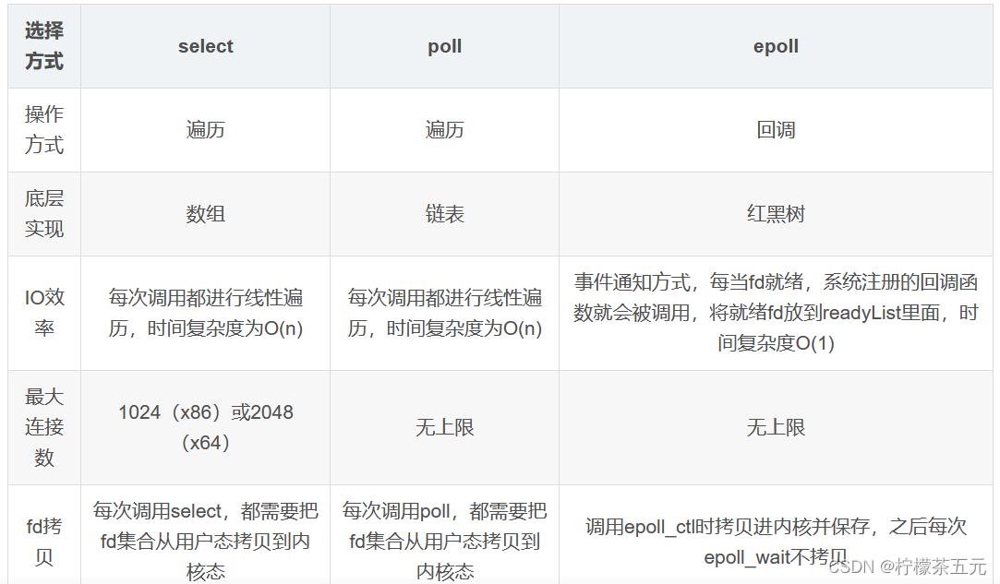
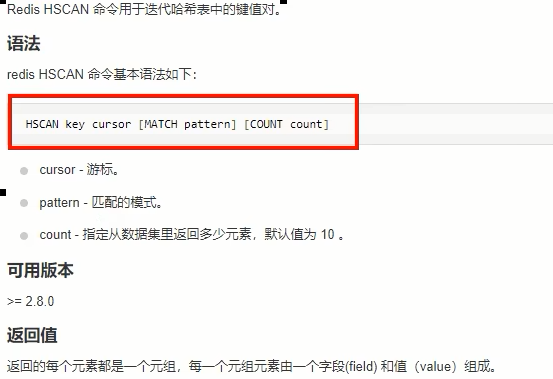

# 一、Redis 单线程 VS 多线程

## 一、Redis底层单线程 VS 多线程

1. Redis的版本很多3.x、4.x、6.x，版本不同架构也是不同的，不限定版本问是否单线程也不太严谨

   - 版本3.x ，最早版本，也就是大家口口相传的redis是单线程
   - 版本4.x，严格意义来说也不是单线程，而是负责处理客户端请求的线程是单线程，但是开始加了点多线程的东西（异步删除）
   - 2020年5月版本的6.0.x后及2022年出的7.0版本后，告别了单线程，用一种全新的多线程来解决问题

2. Redis重要里程碑

   

## 二、Redis最初是单线程的理解

1. 其实Redis最初整体也不是单线程。Redis是单线程主要是指Redis的网络IO和键值对读写是由一个线程来完成的，Redis在处理客户端的请求时包括获取（socket读）、解析、执行、内容返回（socket写）等都由一个顺序串行的主线程处理，这就是所谓的“单线程”。这也是Redis对外提供键值存储服务的主要流程

   

2. 但Redis的其他功能，比如持久化RDB、AOF、异步删除、集群数据同步等等，其实是由额外的线程执行的

3. 总的来说Redis命令工作线程是单线程的，但是，整个Redis来说，是多线程的

## 三、Redis最初是单线程但性能依旧很快的主因

1. 基于内存操作：Redis的所有数据都存在内存中，因此所有的运算都是内存级别的，所以性能比较高
2. 数据结构简单：Redis的数据结构是专门设计的，而这些简单的数据结构的查找和操作的时间大部分复杂度都是O(1)，因此性能比较高
3. 多路复用和非阻塞I/O：Redis使用I/O多路复用功能来监听多个socket连接客户端，这样就可以使用一个线程连接来处理多个请求，减少线程切换带来的开销，同时也避免了I/O阻塞操作
4. 避免上下文切换：因为是单线程模型，因此就避免了不必要的上下文切换和多线程竞争，这就省去了多线程切换带来的时间和性能上的消耗，而且单线程不会导致死锁问题的发生

## 四、Redis是单线程但能利用多个CPU的原因

1. CPU并不是使用Redis的瓶颈，因为通常Redis要么受内存限制，要么受网络限制。例如，使用在平均Linux系统上运行的流水线Redis每秒可以发送一百万个请求，因此，如果您的应用程序主要使用O(N)或O(log(N))命令，则几乎不会使用过多的CPU
2. 但是，为了最大程度地利用CPU，您可以在同一框中启动多个Redis实例，并将它们视为不同的服务器。在某个时候，单个盒子可能还不够，因此，如果您要使用多个CPU，则可以开始考虑更早地进行分片的某种方法
3. 但是，在Redis4.0中，我们开始使Redis具有更多线程，目前，这仅限于在后台删除对象，以及阻止通过Redis模块实现的命令
4. 以上均为Redis作者的原话翻译。大致意思就是Redis是基于内存操作的，Redis的瓶颈可能是机器的内存或者网络带宽而并非CPU，既然CPU不是瓶颈，那么自然就采用单线程的解决方案了，况且使用多线程比较麻烦。是在Redis 4.0中开始支持多线程了，例如后台删除、备份等功能

## 五、Redis最初采用单线程的原因

1. 使用单线程模型使Redis的开发和维护更简单，因为单线程模型方便开发和调试
2. 即使使用单线程模型同时并发的处理多客户端的请求，主要使用的是IO多路复用和非阻塞IO
3. 对于Redis系统来说，主要的性能瓶颈是内存或者网络带宽而并非CPU

## 六、Redis逐渐加入多线程特性的原因

1. bigKey的影响：比如正常情况下使用del指令可以很快的删除数据，而当被删除的key是一个非常大的对象时，例如key包含了成千上万个元素的hash集合时，那么del指令就会造成Redis 主线程卡顿。Redis3单线程时代，大key删除需要等待很久线程才能释放，类似于加了synchronized锁，在高并发的情况下，这种问题不容小觑

2. 解决方法：

   - 使用惰性删除可以有效的解决性能问题：比如当Redis需要删除一个很大的数据时，因为是单线程原子命令操作，这就会导致Redis服务卡顿，于是在Redis 4.0中就新增了多线程的模块，当然此版本中的多线程主要是为了解决删除数据效率比较低的问题的。例如`unlink key`、`flushdb async`、`flushall async`。这样就把删除工作交给了后台的子线程异步删除数据了

   - 因为Redis是单个主线程处理，Redis之父antirez一直强调"Lazy Redis is better Redis"。

     而lazy free的本质就是把某些cost（主要时间复杂度，占用主线程cpu时间片）较高删除操作，从Redis主线程剥离让bio子线程来处理，极大地减少主线阻塞时间。从而减少删除导致性能和稳定性问题

   - 在Redis4.0就引入了多个线程来实现数据的异步惰性删除等功能但是其处理读写请求的仍然只有一个线程，所以仍然算是狭义上的单线程

## 七、Redis6/7的多线程特性

1. 对于Redis来说CPU并不是瓶颈，而内存和网络带宽才是限制Redis的主要因素

   

   

2. Redis的瓶颈可以初步定为：网络IO

   - Redis一直被大家熟知的就是它的单线程架构，虽然有些命令操作可以用后台线程或子进程执行（比如数据删除、快照生成、AOF重写）。但是，从网络IO处理到实际的读写命令处理，都是由单个线程完成的
   - 随着网络硬件的性能提升，Redis的性能瓶颈有时会出现在网络IO的处理上，也就是说，单个主线程处理网络请求的速度跟不上底层网络硬件的速度
   - 为了应对这个问题，Redis采用多个IO线程来处理网络请求，提高网络请求处理的并行度，Redis6/7就是采用的这种方法
   - **Redis的多IO线程只是用来处理网络请求的，对于读写操作命今Redis仍然使用单线程来处理。**这是因为，Redis处理请求时，网络处理经常是瓶颈，通过多个IO线程并行处理网络操作，可以提升实例的整体处理性能。而继续使用单线程执行命今操作，就不用为了保证Lua脚本、事务的原子性，额外开发多线程互斥加锁机制了（不管加锁操作处理），这样一来，Redis线程模型实现就简单了

3. 主线程和IO线程协作完成请求处理的步骤

   

   

## 八、初识IO多路复用

### 一、Unix网络编程中的五种IO模型

1. Blocking IO：阻塞IO。一个应用程序执行I/O操作时，会被阻塞，直到数据准备好或操作完成。这种模型通常简单易用，但会造成资源浪费。因为CPU在等待I/O操作完成时无法做其他有用的工作 

2. NoneBlocking IO：非阻塞IO。 应用程序执行I/O操作时不会被阻塞，可以立即返回，然后定期检查操作是否完成。这种模型需要应用程序不断轮询状态，可能会降低性能并增加复杂性

   - NIO是为了弥补传统IO的不足而诞生的，NIO也有缺点，因为NIO是面向缓冲区的操作，每一次的数据处理都是对缓冲区进行的，在数据处理之前必须要判断缓冲区的数据是否完整或者已经读取完毕，如果没有，假设只读取了一部分，那么对不完整的数据处理没有任何意义。所以每次数据处理之前都要检测缓冲区数据
   - 如果需要管理同时打开成千上万个连接，这些连接每次只是发送少量的数据，例如聊天服务器，这时候用NIO处理数据
   - 如果是少量连接，而这些连接每次要发送大量的数据，这时候采用IO更合适
   - 使用哪种处理数据，需要在数据的响应等待时间和检查缓冲区数据的时间上作对比

3. IO multiplexing：多路复用IO

   - Linux世界一切皆是文件。文件描述符，简称FD，句柄FileDescriptor：文件描述符（File descriptor）是计算机科学中的一个术语，是一个用于表述指向文件的引用的抽象化概念。文件描述符在形式上是一个非负整数。实际上，它是一个索引值，指向内核为每一个进程所维护的该进程打开文件的记录表。当程序打开一个现有文件或者创建一个新文件时，内核向进程返回一个文件描述符。在程序设计中，文件描述符这一概念往往只适用于UNIX、Linux这样的操作系统

   - IO多路复用概述：

     - IO多路复用是一种同步的IO模型，实现一个线程监视多个文件句柄，一旦某个文件句柄就绪就能够通知到对应应用程序进行相应的读写操作，没有文件句柄就绪时就会阻塞应用程序从而释放CPU资源

     - 使用到的概念：

       - l/O：网络I/O，尤其在操作系统层面指数据在内核态和用户态之间的读写操作
       - 多路：多个客户端连接（连接就是套接字描述符，即socket或者channel）
       - 复用：复用一个或几个线程
       - lO多路复用：也就是说一个或一组线程处理多个TCP连接，使用单进程就能够实现同时处理多个客户端的连接，无需创建或者维护过多的进程/线程。简而言之，一个服务端进程可以同时处理多个套接字描述符
       - 实现IO多路复用的模型有3种：可以分select --> poll --> epoll三个阶段来描述

     -  通过select、poll或epoll等机制，应用程序可以同时监视多个I/O事件，当其中任何一个事件就绪时才进行处理。这种模型避免了阻塞和循环轮询的缺点，提高了效率 

       

4. signal driven IO：信号驱动IO。应用程序告知内核去等待某个事件发生，并且可以同时进行其他操作。当事件发生时，内核发送信号通知应用程序进行处理。这种模型适用于处理少量的连接和事件 

5. asynchronous IO：异步IO。应用程序发起一个I/O操作后，可以继续执行其他操作，当I/O操作完成时会通知应用程序。这种模型减少了应用程序与内核的交互次数，提高了性能 

### 二、引出epoll

1. 场景分析：模拟一个tcp服务器处理30个客户socket。假设你是一个监考老师，让30个学生解答一道竞赛考题，然后负责验收学生答卷，你有下面几个选择：

   - 第一种选择：轮询。按顺序逐个验收，先验收A，然后是B，之后是C、D。。。这中间如果有一个学生卡住，全班都会被耽误，你用循环挨个处理socket，根本不具有并发能力
   - 第二种选择：来一个new一个，一对一服务。你创律30个分身线程，每个分身线程检查一个学生的答案是否正确。这种类似于为每一个用户创建一个进程或者线程处理连接
   - 第三种选择：响应式处理，一对多服务。你站在讲台上等，谁解答完谁举手。这时C、D举手，表示他们解答问题完毕，你下去依次检查C、D的答案然后继续回到讲台上等。此时E、A又举手，然后去处理E和A。。。这种就是IO复用模型。 Linux下的select、poll和epoll就是干这个的

2. IO多路复用模型，简单明了版理解

   - 将用户socket对应的文件描述符（FileDescriptor）注册进epoll，然后epoll帮你监听哪些socket上有消息到达，这样就避免了大量的无用操作。此时的socket应该采用非阻塞模式。这样，整个过程只在调用select、poll、epoll这些调用的时候才会阻塞，收发客户消息是不会阻塞的，整个进程或者线程就被充分利用起来，这就是事件驱动，所谓的reactor反应模式

     

   - 在单个线程通过记录跟踪每一个Sockek（I/0流）的状态来同时管理多个I/0流。一个服务端进程可以同时处理多个套接字描述符，目的是尽量多的提高服务器的吞吐能力

   - IO多路复用原理，有请求就响应，没请求不打扰

3. IO多路复用小总结

   

## 九、针对面试题：Redis快的原因

- Redis快的原因：IO多路复用+epoll函数使用，才是Redis这么快的直接原因，而不是仅仅单线程命令+Redis安装存储在内存中

## 十、Redis单线程 VS 多线程总结

1. Redis工作线程是单线程的，但是，整个Redis来说，是多线程的

2. 主线程和IO线程协作完成请求处理的步骤

   - I/O的读和写本身是堵塞的，比如当socket中有数据时，Redis会通过调用先将数据从内核态空间拷贝到用户态空间，再交给Redis调用，而这个拷贝的过程就是阻塞的，当数据量越大时拷贝所需要的时间就越多，而这些操作都是基于单线程完成的

     

   - 从Redis6开始，就新增了多线程的功能来提高I/O的读写性能，他的主要实现思路是将主线程的I/O读写任务拆分给一组独立的线程去执行，这样就可以使多个socket的读写可以并行化了。采用多路I/0复用技术可以让单个线程高效的处理多个连接请求（尽量减少网络IO的时间消耗），将最耗时的Socket的读取、请求解析、写入单独外包出去，剩下的命令执行仍然由主线程串行执行并和内存的数据交互

     

   - 结合上图可知，网络IO操作就变成多线程化了，其他核心部分仍然是线程安全的，是个不错的折中办法

3. 总的来说，Redis6/7将网络数据读写、Socket读取、请求协议解析通过多个IO线程的来处理，对于真正的Redis命令执行，仍然使用主线程单线程操作

   

## 十一、Redis7开启多线程

1. 如果在实际应用中，发现Redis实例的CPU开销不大但吞吐量却没有提升，可以考虑使用Redis7的多线程机制，加速网络处理，进而提升实例的吞吐量

   - Redis7将所有数据放在内存中，内存的响应时长大约为100纳秒，对于小数据包，Redis服务器可以处理8W到10W的QPS
   - 这也是Redis处理的极限了，对于80%的公司来说，单线程的Redis已经足够使用了

2. Redis7开启多线程配置

   

   

   - 设置io-thread-do-reads配置项为yes，表示启动多线程
   - 设置线程个数。关于线程数的设置，官方的建议是如果为4核的CPU，建议线程数设置为2或3，如果为8核CPU建议线程数设置为6，线程数一定要小于机器核数，线程数并不是越大越好

# 二、BigKey

## 一、MoreKey案例

1. 大批量往Redis里面插入100W测试数据key

   - Linux Bash下面执行，插入100W数据。生成100W条Redis批量设置kv的语句(key=kn,value=vn)写入到/tmp目录下的redisTest.txt文件中

     ```shell
     for((i=1;i<=100*10000;i++)); do echo "set ksi v$i" >> /tmp/redisTest.txt ;done;
     ```

   - 通过redis提供的管道-pipe命令插入100W大批量数据

     ```shell
     cat /tmp/redisTest.txt | /opt/redis-7.0.0/src/redis-cli -h 127.0.0.1 -p 6379-a 111111 --pipe
     ```

   - 执行`redis-cli -a ****** dbsize`查看Redis中存在多少key

2. `keys *`这个指令有致命的弊端，在实际环境中最好不要使用

   - 这个指令没有offset、limit参数，是要一次性吐出所有满足条件的key，由于Redis是单线程的，其所有操作都是原子的，而keys算法是遍历算法，复杂度是O(n)，如果实例中有千万级以上的key，这个指令就会导致Redis服务卡顿，所有读写Redis的其它的指令都会被延后甚至会超时报错，可能会引起缓存雪崩甚至数据库宕机

3. 通过配置设置禁用`keys * `、`flushdb/flushall`，redis.conf在SECURITY这一项中配置

   

4. Scan命令替代Keys命令

   - Scan命令类似MySQL limit，但是不完全相同

     

   - Scan命令用于迭代数据库中的数据库键，语法为

     

   - Scan命令特点

     - SCAN命令是一个基于游标的迭代器，每次被调用之后，都会向用户返回一个新的游标，用户在下次迭代时需要使用这个新游标作为SCAN命令的游标参数，以此来延续之前的迭代过程

     - SCAN返回一个包含两个元素的数组。第一个元素是用于进行下一次迭代的新游标；第二个元素则是一个数组，这个数组中包含了所有被迭代的元素。如果新游标返回零表示迭代已结束

     - SCAN的遍历顺序：它不是从第一维数组的第零位一直遍历到末尾，而是采用了高位进位加法来遍历。之所以使用这样特殊的方式进行遍历，是考虑到字典的扩容和缩容时避免槽位的遍历重复和遗漏

       

     - Scan命令的使用

       

## 二、BigKey的大小

1. 通常我们说的BigKey，不是在值的Key很大，而是指的Key对应的value很大

2. 阿里云Redis开发规范中规定

   

3. string和二级结构

   - string是value，最大512MB但是≥10KB就是bigkey
   - list、hash、set和zset，value个数超过5000就是bigkey，bigkey的大小不代表Redis类型最多存放这么多个元素
   - list：一个列表最多可以包含2^32^-1个元素（4294967295，每个列表超过40亿个元素）
   - hash：Redis中每个hash最多可以存储2^32^-1个键值对（40多亿）
   - set：集合中最大的成员数为2^32^-1（4294967295，每个集合可存储40多亿个成员）、

## 三、Bigkey危害、产生与发现

1. Bigkey的危害

   - 内存不均，集群迁移困难
   - 超时删除，大key删除作梗
   - 网络流量阻塞

2. Bigkey的产生

   - 社交类：明星粉丝列表，典型案例粉丝逐步递增
   - 汇总统计：某个报表，日月年经年累计

3. `redis-cli --bigkey`命令的使用

   - `redis-cli --bigkey`命令的好处是给出每种数据结构Top 1 bigkey。同时给出每种数据类型的键值个数＋平均大小

   - `redis-cli --bigkey`命令的不足是想查询大于10kb的所有key，--bigkeys参数就无能为力了，需要用到memory usage来计算每个键值的字节数

   - `redis-cli --bigkey`命令的使用

     ```shell
     redis-cli --bigkeys -a ******
     
     redis-cli -h 127.0.0.1 -p 6379 -a ****** --bigkeys
     
     #加上 -i 参数，每隔100 条 scan指令就会休眠0.1s.ops就不会剧烈抬升，
     #但是扫描的时间会变长
     redis-cli -h 127.0.0.1 -p 7001 --bigkeys -i 0.1
     ```

     

4. `memory usage 键`的使用：计算每个键值的字节数

   

   

## 四、BigKey删除

1. String类型的BigKey：一般用del，如果过于庞大使用unlink key删除

2. has类型的BigKey：使用hscan每次获取少量field-value，再使用hdel删除每个field

   

   

3. list类型的BigKey：使用ltrim渐进式逐步删除，直到全部删除完成

   

   

   

4. set类型的BigKey：使用sscan每次获取部分元素，在使用srem命令删除每个元素

   

5. zset类型的BigKey：使用zscan每次获取部分元素，在使用zremrangebyrank命令删除每个元素

   

   

   

## 五、BigKey生产调优

1. redis.conf配置文件 LAZY FREEING相关说明

   

2. 阻塞和非阻塞删除命令

   

3. 优化配置

   

# 三、缓存双写一致性

## 一、缓存双写一致性的理解

- 如果Redis中有数据，需要和数据库中的值相同；如果Redis中无数据，数据库中的值要是最新值，且准备回写Redis

## 二、缓存按照操作分类

1. 只读缓存：数据库更新后，删掉缓存中的数据，下一次读取缓存时发生缓存缺失，再从数据库读取数据写回缓存 
2. 读写缓存：数据库更新后，同步更新缓存中的数据，下一次读取缓存时就会直接命中缓存 
   - 同步直写策略：写数据库之后也同步写Redis缓存，缓存和数据库中的数据一致；对于读写缓存来说，要想保证缓存和数据库中的数据一致，就要采用同步直写策略
   - 异步缓写策略：正常业务中，MySQL数据变了，但是可以在业务上容许出现一定时间后才作用于Redis，比如仓库、物流系统。异常情况出现了， 不得不将失败的动作重新修补，有可能需要借助kafka或者RabbitMQ等消息中间件，实现重试重写
3. 只读缓存和读写缓存的区别
   - 只读缓存是删除缓存中的数据，下次访问这个数据时，会重新读取数据库中的值，这样可以保证数据库和缓存完全一致，并且缓存中保留的是经常访问的热点数据。缺点是删除缓存后，之后的访问会先触发一次缓存缺失，然后从数据库读取数据，这个过程访问延迟会变大
   - 读写缓存是同步更新缓存中的值，这样被修改的数据永远都在缓存中，下次访问能够直接命中缓存，不再查询数据库，这个过程性能比较好，比较适合先修改又立即访问的场景。缺点是在高并发场景下，并发更新同一个值时，可能会导致缓存和数据库的不一致；并且对于某些缓存值的计算可能会比较复杂，但是又不常访问，那么缓存的利用率就会降低，更新缓存的代价就比较大
   - 只读缓存牺牲了一定的性能，优先保证数据库和缓存的一致性，它更适合对于一致性要求比较要高的场景。而如果对于数据库和缓存一致性要求不高，或者不存在并发修改同一个值的情况，那么使用读写缓存就比较合适，它可以保证更好的访问性能，但要考虑到缓存更新的代价 

## 三、数据库和缓存一致性的查询策略

1. 采用双检加锁策略是适用于数据库和缓存一致性的查询策略

2. 多个线程同时去查询数据库的这条数据，那么我们可以在第一个查询数据的请求上使用一个互斥锁来锁住它。其他的线程走到这一步拿不到锁就等着，等第一个线程查询到了数据，然后做缓存

3. 后面的线程进来发现已经有缓存了，就直接走缓存

   

## 四、数据库和缓存一致性的更新策略

### 一、更新策略的目的

1. 缓存设置过期时间，定期清理缓存并回写，是保证最终一致性的解决方案
2. 我们可以对存入缓存的数据设置过期时间，所有的写操作以数据库为准，对缓存操作只是尽最大努力即可。也就是说如果数据库写成功，缓存更新失败，那么只要到达过期时间，则后面的读请求自然会从数据库中读取新值然后回填缓存，达到一致性
3. 上述方案和后续落地案例是调研后的主流＋成熟的做法，但是考虑到各个公司业务系统的差距，不是100%绝对正确，不保证绝对适配全部情况，需要自己酌情选择打法，合适自己的最好
4. 其实也可以挂牌报错，凌晨升级，温馨提示，服务降级；使用单线程，这样重量级的数据操作最好不要多线程

### 二、先更新数据库，再更新缓存

1. 异常问题一：回写失败，出现脏数据

   ```tex
   1 先更新mysql的某商品的库存，当前商品的库存是100，更新为99个
   2 先更新mysql修改为99成功，然后更新redis
   3 此时假设异常出现，更新redis失败了，这导致mysql里面的库存是99而redis里面的还是100
   4 上述发生，会让数据库里面和缓存redis里面数据不一致，读到redis脏数据
   ```

2. 异常问题二： 高并发下会出现数据覆盖 

   ```tex
   【先更新数据库，再更新缓存】A、B两个线程发起调用
   【正常逻辑】
   1 A update mysql 100
   2 A update redis 100
   3 B update mysql 80
   4 B update redis 80
   =============================
   【异常逻辑】
   多线程环境下，A、B两个线程有快有慢，有前有后有并行
   1 A update mysql 100
   3 B update mysql 80
   4 B update redis 80
   2 A update redis 100
   =============================
   最终结果，mysql和lredis数据不一致，o(T_T)o，
   mysql80,redis100
   ```

### 三、先更新缓存，再更新数据库

- 不推荐，业务上一般把MySQL作为底单数据库，保证最后解释

  ```tex
  [先更新缓存，再更新数据库]，A、B两个线程发起调用
  [正常逻辑]
  1 A update redis 100
  2 A update mysql 100
  3 B update redis 80
  4 B update mysql 80
  ====================================
  [异常逻辑]多线程环境下，A. B两个线程有快有慢有并行
  A update redis 100
  B update redis 80
  B update mysq| 80
  A update mysql 100
  mysql100,redis80
  ```

### 四、先删除缓存，再更新数据库

1. 异常问题如下，如果数据库更新失败或超时或返回不及时，导致B线程请求访问缓存时发现redis里面没数据，缓存缺失，B再去读取mysql时，从数据库中读取到旧值，还写回redis， 导致A白干了

   ```tex
   1 A线程先成功删除了redis里面的数据，然后去更新mysql,此时mysql正在更新中，还没有结束。(比如网络延时)
   B突然出现要来读取缓存数据。
   
   2 此时redis里面的数据是空的，B线程来读取，先去读redis里数据(已经被A线程delete掉了)，此处出来2个问题:
   2.1 B从mysq|获得了旧值
   B线程发现redis里没有(缓存缺失)马上去mysql里面读取，从数据库里面读取来的是旧值。
   2.2 B会把获得的旧值写回redis
   获得旧值数据后返回前台并回写进redis(刚被A线程删除的旧数据有极大可能早被写回了)。
   3 A线程更新完mysql,发现redis里面的缓存是脏数据，A线程直接懵逼了，o(T_ .τ)o
   两个并发操作，一个是更新操作，另一个是查询操作，A删除缓存后，B查询操作没有命中缓存，B先把老数据读出来后放到缓存中，然后A更新操作更新了数据库。
   于是，在缓存中的数据还是老的数据，导致缓存中的数据是脏的，而且还一直这样脏下去了。
   4总结流程:
   (1)请求A进行写操作，删除redis缓存后，工作正在进行中，更新mysql.....
   A还没有彻底更新完mysql,还没commit
   (2)请求B开工查询，查询redis发现缓存不存在(被A从redis中删除了)
   (3)请求B继续，去数据库查询得到了mysq中的旧值(A还没有更新完)
   (4)请求B将旧值写回redis缓存
   (5)请求A将新值写入mysql数据库
   上述情况就会导致不一致的情形出现
   ```

2. 解决方案：**采用延时双删策略**

   

   - 加上sleep的这段时间，就是为了让线程B能够先从数据库读取数据，再把缺失的数据写入缓存，然后，线程A再进行删除。所以，线程A sleep的时间，就需要大于线程B读取数据再写入缓存的时间。这样一来，其它线程读取数据时，会发现缓存缺失，所以会从数据库中读取最新值。因为这个方案会在第一次删除缓存值后，延迟一段时间再次进行删除，所以我们也把它叫做“延迟双删”

3. 延迟双删面试题

   - 这个删除该休眠多少时间：线程A sleep的时间，就需要大于线程B读取数据再写入缓存的时间

   - 这个时间确定的方式

     - 在业务程序运行的时候，统计下线程读数据和写缓存的操作时间，自行评估自己的项目的读数据业务逻辑的耗时，以此为基础来进行估算。然后写数据的休眠时间则在读数据业务逻辑的耗时基础上加百毫秒即可。这么做的目的，就是确保读请求结束，写请求可以删除读请求造成的缓存脏数据
     - 新启动一个后台监控程序，比如WatchDog监控程序，会加时

   - 这种同步淘汰策略，吞吐量降低的处理方式：在第二次删除时设置为异步，自己起一个线程，异步删除。这样写的请求就不用沉睡一段时间再返回了，这样做，加大吞吐量

     

### 五、先更新数据库，再删除缓存

1. 先更新数据库，再删除缓存这种更新策略是目前主流的

2. 异常问题：先更新数据库，在删除缓存，假如缓存删除失败或者来不及删除，导致请求再次访问redis时缓存命中，读取到的是缓存的旧值

   | 时间 | 线程A                  | 线程B                               | 出现的问题                                     |
   | ---- | ---------------------- | ----------------------------------- | ---------------------------------------------- |
   | t1   | 更新数据库中的值...... |                                     |                                                |
   | t2   |                        | 缓存立刻命中，此时B读取的是缓存旧值 | A还没来得及删除缓存的值，导致B缓存命中读到旧值 |
   | t3   | 更新缓存的数据，over   |                                     |                                                |

3. 解决方案：订阅binlog程序在MySQL中有现成的中间件叫canal，可以完成订阅binlog日志的功能

   

   - 可以把要删除的缓存值或者是要更新的数据库值暂存到消息队列中（例如使用Kafka/RabbitMQ等）
   - 当程序没有能够成功地删除缓存值或者是更新数据库值时，可以从消息队列中重新读取这些值，然后再次进行删除或更新
   - 如果能够成功地删除或更新，我们就要把这些值从消息队列中去除，以免重复操作，此时，我们也可以保证数据库和缓存的数据一致了，否则还需要再次进行重试
   - 如果重试超过的一定次数后还是没有成功，我们就需要向业务层发送报错信息了，通知运维人员

4. 类似经典的分布式事务问题，只有一个权威答案，只能达到最终一致性

   - 流量充值，先下发短信实际充值可能滞后5分钟，可以接受
   - 电商发货，短信下发但是物流明天见

### 六、更新策略的选择

1. 在大多数业务场景下，还是建议先更新数据库，再删除缓存的方案，理由如下：

   - 先删除缓存值再更新数据库，有可能导致请求因缓存缺失而访问数据库，给数据库带来压力导致打满mysql
   - 如果业务应用中读取数据库和写缓存的时间不好估算，那么，延迟双删中的等待时间就不好设置
   - 使用先更新数据库，再删除缓存的方案，如果业务层要求必须读取一致性的数据，那么我们就需要在更新数据库时，先在Redis缓存客户端暂停并发读请求，等数据库更新完、缓存值删除后，再读取数据，从而保证数据一致性，这是理论可以达到的效果，但实际，不推荐，因为真实生产环境中，分布式下很难做到实时一致性，一般都是最终一致性

2. 更新策略对比

   | 策略                               | 高并发多线程条件下 | 问题                                               | 现象                                                         | 解决方案                                        |
   | ---------------------------------- | ------------------ | -------------------------------------------------- | ------------------------------------------------------------ | ----------------------------------------------- |
   | 先删除redis缓存，<br />再更新mysql | 无                 | 缓存删除成功但数据库更新失败                       | Java程序从数据库中读到旧值                                   | 再次更新数据库，重试                            |
   |                                    | 有                 | 缓存删除成功但数据库更新中...<br />有并发请求      | 并发请求从数据库读到旧值并回写到redis，导致后续都是从redis读取到旧值 | 再次删除缓存，重试                              |
   | 先更新mysql，<br />再删除redis缓存 | 无                 | 数据库更新成功，但缓存删除失败                     | Java程序从redis中读到旧值                                    | 再次删除缓存，重试                              |
   |                                    | 有                 | 数据库更新成功但缓存删除中......<br />有并发读请求 | 并发请求从缓存读到旧值                                       | 等待redis删除完成，这段时间数据不一致，短暂存在 |

# 四、Redis和MySQL数据双写工程落地


## 一、canal介绍

1. canal概述：文翻译为水道/管道/沟渠/运河，主要用途是于MySQL数据库增量日志数据的订阅、消费和解析，是阿里巴巴开发并开源的，采用Java语言开发
2. 历史背景是早期阿里巴巴因为杭州和美国双机房部署，存在跨机房数据同步的业务需求，实现方式主要是基于业务trigger（触发器）获取增量变更。从2010年开始，阿里巴巴逐步尝试采用解析数据库日志获取增量变更进行同步，由此衍生出了canal项目
3. canal的作用：基于日志增量订阅和消费的业务包括
   - 数据库镜像
   - 数据库实时备份
   - 索引构建和实时维护（拆分异构索引、倒排索引等）
   - 业务 cache 刷新
   - 带业务逻辑的增量数据处理

## 二、canal工作原理

1. 传统的MySQL主从复制工作原理

   

   - 当master主服务器上的数据发生改变时，则将其改变写入二进制事件日志文件中
   - salve从服务器会在一定时间间隔内对master主服务器上的二进制日志进行探测，探测其是否发生过改变
   - salve从服务器如果探测到master主服务器的二进制事件日志发生了改变，则开始一个I/O Thread请求master二进制事件日志
   - 同时master主服务器为每个I/0 Thread启动一个dump Thread, 用于向其发送二进制事件日志
   - slave从服务器将接收到的二进制事件日志保存至自己本地的中继日志文件中
   - salve从服务器将启动SQL Thread从中继日志中读取二进制日志，在本地重放，使得其数据和主服务器保持一致后I/O Thread和SQL Thread将进入睡眠状态，等待下一次被唤醒

2. canal工作原理

   

   - canal模拟MySQL slave的交互协议，伪装自己为MySQL slave，向MySQL master发送dump协议
   - MySQL master收到dump请求，开始推送binary log给slave（即canal），canal解析binary log对象（原始为byte流）

## 三、双写一致性-MySQL

1. 查看MySQL版本

   ```sql
   select version(); // 5.7.17
   ```

2. 当前的主机二进制日志

   ```sql
   show master status;
   ```

3. 查看 show variables like 'log_bin'，默认未开启

   

4. 开启MySQL的binlog写入功能。修改配置文件，win环境下修改my.ini文件

   ```ini
   log-bin=mysql-bin
   binlog-format=Row
   server-id=1
   ```

   

5. 重启MySQL

6. 再次查看 show variables like 'log_bin'

   

7. 授权canal链接MySQL账号

   - MySQL默认的用户在MySQL库的user表里面

     

   - 默认没有canal账户，此处新建+授权

     ```sql
     DROP USER IF EXISTS 'canal'@'%' ;
     CREATE USER 'canal'@'%' IDENTIFIED BY 'canal' ;
     GRANT ALL PRIVILEGES ON *.* TO 'canal'@'%' IDENTIFIED BY 'canal' ;
     FLUSH PRIVILEGES;
     SELECT * FROM mysql .user;
     ```

     

## 四、双写一致性-canal服务端

1. 将canal安装在CentOS服务器上

2. [canal下载地址](https://github.com/alibaba/canal/releases/tag/canal-1.1.6)

   

3. 解压：解压后整体放入到/mycanal路径下

4. 配置：修改 /mycanal/conf/example路径下instance.properties文件

   - 换成自己的MySQL主机master的IP地址

     

   - 换成自己的在MySQL新建的canal账户

     

5. 启动：在/mycanal/bin路径下执行`./startup.sh`

6. 查看：判断canal是否启动成功

   - 查看server日志

     

   - 查看样例example的日志

     

## 五、双写一致性-canal客户端

1. SQL脚本：选择一个库，执行建表语句

   ```sql
   CREATE TABLE `t_user`(
   `id` bigint(20)NOT NULL AUTO_INCREMENT,
   `userName` varchar(100)NOT NULL,
   PRIMARY KEY (`id`)
   )ENGINE=InnoDB AUTO_INCREMENT=10 DEFAULT CHARSET=utf8mb4
   ```

2. 创建module

3. 修改pom

   ```xml
   <?xml version="1.0" encoding="UTF-8"?>
   <project xmlns="http://maven.apache.org/POM/4.0.0"
            xmlns:xsi="http://www.w3.org/2001/XMLSchema-instance"
            xsi:schemaLocation="http://maven.apache.org/POM/4.0.0 http://maven.apache.org/xsd/maven-4.0.0.xsd">
       <modelVersion>4.0.0</modelVersion>
   
       <parent>
           <groupId>org.springframework.boot</groupId>
           <artifactId>spring-boot-starter-parent</artifactId>
           <version>3.2.2</version>
       </parent>
   
       <groupId>com.sunsh.redis</groupId>
       <artifactId>redis-stand-alone</artifactId>
       <version>1.0-SNAPSHOT</version>
   
       <properties>
           <maven.compiler.source>21</maven.compiler.source>
           <maven.compiler.target>21</maven.compiler.target>
           <project.build.sourceEncoding>UTF-8</project.build.sourceEncoding>
           <mysql.version>5.1.47</mysql.version>
           <druid.version>1.1.16</druid.version>
           <mapper.version>4.1.5</mapper.version>
       </properties>
   
       <dependencies>
           <dependency>
               <groupId>org.springframework.boot</groupId>
               <artifactId>spring-boot-starter-web</artifactId>
           </dependency>
           <!-- SpringBoot 与Redis整合依赖 -->
           <dependency>
               <groupId>org.springframework.boot</groupId>
               <artifactId>spring-boot-starter-data-redis</artifactId>
           </dependency>
           <dependency>
               <groupId>org.apache.commons</groupId>
               <artifactId>commons-pool2</artifactId>
           </dependency>
           <dependency>
               <groupId>org.projectlombok</groupId>
               <artifactId>lombok</artifactId>
           </dependency>
           <dependency>
               <groupId>org.springframework.boot</groupId>
               <artifactId>spring-boot-starter-actuator</artifactId>
           </dependency>
           <!-- springboot 与 AOP -->
           <dependency>
               <groupId>org.springframework.boot</groupId>
               <artifactId>spring-boot-starter-aop</artifactId>
           </dependency>
           <dependency>
               <groupId>org.aspectj</groupId>
               <artifactId>aspectjweaver</artifactId>
           </dependency>
           <!-- Mysql 数据库驱动 -->
           <dependency>
               <groupId>mysql</groupId>
               <artifactId>mysql-connector-java</artifactId>
               <version>${mysql.version}</version>
           </dependency>
           <!-- springboot集成druid连接池-->
           <dependency>
               <groupId>com.alibaba</groupId>
               <artifactId>druid-spring-boot-starter</artifactId>
               <version>1.1.10</version>
           </dependency>
           <dependency>
               <groupId>com.alibaba</groupId>
               <artifactId>druid</artifactId>
               <version>${druid.version}</version>
           </dependency>
           <!-- canal -->
           <dependency>
               <groupId>com.alibaba.otter</groupId>
               <artifactId>canal.client</artifactId>
               <version>1.1.0</version>
           </dependency>
           <!-- jedis -->
           <dependency>
               <groupId>redis.clients</groupId>
               <artifactId>jedis</artifactId>
               <version>3.8.0</version>
           </dependency>
       </dependencies>
   
       <build>
           <plugins>
               <plugin>
                   <groupId>org.springframework.boot</groupId>
                   <artifactId>spring-boot-maven-plugin</artifactId>
                   <configuration>
                       <excludes>
                           <exclude>
                               <groupId>org.projectlombok</groupId>
                               <artifactId>lombok</artifactId>
                           </exclude>
                       </excludes>
                   </configuration>
               </plugin>
           </plugins>
       </build>
   </project>
   ```

4. 写YML

   ```yaml
   server.port=8000
   
   # ====================== alibaba.druid ======================
   spring.datasource.type=com.alibaba.druid.pool.DruidDataSource
   spring.datasource.driver-class-name=com.mysql.jdbc.Driver
   spring.datasource.url=jdbc:mysql://127.0.0.1:3306/jmall?useUnicode=true&characterEncoding=utf-8&useSSL=true&serverTimezone=UTC
   spring.datasource.username=root
   spring.datasource.password=root
   spring.datasource.druid.test-while-idle=fasle
   
   ```

5. Redis工具类

   ```java
   @Component
   @Slf4j
   public class RedisUtils {
   
       @Autowired
       private RedisTemplate<String, Object> redisTemplate;
   
       /**
        * 指定缓存失效时间
        *
        * @param key 键
        * @param time 时间(秒)
        * @return
        */
       public boolean expire(String key, long time) {
           try {
               if (time > 0) {
                   redisTemplate.expire(key, time, TimeUnit.SECONDS);
               }
               return true;
           } catch (Exception e) {
               log.error("exception when expire key {}. ", key, e);
               return false;
           }
       }
   
       /**
        * 根据key获取过期时间
        *
        * @param key 键 不能为null
        * @return 时间(秒) 返回0代表为永久有效
        */
       public long getExpire(String key) {
           return redisTemplate.getExpire(key, TimeUnit.SECONDS);
       }
   
       /**
        * 判断key是否存在
        *
        * @param key  键
        * @return true 存在 false不存在
        */
       public boolean hasKey(String key) {
           try {
               return redisTemplate.hasKey(key);
           } catch (Exception e) {
               log.error("exception when check key {}. ", key, e);
               return false;
           }
       }
   
       /**
        * 删除缓存
        *
        * @param key 可以传一个值 或多个
        */
       @SuppressWarnings("unchecked")
       public void del(String... key) {
           if (key != null && key.length > 0) {
               if (key.length == 1) {
                   redisTemplate.delete(key[0]);
               } else {
                   List<String> objects = (List<String>) CollectionUtils.arrayToList(key);
                   redisTemplate.delete(objects);
               }
           }
       }
   
       /**
        * 普通缓存获取
        *
        * @param key 键
        * @return 值
        */
       public Object get(String key) {
           return key == null ? null : redisTemplate.opsForValue().get(key);
       }
   
       /**
        * 普通缓存放入
        *
        * @param key 键
        * @param value 值
        * @return true成功 false失败
        */
       public boolean set(String key, Object value) {
           try {
               redisTemplate.opsForValue().set(key, value);
               return true;
           } catch (Exception e) {
               log.error("exception when set key {}. ", key, e);
               return false;
           }
   
       }
   
       /**
        * 普通缓存放入并设置时间
        *
        * @param key 键
        * @param value 值
        * @param time 时间(秒) time要大于0 如果time小于等于0 将设置无限期
        * @return true成功 false 失败
        */
       public boolean set(String key, Object value, long time) {
           try {
               if (time > 0) {
                   redisTemplate.opsForValue().set(key, value, time, TimeUnit.SECONDS);
               } else {
                   set(key, value);
               }
               return true;
           } catch (Exception e) {
               log.error("exception when set key {}. ", key, e);
               return false;
           }
       }
   
       /**
        * 递增
        *
        * @param key 键
        * @param delta 要增加几(大于0)
        * @return
        */
       public long incr(String key, long delta) {
           if (delta <= 0) {
               throw new RuntimeException("递增因子必须大于0");
           }
           return redisTemplate.opsForValue().increment(key, delta);
       }
   
       /**
        * 递减
        *
        * @param key 键
        * @param delta 要减少几(小于0)
        * @return
        */
       public long decr(String key, long delta) {
           if (delta <= 0) {
               throw new RuntimeException("递减因子必须大于0");
           }
           return redisTemplate.opsForValue().increment(key, -delta);
       }
   
       /**
        * HashGet
        *
        * @param key  键 不能为null
        * @param item 项 不能为null
        * @return 值
        */
       public Object hget(String key, String item) {
           return redisTemplate.opsForHash().get(key, item);
       }
   
       /**
        * 获取hashKey对应的所有键值
        *
        * @param key 键
        * @return 对应的多个键值
        */
       public Map<Object, Object> hmget(String key) {
           return redisTemplate.opsForHash().entries(key);
       }
   
       /**
        * HashSet
        *
        * @param key 键
        * @param map 对应多个键值
        * @return true 成功 false 失败
        */
       public boolean hmset(String key, Map<String, Object> map) {
           try {
               redisTemplate.opsForHash().putAll(key, map);
               return true;
           } catch (Exception e) {
               log.error("exception when hash set key {}. ", key, e);
               return false;
           }
       }
   
       /**
        * HashSet 并设置时间
        *
        * @param key 键
        * @param map 对应多个键值
        * @param time 时间(秒)
        * @return true成功 false失败
        */
       public boolean hmset(String key, Map<String, Object> map, long time) {
           try {
               redisTemplate.opsForHash().putAll(key, map);
               if (time > 0) {
                   expire(key, time);
               }
               return true;
           } catch (Exception e) {
               log.error("exception when hash set key {}. ", key, e);
               return false;
           }
       }
   
       /**
        * 向一张hash表中放入数据,如果不存在将创建
        *
        * @param key 键
        * @param item 项
        * @param value 值
        * @return true 成功 false失败
        */
       public boolean hset(String key, String item, Object value) {
           try {
               redisTemplate.opsForHash().put(key, item, value);
               return true;
           } catch (Exception e) {
               log.error("exception when hash set key {}, item {} ", key, item, e);
               return false;
           }
       }
   
       /**
        * 向一张hash表中放入数据,如果不存在将创建
        *
        * @param key 键
        * @param item 项
        * @param value 值
        * @param time 时间(秒) 注意:如果已存在的hash表有时间,这里将会替换原有的时间
        * @return true 成功 false失败
        */
       public boolean hset(String key, String item, Object value, long time) {
           try {
               redisTemplate.opsForHash().put(key, item, value);
               if (time > 0) {
                   expire(key, time);
               }
               return true;
           } catch (Exception e) {
               log.error("exception when hash set key {}, item {} ", key, item, e);
               return false;
           }
       }
   
       /**
        * 删除hash表中的值
        *
        * @param key 键 不能为null
        * @param item 项 可以使多个 不能为null
        */
       public void hdel(String key, Object... item) {
           redisTemplate.opsForHash().delete(key, item);
       }
   
       /**
        * 判断hash表中是否有该项的值
        *
        * @param key 键 不能为null
        * @param item 项 不能为null
        * @return true 存在 false不存在
        */
       public boolean hHasKey(String key, String item) {
           return redisTemplate.opsForHash().hasKey(key, item);
       }
   
       /**
        * hash递增 如果不存在,就会创建一个 并把新增后的值返回
        *
        * @param key 键
        * @param item 项
        * @param by 要增加几(大于0)
        * @return
        */
       public double hincr(String key, String item, double by) {
           return redisTemplate.opsForHash().increment(key, item, by);
       }
   
       /**
        * hash递减
        *
        * @param key 键
        * @param item 项
        * @param by 要减少记(小于0)
        * @return
        */
       public double hdecr(String key, String item, double by) {
           return redisTemplate.opsForHash().increment(key, item, -by);
       }
   
       /**
        * 根据key获取Set中的所有值
        *
        * @param key 键
        * @return
        */
       public Set<Object> sGet(String key) {
           try {
               return redisTemplate.opsForSet().members(key);
           } catch (Exception e) {
               return null;
           }
       }
   
       /**
        * 根据value从一个set中查询,是否存在
        *
        * @param key  键
        * @param value 值
        * @return true 存在 false不存在
        */
       public boolean sHasKey(String key, Object value) {
           try {
               return redisTemplate.opsForSet().isMember(key, value);
           } catch (Exception e) {
               return false;
           }
       }
   
       /**
        * 将数据放入set缓存
        *
        * @param key  键
        * @param values 值 可以是多个
        * @return 成功个数
        */
       public long sSet(String key, Object... values) {
           try {
               return redisTemplate.opsForSet().add(key, values);
           } catch (Exception e) {
               return 0;
           }
       }
   
       /**
        * 将set数据放入缓存
        *
        * @param key   键
        * @param time  时间(秒)
        * @param values 值 可以是多个
        * @return 成功个数
        */
       public long sSetAndTime(String key, long time, Object... values) {
           try {
               Long count = redisTemplate.opsForSet().add(key, values);
               if (time > 0)
                   expire(key, time);
               return count;
           } catch (Exception e) {
               return 0;
           }
       }
   
       /**
        * 获取set缓存的长度
        *
        * @param key   键
        * @return
        */
       public long sGetSetSize(String key) {
           try {
               return redisTemplate.opsForSet().size(key);
           } catch (Exception e) {
               return 0;
           }
       }
   
       /**
        * 移除值为value的
        *
        * @param key   键
        * @param values   值 可以是多个
        * @return 移除的个数
        */
       public long setRemove(String key, Object... values) {
           try {
               Long count = redisTemplate.opsForSet().remove(key, values);
               return count;
           } catch (Exception e) {
               return 0;
           }
       }
   
       /**
        * 获取list缓存的内容
        *
        * @param key  键
        * @param start   开始
        * @param end   结束 0 到 -1代表所有值
        * @return
        */
       public List<Object> lGet(String key, long start, long end) {
           try {
               return redisTemplate.opsForList().range(key, start, end);
           } catch (Exception e) {
               return null;
           }
       }
   
       /**
        * 获取list缓存的长度
        *
        * @param key  键
        * @return
        */
       public long lGetListSize(String key) {
           try {
               return redisTemplate.opsForList().size(key);
           } catch (Exception e) {
               return 0;
           }
       }
   
       /**
        * 通过索引 获取list中的值
        *
        * @param key  键
        * @param index 索引 index>=0时， 0 表头，1 第二个元素，依次类推；index<0时，-1，表尾，-2倒数第二个元素，依次类推
        * @return
        */
       public Object lGetIndex(String key, long index) {
           try {
               return redisTemplate.opsForList().index(key, index);
           } catch (Exception e) {
               return null;
           }
       }
   
       /**
        * 将list放入缓存
        *
        * @param key   键
        * @param value  值
        * @return
        */
       public boolean lSet(String key, Object value) {
           try {
               redisTemplate.opsForList().rightPush(key, value);
               return true;
           } catch (Exception e) {
               return false;
           }
       }
   
       /**
        * 将list放入缓存
        *
        * @param key   键
        * @param value  值
        * @param time  时间(秒)
        * @return
        */
       public boolean lSet(String key, Object value, long time) {
           try {
               redisTemplate.opsForList().rightPush(key, value);
               if (time > 0)
                   expire(key, time);
               return true;
           } catch (Exception e) {
               return false;
           }
       }
   
       /**
        * 将list放入缓存
        *
        * @param key  键
        * @param value  值
        * @return
        */
       public boolean lSet(String key, List<Object> value) {
           try {
               redisTemplate.opsForList().rightPushAll(key, value);
               return true;
           } catch (Exception e) {
               return false;
           }
       }
   
       /**
        * 将list放入缓存
        *
        * @param key  键
        * @param value 值
        * @param time  时间(秒)
        * @return
        */
       public boolean lSet(String key, List<Object> value, long time) {
           try {
               redisTemplate.opsForList().rightPushAll(key, value);
               if (time > 0)
                   expire(key, time);
               return true;
           } catch (Exception e) {
               return false;
           }
       }
   
       /**
        * 根据索引修改list中的某条数据
        *
        * @param key  键
        * @param index 索引
        * @param value 值
        * @return
        */
       public boolean lUpdateIndex(String key, long index, Object value) {
           try {
               redisTemplate.opsForList().set(key, index, value);
               return true;
           } catch (Exception e) {
               e.printStackTrace();
               return false;
           }
       }
   
       /**
        * 移除N个值为value
        *
        * @param key 键
        * @param count 移除多少个
        * @param value 值
        * @return 移除的个数
        */
       public long lRemove(String key, long count, Object value) {
           try {
               Long remove = redisTemplate.opsForList().remove(key, count, value);
               return remove;
           } catch (Exception e) {
               return 0;
           }
       }
   }
   
   ```

6. Redis连接canal工具类

   ```java
   public class RedisCanalUtils {
   
       public static final String REDIS_IP_ADDR = "192.168.35.201";
   
       public static final String REDIS_PWD = "282127";
   
       public static JedisPool jedisPool;
   
       static {
           JedisPoolConfig jedisPoolConfig = new JedisPoolConfig();
           jedisPoolConfig.setMaxTotal(20);
           jedisPoolConfig.setMaxIdle(10);
           jedisPool = new JedisPool(jedisPoolConfig, REDIS_IP_ADDR, 6379, 10000, REDIS_PWD);
       }
   
       public static Jedis getJedis() throws Exception {
           if (null != jedisPool) {
               return jedisPool.getResource();
           }
           throw new Exception("Jedispoll is not ok");
       }
   }
   
   ```

7. 业务类：RedisCanalClientExample

   ```java
   public class RedisCanalClientExample {
   
       public static final Integer _60SECONDS = 60;
       public static final String REDIS_IP_ADDR = "127.0.0.1";
   
       public static void redisInsert(List<Column> columns) {
   
           JSONObject jsonObject = new JSONObject();
           for (Column column : columns) {
               System.out.println(column.getName() + ": " + column.getValue() + " insert = " + column.getUpdated());
               jsonObject.put(column.getName(), column.getValue());
           }
   
           if (columns.size() > 0) {
               try (Jedis jedis = RedisUtils.getJedis()) {
                   jedis.set(columns.get(0).getValue(), jsonObject.toJSONString());
               } catch (Exception e) {
                   e.printStackTrace();
               }
           }
       }
   
       public static void redisDelete(List<Column> columns) {
           JSONObject jsonObject = new JSONObject();
           for (Column column : columns) {
               System.out.println(column.getName() + ": " + column.getValue() + " delete = " + column.getUpdated());
               jsonObject.put(column.getName(), column.getValue());
           }
   
           if (columns.size() > 0) {
               try (Jedis jedis = RedisUtils.getJedis()) {
                   jedis.del(columns.get(0).getValue());
               } catch (Exception e) {
                   e.printStackTrace();
               }
           }
       }
   
       public static void redisUpdate(List<Column> columns) {
   
           JSONObject jsonObject = new JSONObject();
           for (Column column : columns) {
               System.out.println(column.getName() + ": " + column.getValue() + " update = " + column.getUpdated());
               jsonObject.put(column.getName(), column.getValue());
           }
   
           if (columns.size() > 0) {
               try (Jedis jedis = RedisUtils.getJedis()) {
                   jedis.set(columns.get(0).getValue(), jsonObject.toJSONString());
               } catch (Exception e) {
                   e.printStackTrace();
               }
           }
       }
   
       public static void printEntry(List<Entry> entrys) {
           for (Entry entry : entrys) {
               if (entry.getEntryType() == EntryType.TRANSACTIONBEGIN || entry.getEntryType() == EntryType.TRANSACTIONEND) {
                   continue;
               }
   
               RowChange rowChage = null;
               try {
                   rowChage = RowChange.parseFrom(entry.getStoreValue());
               } catch (Exception e) {
                   throw new RuntimeException("ERROR ## parser of eromanga-event has an error , data:" + entry.toString(),
                           e);
               }
   
               EventType eventType = rowChage.getEventType();
               System.out.println(String.format("================&gt; binlog[%s:%s] , name[%s,%s] , eventType : %s",
                       entry.getHeader().getLogfileName(), entry.getHeader().getLogfileOffset(),
                       entry.getHeader().getSchemaName(), entry.getHeader().getTableName(),
                       eventType));
   
               for (RowData rowData : rowChage.getRowDatasList()) {
                   if (eventType == EventType.DELETE) {
                       redisDelete(rowData.getBeforeColumnsList());
                   } else if (eventType == EventType.INSERT) {
                       redisInsert(rowData.getAfterColumnsList());
                   } else {
                       System.out.println("-------&gt; before");
                       redisUpdate(rowData.getBeforeColumnsList());
                       System.out.println("-------&gt; after");
                   }
               }
           }
       }
   
       public static void main(String[] args) {
           // 创建链接
           CanalConnector connector = CanalConnectors.newSingleConnector(new InetSocketAddress(AddressUtils.getHostIp(),
                   11111), "example", "", "");
           int batchSize = 1000;
           int emptyCount = 0;
           try {
               connector.connect();
               // 监听当前库的所有表
               // connector.subscribe(".*\\..*");
               connector.subscribe("jmall.t_user");
               connector.rollback();
               int totalEmptyCount = 10 * _60SECONDS;
               while (emptyCount < totalEmptyCount) {
                   System.out.println("我是canal，每秒监听一次：" + UUID.randomUUID().toString());
                   Message message = connector.getWithoutAck(batchSize); // 获取指定数量的数据
                   long batchId = message.getId();
                   int size = message.getEntries().size();
                   if (batchId == -1 || size == 0) {
                       // MySQL数据没有变动
                       emptyCount++;
                       System.out.println("empty count : " + emptyCount);
                       try {
                           Thread.sleep(1000);
                       } catch (InterruptedException e) {
                       }
                   } else {
                       emptyCount = 0;
                       // System.out.printf("message[batchId=%s,size=%s] \n", batchId, size);
                       printEntry(message.getEntries());
                   }
   
                   connector.ack(batchId); // 提交确认
                   // connector.rollback(batchId); // 处理失败, 回滚数据
               }
   
               System.out.println("empty too many times, exit");
           } finally {
               connector.disconnect();
           }
       }
   }
   ```

8. java程序下 connector.subscribe配置的过滤正则

   

# 五、案例实战bitmap、hyperloglog、GEO

## 一、统计的类型

- 亿级系统中，常见的四种统计：

  1. 聚合统计：统计多个集合元素的聚合结果，就是交差并等集合统计。交差并集和聚合函数的应用

     

  2. 排序统计

     - 抖音短视频最新评论留言的场景，请你设计一个展现列表。（考察数据结构和设计思路）

     - 设计案例和回答思路：以抖音vcr最新的留言评价为案例，所有评论需要两个功能，按照时间排序+分页显示能够排序+分页显示的redis数据结构选择zset最合适

     - zset：在面对需要展示最新列表、排行榜等场景时，如果数据更新频繁或者需要分页显示，建议使用ZSet

       																																																																																																																																																														

  3. 二值统计：集合元素的取值就只有0和1两种。在钉钉上签到打卡的场景中，我们只用记录有签到(1)或没有签单(0)。这时候使用bitmap类型最合适

  4. 基数统计：指统计一个集合中不重复的元素个数。这时候使用HyperLogLog类型最合适

## 二、HyperLogLog

1. 名词解释

   - UV：Unique Visitor，独立访客，一般理解为客户端IP。需要去重考虑
   - PV：Page View，页面浏览量。不需要去重
   - DAU：Daily Active User，日活跃量用户，登录或者使用了某个产品的用户数（去重复登录的用户）。常用于反映网站、互联网应用或者网络游戏的运营情况
   - MAU：Monthly Active User，月活跃用户量

2. 需求分析

   - 很多计数类场景，比如每日注册IP数、每日访问IP数、页面实时访问数PV、访问用户数UV等
   - 因为主要的目标高效、巨量地进行计数，所以对存储的数据的内容并不太关心。也就是说它只能用于统计巨量数量，不太涉及具体的统计对象的内容和精准性
   - 统计单日一个页面的访问量(PV)，单次访问就算一次
   - 统计单日一个页面的用户访问量(UV)，即按照用户为维度计算，单个用户一天内多次访问也只算一次
   - 多个key的合并统计，某个门户网站的所有模块的PV聚合统计就是整个网站的总PV

3. HyperLogLog的作用

   - 基数：是一种数据集，去重复后的真实个数

     

   - 去重复统计功能的基数估算算法-就是HyperLogLog

     

   - 基数统计：用于统计一个集合中不重复的元素个数，就是对集合去重复后剩余元素的计算

   - 基数统计就是HyperLogLog

4. 去重复统计的方式

   - Java中的hashSet
   - Redis中的Zset
   - Redis中的bitmap
     - bitmap是通过用位bit数组来表示各元素是否出现，每个元素对应一位，所需的总内存为N个bit
     - 基数计数则将每一个元素对应到bit数组中的其中一位，比如bit数组010010101(按照从零开始下标，有的就是1、4、6、8)。新进入的元素只需要将已经有的bit数组和新加入的元素进行按位或计算就行。这个方式能大大减少内存占用且位操作迅速
     - 假设一个样本案例就是一亿个基数位值数据，一个样本就是一亿。如果要统计1亿个数据的基数位值，大约需要内存100000000/8/1024/1024约等于12M，内存减少占用的效果显著。这样得到统计一个对象样本的基数值需要12M
     - 如果统计1000个对象样本(1w个亿级),就需要117.1875G将近120G，可见使用bitmaps还是不适用大数据量下(亿级)的基数计数场景，但是bitmaps方法是精确计算的
     - 样本元素越多内存消耗急剧增大，难以管控+各种慢，对于亿级统计不太合适，量变引起质变
     - 解决方式：概率算法。通过牺牲准确率来换取空间，对于不要求绝对准确率的场景下可以使用，因为概率算法不直接存储数据本身，通过一定的概率统计方法预估基数值，同时保证误差在一定范围内，由于又不储存数据故此可以大大节约内存，
       HyperLogLog就是一种概率算法的实现

5. HyperLogLog原理说明

   - 只是进行不重复的基数统计，不是集合也不保存数据，只记录数量而不是具体内容
   - 有误差：HyperLogLog提供不精确的去重计数方案，只牺牲准确率来换取空间，误差仅仅只是0.81%左右

## 三、首页亿级UV的Redis设计方案

1. 需求分析

   - UV的统计需要去重，一个用户一天内的多次访问只能算作一次
   - 淘宝、天猫首页的UV，平均每天是1~1.5个亿
   - 每天存1.5个亿的IP，访问者来了后先去查是否存在，不存在就加入

2. 设计方案

   - 用MySQL，一个亿的数据，扛不住啊。。。高并发下，3000万的数据就需要分库分表了

   - 用redis的hash结构存储：按照ipv4的结构来说明，每个ipv4的地址最多是15个字节（ip = "192.168.111.1"，最多XXX.XXX.XXX.XXX）。某一天的1.5亿*15个字节=2G，一个月60G，redis死定了，太占内存了

     

   - HyperLogLog：完美

     

## 四、GEO类型的实现

1. 需求分析：推送当前位置，指定范围内的酒店信息

2. 架构设计：Redis的新类型GEO

   

3. 编码实现。关键点在于GEORADIUS，以给定的经纬度为中心，找出某一半径内的元素

   ```java
   public string geoAdd() {
       Map<String，point> map = new HashMap<>();
       map.put("天安门", new Point( x: 116.403963, y: 39.915119));
       map.put("故宫", new point( x: 116.403414, y: 39.924091));
       map.put("长城", new Point( x: 116.024067, y: 40.362639));
       redisTemplate.opsForGeo().add(CITY,map);
       return map.tostring();
   }
   
   public Point position(string member){
       // 获取经纬度坐标，这里的member可以有多个，返回的list也可以有多个
       list<Point> list = redisTemplate.opsForGeo().position(CITY, member);
       return list.get(0);
   }
   
   public string hash(string member) {
       //geohash算法生成的base32编码值，这里的member可以有多个，
       //返回的list也可以有多个
       List<string> list = redisTemplate.opsForGeo().hash(CITY,member);
       return list.get(0);
   }
   
   public Distance distance(string member1，string member2) {
       //获取两个给定位置之间的距离
       Distance distance = redisTemplate.opsForGeo().distance(CITY,member1,member2,RedisGeoCommands.DistanceUnit.KILOMETERS);
       return distance;
   }
   
   public GeoResults radiusByxy() {
       //通过经度，纬度查找附近的，北京王府井位置116.418017, 39.914402
       Circle circle = new Circle(116. 418017, 39 .914402, Metrics . KILOMETERS . getMultiplier());
       //返@50条:
       RedisGeoCommands.GeoRadiusCommandArgs args =
   RedisGeoCommands.GeoRadiusCommandArgs.newGeoRadiusArgs().includeDistance().includeCoordinates().sortAscending().limit(50);
       GeoResults<RedisGeoCommands.GeoLocation<String>> geoResults=
   this.redisTemplate.opsForGeo().radius(CITY, circle, args);
       return geoResults;
   }
   
   public GeoResults radiusByMember() {
       //通过地方查找附近
       String member="天安门";
       //返回50条
       RedisGeoCommands.GeoRadiusCommandArgs args = RedisGeoCommands.GeoRadiusCommandArgs.newGeoRadiusArgs().includeDistance().includeCoordinates( ).sortAscending().limit(50) ;
       //半径10公里内
       Distance distance=new Distance(10，Metrics.KILOMETERS);
       GeoResults<RedisbeoCommands.GeoLocation<String>> geoResults= this.redisTemplate.opsForbeol().radius(CITY,member,distance,angs);
       return geoResults;
   }
   ```

## 五、Bitmap

1. 大厂真是案例

   - 日活统计
   - 连续签到打卡
   - 最近一周的活跃用户
   - 统计指定用户一年之中的登录天数
   - 某用户按照一年365天，哪几天登陆过，哪几天没有登录？

2. Bitmap概述：由0和1状态表现的二进制位的bit数组

   

3. Bitmap作用：用于状态统计，Y、N类似AtomicBoolean

4. 案例需求

   ```tex
   签到日历仅展示当月签到数据
   签到日历需展示最近连续签到天数
   假设当前日期是20210618，且20210616未签到
   
   若20210617已签到且0618未签到，则连续签到天数为1
   
   若20210617已签到且0618已签到，则连续签到天数为2
   
   连续签到天数越多，奖励越大
   所有用户均可签到
   截至2020年3月31日的12个月，京东年度活跃用户数3.87亿，同比增长24.8%，
   环比增长超2500万，此外，2020年3月移动端日均活跃用户数同比增长46%
   假设10%左右的用户参与签到，签到用户也高达3千万。。。
   ```

5. 小厂方法，传统MySQL方式

   - 建表语句

     ```sql
     CREATE TABLE user_sign
     keyid BIGINT NOT NULL PRIMARY KEY AUTO INCREMENT,
     user_key VARCHAR(200), #京东用户ID
     sign_date DATETIME,#签到日期(20220618)
     sign_count INT #连续签到天数
     
     INSERT INTO user_sign(user_key,sign_date,sign_count)
     VALUES ('28216618-XXXX-XXXX-XXXX-XXXXXXXXXXXX','2022-06-18 15:11:12',1);
             
     SELECT
     	sign_count
     FROM
     	user_sign
     WHERE 
     	user_key =20216618-XXXX-XXXX-XXXX-XXXXXXXXXXXX 
     	AND sign_date BETWEEN '2020-06-17 00:00:00' AND '2020-06-18 23:59:59'
     ORDER BY
     	sign_date DESC
     	LIMIT 1;
     ```

   - 困难和解决思路

     - 方法正确但是难以落地实现。签到用户量较小时这么设计能行，但京东这个体量的用户（估算3000W签到用户，一天一条数据，一个月就是9亿数据）对于京东这样的体量，如果一条签到记录对应着当日签到记录，那会很恐怖......
     - 解决方案： 一条签到记录对应一条记录，会占据越来越大的空间；一个月最多31天，刚好我们的int类型是32位，那这样一个int类型就可以搞定一个月，32位大于31天，当天来了就是1没来就是0；一条数据直接存储一个月的签到记录，不再是存储一天的签到记录

6. 大厂方法，基于Redis的Bitmap实现签到日历

   - 建表-按位-redis-bitmap
   - 在签到统计时，每个用户一天的签到用1个bit位就能表示
   - 一个月（假设是31天）的签到情况用31个bit位就可以，一年的签到也只需要用365个bit位，根本不用太复杂的集合类型
   - 案例结合Bitmap类型签到+结合布隆过滤器实现

7. 命令复习

   

# 六、布隆过滤器BloomFilter

## 一、布隆过滤器基本介绍

1. 布隆过滤器概述：由一个初值都为零的bit数组和多个哈希函数构成，用来快速判断集合中是否存在某个元素

   

2. 布隆过滤器设计思想

   - 目的：减少内存占用

   - 方式：不保存数据信息，只是在内存中做一个是否存在的标记flag

   - 本质就是判断具体数据是否存在于一个大的集合中

   - 布隆过滤器是一种类似set的数据结构，只是统计结果，在巨量数据下有点小瑕疵，不够完美

     ```tex
     布隆过滤器(英语: Bloom Filter) 是 1970 年由布隆提出的。
     它实际上是一个很长的二进制数组(00000000)+一系列随机hash算法映射函数，
     主要用于判断一个元素是否在集合中。
     通常我们会遇到很多要判断一个元素是否在某个集合中的业条场景，一般想到的是将集合中所有元素保存起来，然后通过比较确定。链表、树、哈希表等等数据结构都是这种思路。
     但是随着集合中元素的增加，我们需要的存储空间也会呈现线性增长，最终达到瓶颈。同时检索速度也越来越慢
     链表、树、哈希表等等数据结构的检索时间复杂度分别为O(n),0(logn),0(1)。这个时候隆过滤器 (Bloom Filter)就应运而生
     ```

     

3. 布隆过滤器作用

   - 高效地插入和查询，占用空间少，返回的结果是不确定性+不够完美
   - 一个元素如果判断结果：存在时，元素不一定存在，但是判断结果为不存在时，则一定不存在
   - 布隆过滤器可以添加元素，但是不能删除元素，由于涉及hashcode判断依据，删除元素会导致误判率增加
   - 小总结：有，是可能有；无，是肯定无。可以保证的是，如果布隆过滤器判断一个元素不在一个集合中，那这个元素一定不会在集合中。本质就是判断具体数据是否存在于一个大的集合中

## 二、布隆过滤器实现原理和数据结构

1. 布隆过滤器实现原理

   - 布隆过滤器（Bloom Filter）是一种专门用来解决去重问题的高级数据结构
   - 实质就是一个大型位数组和几个不同的无偏hash函数（无偏表示分布均匀）。由一个初值都为零的bit数组和多个哈希函数构成，用来快速判断某个数据是否存在。但是跟 HyperLogLog一样，它也一样有那么一点点不精确，也存在一定的误判概率

2. 添加key、查询key

   - 添加key时：使用多个hash函数对key进行hash运算得到一个整数索引值，对位数组长度进行取模运算得到一个位置，每个hash函数都会得到一个不同的位置，将这几个位置都置1就完成了add操作
   - 查询key时：只要有其中一位是零就表示这个key不存在；但如果都是1，则不一定存在对应的key
   - 结论：有，是可能有；无，是肯定无

3. hash冲突导致数据不精准问题一：当有变量被加入集合时，通过N个映射函数将这个变量映射成位图中的N个点，把它们置为1（假定有两个变量都通过 3 个映射函数）

   

   - 查询某个变量的时候我们只要看看这些点是不是都是 1，就可以大概率知道集合中有没有它了

   - 如果这些点，有任何一个为0则被查询变量一定不在

   - 如果都是1，则被查询变量很可能存在

   - 为什么说是可能存在，而不是一定存在的原因：因为映射函数本身就是散列函数，散列函数是会有碰撞的。 (见上图3号坑两个对象都1）

     ```tex
     正是基于布隆过滤器的快速检测特性，我们可以在把数据写入数据库时，使用布隆过滤器做个标记。当缓布缺失后，应用查询数据库时，可以通过查询布隆过滤器快速判断数据是否存在。如果不存在，就不用再去据库中查询了。这样一来，即使发生缓存穿透了，大量请求只会查询Redis和布隆过滤器，而不会积压到数据库，也就不会影响数据库的正常运行。布隆过滤器可以使用Redis实现，本身就能承担较大的并发访问压力
     ```

4. hash冲突导致数据不精准问题二：哈希函数

   - 哈希函数的概念是：将任意大小的输入数据转换成特定大小的输出数据的函数，转换后的数据称为哈希值或哈希编码，也叫散列值

     

   - 如果两个散列值是不相同的（根据同一函数）那么这两个散列值的原始输入也是不相同的。这个特性是散列函数具有确定性的结果，具有这种性质的散列函数称为单向散列函数

   - 散列函数的输入和输出不是唯一对应关系的，如果两个散列值相同，两个输入值很可能是相同的，但也可能不同，这种情况称为“散列碰撞 (collision)”

   - 用hash表存储大数据量时，空间效率还是很低，当只有一个 hash 函数时，还很容易发生哈希碰撞

## 三、布隆过滤器的使用

1. 初始化bitmap：布隆过滤器本质上是由长度为m的位向量或位列表（仅包含0或1位值的列表）组成，最初所有的值均设置为0

   

2. 添加数据

   - 当我们向布降过滤器中添加数据时，为了尽量地址不冲突，会使用多个hash函数对key 进行运算，算得一个下标索引值，然后对位数组长度进行取模运算得到一个位置，每个 hash函数都会算得一个不同的位置。再把位数组的这几个位置都置为1就完成了add操作。简而言之，就是输入一个key，对这个key进行多次hash（每个hash之间并无关系，hash出来值也和下一个hash无关），再进行取模计算，得到的位置编号则置为1

   - 例如，我们添加一个字符串wmyskxz，对字符串进行多次hash(key) --> 取模运行 --> 得到坑位

     

3. 判断是否存在

   - 向布隆过滤器查询某个key是否存在时，先把这个key通过相同的多个hash函数进行运算，查看对应的位置是否都为1。要有一个位为零，那么说明布隆过滤器中这个 key 不存在；如果这几个位置全都是 1，那么说明极有可能存在；因为这些位置的1可能是因为其他的key存在导致的，也就是前面说过的hash冲突

   - 就比如我们在add了字符串wmyskxz数据之后，很明显下面1/3/5这几个位置的1是因为第一次添加的wmyskxz而导致的；此时我们查询一个没添加过的不存在的字符串inexistent-key，它有可能计算后坑位也是1/3/5，这就是误判了

     

## 四、布隆过滤器误判率以及不要删除的原因

1. 布隆过滤器的误判是指多个输入经过哈希之后在相同的bit位置变成1了，这样就无法判断究竟是哪个输入产生的，因此误判的根源在于相同的 bit 位被多次映射且置1
2. 这种情况也造成了布隆过滤器的删除问题，因为布隆过滤器的每一个bit并不是独占的，很有可能多个元素共享了某一位。如果我们直接删除这一位的话，会影响其他的元素
3. 特性：布隆过滤器可以添加元素，但是不能删除元素。因为删掉元素会导致误判率增加

## 五、布隆过滤器使用小总结

1. 是否存在：有，很可能有；无是肯定无，100%无
2. 使用时最好不要让实际元素数量远大于初始化数量，一次给够避免扩容
3. 当实际元素数量超过初始化数量时，应该对布隆过滤器进行重建，重新分配一个size更大的过滤器，再将所有的历史元素批量add进行

## 六、手写布隆过滤器

### 一、布隆过滤器的使用场景

1. 解决缓存穿透的问题，和redis结合bitmap使用
   - 缓存穿透概述：一般情况下，先查询缓存Redis是否有该条数据，缓存中没有时，再查询数据库。当数据库也不存在该条数据时，每次查询都要访问数据库，这就是缓存穿透
   - 缓存穿透带来的问题是，当有大量请求查询数据库不存在的数据时，就会给数据库带来压力，甚至会拖垮数据库
   - 可以使用布隆过滤器解决缓存穿透的问题，把已存在数据的key存在布隆过滤器中，相当于Redis前面挡着一个布隆过滤器。当有新的请求时，先到布隆过滤器中查询是否存在；如果布隆过滤器中不存在该条数据则直接返回；如果布隆过滤器中已存在，才去查询缓存Redis，如果Redis里没查询到则再查询Mysql数据库
2. 黑名单校验，识别垃圾邮件
   - 发现存在黑名单中的，就执行特定操作。比如识别垃圾邮件，只要是邮箱在黑名单中的邮件，就识别为垃圾邮件
   - 假设黑名单的数量是数以亿计的，存放起来就是非常耗费存储空间的，布隆过滤器则是一个较好的解决方案
   - 把所有黑名单都放在布隆过滤器中，在收到邮件时，判断邮件地址是否在布隆过滤器中即可

### 二、手写布隆过滤器

1. 

## 七、布隆过滤器优缺点

1. 优点：高效地插入和查询，内存中占用bit空间小
2. 缺点：
   - 不能删除元素。因为删除元素会导致误判率增加，因为hash冲突同一个位置可能存的东西是多个共有的，你删除一个的同时可能也把其他的删除了
   - 存在误判，不能精准过滤；有，是很有可能有；无，是肯定无
3. 布谷鸟过滤器：为了解决布隆过滤器不能删除元素的问题，布谷鸟过滤器横空出世

## 八、布隆过滤器使用场景

1. 解决缓存穿透的问题，和redis结合bitmap使用
2. 黑名单校验，识别垃圾邮件

