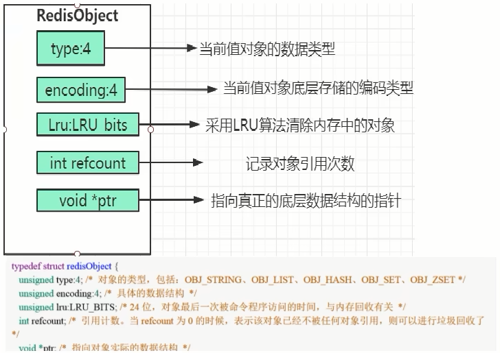

# 一、Redis 单线程 VS 多线程

## 一、Redis底层单线程 VS 多线程

1. Redis的版本很多3.x、4.x、6.x，版本不同架构也是不同的，不限定版本问是否单线程也不太严谨

   - 版本3.x ，最早版本，也就是大家口口相传的redis是单线程
   - 版本4.x，严格意义来说也不是单线程，而是负责处理客户端请求的线程是单线程，但是开始加了点多线程的东西（异步删除）
   - 2020年5月版本的6.0.x后及2022年出的7.0版本后，告别了单线程，用一种全新的多线程来解决问题

2. Redis重要里程碑

   

## 二、Redis最初是单线程的理解

1. 其实Redis最初整体也不是单线程。Redis是单线程主要是指Redis的网络IO和键值对读写是由一个线程来完成的，Redis在处理客户端的请求时包括获取（socket读）、解析、执行、内容返回（socket写）等都由一个顺序串行的主线程处理，这就是所谓的“单线程”。这也是Redis对外提供键值存储服务的主要流程

   

2. 但Redis的其他功能，比如持久化RDB、AOF、异步删除、集群数据同步等等，其实是由额外的线程执行的

3. 总的来说Redis命令工作线程是单线程的，但是，整个Redis来说，是多线程的

## 三、Redis最初是单线程但性能依旧很快的主因

1. 基于内存操作：Redis的所有数据都存在内存中，因此所有的运算都是内存级别的，所以性能比较高
2. 数据结构简单：Redis的数据结构是专门设计的，而这些简单的数据结构的查找和操作的时间大部分复杂度都是O(1)，因此性能比较高
3. 多路复用和非阻塞I/O：Redis使用I/O多路复用功能来监听多个socket连接客户端，这样就可以使用一个线程连接来处理多个请求，减少线程切换带来的开销，同时也避免了I/O阻塞操作
4. 避免上下文切换：因为是单线程模型，因此就避免了不必要的上下文切换和多线程竞争，这就省去了多线程切换带来的时间和性能上的消耗，而且单线程不会导致死锁问题的发生

## 四、Redis是单线程但能利用多个CPU的原因

1. CPU并不是使用Redis的瓶颈，因为通常Redis要么受内存限制，要么受网络限制。例如，使用在平均Linux系统上运行的流水线Redis每秒可以发送一百万个请求，因此，如果您的应用程序主要使用O(N)或O(log(N))命令，则几乎不会使用过多的CPU
2. 但是，为了最大程度地利用CPU，您可以在同一框中启动多个Redis实例，并将它们视为不同的服务器。在某个时候，单个盒子可能还不够，因此，如果您要使用多个CPU，则可以开始考虑更早地进行分片的某种方法
3. 但是，在Redis4.0中，我们开始使Redis具有更多线程，目前，这仅限于在后台删除对象，以及阻止通过Redis模块实现的命令
4. 以上均为Redis作者的原话翻译。大致意思就是Redis是基于内存操作的，Redis的瓶颈可能是机器的内存或者网络带宽而并非CPU，既然CPU不是瓶颈，那么自然就采用单线程的解决方案了，况且使用多线程比较麻烦。是在Redis 4.0中开始支持多线程了，例如后台删除、备份等功能

## 五、Redis最初采用单线程的原因

1. 使用单线程模型使Redis的开发和维护更简单，因为单线程模型方便开发和调试
2. 即使使用单线程模型同时并发的处理多客户端的请求，主要使用的是IO多路复用和非阻塞IO
3. 对于Redis系统来说，主要的性能瓶颈是内存或者网络带宽而并非CPU

## 六、Redis逐渐加入多线程特性的原因

1. bigKey的影响：比如正常情况下使用del指令可以很快的删除数据，而当被删除的key是一个非常大的对象时，例如key包含了成千上万个元素的hash集合时，那么del指令就会造成Redis 主线程卡顿。Redis3单线程时代，大key删除需要等待很久线程才能释放，类似于加了synchronized锁，在高并发的情况下，这种问题不容小觑

2. 解决方法：

   - 使用惰性删除可以有效的解决性能问题：比如当Redis需要删除一个很大的数据时，因为是单线程原子命令操作，这就会导致Redis服务卡顿，于是在Redis 4.0中就新增了多线程的模块，当然此版本中的多线程主要是为了解决删除数据效率比较低的问题的。例如`unlink key`、`flushdb async`、`flushall async`。这样就把删除工作交给了后台的子线程异步删除数据了

   - 因为Redis是单个主线程处理，Redis之父antirez一直强调"Lazy Redis is better Redis"。

     而lazy free的本质就是把某些cost（主要时间复杂度，占用主线程cpu时间片）较高删除操作，从Redis主线程剥离让bio子线程来处理，极大地减少主线阻塞时间。从而减少删除导致性能和稳定性问题

   - 在Redis4.0就引入了多个线程来实现数据的异步惰性删除等功能但是其处理读写请求的仍然只有一个线程，所以仍然算是狭义上的单线程

## 七、Redis6/7的多线程特性

1. 对于Redis来说CPU并不是瓶颈，而内存和网络带宽才是限制Redis的主要因素

   

   

2. Redis的瓶颈可以初步定为：网络IO

   - Redis一直被大家熟知的就是它的单线程架构，虽然有些命令操作可以用后台线程或子进程执行（比如数据删除、快照生成、AOF重写）。但是，从网络IO处理到实际的读写命令处理，都是由单个线程完成的
   - 随着网络硬件的性能提升，Redis的性能瓶颈有时会出现在网络IO的处理上，也就是说，单个主线程处理网络请求的速度跟不上底层网络硬件的速度
   - 为了应对这个问题，Redis采用多个IO线程来处理网络请求，提高网络请求处理的并行度，Redis6/7就是采用的这种方法
   - **Redis的多IO线程只是用来处理网络请求的，对于读写操作命今Redis仍然使用单线程来处理。**这是因为，Redis处理请求时，网络处理经常是瓶颈，通过多个IO线程并行处理网络操作，可以提升实例的整体处理性能。而继续使用单线程执行命今操作，就不用为了保证Lua脚本、事务的原子性，额外开发多线程互斥加锁机制了（不管加锁操作处理），这样一来，Redis线程模型实现就简单了

3. 主线程和IO线程协作完成请求处理的步骤

   

   

## 八、初识IO多路复用

### 一、Unix网络编程中的五种IO模型

1. Blocking IO：阻塞IO。一个应用程序执行I/O操作时，会被阻塞，直到数据准备好或操作完成。这种模型通常简单易用，但会造成资源浪费。因为CPU在等待I/O操作完成时无法做其他有用的工作 

2. NoneBlocking IO：非阻塞IO。 应用程序执行I/O操作时不会被阻塞，可以立即返回，然后定期检查操作是否完成。这种模型需要应用程序不断轮询状态，可能会降低性能并增加复杂性

   - NIO是为了弥补传统IO的不足而诞生的，NIO也有缺点，因为NIO是面向缓冲区的操作，每一次的数据处理都是对缓冲区进行的，在数据处理之前必须要判断缓冲区的数据是否完整或者已经读取完毕，如果没有，假设只读取了一部分，那么对不完整的数据处理没有任何意义。所以每次数据处理之前都要检测缓冲区数据
   - 如果需要管理同时打开成千上万个连接，这些连接每次只是发送少量的数据，例如聊天服务器，这时候用NIO处理数据
   - 如果是少量连接，而这些连接每次要发送大量的数据，这时候采用IO更合适
   - 使用哪种处理数据，需要在数据的响应等待时间和检查缓冲区数据的时间上作对比

3. IO multiplexing：多路复用IO

   - Linux世界一切皆是文件。文件描述符，简称FD，句柄FileDescriptor：文件描述符（File descriptor）是计算机科学中的一个术语，是一个用于表述指向文件的引用的抽象化概念。文件描述符在形式上是一个非负整数。实际上，它是一个索引值，指向内核为每一个进程所维护的该进程打开文件的记录表。当程序打开一个现有文件或者创建一个新文件时，内核向进程返回一个文件描述符。在程序设计中，文件描述符这一概念往往只适用于UNIX、Linux这样的操作系统

   - IO多路复用概述：

     - IO多路复用是一种同步的IO模型，实现一个线程监视多个文件句柄，一旦某个文件句柄就绪就能够通知到对应应用程序进行相应的读写操作，没有文件句柄就绪时就会阻塞应用程序从而释放CPU资源

     - 使用到的概念：

       - l/O：网络I/O，尤其在操作系统层面指数据在内核态和用户态之间的读写操作
       - 多路：多个客户端连接（连接就是套接字描述符，即socket或者channel）
       - 复用：复用一个或几个线程
       - lO多路复用：也就是说一个或一组线程处理多个TCP连接，使用单进程就能够实现同时处理多个客户端的连接，无需创建或者维护过多的进程/线程。简而言之，一个服务端进程可以同时处理多个套接字描述符
       - 实现IO多路复用的模型有3种：可以分select --> poll --> epoll三个阶段来描述

     -  通过select、poll或epoll等机制，应用程序可以同时监视多个I/O事件，当其中任何一个事件就绪时才进行处理。这种模型避免了阻塞和循环轮询的缺点，提高了效率 

       

4. signal driven IO：信号驱动IO。应用程序告知内核去等待某个事件发生，并且可以同时进行其他操作。当事件发生时，内核发送信号通知应用程序进行处理。这种模型适用于处理少量的连接和事件 

5. asynchronous IO：异步IO。应用程序发起一个I/O操作后，可以继续执行其他操作，当I/O操作完成时会通知应用程序。这种模型减少了应用程序与内核的交互次数，提高了性能 

### 二、引出epoll

1. 场景分析：模拟一个tcp服务器处理30个客户socket。假设你是一个监考老师，让30个学生解答一道竞赛考题，然后负责验收学生答卷，你有下面几个选择：

   - 第一种选择：轮询。按顺序逐个验收，先验收A，然后是B，之后是C、D。。。这中间如果有一个学生卡住，全班都会被耽误，你用循环挨个处理socket，根本不具有并发能力
   - 第二种选择：来一个new一个，一对一服务。你创律30个分身线程，每个分身线程检查一个学生的答案是否正确。这种类似于为每一个用户创建一个进程或者线程处理连接
   - 第三种选择：响应式处理，一对多服务。你站在讲台上等，谁解答完谁举手。这时C、D举手，表示他们解答问题完毕，你下去依次检查C、D的答案然后继续回到讲台上等。此时E、A又举手，然后去处理E和A。。。这种就是IO复用模型。 Linux下的select、poll和epoll就是干这个的

2. IO多路复用模型，简单明了版理解

   - 将用户socket对应的文件描述符（FileDescriptor）注册进epoll，然后epoll帮你监听哪些socket上有消息到达，这样就避免了大量的无用操作。此时的socket应该采用非阻塞模式。这样，整个过程只在调用select、poll、epoll这些调用的时候才会阻塞，收发客户消息是不会阻塞的，整个进程或者线程就被充分利用起来，这就是事件驱动，所谓的reactor反应模式

     

   - 在单个线程通过记录跟踪每一个Sockek（I/0流）的状态来同时管理多个I/0流。一个服务端进程可以同时处理多个套接字描述符，目的是尽量多的提高服务器的吞吐能力

   - IO多路复用原理，有请求就响应，没请求不打扰

3. IO多路复用小总结

   

## 九、针对面试题：Redis快的原因

- Redis快的原因：IO多路复用+epoll函数使用，才是Redis这么快的直接原因，而不是仅仅单线程命令+Redis安装存储在内存中

## 十、Redis单线程 VS 多线程总结

1. Redis工作线程是单线程的，但是，整个Redis来说，是多线程的

2. 主线程和IO线程协作完成请求处理的步骤

   - I/O的读和写本身是堵塞的，比如当socket中有数据时，Redis会通过调用先将数据从内核态空间拷贝到用户态空间，再交给Redis调用，而这个拷贝的过程就是阻塞的，当数据量越大时拷贝所需要的时间就越多，而这些操作都是基于单线程完成的

     

   - 从Redis6开始，就新增了多线程的功能来提高I/O的读写性能，他的主要实现思路是将主线程的I/O读写任务拆分给一组独立的线程去执行，这样就可以使多个socket的读写可以并行化了。采用多路I/0复用技术可以让单个线程高效的处理多个连接请求（尽量减少网络IO的时间消耗），将最耗时的Socket的读取、请求解析、写入单独外包出去，剩下的命令执行仍然由主线程串行执行并和内存的数据交互

     

   - 结合上图可知，网络IO操作就变成多线程化了，其他核心部分仍然是线程安全的，是个不错的折中办法

3. 总的来说，Redis6/7将网络数据读写、Socket读取、请求协议解析通过多个IO线程的来处理，对于真正的Redis命令执行，仍然使用主线程单线程操作

   

## 十一、Redis7开启多线程

1. 如果在实际应用中，发现Redis实例的CPU开销不大但吞吐量却没有提升，可以考虑使用Redis7的多线程机制，加速网络处理，进而提升实例的吞吐量

   - Redis7将所有数据放在内存中，内存的响应时长大约为100纳秒，对于小数据包，Redis服务器可以处理8W到10W的QPS
   - 这也是Redis处理的极限了，对于80%的公司来说，单线程的Redis已经足够使用了

2. Redis7开启多线程配置

   

   

   - 设置io-thread-do-reads配置项为yes，表示启动多线程
   - 设置线程个数。关于线程数的设置，官方的建议是如果为4核的CPU，建议线程数设置为2或3，如果为8核CPU建议线程数设置为6，线程数一定要小于机器核数，线程数并不是越大越好

# 二、BigKey

## 一、MoreKey案例

1. 大批量往Redis里面插入100W测试数据key

   - Linux Bash下面执行，插入100W数据。生成100W条Redis批量设置kv的语句(key=kn,value=vn)写入到/tmp目录下的redisTest.txt文件中

     ```shell
     for((i=1;i<=100*10000;i++)); do echo "set ksi v$i" >> /tmp/redisTest.txt ;done;
     ```

   - 通过redis提供的管道-pipe命令插入100W大批量数据

     ```shell
     cat /tmp/redisTest.txt | /opt/redis-7.0.0/src/redis-cli -h 127.0.0.1 -p 6379-a 111111 --pipe
     ```

   - 执行`redis-cli -a ****** dbsize`查看Redis中存在多少key

2. `keys *`这个指令有致命的弊端，在实际环境中最好不要使用

   - 这个指令没有offset、limit参数，是要一次性吐出所有满足条件的key，由于Redis是单线程的，其所有操作都是原子的，而keys算法是遍历算法，复杂度是O(n)，如果实例中有千万级以上的key，这个指令就会导致Redis服务卡顿，所有读写Redis的其它的指令都会被延后甚至会超时报错，可能会引起缓存雪崩甚至数据库宕机

3. 通过配置设置禁用`keys * `、`flushdb/flushall`，redis.conf在SECURITY这一项中配置

   

4. Scan命令替代Keys命令

   - Scan命令类似MySQL limit，但是不完全相同

     

   - Scan命令用于迭代数据库中的数据库键，语法为

     

   - Scan命令特点

     - SCAN命令是一个基于游标的迭代器，每次被调用之后，都会向用户返回一个新的游标，用户在下次迭代时需要使用这个新游标作为SCAN命令的游标参数，以此来延续之前的迭代过程

     - SCAN返回一个包含两个元素的数组。第一个元素是用于进行下一次迭代的新游标；第二个元素则是一个数组，这个数组中包含了所有被迭代的元素。如果新游标返回零表示迭代已结束

     - SCAN的遍历顺序：它不是从第一维数组的第零位一直遍历到末尾，而是采用了高位进位加法来遍历。之所以使用这样特殊的方式进行遍历，是考虑到字典的扩容和缩容时避免槽位的遍历重复和遗漏

       

     - Scan命令的使用

       

## 二、BigKey的大小

1. 通常我们说的BigKey，不是在值的Key很大，而是指的Key对应的value很大

2. 阿里云Redis开发规范中规定

   

3. string和二级结构

   - string是value，最大512MB但是≥10KB就是bigkey
   - list、hash、set和zset，value个数超过5000就是bigkey，bigkey的大小不代表Redis类型最多存放这么多个元素
   - list：一个列表最多可以包含2^32^-1个元素（4294967295，每个列表超过40亿个元素）
   - hash：Redis中每个hash最多可以存储2^32^-1个键值对（40多亿）
   - set：集合中最大的成员数为2^32^-1（4294967295，每个集合可存储40多亿个成员）、

## 三、Bigkey危害、产生与发现

1. Bigkey的危害

   - 内存不均，集群迁移困难
   - 超时删除，大key删除作梗
   - 网络流量阻塞

2. Bigkey的产生

   - 社交类：明星粉丝列表，典型案例粉丝逐步递增
   - 汇总统计：某个报表，日月年经年累计

3. `redis-cli --bigkey`命令的使用

   - `redis-cli --bigkey`命令的好处是给出每种数据结构Top 1 bigkey。同时给出每种数据类型的键值个数＋平均大小

   - `redis-cli --bigkey`命令的不足是想查询大于10kb的所有key，--bigkeys参数就无能为力了，需要用到memory usage来计算每个键值的字节数

   - `redis-cli --bigkey`命令的使用

     ```shell
     redis-cli --bigkeys -a ******
     
     redis-cli -h 127.0.0.1 -p 6379 -a ****** --bigkeys
     
     #加上 -i 参数，每隔100 条 scan指令就会休眠0.1s.ops就不会剧烈抬升，
     #但是扫描的时间会变长
     redis-cli -h 127.0.0.1 -p 7001 --bigkeys -i 0.1
     ```

     

4. `memory usage 键`的使用：计算每个键值的字节数

   

   

## 四、BigKey删除

1. String类型的BigKey：一般用del，如果过于庞大使用unlink key删除

2. has类型的BigKey：使用hscan每次获取少量field-value，再使用hdel删除每个field

   

   

3. list类型的BigKey：使用ltrim渐进式逐步删除，直到全部删除完成

   

   

   

4. set类型的BigKey：使用sscan每次获取部分元素，在使用srem命令删除每个元素

   

5. zset类型的BigKey：使用zscan每次获取部分元素，在使用zremrangebyrank命令删除每个元素

   

   

   

## 五、BigKey生产调优

1. redis.conf配置文件 LAZY FREEING相关说明

   

2. 阻塞和非阻塞删除命令

   

3. 优化配置

   

# 三、缓存双写一致性

## 一、缓存双写一致性的理解

- 如果Redis中有数据，需要和数据库中的值相同；如果Redis中无数据，数据库中的值要是最新值，且准备回写Redis

## 二、缓存按照操作分类

1. 只读缓存：数据库更新后，删掉缓存中的数据，下一次读取缓存时发生缓存缺失，再从数据库读取数据写回缓存 
2. 读写缓存：数据库更新后，同步更新缓存中的数据，下一次读取缓存时就会直接命中缓存 
   - 同步直写策略：写数据库之后也同步写Redis缓存，缓存和数据库中的数据一致；对于读写缓存来说，要想保证缓存和数据库中的数据一致，就要采用同步直写策略
   - 异步缓写策略：正常业务中，MySQL数据变了，但是可以在业务上容许出现一定时间后才作用于Redis，比如仓库、物流系统。异常情况出现了， 不得不将失败的动作重新修补，有可能需要借助kafka或者RabbitMQ等消息中间件，实现重试重写
3. 只读缓存和读写缓存的区别
   - 只读缓存是删除缓存中的数据，下次访问这个数据时，会重新读取数据库中的值，这样可以保证数据库和缓存完全一致，并且缓存中保留的是经常访问的热点数据。缺点是删除缓存后，之后的访问会先触发一次缓存缺失，然后从数据库读取数据，这个过程访问延迟会变大
   - 读写缓存是同步更新缓存中的值，这样被修改的数据永远都在缓存中，下次访问能够直接命中缓存，不再查询数据库，这个过程性能比较好，比较适合先修改又立即访问的场景。缺点是在高并发场景下，并发更新同一个值时，可能会导致缓存和数据库的不一致；并且对于某些缓存值的计算可能会比较复杂，但是又不常访问，那么缓存的利用率就会降低，更新缓存的代价就比较大
   - 只读缓存牺牲了一定的性能，优先保证数据库和缓存的一致性，它更适合对于一致性要求比较要高的场景。而如果对于数据库和缓存一致性要求不高，或者不存在并发修改同一个值的情况，那么使用读写缓存就比较合适，它可以保证更好的访问性能，但要考虑到缓存更新的代价 

## 三、数据库和缓存一致性的查询策略

1. 采用双检加锁策略是适用于数据库和缓存一致性的查询策略

2. 多个线程同时去查询数据库的这条数据，那么我们可以在第一个查询数据的请求上使用一个互斥锁来锁住它。其他的线程走到这一步拿不到锁就等着，等第一个线程查询到了数据，然后做缓存

3. 后面的线程进来发现已经有缓存了，就直接走缓存

   

## 四、数据库和缓存一致性的更新策略

### 一、更新策略的目的

1. 缓存设置过期时间，定期清理缓存并回写，是保证最终一致性的解决方案
2. 我们可以对存入缓存的数据设置过期时间，所有的写操作以数据库为准，对缓存操作只是尽最大努力即可。也就是说如果数据库写成功，缓存更新失败，那么只要到达过期时间，则后面的读请求自然会从数据库中读取新值然后回填缓存，达到一致性
3. 上述方案和后续落地案例是调研后的主流＋成熟的做法，但是考虑到各个公司业务系统的差距，不是100%绝对正确，不保证绝对适配全部情况，需要自己酌情选择打法，合适自己的最好
4. 其实也可以挂牌报错，凌晨升级，温馨提示，服务降级；使用单线程，这样重量级的数据操作最好不要多线程

### 二、先更新数据库，再更新缓存

1. 异常问题一：回写失败，出现脏数据

   ```tex
   1 先更新mysql的某商品的库存，当前商品的库存是100，更新为99个
   2 先更新mysql修改为99成功，然后更新redis
   3 此时假设异常出现，更新redis失败了，这导致mysql里面的库存是99而redis里面的还是100
   4 上述发生，会让数据库里面和缓存redis里面数据不一致，读到redis脏数据
   ```

2. 异常问题二： 高并发下会出现数据覆盖 

   ```tex
   【先更新数据库，再更新缓存】A、B两个线程发起调用
   【正常逻辑】
   1 A update mysql 100
   2 A update redis 100
   3 B update mysql 80
   4 B update redis 80
   =============================
   【异常逻辑】
   多线程环境下，A、B两个线程有快有慢，有前有后有并行
   1 A update mysql 100
   3 B update mysql 80
   4 B update redis 80
   2 A update redis 100
   =============================
   最终结果，mysql和lredis数据不一致，o(T_T)o，
   mysql80,redis100
   ```

### 三、先更新缓存，再更新数据库

- 不推荐，业务上一般把MySQL作为底单数据库，保证最后解释

  ```tex
  [先更新缓存，再更新数据库]，A、B两个线程发起调用
  [正常逻辑]
  1 A update redis 100
  2 A update mysql 100
  3 B update redis 80
  4 B update mysql 80
  ====================================
  [异常逻辑]多线程环境下，A. B两个线程有快有慢有并行
  A update redis 100
  B update redis 80
  B update mysq| 80
  A update mysql 100
  mysql100,redis80
  ```

### 四、先删除缓存，再更新数据库

1. 异常问题如下，如果数据库更新失败或超时或返回不及时，导致B线程请求访问缓存时发现redis里面没数据，缓存缺失，B再去读取mysql时，从数据库中读取到旧值，还写回redis， 导致A白干了

   ```tex
   1 A线程先成功删除了redis里面的数据，然后去更新mysql,此时mysql正在更新中，还没有结束。(比如网络延时)
   B突然出现要来读取缓存数据。
   
   2 此时redis里面的数据是空的，B线程来读取，先去读redis里数据(已经被A线程delete掉了)，此处出来2个问题:
   2.1 B从mysq|获得了旧值
   B线程发现redis里没有(缓存缺失)马上去mysql里面读取，从数据库里面读取来的是旧值。
   2.2 B会把获得的旧值写回redis
   获得旧值数据后返回前台并回写进redis(刚被A线程删除的旧数据有极大可能早被写回了)。
   3 A线程更新完mysql,发现redis里面的缓存是脏数据，A线程直接懵逼了，o(T_ .τ)o
   两个并发操作，一个是更新操作，另一个是查询操作，A删除缓存后，B查询操作没有命中缓存，B先把老数据读出来后放到缓存中，然后A更新操作更新了数据库。
   于是，在缓存中的数据还是老的数据，导致缓存中的数据是脏的，而且还一直这样脏下去了。
   4总结流程:
   (1)请求A进行写操作，删除redis缓存后，工作正在进行中，更新mysql.....
   A还没有彻底更新完mysql,还没commit
   (2)请求B开工查询，查询redis发现缓存不存在(被A从redis中删除了)
   (3)请求B继续，去数据库查询得到了mysq中的旧值(A还没有更新完)
   (4)请求B将旧值写回redis缓存
   (5)请求A将新值写入mysql数据库
   上述情况就会导致不一致的情形出现
   ```

2. 解决方案：**采用延时双删策略**

   

   - 加上sleep的这段时间，就是为了让线程B能够先从数据库读取数据，再把缺失的数据写入缓存，然后，线程A再进行删除。所以，线程A sleep的时间，就需要大于线程B读取数据再写入缓存的时间。这样一来，其它线程读取数据时，会发现缓存缺失，所以会从数据库中读取最新值。因为这个方案会在第一次删除缓存值后，延迟一段时间再次进行删除，所以我们也把它叫做“延迟双删”

3. 延迟双删面试题

   - 这个删除该休眠多少时间：线程A sleep的时间，就需要大于线程B读取数据再写入缓存的时间

   - 这个时间确定的方式

     - 在业务程序运行的时候，统计下线程读数据和写缓存的操作时间，自行评估自己的项目的读数据业务逻辑的耗时，以此为基础来进行估算。然后写数据的休眠时间则在读数据业务逻辑的耗时基础上加百毫秒即可。这么做的目的，就是确保读请求结束，写请求可以删除读请求造成的缓存脏数据
     - 新启动一个后台监控程序，比如WatchDog监控程序，会加时

   - 这种同步淘汰策略，吞吐量降低的处理方式：在第二次删除时设置为异步，自己起一个线程，异步删除。这样写的请求就不用沉睡一段时间再返回了，这样做，加大吞吐量

     

### 五、先更新数据库，再删除缓存

1. 先更新数据库，再删除缓存这种更新策略是目前主流的

2. 异常问题：先更新数据库，在删除缓存，假如缓存删除失败或者来不及删除，导致请求再次访问redis时缓存命中，读取到的是缓存的旧值

   | 时间 | 线程A                  | 线程B                               | 出现的问题                                     |
   | ---- | ---------------------- | ----------------------------------- | ---------------------------------------------- |
   | t1   | 更新数据库中的值...... |                                     |                                                |
   | t2   |                        | 缓存立刻命中，此时B读取的是缓存旧值 | A还没来得及删除缓存的值，导致B缓存命中读到旧值 |
   | t3   | 更新缓存的数据，over   |                                     |                                                |

3. 解决方案：订阅binlog程序在MySQL中有现成的中间件叫canal，可以完成订阅binlog日志的功能

   

   - 可以把要删除的缓存值或者是要更新的数据库值暂存到消息队列中（例如使用Kafka/RabbitMQ等）
   - 当程序没有能够成功地删除缓存值或者是更新数据库值时，可以从消息队列中重新读取这些值，然后再次进行删除或更新
   - 如果能够成功地删除或更新，我们就要把这些值从消息队列中去除，以免重复操作，此时，我们也可以保证数据库和缓存的数据一致了，否则还需要再次进行重试
   - 如果重试超过的一定次数后还是没有成功，我们就需要向业务层发送报错信息了，通知运维人员

4. 类似经典的分布式事务问题，只有一个权威答案，只能达到最终一致性

   - 流量充值，先下发短信实际充值可能滞后5分钟，可以接受
   - 电商发货，短信下发但是物流明天见

### 六、更新策略的选择

1. 在大多数业务场景下，还是建议先更新数据库，再删除缓存的方案，理由如下：

   - 先删除缓存值再更新数据库，有可能导致请求因缓存缺失而访问数据库，给数据库带来压力导致打满mysql
   - 如果业务应用中读取数据库和写缓存的时间不好估算，那么，延迟双删中的等待时间就不好设置
   - 使用先更新数据库，再删除缓存的方案，如果业务层要求必须读取一致性的数据，那么我们就需要在更新数据库时，先在Redis缓存客户端暂停并发读请求，等数据库更新完、缓存值删除后，再读取数据，从而保证数据一致性，这是理论可以达到的效果，但实际，不推荐，因为真实生产环境中，分布式下很难做到实时一致性，一般都是最终一致性

2. 更新策略对比

   | 策略                               | 高并发多线程条件下 | 问题                                               | 现象                                                         | 解决方案                                        |
   | ---------------------------------- | ------------------ | -------------------------------------------------- | ------------------------------------------------------------ | ----------------------------------------------- |
   | 先删除redis缓存，<br />再更新mysql | 无                 | 缓存删除成功但数据库更新失败                       | Java程序从数据库中读到旧值                                   | 再次更新数据库，重试                            |
   |                                    | 有                 | 缓存删除成功但数据库更新中...<br />有并发请求      | 并发请求从数据库读到旧值并回写到redis，导致后续都是从redis读取到旧值 | 再次删除缓存，重试                              |
   | 先更新mysql，<br />再删除redis缓存 | 无                 | 数据库更新成功，但缓存删除失败                     | Java程序从redis中读到旧值                                    | 再次删除缓存，重试                              |
   |                                    | 有                 | 数据库更新成功但缓存删除中......<br />有并发读请求 | 并发请求从缓存读到旧值                                       | 等待redis删除完成，这段时间数据不一致，短暂存在 |

# 四、Redis和MySQL数据双写工程落地


## 一、canal介绍

1. canal概述：文翻译为水道/管道/沟渠/运河，主要用途是于MySQL数据库增量日志数据的订阅、消费和解析，是阿里巴巴开发并开源的，采用Java语言开发
2. 历史背景是早期阿里巴巴因为杭州和美国双机房部署，存在跨机房数据同步的业务需求，实现方式主要是基于业务trigger（触发器）获取增量变更。从2010年开始，阿里巴巴逐步尝试采用解析数据库日志获取增量变更进行同步，由此衍生出了canal项目
3. canal的作用：基于日志增量订阅和消费的业务包括
   - 数据库镜像
   - 数据库实时备份
   - 索引构建和实时维护（拆分异构索引、倒排索引等）
   - 业务 cache 刷新
   - 带业务逻辑的增量数据处理

## 二、canal工作原理

1. 传统的MySQL主从复制工作原理

   

   - 当master主服务器上的数据发生改变时，则将其改变写入二进制事件日志文件中
   - salve从服务器会在一定时间间隔内对master主服务器上的二进制日志进行探测，探测其是否发生过改变
   - salve从服务器如果探测到master主服务器的二进制事件日志发生了改变，则开始一个I/O Thread请求master二进制事件日志
   - 同时master主服务器为每个I/0 Thread启动一个dump Thread, 用于向其发送二进制事件日志
   - slave从服务器将接收到的二进制事件日志保存至自己本地的中继日志文件中
   - salve从服务器将启动SQL Thread从中继日志中读取二进制日志，在本地重放，使得其数据和主服务器保持一致后I/O Thread和SQL Thread将进入睡眠状态，等待下一次被唤醒

2. canal工作原理

   

   - canal模拟MySQL slave的交互协议，伪装自己为MySQL slave，向MySQL master发送dump协议
   - MySQL master收到dump请求，开始推送binary log给slave（即canal），canal解析binary log对象（原始为byte流）

## 三、双写一致性-MySQL

1. 查看MySQL版本

   ```sql
   select version(); // 5.7.17
   ```

2. 当前的主机二进制日志

   ```sql
   show master status;
   ```

3. 查看 show variables like 'log_bin'，默认未开启

   

4. 开启MySQL的binlog写入功能。修改配置文件，win环境下修改my.ini文件

   ```ini
   log-bin=mysql-bin
   binlog-format=Row
   server-id=1
   ```

   

5. 重启MySQL

6. 再次查看 show variables like 'log_bin'

   

7. 授权canal链接MySQL账号

   - MySQL默认的用户在MySQL库的user表里面

     

   - 默认没有canal账户，此处新建+授权

     ```sql
     DROP USER IF EXISTS 'canal'@'%' ;
     CREATE USER 'canal'@'%' IDENTIFIED BY 'canal' ;
     GRANT ALL PRIVILEGES ON *.* TO 'canal'@'%' IDENTIFIED BY 'canal' ;
     FLUSH PRIVILEGES;
     SELECT * FROM mysql .user;
     ```

     

## 四、双写一致性-canal服务端

1. 将canal安装在CentOS服务器上

2. [canal下载地址](https://github.com/alibaba/canal/releases/tag/canal-1.1.6)

   

3. 解压：解压后整体放入到/mycanal路径下

4. 配置：修改 /mycanal/conf/example路径下instance.properties文件

   - 换成自己的MySQL主机master的IP地址

     

   - 换成自己的在MySQL新建的canal账户

     

5. 启动：在/mycanal/bin路径下执行`./startup.sh`

6. 查看：判断canal是否启动成功

   - 查看server日志

     

   - 查看样例example的日志

     

## 五、双写一致性-canal客户端

1. SQL脚本：选择一个库，执行建表语句

   ```sql
   CREATE TABLE `t_user`(
   `id` bigint(20)NOT NULL AUTO_INCREMENT,
   `userName` varchar(100)NOT NULL,
   PRIMARY KEY (`id`)
   )ENGINE=InnoDB AUTO_INCREMENT=10 DEFAULT CHARSET=utf8mb4
   ```

2. 创建module

3. 修改pom

   ```xml
   <?xml version="1.0" encoding="UTF-8"?>
   <project xmlns="http://maven.apache.org/POM/4.0.0"
            xmlns:xsi="http://www.w3.org/2001/XMLSchema-instance"
            xsi:schemaLocation="http://maven.apache.org/POM/4.0.0 http://maven.apache.org/xsd/maven-4.0.0.xsd">
       <modelVersion>4.0.0</modelVersion>
   
       <parent>
           <groupId>org.springframework.boot</groupId>
           <artifactId>spring-boot-starter-parent</artifactId>
           <version>3.2.2</version>
       </parent>
   
       <groupId>com.sunsh.redis</groupId>
       <artifactId>redis-stand-alone</artifactId>
       <version>1.0-SNAPSHOT</version>
   
       <properties>
           <maven.compiler.source>21</maven.compiler.source>
           <maven.compiler.target>21</maven.compiler.target>
           <project.build.sourceEncoding>UTF-8</project.build.sourceEncoding>
           <mysql.version>5.1.47</mysql.version>
           <druid.version>1.1.16</druid.version>
           <mapper.version>4.1.5</mapper.version>
       </properties>
   
       <dependencies>
           <dependency>
               <groupId>org.springframework.boot</groupId>
               <artifactId>spring-boot-starter-web</artifactId>
           </dependency>
           <!-- SpringBoot 与Redis整合依赖 -->
           <dependency>
               <groupId>org.springframework.boot</groupId>
               <artifactId>spring-boot-starter-data-redis</artifactId>
           </dependency>
           <dependency>
               <groupId>org.apache.commons</groupId>
               <artifactId>commons-pool2</artifactId>
           </dependency>
           <dependency>
               <groupId>org.projectlombok</groupId>
               <artifactId>lombok</artifactId>
           </dependency>
           <dependency>
               <groupId>org.springframework.boot</groupId>
               <artifactId>spring-boot-starter-actuator</artifactId>
           </dependency>
           <!-- springboot 与 AOP -->
           <dependency>
               <groupId>org.springframework.boot</groupId>
               <artifactId>spring-boot-starter-aop</artifactId>
           </dependency>
           <dependency>
               <groupId>org.aspectj</groupId>
               <artifactId>aspectjweaver</artifactId>
           </dependency>
           <!-- Mysql 数据库驱动 -->
           <dependency>
               <groupId>mysql</groupId>
               <artifactId>mysql-connector-java</artifactId>
               <version>${mysql.version}</version>
           </dependency>
           <!-- springboot集成druid连接池-->
           <dependency>
               <groupId>com.alibaba</groupId>
               <artifactId>druid-spring-boot-starter</artifactId>
               <version>1.1.10</version>
           </dependency>
           <dependency>
               <groupId>com.alibaba</groupId>
               <artifactId>druid</artifactId>
               <version>${druid.version}</version>
           </dependency>
           <!-- canal -->
           <dependency>
               <groupId>com.alibaba.otter</groupId>
               <artifactId>canal.client</artifactId>
               <version>1.1.0</version>
           </dependency>
           <!-- jedis -->
           <dependency>
               <groupId>redis.clients</groupId>
               <artifactId>jedis</artifactId>
               <version>3.8.0</version>
           </dependency>
       </dependencies>
   
       <build>
           <plugins>
               <plugin>
                   <groupId>org.springframework.boot</groupId>
                   <artifactId>spring-boot-maven-plugin</artifactId>
                   <configuration>
                       <excludes>
                           <exclude>
                               <groupId>org.projectlombok</groupId>
                               <artifactId>lombok</artifactId>
                           </exclude>
                       </excludes>
                   </configuration>
               </plugin>
           </plugins>
       </build>
   </project>
   ```

4. 写YML

   ```yaml
   server.port=8000
   
   # ====================== alibaba.druid ======================
   spring.datasource.type=com.alibaba.druid.pool.DruidDataSource
   spring.datasource.driver-class-name=com.mysql.jdbc.Driver
   spring.datasource.url=jdbc:mysql://127.0.0.1:3306/jmall?useUnicode=true&characterEncoding=utf-8&useSSL=true&serverTimezone=UTC
   spring.datasource.username=root
   spring.datasource.password=root
   spring.datasource.druid.test-while-idle=fasle
   
   ```

5. Redis工具类

   ```java
   @Component
   @Slf4j
   public class RedisUtils {
   
       @Autowired
       private RedisTemplate<String, Object> redisTemplate;
   
       /**
        * 指定缓存失效时间
        *
        * @param key 键
        * @param time 时间(秒)
        * @return
        */
       public boolean expire(String key, long time) {
           try {
               if (time > 0) {
                   redisTemplate.expire(key, time, TimeUnit.SECONDS);
               }
               return true;
           } catch (Exception e) {
               log.error("exception when expire key {}. ", key, e);
               return false;
           }
       }
   
       /**
        * 根据key获取过期时间
        *
        * @param key 键 不能为null
        * @return 时间(秒) 返回0代表为永久有效
        */
       public long getExpire(String key) {
           return redisTemplate.getExpire(key, TimeUnit.SECONDS);
       }
   
       /**
        * 判断key是否存在
        *
        * @param key  键
        * @return true 存在 false不存在
        */
       public boolean hasKey(String key) {
           try {
               return redisTemplate.hasKey(key);
           } catch (Exception e) {
               log.error("exception when check key {}. ", key, e);
               return false;
           }
       }
   
       /**
        * 删除缓存
        *
        * @param key 可以传一个值 或多个
        */
       @SuppressWarnings("unchecked")
       public void del(String... key) {
           if (key != null && key.length > 0) {
               if (key.length == 1) {
                   redisTemplate.delete(key[0]);
               } else {
                   List<String> objects = (List<String>) CollectionUtils.arrayToList(key);
                   redisTemplate.delete(objects);
               }
           }
       }
   
       /**
        * 普通缓存获取
        *
        * @param key 键
        * @return 值
        */
       public Object get(String key) {
           return key == null ? null : redisTemplate.opsForValue().get(key);
       }
   
       /**
        * 普通缓存放入
        *
        * @param key 键
        * @param value 值
        * @return true成功 false失败
        */
       public boolean set(String key, Object value) {
           try {
               redisTemplate.opsForValue().set(key, value);
               return true;
           } catch (Exception e) {
               log.error("exception when set key {}. ", key, e);
               return false;
           }
   
       }
   
       /**
        * 普通缓存放入并设置时间
        *
        * @param key 键
        * @param value 值
        * @param time 时间(秒) time要大于0 如果time小于等于0 将设置无限期
        * @return true成功 false 失败
        */
       public boolean set(String key, Object value, long time) {
           try {
               if (time > 0) {
                   redisTemplate.opsForValue().set(key, value, time, TimeUnit.SECONDS);
               } else {
                   set(key, value);
               }
               return true;
           } catch (Exception e) {
               log.error("exception when set key {}. ", key, e);
               return false;
           }
       }
   
       /**
        * 递增
        *
        * @param key 键
        * @param delta 要增加几(大于0)
        * @return
        */
       public long incr(String key, long delta) {
           if (delta <= 0) {
               throw new RuntimeException("递增因子必须大于0");
           }
           return redisTemplate.opsForValue().increment(key, delta);
       }
   
       /**
        * 递减
        *
        * @param key 键
        * @param delta 要减少几(小于0)
        * @return
        */
       public long decr(String key, long delta) {
           if (delta <= 0) {
               throw new RuntimeException("递减因子必须大于0");
           }
           return redisTemplate.opsForValue().increment(key, -delta);
       }
   
       /**
        * HashGet
        *
        * @param key  键 不能为null
        * @param item 项 不能为null
        * @return 值
        */
       public Object hget(String key, String item) {
           return redisTemplate.opsForHash().get(key, item);
       }
   
       /**
        * 获取hashKey对应的所有键值
        *
        * @param key 键
        * @return 对应的多个键值
        */
       public Map<Object, Object> hmget(String key) {
           return redisTemplate.opsForHash().entries(key);
       }
   
       /**
        * HashSet
        *
        * @param key 键
        * @param map 对应多个键值
        * @return true 成功 false 失败
        */
       public boolean hmset(String key, Map<String, Object> map) {
           try {
               redisTemplate.opsForHash().putAll(key, map);
               return true;
           } catch (Exception e) {
               log.error("exception when hash set key {}. ", key, e);
               return false;
           }
       }
   
       /**
        * HashSet 并设置时间
        *
        * @param key 键
        * @param map 对应多个键值
        * @param time 时间(秒)
        * @return true成功 false失败
        */
       public boolean hmset(String key, Map<String, Object> map, long time) {
           try {
               redisTemplate.opsForHash().putAll(key, map);
               if (time > 0) {
                   expire(key, time);
               }
               return true;
           } catch (Exception e) {
               log.error("exception when hash set key {}. ", key, e);
               return false;
           }
       }
   
       /**
        * 向一张hash表中放入数据,如果不存在将创建
        *
        * @param key 键
        * @param item 项
        * @param value 值
        * @return true 成功 false失败
        */
       public boolean hset(String key, String item, Object value) {
           try {
               redisTemplate.opsForHash().put(key, item, value);
               return true;
           } catch (Exception e) {
               log.error("exception when hash set key {}, item {} ", key, item, e);
               return false;
           }
       }
   
       /**
        * 向一张hash表中放入数据,如果不存在将创建
        *
        * @param key 键
        * @param item 项
        * @param value 值
        * @param time 时间(秒) 注意:如果已存在的hash表有时间,这里将会替换原有的时间
        * @return true 成功 false失败
        */
       public boolean hset(String key, String item, Object value, long time) {
           try {
               redisTemplate.opsForHash().put(key, item, value);
               if (time > 0) {
                   expire(key, time);
               }
               return true;
           } catch (Exception e) {
               log.error("exception when hash set key {}, item {} ", key, item, e);
               return false;
           }
       }
   
       /**
        * 删除hash表中的值
        *
        * @param key 键 不能为null
        * @param item 项 可以使多个 不能为null
        */
       public void hdel(String key, Object... item) {
           redisTemplate.opsForHash().delete(key, item);
       }
   
       /**
        * 判断hash表中是否有该项的值
        *
        * @param key 键 不能为null
        * @param item 项 不能为null
        * @return true 存在 false不存在
        */
       public boolean hHasKey(String key, String item) {
           return redisTemplate.opsForHash().hasKey(key, item);
       }
   
       /**
        * hash递增 如果不存在,就会创建一个 并把新增后的值返回
        *
        * @param key 键
        * @param item 项
        * @param by 要增加几(大于0)
        * @return
        */
       public double hincr(String key, String item, double by) {
           return redisTemplate.opsForHash().increment(key, item, by);
       }
   
       /**
        * hash递减
        *
        * @param key 键
        * @param item 项
        * @param by 要减少记(小于0)
        * @return
        */
       public double hdecr(String key, String item, double by) {
           return redisTemplate.opsForHash().increment(key, item, -by);
       }
   
       /**
        * 根据key获取Set中的所有值
        *
        * @param key 键
        * @return
        */
       public Set<Object> sGet(String key) {
           try {
               return redisTemplate.opsForSet().members(key);
           } catch (Exception e) {
               return null;
           }
       }
   
       /**
        * 根据value从一个set中查询,是否存在
        *
        * @param key  键
        * @param value 值
        * @return true 存在 false不存在
        */
       public boolean sHasKey(String key, Object value) {
           try {
               return redisTemplate.opsForSet().isMember(key, value);
           } catch (Exception e) {
               return false;
           }
       }
   
       /**
        * 将数据放入set缓存
        *
        * @param key  键
        * @param values 值 可以是多个
        * @return 成功个数
        */
       public long sSet(String key, Object... values) {
           try {
               return redisTemplate.opsForSet().add(key, values);
           } catch (Exception e) {
               return 0;
           }
       }
   
       /**
        * 将set数据放入缓存
        *
        * @param key   键
        * @param time  时间(秒)
        * @param values 值 可以是多个
        * @return 成功个数
        */
       public long sSetAndTime(String key, long time, Object... values) {
           try {
               Long count = redisTemplate.opsForSet().add(key, values);
               if (time > 0)
                   expire(key, time);
               return count;
           } catch (Exception e) {
               return 0;
           }
       }
   
       /**
        * 获取set缓存的长度
        *
        * @param key   键
        * @return
        */
       public long sGetSetSize(String key) {
           try {
               return redisTemplate.opsForSet().size(key);
           } catch (Exception e) {
               return 0;
           }
       }
   
       /**
        * 移除值为value的
        *
        * @param key   键
        * @param values   值 可以是多个
        * @return 移除的个数
        */
       public long setRemove(String key, Object... values) {
           try {
               Long count = redisTemplate.opsForSet().remove(key, values);
               return count;
           } catch (Exception e) {
               return 0;
           }
       }
   
       /**
        * 获取list缓存的内容
        *
        * @param key  键
        * @param start   开始
        * @param end   结束 0 到 -1代表所有值
        * @return
        */
       public List<Object> lGet(String key, long start, long end) {
           try {
               return redisTemplate.opsForList().range(key, start, end);
           } catch (Exception e) {
               return null;
           }
       }
   
       /**
        * 获取list缓存的长度
        *
        * @param key  键
        * @return
        */
       public long lGetListSize(String key) {
           try {
               return redisTemplate.opsForList().size(key);
           } catch (Exception e) {
               return 0;
           }
       }
   
       /**
        * 通过索引 获取list中的值
        *
        * @param key  键
        * @param index 索引 index>=0时， 0 表头，1 第二个元素，依次类推；index<0时，-1，表尾，-2倒数第二个元素，依次类推
        * @return
        */
       public Object lGetIndex(String key, long index) {
           try {
               return redisTemplate.opsForList().index(key, index);
           } catch (Exception e) {
               return null;
           }
       }
   
       /**
        * 将list放入缓存
        *
        * @param key   键
        * @param value  值
        * @return
        */
       public boolean lSet(String key, Object value) {
           try {
               redisTemplate.opsForList().rightPush(key, value);
               return true;
           } catch (Exception e) {
               return false;
           }
       }
   
       /**
        * 将list放入缓存
        *
        * @param key   键
        * @param value  值
        * @param time  时间(秒)
        * @return
        */
       public boolean lSet(String key, Object value, long time) {
           try {
               redisTemplate.opsForList().rightPush(key, value);
               if (time > 0)
                   expire(key, time);
               return true;
           } catch (Exception e) {
               return false;
           }
       }
   
       /**
        * 将list放入缓存
        *
        * @param key  键
        * @param value  值
        * @return
        */
       public boolean lSet(String key, List<Object> value) {
           try {
               redisTemplate.opsForList().rightPushAll(key, value);
               return true;
           } catch (Exception e) {
               return false;
           }
       }
   
       /**
        * 将list放入缓存
        *
        * @param key  键
        * @param value 值
        * @param time  时间(秒)
        * @return
        */
       public boolean lSet(String key, List<Object> value, long time) {
           try {
               redisTemplate.opsForList().rightPushAll(key, value);
               if (time > 0)
                   expire(key, time);
               return true;
           } catch (Exception e) {
               return false;
           }
       }
   
       /**
        * 根据索引修改list中的某条数据
        *
        * @param key  键
        * @param index 索引
        * @param value 值
        * @return
        */
       public boolean lUpdateIndex(String key, long index, Object value) {
           try {
               redisTemplate.opsForList().set(key, index, value);
               return true;
           } catch (Exception e) {
               e.printStackTrace();
               return false;
           }
       }
   
       /**
        * 移除N个值为value
        *
        * @param key 键
        * @param count 移除多少个
        * @param value 值
        * @return 移除的个数
        */
       public long lRemove(String key, long count, Object value) {
           try {
               Long remove = redisTemplate.opsForList().remove(key, count, value);
               return remove;
           } catch (Exception e) {
               return 0;
           }
       }
   }
   
   ```

6. Redis连接canal工具类

   ```java
   public class RedisCanalUtils {
   
       public static final String REDIS_IP_ADDR = "192.168.35.201";
   
       public static final String REDIS_PWD = "282127";
   
       public static JedisPool jedisPool;
   
       static {
           JedisPoolConfig jedisPoolConfig = new JedisPoolConfig();
           jedisPoolConfig.setMaxTotal(20);
           jedisPoolConfig.setMaxIdle(10);
           jedisPool = new JedisPool(jedisPoolConfig, REDIS_IP_ADDR, 6379, 10000, REDIS_PWD);
       }
   
       public static Jedis getJedis() throws Exception {
           if (null != jedisPool) {
               return jedisPool.getResource();
           }
           throw new Exception("Jedispoll is not ok");
       }
   }
   
   ```

7. 业务类：RedisCanalClientExample

   ```java
   public class RedisCanalClientExample {
   
       public static final Integer _60SECONDS = 60;
       public static final String REDIS_IP_ADDR = "127.0.0.1";
   
       public static void redisInsert(List<Column> columns) {
   
           JSONObject jsonObject = new JSONObject();
           for (Column column : columns) {
               System.out.println(column.getName() + ": " + column.getValue() + " insert = " + column.getUpdated());
               jsonObject.put(column.getName(), column.getValue());
           }
   
           if (columns.size() > 0) {
               try (Jedis jedis = RedisUtils.getJedis()) {
                   jedis.set(columns.get(0).getValue(), jsonObject.toJSONString());
               } catch (Exception e) {
                   e.printStackTrace();
               }
           }
       }
   
       public static void redisDelete(List<Column> columns) {
           JSONObject jsonObject = new JSONObject();
           for (Column column : columns) {
               System.out.println(column.getName() + ": " + column.getValue() + " delete = " + column.getUpdated());
               jsonObject.put(column.getName(), column.getValue());
           }
   
           if (columns.size() > 0) {
               try (Jedis jedis = RedisUtils.getJedis()) {
                   jedis.del(columns.get(0).getValue());
               } catch (Exception e) {
                   e.printStackTrace();
               }
           }
       }
   
       public static void redisUpdate(List<Column> columns) {
   
           JSONObject jsonObject = new JSONObject();
           for (Column column : columns) {
               System.out.println(column.getName() + ": " + column.getValue() + " update = " + column.getUpdated());
               jsonObject.put(column.getName(), column.getValue());
           }
   
           if (columns.size() > 0) {
               try (Jedis jedis = RedisUtils.getJedis()) {
                   jedis.set(columns.get(0).getValue(), jsonObject.toJSONString());
               } catch (Exception e) {
                   e.printStackTrace();
               }
           }
       }
   
       public static void printEntry(List<Entry> entrys) {
           for (Entry entry : entrys) {
               if (entry.getEntryType() == EntryType.TRANSACTIONBEGIN || entry.getEntryType() == EntryType.TRANSACTIONEND) {
                   continue;
               }
   
               RowChange rowChage = null;
               try {
                   rowChage = RowChange.parseFrom(entry.getStoreValue());
               } catch (Exception e) {
                   throw new RuntimeException("ERROR ## parser of eromanga-event has an error , data:" + entry.toString(),
                           e);
               }
   
               EventType eventType = rowChage.getEventType();
               System.out.println(String.format("================&gt; binlog[%s:%s] , name[%s,%s] , eventType : %s",
                       entry.getHeader().getLogfileName(), entry.getHeader().getLogfileOffset(),
                       entry.getHeader().getSchemaName(), entry.getHeader().getTableName(),
                       eventType));
   
               for (RowData rowData : rowChage.getRowDatasList()) {
                   if (eventType == EventType.DELETE) {
                       redisDelete(rowData.getBeforeColumnsList());
                   } else if (eventType == EventType.INSERT) {
                       redisInsert(rowData.getAfterColumnsList());
                   } else {
                       System.out.println("-------&gt; before");
                       redisUpdate(rowData.getBeforeColumnsList());
                       System.out.println("-------&gt; after");
                   }
               }
           }
       }
   
       public static void main(String[] args) {
           // 创建链接
           CanalConnector connector = CanalConnectors.newSingleConnector(new InetSocketAddress(AddressUtils.getHostIp(),
                   11111), "example", "", "");
           int batchSize = 1000;
           int emptyCount = 0;
           try {
               connector.connect();
               // 监听当前库的所有表
               // connector.subscribe(".*\\..*");
               connector.subscribe("jmall.t_user");
               connector.rollback();
               int totalEmptyCount = 10 * _60SECONDS;
               while (emptyCount < totalEmptyCount) {
                   System.out.println("我是canal，每秒监听一次：" + UUID.randomUUID().toString());
                   Message message = connector.getWithoutAck(batchSize); // 获取指定数量的数据
                   long batchId = message.getId();
                   int size = message.getEntries().size();
                   if (batchId == -1 || size == 0) {
                       // MySQL数据没有变动
                       emptyCount++;
                       System.out.println("empty count : " + emptyCount);
                       try {
                           Thread.sleep(1000);
                       } catch (InterruptedException e) {
                       }
                   } else {
                       emptyCount = 0;
                       // System.out.printf("message[batchId=%s,size=%s] \n", batchId, size);
                       printEntry(message.getEntries());
                   }
   
                   connector.ack(batchId); // 提交确认
                   // connector.rollback(batchId); // 处理失败, 回滚数据
               }
   
               System.out.println("empty too many times, exit");
           } finally {
               connector.disconnect();
           }
       }
   }
   ```

8. java程序下 connector.subscribe配置的过滤正则

   

# 五、案例实战bitmap、hyperloglog、GEO

## 一、统计的类型

- 亿级系统中，常见的四种统计：

  1. 聚合统计：统计多个集合元素的聚合结果，就是交差并等集合统计。交差并集和聚合函数的应用

     

  2. 排序统计

     - 抖音短视频最新评论留言的场景，请你设计一个展现列表。（考察数据结构和设计思路）

     - 设计案例和回答思路：以抖音vcr最新的留言评价为案例，所有评论需要两个功能，按照时间排序+分页显示能够排序+分页显示的redis数据结构选择zset最合适

     - zset：在面对需要展示最新列表、排行榜等场景时，如果数据更新频繁或者需要分页显示，建议使用ZSet

       																																																																																																																																																														

  3. 二值统计：集合元素的取值就只有0和1两种。在钉钉上签到打卡的场景中，我们只用记录有签到(1)或没有签单(0)。这时候使用bitmap类型最合适

  4. 基数统计：指统计一个集合中不重复的元素个数。这时候使用HyperLogLog类型最合适

## 二、HyperLogLog

1. 名词解释

   - UV：Unique Visitor，独立访客，一般理解为客户端IP。需要去重考虑
   - PV：Page View，页面浏览量。不需要去重
   - DAU：Daily Active User，日活跃量用户，登录或者使用了某个产品的用户数（去重复登录的用户）。常用于反映网站、互联网应用或者网络游戏的运营情况
   - MAU：Monthly Active User，月活跃用户量

2. 需求分析

   - 很多计数类场景，比如每日注册IP数、每日访问IP数、页面实时访问数PV、访问用户数UV等
   - 因为主要的目标高效、巨量地进行计数，所以对存储的数据的内容并不太关心。也就是说它只能用于统计巨量数量，不太涉及具体的统计对象的内容和精准性
   - 统计单日一个页面的访问量(PV)，单次访问就算一次
   - 统计单日一个页面的用户访问量(UV)，即按照用户为维度计算，单个用户一天内多次访问也只算一次
   - 多个key的合并统计，某个门户网站的所有模块的PV聚合统计就是整个网站的总PV

3. HyperLogLog的作用

   - 基数：是一种数据集，去重复后的真实个数

     

   - 去重复统计功能的基数估算算法-就是HyperLogLog

     

   - 基数统计：用于统计一个集合中不重复的元素个数，就是对集合去重复后剩余元素的计算

   - 基数统计就是HyperLogLog

4. 去重复统计的方式

   - Java中的hashSet
   - Redis中的Zset
   - Redis中的bitmap
     - bitmap是通过用位bit数组来表示各元素是否出现，每个元素对应一位，所需的总内存为N个bit
     - 基数计数则将每一个元素对应到bit数组中的其中一位，比如bit数组010010101(按照从零开始下标，有的就是1、4、6、8)。新进入的元素只需要将已经有的bit数组和新加入的元素进行按位或计算就行。这个方式能大大减少内存占用且位操作迅速
     - 假设一个样本案例就是一亿个基数位值数据，一个样本就是一亿。如果要统计1亿个数据的基数位值，大约需要内存100000000/8/1024/1024约等于12M，内存减少占用的效果显著。这样得到统计一个对象样本的基数值需要12M
     - 如果统计1000个对象样本(1w个亿级),就需要117.1875G将近120G，可见使用bitmaps还是不适用大数据量下(亿级)的基数计数场景，但是bitmaps方法是精确计算的
     - 样本元素越多内存消耗急剧增大，难以管控+各种慢，对于亿级统计不太合适，量变引起质变
     - 解决方式：概率算法。通过牺牲准确率来换取空间，对于不要求绝对准确率的场景下可以使用，因为概率算法不直接存储数据本身，通过一定的概率统计方法预估基数值，同时保证误差在一定范围内，由于又不储存数据故此可以大大节约内存，
       HyperLogLog就是一种概率算法的实现

5. HyperLogLog原理说明

   - 只是进行不重复的基数统计，不是集合也不保存数据，只记录数量而不是具体内容
   - 有误差：HyperLogLog提供不精确的去重计数方案，只牺牲准确率来换取空间，误差仅仅只是0.81%左右

## 三、首页亿级UV的Redis设计方案

1. 需求分析

   - UV的统计需要去重，一个用户一天内的多次访问只能算作一次
   - 淘宝、天猫首页的UV，平均每天是1~1.5个亿
   - 每天存1.5个亿的IP，访问者来了后先去查是否存在，不存在就加入

2. 设计方案

   - 用MySQL，一个亿的数据，扛不住啊。。。高并发下，3000万的数据就需要分库分表了

   - 用redis的hash结构存储：按照ipv4的结构来说明，每个ipv4的地址最多是15个字节（ip = "192.168.111.1"，最多XXX.XXX.XXX.XXX）。某一天的1.5亿*15个字节=2G，一个月60G，redis死定了，太占内存了

     

   - HyperLogLog：完美

     

## 四、GEO类型的实现

1. 需求分析：推送当前位置，指定范围内的酒店信息

2. 架构设计：Redis的新类型GEO

   

3. 编码实现。关键点在于GEORADIUS，以给定的经纬度为中心，找出某一半径内的元素

   ```java
   public string geoAdd() {
       Map<String，point> map = new HashMap<>();
       map.put("天安门", new Point( x: 116.403963, y: 39.915119));
       map.put("故宫", new point( x: 116.403414, y: 39.924091));
       map.put("长城", new Point( x: 116.024067, y: 40.362639));
       redisTemplate.opsForGeo().add(CITY,map);
       return map.tostring();
   }
   
   public Point position(string member){
       // 获取经纬度坐标，这里的member可以有多个，返回的list也可以有多个
       list<Point> list = redisTemplate.opsForGeo().position(CITY, member);
       return list.get(0);
   }
   
   public string hash(string member) {
       //geohash算法生成的base32编码值，这里的member可以有多个，
       //返回的list也可以有多个
       List<string> list = redisTemplate.opsForGeo().hash(CITY,member);
       return list.get(0);
   }
   
   public Distance distance(string member1，string member2) {
       //获取两个给定位置之间的距离
       Distance distance = redisTemplate.opsForGeo().distance(CITY,member1,member2,RedisGeoCommands.DistanceUnit.KILOMETERS);
       return distance;
   }
   
   public GeoResults radiusByxy() {
       //通过经度，纬度查找附近的，北京王府井位置116.418017, 39.914402
       Circle circle = new Circle(116. 418017, 39 .914402, Metrics . KILOMETERS . getMultiplier());
       //返@50条:
       RedisGeoCommands.GeoRadiusCommandArgs args =
   RedisGeoCommands.GeoRadiusCommandArgs.newGeoRadiusArgs().includeDistance().includeCoordinates().sortAscending().limit(50);
       GeoResults<RedisGeoCommands.GeoLocation<String>> geoResults=
   this.redisTemplate.opsForGeo().radius(CITY, circle, args);
       return geoResults;
   }
   
   public GeoResults radiusByMember() {
       //通过地方查找附近
       String member="天安门";
       //返回50条
       RedisGeoCommands.GeoRadiusCommandArgs args = RedisGeoCommands.GeoRadiusCommandArgs.newGeoRadiusArgs().includeDistance().includeCoordinates( ).sortAscending().limit(50) ;
       //半径10公里内
       Distance distance=new Distance(10，Metrics.KILOMETERS);
       GeoResults<RedisbeoCommands.GeoLocation<String>> geoResults= this.redisTemplate.opsForbeol().radius(CITY,member,distance,angs);
       return geoResults;
   }
   ```

## 五、Bitmap

1. 大厂真是案例

   - 日活统计
   - 连续签到打卡
   - 最近一周的活跃用户
   - 统计指定用户一年之中的登录天数
   - 某用户按照一年365天，哪几天登陆过，哪几天没有登录？

2. Bitmap概述：由0和1状态表现的二进制位的bit数组

   

3. Bitmap作用：用于状态统计，Y、N类似AtomicBoolean

4. 案例需求

   ```tex
   签到日历仅展示当月签到数据
   签到日历需展示最近连续签到天数
   假设当前日期是20210618，且20210616未签到
   
   若20210617已签到且0618未签到，则连续签到天数为1
   
   若20210617已签到且0618已签到，则连续签到天数为2
   
   连续签到天数越多，奖励越大
   所有用户均可签到
   截至2020年3月31日的12个月，京东年度活跃用户数3.87亿，同比增长24.8%，
   环比增长超2500万，此外，2020年3月移动端日均活跃用户数同比增长46%
   假设10%左右的用户参与签到，签到用户也高达3千万。。。
   ```

5. 小厂方法，传统MySQL方式

   - 建表语句

     ```sql
     CREATE TABLE user_sign
     keyid BIGINT NOT NULL PRIMARY KEY AUTO INCREMENT,
     user_key VARCHAR(200), #京东用户ID
     sign_date DATETIME,#签到日期(20220618)
     sign_count INT #连续签到天数
     
     INSERT INTO user_sign(user_key,sign_date,sign_count)
     VALUES ('28216618-XXXX-XXXX-XXXX-XXXXXXXXXXXX','2022-06-18 15:11:12',1);
             
     SELECT
     	sign_count
     FROM
     	user_sign
     WHERE 
     	user_key =20216618-XXXX-XXXX-XXXX-XXXXXXXXXXXX 
     	AND sign_date BETWEEN '2020-06-17 00:00:00' AND '2020-06-18 23:59:59'
     ORDER BY
     	sign_date DESC
     	LIMIT 1;
     ```

   - 困难和解决思路

     - 方法正确但是难以落地实现。签到用户量较小时这么设计能行，但京东这个体量的用户（估算3000W签到用户，一天一条数据，一个月就是9亿数据）对于京东这样的体量，如果一条签到记录对应着当日签到记录，那会很恐怖......
     - 解决方案： 一条签到记录对应一条记录，会占据越来越大的空间；一个月最多31天，刚好我们的int类型是32位，那这样一个int类型就可以搞定一个月，32位大于31天，当天来了就是1没来就是0；一条数据直接存储一个月的签到记录，不再是存储一天的签到记录

6. 大厂方法，基于Redis的Bitmap实现签到日历

   - 建表-按位-redis-bitmap
   - 在签到统计时，每个用户一天的签到用1个bit位就能表示
   - 一个月（假设是31天）的签到情况用31个bit位就可以，一年的签到也只需要用365个bit位，根本不用太复杂的集合类型
   - 案例结合Bitmap类型签到+结合布隆过滤器实现

7. 命令复习

   

# 六、布隆过滤器BloomFilter

## 一、布隆过滤器基本介绍

1. 布隆过滤器概述：由一个初值都为零的bit数组和多个哈希函数构成，用来快速判断集合中是否存在某个元素

   

2. 布隆过滤器设计思想

   - 目的：减少内存占用

   - 方式：不保存数据信息，只是在内存中做一个是否存在的标记flag

   - 本质就是判断具体数据是否存在于一个大的集合中

   - 布隆过滤器是一种类似set的数据结构，只是统计结果，在巨量数据下有点小瑕疵，不够完美

     ```tex
     布隆过滤器(英语: Bloom Filter) 是 1970 年由布隆提出的。
     它实际上是一个很长的二进制数组(00000000)+一系列随机hash算法映射函数，
     主要用于判断一个元素是否在集合中。
     通常我们会遇到很多要判断一个元素是否在某个集合中的业条场景，一般想到的是将集合中所有元素保存起来，然后通过比较确定。链表、树、哈希表等等数据结构都是这种思路。
     但是随着集合中元素的增加，我们需要的存储空间也会呈现线性增长，最终达到瓶颈。同时检索速度也越来越慢
     链表、树、哈希表等等数据结构的检索时间复杂度分别为O(n),0(logn),0(1)。这个时候隆过滤器 (Bloom Filter)就应运而生
     ```

     

3. 布隆过滤器作用

   - 高效地插入和查询，占用空间少，返回的结果是不确定性+不够完美
   - 一个元素如果判断结果：存在时，元素不一定存在，但是判断结果为不存在时，则一定不存在
   - 布隆过滤器可以添加元素，但是不能删除元素，由于涉及hashcode判断依据，删除元素会导致误判率增加
   - 小总结：有，是可能有；无，是肯定无。可以保证的是，如果布隆过滤器判断一个元素不在一个集合中，那这个元素一定不会在集合中。本质就是判断具体数据是否存在于一个大的集合中

## 二、布隆过滤器实现原理和数据结构

1. 布隆过滤器实现原理

   - 布隆过滤器（Bloom Filter）是一种专门用来解决去重问题的高级数据结构
   - 实质就是一个大型位数组和几个不同的无偏hash函数（无偏表示分布均匀）。由一个初值都为零的bit数组和多个哈希函数构成，用来快速判断某个数据是否存在。但是跟 HyperLogLog一样，它也一样有那么一点点不精确，也存在一定的误判概率

2. 添加key、查询key

   - 添加key时：使用多个hash函数对key进行hash运算得到一个整数索引值，对位数组长度进行取模运算得到一个位置，每个hash函数都会得到一个不同的位置，将这几个位置都置1就完成了add操作
   - 查询key时：只要有其中一位是零就表示这个key不存在；但如果都是1，则不一定存在对应的key
   - 结论：有，是可能有；无，是肯定无

3. hash冲突导致数据不精准问题一：当有变量被加入集合时，通过N个映射函数将这个变量映射成位图中的N个点，把它们置为1（假定有两个变量都通过 3 个映射函数）

   

   - 查询某个变量的时候我们只要看看这些点是不是都是 1，就可以大概率知道集合中有没有它了

   - 如果这些点，有任何一个为0则被查询变量一定不在

   - 如果都是1，则被查询变量很可能存在

   - 为什么说是可能存在，而不是一定存在的原因：因为映射函数本身就是散列函数，散列函数是会有碰撞的。 (见上图3号坑两个对象都1）

     ```tex
     正是基于布隆过滤器的快速检测特性，我们可以在把数据写入数据库时，使用布隆过滤器做个标记。当缓布缺失后，应用查询数据库时，可以通过查询布隆过滤器快速判断数据是否存在。如果不存在，就不用再去据库中查询了。这样一来，即使发生缓存穿透了，大量请求只会查询Redis和布隆过滤器，而不会积压到数据库，也就不会影响数据库的正常运行。布隆过滤器可以使用Redis实现，本身就能承担较大的并发访问压力
     ```

4. hash冲突导致数据不精准问题二：哈希函数

   - 哈希函数的概念是：将任意大小的输入数据转换成特定大小的输出数据的函数，转换后的数据称为哈希值或哈希编码，也叫散列值

     

   - 如果两个散列值是不相同的（根据同一函数）那么这两个散列值的原始输入也是不相同的。这个特性是散列函数具有确定性的结果，具有这种性质的散列函数称为单向散列函数

   - 散列函数的输入和输出不是唯一对应关系的，如果两个散列值相同，两个输入值很可能是相同的，但也可能不同，这种情况称为“散列碰撞 (collision)”

   - 用hash表存储大数据量时，空间效率还是很低，当只有一个 hash 函数时，还很容易发生哈希碰撞

## 三、布隆过滤器的使用

1. 初始化bitmap：布隆过滤器本质上是由长度为m的位向量或位列表（仅包含0或1位值的列表）组成，最初所有的值均设置为0

   

2. 添加数据

   - 当我们向布降过滤器中添加数据时，为了尽量地址不冲突，会使用多个hash函数对key 进行运算，算得一个下标索引值，然后对位数组长度进行取模运算得到一个位置，每个 hash函数都会算得一个不同的位置。再把位数组的这几个位置都置为1就完成了add操作。简而言之，就是输入一个key，对这个key进行多次hash（每个hash之间并无关系，hash出来值也和下一个hash无关），再进行取模计算，得到的位置编号则置为1

   - 例如，我们添加一个字符串wmyskxz，对字符串进行多次hash(key) --> 取模运行 --> 得到坑位

     

3. 判断是否存在

   - 向布隆过滤器查询某个key是否存在时，先把这个key通过相同的多个hash函数进行运算，查看对应的位置是否都为1。要有一个位为零，那么说明布隆过滤器中这个 key 不存在；如果这几个位置全都是 1，那么说明极有可能存在；因为这些位置的1可能是因为其他的key存在导致的，也就是前面说过的hash冲突

   - 就比如我们在add了字符串wmyskxz数据之后，很明显下面1/3/5这几个位置的1是因为第一次添加的wmyskxz而导致的；此时我们查询一个没添加过的不存在的字符串inexistent-key，它有可能计算后坑位也是1/3/5，这就是误判了

     

## 四、布隆过滤器误判率以及不要删除的原因

1. 布隆过滤器的误判是指多个输入经过哈希之后在相同的bit位置变成1了，这样就无法判断究竟是哪个输入产生的，因此误判的根源在于相同的 bit 位被多次映射且置1
2. 这种情况也造成了布隆过滤器的删除问题，因为布隆过滤器的每一个bit并不是独占的，很有可能多个元素共享了某一位。如果我们直接删除这一位的话，会影响其他的元素
3. 特性：布隆过滤器可以添加元素，但是不能删除元素。因为删掉元素会导致误判率增加

## 五、布隆过滤器使用小总结

1. 是否存在：有，很可能有；无是肯定无，100%无
2. 使用时最好不要让实际元素数量远大于初始化数量，一次给够避免扩容
3. 当实际元素数量超过初始化数量时，应该对布隆过滤器进行重建，重新分配一个size更大的过滤器，再将所有的历史元素批量add进行

## 六、手写布隆过滤器

### 一、布隆过滤器的使用场景

1. 解决缓存穿透的问题，和redis结合bitmap使用
   - 缓存穿透概述：一般情况下，先查询缓存Redis是否有该条数据，缓存中没有时，再查询数据库。当数据库也不存在该条数据时，每次查询都要访问数据库，这就是缓存穿透
   - 缓存穿透带来的问题是，当有大量请求查询数据库不存在的数据时，就会给数据库带来压力，甚至会拖垮数据库
   - 可以使用布隆过滤器解决缓存穿透的问题，把已存在数据的key存在布隆过滤器中，相当于Redis前面挡着一个布隆过滤器。当有新的请求时，先到布隆过滤器中查询是否存在；如果布隆过滤器中不存在该条数据则直接返回；如果布隆过滤器中已存在，才去查询缓存Redis，如果Redis里没查询到则再查询Mysql数据库
2. 黑名单校验，识别垃圾邮件
   - 发现存在黑名单中的，就执行特定操作。比如识别垃圾邮件，只要是邮箱在黑名单中的邮件，就识别为垃圾邮件
   - 假设黑名单的数量是数以亿计的，存放起来就是非常耗费存储空间的，布隆过滤器则是一个较好的解决方案
   - 把所有黑名单都放在布隆过滤器中，在收到邮件时，判断邮件地址是否在布隆过滤器中即可

### 二、手写布隆过滤器

1. 结合bitmap类型手写一个简单的布隆过滤器，体会设计思想

2. 整体架构

   

3. 步骤设计

   - redis的setbit/getbit

     

   - setBit的构建过程

     - @PostConstruct初始化白名单数据
     - 计算元素的hash值
     - 通过上一步hash值算出对应的二进制数据的坑位
     - 将对应坑位的值修改为数字1，表示存在

   - getbit查询是否存在

     - 计算元素的hash值
     - 通过上一步hash值算出对应的二进制数组的坑位
     - 返回对应坑位的值，0表示无，1表示存在

4. SpringBoot+Redis+mybatis案例基础与一键编码环境整合

   - [MyBatis通用Mapper4]( https://github.com/abel533/Mapper)

   - [mybatis-generator](http://mybatis.org/generator/)

   - t_customer用户表SQL

     ```sql
     CREATE TABLE `t_customer` (
       `id` int(20) NOT NULL AUTO_INCREMENT,
       `cname` varchar(50) NOT NULL,
       `age` int(10) NOT NULL,
       `phone` varchar(20) NOT NULL,
       `sex` tinyint(4) NOT NULL,
       `birth` timestamp NOT NULL DEFAULT CURRENT_TIMESTAMP ON UPDATE CURRENT_TIMESTAMP,
       PRIMARY KEY (`id`),
       KEY `idx_cname` (`cname`)
     ) ENGINE=InnoDB AUTO_INCREMENT=10 DEFAULT CHARSET=utf8mb4;
     ```

   - 建SpringBoot的module  mybatis_generator

   - 改pom

     ```xml
     <?xml version="1.0" encoding="UTF-8"?>
     <project xmlns="http://maven.apache.org/POM/4.0.0" xmlns:xsi="http://www.w3.org/2001/XMLSchema-instance"
     	xsi:schemaLocation="http://maven.apache.org/POM/4.0.0 https://maven.apache.org/xsd/maven-4.0.0.xsd">
     	<modelVersion>4.0.0</modelVersion>
     	<parent>
     		<groupId>org.springframework.boot</groupId>
     		<artifactId>spring-boot-starter-parent</artifactId>
     		<version>2.6.10</version>
     		<relativePath/> <!-- lookup parent from repository -->
     	</parent>
     
     	<groupId>com.luojia</groupId>
     	<artifactId>mybatis_generator</artifactId>
     	<version>0.0.1-SNAPSHOT</version>
     	<name>mybatis_generator</name>
     	<description>Demo project for Spring Boot</description>
     
     	<properties>
     		<project.build.sourceEncoding>UTF-8</project.build.sourceEncoding>
     		<maven.compiler.source>1.8</maven.compiler.source>
     		<maven.compiler.target>1.8</maven.compiler.target>
     		<java.version>1.8</java.version>
     		<hutool.version>5.5.8</hutool.version>
     		<druid.version>1.1.18</druid.version>
     		<mapper.version>4.1.5</mapper.version>
     		<pagehelper.version>5.1.4</pagehelper.version>
     		<mysql.version>5.1.39</mysql.version>
     		<swagger2.version>2.9.2</swagger2.version>
     		<swagger-ui.version>2.9.2</swagger-ui.version>
     		<mybatis.spring.version>2.1.3</mybatis.spring.version>
     	</properties>
     
     	<dependencies>
             <!-- jedis -->
             <dependency>
                 <groupId>redis.clients</groupId>
                 <artifactId>jedis</artifactId>
                 <version>4.3.1</version>
             </dependency>
             <!-- SpringBoot 与Redis整合依赖 -->
             <dependency>
                 <groupId>org.springframework.boot</groupId>
                 <artifactId>spring-boot-starter-data-redis</artifactId>
             </dependency>
             <dependency>
                 <groupId>org.apache.commons</groupId>
                 <artifactId>commons-pool2</artifactId>
             </dependency>
             <!-- Mysql 数据库驱动 -->
             <dependency>
                 <groupId>mysql</groupId>
                 <artifactId>mysql-connector-java</artifactId>
                 <version>${mysql.version}</version>
             </dependency>
             <!-- springboot集成druid连接池-->
             <dependency>
                 <groupId>com.alibaba</groupId>
                 <artifactId>druid-spring-boot-starter</artifactId>
                 <version>1.1.10</version>
             </dependency>
             <dependency>
                 <groupId>com.alibaba</groupId>
                 <artifactId>druid</artifactId>
                 <version>${druid.version}</version>
             </dependency>
             <!-- mybatis和SpringBoot整合 -->
             <dependency>
                 <groupId>org.mybatis.spring.boot</groupId>
                 <artifactId>mybatis-spring-boot-starter</artifactId>
                 <version>${mybatis.spring.boot.version}</version>
             </dependency>
             <dependency>
                 <groupId>cn.hutool</groupId>
                 <artifactId>hutool-all</artifactId>
                 <version>5.2.3</version>
             </dependency>
             <dependency>
                 <groupId>org.springframework.boot</groupId>
                 <artifactId>spring-boot-starter-jdbc</artifactId>
             </dependency>
             <!-- persistence -->
             <dependency>
                 <groupId>javax.persistence</groupId>
                 <artifactId>persistence-api</artifactId>
                 <version>1.0.2</version>
             </dependency>
             <!-- 通用Mapper -->
             <dependency>
                 <groupId>tk.mybatis</groupId>
                 <artifactId>mapper</artifactId>
                 <version>${mapper.version}</version>
             </dependency>
             <dependency>
                 <groupId>org.springframework.boot</groupId>
                 <artifactId>spring-boot-autoconfigure</artifactId>
             </dependency>
     
             <!-- 通用基础配置 -->
             <dependency>
                 <groupId>junit</groupId>
                 <artifactId>junit</artifactId>
                 <version>${junit.version}</version>
             </dependency>
             <dependency>
                 <groupId>log4j</groupId>
                 <artifactId>log4j</artifactId>
                 <version>${log4j.version}</version>
             </dependency>
             <dependency>
                 <groupId>org.projectlombok</groupId>
                 <artifactId>lombok</artifactId>
                 <version>${lombok.version}</version>
             </dependency>
     		<!-- mybatis 通用mapper tk单独使用，自己到这版本号 -->
     		<dependency>
     			<groupId>org.mybatis</groupId>
     			<artifactId>mybatis</artifactId>
     			<version>3.4.6</version>
     		</dependency>
     		<!-- mybatis Generator -->
     		<dependency>
     			<groupId>org.mybatis.generator</groupId>
     			<artifactId>mybatis-generator-core</artifactId>
     			<version>1.4.0</version>
     			<scope>compile</scope>
     			<optional>true</optional>
     		</dependency>
     	</dependencies>
     
     	<build>
     		<resources>
     			<resource>
     				<directory>${basedir}/src/main/java</directory>
     				<includes>
     					<include>**/*.xml</include>
     				</includes>
     			</resource>
     			<resource>
     				<directory>${basedir}/src/main/resources</directory>
     			</resource>
     		</resources>
     		<plugins>
     			<plugin>
     				<groupId>org.springframework.boot</groupId>
     				<artifactId>spring-boot-maven-plugin</artifactId>
     				<configuration>
     					<excludes>
     						<exclude>
     							<groupId>org.projectlombok</groupId>
     							<artifactId>lombok</artifactId>
     						</exclude>
     					</excludes>
     				</configuration>
     			</plugin>
     			<plugin>
     				<groupId>org.mybatis.generator</groupId>
     				<artifactId>mybatis-generator-maven-plugin</artifactId>
     				<version>1.3.6</version>
     				<configuration>
     					<configurationFile>${basedir}/src/main/resources/generatorConfig.xml</configurationFile>
     					<overwrite>true</overwrite>
     					<verbose>true</verbose>
     				</configuration>
     				<dependencies>
     					<dependency>
     						<groupId>mysql</groupId>
     						<artifactId>mysql-connector-java</artifactId>
     						<version>${mysql.version}</version>
     					</dependency>
     					<dependency>
     						<groupId>tk.mybatis</groupId>
     						<artifactId>mapper</artifactId>
     						<version>${mapper.version}</version>
     					</dependency>
     				</dependencies>
     			</plugin>
     		</plugins>
     	</build>
     </project>
     ```

   - 建YML

     ```yaml
     server:
         port: 7777
     spring:
         application:
             name: redis7_study
         mvc:
             pathmatch:
                 matching-strategy: ant_path_matcher
         data:
             redis: # Redis连接配置
                 host: 192.168.35.2021 # Redis主机地址
                 port: 6379  # Redis端口号
                 password: ******  # 访问Redis所需密码
                 database: 0  # 使用的数据库编号
                 lettuce: #Lettuce客户端配置
                     pool: # 连接池配置
                         max-active: 8  # 最大活跃连接数
                         max-wait: -1  # 最大等待时间（-1表示无限等待）
                         max-idle: 8  # 最大空闲连接数
                         min-idle: 0  # 最小空闲连接数
     ```

   - mgb配置相关src/main/resource路径下新建generatorConfig.xml

     ```xml
     <?xml version="1.0" encoding="UTF-8"?>
     <!DOCTYPE generatorConfiguration
             PUBLIC "-//mybatis.org//DTD MyBatis Generator Configuration 1.0//EN"
             "http://mybatis.org/dtd/mybatis-generator-config_1_0.dtd">
     
     <generatorConfiguration>
         <properties resource="config.properties"/>
     
         <context id= "Mysql" targetRuntime="MyBatis3Simple" defaultModelType="flat" >
             <property name="beginningDelimiter" value="`" />
             <property name="endingDelimiter" value="`" />
     
             <plugin type="tk.mybatis.mapper.generator.MapperPlugin">
                 <property name="mappers" value= "tk.mybatis.mapper.common.Mapper" />
                 <property name="caseSensitive" value="true" />
             </plugin>
     
             <jdbcConnection driverClass="${jdbc.driverClass}"
                             connectionURL="${jdbc.url}"
                             userId="${jdbc.user}"
                             password="${jdbc.password}">
             </jdbcConnection>
     
             <javaModelGenerator targetPackage="${package.name}.entities" targetProject="src/main/java" />
             <sqlMapGenerator targetPackage="${package.name}.mapper" targetProject="src/main/java" />
             <javaClientGenerator targetPackage="${package.name}.mapper" targetProject="src/main/java" type="XMLMAPPER" />
     
             <table tableName="t_customer" domainObjectName="Customer">
                 <generatedKey column="id" sqlStatement="JDBC"/>
             </table>
         </context>
     </generatorConfiguration>
     ```

   - 一键生成：双击插件mybatis- generator:generate，生成entity+mapper接口+xml实现SQL

     

   - 在src/main/resources/目录下新建mapper文件夹，并拷贝CustomerMapper.xml，并将实体类复制到entities目录中

   - 主启动

     ```java
     package com.luojia.redis7_study;
     
     import org.springframework.boot.SpringApplication;
     import org.springframework.boot.autoconfigure.SpringBootApplication;
     import tk.mybatis.spring.annotation.MapperScan;
     
     @SpringBootApplication
     @MapperScan("com.luojia.redis7_study.mapper")
     public class Redis7StudyApplication {
     
         public static void main(String[] args) {
             SpringApplication.run(Redis7StudyApplication.class, args);
         }
     }
     ```

   - 业务类：CustomerService

     ```java
     package com.luojia.redis7_study.service;
     
     import lombok.extern.slf4j.Slf4j;
     import org.springframework.beans.factory.annotation.Autowired;
     import org.springframework.data.redis.core.RedisTemplate;
     import org.springframework.stereotype.Service;
     
     import javax.annotation.Resource;
     import java.util.concurrent.TimeUnit;
     
     @Service
     @Slf4j
     public class CustomerService {
     
         public static final String CACHE_KEY_CUSTOMER = "customer:";
     
         @Resource
         private CustomerMapper customerMapper;
         @Autowired
         private RedisTemplate redisTemplate;
     
         public void addCustomer(Customer customer) {
             int i = customerMapper.insertSelective(customer);
             if (i > 0) {
                 // mysql插入成功，需要重新查询一次将数据捞出来，写进Redis
                 Customer result = customerMapper.selectByPrimaryKey(customer.getId());
                 // redis 缓存key
                 String key = CACHE_KEY_CUSTOMER + result.getId();
                 redisTemplate.opsForValue().set(key, result);
             }
         }
     
         public Customer findCustomerById(Integer customerId) {
             Customer customer = null;
             // 缓存redis的key名称
             String key = CACHE_KEY_CUSTOMER + customerId;
             // 查看redis是否存在
             customer = (Customer) redisTemplate.opsForValue().get(key);
     
             // redis 不存在，去MySQL中查找
             if (null == customer) {
                 // 双端加锁策略
                 synchronized (CustomerService.class) {
                     customer = (Customer) redisTemplate.opsForValue().get(key);
                     if (null == customer) {
                         customer = customerMapper.selectByPrimaryKey(customerId);
                         if (null == customer) {
                             // 数据库没有放入redis设置缓存过期时间
                             redisTemplate.opsForValue().set(key, customer, 60, TimeUnit.SECONDS);
                         } else {
                             redisTemplate.opsForValue().set(key, customer);
                         }
                     }
                 }
     
             }
     
             return customer;
         }
     }
     ```

   - 控制类：CustomerController

     ```java
     package com.luojia.redis7_study.controller;
     
     import com.luojia.redis7_study.entities.Customer;
     import com.luojia.redis7_study.service.CustomerService;
     import io.swagger.annotations.Api;
     import io.swagger.annotations.ApiOperation;
     import lombok.extern.slf4j.Slf4j;
     import org.springframework.beans.factory.annotation.Autowired;
     import org.springframework.web.bind.annotation.PathVariable;
     import org.springframework.web.bind.annotation.PostMapping;
     import org.springframework.web.bind.annotation.RestController;
     
     import java.time.LocalDateTime;
     import java.time.ZoneId;
     import java.util.Date;
     import java.util.Random;
     
     @Api(tags = "客户Customer接口+布隆过滤器讲解")
     @RestController
     @Slf4j
     public class CustomerController {
     
         @Autowired
         private CustomerService customerService;
     
         @ApiOperation("数据库初始化两条Customer记录")
         @PostMapping(value = "/customer/add")
         public void addCustomer() {
             for (int i = 0; i < 2; i++) {
                 Customer customer = new Customer();
                 customer.setCname("customer" + i);
                 customer.setAge(new Random().nextInt(30) + 1);
                 customer.setPhone("139546556");
                 customer.setSex((byte)new Random().nextInt(2));
                 customer.setBirth(Date.from(LocalDateTime.now().atZone(ZoneId.systemDefault()).toInstant()));
     
                 customerService.addCustomer(customer);
             }
         }
     
         @ApiOperation("单个customer查询操作")
         @PostMapping(value = "/customer/{id}")
         public Customer findCustomerById(@PathVariable int id) {
             return customerService.findCustomerById(id);
         }
     
     }
     
     ```

   - 新增布隆过滤器

     - BloomFilterInit（白名单）：@PostConstruct初始化白名单数据

       ```java
       import lombok.extern.slf4j.Slf4j;
       import org.springframework.beans.factory.annotation.Autowired;
       import org.springframework.data.redis.core.RedisTemplate;
       import org.springframework.stereotype.Component;
       
       import javax.annotation.PostConstruct;
       
       /**
        * 布隆过滤器白名单初始化工具类，又开始就设置一部分数据为白名单所有
        * 白名单业务默认规定：布隆过滤器有，Redis是极大可能有
        * 白名单：whitelistCustomer
        */
       @Component
       @Slf4j
       public class BloomFilterInit {
       
           @Autowired
           private RedisTemplate redisTemplate;
       
           @PostConstruct
           public void init() {
               // 1 白名单客户加载到布隆过滤器
               String key = "customer:12";
               // 2 计算hashvalue，由于存在计算出来负数的可能，需要取绝对值
               int hashValue = Math.abs(key.hashCode());
               // 3 通过hashValue和2^32取余，获得对应的下标坑位
               long index = (long) (hashValue % Math.pow(2, 32));
               log.info(key + "对应的坑位index：{}", index);
               // 4 设置Redis 里面的bitmap对应白名单类型的坑位，并设置为1
               redisTemplate.opsForValue().setBit("whitelistCustomer", index, true);
           }
       }
       ```

     - CheckUtils

       ```java
       @Component
       @Slf4j
       public class CheckUtils {
       
           @Autowired
           private RedisTemplate redisTemplate;
           
           public boolean checkWithBloomFilter(String checkItem, String key) {
               int hashValue = Math.abs(key.hashCode());
               long index = (long) (hashValue % Math.pow(2, 32));
               Boolean exitOk = redisTemplate.opsForValue().getBit(checkItem, index);
               log.info("---> key：{}对应坑位下标index：{}是否存在：{}", key, index, exitOk);
               return exitOk;
           }
       }
       ```

     - CustomerController

       ```java
       @ApiOperation("BloomFilter, 单个customer查询操作")
       @PostMapping(value = "/customerBloomFilter/{id}")
       public Customer findCustomerByIdWithBloomFilter(@PathVariable int id) {
           return customerService.findCustomerByIdWithBloomFilter(id);
       }
       ```

     - CustomerService

       ```java
       /**
            * BloomFilter -> redis -> mysql
            * @param customerId
            * @return
            */
       public Customer findCustomerByIdWithBloomFilter(Integer customerId) {
           Customer customer = null;
           // 缓存redis的key名称
           String key = CACHE_KEY_CUSTOMER + customerId;
       
           // 布隆过滤器check
           if (!checkUtils.checkWithBloomFilter("whitelistCustomer", key)) {
               log.info("白名单无此顾客，不可以访问，{}", key);
               return null;
           }
       
           // 查看redis是否存在
           customer = (Customer) redisTemplate.opsForValue().get(key);
           // redis 不存在，取MySQL中查找
           if (null == customer) {
               // 双端加锁策略
               synchronized (CustomerService.class) {
                   customer = (Customer) redisTemplate.opsForValue().get(key);
                   if (null == customer) {
                       customer = customerMapper.selectByPrimaryKey(customerId);
                       if (null == customer) {
                           // 数据库没有放入redis设置缓存过期时间
                           redisTemplate.opsForValue().set(key, customer, 60, TimeUnit.SECONDS);
                       } else {
                           redisTemplate.opsForValue().set(key, customer);
                       }
                   }
               }
       
           }
           return customer;
       }
       ```

5. 测试说明

   - 布隆过滤器有，Redis有，一切都能正常访问
   - 布隆过滤器有，Redis无，可以正常访问并会写Redis
   - 布隆过滤器无，直接返回数据，不再继续走下去

## 七、布隆过滤器优缺点

1. 优点：高效地插入和查询，内存中占用bit空间小
2. 缺点：
   - 不能删除元素。因为删除元素会导致误判率增加，因为hash冲突同一个位置可能存的东西是多个共有的，你删除一个的同时可能也把其他的删除了
   - 存在误判，不能精准过滤；有，是很有可能有；无，是肯定无
3. 布谷鸟过滤器：为了解决布隆过滤器不能删除元素的问题，布谷鸟过滤器横空出世

## 八、布隆过滤器使用场景

1. 解决缓存穿透的问题，和redis结合bitmap使用
2. 黑名单校验，识别垃圾邮件

# 七、Redis缓存预热雪崩击穿穿透

## 一、Redis缓存预热

- 将热点数据提前加载到Redis缓存中，可以通过@PostConstruct提前运行某个程序，将其加载到Redis中

## 二、Redis缓存雪崩

1. 缓存雪崩发生前提

   - Redis主机挂了，Redis全盘崩溃，偏硬件运维
   - Redis中有大量key同时过期大面积失效，偏软件开发

2. 预防 + 解决方式

   - Redis中key设置为永不过期或者过期时间为指定时间+随机时间，错开同时过期的概率

   - Redis缓存集群实现高可用

     - 主从+哨兵


     - Redis Cluster


     - 开启Redis持久化机制AOF/RDB，尽快恢复缓存集群

   - 多缓存结合预防雪崩

     - ehcache本地缓存 + Redis缓存

   - 服务降级

     - Hystrix或者阿里sentinel限流&降级

   - 加互斥锁

     - 当热点key过期后，大量的请求涌入时，只有第一个请求能获取锁并阻塞，此时该请求查询数据库，并将查询结果写入redis后释放锁。后续的请求直接走缓存 

   - 人民币玩家

     - 阿里云-云数据库Redis版：https://www.aliyun.com/product/kvstore?spm=5176.54432.J_3207526240.15.2a3818a5iG191E

## 三、Redis缓存穿透

1. 缓存穿透概述

   - 请求去查询一条记录，先查Redis无，后查mysql无，都查询不到该条记录但是请求每次都会打到数据库上面去，导致后台数据库压力暴增，这种现象我们称为缓存穿透，这个Redis变成了一个摆设
   - 简单说就是本来无一物，两库都没有，既不在Redis缓存库，也不在mysql，数据库存在被多次暴击风险

2. 解决方式

   - 空对象缓存

   - 使用布隆过滤器

     

3. 解决方式一：空对象缓存或者缺省值

   - 正常情况下

     ```tex
     使用空对象缓存或者缺省值这种解决方案，回写增强
     
     如果发生了缓存穿透，我们可以针对要查询的数据，在Redis里存一个和业务部门商量后确定的缺省值(比如,零、负数、defaultNull等)
     比如，键uid;abcdxxx，值defaultNull作为案例的key和value
     先去redis查键uid:abcdxxx没有，再去mysql查没有获得，这就发生了一次穿透现象
     mysql也查不到的话也让redis存入刚刚查不到的key并保护mysql
     
     第一次来查询uid:abcdxxx，redis和mysql都没有，返回nul给调用者
     但是增强回写后第二次来查uid:abcdxxx，此时redis就有值了
     可以直接从redis中读取default缺省值返回给业务应用程序，避免了把大量请求发送给mysql处理，打爆mysql
     
     但是，此方法架不住黑客的恶意攻击，有缺陷......，只能解决key相同的情况
     ```

   - 有黑客或者恶意攻击的情况下

     ```tex
     黑客会对你的系统进行攻击，拿一个不存在的id去查询数据，会产生大量的请求到数据库去查询。可能会导致你的数据库由于压力过大而宕掉
     
     key相同打你系统：第一次打到mysql，空对象缓存后第二次就返回defaultNull缺省值，避免mysql被攻击，不用再到数据库中去走一圈了
     
     key不同打你系统：由于存在空对象缓存和缓存回写（看自己业务不限死），redis中的无关紧要的key也会越写越多（记得设置redis过期时间）
     ```

4. 解决方式二：Google布隆过滤器Guava解决缓存穿透

   - Guava中布隆过滤器的实现算是比较权威的，所以实际项目中我们可以直接使用Guava布隆过滤器
   - [Guava源码](https://github.com/google/guava/blob/master/guava/src/com/google/common/hash/BloomFilter.java)

5. 使用Google布隆过滤器Guavas实现白名单过滤器

   - 白名单架构说明

     

   - 误判问题，但是概率小可以接受，不能从布隆过滤器删除

   - 全部合法的key都需要放入Guava版布隆过滤器+redis里面，不然数据就是返回null

   - 创建建model

   - 修改pom

     ```xml
     <!--guava Google 开源的 Guava 中带的布隆过德器-->
     <dependency>
         <groupId>com.google.guava</groupId>
         <artifactId>guava</artifactId>
         <version>23.0</version>
     </dependency>
     ```

   - 主启动类

   - 测试案例

     ```java
     @Test
     public void testGuava() {
       // 1 创建Guava 版本布隆过滤器
         BloomFilter<Integer> bloomFilter = BloomFilter.create(Funnels.integerFunnel(), 100);
         // 2 判断指定的元素是否存在
         System.out.println(bloomFilter.mightContain(1));// false
         System.out.println(bloomFilter.mightContain(2));// false
         System.out.println();
         // 3 将元素新增进入布隆过滤器
         bloomFilter.put(1);
         bloomFilter.put(2);
         System.out.println(bloomFilter.mightContain(1));// true
         System.out.println(bloomFilter.mightContain(2));// true
     }
     ```

   - 新建Guava案例GuavaBloomFilterController

     ```java
     import lombok.extern.slf4j.Slf4j;
     import org.springframework.beans.factory.annotation.Autowired;
     import org.springframework.web.bind.annotation.GetMapping;
     import org.springframework.web.bind.annotation.RestController;
     
     @RestController
     @Slf4j
     public class GuavaBloomFilterController {
     
         @Autowired
         private GuavaBloomFilterService guavaBloomFilterService;
     
         @GetMapping("/guavafilter")
         public void guavaBloomFIlterService() {
             guavaBloomFilterService.guavaBloomFilterService();
         }
     }
     ```

   - 新建GuavaBloomFilterService

     ```java
     import com.google.common.hash.BloomFilter;
     import com.google.common.hash.Funnels;
     import lombok.extern.slf4j.Slf4j;
     import org.springframework.stereotype.Service;
     
     import java.util.ArrayList;
     
     @Service
     @Slf4j
     public class GuavaBloomFilterService {
     
         public static final int _1w = 10000;
         public static final int SIZE = 100 * _1w;
         // 误判率，它越小误判的个数也就越少
         public static double fpp = 0.03;
         // 创建Guava 版本布隆过滤器
         BloomFilter<Integer> bloomFilter = BloomFilter.create(Funnels.integerFunnel(), SIZE, fpp);
     
         public void guavaBloomFilterService() {
             // 1 先让bloomFilter加入100w白名单数据
             for (int i = 0; i < SIZE; i++) {
                 bloomFilter.put(i);
             }
             // 2 故意去10w不在合法范围内的数据，来进行误判率演示
             ArrayList<Integer> list = new ArrayList<>(10 * _1w);
             // 3 验证
             for (int i = SIZE; i < SIZE + (10 * _1w); i++) {
                 if(bloomFilter.mightContain(i)) {
                     log.info("被误判了：{}", i);
                     list.add(i);
                 }
             }
             log.info("误判的总数量：{}", list.size());
         }
     }
     // 运行之后，结果为： 误判的总数量：3033
     ```

   - 运行结论

     ```tex
     现在总共有10万数据是不存在的，误判了3033次，
     原始样本:100W
     不存在数据:1000001---1100000
     3033 / 100000 = 0.03033,和我们的误判率对得上
     ```

6. 布隆过滤器说明

   

## 四、Redis缓存击穿

1. 缓存击穿概述

   - 大量请求同时查询一个key时，此时这个key正好失效了，就会导致大量的请求都打到数据库。简单点就是热点key突然失效了，暴打MySQL
   - 缓存穿透和缓存击穿是完全不同的东西。缓存穿透的key是数据库和redis库中都不存在的key；缓存击穿的key只是redis库中不存在，但在数据库中存在

2. 缓存击穿危害：会造成某一时刻数据库请求量过大，压力剧增；一般技术部门需要知道热点key是哪些，做到心里有数防止击穿

3. 热点key失效：时间到了自然清除但还是被访问到，delete掉的key，刚好又被访问到

4. 解决方案：

   - 互斥更新
   - 随机退避
   - 差异失效时间

5. 解决方案一：差异失效时间，对于访问频繁的热点key，干脆就不设置过期时间

6. 解决方案二：互斥更新，采用双检加锁策略

   - 目的：多个线程同时去查询数据库的这条数据，那么我们可以在第一个查询数据的请求上使用一个互斥锁来锁住它。其他的线程走到这一步拿不到锁就等着，等第一个线程查询到了数据，然后做缓存。后面的线程进来发现已经有缓存了，就直接走缓存

   - 需求：模拟高并发的天猫聚划算案例code 

     - 100%高并发，绝对不可以用MySQL实现
     - 先把MySQL里面参加活动的数据抽取进redis，一般采用定时器扫描来决定上线活动还是下线取消
     - 支持分页功能，一页20条数据

   - redis数据类型选择list

   - 创建entity对象

     ```java
     @Data
     @AllArgsConstructor
     @NoArgsConstructor
     @ApiModel(value="聚划算活动Product信息")
     public class Product {
     
         // 产品id
         private Long id;
         // 产品名称
         private String name;
         // 产品价格
         private Integer price;
         // 产品详情
         private String detail;
     
     }
     ```

   - JHSTaskService：采用定时器将参与聚划算活动的特价商品新增进入redis中

     ```java
     @Service
     @Slf4j
     public class JHSTaskService {
     
         public static final String JHS_KEY = "jhs";
         public static final String JHS_KEY_A = "jhs:a";
         public static final String JHS_KEY_B = "jhs:b";
     
         @Autowired
         private RedisTemplate redisTemplate;
     
         /**
          * 假设此处是从数据库读取，然后加载到redis
          * @return
          */
         private List<Product> getProductsFromMysql() {
             ArrayList<Product> list = new ArrayList<>();
             for (int i = 0; i < 20; i++) {
                 Random random = new Random();
                 int id = random.nextInt(10000);
                 Product product = new Product((long) id, "product" + i, i, "detail");
                 list.add(product);
             }
             return list;
         }
     
         @PostConstruct
         public void initJHS() {
             log.info("模拟定时任务从数据库中不断获取参加聚划算的商品");
             // 1 用多线程模拟定时任务，将商品从数据库刷新到redis
             new Thread(() -> {
                 while(true) {
                     // 2 模拟从数据库查询数据
                     List<Product> list = this.getProductsFromMysql();
                     // 3 删除原来的数据
                     redisTemplate.delete(JHS_KEY);
                     // 4 加入最新的数据给Redis参加活动
                     redisTemplate.opsForList().leftPushAll(JHS_KEY, list);
                     // 5 暂停1分钟，模拟聚划算参加商品下架上新等操作
                     try {
                         Thread.sleep(60000);
                     } catch (InterruptedException e) {
                         e.printStackTrace();
                     }
                 }
             }, "t1").start();
         }
     }
     ```

   - JHSTaskController

     ```java
     @RestController
     @Slf4j
     public class JHSTaskController {
     
         public static final String JHS_KEY = "jhs";
         public static final String JHS_KEY_A = "jhs:a";
         public static final String JHS_KEY_B = "jhs:b";
     
         @Autowired
         private RedisTemplate redisTemplate;
     
         @ApiOperation("聚划算案例，每次1页，每页5条数据")
         @GetMapping("/product/find")
         public List<Product> find(int page, int size) {
             long start = (page - 1) * size;
             long end = start + size - 1;
             List list = redisTemplate.opsForList().range(JHS_KEY, start, end);
             if (CollectionUtils.isEmpty(list)) {
                 // todo Redis找不到，去数据库中查询
             }
             log.info("参加活动的商家: {}", list);
             return list;
         }
     }
     ```

   - 异常问题：热点缓存Key突然失效导致可怕的缓存击穿。delete命令执行的一瞬间有空隙，其他请求线程继续找redis，但是结果为null，请求直接打到redis，暴击数据库

     

     

   - 最终目的：2条命令原子性还是其次，主要是要防止热key突然失效

     

   - 采用互斥更新、双检加锁策略以及差异失效时间策略

     

   - 更新JHSTaskService

     ```java
     // 双缓存
     @PostConstruct
     public void initJHSAB() {
         log.info("模拟定时任务从数据库中不断获取参加聚划算的商品");
         // 1 用多线程模拟定时任务，将商品从数据库刷新到redis
         new Thread(() -> {
             while(true) {
                 // 2 模拟从数据库查询数据
                 List<Product> list = this.getProductsFromMysql();
                 // 3 先更新B缓存且让B缓存过期时间超过A缓存，如果突然失效还有B兜底，防止击穿
                 redisTemplate.delete(JHS_KEY_B);
                 redisTemplate.opsForList().leftPushAll(JHS_KEY_B, list);
                 // 设置过期时间为1天+10秒
                 redisTemplate.expire(JHS_KEY_B, 86410L, TimeUnit.SECONDS);
                 // 4 再更新缓存A
                 redisTemplate.delete(JHS_KEY_A);
                 redisTemplate.opsForList().leftPushAll(JHS_KEY_A, list);
                 redisTemplate.expire(JHS_KEY_A, 86400L, TimeUnit.SECONDS);
                 // 5 暂停1分钟，模拟聚划算参加商品下架上新等操作
                 try {
                     Thread.sleep(60000);
                 } catch (InterruptedException e) {
                     e.printStackTrace();
                 }
             }
         }, "t1").start();
     }
     ```

   - 更新JHSTaskController

     ```java
     @ApiOperation("聚划算案例，AB双缓存，防止热key突然失效")
     @GetMapping("/product/findab")
     public List<Product> findAB(int page, int size) {
         List<Product> list = null;
         long start = (page - 1) * size;
         long end = start + size - 1;
         list = redisTemplate.opsForList().range(JHS_KEY_A, start, end);
         if (CollectionUtils.isEmpty(list)) {
             //  Redis找不到，去数据库中查询
             log.info("A缓存已经失效或活动已经结束");
             list = redisTemplate.opsForList().range(JHS_KEY_B, start, end);
             if (CollectionUtils.isEmpty(list)) {
                 // todo Redis找不到，去数据库中查询
             }
         }
         log.info("参加活动的商家: {}", list);
         return list;
     }
     ```

## 五、Redis缓存预热雪崩击穿穿透总结


# 八、Redis分布式锁

## 一、锁的种类

1. 单机版同一个虚拟机内，synchronized或者Lock接口
2. 分布式多个不同jvm虚拟机，单机的线程锁机制不再起作用，资源类在不同的服务器之间共享了

## 二、分布式锁需要具备的条件

1. 独占性：任何时刻有且只能有一个线程持有

2. 高可用

   - 若为redis集群环境下，不能因为某一个节点挂了而出现获取锁和释放锁失败的情况


   - 高并发请求下，依旧性能OK好使

3. 防死锁：杜绝死锁，必须有超时控制机制或者撤销操作，有个兜底终止跳出方案

4. 不乱抢：防止张冠李戴，不能私底下unlock别人的锁，只能自己加锁自己释放

5. 重入性：同一个节点的同一个线程如果获得锁之后，它也可以再次获取这个锁

## 三、分布式锁的实现

### 一、set命令


- `setnx key value` + `exoire key time`为不安全命令，两条命令为非原子性命令

### 二、分布式锁的逐步实现步骤

1. JUC中AQS锁的规范落地参考

2. 可重入锁

3. Lua脚本

4. Redis命令

   ......一步步实现分布式锁

### 三、Base案例

1. 使用场景：多个服务间保证同一时间段内同一用户只能有一个请求（防止关键业务出现并发攻击）

2. 创建Maven：新建redis_distributed_lock2、redis_distributed_lock3两个Module

3. 修改pom

   ```xml
   <?xml version="1.0" encoding="UTF-8"?>
   <project xmlns="http://maven.apache.org/POM/4.0.0" xmlns:xsi="http://www.w3.org/2001/XMLSchema-instance"
            xsi:schemaLocation="http://maven.apache.org/POM/4.0.0 https://maven.apache.org/xsd/maven-4.0.0.xsd">
       <modelVersion>4.0.0</modelVersion>
       <parent>
           <groupId>org.springframework.boot</groupId>
           <artifactId>spring-boot-starter-parent</artifactId>
           <version>2.7.11</version>
           <relativePath/> <!-- lookup parent from repository -->
       </parent>
       <groupId>com.luojia</groupId>
       <artifactId>redis_distributed_lock2</artifactId>
       <version>0.0.1-SNAPSHOT</version>
       <name>redis_distributed_lock2</name>
       <description>Demo project for Spring Boot</description>
       <properties>
           <project.build.sourceEncoding>UTF-8</project.build.sourceEncoding>
           <java.version>1.8</java.version>
           <maven.compiler.source>1.8</maven.compiler.source>
           <maven.compiler.target>1.8</maven.compiler.target>
           <lombok.version>1.16.18</lombok.version>
       </properties>
   
       <dependencies>
           <!--SpringBoot 通用依赖模块-->
           <dependency>
               <groupId>org.springframework.boot</groupId>
               <artifactId>spring-boot-starter-web</artifactId>
           </dependency>
           <!-- SpringBoot 与Redis整合依赖 -->
           <dependency>
               <groupId>org.springframework.boot</groupId>
               <artifactId>spring-boot-starter-data-redis</artifactId>
           </dependency>
           <dependency>
               <groupId>org.apache.commons</groupId>
               <artifactId>commons-pool2</artifactId>
           </dependency>
           <!-- swagger2 -->
           <dependency>
               <groupId>io.springfox</groupId>
               <artifactId>springfox-swagger2</artifactId>
               <version>2.9.2</version>
           </dependency>
           <dependency>
               <groupId>io.springfox</groupId>
               <artifactId>springfox-swagger-ui</artifactId>
               <version>2.9.2</version>
           </dependency>
   
           <dependency>
               <groupId>cn.hutool</groupId>
               <artifactId>hutool-all</artifactId>
               <version>5.2.3</version>
           </dependency>
   
           <!-- 通用基础配置 -->
           <dependency>
               <groupId>org.projectlombok</groupId>
               <artifactId>lombok</artifactId>
               <version>${lombok.version}</version>
               <optional>true</optional>
           </dependency>
   
           <dependency>
               <groupId>org.springframework.boot</groupId>
               <artifactId>spring-boot-starter-test</artifactId>
               <scope>test</scope>
           </dependency>
       </dependencies>
   
       <build>
           <plugins>
               <plugin>
                   <groupId>org.springframework.boot</groupId>
                   <artifactId>spring-boot-maven-plugin</artifactId>
               </plugin>
           </plugins>
       </build>
   </project>
   ```

4. 修改yaml

   ```properties
   server.port=7777
   spring.application.name=redis_distributed_lock2
   # =====================swaqqer2=====================
   # http://localhost:7777/swagger-ui.html
   swagger2.enabled=true
   spring.mvc.pathmatch.matching-strategy=ant_path_matcher
   # =====================redis单机=====================
   spring.redis.database=0
   #修改为自己真实IP
   spring.redis.host=127.0.0.1
   spring.redis.port=6379
   spring.redis.password=123456
   spring.redis.lettuce.pool.max-active=8
   spring.redis.1ettuce.pool.max-wait=-1ms
   spring.redis.1ettuce.pool.max-idle=8
   spring.redis.lettuce.pool.min-idle=0
   ```

5. 主启动类

6. 业务类：InventoryService

   ```java
   package com.luojia.redislock.service;
   
   import lombok.extern.slf4j.Slf4j;
   import org.springframework.beans.factory.annotation.Autowired;
   import org.springframework.beans.factory.annotation.Value;
   import org.springframework.data.redis.core.StringRedisTemplate;
   import org.springframework.stereotype.Service;
   
   import java.util.concurrent.locks.Lock;
   import java.util.concurrent.locks.ReentrantLock;
   
   @Service
   @Slf4j
   public class InventoryService {
       
       @Autowired
       private StringRedisTemplate stringRedisTemplate;
       @Value("${server.port}")
       private String port;
   
       private Lock lock = new ReentrantLock();
   
       public String sale() {
           String resMessgae = "";
           lock.lock();
           try {
               // 1 查询库存信息
               String result = stringRedisTemplate.opsForValue().get("inventory01");
               // 2 判断库存是否足够
               Integer inventoryNum = result == null ? 0 : Integer.parseInt(result);
               // 3 扣减库存，每次减少一个库存
               if (inventoryNum > 0) {
                   stringRedisTemplate.opsForValue().set("inventory01", String.valueOf(--inventoryNum));
                   resMessgae = "成功卖出一个商品，库存剩余：" + inventoryNum;
                   log.info(resMessgae + "\t" + "，服务端口号：" + port);
               } else {
                   resMessgae = "商品已售罄。";
                   log.info(resMessgae + "\t" + "，服务端口号：" + port);
               }
           } finally {
               lock.unlock();
           }
           return resMessgae;
       }
   }
   ```

7. 业务类：InventoryController

   ```java
   package com.luojia.redislock.controller;
   
   import com.luojia.redislock.service.InventoryService;
   import io.swagger.annotations.Api;
   import io.swagger.annotations.ApiOperation;
   import org.springframework.beans.factory.annotation.Autowired;
   import org.springframework.web.bind.annotation.GetMapping;
   import org.springframework.web.bind.annotation.RestController;
   
   @RestController
   @Api(tags = "redis分布式锁测试")
   public class InventoryController {
       @Autowired
       private InventoryService inventoryService;
   
       @GetMapping("/inventory/sale")
       @ApiOperation("扣减库存，一次卖一个")
       public void sale() {
           inventoryService.sale();
       }
   }
   ```

### 四、Base案例升级版一

1. 初始化版本简单添加：业务类，将上面7777的业务逻辑代码原样拷贝到8888，加上synchronized或者Lock

2. nginx分布式微服务架构

   - v2.0版本代码分布式部署后，单机锁还是出现超卖现象，需要分布式锁

     

   - Nginx配置负载均衡

     - 命令地址：/usr/local/nginx/sbin

     - 配置地址：/usr/local/nginx/conf

     - 启动地址：/usr/local/nginx/sbin	执行./nginx

     - 启动Nginx并测试通过，浏览器看到Nginx欢迎welcome页面

     - /usr/local/nginx/conf目录下修改配置文件nginx.conf新增反向代理和负载均衡配置

       

     - 关闭：/usr/local/nginx/sbin  执行./nginx -s stop

     - 指定配置启动：在/usr/local/nginx/sbin 路径下执行命令 ./nginx -c nginx.conf全路径

       

     - 重启：在/usr/local/nginx/sbin  执行./nginx -s reload

   - v2.0版本代码修改+启动两个微服务

     - 通过Nginx访问，自己Linux服务器IP地址，反向代理+负载均衡
     - 可以点击查看效果，可以看到一边一个，通过配置的权重来轮询
     - 访问地址：http://1270.0.1/inventory/sale

   - 上面纯手工点击验证OK，下面高并发模拟

     - 使用jmeter进行压测

     - 创建线程组Redis

     - 创建一个http请求

     - jmeter压测

     - 查看报告

     - 执行绿色执行按钮，开始并发请求程序

     - 发现商品出现超卖

       

3. 出现问题的原因

   - synchronized和ReentrantLock是单机锁，只能管住当前自己的jvm
   - 在单机环境下，可以使用synchronized或Lock来实现
   - 在分布式系统中，因为竞争的线程可能不在同一个节点上（同一个jvm中），所以需要一个让所有进程都能访问到的锁来实现（比如redis或者zookeeper来构建）
   - 不同进程ivm层面的锁就不管用了，那么可以利用第三方的一个组件，来获取锁，未获取到锁，则阻塞当前想要运行的线程

4. 分布式锁出现

   - 跨进程+跨服务
   - 解决超卖
   - 防止缓存击穿

5. 解决方案：上Redis分布式锁setnx。Redis具有极高的性能，且其命令对分布式锁支持友好，借助SET命令即可实现加锁处理

   

### 五、Base案例升级版二

1. 修改InventoryService：通过递归的方式来完成重试，不断获取锁。但是依旧有问题，手工设置5000个线程来抢占锁，压测OK，但是容易导致StackOverflowError，不推荐，需要进一步完善

   ```java
   public String sale() {
       String resMessgae = "";
       String key = "luojiaRedisLocak";
       String uuidValue = IdUtil.simpleUUID() + ":" + Thread.currentThread().getId();
   
       Boolean flag = stringRedisTemplate.opsForValue().setIfAbsent(key, uuidValue);
       // 抢不到的线程继续重试
       if (!flag) {
           // 线程休眠20毫秒，进行递归重试
           try {
               TimeUnit.MILLISECONDS.sleep(20);
           } catch (InterruptedException e) {
               e.printStackTrace();
           }
           sale();
       } else {
           try {
               // 1 抢锁成功，查询库存信息
               String result = stringRedisTemplate.opsForValue().get("inventory01");
               // 2 判断库存是否足够
               Integer inventoryNum = result == null ? 0 : Integer.parseInt(result);
               // 3 扣减库存，每次减少一个库存
               if (inventoryNum > 0) {
                   stringRedisTemplate.opsForValue().set("inventory01", String.valueOf(--inventoryNum));
                   resMessgae = "成功卖出一个商品，库存剩余：" + inventoryNum + "\t" + "，服务端口号：" + port;
                   log.info(resMessgae);
               } else {
                   resMessgae = "商品已售罄。" + "\t" + "，服务端口号：" + port;
                   log.info(resMessgae);
               }
           } finally {
               stringRedisTemplate.delete(key);
           }
       }
       return resMessgae;
   }
   ```

2. 再次修改InventoryService：多线程判断想想JUC里面说过的虚假唤醒，用while替代if，用自旋锁代替递归重试

   ```java
   public String sale() {
       String resMessgae = "";
       String key = "luojiaRedisLocak";
       String uuidValue = IdUtil.simpleUUID() + ":" + Thread.currentThread().getId();
   
       // 不用递归了，高并发容易出错，我们用自旋代替递归方法重试调用；也不用if，用while代替
       while (!stringRedisTemplate.opsForValue().setIfAbsent(key, uuidValue)) {
           // 线程休眠20毫秒，进行递归重试
           try {TimeUnit.MILLISECONDS.sleep(20);} catch (InterruptedException e) {e.printStackTrace();}
       }
   
       try {
           // 1 抢锁成功，查询库存信息
           String result = stringRedisTemplate.opsForValue().get("inventory01");
           // 2 判断库存是否足够
           Integer inventoryNum = result == null ? 0 : Integer.parseInt(result);
           // 3 扣减库存，每次减少一个库存
           if (inventoryNum > 0) {
               stringRedisTemplate.opsForValue().set("inventory01", String.valueOf(--inventoryNum));
               resMessgae = "成功卖出一个商品，库存剩余：" + inventoryNum + "\t" + "，服务端口号：" + port;
               log.info(resMessgae);
           } else {
               resMessgae = "商品已售罄。" + "\t" + "，服务端口号：" + port;
               log.info(resMessgae);
           }
       } finally {
           stringRedisTemplate.delete(key);
       }
       return resMessgae;
   }
   ```

### 六、Base案例升级版三

1. 需要防止服务器突然宕机导致程序死锁：部署了微服务的Java程序机器挂了，代码层面根本没有走到finally这块，没办法保证解锁（无过期时间该key一直存在），这个key没有被删除，需要加入一个过期时间限定key

2. 解决方案一：不可行，设置的key+过期时间分开了，必须要合并成一行使其具备原子性

   ```java
   while (!stringRedisTemplate.opsForValue().setIfAbsent(key, uuidValue)) {
               // 线程休眠20毫秒，进行递归重试
               try {TimeUnit.MILLISECONDS.sleep(20);} catch (InterruptedException e) {e.printStackTrace();}
           }
   
           // 设置过期时间
           stringRedisTemplate.expire(key, 30L, TimeUnit.SECONDS);
   ```

3. 解决方案二：可行，加锁和过期时间设置必须同一行，保证原子性

   ```java
   while (!stringRedisTemplate.opsForValue().setIfAbsent(key, uuidValue, 30L, TimeUnit.SECONDS)) {
               // 线程休眠20毫秒，进行递归重试
               try {TimeUnit.MILLISECONDS.sleep(20);} catch (InterruptedException e) {e.printStackTrace();}
           }
   ```

### 七、Base案例升级版四

1. 实际业务中，如果处理时间超过了设置的key的过期时间，那删除key的时候岂不是张冠李戴，删除了别人的锁

   

2. 解决方式：只能自己删除自己的，不允许删除别人的

   ```java
   // v5.0 版本
   public String sale() {
       String resMessgae = "";
       String key = "luojiaRedisLocak";
       String uuidValue = IdUtil.simpleUUID() + ":" + Thread.currentThread().getId();
   
       // 不用递归了，高并发容易出错，我们用自旋代替递归方法重试调用；也不用if，用while代替
       while (!stringRedisTemplate.opsForValue().setIfAbsent(key, uuidValue, 30L, TimeUnit.SECONDS)) {
           // 线程休眠20毫秒，进行递归重试
           try {TimeUnit.MILLISECONDS.sleep(20);} catch (InterruptedException e) {e.printStackTrace();}
       }
   
       try {
           // 1 抢锁成功，查询库存信息
           String result = stringRedisTemplate.opsForValue().get("inventory01");
           // 2 判断库存是否足够
           Integer inventoryNum = result == null ? 0 : Integer.parseInt(result);
           // 3 扣减库存，每次减少一个库存
           if (inventoryNum > 0) {
               stringRedisTemplate.opsForValue().set("inventory01", String.valueOf(--inventoryNum));
               resMessgae = "成功卖出一个商品，库存剩余：" + inventoryNum + "\t" + "，服务端口号：" + port;
               log.info(resMessgae);
           } else {
               resMessgae = "商品已售罄。" + "\t" + "，服务端口号：" + port;
               log.info(resMessgae);
           }
       } finally {
           // v5.0 改进点，判断加锁与解锁是不同客户端，自己只能删除自己的锁，不误删别人的锁
           if (stringRedisTemplate.opsForValue().get(key).equalsIgnoreCase(uuidValue)) {
               stringRedisTemplate.delete(key);
           }
       }
       return resMessgae;
   }
   ```


### 八、Base案例升级版五

1. finally代码块的判断+del删除不是原子性的

2. 解决方案：启用Lua脚本编写redis分布式锁判断+删除判断代码

3. lua脚本

   

4. Lua脚本初识：Redis调用Lua脚本通过eval命令保证代码执行的原子性，直接用return返回脚本执行后的结果值。命令为：`eval luascript numkeys [key [key ...]] [arg [arg ...]]`

   

5. Lua脚本进一步：Redis分布式锁Lua脚本官网练习

   ```lua
   eval "if redis.call('get',KEYS[1]) == ARGV[1] then return redis.call('del',KEYS[1]) else return 0 end" 1 luojiaRedisLock 1111
   ```

   

6. Lua脚本条件语法判断

   

   ```
   if KEYS[1] > KEYS[2] then return ARGV[1] elseif KEYS[1] < KEYS[2] then return ARGV[2] else return ARGV[3] end
   ```

   

   

7. 通过Lua脚本解决v5.0版本Bug

   ```java
   public String sale() {
       String resMessgae = "";
       String key = "luojiaRedisLocak";
       String uuidValue = IdUtil.simpleUUID() + ":" + Thread.currentThread().getId();
   
       // 不用递归了，高并发容易出错，我们用自旋代替递归方法重试调用；也不用if，用while代替
       while (!stringRedisTemplate.opsForValue().setIfAbsent(key, uuidValue, 30L, TimeUnit.SECONDS)) {
           // 线程休眠20毫秒，进行递归重试
           try {TimeUnit.MILLISECONDS.sleep(20);} catch (InterruptedException e) {e.printStackTrace();}
       }
   
       try {
           // 1 抢锁成功，查询库存信息
           String result = stringRedisTemplate.opsForValue().get("inventory01");
           // 2 判断库存是否足够
           Integer inventoryNum = result == null ? 0 : Integer.parseInt(result);
           // 3 扣减库存，每次减少一个库存
           if (inventoryNum > 0) {
               stringRedisTemplate.opsForValue().set("inventory01", String.valueOf(--inventoryNum));
               resMessgae = "成功卖出一个商品，库存剩余：" + inventoryNum + "\t" + "，服务端口号：" + port;
               log.info(resMessgae);
           } else {
               resMessgae = "商品已售罄。" + "\t" + "，服务端口号：" + port;
               log.info(resMessgae);
           }
       } finally {
           // 改进点，修改为Lua脚本的Redis分布式锁调用，必须保证原子性，参考官网脚本案例
           String luaScript =
               "if redis.call('get',KEYS[1]) == ARGV[1] then " +
               "return redis.call('del',KEYS[1]) " +
               "else " +
               "return 0 " +
               "end";
           stringRedisTemplate.execute(new DefaultRedisScript(luaScript, Boolean.class), Arrays.asList(key), uuidValue);
   
       }
       return resMessgae;
   }
   ```

### 九、Base案例升级版六

1. 加入可重入锁

2. 可重入锁概述：又名递归锁

   ```tex
   可重入锁是指在同一个线程在外层方法获取锁的时候，再进入该线程的内层方法会自动获取锁（前提，锁对象得是同一个对象），不会因为之前已经获取过还没释放而阻塞
   
   如果是1个有synchronized修饰的递归调用方法，程序第2次进入被自己阻塞了岂不是天大的笑话，出现了作茧自缚
   
   所以Java中ReentrantLock和synchronized都是可重入锁，可重入锁的一个优点是可以一定程度避免死锁
   
   可重入锁这四个字分开来解释：
   可：可以
   重：再次
   入：进入。进入同步域（即同步代码块/方法或显示锁锁定的代码）
   锁：同步锁
   
   一个线程中的多个流程可以获取同一把锁，持有这把同步锁可以再次进入。自己可以获取自己的内部锁
   ```

3. 可重入锁种类

   - 隐式锁（即synchronized关键字使用的锁），默认是可重入锁

     ```tex
     隐式锁指的是可重复可递归调用的锁，在外层使用锁之后。在内层仍然可以使用，并目不发生死锁，这样的锁就叫做可重入锁
     简单的来说就是，在一个synchronied修饰的方法或代码块的内部调用本类的其他synchronized修饰的方法或代码块时，是永远可以得到锁的
     与可重入锁相反，不可重入锁不可递归调用，递归调用就发生死锁
     
     Synchronized的重入的实现机理：
     每个锁对象拥有一个锁计数器和一个指向持有该锁的线程的指针
     当执行monitorenter时，如果目标锁对象的计数器为零，那么说明它没有被其他线程所持有，Java虚拟机会将该锁对象的持有线程设置为当前线程，并且将其计数器加1
     在目标锁对象的计数器不为零的情况下，如果锁对象的持有线程是当前线程，那么 Java 虚拟机可以将其计数器加1，否则需要等待直至持有线程释放该锁
     当执行monitorexit时，Java虚拟机则需将锁对象的计数器减1。计数器为零代表锁已被释放
     ```

   - 显式锁（即Lock）也有ReentrantLock这样的可重入锁

     ```tex
     一个Synchronized修饰的方法或代码块的内部调用本类的其他Synchronized修饰的方法或代码块时，是永远可以得到锁
     ```

4. Redis中的hash可以替代可重入锁

5. 目前两个分支，目的是保证同一个时候只能有一个线程持有锁进去redis做扣减库存动作：一个分支保证加锁/解锁，lock/unlock；另一个分支扣减库存，redis命令的原子性

   

### 十、Base案例升级版七

1. 加锁Lua脚本lock

2. 先判断redis分布式锁这个key是否存在（EXISTS key）：

   - 返回0说明不存在，hset新建当前线程属于自己的锁，field key格式为UUID:ThreadID，value为加锁次数
   - 返回1说明已经有锁，需进一步判断是不是当前线程自己的。命令为HEXISTS key uuid:ThreadID
     - 返回0说明不是自己的锁
     - 返回1说明是自己的锁，自增1次表示重入HINCRBY key UUID:ThreadID 1

3. 上述设计修改为Lua脚本

   - V1版本

     ```lua
     // 加锁的Lua脚本，对标我们的lock方法
     if redis.call('exists', 'key') == 0 then
     	redis.call('hset', 'key', 'uuid:threadid', 1)
     	redis.call('expire', 'key', 50)
     	return 1
     elseif redis.call('hexists', 'key', 'uuid:threadid') == 1 then
     	redis.call('hincrby', 'key', 'uuid:threadid', 1)
     	redis.call('expire', 'key', 50)
     	return 1
     else
     	return 0
     end
     ```

   - V2版本：当key不存在的时候，hincrby可以自动创建这个key并且自增

     ```lua
     // V2 合并相同的代码，用hincrby替代hset，精简代码
     if redis.call('exists', 'key') == 0 or redis.call('hexists', 'key', 'uuid:threadid') == 1 then
     	redis.call('hincrby', 'key', 'uuid:threadid', 1)
     	redis.call('expire', 'key', 50)
     	return 1
     else
     	return 0
     end
     ```

   - V3版本

     ```lua
     // V3 脚本OK，换上参数来替代写死的key，value
     if redis.call('exists', KEYS[1]) == 0 or redis.call('hexists', KEYS[1], ARGV[1]) == 1 then
     	redis.call('hincrby', KEYS[1], ARGV[1], 1)
     	redis.call('expire', KEYS[1], ARGV[2])
     	return 1
     else
     	return 0
     end
     ```

   - 测试

     ```lua
     -- 已完成验证
     if redis.call('exists', KEYS[1]) == 0 or redis.call('hexists', KEYS[1], ARGV[1]) == 1 then redis.call('hincrby', KEYS[1], ARGV[1], 1) redis.call('expire', KEYS[1], ARGV[2]) return 1 else return 0 end
     
     eval "if redis.call('exists', KEYS[1]) == 0 or redis.call('hexists', KEYS[1], ARGV[1]) == 1 then redis.call('hincrby', KEYS[1], ARGV[1], 1) redis.call('expire', KEYS[1], ARGV[2]) return 1 else return 0 end" 1 luojiaRedisLock 001122:1 50
     ```

4. 解锁LUA脚本unlock

   - 设计思路：有锁且还是自己的锁，命令为，HEXISTS key uuid:ThreadID。返回0，说明根本没有锁，程序块返回nil；不是0，说明有锁且是自己的锁，直接调用HINCRBY负一，表示每次减一，解锁一次直到它变成零表示可以删除该锁Key，del锁

5. 上述设计修改为Lua脚本

   - V1版本

     ```lua
       // 解锁的Lua脚本，对标我们的lock方法
       if redis.call('hexists', 'key', uuid:threadid) == 0 then
       	return nil
       elseif redis.call('hincrby', key, uuid:threadid, -1) == 0 then
           return redis.call('del', key)
       else 
           return 0
       end
     ```

   - V2版本

     ```lua
     if redis.call('hexists', KEYS[1], ARGV[1]) == 0 then
     	return nil
     elseif redis.call('hincrby', KEYS[1], ARGV[1], -1) == 0 then
         return redis.call('del', KEYS[1])
     else 
         return 0
     end
     ```

   - 测试验证

     ```lua
     if redis.call('hexists', KEYS[1], ARGV[1]) == 0 then return nil elseif redis.call('hincrby', KEYS[1], ARGV[1], -1) == 0 then return redis.call('del', KEYS[1]) else return 0 end
     
     eval "if redis.call('hexists', KEYS[1], ARGV[1]) == 0 then return nil elseif redis.call('hincrby', KEYS[1], ARGV[1], -1) == 0 then return redis.call('del', KEYS[1]) else return 0 end " 1 luojiaRedisLock 001122:1
     ```

### 十一、Base案例升级版八

1. lua整合Java程序

2. 复原程序为初识无锁版本

   ```java
   public String sale() {
       String resMessgae = "";
   
       try {
           // 1 抢锁成功，查询库存信息
           String result = stringRedisTemplate.opsForValue().get("inventory01");
           // 2 判断库存书否足够
           Integer inventoryNum = result == null ? 0 : Integer.parseInt(result);
           // 3 扣减库存，每次减少一个库存
           if (inventoryNum > 0) {
               stringRedisTemplate.opsForValue().set("inventory01", String.valueOf(--inventoryNum));
               resMessgae = "成功卖出一个商品，库存剩余：" + inventoryNum + "\t" + "，服务端口号：" + port;
               log.info(resMessgae);
           } else {
               resMessgae = "商品已售罄。" + "\t" + "，服务端口号：" + port;
               log.info(resMessgae);
           }
       } finally {
   
       }
       return resMessgae;
   }
   ```

3. lua脚本加锁

   ```lua
   if redis.call('exists', KEYS[1]) == 0 or redis.call('hexists', KEYS[1], ARGV[1]) == 1 then
   	redis.call('hincrby', KEYS[1], ARGV[1], 1)
   	redis.call('expire', KEYS[1], ARGV[2])
   	return 1
   else
   	return 0
   end
   ```

4. lua脚本解锁

   ```java
   if redis.call('hexists', KEYS[1], ARGV[1]) == 0 then
   	return nil
   elseif redis.call('hincrby', KEYS[1], ARGV[1], -1) == 0 then
       return redis.call('del', KEYS[1])
   else 
       return 0
   end
   ```

5. 通过实现JUC里面的Lock接口，实现Redis分布式锁RedisDistributedLock

   ```java
   package com.luojia.redislock.mylock;
   
   import cn.hutool.core.util.IdUtil;
   import org.springframework.data.redis.core.StringRedisTemplate;
   import org.springframework.data.redis.core.script.DefaultRedisScript;
   
   import java.util.Arrays;
   import java.util.concurrent.TimeUnit;
   import java.util.concurrent.locks.Condition;
   import java.util.concurrent.locks.Lock;
   
   /**
    * 自研的分布式锁，实现了Lock接口
    */
   public class RedisDistributedLock implements Lock {
   
       private StringRedisTemplate stringRedisTemplate;
   
       private String lockName; // KEYS[1]
       private String uuidValule; // ARGV[1]
       private long expireTime; // ARGV[2]
   
       public RedisDistributedLock(StringRedisTemplate stringRedisTemplate, String lockName) {
           this.stringRedisTemplate = stringRedisTemplate;
           this.lockName = lockName;
           this.uuidValule = IdUtil.simpleUUID() + ":" + Thread.currentThread().getId();
           this.expireTime = 50L;
       }
   
       @Override
       public void lock() {
           tryLock();
       }
   
       @Override
       public boolean tryLock() {
           try {
               tryLock(-1L, TimeUnit.SECONDS);
           } catch (InterruptedException e) {
               e.printStackTrace();
           }
           return false;
       }
   
       @Override
       public boolean tryLock(long time, TimeUnit unit) throws InterruptedException {
           if (-1 == time) {
               String script =
                       "if redis.call('exists', KEYS[1]) == 0 or redis.call('hexists', KEYS[1], ARGV[1]) == 1 then " +
                           "redis.call('hincrby', KEYS[1], ARGV[1], 1) " +
                           "redis.call('expire', KEYS[1], ARGV[2]) " +
                           "return 1 " +
                       "else " +
                            "return 0 " +
                       "end";
               System.out.println("lockName:" + lockName + "\t" + "uuidValue:" + uuidValule);
   
               // 加锁失败需要自旋一直获取锁
               while (!stringRedisTemplate.execute(
                       new DefaultRedisScript<>(script, Boolean.class),
                       Arrays.asList(lockName),
                       uuidValule,
                       String.valueOf(expireTime))) {
                   // 休眠60毫秒再来重试
                   try {TimeUnit.MILLISECONDS.sleep(60);} catch (InterruptedException e) {e.printStackTrace();}
               }
               return true;
           }
           return false;
       }
   
       @Override
       public void unlock() {
           String script = "" +
                   "if redis.call('hexists', KEYS[1], ARGV[1]) == 0 then " +
                   "return nil " +
                   "elseif redis.call('hincrby', KEYS[1], ARGV[1], -1) == 0 then " +
                   "return redis.call('del', KEYS[1]) " +
                   "else " +
                   "return 0 " +
                   "end";
           System.out.println("lockName:" + lockName + "\t" + "uuidValue:" + uuidValule);
           
           // LUA脚本由C语言编写，nil -> false; 0 -> false; 1 -> true;
           // 所以此处DefaultRedisScript构造函数返回值不能是Boolean，Boolean没有nil
           Long flag = stringRedisTemplate.execute(
                   new DefaultRedisScript<>(script, Long.class),
                   Arrays.asList(lockName),
                   uuidValule);
           if (null == flag) {
               throw new RuntimeException("this lock does not exists.");
           }
       }
   
       // 下面两个暂时用不到，不用重写
       @Override
       public void lockInterruptibly() throws InterruptedException {
   
       }
   
       @Override
       public Condition newCondition() {
           return null;
       }
   }
   ```

   ```java
   // v7.0 使用自研的lock/unlock+LUA脚本自研的Redis分布式锁
   Lock redisDistributedLock = new RedisDistributedLock(stringRedisTemplate, "luojiaRedisLock");
   public String sale() {
       String resMessgae = "";
       redisDistributedLock.lock();
       try {
           // 1 抢锁成功，查询库存信息
           String result = stringRedisTemplate.opsForValue().get("inventory01");
           // 2 判断库存书否足够
           Integer inventoryNum = result == null ? 0 : Integer.parseInt(result);
           // 3 扣减库存，每次减少一个库存
           if (inventoryNum > 0) {
               stringRedisTemplate.opsForValue().set("inventory01", String.valueOf(--inventoryNum));
               resMessgae = "成功卖出一个商品，库存剩余：" + inventoryNum + "\t" + "，服务端口号：" + port;
               log.info(resMessgae);
           } else {
               resMessgae = "商品已售罄。" + "\t" + "，服务端口号：" + port;
               log.info(resMessgae);
           }
       } finally {
           redisDistributedLock.unlock();
       }
       return resMessgae;
   }
   ```

6. 如果直接使用上面的代码设计，不利于扩展。需要考虑扩展，本次是Redis实现分布式锁，以后zookeeper、MySQL实现呢就不好实现了

   

7. 引入工厂模式改造7.1版code：DistributedLockFactory

   ```java
   package com.luojia.redislock.mylock;
   
   import org.springframework.beans.factory.annotation.Autowired;
   import org.springframework.data.redis.core.StringRedisTemplate;
   import org.springframework.stereotype.Component;
   
   import java.util.concurrent.locks.Lock;
   
   @Component
   public class DistributedLockFactory {
   
       @Autowired
       private StringRedisTemplate stringRedisTemplate;
   
       public Lock getDistributedLock(String lockType, String lockName) {
           if (lockType == null) {
               return null;
           }
   
           if ("REDIS".equalsIgnoreCase(lockType)) {
               return new RedisDistributedLock(stringRedisTemplate, lockName);
           } else if ("ZOOKEEPER".equalsIgnoreCase(lockType)) {
               // 后面存在就返回对应的分布式锁
           } else if ("MYSQL".equalsIgnoreCase(lockType)) {
               // 后面存在就返回对应的分布式锁
           }
   
           return null;
       }
   }
   ```

8. InventoryService使用工厂模式版本

   ```java
   // v7.0 使用自研的lock/unlock+LUA脚本自研的Redis分布式锁
   @Autowired
   private DistributedLockFactory distributedLockFactory;
   public String sale() {
       String resMessgae = "";
       Lock redisLock = distributedLockFactory.getDistributedLock("REDIS", "luojiaRedisLock");
       redisLock.lock();
       try {
           // 1 抢锁成功，查询库存信息
           String result = stringRedisTemplate.opsForValue().get("inventory01");
           // 2 判断库存书否足够
           Integer inventoryNum = result == null ? 0 : Integer.parseInt(result);
           // 3 扣减库存，每次减少一个库存
           if (inventoryNum > 0) {
               stringRedisTemplate.opsForValue().set("inventory01", String.valueOf(--inventoryNum));
               resMessgae = "成功卖出一个商品，库存剩余：" + inventoryNum + "\t" + "，服务端口号：" + port;
               log.info(resMessgae);
           } else {
               resMessgae = "商品已售罄。" + "\t" + "，服务端口号：" + port;
               log.info(resMessgae);
           }
       } finally {
           redisLock.unlock();
       }
       return resMessgae;
   }
   ```

9. 单机+并发通过测试

### 十二、Base案例升级版九

1. 可重入测试：InventoryService类新增可重入测试方法。结果却是无法重入

   ```java
   // v7.1 使用工厂类创建锁
   @Autowired
   private DistributedLockFactory distributedLockFactory;
   public String sale() {
       String resMessgae = "";
       Lock redisLock = distributedLockFactory.getDistributedLock("REDIS", "luojiaRedisLock");
       redisLock.lock();
       try {
           // 1 抢锁成功，查询库存信息
           String result = stringRedisTemplate.opsForValue().get("inventory01");
           // 2 判断库存书否足够
           Integer inventoryNum = result == null ? 0 : Integer.parseInt(result);
           // 3 扣减库存，每次减少一个库存
           if (inventoryNum > 0) {
               stringRedisTemplate.opsForValue().set("inventory01", String.valueOf(--inventoryNum));
               resMessgae = "成功卖出一个商品，库存剩余：" + inventoryNum + "\t" + "，服务端口号：" + port;
               log.info(resMessgae);
               testReEntry();
           } else {
               resMessgae = "商品已售罄。" + "\t" + "，服务端口号：" + port;
               log.info(resMessgae);
           }
       } finally {
           redisLock.unlock();
       }
       return resMessgae;
   }
   
   private void testReEntry() {
   
       Lock redisLock = distributedLockFactory.getDistributedLock("REDIS", "luojiaRedisLock");
       redisLock.lock();
       try {
           log.info("=================测试可重入锁=================");
       } finally {
           redisLock.unlock();
       }
   }
   ```

2. testReEntry方法中，会创建一个新的锁Key，因为ThreadID一致了，但是UUID不OK

   

3. 引入工厂模式改造7.2版本code

   - DistributedLockFactory -> 新增一个无参构造函数

     ```java
     package com.luojia.redislock.mylock;
     
     import cn.hutool.core.util.IdUtil;
     import org.springframework.beans.factory.annotation.Autowired;
     import org.springframework.data.redis.core.StringRedisTemplate;
     import org.springframework.stereotype.Component;
     
     import java.util.concurrent.locks.Lock;
     
     @Component
     public class DistributedLockFactory {
     
         @Autowired
         private StringRedisTemplate stringRedisTemplate;
     
         private String uuid;
     
         public DistributedLockFactory() {
             this.uuid = IdUtil.simpleUUID();
         }
     
         public Lock getDistributedLock(String lockType, String lockName) {
             if (lockType == null) {
                 return null;
             }
     
             if ("REDIS".equalsIgnoreCase(lockType)) {
                 return new RedisDistributedLock(stringRedisTemplate, lockName, uuid);
             } else if ("ZOOKEEPER".equalsIgnoreCase(lockType)) {
                 // 后面存在就返回对应的分布式锁
             } else if ("MYSQL".equalsIgnoreCase(lockType)) {
                 // 后面存在就返回对应的分布式锁
             }
             return null;
         }
     }
     ```

   - RedisDistributedLock -> 修改构造方法

     ```java
     // V7.2 
     public RedisDistributedLock(StringRedisTemplate stringRedisTemplate, String lockName, String uuid) {
         this.stringRedisTemplate = stringRedisTemplate;
         this.lockName = lockName;
         this.uuidValule = uuid + ":" + Thread.currentThread().getId();
         this.expireTime = 50L;
     }
     ```

   - 使用@Autowired创建的工厂类是一个单例的，在spring进行注入的时候已经初始化好了，所以所有线程产生的UUID都是一样的

### 十三、Base案例升级版十

1. 确保RedisLock过期时间大于业务执行时间的问题。因为时间到了，业务没有执行完需要自动续期

2. 关于CAP

   - Redis集群是AP：redis异步复制造成的锁丢失。比如：主节点没来的及把刚刚set进来的这条数据给从节点，master就挂了，从机上位但是从机上无数据

   - Zookeeper集群是CP

     

     故障

     

   - Eureka集群是AP

     

   - Nacos集群是AP

     

3. 自动续期的LUA脚本

   ```lua
   // 自动续期的LUA脚本
   if redis.call('hexists', KEYS[1], ARGV[1]) == 1 then
       return redis.call('expire', KEYS[1], ARGV[2])
   else
       return 0
   end
   ```

4. 测试验证

   ```lua
   
   if redis.call('hexists', KEYS[1], ARGV[1]) == 1 then return redis.call('expire', KEYS[1], ARGV[2]) else return 0 end
   ---
   hset luojiaRedisLock test 001
   expire luojiaRedisLock 30
   eval "if redis.call('hexists', KEYS[1], ARGV[1]) == 1 then return redis.call('expire', KEYS[1], ARGV[2]) else return 0 end" 1 luojiaRedisLock test 1
   ```

5. 8.0新增自动续期功能

   ```lua
   @Override
   public boolean tryLock(long time, TimeUnit unit) throws InterruptedException {
       if (-1 == time) {
           String script =
               "if redis.call('exists', KEYS[1]) == 0 or redis.call('hexists', KEYS[1], ARGV[1]) == 1 then " +
               "redis.call('hincrby', KEYS[1], ARGV[1], 1) " +
               "redis.call('expire', KEYS[1], ARGV[2]) " +
               "return 1 " +
               "else " +
               "return 0 " +
               "end";
           System.out.println("lock() lockName:" + lockName + "\t" + "uuidValue:" + uuidValule);
   
           // 加锁失败需要自旋一直获取锁
           while (!stringRedisTemplate.execute(
               new DefaultRedisScript<>(script, Boolean.class),
               Arrays.asList(lockName),
               uuidValule,
               String.valueOf(expireTime))) {
               // 休眠60毫秒再来重试
               try {TimeUnit.MILLISECONDS.sleep(60);} catch (InterruptedException e) {e.printStackTrace();}
           }
           // 新建一个后台扫描程序，来检查Key目前的ttl，是否到我们规定的剩余时间来实现锁续期
           resetExpire();
           return true;
       }
       return false;
   }
   
   // 自动续期
   private void resetExpire() {
       String script =
           "if redis.call('hexists', KEYS[1], ARGV[1]) == 1 then " +
           "return redis.call('expire', KEYS[1], ARGV[2]) " +
           "else " +
           "return 0 " +
           "end";
       new Timer().schedule(new TimerTask() {
           @Override
           public void run() {
               if (stringRedisTemplate.execute(
                   new DefaultRedisScript<>(script, Boolean.class),
                   Arrays.asList(lockName),
                   uuidValule,
                   String.valueOf(expireTime))) {
                   // 续期成功，继续监听
                   System.out.println("resetExpire() lockName:" + lockName + "\t" + "uuidValue:" + uuidValule);
                   resetExpire();
               }
           }
       }, (this.expireTime * 1000 / 3));
   }
   ```

### 十四、分布式锁案例总结

1. synchronized单机版OK；-> v1.0
2. Nginx分布式微服务，轮询多台服务器，单机锁不行；-> v2.0
3. 取消单机锁，上redis分布式锁setnx，中小企业使用没问题；-> v3.1
4. 只是加锁了，没有释放锁，出异常的话，可能无法释放锁，必须要在代码层面finally释放锁；-> v3.2
5. 如果服务宕机，部署了微服务代码层面根本就没有走到finally这块，没办法保证解锁，这个Key没有被删除，需要对锁设置过期时间；-> v3.2
6. 为redis的分布式锁key增加过期时间，还必须要保证setnx+过期时间在同一行，保证原子性；-> v4.1
7. 程序由于执行超过锁的过期时间，所以在finally中必须规定只能自己删除自己的锁，不能把别人的锁删除了，防止张冠李戴；-> v5.0
8. 将Lock、unlock变成LUA脚本保证原子性；-> v6.0
9. 保证锁的可重入性，hset替代setnx+Lock变成LUA脚本，保障可重入性；-> v7.0
10. 锁的自动续期；-> v8.0

### 十五、自研分布式锁的要点

1. 按照JUC里面java.util.concurrent.locks.Lock接口规范编写

2. lock()加锁关键逻辑

   - 加锁：加锁实际上就是在redis中，给key设置一个值，为了避免死锁，并给定一个过期时间

   - 可重入：加锁的LUA脚本，通过redis里面的hash数据模型，加锁和可重入性都要保证

   - 自旋：加锁不成，需要while进行重试并自旋，AQS

   - 续期：在过期时间内，一定时间内业务还未完成，自动给锁续期

     

3. unlock()解锁关键逻辑

   - 将redis的key删除，但是也不能乱删，不能说客户端1的请求将客户端2的锁给删除掉了，只能自己删自己的锁

   - 考虑可重入性的递减，加锁几次就需要删除几次

   - 最后到零了，直接del删除

     

4. 上面自研的redis锁对于一般中小公司，不是特别高并发场景足够用了，单机redis小业务也撑得住


## 四、Redlock红锁算法 

### 一、Redlock红锁算法概述

1. Redlock红锁算法是Redis分布式锁实现方式之一

2. [Redlock红锁算法官网说明](https://redis.io/docs/manual/patterns/distributed-locks/)

   

3. 手写的分布式锁的缺陷

   

   - 有时在特殊情况下，例如在故障期间，多个客户端可以同时持有锁是完全没问题的。如果是这种情况，您可以使用基于复制的解决方案。否则，我们建议实施本文档中描述的解决方案
   - 线程1首先获取锁成功，将键值对写入redis的master节点，在redis将该键值对同步到slave节点之前，master发生了故障
   - redis触发故障转移，其中一个slave升级为新的master，此时新上位的master并不包含线程1写入的键值对，因此线程2尝试获取锁也可以成功拿到锁，此时相当于有两个线程获取到了锁，可能会导致各种预期之外的情况发生，例如最常见的脏数据
   - 我们加的是排它独占锁，同一时间只能有一个建redis锁成功并持有锁，严禁出现2个以上的请求线程拿到锁

4. 设计理念：该方案也是基于（set加锁、Lua脚本解锁）进行改良的，所以redis之父antirez只描述了差异的地方，大致方案如下，假设我们有N个Redis主节点，例如N=5这些节点是完全独立的，我们不使用复制或任何其他隐式协调系统，为了取到锁客户端执行以下操作

   - 获取当前时间，以毫秒为单位
   - 依次尝试从5个实例，使用相同的key和随机值（例如UUID）获取锁。当向Redis请求获取锁时，客户端应该设置一个超时时间，这个超时时间应该小于锁的失效时间。例如你的锁自动失效时间为10秒，则超时时间应该在5-50毫秒之间。这样可以防止客户端在试图与一个宕机的Redis节点对话时长时间处于阻塞状态。如果一个实例不可用，客户端应该尽快尝试去另外一个Redis实例请求获取锁
   - 客户端通过当前时间减去步骤1记录的时间来计算获取锁使用的时间。当且仅当从大多数（N/2+1，这里是3个节点）的Redis节点都取到锁，并且获取锁使用的时间小于锁失效时间时，锁才算获取成功
   - 如果取到了锁，其真正有效时间等于初始有效时间减去获取锁所使用的时间（步骤3计算的结果）
   - 如果由于某些原因未能获得锁（无法在至少N/2＋1个Redis实例获取锁、或获取锁的时间超过了有效时间），客户端应该在所有的Redis实例上进行解锁（即便某些Redis实例根本就没有加锁成功，防止某些节点获取到锁但是客户端没有得到响应而导致接下来的一段时间不能被重新获取锁）
   - 该方案为了解决数据不一致的问题，直接舍弃了异步复制只使用master节点，同时由于舍弃了slave，为了保证可用性，引入了N个节点
   - 客户端只有在满足下面的这两个条件时，才能认为是加锁成功
     - 客户端从超过半数（大于等于N/2+1）的Redis实例上成功获取到了锁
     - 客户端获取锁的总耗时没有超过锁的有效时间

5. 解决方案：使用奇数个数的master服务器。是奇数的原因为N = 2X + 1 （N是最终部署机器数，X是容错机器数）

   

### 二、Redisson实现

1. Redisson是Java的Redis客户端之一，提供了一些API方便操作Redis
2. Redisson之官网：https://redisson.org
3. Redisson之github：https://github.com/redisson/redisson/wiki
4. Redisson之解决分布式锁：https://github.com/redisson/redisson/wiki/8.-distributed-locks-and-synchronizers

### 三、使用Redisson进行编码改造

1. 修改pom：加上Redisson相关代码

   ```xml
   <!-- redisson -->
   <dependency>
       <groupId>org.redisson</groupId>
       <artifactId>redisson</artifactId>
       <version>3.13.4</version>
   </dependency>
   ```

2. 配置类：RedisConfig

   ```java
   @Bean
   public Redisson redisson() {
       Config config = new Config();
       config.useSingleServer()
           .setAddress("redis://127.0.0.1:6379")
           .setDatabase(0)
           .setPassword("123456");
       return (Redisson) Redisson.create(config);
   }
   ```

3. 修改服务方法：InventoryService

   ```java
   // V9.0, 引入Redisson对应的官网推荐RedLock算法实现类
   @Autowired
   private Redisson redisson;
   public String saleByRedisson() {
       String resMessgae = "";
       RLock redissonLock = redisson.getLock("luojiaRedisLock");
       redissonLock.lock();
       try {
           // 1 抢锁成功，查询库存信息
           String result = stringRedisTemplate.opsForValue().get("inventory01");
           // 2 判断库存是否足够
           Integer inventoryNum = result == null ? 0 : Integer.parseInt(result);
           // 3 扣减库存，每次减少一个库存
           if (inventoryNum > 0) {
               stringRedisTemplate.opsForValue().set("inventory01", String.valueOf(--inventoryNum));
               resMessgae = "成功卖出一个商品，库存剩余：" + inventoryNum + "\t" + "，服务端口号：" + port;
               log.info(resMessgae);
           } else {
               resMessgae = "商品已售罄。" + "\t" + "，服务端口号：" + port;
               log.info(resMessgae);
           }
       } finally {
           redissonLock.unlock();
       }
       return resMessgae;
   }
   ```

4. jmeter压测

   - 发现Bug

     

   - 解决方案：业务代码修改为V9.1版本，保证删除时候，删除的是自己，修改删除代码的finally部分即可

     ```java
     finally {
         // 改进点，只能删除属于自己的key，不能删除别人的
         if(redissonLock.isLocked() && redissonLock.isHeldByCurrentThread()) {
             redissonLock.unlock();
         }
     }
     ```

### 四、Redisson源码解析

1. 步骤分析：加锁、可重入、续命、解锁

   - Redis分布式锁过期了，但是业务逻辑还没有处理完，则需要给对应的key续期

   - 守护线程“续命”：额外起一个线程，定期检查线程是否还持有锁，如果有则延长过期时间。Redisson里面就实现了这个方案，使用“看门狗”定期检查（每1/3的锁时间检查1次），如果线程还持有锁，则刷新过期时间

   - 在获取锁成功后，给锁加一个watchdog，watchdog会起一个定时任务，在锁没有被释放且快要过期的时候会续期

     

2. 加锁分析：通过Redisson新建出来的锁key，默认是30秒

   

3. 可重入分析：lock -> tryAcquire -> tryAcquireAsync，锁的可重入性

   

   - 通过exists判断，如果锁不存在，则设置值和过期时间，加锁成功
   - 通过hexists判断，如果锁已存在，并且锁的是当前线程，则证明是重入锁，加锁成功
   - 如果锁已存在，但锁的不是当前线程，则证明有其他线程持有锁。返回当前锁的过期时间（代表了锁key的剩余生存时间），加锁失败

4. 续命分析：lock -> tryAcquire -> tryAcquireAsync -> scheduleExpirationRenewal 缓存续期

   

   - watch dog自动延期机制：源码中初始化了一个定时器，dely的时间是 internalLockLeaseTime / 3。在Redisson中，internalLockLeaseTime是获取配置的看门狗的时间，默认是30s，也就是每隔10s续期一次，每次重新设置过期时间为30s。Redisson看门狗续期源码：

     ```java
     private void renewExpiration() {
         ExpirationEntry ee = EXPIRATION_RENEWAL_MAP.get(getEntryName());
         if (ee == null) {
             return;
         }
     
         Timeout task = commandExecutor.getConnectionManager().newTimeout(new TimerTask() {
             @Override
             public void run(Timeout timeout) throws Exception {
                 ExpirationEntry ent = EXPIRATION_RENEWAL_MAP.get(getEntryName());
                 if (ent == null) {
                     return;
                 }
                 Long threadId = ent.getFirstThreadId();
                 if (threadId == null) {
                     return;
                 }
     
                 RFuture<Boolean> future = renewExpirationAsync(threadId);
                 future.onComplete((res, e) -> {
                     if (e != null) {
                         log.error("Can't update lock " + getName() + " expiration", e);
                         return;
                     }
     
                     if (res) {
                         // reschedule itself
                         renewExpiration();
                     }
                 });
             }
         }, internalLockLeaseTime / 3, TimeUnit.MILLISECONDS);
     
         ee.setTimeout(task);
     }
     ```

   - 如果直接调用lock方法，客户端A加锁成功，就会启动一个watch dog看门狗，他是一个后台线程，默认是每隔10s检查一下，如果客户端A还持有锁，就会不断的延长锁的时间。当然，如果不想使用看门狗，可以使用其他的lock带参数方法，有锁过期时间，不会有看门狗续期

   - 自动续期Lua脚本源码

     ```java
     protected RFuture<Boolean> renewExpirationAsync(long threadId) {
         return evalWriteAsync(getName(), LongCodec.INSTANCE, RedisCommands.EVAL_BOOLEAN,
                               "if (redis.call('hexists', KEYS[1], ARGV[2]) == 1) then " +
                               "redis.call('pexpire', KEYS[1], ARGV[1]); " +
                               "return 1; " +
                               "end; " +
                               "return 0;",
                               Collections.singletonList(getName()),
                               internalLockLeaseTime, getLockName(threadId));
     }
     ```

5. 解锁分析

   

## 五、多机案例

1. Redis之父提出了Redlock算法解决这个问题。这个锁的算法实现了多redis实例的情况，相对于单redis节点来说，优点在于防止了单节点故障造成整个服务停止运行的情况且在多节点中锁的设计，及多节点同时崩溃等各种意处情况有自己独特的设计方法

2. Redisson分布式锁支持MultiLock机制可以将多个锁合并为一个大锁，对一个大锁进行统一的申请加锁以及释放锁。基于Redis的分布式MultiLock对象允许对Lock对象进行分组并将它们作为单个锁进行处理。每个RLock对象可能属于不同的Redisson实例 

3. 最低保证分布式锁的有效性及安全性的要求如下

   - 互斥：任何时刻只能有一个client获取锁
   - 释放死锁：即使锁定资源的服务崩溃或者分区，仍然能释放锁
   - 容错性：只要多数redis节点（一半以上）在使用，client就可以获取和释放锁

4. 基于故障转移实现的redis主从无法真正实现Redlock

   - 因为redis在进行主从复制时是异步完成的，比如在clientA获取锁后，主redis复制数据到从redis过程中崩溃了，导致没有复制到从redis中，然后从redis选举出一个升级为主redis，造成新的主redis没有clientA 设置的锁，这时clientB尝试获取锁，并且能够成功获取锁，导致互斥失效

5. 使用Redisson分布式锁，需要单独的Redis master多节点，不能是哨兵模式的master或者集群模式的master

6. 最新推荐使用MultiLock多重锁。加入现在有三台Redis 服务器，并且是master。这样三台Redis都会有加锁信息，当其中某一台宕机后，不会影响整个加锁信息，其他客户端过来依旧会拿到锁信息，不能成功获取到锁（可重入锁除外），如果宕机服务器重新上线，它会自动同步其他Redis上的锁信息，并且同步锁过期时间

   ```java
   RLock lock1 = redisson1.getLock("lock1");
   RLock lock2 = redisson2.getLock("lock2");
   RLock lock3 = redisson3.getLock("lock3");
   
   RLock multiLock = anyRedisson.getMultiLock(lock1, lock2, lock3);
   
   // traditional lock method
   multiLock.lock();
   ```

# 九、Redis缓存过期淘汰策略

## 一、Redis默认内存大小

1. 查看Redis最大占用内存：打开Redis配置文件，设置maxmemory参数，maxmemory是bytes字节类型，注意类型转换

   

2. 通过命令查看默认的内存大小

   

3. Redis默认内存，默认参数为0

   - 在64位系统下，maxmemory设置为0表示不限制redis内存使用
   - 在32位操作系统下最多使用3GB内存

4. 生产上配置Redis内存大小的原则：一般推荐Redis设置内存为最大物理内存的3/4

5. 修改Redis内存设置

   - 通过修改文件配置

     

   - 通过命令修改，但是Redis重启后会失效

     

6. 使用命令查看Redis内存使用情况

   - `info memory`
   - `config get maxmemory`

7. 内存打满了，超出了设置的最大值会报OOM

   

8. 结论：设置了maxmemory的选项，假如Redis内存使用达到了上限，没有加上过期时间就会导致数据写满maxmemory，为了避免类似情况，需要使用内存淘汰策略

## 二、Redis三种删除策略

1. 立即删除/定时删除
   - 立即删除能保证内存中数据的最大新鲜度，因为它保证过期键值会在过期后马上被删除，其所占用的内存也会随之释放。但是立即删除对cpu是最不友好的。因为删除操作会占用cpu的时间，如果刚好碰上了cpu很忙的时候，比如正在做交集或排序等计算的时候，就会给cpu造成额外的压力，让cpu心累，时时需要删除，忙死
   - 立即删除/会产生大量的性能消耗，同时也会影响数据的读取操作
   - 对CPU不友好，用处理器性能换取存储空间（拿时间换空间）
2. 惰性删除
   - 数据到达过期时间，不做处理。等下次访问该数据时，如果未过期，返回数据 ;发现已过期，删除，返回不存在
   - 惰性删除策略的缺点是，它对内存是最不友好的
   - 如果一个键已经过期，而这个键又仍然保留在Redis中，那么只要这个过期键不被访问，它所占用的内存就不会释放。在使用惰性删除策略时，如果数据库中有非常多的过期键，而这些过期键又恰好没有被访问到的话，那么它们也许永远也不会被删除（除非用户手动执行FLUSHDB），我们甚至可以将这种情况看作是一种内存泄漏（无用的垃圾数据占用了大量的内存）。而服务器却不会自己去释放它们，这对于运行状态非常依赖于内存的Redis服务器来说，肯定不是一个好消息
   - 对内存不友好，用存储空间换取处理器性能（拿空间换时间），开启惰性删除淘汰，`lazyfree-lazy-eviction=yes`
3. 定期删除
   - 定期删除策略是前两种策略的折中
   - 定期删除策略是每隔一段时间执行一次删除过期键操作并通过限制删除操作执行时长和频率来减少删除操作对CPU时间的影响
   - 周期性轮询Redis库中的时效性数据，采用随机抽取的策略，利用过期数据占比的方式控制删除频度
   - 定期删除特点
     - CPU性能占用设置有峰值，检测频度可自定义设置
     - 内存压力不是很大，长期占用内存的冷数据会被持续清理
     - 周期性抽查存储空间（随机抽查，重点抽查）
   - 举例说明：Redis默认每隔100ms检查是否有过期的key，有过期key则删除。注意Redis不是每隔100ms将所有的key检查一次而是随机抽取进行检查（如果每隔100ms，全部key进行检查，Redis直接进去ICU）。因此，如果只采用定期删除策略，会导致很多key到时间没有删除
   - 定期删除策略的难点是确定删除操作执行的时长和频率：如果删除操作执行得太频繁或者执行的时间太长，定期删除策略就会退化成立即删除策略，以至于将CPU时间过多地消耗在删除过期键上面。如果删除操作执行得太少，或者执行的时间太短，定期删除策略又会和惰性删除束略一样，出现浪费内存的情况。因此，如果采用定期删除策略的话，服务器必须根据情况，合理地设置删除操作的执行时长和执行频率
4. 即使有这三种删除策略，但是还是会有漏洞：
   - 定期删除时，从来没有被抽查到
   - 惰性删除时，也从来没有被点中使用过
   - 上述两个步骤，大量过期的key堆积在内存中，导致redis内存空间紧张或者很快耗尽。那么必须要有一个更好的兜底方案

## 三、Redis缓存淘汰策略

1. 修改配置文件。在MEMORY MANAGEMENT中

   

2. LRU和LFU算法的区别

   - LRU：最近最少使用页面置换算法，淘汰最长时间未被使用的页面，看页面最后一次被使用到发生调度的时间长短，首先淘汰最长时间未被使用的页面
   - LFU：最近最不常用页面置换算法，淘汰一定时期内被访问次数最少的页面，看一定时间段内页面被使用的频率，淘汰一定时期内被访问次数最少的页
   - 举例说明：某次时期Time为10分钟，如果每分钟进行一次调页，主存块为3（即只能保存3个页面），若所需页面走向为2 1 2 1 2 3 4，假设到页面4时会发生缺页中断（装不下导致的缓存淘汰）。若按LRU算法，应换页面1（1页面最久未被使用），但按LFU算法应换页面3（十分钟内,页面3只使用了一次）。可见LRU关键是看页面最后一次被使用到发生调度的时间长短，而LFU关键是看一定时间段内页面被使用的频率

3. Redis7淘汰策略

   - noeviction：不会驱逐任何key，表示即使内存达到上限也不进行置换，所有能引起内存增加的命令都会返回error
   - allkeys-lru：对所有key使用LRU算法进行删除，优先删除掉最近最不经常使用的key，用以保存新数据
   - volatile-lru：对所有设置了过期时间的key使用LRU算法进行删除
   - allkeys-random：对所有key随机删除
   - volatile-random：对所有设置了过期时间的key随机删除
   - volatile-ttl：删除马上要过期的key
   - allkeys-lfu：对所有key使用LFU算法进行删除
   - volatile-lfu：对所有设置了过期时间的key使用LFU算法进行删除

4. Redis7淘汰策略的总结

   - 2个维度：过期键中筛选；所有键中筛选
   - 4个方面：LRU、LFU、random、ttl

5. 淘汰策略的选择

   

6. 淘汰策略的配置

   - 直接使用config命令
   - 直接redis.conf配置文件

7. Redis缓存淘汰策略配置性能建议

   - 避免存储BigKey
   - 开启惰性删除，`lazyfree-lazy-eviction=yes`

## 四、Redis删除策略与缓存淘汰策略的区别

1. Redis的三种删除策略和淘汰策略是两个不同的概念，但它们都与内存管理有关 
2. 淘汰策略（eviction policies）：当Redis的内存超出了配置的最大内存限制时，它会根据淘汰策略来决定淘汰哪些键 
3. 删除策略（expiration policies）：当设置键的过期时间时，Redis会使用一种策略来处理过期的键 
4. Redis删除策略与缓存淘汰策略是相辅相成的，一般情况下，Redis会同时使用这两种策略来管理键的生命周期。淘汰策略是在达到内存限制时如何选择键从内存中移除，而删除策略是如何定期检查和删除过期键的 

# 十、Redis经典五大类型源码及底层实现

## 一、Redis源码包位置

1. \redis-7.0.5\src
2. Redis对象object.c
3. 字符串t_string.c
4. 列表t_list.c
5. 字典t_hash.c
6. 集合及有序集合t_set.c和t_zset.c
7. 数据流t_stream.c：Streams的底层实现结构listpack.c和rax.c；了解即可
8. 简单动态字符串sds.c
9. 整数集合intset.c
10. 压缩列表ziplist.c
11. 快速链表quicklist.c
12. listpack
13. 字典dict.c
14. 数据库的底层实现db.c
15. 持久化rdb.c和aof.c
16. 事件驱动ae.c和ae_epoll.c
17. 网络连接anet.c和networking.c
18. 服务端程序server.c
19. 客户端程序redis-cli.c
20. 主从复制replication.c
21. 哨兵sentinel.c
22. 集群cluster.c
23. 其他数据结构，如hyperLogLog.c、geo.c等
24. 其他功能，如pub/sub、LUA脚本

## 二、实现键值对（key-value）数据库

1. Redis是key-value存储系统，其中key类型一般为字符串，value类型则为redis对象（redisObject）

   

2. 十大类型说明

   - 传统的五大类型
     - String
     - List
     - Hash
     - Set
     - ZSet
   - 新的五大类型
     - bitmap -> 实质String
     - HyperLogLog -> 实质String
     - GEO -> 实质ZSet
     - Stream -> 实质Stream
     - bitfield -> 看具体key

## 三、Redis定义RedisObject结构体

1. Redis定义了redisObject结构体来表示string、hash、list、set、zset等数据类型

2. C语言struct结构体语法简介

   

   

3. Redis中每个对象都是一个redisObject结构

4. 字典、KV概述

   - 每个键值对都会有一个dictEntry

   - 源码位置：dict.h

     

   - 从dictEntry到redisObject

     

5. redisObject + Redis数据类型 + Redis所有编码方式（底层实现）三者之间的关系

   

   

## 四、Redis数据类型与数据结构总纲图

1. 源码分析总体数据结构大纲

   - SDS动态字符串
   - 双向链表
   - 压缩列表ziplist
   - 哈希表Hashtable
   - 跳表skiplist
   - 整数集合intset
   - 快速列表quicklist
   - 紧凑列表listpack

2. Redis6

   

   - string = SDS
   - Set = intset + hashtabLe
   - ZSet = skiplist + ziplist
   - List = quicklist + ziplist
   - Hash = hashtable + ziplist

3. Rediis7

   

   - string = SDS
   - Set = intset + hashtabLe
   - ZSet = skiplist + listpack紧凑列表
   - List = quicklist
   - Hash = hashtable + listpack

   

## 五、Key-Value的存储方式

1. 每个键值对都会有一个dictEntry

2. set hello word为例，因为Redis是KV键值对的数据库，每个键值对都会有一个dictEntry（源码位置：dict.h），里面指向了key和value的指针，next指向下一个dictEntry

3. key是字符串，但是Redis没有直接使用C的字符数组，而是存储在Redis自定义的SDS中

4. value既不是直接作为字符串存储，也不是直接存储在SDS中，而是存储在redisObject中

5. 实际上五种常用的数据类型的任何一种，都是通过redisobject来存储的

   

6. 查看key的类型：`type key`

7. 查看key的编码：`object encoding key`

8. redisObject结构的作用：为了便于操作，Redis采用redisObjec结构来统一五种不同的数据类型，这样所有的数据类型就都可以以相同的形式在函数间传递而不用使用特定的类型结构。同时，为了识别不同的数据类型，redisObjec中定义了type和encoding字段对不同的数据类型加以区别。简单地说，redisObjec就是string、hash、list、set、zset的父类，可以在函数间传递时隐藏具体的类型信息，所以作者抽象了redisObjec结构来到达同样的目的

   

9. redisObject各字段的含义

   

   - 4位的type表示具体的数据类型

   - 4位的encoding表示该类型的物理编码方式见下表，同一种数据类型可能有不同的编码方式。比如String就提供了3种：int、embstr、raw

     

   - lru字段表示当内存超限时采用LRU算法清除内存中的对象

   - refcount表示对象的引用计数

   - ptr指针指向真正的底层数据结构的指针

10. 案例说明：`set age 17`

    

    

    - encoding：编码，本案例是数值类型
    - lru：最近被访问的时间
    - refcount：等于1，表示当前对象引用的次数
    - ptr：value值是多少，当前就是17

## 六、各个类型的数据结构的编码映射和定义


## 七、Debug Object key

1. 命令：`debug object key`

   

2. Debug开启前

   

3. Debug开启后

   

   

   - Value at：内存地址
   - refcount：引用次数
   - encoding：物理编码类型
   - serializedlength：序列化后的长度（注意这里的长度是序列化后的长度，保存为rdb文件时使用了该算法，不是真正存储在内存的大小)，会对字符串做一些可能的压缩以便底层优化
   - lru：记录最近使用时间戳
   - lru_seconds_idle：空闲时间（每get一次，最近使用时间戳和空闲时间都会刷新）

## 八、String数据类型

### 一、RedisObject内部对应三大物理编码



1. 整数：int

   - 保存long 型（长整型）的64位（8个字节）有符号整数

     

   - 上面数字最多19位

   - 只有整数才会使用int，如果是浮点数，Redis内部其实先将浮点数转化为字符串值，然后再保存

2. 嵌入式：embstr

   - 代表embstr格式的SDS（Simple Dynamic String简单动态字符串），保存长度小于44字节的字符串
   - EMBSTR顾名思义即：embedded string，表示嵌入式的String

3. 未加工数据：raw。保存长度大于44字节的字符串

### 二、RedisObject内部对应三大物理编码案例

1. 案例演示

   

2. C语言中字符串的展现

   

3. Redis没有直接复用C语言的字符串。而是新建了属于自己的结构-->SDS。在Redis数据库里，包含字符串值的键值对都是由SDS实现的（Redis中所有的键都是由字符串对象实现的即底层是由SDS实现，Redis中所有的值对象中包含的字符串对象底层也是由SDS实现）

   

4. SDS简单动态字符串

   - sds.h源码分析

     

   - 说明，Redis中字符串的实现，SDS有多种结构（sds.h）：

     

     - sdshdr5、(2^5^=32byte)，但是不会使用，是redis团队内部测试使用
     - sdshdr8、(2^8^=256byte)
     - sdshdr16、(2^16^=65536byte=64KB)
     - sdshdr32、(2 ^32^byte=4GB)
     - sdshdr64，2的64次方byte=17179869184G用于存储不同的长度的字符串
     - len表示SDS的长度，使我们在获取字符串长度的时候可以在o(1)情况下拿到，而不是像C那样需要遍历一遍字符串
     - alloc可以用来计算 free就是字符串已经分配的未使用的空间，有了这个值就可以引入预分配空间的算法了，而不用去考虑内存分配的问题
     - buf表示字符串数组，真实存数据的

5. Redis要重新设计一个SDS数据结构的原因

   

   |                | C语言                                                        | SDS                                                          |
   | -------------- | ------------------------------------------------------------ | ------------------------------------------------------------ |
   | 字符串长度处理 | 需要从头开始遍历，直到遇到'\O'为止，时间复杂度O(N)           | 记录当前字符串的长度，直接读取即可，时间复杂度O(1)           |
   | 内存重新分配   | 分配内存空间超过后，会导致数组下标越级或者内存分配溢出       | 空间预分配<br/>SDS修改后，len长度小于1M，那么将会额外分配与len相同长度的未使用空间。如果修改后长度大于1M，那么将分配1M的使用空间<br/>惰性空间释放<br/>有空间分配对应的就有空间释放。SDS缩短时并不会回收多余的内存空间，而是使用free字段将多出来的空间记录下来。如果后续有变更操作，直接使用free中记录的空间，减少了内存的分配 |
   | 二进制安全     | 二进制数据并不是规则的字符串格式，可能会包含一些特殊的字符，比如 '\0'等。前面提到过，C中字符串遇到'\0'会结束，那'\0'之后的数据就读取不上了 | 根据len长度来判断字符串结束的，二进制安全的问题就解决了      |

6. 源码分析

   - INT编码格式

     - 命令示例：``set k1 123`

     - 当字符串键值的内容可以用一个64位有符号整形来表示时，Redis会将键值转化为long型来进行存储，此时即对应OB_ENCODING_INT编码类型。内部的内存结构表示如下：

       

   - EMBSTR编码格式：对于长度小于44的字符串，Redis对键值采用OBJ_ENCODING_EMBSTR方式，EMBSTR顾名思义即，embedded string，表示嵌入式的String。从内存结构上来讲即字符串sds结构体与其对应的redisObject对象分配在同一块连续的内存空间，字符串sds嵌入在redisObiect对象之中一样

     

   - RAW编码格式：当字符串的键值为长度大于44的超长字符串时，Redis则会将键值的内部编码方式改为OBJ_ENCODING_RAW格式，这与OBJ_ENCODING_EMBSTR编码方式的不同之处在于，此时动态字符sds的内存与其依赖的redisobiect的内存不再连续了。判断不出来就取最大Raw，这就是为什么没有超过阈值，缺变成Raw了

     

7. 案例结论

   - 只有整数才会使用int，如果是浮点数，Redis内部其实先将浮点数转化为字符串值，然后再保存
   - embstr与raw类型底层的数据结构其实都是SDS（简单动态字符串，Redis内部定义sdshdr一种结构）

   | 编码格式 | 说明                                                         |
   | -------- | ------------------------------------------------------------ |
   | int      | Long类型整数时，RedisObiect中的ptr指针直接赋值为整数数据，不再额外的指针再指向整数了，节省了指针的空间开销 |
   | embstr   | 当保存的是字符串数据且字符串小于等于44字节时，emstr类型将会调用内存分配函数，只分配一块连续的内存空间，空间中依次包含redisObject与sdshdr两个数据结构，让元数据、指针和SDS是一块连续的内存区域，这样就可以避免内存碎片 |
   | raw      | 当字符串大于44字节时，SDS的数据量变多变大了，SDS和RedisObject布局分家各自过，会给SDS分配多的空间并用指针指SDS结构，raw类型将会调用两次内存分配函数，分配两块内存空间，一块用于包含redisObject结构，而另一块用于包含sdshdr 结构 |

   

## 九、Hash数据类型

### 一、Hash的两种编码格式

1. Redis6以前：ziplist、Hashtable
2. Redis7：listpack、Hashtable

### 二、Redis6

1. hash-max-ziplist-entries：使用压缩列表保存时哈希集合中的最大元素个数

2. hash-max-ziplist-value：使用压缩列表保存时哈希集合中单个元素的最人长度

3. Hash类型键的字段个数小于hash-max-ziplist-entries并且每个字段名和字段值的长度小于hash-max-ziplist-value时，Redis才会使用 OBJ_ENCODING_ZIPLIST来存该键，前述条件任意一个不满足则会转换为OBJ_ENCODING_HT的编码方式

   .png)

   .png)

4. Redis6 hash数据类型结论

   - 哈希对象保存的键值对数量小于512个
   - 所有的键值对的健和值的字符串长度都小于等于64byte（一个英文字母一个字节）时用ziplist，反之用hashtable
   - ziplist升级到hashtable可以，反过来降级不可以；即一旦从压缩列表转为了哈希表，Hash类型就会一直用哈希表进行保存而不会再转回压缩列表了。在节省内存空间方面哈希表就没有压缩列表高效了

### 三、Redis7

1. hash-max-listpack-entries：使用压缩列表保存时哈希集合中的最大元素个数

2. hash-max-listpack-value：使用压缩列表保存时哈希集合中单个元素的最人长度

3. Hash类型键的字段个数小于hash-max-listpack-entries且每个字段名和字段值的长度小于hash-max-listpack-value时，Redis才会使用OBJ_ENCODING_LISTPACK来存储该键，前述条件任意一个不满足则会转换为OBI_ENCODING_HT的编码方式

   .png)

   .png)

   .png)

4. Redis7 hash结论

   - 哈希对象保存的键值对数量小于512个
   - 所有的键值对的健和值的字符串长度都小于等于64byte时用listpack，反之用hashtable
   - listpack升级到Hashtable可以，反过来降级不可以

## 十、List数据类型

### 一、Redis6


1. ziplist压缩配置，list-compress-depth 0：表示一个quicklist两端不被压缩的节点个数。这里的节点是指quicklist双向链表的节点，而不是指ziplist里面的数据项个数参数list-compress-depth的取值含义如下：

   - 0：是个特殊值，表示都不压缩。这是Redis的默认值

   - 1：表示quicklist两端各有1个节点不压缩，中间的节点压缩

   - 2：表示quicklist两端各有2个节点不压缩，中间的节点压缩

     ......以此类推

2. ziplist中entry配置，list-max-ziplist-size -2：当取正值的时候，表示按照数据项个数来限定每个quicklist节点上的ziplist长度。比如，当这个参数配置成5的时候，表示每个quicklist节点的ziplist最多包含5个数据项。当取负值的时候，表示按照占用字节数来限定每个quicklist节点上的ziplist长度。这时，它只能取-1到-5这五个值，每个值含义如下：

   - -5：每个quicklist节点上的zlplist大小不能超过64 Kb（1kb => 1024 bytes)
   - -4：每个quicklist节点上的ziplist大小不能超过32 Kb
   - -3：每个qulcklist节点上的zlplist大小不能超过16 Kb
   - -2：每个quicklist节点上的ziplist大小不能超过8 Kb（-2是Redis给出的默认值)
   - -1：每个quicklist节点上的ziplist大小不能超过4 Kb

3. quicklist实际上是zipList和linkedList的混合体，它将linkedList按段切分，每一段使用zipList来紧凑存储，多个zipList之间使用双向指针串接起来

   

### 二、Redis7

.png)

1. listpack紧凑列表
2. listpack是用来替代ziplist的新数据结构，在Redis7版本已经没有ziplist的配置了（6.0版本仅部分数据类型作为过渡阶段在使用）

## 十一、Set数据类型

1. Set的两种编码格式

   - intset
   - hashtable

2. Redis用intset或hashtable存储set。如果元素都是整数类型，就用intset存储

3. 如果不是整数类型，就用hashtable（数组+链表的存来储结构）。hashtable的key就是Set元素的值，hashtable的value为null

   

## 十二、ZSet数据类型

### 一、Redis6

1. ZSet的两种编码格式

   - ziplist
   - skiplist

2. 当有序集合中包含的元素数量超过服务器属性server.zset_max_ziplist_entries的值（默认值为128 ），或者有序集合中新添加元素的member的长度大于服务器属性server.zset_max_ziplist_value的值（默认值为 64 ）时，Redis会使用跳跃表作为有序集合的底层实现。否则会使用ziplist作为有序集合的底层实现

   1.png)

   2.png)

### 二、Redis7

- ZSet的两种编码格式

  - listpack
  - skiplist

  1.png)

## 十三、Redis数据类型总结

### 一、Redis6数据类型对应的底层数据结构

1. 字符串
   - int：8个字节的长整型
   - embstr：小于等于44个字节的字符串
   - raw：大于44个字节的字符串
   - Redis会根据当前值的类型和长度决定使用哪种内部编码实现
2. 哈希
   - ziplist（压缩列表）：当哈希类型元素个数小于hash-max-ziplist-entries配置（默认512），同时所有值都小于hash-max-ziplist-value配置（默认64 字节）时，Redis会使用ziplist作为哈希的内部实现，ziplist使用更加紧凑的结构实现多个元素的连续存储，所以在节省内存方面比hashtable更加优秀
   - hashtable（哈希表）：当哈希类型无法满足ziplist的条件时，Redis会用hashtable为哈希的内部实现。因为此时ziplist的读写效率会下降，而hashtahe的读写时间复度为O(1)
3. 列表
   - ziplist（压列表）：当列表的元素个数小于list-max-ziplist-entries配置（默认512)，同时列表中每元素的值都小于list-max-ziplist-value配置时（默认64字节）。Redis会选用ziplist来作为列表的内部实现来减少内存的使用
   - linkedlist（链表）：当列表类型无法满足ziplist的条件时，Redis会使用linkedlist作为列表的内部实现。quicklist ziplist和linkedlist的结合以ziplist为节点的链表
4. 集合
   - intset（需数集合）：当集合中的元素都是整数且元素个数小于set-max-ntset-entries置（默认512）时，Redis会用intset来为集合的内部实现，从而减少内存的使
   - hashtable（哈希表）：当集合类型无法满足intset的条件时，Redis会使用hashtable作为集合的内部实现
5. 有序集合
   - ziplist（压缩列表）：当有序集合的元素个数小于zset-max-ziplist- entres配置（默认128），同时每元素的值都小于zset-max-ziplist-value配置（默认64字节）时Redis会用ziplist来作为有序集合的内部实现，ziplist可以有效减少内存的使用
   - skiplist（跳跃表）：当ziplist条件不满足时，有序集合会使用skiplist作为内部实现，因为此时ziplist的读写效率会下降

### 二、Redis6数据类型以及数据结构的关系


### 三、Redis7数据类型以及数据结构的关系


### 四、Redis数据类型以及数据结构的时间复杂度


## 十四、skipList跳表

### 一、引出skipList跳表的原因

1. 对于一个单链表来讲，即便链表中存储的数据是有序的，如果我们要想在其中查找某个数据，也只能从头到尾遍历链表。这样查找效率就会很低，时间复杂度会很高O(N)

2. 单链表的痛点：

   

3. 解决方法：升维，也即空间换时间

   

4. 案例：画一个包含64个节点的链表，按前面思路，建立五级索引

   

### 二、skipList跳表概述

1. 跳表是可以实现二分查找的有序链表
2. skiplist是一种以空间换取时间的结构。由于链表，无法进行二分查找，因此借鉴数据库索引的思想，提取出链表中关键节点（索引），先在关键节点上查找，再进入下层链表查找，提取多层关键节点，就形成了跳跃表。但是，由于索引也要占据一定空间的，所以，索引添加的越多，空间占用的越多
3. 总结来说，跳表=链表+多级索引

### 三、跳表时间和空间复杂度介绍

1. 跳表的时间复杂度，O(logN)

2. 跳表查询的时间复杂度分析，如果链表里有N个结点，会有多少级索引呢？按照之前说法，两两取首。每两个结点会抽出一个结点作为上一级索引的结点，以此估算：

   - 第一级索引的结点个数大约就是n/2
   - 第二级索引的结点个数大约就是n/4
   - 第三级索引的结点个数大约就是n/8，依次类推......
   - 第三级索引的结点个数大约就是n/8，依次类推......
   - 也就是说，第k级索引的结点个数是第k-1级索引的结点个数的1/2，那第k级索引结点的个数就是n/(2^k^)
   - 假设索引有h级，最高级的索引有2个结点。通过上面的公式，我们可以得到n/(2^h)=2，从而求得h=log2n-1（log以2为底，n的对数）
   - 如果包含原始链表这一层，整个跳表的高度就是log2n（log以2为底，n的对数）

   

3. 跳表空间复杂度

   - 比起单纯的单链表，跳表需要存储多级索引，肯定要消耗更多的存储空间。那到底需要消耗多少额外的存储空间呢?

   - 首先原始链表长度为n

   - 两两取首，每层索引的结点数：n/2,n/4,n/8 ...,8,4,2，每上升一级就减少一半，直到剩下2个结点，以此类推，如果我们把每层索引的结点数写出来，就是一个等比数列

     

   - 这几级索引的结点总和就是n/2+n/4+/8.+8+4+2=n-2。所以，跳表的空间复杂度是O(n)。也就是说，如果将包含n个结点的单链表构造成跳表，我们需要额外再用接近n个结点的存储空间

4. skipList跳表优缺点

   - 优点：跳表是一个最典型的空间换时间解决方案，而且只有在数据量较大的情况下才能体现出来优势。而且应该是读多写少的情况下才能使用，所以它的适用范围应该还是比较有限的
   - 缺点：维护成本相对要高。在单链表中，一旦定位好要插入的位置，插入结点的时间复杂度是很低的，就是O(1)。但是新增或者删除时需要把所有索引都更新一遍，为了保证原始链表中数据的有序性，我们需要先找到要动作的位置，这个查找操作就会比较耗时最后在新增和删除的过程中的更新，时间复杂度也是O(log n)

# 十一、epoll和IO多路复用

## 一、IO多路复用要解决的问题

1. 对路复用可以解决并发多客户端连接问题

2. 在多路复用之前最简单和典型的方案是同步阻塞网络IO模型，这种模式的特点是用一个进程来处理一个网络连接（一个用户请求）。比如一段典型的示例代码如下：直接调用recv函数从一个socket上读取数据

   ```c
   int main(){
   
   ...
   
   recv(sock, ...) 
   // 从用户角度来看非常简单，一个recv一用，要接收的数据就到我们手里了
   
   }
   ```

3. 同步阻塞网络IO模型优点是非常容易让人理解，写起代码来非常的自然，符合人的直线型思维；缺点就是性能差，每个用户请求到来都得占用一个进程来处理，来一个请求就要分配一个进程跟进处理，因为进程是一个很笨重的东西。一台服务器上创建不了多少个进程

4. 进程在Linux上是一个开销不小的家伙，先不说创建，光是上下文切换一次就得几个微秒。所以为了高效地对海量用户提供服务，必须要让一个进程能同时处理很多个tcp连接才行

5. IO多路复用中的多路指的就是对进行的复用

## 二、IO多路复用概述

### 一、名词解释

1. I/O：网络IO
2. 多路：多个客户端连接（连接就是套接字描述符，即socket或者channel），指的是多条TCP连接
3. 复用：用一个进程来处理多条的连接，使用单进程就能够实现同时处理多个客户端的连接
4. 合起来IO多路复用就是实现了用一个进程来处理大量的用户连接，IO多路复用类似一个规范和接口，落地实现，可以分select -> poll -> epoll 三个阶段来描述

### 二、Redis单线程中的IO多路复用

1. Redis利用epoll来实现IO多路复用，将连接信息和事件放到队列中，一次放到文件事件分派器，事件分派器将事件分发给事件处理器

   

2. Redis是跑在单线程中的，所有的操作都是按照顺序线性执行的，但是由于读写操作等待用户输入或输出都是阻塞的，所以I/O操作在一股情况下往往不能直接返回，这会导致某一文件的I/O阻塞导致整个进程无法对其它客户提供服务，而I/O多路复用就是为了解决这个问题而出现

3. 所谓I/O多路复用机制，就是说通过一种机制，可以监视多个描述符，一旦某个描述符就绪（一般是读就绪或写就绪），能够通知程序进行相应的读写操作。这种机制的使用需要 select、poll 、epoll来配合。多个连接共用一个阻塞对象，应用程序只需要在一个阻塞对象上等待，无需阻塞等待所有连接。当某条连接有新的数据可以处理时，操作系统通知应用程序，线程从阻塞状态返回，开始进行业务处理

4. Redis服务采用Reactor的方式来实现文件事件处理器（每一个网络连接其实都对应一个文件描述符）

5. Redis基于Reactor模式开发了网络事件处理器，这个处理器被称为文件事件处理器。它的组成结构为4部分：

   - 多个套接字
   - IO多路复用程序
   - 文件事件分派器
   - 事件处理器

6. 因为文件事件分派器队列的消费是单线程的，所以Redis才叫单线程模型

### 三、Redis设计与实现

- 从Redis6开始，将网络数据读写、请求协议解析通过多个IO线程的来处理，对于真正的命令执行来说，仍然使用单线程操作

  

### 四、Unix网络编程中的五种IO模型

1. Blocking IO：阻塞IO
2. NoneBlocking IO：非阻塞IO
3. IO multiplexing：IO多路复用
4. signal driven IO：信号驱动IO
5. asynchronous IO：异步IO

### 五、IO模型名词解释

1. 同步：调用者要一直等待调用结果的通知后才能进行后续的执行现在就要，我可以等，等出结果为止
2. 异步：指被调用方先返回应答让调用者先回去然后再计算调用结果，计算完最终结果后再通知并返回给调用方。异步调用想要获得结果一般通过回调
3. 同步和异步的理解：同步、异步的讨论对象是被调用者（服务提供者），重点在于获得调用结果的消息通知方式上
4. 阻塞：调用方一直在等待而且别的事情什么都不做，当前进/线程会被挂起，啥都不干
5. 非阻塞：调用在发出去后，调用方先去忙别的事情，不会阻塞当前进/线程，而会立即返回
6. 阻塞和非阻塞的理解：阻塞、非阻塞的讨论对象是调用者（服务请求者），重点在于等消息时候的行为，调用者是否能干其它事

### 六、IO模型的组合方式

1. 同步阻塞：服务员说快到你了，先别离开我后台看一眼马上通知你。客户在海底捞火锅前台干等着，啥都不干
2. 同步非阻塞：服务员说快到你了，先别离开。客户在海底捞火锅前台边刷抖音边等着叫号
3. 异步阻塞：服务员说还要再等等，你先去逛逛，一会儿通知你。客户怕过号在海底捞火锅前台拿着排号小票啥都不干，一直等着店员通知
4. 异步非阻塞：服务员说还要再等等，你先去逛逛，一会儿通知你。拿着排号小票+刷着抖音，等着店员通知

## 三、BIO

### 一、BIO概述

1. 当用户进程调用了recvfrom这个系统调用，kernel就开始了IO的第一个阶段：准备数据（对于网络IO来说，很多时候数据在一开始还没有到达。比如，还没有收到一个完整的UDP包。这个时候kernel就要等待足够的数据到来）。这个过程需要等待，也就是说数据被拷贝到操作系统内核的缓冲区中是需要一个过程的。而在用户进程这边，整个进程会被阻塞（当然，是进程自己选择的阻塞）。当kernel一直等到数据准备好了，它就会将数据从kernel中拷贝到用户内存，然后kermel返回结果，用户进程才解除block的状态，重新运行起来。所以，BIO的特点就是在IO执的两个阶段都被block了

2. 示例图

   

### 二、案例演示

1. accept监听是典型的阻塞式监听

   ```java
   package com.luojia.redislock.iomultiplex.bio.accept;
   
   import cn.hutool.core.util.IdUtil;
   
   import java.io.IOException;
   import java.net.ServerSocket;
   import java.net.Socket;
   
   public class RedisServer {
   
       public static void main(String[] args) throws IOException {
           ServerSocket serverSocket = new ServerSocket(6379);
   
           while (true) {
               System.out.println("模拟RedisServer启动-----111 等待连接");
               // 没有监听到数据的情况下，会一直卡在这里
               Socket accept = serverSocket.accept();
               System.out.println("-----111 连接成功： " + IdUtil.simpleUUID());
               System.out.println();
           }
       }
   }
   ```

   ```java
   package com.luojia.redislock.iomultiplex.bio.accept;
   
   import java.io.IOException;
   import java.net.Socket;
   
   public class RedisClient01 {
       public static void main(String[] args) throws IOException {
           System.out.println("---------RedisClient01 start");
           Socket socket = new Socket("127.0.0.1", 6379);
           System.out.println("---------RedisClient01 over");
       }
   }
   ```

   ```java
   package com.luojia.redislock.iomultiplex.bio.accept;
   
   import java.io.IOException;
   import java.net.Socket;
   
   public class RedisClient02 {
   
       public static void main(String[] args) throws IOException {
           System.out.println("---------RedisClient02 start");
           Socket socket = new Socket("127.0.0.1", 6379);
           System.out.println("---------RedisClient02 over");
       }
   }
   ```

2. read读取

   ```java
   package com.luojia.redis7_study.iomultiplex.accept;
   
   import cn.hutool.core.util.IdUtil;
   import java.io.IOException;
   import java.io.InputStream;
   import java.net.ServerSocket;
   import java.net.Socket;
   
   public class RedisServerBIO {
   
       public static void main(String[] args) throws IOException {
           ServerSocket serverSocket = new ServerSocket(6379);
   
           while (true) {
               System.out.println("-----111 等待连接");
               // 阻塞1，等待客户端连接
               Socket socket = serverSocket.accept();
               System.out.println("-----222 成功连接");
   
               InputStream inputStream = socket.getInputStream();
               int length = -1;
               byte[] bytes = new byte[1024];
               System.out.println("-----333 等待读取");
               // 阻塞2，等待客户端发送数据
               while ((length = inputStream.read(bytes)) != -1) {
                   System.out.println("---444 成功读取" + new String(bytes, 0, length));
                   System.out.println("=============" + "\t" + IdUtil.simpleUUID());
                   System.out.println();
               }
               inputStream.close();
               socket.close();
           }
       }
   }
   ```

   ```java
   package com.luojia.redis7_study.iomultiplex.accept;
   
   import java.io.IOException;
   import java.io.OutputStream;
   import java.net.Socket;
   import java.util.Scanner;
   
   public class RedisClient01 {
       public static void main(String[] args) throws IOException {
           Socket socket = new Socket("127.0.0.1", 6379);
           OutputStream outputStream = socket.getOutputStream();
   
           while (true) {
               Scanner scanner = new Scanner(System.in);
               String str = scanner.next();
               if (str.equalsIgnoreCase("quit")) {
                   break;
               }
               socket.getOutputStream().write(str.getBytes());
               System.out.println("-----RedisClient01 input quit keyword to finish-----");
           }
           outputStream.close();
           socket.close();
       }
   }
   ```

   ```java
   package com.luojia.redis7_study.iomultiplex.accept;
   
   import java.io.IOException;
   import java.io.OutputStream;
   import java.net.Socket;
   import java.util.Scanner;
   
   public class RedisClient02 {
       public static void main(String[] args) throws IOException {
           Socket socket = new Socket("127.0.0.1", 6379);
           OutputStream outputStream = socket.getOutputStream();
   
           while (true) {
               Scanner scanner = new Scanner(System.in);
               String str = scanner.next();
               if (str.equalsIgnoreCase("quit")) {
                   break;
               }
               socket.getOutputStream().write(str.getBytes());
               System.out.println("-----RedisClient02 input quit keyword to finish-----");
           }
           outputStream.close();
           socket.close();
       }
   }
   ```

3. 存在的问题：上面的模型存在很大的问题，如果客户端与服务端建立了连接，如果这个连接的客户端迟迟不发数据，程序就会一直阻塞在read()方法上，这样其他客户端也不能进行连接也就是一次只能处理一个客户端，对客户很不友好

4. 利用多线程解决

   - 只要连接了一个socket，操作系统分配一个线程来处理，这样read()方法堵塞在某具体线程上而不堵寒主线程，就能操作多个socket了，哪个线程中的socket有数据，就读哪个socket，各取所需，灵活统一

   - 程序服务端只负责监听是否有客户端连接，使用accept()阻塞；客户端1连接服务端，就开辟一个线程（thread1）来执行read()方法，程序服务端继续监听；客户端2连接服务端，就开辟一个线程（thread2）来执行read()方法，程序服务端继续监听。。。。。。任何一个线程上的socket有数据发送过来，read()就能立马读到，cpu就能进行处理

     ```java
     package com.luojia.redis7_study.iomultiplex.read.mthread;
     
     import cn.hutool.core.util.IdUtil;
     
     import java.io.IOException;
     import java.io.InputStream;
     import java.net.ServerSocket;
     import java.net.Socket;
     
     public class RedisServerBIOMultiThread {
     
         public static void main(String[] args) throws IOException {
             ServerSocket serverSocket = new ServerSocket(6379);
     
             while (true) {
                 System.out.println("-----RedisServerBIOMultiThread 111 等待连接");
                 // 阻塞1，等待客户端连接
                 Socket socket = serverSocket.accept();
                 System.out.println("-----RedisServerBIOMultiThread 222 成功连接");
     
                 new Thread(() -> {
                     try {
                         InputStream inputStream = socket.getInputStream();
                         int length = -1;
                         byte[] bytes = new byte[1024];
                         System.out.println("-----333 等待读取");
                         // 阻塞2，等待客户端发送数据
                         while ((length = inputStream.read(bytes)) != -1) {
                             System.out.println("---444 成功读取" + new String(bytes, 0, length));
                             System.out.println("=============" + "\t" + IdUtil.simpleUUID());
                             System.out.println();
                         }
                         inputStream.close();
                         socket.close();
                     } catch (IOException e) {
                         e.printStackTrace();
                     }
                 }).start();
             }
         }
     }
     ```

   - 但是上面异步读取数据也有问题：多线程模型，每来一个客户端，就要开辟一个线程，如果来1万个客户端，那就要开辟1万个线程。在操作系统中用户态不能直接开辟线程，需要调用内核来创建的一个线程，这其中还涉及到用户状态的切换（上下文的切换），十分耗资源

   - 解决方法一：使用线程池。这个在客户端连接少的情况下可以使用，但是用户量大的情况下，不知道线程池要多大，太大了内存可能不够，也不可行

   - 解决方法二：NIO（非阻塞式IO）方式。因为read()方法堵塞了，所有要开辟多个线程，如果什么方法能使read()方法不堵塞，这样就不用开辟多个线程了，这就用到了另一个IO模型，NIO（非阻塞式IO)

5. 案例总结

   - Tomcat7之前就是用BIO多线程来解决多连接

   - 在阻塞式I/O模型中，应用程序在从调用recvfrom开始到它返回有数据报准备好这段时间是阻塞的，recvfrom返回成功后，应用进程才能开始处理数据报

     

## 四、NIO

### 一、NIO概述

1. 当用户进程发出read操作时，如果kernel中的数据还没有准备好，那么它并不会block用户进程，而是立刻返回一个error。从用户进程角度讲，它发起一个read操作后，并不需要等待，而是马上就得到了一个结果。用户进程判断结果是一个error时，它就知道数据还没有准备好，于是它可以再次发送read操作。一旦kernel中的数据准备好了，并且又再次收到了用户进程的system call，那么它马上就将数据拷贝到了用户内存，然后返回。所以，NIO特点是用户进程需要不断的主动询问内核数据准备好了吗？一句话，用轮询替代阻塞

   

2. 在NIO模式中，一切都是非阻塞的

   - accept()方法是非阻塞的，如果没有客户端连接，就返回无连接标识
   - read()方法是非阻塞的，如果read()方法读取不到数据就返回空闲中标识，如果读取到数据时只阻塞read()方法读数据的那段时间

3. 在NIO模式中，只有一个线程：当一个客户端与服务端进行连接，这个socket就会加入到一个数组中，隔一段时间遍历一次，看这个socket的read()方法能否读到数据，这样一个线程就能处理多个客户端的连接和读取了

   ```java
   package com.luojia.redis7_study.iomultiplex.nio;
   
   import java.io.IOException;
   import java.net.InetSocketAddress;
   import java.nio.ByteBuffer;
   import java.nio.channels.ServerSocketChannel;
   import java.nio.channels.SocketChannel;
   import java.util.ArrayList;
   import java.util.concurrent.TimeUnit;
   
   public class RedisServerNIO {
   
       static ArrayList<SocketChannel> socketList = new ArrayList<>();
       static ByteBuffer byteBuffer = ByteBuffer.allocate(1024);
   
       public static void main(String[] args) throws IOException {
           System.out.println("-------RedisServerNIO 启动中......");
           ServerSocketChannel serverSocket = ServerSocketChannel.open();
           serverSocket.bind(new InetSocketAddress("127.0.0.1", 6379));
           // 设置为非阻塞模式
           serverSocket.configureBlocking(false);
   
           while (true) {
               for (SocketChannel element : socketList) {
                   int read = element.read(byteBuffer);
                   if (read > 0) {
                       System.out.println("-----读取数据：" + read);
                       byteBuffer.flip();
                       byte[] bytes = new byte[read];
                       byteBuffer.get(bytes);
                       System.out.println(new String(bytes));
                       byteBuffer.clear();
                   }
                   // try { TimeUnit.SECONDS.sleep(1); } catch (InterruptedException e) { e.printStackTrace(); }
               }
   
               SocketChannel socketChannel = serverSocket.accept();
               if (socketChannel != null) {
                   System.out.println("-----成功连接：");
                   socketChannel.configureBlocking(false);// 设置为非阻塞模式
                   socketList.add(socketChannel);
                   System.out.println("-----socketList size: " + socketList.size());
               }
           }
       }
   }
   ```

   ```java
   package com.luojia.redis7_study.iomultiplex.nio;
   
   import java.io.IOException;
   import java.io.OutputStream;
   import java.net.Socket;
   import java.util.Scanner;
   
   public class RedisClient01 {
   
       public static void main(String[] args) throws IOException {
           Socket socket = new Socket("127.0.0.1", 6379);
           OutputStream outputStream = socket.getOutputStream();
   
           while (true) {
               Scanner scanner = new Scanner(System.in);
               String str = scanner.next();
               if (str.equalsIgnoreCase("quit")) {
                   break;
               }
               socket.getOutputStream().write(str.getBytes());
               System.out.println("-----RedisClient01 input quit keyword to finish-----");
           }
           outputStream.close();
           socket.close();
       }
   }
   ```

4. 存在的问题和优缺点：NIO成功的解决了BIO需要开启多线程的问题，NIO中一个线程就能解决多个socket，但是还存在2个问题

   - 问题一：这个模型在客户端少的时候十分好用，但是客户端如果很多，比如有1万个客户端进行连接，那么每次循环就要遍历1万个socket，如果一万个socket中只有10个socket有数据，也会遍历一万个socket，就会做很多无用功，每次遍历遇到read返回-1时仍然是一次浪费资源的系统调用
   - 问题二：这个遍历过程是在用户态进行的，用户态判断socket是否有数据还是调用内核的read()方法实现的，这就涉及到用户态和内核态的切换，每遍历一个就要切换一次，开销很大是因为这些问题的存在
   - 优点：不会阻塞在内核的等待数据过程，每次发起的I/O请求可以立即返回，不用阻塞等待，实时性较好
   - 缺点：轮询将会不断地询问内核，这将占用大量的CPU时间，系统资源利用率较低，所以一般Web服务器不使用这种I/O模型

5. 结论：让Linux内核搞定上述需求，我们将一批文件描述符通过一次系统调用传给内核由内核层去遍历，才能真正解决这个问题。IO多路复用应运而生，也即将上述工作直接放进Linux内核，不再两态转换而是直接从内核获得结果，因为内核是非阻塞的

### 二、非阻塞IO总结


## 五、IO多路复用详解

### 一、IO多路复用解释

1. I/O多路复用在英文中其实叫I/O multiplexing

   

2. I/O multiplexing这里面的multiplexing 指的其实是在单个线程通过记录跟踪每一个Sock（I/0流）的状态来同时管理多个I/0流，目的是尽量多的提高服务器的吞吐能力

   

3. nginx使用epoll接收请求，ngnix会有很多链接进来，epoll会把他们都监视起来，然后像拨开关一样，谁有数据就拨向谁，然后调用相应的代码处理。redis类似同理

### 二、IO多路复用描述

1. IO multiplexing就是我们说的select，poll，epoll，有些技术书籍也称这种IO方式为event driven IO，即事件驱动IO。就是通过一种机制，一个进程可以监视多个描述符，一旦某个描述符就绪（一般是读就绪或者写就绪），能够通知程序进行相应的读写操作。可以基于一个阻塞对象并同时在多个描述符上等待就绪，而不是使用多个线程（每个文件描述符一个线程，每次new一个线程），这样可以大大节省系统资源。所以，I/O多路复用的特点是通过一种机制一个进程能同时等待多个文件描述符而这些文件描述符（套接字描述符）其中的任意一个进入读就绪状态，select， poll，epoll等函数就可以返回
2. 模拟一个tcp服务器处理30个客户socket，一个监考老师监考多个学生，谁举手就应答谁。假设你是一个监考老师，让30个学生解答一道竞赛考题，然后负责验收学生答卷，你有下面几个选择：
   - 按顺序逐个验收，先验收A，然后是B，之后是C、D。。。这中间如果有一个学生卡住，全班都会被耽误，你用循环挨个处理socket，根本不具有并发能力
   - 你创建30个分身线程，每个分身线程检查一个学生的答案是否正确。 这种类似于为每一个用户创建一个进程或者线程处理连接
   - 站在讲台上等，谁解答完谁举手。这时C、D举手，表示他们解答问题完毕，你下去依次检查C、D的答案，然后继续回到讲台上等。此时E、A又举手，然后去处理E和A。。。这种就是IO复用模型。Linux下的select、poll和epoll就是干这个的
3. 将用户socket对应的fd注册进epol，然后epol都帮你监听哪些socket上有消息到达，这样就避了大量的无用换作。此时的socket应该采用非阻塞模式。这样，整个过程只在调用select、poll、epoll这些调用的时候才会阻塞，收发客户消息是不会阻塞的，整个进程或者线程就被充分利用起来，这就是事件驱动，所谓的reactor反应模式

### 三、IO多路复用的作用

1. Redis利用epoll来实现IO多路复用，将连接信息和事件放到队列中，依次放到事件分派器，事件分派器将事件分发给事件处理器

   

2. Redis服务采用Reactor的方式来实现文件事件处理器（每一个网络连接其实都对应一个文件描述符）。所谓I/0多路复用机制，就是说通过一种机制，可以监视多个描述符，一旦某个描述符就绪（一般是读就绪或写就绪）能够通知程序进行相应读写操作。这种机制的使用需要 select 、 poll 、 epoll 来配合。多个连接共用一个阻塞对象，应用程序只需要在一个阻塞对象上等待，无需阻塞等待所有连接。当某条连接有新的数据可以处理时，操作系统通知应用程序，线程从阻塞状态返回，开始进行业务处理

3. 所谓I/O多路复用机制，就是说通过一种考试监考机制，1个老师可以监视多个考生，一旦某个考生举手想要交卷了，能够通知监考老师进行相应的收卷子或批改检查操作。所以这种机制需要调用班主任（select/poll/epoll）来配合。多个考生被同一个班主任监考，收完一个考试的卷子再处理其它人，无需等待所有考生，谁先举手就先响应谁，当又有考生举手要交卷，监考老师看到后从讲台走到考生位置，开始进行收卷处理

### 四、reactor设计模式

1. 基于I/O复用模型，多个连接共用一个阻塞对象，应用程序只需要在一个阻塞对象上等待，无需阻塞等待所有连接。当某条连接有新的数据可以处理时，操作系统通知应用程序，线程从阻塞状态返回，开始进行业务处理

2. Reactor模式，是指通过一个或多个输入同时传递给服务处理器的服务请求的事件驱动处理模式。服务端程序处理传入多路请求，并将它们同步分派给请求对应的处理线程，Reactor模式也叫Dispatcher模式，即I/0多路复用统一监听事件，收到事件后分发（Dispatch给某进程），是编写高性能网络服务器的必备技术

   

3. Reactor模式中2个关键组成：

   - Reactor： Reactor在一个单独的线程中运行，负责监听和分发事件，分发给适当的处理程序来对IO事件做出反应。它就像公司的电话接线员它接听来自客户的电话并将线路转移到适当的联系人
   - Handlers：处理程序执行I/O事件要完成的实际事件，类似于客户想要与之交谈的公司中的实际办理人。Reactor通过调度适当的处理程序来响应I/O事件，处理程序执行非阻塞操作

### 五、IO多路复用的具体实现

1. select，poll，epoll都是I/O多路复用的具体实现

2. select方法

   

   - select函数监视的文件描述符分3类，分别是readfds、writefds和exceptfds，将用户传入的数组拷贝到内核空间，调用后select函数会阻塞，直到有描述符就绪（有数据可读、可写、或者有except）或超时（timeout指定等待时间，如果立即返回设为null即可），函数返回
   - 当select函数返回后，可以通过遍历fdset，来找到就绪的描述符
   - 优点：select其实就是把NIO中用户态要遍历的fd数组（我们的每一个socket链接，安装进ArrayList里面的那个）拷贝到了内核态，让内核态来遍历，因为用户态判断socket是否有数据还是要调用内核态的，所有拷贝到内核态后，这样遍历判断的时候就不用一直用户态和内核态频繁切换了。从代码中可以看出，select系统调用后，返回了一个置位后的&rset，这样用户态只需进行很简单的二进制比较，就能很快知道哪些socket需要read数据，有效提高了效率
   - 缺点：bitmap默认大小为1024，虽然可以调整但还是有限度的，一个进程最多只能处理1024个客户端；rset每次循环都必须重新置位为0，不可重复使用，每次socket有数据就相应的位会被置位；尽管将rset从用户态拷贝到内核态由内核态判断是否有数据，但是还是有拷贝的开销；当有数据时select就会返回，但是select函数并不知道哪个文件描述符有数据了，后面还需要再次对文件描述符数组进行遍历，效率比较低；文件描述符数组拷贝到了内核态（只不过无系统调用切换上下文的开销。(内核层可优化为异步事件通知）），仍然有开销，select调用需要传入fd数组，需要拷贝一份到内核，高并发场景下这样的拷贝消耗的资源是惊人的（可优化为不复制）；select并没有通知用户态哪一个socket有数据，仍然需要O(n)的遍历。select仅仅返回可读文件描述符的个数，具体哪个可读还是要用户自己遍历，可优化为只返回给用户就绪的文件描述符，无需用户做无效的遍历
   - select小总结：select方式，既做到了一个线程处理多个客户端连接（文件描述符），又减少了系统调用的开销（多个文件描述符只有一次select的系统调用＋N次就绪状态的文件描述符的read系统调用）

3. poll方法

   - 优点：poll使用pollfd数组来代替select中的bitmap，数组没有1024的限制，可以一次管理更多的client。它和select的主要区别就是，去掉了select只能监听1024个文件描述符的限制；当pollfds数组中有事件发生，相应的revents置位为1，遍历的时候又置位回零，实现了pollfd数组的重用
   - 存在的问题：poll解决了select缺点中的前两条，poll其本质原理还是select的方法，还存在select中原来的问题；pollfds数组拷贝到了内核态，仍然有开销；poll并没有通知用户态哪一个socket有数据，仍然需要O(n)的遍历

4. epoll方法

   - 多路复用快的原因在于，操作系统提供了这样的系统调用，使得原来的while循环里多次系统调用，变成了一次系统调用＋内核层遍历这些文件描述符
   - epoll是现在最先进的IO多路复用器，Redis、Nginx，linux中的Java NIO都使用的是epoll
   - 这里“多路”指的是多个网络连接，“复用”指的是复用同一个线程
   - 一个socket的生命周期中只有一次从用户态拷贝到内核态的过程，开销小
   - 使用event事件通知机制，每次socket中有数据会主动通知内核，并加入到就绪链表中，不需要遍历所有的socket
   - 在多路复用IO模型中，会有一个内核线程不断地去轮询多个socket的状态，只有当真正读写事件发送时，才真正调用实际的IO读写操作。因为在多路复用IO模型中，只需要使用一个线程就可以管理多个socket，系统不需要建立新的进程或者线程，也不必维护这些线程和进程，并且只有真正有读写事件进行时，才会使用IO资源，所以它大大减少了资源占用。多路I/O复用模型是利用select、poll、epoll可以同时监察多个流的I/0事件的能力，在空闲的时候，会把当前线程阻塞掉，当有一个或多个流有I/O事件时，就从阻塞态中唤醒，于是程序就会轮询一遍所有的流（epoll是只轮询那些真正发出了事件的流），并且只依次顺序的处理就绪的流，这种做法就避免了大量的无用操作。采用多路I/О复用技术可以让单个线程高效的处理多个连接请求（尽量减少网络IO的时间消耗)，且Redis在内存中操作数据的速度非常快，也就是说内存内的操作不会成为影响Redis性能的瓶颈

5. 三个方法对比

   

### 六、IO多路复用模型总结

- 多路复用快的原因在于，操作系统提供了这样的系统调用，使得原来的while循环里多次系统调用，变成了一次系统调用＋内核层遍历这些文件描述符