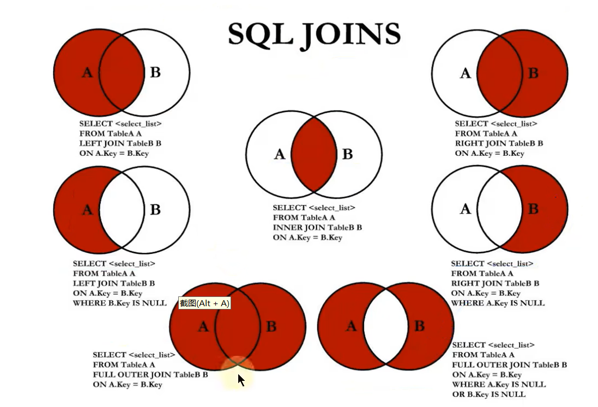
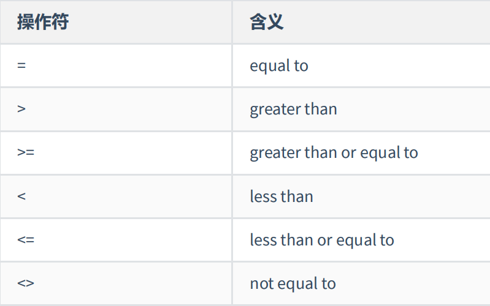
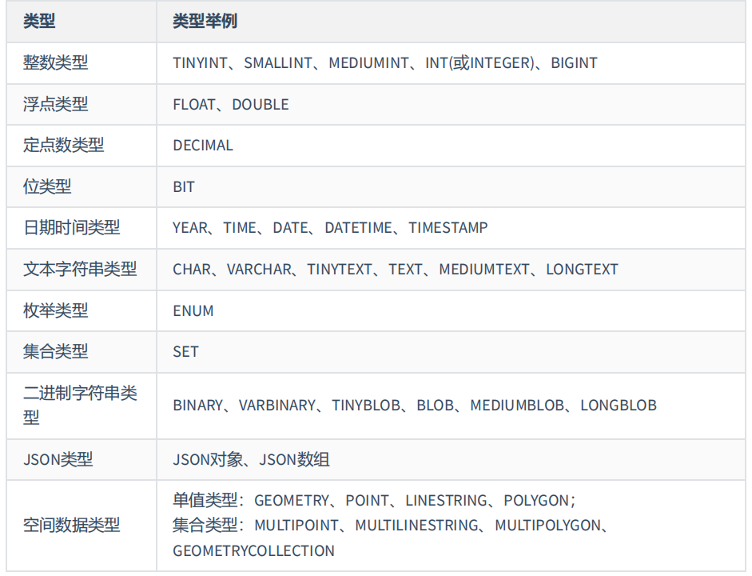
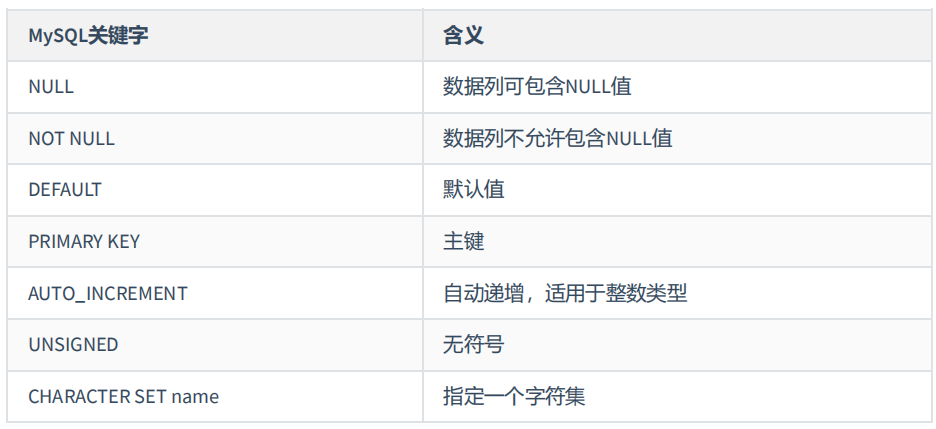
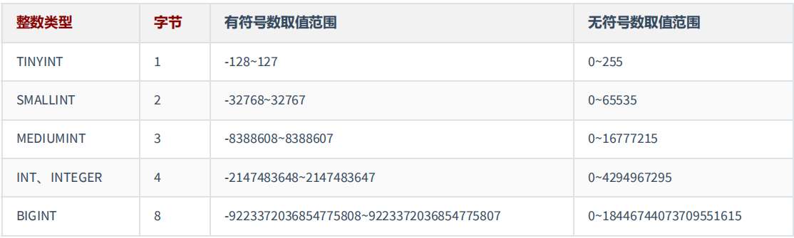
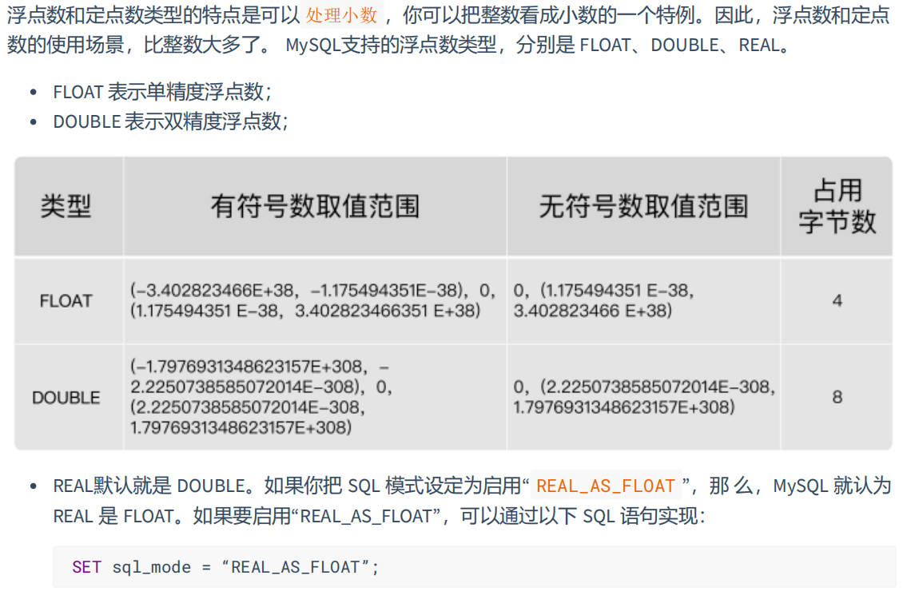
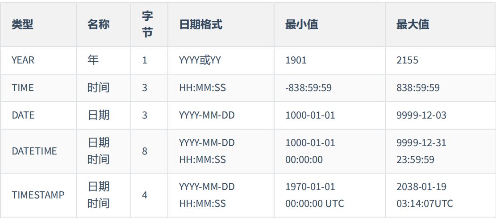
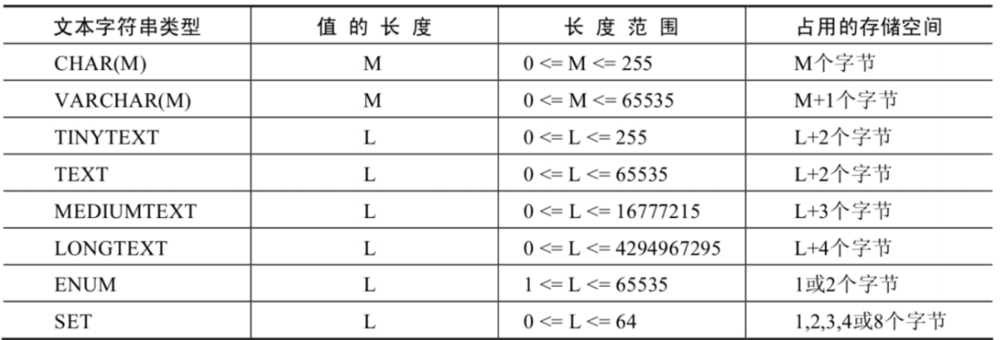

# 一、数据库概述

## 一、数据库的作用

- 持久化：把数据保存到可掉电式存储设备中以供之后使用，数据持久化意味着将内存中的数据保存到硬盘上加以固化
- 持久化的主要作用是将内存中的数据存储在关系型数据库中

## 二、数据库与数据库管理系统

1. DB：数据库（Database）：即存储数据的仓库，其本质是一个文件提供。保存了一系列有组织的数据
2. DBMS：数据库管理系统（Database Management System）：一种操纵和管理数据库的大型软件，用于建立、使用和维护数据库，对数据库进行统一管理和控制。用户通过数据库管理系统访问数据库中表内的数据。MySQL就是数据库管理系统的一种
3. SQL：结构化查询语言（Structured Query Language）：专门用来与数据库通信的语言

## 三、Oracle VS MySQL

1. Oracle更适合大型跨国企业的使用，因为他们对费用不敏感，但是对性能要求以及安全性有更高的要求
2. MySQL由于其体积小、速度块、总体拥有成本低，可处理上千万条记录的大型数据库，尤其是开放源码这一特点，使得很多互联网公司、中小型网站选择使用MySQL作为网站数据库

## 四、RDBMS VS 非RDBMS 

### 一、关系型数据库（RDBMS）

1. 实质
	- 关系型数据库模型是把复杂的数据结构归结为简单的二元关系（即二维表格形式）
	- 关系型数据库以row（行）和列（column）的形式存储数据。这一系列的行和列被称为表（table），一组表组成了一个库（database）
	- 表和表之间的数据记录有关系（relationship）。现实世界中的各种实体以及实体之间的各种联系均用关系模式来表示。关系型数据库，就是建立在关系模型基础上的数据库
	- SQL就是关系型数据库的查询语句
2. 优势
	- 复杂查询：可以用SQL语句方便的在一个表以及多个表之间做非常复杂的数据查询
	- 事物支持：使得对于安全性能很高的数据访问要求得以实现

### 二、非关系型数据库（非RDBMS）

1. 实质
	- 非关系型数据库是基于键值对存储数据，不需要经过SQL层的解析，性能非常高、同时通过减少不常用的功能，进一步提高性能
	- 大部分主流的非关系型数据库都是免费的
2. 分类
	- 键值型数据库：键值型数据库通过key-value键值的方式存储数据，其中key和value可以是简单的对象，也可以是复杂的对象。key作为唯一的标识符，优点是查找速度快，在这方面优于关系型数据库，缺点是无法像关系型数据库一样使用条件过滤，如果不知道去哪里找数据，就要遍历所有的键，这样会消耗大量的计算。键值型数据库典型的使用场景是作为没存缓存。Redis是最流行的键值型数据路
	- 文档型数据库：此类数据库可存放并获取文档，可以是xml、json等格式。再数据库中文档作为处理信息的基本单位，一个文档就相当于一条记录、文档数据库所存放的文档就相当于键值数据库所存放的值。MongoDB是最流行的文档型数据库
	- 搜索引擎数据库：虽然关系型数据库采用了索引提升检索效率，但是针对全文索引效率却很低。搜索引擎数据库是应用再搜索引擎领域的数据存储形式，由于搜索引擎会爬取大量的数据，并以特定的格式进行存储，这样在检索的时候才能保证性能最优。核心原理是“倒排索引”。Elasticsearch是最流行的搜索引擎数据库
	- 列存数据库：列存数据库是相对于行式存储的数据库，而列式数据库是将数据按照列存储到数据库中，这样做的好处是可以大量降低系统的I/O，适合于分布式文件系统，不足在于功能相对有限。HBase是最流行的列式数据库
	- 图形数据库

## 五、关系型数据库设计原则

### 一、设计原则

1. 关系型数据库的典型数据结构就是数据表，这些数据表的组成都是结构化的
2. 将数据放到表中，表再放到库中
3. 一个数据库中可以有多个表，每个表都有一个名字，用来标识自己。表名具有唯一性
4. 表具有一些特性，这些特性定义了数据在表中如何存储，类似于Java中类的设计

### 二、表、记录、字段

1. E-R（entity-relationship，实体-联系）模型中的有三个主要概念是：实体集、属性、联系集
2. 一个实体集（class）对应于数据库中的一个表（table）；一个实体（instance）则对应数据库表中的一行（row），也称为一条记录（record）；一个属性（attribute）对应于数据库表中的一列（column）。也称为一个字段（field）。ORM思想（Object Relational Mapping）体现为：
	- 数据库中一个表	<----->	Java或Python中的一个类
	- 表中的一条数据    <----->     类中的一个对象（或实体）
	- 表中的一个列        <----->     类中的一个字段、属性（field）
3. 表的关联关系
	- 表与表之间的数据记录有关系（relationship）。现实世界中的各种实体以及实体之间的各种联系均用关系模型来表示
	- 一对一关联（one-to-one）：外键唯一，主表的主键和从表的外键（唯一），形成主外键关系，外键唯一；外键是主键，主表的主键和从表的主键，形成主外键关系
	- 一对多关系（one-to-many）：在从表（多方）创建一个字段，字段作为外键指向主表（一方）的主键
	- 多对多关系（many-to-many）：要表示多对多关系，必须创建第三个表，该表通常称为联接表，它将多对多关系划分为两个一对多关系。将这两个表的主键都插入到第三个表中
	- 自我引用（Self reference）：一个表通过本表的某个字段关联本表

# 二、MySQL下载安装设置

## 一、MySQL下载地址

[Mysql最新下载地址](https://dev.mysql.com/downloads/mysql/)

## 二、MySQL安装步骤

1. 下载Mysql安装包
2. 如若提示缺少VSCode安装包，在[VSCode下载地址](https://learn.microsoft.com/zh-cn/cpp/windows/latest-supported-vc-redist?view=msvc-170#visual-studio-2015-2017-2019-and-2022)下载安装VS即可
3. 傻瓜式安装即可，换一下安装路径

## 三、MySQL登录

1. mysql的启动与关闭命令

	```mysql
	net start mysql(数据库管理软件名称) // 开启数据库
	net stop mysql(数据库管理软件名称) // 关闭数据库
	```

2. mysql的登录

	```mysql
	mysql -u 用户名 =p直接写密码
	mysql -u 用户名 -P 端口号 -h url主机地址 -p // 端口号和url主机地址是3306和本地的数据库可以省略
	```

## 四、MySQL命令行使用

1. show databases;    查询所有的数据库
2. create database 新的数据库名称;    创建新的数据库
3. drop database 数据库名称;    删除数据库
4. use 数据库名;    使用指定的数据库，才能进行以下操作
5. create table 表名(字段名1 字段类型1,字段名2 字段类型2);    创建新的表
6. drop table 表名;    删除表
7. show create database 创建的数据库名称/创建的表名;    查询创建的数据库或表的创建信息
8. show varibles like 'character_%';    查询数据库中所使用的字符集

# 三、基本的SELECT语句

## 一、SQL分类

1. DDL（Data Definition Languages，数据定义语言），这些语言定义了不同的数据库、表、视图、索引等数据库对象，还可以用来创建、删除和修改数据库和数据表的结构。主要语句关键字包含：CREAT、DROP、ALTER、RENAME、TRUNCATE等。DDL的操作一旦执行，就不可回滚
2. DML（Data Manipulation Languages，数据操作语言），用于添加、删除、更新和查询数据库记录，并检查数据完整性。主要语句关键字包含：INSERT、DELETE、UPDATE、SELECT等。DML的操作情况，一旦执行，也是不可回滚的，但是，在执行DML之前，执行了SET autocommit = FALSE，则执行的DML操作就可以实现回滚
3. DCL（Data Control Languages，数据控制语言），用于定义数据库、表、字段、用户的访问权限和安全级别。主要语句关键字包含：GRANT、REVOKE、COMMIT、ROLLBACK、SAVEPOINT等

## 二、SQL语言规则与规范

### 一、基本规则

1. SQL可以写在一行或者多行。为了提高可读性，各子句分别写，必要时使用缩进
2. 每条命令以';'、'\g'、'\G'结束
3. 关键字不能被缩写也不能分行
4. 关于标点符号
	- 必须保证所有的()、单引号、双引号是成对结束的
	- 必须使用英文状态下的半角输入方式
	- 字符串型和日期时间类型的数据可以使用单引号（‘’）表示
	- 列的别名，尽量使用双引号（”“），而且不建议省略as

### 二、SQL大小写规范

1. MySQL在Windows环境下是大小写不敏感的
2. MySQL在Linux环境下是大小写敏感的
	- 数据库名、表名、表的别名、变量名严格区分大小写的
	- 关键字、函数名、列名（或字段名）、列的别名（字段的别名）是忽略大小写的
3. 推荐采用统一的书写规范
	- 数据库名、表名、表别名、字段名、字段别名等都小写
	- SQL关键字、函数名、绑定变量等都大写

### 三、注释

```mysql
单行注释：#注释文字（MySQL特有的方式）
单行注释：-- 注释文字（--后面必须包含一个空格）
多行注释：/* 注释文字 */
```

### 四、命名规则

1. 数据库、表名不得超过30个字符，变量名限制为29个
2. 必须只能包含A-Z、a-z、0-9、_共63个字符
3. 数据库名、表名、字段名等对象名中间不要包含空格
4. 同一个MySQL软件中，数据库不能同名；同一个库中，表不能重名；同一个表中，字段不能重名
5. 必须保证字段不能和保留字、数据库系统或常用方法冲突。如果坚持使用，在SQL语句中使用``（着重号）引起来
6. 保持字段名和类型的一致性，在命名字段并为其指定数据类型的时候一定要保证一致性、假如数据类型在一个表里是整型，那在另一个表里就别变成字符型

## 三、导入SQL文件方式

1. source 文件的全路径名称
2. 基于图形化工具导入

## 四、最基本的SELECT语句

1. SELECT */字段名1，字段名2…… FROM 表名
	- *：表的全字段
	- 若只查询不用表名的数据，则FROM和表名可以省略
2. 列的别名
	- AS：全称alias（别名），可以省略
	- 列的别名可以使用一对”“引起来
3. 去除重复行
	- DISTINCT：去重关键字，去除重复数据
	- DISTINCT关键字要紧跟SELECT，如果后面有多个字段，则去重的规则是每一行所有的字段加起来去掉重复的数据，而不是单独字段去重
4. 空值参与运算
	- 空值：null
	- null不等同于0、''、’null‘
	- null值参与运算时，结果也是null
	- MySQL可以使用IFNULL将null值替换为指定的数据
5. 着重号
	- 字段、表名等自定义的和保留字、数据库系统或常用方法冲突。如果坚持使用，在SQL语句中使用``（着重号）引起来
6. 查询常数
	- 相当于写死数据
7. 显示表结构
	- 使用DESCRIBE或DESC命令+表名，表示表结构
	- 显示表中字段的详细信息
8. 过滤数据
	- 使用WHERE关键字
	- WHERE需要声明在FROM后，ORDER BY之前

# 四、运算符

## 一、算术运算符

1. 加法与减法运算符（+、-）
	- 一个整数类型的值对整数进行加法和减法操作，结果还是一个整数
	- 一个整数类型的值对浮点数进行加法和减法操作，结果是一个浮点数
	- 加法和减法的优先级相同，进行先加后减操作与进行先减后加操作的结果是一样的
	- 在Java中，+的左右两边如果有字符串，那么表示字符串的拼接。但是在MySQL中+只表示数值相加。如果遇到非数值类型，先尝试转成数值，如果转失败，就按0计算。（MySQL中字符串拼接要使用字符串函数CONCAT()实现）
2. 乘法与除法运算符（*、/或div）
	- 一个数乘以整数1和除以整数1后仍得原数
	- 一个数乘以浮点数1和除以浮点数1后变成浮点数，数值与原数相等
	- 一个数除以整数后，不管是否能除尽，结果都为一个浮点数
	- 一个数除以另一个数，除不尽时，结果为一个浮点数，并保留到小数点后4位
	- 乘法和除法的优先级相同，进行先乘后除与先除后乘操作，得出的结果相同
	- 在数学运算中，0不能用作除数，在MySQL中，一个数除以0为NULL
3. 取模运算（%或mode）
	- 取模的正负号取决于被模数的正负号
	- 被模数也就是%前后的数据

## 二、非算术运算符

1. =、<=>、<>或!=、<、<=、>、>=

	- 等于运算符（=）判断等号两边的值、字符串或表达式是否相等，如果相等则返回1，不相等则返回0
	- 如果等号两边的值、字符串或表达式都为字符串，则MySQL会按照字符串进行比较，其比较的是每个字符串中字符的ANSI编码是否相等
	- 如果等号两边的值都是整数，则MySQL会按照整数来比较两个值的大小
	- 如果等号两边的值一个是整数，另一个是字符串，则MySQL会将字符串转化为数字进行比较
	- 如果等号两边的值、字符串或表达式中有一个为NULL，则比较结果为NULL
	- SQL中赋值符号使用:=
	- 安全等于运算符（<=>）与等于运算符（=）的作用是相似的，唯一的区别是<=>可以用来对NULL进行判断。在两个操作数均为NULL时，其返回值为1，而不为NULL；当一个操作数为NULL时，其返回值为0，而不为NULL。安全等于运算符（<=>）为NULL而生。若使用安全等于运算符查询不等于的数据规则为：NOT 字段名 <=> NULL

2. IS NULL、IS NOT NULL、LEAST、GREATEST、BETWEEN AND、ISNULL、IN、NOT IN、LIKE、REGEXP、RLIKE

	- IS NULL：查询某字段是NULL的数据

	- IS NOT NULL：查询某字段不是NULL的数据

	- ISNULL(字段名) 函数：查询某字段是NULL的数据

	- LEAST(多个字段名) 函数：查询多个字段中最小的数据。数值值则按照数值比较大小；如果对比字段的值都为字符串，则MySQL会按照字符串进行比较，其比较的是每个字符串中字符的ANSI编码的大小

	- GREATEST(多个字段名) 函数：查询某字段中最大的数据。数值值则按照数值比较大小；如果对比字段的值都为字符串，则MySQL会按照字符串进行比较，其比较的是每个字符串中字符的ANSI编码的大小

	- BETWEEN 条件1 AND 条件2：查询条件1和条件2范围内的数据，包含边界。条件1为下限；条件2为上限，且不能交换。不在条件1和条件2区间的写法为：字段名 NOT BETWEEN 条件1 AND 条件2，不包含边界

	- IN(set集合)：查询某字段在set集合中的数据

	- NOT IN(set集合)：查询某字段不在set集合中的数据

	- LIKE：模糊查询。%代表不确定个数（0-多个）的字符；_代表一个不确定的字符；\代表转义字符

	- REGEXP\RLIKE：REGEXP运算符用来匹配字符串，语法格式为：expr REGEXP 匹配条件、如果expr满足匹配条件，返回1；如果不满足，则返回0。若expr或匹配条件任意一个为NULL，则结果为NULL

		```mysql
		'^'匹配以该字符后面的字符开头的字符串
		'$'匹配以该字符前面的字符结尾的字符串
		'.'匹配任何一个单字符
		'[...]'匹配在方括号内的任何字符。例如，"[abc]"匹配"a"或"b"或"c"、为了命名字符的范围，使用一个'-'，"[a-z]"匹配任何字母，"[0-9]"匹配任何数字
		'*'匹配零个或多个在它前面的字符。例如，'x*'匹配任何数量的'x'字符，"[0-9]*"匹配任何数量的数字，而"*"匹配任何数量的任何字符
		```

3. 逻辑运算符

	- 逻辑与（AND或&&）：并且条件
	- 逻辑或（OR或||）：选择条件。逻辑与的优先级低于逻辑与
	- 逻辑非（NOT或!）：
	- 逻辑异或（XOR）： 给定的值中任意一个值为NULL时，则返回NULL；  如果两个非NULL的值都是0或者都不等于0时，则返回0；  如果一个值为0，另一个值不为0时，则返回1。相等于两个条件只需满足其中的一个条件即可，两个都满足也不行

4. 位运算符：在二进制数上进行计算的运算符。位运算符会先将操作数变成二进制，然后进行位运算符，最后将计算结果从二进制变成十进制

	- &：按位与（位AND），当给定值对应的二进制位的数值都为1时，则该位返回1，否则返回0 
	- |：按位或（位OR）， 当给定值对应的二进制位的数值有一个或两个为1时，则该位返回1，否则返回0 
	- ^：按位异或（位XOR），当给定值对应的二进制位的数值不同时，则该位返回1，否则返回0 
	- ~：按位取反（）， 给定的值的二进制数逐位进行取反操作，即将1变为0，将0变为1 
	- `>>`：按位右移，右移指定的位数后，右边低位的数值被移出并丢弃，左边高位空出的位置用0补齐，每向y右移动一位数据除以2
	- `<<`：按位左移， 左移指定的位数后，左边高位的数值被移出并丢弃，右边低位空出的位置用0补齐，每向左移动一位数据乘以2

# 五、排序与分页

## 一、排序

1. 如果没有使用排序操作，默认情况下查询语句返回的数据是按照添加数据的顺序显示的
2. 使用ORDER BY进行排序
3. 升序使用ASC，默认升序；降序使用DESC
4. 可以使用列的别名进行排序。列的别名只能在ORDER BY中使用，不能再WHERE中使用
5. WHERE需要声明在FROM后，ORDER BY之前
6. 可以使用不在SELECT列表中的列排序
7. 在对多列进行排序的时候，首先排序的的第一列必须有相同的列值，才会对第二列进行排序。如果第一列数据中所有值都是唯一的，将不再对第二列进行排序
8. SQL的执行顺序
   - 先执行FROM语句
   - 再执行WHERE语句
   - 然后执行SELECT语句
   - 最后执行ORDER BY语句

## 二、分页

1. 使用LIMIT实现数据的分页显示
2. LIMIT 偏移量,条数：偏移量表示从偏移量+1位数据开始查询，查指定条数的数据
3. MySQL8新特性：LIMIT 条数 OFFSET 偏移量
4. 分页公式：每页显示pageSize条记录，此时显示第pageNo页，则公式为LIMIT (pageNo-1)*pageSize,pageSize

# 六、多表查询

## 一、笛卡尔积

1. 笛卡尔积是一个数学运算。假设有两个集合X和Y，那么X和Y的笛卡尔积就是X和Y的所有可能组合，也就是第一个对象来自于X，第二个对象来自于Y的所有可能。组合的个数即为两个集合中元素个数的乘积数

   ```mysql
   -- 此时查询出来的数据条数为sys_user的个数乘以sys_dept的个数，前表每一条数据都与后表每一条数据关联
   SELECT user_id,dept_id
   FROM sys_user,sys_dept
   ```

2. 笛卡尔积称为交叉连接，英文为CROSS JOIN，在SQL中也使用CROSS JOIN进行连接，它的作用就是可以把任意表进行连接，即使这两张表不相关

3. SQL中出现笛卡尔积的情况

   - 省略多个表的连接条件（或关联条件）
   - 连接条件（或关联条件）无效
   - 所有表中的所有行互相连接

## 二、多表查询的建议和规范

1. 如果查询语句中出现了多个表中都存在的字段，则必须指明此字段所在的表
2. 从SQL优化的角度，建议多表查询时，每个字段前都指明其所在的表
3. 可以给表起别名，如果给表起了别名，在使用此表时必须使用别名，不能再使用原表名
4. 如果有n个表实现多表的查询，则需要至少n-1个连接条件

## 三、多表查询的分类

### 一、等值连接 VS 非等值连接

1. 等值连接：使用=连接查询条件
2. 非等值连接：使用=之外的运算符连接查询条件

### 二、自连接 VS 非自连接

1. 自连接：本表连接本表
2. 非自连接：本表连接外表

### 三、内连接 VS 外连接

1. 内连接：合并具有同一列的两个以上的表的行，结果集中不包含一个表与另一个表不匹配的行

   - 使用JOIN ON进行连接

2. 外连接：合并具有同一列的两个以上的表的行，结果集中除了包含一个表与另一个表匹配的行之外，还查询到了左表或右表中不匹配的行

   - 左外连接：两个表在连接过程中除了返回满足连接条件的行以外还返回左表中不满足条件的行。使用LEFT　JOIN ON进行连接

   - 右外连接：两个表在连接过程中除了返回满足连接条件的行以外还返回右表中不满足条件的行。使用RIGHT

     JOIN ON进行连接

   - 满外连接：两个表在连接过程中除了返回满足连接条件的行以外还返回左表和右表中不满足条件的行。使用FULL JOIN ON进行连接。但是在MySQL中不支持，可以使用UNION或UNION ALL操作进行数据拼合

## 四、实现七种JOIN操作



## 五、UNION操作

1. 利用UNION关键字，可以给出多条SELECT语句，并将它们的结果组合成单个结果集。合并时，两个表对应的列数和数据类型必须相同，并且相互对应。各个SELECT语句之间使用UNION或UNION ALL关键字分割
2. UNION操作符：UNION操作符返回两个查询的结果集的并集，去除重复记录
3. UNION ALL操作符：UNION ALL操作符返回两个查询的结果集的并集。对于两个结果集的重复部分，不去重
4. UNION ALL操作语句所需的资源比UNION操作语句少。如果明确知道合并数据后的结果数据不存在重复数据，或者不需要去除重复数据，则尽量使用UNION ALL操作语句，以提高数据查询的效率

## 六、SQL99新特性

- NATURAL JOIN：会自动查询两张（只能用于两张表）连接表中所有相同的字段，然后进行等值连接

	```mysql
	SELECT * FROM sys_user_role
	NATURAL JOIN sys_role
	```

- JOIN...USING：USING指定了具体的相同的字段名称，需要在USING的括号()中填入要指定的同名字段，必须同名。同时使用JOIN...USING可以简化JOIN ON的等值连接

	```mysql
	SELECT * FROM sys_user_role
	LEFT JOIN sys_role USING(role_id)
	```

# 七、函数

## 一、单行函数

### 一、单行函数的含义

1. 操作数据对象
2. 接受参数返回一个结果
3. 只对一行进行变换
4. 每行返回一个结果
5. 可以嵌套
6. 参数可以是一列或一个值

### 二、数值函数

#### 一、基本函数


#### 二、角度与弧度互换函数


#### 三、三角函数


#### 四、指数与对数


#### 五、进制间的转换


### 三、字符串函数


### 四、日期和时间函数

1. 获取日期、时间

	

2. 日期与时间戳的转换

	

3. 获取月份、星期、星期数、天数等函数

	

4. 日期的操作函数

	

5. 时间和秒钟转换的函数

	

6. 计算日期和时间的函数

	

	

7. 日期的格式化与解析

	

	​	 非GET_FORMAT()函数中frmt参数常用的格式符

	​	 

	​     GET_FORMAT()函数中frmt参数常用的格式符

	​	 

### 五、流程控制函数


### 六、加密与解密函数


### 七、MySQL信息函数


### 八、其他函数


## 二、聚合函数

### 一、聚合函数的含义

- 聚合函数作用于一组数据，并对一组数据返回一个值
- 聚合函数在MySQL中不能嵌套使用，但是在ORACLE中可以使用。比如不能出现类似“AVG(SUM(字段名称))”形式的调用

### 二、AGE和SUM函数

- 可以对数值型数据使用AGE和SUM函数

### 三、MIN和MAX函数

- 可以对任意数据类型的数据使用MIN和MAX函数

### 四、COUNT函数

1. COUNT(*)返回表中记录总数，适用于任意数据类型
2. COUNT(任一数字)返回表中记录总数，适用于任意数据类型，任何数字COUNT()后返回的结果都是一样
3. COUNT(expr)返回expr不为空的记录总数，其中expr为表中的任一字段
   - 如果使用的是MyISAM存储引擎，则COUNT(*)、COUNT(1)和COUNT(expr)的效率是相同的，都是O(1)
   - 如果使用的是InnoDB存储引擎，则COUNT(*)=COUNT(1)>COUNT(expr)

### 五、GROUP BY

1. GROUP BY的作用：可以使用GROUP BY子句将表中的数据分为若干组

2. GROUP BY使用注意点

   - GROUP BY中使用字段的先后顺序对结果并不会产生影响
   - GROUP BY不一定要和聚合函数一起配合使用
   - 在SELECT列表中所有未包含在组函数中的列都应该包含在GROUP BY子句中。人话为SELECT中出现的非组函数的字段必须声明在GROUP BY中，反之，GROUP BY中声明的字段可以不出现在SELECT中

3. MySQL使用GROUP BY中的WITH ROLLUP

   ```mysql
   SELECT dept_id,AVG(salary) avg_sal FROM employees GROUP BY dept_id WITH ROLLUP;
   ```

   - 使用WITH ROLLUP关键字之后，在所有查询到的分组记录之后增加一条记录，该记录计算查询出的所有记录的总和，即统计记录数量
   - 当使用WITH ROLLUP时，不能同时使用ORDER BY子句进行结果排序，即WITH ROLLUP和ORDER BY是互相排斥的

### 六、HAVING

1. HAVING用于过滤数据
2. 如果过滤条件中使用了聚合函数，则必须使用HAVING来替换WHERE，当然WHERE和HAVING可以配合使用，只是HWERE条件中不能出现聚合函数，而HAVING过滤条件可以出现非聚合函数。一般带有聚合函数的过滤条件放在HAVING里面，未有聚合函数的过滤条件放在WHERE里面，因为WHERE的执行效率高
3. HAVING必须声明在GROUP BY的后面。当前HAVING也可以单独使用在非HAVING的查询语句中，但是没有实际开发意义，因为聚合函数没有分组，只会出现一个结果再去过滤就意义不大了
4. WHERE和HAVING的对比
	- WHERE可以直接使用表中的字段作为筛选条件，但不能使用分组中的计算函数作为筛选条件；HAVING建议要与GROUP BY配合使用，可以把分组计算的函数和分组字段作为筛选条件
	- 如果需要通过连接从关联表中获取需要的数据，WHERE是先筛选后连接，而HAVING是先连接后筛选

### 七、SELECT执行过程

1. 查询语法结构

	```mysql
	SELECT ...,....,...------------------------------>
	FROM ... JOIN ...-------------------------------->FROM从哪些表中筛选
	ON 多表的连接条件--------------------------------->ON关联多表查询时，去除笛卡尔积
	JOIN ...
	ON ...
	WHERE 不包含组函数的过滤条件---------------------->WHERE从表中筛选的条件
	AND/OR 不包含组函数的过滤条件
	GROUP BY ...,...-------------------------------->GROUP BY分组依据
	HAVING 包含组函数的过滤条件----------------------->HAVING在统计结果中再次筛选
	ORDER BY ... ASC/DESC--------------------------->ORDER BY排序
	LIMIT ...,...----------------------------------->LIMIT分页
	```

2. 查询执行顺序

	```mysql
	FROM  -> JOIN -> ON -> 
	WHERE -> 
	GROUP BY -> HAVING -> 
	SELECT 的字段 -> DISTINCT ->
ORDER BY -> LIMIT
	```

	在 SELECT 语句执行这些步骤的时候，每个步骤都会产生一个 虚拟表 ，然后将这个虚拟表传入下一个步骤中作为输入。需要注意的是，这些步骤隐含在 SQL 的执行过程中，对于我们来说是不可见的
	
	```
	SELECT 是先执行 FROM 这一步的。在这个阶段，如果是多张表联查，还会经历下面的几个步骤：
		1. 首先先通过 CROSS JOIN 求笛卡尔积，相当于得到虚拟表 vt（virtual table）1-1；
		2. 通过 ON 进行筛选，在虚拟表 vt1-1 的基础上进行筛选，得到虚拟表 vt1-2；
		3. 添加外部行。如果我们使用的是左连接、右链接或者全连接，就会涉及到外部行，也就是在虚拟表 vt1-2 		的基础上增加外部行，得到虚拟表 vt1-3。
	当然如果我们操作的是两张以上的表，还会重复上面的步骤，直到所有表都被处理完为止。这个过程得到是我们的原始数据。
	
	当我们拿到了查询数据表的原始数据，也就是最终的虚拟表 vt1 ，就可以在此基础上再进行 WHERE 阶段 。在这个阶段中，会根据 vt1 表的结果进行筛选过滤，得到虚拟表 vt2 。
	
	然后进入第三步和第四步，也就是 GROUP 和 HAVING 阶段 。在这个阶段中，实际上是在虚拟表 vt2 的
	基础上进行分组和分组过滤，得到中间的虚拟表 vt3 和 vt4 。
	
	当我们完成了条件筛选部分之后，就可以筛选表中提取的字段，也就是进入到 SELECT 和 DISTINCT阶段 。
	
	首先在 SELECT 阶段会提取想要的字段，然后在 DISTINCT 阶段过滤掉重复的行，分别得到中间的虚拟表vt5-1 和 vt5-2 。
	
	当我们提取了想要的字段数据之后，就可以按照指定的字段进行排序，也就是 ORDER BY 阶段 ，得到虚拟表 vt6 。
	
	最后在 vt6 的基础上，取出指定行的记录，也就是 LIMIT 阶段 ，得到最终的结果，对应的是虚拟表vt7 。
	```

# 八、子查询

## 一、子查询的含义

- 子查询指一个查询语句嵌套在另一个查询语句内部的查询
- SQL中子查询的使用大大增强了SELECT查询的能力，因为很多时候查询需要从结果集中获取数据，或者需要从同一个表中先计算出一个数据结果，然后与这个数据结果（可能是某个标量，也可能是某个集合）进行比较

## 二、子查询的基本使用

1. 子查询（内查询）在主查询之前一次执行完成
2. 子查询的结果被主查询（外查询）使用
3. 注意事项
   - 子查询要包含在括号内
   - 将子查询放在比较条件的右侧
   - 单行操作符对应单行子查询，多行操作符对应多行子查询

## 三、子查询的分类

### 一、分类方式一

- 按照内查询的结果返回一条还是多条记录，将子查询分为单行子查询、多行子查询

### 二、分类方式二

1. 按照内查询是否被执行多次，将子查询划分为相关（或关联）子查询和不相关（或非关联）子查询
2. 子查询从数据表中查询了数据结果，如果这个数据结果只执行了一次，然后这个数据结果作为主查询的条件进行执行，那么这样的子查询叫做不相关子查询
3. 如果子查询需要执行多次，即采用循环的方式，先从外部查询开始，每次都传入子查询进行查询，然后再将结果反馈给外部，这种嵌套的执行方式就称为相关子查询

## 四、单行子查询

### 一、单行比较操作符



### 二、WHERE中的子查询

```mysql
SELECT employee_id, manager_id, department_id
FROM employees
WHERE manager_id =
				(SELECT manager_id
				 FROM employees
				 WHERE employee_id = 174)
AND department_id =
				(SELECT department_id
				 FROM employees
				 WHERE employee_id = 174))
AND employee_id = 174;
```

### 三、HAVING中的子查询

1. 首先执行子查询
2. 向主查询中的HAVING子句返回结果

```mysql
SELECT department_id, MIN(salary)
FROM employees
GROUP BY department_id
HAVING MIN(salary) >
				(SELECT MIN(salary)
				 FROM employees
				 WHERE department_id = 50);
```

### 四、CASE中的子查询

```mysql
SELECT employee_id, last_name,
(CASE department_id
WHEN
(SELECT department_id FROM departments
WHERE location_id = 1800)
THEN 'Canada' ELSE 'USA' END) location
FROM employees;
```

### 五、FROM中的子查询

- FROM中使用子查询相当于建立了一张临时表，此此查询必须使用括号并加别名

## 五、多行子查询

### 一、多行比较操作符 


1. IN：等于列表中的任意一个

   ```mysql
   SELECT employee_id, manager_id, department_id
   FROM employees
   WHERE manager_id IN
   				(SELECT manager_id
   				 FROM employees
   				 WHERE employee_id IN (174,141))
   AND department_id IN
   				(SELECT department_id
   				 FROM employees
   				 WHERE employee_id IN (174,141))
   AND employee_id NOT IN(174,141);
   ```

2. ANY：需要和单行比较操作符一起使用，和子查询返回的某一个值比较

   ```mysql
   SELECT employee_id, manager_id, department_id
   FROM employees
   WHERE salary < ANY
   				(SELECT salary
   				 FROM employees
   				 WHERE employee_id IN (174,141))
   ```

3. ALL：需要和单行比较操作符一起使用，和子查询返回的所有值比较

   ```mysql
   SELECT employee_id, manager_id, department_id
   FROM employees
   WHERE salary < ALL
   				(SELECT salary
   				 FROM employees
   				 WHERE employee_id IN (174,141))
   ```

4. SOME：实际上是ANY的别名，作用相同，一般常使用ANY

### 二、空值问题

1. 无论是在单行子查询还是多行子查询中都需要注意空值问题
2. 如果是操作子查询中出现空值，则整体查询语句可能会查不出数据。所以尽量在子查询中去除空值

## 六、相关子查询

### 一、相关子查询的含义

- 如果子查询的执行流程依赖于外部查询，通常情况下都是因为子查询中的表用到了外部的表，并进行了条件关联，因此每执行一次外部查询，子查询都要重新计算一次，这样的子查询就称之为 关联子查询

### 二、相关子查询的执行流程

1. GET：从主查询中获取候选列
2. EXECUTE：子查询使用主查询的数据
3. USE：如果满足子查询的条件则返回该行

### 三、子查询的适用位置

- 除了GROUP BY和LIMIT之外的地方，都可以声明子查询

### 四、EXISTS与NOT EXISTS关键字

1. 如果在子查询中不存在满足条件的行
   - 条件返回FALSE
   - 继续在子查询中查找
2. 如果在子查询中存在满足条件的行
   - 不在子查询中继续查找
   - 条件返回TRUE
3. NOT EXISTS关键字表示如果不存在某种条件，则返回TRUE，否则返回FALSE

```mysql
# 查询公司管理者的employee_id，last_name，job_id，department_id信息
SELECT employee_id, last_name, job_id, department_id
FROM employees e1
WHERE EXISTS 
			( SELECT *
			  FROM employees e2
			  WHERE e2.manager_id = e1.employee_id);
# 其中在子查询中只要满足 e2.manager_id = e1.employee_id 就会返回TRUE,e1.employee_id相对应的行就会被查询出来
# 子查询中的SELECT查询的字段名称无所谓，用什么都行
```

# 九、创建和管理表

## 一、标识符命名规则

- 数据库名、表名不得超过30个字符，变量名限制为29个
- 必须只能包含 A–Z, a–z, 0–9, _共63个字符 
- 数据库名、表名、字段名等对象名中间不要包含空格 
- 同一个MySQL软件中，数据库不能同名；同一个库中，表不能重名；同一个表中，字段不能重名 
- 必须保证你的字段没有和保留字、数据库系统或常用方法冲突。如果坚持使用，请在SQL语句中使用`（着重号）引起来 
- 保持字段名和类型的一致性：在命名字段并为其指定数据类型的时候一定要保证一致性，假如数据类型在一个表里是整数，那在另一个表里可就别变成字符型了 

## 二、创建和管理数据库

### 一、创建数据库

注意：DATABASE 不能改名。一些可视化工具可以改名，它是建新库，把所有表复制到新库，再删旧库完成的

```mysql
#方式一：创建的数据库使用的是默认的字符集
CREATE DATABASE 数据库名;
#方式二：显示指明了要创建的数据库的字符集
CREATE DATABASE 数据库名 CHARACTER SET 字符集;
#方式三：判断数据库是否已经存在，不存在则创建数据库
CREATE DATABASE IF NOT EXISTS 数据库名 CHARACTER SET 字符集;
```

### 二、管理数据库

```mysql
#查看当前所有的数据库
SHOW DATABASES;
#查看当前正在使用的数据库
SELECT DATABASE();
#查看指定库下所有的表
SHOW TABLES FROM 数据库名
#查看数据库的创建信息
SHOW CREATE DATABASE 数据库名;
SHOW CREATE DATABASE 数据库名\G
#使用/切换数据库
USE 数据库名;

#更改数据库字符集
SHOW CREATE DATABASE 数据库名

#删除数据库
DROP DATABASE 数据库名
DROP DATABASE IF EXISTS 数据库名
```

## 三、创建和管理表

### 一、创建表

1. 创建表的前提

   - CREATE TABLE权限
   - 存储空间

2. 创建表的规则

   - 必须指定的有表名，列名（或字段名）、数据类型、长度
   - 可选指定的有约束条件和默认值

3. 语法格式

   ```mysql
   #方式一：创建库中不存在的表
   CREATE TABLE [IF NOT EXISTS] 表名(
   字段1, 数据类型 [约束条件] [默认值],
   字段2, 数据类型 [约束条件] [默认值],
   字段3, 数据类型 [约束条件] [默认值],
   ……
   [表约束条件]
   );
   
   #方式二：基于查询语句查询到的字段创建表2，并导入数据（若不想导入数据，则添加where 1=2这样的条件即可）
   CREATE TABLE 表2
   AS
   SELECT 字段1，字段2......
   FROM 表1
   ```

### 二、修改表

```mysql
#查询表的结构
DESC 表名
#修改表
ALTER TABLE
#添加一个字段，默认新加的字段加到表的最后，也可以指明为首位或者某个字段后
ALTER TABLE 表名 ADD 需要添加的字段名 字段类型 FIRST（AFTER 指定的字段）
#修改一个字段，数据类型（一般不会修改）、长度、默认值
ALTER TABLE 表名 MODIFY 需要修改的字段名 字段类型(字段长度) DEFAULT 默认值
#重命名字段，重命名操作中包含修改字段的操作
ALTER TABLE 表名 CHANGE 原字段名称 新字段名称 字段类型
#删除某字段
ALTER TABLE 表名 DROP COLUMN 字段名
```

### 三、重命名表

```mysql
RENAME TABLE 原表名 TO 新表名 
ALTER TABLE 原表名 RENAME TO 新表名
```

### 四、删除表

```mysql
DROP TABLE IF EXISTS 表名
```

### 五、清空表

- TRUNCATE：实现对表中数据的删除，没有where条件，同时保留表结构。一旦执行此操作，数据不可回滚。TRUNCATE执行速度快，且使用的系统和事物日志资源少，但TRUNCATE无事物且不触发TRIGGER，有可能造成事故，故不建议在开发代码中使用此语句
- DELETE：实现对数据的删除，可以有where条件，同时保留表结构。一旦执行此操作，数据可以回滚，但是数据库设置了SET autocommit=TRUE，则执行的DELETE操作就不可以实现回滚

```mysql
TRUNCATE TABLE 表名
DELETE FROM 表名
```

## 四、COMMIT&ROLLBACK

1. COMMIT：提交数据。一旦执行commit，则数据就被永久的保存在数据库中，意味着数据不可以回滚
2. ROLLBACK：回滚数据。一旦执行ROLLBACK，则可以实现数据的回滚。回滚到最近的一次COMMIT之后

# 十、数据处理之增删改

## 一、添加数据

```mysql
#方式一：一条一条的添加数据，且没有指明要添加的字段，数据顺序要与表中字段顺序保持一致
INSERT INTO 表名 VALUES(字段1数据,字段2数据....)

#方式一：一条一条的添加数据，且指明要添加的字段，数据顺序要与指明的字段顺序保持一致
INSERT INTO 表名(字段1,字段2....) VALUES(字段1数据,字段2数据....)

#方式三：同时插入多行数据
INSERT INTO 表名(字段1,字段2....) 
VALUES
(字段1数据,字段2数据....),
(字段1数据,字段2数据....)

#方式三：将查询结果插入到表中，不必写VALUES子句，但子查询中的值列表应与INSERT子句中的列名对应
INSERT INTO 表名(字段1,字段2....)
SELECT 字段1,字段2....
FROM 源表名
WHERE 
```

## 二、更新数据

```mysql
#修改同一行数据中的某个字段
UPDATE 表名 SET 字段名 = 数据 WHERE 

#修改同一行数据中的多个字段
UPDATE 表名 SET 字段名1=数据1,字段名2=数据2 WHERE
```

## 三、删除数据

```mysql
DELETE FROM 表名 WHERE 
```

## 四、MySQL8新特性：计算列

- 简单来说就是某一行的值是通过别的列计算得来的。例如，a列值为1、b列值为2，c列不需要手动插入，定义a+b的结果为c的值，那么c就是计算列，是通过别的列计算得来的
- 新增或更新a和b时会自动更新c

```mysql
CREATE TABLE tb1(
id INT,
a INT,
b INT,
c INT GENERATED ALWAYS AS (a + b) VIRTUAL
);
```

# 十一、MySQL数据类型

## 一、MySQL中的字段类型





## 二、整数类型

### 一、类型介绍



### 二、可选属性

1. M
   - 表示显示宽度，M的取值范围是(0, 255)。例如，int(5)：当数据宽度小于5位的时候在数字前面需要用 字符填满宽度。该项功能需要配合“ ZEROFILL ”使用，表示用“0”填满宽度，否则指定显示宽度无效。符号位也占用一个宽度
   - 如果设置了显示宽度，那么插入的数据宽度超过显示宽度限制，不会对插入的数据有任何影响，还是按照类型的实际宽度进行保存，即显示宽度与类型可以存储的值范围无关 。从MySQL 8.0.17开始，整数数据类型不推荐使用显示宽度属性
   - 整型数据类型可以在定义表结构时指定所需要的显示宽度，如果不指定，则系统为每一种类型指定默认的宽度值
2. UNSIGNED
   - 无符号类型（非负），所有的整数类型都有一个可选的属性UNSIGNED（无符号属性），无 符号整数类型的最小取值为0
   - 如果需要在MySQL数据库中保存非负整数值时，可以将整数类型设置为无符号类型
   - int类型默认显示宽度为int(11)，无符号int类型默认显示宽度为int(10)
3. ZEROFILL
   - 0填充,（如果某列是ZEROFILL，那么MySQL会自动为当前列添加UNSIGNED属性），如果指定了ZEROFILL只是表示不够M位时，用0在左边填充，如果超过M位，只要不超过数据存储范围即可
   - 在 int(M) 中，M 的值跟 int(M) 所占多少存储空间并无任何关系。 int(3)、int(4)、int(8) 在磁盘上都是占用 4 bytes 的存储空间。也就是说，int(M)，必须和UNSIGNED ZEROFILL一起使用才有意义。如果整数值超过M位，就按照实际位数存储。只是无须再用字符 0 进行填充

### 三、适用场景

- TINYINT ：一般用于枚举数据，比如系统设定取值范围很小且固定的场景
- SMALLINT ：可以用于较小范围的统计数据，比如统计工厂的固定资产库存数量等
- MEDIUMINT ：用于较大整数的计算，比如车站每日的客流量等
- INT、INTEGER ：取值范围足够大，一般情况下不用考虑超限问题，用得最多。比如商品编号
- BIGINT ：只有当你处理特别巨大的整数时才会用到。比如双十一的交易量、大型门户网站点击量、证券公司衍生产品持仓等

## 三、浮点类型

### 一、浮点数



### 二、定点数

|         数据类型         | 字节数  |        含义        |
| :----------------------: | :-----: | :----------------: |
| DECIMAL(M,D),DEC,NUMERIC | M+2字节 | 有效范围由M和D决定 |

1. MySQL中的定点数只有DECIMAL一种类型
2. 使用 DECIMAL(M,D) 的方式表示高精度小数。其中，M被称为精度，D被称为标度。0<=M<=65， 0<=D<=30，D<M。例如，定义DECIMAL（5,2）的类型，表示该列取值范围是-999.99~999.99
3. DECIMAL(M,D)的最大取值范围与DOUBLE类型一样，但是有效的数据范围是由M和D决定的。 DECIMAL 的存储空间并不是固定的，由精度值M决定，总共占用的存储空间为M+2个字节。也就是 说，在一些对精度要求不高的场景下，比起占用同样字节长度的定点数，浮点数表达的数值范围可以更大一些
4. 定点数在MySQL内部是以 字符串 的形式进行存储，这就决定了它一定是精准的
5. 当DECIMAL类型不指定精度和标度时，其默认为DECIMAL(10,0)。当数据的精度超出了定点数类型的精度范围时，则MySQL同样会进行四舍五入处理
6. 浮点数VS定点数
   - 浮点数相对于定点数的优点是在长度一定的情况下，浮点类型取值范围大，但是不精准，适用于需要取值范围大，又可以容忍微小误差的科学计算场景（比如计算化学、分子建模、流体动力学等）
   - 定点数类型取值范围相对小，但是精准，没有误差，适合于对精度要求极高的场景 （比如涉及金额计算的场景）

## 四、位类型

| 二进制字符串类型 | 长度 |   长度范围   |      占用空间       |
| :--------------: | :--: | :----------: | :-----------------: |
|      BIT(M)      |  M   | 1 <= M <= 64 | 约为(M + 7)/8个字节 |

1. BIT类型中存储的是二进制值，类似010110
2. BIT类型，如果没有指定(M)，默认是1位。这个1位，表示只能存1位的二进制值。这里(M)是表示二进制的位数，位数最小值为1，最大值为64
3. 在向BIT类型的字段中插入数据时，一定要确保插入的数据在BIT类型支持的范围内
4. 使用SELECT命令查询位字段时，可以用 BIN() 二进制表示或 HEX() 十六进制显示函数进行读取
5. 使用b+0查询数据时，可以直接查询出存储的十进制数据的值

## 五、日期时间类型



1. YEAR 类型通常用来表示年，格式为 YYYY
2. DATE 类型通常用来表示年、月、日，格式为 YYYY-MM-DD
3. TIME 类型通常用来表示时、分、秒。不光表示一天之内的时间，而且可以用来表示一个时间间隔，这个时间间隔可以超过 24 小时，格式为HH:MM:SS
4. DATETIME 类型通常用来表示年、月、日、时、分、秒，格式为YYYY-MM-DD HH:MM:SS 
5. TIMESTAMP 类型通常用来表示带时区的年、月、日、时、分、秒，存储的是时间戳，但是显示的则是正常的日期时间格式
   - TIMESTAMP类型也可以表示日期时间，其显示格式与DATETIME类型相同，都是 YYYY-MM-DD HH:MM:SS
   - 需要4个字节的存储空间。但是TIMESTAMP存储的时间范围比DATETIME要小很多，只能存储 “1970-01-01 00:00:01 UTC”到“2038-01-19 03:14:07 UTC”之间的时间。其中，UTC表示世界统一时间，也叫作世界标准时间
   - 存储数据的时候需要对当前时间所在的时区进行转换，查询数据的时候再将时间转换回当前的时区。因此，使用TIMESTAMP存储的同一个时间值，在不同的时区查询时会显示不同的时间
   - TIMESTAMP和DATETIME的区别：TIMESTAMP存储空间比较小，表示的日期时间范围也比较小；底层存储方式不同，TIMESTAMP底层存储的是毫秒值，距离1970-1-1 0:0:0 0毫秒的毫秒值；两个日期比较大小或日期计算时，TIMESTAMP更方便、更快；TIMESTAMP和时区有关。TIMESTAMP会根据用户的时区不同，显示不同的结果。而DATETIME则只能反映出插入时当地的时区，其他时区的人查看数据必然会有误差的

## 六、文本字符串类型



### 一、CHAR和VARCHAR类型

1. CHAR类型

   - CHAR(M) 类型一般需要预先定义字符串长度。如果不指定(M)，则表示长度默认是1个字符
   - 如果保存时，数据的实际长度比CHAR类型声明的长度小，则会在 右侧填充 空格以达到指定的长度。当MySQL检索CHAR类型的数据时，CHAR类型的字段会去除尾部的空格
   - 定义CHAR类型字段时，声明的字段长度即为CHAR类型字段所占的存储空间的字节数

2. VARCHAR类型

   - VARCHAR(M) 定义时， 必须指定 长度M，否则报错
   - MySQL4.0版本以下，varchar(20)：指的是20字节，如果存放UTF8汉字时，只能存6个（每个汉字3字节） ；MySQL5.0版本以上，varchar(20)：指的是20字符
   - 检索VARCHAR类型的字段数据时，会保留数据尾部的空格。VARCHAR类型的字段所占用的存储空间为字符串实际长度加1个字节

3. CHAR或VARCHAR适用的场景

   |    类型    |   特点   |    空间上    | 时间上 |       适用场景       |
   | :--------: | :------: | :----------: | :----: | :------------------: |
   |  CHAR(M)   | 固定长度 | 浪费存储空间 | 效率高 | 存储不大，速度要求高 |
   | VARCHAR(M) | 可变长度 | 节省存储空间 | 效率低 |     非CHAR的情况     |

   - 存储很短的信息。比如门牌号码101，201……这样很短的信息应该用char，因为varchar还要占个 byte用于存储信息长度，本来打算节约存储的，结果得不偿失

   - 固定长度的。比如使用uuid作为主键，那用char应该更合适。因为他固定长度，varchar动态根据长度的特性就消失了，而且还要占个长度信息

   - 十分频繁改变的column。因为varchar每次存储都要有额外的计算，得到长度等工作，如果一个非常频繁改变的，那就要有很多的精力用于计算，而这些对于char来说是不需要的，则使用VARCHAR会更好

   - MyISAM 数据存储引擎和数据列：MyISAM数据表，最好使用固定长度(CHAR)的数据列代替可变长度(VARCHAR)的数据列。这样使得整个表静态化，从而使 数据检索更快 ，用空间换时间；

     MEMORY 存储引擎和数据列：MEMORY数据表目前都使用固定长度的数据行存储，因此无论使用CHAR或VARCHAR列都没有关系，两者都是作为CHAR类型处理的；

     InnoDB 存储引擎，建议使用VARCHAR类型。因为对于InnoDB数据表，内部的行存储格式并没有区分固定长度和可变长度列（所有数据行都使用指向数据列值的头指针），而且主要影响性能的因素是数据行使用的存储总量，由于char平均占用的空间多于varchar，所以除了简短并且固定长度的，其他考虑varchar。这样节省空间，对磁盘I/O和数据存储总量比较好

### 二、TEXT类型

| 文本字符串类型 |        特点        | 长度 |             长度范围             | 占用的存储空间 |
| :------------: | :----------------: | :--: | :------------------------------: | :------------: |
|    TINYTEXT    |  小文本、可变长度  |  L   |          0 <= L <= 255           |   L+2个字节    |
|      TEXT      |   文本、可变长度   |  L   |         0 <= L <= 65535          |   L+2个字节    |
|   MEDIUMTEXT   | 中等文本、可变长度 |  L   |        0 <= L <= 16777215        |   L+3个字节    |
|    LONGTEXT    |  大文本、可变长度  |  L   | 0 <= L<= 4294967295（相当于4GB） |   L+4个字节    |

## 七、ENUM枚举类型

| 文本字符串类型 | 长度 |    长度范围     | 占用的存储空间 |
| :------------: | :--: | :-------------: | :------------: |
|      ENUM      |  L   | 1 <= L <= 65535 |   1或2个字节   |

1. ENUM类型也叫作枚举类型，ENUM类型的取值范围需要在定义字段时进行指定。设置字段值时，ENUM类型只允许从成员中选取单个值，不能一次选取多个值

2. 当ENUM类型包含1～255个成员时，需要1个字节的存储空间；当ENUM类型包含256～65535个成员时，需要2个字节的存储空间；ENUM类型的成员个数的上限为65535个

3. 创建ENUM枚举类型以及添加ENUM枚举类型数据

   ```mysql
   #创建表
   CREATE TABLE test_enum(
   season ENUM('春','夏','秋','冬','unknow')
   );
   
   #添加数据
   INSERT INTO test_enum
   VALUES('春'),('秋');
   # 忽略大小写
   INSERT INTO test_enum
   VALUES('UNKNOW');
   # 允许按照角标的方式获取指定索引位置的枚举值，数据库中的索引是从1开始的
   INSERT INTO test_enum
   VALUES('1'),(3);
   # 当ENUM类型的字段没有声明为NOT NULL时，插入NULL也是有效的
   INSERT INTO test_enum
   VALUES(NULL);
   ```

## 八、SET类型

当SET类型包含的成员个数不同时，其所占用的存储空间也是不同的，具体如下：

| 成员个数范围（L表示实际成员个数） | 占用的存储空间 |
| :-------------------------------: | :------------: |
|            1 <= L <= 8            |    1个字节     |
|           9 <= L <= 16            |    2个字节     |
|           17 <= L <= 24           |    3个字节     |
|           25 <= L <= 32           |    4个字节     |
|           33 <= L <= 64           |    8个字节     |

1. SET表示一个字符串对象，可以包含0个或多个成员，但成员个数的上限为 64 。设置字段值时，可以取取值范围内的 0 个或多个值

2. SET类型在存储数据时成员个数越多，其占用的存储空间越大。注意：SET类型在选取成员时，可以一次选择多个成员，这一点与ENUM类型不同

3. 创建SET类型以及添加数据

   ```mysql
   #创建表
   CREATE TABLE test_set(
   s SET ('A', 'B', 'C')
   );
   
   #添加数据
   INSERT INTO test_set (s) VALUES ('A'), ('A,B');
   #插入重复的SET类型成员时，MySQL会自动删除重复的成员
   INSERT INTO test_set (s) VALUES ('A,B,C,A');
   #向SET类型的字段插入SET成员中不存在的值时，MySQL会抛出错误。
   INSERT INTO test_set (s) VALUES ('A,B,C,D');
   ```

## 九、二进制字符串类型

### 一、BINARY与VARBINARY类型

| 二进制字符串类型 |   特点   |       值的长度       | 占用空间  |
| :--------------: | :------: | :------------------: | :-------: |
|    BINARY(M)     | 固定长度 | M （0 <= M <= 255）  |  M个字节  |
|   VARBINARY(M)   | 可变长度 | M（0 <= M <= 65535） | M+1个字节 |

1. BINARY和VARBINARY类似于CHAR和VARCHAR，只是它们存储的是二进制字符串
2. BINARY (M)为固定长度的二进制字符串，M表示最多能存储的字节数，取值范围是0~255个字符。如果未指定(M)，表示只能存储 1个字节 。例如BINARY (8)，表示最多能存储8个字节，如果字段值不足(M)个字 节，将在右边填充'\0'以补齐指定长度
3. VARBINARY (M)为可变长度的二进制字符串，M表示最多能存储的字节数，总字节数不能超过行的字节长度限制65535，另外还要考虑额外字节开销，VARBINARY类型的数据除了存储数据本身外，还需要1或2个字节来存储数据的字节数。VARBINARY类型 必须指定(M) ，否则报错

### 二、BLOB类型

| 二进制字符串类型 | 值的长度 |             长度范围              |   占用空间   |
| :--------------: | :------: | :-------------------------------: | :----------: |
|     TINYBLOB     |    L     |           0 <= L <= 255           | L + 1 个字节 |
|       BLOB       |    L     |   0 <= L <= 65535（相当于64KB）   | L + 2 个字节 |
|    MEDIUMBLOB    |    L     | 0 <= L <= 16777215 （相当于16MB） | L + 3 个字节 |
|     LONGBLOB     |    L     | 0 <= L <= 4294967295（相当于4GB） | L + 4 个字节 |

1. BLOB是一个二进制大对象，可以容纳可变数量的数据

2. MySQL中的BLOB类型包括TINYBLOB、BLOB、MEDIUMBLOB和LONGBLOB 4种类型，它们可容纳值的最大长度不同。可以存储一个二进制的大对象，比如图片、音频和视频等

3. 需要注意的是，在实际工作中，往往不会在MySQL数据库中使用BLOB类型存储大对象数据，通常会将图 

   片、音频和视频文件存储到 服务器的磁盘上 ，并将图片、音频和视频的访问路径存储到MySQL中

4. TEXT和BLOB的使用注意事项：

   - BLOB和TEXT值也会引起自己的一些问题，特别是执行了大量的删除或更新操作的时候。删除这种值会在数据表中留下很大的" 空洞 "，以后填入这些"空洞"的记录可能长度不同。为了提高性能，建议定期使用 OPTIMIZE TABLE 功能对这类表进行 碎片整理 
   - 如果需要对大文本字段进行模糊查询，MySQL 提供了 前缀索引 。但是仍然要在不必要的时候避免检索大型的BLOB或TEXT值。例如，SELECT * 查询就不是很好的想法，除非你能够确定作为约束条件的WHERE子句只会找到所需要的数据行。否则，你可能毫无目的地在网络上传输大量的值
   - 把BLOB或TEXT列 分离到单独的表 中。在某些环境中，如果把这些数据列移动到第二张数据表中，可以让你把原数据表中的数据列转换为固定长度的数据行格式，那么它就是有意义的。这会 减少主表中的碎片 ，使你得到固定长度数据行的性能优势。它还使你在主数据表上运行 SELECT * 查询的时候不会通过 网络传输大量的BLOB或TEXT值

## 十、JSON类型

1. JSON（JavaScript Object Notation）是一种轻量级的 数据交换格式 。简洁和清晰的层次结构使得 JSON 成为理想的数据交换语言。它易于人阅读和编写，同时也易于机器解析和生成，并有效地提升网络传输效率。JSON可以将JavaScript对象中表示的一组数据转换为字符串，然后就可以在网络或者程序之间轻松地传递这个字符串，并在需要的时候将它还原为各编程语言所支持的数据格式

2. 在MySQL 5.7中，就已经支持JSON数据类型。在MySQL 8.x版本中，JSON类型提供了可以进行自动验证的JSON文档和优化的存储结构，使得在MySQL中存储和读取JSON类型的数据更加方便和高效

3. 创建并使用JSON类型

   ```mysql
   #创建JSON字段
   CREATE TABLE test_json(
   字段名为js json
   );
   
   #添加json数据
   INSERT INTO test_json (js)
   VALUES ('{"name":"songhk", "age":18, "address":{"province":"beijing",
   "city":"beijing"}}');
   
   #当需要检索JSON类型的字段中数据的某个具体值时，可以使用“->”和“->>”符号
   SELECT js -> '$.name' AS NAME,js -> '$.age' AS age ,js -> '$.address.province'
   AS province, js -> '$.address.city' AS city FROM test_json
   ```

## 十一、空间类型

# 十二、约束

## 一、约束概述

### 一、约束的意义

- 数据完整性（Data Integrity）是指数据的精确性（Accuracy）和可靠性（Reliability）。它是防止数据库中存在不符合语义规定的数据和防止因错误信息的输入输出造成无效操作或错误信息而提出的
- 为了保证数据的完整性，SQL规范以约束的方式对表数据进行额外的条件限制
  1. 实体完整性（Entity Integrity） ：例如，同一个表中，不能存在两条完全相同无法区分的记录 
  2. 域完整性（Domain Integrity） ：例如：年龄范围0-120，性别范围“男/女” 
  3. 引用完整性（Referential Integrity） ：例如：员工所在部门，在部门表中要能找到这个部门 
  4. 用户自定义完整性（User-defined Integrity） ：例如：用户名唯一、密码不能为空等，本部门经理的工资不得高于本部门职工的平均工资的5倍

### 二、约束的含义

- 约束是表级的强制规定
- 可以在创建表时规定约束（通过CREATE TABLE语句），或者在表创建之后通过 ALTER TABLE 语句规定约束

### 三、约束的分类

1. 根据约束数据列的限制，约束分为

   - 单列约束：每个约束只约束一列
   - 多列约束：每个约束约束多列数据

2. 根据约束的作用范围，约束分为

   - 列级约束：只能作用在一个列上，跟在列的定义后面

   - 表级约束：可以作用在多个列上，不与列一起，而是单独定义

   - 表格对比

     |          |     位置     |       支持的约束类型       |   是否可以起约束名   |
     | :------: | :----------: | :------------------------: | :------------------: |
     | 列级约束 |   列的后面   | 语法都支持，但外键没有效果 |        不可以        |
     | 表级约束 | 所有列的下面 | 默认和非空不支持，其他支持 | 可以，但是主键没效果 |

3. 根据约束起的作用，约束分为

   - NOT NULL非空约束，规定某个字段不能为空
   - UNIQUE唯一约束，规定某个字段在整个表中是唯一的
   - PRIMARY KEY主键(非空且唯一)约束
   - FOREIGN KEY外键约束 
   - CHECK检查约束。注意点，MySQL不支持check约束，但可以使用check约束，而没有任何效果
   - DEFAULT默认值约束

## 二、约束的查询

- 查看某个表已有的约束

  ```mysql
  #information_schema数据库名（系统库）
  #table_constraints表名称（专门存储各个表的约束）
  SELECT * FROM information_schema.table_constraints
  WHERE table_name = '表名称';
  ```

## 三、非空约束

### 一、作用

- 限制某个字段/某列的值不允许为空

### 二、关键字

- NOT NULL

### 三、特点

- 默认，所有的类型的值都可以是NULL，包括INT、FLOAT等数据类型 
- 非空约束只能出现在表对象的列上，只能某个列单独限定非空，不能组合非空 
- 一个表可以有很多列都分别限定了非空 
- 空字符串''不等于NULL，0也不等于NULL

### 四、添加非空约束

1. 建表时

   ```mysql
   CREATE TABLE 表名称(
   字段名 数据类型,
   字段名 数据类型 NOT NULL,
   字段名 数据类型 NOT NULL
   );
   ```

2. 建表后

   ```mysql
   alter table 表名称 modify 字段名 数据类型 not null;
   ```

### 五、删除非空约束

```mysql
alter table 表名称 modify 字段名 数据类型 NULL;
#去掉not null，相当于修改某个非注解字段，该字段允许为空

alter table 表名称 modify 字段名 数据类型;
#去掉not null，相当于修改某个非注解字段，该字段允许为空
```

## 四、唯一性约束

### 一、作用

- 用来限制某个字段/某列的值不能重复
- 即是限制了唯一性约束，该限制唯一性约束的字段仍然允许出现多个空置NULL

### 二、关键字

- UNIQUE 

### 三、特点

- 同一个表可以有多个唯一约束
- 唯一约束可以是某一个列的值唯一，也可以多个列组合的值唯一
- 唯一性约束允许列值为空
- 在创建唯一约束的时候，如果不给唯一约束命名，就默认和列名相同
- MySQL会给唯一约束的列上默认创建一个唯一索引
- 关键字key可以省略

### 四、添加唯一性约束

1. 建表时

   ```mysql
   create table 表名称(
   字段名 数据类型,
   字段名 数据类型 unique,
   字段名 数据类型 unique key,
   字段名 数据类型
   );
   create table 表名称(
   字段名 数据类型,
   字段名 数据类型,
   字段名 数据类型,
   [constraint 约束名] unique key(字段名)
   )
   
   # 列子
   create table student(
   sid int,
   sname varchar(20),
   tel char(11) unique,
   cardid char(18) unique key
   );
   
   CREATE TABLE USER(
   id INT NOT NULL,
   NAME VARCHAR(25),
   PASSWORD VARCHAR(16),
   -- 使用表级约束语法
   CONSTRAINT uk_name_pwd UNIQUE(NAME,PASSWORD)
   );
   ```

2. 建表后

   ```mysql
   #字段列表中如果是一个字段，表示该列的值唯一。如果是两个或更多个字段，那么复合唯一，
   #即多个字段的组合是唯一的
   
   #方式1：
   alter table 表名称 add unique key(字段列表);
   
   #方式2：
   alter table 表名称 modify 字段名 字段类型 unique;
   ```

### 五、关于复合唯一约束

```mysql
create table 表名称(
字段名 数据类型,
字段名 数据类型,
字段名 数据类型,
unique key(字段列表) 
#字段列表中写的是多个字段名，多个字段名用逗号分隔，表示那么是复合唯一，即多个字段的组合是唯一的
);
```

### 六、删除唯一约束

```mysql
SELECT * FROM information_schema.table_constraints WHERE table_name = '表名'; 
#查看都有哪些约束

ALTER TABLE 表名 DROP INDEX 唯一性约束名称/唯一性索引名称;

#注意：可以通过 show index from 表名称; 查看表的索引
```

- 添加唯一性约束的列上也会自动创建唯一索引
- 删除唯一约束只能通过删除唯一索引的方式删除
- 删除时需要指定唯一索引名，唯一索引名就和唯一约束名一样
- 如果创建唯一约束时未指定名称，如果是单列，就默认和列名相同；如果是组合列，那么默认和()中排在第一个的列名相同。也可以自定义唯一性约束名

## 五、主键约束

### 一、作用

- 用来唯一标识表中的一行记录

### 二、关键字

- primary key

### 三、特点

- 主键约束相当于唯一约束 + 非空约束的组合，主键约束列不允许重复，也不允许出现空值
- 一个表最多只能有一个主键约束，建立主键约束可以在列级别创建，也可以在表级别上创建
- 主键约束对应着表中的一列或者多列（复合主键） 
- 如果是多列组合的复合主键约束，那么这些列都不允许为空值，并且组合的值不允许重复
- MySQL的主键名总是PRIMARY，就算自己命名了主键约束名也没用
- 当创建主键约束时，系统默认会在所在的列或列组合上建立对应的主键索引（能够根据主键查询的，就根据主键查询，效率更高）。如果删除主键约束了，主键约束对应的索引就自动删除了
- 需要注意的一点是，不要修改主键字段的值。因为主键是数据记录的唯一标识，如果修改了主键的值，就有可能会破坏数据的完整性

### 四、添加主键约束

1. 建表时

   ```mysql
   create table 表名称(
   字段名 数据类型 primary key, #列级模式
   字段名 数据类型,
   字段名 数据类型
   );
   create table 表名称(
   字段名 数据类型,
   字段名 数据类型,
   字段名 数据类型,
   [constraint 约束名] primary key(字段名) #表级模式
   );
   ```

2. 建表后

   ```mysql
   ALTER TABLE 表名称 ADD PRIMARY KEY(字段列表); 
   #字段列表可以是一个字段，也可以是多个字段，如果是多个字段的话，是复合主键
   ```

### 五、关于复合主键

```mysql
create table 表名称(
字段名 数据类型,
字段名 数据类型,
字段名 数据类型,
primary key(字段名1,字段名2) 
#表示字段1和字段2的组合是唯一的，也可以有更多个字段
);
```

### 六、删除主键约束

```mysql
alter table 表名称 drop primary key;
```

## 六、 自增列

### 一、作用

- 某个字段的值自增

### 二、关键字

- auto_increment

### 三、特点和要求

- 一个表最多只能有一个自增长列
- 当需要产生唯一标识符或顺序值时，可设置自增长
- 自增长列约束的列必须是键列（主键列，唯一键列）
- 自增约束的列的数据类型必须是整数类型
- 如果自增列指定了 0 和 null，会在当前最大值的基础上自增；如果自增列手动指定了具体值，直接赋值为具体值。也就是说指定0或null不起作用

### 四、指定自增约束

1. 建表时

   ```mysql
   create table 表名称(
   字段名 数据类型 primary key auto_increment,
   字段名 数据类型 unique key not null,
   字段名 数据类型 unique key,
   字段名 数据类型 not null default 默认值,
   );
   
   create table 表名称(
   字段名 数据类型 default 默认值 ,
   字段名 数据类型 unique key auto_increment,
   字段名 数据类型 not null default 默认值,,
   primary key(字段名)
   );
   ```

2. 建表后

   ```mysql
   alter table 表名称 modify 字段名 数据类型 auto_increment;
   ```

### 五、删除自增约束

```mysql
#alter table 表名称 modify 字段名 数据类型 auto_increment;#给这个字段增加自增约束
alter table 表名称 modify 字段名 数据类型; #去掉auto_increment相当于删除
```

### 六、MySQL 8.0自增主键新特性

1. 在MySQL 8.0之前，自增主键AUTO_INCREMENT的值如果大于max(primary key)+1，在MySQL重启后，会重置AUTO_INCREMENT=max(primary key)+1，这种现象在某些情况下会导致业务主键冲突或者其他难以发现的问题
2.  在MySQL 5.7系统中，对于自增主键的分配规则，是由InnoDB数据字典内部一个计数器来决定的，而该计数器只在内存中维护 ，并不会持久化到磁盘中。当数据库重启时，该计数器会被初始化。上述结果的主要原因是自增主键没有持久化
3. MySQL 8.0将自增主键的计数器持久化到 重做日志 中。每次计数器发生改变，都会将其写入重做日志中。如果数据库重启，InnoDB会根据重做日志中的信息来初始化计数器的内存值

## 七、 外键约束 

### 一、作用

- 限定某个表的某个字段的引用完整性

### 二、关键字

- FOREIGN KEY

### 三、主表和从表/父表和子表

1. 主表（父表）：被引用的表，被参考的表 
2. 从表（子表）：引用别人的表，参考别人的表  

### 四、特点

1. 从表的外键列，必须引用/参考主表的主键或唯一约束的列，因为被依赖/被参考的值必须是唯一的 
2. 在创建外键约束时，如果不给外键约束命名，默认名不是列名，而是自动产生一个外键名（例如student_ibfk_1;），也可以指定外键约束名
3. 创建(CREATE)表时就指定外键约束的话，先创建主表，再创建从表
4. 删表时，先删从表（或先删除外键约束），再删除主表
5. 当主表的记录被从表参照时，主表的记录将不允许删除，如果要删除数据，需要先删除从表中依赖该记录的数据，然后才可以删除主表的数据 
6. 在“从表”中指定外键约束，并且一个表可以建立多个外键约束 
7. 从表的外键列与主表被参照的列名字可以不相同，但是数据类型必须一样，逻辑意义一致。如果类型不一样，创建子表时，就会出现错误
8. 当创建外键约束时，系统默认会在所在的列上建立对应的普通索引。但是索引名是外键的约束名。根据外键查询效率很高
9. 删除外键约束后，必须手动删除对应的索引 

### 五、添加外键约束

1. 建表时

   ```mysql
   create table 主表名称(
   字段1 数据类型 primary key,
   字段2 数据类型
   );
   
   create table 从表名称(
   字段1 数据类型 primary key,
   字段2 数据类型,
   [CONSTRAINT <外键约束名称>] FOREIGN KEY（从表的某个字段) references 主表名(被参考字段)
   );
   
   #(从表的某个字段)的数据类型必须与主表名(被参考字段)的数据类型一致，逻辑意义也一样
   #(从表的某个字段)的字段名可以与主表名(被参考字段)的字段名一样，也可以不一样
   -- FOREIGN KEY: 在表级指定子表中的列
   -- REFERENCES: 标示在父表中的列
   ```

2. 建表后

   ```mysql
   #一般情况下，表与表的关联都是提前设计好了的，因此，会在创建表的时候就把外键约束定义好。不过，如果需要修改表的设计（比如添加新的字段，增加新的关联关系），但没有预先定义外键约束，那么，就要用修改表的方式来补充定义
   
   ALTER TABLE 从表名 ADD [CONSTRAINT 约束名] FOREIGN KEY (从表的字段) REFERENCES 主表名(被引用
   字段) [on update xx][on delete xx];
   ```

### 六、外键约束对数据的要求

1. 添加了外键约束后，主表的修改和删除数据受约束
2. 添加了外键约束后，从表的添加和修改数据受约束
3. 在从表上建立外键，要求主表必须存在 
4. 删除主表时，要求从表先删除，或将从表中外键引用该主表的关系先删除 

### 七、约束等级

1. Cascade方式 ：在父表上update/delete记录时，同步update/delete掉子表的匹配记录。
2. Set null方式 ：在父表上update/delete记录时，将子表上匹配记录的列设为null，但是要注意子表的外键列不能为not null 
3. No action方式 ：如果子表中有匹配的记录，则不允许对父表对应候选键进行update/delete操作 
4. Restrict方式 ：同no action， 都是立即检查外键约束。默认方式
5. Set default方式 （在可视化工具SQLyog中可能显示空白）：父表有变更时，子表将外键列设置成一个默认的值，但Innodb不能识别
6. 对于外键约束，最好是采用: ON UPDATE CASCADE ON DELETE RESTRICT 的方式

### 八、删除外键约束

```mysql
#第一步先查看约束名和删除外键约束
SELECT * FROM information_schema.table_constraints WHERE table_name = '表名称';#查看某个表的约束名
ALTER TABLE 从表名 DROP FOREIGN KEY 外键约束名;

#第二步查看索引名和删除索引。（注意，只能手动删除）
SHOW INDEX FROM 表名称; #查看某个表的索引名
ALTER TABLE 从表名 DROP INDEX 索引名;
```

### 九、开发场景

1. 不一定要必须使用外键操作
2. 建和不建外键约束的区别
   - 建外键约束，你的操作（创建表、删除表、添加、修改、删除）会受到限制，从语法层面受到限制
   - 不建外键约束，你的操作（创建表、删除表、添加、修改、删除）不受限制，要保证数据的引用完整性 ，只能依 靠程序员的自觉 ，或者是 在Java程序中进行限定
   - 建和不建外键约束的区别和查询并无关系
3. 阿里开发规范：不得使用外键与级联，一切外键概念必须在应用层解决。外键与级联更新适用于单机低并发 ，不适合 分布式 、 高并发集群 ；级联更新是强阻塞，存在数据库更新风暴的风险；外键影响数据库的插入速度

## 八、CHECK约束

### 一、作用

- 检查某个字段的值是否符号xx要求，一般指的是值的范围

### 二、关键字

- check

### 三、说明

1. MySQL5.7不支持check约束
2. MySQL8.0不支持check约束

### 四、用法

```mysql
create table employee(
eid int primary key,
ename varchar(5),
gender char check ('男' or '女')
);

CREATE TABLE temp(
id INT AUTO_INCREMENT,
NAME VARCHAR(20),
age INT CHECK(age > 20),
PRIMARY KEY(id)
);
```

## 九、DEFAULT约束

### 一、作用

- 给某个字段/某列指定默认值，一旦设置默认值，在插入数据时，如果此字段没有显式赋值，则赋值为默认值

### 二、关键字

- DEFAULT

### 三、添加默认值约束

1. 建表时

   ```mysql
   create table 表名称(
   字段名 数据类型 primary key,
   字段名 数据类型 unique key not null,
   字段名 数据类型 unique key,
   字段名 数据类型 not null default 默认值,
   );
   
   create table 表名称(
   字段名 数据类型 default 默认值 ,
   字段名 数据类型 not null default 默认值,
   字段名 数据类型 not null default 默认值,
   primary key(字段名),
   unique key(字段名)
   );
   
   #说明：默认值约束一般不在唯一键和主键列上加
   ```

2. 建表后

   ```mysql
   alter table 表名称 modify 字段名 数据类型 default 默认值;
   
   #如果这个字段原来有非空约束，你还保留非空约束，那么在加默认值约束时，还得保留非空约束，
   #否则非空约束就被删除了
   #同理，在给某个字段加非空约束也一样，如果这个字段原来有默认值约束，你想保留，
   #也要在modify语句中保留默认值约束，否则就删除了
   alter table 表名称 modify 字段名 数据类型 default 默认值 not null;
   ```

### 三、删除默认值约束

```mysql
alter table 表名称 modify 字段名 数据类型 ;#删除默认值约束，也不保留非空约束
alter table 表名称 modify 字段名 数据类型 not null; #删除默认值约束，保留非空约束
```

# 十三、视图

## 一、常见的数据库对象

|         对象         |                             描述                             |
| :------------------: | :----------------------------------------------------------: |
|      表(TABLE)       | 表是存储数据的逻辑单元，以行和列的形式存在，列就是字段，行就是记录 |
|       数据字典       | 就是系统表，存放数据库相关信息的表。系统表的数据通常由数据库系统维护， 程序员通常不应该修改，只可查看 |
|  约束 (CONSTRAINT)   |         执行数据校验的规则，用于保证数据完整性的规则         |
|      视图(VIEW)      |    一个或者多个数据表里的数据的逻辑显示，视图并不存储数据    |
|     索引(INDEX)      |               用于提高查询性能，相当于书的目录               |
| 存储过程 (PROCEDURE) | 用于完成一次完整的业务处理，没有返回值，但可通过传出参数将多个值传给调用环境 |
|  存储函数(FUNCTION)  |            用于完成一次特定的计算，具有一个返回值            |
|   触发器 (TRIGGER)   | 相当于一个事件监听器，当数据库发生特定事件后，触发器被触发，完成相应的处理 |

## 二、视图概述

### 一、使用视图的意义

1. 视图一方面可以帮我们使用表的一部分而不是所有的表
2. 另一方面也可以针对不同的用户制定不同的查询视图。比如，针对一个公司的销售人员，我们只想给他看部分数据，而某些特殊的数据，比如采购的 价格，则不会提供给他。再比如，人员薪酬是个敏感的字段，那么只给某个级别以上的人员开放，其他人的查询视图中则不提供这个字段

### 二、视图的理解

1. 视图是一种虚拟表，本身是不具有数据的，占用很少的内存空间，它是SQL中的一个重要概念
2. 视图建立在已有表的基础上, 视图赖以建立的这些表称为基表
3. 视图的创建和删除只影响视图本身，不影响对应的基表。但是当对视图中的数据进行增加、删除和修改操作时，数据表中的数据会相应地发生变化，反之亦然
4. 向视图提供数据内容的语句为 SELECT 语句, 可以将视图理解为存储起来的SELECT语句
   - 在数据库中，视图不会保存数据，数据真正保存在数据表中。当对视图中的数据进行增加、删除和修改操作时，数据表中的数据会相应地发生变化；反之亦然
5. 视图，是向用户提供基表数据的另一种表现形式。通常情况下，小型项目的数据库可以不使用视图，但是在大型项目中，以及数据表比较复杂的情况下，视图的价值就凸显出来了，它可以帮助我们把经常查询的结果集放到虚拟表中，提升使用效率。理解和使用起来都非常方便

### 三、创建视图

1. 在CREATE VIEW语句中嵌入子查询

   ```mysql
   CREATE [OR REPLACE]
   [ALGORITHM = {UNDEFINED | MERGE | TEMPTABLE}]
   VIEW 视图名称 [(字段列表)]
   AS 查询语句
   [WITH [CASCADED|LOCAL] CHECK OPTION]
   ```

2. 精简版

   ```mysql
   CREATE VIEW 视图名称
   AS 查询语句
   ```

#### 一、创建单表视图

```mysql
CREATE VIEW empvu80
AS
SELECT employee_id, last_name, salary
FROM employees
WHERE department_id = 80;

CREATE VIEW emp_year_salary (ename,year_salary)
AS
SELECT ename,salary*12*(1+IFNULL(commission_pct,0))
FROM t_employee;

CREATE VIEW salvu50
AS
SELECT employee_id ID_NUMBER, last_name NAME,salary*12 ANN_SALARY
FROM employees
WHERE department_id = 50;

#说明1：实际上就是我们在 SQL 查询语句的基础上封装了视图 VIEW，这样就会基于 SQL 语句的结果集形成一张虚拟表。
#说明2：在创建视图时，没有在视图名后面指定字段列表，则视图中字段列表默认和SELECT语句中的字段列表一致。如果SELECT语句中给字段取了别名，那么视图中的字段名和别名相同
```

#### 二、创建多表联合视图

```mysql
CREATE VIEW emp_dept
AS
SELECT ename,dname
FROM t_employee LEFT JOIN t_department
ON t_employee.did = t_department.did;

CREATE VIEW dept_sum_vu
(name, minsal, maxsal, avgsal)
AS
SELECT d.department_name, MIN(e.salary), MAX(e.salary),AVG(e.salary)
FROM employees e, departments d
WHERE e.department_id = d.department_id
GROUP BY d.department_name;
```

#### 三、基于视图创建视图

```mysql
CREATE VIEW emp_dept_ysalary
AS
SELECT emp_dept.ename,dname,year_salary
FROM emp_dept INNER JOIN emp_year_salary
ON emp_dept.ename = emp_year_salary.ename;
```

### 四、查看视图

1. 查看数据库的表对象、视图对象 

   ```mysql
   SHOW TABLES;
   ```

2. 查看视图的结构 

   ```mysql
   DESC / DESCRIBE 视图名称;
   ```

3. 查看视图的属性信息

   ```mysql
   # 查看视图信息（显示数据表的存储引擎、版本、数据行数和数据大小等）
   SHOW TABLE STATUS LIKE '视图名称'\G
   ```

4. 查看视图的详细定义信息

   ```mysql
   SHOW CREATE VIEW 视图名称;
   ```

### 五、更新数据的数据

#### 一、一般情况

- MySQL支持使用INSERT、UPDATE和DELETE语句对视图中的数据进行插入、更新和删除操作。当视图中的数据发生变化时，数据表中的数据也会发生变化，反之亦然

#### 二、不可更改的视图

虽然可以更新视图数据，但总的来说，视图作为 虚拟表 ，主要用于 方便查询 ，不建议更新视图的数据。对视图数据的更改，都是通过对实际数据表里数据的操作来完成的

要使视图可更新，视图中的行和底层基本表中的行之间必须存在 一对一 的关系。另外当视图定义出现如下情况时，视图不支持更新操作：

- 在定义视图的时候指定了“ALGORITHM = TEMPTABLE”，视图将不支持INSERT和DELETE操作
- 视图中不包含基表中所有被定义为非空又未指定默认值的列，视图将不支持INSERT操作
- 在定义视图的SELECT语句中使用了 JOIN联合查询 ，视图将不支持INSERT和DELETE操作
- 在定义视图的SELECT语句后的字段列表中使用了 数学表达式 或 子查询 ，视图将不支持INSERT，也 不支持UPDATE使用了数学表达式、子查询的字段值
- 在定义视图的SELECT语句后的字段列表中使用 DISTINCT 、 聚合函数 、 GROUP BY 、 HAVING 、UNION 等，视图将不支持INSERT、UPDATE、DELETE
- 在定义视图的SELECT语句中包含了子查询，而子查询中引用了FROM后面的表，视图将不支持 INSERT、UPDATE、DELETE
- 视图定义基于一个 不可更新视图
- 常量视图

### 六、修改、删除视图

#### 一、修改视图

1. 使用CREATE OR REPLACE VIEW 子句修改视图

   ```mysql
   CREATE OR REPLACE VIEW empvu80
   (id_number, name, sal, department_id)
   AS
   SELECT employee_id, first_name || ' ' || last_name, salary, department_id
   FROM employees
   WHERE department_id = 80;
   #说明：CREATE VIEW 子句中各列的别名应和子查询中各列相对应
   ```

2. ALTER VIEW

   ```mysql
   ALTER VIEW 视图名称
   AS
   查询语句
   ```

#### 二、删除视图

1. 删除视图只是删除视图的定义，并不会删除基表的数据

2. 基于视图a、b创建了新的视图c，如果将视图a或者视图b删除，会导致视图c的查询失败。这 

   样的视图c需要手动删除或修改，否则影响使用

3. 删除视图的语法

   ```mysql
   DROP VIEW IF EXISTS 视图名称;
   ```

### 七、视图的优缺点

#### 一、视图的优点

1. 操作简单
   - 将经常使用的查询操作定义为视图，可以使开发人员不需要关心视图对应的数据表的结构、表与表之间的关联关系，也不需要关心数据表之间的业务逻辑和查询条件，而只需要简单地操作视图即可，极大简 化了开发人员对数据库的操作将经常使用的查询操作定义为视图，可以使开发人员不需要关心视图对应的数据表的结构、表与表之间的关联关系，也不需要关心数据表之间的业务逻辑和查询条件，而只需要简单地操作视图即可，极大简化了开发人员对数据库的操作
2. 减少数据冗余
   - 视图跟实际数据表不一样，它存储的是查询语句。所以，在使用的时候，我们要通过定义视图的查询语句来获取结果集。而视图本身不存储数据，不占用数据存储的资源，减少了数据冗余
3. 数据安全
   - MySQL将用户对数据的访问限制在某些数据的结果集上，而这些数据的结果集可以使用视图来实现。用户不必直接查询或操作数据表。这也可以理解为视图具有 隔离性 。视图相当于在用户和实际的数据表之间加了一层虚拟表
   - 同时，MySQL可以根据权限将用户对数据的访问限制在某些视图上，用户不需要查询数据表，可以直接通过视图获取数据表中的信息。这在一定程度上保障了数据表中数据的安全性
4. 适应灵活多变的需求
   - 当业务系统的需求发生变化后，如果需要改动数据表的结构，则工作量相对较大，可以使用视图来减少改动的工作量。这种方式在实际工作中使用得比较多
5. 能够分解复杂的查询逻辑
   - 数据库中如果存在复杂的查询逻辑，则可以将问题进行分解，创建多个视图获取数据，再将创建的多个视图结合起来，完成复杂的查询逻辑

#### 二、视图的缺点

- 如果我们在实际数据表的基础上创建了视图，那么如果实际数据表的结构变更了，我们就需要及时对相关的视图进行相应的维护。特别是嵌套的视图（就是在视图的基础上创建视图），维护会变得比较复杂， 可读性不好 ，容易变成系统的潜在隐患。因为创建视图的 SQL 查询可能会对字段重命名，也可能包含复杂的逻辑，这些都会增加维护的成本
- 实际项目中，如果视图过多，会导致数据库维护成本的问题
- 在创建视图的时候，你要结合实际项目需求，综合考虑视图的优点和不足，这样才能正确使用视图，使系统整体达到最优