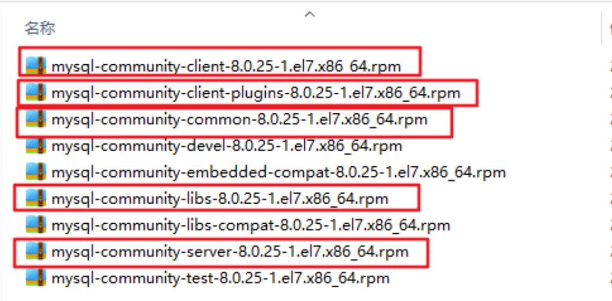
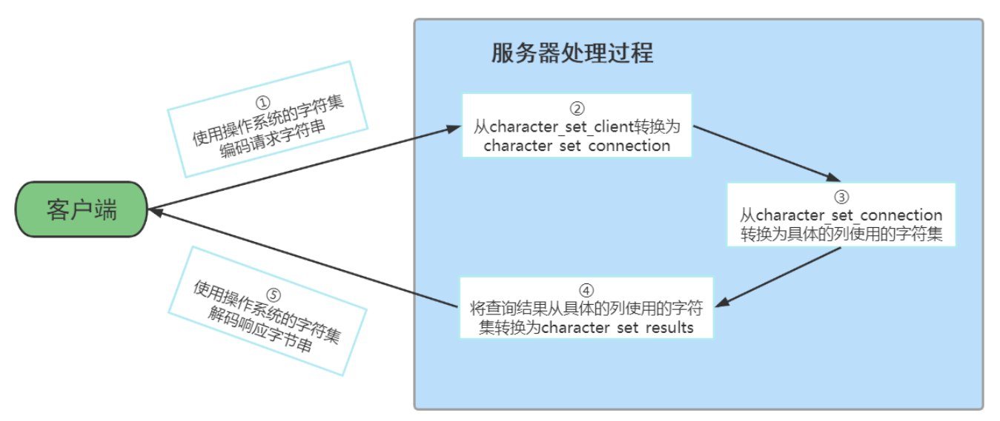
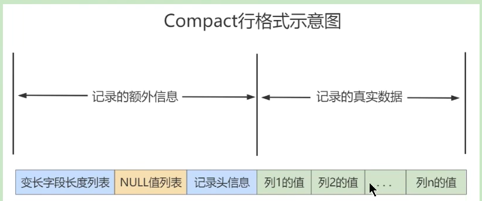

# 一、Linux下安装MySQL

## 一、查看是否安装过MySQL

1. 如果是用rpm安装，检查一下RPM PACKAGE

   ```mysql
   rpm -qa | grep -i mysql # -i 忽略大小写
   ```

2. 检查mysql service

   ```mysql
   systemctl status mysqld.service
   ```

3. 如果存在mysql-libs的旧版本，则显示旧版本的信息

4. 如果不存在mysql-libs的旧版本，则不显示任何内容

## 二、MySQL的卸载

1. 关闭MySQL服务

   ```mysql
   systemctl stop mysqld.service
   ```

2. 查看当前mysql安装状况

   ```mysql
   rpm -qa | grep -i mysql
   # 或
   yum list installed | grep mysql
   ```

3. 卸载上述命令查询出的已安装程序

   ```mysql
   yum remove mysql-xxx mysql-xxx mysql-xxx mysqk-xxxx
   #务必卸载干净，反复执行 rpm -qa | grep -i mysql 确认是否有卸载残留
   ```

4. 删除mysql相关文件

   ```mysql
   #查看相关文件
   find / -name mysql
   #删除上述命令查找出的相关文件
   rm -rf xx
   ```

5. 删除my.cnf

   ```mysql
   rm -rf /etc/my.cnf
   ```

## 三、MySQL的Linux版安装

### 一、MySQL的四大版本

```mysql
1、MySQL Community Server 社区版本，开源免费，自由下载，但不提供官方技术支持，适用于大多数普通用户。
2、MySQL Enterprise Edition 企业版本，需付费，不能在线下载，可以试用30天。提供了更多的功能和更完备的技术支持，更适合于对数据库的功能和可靠性要求较高的企业客户。
3、MySQL Cluster 集群版，开源免费。用于架设集群服务器，可将几个MySQL Server封装成一个Server。需要在社区版或企业版的基础上使用。
4、MySQL Cluster CGE 高级集群版，需付费
5、此外，官方还提供了 MySQL Workbench （GUITOOL）一款专为MySQL设计的 ER/数据库建模工具 。它是著名的数据库设计工具DBDesigner4的继任者。MySQLWorkbench又分为两个版本，分别是社区版（MySQL Workbench OSS）、商用版 （MySQL WorkbenchSE）
```

### 二、下载MySQL指定版本

1. 下载地址

   - [MySQL官网](https://www.mysql.com/)

2. 打开官网，点击DOWNLOADS

   - 点击最下方的MySQL Community(GPL) Downloads

3. 点击MySQL Community Server

4. 在General Availability(GA) Releases中选择适合的版本

   - 如果安装Windows系统下MySQL ，推荐下载MSI安装程序；点击 Go to Download Page 进行下载即可
   - Windows下的MySQL安装有两种安装程序：mysql-installer-web-community-8.0.25.0.msi，下载程序大小：2.4M，安装时需要联网安装组件；mysql-installer-community-8.0.25.0.msi，下载程序大小：435.7M，安装时离线安装即可。推荐

5. Linux系统下安装MySQL的几种方式

   - Linux系统下安装软件的常用三种方式

     ```mysql
     #方式1：rpm命令。使用rpm命令安装扩展名为".rpm"的软件包
     #方式2：yum命令。需联网，从互联网获取的yum源，直接使用yum命令安装
     #方式3：编译安装源码包。针对tar.gz这样的压缩格式，要用tar命令来解压；如果是其它压缩格式，就使用其它命令
     ```

   - Linux系统下安装MySQL，官方给出多种安装方式

     |    安装方式    |                         特点                         |
     | :------------: | :--------------------------------------------------: |
     |      rpm       |      安装简单，灵活性差，无法灵活选择版本、升级      |
     | rpm repository | 安装包极小，版本安装简单灵活，升级方便，需要联网安装 |
     |  通用二进制包  |         安装比较复杂，灵活性高，平台通用性好         |
     |     源码包     |       安装最复杂，时间长，参数设置灵活，性能好       |

     ```mysql
     #这里不能直接选择CentOS 7系统的版本，所以选择与之对应的 Red Hat Enterprise Linux
     #https://downloads.mysql.com/archives/community/ 直接点Download下载RPM Bundle全量包。包括了所有下面的组件。不需要一个一个下载了
     ```

6. 下载的tar包，用压缩工具打开，把下图中红框的包在Linux下分别安装即可

   

### 三、CentOS7下检查MySQL依赖

1. 检查/tmp临时目录的权限（必不可少）

   ```mysql
   #由于mysql安装过程中，会通过mysql用户在/tmp目录下新建tmp_db文件，所以请给/tmp较大的权限
   chmod -R 777 /tmp
   ```

2. 安装前，检查依赖

   ```mysql
   rpm -qa|grep libaio
   
   #如果存在libaio包，则执行
   rpm -qa|grep net-tools
   
   #如果存在net-tools包，则执行
   rpm -qa|grep net-tools
   
   #如果不存在需要到centos安装盘里进行rpm安装。安装linux如果带图形化界面，这些都是安装好的
   ```

### 四、CentOS7下MySQL安装过程

1. 将安装程序拷贝到/opt目录下，在mysql的安装文件目录下执行（必须按照以下顺序执行）

   ```mysql
   rpm -ivh mysql-community-common-xxxx.rpm
   rpm -ivh mysql-community-client-plugins-xxxx.rpm
   rpm -ivh mysql-community-libs-xxxx.rpm
   rpm -ivh mysql-community-client-xxxx.rpm
   rpm -ivh mysql-community-server-xxxx.rpm
   ```

   - 如在检查工作时，没有检查mysql依赖环境在安装mysql-community-server会报错
   - rpm是Redhat Package Manage缩写，通过RPM的管理，用户可以把源代码包装成以rpm为扩展名的文件形式，易于安装
   - -i, --install 安装软件包 
   - -v, --verbose 提供更多的详细信息输出
   - -h, --hash 软件包安装的时候列出哈希标记 (和 -v 一起使用效果更好)，展示进度条 

2. 安装过程可能会报的错

   ```mysql
   mariadn-libs被mysql-community-libs-xxxx.rpm取代
   则使用命令yum remove mysql-libs 解决，清除之前安装过的依赖即可
   ```

3. 查看MySQL版本

   ```mysql
   #执行如下命令，如果成功表示安装mysql成功。类似java -version如果打出版本等信息
   mysql --version
   #或
   mysqladmin --version
   
   #执行如下命令，查看是否安装成功。需要增加 -i 不用去区分大小写，否则搜索不到
   rpm -qa|grep -i mysql
   ```

4. 服务的初始化

   ```mysql
   #为了保证数据库目录与文件的所有者为 mysql 登录用户，如果你是以 root 身份运行 mysql 服务，需要执行下面的命令初始化：
   mysqld --initialize --user=mysql
   #说明： --initialize 选项默认以“安全”模式来初始化，则会为 root 用户生成一个密码并将 该密码标记为过期，登录后你需要设置一个新的密码。生成的 临时密码 会往日志中记录一份
   
   #查看密码：
   cat /var/log/mysqld.log
   #root@localhost: 后面就是初始化的密码
   ```

5. 启动MySQL，查看状态

   ```mysql
   #加不加.service后缀都可以
   启动：systemctl start mysqld.service
   关闭：systemctl stop mysqld.service
   重启：systemctl restart mysqld.service
   查看状态：systemctl status mysqld.service
   #mysqld 这个可执行文件就代表着 MySQL 服务器程序，运行这个可执行文件就可以直接启动一个服务器进程
   
   #查看进程
   ps -ef | grep -i mysql
   ```

6. 查看MySQL服务是否自启动

   ```mysql
   systemctl list-unit-files|grep mysqld.service
   #默认是enabled
   
   #如不是enabled可以运行如下命令设置自启动
   systemctl enable mysqld.service
   #如果希望不进行自启动，运行如下命令设置
   systemctl disable mysqld.service
   ```

## 四、MySQL登录

### 一、首次登录

- 通过 mysql -hlocalhost -P3306 -uroot -p 进行登录，在Enter password：录入初始化密码

### 二、修改密码

- 因为初始化密码默认是过期的，所以查看数据库会报错 

- 修改密码

  ```mysql
  ALTER USER 'root'@'localhost' IDENTIFIED BY 'new_password';
  ```

- 5.7版本之后（不含5.7），mysql加入了全新的密码安全机制。设置新密码太简单会报错

- 改为更复杂的密码规则之后，设置成功，可以正常使用数据库了

### 三、设置远程登录

#### 一、当前问题

在用SQLyog或Navicat中配置远程连接Mysql数据库时遇到如下报错信息，这是由于Mysql配置了不支持远程连接引起的

```mysql
Host 'xxxx' is not allowed to connect to this MySQL server
```

#### 二、确认网络

1. 在远程机器上使用ping ip地址 保证网络畅通

2. 在远程机器上使用telnet命令保证端口号开放访问

   ```mysql
   telnet ip地址 端口号
   ```

3. 拓展： telnet命令开启 

   - 在Windows系统中找到控制面板 -> 程序和功能 -> 启动或关闭Windows功能
   - 找到Telnet客户端，勾上即可

#### 三、关闭防火墙或开放端口

1. 关闭防火墙

   - CentOS6

     ```mysql
     service iptables stop
     ```

   - CentOS7

     ```mysql
     systemctl start firewalld.service
     systemctl status firewalld.service
     systemctl stop firewalld.service
     #设置开机启用防火墙
     systemctl enable firewalld.service
     #设置开机禁用防火墙
     systemctl disable firewalld.service
     ```

2. 开放端口

   - 查看开放的端口号

     ```mysql
     firewall-cmd --list-all
     ```

   - 设置开放的端口号

     ```mysql
     firewall-cmd --add-service=http --permanent
     firewall-cmd --add-port=3306/tcp --permanent
     ```

   - 重启防火墙

     ```mysql
     firewall-cmd --reload
     ```

#### 四、Linux下修改配置

在Linux系统MySQL下测试

```mysql
use mysql;
select Host,User from user;
#可以看到root用户的当前主机配置信息为localhost

update user set host = '%' where user ='root';
#Host设置了“%”后便可以允许远程访问

flush privileges;
#Host修改完成后记得执行flush privileges使配置立即生效：
```

1. 修改Host为通配符%
2. Host列指定了允许用户登录所使用的IP，比如user=root Host=192.168.1.1。这里的意思就是说root用户只能通过192.168.1.1的客户端去访问。 user=root Host=localhost，表示只能通过本机客户端去访问。而 % 是个通配符，如果Host=192.168.1.%，那么就表示只要是IP地址前缀为“192.168.1.”的客户端都可以连接。如果 Host=%，表示所有IP都有连接权限 
3. 在生产环境下不能为了省事将host设置为%，这样做会存在安全问题，具体的设置可以根据生产环境的IP进行设置

#### 五、其他问题

如果是MySQL8版本中，连接时还可能出现如下情况

```mysql
Plugin caching_sha2_password could not be loaded:乱码
#配置新连接报错：错误号码 2058，分析是 mysql 密码加密方法变了

#解决方法：Linux下 mysql -u root -p 登录你的 mysql 数据库，然后执行这条SQL
ALTER USER 'root'@'%' IDENTIFIED WITH mysql_native_password BY 'new_password';
#其中mysql_native_password是MySQL数据库中一种身份验证插件，用于对用户进行身份验证
#然后在重新配置SQLyog的连接，则可连接成功了
```

### 四、MySQL8密码强度评估

#### 一、MySQL8之前安全策略

在MySQL 8.0之前，MySQL使用的是validate_password插件检测、验证账号密码强度，保障账号的安全性

1. 安装/启用插件方式1：在参数文件my.cnf中添加参数

   ```mysql
   [mysqld]
   plugin-load-add=validate_password.so
   \#ON/OFF/FORCE/FORCE_PLUS_PERMANENT: 是否使用该插件(及强制/永久强制使用)
   validate-password=FORCE_PLUS_PERMANENT
   
   #说明1： plugin library中的validate_password文件名的后缀名根据平台不同有所差异。 对于Unix和Unix-like系统而言，它的文件后缀名是.so，对于Windows系统而言，它的文件后缀名是.dll。
   #说明2： 修改参数后必须重启MySQL服务才能生效。
   #说明3： 参数FORCE_PLUS_PERMANENT是为了防止插件在MySQL运行时的时候被卸载。当你卸载插件时就会报错
   ```

2. 安装/启用插件方式2：运行时命令安装（推荐）

   ```mysql
   INSTALL PLUGIN validate_password SONAME 'validate_password.so'
   #此方法也会注册到元数据，也就是mysql.plugin表中，所以不用担心MySQL重启后插件会失效
   ```

#### 二、MySQL8安全策略

1. validate_password说明

   - MySQL 8.0，引入了服务器组件（Components）这个特性，validate_password插件已用服务器组件重新实现。8.0.25版本的数据库中，默认自动安装validate_password组件

   - 安装插件前后对比效果

     ```mysql
     show variables like 'validate_password%';
     SELECT * FROM mysql.component;
     #未安装插件前，执行这两个语句均无内容输出；安装插件后，执行这两个语句有内容输出
     #组件和插件的默认值可能有所不同。例如，MySQL 5.7. validate_password_check_user_name的默认值为OFF
     ```

   - 关于 validate_password 组件对应的系统变量说明

     |                 选项                 | 默认值 |                           参数描述                           |
     | :----------------------------------: | :----: | :----------------------------------------------------------: |
     |  validate_password_check_user_name   |   ON   |          设置为ON的时候表示能将密码设置成当前用户名          |
     |  validate_password_dictionary_file   |        |           用于检查密码的字典文件的路径名，默认为空           |
     |       validate_password_length       |   8    |       密码的最小长度，也就是说密码长度必须大于或等于8        |
     |  validate_password_mixed_case_count  |   1    | 如果密码策略是中等或更强的，validate_password要求密码具有的小写和大写字符的最小数量。对于给定的这个值密码必须有那么多小写字符和那么多大写字符 |
     |    validate_password_number_count    |   1    |                    密码必须包含的数字个数                    |
     |       validate_password_policy       | MEDIUM | 密码强度检验等级，可以使用数值0、1、2或相应的符号值LOW、MEDIUM、STRONG来指定。0/LOW：只检查长度；1/MEDIUM：检查长度、数字、大小写、特殊字符；2/STRONG ：检查长度、数字、大小写、特殊字符、字典文件 |
     | validate_password_special_char_count |   1    |                  密码必须包含的特殊字符个数                  |

2. 修改安全策略

   ```mysql
   SET GLOBAL validate_password_policy=LOW;
   SET GLOBAL validate_password_policy=MEDIUM;
   SET GLOBAL validate_password_policy=STRONG;
   SET GLOBAL validate_password_policy=0; # For LOW
   SET GLOBAL validate_password_policy=1; # For MEDIUM
   SET GLOBAL validate_password_policy=2; # For HIGH
   #注意，如果是插件的话,SQL为set global validate_password_policy=LOW
   set global validate_password_length=1;
   #可以修改密码中字符的长度
   ```

3. 密码强度测试

   如果你创建密码是遇到“Your password does not satisfy the current policy requirements”，可以通过函数组件去检测密码是否满足条件： 0-100。当评估在100时就是说明使用上了最基本的规则：大写+小写+特殊字符+数字组成的8位以上密码 

   ```mysql
   SELECT VALIDATE_PASSWORD_STRENGTH('aaaaaa');
   SELECT VALIDATE_PASSWORD_STRENGTH('K354*45jKd5');
   #如果没有安装validate_password组件或插件的话，那么这个函数永远都返回0。 关于密码复杂度对应的密码复杂度策略
   ```

#### 三、卸载插件、组件

```mysql
#卸载插件
UNINSTALL PLUGIN validate_password;

#卸载组件
UNINSTALL COMPONENT 'file://component_validate_password';
```

## 五、字符集相关操作

### 一、修改MySQL5.7字符集

#### 一、修改步骤

在MySQL 8.0版本之前，默认字符集为 latin1 ，utf8字符集指向的是 utf8mb3 。网站开发人员在数据库设计的时候往往会将编码修改为utf8字符集。如果遗忘修改默认的编码，就会出现乱码的问题。从MySQL8.0开始，数据库的默认编码将改为utf8mb4 ，从而避免上述乱码的问题

1. 查看默认使用的字符集

   ```mysql
   show variables like 'character%';
   # 或者
   show variables like '%char%';
   ```

2. 修改字符集

   ```mysql
   vim /etc/my.cnf
   #在MySQL5.7或之前的版本中，在文件最后加上中文字符集配置
   character_set_server=utf8
   ```

3. 重新启动MySQL服务

   ```mysql
   systemctl restart mysqld
   #但是原库、原表的设定不会发生变化，参数修改只对新建的数据库生效
   ```

#### 二、已有库/表字符集的变更

```mysql
#MySQL5.7版本中，以前创建的库，创建的表字符集还是latin1
#修改已创建数据库的字符集
alter database dbtest1 character set 'utf8';
#修改已创建数据表的字符集
alter table t_emp convert to character set 'utf8';

#注意：但是原有的数据如果是用非'utf8'编码的话，数据本身编码不会发生改变。已有数据需要导出或删除，然后重新插入
```

### 二、各级别的字符集

```mysql
show variables like 'character%';

#character_set_server：服务器级别的字符集
#character_set_database：当前数据库的字符集
#character_set_client：服务器解码请求时使用的字符集
#character_set_connection：服务器处理请求时会把请求字符串从character_set_client转为
#character_set_connection
#character_set_results：服务器向客户端返回数据时使用的字符集
```

1. 服务器级别

   - character_set_server：服务器级别的字符集

   - 可以在启动服务器程序时通过启动选项或者在服务器程序运行过程中使用 SET 语句修改这两个变量的值。比如我们可以在配置文件中这样写。当服务器启动的时候读取这个配置文件后这两个系统变量的值便修改了

     ```mysql
     [server]
     character_set_server=gbk # 默认字符集
     collation_server=gbk_chinese_ci #对应的默认的比较规则
     ```

2. 数据库级别

   - character_set_database ：当前数据库的字符集

   - 我们在创建和修改数据库的时候可以指定该数据库的字符集和比较规则

     ```mysql
     CREATE DATABASE 数据库名
     [[DEFAULT] CHARACTER SET 字符集名称]
     [[DEFAULT] COLLATE 比较规则名称];
     ALTER DATABASE 数据库名
     [[DEFAULT] CHARACTER SET 字符集名称]
     [[DEFAULT] COLLATE 比较规则名称];
     ```

3. 表级别

   - 可以在创建和修改表的时候指定表的字符集和比较规则

     ```mysql
     CREATE TABLE 表名 (列的信息)
     [[DEFAULT] CHARACTER SET 字符集名称]
     [COLLATE 比较规则名称]]
     ALTER TABLE 表名
     [[DEFAULT] CHARACTER SET 字符集名称]
     [COLLATE 比较规则名称]
     #如果创建和修改表的语句中没有指明字符集和比较规则，将使用该表所在数据库的字符集和比较规则作为该表的字符集和比较规则
     ```

4. 列级别

   - 对于存储字符串的列，同一个表中的不同的列也可以有不同的字符集和比较规则。我们在创建和修改列定义的时候可以指定该列的字符集和比较规则，语法如下： 

     ```mysql
     CREATE TABLE 表名(
     列名 字符串类型 [CHARACTER SET 字符集名称] [COLLATE 比较规则名称],
     其他列...
     );
     ALTER TABLE 表名 MODIFY 列名 字符串类型 [CHARACTER SET 字符集名称] [COLLATE 比较规则名称];
     #对于某个列来说，如果在创建和修改的语句中没有指明字符集和比较规则，将使用该列所在表的字符集和比较规则作为该列的字符集和比较规则
     #在转换列的字符集时需要注意，如果转换前列中存储的数据不能用转换后的字符集进行表示会发生错误。比方说原先列使用的字符集是utf8，列中存储了一些汉字，现在把列的字符集转换为ascii的话就会出错，因为ascii字符集并不能表示汉字字符
     ```

5. 小结

   - 如果创建或修改列时没有显式的指定字符集和比较规则，则该列默认用表的字符集和比较规则
   - 如果创建表时没有显式的指定字符集和比较规则，则该表默认用数据库的字符集和比较规则
   - 如果创建数据库时没有显式的指定字符集和比较规则，则该数据库默认用服务器的字符集和比较规则

### 三、字符集与比较规则

#### 一、utf8与utf8mb4

utf8 字符集表示一个字符需要使用1～4个字节，但是我们常用的一些字符使用1～3个字节就可以表示了。而字符集表示一个字符所用的最大字节长度，在某些方面会影响系统的存储和性能，所以设计MySQL的设计者偷偷的定义了两个概念

- utf8mb3：阉割过的 utf8 字符集，只使用1～3个字节表示字符
- utf8mb4：正宗的 utf8 字符集，使用1～4个字节表示字符

#### 二、比较规则

MySQL版本一共支持41种字符集，其中的 Default collation 列表示这种字符集中一种默认 的比较规则，里面包含着该比较规则主要作用于哪种语言，比如 utf8_polish_ci 表示以波兰语的规则比较， utf8_spanish_ci 是以西班牙语的规则比较， utf8_general_ci 是一种通用的比较规则

后缀表示该比较规则是否区分语言中的重音、大小写

| 后缀 |      英文释义      |       描述       |
| :--: | :----------------: | :--------------: |
| _ai  | accent insensitive |    不区分重音    |
| _as  |  accent sensitive  |     区分重音     |
| _ci  |  case insensitive  |   不区分大小写   |
| _cs  |   case sensitive   |    区分大小写    |
| _bin |       binary       | 以二进制方式比较 |

最后一列 Maxlen ，它代表该种字符集表示一个字符最多需要几个字节

1. 查看字符集的比较规则

   ```mysql
   #查看GBK字符集的比较规则
   SHOW COLLATION LIKE 'gbk%';
   #查看UTF-8字符集的比较规则
   SHOW COLLATION LIKE 'utf8%';
   ```

2. 查看服务器/数据库的字符集和比较规则

   ```mysql
   #查看服务器的字符集和比较规则
   SHOW VARIABLES LIKE '%_server';
   #查看数据库的字符集和比较规则
   SHOW VARIABLES LIKE '%_database';
   #查看具体数据库的字符集
   SHOW CREATE DATABASE dbtest1;
   #修改具体数据库的字符集
   ALTER DATABASE dbtest1 DEFAULT CHARACTER SET 'utf8' COLLATE 'utf8_general_ci';
   ```

3. 查看表的字符集和比较规则

   ```mysql
   #查看表的字符集
   show create table employees;
   #查看表的比较规则
   show table status from atguigudb like 'employees';
   #修改表的字符集和比较规则
   ALTER TABLE emp1 DEFAULT CHARACTER SET 'utf8' COLLATE 'utf8_general_ci';
   ```

### 四、请求到响应过程中字符集的变化

这几个系统变量在不同操作系统的默认值可能不同

|         系统变量         |                             描述                             |
| :----------------------: | :----------------------------------------------------------: |
|   character_set_client   |                 服务器解码请求时使用的字符集                 |
| character_set_connection | 服务器处理请求时会把请求字符串从character_set_client 转为 character_set_connection |
|  character_set_results   |             服务器向客户端返回数据时使用的字符集             |



## 六、SQL大小写规范

### 一、Windows和Linux平台区别

1. 在 SQL 中，关键字和函数名是不用区分字母大小写的，比如 SELECT、WHERE、ORDER、GROUP BY 等关键字，以及 ABS、MOD、ROUND、MAX 等函数名

2. 不过在 SQL 中，你还是要确定大小写的规范，因为在 Linux 和 Windows 环境下，你可能会遇到不同的大小写问题

   ```mysql
   SHOW VARIABLES LIKE '%lower_case_table_names%'
   #输出字段lower_case_table_names在Windows下的值为1；在Linux下的值0
   #lower_case_table_names默认为0，大小写敏感
   #设置1，大小写不敏感。创建的表，数据库都是以小写形式存放在磁盘上，对于sql语句都是转换为小写对表和数据库进行查找
   #设置2，创建的表和数据库依据语句上格式存放，凡是查找都是转换为小写进行
   ```

   - windows系统默认大小写不敏感
   - linux系统是大小写敏感的

   ```mysql
   #MySQL在Linux下数据库名、表名、列名、别名大小写规则是这样的：
   1、数据库名、表名、表的别名、变量名是严格区分大小写的；
   2、关键字、函数名称在 SQL 中不区分大小写；
   3、列名（或字段名）与列的别名（或字段别名）在所有的情况下均是忽略大小写的；
   
   #MySQL在Windows的环境下全部不区分大小写
   ```

### 二、Linux下大小写规则设置

当想设置为大小写不敏感时，要在 my.cnf 这个配置文件 [mysqld] 中加入lower_case_table_names=1 ，然后重启服务器

- 但是要在重启数据库实例之前就需要将原来的数据库和表转换为小写，否则将找不到数据库名

- 此参数适用于MySQL5.7。在MySQL 8下禁止在重新启动 MySQL 服务时将lower_case_table_names设置成不同于初始化 MySQL 服务时设置的lower_case_table_names值。如果非要将MySQL8设置为大小写不敏感，具体步骤为：

  ```mysql
  1、停止MySQL服务
  2、删除数据目录，即删除 /var/lib/mysql 目录
  3、在MySQL配置文件（ /etc/my.cnf ）中添加 lower_case_table_names=1
  4、启动MySQL服务
  ```

### 三、SQL编写建议

- 关键字和函数名称全部大写
- 数据库名、表名、表别名、字段名、字段别名等全部小写
- SQL 语句必须以分号结尾

## 七、sql_mode的合理设置

1. 宽松模式

   - 如果设置的是宽松模式，那么我们在插入数据的时候，即便是给了一个错误的数据，也可能会被接受，并且不报错
   - 应用场景：通过设置sql mode为宽松模式，来保证大多数sql符合标准的sql语法，这样应用在不同数据库之间进行 迁移时，则不需要对业务sql进行较大的修改

2. 严格模式

   - 出现上面宽松模式的错误，应该报错才对，所以MySQL5.7版本就将sql_mode默认值改为了严格模式。所以在 生产等环境 中，我们必须采用的是严格模式，进而开发、测试环境的数据库也必须要设置，这样在开发测试阶段就可以发现问题。并且我们即便是用的MySQL5.6，也应该自行将其改为严格模式
   - 开发经验：MySQL等数据库总想把关于数据的所有操作都自己包揽下来，包括数据的校验，其实开发中，我们应该在自己 开发的项目程序级别将这些校验给做了 ，虽然写项目的时候麻烦了一些步骤，但是这样做之后，我们在进行数据库迁移或者在项目的迁移时，就会方便很多
   - 改为严格模式可能存在的问题：若设置模式中包含了NO_ZERO_DATE，那么MySQL数据库不允许插入零日期，插入零日期会抛出错误而不是警告。例如，表中含字段TIMESTAMP列（如果未声明为NULL或显示DEFAULT子句）将自动分配DEFAULT '0000-00-00 00:00:00'（零时间戳），这显然是不满足sql_mode中的NO_ZERO_DATE而报错

3. 模式查看与设置

   - 查看当前的sql_mode

     ```mysql
     select @@session.sql_mode
     select @@global.sql_mode
     
     #或者
     show variables like 'sql_mode';
     ```

   - 临时设置方式：设置当前窗口中设置sql_mode

     ```mysql
     SET GLOBAL sql_mode = 'modes...'; #全局
     SET SESSION sql_mode = 'modes...'; #当前会话
     
     #改为严格模式。此方法只在当前会话中生效，关闭当前会话就不生效了。
     set SESSION sql_mode='STRICT_TRANS_TABLES';
     #改为严格模式。此方法在当前服务中生效，重启MySQL服务后失效。
     set GLOBAL sql_mode='STRICT_TRANS_TABLES';
     ```

   - 永久设置方式：在/etc/my.cnf中配置sql_mode

     在my.cnf文件(windows系统是my.ini文件)，新增以下内容后重启。

     ```mysql
     [mysqld]
     sql_mode=ONLY_FULL_GROUP_BY,STRICT_TRANS_TABLES,NO_ZERO_IN_DATE,NO_ZERO_DATE,ERROR_FOR
     _DIVISION_BY_ZERO,NO_ENGINE_SUBSTITUTION
     ```

     当然生产环境上是禁止重启MySQL服务的，所以采用 临时设置方式 + 永久设置方式 来解决线上的问题， 

     那么即便是有一天真的重启了MySQL服务，也会永久生效了

# 二、MySQL的数据目录

## 一、MySQL8的主要目录结构

```mysql
find / -name mysql
#查看mysql相关的文件
```

1. 数据库文件的存放路径：/var/lib/mysql/

   ```mysql
   #数据库文件的存放路径的sql
   show variables like 'datadir';
   ```

2. 相关命令目录：/usr/bin（mysqladmin、mysqlbinlog、mysqldump等命令）和/usr/sbin

   ```mysql
   #切换到相应的目录
   cd /usr/bin
   #查看相关的命令
   find . -name "mysqladmin"
   ```

3. 配置文件目录：配置文件目录：/usr/share/mysql-8.0（命令及配置文件），/etc/mysql（如my.cnf）

## 二、数据库和文件系统的关系

### 一、查看默认数据库

```mysql
SHOW DATABASES;
```

1. mysql
   - MySQL 系统自带的核心数据库，它存储了MySQL的用户账户和权限信息，一些存储过程、事件的定义信息，一些运行过程中产生的日志信息，一些帮助信息以及时区信息等
2. information_schema
   - MySQL 系统自带的数据库，这个数据库保存着MySQL服务器 维护的所有其他数据库的信息 ，比如有哪些表、哪些视图、哪些触发器、哪些列、哪些索引。这些信息并不是真实的用户数据，而是一些 描述性信息，有时候也称之为元数据。在系统数据库 information_schema 中提供了一些以innodb_sys 开头的表，用于表示内部系统表
3. performance_schema
   - MySQL系统自带的数据库，这个数据库里主要保存MySQL服务器运行过程中的一些状态信息，可以用来监控MySQL服务的各类性能指标 。包括统计最近执行了哪些语句，在执行过程的每个阶段都花费了多长时间，内存的使用情况等信息
4. sys
   - MySQL 系统自带的数据库，这个数据库主要是通过视图的形式把 information_schema和performance_schema 结合起来，帮助系统管理员和开发人员监控 MySQL 的技术性能

### 二、数据库在文件系统中的表示

```mysql
 cd /var/lib/mysql
 #可能每个人的安装目录会有所不同，导致此目录会有所不同
 ll
 #查看此文件夹下所有的文件及文件夹
 #这个数据目录下的文件和子目录比较多，除了 information_schema 这个系统数据库外，其他的数据库在数据目录下都有对应的子目录
```

### 三、表在文件系统中的表示

#### 一、InnoDB存储引擎模式

1. 表结构

   - 为了保存表结构，InnoDB在数据目录（数据库文件夹）下对应的数据库子目录下创建了一个专门用于描述表结构的文件 ，文件后缀名为 表名.frm
   - .frm文件的格式在不同的平台上都是相同的。这个后缀名为.frm是以二进制格式存储的，我们直接打开是乱码的

2. 表中数据和索引

   - 系统表空间（system tablespace）：默认情况下，InnoDB会在数据目录下创建一个名为 ibdata1 、大小为 12M 的文件，这个文件就是对应的系统表空间在文件系统上的表示。默认大小为12M，注意这个文件是自扩展文件，当不够用的时候它会自己增加文件大小

     如果你想让系统表空间对应文件系统上多个实际文件，或者仅仅觉得原来的 ibdata1 这个文件名难听，那可以在MySQL启动时配置对应的文件路径以及它们的大小，比如修改一下my.cnf 配置文件

     ```mysql
     [server]
     innodb_data_file_path=data1:512M;data2:512M:autoextend
     ```

   - 独立表空间（file-per-table tablespace）：在MySQL5.6.6以及之后的版本中，InnoDB并不会默认的把各个表的数据存储到系统表空间中，而是为每一个表建立一个独立表空间，也就是说我们创建了多少个表，就有多少个独立表空间。使用独立表空间来存储表数据的话，会在该表所属数据库对应的子目录下创建一个表示该独立表空间的文件，文件名和表名相同，只不过添加了一个.ibd 的扩展名而已，所以完整的文件名称长这样：表名.ibd 

     如果我们使用了独立表空间去存储对应数据库下表的话，那么在该表所在的数据库对应的目录下会为该表创建两个文件，分别为 表名.frm和 表名.ibd。其中表名.ibd文件就用来存储表中的数据和索引

   - 系统表空间与独立表空间的设置：我们可以自己指定使用 系统表空间 还是 独立表空间 来存储数据，这个功能由启动参数 innodb_file_per_table 控制，比如说我们想刻意将表数据都存储到 系统表空间 时，可以在启动 MySQL服务器的时候这样配置：

     ```mysql
     [server]
     innodb_file_per_table=0 # 0：代表使用系统表空间； 1：代表使用独立表空间
     ```

   - 其他类型的表空间：随着MySQL的发展，除了上述两种老牌表空间之外，现在还新提出了一些不同类型的表空间，比如通用 表空间（general tablespace）、临时表空间（temporary tablespace）等

#### 二、MyISAM存储引擎模式

1. 表结构

   - 在存储表结构方面，MyISAM和InnoDB一样，也是在数据目录下对应的数据库子目录下创建了一个专门用于描述表结构的文件：表名.frm

2. 表中数据和索引

   - 在MyISAM中的索引全部都是二级索引 ，该存储引擎的 数据和索引是分开存放 的。所以在文件系统中也是使用不同的文件来存储数据文件和索引文件，同时表数据都存放在对应的数据库子目录下。假如某个表使用MyISAM存储引擎的话，那么在它所在数据库对应的目录下会为该表创建这三个文件： 

     ```mysql
     .frm 存储表结构
     .MYD 存储数据 (MYData)
     .MYI 存储索引 (MYIndex)
     ```

#### 三、小结

有数据库a，表b

1. 如果表b采用InnoDB，data（/var/lib/mysql）\a中会产生1个或者2个文件：
   - b.frm：描述表结构文件，字段长度等
   - 如果采用系统表空间模式的，数据信息和索引信息都存储在ibdata1中
   - 如果采用 独立表空间存储模式，data（/var/lib/mysql）\a中还会产生b.ibd文件（存储数据信息和索引信息） 
   - 此外，MySQL5.7中会在data（/var/lib/mysql）/a的目录下生成 db.opt 文件用于保存数据库的相关配置。比如：字符集、比较规则。而MySQL8.0不再提供db.opt文件。 MySQL8.0中不再单独提供b.frm，而是合并在b.ibd文件中
2. 如果表b采用MyISAM ，data（/var/lib/mysql）\a中会产生3个文件：
   - MySQL5.7中：b.frm为描述表结构文件，字段长度等；MySQL8.0 中 b.xxx.sdi：描述表结构文件，字段长度等
   - b.MYD (MYData)：数据信息文件，存储数据信息(如果采用独立表存储模式)
   - b.MYI (MYIndex)：存放索引信息文件 

# 三、用户与权限管理

## 一、用户管理

### 一、登录MySQL服务器

```mysql
mysql –h hostname|hostIP –P port –u username –p DatabaseName –e "SQL语句"
```

1. -h参数：后面接主机名或者主机IP，hostname为主机，hostIP为主机IP
2. -P参数：后面接MySQL服务的端口，通过该参数连接到指定的端口。MySQL服务的默认端口是3306，不使用该参数时自动连接到3306端口，port为连接的端口号
3. -u参数：后面接用户名，username为用户名，默认为root
4. -p参数：会提示输入密码
5. DatabaseName参数：指明登录到哪一个数据库中。如果没有该参数，就会直接登录到MySQL数据库中，然后可以使用USE命令来选择数据库
6. -e参数：后面可以直接加SQL语句。登录MySQL服务器以后即可执行这个SQL语句，然后退出MySQL服务器

### 二、创建用户

```mysql
CREATE USER 用户名 [IDENTIFIED BY '密码'][,用户名 [IDENTIFIED BY '密码']];

#示例
CREATE USER zhang3 IDENTIFIED BY '123123'; # 默认host是 %，表示任何地方可以访问到
CREATE USER 'kangshifu'@'localhost' IDENTIFIED BY '123456'; #表示localhost只能本地访问
```

1. 用户名参数表示新建用户的账户，由用户（User）和主机名（Host）构成，而且User和Host同时校验才能确定用户的唯一性
2.  “[ ]”表示可选，也就是说，可以指定用户登录时需要密码验证，也可以不指定密码验证，这样用户可以直接登录。不过，不指定密码的方式不安全，不推荐使用。如果指定密码值，这里需要使用 IDENTIFIED BY指定明文密码值
3. CREATE USER语句可以同时创建多个用户

### 三、修改用户

```mysql
UPDATE mysql.user SET USER = 新名称 WHERE USER = 旧名称
```

### 四、删除用户

1. 使用DROP方式删除（推荐）：使用DROP USER语句来删除用户时，必须用于DROP USER权限

   ```mysql
   DROP USER user[,user]…;
   
   ## 默认删除host为%的用户，也可以指明host
   DROP USER 'USER'@'HOST';
   ```

2. 使用DELETE方式删除

   ```mysql
   DELETE FROM mysql.user WHERE Host=’hostname’ AND User=’username’;
   #执行完DELETE命令后要使用FLUSH命令来使用户生效
   FLUSH PRIVILEGES;
   
   #注意：不推荐通过 DELETE FROM USER u WHERE USER='li4' 进行删除，系统会有残留信息留。而drop user命令会删除用户以及对应的权限，执行命令后你会发现mysql.user表和mysql.db表的相应记录都消失了
   ```

### 五、设置当前用户密码

1. 使用旧的写法，不推荐使用

   ```mysql
   # 修改当前用户的密码：（MySQL5.7测试有效）
   SET PASSWORD = PASSWORD('123456');
   ```

2. 使用ALTER USER命令来修改当前用户密码：用户可以使用ALTER命令来修改自身密码，如下语句代表修改当前登录用户的密码

   ```mysql
   ALTER USER USER() IDENTIFIED BY 'new_password';
   ```

3. 使用SET语句来修改当前用户密码：使用root用户登录MySQL后，可以使用SET语句来修改密码

   ```mysql
   SET PASSWORD='new_password';
   #该语句会自动将密码加密后再赋给当前用户
   ```

### 六、修改其他用户密码

1. 使用ALTER语句来修改普通用户的密码：可以使用ALTER USER语句来修改普通用户的密码

   ```mysql
   ALTER USER user [IDENTIFIED BY '新密码'][,user[IDENTIFIED BY '新密码']]…;
   ```

2. 使用SET命令来修改普通用户的密码：使用root用户登录到MySQL服务器后，可以使用SET语句来修改普通用户的密码

   ```mysql
   SET PASSWORD FOR 'username'@'hostname'='new_password';
   ```

3. 使用UPDATE语句修改普通用户的密码（不推荐）

   ```mysql
   UPDATE MySQL.user SET authentication_string=PASSWORD("新密码") WHERE User = "username" AND Host = "hostname";
   ```

## 二、权限管理

### 一、权限列表

```mysql
 show privileges;
 #查看权限列表
```

1. CREATE和DROP权限 ，可以创建新的数据库和表，或删除（移掉）已有的数据库和表。如果将MySQL数据库中的DROP权限授予某用户，用户就可以删除MySQL访问权限保存的数据库
2. SELECT、INSERT、UPDATE和DELETE权限 允许在一个数据库现有的表上实施操作
3. SELECT权限只有在它们真正从一个表中检索行时才被用到
4. INDEX权限允许创建或删除索引，INDEX适用于已有的表。如果具有某个表的CREATE权限，就可以在CREATE TABLE语句中包括索引定义
5. ALTER权限可以使用ALTER TABLE来更改表的结构和重新命名表
6. CREATE ROUTINE权限 用来创建保存的程序（函数和程序），ALTER ROUTINE权限用来更改和删除保存的程序， EXECUTE权限 用来执行保存的程序
7. GRANT权限 允许授权给其他用户，可用于数据库、表和保存的程序
8. FILE权限使用户可以使用LOAD DATA INFILE和SELECT ... INTO OUTFILE语句读或写服务器上的文件，任何被授予FILE权限的用户都能读或写MySQL服务器上的任何文件（说明用户可以读任何数据库目录下的文件，因为服务器可以访问这些文件）

### 二、授予权限的原则

1. 只授予能 满足需要的最小权限 ，防止用户干坏事。比如用户只是需要查询，那就只给select权限就可以了，不要给用户赋予update、insert或者delete权限
2. 创建用户的时候限制用户的登录主机 ，一般是限制成指定IP或者内网IP段
3. 为每个用户设置满足密码复杂度的密码
4. 定期清理不需要的用户，回收权限或者删除用户

### 三、授予权限

1. 给用户授权的方式有 2 种，分别是通过把 角色赋予用户给用户授权 和 直接给用户授权 。用户是数据库的使用者，我们可以通过给用户授予访问数据库中资源的权限，来控制使用者对数据库的访问，消除安全隐患

2. 授权命令

   ```mysql
   GRANT 权限1,权限2,…权限n ON 数据库名称.表名称 TO 用户名@用户地址 [IDENTIFIED BY ‘密码口令’];
   
   #示例
   GRANT SELECT,INSERT,DELETE,UPDATE ON 数据库名称.* TO 用户名@主机名（或%）;
   GRANT ALL PRIVILEGES ON *.* TO joe@'%' IDENTIFIED BY '123';
   ```

   - 该权限如果发现没有该用户，则会直接新建一个用户
   - ALL PRIVILEGES这里唯独不包括grant的权限 

### 四、查看权限

1. 查看当前用户权限

   ```mysql
   SHOW GRANTS;
   # 或
   SHOW GRANTS FOR CURRENT_USER;
   # 或
   SHOW GRANTS FOR CURRENT_USER();
   ```

2. 查看某用户的全局权限

   ```mysql
   SHOW GRANTS FOR '用户名称'@'主机地址' ;
   ```

### 五、收回权限

1. 收回权限就是取消已经赋予用户的某些权限。收回用户不必要的权限可以在一定程度上保证系统的安全性

2. MySQL中使用 REVOKE语句 取消用户的某些权限。使用REVOKE收回权限之后，用户账户的记录将从db、host、tables_priv和columns_priv表中删除，但是用户账户记录仍然在user表中保存（删除user表中的账户记录使用DROP USER语句）。所以在将用户账户从user表删除之前，应该收回相应用户的所有权限

3. 注意点，须用户重新登录后才能生效

4. 收回权限命令

   ```mysql
   REVOKE 权限1,权限2,…权限n ON 数据库名称.表名称 FROM 用户名@用户地址;
   
   #收回全库全表的所有权限
   REVOKE ALL PRIVILEGES ON *.* FROM 用户名@用户地址;
   ```

## 三、权限表

### 一、user表

user表是MySQL中最重要的一个权限表， 记录用户账号和权限信息。这些字段可以分成4类，分别是范围列（或用户列）、权限列、安全列和资源控制列

#### 一、范围列（或用户列）

1. host：表示连接类型
   - %：表示所有远程通过 TCP方式的连接 
   - IP地址：通过制定ip地址进行的TCP方式的连接
   - 机器名：通过制定网络中的机器名进行的TCP方式的连接
   - ::1：IPv6的本地ip地址，等同于IPv4的 127.0.0.1 
   - localhost：本地方式通过命令行方式的连接 ，比如mysql -u xxx -p xxx 方式的连接
2. user：表示用户名，同一用户通过不同方式链接的权限是不一样的
3. password：密码
   - 所有密码串通过 password(明文字符串) 生成的密文字符串。MySQL 8.0 在用户管理方面增加了角色管理，默认的密码加密方式也做了调整，由之前的SHA1改为了SHA2，不可逆 。同时加上 MySQL 5.7 的禁用用户和用户过期的功能
   - mysql 5.7及之后版本的密码保存到authentication_string字段中不再使用password字段

#### 二、权限列

1. Grant_priv字段：表示是否拥有GRANT权限 
2. Shutdown_priv字段：表示是否拥有停止MySQL服务的权限
3. Super_priv字段：表示是否拥有超级权限
4. Execute_priv字段 ：表示是否拥有EXECUTE权限。拥有EXECUTE权限，可以执行存储过程和函数
5. Select_priv , Insert_priv等：为该用户所拥有的权限

#### 三、安全列

- 安全列只有6个字段，其中两个是ssl相关的（ssl_type、ssl_cipher），用于 加密 ；两个是x509相关的（x509_issuer、x509_subject），用于 标识用户 ；另外两个Plugin字段用于 验证用户身份 的插件，该字段不能为空。如果该字段为空，服务器就使用内建授权验证机制验证用户身份

#### 四、资源控制列

1. max_questions：用户每小时允许执行的查询操作次数
2. max_updates：用户每小时允许执行的更新操作次数
3. max_connections：用户每小时允许执行的连接操作次数
4. max_user_connections：用户允许同时建立的连接次数

### 二、db表

#### 一、用户列

db表用户列有3个字段，分别是Host、User、Db。这3个字段分别表示主机名、用户名和数据库名。表示从某个主机连接某个用户对某个数据库的操作权限，这3个字段的组合构成了db表的主键

#### 二、权限列

Create_routine_priv和Alter_routine_priv这两个字段决定用户是否具有创建和修改存储过程的权限

### 三、tables_priv表和columns_priv表

1. tables_priv表用来对表设置操作权限，columns_priv表用来对表的 某一列设置权限
2. tables_priv表有8个字段，分别是Host、Db、User、Table_name、Grantor、Timestamp、Table_priv和Column_priv
   - Host 、 Db 、 User 和 Table_name 四个字段分别表示主机名、数据库名、用户名和表名
   - Grantor表示修改该记录的用户
   - Timestamp表示修改该记录的时间
   - Table_priv 表示对象的操作权限。包括Select、Insert、Update、Delete、Create、Drop、Grant、 References、Index和Alter
   - Column_priv字段表示对表中的列的操作权限，包括Select、Insert、Update和References

### 四、procs_priv表

procs_priv表可以对存储过程和存储函数设置操作权限

## 四、角色管理

### 一、角色的理解

- 引入角色的目的是 方便管理拥有相同权限的用户 。恰当的权限设定，可以确保数据的安全性，这是至关重要的

### 二、创建角色

1. 角色名称的命名规则和用户名类似。如果host_name省略，默认为%，role_name不可省略，不可为空

2. 创建角色语句

   ```mysql
   CREATE ROLE 'role_name'[@'host_name'] [,'role_name'[@'host_name']]...
   ```

### 三、赋予角色权限

```mysql
GRANT privileges ON table_name TO 'role_name'[@'host_name'];
```

1. 创建角色之后，默认这个角色是没有任何权限的，我们需要给角色授权，系统就会自动给你一个“ USAGE ”权限
2. 多个权限，”,“分割

### 四、查看角色的权限

```mysql
SHOW GRANTS FOR '角色名';
```

### 五、回收角色的权限

```mysql
REVOKE 权限 ON tablename FROM 'rolename';
```

### 六、删除角色

```mysql
DROP ROLE role [,role2]...
#删除了角色，那么用户也就失去了通过这个角色所获得的所有权限
```

### 七、给用户赋予角色

```mysql
GRANT role [,role2,...] TO user [,user2,...];
```

### 八、激活角色

1. 使用set default role命令激活角色

   ```mysql
   SET DEFAULT ROLE ALL TO 'username'@'localhost'[,'role_name'[@'host_name']]...
   ```

2. 将activate_all_roles_on_login设置为ON

   ```mysql
   SET GLOBAL activate_all_roles_on_login=ON;
   #对 所有角色永久激活 。运行这条语句之后，用户才真正拥有了赋予角色的所有权限
   ```

### 九、撤销用户的角色

```mysql
REVOKE 角色名称 FROM 用户名称;
```

### 十、设置强制角色

1. 服务启动前设置

   ```mysql
   [mysqld]
   mandatory_roles='role1,role2@localhost,r3'
   ```

2. 运行时设置

   ```mysql
   SET PERSIST mandatory_roles = 'role1,role2@localhost,r3@%.example.com'; #系统重启后仍然有效
   SET GLOBAL mandatory_roles = 'role1,role2@localhost,r3@%.example.com'; #系统重启后失效
   ```


# 四、逻辑架构

## 一、逻辑架构剖析

### 一、Connectors

Connectors包含各种图形化数据库连接工具、各种开发语言连接方式等应用程序

### 二、连接层（MySQL第一层）

1. 系统（客户端）访问MySQL服务器前，做的第一件事就是建立TCP连接
2. 经过三次握手建立连接成功后， MySQL 服务器对 TCP 传输过来的账号密码做身份认证、权限获取
   - 用户名或密码不对，会收到一个Access denied for user错误，客户端程序结束执行
   - 用户名密码认证通过，会从权限表查出账号拥有的权限与连接关联，之后的权限判断逻辑，都将依赖于此时读到的权限
3. TCP 连接收到请求后，必须要分配给一个线程专门与这个客户端的交互。所以还会有个线程池，去走后面的流程。每一个连接从线程池中获取线程，省去了创建和销毁线程的开销
4. MySQL服务器有专门的TCP连接池限制连接数，采用长连接模式复用TCP连接来解决无限创建与TCP频繁创建销毁带来的资源耗尽、性能下降问题
5. MySQL连接管理分为TCP连接池和线程池（用于认证、权限获取、SQL操作等），所以连接管理的职责是负责认证、管理连接、获取权限信息

### 三、服务层（MySQL第二层）

1. SQL interface：SQL接口
   - 接收用户的SQL命令，并且返回用户需要查询的结果。比如SELECT ... FROM就是调用SQL Interface
   - MySQL支持DML（数据操作语言）、DDL（数据定义语言）、存储过程、视图、触发器、自定义函数等多种SQL语言接口
2. Parser：解析器
   - 在解析器中对 SQL 语句进行语法分析、语义分析。将SQL语句分解成数据结构，并将这个结构传递到后续步骤，以后SQL语句的传递和处理就是基于这个结构的。如果在分解构成中遇到错误，那么就说明这个SQL语句是不合理的
   - 在SQL命令传递到解析器的时候会被解析器验证和解析，并为其创建语法树 ，并根据数据字典丰富查询语法树，会验证该客户端是否具有执行该查询的权限。创建好语法树后，MySQL还会对SQl查询进行语法上的优化，进行查询重写
3. Optimizer：查询优化器
   - SQL语句在语法解析之后、查询之前会使用查询优化器确定 SQL 语句的执行路径，生成一个执行计划
   - 这个执行计划表明应该使用哪些索引进行查询（全表检索还是使用索引检索），表之间的连接顺序如何，最后会按照执行计划中的步骤调用存储引擎提供的方法来真正的执行查询，并将查询结果返回给用户
   - 它使用“ 选取-投影-连接 ”策略进行查询。例如执行SELECT查询语句之前先根据WHERE语句进行选取，SELECT中有要查询的几个属性（字段）则先进行属性投影，而不是将属性全部取出之后再进行过滤，最后则将选取和投影进行连接
4. Caches&Buffers：查询缓存组件
   - MySQL内部维持着一些Cache和Buffer，比如Query Cache用来缓存一条SELECT语句的执行结果，如果能够在其中找到对应的查询结果，那么就不必再进行查询解析、优化和执行的整个过程了，直接将结果反馈给客户端
   - 这个缓存机制是由一系列小缓存组成的。比如表缓存，记录缓存，key缓存，权限缓存等
   - 这个查询缓存可以在不同客户端之间共享
   - 从MySQL5.7.20开始，不推荐使用查询缓存，并在MySQL8.0中删除
   - MySQL 中的查询缓存，不是缓存查询计划，而是查询对应的结果。这就意味着查询匹配的鲁棒性大大降低 ，只有相同的查询操作才会命中查询缓存。两个查询请求在任何字符上的不同（例如：空格、注释、大小写），都会导致缓存不会命中，因此MySQL的查询缓存命中率不高；同时，如果查询请求中包含某些系统函数、用户自定义变量和函数，比如NOW每次调用都会产生最新的当前时间，如果在一个查询请求中调用了这个函数，那即使查询请求的文本信息都一样，那不同时间的两次查询也应该得到不同的结果，如果在第一次查询时就缓存了，那第二次查询的时候直接使用第一次查询的结果就是错误的

### 四、引擎层（MySQL第三层）

插件式存储引擎层（ Storage Engines），真正的负责了MySQL中数据的存储和提取，对物理服务器级别维护的底层数据执行操作，服务器通过API与存储引擎进行通信。不同的存储引擎具有的功能不同，这样我们可以根据自己的实际需要进行选取

### 五、存储层

所有的数据，数据库、表的定义，表的每一行的内容，索引，都是存在文件系统 上，以文件的方式存在的，并完成与存储引擎的交互。当然有些存储引擎比如InnoDB，也支持不使用文件系统直接管理裸设备，但现代文件系统的实现使得这样做没有必要了。在文件系统之下，可以使用本地磁盘，可以使用DAS、NAS、SAN等各种存储系统

### 六、逻辑架构简化版


1. 连接层：客户端和服务器端建立连接，客户端发送SQL至服务器端
2. SQL层（服务层）：对SQL语句进行查询处理；与数据库文件的存储方式无关
3. 存储引擎层：与数据库文件打交道，负责数据的存储和读取

## 二、SQL执行流程

### 一、具体的执行过程


### 二、简化的执行过程


## 三、数据库缓冲池

InnoDB 存储引擎是以页为单位（每页可能是固定大小的值）来管理存储空间的，我们进行的增删改查操作其实本质上都是在访问页面（包括读页面、写页面、创建新页面等操作）。而磁盘 I/O 需要消耗的时间很多，而在内存中进行操作，效率则会高很多，为了能让数据表或者索引中的数据随时被我们所用，DBMS 会申请 占用内存来作为数据缓冲池 ，在真正访问页面之前，需要把在磁盘上的页缓存到内存中的 Buffer Pool 之后才可以访问

这样做的好处是可以让磁盘活动最小化，从而 减少与磁盘直接进行 I/O 的时间。要知道，这种策略对提升SQL语句的查询性能来说至关重要。如果索引的数据在缓冲池里，那么访问的成本就会降低很多

### 一、缓冲池存储的的数据

 在InnoDB 缓冲池包括了数据页、索引页、插入缓冲、锁信息、自适应 Hash 和数据字典信息等

### 二、缓存原则

1. “ 位置 * 频次 ”这个原则，可以帮我们对 I/O 访问效率进行优化
2. 位置决定效率，提供缓冲池就是为了在内存中可以直接访问数据
3. 频次决定优先级顺序。因为缓冲池的大小是有限的，就无法将所有数据都加载到缓冲池里，这时就涉及到优先级顺序，会优先对使用频次高的热数据进行加载

### 三、缓冲池读取数据过程

缓冲池管理器会尽量将经常使用的数据保存起来，在数据库进行页面读操作的时候，首先会判断该页面是否在缓冲池中，如果存在就直接读取，如果不存在，就会通过内存或磁盘将页面存放到缓冲池中再进行读取


# 五、存储引擎

## 一、查看存储引擎

```mysql
show engines;
#或
show engines \G;
```

## 二、设置系统默认的存储引擎

### 一、查看默认的存储引擎

```mysql
show variables like '%storage_engine%';
#或
SELECT @@default_storage_engine;
```

### 二、修改默认的存储引擎

```mysql
#在命令行中使用
SET DEFAULT_STORAGE_ENGINE=MyISAM;

#在my.cnf文件中使用
default-storage-engine=MyISAM
# 重启服务
systemctl restart mysqld.service
```

### 三、设置表的存储引擎

1. 创建表时指定存储引擎

   ```mysql
   CREATE TABLE 表名(
   建表语句;
   ) ENGINE = 存储引擎名称;
   ```

2. 修改表的存储引擎

   ```mysql
   ALTER TABLE 表名 ENGINE = 存储引擎名称;
   ```

## 三、引擎介绍

### 一、InnoDB引擎

InnoDB引擎是具有外键支持功能的事务存储引擎

1. MySQL从3.23.34a开始就包含InnoDB存储引擎。大于等于5.5之后，默认采用InnoDB引擎
2. InnoDB是MySQL的默认事务型引擎，它被设计用来处理大量的短期(short-lived)事务。可以确保事务的完整提交(Commit)和回滚(Rollback)
3. 除了增加和查询外，还需要更新、删除操作，那么，应优先选择InnoDB存储引擎
4. 除非有非常特别的原因需要使用其他的存储引擎，否则应该优先考虑nnoDB引擎
5. 数据文件结构
   - 表名.frm 存储表结构（MySQL8.0时，合并在表名.ibd中）
   - 表名.ibd 存储数据和索引
6. InnoDB是为处理巨大数据量的最大性能设计
7. 对比MyISAM的存储引擎，InnoDB写的处理效率差一些，并且会占用更多的磁盘空间以保存数据和索引
8. MyISAM只缓存索引，不缓存真实数据；InnoDB不仅缓存索引还要缓存真实数据， 对内存要求较高 ，而且内存大小对性能有决定性的影响

### 二、MyISAM引擎

MyISAM引擎是主要的非事务处理存储引擎

1. MyISAM提供了大量的特性，包括全文索引、压缩、空间函数(GIS)等，但MyISAM 不支持事务、行级锁、外键，有一个毫无疑问的缺陷就是 崩溃后无法安全恢复
2. 5.5之前默认的存储引擎
3. 优势是访问的速度快，对事务完整性没有要求或者以SELECT、INSERT为主的应用
4. 针对数据统计有额外的常数存储。故而 count(*) 的查询效率很高
5. 数据文件结构
   - 表名.frm 存储表结构
   - 表名.MYD 存储数据 (MYData) 
   - 表名.MYI 存储索引 (MYIndex) 
6. 应用场景只要为只读应用或者以读为主的业务 

### 三、引擎对比

|     对比项     |                          MyISAM                          |                            InnoDB                            |
| :------------: | :------------------------------------------------------: | :----------------------------------------------------------: |
|      外键      |                          不支持                          |                             支持                             |
|      事务      |                          不支持                          |                             支持                             |
|     行表锁     | 表锁，即使操作一条记录也会锁住整个表，不适合高并发的操作 | 行锁，操作时只锁某一行，不对其它行有影响，适用于高并发的操作 |
|      缓存      |                只缓存索引，不缓存真实数据                | 不仅缓存索引还要缓存真实数据，对内存要求较高，而且内存大小对性能有决定性的影响 |
| 自带系统表使用 |                            是                            |                              否                              |
|     关注点     |             性能：节省资源、消耗少、简单业务             |                 事务：并发写、事务、更大资源                 |
|    默认安装    |                            是                            |                              是                              |
|    默认使用    |                            否                            |                              是                              |

# 六、索引的数据结构

## 一、索引及其优缺点

### 一、索引概述

1. 索引是帮助MySQL高效获取数据的数据结构
2. 索引的本质是数据结构。可以简单理解为“排好序的快速查找数据结构”，满足特定查找算法。这些数据结构以某种方式指向数据，这样就可以在这些数据结构的基础上实现高级查找算法
3. 一般情况下我们用到的B+树都不会超过4层，B+树一般使用二分法实现快速定位记录

### 二、优点

1. 降低数据库IO成本
2. 通过创建唯一索引，可以保证数据库表中每一行数据的唯一性
3. 在实现数据的参考完整性方面，可以加速表和表之间的连接。换而言之，对于有依赖关系的子表和父表联合查询时，可以提高查询速度
4. 在使用分组和排序子句进行数据查询时，可以显著减少查询中分组和排序的时间，降低CPU的消耗

### 三、缺点

1. 创建索引和维护索引要耗费时间，并且随着数据量的增加，所耗费的时间也会增加
2. 索引需要占用磁盘空间，除了数据表占数据空间之外，每一个索引还要占一定的物理空间，存储在磁盘上，如果有大量的索引，索引文件就可能比数据文件达到最大文件尺寸
3. 虽然索引大大提高了查询速度，同时却会降低更新表的速度 。当对表中的数据进行增加、删除和修改的时候，索引也要动态地维护，这样就降低了数据的维护速度

## 二、InnoDB中的索引

### 一、聚簇索引

#### 一、特点

1. 使用记录主键值的大小进行记录和页的排序
   - 页内的记录（叶子节点内部）是按照主键的大小顺序排成一个单向链表
   - 各个存放用户记录的页（也就是叶子节点之间）也是根据页中用户记录的主键大小顺序排成一个双向连表
   - 存放目录项记录的页（非叶子节点之间）分为不同的层次，在同一层次中的页也是根据页中目录项记录的主键大小顺序排成一个双向链表，非叶子节点内部使用的是单项链表
   - 如果主键的顺序不对，MySQL引擎会自动给主键进行排序，会消耗一定的时间
2. B+树的叶子节点存储的是完整的用户记录，非叶子节点存储的是其他索引信息。所谓完整的用户记录，就是指这个记录中存储了所有列的值（包括隐藏列）

#### 二、优点

1. 数据访问更快，因为聚簇索引将索引和数据保存在同一个B+树中，因此从聚簇索引中获取数据比非聚簇索引更快
2. 聚簇索引对于主键的排序查找和范围查找速度非常快
3. 按照聚簇索引排列顺序，查询显示一定范围数据的时候，由于数据都是紧密相连，数据库不用从多个数据块中提取数据，所以 节省了大量的io操作

#### 三、缺点

1. 插入速度严重依赖于插入顺序，按照主键的顺序插入是最快的方式，否则将会出现页分裂，严重影响性能。因此，对于InnoDB表，我们一般都会定义一个自增的ID列为主键
2. 更新主键的代价很高，因为将会导致被更新的行移动。因此，对于InnoDB表，我们一般定义主键为不可更新
3. 二级索引访问需要两次索引查找，第一次找到主键值，第二次根据主键值找到行数据

### 二、非聚簇索引

#### 一、二级索引

1. 回表：我们根据某个非主键字段大小排序的B+树只能确定我们要查找记录的主键值，所以如果我们想根据这个非主键字段的值查找到完整的用户记录的话，仍然需要到聚簇索引中再查一遍，这个过程称为回表。也就是根据这个非主键字段的值查询一条完整的用户记录需要使用到 2 棵B+树
2. 二级索引的含义大概就是根据非主键索引的字段进行索引，找到主键索引，由主键索引再去找具体的数据

#### 二、联合索引

1. 可以同时以多个列的大小作为排序规则，也就是同时为多个列建立索引，比如按照非主键字段A和B的大小进行排序
   - 先把各个记录和页按照A列进行排序
   - 在记录A列相同的情况下，采用B列进行排序
2. 以A和B列的大小为排序规则建立的B+树称为联合索引，本质上也是一个二级索引。它的意思与分别为c2和c3列分别建立索引的表述是不同的
   - 建立联合索引只会建立如上图一样的1棵B+树
   - 为c2和c3列分别建立索引会分别以c2和c3列的大小为排序规则建立2棵B+树

### 三、InnoDB的B+树索引注意事项

1. 根页面位置万年不动
2. 内节点中目录项记录的唯一性
3. 一个页面最少存储2条记录

## 三、MyISAM中的索引

MyISAM引擎使用B+Tree作为索引结构，叶子节点的data域存放的是数据记录的地址

## 四、MyISAM与InnoDB对比

1. MyISAM的索引方式都是非聚簇的；InnoDB必须包含1个聚簇索引
2. 在InnoDB存储引擎中，我们只需要根据主键值对聚簇索引进行一次查找就能找到对应的记录，而在MyISAM中却需要进行一次回表操作，意味着MyISAM中建立的索引相当于全部都是二级索引
3. InnoDB的数据文件本身就是索引文件，而MyISAM索引文件和数据文件是分离的，索引文件仅保存数据记录的地址
4. InnoDB的非聚簇索引data域存储相应记录主键的值，而MyISAM索引记录的是地址。换句话说，InnoDB的所有非聚簇索引都引用主键作为data域
5. MyISAM的回表操作是十分快速的，因为是拿着地址偏移量直接到文件中取数据的，反观InnoDB是通过获取主键之后再去聚簇索引里找记录，虽然说也不慢，但还是比不上直接用地址去访问
6. InnoDB要求表必须有主键（MyISAM可以没有）。如果没有显式指定，则MySQL系统会自动选择一个可以非空且唯一标识数据记录的列作为主键。如果不存在这种列，则MySQL自动为InnoDB表生成一个隐 含字段作为主键，这个字段长度为6个字节，类型为长整型

## 五、索引的代价

1. 空间上的代价
   - 每建立一个索引都要为它建立一棵B+树，每一棵B+树的每一个节点都是一个数据页，一个页默认会占用 16KB的存储空间，一棵很大的B+树由许多数据页组成，那就是很大的一片存储空间
2. 时间上的代价
   - 每次对表中的数据进行增、删、改 操作时，都需要去修改各个B+树索引
   - 由于索引时叶子节点/非叶子节点内部使用的单链表结构，叶子节点/非叶子节点之间连接使用的是双向链表结构，而增、删、改操作可能会对节点和记录的排序造成破坏，所以存储引擎需要额外的时间进行一些记录移位，页面分裂、页面回收等操作来维护好节点和记录的排序。如果我们建了许多索引，每个索引对应的B+树都要进行相关的维护操作，会给性能拖后腿

## 六、数据结构选取的合理性

### 一、Hash结构

1. 哈希函数h有可能将两个不同的关键字映射到相同的位置，这叫做碰撞，在数据库中一般采用链接法来解决。在链接法中，将散列到同一槽位的元素放在一个链表中
2. 在MyISAM和InnoDB中都不支持Hash索引，但都采用自适应Hash索引，目的是方便根据SQL的查询条件加速定位到叶子节点，特别是当B+树比较深的时候，通过自适应 Hash 索引可以明显提高数据的检索效率

### 二、二叉搜索树

1. 查找规则：节点左侧的值大于父节点的值，节点右侧的值小于父节点的值
2. 为了提高查询效率，就需要减少磁盘IO次数。为了减少磁盘IO的次数，就需要尽量降低树的高度，需要把原来“瘦高”的树形结构变得“矮胖”，树的每层的分叉越多越好

### 三、平衡二叉树

1. 在二叉搜索树的基础上进行平衡数据
2. 可以把节点的二叉分为更多，可以分为三叉、四叉等等

### 四、B-Tree

1. M阶的B树中的M指的是除去根节点外的节点最多有M个孩子的节点（子树）
2. 根节点的儿子数的范围是[2,M]
3. 每个中间节点包含k-1个关键字和k个孩子，孩子的数量=关键字的数量+1，k的取值范围为[ceil(M/2), M]，其中ceil的意思为向上取整
4. 叶子节点包括k-1个关键字（叶子节点没有孩子），k的取值范围为[ceil(M/2), M]
5. 假设中间节点节点的关键字为：Key[1], Key[2], …, Key[k-1]，且关键字按照升序排序，即 Key[i] <Key[i+1]。此时 k-1 个关键字相当于划分了 k 个范围，也就是对应着 k 个指针，即为：P[1], P[2], …,P[k]，其中 P[1] 指向关键字小于 Key[1] 的子树，P[i] 指向关键字属于 (Key[i-1], Key[i]) 的子树，P[k]指向关键字大于 Key[k-1] 的子树
6. 所有叶子节点位于同一层

### 五、B+Tree

1. 有k个孩子的节点就有k个关键字。也就是孩子数量=关键字数，而B树中，孩子数量=关键字数 +1
2. 非叶子节点的关键字也会同时存在在子节点中，并且是在子节点中所有关键字的最大（或最小）
3. 非叶子节点仅用于索引，不保存数据记录，跟记录有关的信息都放在叶子节点中。而B树中，非叶子节点既保存索引，也保存数据记录
4. 所有关键字都在叶子节点出现，叶子节点构成一个有序链表，而且叶子节点本身按照关键字的大小从小到大顺序链接

# 七、InnoDB数据存储结构

## 一、数据的存储结构：页

### 一、磁盘与内存交互基本单位：页

1. InnoDB将数据划分为若干个页，InnoDB中页的大小默认为16KB
2. 以页作为磁盘和内存之间交互的基本单位，也就是一次最少从磁盘中读取16KB的内容到内存中，一次最少把内存中的16KB内容刷新到磁盘中。也就是说，在数据库中，不论读一行，还是读多行，都是将这些行所在的页进行加载。简而言之，数据库管理存储空间的基本单位是页，数据库I/O操作的最小单位也是页。一个页中可以存储多个行记录

### 二、页结构概述

1. 不同的页可以不在物理结构上相连，只要通过双向链表相关联即可。每个数据页中的记录会按照主键值从小到大的顺序组成一个单向链表，每个数据页都会为存储在它里面的记录生成一个页目录，在通过主键查找某条记录的时候可以在目录中使用二分法快速定位到对应的槽，然后再遍历该槽对应分组中的记录即可快速找到指定的记录

### 三、页的大小

不同的数据库管理系统（简称DBMS）的页大小不同，比如在MySQL的InnoDB存储引擎中，默认页的大小是16KB

### 四、页的上层结构


1. 区（Extent）是比页大一级的存储结构，在InnoDB存储引擎中，一个区会分配64个连续的页。因为InnoDB中的页大小默认为16KB，所以一个区的大小是64*16KB=1MB。区与区之间可能在物理上不是连续存储的，但是是通过双向链表进行连接的
2. 碎片区（Fragment）：为了考虑以完整的区为单位分配给某个段对于数据量小的表太浪费空间的这种情况，则提出碎片区的概念。在一个碎片去内，并不是所有的页都是为了存储同一个段的数据而存在的，而是碎片区中的页可以用于不同的目的。碎片区直属于表空间，并不属于任何一个段。在刚开始向表中插入数据的时候，段是从某个碎片区以单个页面为单位来分配存储空间的；当某个段已经占用了32个碎片区页面之后，就会申请以完整的区为单位来分配存储空间。所以段不能仅定义为是某些区的集合，更精确的应该是某些零散的页面以及一些完整的区的集合
3. 段（Segment）由一个或多个区组成，不过在段中不要求区与区之间是相邻的。段是数据库中的分配单位，不同类型的数据库对象以不同的段形式存在。当我们创建表、索引的时候，就会创建对应的段，比如创建一张表时会创建一个表段，创建一个索引时会创建一个索引段，也就是说一个索引会生成两个段，一个是叶子节点段，一个是非叶子节点段。存放叶子节点的区的集合就算是一个段，存放非叶子节点的区的集合也算是一个段，当然还有其他的段。段其实不对应表空间中某一个连续的物理区域，而是一个逻辑上的概念，由若干零散的页面以及一些完整的区组成
4. 表空间（Taablespace）是一个逻辑容器，表空间存储的对象是段，在一个表空间中可以有一个或多个段，但是一个段只能属于一个表空间。数据库由一个或多个表空间组成，表空间从管理上可以划分为系统表空间、独立表空间、撤销表空间、临时表空间等

## 二、页的内部结构

### 一、页的组成部分

1. 页如果按照类型划分，则分为数据页（保存B+树节点）、系统页、Undo页和事务数据页等
2. 数据页的16KB大小的存储空间被划分为7个部分，分别是文件头、页头、最大最小记录、用户记录、空闲空间、页目录、文件尾

### 二、数据页的组成明细

|       名称       | 占用大小 |               说明               |
| :--------------: | :------: | :------------------------------: |
|   File Header    |  38字节  |       文件头，描述页的信息       |
|   Page Header    |  56字节  |        页头，页的状态信息        |
| Infimum+Supermum |  26字节  | 最大和最小记录，这是虚拟的行记录 |
|   User Records   |  不确定  |     用户记录，存储行记录内容     |
|    Free Space    |  不确定  | 空闲记录，页中还没有被使用的空间 |
|  Page Directory  |  不确定  |  页目录，存储用户记录的相对位置  |
|   File Trailer   |  8字节   |      文件尾，校验页是否完整      |

## 三、InnoDB行格式（或记录格式）



# 八、索引的创建与设计原则

## 一、索引的声明与使用

### 一、索引的分类

- 从功能逻辑上说，分为普通索引、唯一索引、主键索引、全文索引
- 从物理实现上说，分为聚簇索引和非聚簇索引
- 从字段个数上说，分为单列索引和联合索引

1. 普通索引：在创建普通索引时，不附加任何限制条件，只是用于提高查询效率，这类索引可以创建在任何数据类型中，其值是否唯一和非空，要由字段本身的完整性约束条件来决定
2. 唯一性索引：使用UNIQUE参数可以设置索引为唯一性索引，在创建唯一性索引时，限制该索引的值必须是唯一性的，但允许有空值。在一张数据表中可以有多个唯一性索引
3. 主键索引：主键索引就是一种特殊的唯一性索引，在唯一性约束的基础上增加了不为空的约束，也就是NOT NULL+UNIQUE，一张表里最多有一个主键索引
4. 单例索引：在表中的单个字段上创建索引。单列索引可以是普通索引、唯一性索引，或者是全文索引。只要保证该索引只对应一个字段即可，一个表可以有多个单列索引
5. 多列（组合、联合）索引：在表的多个字段上创建一个索引。该索引指向创建时对应的多个字段，可以通过这几个字段进行查询，但是只有查询条件中使用了这些字段中的第一个字段时才会被使用
6. 全文索引：能够利用分词技术等多种算法智能分析出文本文字中关键字的频率和重要性，然后按照一定的算法规则智能地筛选出我们想要的搜索结果。全文索引非常适用大型数据集，对于小的数据集，它的用处比较小。适用参数FULLTEXT可以设置索引为全文索引
7. 空间索引：使用参数SPATIAL可以设置索引为空间索引，空间索引只能建立在空间数据类型上，这样可以提高系统获取空间数据的效率。MySQL中的空间数据类型包括GEOMETRY、POINT、LINESTRING和POLYGON等，目前只有MyISAM存储引擎支持空间索引，而且空间索引的字段不能为空

### 二、创建索引

#### 一、创建表时创建索引

1. 隐式的方式创建索引

   ```mysql
   #在声明有主键约束、唯一性约束、外键约束的子段上，会自动的添加相关的索引
   CREATE TABLE dept(
   dept_id INT PRIMARY KEY AUTO_INCREMENT,
   dept_name VARCHAR(20)
   );
   
   CREATE TABLE emp(
   emp_id INT PRIMARY KEY AUTO_INCREMENT,
   emp_name VARCHAR(20) UNIQUE,
   dept_id INT,
   CONSTRAINT emp_dept_id_fk FOREIGN KEY(dept_id) REFERENCES dept(dept=_id)
   );
   ```

2. 显示的方式创建索引

   ```mysql
   CREATE TABLE table_name [col_name data_type]
   [UNIQUE | FULLTEXT | SPATIAL] [INDEX | KEY] [index_name] (col_name [length]) [ASC |
   DESC]
   ```

   - UNIQUE、 FULLTEXT和SPATIAL为可选参数，分别表示唯一索引、全文索引和空间索引，不写就是普通索引
   - INDEX与KEY为同义词，两者的作用相同，用来指定创建索引
   - index_name指定索引的名称，为可选参数，如果不指定，那么MySQL默认col_name为索引名
   - col_name为需要创建索引的字段列，该列必须从数据表中定义的多个列中选择
   - length 为可选参数，表示索引的长度，只有字符串类型的字段才能指定索引长度
   - ASC或DESC指定升序或者降序的索引值存储

   ```mysql
   #0、查看索引
   SHOW INDEX FROM table_name;
   
   #1、创建普通索引
   CREATE TABLE book(
   book_id INT ,
   book_name VARCHAR(100),
   authors VARCHAR(100),
   info VARCHAR(100) ,
   comment VARCHAR(100),
   year_publication YEAR,
   INDEX(year_publication)
   );
   
   #2、创建唯一索引
   CREATE TABLE test1(
   id INT NOT NULL,
   name varchar(30) NOT NULL,
   UNIQUE INDEX uk_idx_id(id)
   );
   
   #3、创建主键索引，设置主键后数据库会自动建立索引，InnoDB为聚簇索引
   CREATE TABLE student (
   id INT(10) UNSIGNED AUTO_INCREMENT ,
   student_no VARCHAR(200),
   student_name VARCHAR(200),
   PRIMARY KEY(id)
   )
   #删除主键索引
   ALTER TABLE student drop PRIMARY KEY ;
   #修改主键索引时，必须先删除掉（drop）原索引，再创建（add）索引
   
   #4、创建单列索引
   CREATE TABLE test2(
   id INT NOT NULL,
   name CHAR(50) NULL,
   INDEX single_idx_name(name(20))
   );
   
   #5、创建组合索引
   CREATE TABLE test3(
   id INT(11) NOT NULL,
   name CHAR(30) NOT NULL,
   age INT(11) NOT NULL,
   info VARCHAR(255),
   INDEX multi_idx(id,name,age)
   );
   
   #6、创建全文索引。在MySQL5.7及之后版本中可以不指定最后的ENGINE了，因为在此版本中InnoDB支持全文索引
   CREATE TABLE test4(
   id INT NOT NULL,
   name CHAR(30) NOT NULL,
   age INT NOT NULL,
   info VARCHAR(255),
   FULLTEXT INDEX futxt_idx_info(info)
   ) ENGINE=MyISAM;
   #全文索引时使用match+against方式，如
   select * from test4 where match(info) against('查询的字符串');
   
   #7、创建空间索引。空间索引创建时，要求空间类型的字段必须是非空的
   CREATE TABLE test5(
   geo GEOMETRY NOT NULL,
   SPATIAL INDEX spa_idx_geo(geo)
   ) ENGINE=MyISAM;
   ```

#### 二、存在表时创建索引

1. 使用ALTER TABLE语句创建索引

   ```mysql
   ALTER TABLE table_name ADD [UNIQUE | FULLTEXT | SPATIAL] [INDEX | KEY]
   [index_name] (col_name[length],...) [ASC | DESC]
   ```

2. 使用CREATE INDEX语句创建索引

   ```mysql
   CREATE [UNIQUE | FULLTEXT | SPATIAL] INDEX index_name
   ON table_name (col_name[length],...) [ASC | DESC]
   ```

### 三、删除索引

1. 使用ALTER TABLE语句删除索引

   ```mysql
   ALTER TABLE table_name DROP INDEX index_name;
   #添加AUTO_INCREMENT约束字段的唯一索引不能被删除
   #删除表中列时，如果删除的列为索引的组成部分，则该列也会从索引中删除。如果组成索引的所有列都被删除，则整个索引将被删除
   ```

2. 使用DROP INDEX语句删除索引

   ```mysql
   DROP INDEX index_name ON table_name;
   #添加AUTO_INCREMENT约束字段的唯一索引不能被删除
   #删除表中列时，如果删除的列为索引的组成部分，则该列也会从索引中删除。如果组成索引的所有列都被删除，则整个索引将被删除
   ```

## 二、MySQL8索引新特性

### 一、支持降序索引

```mysql
CREATE TABLE ts1(a int,b int,index idx_a_b(a asc,b desc));

#降序索引只对查询中特定的排序顺序有效
select * from ts1 order by a desc,b desc
#这种排序方式则上述索引不会起作用
```

### 二、隐藏索引

从MySQL8开始支持隐藏索引（invisible indexes），只需要将待删除的索引设置为隐藏索引，使查询优化器不再使用这个索引（即使使用force index（强制使用索引），优化器也不会使用该索引），确认将索引设置为隐藏索引后系统不受任何响应，就可以彻底删除索引。 这种通过先将索引设置为隐藏索引，再删除索引的方式就是软删除

1. 创建表时直接创建隐藏索引

   ```mysql
   CREATE TABLE tablename(
   propname1 type1[CONSTRAINT1],
   propname2 type2[CONSTRAINT2],
   ……
   propnamen typen,
   INDEX [indexname](propname1 [(length)]) INVISIBLE
   );
   #上述语句比普通索引多了一个关键字INVISIBLE，用来标记索引为不可见索引
   ```

2. 在已经存在的表上创建隐藏索引

   ```mysql
   CREATE INDEX indexname ON tablename(propname[(length)]) INVISIBLE;
   ```

3. 通过ALTER TABLE语句创建

   ```mysql
   ALTER TABLE tablename
   ADD INDEX indexname (propname [(length)]) INVISIBLE;
   ```

4. 切换索引可见状态（前提是该索引已存在）

   ```mysql
   ALTER TABLE tablename ALTER INDEX index_name INVISIBLE; #切换成隐藏索引
   ALTER TABLE tablename ALTER INDEX index_name VISIBLE; #切换成非隐藏索引
   
   #注意 当索引被隐藏时，它的内容仍然是和正常索引一样实时更新的。如果一个索引需要长期被隐藏，那么可以将其删除，因为索引的存在会影响插入、更新和删除的性能
   ```

5. 使隐藏索引对查询优化器可见

    use_invisible_indexes设置为off（默认），优化器会忽略隐藏索引，设置为on则为打开，即使隐藏索引不可见，优化器在生成执行计划时仍会考虑使用隐藏索引

   ```mysql
   #查看查询优化器的开关设置
   select @@optimizer_switch
   #在输出结果中use_invisible_indexes=off，则说明隐藏索引默认对查询优化器不可见
   
   #使隐藏索引对查询优化器可见
   set session optimizer_switch="use_invisible_indexes=on";
   
   #使隐藏索引对查询优化器不可见
   set session optimizer_switch="use_invisible_indexes=off";
   ```

## 三、索引的设计原则

### 一、适合创建索引的情况

1. 字段的数值有唯一性的限制

   - 业务上具有唯一特性的字段，即使是组合字段，也必须建成唯一索引
   - 不要以为唯一索引影响了insert的速度，这个速度损耗可以忽略，但提高查找速度是明显的

2. 频繁作为哦WHERE查询条件的字段

   - 某个字段在SELECT语句的 WHERE 条件中经常被使用到，那么就需要给这个字段创建索引了。尤其是在数据量大的情况下，创建普通索引就可以大幅提升数据查询的效率

3. 经常GROUP BY和ORDER BY的列

   - 索引就是让数据按照某种顺序进行存储或检索，简而言之按照某个字段的值排好序和分组了，因此当我们使用GROUP BY对数据进行分组查询，或者使用ORDER BY对数据进行排序的时候，就需要对分组或者排序的字段进行索引
   - 如果待排序的列有多个，那么可以在这些列上建立组合索引，此组合索引要把GROUP BY中要使用的字段放在前面
   - 组合索引中的字段不仅可以在WHERE条件中使用，组合索引中的字段也可以分别在GROUP BY和ORDER BY中单独使用

4. UPDATE、DELETE的WHERE条件列

   - 对数据按照某个条件进行查询后再进行UPDATE或DELETE的操作，如果对WHERE字段创建了索引，就能大幅提升效率。原理是因为我们需要先根据WHERE条件列检索出来这条记录，然后再对它进行更新或删除
   - 如果进行更新的时候，更新的字段是非索引字段，提升的效率会更明显，这是因为非索引字段更新不需要对索引进行维护

5. DISTINCT字段需要创建索引

   - 需要对某个字段进行去重，使用DISTINCT，那么对这个字段创建索引，也会提升查询效率

6. 多表JOIN连接操作时，创建索引注意事项

   - 连接表的数量尽量不要超过3张，因为每增加一张表就相当于增加了一次嵌套的循环，数量级增长会非常快，严重影响查询的效率
   - 对WHERE条件创建索引 ，因为WHERE才是对数据条件的过滤。如果在数据量非常大的情况下，没有WHERE条件过滤是非常可怕的
   - 对用于连接的字段创建索引，并且该字段在多张表中的类型必须一致

7. 使用列的类型小的创建索引

   - 此处所说的类型大小指的是该类型表示的数据范围的大小，以整型为例，能使用INT就不要使用BIGINT，能使用MEDIUMINT就不要使用INT
   - 数据类型越小，在查询时进行的比较操作越快
   - 数据类型越小，索引占用的存储空间就越少，在一个数据页内就可以放下更多的记录，从而减少磁盘I/O带来的性能损耗，也就意味着可以把更多的数据页缓存在内存中，从而加快读写效率
   - 这个建议对于表的主键来说更加适用，因为不仅是聚簇索引中会存储主键值，其他所有的二级索引的节点处都会存储一份记录的主键值，如果主键使用更小的数据类型，也就意味着节省更多的存储空间和更高效的I/O

8. 使用字符串前缀创建索引

   ```mysql
   create table shop(address varchar(120) not null);
   alter table shop add index(address(12));
   #截取前12个字符作为索引
   
   #索引的截取公式
   count(distinct left(列名, 索引长度))/count(*)
   #此处的索引长度可以不断尝试大小，如果多次尝试的结果最后的值接近，且接近1则选择最小的那个索引长度；如果相差很大，则需将索引长度不断放大
   ```

   - B+树索引中的记录需要把该列的完整字符串存储起来，更费时。而且字符串越长，在索引中占用的存储空间越大
   - 如果B+树索引中索引列存储的字符串很长，那在做字符串比较时会占用更多的时间
   - 可以通过截取字段的前面一部分内容建立索引，这个就叫做前缀索引。这样在查找记录时虽然不能精确定位到记录的位置，但是能定位到相应前缀所在的位置，然后根据前缀相同的记录的主键值回表查询完整的字符串值。既节约空间，又减少了字符串的比较时间，还大体能解决排序的问题
   - 在varchar类型字段上建立索引时，必须指定索引的长度，没必要对全字段建立索引，根据实际文本区分度决定索引长度。索引的长度与区分度是一对矛盾体，一般对字符串类型的数据，长度为20的索引，区分度会高达90%以上，可以使用上述的索引截取公式来确定区分度
   - 如果使用了索引前缀，因为二级索引中不包含完整的列信息，所以无法对截取的索引的前缀进行排序。简而言之，使用索引前缀的方式无法支持使用索引排序，只能使用文件排序

9. 区分度高（散列性高）的列适合作为索引

   - 列的基数指的是某一列中不重复数据的个数
   - 在记录行数一定的情况下，列的基数越大，该列中的值越分散；列的基数越小，该列中的值越集中
   - 可以使用公式 select count(distinct 字段名)/count(*) from 表名来计算区分度，越接近1越好，一般超过33%就算是比较高效的索引了
   - 联合索引把区分度（散列性）高的列放在前面

10. 使用最频繁的列放到联合索引的左侧

    - 遵循最左匹配原则，可以增加联合索引的使用率

11. 在多个字段都需要创建索引的情况下，联合索引优于单值索引

### 二、限制索引的数目

- 索引的数目不是越多越好，建议单表索引的数量不超过6个
- 每个索引都需要占用磁盘空间，索引越多，需要的磁盘空间就越大
- 索引会影响INSERT、DELETE、UPDATE等语句的性能，因为表中的数据更改时的同时，索引也会进行调整和更新，会造成负担
- 优化器在选择如何优化查询时，会根据统一信息，对每一个可以用到的索引来进行评估，以生成一个最好的执行计划，如果同时有很多个索引都可以用于查询，会增加MySQL优化器生成执行计划时间，降低查询性能

### 三、不适用创建索引的情况

1. 在WHERE条件中使用不到的字段，不要设置索引
   - WHERE条件（包括GROUP BY、ORDER BY）里用不到的字段不需要创建索引
2. 数据量小的表最好不要使用索引
   - 表记录太少，是否创建索引对查询效率的影响并不大
3. 有大量重复数据的列上不要创建索引
   - 当数据重复大时，比如高于10%的时候，也不需要对这个字段使用索引
4. 避免对经常更新的表创建过多的索引
   - 频繁更新的字段不一定要创建索引。因为更新数据的时候，也要更新索引，如果索引太多，在更新索引的时候也会造成负担，从而影响效率
   - 避免对经常更新的表创建过多的索引，并且索引中的列尽可能少。此时，虽然提高了查询效率，同时却会降低更新表的速度
5. 不建议用无序的值作为索引
6. 删除不再使用或很少使用的索引
   - 为了减少索引对更新操作的影响
7. 不要定义冗余或重复的索引
   - 不要定义冗余索引：比如有一个字段已经在联合索引中（联合索引中的第一个索引字段）了，就没必要再去单独定义一个
   - 不要定义重复索引：比如一个字段已经是主键索引了，就没必要再去定义它为唯一性索引或者普通索引

# 九、性能分析工具的使用

## 一、查看系统性能参数

可以使用SHOW STATUS语句查询一些MySQL数据库服务器的性能参数、执行频率

```mysql
#SHOW STATUS语句语法
SHOW [GLOBAL|SESSION] STATUS LIKE '参数';
```

常用的参数有

- Connections：连接MySQL服务器的次数
- Uptime：MySQL服务器的上线时间
- Slow_queries：慢查询的次数
- Innodb_rows_read：Select查询返回的行数
- Innodb_rows_inserted：执行INSERT操作插入的行数
- Innodb_rows_updated：执行UPDATE操作更新的行数
- Innodb_rows_deleted：执行DELETE操作删除的行数
- Com_select：查询操作的次数
- Com_insert：插入操作的次数，对于批量插入的 INSERT 操作，只累加一次
- Com_update：更新操作的次数
- Com_delete：删除操作的次数

## 二、统计SQL的查询成本

```mysql
 SHOW STATUS LIKE 'last_query_cost';
 #返回值last_query_cost的值为页的数量
```

- 相同的SQL即使last_query_cost的数值不同，但是效率上可能相同
- 查询效率接近的原因是采用了顺序读取的方式将页面一次性加载到缓冲池中，然后再进行查找。虽然页数量（last_query_cost）增加了不少，但是通过缓冲池的机制，并没有增加多少查询时间
- 使用场景为对于开销的比较，特别是有好几种查询方式可选的时候

## 三、慢查询日志

1. 开启show_query_log

   ```mysql
   set global slow_query_log='ON';
   
   #查看下慢查询日志是否开启，以及慢查询日志文件的位置
   show variables like '%slow_query_log%';
   ```

2. 修改long_query_time阈值

   ```mysql
   #查看long_query_time阈值
   show variables like '%long_query_time%';
   
   #修改long_query_time阈值
   #设置global的方式对当前session的long_query_time失效。对新连接的客户端有效，所以还需要设置当前会话的阈值
   set global long_query_time = 1;
   set long_query_time=1;
   ```

3. 查看慢查询数目

   ```mysql
   SHOW GLOBAL STATUS LIKE '%Slow_queries%';
   ```

4. 慢查询日志分析工具：mysqldumpslow

   ```mysql
   #按照查询时间排序，查看前五条SQL语句
   mysqldumpslow -s t -t 5 /var/lib/mysql/慢日志文件名称.log
   #得到返回记录集最多的10个SQL
   mysqldumpslow -s r -t 10 /var/lib/mysql/慢日志文件名称.log
   #得到访问次数最多的10个SQL
   mysqldumpslow -s c -t 10 /var/lib/mysql/慢日志文件名称.log
   #得到按照时间排序的前10条里面含有左连接的查询语句
   mysqldumpslow -s t -t 10 -g "left join" /var/lib/mysql/慢日志文件名称.log
   #另外建议在使用这些命令时结合 | 和more 使用 ，否则有可能出现爆屏情况
   mysqldumpslow -s r -t 10 /var/lib/mysql/慢日志文件名称.log | more
   ```

   mysqldumpslow 命令的具体参数如下：

   - -a：不将数字抽象成N，字符串抽象成S
   - -s:：是表示按照何种方式排序：
     - c：访问次数 
     - l：锁定时间 
     - r：返回记录 
     - t：查询时间
     - al：平均锁定时间
     - ar：平均返回记录数
     - at：平均查询时间（默认方式）
     - ac：平均查询次数
   - -t:：即为返回前面多少条的数据
   - -g：后边搭配一个正则匹配模式，大小写不敏感的

5. 关闭慢查询日志

   - 永久性关闭

     ```mysql
     [mysqld]
     slow_query_log=OFF
     
     #或者，把slow_query_log一项注释掉 或 删除
     #重启MySQL服务
     ```

   - 临时性关闭

     ```mysql
     SET GLOBAL slow_query_log=off
     #重启MySQL服务
     ```

6. 删除慢查询日志

## 四、查看SQL执行成本

1. 查看SQL执行成本的PROFILE是否开启

   ```mysql
   show variables like 'profiling';
   ```

2. 开启PROFILE

   ```mysql
   set profiling = 'ON';
   ```

3. 查看当前会话中的profiles

   ```mysql
   #查看当前会话中的profile
   show profile;
   
   #查看具体的SQL执行情况，其中Query_id来自于show profile输出的Query_id
   show profile cpu,block io for query Query_id;
   #输出的executing即为SQL的执行效率
   ```

## 五、分析查询语句：EXPLAIN

### 一、版本情况

- MySQL5.6.3以前只能EXPLAIN SELECT
- MySQL5.6.3以后就可以EXPLAIN SELECT,UPDATE,DELETE

### 二、基本语法

```mysql
EXPLAIN SELECT select_options
或者
DESCRIBE SELECT select_options
```

EXPLAIN语句输出的各个列的作用

|     列名      |                          描述                          |
| :-----------: | :----------------------------------------------------: |
|      id       | 在一个大的查询语句中每个SELECT关键字都对应一个唯一的id |
|  select_type  |            SELECT关键字对应的那个查询的类型            |
|     table     |                          表名                          |
|  partitions   |                     匹配的分区信息                     |
|     type      |                   针对单表的访问方法                   |
| possible_keys |                     可能用到的索引                     |
|      key      |                    实际上使用的索引                    |
|    key_len    |                  实际使用到的索引长度                  |
|      ref      | 当使用索引列等值查询时，与索引列进行等值匹配的对象信息 |
|     rows      |                预估的需要读取的记录条数                |
|   filtered    |      某个表经过搜索条件过滤后剩余记录条数的百分比      |
|     Extra     |                     一些额外的信息                     |

### 三、EXPLAIN各列作用

#### 一、table

- 不论查询语句有多复杂，里面包含多个张表，到最后也是需要对每个表进行单表访问的，所以MySQL规定EXPLAIN语句输出的每条记录都对应着某个单表的访问方法，该条记录的table列代表着该表的表名（有时候不是真实的表名字，可能是简称，也可能是临时表，也可能是结果集）

#### 二、id

- 一般的一个SELECT关键字对应着一个id，但是SQL可能会优化我们的SQL，把SELECT语句减少，所以可能出现id会比SELECT关键字少的情况
- id如果相同，可以认为是一组，从上往下顺序执行
- 在所有组中，id值越大，优先级越高，越先执行
- id中每个号码，表示一趟独立的查询，一个SQL的查询趟数越少越好

#### 三、select_type

- 一条大的查询语句中可能包含若干个SELECT关键字，每个SELECT关键字代表一个小的查询语句，而每个SELECT关键字的FROM子句中都包含若干张表（这些表用来做连接拆查询），每一张表都对应着执行计划输出中的一条记录，对于在同一个SELECT关键字中的表来说，它们的id值是相同的
- MySQL为每一个SELECT关键字代表的小查询都定义了一个称之为select_type的属性，根据此属性就知道了小查询在整个大查询中扮演的角色

#### 四、partitions

- partitions代表分区表中的命中情况，非分区表，该项为NULL。一般情况下我们的查询语句的执行情况partitions列的值都是NULL

#### 五、type

- 执行计划的一条记录就代表MySQL对某个表的执行查询时的访问方法，又称访问类型，其中type列就表明这个访问方法是什么
- 完整的访问方法为：system，const，eq_ref，ref，fulltext，ref_or_null，index_merge，unique_subquery，index_subquery，range，index，ALL。从前往后，性能依次降低。SQL中执行计划最好能达到system，const，eq_ref，ref级别，至少要达到range级别

1. system：当表中只有一条记录并且该表使用的存储引擎的统计数据是精确的，如MyISAM、Memory存储引擎等，那么对该表的访问方法就是system
2. const：当我们根据主键或者唯一二级索引列与常数进行等值匹配时，常数要与列的数据类型一致，则对单表的访问方法就是const
3. eq_ref：在连接查询时，如果被驱动表（一般为join后面的表）是通过主键或唯一二级索引列等值匹配的方式进行访问的（如果该主键或唯一二级索引是联合索引的话，所有的索引列都必须进行等值比较），则对该被驱动表的访问方式就是eq_ref
4. ref：当通过普通的二级索引列与常量进行等值匹配时来查询某个表，那么对该表的访问方法就可能是ref
5. ref_or_null：当通过普通的二级索引列进行等值匹配查询，该索引列的值也可能是NULL值时，那么对该表的访问方法就可能是ref_or_null
6. index_merge：单表访问方法时在某种场景下可以使用Intersection、union、sort_union这三种索引方式合并的方式来执行查询
7. unique_subquery：针对一些包含在IN子查询中的查询语句，如果查询优化器决定将IN子查询转换为EXISTS子查询，而且子查询可以使用到主键进行等值匹配的话，那么该子查询执行计划的type就是unique_subquery
8. range：如果使用索引获取某些范围区间的记录，那么就可能使用到range访问方法
9. index：当我们可以使用索引覆盖（在使用联合索引时，查询的字段和过滤的字段都在联合索引字段中时，且可以不是联合索引的第一列，则叫索引覆盖），但需要扫描全部的索引记录时，该表的访问方法就是index
10. all：全表扫描 

#### 六、possible_keys和key

1. possible_keys：表示的是在对某个表执行单表查询时可能用到的索引，一般查询涉及到的字段上若存在索引，则该索引将被列出，但不一定被查询出来，possible_keys所列出的索引越少越好，这样执行器在执行时就不用纠结
2. key：表示实际用到的列，如果为NULL，则没有使用索引
3. key并不是possible_keys的子集关系

#### 七、key_len

- 实际使用到的索引长度（即：字节数）。帮助检查是否充分的利用上了索引，值越大越好，主要针对联合索引有一定的意义

#### 八、ref

- 当使用索引列等值查询时，与索引列进行等值匹配的对象信息

#### 九、rows

- 预估的需要读取的记录条数，值越小越好

#### 十、filtered

- 某个表经过搜索条件过滤后剩余记录条数的百分比，值越大越好
- 如果使用的是索引执行的单表扫描，那么计算时需要估计出满足除使用到对应索引的搜索条件外的其他搜索条件的记录有多少条
- 对于单表查询，这个filtered列的值没有意义，更加关注连表查询中驱动表对应的执行计划的filtered值，它决定了被驱动表要执行的次数（即：rows*filtered）

#### 十一、Extra

- Extra列用来说明一些额外信息的，包含不适合在其他列中显示但十分重要的额外信息，可以根据这些额外信息来更准确的理解MySQL到底将如何执行给定的查询语句
- No tables used：当查询语句中没有FROM子句时将会提示该额外信息
- Impossible WHERE：查询语句中WHERE子句永远为FALSE时将会提示该额外信息
- Using where：使用全表扫描来执行对某个表的查询，并且该语句WHERE子句中有针对该表的搜索条件时将会提示该额外信息
- No matching min/max row：当查询列表处有MIN或MAX聚合函数，但是并没有符合WHERE子句中的搜索条件的记录时将会提示该额外信息
- Using index：当查询列表以及搜索条件中只包含属于某个索引的列，也就是在可以使用覆盖索引的情况下将会显示该额外信息
- Using index condition：有些搜索条件中虽然出现了索引项，但却不能使用到索引将提示该额外信息，比如模糊查询
- Using join buffer (Block Nested Loop)：在连接查询执行过程中，当被驱动表不能有效地利用索引加快访问速度，MySQL一般会为其分配一块名为join buffer的内存块来加快查询速度，也就是基于块的嵌套循环算法
- Not exists：当使用左连接时，如果WHERE子句中包含要求被驱动表的某个列等于NULL值的搜索条件，而且那个列又是不允许存储NULL值的，那么将提示该额外信息
- Using intersect(...) 、 Using union(...) 和 Using sort_union(...) ：如果执行计划的Extra列出现了Using intersect(...)提示，说明准备使用Intersect索引合并的方式执行查询，括号中的...表示需要进行索引合并的索引名称；如果出现Using union(...)提示，说明准备使用Union索引合并的方式执行查询；如果出现Using sort_union(...)提示，说明准备使用Sort_Union索引合并的方式执行查询
- Zero limit：当LIMIT子句的参数为0时，表示不打算从表中读取任何记录，将会提示该信息
- Using filesort：很多情况下排序操作无法使用到索引，只能在内存中（记录较少的时候）或者磁盘中（记录较多的时候）进行排序，MySQL把这种在内存中或者磁盘上进行排序的方式称为文件排序（filesort）。如果某个查询需要使用文件排序的方式执行查询，就会提示该额外信息
- Using temporary：在许多查询的执行过程中，MySQL可能会借助临时表来完成一些功能，比如去重、排序之类的，在执行许多包含DISTINICT、GROUP BY、UNION等子句的查询过程中，如果不能有效地利用索引来完成查询，MySQL很可能寻求通过建立内部的临时表来执行查询。如果查询中使用到了内部的临时表则会提示该额外信息。在执行计划中出翔Using temporary并不是一个好事，因为建立与维护临时表要付出很大成本的，所以最好能使用索引替代掉使用临时表

### 四、EXPLAIN小结

- EXPLAIN不考虑各种Cache
- EXPLAIN不能显示MySQL在执行查询时所作的优化工作
- EXPLAIN不会告诉我们关于触发器、存储过程的信息或者用户自定义函数对查询的影响情况
- 部分统计信息是估算的，并非精确值

### 五、EXPLAIN进阶使用

#### 一、EXPLAIN四种输出格式

1. 传统格式

   ```mysql
   EXPLAIN SELECT select_options
   ```

2. JSON格式

   ```mysql
   EXPLAIN FORMAT=JSON SELECT select_options
   ```

3. TREE格式

   ```mysql
   EXPLAIN FORMAT=TREE SELECT select_options
   ```

4. 可视化输出

#### 二、SHOW WARNINGS的使用

- 在使用EXPLAIN语句查看某个查询语句的执行计划后，紧接着还可以使用SHOW WARNINGS语句查看与这个查询的执行计划有关的一些扩展信息
- 此语句也可以查询到优化后SQL执行语句

# 十、索引优化与查询优化

## 一、查询优化的分类

虽然SQL查询优化的技术多种多样，但是大致可分为物理查询优化和逻辑查询优化

- 物理查询优化是通过索引和表连接方式等技术来进行优化，重点需要掌握索引的使用
- 逻辑查询优化是通过SQL等价变换提高查询效率，简而言之就是换一种执行效率更高的写法

## 二、索引失效场景

1. 非全值匹配导致索引失效
   - 当WHERE条件中有多个等值查询时，可以为这几个等值查询建立联合索引以提高查询速度
2. 非最佳左前缀法则导致索引失效
   - 最佳左前缀法则使用在联合索引中
   - 在联合索引中使用的第一个索引字段必须出现在WHERE条件中，否则索引失效。
   - 第一个索引字段与WHERE条件中的顺序无关，只要有就行
   - 如果WHERE条件中出现联合索引中第一个索引字段以及第三个索引字段，也就是中间未使用某些联合索引中字段，则联合索引只会匹配到被跳过的索引字段的前一个或前几个索引字段
3. 非主键插入顺序导致索引失效
   - 当自增主键中间缺失一定的数值时，再插入的数据就会插入到中间缺失的部分，那么则会造成页分裂情况
   - 建议让插入的记录的主键值依次递增，让主键具有AUTO_INCREMENT，让存储引擎自己为表生成主键
4. 计算、函数、类型转换（自动或手动）导致索引失效
   - 计算、函数、类型转换（自动或手动）可能甚至比模糊查询的效率更慢
5. 类型转换导致索引失效
   - 要查询数据与字段数据类型不一致会导致索引失效
6. 范围条件右边的列索引失效
   - 范围条件右边指的是创建联合索引后，在WHERE条件中写了范围条件，但是在WHERE中的
   - 范围条件的位置无关，而是与创建联合索引时索引字段的位置有关
   - 如果想要带有范围条件的联合索引中所有的索引字段都起作用，则在创建索引时需要把可能会出现范围条件的索引字段放在最后
7. 不等于（!=或<>）索引失效
8. is null可以使用索引，is not null不可以使用索引
9. like以通配符%开头的索引失效
   - 如果匹配字符串的第一个字符为%，索引不会生效
   - 只有将%放在非首位，所以你才会生效
   - 页面搜索严禁左模糊或全模糊，如果需要则使用搜索引擎解决
10. OR前后存在非索引的列则会导致索引失效
    - OR前后存在非索引列则会导致索引失效
    - OR前后的列都是索引列则索引正常
11. 数据库和表的字符集统一使用utf8mb4
    - 统一字符集可以避免由于字符集转换产生的乱码，不同的字符集进行比较前需要进行转换会造成索引失效

## 三、针对索引失效的建议

1. 对于单列索引，尽量选择针对当前query过滤性更好的索引
2. 在选择组合索引时，当前query中过滤性最好的字段在索引字段顺序中，位置越靠前越好
3. 在选择组合索引时，尽量选择能够包含当前query中的where子句中更多字段的索引
4. 在选择组合索引时，如果某个字段可能出现范围查询时，尽量把这个字段放在索引次序的最后面

## 四、关联查询优化


