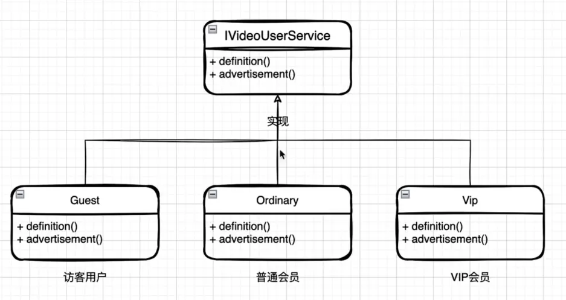
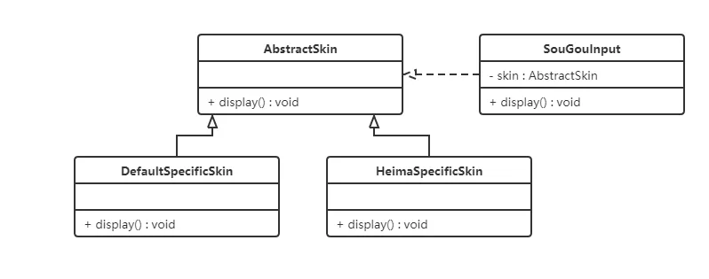
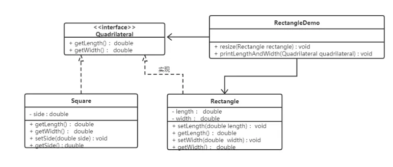

# 一、 设计模式原则

## 一、单一职责原则

1. **单一职责原则：又称单一功能原则，面向对象五个基本原则之一**。一个类应该只有一个发生变化的原因

2. 模拟场景：访客用户-普通用户-VIP用户

3. 编码实现：ifelse-判断实现-不易维护

4. 原有的代码如下，当我们需要针对不同的人群返回不一样的视频内容时

   ```java
   /**
    * @author: Guanghao Wei
    * @date: 2023-05-17 11:05
    * @description: 视频用户信息
    */
   public class VideoUserService {
   
       public void serviceGrade(String userType) {
           if ("VIP用户".equals(userType)) {
               System.out.println("VIP用户，视频1080P蓝光");
           } else if ("普通用户".equals(userType)) {
               System.out.println("普通用户，视频720P超清");
           } else if ("访客用户".equals(userType)) {
               System.out.println("访客用户。视频480P高清");
           }
       }
   }
   
   ```

5. 根据单一职责原理，每个类只负责一个发生变化的原因，就可以定义统一的接口，和不同的用户类

   ```java
   /**
    * @author: Guanghao Wei
    * @date: 2023-05-17 11:08
    * @description: 视频用户服务接口
    */
   public interface IVideoUserService {
       void definition();
       void advertisement();
   }
   ```

   ```java
   /**
    * @author: Guanghao Wei
    * @date: 2023-05-17 11:10
    * @description: VIP用户接口具体实现
    */
   public class VipVideoUserService implements IVideoUserService {
       @Override
       public void definition() {
           System.out.println("VIP用户，视频1080P蓝光");
       }
   
       @Override
       public void advertisement() {
           System.out.println("VIP用户，无广告");
       }
   }
   
   ```

6. 整体架构如下

   

## 二、开闭原则

1. **开闭原则：对扩展开放，对修改关闭**。在程序需要进行拓展的时候，不能去修改原有的代码，实现一个热插拔的效果。简言之，是为了使程序的扩展性好，易于维护和升级

2. 想要达到这样的效果，我们需要使用接口和抽象类

3. 因为抽象灵活性好，适应性广，只要抽象的合理，可以基本保持软件架构的稳定。而软件中易变的细节可以从抽象派生来的实现类来进行扩展，当软件需要发生变化时，只需要根据需求重新派生一个实现类来扩展就可以了

4. 以搜狗输入法的皮肤为例介绍开闭原则的应用。搜狗输入法的皮肤是输入法背景图片、窗口颜色和声音等元素的组合。用户可以根据自己的喜爱更换自己的输入法的皮肤，也可以从网上下载新的皮肤。这些皮肤有共同的特点，可以为其定义一个抽象类（AbstractSkin），而每个具体的皮肤（DefaultSpecificSkin和HeimaSpecificSkin）是其子类。用户窗体可以根据需要选择或者增加新的主题，而不需要修改原代码，所以它是满足开闭原则的

   

## 三、里氏替换原则

1. 里氏代换原则是面向对象设计的基本原则之一

2. 里氏代换原则：任何基类可以出现的地方，子类一定可以出现。通俗理解：子类可以扩展父类的功能，但不能改变父类原有的功能。换句话说，子类继承父类时，除添加新的方法完成新增功能外，尽量不要重写父类的方法。（如果需要重写父类的方法可以使用抽象类，就是开闭原则了）

3. 如果通过重写父类的方法来完成新的功能，这样写起来虽然简单，但是整个继承体系的可复用性会比较差，特别是运用多态比较频繁时，程序运行出错的概率会非常大

4. 在数学领域里，正方形毫无疑问是长方形，它是一个长宽相等的长方形。抽象出来一个四边形接口(Quadrilateral)，让Rectangle类和Square类实现Quadrilateral接口

   

## 四、迪米特法则

1. 迪米特法则又叫最少知识原则

2. 迪米特法则：如果两个软件实体无须直接通信，那么就不应当发生直接的相互调用，可以通过第三方转发该调用。其目的是降低类之间的耦合度，提高模块的相对独立性

3. 迪米特法则中的“朋友”是指：当前对象本身、当前对象的成员对象、当前对象所创建的对象、当前对象的方法参数等，这些对象同当前对象存在关联、聚合或组合关系，可以直接访问这些对象的方法

4. 明星由于全身心投入艺术，所以许多日常事务由经纪人负责处理，如和粉丝的见面会，和媒体公司的业务洽淡等。这里的经纪人是明星的朋友，而粉丝和媒体公司是陌生人，所以适合使用迪米特法则

   

## 五、接口隔离原则

1. 客户端不应该被迫依赖于它不使用的方法；一个类对另一个类的依赖应该建立在最小的接口上

2. 安全门案例

   - 我们需要创建一个`黑马`品牌的安全门，该安全门具有防火、防水、防盗的功能。可以将防火，防水，防盗功能提取成一个接口，形成一套规范。类图如下：

     

   - 上面的设计我们发现了它存在的问题，黑马品牌的安全门具有防盗，防水，防火的功能。现在如果我们还需要再创建一个传智品牌的安全门，而该安全门只具有防盗、防水功能呢？很显然如果实现SafetyDoor接口就违背了接口隔离原则，那么我们如何进行修改呢？看如下类图：

     

## 六、依赖倒置原则

1. 高层模块不应该依赖低层模块，两者都应该依赖其抽象；抽象不应该依赖细节，细节应该依赖抽象。简单的说就是要求对抽象进行编程，不要对实现进行编程，这样就降低了客户与实现模块间的耦合

2. 案例：现要组装一台电脑，需要配件cpu，硬盘，内存条。只有这些配置都有了，计算机才能正常的运行。选择cpu有很多选择，如Intel，AMD等，硬盘可以选择希捷，西数等，内存条可以选择金士顿，海盗船等

   

3. 上述这样处理可以看到已经组装了一台电脑，但是似乎组装的电脑的cpu只能是Intel的，内存条只能是金士顿的，硬盘只能是希捷的，这对用户肯定是不友好的，用户有了机箱肯定是想按照自己的喜好，选择自己喜欢的配件。根据依赖倒转原则进行改进：代码我们只需要修改Computer类，让Computer类依赖抽象（各个配件的接口），而不是依赖于各个组件具体的实现类

   

4. 面向对象的开发很好的解决了这个问题，一般情况下抽象的变化概率很小，让用户程序依赖于抽象，实现的细节也依赖于抽象。即使实现细节不断变动，只要抽象不变，客户程序就不需要变化。这大大降低了客户程序与实现细节的耦合度

# 二、单例模式

- 创建型模式的主要关注点是“怎样创建对象？”，它的主要特点是“将对象的创建与使用分离”
- 这样可以降低系统的耦合度，使用者不需要关注对象的创建细节
- 单例模式（Singleton Pattern）是 Java 中最简单的设计模式之一。这种类型的设计模式属于创建型模式，它提供了一种创建对象的最佳方式
- 这种模式涉及到一个单一的类，该类负责创建自己的对象，同时确保只有单个对象被创建。这个类提供了一种访问其唯一的对象的方式，可以直接访问，不需要实例化该类的对象

## 一、单例模式的结构

- 饿汉式：类加载就会导致该单实例对象被创建
- 懒汉式：类加载不会导致该单实例对象被创建，而是首次使用该对象时才会创建

## 二、单例模式的实现

### 一、饿汉式

1. 方式一，静态变量方式：该方式在成员位置声明Singleton类型的静态变量，并创建Singleton类的对象instance。instance对象是随着类的加载而创建的。如果该对象足够大的话，而一直没有使用就会造成内存的浪费

   ```java
   /**
    * @author: Guanghao Wei
    * @date: 2023-05-17 13:53
    * @description: 饿汉式（静态成员变量）
    */
   public class SingletonHungry {
       //私有构造方法
       private SingletonHungry() {
       }
   
       //在本类中创建对象
       private static SingletonHungry instance = new SingletonHungry();
   
       //提供公共的访问方法获取实例
       public static SingletonHungry getInstance(){
           return instance;
       }
   }
   ```

2. 方式二，静态代码块方式：该方式在成员位置声明Singleton类型的静态变量，而对象的创建是在静态代码块中，也是对着类的加载而创建。所以和饿汉式的方式1基本上一样，当然该方式也存在内存浪费问题

   ```java
   /**
    * @author: Guanghao Wei
    * @date: 2023-05-17 13:53
    * @description: 饿汉式（静态代码块）
    */
   public class SingletonHungry {
       //私有构造方法
       private SingletonHungry() {
       }
   
       //在本类中创建对象
       private static SingletonHungry instance ;
       
       static {
           instance = new SingletonHungry();
       }
   
       //提供公共的访问方法获取实例
       public static SingletonHungry getInstance(){
           return instance;
       }
   }
   ```

3. **方式三：枚举方式**：枚举类实现单例模式是极力推荐的单例实现模式，因为枚举类型是线程安全的，并且只会装载一次，设计者充分的利用了枚举的这个特性来实现单例模式，枚举的写法非常简单，而且枚举类型是所用单例实现中唯一一种不会被破坏的单例实现模式

   ```java
   /**
    * 枚举方式
    */
   public enum Singleton {
       INSTANCE;
   }
   ```

### 二、懒汉式

1. 方式一，线程不安全：该方式在成员位置声明Singleton类型的静态变量，并没有进行对象的赋值操作，那么什么时候赋值的呢？当调用getInstance()方法获取Singleton类的对象的时候才创建Singleton类的对象，这样就实现了懒加载的效果。但是，如果是多线程环境，会出现线程安全问题

   ```java
   /**
    * @author: Guanghao Wei
    * @date: 2023-05-17 13:58
    * @description: 懒汉式（线程不安全）
    */
   public class SingletonLazy {
       //私有构造方法
       private SingletonLazy() {
       }
   
       //在成员位置创建该类的对象
       private static SingletonLazy instance;
   
       //对外提供静态方法获取该对象
       public static SingletonLazy getInstance() {
   
           if (instance == null) {
               instance = new SingletonLazy();
           }
           return instance;
       }
   }
   ```

2. 方式二，线程安全：该方式也实现了懒加载效果，同时又解决了线程安全问题。但是在getInstance()方法上添加了synchronized关键字，导致该方法的执行效果特别低。从上面代码我们可以看出，其实就是在初始化instance的时候才会出现线程安全问题，一旦初始化完成就不存在了

   ```java
   /**
    * @author: Guanghao Wei
    * @date: 2023-05-17 13:58
    * @description: 懒汉式（线程安全）
    */
   public class SingletonLazy {
       //私有构造方法
       private SingletonLazy() {
       }
   
       //在成员位置创建该类的对象
       private static SingletonLazy instance;
   
       //对外提供静态方法获取该对象
       public static synchronized SingletonLazy getInstance() {
   
           if (instance == null) {
               instance = new SingletonLazy();
           }
           return instance;
       }
   }
   ```

3. 方式三，双重检查锁：双重检查锁模式是一种非常好的单例实现模式，解决了单例、性能、线程安全问题，上面的双重检测锁模式看上去完美无缺，其实是存在问题，在多线程的情况下，可能会出现空指针问题，出现问题的原因是JVM在实例化对象的时候会进行优化和指令重排序操作。要解决双重检查锁模式带来空指针异常的问题，只需要使用 `volatile` 关键字, `volatile` 关键字可以保证可见性和有序性

   ```java
   /**
    * @author: Guanghao Wei
    * @date: 2023-05-17 13:58
    * @description: 懒汉式（双检加锁）
    */
   public class SingletonLazy {
       //私有构造方法
       private SingletonLazy() {
       }
   
       //在成员位置创建该类的对象
       private static volatile SingletonLazy instance;
   
       //对外提供静态方法获取该对象
       public static SingletonLazy getInstance() {
           if (instance == null) {
               synchronized (SingletonLazy.class) {
                   if (instance == null) {
                       instance = new SingletonLazy();
                   }
               }
           }
           return instance;
       }
   }
   ```

4. 方式四，静态内部类方式：静态内部类单例模式中实例由内部类创建，由于 JVM 在加载外部类的过程中, 是不会加载静态内部类的, 只有内部类的属性/方法被调用时才会被加载, 并初始化其静态属性。静态属性由于被 `static` 修饰，保证只被实例化一次，并且严格保证实例化顺序

   - 第一次加载Singleton类时不会去初始化INSTANCE，只有第一次调用getInstance，虚拟机加载SingletonHolder并初始化INSTANCE，这样不仅能确保线程安全，也能保证 Singleton 类的唯一性
   - 静态内部类单例模式是一种优秀的单例模式，是开源项目中比较常用的一种单例模式。在没有加任何锁的情况下，保证了多线程下的安全，并且没有任何性能影响和空间的浪费

   ```java
   /**
    * @author: Guanghao Wei
    * @date: 2023-05-17 13:58
    * @description: 懒汉式（静态内部类）
    */
   public class SingletonLazy {
       //私有构造方法
       private SingletonLazy() {
       }
   
   
       private static class SingletonHolder {
           private static final SingletonLazy INSTANCE = new SingletonLazy();
       }
   
       public static SingletonLazy getInstance() {
           return SingletonHolder.INSTANCE;
       }
   
   }
   ```

# 三、工厂模式

# 四、代理模式

# 五、适配器模式

# 六、组合模式

# 七、模板方法模式

# 八、策略模式

# 九、观察者模式