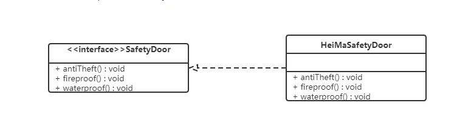
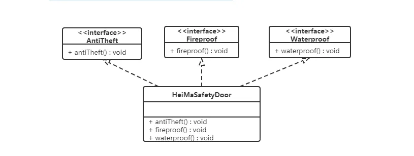
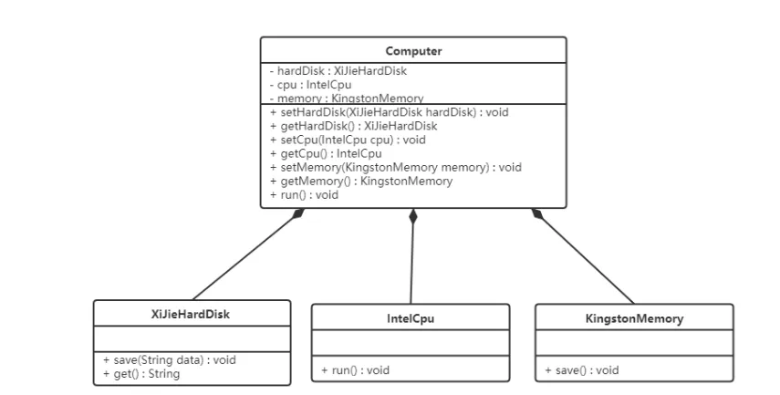
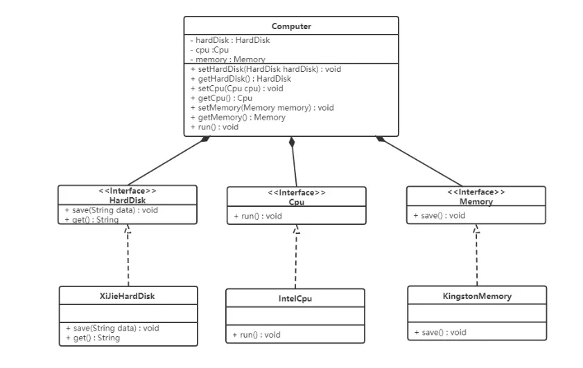

# 零、设计思想

## 一、基于接口而非实现编程

- 基于接口而非实现编程：这个原则非常重要，是一种非常有效的提高代码质量的手段，在平时的开发中特别经常被用到

### 一、解读原则中的"接口"二字

1. “基于接口而非实现编程”这条原则的英文描述是：“Program to an interface, not an implementation”。我们理解这条原则的时候，千万不要一开始就与具体的编程语言挂钩，局限在编程语言的“接口”语法中（比如 Java 中的 interface 接口语法）。这条原则最早出现于 1994 年 GoF 的《设计模式》这本书，它先于很多编程语言而诞生（比如 Java 语言），是一条比较抽象、泛化的设计思想
2. 实际上，理解这条原则的关键，就是理解其中的“接口”两个字。从本质上来看，“接口”就是一组“协议”或者“约定”，是功能提供者提供给使用者的一个“功能列表”。“接口”在不同的应用场景下会有不同的解读，比如服务端与客户端之间的“接口”，类库提供的“接口”，甚至是一组通信的协议都可以叫作“接口”。刚刚对“接口”的理解，都比较偏上层、偏抽象，与实际的写代码离得有点远。如果落实到具体的编码，“基于接口而非实现编程”这条原则中的“接口”，可以理解为编程语言中的接口或者抽象类
3. 前面我们提到，这条原则能非常有效地提高代码质量，之所以这么说，那是因为，应用这条原则，可以将接口和实现相分离，封装不稳定的实现，暴露稳定的接口。上游系统面向接口而非实现编程，不依赖不稳定的实现细节，这样当实现发生变化的时候，上游系统的代码基本上不需要做改动，以此来降低耦合性，提高扩展性
4. 实际上，“基于接口而非实现编程”这条原则的另一个表述方式，是“基于抽象而非实现编程”。后者的表述方式其实更能体现这条原则的设计初衷。在软件开发中，最大的挑战之一就是需求的不断变化，这也是考验代码设计好坏的一个标准。**越抽象、越顶层、越脱离具体某一实现的设计，越能提高代码的灵活性，越能应对未来的需求变化。好的代码设计，不仅能应对当下的需求，而且在将来需求发生变化的时候，仍然能够在不破坏原有代码设计的情况下灵活应对**。而抽象就是提高代码扩展性、灵活性、可维护性最有效的手段之一

### 二、将此原则应用到实战中

假设我们的系统中有很多涉及图片处理和存储的业务逻辑。图片经过处理之后被上传到阿里云上。为了代码复用，我们封装了图片存储相关的代码逻辑，提供了一个统一的AliyunImageStore类，供整个系统来使用。具体的代码实现如下所示：

```java
public class AliyunImageStore {
  //...省略属性、构造函数等...
  
  public void createBucketIfNotExisting(String bucketName) {
    // ...创建bucket代码逻辑...
    // ...失败会抛出异常..
  }
  
  public String generateAccessToken() {
    // ...根据accesskey/secrectkey等生成access token
  }
  
  public String uploadToAliyun(Image image, String bucketName, String accessToken) {
    //...上传图片到阿里云...
    //...返回图片存储在阿里云上的地址(url）...
  }
  
  public Image downloadFromAliyun(String url, String accessToken) {
    //...从阿里云下载图片...
  }
}

// AliyunImageStore类的使用举例
public class ImageProcessingJob {
  private static final String BUCKET_NAME = "ai_images_bucket";
  //...省略其他无关代码...
  
  public void process() {
    Image image = ...; //处理图片，并封装为Image对象
    AliyunImageStore imageStore = new AliyunImageStore(/*省略参数*/);
    imageStore.createBucketIfNotExisting(BUCKET_NAME);
    String accessToken = imageStore.generateAccessToken();
    imagestore.uploadToAliyun(image, BUCKET_NAME, accessToken);
  }
}
```

1. 整个上传流程包含三个步骤：创建bucket（简单理解为存储目录）、生成access token访问凭证、携带access token上传图片到指定的bucket中。代码实现非常简单，类中的几个方法定义得都很干净，用起来也很清晰，乍看起来没有太大问题，完全能满足我们将图片存储在阿里云的业务需求

2. 不过，软件开发中唯一不变的就是变化。过了一段时间后，我们自建了私有云，不再将图片存储到阿里云了，而是将图片存储到自建私有云上。为了满足这样一个需求的变化，那么我们需要修改代码

3. 我们需要重新设计实现一个存储图片到私有云的PrivateImageStore类，并用它替换掉项目中所有的 AliyunImageStore类对象。这样的修改听起来并不复杂，只是简单替换而已，对整个代码的改动并不大。不过，我们经常说，“细节是魔鬼”。这句话在软件开发中特别适用。实际上，刚刚的设计实现方式，就隐藏了很多容易出问题的“魔鬼细节”

4. 新的PrivateImageStore类需要设计实现哪些方法，才能在尽量最小化代码修改的情况下，如果替换掉AliyunImageStore类呢，这就要求我们必须将AliyunImageStore类中所定义的所有public方法，在 PrivateImageStore类中都逐一定义并重新实现一遍。而这样做就会存在一些问题：

   - 首先，AliyunImageStore类中有些函数命名暴露了实现细节，比如，uploadToAliyun() 和 downloadFromAliyun()。如果开发这个功能的同事没有接口意识、抽象思维，那这种暴露实现细节的命名方式就不足为奇了，毕竟最初我们只考虑将图片存储在阿里云上。而我们把这种包含“aliyun”字眼的方法，照抄到PrivateImageStore类中，显然是不合适的。如果我们在新类中重新命名uploadToAliyun()、downloadFromAliyun() 这些方法，那就意味着，我们要修改项目中所有使用到这两个方法的代码，代码修改量可能就会很大
   - 其次，将图片存储到阿里云的流程，跟存储到私有云的流程，可能并不是完全一致的。比如，阿里云的图片上传和下载的过程中，需要生产access token，而私有云不需要access token。一方面，AliyunImageStore中定义的generateAccessToken() 方法不能照抄到 PrivateImageStore中；另一方面，我们在使用AliyunImageStore上传、下载图片的时候，代码中用到了generateAccessToken()方法，如果要改为私有云的上传下载流程，这些代码都需要做调整

5. 解决这个问题的根本方法就是，在编写代码的时候，要遵从“基于接口而非实现编程”的原则，具体来讲，我们需要做到下面这3点

   - 函数的命名不能暴露任何实现细节。比如，前面提到的uploadToAliyun()就不符合要求，应该改为去掉aliyun这样的字眼，改为更加抽象的命名方式，比如：upload()
   - 封装具体的实现细节。比如，跟阿里云相关的特殊上传（或下载）流程不应该暴露给调用者。我们对上传（或下载）流程进行封装，对外提供一个包裹所有上传（或下载）细节的方法，给调用者使用
   - 为实现类定义抽象的接口。具体的实现类都依赖统一的接口定义，遵从一致的上传功能协议。使用者依赖接口，而不是具体的实现类来编程

6. 我们按照这个思路，把代码重构一下。重构后的代码如下所示：

   ```java
   public interface ImageStore {
     String upload(Image image, String bucketName);
     Image download(String url);
   }
   
   public class AliyunImageStore implements ImageStore {
     //...省略属性、构造函数等...
   
     public String upload(Image image, String bucketName) {
       createBucketIfNotExisting(bucketName);
       String accessToken = generateAccessToken();
       //...上传图片到阿里云...
       //...返回图片在阿里云上的地址(url)...
     }
   
     public Image download(String url) {
       String accessToken = generateAccessToken();
       //...从阿里云下载图片...
     }
   
     private void createBucketIfNotExisting(String bucketName) {
       // ...创建bucket...
       // ...失败会抛出异常..
     }
   
     private String generateAccessToken() {
       // ...根据accesskey/secrectkey等生成access token
     }
   }
   
   // 上传下载流程改变：私有云不需要支持access token
   public class PrivateImageStore implements ImageStore  {
     public String upload(Image image, String bucketName) {
       createBucketIfNotExisting(bucketName);
       //...上传图片到私有云...
       //...返回图片的url...
     }
   
     public Image download(String url) {
       //...从私有云下载图片...
     }
   
     private void createBucketIfNotExisting(String bucketName) {
       // ...创建bucket...
       // ...失败会抛出异常..
     }
   }
   
   // ImageStore的使用举例
   public class ImageProcessingJob {
     private static final String BUCKET_NAME = "ai_images_bucket";
     //...省略其他无关代码...
     
     public void process() {
       Image image = ...;//处理图片，并封装为Image对象
       ImageStore imageStore = new PrivateImageStore(...);
       imagestore.upload(image, BUCKET_NAME);
     }
   }
   ```

   - 除此之外，很多人在定义接口的时候，希望通过实现类来反推接口的定义。先把实现类写好，然后看实现类中有哪些方法，照抄到接口定义中。如果按照这种思考方式，就有可能导致接口定义不够抽象，依赖具体的实现。这样的接口设计就没有意义了。不过，如果你觉得这种思考方式更加顺畅，那也没问题，只是将实现类的方法搬移到接口定义中的时候，要有选择性的搬移，不要将跟具体实现相关的方法搬移到接口中，比如AliyunImageStore中的generateAccessToken()方法

7. 我们在做软件开发的时候，一定要有抽象意识、封装意识、接口意识。在定义接口的时候，不要暴露任何实现细节。接口的定义只表明做什么，而不是怎么做。而且，在设计接口的时候，我们要多思考一下，这样的接口设计是否足够通用，是否能够做到在替换具体的接口实现的时候，不需要任何接口定义的改动

### 三、是否需要为每个类定义接口

1. 为了满足“基于接口而非实现编程”原则，是不是需要给每个实现类都定义对应的接口呢？在开发的时候，是不是任何代码都要只依赖接口，完全不依赖实现编程呢？
2. 做任何事情都要讲求一个“度”，过度使用这条原则，非得给每个类都定义接口，接口满天飞，也会导致不必要的开发负担。至于什么时候，该为某个类定义接口，实现基于接口的编程，什么时候不需要定义接口，直接使用实现类编程，我们做权衡的根本依据，还是要回归到设计原则诞生的初衷上来。只要搞清楚了这条原则是为了解决什么样的问题而产生的，你就会发现，很多之前模棱两可的问题，都会变得豁然开朗
3. 这条原则的设计初衷是，将接口和实现相分离，封装不稳定的实现，暴露稳定的接口。上游系统面向接口而非实现编程，不依赖不稳定的实现细节，这样当实现发生变化的时候，上游系统的代码基本上不需要做改动，以此来降低代码间的耦合性，提高代码的扩展性
4. 从这个设计初衷上来看，如果在我们的业务场景中，某个功能只有一种实现方式，未来也不可能被其他实现方式替换，那我们就没有必要为其设计接口，也没有必要基于接口编程，直接使用实现类就可以了
5. 除此之外，越是不稳定的系统，我们越是要在代码的扩展性、维护性上下功夫。相反，如果某个系统特别稳定，在开发完之后，基本上不需要做维护，那我们就没有必要为其扩展性，投入不必要的开发时间

## 二、多用组合少用继承

- 在面向对象编程中，有一条非常经典的设计原则，那就是：组合优于继承，多用组合少用继承

### 一、不推荐使用继承的原因

1. 继承是面向对象的四大特性之一（抽象、封装、继承、多态），用来表示类之间的is-a关系，可以解决代码复用的问题。虽然继承有诸多作用，但继承层次过深、过复杂，也会影响到代码的可维护性。很多人觉得继承是一种反模式，应该尽量少用，甚至不用。为什么会有这样的争议？我们通过一个例子来解释一下

2. 假设我们要设计一个关于鸟的类。我们将“鸟类”这样一个抽象的事物概念，定义为一个抽象类 AbstractBird。所有更细分的鸟，比如麻雀、鸽子、乌鸦等，都继承这个抽象类

3. 大部分鸟都会飞，那我们可不可以在AbstractBird抽象类中，定义一个fly()方法呢？答案是否定的。尽管大部分鸟都会飞，但也有特例，比如鸵鸟就不会飞。鸵鸟继承具有 fly() 方法的父类，那鸵鸟就具有“飞”这样的行为，这显然不符合我们对现实世界中事物的认识。当然，在鸵鸟这个子类中重写（override）fly() 方法，让它抛出UnSupportedMethodException异常不就可以了吗？具体的代码实现如下所示

   ```java
   public class AbstractBird {
     //...省略其他属性和方法...
     public void fly() { //... }
   }
   
   public class Ostrich extends AbstractBird { //鸵鸟
     //...省略其他属性和方法...
     public void fly() {
       throw new UnSupportedMethodException("I can't fly.'");
     }
   }
   ```

4. 这种设计思路虽然可以解决问题，但不够优美。因为除了鸵鸟之外，不会飞的鸟还有很多，比如企鹅。对于这些不会飞的鸟来说，我们都需要重写fly()方法，抛出异常。这样的设计，一方面，徒增了编码的工作量；另一方面，也违背了我们之后要讲的最小知识原则（Least Knowledge Principle，也叫最少知识原则或者迪米特法则），暴露不该暴露的接口给外部，增加了类使用过程中被误用的概率

5. 为了解决上述问题，再通过AbstractBird类派生出两个更加细分的抽象类：会飞的鸟类AbstractFlyableBird和不会飞的鸟类AbstractUnFlyableBird，让麻雀、乌鸦这些会飞的鸟都继承 AbstractFlyableBird，让鸵鸟、企鹅这些不会飞的鸟，都继承AbstractUnFlyableBird类，不就可以了吗？具体的继承关系如下图所示

   

6. 从图中我们可以看出，继承关系变成了三层。不过，整体上来讲，目前的继承关系还比较简单，层次比较浅，也算是一种可以接受的设计思路。我们再继续加点难度。在刚刚这个场景中，我们只关注“鸟会不会飞”，但如果我们还关注“鸟会不会叫”，那这个时候，我们又该如何设计类之间的继承关系呢？

7. 是否会飞？是否会叫？两个行为搭配起来会产生四种情况：会飞会叫、不会飞会叫、会飞不会叫、不会飞不会叫。如果我们继续沿用刚才的设计思路，那就需要再定义四个抽象类AbstractFlyableTweetableBird、AbstractFlyableUnTweetableBird、AbstractUnFlyableTweetableBird、AbstractUnFlyableUnTweetableBird

   

8. 如果我们还需要考虑“是否会下蛋”这样一个行为，那估计就要组合爆炸了。**类的继承层次会越来越深、继承关系会越来越复杂。而这种层次很深、很复杂的继承关系，一方面，会导致代码的可读性变差**。因为我们要搞清楚某个类具有哪些方法、属性，必须阅读父类的代码、父类的父类的代码……一直追溯到最顶层父类的代码。另一方面，这也破坏了类的封装特性，将父类的实现细节暴露给了子类。子类的实现依赖父类的实现，两者高度耦合，一旦父类代码修改，就会影响所有子类的逻辑

9. 总之，继承最大的问题就在于：继承层次过深、继承关系过于复杂会影响到代码的可读性和可维护性。这也是为什么我们不推荐使用继承

### 二、组合相比继承更好的原因

1. 实际上，我们可以利用组合（composition）、接口、委托（delegation）三个技术手段，一块儿来解决刚刚继承存在的问题。

2. 接口表示具有某种行为特性。针对“会飞”这样一个行为特性，我们可以定义一个Flyable接口，只让会飞的鸟去实现这个接口。对于会叫、会下蛋这些行为特性，我们可以类似地定义Tweetable接口、EggLayable接口。我们将这个设计思路翻译成Java代码的话，就是下面这个样子

   ```java
   public interface Flyable {
     void fly();
   }
   public interface Tweetable {
     void tweet();
   }
   public interface EggLayable {
     void layEgg();
   }
   public class Ostrich implements Tweetable, EggLayable {//鸵鸟
     //... 省略其他属性和方法...
     @Override
     public void tweet() { //... }
     @Override
     public void layEgg() { //... }
   }
   public class Sparrow impelents Flyable, Tweetable, EggLayable {//麻雀
     //... 省略其他属性和方法...
     @Override
     public void fly() { //... }
     @Override
     public void tweet() { //... }
     @Override
     public void layEgg() { //... }
   }
   ```

3. 不过，我们知道，接口只声明方法，不定义实现。也就是说，每个会下蛋的鸟都要实现一遍 layEgg() 方法，并且实现逻辑是一样的，这就会导致代码重复的问题。那这个问题又该如何解决呢？

4. 我们可以针对三个接口再定义三个实现类，它们分别是：实现了fly()方法的FlyAbility类、实现了 tweet()方法的TweetAbility类、实现了layEgg()方法的EggLayAbility类。然后，通过组合和委托技术来消除代码重复。具体的代码实现如下所示

   ```java
   public interface Flyable {
     void fly()；
   }
   public class FlyAbility implements Flyable {
     @Override
     public void fly() { //... }
   }
   //省略Tweetable/TweetAbility/EggLayable/EggLayAbility
   
   public class Ostrich implements Tweetable, EggLayable {//鸵鸟
     private TweetAbility tweetAbility = new TweetAbility(); //组合
     private EggLayAbility eggLayAbility = new EggLayAbility(); //组合
     //... 省略其他属性和方法...
     @Override
     public void tweet() {
       tweetAbility.tweet(); // 委托
     }
     @Override
     public void layEgg() {
       eggLayAbility.layEgg(); // 委托
     }
   }
   ```

5. 我们知道继承主要有三个作用：表示is-a关系，支持多态特性，代码复用。而这三个作用都可以通过其他技术手段来达成。比如is-a关系，我们可以通过组合和接口的has-a关系来替代；多态特性我们可以利用接口来实现；代码复用我们可以通过组合和委托来实现。所以，**从理论上讲，通过组合、接口、委托三个技术手段，我们完全可以替换掉继承，在项目中不用或者少用继承关系，特别是一些复杂的继承关系**

### 三、判断用组合或继承的原则

1. 尽管我们鼓励多用组合少用继承，但组合也并不是完美的，继承也并非一无是处。从上面的例子来看，继承改写成组合意味着要做更细粒度的类的拆分。这也就意味着，我们要定义更多的类和接口。类和接口的增多也就或多或少地增加代码的复杂程度和维护成本。所以，在实际的项目开发中，我们还是要根据具体的情况，来具体选择该用继承还是组合

2. **如果类之间的继承结构稳定（不会轻易改变），继承层次比较浅（比如，最多有两层继承关系），继承关系不复杂，我们就可以大胆地使用继承。反之，系统越不稳定，继承层次很深，继承关系复杂，我们就尽量使用组合来替代继承**

3. 除此之外，还有一些设计模式会固定使用继承或者组合。比如，装饰者模式（decorator pattern）、策略模式（strategy pattern）、组合模式（composite pattern）等都使用了组合关系，而模板模式（template pattern）使用了继承关系

4. 继承可以实现代码复用。利用继承特性，我们把相同的属性和方法，抽取出来，定义到父类中。子类复用父类中的属性和方法，达到代码复用的目的。但是，有的时候，从业务含义上，A类和B类并不一定具有继承关系。比如，Crawler类和PageAnalyzer类，它们都用到了URL拼接和分割的功能，但并不具有继承关系（既不是父子关系，也不是兄弟关系）。仅仅为了代码复用，生硬地抽象出一个父类出来，会影响到代码的可读性。如果不熟悉背后设计思路，发现Crawler类和 PageAnalyzer类继承同一个父类，而父类中定义的却只是URL相关的操作，会觉得这个代码写得莫名其妙，理解不了。这个时候，使用组合就更加合理、更加灵活。具体的代码实现如下所示：

   ```java
   public class Url {
     //...省略属性和方法
   }
   
   public class Crawler {
     private Url url; // 组合
     public Crawler() {
       this.url = new Url();
     }
     //...
   }
   
   public class PageAnalyzer {
     private Url url; // 组合
     public PageAnalyzer() {
       this.url = new Url();
     }
     //..
   }
   ```

5. 还有一些特殊的场景要求我们必须使用继承。如果不能改变一个函数的入参类型，而入参又非接口，为了支持多态，只能采用继承来实现。比如下面这样一段代码，其中FeignClient是一个外部类，我们没有权限去修改这部分代码，但是我们希望能重写这个类在运行时执行的encode()函数。这个时候，我们只能采用继承来实现了

   ```java
   public class FeignClient { // Feign Client框架代码
     //...省略其他代码...
     public void encode(String url) { //... }
   }
   
   public void demofunction(FeignClient feignClient) {
     //...
     feignClient.encode(url);
     //...
   }
   
   public class CustomizedFeignClient extends FeignClient {
     @Override
     public void encode(String url) { //...重写encode的实现...}
   }
   
   // 调用
   FeignClient client = new CustomizedFeignClient();
   demofunction(client);
   ```

6. 尽管有些人说，要杜绝继承，100%用组合代替继承，其实没那么极端！之所以“多用组合少用继承”这个口号喊得这么响，只是因为，长期以来，我们过度使用继承。还是那句话，**组合并不完美，继承也不是一无是处**。只要我们控制好它们的副作用、发挥它们各自的优势，在不同的场合下，恰当地选择使用继承还是组合，这才是我们所追求的境界

## 三、通过封装、抽象、模块化、中间层等解耦代码

### 一、解耦的重要性

1. 软件设计与开发最重要的工作之一就是应对复杂性。人处理复杂性的能力是有限的。过于复杂的代码往往在可读性、可维护性上都不友好。那如何来控制代码的复杂性呢？手段有很多，最关键的就是解耦，保证代码松耦合、高内聚。如果说重构是保证代码质量不至于腐化到无可救药地步的有效手段，那么利用解耦的方法对代码重构，就是保证代码不至于复杂到无法控制的有效手段
2. 实际上，“高内聚、松耦合”是一个比较通用的设计思想，不仅可以指导细粒度的类和类之间关系的设计，还能指导粗粒度的系统、架构、模块的设计。相对于编码规范，它能够在更高层次上提高代码的可读性和可维护性
3. 不管是阅读代码还是修改代码，“高内聚、松耦合”的特性可以让我们聚焦在某一模块或类中，不需要了解太多其他模块或类的代码，让我们的焦点不至于过于发散，降低了阅读和修改代码的难度。而且，因为依赖关系简单，耦合小，修改代码不至于牵一发而动全身，代码改动比较集中，引入bug的风险也就减少了很多。同时，“高内聚、松耦合”的代码可测试性也更加好，容易mock或者很少需要mock外部依赖的模块或者类
4. 除此之外，代码“高内聚、松耦合”，也就意味着，代码结构清晰、分层和模块化合理、依赖关系简单、模块或类之间的耦合小，那代码整体的质量就不会差。即便某个具体的类或者模块设计得不怎么合理，代码质量不怎么高，影响的范围是非常有限的。我们可以聚焦于这个模块或者类，做相应的小型重构。而相对于代码结构的调整，这种改动范围比较集中的小型重构的难度就容易多了

### 二、代码是否解耦的原则

1. 代码需要解耦的间接衡量标准有很多，比如，**看修改代码会不会牵一发而动全身**。除此之外，还有一个直接的衡量标准，也是在阅读源码的时候经常会用到的，那就是把**模块与模块之间、类与类之间的依赖关系画出来，根据依赖关系图的复杂性来判断是否需要解耦重构**
2. 如果依赖关系复杂、混乱，那从代码结构上来讲，可读性和可维护性肯定不是太好，那我们就需要考虑是否可以通过解耦的方法，让依赖关系变得清晰、简单。当然，这种判断还是有比较强的主观色彩，但是可以作为一种参考和梳理依赖的手段，配合间接的衡量标准一块来使用

### 三、代码解耦的方法

#### 一、封装与抽象

- 封装和抽象作为两个非常通用的设计思想，可以应用在很多设计场景中，比如系统、模块、lib、组件、接口、类等等的设计。封装和抽象可以有效地隐藏实现的复杂性，隔离实现的易变性，给依赖的模块提供稳定且易用的抽象接口

#### 二、中间层

1. 引入中间层能简化模块或类之间的依赖关系。下面这张图是引入中间层前后的依赖关系对比图。在引入数据存储中间层之前，A、B、C三个模块都要依赖内存一级缓存、Redis二级缓存、DB持久化存储三个模块。在引入中间层之后，三个模块只需要依赖数据存储中间层一个模块即可。从图上可以看出，中间层的引入明显地简化了依赖关系，让代码结构更加清晰

   

2. 除此之外，我们在进行重构的时候，引入中间层可以起到过渡的作用，能够让开发和重构同步进行，不互相干扰。比如，某个接口设计的有问题，我们需要修改它的定义，同时，所有调用这个接口的代码都要做相应的改动。如果新开发的代码也用到这个接口，那开发就跟重构冲突了。为了让重构能小步快跑，我们可以分下面四个阶段来完成接口的修改

   - 第一阶段：引入一个中间层，包裹老的接口，提供新的接口定义
   - 第二阶段：新开发的代码依赖中间层提供的新接口
   - 第三阶段：将依赖老接口的代码改为调用新接口
   - 第四阶段：确保所有的代码都调用新接口之后，删除掉老的接口

3. 这样，每个阶段的开发工作量都不会很大，都可以在很短的时间内完成。重构跟开发冲突的概率也变小了

#### 三、模块化

- 模块化是构建复杂系统常用的手段。不仅在软件行业，在建筑、机械制造等行业，这个手段也非常有用。对于一个大型复杂系统来说，没有人能掌控所有的细节。之所以我们能搭建出如此复杂的系统，并且能维护得了，最主要的原因就是将系统划分成各个独立的模块，让不同的人负责不同的模块，这样即便在不了解全部细节的情况下，管理者也能协调各个模块，让整个系统有效运转

#### 四、其他设计思想和原则

1. “高内聚、松耦合”是一个非常重要的设计思想，能够有效提高代码的可读性和可维护性，缩小功能改动导致的代码改动范围。很多设计原则都以实现代码的“高内聚、松耦合”为目的
2. 设计模式原则
   - 单一职责原则：内聚性和耦合性并非独立的。高内聚会让代码更加松耦合，而实现高内聚的重要指导原则就是单一职责原则。模块或者类的职责设计得单一，而不是大而全，那依赖它的类和它依赖的类就会比较少，代码耦合也就相应的降低了
   - 基于接口而非实现编程：基于接口而非实现编程能通过接口这样一个中间层，隔离变化和具体的实现。这样做的好处是，在有依赖关系的两个模块或类之间，一个模块或者类的改动，不会影响到另一个模块或类。实际上，这就相当于将一种强依赖关系（强耦合）解耦为了弱依赖关系（弱耦合）
   - 依赖注入：跟基于接口而非实现编程思想类似，依赖注入也是将代码之间的强耦合变为弱耦合。尽管依赖注入无法将本应该有依赖关系的两个类，解耦为没有依赖关系，但可以让耦合关系没那么紧密，容易做到插拔替换
   - 多用组合少用继承：继承是一种强依赖关系，父类与子类高度耦合，且这种耦合关系非常脆弱，牵一发而动全身，父类的每一次改动都会影响所有的子类。相反，组合关系是一种弱依赖关系，这种关系更加灵活，所以，对于继承结构比较复杂的代码，利用组合来替换继承，也是一种解耦的有效手段
   - 迪米特法则：迪米特法则讲的是，不该有直接依赖关系的类之间，不要有依赖；有依赖关系的类之间，尽量只依赖必要的接口。从定义上，我们明显可以看出，这条原则的目的就是为了实现代码的松耦合

# 一、 设计模式原则

## 一、单一职责原则

### 一、单一职责原则概念

1. **单一职责原则**：Single Responsibility Principle，缩写为SRP。**一个类或者模块只负责完成一个职责（或者功能）**
2. 这个原则描述的对象包含两个，一个是类（class），一个是模块（module）。关于这两个概念，有两种理解方式

   - 把模块看作比类更加抽象的概念，类也可以看作模块
   - 把模块看作比类更加粗粒度的代码块，模块中包含多个类，多个类组成一个模块
   - 简而言之，一个类或者一个模块的类负责完成一个职责或功能
3. 单一职责原则的定义描述非常简单，也不难理解。一个类只负责完成一个职责或者功能。也就是说，不要设计大而全的类，要设计粒度小、功能单一的类。换个角度来讲就是，一个类包含了两个或者两个以上业务不相干的功能，那我们就说它职责不够单一，应该将它拆分成多个功能更加单一、粒度更细的类
4. 案例：一个类里既包含订单的一些操作，又包含用户的一些操作。而订单和用户是两个独立的业务领域模型，我们将两个不相干的功能放到同一个类中，那就违反了单一职责原则。为了满足单一职责原则，我们需要将这个类拆分成两个粒度更细、功能更加单一的两个类：订单类和用户类

### 二、判断类或模块的职责单一的标准

1. 从刚刚这个例子来看，单一职责原则看似不难应用。那是因为我举的这个例子比较极端，一眼就能看出订单和用户毫不相干。但大部分情况下，类里的方法是归为同一类功能，还是归为不相关的两类功能，并不是那么容易判定的。在真实的软件开发中，对于一个类是否职责单一的判定，是很难拿捏的。

2. 我举一个更加贴近实际的例子来给你解释一下。在一个社交产品中，我们用下面的 UserInfo 类来记录用户的信息

   ```java
   public class UserInfo {
     private long userId;
     private String username;
     private String email;
     private String telephone;
     private long createTime;
     private long lastLoginTime;
     private String avatarUrl;
     private String provinceOfAddress; // 省
     private String cityOfAddress; // 市
     private String regionOfAddress; // 区 
     private String detailedAddress; // 详细地址
     // ...省略其他属性和方法...
   }
   ```

3. UserInfo 类的设计是否满足单一职责原则，有两种不同的观点。一种观点是，UserInfo 类包含的都是跟用户相关的信息，所有的属性和方法都隶属于用户这样一个业务模型，满足单一职责原则；另一种观点是，地址信息在 UserInfo 类中，所占的比重比较高，可以继续拆分成独立的 UserAddress 类，UserInfo 只保留除 Address 之外的其他信息，拆分之后的两个类的职责更加单一

4. 哪种观点更对呢？实际上，要从中做出选择，我们不能脱离具体的应用场景。如果在这个社交产品中，用户的地址信息跟其他信息一样，只是单纯地用来展示，那 UserInfo 现在的设计就是合理的。但是，如果这个社交产品发展得比较好，之后又在产品中添加了电商的模块，用户的地址信息还会用在电商物流中，那我们最好将地址信息从 UserInfo 中拆分出来，独立成用户物流信息（或者叫地址信息、收货信息等）。

5. 我们再进一步延伸一下。如果做这个社交产品的公司发展得越来越好，公司内部又开发出了很多其他产品（可以理解为其他 App）。公司希望支持统一账号系统，也就是用户一个账号可以在公司内部的所有产品中登录。这个时候，我们就需要继续对 UserInfo 进行拆分，将跟身份认证相关的信息（比如，email、telephone 等）抽取成独立的类。

6. 从刚刚这个例子，我们可以总结出，不同的应用场景、不同阶段的需求背景下，对同一个类的职责是否单一的判定，可能都是不一样的。在某种应用场景或者当下的需求背景下，一个类的设计可能已经满足单一职责原则了，但如果换个应用场景或着在未来的某个需求背景下，可能就不满足了，需要继续拆分成粒度更细的类。

7. 除此之外，从不同的业务层面去看待同一个类的设计，对类是否职责单一，也会有不同的认识。比如，例子中的 UserInfo 类。如果我们从“用户”这个业务层面来看，UserInfo 包含的信息都属于用户，满足职责单一原则。如果我们从更加细分的“用户展示信息”“地址信息”“登录认证信息”等等这些更细粒度的业务层面来看，那 UserInfo 就应该继续拆分。

8. 综上所述，评价一个类的职责是否足够单一，我们并没有一个非常明确的、可以量化的标准，可以说，这是件非常主观、仁者见仁智者见智的事情。实际上，在真正的软件开发中，我们也没必要过于未雨绸缪，过度设计。所以，我们可以先写一个粗粒度的类，满足业务需求。随着业务的发展，如果粗粒度的类越来越庞大，代码越来越多，这个时候，我们就可以将这个粗粒度的类，拆分成几个更细粒度的类。这就是所谓的持续重构

9. 听到这里，你可能会说，这个原则如此含糊不清、模棱两可，到底该如何拿捏才好啊？我这里还有一些小技巧，能够很好地帮你，从侧面上判定一个类的职责是否够单一。而且，我个人觉得，下面这几条判断原则，比起很主观地去思考类是否职责单一，要更有指导意义、更具有可执行性：

   - 类中的代码行数、函数或属性过多，会影响代码的可读性和可维护性，我们就需要考虑对类进行拆分；
   - 类依赖的其他类过多，或者依赖类的其他类过多，不符合高内聚、低耦合的设计思想，我们就需要考虑对类进行拆分；
   - 私有方法过多，我们就要考虑能否将私有方法独立到新的类中，设置为 public 方法，供更多的类使用，从而提高代码的复用性；
   - 比较难给类起一个合适名字，很难用一个业务名词概括，或者只能用一些笼统的 Manager、Context 之类的词语来命名，这就说明类的职责定义得可能不够清晰；
   - 类中大量的方法都是集中操作类中的某几个属性，比如，在 UserInfo 例子中，如果一半的方法都是在操作 address 信息，那就可以考虑将这几个属性和对应的方法拆分出来。

10. 不过，你可能还会有这样的疑问：在上面的判定原则中，我提到类中的代码行数、函数或者属性过多，就有可能不满足单一职责原则。那多少行代码才算是行数过多呢？多少个函数、属性才称得上过多呢？实际上，也可以给你一个凑活能用、比较宽泛的、可量化的标准，那就是一个类的代码行数最好不能超过 200 行，函数个数及属性个数都最好不要超过 10 个。

11. 实际上， 从另一个角度来看，当一个类的代码，读起来让你头大了，实现某个功能时不知道该用哪个函数了，想用哪个函数翻半天都找不到了，只用到一个小功能要引入整个类（类中包含很多无关此功能实现的函数）的时候，这就说明类的行数、函数、属性过多了。实际上，等你做多项目了，代码写多了，在开发中慢慢“品尝”，自然就知道什么是“放盐少许”了，这就是所谓的“专业第六感”

### 三、类或模块的职责与单一性的关系

1. 为了满足单一职责原则，是不是把类拆得越细就越好呢？答案是否定的。我们还是通过一个例子来解释一下。Serialization 类实现了一个简单协议的序列化和反序列功能，具体代码如下：

   ```java
   /**
    * Protocol format: identifier-string;{gson string}
    * For example: UEUEUE;{"a":"A","b":"B"}
    */
   public class Serialization {
     private static final String IDENTIFIER_STRING = "UEUEUE;";
     private Gson gson;
     
     public Serialization() {
       this.gson = new Gson();
     }
     
     public String serialize(Map<String, String> object) {
       StringBuilder textBuilder = new StringBuilder();
       textBuilder.append(IDENTIFIER_STRING);
       textBuilder.append(gson.toJson(object));
       return textBuilder.toString();
     }
     
     public Map<String, String> deserialize(String text) {
       if (!text.startsWith(IDENTIFIER_STRING)) {
           return Collections.emptyMap();
       }
       String gsonStr = text.substring(IDENTIFIER_STRING.length());
       return gson.fromJson(gsonStr, Map.class);
     }
   }
   ```

2. 如果我们想让类的职责更加单一，我们对 Serialization 类进一步拆分，拆分成一个只负责序列化工作的 Serializer 类和另一个只负责反序列化工作的 Deserializer 类。拆分后的具体代码如下所示：

   ```java
   public class Serializer {
     private static final String IDENTIFIER_STRING = "UEUEUE;";
     private Gson gson;
     
     public Serializer() {
       this.gson = new Gson();
     }
     
     public String serialize(Map<String, String> object) {
       StringBuilder textBuilder = new StringBuilder();
       textBuilder.append(IDENTIFIER_STRING);
       textBuilder.append(gson.toJson(object));
       return textBuilder.toString();
     }
   }
   
   public class Deserializer {
     private static final String IDENTIFIER_STRING = "UEUEUE;";
     private Gson gson;
     
     public Deserializer() {
       this.gson = new Gson();
     }
     
     public Map<String, String> deserialize(String text) {
       if (!text.startsWith(IDENTIFIER_STRING)) {
           return Collections.emptyMap();
       }
       String gsonStr = text.substring(IDENTIFIER_STRING.length());
       return gson.fromJson(gsonStr, Map.class);
     }
   }
   ```

3. 虽然经过拆分之后，Serializer 类和 Deserializer 类的职责更加单一了，但也随之带来了新的问题。如果我们修改了协议的格式，数据标识从“UEUEUE”改为“DFDFDF”，或者序列化方式从 JSON 改为了 XML，那 Serializer 类和 Deserializer 类都需要做相应的修改，代码的内聚性显然没有原来 Serialization 高了。而且，如果我们仅仅对 Serializer 类做了协议修改，而忘记了修改 Deserializer 类的代码，那就会导致序列化、反序列化不匹配，程序运行出错，也就是说，拆分之后，代码的可维护性变差了。

4. 实际上，不管是应用设计原则还是设计模式，最终的目的还是提高代码的可读性、可扩展性、复用性、可维护性等。我们在考虑应用某一个设计原则是否合理的时候，也可以以此作为最终的考量标准

## 二、开闭原则

1. **开闭原则：对扩展开放，对修改关闭**。在程序需要进行拓展的时候，不能去修改原有的代码，实现一个热插拔的效果。简言之，是为了使程序的扩展性好，易于维护和升级

2. 想要达到这样的效果，我们需要使用接口和抽象类

3. 因为抽象灵活性好，适应性广，只要抽象的合理，可以基本保持软件架构的稳定。而软件中易变的细节可以从抽象派生来的实现类来进行扩展，当软件需要发生变化时，只需要根据需求重新派生一个实现类来扩展就可以了


### 一、理解“对扩展开放、修改关闭”

1. 开闭原则的英文全称是 Open Closed Principle，简写为 OCP。它的英文描述是：software entities (modules, classes, functions, etc.) should be open for extension , but closed for modification。我们把它翻译成中文就是：软件实体（模块、类、方法等）应该“对扩展开放、对修改关闭”。

2. 这个描述比较简略，如果我们详细表述一下，那就是，添加一个新的功能应该是，在已有代码基础上扩展代码（新增模块、类、方法等），而非修改已有代码（修改模块、类、方法等）。

3. 为了让你更好地理解这个原则，我举一个例子来进一步解释一下。这是一段 API 接口监控告警的代码。其中，AlertRule 存储告警规则，可以自由设置。Notification 是告警通知类，支持邮件、短信、微信、手机等多种通知渠道。NotificationEmergencyLevel 表示通知的紧急程度，包括 SEVERE（严重）、URGENCY（紧急）、NORMAL（普通）、TRIVIAL（无关紧要），不同的紧急程度对应不同的发送渠道

   ```java
   public class Alert {
     private AlertRule rule;
     private Notification notification;
   
     public Alert(AlertRule rule, Notification notification) {
       this.rule = rule;
       this.notification = notification;
     }
   
     public void check(String api, long requestCount, long errorCount, long durationOfSeconds) {
       long tps = requestCount / durationOfSeconds;
       if (tps > rule.getMatchedRule(api).getMaxTps()) {
         notification.notify(NotificationEmergencyLevel.URGENCY, "...");
       }
       if (errorCount > rule.getMatchedRule(api).getMaxErrorCount()) {
         notification.notify(NotificationEmergencyLevel.SEVERE, "...");
       }
     }
   }
   ```

4. 上面这段代码非常简单，业务逻辑主要集中在 check() 函数中。当接口的 TPS 超过某个预先设置的最大值时，以及当接口请求出错数大于某个最大允许值时，就会触发告警，通知接口的相关负责人或者团队

5. 现在，如果我们需要添加一个功能，当每秒钟接口超时请求个数，超过某个预先设置的最大阈值时，我们也要触发告警发送通知。这个时候，我们该如何改动代码呢？主要的改动有两处：第一处是修改 check() 函数的入参，添加一个新的统计数据 timeoutCount，表示超时接口请求数；第二处是在 check() 函数中添加新的告警逻辑。具体的代码改动如下所示：

   ```java
   public class Alert {
     // ...省略AlertRule/Notification属性和构造函数...
     
     // 改动一：添加参数timeoutCount
     public void check(String api, long requestCount, long errorCount, long timeoutCount, long durationOfSeconds) {
       long tps = requestCount / durationOfSeconds;
       if (tps > rule.getMatchedRule(api).getMaxTps()) {
         notification.notify(NotificationEmergencyLevel.URGENCY, "...");
       }
       if (errorCount > rule.getMatchedRule(api).getMaxErrorCount()) {
         notification.notify(NotificationEmergencyLevel.SEVERE, "...");
       }
       // 改动二：添加接口超时处理逻辑
       long timeoutTps = timeoutCount / durationOfSeconds;
       if (timeoutTps > rule.getMatchedRule(api).getMaxTimeoutTps()) {
         notification.notify(NotificationEmergencyLevel.URGENCY, "...");
       }
     }
   }
   ```

6. 这样的代码修改实际上存在挺多问题的。一方面，我们对接口进行了修改，这就意味着调用这个接口的代码都要做相应的修改。另一方面，修改了 check() 函数，相应的单元测试都需要修改

7. 上面的代码改动是基于“修改”的方式来实现新功能的。如果我们遵循开闭原则，也就是“对扩展开放、对修改关闭”。那如何通过“扩展”的方式，来实现同样的功能呢？

8. 我们先重构一下之前的 Alert 代码，让它的扩展性更好一些。重构的内容主要包含两部分：第一部分是将 check() 函数的多个入参封装成 ApiStatInfo 类；第二部分是引入 handler 的概念，将 if 判断逻辑分散在各个 handler 中。具体的代码实现如下所示：

   ```java
   public class Alert {
     private List<AlertHandler> alertHandlers = new ArrayList<>();
     
     public void addAlertHandler(AlertHandler alertHandler) {
       this.alertHandlers.add(alertHandler);
     }
   
     public void check(ApiStatInfo apiStatInfo) {
       for (AlertHandler handler : alertHandlers) {
         handler.check(apiStatInfo);
       }
     }
   }
   
   public class ApiStatInfo {//省略constructor/getter/setter方法
     private String api;
     private long requestCount;
     private long errorCount;
     private long durationOfSeconds;
   }
   
   public abstract class AlertHandler {
     protected AlertRule rule;
     protected Notification notification;
     public AlertHandler(AlertRule rule, Notification notification) {
       this.rule = rule;
       this.notification = notification;
     }
     public abstract void check(ApiStatInfo apiStatInfo);
   }
   
   public class TpsAlertHandler extends AlertHandler {
     public TpsAlertHandler(AlertRule rule, Notification notification) {
       super(rule, notification);
     }
   
     @Override
     public void check(ApiStatInfo apiStatInfo) {
       long tps = apiStatInfo.getRequestCount()/ apiStatInfo.getDurationOfSeconds();
       if (tps > rule.getMatchedRule(apiStatInfo.getApi()).getMaxTps()) {
         notification.notify(NotificationEmergencyLevel.URGENCY, "...");
       }
     }
   }
   
   public class ErrorAlertHandler extends AlertHandler {
     public ErrorAlertHandler(AlertRule rule, Notification notification){
       super(rule, notification);
     }
   
     @Override
     public void check(ApiStatInfo apiStatInfo) {
       if (apiStatInfo.getErrorCount() > rule.getMatchedRule(apiStatInfo.getApi()).getMaxErrorCount()) {
         notification.notify(NotificationEmergencyLevel.SEVERE, "...");
       }
     }
   }
   ```

9. 上面的代码是对 Alert 的重构，我们再来看下，重构之后的 Alert 该如何使用呢？具体的使用代码我也写在这里了。其中，ApplicationContext 是一个单例类，负责 Alert 的创建、组装（alertRule 和 notification 的依赖注入）、初始化（添加 handlers）工作

   ```java
   public class ApplicationContext {
     private AlertRule alertRule;
     private Notification notification;
     private Alert alert;
     
     public void initializeBeans() {
       alertRule = new AlertRule(/*.省略参数.*/); //省略一些初始化代码
       notification = new Notification(/*.省略参数.*/); //省略一些初始化代码
       alert = new Alert();
       alert.addAlertHandler(new TpsAlertHandler(alertRule, notification));
       alert.addAlertHandler(new ErrorAlertHandler(alertRule, notification));
     }
     public Alert getAlert() { return alert; }
   
     // 饿汉式单例
     private static final ApplicationContext instance = new ApplicationContext();
     private ApplicationContext() {
       initializeBeans();
     }
     public static ApplicationContext getInstance() {
       return instance;
     }
   }
   
   public class Demo {
     public static void main(String[] args) {
       ApiStatInfo apiStatInfo = new ApiStatInfo();
       // ...省略设置apiStatInfo数据值的代码
       ApplicationContext.getInstance().getAlert().check(apiStatInfo);
     }
   }
   ```

10. 现在，我们再来看下，基于重构之后的代码，如果再添加上面讲到的那个新功能，每秒钟接口超时请求个数超过某个最大阈值就告警，我们又该如何改动代码呢？主要的改动有下面四处。

    - 第一处改动是：在 ApiStatInfo 类中添加新的属性 timeoutCount。
    - 第二处改动是：添加新的 TimeoutAlertHander 类。
    - 第三处改动是：在 ApplicationContext 类的 initializeBeans() 方法中，往 alert 对象中注册新的 timeoutAlertHandler。
    - 第四处改动是：在使用 Alert 类的时候，需要给 check() 函数的入参 apiStatInfo 对象设置 timeoutCount 的值

11. 改动之后的代码如下所示：

    ```java
    public class Alert { // 代码未改动... }
    public class ApiStatInfo {//省略constructor/getter/setter方法
      private String api;
      private long requestCount;
      private long errorCount;
      private long durationOfSeconds;
      private long timeoutCount; // 改动一：添加新字段
    }
    public abstract class AlertHandler { //代码未改动... }
    public class TpsAlertHandler extends AlertHandler {//代码未改动...}
    public class ErrorAlertHandler extends AlertHandler {//代码未改动...}
    // 改动二：添加新的handler
    public class TimeoutAlertHandler extends AlertHandler {//省略代码...}
    
    public class ApplicationContext {
      private AlertRule alertRule;
      private Notification notification;
      private Alert alert;
      
      public void initializeBeans() {
        alertRule = new AlertRule(/*.省略参数.*/); //省略一些初始化代码
        notification = new Notification(/*.省略参数.*/); //省略一些初始化代码
        alert = new Alert();
        alert.addAlertHandler(new TpsAlertHandler(alertRule, notification));
        alert.addAlertHandler(new ErrorAlertHandler(alertRule, notification));
        // 改动三：注册handler
        alert.addAlertHandler(new TimeoutAlertHandler(alertRule, notification));
      }
      //...省略其他未改动代码...
    }
    
    public class Demo {
      public static void main(String[] args) {
        ApiStatInfo apiStatInfo = new ApiStatInfo();
        // ...省略apiStatInfo的set字段代码
        apiStatInfo.setTimeoutCount(289); // 改动四：设置tiemoutCount值
        ApplicationContext.getInstance().getAlert().check(apiStatInfo);
    }
    ```

12. 重构之后的代码更加灵活和易扩展。如果我们要想添加新的告警逻辑，只需要基于扩展的方式创建新的 handler 类即可，不需要改动原来的 check() 函数的逻辑。而且，我们只需要为新的 handler 类添加单元测试，老的单元测试都不会失败，也不用修改

### 二、修改代码就意味着违背开闭原则

看了上面重构之后的代码，你可能还会有疑问：在添加新的告警逻辑的时候，尽管改动二（添加新的 handler 类）是基于扩展而非修改的方式来完成的，但改动一、三、四貌似不是基于扩展而是基于修改的方式来完成的，那改动一、三、四不就违背了开闭原则吗？

1. 我们先来分析一下改动一：往 ApiStatInfo 类中添加新的属性 timeoutCount
   - 实际上，我们不仅往 ApiStatInfo 类中添加了属性，还添加了对应的 getter/setter 方法。那这个问题就转化为：给类中添加新的属性和方法，算作“修改”还是“扩展”？
   - 我们再一块回忆一下开闭原则的定义：软件实体（模块、类、方法等）应该“对扩展开放、对修改关闭”。从定义中，我们可以看出，开闭原则可以应用在不同粒度的代码中，可以是模块，也可以类，还可以是方法（及其属性）。同样一个代码改动，在粗代码粒度下，被认定为“修改”，在细代码粒度下，又可以被认定为“扩展”。比如，改动一，添加属性和方法相当于修改类，在类这个层面，这个代码改动可以被认定为“修改”；但这个代码改动并没有修改已有的属性和方法，在方法（及其属性）这一层面，它又可以被认定为“扩展”。
   - 实际上，我们也没必要纠结某个代码改动是“修改”还是“扩展”，更没必要太纠结它是否违反“开闭原则”。我们回到这条原则的设计初衷：只要它没有破坏原有的代码的正常运行，没有破坏原有的单元测试，我们就可以说，这是一个合格的代码改动
2. 我们再来分析一下改动三和改动四：在 ApplicationContext 类的 initializeBeans() 方法中，往 alert 对象中注册新的 timeoutAlertHandler；在使用 Alert 类的时候，需要给 check() 函数的入参 apiStatInfo 对象设置 timeoutCount 的值
   - 这两处改动都是在方法内部进行的，不管从哪个层面（模块、类、方法）来讲，都不能算是“扩展”，而是地地道道的“修改”。不过，有些修改是在所难免的，是可以被接受的。为什么这么说呢？我来解释一下。
   - 在重构之后的 Alert 代码中，我们的核心逻辑集中在 Alert 类及其各个 handler 中，当我们在添加新的告警逻辑的时候，Alert 类完全不需要修改，而只需要扩展一个新 handler 类。如果我们把 Alert 类及各个 handler 类合起来看作一个“模块”，那模块本身在添加新的功能的时候，完全满足开闭原则。
   - 而且，我们要认识到，添加一个新功能，不可能任何模块、类、方法的代码都不“修改”，这个是做不到的。类需要创建、组装、并且做一些初始化操作，才能构建成可运行的的程序，这部分代码的修改是在所难免的。我们要做的是尽量让修改操作更集中、更少、更上层，尽量让最核心、最复杂的那部分逻辑代码满足开闭原则

### 三、“对扩展开放、修改关闭”的使用

1. 在刚刚的例子中，我们通过引入一组 handler 的方式来实现支持开闭原则。如果你没有太多复杂代码的设计和开发经验，你可能会有这样的疑问：这样的代码设计思路我怎么想不到呢？你是怎么想到的呢？

2. 先给你个结论，之所以能想到，靠的就是理论知识和实战经验，这些需要你慢慢学习和积累。对于如何做到“对扩展开放、修改关闭”，我们也有一些指导思想和具体的方法论，我们一块来看一下。

3. 实际上，开闭原则讲的就是代码的扩展性问题，是判断一段代码是否易扩展的“金标准”。如果某段代码在应对未来需求变化的时候，能够做到“对扩展开放、对修改关闭”，那就说明这段代码的扩展性比较好。所以，问如何才能做到“对扩展开放、对修改关闭”，也就粗略地等同于在问，如何才能写出扩展性好的代码

4. 在讲具体的方法论之前，我们先来看一些更加偏向顶层的指导思想。为了尽量写出扩展性好的代码，我们要时刻具备扩展意识、抽象意识、封装意识。这些“潜意识”可能比任何开发技巧都重要

   - 在写代码的时候后，我们要多花点时间往前多思考一下，这段代码未来可能有哪些需求变更、如何设计代码结构，事先留好扩展点，以便在未来需求变更的时候，不需要改动代码整体结构、做到最小代码改动的情况下，新的代码能够很灵活地插入到扩展点上，做到“对扩展开放、对修改关闭”。
   - 还有，在识别出代码可变部分和不可变部分之后，我们要将可变部分封装起来，隔离变化，提供抽象化的不可变接口，给上层系统使用。当具体的实现发生变化的时候，我们只需要基于相同的抽象接口，扩展一个新的实现，替换掉老的实现即可，上游系统的代码几乎不需要修改

5. 刚刚我们讲了实现开闭原则的一些偏向顶层的指导思想，现在我们再来看下，支持开闭原则的一些更加具体的方法论

   - 我们前面讲到，代码的扩展性是代码质量评判的最重要的标准之一。实际上，设计模式的大部分知识点都是围绕扩展性问题来讲解的。讲到的很多设计原则、设计思想、设计模式，都是以提高代码的扩展性为最终目的的。特别是 23 种经典设计模式，大部分都是为了解决代码的扩展性问题而总结出来的，都是以开闭原则为指导原则的。

   - 在众多的设计原则、思想、模式中，最常用来提高代码扩展性的方法有：多态、依赖注入、基于接口而非实现编程，以及大部分的设计模式（比如，装饰、策略、模板、职责链、状态等）。设计模式这一部分内容比较多，后面我们会详细讲到，这里就不展开了。今天我重点讲一下，如何利用多态、依赖注入、基于接口而非实现编程，来实现“对扩展开放、对修改关闭”。

   - 实际上，多态、依赖注入、基于接口而非实现编程，以及前面提到的抽象意识，说的都是同一种设计思路，只是从不同的角度、不同的层面来阐述而已。这也体现了“很多设计原则、思想、模式都是相通的”这一思想

   - 接下来，我就通过一个例子来解释一下，如何利用这几个设计思想或原则来实现“对扩展开放、对修改关闭”。注意，依赖注入后面会讲到，如果你对这块不了解，可以暂时先忽略这个概念，只关注多态、基于接口而非实现编程以及抽象意识。

   - 比如，我们代码中通过 Kafka 来发送异步消息。对于这样一个功能的开发，我们要学会将其抽象成一组跟具体消息队列（Kafka）无关的异步消息接口。所有上层系统都依赖这组抽象的接口编程，并且通过依赖注入的方式来调用。当我们要替换新的消息队列的时候，比如将 Kafka 替换成 RocketMQ，可以很方便地拔掉老的消息队列实现，插入新的消息队列实现。具体代码如下所示：

     ```java
     // 这一部分体现了抽象意识
     public interface MessageQueue { //... }
     public class KafkaMessageQueue implements MessageQueue { //... }
     public class RocketMQMessageQueue implements MessageQueue {//...}
     
     public interface MessageFromatter { //... }
     public class JsonMessageFromatter implements MessageFromatter {//...}
     public class ProtoBufMessageFromatter implements MessageFromatter {//...}
     
     public class Demo {
       private MessageQueue msgQueue; // 基于接口而非实现编程
       public Demo(MessageQueue msgQueue) { // 依赖注入
         this.msgQueue = msgQueue;
       }
       
       // msgFormatter：多态、依赖注入
       public void sendNotification(Notification notification, MessageFormatter msgFormatter) {
         //...    
       }
     }
     ```

6. 对于如何写出扩展性好的代码、如何实现“对扩展开放、对修改关闭”这个问题，今天只是比较笼统地总结了一下，详细的知识我们在后面慢慢学习

### 四、在项目中灵活应用开闭原则

1. 前面我们提到，写出支持“对扩展开放、对修改关闭”的代码的关键是预留扩展点。那问题是如何才能识别出所有可能的扩展点呢？
2. 如果你开发的是一个业务导向的系统，比如金融系统、电商系统、物流系统等，要想识别出尽可能多的扩展点，就要对业务有足够的了解，能够知道当下以及未来可能要支持的业务需求。如果你开发的是跟业务无关的、通用的、偏底层的系统，比如，框架、组件、类库，你需要了解“它们会被如何使用？今后你打算添加哪些功能？使用者未来会有哪些更多的功能需求？”等问题。
3. 不过，有一句话说得好，“唯一不变的只有变化本身”。即便我们对业务、对系统有足够的了解，那也不可能识别出所有的扩展点，即便你能识别出所有的扩展点，为这些地方都预留扩展点，这样做的成本也是不可接受的。我们没必要为一些遥远的、不一定发生的需求去提前买单，做过度设计。
4. 最合理的做法是，对于一些比较确定的、短期内可能就会扩展，或者需求改动对代码结构影响比较大的情况，或者实现成本不高的扩展点，在编写代码的时候之后，我们就可以事先做些扩展性设计。但对于一些不确定未来是否要支持的需求，或者实现起来比较复杂的扩展点，我们可以等到有需求驱动的时候，再通过重构代码的方式来支持扩展的需求。
5. 而且，开闭原则也并不是免费的。有些情况下，代码的扩展性会跟可读性相冲突。比如，我们之前举的 Alert 告警的例子。为了更好地支持扩展性，我们对代码进行了重构，重构之后的代码要比之前的代码复杂很多，理解起来也更加有难度。很多时候，我们都需要在扩展性和可读性之间做权衡。在某些场景下，代码的扩展性很重要，我们就可以适当地牺牲一些代码的可读性；在另一些场景下，代码的可读性更加重要，那我们就适当地牺牲一些代码的可扩展性。
6. 在我们之前举的 Alert 告警的例子中，如果告警规则并不是很多、也不复杂，那 check() 函数中的 if 语句就不会很多，代码逻辑也不复杂，代码行数也不多，那最初的第一种代码实现思路简单易读，就是比较合理的选择。相反，如果告警规则很多、很复杂，check() 函数的 if 语句、代码逻辑就会很多、很复杂，相应的代码行数也会很多，可读性、可维护性就会变差，那重构之后的第二种代码实现思路就是更加合理的选择了。总之，这里没有一个放之四海而皆准的参考标准，全凭实际的应用场景来决定

## 三、里氏替换原则

### 一、里氏替换原则概述

2. 里氏代换原则：Liskov Substitution Principle，缩写为LSP。任何基类可以出现的地方，子类一定可以出现。通俗理解：子类可以扩展父类的功能，但不能改变父类原有的功能。换句话说，子类继承父类时，除添加新的方法完成新增功能外，尽量不要重写父类的方法。（如果需要重写父类的方法可以使用抽象类，就是开闭原则了）

3. 如果通过重写父类的方法来完成新的功能，这样写起来虽然简单，但是整个继承体系的可复用性会比较差，特别是运用多态比较频繁时，程序运行出错的概率会非常大

3. 案例：父类 Transporter 使用 org.apache.http 库中的 HttpClient 类来传输网络数据。子类 SecurityTransporter 继承父类 Transporter，增加了额外的功能，支持传输 appId 和 appToken 安全认证信息

   ```java
   public class Transporter {
     private HttpClient httpClient;
     
     public Transporter(HttpClient httpClient) {
       this.httpClient = httpClient;
     }
   
     public Response sendRequest(Request request) {
       // ...use httpClient to send request
     }
   }
   
   public class SecurityTransporter extends Transporter {
     private String appId;
     private String appToken;
   
     public SecurityTransporter(HttpClient httpClient, String appId, String appToken) {
       super(httpClient);
       this.appId = appId;
       this.appToken = appToken;
     }
   
     @Override
     public Response sendRequest(Request request) {
       if (StringUtils.isNotBlank(appId) && StringUtils.isNotBlank(appToken)) {
         request.addPayload("app-id", appId);
         request.addPayload("app-token", appToken);
       }
       return super.sendRequest(request);
     }
   }
   
   public class Demo {    
     public void demoFunction(Transporter transporter) {    
       Reuqest request = new Request();
       //...省略设置request中数据值的代码...
       Response response = transporter.sendRequest(request);
       //...省略其他逻辑...
     }
   }
   
   // 里式替换原则
   Demo demo = new Demo();
   demo.demofunction(new SecurityTransporter(/*省略参数*/););
   ```

4. 在上面的代码中，子类 SecurityTransporter 的设计完全符合里式替换原则，可以替换父类出现的任何位置，并且原来代码的逻辑行为不变且正确性也没有被破坏。

5. 不过，你可能会有这样的疑问，刚刚的代码设计不就是简单利用了面向对象的多态特性吗？多态和里式替换原则说的是不是一回事呢？从刚刚的例子和定义描述来看，里式替换原则跟多态看起来确实有点类似，但实际上它们完全是两回事。为什么这么说呢？

6. 我们还是通过刚才这个例子来解释一下。不过，我们需要对 SecurityTransporter 类中 sendRequest() 函数稍加改造一下。改造前，如果 appId 或者 appToken 没有设置，我们就不做校验；改造后，如果 appId 或者 appToken 没有设置，则直接抛出 NoAuthorizationRuntimeException 未授权异常。改造前后的代码对比如下所示：

   ```java
   // 改造前：
   public class SecurityTransporter extends Transporter {
     //...省略其他代码..
     @Override
     public Response sendRequest(Request request) {
       if (StringUtils.isNotBlank(appId) && StringUtils.isNotBlank(appToken)) {
         request.addPayload("app-id", appId);
         request.addPayload("app-token", appToken);
       }
       return super.sendRequest(request);
     }
   }
   
   // 改造后：
   public class SecurityTransporter extends Transporter {
     //...省略其他代码..
     @Override
     public Response sendRequest(Request request) {
       if (StringUtils.isBlank(appId) || StringUtils.isBlank(appToken)) {
         throw new NoAuthorizationRuntimeException(...);
       }
       request.addPayload("app-id", appId);
       request.addPayload("app-token", appToken);
       return super.sendRequest(request);
     }
   }
   ```

7. 在改造之后的代码中，如果传递进 demoFunction() 函数的是父类 Transporter 对象，那 demoFunction() 函数并不会有异常抛出，但如果传递给 demoFunction() 函数的是子类 SecurityTransporter 对象，那 demoFunction() 有可能会有异常抛出。尽管代码中抛出的是运行时异常（Runtime Exception），我们可以不在代码中显式地捕获处理，但子类替换父类传递进 demoFunction 函数之后，整个程序的逻辑行为有了改变。

8. 虽然改造之后的代码仍然可以通过 Java 的多态语法，动态地用子类 SecurityTransporter 来替换父类 Transporter，也并不会导致程序编译或者运行报错。但是，从设计思路上来讲，SecurityTransporter 的设计是不符合里式替换原则的。

9. 好了，我们稍微总结一下。虽然从定义描述和代码实现上来看，多态和里式替换有点类似，但它们关注的角度是不一样的。多态是面向对象编程的一大特性，也是面向对象编程语言的一种语法。它是一种代码实现的思路。而里式替换是一种设计原则，是用来指导继承关系中子类该如何设计的，子类的设计要保证在替换父类的时候，不改变原有程序的逻辑以及不破坏原有程序的正确性

### 二、明显违背了LSP的代码

实际上，里式替换原则还有另外一个更加能落地、更有指导意义的描述，那就是“Design By Contract”，中文翻译就是“按照协议来设计”。看起来比较抽象，我来进一步解读一下。子类在设计的时候，要遵守父类的行为约定（或者叫协议）。父类定义了函数的行为约定，那子类可以改变函数的内部实现逻辑，但不能改变函数原有的行为约定。这里的行为约定包括：函数声明要实现的功能；对输入、输出、异常的约定；甚至包括注释中所罗列的任何特殊说明。实际上，定义中父类和子类之间的关系，也可以替换成接口和实现类之间的关系。为了更好地理解这句话，我举几个违反里式替换原则的例子来解释一下

1. 子类违背父类声明要实现的功能
   - 父类中提供的 sortOrdersByAmount() 订单排序函数，是按照金额从小到大来给订单排序的，而子类重写这个 sortOrdersByAmount() 订单排序函数之后，是按照创建日期来给订单排序的。那子类的设计就违背里式替换原则
2. 子类违背父类对输入、输出、异常的约定
   - 在父类中，某个函数约定：运行出错的时候返回 null；获取数据为空的时候返回空集合（empty collection）。而子类重载函数之后，实现变了，运行出错返回异常（exception），获取不到数据返回 null。那子类的设计就违背里式替换原则。
   - 在父类中，某个函数约定，输入数据可以是任意整数，但子类实现的时候，只允许输入数据是正整数，负数就抛出，也就是说，子类对输入的数据的校验比父类更加严格，那子类的设计就违背了里式替换原则。
   - 在父类中，某个函数约定，只会抛出 ArgumentNullException 异常，那子类的设计实现中只允许抛出 ArgumentNullException 异常，任何其他异常的抛出，都会导致子类违背里式替换原则
3. 子类违背父类注释中所罗列的任何特殊说明
   - 父类中定义的 withdraw() 提现函数的注释是这么写的：“用户的提现金额不得超过账户余额……”，而子类重写 withdraw() 函数之后，针对 VIP 账号实现了透支提现的功能，也就是提现金额可以大于账户余额，那这个子类的设计也是不符合里式替换原则的。
   - 以上便是三种典型的违背里式替换原则的情况。除此之外，判断子类的设计实现是否违背里式替换原则，还有一个小窍门，那就是拿父类的单元测试去验证子类的代码。如果某些单元测试运行失败，就有可能说明，子类的设计实现没有完全地遵守父类的约定，子类有可能违背了里式替换原则。
   - 实际上，你有没有发现，里式替换这个原则是非常宽松的。一般情况下，我们写的代码都不怎么会违背它。所以，只要你能看懂我今天讲的这些，这个原则就不难掌握，也不难应用

## 四、迪米特法则

1. 迪米特法则又叫最少知识原则

2. 迪米特法则：如果两个软件实体无须直接通信，那么就不应当发生直接的相互调用，可以通过第三方转发该调用。其目的是降低类之间的耦合度，提高模块的相对独立性

3. 迪米特法则中的“朋友”是指：当前对象本身、当前对象的成员对象、当前对象所创建的对象、当前对象的方法参数等，这些对象同当前对象存在关联、聚合或组合关系，可以直接访问这些对象的方法

4. 明星由于全身心投入艺术，所以许多日常事务由经纪人负责处理，如和粉丝的见面会，和媒体公司的业务洽淡等。这里的经纪人是明星的朋友，而粉丝和媒体公司是陌生人，所以适合使用迪米特法则

   

## 五、接口隔离原则

1. 客户端不应该被迫依赖于它不使用的方法；一个类对另一个类的依赖应该建立在最小的接口上

2. 安全门案例

   - 我们需要创建一个`黑马`品牌的安全门，该安全门具有防火、防水、防盗的功能。可以将防火，防水，防盗功能提取成一个接口，形成一套规范。类图如下：

     

   - 上面的设计我们发现了它存在的问题，黑马品牌的安全门具有防盗，防水，防火的功能。现在如果我们还需要再创建一个传智品牌的安全门，而该安全门只具有防盗、防水功能呢？很显然如果实现SafetyDoor接口就违背了接口隔离原则，那么我们如何进行修改呢？看如下类图：

     

## 六、依赖倒置原则

1. 高层模块不应该依赖低层模块，两者都应该依赖其抽象；抽象不应该依赖细节，细节应该依赖抽象。简单的说就是要求对抽象进行编程，不要对实现进行编程，这样就降低了客户与实现模块间的耦合

2. 案例：现要组装一台电脑，需要配件cpu，硬盘，内存条。只有这些配置都有了，计算机才能正常的运行。选择cpu有很多选择，如Intel，AMD等，硬盘可以选择希捷，西数等，内存条可以选择金士顿，海盗船等

   

3. 上述这样处理可以看到已经组装了一台电脑，但是似乎组装的电脑的cpu只能是Intel的，内存条只能是金士顿的，硬盘只能是希捷的，这对用户肯定是不友好的，用户有了机箱肯定是想按照自己的喜好，选择自己喜欢的配件。根据依赖倒转原则进行改进：代码我们只需要修改Computer类，让Computer类依赖抽象（各个配件的接口），而不是依赖于各个组件具体的实现类

   

4. 面向对象的开发很好的解决了这个问题，一般情况下抽象的变化概率很小，让用户程序依赖于抽象，实现的细节也依赖于抽象。即使实现细节不断变动，只要抽象不变，客户程序就不需要变化。这大大降低了客户程序与实现细节的耦合度

# 二、单例模式

- 创建型模式的主要关注点是“怎样创建对象？”，它的主要特点是“将对象的创建与使用分离”
- 这样可以降低系统的耦合度，使用者不需要关注对象的创建细节
- 单例模式（Singleton Pattern）是 Java 中最简单的设计模式之一。这种类型的设计模式属于创建型模式，它提供了一种创建对象的最佳方式
- 这种模式涉及到一个单一的类，该类负责创建自己的对象，同时确保只有单个对象被创建。这个类提供了一种访问其唯一的对象的方式，可以直接访问，不需要实例化该类的对象

## 一、单例模式的结构

- 饿汉式：类加载就会导致该单实例对象被创建
- 懒汉式：类加载不会导致该单实例对象被创建，而是首次使用该对象时才会创建

## 二、单例模式的实现

### 一、饿汉式

1. 方式一，静态变量方式：该方式在成员位置声明Singleton类型的静态变量，并创建Singleton类的对象instance。instance对象是随着类的加载而创建的。如果该对象足够大的话，而一直没有使用就会造成内存的浪费

   ```java
   /**
    * @author: Guanghao Wei
    * @date: 2023-05-17 13:53
    * @description: 饿汉式（静态成员变量）
    */
   public class SingletonHungry {
       //私有构造方法
       private SingletonHungry() {
       }
   
       //在本类中创建对象
       private static SingletonHungry instance = new SingletonHungry();
   
       //提供公共的访问方法获取实例
       public static SingletonHungry getInstance(){
           return instance;
       }
   }
   ```

2. 方式二，静态代码块方式：该方式在成员位置声明Singleton类型的静态变量，而对象的创建是在静态代码块中，也是对着类的加载而创建。所以和饿汉式的方式1基本上一样，当然该方式也存在内存浪费问题

   ```java
   /**
    * @author: Guanghao Wei
    * @date: 2023-05-17 13:53
    * @description: 饿汉式（静态代码块）
    */
   public class SingletonHungry {
       //私有构造方法
       private SingletonHungry() {
       }
   
       //在本类中创建对象
       private static SingletonHungry instance ;
       
       static {
           instance = new SingletonHungry();
       }
   
       //提供公共的访问方法获取实例
       public static SingletonHungry getInstance(){
           return instance;
       }
   }
   ```

3. **方式三：枚举方式**：枚举类实现单例模式是极力推荐的单例实现模式，因为枚举类型是线程安全的，并且只会装载一次，设计者充分的利用了枚举的这个特性来实现单例模式，枚举的写法非常简单，而且枚举类型是所用单例实现中唯一一种不会被破坏的单例实现模式

   ```java
   /**
    * 枚举方式
    */
   public enum Singleton {
       INSTANCE;
   }
   ```

### 二、懒汉式

1. 方式一，线程不安全：该方式在成员位置声明Singleton类型的静态变量，并没有进行对象的赋值操作，那么什么时候赋值的呢？当调用getInstance()方法获取Singleton类的对象的时候才创建Singleton类的对象，这样就实现了懒加载的效果。但是，如果是多线程环境，会出现线程安全问题

   ```java
   /**
    * @author: Guanghao Wei
    * @date: 2023-05-17 13:58
    * @description: 懒汉式（线程不安全）
    */
   public class SingletonLazy {
       //私有构造方法
       private SingletonLazy() {
       }
   
       //在成员位置创建该类的对象
       private static SingletonLazy instance;
   
       //对外提供静态方法获取该对象
       public static SingletonLazy getInstance() {
   
           if (instance == null) {
               instance = new SingletonLazy();
           }
           return instance;
       }
   }
   ```

2. 方式二，线程安全：该方式也实现了懒加载效果，同时又解决了线程安全问题。但是在getInstance()方法上添加了synchronized关键字，导致该方法的执行效果特别低。从上面代码我们可以看出，其实就是在初始化instance的时候才会出现线程安全问题，一旦初始化完成就不存在了

   ```java
   /**
    * @author: Guanghao Wei
    * @date: 2023-05-17 13:58
    * @description: 懒汉式（线程安全）
    */
   public class SingletonLazy {
       //私有构造方法
       private SingletonLazy() {
       }
   
       //在成员位置创建该类的对象
       private static SingletonLazy instance;
   
       //对外提供静态方法获取该对象
       public static synchronized SingletonLazy getInstance() {
   
           if (instance == null) {
               instance = new SingletonLazy();
           }
           return instance;
       }
   }
   ```

3. 方式三，双重检查锁：双重检查锁模式是一种非常好的单例实现模式，解决了单例、性能、线程安全问题，上面的双重检测锁模式看上去完美无缺，其实是存在问题，在多线程的情况下，可能会出现空指针问题，出现问题的原因是JVM在实例化对象的时候会进行优化和指令重排序操作。要解决双重检查锁模式带来空指针异常的问题，只需要使用 `volatile` 关键字, `volatile` 关键字可以保证可见性和有序性

   ```java
   /**
    * @author: Guanghao Wei
    * @date: 2023-05-17 13:58
    * @description: 懒汉式（双检加锁）
    */
   public class SingletonLazy {
       //私有构造方法
       private SingletonLazy() {
       }
   
       //在成员位置创建该类的对象
       private static volatile SingletonLazy instance;
   
       //对外提供静态方法获取该对象
       public static SingletonLazy getInstance() {
           if (instance == null) {
               synchronized (SingletonLazy.class) {
                   if (instance == null) {
                       instance = new SingletonLazy();
                   }
               }
           }
           return instance;
       }
   }
   ```

4. 方式四，静态内部类方式：静态内部类单例模式中实例由内部类创建，由于 JVM 在加载外部类的过程中, 是不会加载静态内部类的, 只有内部类的属性/方法被调用时才会被加载, 并初始化其静态属性。静态属性由于被 `static` 修饰，保证只被实例化一次，并且严格保证实例化顺序

   - 第一次加载Singleton类时不会去初始化INSTANCE，只有第一次调用getInstance，虚拟机加载SingletonHolder并初始化INSTANCE，这样不仅能确保线程安全，也能保证 Singleton 类的唯一性
   - 静态内部类单例模式是一种优秀的单例模式，是开源项目中比较常用的一种单例模式。在没有加任何锁的情况下，保证了多线程下的安全，并且没有任何性能影响和空间的浪费

   ```java
   /**
    * @author: Guanghao Wei
    * @date: 2023-05-17 13:58
    * @description: 懒汉式（静态内部类）
    */
   public class SingletonLazy {
       //私有构造方法
       private SingletonLazy() {
       }
   
   
       private static class SingletonHolder {
           private static final SingletonLazy INSTANCE = new SingletonLazy();
       }
   
       public static SingletonLazy getInstance() {
           return SingletonHolder.INSTANCE;
       }
   
   }
   ```

# 三、工厂模式

# 四、代理模式

# 五、适配器模式

# 六、组合模式

# 七、模板方法模式

# 八、策略模式

# 九、观察者模式