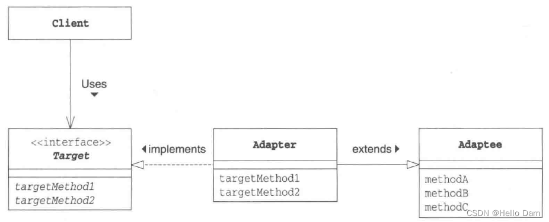
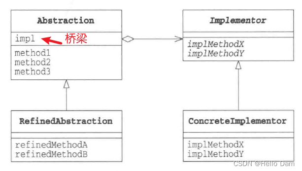
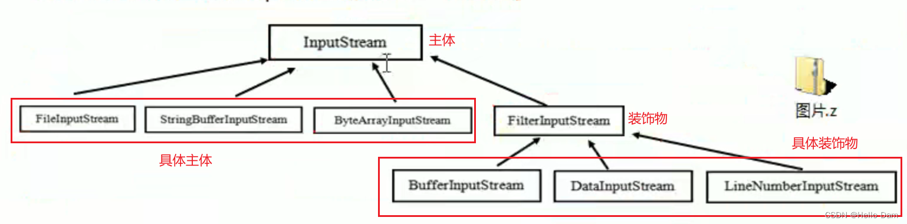
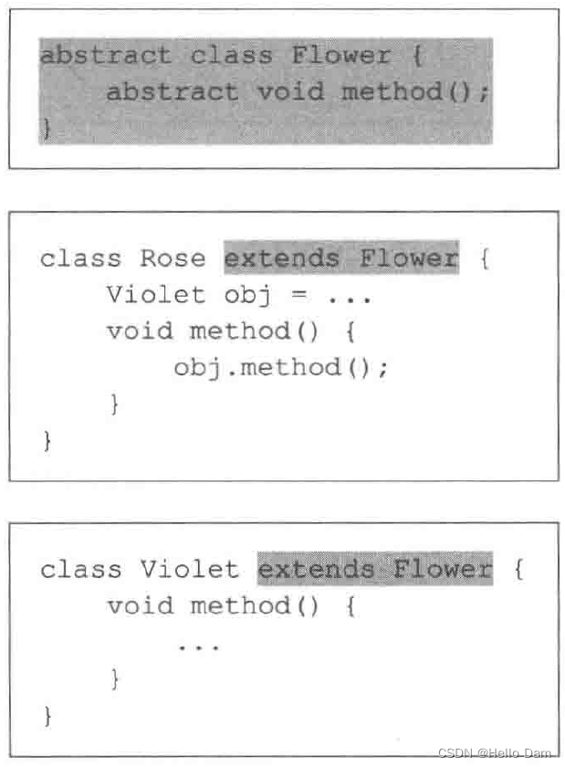

# 一、设计思想

## 一、基于接口而非实现编程

- 基于接口而非实现编程：这个原则非常重要，是一种非常有效的提高代码质量的手段，在平时的开发中特别经常被用到

### 一、解读原则中的"接口"二字

1. “基于接口而非实现编程”这条原则的英文描述是：“Program to an interface, not an implementation”。我们理解这条原则的时候，千万不要一开始就与具体的编程语言挂钩，局限在编程语言的“接口”语法中（比如 Java 中的 interface 接口语法）。这条原则最早出现于 1994 年 GoF 的《设计模式》这本书，它先于很多编程语言而诞生（比如 Java 语言），是一条比较抽象、泛化的设计思想
2. 实际上，理解这条原则的关键，就是理解其中的“接口”两个字。从本质上来看，“接口”就是一组“协议”或者“约定”，是功能提供者提供给使用者的一个“功能列表”。“接口”在不同的应用场景下会有不同的解读，比如服务端与客户端之间的“接口”，类库提供的“接口”，甚至是一组通信的协议都可以叫作“接口”。刚刚对“接口”的理解，都比较偏上层、偏抽象，与实际的写代码离得有点远。如果落实到具体的编码，“基于接口而非实现编程”这条原则中的“接口”，可以理解为编程语言中的接口或者抽象类
3. 前面我们提到，这条原则能非常有效地提高代码质量，之所以这么说，那是因为，应用这条原则，可以将接口和实现相分离，封装不稳定的实现，暴露稳定的接口。上游系统面向接口而非实现编程，不依赖不稳定的实现细节，这样当实现发生变化的时候，上游系统的代码基本上不需要做改动，以此来降低耦合性，提高扩展性
4. 实际上，“基于接口而非实现编程”这条原则的另一个表述方式，是“基于抽象而非实现编程”。后者的表述方式其实更能体现这条原则的设计初衷。在软件开发中，最大的挑战之一就是需求的不断变化，这也是考验代码设计好坏的一个标准。**越抽象、越顶层、越脱离具体某一实现的设计，越能提高代码的灵活性，越能应对未来的需求变化。好的代码设计，不仅能应对当下的需求，而且在将来需求发生变化的时候，仍然能够在不破坏原有代码设计的情况下灵活应对**。而抽象就是提高代码扩展性、灵活性、可维护性最有效的手段之一

### 二、将此原则应用到实战中

假设我们的系统中有很多涉及图片处理和存储的业务逻辑。图片经过处理之后被上传到阿里云上。为了代码复用，我们封装了图片存储相关的代码逻辑，提供了一个统一的AliyunImageStore类，供整个系统来使用。具体的代码实现如下所示：

```java
public class AliyunImageStore {
  //...省略属性、构造函数等...
  
  public void createBucketIfNotExisting(String bucketName) {
    // ...创建bucket代码逻辑...
    // ...失败会抛出异常..
  }
  
  public String generateAccessToken() {
    // ...根据accesskey/secrectkey等生成access token
  }
  
  public String uploadToAliyun(Image image, String bucketName, String accessToken) {
    //...上传图片到阿里云...
    //...返回图片存储在阿里云上的地址(url）...
  }
  
  public Image downloadFromAliyun(String url, String accessToken) {
    //...从阿里云下载图片...
  }
}

// AliyunImageStore类的使用举例
public class ImageProcessingJob {
  private static final String BUCKET_NAME = "ai_images_bucket";
  //...省略其他无关代码...
  
  public void process() {
    Image image = ...; //处理图片，并封装为Image对象
    AliyunImageStore imageStore = new AliyunImageStore(/*省略参数*/);
    imageStore.createBucketIfNotExisting(BUCKET_NAME);
    String accessToken = imageStore.generateAccessToken();
    imagestore.uploadToAliyun(image, BUCKET_NAME, accessToken);
  }
}
```

1. 整个上传流程包含三个步骤：创建bucket（简单理解为存储目录）、生成access token访问凭证、携带access token上传图片到指定的bucket中。代码实现非常简单，类中的几个方法定义得都很干净，用起来也很清晰，乍看起来没有太大问题，完全能满足我们将图片存储在阿里云的业务需求

2. 不过，软件开发中唯一不变的就是变化。过了一段时间后，我们自建了私有云，不再将图片存储到阿里云了，而是将图片存储到自建私有云上。为了满足这样一个需求的变化，那么我们需要修改代码

3. 我们需要重新设计实现一个存储图片到私有云的PrivateImageStore类，并用它替换掉项目中所有的 AliyunImageStore类对象。这样的修改听起来并不复杂，只是简单替换而已，对整个代码的改动并不大。不过，我们经常说，“细节是魔鬼”。这句话在软件开发中特别适用。实际上，刚刚的设计实现方式，就隐藏了很多容易出问题的“魔鬼细节”

4. 新的PrivateImageStore类需要设计实现哪些方法，才能在尽量最小化代码修改的情况下，如果替换掉AliyunImageStore类呢，这就要求我们必须将AliyunImageStore类中所定义的所有public方法，在 PrivateImageStore类中都逐一定义并重新实现一遍。而这样做就会存在一些问题：

   - 首先，AliyunImageStore类中有些函数命名暴露了实现细节，比如，uploadToAliyun() 和 downloadFromAliyun()。如果开发这个功能的同事没有接口意识、抽象思维，那这种暴露实现细节的命名方式就不足为奇了，毕竟最初我们只考虑将图片存储在阿里云上。而我们把这种包含“aliyun”字眼的方法，照抄到PrivateImageStore类中，显然是不合适的。如果我们在新类中重新命名uploadToAliyun()、downloadFromAliyun() 这些方法，那就意味着，我们要修改项目中所有使用到这两个方法的代码，代码修改量可能就会很大
   - 其次，将图片存储到阿里云的流程，跟存储到私有云的流程，可能并不是完全一致的。比如，阿里云的图片上传和下载的过程中，需要生产access token，而私有云不需要access token。一方面，AliyunImageStore中定义的generateAccessToken() 方法不能照抄到 PrivateImageStore中；另一方面，我们在使用AliyunImageStore上传、下载图片的时候，代码中用到了generateAccessToken()方法，如果要改为私有云的上传下载流程，这些代码都需要做调整

5. 解决这个问题的根本方法就是，在编写代码的时候，要遵从“基于接口而非实现编程”的原则，具体来讲，我们需要做到下面这3点

   - 函数的命名不能暴露任何实现细节。比如，前面提到的uploadToAliyun()就不符合要求，应该改为去掉aliyun这样的字眼，改为更加抽象的命名方式，比如：upload()
   - 封装具体的实现细节。比如，跟阿里云相关的特殊上传（或下载）流程不应该暴露给调用者。我们对上传（或下载）流程进行封装，对外提供一个包裹所有上传（或下载）细节的方法，给调用者使用
   - 为实现类定义抽象的接口。具体的实现类都依赖统一的接口定义，遵从一致的上传功能协议。使用者依赖接口，而不是具体的实现类来编程

6. 我们按照这个思路，把代码重构一下。重构后的代码如下所示：

   ```java
   public interface ImageStore {
     String upload(Image image, String bucketName);
     Image download(String url);
   }
   
   public class AliyunImageStore implements ImageStore {
     //...省略属性、构造函数等...
   
     public String upload(Image image, String bucketName) {
       createBucketIfNotExisting(bucketName);
       String accessToken = generateAccessToken();
       //...上传图片到阿里云...
       //...返回图片在阿里云上的地址(url)...
     }
   
     public Image download(String url) {
       String accessToken = generateAccessToken();
       //...从阿里云下载图片...
     }
   
     private void createBucketIfNotExisting(String bucketName) {
       // ...创建bucket...
       // ...失败会抛出异常..
     }
   
     private String generateAccessToken() {
       // ...根据accesskey/secrectkey等生成access token
     }
   }
   
   // 上传下载流程改变：私有云不需要支持access token
   public class PrivateImageStore implements ImageStore  {
     public String upload(Image image, String bucketName) {
       createBucketIfNotExisting(bucketName);
       //...上传图片到私有云...
       //...返回图片的url...
     }
   
     public Image download(String url) {
       //...从私有云下载图片...
     }
   
     private void createBucketIfNotExisting(String bucketName) {
       // ...创建bucket...
       // ...失败会抛出异常..
     }
   }
   
   // ImageStore的使用举例
   public class ImageProcessingJob {
     private static final String BUCKET_NAME = "ai_images_bucket";
     //...省略其他无关代码...
     
     public void process() {
       Image image = ...;//处理图片，并封装为Image对象
       ImageStore imageStore = new PrivateImageStore(...);
       imagestore.upload(image, BUCKET_NAME);
     }
   }
   ```

   - 除此之外，很多人在定义接口的时候，希望通过实现类来反推接口的定义。先把实现类写好，然后看实现类中有哪些方法，照抄到接口定义中。如果按照这种思考方式，就有可能导致接口定义不够抽象，依赖具体的实现。这样的接口设计就没有意义了。不过，如果你觉得这种思考方式更加顺畅，那也没问题，只是将实现类的方法搬移到接口定义中的时候，要有选择性的搬移，不要将跟具体实现相关的方法搬移到接口中，比如AliyunImageStore中的generateAccessToken()方法

7. 我们在做软件开发的时候，一定要有抽象意识、封装意识、接口意识。在定义接口的时候，不要暴露任何实现细节。接口的定义只表明做什么，而不是怎么做。而且，在设计接口的时候，我们要多思考一下，这样的接口设计是否足够通用，是否能够做到在替换具体的接口实现的时候，不需要任何接口定义的改动

### 三、是否需要为每个类定义接口

1. 为了满足“基于接口而非实现编程”原则，是不是需要给每个实现类都定义对应的接口呢？在开发的时候，是不是任何代码都要只依赖接口，完全不依赖实现编程呢？
2. 做任何事情都要讲求一个“度”，过度使用这条原则，非得给每个类都定义接口，接口满天飞，也会导致不必要的开发负担。至于什么时候，该为某个类定义接口，实现基于接口的编程，什么时候不需要定义接口，直接使用实现类编程，我们做权衡的根本依据，还是要回归到设计原则诞生的初衷上来。只要搞清楚了这条原则是为了解决什么样的问题而产生的，你就会发现，很多之前模棱两可的问题，都会变得豁然开朗
3. 这条原则的设计初衷是，将接口和实现相分离，封装不稳定的实现，暴露稳定的接口。上游系统面向接口而非实现编程，不依赖不稳定的实现细节，这样当实现发生变化的时候，上游系统的代码基本上不需要做改动，以此来降低代码间的耦合性，提高代码的扩展性
4. 从这个设计初衷上来看，如果在我们的业务场景中，某个功能只有一种实现方式，未来也不可能被其他实现方式替换，那我们就没有必要为其设计接口，也没有必要基于接口编程，直接使用实现类就可以了
5. 除此之外，越是不稳定的系统，我们越是要在代码的扩展性、维护性上下功夫。相反，如果某个系统特别稳定，在开发完之后，基本上不需要做维护，那我们就没有必要为其扩展性，投入不必要的开发时间

## 二、多用组合少用继承

- 在面向对象编程中，有一条非常经典的设计原则，那就是：组合优于继承，多用组合少用继承

### 一、不推荐使用继承的原因

1. 继承是面向对象的四大特性之一（抽象、封装、继承、多态），用来表示类之间的is-a关系，可以解决代码复用的问题。虽然继承有诸多作用，但继承层次过深、过复杂，也会影响到代码的可维护性。很多人觉得继承是一种反模式，应该尽量少用，甚至不用。为什么会有这样的争议？我们通过一个例子来解释一下

2. 假设我们要设计一个关于鸟的类。我们将“鸟类”这样一个抽象的事物概念，定义为一个抽象类 AbstractBird。所有更细分的鸟，比如麻雀、鸽子、乌鸦等，都继承这个抽象类

3. 大部分鸟都会飞，那我们可不可以在AbstractBird抽象类中，定义一个fly()方法呢？答案是否定的。尽管大部分鸟都会飞，但也有特例，比如鸵鸟就不会飞。鸵鸟继承具有 fly() 方法的父类，那鸵鸟就具有“飞”这样的行为，这显然不符合我们对现实世界中事物的认识。当然，在鸵鸟这个子类中重写（override）fly() 方法，让它抛出UnSupportedMethodException异常不就可以了吗？具体的代码实现如下所示

   ```java
   public class AbstractBird {
     //...省略其他属性和方法...
     public void fly() { //... }
   }
   
   public class Ostrich extends AbstractBird { //鸵鸟
     //...省略其他属性和方法...
     public void fly() {
       throw new UnSupportedMethodException("I can't fly.'");
     }
   }
   ```

4. 这种设计思路虽然可以解决问题，但不够优美。因为除了鸵鸟之外，不会飞的鸟还有很多，比如企鹅。对于这些不会飞的鸟来说，我们都需要重写fly()方法，抛出异常。这样的设计，一方面，徒增了编码的工作量；另一方面，也违背了我们之后要讲的最小知识原则（Least Knowledge Principle，也叫最少知识原则或者迪米特法则），暴露不该暴露的接口给外部，增加了类使用过程中被误用的概率

5. 为了解决上述问题，再通过AbstractBird类派生出两个更加细分的抽象类：会飞的鸟类AbstractFlyableBird和不会飞的鸟类AbstractUnFlyableBird，让麻雀、乌鸦这些会飞的鸟都继承 AbstractFlyableBird，让鸵鸟、企鹅这些不会飞的鸟，都继承AbstractUnFlyableBird类，不就可以了吗？具体的继承关系如下图所示

   

6. 从图中我们可以看出，继承关系变成了三层。不过，整体上来讲，目前的继承关系还比较简单，层次比较浅，也算是一种可以接受的设计思路。我们再继续加点难度。在刚刚这个场景中，我们只关注“鸟会不会飞”，但如果我们还关注“鸟会不会叫”，那这个时候，我们又该如何设计类之间的继承关系呢？

7. 是否会飞？是否会叫？两个行为搭配起来会产生四种情况：会飞会叫、不会飞会叫、会飞不会叫、不会飞不会叫。如果我们继续沿用刚才的设计思路，那就需要再定义四个抽象类AbstractFlyableTweetableBird、AbstractFlyableUnTweetableBird、AbstractUnFlyableTweetableBird、AbstractUnFlyableUnTweetableBird

   

8. 如果我们还需要考虑“是否会下蛋”这样一个行为，那估计就要组合爆炸了。**类的继承层次会越来越深、继承关系会越来越复杂。而这种层次很深、很复杂的继承关系，一方面，会导致代码的可读性变差**。因为我们要搞清楚某个类具有哪些方法、属性，必须阅读父类的代码、父类的父类的代码……一直追溯到最顶层父类的代码。另一方面，这也破坏了类的封装特性，将父类的实现细节暴露给了子类。子类的实现依赖父类的实现，两者高度耦合，一旦父类代码修改，就会影响所有子类的逻辑

9. 总之，继承最大的问题就在于：继承层次过深、继承关系过于复杂会影响到代码的可读性和可维护性。这也是为什么我们不推荐使用继承

### 二、组合相比继承更好的原因

1. 实际上，我们可以利用组合（composition）、接口、委托（delegation）三个技术手段，一块儿来解决刚刚继承存在的问题。

2. 接口表示具有某种行为特性。针对“会飞”这样一个行为特性，我们可以定义一个Flyable接口，只让会飞的鸟去实现这个接口。对于会叫、会下蛋这些行为特性，我们可以类似地定义Tweetable接口、EggLayable接口。我们将这个设计思路翻译成Java代码的话，就是下面这个样子

   ```java
   public interface Flyable {
     void fly();
   }
   public interface Tweetable {
     void tweet();
   }
   public interface EggLayable {
     void layEgg();
   }
   public class Ostrich implements Tweetable, EggLayable {//鸵鸟
     //... 省略其他属性和方法...
     @Override
     public void tweet() { //... }
     @Override
     public void layEgg() { //... }
   }
   public class Sparrow impelents Flyable, Tweetable, EggLayable {//麻雀
     //... 省略其他属性和方法...
     @Override
     public void fly() { //... }
     @Override
     public void tweet() { //... }
     @Override
     public void layEgg() { //... }
   }
   ```

3. 不过，我们知道，接口只声明方法，不定义实现。也就是说，每个会下蛋的鸟都要实现一遍 layEgg() 方法，并且实现逻辑是一样的，这就会导致代码重复的问题。那这个问题又该如何解决呢？

4. 我们可以针对三个接口再定义三个实现类，它们分别是：实现了fly()方法的FlyAbility类、实现了 tweet()方法的TweetAbility类、实现了layEgg()方法的EggLayAbility类。然后，通过组合和委托技术来消除代码重复。具体的代码实现如下所示

   ```java
   public interface Flyable {
     void fly()；
   }
   public class FlyAbility implements Flyable {
     @Override
     public void fly() { //... }
   }
   //省略Tweetable/TweetAbility/EggLayable/EggLayAbility
   
   public class Ostrich implements Tweetable, EggLayable {//鸵鸟
     private TweetAbility tweetAbility = new TweetAbility(); //组合
     private EggLayAbility eggLayAbility = new EggLayAbility(); //组合
     //... 省略其他属性和方法...
     @Override
     public void tweet() {
       tweetAbility.tweet(); // 委托
     }
     @Override
     public void layEgg() {
       eggLayAbility.layEgg(); // 委托
     }
   }
   ```

5. 我们知道继承主要有三个作用：表示is-a关系，支持多态特性，代码复用。而这三个作用都可以通过其他技术手段来达成。比如is-a关系，我们可以通过组合和接口的has-a关系来替代；多态特性我们可以利用接口来实现；代码复用我们可以通过组合和委托来实现。所以，**从理论上讲，通过组合、接口、委托三个技术手段，我们完全可以替换掉继承，在项目中不用或者少用继承关系，特别是一些复杂的继承关系**

### 三、判断用组合或继承的原则

1. 尽管我们鼓励多用组合少用继承，但组合也并不是完美的，继承也并非一无是处。从上面的例子来看，继承改写成组合意味着要做更细粒度的类的拆分。这也就意味着，我们要定义更多的类和接口。类和接口的增多也就或多或少地增加代码的复杂程度和维护成本。所以，在实际的项目开发中，我们还是要根据具体的情况，来具体选择该用继承还是组合

2. **如果类之间的继承结构稳定（不会轻易改变），继承层次比较浅（比如，最多有两层继承关系），继承关系不复杂，我们就可以大胆地使用继承。反之，系统越不稳定，继承层次很深，继承关系复杂，我们就尽量使用组合来替代继承**

3. 除此之外，还有一些设计模式会固定使用继承或者组合。比如，装饰者模式（decorator pattern）、策略模式（strategy pattern）、组合模式（composite pattern）等都使用了组合关系，而模板模式（template pattern）使用了继承关系

4. 继承可以实现代码复用。利用继承特性，我们把相同的属性和方法，抽取出来，定义到父类中。子类复用父类中的属性和方法，达到代码复用的目的。但是，有的时候，从业务含义上，A类和B类并不一定具有继承关系。比如，Crawler类和PageAnalyzer类，它们都用到了URL拼接和分割的功能，但并不具有继承关系（既不是父子关系，也不是兄弟关系）。仅仅为了代码复用，生硬地抽象出一个父类出来，会影响到代码的可读性。如果不熟悉背后设计思路，发现Crawler类和 PageAnalyzer类继承同一个父类，而父类中定义的却只是URL相关的操作，会觉得这个代码写得莫名其妙，理解不了。这个时候，使用组合就更加合理、更加灵活。具体的代码实现如下所示：

   ```java
   public class Url {
     //...省略属性和方法
   }
   
   public class Crawler {
     private Url url; // 组合
     public Crawler() {
       this.url = new Url();
     }
     //...
   }
   
   public class PageAnalyzer {
     private Url url; // 组合
     public PageAnalyzer() {
       this.url = new Url();
     }
     //..
   }
   ```

5. 还有一些特殊的场景要求我们必须使用继承。如果不能改变一个函数的入参类型，而入参又非接口，为了支持多态，只能采用继承来实现。比如下面这样一段代码，其中FeignClient是一个外部类，我们没有权限去修改这部分代码，但是我们希望能重写这个类在运行时执行的encode()函数。这个时候，我们只能采用继承来实现了

   ```java
   public class FeignClient { // Feign Client框架代码
     //...省略其他代码...
     public void encode(String url) { //... }
   }
   
   public void demofunction(FeignClient feignClient) {
     //...
     feignClient.encode(url);
     //...
   }
   
   public class CustomizedFeignClient extends FeignClient {
     @Override
     public void encode(String url) { //...重写encode的实现...}
   }
   
   // 调用
   FeignClient client = new CustomizedFeignClient();
   demofunction(client);
   ```

6. 尽管有些人说，要杜绝继承，100%用组合代替继承，其实没那么极端！之所以“多用组合少用继承”这个口号喊得这么响，只是因为，长期以来，我们过度使用继承。还是那句话，**组合并不完美，继承也不是一无是处**。只要我们控制好它们的副作用、发挥它们各自的优势，在不同的场合下，恰当地选择使用继承还是组合，这才是我们所追求的境界

## 三、通过封装、抽象、模块化、中间层等解耦代码

### 一、解耦的重要性

1. 软件设计与开发最重要的工作之一就是应对复杂性。人处理复杂性的能力是有限的。过于复杂的代码往往在可读性、可维护性上都不友好。那如何来控制代码的复杂性呢？手段有很多，最关键的就是解耦，保证代码松耦合、高内聚。如果说重构是保证代码质量不至于腐化到无可救药地步的有效手段，那么利用解耦的方法对代码重构，就是保证代码不至于复杂到无法控制的有效手段
2. 实际上，“高内聚、松耦合”是一个比较通用的设计思想，不仅可以指导细粒度的类和类之间关系的设计，还能指导粗粒度的系统、架构、模块的设计。相对于编码规范，它能够在更高层次上提高代码的可读性和可维护性
3. 不管是阅读代码还是修改代码，“高内聚、松耦合”的特性可以让我们聚焦在某一模块或类中，不需要了解太多其他模块或类的代码，让我们的焦点不至于过于发散，降低了阅读和修改代码的难度。而且，因为依赖关系简单，耦合小，修改代码不至于牵一发而动全身，代码改动比较集中，引入bug的风险也就减少了很多。同时，“高内聚、松耦合”的代码可测试性也更加好，容易mock或者很少需要mock外部依赖的模块或者类
4. 除此之外，代码“高内聚、松耦合”，也就意味着，代码结构清晰、分层和模块化合理、依赖关系简单、模块或类之间的耦合小，那代码整体的质量就不会差。即便某个具体的类或者模块设计得不怎么合理，代码质量不怎么高，影响的范围是非常有限的。我们可以聚焦于这个模块或者类，做相应的小型重构。而相对于代码结构的调整，这种改动范围比较集中的小型重构的难度就容易多了

### 二、代码是否解耦的原则

1. 代码需要解耦的间接衡量标准有很多，比如，**看修改代码会不会牵一发而动全身**。除此之外，还有一个直接的衡量标准，也是在阅读源码的时候经常会用到的，那就是把**模块与模块之间、类与类之间的依赖关系画出来，根据依赖关系图的复杂性来判断是否需要解耦重构**
2. 如果依赖关系复杂、混乱，那从代码结构上来讲，可读性和可维护性肯定不是太好，那我们就需要考虑是否可以通过解耦的方法，让依赖关系变得清晰、简单。当然，这种判断还是有比较强的主观色彩，但是可以作为一种参考和梳理依赖的手段，配合间接的衡量标准一块来使用

### 三、代码解耦的方法

#### 一、封装与抽象

- 封装和抽象作为两个非常通用的设计思想，可以应用在很多设计场景中，比如系统、模块、lib、组件、接口、类等等的设计。封装和抽象可以有效地隐藏实现的复杂性，隔离实现的易变性，给依赖的模块提供稳定且易用的抽象接口

#### 二、中间层

1. 引入中间层能简化模块或类之间的依赖关系。下面这张图是引入中间层前后的依赖关系对比图。在引入数据存储中间层之前，A、B、C三个模块都要依赖内存一级缓存、Redis二级缓存、DB持久化存储三个模块。在引入中间层之后，三个模块只需要依赖数据存储中间层一个模块即可。从图上可以看出，中间层的引入明显地简化了依赖关系，让代码结构更加清晰

   

2. 除此之外，我们在进行重构的时候，引入中间层可以起到过渡的作用，能够让开发和重构同步进行，不互相干扰。比如，某个接口设计的有问题，我们需要修改它的定义，同时，所有调用这个接口的代码都要做相应的改动。如果新开发的代码也用到这个接口，那开发就跟重构冲突了。为了让重构能小步快跑，我们可以分下面四个阶段来完成接口的修改

   - 第一阶段：引入一个中间层，包裹老的接口，提供新的接口定义
   - 第二阶段：新开发的代码依赖中间层提供的新接口
   - 第三阶段：将依赖老接口的代码改为调用新接口
   - 第四阶段：确保所有的代码都调用新接口之后，删除掉老的接口

3. 这样，每个阶段的开发工作量都不会很大，都可以在很短的时间内完成。重构跟开发冲突的概率也变小了

#### 三、模块化

- 模块化是构建复杂系统常用的手段。不仅在软件行业，在建筑、机械制造等行业，这个手段也非常有用。对于一个大型复杂系统来说，没有人能掌控所有的细节。之所以我们能搭建出如此复杂的系统，并且能维护得了，最主要的原因就是将系统划分成各个独立的模块，让不同的人负责不同的模块，这样即便在不了解全部细节的情况下，管理者也能协调各个模块，让整个系统有效运转

#### 四、其他设计思想和原则

1. “高内聚、松耦合”是一个非常重要的设计思想，能够有效提高代码的可读性和可维护性，缩小功能改动导致的代码改动范围。很多设计原则都以实现代码的“高内聚、松耦合”为目的
2. 设计模式原则
   - 单一职责原则：内聚性和耦合性并非独立的。高内聚会让代码更加松耦合，而实现高内聚的重要指导原则就是单一职责原则。模块或者类的职责设计得单一，而不是大而全，那依赖它的类和它依赖的类就会比较少，代码耦合也就相应的降低了
   - 基于接口而非实现编程：基于接口而非实现编程能通过接口这样一个中间层，隔离变化和具体的实现。这样做的好处是，在有依赖关系的两个模块或类之间，一个模块或者类的改动，不会影响到另一个模块或类。实际上，这就相当于将一种强依赖关系（强耦合）解耦为了弱依赖关系（弱耦合）
   - 依赖注入：跟基于接口而非实现编程思想类似，依赖注入也是将代码之间的强耦合变为弱耦合。尽管依赖注入无法将本应该有依赖关系的两个类，解耦为没有依赖关系，但可以让耦合关系没那么紧密，容易做到插拔替换
   - 多用组合少用继承：继承是一种强依赖关系，父类与子类高度耦合，且这种耦合关系非常脆弱，牵一发而动全身，父类的每一次改动都会影响所有的子类。相反，组合关系是一种弱依赖关系，这种关系更加灵活，所以，对于继承结构比较复杂的代码，利用组合来替换继承，也是一种解耦的有效手段
   - 迪米特法则：迪米特法则讲的是，不该有直接依赖关系的类之间，不要有依赖；有依赖关系的类之间，尽量只依赖必要的接口。从定义上，我们明显可以看出，这条原则的目的就是为了实现代码的松耦合

# 二、 设计模式原则

## 一、单一职责原则

### 一、单一职责原则概念

1. **单一职责原则**：Single Responsibility Principle，缩写为SRP。**一个类或者模块只负责完成一个职责（或者功能）**
2. 这个原则描述的对象包含两个，一个是类（class），一个是模块（module）。关于这两个概念，有两种理解方式

   - 把模块看作比类更加抽象的概念，类也可以看作模块
   - 把模块看作比类更加粗粒度的代码块，模块中包含多个类，多个类组成一个模块
   - 简而言之，一个类或者一个模块的类负责完成一个职责或一个功能
3. 单一职责原则的定义描述非常简单，也不难理解。一个类只负责完成一个职责或者功能。也就是说，不要设计大而全的类，要设计粒度小、功能单一的类。换个角度来讲就是，一个类包含了两个或者两个以上业务不相干的功能，那我们就说它职责不够单一，应该将它拆分成多个功能更加单一、粒度更细的类
4. 案例：一个类里既包含订单的一些操作，又包含用户的一些操作。而订单和用户是两个独立的业务领域模型，我们将两个不相干的功能放到同一个类中，那就违反了单一职责原则。为了满足单一职责原则，我们需要将这个类拆分成两个粒度更细、功能更加单一的两个类：订单类和用户类

### 二、判断类或模块的职责单一的标准

1. 从刚刚这个例子来看，单一职责原则看似不难应用。那是因为上述案例比较极端，一眼就能看出订单和用户毫不相干。但大部分情况下，类里的方法是归为同一类功能，还是归为不相关的两类功能，并不是那么容易判定的。在真实的软件开发中，对于一个类是否职责单一的判定，是很难拿捏的

2. 再举案例：在一个社交产品中，用下面的UserInfo类来记录用户的信息

   ```java
   public class UserInfo {
     private long userId;
     private String username;
     private String email;
     private String telephone;
     private long createTime;
     private long lastLoginTime;
     private String avatarUrl;
     private String provinceOfAddress; // 省
     private String cityOfAddress; // 市
     private String regionOfAddress; // 区 
     private String detailedAddress; // 详细地址
     // ...省略其他属性和方法...
   }
   ```

3. UserInfo类的设计是否满足单一职责原则，有两种不同的观点

   - 一种观点是，UserInfo类包含的都是跟用户相关的信息，所有的属性和方法都隶属于用户这样一个业务模型，满足单一职责原则
   - 另一种观点是，地址信息在UserInfo类中，所占的比重比较高，可以继续拆分成独立的UserAddress类，UserInfo只保留除Address之外的其他信息，拆分之后的两个类的职责更加单一

4. 上述观点孰对孰错？实际上，要从中做出选择，我们不能脱离具体的应用场景。如果在这个社交产品中，用户的地址信息跟其他信息一样，只是单纯地用来展示，那UserInfo现在的设计就是合理的。但是，如果这个社交产品发展得比较好，之后又在产品中添加了电商的模块，用户的地址信息还会用在电商物流中，那我们最好将地址信息从UserInfo 中拆分出来，独立成用户物流信息（或者叫地址信息、收货信息等）

5. 再进一步延伸一下。如果做这个社交产品的公司发展得越来越好，公司内部又开发出了很多其他产品（可以理解为其他App）。公司希望支持统一账号系统，也就是用户一个账号可以在公司内部的所有产品中登录。这个时候，我们就需要继续对UserInfo进行拆分，将跟身份认证相关的信息（比如，email、telephone等）抽取成独立的类

6. 从刚刚这个例子可以总结出，不同的应用场景、不同阶段的需求背景下，对同一个类的职责是否单一的判定，可能都是不一样的。在某种应用场景或者当下的需求背景下，一个类的设计可能已经满足单一职责原则了，但如果换个应用场景或着在未来的某个需求背景下，可能就不满足了，需要继续拆分成粒度更细的类

7. 除此之外，从不同的业务层面去看待同一个类的设计，对类是否职责单一，也会有不同的认识。比如，例子中的UserInfo类。如果我们从“用户”这个业务层面来看，UserInfo包含的信息都属于用户，满足职责单一原则。如果我们从更加细分的“用户展示信息”“地址信息”“登录认证信息”等等这些更细粒度的业务层面来看，那UserInfo就应该继续拆分

8. 综上所述，评价一个类的职责是否足够单一，我们并没有一个非常明确的、可以量化的标准，可以说，这是件非常主观、仁者见仁智者见智的事情。实际上，在真正的软件开发中，我们也没必要过于未雨绸缪，过度设计。所以，我们可以先写一个粗粒度的类，满足业务需求。随着业务的发展，如果粗粒度的类越来越庞大，代码越来越多，这个时候，我们就可以将这个粗粒度的类，拆分成几个更细粒度的类。这就是所谓的持续重构

9. 这个原则如此含糊不清、模棱两可，到底该如何拿捏才好啊？以下方面可以从侧面上判定一个类的职责是否够单一。而且下面这几条判断原则，比起很主观地去思考类是否职责单一，要更有指导意义、更具有可执行性：

   - 类中的代码行数、函数或属性过多，会影响代码的可读性和可维护性，我们就需要考虑对类进行拆分
   - 类依赖的其他类过多，或者依赖类的其他类过多，不符合高内聚、低耦合的设计思想，我们就需要考虑对类进行拆分
   - 私有方法过多，我们就要考虑能否将私有方法独立到新的类中，设置为public方法，供更多的类使用，从而提高代码的复用性
   - 比较难给类起一个合适名字，很难用一个业务名词概括，或者只能用一些笼统的Manager、Context之类的词语来命名，这就说明类的职责定义得可能不够清晰
   - 类中大量的方法都是集中操作类中的某几个属性，比如，在UserInfo例子中，如果一半的方法都是在操作address 信息，那就可以考虑将这几个属性和对应的方法拆分出来

10. 在上面的判定原则中，提到类中的代码行数、函数或者属性过多，就有可能不满足单一职责原则。那多少行代码才算是行数过多呢？多少个函数、属性才称得上过多呢？实际上，也可以给你一个凑活能用、比较宽泛的、可量化的标准，那就是一个类的代码行数最好不能超过200行，函数个数及属性个数都最好不要超过10 个

11. 实际上， 从另一个角度来看，当一个类的代码，读起来让你头大了，实现某个功能时不知道该用哪个函数了，想用哪个函数翻半天都找不到了，只用到一个小功能要引入整个类（类中包含很多无关此功能实现的函数）的时候，这就说明类的行数、函数、属性过多了。实际上，等做多项目了，代码写多了，在开发中慢慢“品尝”，自然就知道什么是“放盐少许”了，这就是所谓的“专业第六感”

### 三、类或模块的职责与单一性的关系

1. 为了满足单一职责原则，是不是把类拆得越细就越好呢？答案是否定的。比如Serialization类实现了一个简单协议的序列化和反序列功能，具体代码如下：

   ```java
   /**
    * Protocol format: identifier-string;{gson string}
    * For example: UEUEUE;{"a":"A","b":"B"}
    */
   public class Serialization {
     private static final String IDENTIFIER_STRING = "UEUEUE;";
     private Gson gson;
     
     public Serialization() {
       this.gson = new Gson();
     }
     
     public String serialize(Map<String, String> object) {
       StringBuilder textBuilder = new StringBuilder();
       textBuilder.append(IDENTIFIER_STRING);
       textBuilder.append(gson.toJson(object));
       return textBuilder.toString();
     }
     
     public Map<String, String> deserialize(String text) {
       if (!text.startsWith(IDENTIFIER_STRING)) {
           return Collections.emptyMap();
       }
       String gsonStr = text.substring(IDENTIFIER_STRING.length());
       return gson.fromJson(gsonStr, Map.class);
     }
   }
   ```

2. 如果我们想让类的职责更加单一，我们对Serialization类进一步拆分，拆分成一个只负责序列化工作的Serializer类和另一个只负责反序列化工作的Deserializer类。拆分后的具体代码如下所示：

   ```java
   public class Serializer {
     private static final String IDENTIFIER_STRING = "UEUEUE;";
     private Gson gson;
     
     public Serializer() {
       this.gson = new Gson();
     }
     
     public String serialize(Map<String, String> object) {
       StringBuilder textBuilder = new StringBuilder();
       textBuilder.append(IDENTIFIER_STRING);
       textBuilder.append(gson.toJson(object));
       return textBuilder.toString();
     }
   }
   
   public class Deserializer {
     private static final String IDENTIFIER_STRING = "UEUEUE;";
     private Gson gson;
     
     public Deserializer() {
       this.gson = new Gson();
     }
     
     public Map<String, String> deserialize(String text) {
       if (!text.startsWith(IDENTIFIER_STRING)) {
           return Collections.emptyMap();
       }
       String gsonStr = text.substring(IDENTIFIER_STRING.length());
       return gson.fromJson(gsonStr, Map.class);
     }
   }
   ```

3. 虽然经过拆分之后，Serializer类和Deserializer类的职责更加单一了，但也随之带来了新的问题。如果我们修改了协议的格式，数据标识从“UEUEUE”改为“DFDFDF”，或者序列化方式从JSON改为了XML，那Serializer类和Deserializer 类都需要做相应的修改，代码的内聚性显然没有原来Serialization高了。而且，如果我们仅仅对Serializer类做了协议修改，而忘记了修改Deserializer类的代码，那就会导致序列化、反序列化不匹配，程序运行出错，也就是说，拆分之后，代码的可维护性变差了

4. 实际上，不管是应用设计原则还是设计模式，最终的目的还是提高代码的可读性、可扩展性、复用性、可维护性等。我们在考虑应用某一个设计原则是否合理的时候，也可以以此作为最终的考量标准

## 二、开闭原则

1. **开闭原则：对扩展开放，对修改关闭**。在程序需要进行拓展的时候，不能去修改原有的代码，实现一个热插拔的效果。简言之，是为了使程序的扩展性好，易于维护和升级

2. 想要达到这样的效果，我们需要使用接口和抽象类

3. 因为抽象灵活性好，适应性广，只要抽象的合理，可以基本保持软件架构的稳定。而软件中易变的细节可以从抽象派生来的实现类来进行扩展，当软件需要发生变化时，只需要根据需求重新派生一个实现类来扩展就可以了


### 一、理解“对扩展开放、修改关闭”

1. 开闭原则的英文全称是Open Closed Principle，简写为OCP。即：软件实体（模块、类、方法等）应该“对扩展开放、对修改关闭”

2. 通俗地讲，添加一个新的功能应该是，在已有代码基础上扩展代码（新增模块、类、方法等），而非修改已有代码（修改模块、类、方法等）

3. 案例：以下是API接口监控告警的代码。其中AlertRule存储告警规则，可以自由设置。Notification是告警通知类，支持邮件、短信、微信、手机等多种通知渠道。NotificationEmergencyLevel表示通知的紧急程度，包括SEVERE（严重）、URGENCY（紧急）、NORMAL（普通）、TRIVIAL（无关紧要），不同的紧急程度对应不同的发送渠道

   ```java
   public class Alert {
     private AlertRule rule;
     private Notification notification;
   
     public Alert(AlertRule rule, Notification notification) {
       this.rule = rule;
       this.notification = notification;
     }
   
     public void check(String api, long requestCount, long errorCount, long durationOfSeconds) {
       long tps = requestCount / durationOfSeconds;
       if (tps > rule.getMatchedRule(api).getMaxTps()) {
         notification.notify(NotificationEmergencyLevel.URGENCY, "...");
       }
       if (errorCount > rule.getMatchedRule(api).getMaxErrorCount()) {
         notification.notify(NotificationEmergencyLevel.SEVERE, "...");
       }
     }
   }
   ```

4. 上面这段代码非常简单，业务逻辑主要集中在check()函数中。当接口的TPS超过某个预先设置的最大值时，以及当接口请求出错数大于某个最大允许值时，就会触发告警，通知接口的相关负责人或者团队

5. 现在，如果我们需要添加一个功能，当每秒钟接口超时请求个数，超过某个预先设置的最大阈值时，我们也要触发告警发送通知。这个时候，主要的改动有两处：第一处是修改check()函数的入参，添加一个新的统计数据timeoutCount，表示超时接口请求数；第二处是在check()函数中添加新的告警逻辑。具体的代码改动如下所示：

   ```java
   public class Alert {
     // ...省略AlertRule/Notification属性和构造函数...
     
     // 改动一：添加参数timeoutCount
     public void check(String api, long requestCount, long errorCount, long timeoutCount, long durationOfSeconds) {
       long tps = requestCount / durationOfSeconds;
       if (tps > rule.getMatchedRule(api).getMaxTps()) {
         notification.notify(NotificationEmergencyLevel.URGENCY, "...");
       }
       if (errorCount > rule.getMatchedRule(api).getMaxErrorCount()) {
         notification.notify(NotificationEmergencyLevel.SEVERE, "...");
       }
       // 改动二：添加接口超时处理逻辑
       long timeoutTps = timeoutCount / durationOfSeconds;
       if (timeoutTps > rule.getMatchedRule(api).getMaxTimeoutTps()) {
         notification.notify(NotificationEmergencyLevel.URGENCY, "...");
       }
     }
   }
   ```

6. 这样的代码修改实际上存在挺多问题的。一方面，我们对接口进行了修改，这就意味着调用这个接口的代码都要做相应的修改。另一方面，修改了check()函数，相应的单元测试都需要修改

7. 上面的代码改动是基于“修改”的方式来实现新功能的。如果我们遵循开闭原则，也就是“对扩展开放、对修改关闭”。那如何通过“扩展”的方式，来实现同样的功能呢？

8. 我们先重构一下之前的Alert代码，让它的扩展性更好一些。重构的内容主要包含两部分：第一部分是将check()函数的多个入参封装成ApiStatInfo类；第二部分是引入handler的概念，将if判断逻辑分散在各个handler中。具体的代码实现如下所示：

   ```java
   public class Alert {
     private List<AlertHandler> alertHandlers = new ArrayList<>();
     
     public void addAlertHandler(AlertHandler alertHandler) {
       this.alertHandlers.add(alertHandler);
     }
   
     public void check(ApiStatInfo apiStatInfo) {
       for (AlertHandler handler : alertHandlers) {
         handler.check(apiStatInfo);
       }
     }
   }
   
   public class ApiStatInfo {//省略constructor/getter/setter方法
     private String api;
     private long requestCount;
     private long errorCount;
     private long durationOfSeconds;
   }
   
   public abstract class AlertHandler {
     protected AlertRule rule;
     protected Notification notification;
     public AlertHandler(AlertRule rule, Notification notification) {
       this.rule = rule;
       this.notification = notification;
     }
     public abstract void check(ApiStatInfo apiStatInfo);
   }
   
   public class TpsAlertHandler extends AlertHandler {
     public TpsAlertHandler(AlertRule rule, Notification notification) {
       super(rule, notification);
     }
   
     @Override
     public void check(ApiStatInfo apiStatInfo) {
       long tps = apiStatInfo.getRequestCount()/ apiStatInfo.getDurationOfSeconds();
       if (tps > rule.getMatchedRule(apiStatInfo.getApi()).getMaxTps()) {
         notification.notify(NotificationEmergencyLevel.URGENCY, "...");
       }
     }
   }
   
   public class ErrorAlertHandler extends AlertHandler {
     public ErrorAlertHandler(AlertRule rule, Notification notification){
       super(rule, notification);
     }
   
     @Override
     public void check(ApiStatInfo apiStatInfo) {
       if (apiStatInfo.getErrorCount() > rule.getMatchedRule(apiStatInfo.getApi()).getMaxErrorCount()) {
         notification.notify(NotificationEmergencyLevel.SEVERE, "...");
       }
     }
   }
   ```

9. 上面的代码是对Alert的重构，我们再来看下，重构之后的Alert使用方法。其中，ApplicationContext是一个单例类，负责Alert的创建、组装（alertRule和notification的依赖注入）、初始化（添加handlers）工作

   ```java
   public class ApplicationContext {
     private AlertRule alertRule;
     private Notification notification;
     private Alert alert;
     
     public void initializeBeans() {
       alertRule = new AlertRule(/*.省略参数.*/); //省略一些初始化代码
       notification = new Notification(/*.省略参数.*/); //省略一些初始化代码
       alert = new Alert();
       alert.addAlertHandler(new TpsAlertHandler(alertRule, notification));
       alert.addAlertHandler(new ErrorAlertHandler(alertRule, notification));
     }
     public Alert getAlert() { return alert; }
   
     // 饿汉式单例
     private static final ApplicationContext instance = new ApplicationContext();
     private ApplicationContext() {
       initializeBeans();
     }
     public static ApplicationContext getInstance() {
       return instance;
     }
   }
   
   public class Demo {
     public static void main(String[] args) {
       ApiStatInfo apiStatInfo = new ApiStatInfo();
       // ...省略设置apiStatInfo数据值的代码
       ApplicationContext.getInstance().getAlert().check(apiStatInfo);
     }
   }
   ```

10. 现在，我们再来看下，基于重构之后的代码，如果再添加上面讲到的那个新功能，每秒钟接口超时请求个数超过某个最大阈值就告警，主要的改动有下面四处

    - 第一处改动是：在ApiStatInfo类中添加新的属性timeoutCount
    - 第二处改动是：添加新的TimeoutAlertHander类
    - 第三处改动是：在ApplicationContext类的initializeBeans()方法中，往alert对象中注册新的timeoutAlertHandler
    - 第四处改动是：在使用Alert类的时候，需要给check()函数的入参apiStatInfo对象设置timeoutCount的值

11. 改动之后的代码如下所示：

    ```java
    public class Alert { // 代码未改动... }
    public class ApiStatInfo {//省略constructor/getter/setter方法
      private String api;
      private long requestCount;
      private long errorCount;
      private long durationOfSeconds;
      private long timeoutCount; // 改动一：添加新字段
    }
    public abstract class AlertHandler { //代码未改动... }
    public class TpsAlertHandler extends AlertHandler {//代码未改动...}
    public class ErrorAlertHandler extends AlertHandler {//代码未改动...}
    // 改动二：添加新的handler
    public class TimeoutAlertHandler extends AlertHandler {//省略代码...}
    
    public class ApplicationContext {
      private AlertRule alertRule;
      private Notification notification;
      private Alert alert;
      
      public void initializeBeans() {
        alertRule = new AlertRule(/*.省略参数.*/); //省略一些初始化代码
        notification = new Notification(/*.省略参数.*/); //省略一些初始化代码
        alert = new Alert();
        alert.addAlertHandler(new TpsAlertHandler(alertRule, notification));
        alert.addAlertHandler(new ErrorAlertHandler(alertRule, notification));
        // 改动三：注册handler
        alert.addAlertHandler(new TimeoutAlertHandler(alertRule, notification));
      }
      //...省略其他未改动代码...
    }
    
    public class Demo {
      public static void main(String[] args) {
        ApiStatInfo apiStatInfo = new ApiStatInfo();
        // ...省略apiStatInfo的set字段代码
        apiStatInfo.setTimeoutCount(289); // 改动四：设置tiemoutCount值
        ApplicationContext.getInstance().getAlert().check(apiStatInfo);
    }
    ```

12. 重构之后的代码更加灵活和易扩展。如果我们要想添加新的告警逻辑，只需要基于扩展的方式创建新的handler类即可，不需要改动原来的check()函数的逻辑。而且，我们只需要为新的handler类添加单元测试，老的单元测试都不会失败，也不用修改

### 二、修改代码不意味着违背开闭原则

看了上面重构之后的代码，你可能还会有疑问：在添加新的告警逻辑的时候，尽管改动二（添加新的handler类）是基于扩展而非修改的方式来完成的，但改动一、三、四貌似不是基于扩展而是基于修改的方式来完成的，那改动一、三、四不就违背了开闭原则吗？

1. 我们先来分析一下改动一：往ApiStatInfo类中添加新的属性timeoutCount
   - 实际上，我们不仅往ApiStatInfo类中添加了属性，还添加了对应的getter/setter方法。那这个问题就转化为：给类中添加新的属性和方法，算作“修改”还是“扩展”？
   - 我们再一块回忆一下开闭原则的定义：软件实体（模块、类、方法等）应该“对扩展开放、对修改关闭”。从定义中，我们可以看出，开闭原则可以应用在不同粒度的代码中，可以是模块，也可以类，还可以是方法（及其属性）。同样一个代码改动，在粗代码粒度下，被认定为“修改”，在细代码粒度下，又可以被认定为“扩展”。比如，改动一，添加属性和方法相当于修改类，在类这个层面，这个代码改动可以被认定为“修改”；但这个代码改动并没有修改已有的属性和方法，在方法（及其属性）这一层面，它又可以被认定为“扩展”
   - 实际上，我们也没必要纠结某个代码改动是“修改”还是“扩展”，更没必要太纠结它是否违反“开闭原则”。我们回到这条原则的设计初衷：**只要它没有破坏原有的代码的正常运行，没有破坏原有的单元测试，我们就可以说，这是一个合格的代码改动**
2. 我们再来分析一下改动三和改动四：在ApplicationContext类的initializeBeans()方法中，往alert对象中注册新的 timeoutAlertHandler；在使用Alert类的时候，需要给check()函数的入参apiStatInfo对象设置timeoutCount的值
   - 这两处改动都是在方法内部进行的，不管从哪个层面（模块、类、方法）来讲，都不能算是“扩展”，而是地地道道的“修改”。不过，有些修改是在所难免的，是可以被接受的
   - 在重构之后的Alert代码中，我们的核心逻辑集中在Alert类及其各个handler中，当我们在添加新的告警逻辑的时候，Alert类完全不需要修改，而只需要扩展一个新handler类。如果我们把Alert类及各个handler类合起来看作一个“模块”，那模块本身在添加新的功能的时候，完全满足开闭原则
   - 而且，我们要认识到，添加一个新功能，不可能任何模块、类、方法的代码都不“修改”，这个是做不到的。类需要创建、组装、并且做一些初始化操作，才能构建成可运行的的程序，这部分代码的修改是在所难免的。**我们要做的是尽量让修改操作更集中、更少、更上层，尽量让最核心、最复杂的那部分逻辑代码满足开闭原则**

### 三、"对扩展开放、修改关闭"的使用

1. 在刚刚的例子中，我们通过引入一组handler的方式来实现支持开闭原则。如果你没有太多复杂代码的设计和开发经验，你可能会有这样的疑问：这样的代码设计思路我怎么想不到呢？你是怎么想到的呢？靠的就是理论知识和实战经验，这些需要慢慢学习和积累。对于如何做到“对扩展开放、修改关闭”，以下是有关建议

2. 实际上，开闭原则讲的就是代码的扩展性问题，是判断一段代码是否易扩展的“金标准”。如果某段代码在应对未来需求变化的时候，能够做到“对扩展开放、对修改关闭”，那就说明这段代码的扩展性比较好。所以，问如何才能做到“对扩展开放、对修改关闭”，也就粗略地等同于在问，如何才能写出扩展性好的代码

3. 在讲具体的方法论之前，我们先来看一些更加偏向顶层的指导思想。**为了尽量写出扩展性好的代码，我们要时刻具备扩展意识、抽象意识、封装意识**。这些“潜意识”可能比任何开发技巧都重要

   - 在写代码的时候后，我们要多花点时间往前多思考一下，这段代码未来可能有哪些需求变更、如何设计代码结构，事先留好扩展点，以便在未来需求变更的时候，不需要改动代码整体结构、做到最小代码改动的情况下，新的代码能够很灵活地插入到扩展点上，做到“对扩展开放、对修改关闭”
   - 还有，在识别出代码可变部分和不可变部分之后，我们要将可变部分封装起来，隔离变化，提供抽象化的不可变接口，给上层系统使用。当具体的实现发生变化的时候，我们只需要基于相同的抽象接口，扩展一个新的实现，替换掉老的实现即可，上游系统的代码几乎不需要修改

4. 刚刚讲了实现开闭原则的一些偏向顶层的指导思想，现在我们再来看下，支持开闭原则的一些更加具体的方法论

   - 代码的扩展性是代码质量评判的最重要的标准之一。实际上，设计模式的大部分知识点都是围绕扩展性问题来讲解的。讲到的很多设计原则、设计思想、设计模式，都是以提高代码的扩展性为最终目的的。特别是23种经典设计模式，大部分都是为了解决代码的扩展性问题而总结出来的，都是以开闭原则为指导原则的

   - 在众多的设计原则、思想、模式中，最常用来提高代码扩展性的方法有：多态、依赖注入、基于接口而非实现编程，以及大部分的设计模式（比如，装饰、策略、模板、职责链、状态等）。此章节只说如何利用多态、依赖注入、基于接口而非实现编程，来实现“对扩展开放、对修改关闭”

   - 实际上，多态、依赖注入、基于接口而非实现编程，以及前面提到的抽象意识，说的都是同一种设计思路，只是从不同的角度、不同的层面来阐述而已。这也体现了“很多设计原则、思想、模式都是相通的”这一思想

   - 案例：我们代码中通过Kafka来发送异步消息。对于这样一个功能的开发，我们要学会将其抽象成一组跟具体消息队列（Kafka）无关的异步消息接口。所有上层系统都依赖这组抽象的接口编程，并且通过依赖注入的方式来调用。当我们要替换新的消息队列的时候，比如将Kafka替换成RocketMQ，可以很方便地拔掉老的消息队列实现，插入新的消息队列实现。具体代码如下所示：

     ```java
     // 这一部分体现了抽象意识
     public interface MessageQueue { //... }
     public class KafkaMessageQueue implements MessageQueue { //... }
     public class RocketMQMessageQueue implements MessageQueue {//...}
     
     public interface MessageFromatter { //... }
     public class JsonMessageFromatter implements MessageFromatter {//...}
     public class ProtoBufMessageFromatter implements MessageFromatter {//...}
     
     public class Demo {
       private MessageQueue msgQueue; // 基于接口而非实现编程
       public Demo(MessageQueue msgQueue) { // 依赖注入
         this.msgQueue = msgQueue;
       }
       
       // msgFormatter：多态、依赖注入
       public void sendNotification(Notification notification, MessageFormatter msgFormatter) {
         //...    
       }
     }
     ```

### 四、在项目中灵活应用开闭原则

1. 前面我们提到，写出支持“对扩展开放、对修改关闭”的代码的关键是预留扩展点。那问题是如何才能识别出所有可能的扩展点呢？
2. 如果你开发的是一个业务导向的系统，比如金融系统、电商系统、物流系统等，要想识别出尽可能多的扩展点，就要对业务有足够的了解，能够知道当下以及未来可能要支持的业务需求。如果你开发的是跟业务无关的、通用的、偏底层的系统，比如，框架、组件、类库，你需要了解“它们会被如何使用？今后你打算添加哪些功能？使用者未来会有哪些更多的功能需求？”等问题
3. 不过，有一句话说得好，“唯一不变的只有变化本身”。即便我们对业务、对系统有足够的了解，那也不可能识别出所有的扩展点，即便你能识别出所有的扩展点，为这些地方都预留扩展点，这样做的成本也是不可接受的。我们没必要为一些遥远的、不一定发生的需求去提前买单，做过度设计
4. 最合理的做法是，对于一些比较确定的、短期内可能就会扩展，或者需求改动对代码结构影响比较大的情况，或者实现成本不高的扩展点，在编写代码的时候之后，我们就可以事先做些扩展性设计。但对于一些不确定未来是否要支持的需求，或者实现起来比较复杂的扩展点，我们可以等到有需求驱动的时候，再通过重构代码的方式来支持扩展的需求。
5. 而且，开闭原则也并不是免费的。有些情况下，代码的扩展性会跟可读性相冲突。比如，我们之前举的Alert告警的例子。为了更好地支持扩展性，我们对代码进行了重构，重构之后的代码要比之前的代码复杂很多，理解起来也更加有难度。很多时候，我们都需要在扩展性和可读性之间做权衡。在某些场景下，代码的扩展性很重要，我们就可以适当地牺牲一些代码的可读性；在另一些场景下，代码的可读性更加重要，那我们就适当地牺牲一些代码的可扩展性
6. 在我们之前举的Alert告警的例子中，如果告警规则并不是很多、也不复杂，那check()函数中的if语句就不会很多，代码逻辑也不复杂，代码行数也不多，那最初的第一种代码实现思路简单易读，就是比较合理的选择。相反，如果告警规则很多、很复杂，check()函数的if语句、代码逻辑就会很多、很复杂，相应的代码行数也会很多，可读性、可维护性就会变差，那重构之后的第二种代码实现思路就是更加合理的选择了。总之，这里没有一个放之四海而皆准的参考标准，全凭实际的应用场景来决定

## 三、里氏替换原则

### 一、里氏替换原则概述

1. **里氏代换原则**：Liskov Substitution Principle，缩写为LSP。**任何基类可以出现的地方，子类一定可以出现。通俗理解：子类可以扩展父类的功能，但不能改变父类原有的功能。换句话说，子类继承父类时，除添加新的方法完成新增功能外，尽量不要重写父类的方法**（如果需要重写父类的方法可以使用抽象类，就是开闭原则了）

2. 如果通过重写父类的方法来完成新的功能，这样写起来虽然简单，但是整个继承体系的可复用性会比较差，特别是运用多态比较频繁时，程序运行出错的概率会非常大

3. 案例：父类Transporter使用org.apache.http库中的HttpClient类来传输网络数据。子类SecurityTransporter继承父类 Transporter，增加了额外的功能，支持传输appId和appToken安全认证信息

   ```java
   public class Transporter {
       private HttpClient httpClient;
   
       public Transporter(HttpClient httpClient) {
           this.httpClient = httpClient;
       }
   
       public Response sendRequest(Request request) {
           // ...use httpClient to send request
       }
   }
   
   public class SecurityTransporter extends Transporter {
       private String appId;
       private String appToken;
   
       public SecurityTransporter(HttpClient httpClient, String appId, String appToken) {
           super(httpClient);
           this.appId = appId;
           this.appToken = appToken;
       }
   
       @Override
       public Response sendRequest(Request request) {
           if (StringUtils.isNotBlank(appId) && StringUtils.isNotBlank(appToken)) {
               request.addPayload("app-id", appId);
               request.addPayload("app-token", appToken);
           }
           return super.sendRequest(request);
       }
   }
   
   public class Demo {    
       public void demoFunction(Transporter transporter) {    
           Reuqest request = new Request();
           //...省略设置request中数据值的代码...
           Response response = transporter.sendRequest(request);
           //...省略其他逻辑...
       }
   }
   
   // 里式替换原则
   Demo demo = new Demo();
   demo.demofunction(new SecurityTransporter(/*省略参数*/););
   ```

4. 在上面的代码中，子类SecurityTransporter的设计完全符合里式替换原则，可以替换父类出现的任何位置，并且原来代码的逻辑行为不变且正确性也没有被破坏

5. 不过，刚刚的代码设计不就是简单利用了面向对象的多态特性吗？多态和里式替换原则说的是不是一回事呢？从刚刚的例子和定义描述来看，里式替换原则跟多态看起来确实有点类似，但实际上它们完全是两回事。为什么这么说呢？

6. 我们还是通过刚才这个例子来解释一下。不过，我们需要对SecurityTransporter类中sendRequest()函数稍加改造一下。改造前，如果appId或者appToken没有设置，我们就不做校验；改造后，如果appId或者appToken没有设置，则直接抛出NoAuthorizationRuntimeException未授权异常。改造前后的代码对比如下所示：

   ```java
   // 改造前：
   public class SecurityTransporter extends Transporter {
     //...省略其他代码..
     @Override
     public Response sendRequest(Request request) {
       if (StringUtils.isNotBlank(appId) && StringUtils.isNotBlank(appToken)) {
         request.addPayload("app-id", appId);
         request.addPayload("app-token", appToken);
       }
       return super.sendRequest(request);
     }
   }
   
   // 改造后：
   public class SecurityTransporter extends Transporter {
     //...省略其他代码..
     @Override
     public Response sendRequest(Request request) {
       if (StringUtils.isBlank(appId) || StringUtils.isBlank(appToken)) {
         throw new NoAuthorizationRuntimeException(...);
       }
       request.addPayload("app-id", appId);
       request.addPayload("app-token", appToken);
       return super.sendRequest(request);
     }
   }
   ```

7. 在改造之后的代码中，如果传递进demoFunction()函数的是父类Transporter对象，那demoFunction()函数并不会有异常抛出，但如果传递给demoFunction()函数的是子类SecurityTransporter对象，那demoFunction()有可能会有异常抛出。尽管代码中抛出的是运行时异常（Runtime Exception），我们可以不在代码中显式地捕获处理，但子类替换父类传递进demoFunction函数之后，整个程序的逻辑行为有了改变

8. 虽然改造之后的代码仍然可以通过Java的多态语法，动态地用子类SecurityTransporter来替换父类Transporter，也并不会导致程序编译或者运行报错。但是，从设计思路上来讲，SecurityTransporter的设计是不符合里式替换原则的

9. 稍微总结一下。虽然从定义描述和代码实现上来看，多态和里式替换有点类似，但它们关注的角度是不一样的。多态是面向对象编程的一大特性，也是面向对象编程语言的一种语法。它是一种代码实现的思路。而**里式替换是一种设计原则，是用来指导继承关系中子类该如何设计的，子类的设计要保证在替换父类的时候，不改变原有程序的逻辑以及不破坏原有程序的正确性（不破坏可不意味着不能修改，可以在父类方法的基础上添加代码）**

### 二、明显违背了LSP的代码

实际上，里式替换原则还有另外一个更加能落地、更有指导意义的描述，那就是“Design By Contract”，中文翻译就是“按照协议来设计”。即子类在设计的时候，要遵守父类的行为约定（或者叫协议）。父类定义了函数的行为约定，那子类可以改变函数的内部实现逻辑，但不能改变函数原有的行为约定。这里的行为约定包括：函数声明要实现的功能；对输入、输出、异常的约定；甚至包括注释中所罗列的任何特殊说明。实际上，定义中父类和子类之间的关系，也可以替换成接口和实现类之间的关系。为了更好地理解这句话，举几个违反里式替换原则的例子来解释一下

1. 子类违背父类声明要实现的功能
   - 父类中提供的sortOrdersByAmount()订单排序函数，是按照金额从小到大来给订单排序的，而子类重写这个 sortOrdersByAmount()订单排序函数之后，是按照创建日期来给订单排序的。那子类的设计就违背里式替换原则
2. 子类违背父类对输入、输出、异常的约定
   - 在父类中，某个函数约定：运行出错的时候返回null；获取数据为空的时候返回空集合（empty collection）。而子类重载函数之后，实现变了，运行出错返回异常（exception），获取不到数据返回null。那子类的设计就违背里式替换原则
   - 在父类中，某个函数约定，输入数据可以是任意整数，但子类实现的时候，只允许输入数据是正整数，负数就抛出，也就是说，子类对输入的数据的校验比父类更加严格，那子类的设计就违背了里式替换原则
   - 在父类中，某个函数约定，只会抛出ArgumentNullException异常，那子类的设计实现中只允许抛出ArgumentNullException异常，任何其他异常的抛出，都会导致子类违背里式替换原则
3. 子类违背父类注释中所罗列的任何特殊说明
   - 父类中定义的withdraw()提现函数的注释是这么写的：“用户的提现金额不得超过账户余额……”，而子类重写 withdraw()函数之后，针对VIP账号实现了透支提现的功能，也就是提现金额可以大于账户余额，那这个子类的设计也是不符合里式替换原则的
4. 以上便是三种典型的违背里式替换原则的情况。除此之外，判断子类的设计实现是否违背里式替换原则，还有一个小窍门，那就是拿父类的单元测试去验证子类的代码。如果某些单元测试运行失败，就有可能说明，子类的设计实现没有完全地遵守父类的约定，子类有可能违背了里式替换原则
5. 实际上，里式替换这个原则是非常宽松的。一般情况下，我们写的代码都不怎么会违背它

## 四、迪米特法则

### 一、高内聚、低耦合

1. “高内聚、松耦合”是一个非常重要的设计思想，能够有效地提高代码的可读性和可维护性，缩小功能改动导致的代码改动范围

2. 很多设计原则都以实现代码的“高内聚、松耦合”为目的，比如单一职责原则、基于接口而非实现编程等。实际上，“高内聚、松耦合”是一个比较通用的设计思想，可以用来指导不同粒度代码的设计与开发，比如系统、模块、类，甚至是函数，也可以应用到不同的开发场景中，比如微服务、框架、组件、类库等。

3. 在这个设计思想中，“高内聚”用来指导类本身的设计，“松耦合”用来指导类与类之间依赖关系的设计。不过，这两者并非完全独立不相干。高内聚有助于松耦合，松耦合又需要高内聚的支持

4. 对“高内聚”的理解：所谓高内聚，就是指相近的功能应该放到同一个类中，不相近的功能不要放到同一个类中。相近的功能往往会被同时修改，放到同一个类中，修改会比较集中，代码容易维护。实际上，单一职责原则是实现代码高内聚非常有效的设计原则

5. 对“松耦合”的理解：所谓松耦合是说，在代码中，类与类之间的依赖关系简单清晰。即使两个类有依赖关系，一个类的代码改动不会或者很少导致依赖类的代码改动。实际上，依赖注入、接口隔离、基于接口而非实现编程，以及迪米特法则，都是为了实现代码的松耦合

6. “内聚”和“耦合”之间的关系：“高内聚”有助于“松耦合”，同理，“低内聚”也会导致“紧耦合”

   

   - 图中左边部分的代码设计中，类的粒度比较小，每个类的职责都比较单一。相近的功能都放到了一个类中，不相近的功能被分割到了多个类中。这样类更加独立，代码的内聚性更好。因为职责单一，所以每个类被依赖的类就会比较少，代码低耦合。一个类的修改，只会影响到一个依赖类的代码改动。我们只需要测试这一个依赖类是否还能正常工作就行了
   - 图中右边部分的代码设计中，类粒度比较大，低内聚，功能大而全，不相近的功能放到了一个类中。这就导致很多其他类都依赖这个类。当我们修改这个类的某一个功能代码的时候，会影响依赖它的多个类。我们需要测试这三个依赖类，是否还能正常工作。这也就是所谓的“牵一发而动全身”
   - 除此之外，从图中我们也可以看出，高内聚、低耦合的代码结构更加简单、清晰，相应地，在可维护性和可读性上确实要好很多

### 二、"迪米特法则"理论描述

1. **迪米特法则**：Law of Demeter，缩写是LOD，也叫作最小知识原则。每个模块只应该了解那些与它关系密切的模块的有限知识。简而言之，不该有直接依赖关系的类之间，不要有依赖；有依赖关系的类之间，尽量只依赖必要的接口（也就是定义中的“有限知识”）
2. 以下说法中的类也可以理解为模块

### 三、不该有直接依赖关系的类之间，不要有依赖

案例：实现简化版的搜索引擎爬取网页的功能。代码中包含三个主要的类。其中，NetworkTransporter类负责底层网络通信，根据请求获取数据；HtmlDownloader类用来通过URL获取网页；Document表示网页文档，后续的网页内容抽取、分词、索引都是以此为处理对象。具体的代码实现如下所示：

```java
public class NetworkTransporter {
    // 省略属性和其他方法...
    public Byte[] send(HtmlRequest htmlRequest) {
      //...
    }
}

public class HtmlDownloader {
  private NetworkTransporter transporter;//通过构造函数或IOC注入
  
  public Html downloadHtml(String url) {
    Byte[] rawHtml = transporter.send(new HtmlRequest(url));
    return new Html(rawHtml);
  }
}

public class Document {
  private Html html;
  private String url;
  
  public Document(String url) {
    this.url = url;
    HtmlDownloader downloader = new HtmlDownloader();
    this.html = downloader.downloadHtml(url);
  }
  //...
}
```

1. 这段代码虽然“能用”，能实现我们想要的功能，但是它不够“好用”，有比较多的设计缺陷

2. 首先，我们来看NetworkTransporter类。作为一个底层网络通信类，我们希望它的功能尽可能通用，而不只是服务于下载HTML，所以，我们不应该直接依赖太具体的发送对象HtmlRequest。从这一点上讲，NetworkTransporter类的设计违背迪米特法则，依赖了不该有直接依赖关系的HtmlRequest类

3. 重构让NetworkTransporter类满足迪米特法则。方便理解为假如你现在要去商店买东西，你肯定不会直接把钱包给收银员，让收银员自己从里面拿钱，而是你从钱包里把钱拿出来交给收银员。这里的HtmlRequest对象就相当于钱包，HtmlRequest里的address和content对象就相当于钱。我们应该把address和content交给NetworkTransporter，而非是直接把HtmlRequest交给NetworkTransporter。根据这个思路，NetworkTransporter重构之后的代码如下所示：

   ```java
   public class NetworkTransporter {
       // 省略属性和其他方法...
       public Byte[] send(String address, Byte[] data) {
         //...
       }
   }
   ```

4. 我们再来看HtmlDownloader类。这个类的设计没有问题。不过，我们修改了NetworkTransporter的send()函数的定义，而这个类用到了send()函数，所以我们需要对它做相应的修改，修改后的代码如下所示：

   ```java
   public class HtmlDownloader {
     private NetworkTransporter transporter;//通过构造函数或IOC注入
     
     // HtmlDownloader这里也要有相应的修改
     public Html downloadHtml(String url) {
       HtmlRequest htmlRequest = new HtmlRequest(url);
       Byte[] rawHtml = transporter.send(
       htmlRequest.getAddress(), htmlRequest.getContent().getBytes());
       return new Html(rawHtml);
     }
   }
   ```

5. 最后，我们来看下Document类。这个类的问题比较多，主要有三点。第一，构造函数中的downloader.downloadHtml()逻辑复杂，耗时长，不应该放到构造函数中，会影响代码的可测试性。第二，HtmlDownloader对象在构造函数中通过new来创建，违反了基于接口而非实现编程的设计思想，也会影响到代码的可测试性。第三，从业务含义上来讲，Document网页文档没必要依赖HtmlDownloader类，违背了迪米特法则

6. 虽然Document类的问题很多，但修改起来比较简单，只要一处改动就可以解决所有问题。修改之后的代码如下所示：

   ```java
   public class Document {
     private Html html;
     private String url;
     
     public Document(String url, Html html) {
       this.html = html;
       this.url = url;
     }
     //...
   }
   
   // 通过一个工厂方法来创建Document
   public class DocumentFactory {
     private HtmlDownloader downloader;
     
     public DocumentFactory(HtmlDownloader downloader) {
       this.downloader = downloader;
     }
     
     public Document createDocument(String url) {
       Html html = downloader.downloadHtml(url);
       return new Document(url, html);
     }
   }
   ```

### 四、有依赖关系的类之间，尽量只依赖必要的接口

案例：Serialization类负责对象的序列化和反序列化

```java
public class Serialization {
  public String serialize(Object object) {
    String serializedResult = ...;
    //...
    return serializedResult;
  }
  
  public Object deserialize(String str) {
    Object deserializedResult = ...;
    //...
    return deserializedResult;
  }
}
```

1. 单看这个类的设计，没有一点问题。不过，如果我们把它放到一定的应用场景里，那就还有继续优化的空间。假设在我们的项目中，有些类只用到了序列化操作，而另一些类只用到反序列化操作。那基于迪米特法则后半部分“有依赖关系的类之间，尽量只依赖必要的接口”，只用到序列化操作的那部分类不应该依赖反序列化接口。同理，只用到反序列化操作的那部分类不应该依赖序列化接口

2. 根据这个思路，我们应该将Serialization类拆分为两个更小粒度的类，一个只负责序列化（Serializer类），一个只负责反序列化（Deserializer类）。拆分之后，使用序列化操作的类只需要依赖Serializer类，使用反序列化操作的类只需要依赖Deserializer类。拆分之后的代码如下所示：

   ```java
   public class Serializer {
     public String serialize(Object object) {
       String serializedResult = ...;
       ...
       return serializedResult;
     }
   }
   
   public class Deserializer {
     public Object deserialize(String str) {
       Object deserializedResult = ...;
       ...
       return deserializedResult;
     }
   }
   ```

3. 尽管拆分之后的代码更能满足迪米特法则，但却违背了高内聚的设计思想。高内聚要求相近的功能要放到同一个类中，这样可以方便功能修改的时候，修改的地方不至于过于分散。对于刚刚这个例子来说，如果我们修改了序列化的实现方式，比如从JSON换成了XML，那反序列化的实现逻辑也需要一并修改。在未拆分的情况下，我们只需要修改一个类即可。在拆分之后，我们需要修改两个类。显然，这种设计思路的代码改动范围变大了

4. 如果我们既不想违背高内聚的设计思想，也不想违背迪米特法则，可以通过引入两个接口就能轻松解决这个问题，具体的代码如下所示。实际上，在“接口隔离原则”的时候，第三个例子就使用了类似的实现思路，可以结合着一块儿看

   ```java
   public interface Serializable {
     String serialize(Object object);
   }
   
   public interface Deserializable {
     Object deserialize(String text);
   }
   
   public class Serialization implements Serializable, Deserializable {
     @Override
     public String serialize(Object object) {
       String serializedResult = ...;
       ...
       return serializedResult;
     }
     
     @Override
     public Object deserialize(String str) {
       Object deserializedResult = ...;
       ...
       return deserializedResult;
     }
   }
   
   public class DemoClass_1 {
     private Serializable serializer;
     
     public Demo(Serializable serializer) {
       this.serializer = serializer;
     }
     //...
   }
   
   public class DemoClass_2 {
     private Deserializable deserializer;
     
     public Demo(Deserializable deserializer) {
       this.deserializer = deserializer;
     }
     //...
   }
   ```

5. 尽管我们还是要往DemoClass_1的构造函数中，传入包含序列化和反序列化的Serialization实现类，但是，我们依赖的Serializable接口只包含序列化操作，DemoClass_1无法使用Serialization类中的反序列化接口，对反序列化操作无感知，这也就符合了迪米特法则后半部分所说的“依赖有限接口”的要求

6. 实际上，上面的的代码实现思路，也体现了“基于接口而非实现编程”的设计原则，结合迪米特法则，可以总结出一条新的设计原则，那就是**基于最小接口而非最大实现编程**

### 五、辩证思考与灵活应用

1. 整个类只包含序列化和反序列化两个操作，只用到序列化操作的使用者，即便能够感知到仅有的一个反序列化函数，问题也不大。那为了满足迪米特法则，我们将一个非常简单的类，拆分出两个接口，是否有点过度设计的意思呢？设计原则本身没有对错，只有能否用对之说。不要为了应用设计原则而应用设计原则，我们在应用设计原则的时候，一定要具体问题具体分析

2. 对于刚刚这个Serialization类来说，只包含两个操作，确实没有太大必要拆分成两个接口。但是，如果我们对Serialization类添加更多的功能，实现更多更好用的序列化、反序列化函数，我们来重新考虑一下这个问题。修改之后的具体的代码如下：

   ```java
   public class Serializer { // 参看JSON的接口定义
     public String serialize(Object object) { //... }
     public String serializeMap(Map map) { //... }
     public String serializeList(List list) { //... }
     
     public Object deserialize(String objectString) { //... }
     public Map deserializeMap(String mapString) { //... }
     public List deserializeList(String listString) { //... }
   }
   ```

3. 在这种场景下，第二种设计思路要更好些。因为基于之前的应用场景来说，大部分代码只需要用到序列化的功能。对于这部分使用者，没必要了解反序列化的“知识”，而修改之后的Serialization类，反序列化的“知识”，从一个函数变成了三个。一旦任一反序列化操作有代码改动，我们都需要检查、测试所有依赖Serialization类的代码是否还能正常工作。为了减少耦合和测试工作量，我们应该按照迪米特法则，将反序列化和序列化的功能隔离开来

## 五、接口隔离原则

### 一、接口隔离原则的理解

1. **接口隔离原**：Interface Segregation Principle，缩写为ISP。客户端不应该被强迫依赖它不需要的接口。其中的“客户端”，可以理解为接口的调用者或者使用者。客户端不应该依赖它不需要的接口，**即一个类对另一个类的依赖应该建立在最小的接口上**
2. 实际上，“接口”这个名词可以用在很多场合中。生活中我们可以用它来指插座接口等。在软件开发中，我们既可以把它看作一组抽象的约定，也可以具体指系统与系统之间的API接口，还可以特指面向对象编程语言中的接口等
3. 理解接口隔离原则的关键，就是理解其中的“接口”二字。在这条原则中，我们可以把“接口”理解为下面三种东西：
   - 一组API接口集合
   - 单个API接口或函数
   - OOP中的接口概念

### 二、把"接口"理解为一组API接口集合

案例：微服务用户系统提供了一组跟用户相关的API给其他系统使用，比如：注册、登录、获取用户信息等。具体代码如下所示：

```java
public interface UserService {
  boolean register(String cellphone, String password);
  boolean login(String cellphone, String password);
  UserInfo getUserInfoById(long id);
  UserInfo getUserInfoByCellphone(String cellphone);
}

public class UserServiceImpl implements UserService {
  //...
}
```

1. 现在，我们的后台管理系统要实现删除用户的功能，希望用户系统提供一个删除用户的接口。这个时候我们该如何来做呢？只需要在UserService中新添加一个deleteUserByCellphone()或 deleteUserById()接口就可以了。这个方法可以解决问题，但是也隐藏了一些安全隐患

2. 删除用户是一个非常慎重的操作，我们只希望通过后台管理系统来执行，所以这个接口只限于给后台管理系统使用。如果我们把它放到UserService中，那所有使用到UserService的系统，都可以调用这个接口。不加限制地被其他业务系统调用，就有可能导致误删用户

3. 当然，最好的解决方案是从架构设计的层面，通过接口鉴权的方式来限制接口的调用。不过，如果暂时没有鉴权框架来支持，我们还可以从代码设计的层面，尽量避免接口被误用。我们参照接口隔离原则，调用者不应该强迫依赖它不需要的接口，将删除接口单独放到另外一个接口 RestrictedUserService中，然后将RestrictedUserService只打包提供给后台管理系统来使用。具体的代码实现如下所示：

   ```java
   public interface UserService {
     boolean register(String cellphone, String password);
     boolean login(String cellphone, String password);
     UserInfo getUserInfoById(long id);
     UserInfo getUserInfoByCellphone(String cellphone);
   }
   
   public interface RestrictedUserService {
     boolean deleteUserByCellphone(String cellphone);
     boolean deleteUserById(long id);
   }
   
   public class UserServiceImpl implements UserService, RestrictedUserService {
     // ...省略实现代码...
   }
   ```

4. 在刚刚的这个例子中，我们把接口隔离原则中的接口，理解为一组接口集合，它可以是某个微服务的接口，也可以是某个类库的接口等等。在设计微服务或者类库接口的时候，如果部分接口只被部分调用者使用，那我们就需要将这部分接口隔离出来，单独给对应的调用者使用，而不是强迫其他调用者也依赖这部分不会被用到的接口

### 三、把"接口"理解为单个API接口或函数

现在我们再换一种理解方式，把接口理解为单个接口或函数（以下为了方便讲解，我都简称为“函数”）。那接口隔离原则就可以理解为：函数的设计要功能单一，不要将多个不同的功能逻辑在一个函数中实现

```java
public class Statistics {
  private Long max;
  private Long min;
  private Long average;
  private Long sum;
  private Long percentile99;
  private Long percentile999;
  //...省略constructor/getter/setter等方法...
}

public Statistics count(Collection<Long> dataSet) {
  Statistics statistics = new Statistics();
  //...省略计算逻辑...
  return statistics;
}
```

1. 在上面的代码中，count()函数的功能不够单一，包含很多不同的统计功能，比如，求最大值、最小值、平均值等等。按照接口隔离原则，我们应该把count()函数拆成几个更小粒度的函数，每个函数负责一个独立的统计功能。拆分之后的代码如下所示：

   ```java
   public Long max(Collection<Long> dataSet) { //... }
   public Long min(Collection<Long> dataSet) { //... } 
   public Long average(Colletion<Long> dataSet) { //... }
   // ...省略其他统计函数...
   ```

2. 在某种意义上讲，count()函数也不能算是职责不够单一，毕竟它做的事情只跟统计相关。我们在讲单一职责原则的时候，也提到过类似的问题。实际上，判定功能是否单一，除了很强的主观性，还需要结合具体的场景

3. 如果在项目中，对每个统计需求，Statistics定义的那几个统计信息都有涉及，那count()函数的设计就是合理的。相反，如果每个统计需求只涉及Statistics罗列的统计信息中一部分，比如，有的只需要用到max、min、average这三类统计信息，有的只需要用到average、sum。而count()函数每次都会把所有的统计信息计算一遍，就会做很多无用功，势必影响代码的性能，特别是在需要统计的数据量很大的时候。所以，在这个应用场景下，count()函数的设计就有点不合理了，我们应该按照第二种设计思路，将其拆分成粒度更细的多个统计函数

4. 接口隔离原则跟单一职责原则有点类似，不过稍微还是有点区别。单一职责原则针对的是模块、类、接口的设计。而接口隔离原则相对于单一职责原则，一方面它更侧重于接口的设计，另一方面它的思考的角度不同。它提供了一种判断接口是否职责单一的标准：通过调用者如何使用接口来间接地判定。如果调用者只使用部分接口或接口的部分功能，那接口的设计就不够职责单一

### 四、把"接口"理解为OOP中的接口概念

案例：除了刚讲过的两种理解方式，我们还可以把“接口”理解为OOP中的接口概念，比如Java中的 interface。假设我们的项目中用到了三个外部系统：Redis、MySQL、Kafka。每个系统都对应一系列配置信息，比如地址、端口、访问超时时间等。为了在内存中存储这些配置信息，供项目中的其他模块来使用，我们分别设计实现了三个Configuration类：RedisConfig、MysqlConfig、KafkaConfig。具体的代码实现如下所示。注意，只给出了RedisConfig的代码实现，另外两个都是类似的

```java
public class RedisConfig {
    private ConfigSource configSource; //配置中心（比如zookeeper）
    private String address;
    private int timeout;
    private int maxTotal;
    //省略其他配置: maxWaitMillis,maxIdle,minIdle...

    public RedisConfig(ConfigSource configSource) {
        this.configSource = configSource;
    }

    public String getAddress() {
        return this.address;
    }
    //...省略其他get()、init()方法...

    public void update() {
      //从configSource加载配置到address/timeout/maxTotal...
    }
}

public class KafkaConfig { //...省略... }
public class MysqlConfig { //...省略... }
```

1. 现在，我们有一个新的功能需求，希望支持Redis和Kafka配置信息的热更新。所谓“热更新（hot update）”就是，如果在配置中心中更改了配置信息，我们希望在不用重启系统的情况下，能将最新的配置信息加载到内存中（也就是RedisConfig、KafkaConfig类中）。但是，因为某些原因，我们并不希望对MySQL的配置信息进行热更新

2. 为了实现这样一个功能需求，我们设计实现了一个ScheduledUpdater类，以固定时间频率（periodInSeconds）来调用RedisConfig、KafkaConfig的update()方法更新配置信息。具体的代码实现如下所示：

   ```java
   public interface Updater {
     void update();
   }
   
   public class RedisConfig implemets Updater {
     //...省略其他属性和方法...
     @Override
     public void update() { //... }
   }
   
   public class KafkaConfig implements Updater {
     //...省略其他属性和方法...
     @Override
     public void update() { //... }
   }
   
   public class MysqlConfig { //...省略其他属性和方法... }
   
   public class ScheduledUpdater {
       private final ScheduledExecutorService executor = Executors.newSingleThreadScheduledExecutor();;
       private long initialDelayInSeconds;
       private long periodInSeconds;
       private Updater updater;
   
       public ScheduleUpdater(Updater updater, long initialDelayInSeconds, long periodInSeconds) {
           this.updater = updater;
           this.initialDelayInSeconds = initialDelayInSeconds;
           this.periodInSeconds = periodInSeconds;
       }
   
       public void run() {
           executor.scheduleAtFixedRate(new Runnable() {
               @Override
               public void run() {
                   updater.update();
               }
           }, this.initialDelayInSeconds, this.periodInSeconds, TimeUnit.SECONDS);
       }
   }
   
   public class Application {
     ConfigSource configSource = new ZookeeperConfigSource(/*省略参数*/);
     public static final RedisConfig redisConfig = new RedisConfig(configSource);
     public static final KafkaConfig kafkaConfig = new KakfaConfig(configSource);
     public static final MySqlConfig mysqlConfig = new MysqlConfig(configSource);
   
     public static void main(String[] args) {
       ScheduledUpdater redisConfigUpdater = new ScheduledUpdater(redisConfig, 300, 300);
       redisConfigUpdater.run();
       
       ScheduledUpdater kafkaConfigUpdater = new ScheduledUpdater(kafkaConfig, 60, 60);
       kafkaConfigUpdater.run();
     }
   }
   ```

3. 刚刚的热更新的需求我们已经搞定了。现在，我们又有了一个新的监控功能需求。通过命令行来查看Zookeeper中的配置信息是比较麻烦的。所以我们希望能有一种更加方便的配置信息查看方式

4. 我们可以在项目中开发一个内嵌的SimpleHttpServer，输出项目的配置信息到一个固定的HTTP地址。我们只需要在浏览器中输入这个地址，就可以显示出系统的配置信息。不过，出于某些原因，我们只想暴露MySQL和Redis的配置信息，不想暴露Kafka的配置信息。为了实现这样一个功能，我们还需要对上面的代码做进一步改造。改造之后的代码如下所示：

   ```java
   public interface Updater {
     void update();
   }
   
   public interface Viewer {
     String outputInPlainText();
     Map<String, String> output();
   }
   
   public class RedisConfig implemets Updater, Viewer {
     //...省略其他属性和方法...
     @Override
     public void update() { //... }
     @Override
     public String outputInPlainText() { //... }
     @Override
     public Map<String, String> output() { //...}
   }
   
   public class KafkaConfig implements Updater {
     //...省略其他属性和方法...
     @Override
     public void update() { //... }
   }
   
   public class MysqlConfig implements Viewer {
     //...省略其他属性和方法...
     @Override
     public String outputInPlainText() { //... }
     @Override
     public Map<String, String> output() { //...}
   }
   
   public class SimpleHttpServer {
     private String host;
     private int port;
     private Map<String, List<Viewer>> viewers = new HashMap<>();
     
     public SimpleHttpServer(String host, int port) {//...}
     
     public void addViewers(String urlDirectory, Viewer viewer) {
       if (!viewers.containsKey(urlDirectory)) {
         viewers.put(urlDirectory, new ArrayList<Viewer>());
       }
       this.viewers.get(urlDirectory).add(viewer);
     }
     
     public void run() { //... }
   }
   
   public class Application {
       ConfigSource configSource = new ZookeeperConfigSource();
       public static final RedisConfig redisConfig = new RedisConfig(configSource);
       public static final KafkaConfig kafkaConfig = new KakfaConfig(configSource);
       public static final MySqlConfig mysqlConfig = new MySqlConfig(configSource);
       
       public static void main(String[] args) {
           ScheduledUpdater redisConfigUpdater =
               new ScheduledUpdater(redisConfig, 300, 300);
           redisConfigUpdater.run();
           
           ScheduledUpdater kafkaConfigUpdater =
               new ScheduledUpdater(kafkaConfig, 60, 60);
           redisConfigUpdater.run();
           
           SimpleHttpServer simpleHttpServer = new SimpleHttpServer(“127.0.0.1”, 2389);
           simpleHttpServer.addViewer("/config", redisConfig);
           simpleHttpServer.addViewer("/config", mysqlConfig);
           simpleHttpServer.run();
       }
   }
   ```

5. 至此，热更新和监控的需求我们就都实现了。回顾一下这个例子的设计思想：

   - 我们设计了两个功能非常单一的接口：Updater和Viewer。ScheduledUpdater只依赖 Updater这个跟热更新相关的接口，不需要被强迫去依赖不需要的Viewer接口，满足接口隔离原则。同理，SimpleHttpServer只依赖跟查看信息相关的Viewer接口，不依赖不需要的 Updater接口，也满足接口隔离原则

   - 如果我们不遵守接口隔离原则，不设计Updater和Viewer两个小接口，而是设计一个大而全的Config接口，让RedisConfig、KafkaConfig、MysqlConfig都实现这个Config接口，并且将原来传递给ScheduledUpdater的Updater和传递给SimpleHttpServer的Viewer，都替换为Config，那会有什么问题呢？

     ```java
     public interface Config {
       void update();
       String outputInPlainText();
       Map<String, String> output();
     }
     
     public class RedisConfig implements Config {
       //...需要实现Config的三个接口update/outputIn.../output
     }
     
     public class KafkaConfig implements Config {
       //...需要实现Config的三个接口update/outputIn.../output
     }
     
     public class MysqlConfig implements Config {
       //...需要实现Config的三个接口update/outputIn.../output
     }
     
     public class ScheduledUpdater {
       //...省略其他属性和方法..
       private Config config;
     
       public ScheduleUpdater(Config config, long initialDelayInSeconds, long periodInSeconds) {
           this.config = config;
           //...
       }
       //...
     }
     
     public class SimpleHttpServer {
       private String host;
       private int port;
       private Map<String, List<Config>> viewers = new HashMap<>();
      
       public SimpleHttpServer(String host, int port) {//...}
       
       public void addViewer(String urlDirectory, Config config) {
         if (!viewers.containsKey(urlDirectory)) {
           viewers.put(urlDirectory, new ArrayList<Config>());
         }
         viewers.get(urlDirectory).add(config);
       }
       
       public void run() { //... }
     }
     ```

6. 这样的设计思路也是能工作的，但是对比前后两个设计思路，在同样的代码量、实现复杂度、同等可读性的情况下，第一种设计思路显然要比第二种好很多。为什么这么说呢？主要有两点原因

   - 首先，第一种设计思路更加灵活、易扩展、易复用。因为Updater、Viewer职责更加单一，单一就意味了通用、复用性好。比如，我们现在又有一个新的需求，开发一个Metrics性能统计模块，并且希望将Metrics也通过SimpleHttpServer显示在网页上，以方便查看。这个时候，尽管Metrics跟RedisConfig等没有任何关系，但我们仍然可以让Metrics类实现非常通用的Viewer接口，复用SimpleHttpServer的代码实现。具体的代码如下所示：

     ```java
     public class ApiMetrics implements Viewer {//...}
     public class DbMetrics implements Viewer {//...}
     
     public class Application {
         ConfigSource configSource = new ZookeeperConfigSource();
         public static final RedisConfig redisConfig = new RedisConfig(configSource);
         public static final KafkaConfig kafkaConfig = new KakfaConfig(configSource);
         public static final MySqlConfig mySqlConfig = new MySqlConfig(configSource);
         public static final ApiMetrics apiMetrics = new ApiMetrics();
         public static final DbMetrics dbMetrics = new DbMetrics();
         
         public static void main(String[] args) {
             SimpleHttpServer simpleHttpServer = new SimpleHttpServer(“127.0.0.1”, 2389);
             simpleHttpServer.addViewer("/config", redisConfig);
             simpleHttpServer.addViewer("/config", mySqlConfig);
             simpleHttpServer.addViewer("/metrics", apiMetrics);
             simpleHttpServer.addViewer("/metrics", dbMetrics);
             simpleHttpServer.run();
         }
     }
     ```

   - 其次，第二种设计思路在代码实现上做了一些无用功。因为Config接口中包含两类不相关的接口，一类是update()，一类是output()和outputInPlainText()。理论上，KafkaConfig只需要实现update()接口，并不需要实现output()相关的接口。同理，MysqlConfig只需要实现 output()相关接口，并需要实现update()接口。但第二种设计思路要求RedisConfig、KafkaConfig、MySqlConfig必须同时实现Config的所有接口函数（update、output、outputInPlainText）。除此之外，如果我们要往Config中继续添加一个新的接口，那所有的实现类都要改动。相反，如果我们的接口粒度比较小，那涉及改动的类就比较少

## 六、依赖反转原则

### 一、控制反转（IOC）

1. 控制反转：Inversion Of Control，缩写为 IOC

   ```java
   public class UserServiceTest {
     public static boolean doTest() {
       // ... 
     }
     
     public static void main(String[] args) {//这部分逻辑可以放到框架中
       if (doTest()) {
         System.out.println("Test succeed.");
       } else {
         System.out.println("Test failed.");
       }
     }
   }
   ```

2. 在上面的代码中，所有的流程都由程序员来控制。如果我们抽象出一个下面这样一个框架，我们再来看，如何利用框架来实现同样的功能。具体的代码实现如下所示：

   ```java
   public abstract class TestCase {
     public void run() {
       if (doTest()) {
         System.out.println("Test succeed.");
       } else {
         System.out.println("Test failed.");
       }
     }
     
     public abstract boolean doTest();
   }
   
   public class JunitApplication {
     private static final List<TestCase> testCases = new ArrayList<>();
     
     public static void register(TestCase testCase) {
       testCases.add(testCase);
     }
     
     public static final void main(String[] args) {
       for (TestCase case: testCases) {
         case.run();
       }
     }
   ```

3. 把这个简化版本的测试框架引入到工程中之后，我们只需要在框架预留的扩展点，也就是TestCase 类中的doTest()抽象函数中，填充具体的测试代码就可以实现之前的功能了，完全不需要写负责执行流程的main()函数了。 具体的代码如下所示：

   ```java
   public class UserServiceTest extends TestCase {
     @Override
     public boolean doTest() {
       // ... 
     }
   }
   
   // 注册操作还可以通过配置的方式来实现，不需要程序员显示调用register()
   JunitApplication.register(new UserServiceTest();
   ```

4. 刚刚举的这个例子，就是典型的通过框架来实现“控制反转”的例子。框架提供了一个可扩展的代码骨架，用来组装对象、管理整个执行流程。程序员利用框架进行开发的时候，只需要往预留的扩展点上，添加跟自己业务相关的代码，就可以利用框架来驱动整个程序流程的执行

5. **这里的“控制”指的是对程序执行流程的控制，而“反转”指的是在没有使用框架之前，程序员自己控制整个程序的执行**。在使用框架之后，整个程序的执行流程可以通过框架来控制。流程的控制权从程序员“反转”到了框架

6. 实际上，实现控制反转的方法有很多，除了刚才例子中所示的类似于模板设计模式的方法之外，还有依赖注入等方法，所以，控制反转并不是一种具体的实现技巧，而是一个比较笼统的设计思想，一般用来指导框架层面的设计

### 二、依赖注入（DI）

1. 依赖注入跟控制反转恰恰相反，它是一种具体的编码技巧。那到底什么是依赖注入呢？我们用一句话来概括就是：不通过new()的方式在类内部创建依赖类对象，而是将依赖的类对象在外部创建好之后，通过构造函数、函数参数等方式传递（或注入）给类使用

2. 案例：Notification类负责消息推送，依赖MessageSender类实现推送商品促销、验证码等消息给用户。我们分别用依赖注入和非依赖注入两种方式来实现一下。具体的实现代码如下所示：

   ```java
   // 非依赖注入实现方式
   public class Notification {
     private MessageSender messageSender;
     
     public Notification() {
       this.messageSender = new MessageSender(); 
     }
     
     public void sendMessage(String cellphone, String message) {
       //...省略校验逻辑等...
       this.messageSender.send(cellphone, message);
     }
   }
   
   public class MessageSender {
     public void send(String cellphone, String message) {
       //....
     }
   }
   // 使用Notification
   Notification notification = new Notification();
   
   
   
   // 依赖注入的实现方式
   public class Notification {
     private MessageSender messageSender;
     
     // 通过构造函数将messageSender传递进来
     public Notification(MessageSender messageSender) {
       this.messageSender = messageSender;
     }
     
     public void sendMessage(String cellphone, String message) {
       //...省略校验逻辑等...
       this.messageSender.send(cellphone, message);
     }
   }
   //使用Notification
   MessageSender messageSender = new MessageSender();
   Notification notification = new Notification(messageSender);
   ```

3. 通过依赖注入的方式来将依赖的类对象传递进来，这样就提高了代码的扩展性，我们可以灵活地替换依赖的类。当然，上面代码还有继续优化的空间，我们还可以把MessageSender定义成接口，基于接口而非实现编程。改造后的代码如下所示：

   ```java
   public class Notification {
     private MessageSender messageSender;
     
     public Notification(MessageSender messageSender) {
       this.messageSender = messageSender;
     }
     
     public void sendMessage(String cellphone, String message) {
       this.messageSender.send(cellphone, message);
     }
   }
   
   public interface MessageSender {
     void send(String cellphone, String message);
   }
   
   // 短信发送类
   public class SmsSender implements MessageSender {
     @Override
     public void send(String cellphone, String message) {
       //....
     }
   }
   
   // 站内信发送类
   public class InboxSender implements MessageSender {
     @Override
     public void send(String cellphone, String message) {
       //....
     }
   }
   
   //使用Notification
   MessageSender messageSender = new SmsSender();
   Notification notification = new Notification(messageSender);
   ```

### 三、依赖注入框架（DI Framework）

案例：借用刚刚的例子来解释。在采用依赖注入实现的Notification类中，虽然我们不需要在类内部通过 new来创建MessageSender对象，但是，这个创建对象、组装（或注入）对象的工作仅仅是被移动到了更上层代码而已，还是需要我们程序员自己来实现。具体代码如下所示：

```java
public class Demo {
  public static final void main(String args[]) {
    MessageSender sender = new SmsSender(); //创建对象
    Notification notification = new Notification(sender);//依赖注入
    notification.sendMessage("13918942177", "短信验证码：2346");
  }
}
```

1. 在实际的软件开发中，一些项目可能会涉及几十、上百、甚至几百个类，类对象的创建和依赖注入会变得非常复杂。如果这部分工作都是靠程序员自己写代码来完成，容易出错且开发成本也比较高。而对象创建和依赖注入的工作，本身跟具体的业务无关，我们完全可以抽象成框架来自动完成
2. 这个框架就是“依赖注入框架”。我们只需要通过依赖注入框架提供的扩展点，简单配置一下所有需要创建的类对象、类与类之间的依赖关系，就可以实现由框架来自动创建对象、管理对象的生命周期、依赖注入等原本需要程序员来做的事情
3. 实际上，现成的依赖注入框架有很多，比如Google Guice、Java Spring、Pico Container、Butterfly Container框架等。Spring框架自己声称是控制反转容器（Inversion Of Control Container）
4. 控制反转容器（Spring框架）这种表述是一种非常宽泛的描述，DI依赖注入框架的表述更具体、更有针对性。因为实现控制反转的方式有很多，除了依赖注入，还有模板模式等，而Spring框架的控制反转主要是通过依赖注入来实现的

### 四、依赖反转原则的理解

1. 依赖反转原则：Dependency Inversion Principle，缩写为DIP，也叫依赖倒置原则。理念为：高层模块不要依赖低层模块。高层模块和低层模块应该通过抽象来互相依赖。除此之外，抽象不要依赖具体实现细节，具体实现细节依赖抽象
2. 所谓高层模块和低层模块的划分，简单来说就是，在调用链上，调用者属于高层，被调用者属于低层。在平时的业务代码开发中，高层模块依赖底层模块是没有任何问题的。实际上，这条原则主要还是用来指导框架层面的设计，跟控制反转类似。我们拿Tomcat这个Servlet容器作为例子来解释一下
   - Tomcat是运行Java Web应用程序的容器。我们编写的Web应用程序代码只需要部署在Tomcat容器下，便可以被Tomcat容器调用执行。按照之前的划分原则，Tomcat就是高层模块，我们编写的Web应用程序代码就是低层模块。Tomcat和应用程序代码之间并没有直接的依赖关系，两者都依赖同一个“抽象”，也就是Servlet规范。Servlet规范不依赖具体的Tomcat容器和应用程序的实现细节，而Tomcat容器和应用程序依赖Servlet规范

## 七、合成复用接口

1.  尽量使用合成/聚合的方式，而不是使用继承

2. 类与类之间的关系

   - 继承

   - 依赖

     

   - 聚合

     

   - 组合

     

## 八、其他原则

1. KISS原则：尽量保持简单
   - 不要使用同事可能不懂的技术来实现代码。比如正则表达式，还有一些编程语言中过于高级的语法等
   - 不要重复造轮子，要善于使用已经有的工具类库。经验证明，自己去实现这些类库，出 bug的概率会更高，维护的成本也比较高
   - 不要过度优化。不要过度使用一些奇技淫巧（比如，位运算代替算术运算、复杂的条件语句代替if-else、使用一些过于底层的函数等）来优化代码，牺牲代码的可读性
   - 实际上，代码是否足够简单是一个挺主观的评判。同样的代码，有的人觉得简单，有的人觉得不够简单。而往往自己编写的代码，自己都会觉得够简单。所以，评判代码是否简单，还有一个很有效的间接方法，那就是code review（代码评审）。如果在code review 的时候，同事对你的代码有很多疑问，那就说明你的代码有可能不够“简单”，需要优化啦
2. YAGNI原则：不要去设计当前用不到的功能；不要去编写当前用不到的代码。实际上，这条原则的核心思想就是：不要做过度设计
3. DRY原则：不要写重复的代码。即使有些代码重复，可能也是为了实现不同的功能，要进行区分
   - 实现逻辑重复：代码有重复的部分
   - 语义重复：实现逻辑不同，但功能相同
   - 代码执行重复：重复执行某个函数或某个接口等等
   - 提高代码复用性：
     - 减少代码耦：对于高度耦合的代码，当我们希望复用其中的一个功能，想把这个功能的代码抽取出来成为一个独立的模块、类或者函数的时候，往往会发现牵一发而动全身。移动一点代码，就要牵连到很多其他相关的代码。所以，高度耦合的代码会影响到代码的复用性，我们要尽量减少代码耦合
     - 满足单一职责原则：如果职责不够单一，模块、类设计得大而全，那依赖它的代码或者它依赖的代码就会比较多，进而增加了代码的耦合。根据上一点，也就会影响到代码的复用性。相反，越细粒度的代码，代码的通用性会越好，越容易被复用
     - 模块化：这里的“模块”，不单单指一组类构成的模块，还可以理解为单个类、函数。我们要善于将功能独立的代码，封装成模块。独立的模块就像一块一块的积木，更加容易复用，可以直接拿来搭建更加复杂的系统
     - 业务与非业务逻辑分离：越是跟业务无关的代码越是容易复用，越是针对特定业务的代码越难复用。所以，为了复用跟业务无关的代码，我们将业务和非业务逻辑代码分离，抽取成一些通用的框架、类库、组件等
     - 通用代码下沉：从分层的角度来看，越底层的代码越通用、会被越多的模块调用，越应该设计得足够可复用。一般情况下，在代码分层之后，为了避免交叉调用导致调用关系混乱，我们只允许上层代码调用下层代码及同层代码之间的调用，杜绝下层代码调用上层代码。所以，通用的代码我们尽量下沉到更下层
     - 继承、多态、抽象、封装：面向对象特性的时候，利用继承，可以将公共的代码抽取到父类，子类复用父类的属性和方法。利用多态，我们可以动态地替换一段代码的部分逻辑，让这段代码可复用。除此之外，抽象和封装，从更加广义的层面、而非狭义的面向对象特性的层面来理解的话，越抽象、越不依赖具体的实现，越容易复用。代码封装成模块，隐藏可变的细节、暴露不变的接口，就越容易复用
     - 应用模板等设计模式：一些设计模式，也能提高代码的复用性。比如，模板模式利用了多态来实现，可以灵活地替换其中的部分代码，整个流程模板代码可复用；还有一些跟编程语言相关的特性，也能提高代码的复用性，比如泛型编程等；复用意识也非常重要

# 三、设计模式分类

23种经典的设计模式。它们又可以分为三大类：创建型、结构型、行为型。按照类型和是否常用，对这些设计模式，进行了简单的分类，具体如下所示：

1. ### 创建型

   - 常用的有：单例模式、工厂模式（工厂方法和抽象工厂）、建造者模式
   - 不常用的有：原型模式

2. **结构型**

   - 常用的有：代理模式、桥接模式、装饰者模式、适配器模式

   - 不常用的有：门面模式、组合模式、享元模式。

3. **行为型**

   - 常用的有：观察者模式、模板模式、策略模式、职责链模式、迭代器模式、状态模式
   - 不常用的有：访问者模式、备忘录模式、命令模式、解释器模式、中介模式

# 四、单例模式

## 一、单例的使用场景

### 一、处理资源访问冲突

案例：自定义实现了一个往文件中打印日志的Logger类。具体的代码实现如下所示：

```java
public class Logger {
  private FileWriter writer;
  
  public Logger() {
    File file = new File("/Users/sunny/log.txt");
    writer = new FileWriter(file, true); //true表示追加写入
  }
  
  public void log(String message) {
    writer.write(message);
  }
}

// Logger类的应用示例：
public class UserController {
  private Logger logger = new Logger();
  
  public void login(String username, String password) {
    // ...省略业务逻辑代码...
    logger.log(username + " logined!");
  }
}

public class OrderController {
  private Logger logger = new Logger();
  
  public void create(OrderVo order) {
    // ...省略业务逻辑代码...
    logger.log("Created an order: " + order.toString());
  }
}
```

1. 在上面的代码中，我们注意到，所有的日志都写入到同一个文件`/Users/sunny/log.txt `中。在UserController和 OrderController中，我们分别创建两个Logger对象。在Web容器的Servlet多线程环境下，如果两个Servlet线程同时分别执行login()和create()两个函数，并且同时写日志到log.txt文件中，那就有可能存在日志信息互相覆盖的情况

2. 那如何来解决这个问题呢？我们最先想到的就是通过加锁的方式：给log()函数加互斥锁，同一时刻只允许一个线程调用执行log()函数

   ```java
   public class Logger {
     private FileWriter writer;
   
     public Logger() {
       File file = new File("/Users/sunny/log.txt");
       writer = new FileWriter(file, true); //true表示追加写入
     }
     
     public void log(String message) {
       synchronized(this) {
         writer.write(mesasge);
       }
     }
   }
   ```

3. `synchronized(this)`这种对象级别的锁，锁不住，因为不同的对象之间并不共享同一把锁。所以我们换成类级别的锁

   ```java
   public class Logger {
     private FileWriter writer;
   
     public Logger() {
       File file = new File("/Users/wangzheng/log.txt");
       writer = new FileWriter(file, true); //true表示追加写入
     }
     
     public void log(String message) {
       synchronized(Logger.class) { // 类级别的锁
         writer.write(mesasge);
       }
     }
   }
   ```

4. 除了使用类级别锁之外，实际上，解决资源竞争问题的办法还有很多，分布式锁是最常听到的一种解决方案。不过，实现一个安全可靠、无bug、高性能的分布式锁，并不是件容易的事情。除此之外，并发队列（比如Java中的 BlockingQueue）也可以解决这个问题：多个线程同时往并发队列里写日志，一个单独的线程负责将并发队列中的数据，写入到日志文件。这种方式实现起来也稍微有点复杂

5. 相对于这两种解决方案，单例模式的解决思路就简单一些了。单例模式相对于之前类级别锁的好处是，不用创建那么多Logger对象，一方面节省内存空间，另一方面节省系统文件句柄（对于操作系统来说，文件句柄也是一种资源，不能随便浪费）

6. 我们将Logger设计成一个单例类，程序中只允许创建一个Logger对象，所有的线程共享使用的这一个Logger对象，共享一个FileWriter对象，而FileWriter本身是对象级别线程安全的，也就避免了多线程情况下写日志会互相覆盖的问题。按照这个设计思路，我们实现了Logger单例类。具体代码如下所示：

   ```java
   public class Logger {
     private FileWriter writer;
     private static final Logger instance = new Logger();
   
     private Logger() {
       File file = new File("/Users/wangzheng/log.txt");
       writer = new FileWriter(file, true); //true表示追加写入
     }
     
     public static Logger getInstance() {
       return instance;
     }
     
     public void log(String message) {
       writer.write(mesasge);
     }
   }
   
   // Logger类的应用示例：
   public class UserController {
     public void login(String username, String password) {
       // ...省略业务逻辑代码...
       Logger.getInstance().log(username + " logined!");
     }
   }
   
   public class OrderController {  
     public void create(OrderVo order) {
       // ...省略业务逻辑代码...
       Logger.getInstance().log("Created a order: " + order.toString());
     }
   }
   ```

### 二、表示全局唯一类

从业务概念上，如果有些数据在系统中只应保存一份，那就比较适合设计为单例类。比如，配置信息类。在系统中，我们只有一个配置文件，当配置文件被加载到内存之后，以对象的形式存在，也理所应当只有一份。再比如，唯一递增ID号码生成器。如果程序中有两个对象，那就会存在生成重复ID的情况，所以，我们应该将ID生成器类设计为单例

```java
public class IdGenerator {
  // AtomicLong是一个Java并发库中提供的一个原子变量类型,
  // 它将一些线程不安全需要加锁的复合操作封装为了线程安全的原子操作，
  // 比如下面会用到的incrementAndGet().
  private AtomicLong id = new AtomicLong(0);
  private static final IdGenerator instance = new IdGenerator();
  private IdGenerator() {}
  public static IdGenerator getInstance() {
    return instance;
  }
  public long getId() { 
    return id.incrementAndGet();
  }
}

// IdGenerator使用举例
long id = IdGenerator.getInstance().getId();
```

## 二、单例模式的实现

概括起来，要实现一个单例，我们需要关注的点无外乎下面几个：

- 构造函数需要是private访问权限的，这样才能避免外部通过new创建实例
- 考虑对象创建时的线程安全问题
- 考虑是否支持延迟加载
- 考虑getInstance()性能是否高（是否加锁）

### 一、饿汉式-静态变量

饿汉式的实现方式比较简单。在类加载的时候，instance静态实例就已经创建并初始化好了，所以，instance实例的创建过程是线程安全的。不过，这样的实现方式不支持延迟加载（在真正用到IdGenerator的时候，再创建实例），从名字中我们也可以看出这一点。具体的代码实现如下所示：

```java
public class IdGenerator { 
  private AtomicLong id = new AtomicLong(0);
  private static final IdGenerator instance = new IdGenerator();
  private IdGenerator() {}
  public static IdGenerator getInstance() {
    return instance;
  }
  public long getId() { 
    return id.incrementAndGet();
  }
}
```

1. 有人觉得这种实现方式不好，因为不支持延迟加载，如果实例占用资源多（比如占用内存多）或初始化耗时长（比如需要加载各种配置文件），提前初始化实例是一种浪费资源的行为。最好的方法应该在用到的时候再去初始化。此观点太过绝对
2. 如果初始化耗时长，那我们最好不要等到真正要用它的时候，才去执行这个耗时长的初始化过程，这会影响到系统的性能（比如，在响应客户端接口请求的时候，做这个初始化操作，会导致此请求的响应时间变长，甚至超时）。采用饿汉式实现方式，将耗时的初始化操作，提前到程序启动的时候完成（比如使用Servlet的监听器机制就可以实现项目启动的时候进行初始化类的操作），这样就能避免在程序运行的时候，再去初始化导致的性能问题
3. 如果实例占用资源多，按照fail-fast的设计原则（有问题及早暴露），那我们也希望在程序启动时就将这个实例初始化好。如果资源不够，就会在程序启动的时候触发报错（比如Java中的PermGen Space OOM），我们可以立即去修复。这样也能避免在程序运行一段时间后，突然因为初始化这个实例占用资源过多，导致系统崩溃，影响系统的可用性。(如果初始化消耗资源过多，反而推荐懒汉式，早日发现问题)

### 二、饿汉式-静态代码块

将类的实例化放在静态代码块中即可

```java

public class SingletonTest02 {

  public static void main(String[] args) {
    // 测试
    Singleton instance = Singleton.getInstance();
    Singleton instance2 = Singleton.getInstance();
    System.out.println(instance == instance2); // true
    System.out.println("instance.hashCode=" + instance.hashCode());
    System.out.println("instance2.hashCode=" + instance2.hashCode());
  }
}

// 饿汉式(静态变量)

class Singleton {

  // 1. 构造器私有化
  private Singleton() {}

  // 2.本类内部创建对象实例
  private static Singleton instance;

  static { // 在静态代码块中，创建单例对象
    instance = new Singleton();
  }

  // 3. 提供一个公有的静态方法，返回实例对象
  public static Singleton getInstance() {
    return instance;
  }
}
```

### 三、懒汉式-线程安全-同步方法

1. 懒汉式相对于饿汉式的优势是支持延迟加载。具体的代码实现如下所示：

   ```java
   public class IdGenerator { 
     private AtomicLong id = new AtomicLong(0);
     private static IdGenerator instance;
     private IdGenerator() {}
     public static synchronized IdGenerator getInstance() {
       if (instance == null) {
         instance = new IdGenerator();
       }
       return instance;
     }
     public long getId() { 
       return id.incrementAndGet();
     }
   }
   ```

2. 不过懒汉式的缺点也很明显，我们给getInstance()这个方法加了一把大锁（synchronzed），导致这个函数的并发度很低。而这个函数是在单例使用期间，一直会被调用。如果这个单例类偶尔会被用到，那这种实现方式还可以接受。但是，如果频繁地用到，那频繁加锁、释放锁及并发度低等问题，会导致性能瓶颈，这种实现方式就不可取了

### 四、懒汉式-线程安全-同步代码块

```java
// 懒汉式(线程安全，同步代码块)
class Singleton {
  private static Singleton instance;

  private Singleton() {}

  public static Singleton getInstance() {
    if (instance == null) {
      synchronized (Singleton.class) {
        instance = new Singleton();
      }
    }
    return instance;
  }
}
```

### 五、懒汉式-线程不安全

只是为了完整性，写了出来，实际开发不推荐用线程不安全的

```java
class Singleton {
  private static Singleton instance;

  private Singleton() {}

  // 提供一个静态的公有方法，当使用到该方法时，才去创建 instance
  // 即懒汉式
  public static Singleton getInstance() {
    if (instance == null) {
      instance = new Singleton();
    }
    return instance;
  }
```

### 六、懒汉式-双重检测

饿汉式不支持延迟加载，懒汉式有性能问题，不支持高并发。那我们再来看一种既支持延迟加载、又支持高并发的单例实现方式，也就是双重检测实现方式。在这种实现方式中，只要instance被创建之后，即便再调用getInstance()函数也不会再进入到加锁逻辑中了。所以，这种实现方式解决了懒汉式并发度低的问题。具体的代码实现如下所示：

```java
public class IdGenerator { 
  private AtomicLong id = new AtomicLong(0);
  private static volatile IdGenerator instance;
  // 禁止指令重排序，加上原子操作即可
  //  private static IdGenerator instance;
  private IdGenerator() {}
  public static IdGenerator getInstance() {
    if (instance == null) { // 第一重检测
      synchronized(IdGenerator.class) { // 此处为类级别的锁
        if (instance == null) { // 第二重检测
          instance = new IdGenerator();
        }
      }
    }
    return instance;
  }
  public long getId() { 
    return id.incrementAndGet();
  }
}
```

- 这种实现方式有些问题。因为指令重排序，可能会导致IdGenerator对象被new出来，并且赋值给instance之后，还没来得及初始化（执行构造函数中的代码逻辑），就被另一个线程使用了。要解决这个问题，我们需要给instance成员变量加上volatile关键字，禁止指令重排序才行
- 据说，只有很低版本的Java才会有这个问题。我们现在用的高版本的Java已经在JDK内部实现中解决了这个问题（解决的方法很简单，只要把对象new操作和初始化操作设计为原子操作，就自然能禁止重排序）

### 七、懒汉式-静态内部类

利用Java的静态内部类。它有点类似饿汉式，但又能做到了延迟加载

```java
public class IdGenerator { 
  private AtomicLong id = new AtomicLong(0);
  private IdGenerator() {}

  private static class SingletonHolder{
    private static final IdGenerator instance = new IdGenerator();
  }
  
  public static IdGenerator getInstance() {
    return SingletonHolder.instance;
  }
 
  public long getId() { 
    return id.incrementAndGet();
  }
}
```

1. SingletonHolder是一个静态内部类，当外部类IdGenerator被加载的时候，并不会创建SingletonHolder实例对象。只有当调用getInstance()方法时，SingletonHolder才会被加载，这个时候才会创建instance。instance的唯一性、创建过程的线程安全性，都由JVM来保证。所以，这种实现方法既保证了线程安全，又能做到延迟加载
2. 静态内部类与外部类的关系
   - 静态内部类的加载是在程序中调用静态内部类的时候加载的，和外部类的加载没有必然关系，但是在加载静态内部类的时候发现外部类还没有加载，那么就会先加载外部类，加载完外部类之后，再加载静态内部类（初始化静态变量和静态代码块）
   - 如果在程序中单纯的使用外部类，并不会触发静态内部类的加载
   - 一个类内部有静态内部类和非静态内部类 ， 静态内部类和非静态内部类一样，都是在被调用时才会被加载，不过在加载静态内部类的过程中如果没有加载外部类，也会加载外部类（也不一定，可以直接调用内部类时就不会加载外部类了）
   -  非静态成员属性，方法才是随着对象的，静态的除了静态内部类，其他都是随着类加载 

### 八、枚举

基于枚举类型的单例实现。这种实现方式通过Java枚举类型本身的特性， 枚举实例在JVM中是唯一的，并且自动地是线程安全的，所以保证了实例创建的线程安全性和实例的唯一性。具体的代码如下所示：

```java
public enum IdGenerator {
  INSTANCE;
  private AtomicLong id = new AtomicLong(0);
 
  public long getId() { 
    return id.incrementAndGet();
  }
}
```

## 三、单例存在的问题

- 尽管单例是一个很常用的设计模式，在实际的开发中，我们也确实经常用到它，但是，有些人认为单例是一种反模式（anti-pattern），并不推荐使用。大部分情况下，我们在项目中使用单例，都是用它来表示一些全局唯一类，比如配置信息类、连接池类、ID生成器类。单例模式书写简洁、使用方便，在代码中，我们不需要创建对象，直接通过类似 IdGenerator.getInstance().getId()这样的方法来调用就可以了。但是，这种使用方法有点类似硬编码（hard code），会带来诸多问题

### 一、单例对OOP特性的支持不友好

OOP的四大特性是封装、抽象、继承、多态。单例这种设计模式对于其中的抽象、继承、多态都支持得不好，案例如下：

```java
public class Order {
  public void create(...) {
    //...
    long id = IdGenerator.getInstance().getId();
    //...
  }
}

public class User {
  public void create(...) {
    // ...
    long id = IdGenerator.getInstance().getId();
    //...
  }
}
```

1. IdGenerator的使用方式违背了基于接口而非实现的设计原则，也就违背了广义上理解的OOP的抽象特性。如果未来某一天，我们希望针对不同的业务采用不同的ID生成算法。比如，订单ID和用户ID采用不同的ID生成器来生成。为了应对这个需求变化，我们需要修改所有用到IdGenerator类的地方，这样代码的改动就会比较大

   ```java
   public class Order {
     public void create(...) {
       //...
       long id = IdGenerator.getInstance().getId();
       // 需要将上面一行代码，替换为下面一行代码
       long id = OrderIdGenerator.getIntance().getId();
       //...
     }
   }
   
   public class User {
     public void create(...) {
       // ...
       long id = IdGenerator.getInstance().getId();
       // 需要将上面一行代码，替换为下面一行代码
       long id = UserIdGenerator.getIntance().getId();
     }
   }
   ```

2. 除此之外，单例对继承、多态特性的支持也不友好。之所以会用“不友好”这个词，而非“完全不支持”，是因为从理论上来讲，单例类也可以被继承、也可以实现多态，只是实现起来会非常奇怪，会导致代码的可读性变差。不明白设计意图的人，看到这样的设计，会觉得莫名其妙。所以，一旦你选择将某个类设计成到单例类，也就意味着放弃了继承和多态这两个强有力的面向对象特性，也就相当于损失了可以应对未来需求变化的扩展性

### 二、单例会隐藏类之间的依赖关系

- 在阅读代码的时候，我们希望一眼就能看出类与类之间的依赖关系，搞清楚这个类依赖了哪些外部类。通过构造函数、参数传递等方式声明的类之间的依赖关系，我们通过查看函数的定义，就能很容易识别出来。但是，单例类不需要显示创建、不需要依赖参数传递，在函数中直接调用就可以了。如果代码比较复杂，这种调用关系就会非常隐蔽。在阅读代码的时候，我们就需要仔细查看每个函数的代码实现，才能知道这个类到底依赖了哪些单例类

### 三、单例对代码的扩展性不友好

1. 单例类只能有一个对象实例。如果未来某一天，我们需要在代码中创建两个实例或多个实例，那就要对代码有比较大的改动。既然单例类大部分情况下都用来表示全局类，怎么会需要两个或者多个实例呢？
2. 实际上，这样的需求并不少见。我们拿数据库连接池来举例解释一下
   - 在系统设计初期，我们觉得系统中只应该有一个数据库连接池，这样能方便我们控制对数据库连接资源的消耗。所以，我们把数据库连接池类设计成了单例类。但之后我们发现，系统中有些SQL语句运行得非常慢。这些SQL 语句在执行的时候，长时间占用数据库连接资源，导致其他SQL请求无法响应。为了解决这个问题，我们希望将慢SQL与其他SQL隔离开来执行。为了实现这样的目的，我们可以在系统中创建两个数据库连接池，慢SQL独享一个数据库连接池，其他SQL独享另外一个数据库连接池，这样就能避免慢SQL影响到其他SQL的执行
   - 如果我们将数据库连接池设计成单例类，显然就无法适应这样的需求变更，也就是说，单例类在某些情况下会影响代码的扩展性、灵活性。所以，数据库连接池、线程池这类的资源池，最好还是不要设计成单例类。实际上，一些开源的数据库连接池、线程池也确实没有设计成单例类

### 四、单例对代码的可测试性不友好

1. 单例模式的使用会影响到代码的可测试性。如果单例类依赖比较重的外部资源，比如DB，我们在写单元测试的时候，希望能通过mock的方式将它替换掉。而单例类这种硬编码式的使用方式，导致无法实现mock替换
2. 除此之外，如果单例类持有成员变量（比如IdGenerator中的id成员变量），那它实际上相当于一种全局变量，被所有的代码共享。如果这个全局变量是一个可变全局变量，也就是说，它的成员变量是可以被修改的，那我们在编写单元测试的时候，还需要注意不同测试用例之间，修改了单例类中的同一个成员变量的值，从而导致测试结果互相影响的问题

### 五、单例不支持有参数的构造函数

单例不支持有参数的构造函数，比如我们创建一个连接池的单例对象，我们没法通过参数来指定连接池的大小。针对这个问题，有以下几种解决方案：

1. 创建完实例之后，再调用init()函数传递参数。需要注意的是，我们在使用这个单例类的时候，要先调用init()方法，然后才能调用getInstance()方法，否则代码会抛出异常。具体的代码实现如下所示：

   ```java
   public class Singleton {
     private static Singleton instance = null;
     private final int paramA;
     private final int paramB;
   
     private Singleton(int paramA, int paramB) {
       this.paramA = paramA;
       this.paramB = paramB;
     }
   
     public static Singleton getInstance() {
       if (instance == null) {
          throw new RuntimeException("Run init() first.");
       }
       return instance;
     }
   
     public synchronized static Singleton init(int paramA, int paramB) {
       if (instance != null){
          throw new RuntimeException("Singleton has been created!");
       }
       instance = new Singleton(paramA, paramB);
       return instance;
     }
   }
   
   Singleton.init(10, 50); // 先init，再使用
   Singleton singleton = Singleton.getInstance();
   ```

2. 将参数放到getIntance()方法中。不过代码实现稍微有点问题。如果我们如下两次执行getInstance()方法，那获取到的 singleton1和signleton2的paramA和paramB都是10和50。也就是说，第二次的参数（20，30）没有起作用，而构建的过程也没有给与提示，这样就会误导用户。具体的代码实现如下所示：

   ```java
   public class Singleton {
     private static Singleton instance = null;
     private final int paramA;
     private final int paramB;
   
     private Singleton(int paramA, int paramB) {
       this.paramA = paramA;
       this.paramB = paramB;
     }
   
     public synchronized static Singleton getInstance(int paramA, int paramB) {
       if (instance == null) {
         instance = new Singleton(paramA, paramB);
       }
       return instance;
     }
   }
   
   Singleton singleton = Singleton.getInstance(10, 50);
   // 此行代码即使有参数，也不起作用了
   Singleton singleton2 = Singleton.getInstance(20, 30);
   ```

3. 将参数放到另外一个全局变量中。具体的代码实现如下。Config是一个存储了paramA和paramB值的全局变量。里面的值既可以像下面的代码那样通过静态常量来定义，也可以从配置文件中加载得到。**实际上，这种方式是最值得推荐的**

   ```java
   public class Config {
     public static final int PARAM_A = 123;
     public static final int PARAM_B = 245;
   }
   
   public class Singleton {
     private static Singleton instance = null;
     private final int paramA;
     private final int paramB;
   
     private Singleton() {
       this.paramA = Config.PARAM_A;
       this.paramB = Config.PARAM_B;
     }
   
     public synchronized static Singleton getInstance() {
       if (instance == null) {
         instance = new Singleton();
       }
       return instance;
     }
   }
   ```

## 四、替代单例模式的方案

案例：即便单例有这么多问题，但不用不行啊。我业务上有表示全局唯一类的需求，如果不用单例，怎么才能保证这个类的对象全局唯一呢？为了保证全局唯一，除了使用单例，我们还可以用静态方法来实现。这也是项目开发中经常用到的一种实现思路。比如， ID唯一递增生成器的例子，用静态方法实现一下，就是下面这个样子：

```java
// 静态方法实现方式
public class IdGenerator {
  private static AtomicLong id = new AtomicLong(0);
  
  public static long getId() { 
    return id.incrementAndGet();
  }
}
// 使用举例
long id = IdGenerator.getId();
```

1. 不过，静态方法这种实现思路，并不能解决我们之前提到的问题。实际上，它比单例更加不灵活，比如，它无法支持延迟加载。我们再来看看有没有其他办法。实际上，单例除了我们之前讲到的使用方法之外，还有另外一种使用方法。具体的代码如下所示：

   ```java
   // 1. 老的使用方式
   public demofunction() {
     //...
     long id = IdGenerator.getInstance().getId();
     //...
   }
   
   // 2. 新的使用方式：依赖注入
   public demofunction(IdGenerator idGenerator) {
     long id = idGenerator.getId();
   }
   // 外部调用demofunction()的时候，传入idGenerator
   IdGenerator idGenerator = IdGenerator.getInsance();
   demofunction(idGenerator);
   ```

2. 基于新的使用方式，我们将单例生成的对象，作为参数传递给函数（也可以通过构造函数传递给类的成员变量），可以解决单例隐藏类之间依赖关系的问题。不过，对于单例存在的其他问题，比如对OOP特性、扩展性、可测性不友好等问题，还是无法解决

3. 所以，如果要完全解决这些问题，我们可能要从根上，寻找其他方式来实现全局唯一类。实际上，类对象的全局唯一性可以通过多种不同的方式来保证。我们既可以通过单例模式来强制保证，也可以通过工厂模式、IOC容器（比如 Spring IOC容器）来保证，还可以通过程序员自己来保证（自己在编写代码的时候自己保证不要创建两个类对象）。这就类似Java中内存对象的释放由JVM来负责，而C++中由程序员自己负责，道理是一样的

## 五、理解单例模式中的唯一性

1. 首先，我们重新看一下单例的定义：一个类只允许创建唯一一个对象（或者实例），那这个类就是一个单例类，这种设计模式就叫作单例设计模式，简称单例模式
2. 定义中提到，“一个类只允许创建唯一一个对象”。那对象的唯一性的作用范围是什么呢？是指线程内只允许创建一个对象，还是指**进程内只允许创建一个对象**？答案是后者，也就是说，单例模式创建的对象是进程唯一的
3. 我们编写的代码，通过编译、链接，组织在一起，就构成了一个操作系统可以执行的文件，也就是我们平时所说的“可执行文件”（比如Windows下的exe文件）。可执行文件实际上就是代码被翻译成操作系统可理解的一组指令，你完全可以简单地理解为就是代码本身
4. 当我们使用命令行或者双击运行这个可执行文件的时候，操作系统会启动一个进程，将这个执行文件从磁盘加载到自己的进程地址空间（可以理解操作系统为进程分配的内存存储区，用来存储代码和数据）。接着，进程就一条一条地执行可执行文件中包含的代码。比如，当进程读到代码中的User user = new User(); 这条语句的时候，它就在自己的地址空间中创建一个user临时变量和一个User对象。进程之间是不共享地址空间的，如果我们在一个进程中创建另外一个进程（比如，代码中有一个 fork() 语句，进程执行到这条语句的时候会创建一个新的进程），操作系统会给新进程分配新的地址空间，并且将老进程地址空间的所有内容，重新拷贝一份到新进程的地址空间中，这些内容包括代码、数据（比如user临时变量、User对象）
5. 所以，单例类在老进程中存在且只能存在一个对象，在新进程中也会存在且只能存在一个对象。而且，这两个对象并不是同一个对象，这也就说，**单例类中对象的唯一性的作用范围是进程内的，在进程间是不唯一的**

## 六、实现线程唯一的单例

1. 单例类对象是进程唯一的，一个进程只能有一个单例对象

2. “进程唯一”指的是进程内唯一，进程间不唯一。类比一下，“线程唯一”指的是线程内唯一，线程间可以不唯一。实际上，“进程唯一”还代表了线程内、线程间都唯一，这也是“进程唯一”和“线程唯一”的区别之处

3. 假设IdGenerator是一个线程唯一的单例类。在线程A内，我们可以创建一个单例对象a。因为线程内唯一，在线程A内就不能再创建新的IdGenerator对象了，而线程间可以不唯一，所以，在另外一个线程B内，我们还可以重新创建一个新的单例对象b

4. 尽管概念理解起来比较复杂，但线程唯一单例的代码实现很简单，如下所示。在代码中，我们通过一个HashMap来存储对象，其中key是线程ID，value是对象。这样我们就可以做到，不同的线程对应不同的对象，同一个线程只能对应一个对象。实际上，Java语言本身提供了ThreadLocal工具类，可以更加轻松地实现线程唯一单例。不过，ThreadLocal底层实现原理也是基于下面代码中所示的HashMap

   ```java
   public class IdGenerator {
     private AtomicLong id = new AtomicLong(0);
   
     private static final ConcurrentHashMap<Long, IdGenerator> instances
             = new ConcurrentHashMap<>();
   
     private IdGenerator() {}
   
     public static IdGenerator getInstance() {
       Long currentThreadId = Thread.currentThread().getId();
       instances.putIfAbsent(currentThreadId, new IdGenerator());
       return instances.get(currentThreadId);
     }
   
     public long getId() {
       return id.incrementAndGet();
     }
   }
   ```

## 七、实现集群环境下的单例

1. 将“集群唯一”跟“进程唯一”“线程唯一”做个对比。“进程唯一”指的是进程内唯一、进程间不唯一。“线程唯一”指的是线程内唯一、线程间不唯一。集群相当于多个进程构成的一个集合，“集群唯一”就相当于是进程内唯一、进程间也唯一。也就是说，不同的进程间共享同一个对象，不能创建同一个类的多个对象

2. 经典的单例模式是进程内唯一的，实现集群唯一的思路有，我们需要把这个单例对象序列化并存储到外部共享存储区（比如文件）。进程在使用这个单例对象的时候，需要先从外部共享存储区中将它读取到内存，并反序列化成对象，然后再使用，使用完成之后还需要再存储回外部共享存储区

3. 为了保证任何时刻，在进程间都只有一份对象存在，一个进程在获取到对象之后，需要对对象加锁，避免其他进程再将其获取。在进程使用完这个对象之后，还需要显式地将对象从内存中删除，并且释放对对象的加锁。按照这个思路，用伪代码实现了一下这个过程，具体如下所示：

   ```java
   public class IdGenerator {
     private AtomicLong id = new AtomicLong(0);
     private static IdGenerator instance;
     private static SharedObjectStorage storage = FileSharedObjectStorage(/*入参省略，比如文件地址*/);
     private static DistributedLock lock = new DistributedLock();
     
     private IdGenerator() {}
   
     public synchronized static IdGenerator getInstance() 
       if (instance == null) {
         lock.lock();
         instance = storage.load(IdGenerator.class);
       }
       return instance;
     }
     
     public synchroinzed void freeInstance() {
       storage.save(this, IdGeneator.class);
       instance = null; //释放对象
       lock.unlock();
     }
     
     public long getId() { 
       return id.incrementAndGet();
     }
   }
   
   // IdGenerator使用举例
   IdGenerator idGeneator = IdGenerator.getInstance();
   long id = idGenerator.getId();
   IdGenerator.freeInstance();
   ```

## 八、实现多例模式

跟单例模式概念相对应的还有一个多例模式。那如何实现一个多例模式呢？“单例”指的是，一个类只能创建一个对象。对应地，“多例”指的就是，一个类可以创建多个对象，但是个数是有限制的，比如只能创建3个对象。如果用代码来简单示例一下的话，就是下面这个样子：

```java
public class BackendServer {
  private long serverNo;
  private String serverAddress;

  private static final int SERVER_COUNT = 3;
  private static final Map<Long, BackendServer> serverInstances = new HashMap<>();

  static {
    serverInstances.put(1L, new BackendServer(1L, "192.134.22.138:8080"));
    serverInstances.put(2L, new BackendServer(2L, "192.134.22.139:8080"));
    serverInstances.put(3L, new BackendServer(3L, "192.134.22.140:8080"));
  }

  private BackendServer(long serverNo, String serverAddress) {
    this.serverNo = serverNo;
    this.serverAddress = serverAddress;
  }

  public BackendServer getInstance(long serverNo) {
    return serverInstances.get(serverNo);
  }

  public BackendServer getRandomInstance() {
    Random r = new Random();
    int no = r.nextInt(SERVER_COUNT)+1;
    return serverInstances.get(no);
  }
}
```

- 实际上，对于多例模式，还有一种理解方式：同一类型的只能创建一个对象，不同类型的可以创建多个对象。这里的“类型”如何理解呢？我们还是通过一个例子来解释一下，具体代码如下所示。在代码中，logger name就是刚刚说的“类型”，同一个logger name获取到的对象实例是相同的，不同的logger name获取到的对象实例是不同的

  ```java
  public class Logger {
    private static final ConcurrentHashMap<String, Logger> instances
            = new ConcurrentHashMap<>();
  
    private Logger() {}
  
    public static Logger getInstance(String loggerName) {
      instances.putIfAbsent(loggerName, new Logger());
      return instances.get(loggerName);
    }
  
    public void log() {
      //...
    }
  }
  
  //l1==l2, l1!=l3
  Logger l1 = Logger.getInstance("User.class");
  Logger l2 = Logger.getInstance("User.class");
  Logger l3 = Logger.getInstance("Order.class");
  ```

- 这种多例模式的理解方式有点类似工厂模式。它跟工厂模式的不同之处是，多例模式创建的对象都是同一个类的对象，而工厂模式创建的是不同子类的对象

- 此方式，它还有点类似享元模式

- 实际上，枚举类型也相当于多例模式，一个类型只能对应一个对象，一个类可以创建多个对象

# 五、工厂模式

- 工程模式是通过工厂获取一个一个的新对象。定义一个创建对象的接口，让其子类自己决定实例化哪一个工厂类，工厂模式使其创建过程延迟到子类进行 

## 一、工厂模式的分类

1. 一般情况下，工厂模式分为三种更加细分的类型：简单工厂模式、工厂方法模式和抽象工厂模式。不过，在其他分类中，将简单工厂模式看作是工厂方法模式的一种特例，所以工厂模式只被分成了工厂方法和抽象工厂两类。实际上，前面一种分类方法更加常见
2. 在三种细分的工厂模式中，简单工厂、工厂方法原理比较简单，在实际的项目中也比较常用。而抽象工厂的原理稍微复杂点，在实际的项目中相对也不常用，稍微了解一下即可

## 二、简单工厂模式（Simple Factory）

- 简单工厂模式（Simple Factory Pattern）是属于创建型模式，又叫做静态工厂方法（Static Factory Method Pattern）模式，但不属于23种GOF设计模式之一。简单工厂模式是由一个工厂对象决定创建出哪一种产品类的实例。简单工厂模式是工厂模式家族中最简单实用的模式，可以理解为是不同工厂模式的一个特殊实现
- 简单工厂模式角色分类
  - Factory（工厂角色）工厂角色即工厂类，它是简单工厂模式的核心，负责实现创建所有实例的内部逻辑；工厂类可以直接被外界直接调用，创建所需的产品对象；在工厂类中提供了静态的工厂方法factoryMethod()，它返回一个抽象产品类Product，所有的具体产品都是抽象产品的子类
  - Product（抽象产品角色）抽象产品角色是简单工厂模式所创建的所有对象的父类,负责描述所有实例所共有的公共接口，它的引入将提高系统的灵活性，使得在工厂类中只需定义一个工厂方法，因为所有创建的具体产品对象都是其子类对象
  - ConcreteProduct（具体产品类）具体产品角色是简单工厂模式的创建目标，所有创建的对象都充当这个角色的某个具体类的实例。每一个具体产品角色都继承了抽象产品角色，需要实现定义在抽象产品中的抽象方法
- 简单工厂模式优缺点：
  -  简单工厂模式提供专门的工厂类用于创建对象，实现了对象创建和使用的职责分离，客户端不需知道所创建的具体产品类的类名以及创建过程，只需知道具体产品类所对应的参数即可，通过引入配置文件，可以在不修改任何客户端代码的情况下更换和增加新的具体产品类，在一定程度上提高了系统的灵活性 
  -  但缺点在于不符合“开闭原则”，每次添加新产品就需要修改工厂类。在产品类型较多时，有可能造成工厂逻辑过于复杂，不利于系统的扩展维护，并且工厂类集中了所有产品创建逻辑，一旦不能正常工作，整个系统都要受到影响 

案例：根据配置文件的后缀（json、xml、yaml、properties），选择不同的解析器（JsonRuleConfigParser、XmlRuleConfigParser……），将存储在文件中的配置解析成内存对象RuleConfig

```java
public class RuleConfigSource {
  public RuleConfig load(String ruleConfigFilePath) {
    String ruleConfigFileExtension = getFileExtension(ruleConfigFilePath);
    IRuleConfigParser parser = null;
    if ("json".equalsIgnoreCase(ruleConfigFileExtension)) {
      parser = new JsonRuleConfigParser();
    } else if ("xml".equalsIgnoreCase(ruleConfigFileExtension)) {
      parser = new XmlRuleConfigParser();
    } else if ("yaml".equalsIgnoreCase(ruleConfigFileExtension)) {
      parser = new YamlRuleConfigParser();
    } else if ("properties".equalsIgnoreCase(ruleConfigFileExtension)) {
      parser = new PropertiesRuleConfigParser();
    } else {
      throw new InvalidRuleConfigException(
             "Rule config file format is not supported: " + ruleConfigFilePath);
    }

    String configText = "";
    //从ruleConfigFilePath文件中读取配置文本到configText中
    RuleConfig ruleConfig = parser.parse(configText);
    return ruleConfig;
  }

  private String getFileExtension(String filePath) {
    //...解析文件名获取扩展名，比如rule.json，返回json
    return "json";
  }
}
```

1. 为了让代码逻辑更加清晰，可读性更好，我们要善于将功能独立的代码块封装成函数。按照这个设计思路，我们可以将代码中涉及parser创建的部分逻辑剥离出来，抽象成createParser()函数。重构之后的代码如下所示：

   ```java
     public RuleConfig load(String ruleConfigFilePath) {
       String ruleConfigFileExtension = getFileExtension(ruleConfigFilePath);
       IRuleConfigParser parser = createParser(ruleConfigFileExtension);
       if (parser == null) {
         throw new InvalidRuleConfigException(
                 "Rule config file format is not supported: " + ruleConfigFilePath);
       }
   
       String configText = "";
       //从ruleConfigFilePath文件中读取配置文本到configText中
       RuleConfig ruleConfig = parser.parse(configText);
       return ruleConfig;
     }
   
     private String getFileExtension(String filePath) {
       //...解析文件名获取扩展名，比如rule.json，返回json
       return "json";
     }
   
     private IRuleConfigParser createParser(String configFormat) {
       IRuleConfigParser parser = null;
       if ("json".equalsIgnoreCase(configFormat)) {
         parser = new JsonRuleConfigParser();
       } else if ("xml".equalsIgnoreCase(configFormat)) {
         parser = new XmlRuleConfigParser();
       } else if ("yaml".equalsIgnoreCase(configFormat)) {
         parser = new YamlRuleConfigParser();
       } else if ("properties".equalsIgnoreCase(configFormat)) {
         parser = new PropertiesRuleConfigParser();
       }
       return parser;
     }
   }
   ```

2. 为了让类的职责更加单一(**设计模式原则中的单一职责**)、代码更加清晰，我们还可以进一步将createParser()函数剥离到一个独立的类中，让这个类只负责对象的创建。而这个类就是我们现在要讲的简单工厂模式类。具体的代码如下所示：

   ```java
   public class RuleConfigSource {
     public RuleConfig load(String ruleConfigFilePath) {
       String ruleConfigFileExtension = getFileExtension(ruleConfigFilePath);
       IRuleConfigParser parser = RuleConfigParserFactory.createParser(ruleConfigFileExtension);
       if (parser == null) {
         throw new InvalidRuleConfigException(
                 "Rule config file format is not supported: " + ruleConfigFilePath);
       }
   
       String configText = "";
       //从ruleConfigFilePath文件中读取配置文本到configText中
       RuleConfig ruleConfig = parser.parse(configText);
       return ruleConfig;
     }
   
     private String getFileExtension(String filePath) {
       //...解析文件名获取扩展名，比如rule.json，返回json
       return "json";
     }
   }
   
   public class RuleConfigParserFactory {
     public static IRuleConfigParser createParser(String configFormat) {
       IRuleConfigParser parser = null;
       if ("json".equalsIgnoreCase(configFormat)) {
         parser = new JsonRuleConfigParser();
       } else if ("xml".equalsIgnoreCase(configFormat)) {
         parser = new XmlRuleConfigParser();
       } else if ("yaml".equalsIgnoreCase(configFormat)) {
         parser = new YamlRuleConfigParser();
       } else if ("properties".equalsIgnoreCase(configFormat)) {
         parser = new PropertiesRuleConfigParser();
       }
       return parser;
     }
   }
   ```

3. 在上面的代码实现中，我们每次调用RuleConfigParserFactory的createParser()的时候，都要创建一个新的parser

4. 实际上，如果parser可以复用，为了节省内存和对象创建的时间，我们可以将parser事先创建好缓存起来。当调用 createParser()函数的时候，我们从缓存中取出parser对象直接使用。这有点类似单例模式和简单工厂模式的结合，具体的代码实现如下所示。在接下来的讲解中，我们把上一种实现方法叫作简单工厂模式的第一种实现方法，把下面这种实现方法叫作简单工厂模式的第二种实现方法

   ```java
   public class RuleConfigParserFactory {
     private static final Map<String, RuleConfigParser> cachedParsers = new HashMap<>();
   
     static {
       cachedParsers.put("json", new JsonRuleConfigParser());
       cachedParsers.put("xml", new XmlRuleConfigParser());
       cachedParsers.put("yaml", new YamlRuleConfigParser());
       cachedParsers.put("properties", new PropertiesRuleConfigParser());
     }
   
     public static IRuleConfigParser createParser(String configFormat) {
       if (configFormat == null || configFormat.isEmpty()) {
         return null;//返回null还是IllegalArgumentException全凭你自己说了算
       }
       IRuleConfigParser parser = cachedParsers.get(configFormat.toLowerCase());
       return parser;
     }
   }
   ```

5. 对于上面两种简单工厂模式的实现方法，如果我们要添加新的parser，那势必要改动到RuleConfigParserFactory的代码，那这是不是违反开闭原则呢？实际上，如果不是需要频繁地添加新的parser，只是偶尔修改一下RuleConfigParserFactory代码，稍微不符合开闭原则，也是完全可以接受的

6. 除此之外，在RuleConfigParserFactory的第一种代码实现中，有一组if分支判断逻辑，是不是应该用多态或其他设计模式来替代呢？实际上，如果if分支并不是很多，代码中有if分支也是完全可以接受的。应用多态或设计模式来替代if 分支判断逻辑，也并不是没有任何缺点的，它虽然提高了代码的扩展性，更加符合**开闭原则**，但也增加了类的个数，牺牲了代码的可读性

7. 总结：尽管简单工厂模式的代码实现中，有多处if分支判断逻辑，违背开闭原则，但权衡扩展性和可读性，这样的代码实现在大多数情况下（比如，不需要频繁地添加parser，也没有太多的parser）是没有问题的

## 三、工厂方法模式（Factory Method）

- 工厂方法模式，又称工厂模式（Factory Pattern）、多态工厂模式和虚拟构造器模式，工厂方法模式将工厂抽象化，并定义一个创建对象的接口。每增加新产品，只需增加该产品以及对应的具体实现工厂类，由具体工厂类决定要实例化的产品是哪个，将对象的创建与实例化延迟到子类，这样工厂的设计就符合“开闭原则”了，扩展时不必去修改原来的代码。在使用时，用户只需知道产品对应的具体工厂，关注具体的创建过程，甚至不需要知道具体产品类的类名，当我们选择哪个具体工厂时，就已经决定了实际创建的产品是哪个了
- 工厂方法模式角色：
  - 抽象工厂角色（Abstract Factory）：描述具体工厂的公共接口，是具体工厂的父类
  - 具体工厂角色（Concrete Factory）：描述具体工厂，创建产品的实例，供外界调用，主要实现了抽象工厂中的抽象方法，完成具体产品的创建
  - 抽象产品角色（Product）：抽象产品角色是简单工厂模式所创建的所有对象的父类，负责描述所有实例所共有的公共接口，它的引入将提高系统的灵活性，使得在工厂类中只需定义一个工厂方法，因为所有创建的具体产品对象都是其子类对象
  - 具体产品角色（Concrete Product）：具体产品角色是简单工厂模式的创建目标，所有创建的对象都充当这个角色的某个具体类的实例。每一个具体产品角色都继承了抽象产品角色，需要实现定义在抽象产品中的抽象方法，由具体工厂来创建，它同具体工厂之间一一对应

如果我们非得要将if分支逻辑去掉，那该怎么办呢？比较经典处理方法就是利用多态。按照多态的实现思路，对上面的代码进行重构。重构之后的代码如下所示：

```java
public interface IRuleConfigParserFactory {
  IRuleConfigParser createParser();
}

public class JsonRuleConfigParserFactory implements IRuleConfigParserFactory {
  @Override
  public IRuleConfigParser createParser() {
    return new JsonRuleConfigParser();
  }
}

public class XmlRuleConfigParserFactory implements IRuleConfigParserFactory {
  @Override
  public IRuleConfigParser createParser() {
    return new XmlRuleConfigParser();
  }
}

public class YamlRuleConfigParserFactory implements IRuleConfigParserFactory {
  @Override
  public IRuleConfigParser createParser() {
    return new YamlRuleConfigParser();
  }
}

public class PropertiesRuleConfigParserFactory implements IRuleConfigParserFactory {
  @Override
  public IRuleConfigParser createParser() {
    return new PropertiesRuleConfigParser();
  }
}
```

1. 实际上，这就是工厂方法模式的典型代码实现。这样当我们新增一种parser的时候，只需要新增一个实现了 IRuleConfigParserFactory接口的Factory类即可。所以，工厂方法模式比起简单工厂模式更加符合开闭原则

2. 从上面的工厂方法的实现来看，一切都很完美，但是实际上存在挺大的问题。问题存在于这些工厂类的使用上。如何用这些工厂类来实现RuleConfigSource的load()函数。具体的代码如下所示：

   ```java
   public class RuleConfigSource {
     public RuleConfig load(String ruleConfigFilePath) {
       String ruleConfigFileExtension = getFileExtension(ruleConfigFilePath);
   
       IRuleConfigParserFactory parserFactory = null;
       if ("json".equalsIgnoreCase(ruleConfigFileExtension)) {
         parserFactory = new JsonRuleConfigParserFactory();
       } else if ("xml".equalsIgnoreCase(ruleConfigFileExtension)) {
         parserFactory = new XmlRuleConfigParserFactory();
       } else if ("yaml".equalsIgnoreCase(ruleConfigFileExtension)) {
         parserFactory = new YamlRuleConfigParserFactory();
       } else if ("properties".equalsIgnoreCase(ruleConfigFileExtension)) {
         parserFactory = new PropertiesRuleConfigParserFactory();
       } else {
         throw new InvalidRuleConfigException("Rule config file format is not supported: " + ruleConfigFilePath);
       }
       IRuleConfigParser parser = parserFactory.createParser();
   
       String configText = "";
       //从ruleConfigFilePath文件中读取配置文本到configText中
       RuleConfig ruleConfig = parser.parse(configText);
       return ruleConfig;
     }
   
     private String getFileExtension(String filePath) {
       //...解析文件名获取扩展名，比如rule.json，返回json
       return "json";
     }
   }
   ```

3. 从上面的代码实现来看，工厂类对象的创建逻辑又耦合进了load()函数中，跟我们最初的代码版本非常相似，引入工厂方法非但没有解决问题，反倒让设计变得更加复杂了。那怎么来解决这个问题呢？

4. 我们可以为工厂类再创建一个简单工厂，也就是工厂的工厂，用来创建工厂类对象。代码实现如下，其中，RuleConfigParserFactoryMap类是创建工厂对象的工厂类，getParserFactory()返回的是缓存好的单例工厂对象

   ```java
   public class RuleConfigSource {
     public RuleConfig load(String ruleConfigFilePath) {
       String ruleConfigFileExtension = getFileExtension(ruleConfigFilePath);
   
       IRuleConfigParserFactory parserFactory = RuleConfigParserFactoryMap.getParserFactory(ruleConfigFileExtension);
       if (parserFactory == null) {
         throw new InvalidRuleConfigException("Rule config file format is not supported: " + ruleConfigFilePath);
       }
       IRuleConfigParser parser = parserFactory.createParser();
   
       String configText = "";
       //从ruleConfigFilePath文件中读取配置文本到configText中
       RuleConfig ruleConfig = parser.parse(configText);
       return ruleConfig;
     }
   
     private String getFileExtension(String filePath) {
       //...解析文件名获取扩展名，比如rule.json，返回json
       return "json";
     }
   }
   
   //因为工厂类只包含方法，不包含成员变量，完全可以复用，
   //不需要每次都创建新的工厂类对象，所以，简单工厂模式的第二种实现思路更加合适。
   public class RuleConfigParserFactoryMap { //工厂的工厂
     private static final Map<String, IRuleConfigParserFactory> cachedFactories = new HashMap<>();
   
     static {
       cachedFactories.put("json", new JsonRuleConfigParserFactory());
       cachedFactories.put("xml", new XmlRuleConfigParserFactory());
       cachedFactories.put("yaml", new YamlRuleConfigParserFactory());
       cachedFactories.put("properties", new PropertiesRuleConfigParserFactory());
     }
   
     public static IRuleConfigParserFactory getParserFactory(String type) {
       if (type == null || type.isEmpty()) {
         return null;
       }
       IRuleConfigParserFactory parserFactory = cachedFactories.get(type.toLowerCase());
       return parserFactory;
     }
   }
   ```

5. 当我们需要添加新的规则配置解析器的时候，我们只需要创建新的parser类和parser factory类，并且在 RuleConfigParserFactoryMap类中，将新的parser factory对象添加到cachedFactories中即可。代码的改动非常少，基本上符合开闭原则

6. 实际上，对于规则配置文件解析这个应用场景来说，工厂模式需要额外创建诸多Factory类，也会增加代码的复杂性，而且，每个Factory类只是做简单的new操作，功能非常单薄（只有一行代码），也没必要设计成独立的类，所以，在这个应用场景下，简单工厂模式简单好用，比工厂方法模式更加合适

7. 使用场景：

   - 之所以将某个代码块剥离出来，独立为函数或者类，原因是这个代码块的逻辑过于复杂，剥离之后能让代码更加清晰，更加可读、可维护。但是，如果代码块本身并不复杂，就几行代码而已，我们完全没必要将它拆分成单独的函数或者类
   - 基于这个设计思想，当对象的创建逻辑比较复杂，不只是简单的new一下就可以，而是要组合其他类对象，做各种初始化操作的时候，我们推荐使用工厂方法模式，将复杂的创建逻辑拆分到多个工厂类中，让每个工厂类都不至于过于复杂。而使用简单工厂模式，将所有的创建逻辑都放到一个工厂类中，会导致这个工厂类变得很复杂
   - 除此之外，在某些场景下，如果对象不可复用，那工厂类每次都要返回不同的对象。如果我们使用简单工厂模式来实现，就只能选择第一种包含if分支逻辑的实现方式。如果我们还想避免烦人的if-else分支逻辑，这个时候，我们就推荐使用工厂方法模式
   -  日志记录器：记录可能记录到本地硬盘、系统事件、远程服务器等，用户可以选择记录日志到什么地方； 数据库访问，当用户不知道最后系统采用哪一类数据库，以及数据库可能有变化时 

8. 工厂方法模式优点：

   - 一个调用者想创建一个对象，只需知道其名称
   - 扩展性高，如果想增加一个产品，只需扩展一个工厂类
   - 屏蔽产品的具体实现，调用者只关心产品的接口

9. 工厂方法模式缺点：

   -  每次增加一个产品时，都需要增加一个具体类和对象实现工厂，使得系统中类的个数成倍增加，在一定程度上增加了系统的复杂度，同时也增加了系统具体类的依赖 

## 四、抽象工厂（Abstract Factory）

- 在工厂方法模式中，我们使用一个工厂创建一个产品，一个具体工厂对应一个具体产品，但有时候我们需要一个工厂能够提供多个产品对象，而不是单一的对象，这个时候我们就需要使用抽象工厂模式 
- 相关概念：
  -  产品等级结构：产品等级结构指的是产品的继承结构，例如一个空调抽象类，它有海尔空调、格力空调、美的空调等一系列的子类，那么这个空调抽象类和他的子类就构成了一个产品等级结构 
  -  产品族：产品族是指由同一个工厂生产的，位于不同产品等级结构中的一组产品。比如，海尔工厂生产海尔空调、海尔冰箱，那么海尔空调则位于空调产品族中 
- 抽象工厂模式主要用于创建相关对象的家族。当一个产品族中需要被设计在一起工作时，通过抽象工厂模式，能够保证客户端始终只使用同一个产品族中的对象；并且通过隔离具体类的生成，使得客户端不需要明确指定具体生成类；所有的具体工厂都实现了抽象工厂中定义的公共接口，因此只需要改变具体工厂的实例，就可以在某种程度上改变整个软件系统的行为。但该模式的缺点在于添加新的行为时比较麻烦，如果需要添加一个新产品族对象时，需要更改接口及其下所有子类，这必然会带来很大的麻烦
- 角色同工厂方法模式的角色

在简单工厂和工厂方法中，类只有一种分类方式。比如，在规则配置解析那个例子中，解析器类只会根据配置文件格式（Json、Xml、Yaml……）来分类。但是，如果类有两种分类方式，比如，我们既可以按照配置文件格式来分类，也可以按照解析的对象（Rule规则配置还是System系统配置）来分类，那就会对应下面这8个parser类

```java
针对规则配置的解析器：基于接口IRuleConfigParser
JsonRuleConfigParser
XmlRuleConfigParser
YamlRuleConfigParser
PropertiesRuleConfigParser

针对系统配置的解析器：基于接口ISystemConfigParser
JsonSystemConfigParser
XmlSystemConfigParser
YamlSystemConfigParser
PropertiesSystemConfigParser
```

1. 针对这种特殊的场景，如果还是继续用工厂方法来实现的话，我们要针对每个parser都编写一个工厂类，也就是要编写8个工厂类。如果我们未来还需要增加针对业务配置的解析器（比如IBizConfigParser），那就要再对应地增加4个工厂类。而我们知道，过多的类也会让系统难维护。这个问题该怎么解决呢？

2. 抽象工厂就是针对这种非常特殊的场景而诞生的。我们可以让一个工厂负责创建多个不同类型的对象（IRuleConfigParser、ISystemConfigParser等），而不是只创建一种parser对象。这样就可以有效地减少工厂类的个数。具体的代码实现如下所示：

   ```java
   public interface IConfigParserFactory {
     IRuleConfigParser createRuleParser();
     ISystemConfigParser createSystemParser();
     //此处可以扩展新的parser类型，比如IBizConfigParser
   }
   
   public class JsonConfigParserFactory implements IConfigParserFactory {
     @Override
     public IRuleConfigParser createRuleParser() {
       return new JsonRuleConfigParser();
     }
   
     @Override
     public ISystemConfigParser createSystemParser() {
       return new JsonSystemConfigParser();
     }
   }
   
   public class XmlConfigParserFactory implements IConfigParserFactory {
     @Override
     public IRuleConfigParser createRuleParser() {
       return new XmlRuleConfigParser();
     }
   
     @Override
     public ISystemConfigParser createSystemParser() {
       return new XmlSystemConfigParser();
     }
   }
   
   // 省略YamlConfigParserFactory和PropertiesConfigParserFactory代码
   ```

3. 工厂方法模式与抽象工厂模式的区别在于：

   - 工厂方法模式只有一个抽象产品类和一个抽象工厂类，但可以派生出多个具体产品类和具体工厂类，每个具体工厂类只能创建一个具体产品类的实例
   - 抽象工厂模式拥有多个抽象产品类（产品族）和一个抽象工厂类，每个抽象产品类可以派生出多个具体产品类；抽象工厂类也可以派生出多个具体工厂类，同时每个具体工厂类可以创建多个具体产品类的实例

## 五、设计实现DI框架

### 一、工厂模式和DI容器的区别

1. 实际上，DI容器底层最基本的设计思路就是基于工厂模式的。DI容器相当于一个大的工厂类，负责在程序启动的时候，根据配置（要创建哪些类对象，每个类对象的创建需要依赖哪些其他类对象）事先创建好对象。当应用程序需要使用某个类对象的时候，直接从容器中获取即可。正是因为它持有一堆对象，所以这个框架才被称为“容器”
2. DI容器相对于我们上面讲的工厂模式的例子来说，它处理的是更大的对象创建工程。上面讲的工厂模式中，一个工厂类只负责某个类对象或者某一组相关类对象（继承自同一抽象类或者接口的子类）的创建，而DI容器负责的是整个应用中所有类对象的创建
3. 除此之外，DI容器负责的事情要比单纯的工厂模式要多。比如，它还包括配置的解析、对象生命周期的管理

### 二、DI容器的核心功能

一个简单的DI容器的核心功能一般有三个：配置解析、对象创建和对象生命周期管理

1. 配置解析

   - 在上面讲的工厂模式中，工厂类要创建哪个类对象是事先确定好的，并且是写死在工厂类代码中的。作为一个通用的框架来说，框架代码跟应用代码应该是高度解耦的，DI容器事先并不知道应用会创建哪些对象，不可能把某个应用要创建的对象写死在框架代码中。所以，我们需要通过一种形式，让应用告知DI容器要创建哪些对象。这种形式就是配置信息

   - 我们将需要由DI容器来创建的类对象和创建类对象的必要信息（使用哪个构造函数以及对应的构造函数参数都是什么等等），放到配置文件中。容器读取配置文件，根据配置文件提供的信息来创建对象

   - 下面是一个典型的Spring容器的配置文件。Spring容器读取这个配置文件，解析出要创建的两个对象：rateLimiter 和redisCounter，并且得到两者的依赖关系：rateLimiter依赖redisCounter

     ```java
     public class RateLimiter {
       private RedisCounter redisCounter;
       public RateLimiter(RedisCounter redisCounter) {
         this.redisCounter = redisCounter;
       }
       public void test() {
         System.out.println("Hello World!");
       }
       //...
     }
     
     public class RedisCounter {
       private String ipAddress;
       private int port;
       public RedisCounter(String ipAddress, int port) {
         this.ipAddress = ipAddress;
         this.port = port;
       }
       //...
     }
     ```

     ```xml
     <!-- 配置文件beans.xml： -->
     <beans>
        <bean id="rateLimiter" class="com.xzg.RateLimiter">
           <constructor-arg ref="redisCounter"/>
        </bean>
      
        <bean id="redisCounter" class="com.xzg.redisCounter">
          <constructor-arg type="String" value="127.0.0.1">
          <constructor-arg type="int" value=1234>
        </bean>
     </beans>
     ```

2. 对象创建

   - 在DI容器中，如果我们给每个类都对应创建一个工厂类，那项目中类的个数会成倍增加，这会增加代码的维护成本。要解决这个问题并不难。我们只需要将所有类对象的创建都放到一个工厂类中完成就可以了，比如 BeansFactory
   - 如果要创建的类对象非常多，BeansFactory中的代码会不会线性膨胀（代码量跟创建对象的个数成正比）呢？实际上并不会。DI容器的具体实现的时候，会使用“反射”这种机制，它能在程序运行的过程中，动态地加载类、创建对象，不需要事先在代码中写死要创建哪些对象。所以，不管是创建一个对象还是十个对象，BeansFactory工厂类代码都是一样的

3. 对象生命周期管理

   - 上面我们讲到，简单工厂模式有两种实现方式，一种是每次都返回新创建的对象，另一种是每次都返回同一个事先创建好的对象，也就是所谓的单例对象。在Spring框架中，我们可以通过配置scope属性，来区分这两种不同类型的对象。scope=prototype表示返回新创建的对象，scope=singleton表示返回单例对象
   - 除此之外，我们还可以配置对象是否支持懒加载。如果lazy-init=true，对象在真正被使用到的时候（比如：BeansFactory.getBean(“userService”)）才被被创建；如果lazy-init=false，对象在应用启动的时候就事先创建好
   - 不仅如此，我们还可以配置对象的init-method和destroy-method方法，比如init-method=loadProperties()，destroy-method=updateConfigFile()。DI容器在创建好对象之后，会主动调用init-method属性指定的方法来初始化对象。在对象被最终销毁之前，DI容器会主动调用destroy-method属性指定的方法来做一些清理工作，比如释放数据库连接池、关闭文件

### 三、实现简单的DI容器

- 用Java语言来实现一个简单的DI容器，核心逻辑只需要包括这样两个部分：配置文件解析、根据配置文件通过“反射”语法来创建对象

#### 一、最小原型设计

1. 为了只实现一个DI容器的最小原型。像Spring框架这样的DI容器，它支持的配置格式非常灵活和复杂。为了简化代码实现，重点讲解原理，在最小原型中，我们只支持下面配置文件中涉及的配置语法

   ```java
   <!-- 配置文件beans.xml： -->
   <beans>
      <bean id="rateLimiter" class="com.xzg.RateLimiter">
         <constructor-arg ref="redisCounter"/>
      </bean>
    
      <bean id="redisCounter" class="com.xzg.redisCounter">
        <constructor-arg type="String" value="127.0.0.1">
        <constructor-arg type="int" value=1234>
      </bean>
   </beans>
   ```

2. 最小原型的使用方式跟Spring框架非常类似

   ```java
   public class Demo {
     public static void main(String[] args) {
       ApplicationContext applicationContext = new ClassPathXmlApplicationContext(
               "beans.xml");
       RateLimiter rateLimiter = (RateLimiter) applicationContext.getBean("rateLimiter");
       rateLimiter.test();
       //...
     }
   }
   ```

#### 二、提供执行入口

1. 面向对象设计的最后一步是：组装类并提供执行入口。在这里，执行入口就是一组暴露给外部使用的接口和类。通过刚刚的最小原型使用示例代码，我们可以看出，执行入口主要包含两部分：ApplicationContext和ClassPathXmlApplicationContext。其中，ApplicationContext是接口，ClassPathXmlApplicationContext是接口的实现类。两个类具体实现如下所示：

   ```java
   public interface ApplicationContext {
     Object getBean(String beanId);
   }
   
   public class ClassPathXmlApplicationContext implements ApplicationContext {
     private BeansFactory beansFactory;
     private BeanConfigParser beanConfigParser;
   
     public ClassPathXmlApplicationContext(String configLocation) {
       this.beansFactory = new BeansFactory();
       this.beanConfigParser = new XmlBeanConfigParser();
       loadBeanDefinitions(configLocation);
     }
   
     private void loadBeanDefinitions(String configLocation) {
       InputStream in = null;
       try {
         in = this.getClass().getResourceAsStream("/" + configLocation);
         if (in == null) {
           throw new RuntimeException("Can not find config file: " + configLocation);
         }
         List<BeanDefinition> beanDefinitions = beanConfigParser.parse(in);
         beansFactory.addBeanDefinitions(beanDefinitions);
       } finally {
         if (in != null) {
           try {
             in.close();
           } catch (IOException e) {
             // TODO: log error
           }
         }
       }
     }
   
     @Override
     public Object getBean(String beanId) {
       return beansFactory.getBean(beanId);
     }
   }
   ```

2. 从上面的代码中，我们可以看出，ClassPathXmlApplicationContext负责组装BeansFactory和BeanConfigParser两个类，串联执行流程：从classpath中加载XML格式的配置文件，通过BeanConfigParser解析为统一的BeanDefinition格式，然后，BeansFactory根据BeanDefinition来创建对象

#### 三、配置文件解析

- 配置文件解析主要包含BeanConfigParser接口和XmlBeanConfigParser实现类，负责将配置文件解析为BeanDefinition结构，以便BeansFactory根据这个结构来创建对象。配置文件的解析比较繁琐，这里只给出两个类的大致设计思路，并未给出具体的实现代码。如果感兴趣的话，可以自行补充完整。具体的代码框架如下所示：

  ```java
  public interface BeanConfigParser {
    List<BeanDefinition> parse(InputStream inputStream);
    List<BeanDefinition> parse(String configContent);
  }
  
  public class XmlBeanConfigParser implements BeanConfigParser {
  
    @Override
    public List<BeanDefinition> parse(InputStream inputStream) {
      String content = null;
      // TODO:...
      return parse(content);
    }
  
    @Override
    public List<BeanDefinition> parse(String configContent) {
      List<BeanDefinition> beanDefinitions = new ArrayList<>();
      // TODO:...
      return beanDefinitions;
    }
  
  }
  
  public class BeanDefinition {
    private String id;
    private String className;
    private List<ConstructorArg> constructorArgs = new ArrayList<>();
    private Scope scope = Scope.SINGLETON;
    private boolean lazyInit = false;
    // 省略必要的getter/setter/constructors
   
    public boolean isSingleton() {
      return scope.equals(Scope.SINGLETON);
    }
  
  
    public static enum Scope {
      SINGLETON,
      PROTOTYPE
    }
    
    public static class ConstructorArg {
      private boolean isRef;
      private Class type;
      private Object arg;
      // 省略必要的getter/setter/constructors
    }
  }
  ```

#### 四、核心工厂类设计

1. 核心工厂类BeansFactory是如何设计和实现的。这也是我们这个DI容器最核心的一个类了。它负责根据从配置文件解析得到的BeanDefinition来创建对象

2. 如果对象的scope属性是singleton，那对象创建之后会缓存在singletonObjects这样一个map中，下次再请求此对象的时候，直接从map中取出返回，不需要重新创建。如果对象的scope属性是prototype，那每次请求对象，BeansFactory都会创建一个新的对象返回

3. 实际上，BeansFactory创建对象用到的主要技术点就是Java中的反射语法：一种动态加载类和创建对象的机制。我们知道，JVM在启动的时候会根据代码自动地加载类、创建对象。至于都要加载哪些类、创建哪些对象，这些都是在代码中写死的，或者说提前写好的。但是，如果某个对象的创建并不是写死在代码中，而是放到配置文件中，我们需要在程序运行期间，动态地根据配置文件来加载类、创建对象，那这部分工作就没法让JVM帮我们自动完成了，我们需要利用Java提供的反射语法自己去编写代码

4. 搞清楚了反射的原理，BeansFactory的代码就不难看懂了。具体代码实现如下所示：

   ```javax
   public class BeansFactory {
     private ConcurrentHashMap<String, Object> singletonObjects = new ConcurrentHashMap<>();
     private ConcurrentHashMap<String, BeanDefinition> beanDefinitions = new ConcurrentHashMap<>();
   
     public void addBeanDefinitions(List<BeanDefinition> beanDefinitionList) {
       for (BeanDefinition beanDefinition : beanDefinitionList) {
         this.beanDefinitions.putIfAbsent(beanDefinition.getId(), beanDefinition);
       }
   
       for (BeanDefinition beanDefinition : beanDefinitionList) {
         if (beanDefinition.isLazyInit() == false && beanDefinition.isSingleton()) {
           createBean(beanDefinition);
         }
       }
     }
   
     public Object getBean(String beanId) {
       BeanDefinition beanDefinition = beanDefinitions.get(beanId);
       if (beanDefinition == null) {
         throw new NoSuchBeanDefinitionException("Bean is not defined: " + beanId);
       }
       return createBean(beanDefinition);
     }
   
     @VisibleForTesting
     protected Object createBean(BeanDefinition beanDefinition) {
       if (beanDefinition.isSingleton() && singletonObjects.contains(beanDefinition.getId())) {
         return singletonObjects.get(beanDefinition.getId());
       }
   
       Object bean = null;
       try {
         Class beanClass = Class.forName(beanDefinition.getClassName());
         List<BeanDefinition.ConstructorArg> args = beanDefinition.getConstructorArgs();
         if (args.isEmpty()) {
           bean = beanClass.newInstance();
         } else {
           Class[] argClasses = new Class[args.size()];
           Object[] argObjects = new Object[args.size()];
           for (int i = 0; i < args.size(); ++i) {
             BeanDefinition.ConstructorArg arg = args.get(i);
             if (!arg.getIsRef()) {
               argClasses[i] = arg.getType();
               argObjects[i] = arg.getArg();
             } else {
               BeanDefinition refBeanDefinition = beanDefinitions.get(arg.getArg());
               if (refBeanDefinition == null) {
                 throw new NoSuchBeanDefinitionException("Bean is not defined: " + arg.getArg());
               }
               argClasses[i] = Class.forName(refBeanDefinition.getClassName());
               argObjects[i] = createBean(refBeanDefinition);
             }
           }
           bean = beanClass.getConstructor(argClasses).newInstance(argObjects);
         }
       } catch (ClassNotFoundException | IllegalAccessException
               | InstantiationException | NoSuchMethodException | InvocationTargetException e) {
         throw new BeanCreationFailureException("", e);
       }
   
       if (bean != null && beanDefinition.isSingleton()) {
         singletonObjects.putIfAbsent(beanDefinition.getId(), bean);
         return singletonObjects.get(beanDefinition.getId());
       }
       return bean;
     }
   }
   ```

# 六、建造者模式

- 建造者模式又叫生成器模式，是一种对象构建模式。它可以将复杂对象的建造过程抽象出来(抽象类别)，使这个抽象过程的不同实现方法可以**构造出不同属性的对象**

- 建造者模式是一步一步创建一个复杂的对象，它允许用户只通过指定复杂对象的类型和内容就可以构建它们，不需要知道内部的具体构建细节（如用户在选购汽车的时候，只需要选择好方向盘、轮胎、发动机类型，不需要知道零件是怎么制造出来的）

- 涉及角色：

  - Product（产品）：一个具体的产品对象

  - Builder（抽象建造者）：创建指定Product对象的各个部件的接口/抽象类，用于将建造流程整理出来，但是不在乎建造细节，即只声明抽象方法

  - ConcreteBuilder （具体建造者）：实现抽象建造者的接口

  - Director（指挥者/监工）：使用Builder接口来生成示例。它主要是用于创建一个复杂的对象。它主要有两个作用，一是隔离客户与对象的生产过程，二是控制产品对象的生产过程

  - Client（使用者）：让Director干活，使用建造者模式

    ```java
    public class Client {
        public static void main(String[] args) {
            Builder builder = new ConcreteBuilder();
            Director director = new Director(builder);
            Product product = director.construct();
            product.show();
        }
    }
    ```

  

## 一、使用建造者模式的原因

1. 在平时的开发中，创建一个对象最常用的方式是，使用new关键字调用类的构造函数来完成。但是这种方式并不是适用于所有场景

2. 假设有这样一个需求：我们需要定义一个资源池配置类ResourcePoolConfig。这里的资源池，可以简单理解为线程池、连接池、对象池等。在这个资源池配置类中，有以下几个成员变量，也就是可配置项。现在，请你编写代码实现这个ResourcePoolConfig类

3. 在ResourcePoolConfig类中maxTotal、maxIdle、minIdle不是必填变量，所以在创建ResourcePoolConfig对象的时候，我们通过往构造函数中，给这几个参数传递null值，来表示使用默认值

   ```java
   public class ResourcePoolConfig {
     private static final int DEFAULT_MAX_TOTAL = 8;
     private static final int DEFAULT_MAX_IDLE = 8;
     private static final int DEFAULT_MIN_IDLE = 0;
   
     private String name;
     private int maxTotal = DEFAULT_MAX_TOTAL;
     private int maxIdle = DEFAULT_MAX_IDLE;
     private int minIdle = DEFAULT_MIN_IDLE;
   
     public ResourcePoolConfig(String name, Integer maxTotal, Integer maxIdle, Integer minIdle) {
       if (StringUtils.isBlank(name)) {
         throw new IllegalArgumentException("name should not be empty.");
       }
       this.name = name;
   
       if (maxTotal != null) {
         if (maxTotal <= 0) {
           throw new IllegalArgumentException("maxTotal should be positive.");
         }
         this.maxTotal = maxTotal;
       }
   
       if (maxIdle != null) {
         if (maxIdle < 0) {
           throw new IllegalArgumentException("maxIdle should not be negative.");
         }
         this.maxIdle = maxIdle;
       }
   
       if (minIdle != null) {
         if (minIdle < 0) {
           throw new IllegalArgumentException("minIdle should not be negative.");
         }
         this.minIdle = minIdle;
       }
     }
     //...省略getter方法...
   }
   ```

4. 现在，ResourcePoolConfig只有4个可配置项，对应到构造函数中，也只有4个参数，参数的个数不多。但是，如果可配置项逐渐增多，变成了8 个、10个，甚至更多，那继续沿用现在的设计思路，构造函数的参数列表会变得很长，代码在可读性和易用性上都会变差。在使用构造函数的时候，我们就容易搞错各参数的顺序，传递进错误的参数值，导致非常隐蔽的bug

   ```java
   // 参数太多，导致可读性差、参数可能传递错误
   ResourcePoolConfig config = new ResourcePoolConfig("dbconnectionpool", 16, null, 8, null, false , true, 10, 20，false， true);
   ```

5. 解决这个问题的办法你应该也已经想到了，那就是用set()函数来给成员变量赋值，以替代冗长的构造函数。我们直接看代码，具体如下所示。其中，配置项name是必填的，所以我们把它放到构造函数中设置，强制创建类对象的时候就要填写。其他配置项maxTotal、maxIdle、minIdle都不是必填的，所以我们通过set()函数来设置，让使用者自主选择填写或者不填写

   ```java
   public class ResourcePoolConfig {
     private static final int DEFAULT_MAX_TOTAL = 8;
     private static final int DEFAULT_MAX_IDLE = 8;
     private static final int DEFAULT_MIN_IDLE = 0;
   
     private String name;
     private int maxTotal = DEFAULT_MAX_TOTAL;
     private int maxIdle = DEFAULT_MAX_IDLE;
     private int minIdle = DEFAULT_MIN_IDLE;
     
     public ResourcePoolConfig(String name) {
       if (StringUtils.isBlank(name)) {
         throw new IllegalArgumentException("name should not be empty.");
       }
       this.name = name;
     }
   
     public void setMaxTotal(int maxTotal) {
       if (maxTotal <= 0) {
         throw new IllegalArgumentException("maxTotal should be positive.");
       }
       this.maxTotal = maxTotal;
     }
   
     public void setMaxIdle(int maxIdle) {
       if (maxIdle < 0) {
         throw new IllegalArgumentException("maxIdle should not be negative.");
       }
       this.maxIdle = maxIdle;
     }
   
     public void setMinIdle(int minIdle) {
       if (minIdle < 0) {
         throw new IllegalArgumentException("minIdle should not be negative.");
       }
       this.minIdle = minIdle;
     }
     //...省略getter方法...
   }
   ```

6. 接下来，我们来看新的ResourcePoolConfig类该如何使用。示例代码，如下所示。没有了冗长的函数调用和参数列表，代码在可读性和易用性上提高了很多

   ```java
   // ResourcePoolConfig使用举例
   ResourcePoolConfig config = new ResourcePoolConfig("dbconnectionpool");
   config.setMaxTotal(16);
   config.setMaxIdle(8);
   ```

7. 至此，我们仍然没有用到建造者模式，通过构造函数设置必填项，通过set()方法设置可选配置项，就能实现我们的设计需求。如果我们把问题的难度再加大点，比如，还需要解决下面这三个问题，那现在的设计思路就不能满足了

   - name是必填的，所以，我们把它放到构造函数中，强制创建对象的时候就设置。如果必填的配置项有很多，把这些必填配置项都放到构造函数中设置，那构造函数就又会出现参数列表很长的问题。如果我们把必填项也通过 set()方法设置，那校验这些必填项是否已经填写的逻辑就无处安放了
   - 除此之外，假设配置项之间有一定的依赖关系，比如，如果用户设置了maxTotal、maxIdle、minIdle其中一个，就必须显式地设置另外两个；或者配置项之间有一定的约束条件，比如，maxIdle和minIdle要小于等于maxTotal。如果我们继续使用现在的设计思路，那这些配置项之间的依赖关系或者约束条件的校验逻辑就无处安放了
   - 如果我们希望ResourcePoolConfig类对象是不可变对象，也就是说，对象在创建好之后，就不能再修改内部的属性值。要实现这个功能，我们就不能在ResourcePoolConfig类中暴露set()方法

8. 为了解决这些问题，建造者模式就派上用场了。我们可以把校验逻辑放置到Builder类中，先创建建造者，并且通过set()方法设置建造者的变量值，然后在使用build()方法真正创建对象之前，做集中的校验，校验通过之后才会创建对象。除此之外，我们把ResourcePoolConfig的构造函数改为private私有权限。这样我们就只能通过建造者来创建 ResourcePoolConfig类对象。并且，ResourcePoolConfig没有提供任何set()方法，这样我们创建出来的对象就是不可变对象了。我们用建造者模式重新实现了上面的需求，具体的代码如下所示：

   ```java
   public class ResourcePoolConfig {
     private String name;
     private int maxTotal;
     private int maxIdle;
     private int minIdle;
   
     private ResourcePoolConfig(Builder builder) {
       this.name = builder.name;
       this.maxTotal = builder.maxTotal;
       this.maxIdle = builder.maxIdle;
       this.minIdle = builder.minIdle;
     }
     //...省略getter方法...
   
     //我们将Builder类设计成了ResourcePoolConfig的内部类。
     //我们也可以将Builder类设计成独立的非内部类ResourcePoolConfigBuilder。
     public static class Builder {
       private static final int DEFAULT_MAX_TOTAL = 8;
       private static final int DEFAULT_MAX_IDLE = 8;
       private static final int DEFAULT_MIN_IDLE = 0;
   
       private String name;
       private int maxTotal = DEFAULT_MAX_TOTAL;
       private int maxIdle = DEFAULT_MAX_IDLE;
       private int minIdle = DEFAULT_MIN_IDLE;
   
       public ResourcePoolConfig build() {
         // 校验逻辑放到这里来做，包括必填项校验、依赖关系校验、约束条件校验等
         if (StringUtils.isBlank(name)) {
           throw new IllegalArgumentException("...");
         }
         if (maxIdle > maxTotal) {
           throw new IllegalArgumentException("...");
         }
         if (minIdle > maxTotal || minIdle > maxIdle) {
           throw new IllegalArgumentException("...");
         }
   
         return new ResourcePoolConfig(this);
       }
   
       public Builder setName(String name) {
         if (StringUtils.isBlank(name)) {
           throw new IllegalArgumentException("...");
         }
         this.name = name;
         return this;
       }
   
       public Builder setMaxTotal(int maxTotal) {
         if (maxTotal <= 0) {
           throw new IllegalArgumentException("...");
         }
         this.maxTotal = maxTotal;
         return this;
       }
   
       public Builder setMaxIdle(int maxIdle) {
         if (maxIdle < 0) {
           throw new IllegalArgumentException("...");
         }
         this.maxIdle = maxIdle;
         return this;
       }
   
       public Builder setMinIdle(int minIdle) {
         if (minIdle < 0) {
           throw new IllegalArgumentException("...");
         }
         this.minIdle = minIdle;
         return this;
       }
     }
   }
   
   // 这段代码会抛出IllegalArgumentException，因为minIdle>maxIdle
   ResourcePoolConfig config = new ResourcePoolConfig.Builder()
           .setName("dbconnectionpool")
           .setMaxTotal(16)
           .setMaxIdle(10)
           .setMinIdle(12)
           .build();
   ```

9. 实际上，使用建造者模式创建对象，还能避免对象存在无效状态。我再举个例子解释一下。比如我们定义了一个长方形类，如果不使用建造者模式，采用先创建后set的方式，那就会导致在第一个set之后，对象处于无效状态

   - 为了避免这种无效状态的存在，我们就需要使用构造函数一次性初始化好所有的成员变量。如果构造函数参数过多，我们就需要考虑使用建造者模式，先设置建造者的变量，然后再一次性地创建对象，让对象一直处于有效状态。(建造者主要解决参数过多、参数检验、控制对象创建后不可变的问题)
   - 实际上，如果我们并不是很关心对象是否有短暂的无效状态，也不是太在意对象是否是可变的。比如，对象只是用来映射数据库读出来的数据，那我们直接暴露set()方法来设置类的成员变量值是完全没问题的。而且，使用建造者模式来构建对象，代码实际上是有点重复的，ResourcePoolConfig类中的成员变量，要在Builder类中重新再定义一遍

## 二、建造者模式与工厂模式的区别

1. 建造者模式是让建造者类来负责对象的创建工作。工厂模式，是由工厂类来负责对象创建的工作
2. 实际上，工厂模式是用来创建不同但是相关类型的对象（继承同一父类或者接口的一组子类），由给定的参数来决定创建哪种类型的对象。建造者模式是用来创建一种类型的复杂对象，通过设置不同的可选参数，“定制化”地创建不同的对象

# 七、原型模式

## 一、原型模式概述

1. 如果对象的创建成本比较大，而同一个类的不同对象之间差别不大（大部分字段都相同），在这种情况下，我们可以利用对已有对象（原型）进行复制（或者叫拷贝）的方式来创建新对象，以达到节省创建时间的目的。这种基于原型来创建对象的方式就叫作原型设计模式（Prototype Design Pattern），简称原型模式
2. 原型模式的实现方式：深拷贝和浅拷贝
3. 对象的创建成本比较大的案例
   - 实际上，创建对象包含的申请内存、给成员变量赋值这一过程，本身并不会花费太多时间，或者说对于大部分业务系统来说，这点时间完全是可以忽略的。应用一个复杂的模式，只得到一点点的性能提升，这就是所谓的过度设计，得不偿失
   - 如果对象中的数据需要经过复杂的计算才能得到（比如排序、计算哈希值），或者需要从 RPC、网络、数据库、文件系统等非常慢速的IO中读取，这种情况下，我们就可以利用原型模式，从其他已有对象中直接拷贝得到，而不用每次在创建新对象的时候，都重复执行这些耗时的操作

## 二、原型模式应用

案例：假设数据库中存储了大约10万条“搜索关键词”信息，每条信息包含关键词、关键词被搜索的次数、信息最近被更新的时间等。系统A在启动的时候会加载这份数据到内存中，用于处理某些其他的业务需求。为了方便快速地查找某个关键词对应的信息，我们给关键词建立一个散列表索引。可以直接使用Java语言中提供的HashMap容器来实现。其中，HashMap的key为搜索关键词，value为关键词详细信息（比如搜索次数）。我们只需要将数据从数据库中读取出来，放入HashMap就可以了。不过，我们还有另外一个系统 B，专门用来分析搜索日志，定期（比如间隔10分钟）批量地更新数据库中的数据，并且标记为新的数据版本。比如，在下面的示例图中，我们对v2版本的数据进行更新，得到v3版本的数据。这里我们假设只有更新和新添关键词，没有删除关键词的行为


1. 为了保证系统A中数据的实时性（不一定非常实时，但数据也不能太旧），系统A需要定期根据数据库中的数据，更新内存中的索引和数据

2. 设计思路为：只需要在系统A中，记录当前数据的版本Va对应的更新时间Ta，从数据库中捞出更新时间大于Ta的所有搜索关键词，也就是找出Va版本与最新版本数据的“差集”，然后针对差集中的每个关键词进行处理。如果它已经在散列表中存在了，我们就更新相应的搜索次数、更新时间等信息；如果它在散列表中不存在，我们就将它插入到散列表中

3. 按照这个设计思路，我给出的示例代码如下所示：

   ```java
   public class Demo {
     private ConcurrentHashMap<String, SearchWord> currentKeywords = new ConcurrentHashMap<>();
     private long lastUpdateTime = -1;
   
     public void refresh() {
       // 从数据库中取出更新时间>lastUpdateTime的数据，放入到currentKeywords中
       List<SearchWord> toBeUpdatedSearchWords = getSearchWords(lastUpdateTime);
       long maxNewUpdatedTime = lastUpdateTime;
       for (SearchWord searchWord : toBeUpdatedSearchWords) {
         if (searchWord.getLastUpdateTime() > maxNewUpdatedTime) {
           maxNewUpdatedTime = searchWord.getLastUpdateTime();
         }
         if (currentKeywords.containsKey(searchWord.getKeyword())) {
           currentKeywords.replace(searchWord.getKeyword(), searchWord);
         } else {
           currentKeywords.put(searchWord.getKeyword(), searchWord);
         }
       }
   
       lastUpdateTime = maxNewUpdatedTime;
     }
   
     private List<SearchWord> getSearchWords(long lastUpdateTime) {
       // TODO: 从数据库中取出更新时间>lastUpdateTime的数据
       return null;
     }
   }
   ```

4. 不过，现在，我们有一个特殊的要求：任何时刻，系统A中的所有数据都必须是同一个版本的，要么都是版本a，要么都是版本b，不能有的是版本a，有的是版本b。那刚刚的更新方式就不能满足这个要求了（因为数据很多，一个一个的for循环肯定会出现不同数据版本的问题）。除此之外，我们还要求：在更新内存数据的时候，系统A不能处于不可用状态，也就是不能停机更新数据

5. 实现这个特殊的要求的思路为：把正在使用的数据的版本定义为“服务版本”，当我们要更新内存中的数据的时候，我们并不是直接在服务版本（假设是版本a数据）上更新，而是重新创建另一个版本数据（假设是版本b数据），等新的版本数据建好之后，再一次性地将服务版本从版本a切换到版本 b。这样既保证了数据一直可用，又避免了中间状态的存在。例代码如下所示：

   ```java
   public class Demo {
     private HashMap<String, SearchWord> currentKeywords=new HashMap<>();
   
     public void refresh() {
       HashMap<String, SearchWord> newKeywords = new LinkedHashMap<>();
   
       // 从数据库中取出所有的数据，放入到newKeywords中
       List<SearchWord> toBeUpdatedSearchWords = getSearchWords();
       for (SearchWord searchWord : toBeUpdatedSearchWords) {
         newKeywords.put(searchWord.getKeyword(), searchWord);
       }
   
       currentKeywords = newKeywords;
     }
   
     private List<SearchWord> getSearchWords() {
       // TODO: 从数据库中取出所有的数据
       return null;
     }
   }
   ```

6. 不过，在上面的代码实现中，newKeywords构建的成本比较高。我们需要将这10万条数据从数据库中读出，然后计算哈希值，构建newKeywords。这个过程显然是比较耗时。为了提高效率，原型模式就派上用场了

7. 可以拷贝currentKeywords数据到newKeywords中，然后从数据库中只捞出新增或者有更新的关键词，更新到newKeywords中。而相对于10万条数据来说，每次新增或者更新的关键词个数是比较少的，所以，这种策略大大提高了数据更新的效率。示例代码如下：

   ```java
   public class Demo {
     private HashMap<String, SearchWord> currentKeywords=new HashMap<>();
     private long lastUpdateTime = -1;
   
     public void refresh() {
       // 原型模式就这么简单，拷贝已有对象的数据，更新少量差值
       HashMap<String, SearchWord> newKeywords = (HashMap<String, SearchWord>) currentKeywords.clone();
   
       // 从数据库中取出更新时间>lastUpdateTime的数据，放入到newKeywords中
       List<SearchWord> toBeUpdatedSearchWords = getSearchWords(lastUpdateTime);
       long maxNewUpdatedTime = lastUpdateTime;
       for (SearchWord searchWord : toBeUpdatedSearchWords) {
         if (searchWord.getLastUpdateTime() > maxNewUpdatedTime) {
           maxNewUpdatedTime = searchWord.getLastUpdateTime();
         }
         if (newKeywords.containsKey(searchWord.getKeyword())) {
           SearchWord oldSearchWord = newKeywords.get(searchWord.getKeyword());
           oldSearchWord.setCount(searchWord.getCount());
           oldSearchWord.setLastUpdateTime(searchWord.getLastUpdateTime());
         } else {
           newKeywords.put(searchWord.getKeyword(), searchWord);
         }
       }
   
       lastUpdateTime = maxNewUpdatedTime;
       currentKeywords = newKeywords;
     }
   
     private List<SearchWord> getSearchWords(long lastUpdateTime) {
       // TODO: 从数据库中取出更新时间>lastUpdateTime的数据
       return null;
     }
   }
   ```

8. 这里我们利用了Java中的clone()语法来复制一个对象。如果把currentKeywords中的数据一个个取出来，然后再重新计算哈希值，放入到newKeywords中也是可以接受的。毕竟，最耗时的还是从数据库中取数据的操作。相对于数据库的IO操作来说，内存操作和CPU计算的耗时都是可以忽略的

## 三、深拷贝和浅拷贝

### 一、深拷贝和浅拷贝的区别

1. 浅拷贝：
   - 对于类中数据类型是基本数据类型的成员变量，浅拷贝会直接进行值拷贝，也就是将该属性值复制一份给新的对象。因为是两份不同的数据，所以对其中一个对象的该成员变量值进行修改，不会影响另一个对象拷贝得到的数据
   - 对于数据类型是引用数据类型的成员变量(也就是子对象，或者数组啥的)，也就是只是将该成员变量的引用值（引用拷贝，并非引用传递，Java本质还是值传递）复制一份给新的对象。因为实际上两个对象的该成员变量都指向同一个实例。在这种情况下，在一个对象中修改该成员变量会影响到另一个对象的该成员变量值
2. 深拷贝：
   - 对基本数据类型进行值传递，对引用数据类型，创建一个新的对象，并复制其内容，此为深拷贝
   - 也就是说浅拷贝对于子对象只是拷贝了引用值，并没有真正的拷贝整个对象。深拷贝是一个整个独立的对象拷贝，深拷贝会拷贝所有的属性，并拷贝属性指向的动态分配的内存。当对象和它所引用的对象一起拷贝时即发生深拷贝。深拷贝相比于浅拷贝速度较慢并且花销较大。简而言之，深拷贝把要复制的对象所引用的对象都复制了一遍

### 二、深拷贝实现方案

1. 对于每个子对象都实现Cloneable接口，并重写clone方法。最后在最顶层的类的重写的clone方法中调用所有子对象的clone方法即可实现深拷贝。简单的说就是：每一层的每个子对象都进行浅拷贝=深拷贝

   ```java
   @Data
   @AllArgsConstructor
   @NoArgsConstructor
   class Dog implements Cloneable{
       private String name;
   
       // 如果此类不实现Cloneable接口，和实现clone()方法，
       // 即使Animal中有Cloneable和clone()方法，也只是浅拷贝
       @Override
       protected Dog clone() throws CloneNotSupportedException {
           return (Dog)super.clone();
       }
   }
   
   @Data
   @AllArgsConstructor
   @NoArgsConstructor
   class Animal implements Cloneable {
       private String name;
       private Dog dog;
   
       @Override
       protected Animal clone() throws CloneNotSupportedException {
           Animal animal = null;
           animal = (Animal) super.clone();
           // 拷贝引用对象
           animal.setDog(animal.getDog().clone());
           return animal;
       }
   }
   ```

2. 利用序列化。 把对象写入到流中，用的时候再取出来。 需要序列化的类一定要实现Serializable接口，不然会报错java.io.NotSerializableException 

   ```java
   @Data
   @AllArgsConstructor
   @NoArgsConstructor
   class Dog implements Serializable{
       private String name;
   }
   
   @Data
   @AllArgsConstructor
   @NoArgsConstructor
   class Animal implements Serializable{
       private String name;
   
       private Dog dog;
   }
   
   public class SerialCopy {
       public static void main(String[] args) {
           Animal oldAnimal = new Animal("小狗", new Dog("二哈"));
   
           Animal cloneAnimal = (Animal)clone(oldAnimal);
           
           oldAnimal.setName("动物");
           oldAnimal.getDog().setName("拉布拉多");
   
           System.out.println("拷贝前：\t" + oldAnimal);
           System.out.println("拷贝后: \t" + cloneAnimal);
       }
   
       public static Object clone(Object obj){
           Object cloneObj = null;
           try {
               ByteArrayOutputStream out = new ByteArrayOutputStream();
               ObjectOutputStream obs = new ObjectOutputStream(out);
               obs.writeObject(obj);
               obs.close();
   
               ByteArrayInputStream ios = new ByteArrayInputStream(out.toByteArray());
               ObjectInputStream ois = new ObjectInputStream(ios);
               cloneObj = ois.readObject();
               ois.close();
           }catch (Exception e){
               throw new RuntimeException();
           }
           return cloneObj;
       }
   }
   ```

### 三、使用拷贝优化原型模式

1. 在内存中，用散列表组织的搜索关键词信息是如何存储的。示意图，大致结构如下所示。从图中我们可以发现，散列表索引中，每个结点存储的key是搜索关键词，value是SearchWord对象的内存地址。SearchWord对象本身存储在散列表之外的内存空间中

   

2. 浅拷贝和深拷贝的区别在于，浅拷贝只会复制图中的索引（散列表），不会复制数据（SearchWord 对象）本身。相反，深拷贝不仅仅会复制索引，还会复制数据本身。浅拷贝得到的对象（newKeywords）跟原始对象（currentKeywords）共享数据（SearchWord 对象），而深拷贝得到的是一份完完全全独立的对象。具体的对比如下图所示：

   

   

3. 在Java语言中，Object类的clone()方法执行的就是我们刚刚说的浅拷贝。它只会拷贝对象中的基本数据类型的数据（比如，int、long），以及引用对象（SearchWord）的内存地址，不会递归地拷贝引用对象本身

4. 在上面的代码中，我们通过调用HashMap上的clone()浅拷贝方法来实现原型模式。当我们通过 newKeywords更新SearchWord对象的时候（比如，更新“设计模式”这个搜索关键词的访问次数），newKeywords和currentKeywords因为指向相同的一组SearchWord 对象，就会导致 currentKeywords中指向的SearchWord，有的是老版本的，有的是新版本的，就没法满足我们之前的需求：currentKeywords中的数据在任何时刻都是同一个版本的，不存在介于老版本与新版本之间的中间状态。所以这只是浅拷贝

5. 我们可以将浅拷贝替换为深拷贝。newKeywords不仅仅复制currentKeywords的索引，还把SearchWord对象也复制一份出来，这样newKeywords和currentKeywords就指向不同的SearchWord对象，也就不存在更新newKeywords的数据会导致currentKeywords的数据也被更新的问题了

6. 实现深拷贝的两种方式

   - 递归拷贝对象、对象的引用对象以及引用对象的引用对象……直到要拷贝的对象只包含基本数据类型数据，没有引用对象为止。根据这个思路对之前的代码进行重构。重构之后的代码如下所示：

     ```java
     public class Demo {
       private HashMap<String, SearchWord> currentKeywords=new HashMap<>();
       private long lastUpdateTime = -1;
     
       public void refresh() {
         // Deep copy
         HashMap<String, SearchWord> newKeywords = new HashMap<>();
         for (HashMap.Entry<String, SearchWord> e : currentKeywords.entrySet()) {
           SearchWord searchWord = e.getValue();
           SearchWord newSearchWord = new SearchWord(
                   searchWord.getKeyword(), searchWord.getCount(), searchWord.getLastUpdateTime());
           newKeywords.put(e.getKey(), newSearchWord);
         }
     
         // 从数据库中取出更新时间>lastUpdateTime的数据，放入到newKeywords中
         List<SearchWord> toBeUpdatedSearchWords = getSearchWords(lastUpdateTime);
         long maxNewUpdatedTime = lastUpdateTime;
         for (SearchWord searchWord : toBeUpdatedSearchWords) {
           if (searchWord.getLastUpdateTime() > maxNewUpdatedTime) {
             maxNewUpdatedTime = searchWord.getLastUpdateTime();
           }
           if (newKeywords.containsKey(searchWord.getKeyword())) {
             SearchWord oldSearchWord = newKeywords.get(searchWord.getKeyword());
             oldSearchWord.setCount(searchWord.getCount());
             oldSearchWord.setLastUpdateTime(searchWord.getLastUpdateTime());
           } else {
             newKeywords.put(searchWord.getKeyword(), searchWord);
           }
         }
     
         lastUpdateTime = maxNewUpdatedTime;
         currentKeywords = newKeywords;
       }
     
       private List<SearchWord> getSearchWords(long lastUpdateTime) {
         // TODO: 从数据库中取出更新时间>lastUpdateTime的数据
         return null;
       }
     
     }
     ```

   - 先将对象序列化，然后再反序列化成新的对象。具体的示例代码如下所示：

     ```java
     public Object deepCopy(Object object) {
       ByteArrayOutputStream bo = new ByteArrayOutputStream();
       ObjectOutputStream oo = new ObjectOutputStream(bo);
       oo.writeObject(object);
       
       ByteArrayInputStream bi = new ByteArrayInputStream(bo.toByteArray());
       ObjectInputStream oi = new ObjectInputStream(bi);
       
       return oi.readObject();
     }
     ```

7. 刚刚的两种实现方法，不管采用哪种，深拷贝都要比浅拷贝耗时、耗内存空间

8. 针对此案例，更节约的方式：我们可以先采用浅拷贝的方式创建newKeywords。对于需要更新的 SearchWord对象，我们再使用深度拷贝的方式创建一份新的对象，替换newKeywords中的老对象。毕竟需要更新的数据是很少的。这种方式即利用了浅拷贝节省时间、空间的优点，又能保证 currentKeywords中的数据都是老版本的数据。具体的代码实现如下所示：

   ```java
   public class Demo {
     private HashMap<String, SearchWord> currentKeywords=new HashMap<>();
     private long lastUpdateTime = -1;
   
     public void refresh() {
       // Shallow copy
       HashMap<String, SearchWord> newKeywords = (HashMap<String, SearchWord>) currentKeywords.clone();
   
       // 从数据库中取出更新时间>lastUpdateTime的数据，放入到newKeywords中
       List<SearchWord> toBeUpdatedSearchWords = getSearchWords(lastUpdateTime);
       long maxNewUpdatedTime = lastUpdateTime;
       for (SearchWord searchWord : toBeUpdatedSearchWords) {
         if (searchWord.getLastUpdateTime() > maxNewUpdatedTime) {
           maxNewUpdatedTime = searchWord.getLastUpdateTime();
         }
         if (newKeywords.containsKey(searchWord.getKeyword())) {
           newKeywords.remove(searchWord.getKeyword());
         }
         newKeywords.put(searchWord.getKeyword(), searchWord);
       }
   
       lastUpdateTime = maxNewUpdatedTime;
       currentKeywords = newKeywords;
     }
   
     private List<SearchWord> getSearchWords(long lastUpdateTime) {
       // TODO: 从数据库中取出更新时间>lastUpdateTime的数据
       return null;
     }
   }
   ```


# 八、适配器模式

## 一、适配器模式概述

1. 基础介绍

   - 适配器模式将某个类的接口转换成客户端期望的另一个接口表示，主的目的是兼容性，让原本因接口不匹配不能一起工作的两个类可以协同工作。其别名为包装器(Wrapper) 
   -  适配器模式属于结构型模式（没有产生什么新对象，只是结构的一些调整，让类与类之间可以协调工作） 

2. 工作原理

   - 将一个类的接口转换成另一种接口，目的是让原本接口不兼容的类可以兼容
   - 从用户的角度看不到被适配者（A调用B，中间有个adpater，B属于被适配者），是解耦的
   - 用户调用适配器转化出来的目标接口方法，适配器再调用被适配者的相关接口方法
   - 用户收到反馈结果，感觉只是和目标接口交互

   

3. 分类

   - 类适配器模式
   - 对象适配器模式
   - 接口适配器模式

## 二、应用场景

1. 很多时候，我们加入项目组的时候，项目已经有一定的代码量了，或者部分代码已经在生产环境上面使用了，这些方法已经经过测试，在我们开发新的项目时，可以将这些类作为组件重复利用，但是可能没办法直接调用，需要我们使用适配器模式来让这些方法适配我们的现有项目

2. 疑问：直接修改之前的类不就可以了吗，为啥要使用适配器模式？答：之前的类都比较完善了，如果在上面改乱了，出了bug不好调试，但是如果使用了适配器模式，那出了bug就知道是适配器的问题。此外，在Adapter模式中，并非一定需要现成的代码。只要知道现有类的功能，就可以编写出新的类

3. 适配器模式还能用于做新旧版本的兼容，可以让新版本扮演Adaptee 角色，旧版本扮演Target角色。接着编写一个扮演Adapter 角色的类，让它使用新版本的类来实现旧版本的类中的方法。如下图

   

## 三、使用案例

### 一、类适配器模式

案例一：

1. Adapter类，通过继承src类，实现dst类接口，完成src -> dst的适配

2. 如生活中的小例子：充电器本身相当于Adapter，220V交流电相当于src(即被适配者)，我们的dst(即目标)是5V直流电

3. 类图

   

4. 代码实现

   - 被适配的类

     ```java
     public class Voltage220V {
        /**
         * 输出220V的电压
         * @return
         */
        public int output220V() {
           int src = 220;
           System.out.println("电压=" + src + "伏");
           return src;
        }
     }
     ```

   - 适配接口

     ```java
     public interface IVoltage5V {
        public int output5V();
     }
     ```

   - 适配器

     ```java
     /**
      * 适配器类 将220V转化为5V
      */
     public class VoltageAdapter extends Voltage220V implements IVoltage5V {
     
        @Override
        public int output5V() {
           //获取到220V电压
           int srcV = output220V();
           //转成 5v（降压）
           int dstV = srcV / 44 ;
           return dstV;
        }
     
     }
     ```

   - 手机类

     ```java
     public class Phone {
     
        /**
         * 手机充电方法
         * @param iVoltage5V
         */
        public void charging(IVoltage5V iVoltage5V) {
           if(iVoltage5V.output5V() == 5) {
              System.out.println("电压为5V, 可以充电~~");
           } else if (iVoltage5V.output5V() > 5) {
              System.out.println("电压过高, 不能充电~~");
           }
        }
     }
     ```

   - 客户端：用户给手机充电

     ```java
     package com.atguigu.adapter.classadapter;
     
     public class Client {
     
        public static void main(String[] args) {
           System.out.println(" === 类适配器模式 ====");
           Phone phone = new Phone();
           phone.charging(new VoltageAdapter());
        }
     }
     
     ```

5. 此代码实现优缺点

   - 优点：由于其继承了src类，所以它可以根据需求重写src类的方法，使得Adapter的灵活性增强了
   - 缺点：Java是单继承机制，所以类适配器需要继承src类这一点算是一个缺点（之前的七大原则分析过，使用继承不好），因为这要求dst必须是接口，有一定局限性；src类的方法在Adapter中都会暴露出来，也增加了使用的成本（如果方法很多，调用起来就麻烦了）

案例二：

1. 类图

   

2. 代码实现

   - src代码实现

     ```java
     public class Banner {
         private String string;
     
         public Banner(String string) {
             this.string = string;
         }
     
         public void showWithParen() {
             System.out.println("(" + string + ")");
         }
     
         public void showWithAster() {
             System.out.println("*" + string + "*");
         }
     }
     
     ```

   - dst代码实现

     ```java
     public interface Print {
         public abstract void printWeak();
         public abstract void printStrong();
     }
     ```

   - 适配器代码实现

     ```java
     public class PrintBanner extends Banner implements Print {
         public PrintBanner(String string) {
             super(string);
         }
         public void printWeak() {
             showWithParen();
         }
         public void printStrong() {
             showWithAster();
         }
     }
     
     ```

   - 客户端代码

     ```java
     public class Main {
         public static void main(String[] args) {
             Print p = new PrintBanner("Hello");
             p.printWeak();
             p.printStrong();
         }
     }
     ```

3. 此代码进行分析

   - 对Main类的代码而言，Banner类、showWithParen方法和showWithAster 方法被完全隐藏起来了。这就好像笔记本电脑只要在直流12伏特电压下就能正常工作，但它并不知道这12伏特的电压是由适配器将100伏特交流电压转换而成的。Main类并不知道PrintBanner类是如何实现的，这样就可以在不用对Main类进行修改的情况下改变PrintBanner类的具体实现

### 二、对象适配器模式

案例一：

1. 介绍

   - 基本思路和类的适配器模式相同，只是将Adapter类作修改，不是继承src类，而是持有src类的实例（聚合src类），以解决兼容性的问题。即：持有src类，实现dst类接口，完成src -> dst的适配
   - 根据“合成复用原则”，在系统中尽量使用关联关系来替代继承关系
   - 对象适配器模式是适配器模式常用的一种

2. 类图

   

3. 代码实现

   - 适配器类

     ```java
     /**
      * 适配器类
      */
     public class VoltageAdapter implements IVoltage5V {
     
         /**
          * 关联关系-聚合
          */
         private Voltage220V voltage220V;
     
         /**
          * 通过构造器，传入一个 Voltage220V 实例
          *
          * @param voltage220v
          */
         public VoltageAdapter(Voltage220V voltage220v) {
             this.voltage220V = voltage220v;
         }
     
         @Override
         public int output5V() {
             int dst = 0;
             if (null != voltage220V) {
                 //获取220V 电压
                 int src = voltage220V.output220V();
                 System.out.println("使用对象适配器，进行适配~~");
                 dst = src / 44;
                 System.out.println("适配完成，输出的电压为=" + dst);
             }
             return dst;
         }
     }
     
     ```

   - 客户端代码

     ```java
     public class Client {
     
        public static void main(String[] args) {
           // TODO Auto-generated method stub
           System.out.println(" === 对象适配器模式 ====");
           Phone phone = new Phone();
           phone.charging(new VoltageAdapter(new Voltage220V()));
        }
     
     }
     
     ```

   -  其他类和类适配器模式的一致 

4. 此代码实现优缺点分析

   - 对象适配器和类适配器其实算是同一种思想，只不过实现方式不同。根据合成复用原则，使用组合替代继承，所以它解决了类适配器必须继承src的局限性问题，也不再要求dst必须是接口
   - 使用成本更低，更灵活

案例二：和类适配器模式的案例二一样，代码实现如下

- dst代码实现

  ```java
  public abstract class Print {
      public abstract void printWeak();
      public abstract void printStrong();
  }
  
  ```

- 适配器代码实现

  ```java
  public class PrintBanner extends Print {
      private Banner banner;
      public PrintBanner(String string) {
          this.banner = new Banner(string);
      }
      public void printWeak() {
          banner.showWithParen();
      }
      public void printStrong() {
          banner.showWithAster();
      }
  }
  ```

-  其他两个类的和类适配器模式的例2的代码一致 

### 三、接口适配器模式

1. 介绍

   - 当不需要全部实现接口提供的方法时，可先设计一个抽象类实现接口，并为该接口中每个方法提供一个`默认实现(空方法)`，那么该抽象类的子类可有选择地覆盖父类的某些方法来实现需求
   - 适用于不想使用一个接口所有的方法的情况

2. 类图

   

3. 代码实现

   - 接口

     ```java
     public interface Interface4 {
        public void m1();
        public void m2();
        public void m3();
        public void m4();
     }
     
     ```

   - 抽象类：适配器

     ```java
     /**
      * 在AbsAdapter 我们将 Interface4 的方法进行默认实现（空实现）
      */
     public abstract class AbsAdapter implements Interface4 {
     
         @Override
         public void m1() {
     
         }
     
         @Override
         public void m2() {
     
         }
     
         @Override
         public void m3() {
     
         }
     
         @Override
         public void m4() {
     
         }
     }
     
     ```

   - 客户端：重写抽象类方法

     ```java
     public class Client {
        public static void main(String[] args) {
     
           AbsAdapter absAdapter = new AbsAdapter() {
              /**
               * 只需要去覆盖我们 需要使用 接口方法
               */
              @Override
              public void m1() {
                 System.out.println("使用了m1的方法");
              }
           };
     
           absAdapter.m1();
        }
     }
     ```

## 四、适配器模式角色

- Target(对象)：负责定义所需的方法，如需要能提供5v电压的方法
- Adaptee(被适配)：该角色持有既定方法，如有一个方法可以提供220v电压
- Adapter(适配)：使用Adaptee角色的方法来满足Target角色的需求
- Client(请求者)：负责使用Target角色所定义的方法来做事，如使用5V电压给手机充电

## 五、类图

1. 类适配器模式：适配器（Adapter）继承被适配者（Adaptee），实现目标对象（Target）

   

2. 对象适配器模式：适配器（Adapter）聚合被适配者（Adaptee），继承目标对象（Target）

   

## 六、适配器模式在SpringMvc中的应用

1. 类图

   

2. 代码实现

   - Controller代码实现

     ```java
     /**
      * 多种Controller实现
      */
     public interface Controller {
     
     }
     
     //-----------------针对不同的请求，有多种不同的controller------------------------
     class HttpController implements Controller {
        public void doHttpHandler() {
           System.out.println("http...");
        }
     }
     
     class SimpleController implements Controller {
        public void doSimplerHandler() {
           System.out.println("simple...");
        }
     }
     
     class AnnotationController implements Controller {
        public void doAnnotationHandler() {
           System.out.println("annotation...");
        }
     }
     
     ```

   - 适配器代码实现

     ```java
     /**
      * 定义一个Adapter接口
      */
     public interface HandlerAdapter {
         public boolean supports(Object handler);
     
         public void handle(Object handler);
     }
     
     //-------------------多种适配器类-------------------------
     
     class SimpleHandlerAdapter implements HandlerAdapter {
     
         public void handle(Object handler) {
             ((SimpleController) handler).doSimplerHandler();
         }
     
         /**
          * 判断是否支持该handler
          * @param handler
          * @return
          */
         public boolean supports(Object handler) {
             return (handler instanceof SimpleController);
         }
     
     }
     
     class HttpHandlerAdapter implements HandlerAdapter {
     
         public void handle(Object handler) {
             ((HttpController) handler).doHttpHandler();
         }
     
         public boolean supports(Object handler) {
             return (handler instanceof HttpController);
         }
     
     }
     
     class AnnotationHandlerAdapter implements HandlerAdapter {
     
         public void handle(Object handler) {
             ((AnnotationController) handler).doAnnotationHandler();
         }
     
         public boolean supports(Object handler) {
     
             return (handler instanceof AnnotationController);
         }
     
     }
     
     ```

   - Servlet代码实现

     ```java
     import java.util.ArrayList;
     import java.util.List;
     
     public class DispatchServlet {
     
        /**
         * 组合所有适配器
         */
        public static List<HandlerAdapter> handlerAdapters = new ArrayList<HandlerAdapter>();
     
        public DispatchServlet() {
           handlerAdapters.add(new AnnotationHandlerAdapter());
           handlerAdapters.add(new HttpHandlerAdapter());
           handlerAdapters.add(new SimpleHandlerAdapter());
        }
     
        public void doDispatch() {
           // 此处模拟SpringMVC从request取handler的对象，
           // 适配器可以获取到希望的Controller
            HttpController controller = new HttpController();
           // AnnotationController controller = new AnnotationController();
           // SimpleController controller = new SimpleController();
           // 得到对应适配器
           HandlerAdapter adapter = getHandler(controller);
           // 通过适配器执行对应的controller对应方法
           adapter.handle(controller);
     
        }
     
        /**
         * 根据controller返回对应的适配器
         * @param controller
         * @return
         */
        public HandlerAdapter getHandler(Controller controller) {
           //遍历：根据得到的controller(handler), 返回对应适配器
           for (HandlerAdapter adapter : this.handlerAdapters) {
              if (adapter.supports(controller)) {
                 return adapter;
              }
           }
           return null;
        }
     
        public static void main(String[] args) {
           new DispatchServlet().doDispatch(); // http...
        }
     
     }
     ```

3. 此代码分析

   - 适配器的价值：controller变化了，适配器也会跟着变化，最终调用的方法也不同
   - 扩展Controller时，只需要增加一个适配器类就完成了SpringMVC的扩展了
   - 如果不使用适配器：可以看到处理器的类型不同，有多重实现方式，那么调用方式就不是确定的，如果需要直接调用Controller方法，需要调用的时候就得不断是使用if else来进行判断是哪一种子类然后执行。那么如果后面要扩展Controller，就得修改原来的代码，这样违背了开闭原则

## 七、适配器模式总结

- 类适配器：以类给到，在Adapter里，就是将src当做类，继承
- 对象适配器: 以对象给到，在Adapter里，将src作为一个对象，持有（聚合）
- 接口适配器: 以接口给到，在Adapter里，将src作为一个接口，实现
- Adapter模式最大的作用是将原本不兼容的接口融合在一起工作
- 实际开发中，实现起来不拘泥于上述三种经典形式

# 九、桥接模式

## 一、桥接模式介绍

### 一、基础介绍

- 桥接模式(Bridge模式)是指：将实现与抽象放在两个不同的类层次中，使两个层次可以独立改变
- Bridge的意思是“桥梁”。就像在现实世界中，桥梁的功能是将河流的两侧连接起来一样。Bridge模式的作用也是将两样东西连接起来，它们分别是类的功能层次结构和类的实现层次结构
- 桥接模式是一种结构型设计模式
- Bridge模式基于类的最小设计原则(实现功能的同时，让类尽可能少)，通过使用封装、聚合及继承等行为让不同的类承担不同的职责。它的主要特点是把抽象(Abstraction)与行为实现(lmplementation)分离开来，从而可以保持各部分的独立性以及应对他们的功能扩展

### 二、类的功能层次结构

1. 假设现在有一个类Something。当我们想在Something中增加新功能时(想增加一个具体方法时)，会编写一个Something类的子类(派生类)，如SomethingGood类。这样就构成了一个小小的类层次结构 
2. 父类本身具备一些基本功能，子类在继承父类的功能之外，还可以添加新的功能。这种层次结构被称为“类的功能层次结构”。如果需要在SomethingGood的基础上继续增加新的功能，再写SomethingGood的子类即可 
3. 注意点： 类的层次结构关系不应当过深 

### 三、类的实现层次结构

1. 抽象类声明了一些抽象方法，定义了接口(API)，然后子类负责去实现这些抽象方法。父类的任务是通过声明抽象方法的方式定义接口(API)，而子类的任务是实现抽象方法。正是由于父类和子类的这种任务分担，我们才可以编写出具有高可替换性的类 
2. 当子类Concreteclass实现了父类Abstractclass类的抽象方法时，它们之间就构成了一个小小的层次结构 
3. 这种类的层次结构（类的实现层次结构）并非用于增加功能，并不方便我们增加新的方法。它的真正作用是帮助我们实现下面这样的任务分担 
   - 类通过声明抽象方法来定义接口(API)
   - 子类通过实现具体方法来实现接口(API)
4.  一个抽象类可以有多种子实现类 

### 四、层次结构分离

1. 当类的层次结构只有一层时，功能层次结构与实现层次结构是混杂在一个层次结构中的。这样很容易使类的层次结构变得复杂，也难以透彻地理解类的层次结构。因为自己难以确定究竟应该在类的哪一个层次结构中去增加子类 
2. 因此，我们需要将“类的功能层次结构”与“类的实现层次结构”分离为两个独立的类层次结构。当然，如果只是简单地将它们分开，两者之间必然会缺少联系。所以我们还需要在它们之间搭建一座桥梁，这就是桥接模式。桥接模式的意思也就是将“类的功能层次结构”与“类的实现层次结构”相关联

### 五、类图


### 六、应用场景

 对于那些不希望使用继承或因为多层次继承导致系统类的个数急剧增加的系统，桥接模式尤为适用，如以下场景： 

1. JDBC驱动程序
2. 银行转账系统
   - 转账分类: 网上转账，柜台转账，AMT转账
   - 转账用户类型: 普通用户，银卡用户，金卡用户
3. 消息管理
   - 消息类型: 即时消息，延时消息
   - 消息分类: 手机短信，邮件消息，QQ消息…

## 二、案例

案例一：	

1. 类图

   

2. 代码实现

   - 接口代码

     ```java
     /**
      * 接口
      */
     public interface Brand {
        void open();
        void close();
        void call();
     }
     
     ```

   - 接口实现类：小米手机

     ```java
     public class XiaoMi implements Brand {
     
        @Override
        public void open() {
           System.out.println(" 小米手机开机 ");
        }
     
        @Override
        public void close() {
           System.out.println(" 小米手机关机 ");
        }
     
        @Override
        public void call() {
           System.out.println(" 小米手机打电话 ");
        }
     
     }
     
     ```

   - 接口实现类：Vivo手机

     ```java
     public class Vivo implements Brand {
     
        @Override
        public void open() {
           System.out.println(" Vivo手机开机 ");
        }
     
        @Override
        public void close() {
           System.out.println(" Vivo手机关机 ");
        }
     
        @Override
        public void call() {
           System.out.println(" Vivo手机打电话 ");
        }
     
     }
     
     ```

   - 抽象类

     ```java
     public abstract class Phone {
     
        /**
         * 聚合品牌
         */
        private Brand brand;
     
        /**
         * 构造器
         * @param brand
         */
        public Phone(Brand brand) {
           super();
           this.brand = brand;
        }
     
        protected void open() {
           this.brand.open();
        }
        protected void close() {
           this.brand.close();
        }
        protected void call() {
           this.brand.call();
        }
     
     }
     
     ```

   - 抽象类子类：折叠手机

     ```java
     /**
      * 折叠式手机类，继承 抽象类 Phone
      */
     public class FoldPhone extends Phone {
     
        //构造器
        public FoldPhone(Brand brand) {
           super(brand);
        }
     
        public void open() {
           System.out.println(" 折叠样式手机 ");
           // 实际上调用的是具体品牌（如Xiaomi）的开机方法，抽象类Phone充当桥接作用
           super.open();
        }
     
        public void close() {
           System.out.println(" 折叠样式手机 ");
           super.close();
        }
     
        public void call() {
           System.out.println(" 折叠样式手机 ");
           super.call();
        }
     }
     
     ```

   - 抽象类子类：直立手机

     ```java
     package com.atguigu.bridge;
     
     public class UpRightPhone extends Phone {
     
        //构造器
        public UpRightPhone(Brand brand) {
           super(brand);
        }
     
        public void open() {
           System.out.println(" 直立样式手机 ");
           super.open();
        }
     
        public void close() {
           System.out.println(" 直立样式手机 ");
           super.close();
        }
     
        public void call() {
           System.out.println(" 直立样式手机 ");
           super.call();
        }
     }
     ```

   - 客户端

     ```java
     public class Client {
     
        public static void main(String[] args) {
     
           //获取折叠式手机 (样式 + 品牌 才是具体的手机)
           Phone phone1 = new FoldPhone(new XiaoMi());
           phone1.open();
           phone1.call();
           phone1.close();
     
           System.out.println("==============");
     
           Phone phone2 = new FoldPhone(new Vivo());
           phone2.open();
           phone2.call();
           phone2.close();
     
           System.out.println("==============");
     
           UpRightPhone phone3 = new UpRightPhone(new XiaoMi());
           phone3.open();
           phone3.call();
           phone3.close();
     
           System.out.println("==============");
     
           UpRightPhone phone4 = new UpRightPhone(new Vivo());
           phone4.open();
           phone4.call();
           phone4.close();
        }
     }
     ```

3. 此代码分析

   - 无论增加一个样式或者增加一个新的手机品牌，都只需要增加一个类

案例二：

1. 类图

   

2. 代码实现：Display使用DispalyImpl的方法来完成功能，StringDisplayImpl负责DispalyImpl方法的具体实现，CountDisplay用来完成更多的功能 

   - 类的功能层次结构：Display 

     ```java
     /**
      * 类的功能层次最上层
      */
     public class Display {
         /**
          * 实现了Display类的具体功能的实例 （桥梁）
          * 此处使用了委托关系，而不是使用继承关系。继承是强关联关系，
            委托是弱关联关系。使用委托更方便扩展
          */
         private DisplayImpl impl;
         public Display(DisplayImpl impl) {
             this.impl = impl;
         }
     
         /**
          * 显示前的处理
          */
         public void open() {
             impl.rawOpen();
         }
     
         /**
          * 显示处理
          */
         public void print() {
             impl.rawPrint();
         }
     
         /**
          * 显示后的处理
          */
         public void close() {
             impl.rawClose();
         }
     
         /**
          * 调用上面的三个方法来进行显示
          */
         public final void display() {
             open();
             print();                    
             close();
         }
     }
     
     ```

   - 类的功能层次结构：CountDisplay 

     ```java
     /**
      * 在Display类的基础上增加新功能
      */
     public class CountDisplay extends Display {
         public CountDisplay(DisplayImpl impl) {
             super(impl);
         }
     
         /**
          * 循环显示times次
          *
          * @param times
          */
         public void multiDisplay(int times) {
             open();
             for (int i = 0; i < times; i++) {
                 print();
             }
             close();
         }
     }
     ```

   - 类的实现层次结构：上层

     ```java
     /**
      * 类的实现层次最上层
      */
     public abstract class DisplayImpl {
         public abstract void rawOpen();
         public abstract void rawPrint();
         public abstract void rawClose();
     }
     
     ```

   -  类的实现层次结构：下层

     ```java
     /**
      * 类的实现层次结构，具体实现类
      */
     public class StringDisplayImpl extends DisplayImpl {
         /**
          * 要显示的字符串
          */
         private String string;
         /**
          * 以字节单位计算出的字符串的宽度
          */
         private int width;
     
         /**
          * 构造方法
          *
          * @param string 构造函数接收要显示的字符串string
          */
         public StringDisplayImpl(String string) {
             // 将它保存在字段中
             this.string = string;
             // 把字符串的宽度也保存在字段中，以供使用
             this.width = string.getBytes().length;
         }
     
         public void rawOpen() {
             printLine();
         }
     
         public void rawPrint() {
             // 前后加上"|"并显示
             System.out.println("|" + string + "|");
         }
     
         public void rawClose() {
             printLine();
         }
     
         private void printLine() {
             // 显示用来表示方框的角的"+"
             System.out.print("+");
             // 显示width个"-"
             for (int i = 0; i < width; i++) {
                 // 将其用作方框的边框
                 System.out.print("-");                    
             }
             // 显示用来表示方框的角的"+"
             System.out.println("+");
         }
     }
     
     ```

   -  主类

     ```java
     public class Main {
         public static void main(String[] args) {
             Display d1 = new Display(new StringDisplayImpl("Hello, China."));
             Display d2 = new CountDisplay(new StringDisplayImpl("Hello, World."));
             CountDisplay d3 = new CountDisplay(new StringDisplayImpl("Hello, Universe."));
             d1.display();
             System.out.println();
             d2.display();
             System.out.println();
             d3.display();
             d3.multiDisplay(5);
         }
     }
     ```

## 三、桥接模式角色

1. Abstraction(抽象化)：位于类的功能层次结构的最上层。它使用Implementor角色的方法定义了基本的功能。该角色中保存了Implementor角色的实例
2. RefinedAbstraction(改善后的抽象化)：在Abstraction角色的基础上增加了新功能
3. Implementor(实现者)：位于“类的实现层次结构”的最上层。它定义了用于实现Abstraction角色的接口(API)的方法
4. Concretelmplementor(具体实现者)：负责实现在Implementor角色中定义的接口(API)



## 四、桥接模式在JDBC源码中的应用


## 五、桥接模式总结

1. 实现了抽象和实现部分的分离，从而极大的提高了系统的灵活性，让抽象部分和实现部分独立开来，这有助于系统进行分层设计，从而产生更好的结构化系统
2. 分离之后代码的扩展性更强，当想要增加功能时，只需要在“类的功能层次结构”一侧增加类即可，不必对“类的实现层次结构”做任何修改。而且，增加后的功能可以被“所有的实现”使用（例如，我们可以将“类的功能层次结构”应用于软件所运行的操作系统上。如果我们将某个程序中依赖于操作系统的部分划分为Windows版、Macintosh版、Unix版，那么我们就可以用Bridge模式中的“类的实现层次结构”来表现这些依赖于操作系统的部分。也就是说，我们需要编写一个定义这些操作系统的共同接口(API)的Implementor角色，然后编写Windows版、Macintosh版Unix版的3个Concretelmplementor角色。这样一来，无论在“类的功能层次结构”中增加多少个功能，它们都可以工作于这3个操作系统上）
3. 对于系统的高层部分，只需要知道抽象部分和实现部分的接口就可以了，其它的部分由具体业务来完成
4. 桥接模式替代多层继承方案，可以减少子类的个数，降低系统的管理和维护成本
5. 桥接模式的引入增加了系统的理解和设计难度（较难分析出哪些是抽象层，哪些是实现层），由于聚合关联关系建立在抽象层要求开发者针对抽象进行设计和编程
6. 桥接模式要求正确识别出系统中两个独立变化的维度，因此其使用范围有一定的局限性，即需要有这样的应用场景

# 十、装饰器模式

## 一、装饰器模式介绍

### 一、基础介绍

- 动态的将新功能附加到对象上。在对象功能扩展方面，它比继承更好，装饰者模式也体现了开闭原则(ocp)
- 假如有一块蛋糕，如果加上奶油，就变成了奶油蛋糕；再加上草莓，就变成了草莓奶油蛋糕。整个过程就是在不断装饰蛋糕的过程。根据装饰者模式编写的程序的对象与蛋糕十分相似。首先有一个相当于蛋糕的对象，然后像不断地装饰蛋糕一样地不断地对其增加功能，它就变成了使用目的更加明确的对象

### 二、涉及角色

- Component（主体，被装饰对象）：增加功能时的核心角色，定义了接口（API）
- ConcreteComponent（具体主体）：实现了Component角色所定义的接口
- Decorator（装饰者）：该角色具有与Component角色相同的接口(API)，在它内部保存了Component角色
- ConcreteDecorator( 具体的装饰者)


## 二、装饰着模式在IO流源码的应用



- InputStream是抽象类
- FileInputStream是InputStream子类
- FilterInputStream是InputStream子类
- DataInputStream是FilterInputStream子类，具体的修饰者
- FilterInputStream类有protected volatile InputStream in：即聚合了被装饰者

## 三、装饰器模式总结

- 在装饰者模式中，装饰者与被装饰者具有一致性。装饰者类是表示被装饰者的类的子类，这就体现了它们之间的一致性，它们具有相同的接口，这样，就算被装饰者被装饰了，接口还是向外暴露的（接口的透明性）
- 可以在不改变被装饰者的前提下增加功能
- 只需要一些装饰物即可添加许多功能
- 装饰者模式也有缺点：会导致程序中增加许多功能类似的很小的类

## 四、使自己和被委托对象有一致性

1. 使用委托让接口具有透明性时，自己和被委托对象具有一致性 

   

2. Rose和Violet都有相同的method方法。Rose将method方法的处理委托给了Violet。这两个类虽然都有method方法，但是没有明确在代码中体现出“共通性” 

3. 如果要明确地表示method方法是共通的，只需要像下面这样编写一个抽象类Flower，然后让Rose和Violet都继承并实现方法即可 

   

4. 或者让Flower作为接口 

   

# 十一、组合模式

## 一、组合模式介绍

### 一、基本介绍

- 组合模式，又叫部分整体模式（描述部分和整体的关系），它创建了对象组的树形结构，将对象组合成树状结构以表示“整体-部分”的层次关系
- 组合模式依据树形结构（容器中可以放入内容，也可以放入小容器，小容器中又可以放入内容或者更小的容器）来组合对象，用来表示部分以及整体层次。组合模式可以使容器与内容具有一致性，创造出递归结构
- 组合模式属于结构型模式
- 组合模式使得用户对单个对象和组合对象的访问具有一致性，组合能让客户以一致的方式处理个别对象以及组合对象

### 二、使用场景

- 组合模式解决这样的问题，当我们的要处理的对象可以生成一个树形结构，而我们要对树上的节点和叶子进行操作时，它能够提供一致的方式，而不用考虑它是节点还是叶子 

### 三、涉及角色

1. Leaf(树叶)：表示“内容”的角色，里面不能放其他对象，即没有孩子，其定义组合内元素的行为
2. Composite(复合物)：表示容器的角色，可以在其中放入Leaf和Composite，有一些对子部件的相关操作（如增加、删除），可能不具有叶子的某种行为
3. Component：使Leaf和Composite具有一致性的角色，Composite是Leaf和Composite的父类
4. Compnet是组合中对象声明接口，在适当情况下，实现所有类共有的接口默认行为，用于访问和管理Component子部件，Component 可以是抽象类或者接口
5. Client：使用Composite模式的角色


## 二、组合模式在HashMap中的应用


1. Map 就是一个抽象的构建 (类似我们的Component)
2. HashMap是一个中间的构建(Composite)，实现/继承了相关方法（put, putAll）
3. Node是HashMap的静态内部类，类似Leaf叶子节点，该类没有（put、putAll）这些方法
   - static class Node<K,V> implements Map.Entry<K,V>

## 三、组合模式总结

1. 简化客户端操作。客户端只需要面对一致的对象而不用考虑整体部分或者节点叶子的问题
2. 具有较强的扩展性。当我们要更改组合对象时，我们只需要调整内部的层次关系，客户端不用做出任何改动
3. 方便创建出复杂的层次结构。客户端不用理会组合里面的组成细节，容易添加节点或者叶子从而创建出复杂的树形结构
4. 需要遍历组织机构，或者处理的对象具有树形结构时，非常适合使用组合模式
5. 要求较高的抽象性，如果节点和叶子有很多差异性的话，比如很多方法和属性都不一样，不适合使用组合模式

# 十二、外观模式

## 一、外观模式介绍

### 一、基本介绍

1. 外观模式，也叫“过程模式”
2. 外观模式为子系统中的一组接口提供一个一致的界面，此模式定义了一个高层接口，这个接口使得各个子系统更加容易使用
3. 使用外观模式可以为互相关联在一起的错综复杂的类整理出高层接口(API)。其中的Facade角色可以让系统对外只有一个简单的接口(API)。而且，Facade角色还会考虑到系统内部各个类之间的责任关系和依赖关系，按照正确的顺序调用各个类。定义一个一致的接口，用于屏蔽内部子系统的细节，使得调用端只需跟这个接口发生调用，而无需关心这个子系统的内部细节

### 二、类图


1. 外观类(Facade)：为调用端提供统一的调用接口，外观类知道哪些子系统负责处理请求，从而将调用端的请求代理给适当子系统对象
2. 子系统的集合：指模块或者子系统，处理Facade对象指派的任务，他是功能的实际提供者。如果有需要，子系统之间可以互相调用
3. 调用者(Client)：外观接口的调用者

### 三、涉及角色

1. Facade(窗口)：是代表构成系统的许多其他角色的“简单窗口”。Facade角色向系统外部提供高层接口(API)
2. 构成系统的许多其他角色：这些角色各自完成自己的工作，它们并不知道Facade角色。Facade角色调用其他角色进行工作，但是其他角色不会调用Facade角色
3. Client(请求者)：负责调用Facade角色


## 二、外观模式在Mybatis中的应用


## 三、外观模式总结

1. 外观模式对外屏蔽了子系统的细节，因此外观模式降低了客户端对子系统使用的复杂性
2. 外观模式对客户端与子系统进行解耦，让子系统内部的模块更易维护和扩展
3. 通过合理的使用外观模式，可以帮我们更好的划分访问的层次
4. 当系统需要进行分层设计时，可以考虑使用Facade模式
5. 在维护一个遗留的大型系统时，可能这个系统已经变得非常难以维护和扩展，此时可以考虑为新系统开发一个Facade类，来提供遗留系统的比较清晰简单的接口，让新系统与Facade类交互，提高复用性
6. 不能过多的或者不合理的使用外观模式，判断使用外观模式好还是直接调用模块好（如果子系统已经很简洁明了，就不需要使用外观模式了；如果子系统的调用很复杂，就可以使用外观模式）。要以让系统有层次，利于维护为目的
7. 可以递归使用外观模式，比如一开始有几个独立的Facade了，它们分别负责不同的功能，还可以在更外层提取一个Facade来将那几个独立的Facade整合起来

# 十三、享元模式

## 一、享元模式介绍

### 一、基本介绍

- 享元模式，也叫蝇量模式：通过尽量共享实例来避免new出新的实例，让程序占用的内存更小
- 常用于系统底层开发，解决系统的性能问题。像数据库连接池，里面都是创建好的连接对象，在这些连接对象中如果有我们需要的则直接拿来用，避免重新创建，如果没有我们需要的，则创建一个
- 享元模式能够解决重复对象的内存浪费的问题，当系统中有大量相似对象，需要缓冲池时。不需总是创建新对象，可以从缓冲池里拿。这样可以降低系统内存，同时提高效率（如先创建好棋盘对象，用户开始下棋时，直接从缓冲池中获取这个棋盘对象返回即可）
- 享元模式经典的应用场景就是池化技术了，String常量池、数据库连接池、缓冲池等等都是享元模式的应用，享元模式是池化技术的重要实现方式

### 二、原理类图


- FlyWeight：是抽象的享元角色，他是产品的抽象类，同时定义出对象的外部状态（频繁变化的，每个对象都不一样，如下棋时棋子的位置）和内部状态（稳定的，如棋子的颜色）的接口或实现
- ConcreteFlyWeight：是具体的享元角色，实现抽象角色定义相关业务，不同的客户可能对应不同ConcreteFlyWeight
- UnSharedConcreteFlyWeight：是不可共享的角色，一般不会出现在享元工厂，getFlyWeight方法获取不到
- FlyWeightFactory：是享元工厂类，用于构建一个池容器(集合)，同时提供从池中获取对象的方法
- Client：使用享元工厂来获取实例

### 三、外部状态和内部状态

- 享元模式提出了两个要求: 细粒度和共享对象。这里就涉及到内部状态和外部状态，即将对象的信息分为两个部分: 内部状态和外部状态（使用享元模式，必须将对象的内部状态和外部状态分析出来）
- 内部状态指对象共享出来的信息，不会随环境的改变而改变（可以共享，建议存储在享元角色内部）
- 外部状态指对象得以依赖的一个标记，是随环境改变而改变的、不可共享的状态（外部状态相关属性建议封装享元角色外的其他类中）

### 四、涉及角色


- Flyweight(轻量级)：表示的就是那些实例会被共享的类
- FlyweightFactory(轻量级工厂)：FlyweightFactory角色是生成Flyweight角色的工厂
- Client(请求者)：Client角色使用FlyweightFactory角色来生成Flyweight角色

## 二、享元模式总结

1. 享元模式可以这样理解，“享”就表示共享，“元”表示对象
2. 系统中有大量对象，这些对象消耗大量内存，并且对象的状态大部分可以共用时我们就可以考虑选用享元模式
3. 用唯一标识码判断，如果在内存中有，则返回这个唯一标识码所标识的对象，用HashMap/HashTable存储
4. 享元模式大大减少了对象的创建，降低了程序内存的占用，同时可以减少new实例的时间的花费，提高效率
5. 享元模式提高了系统的复杂度。需要分离出内部状态和外部状态，而外部状态具有固化特性，不应该随着内部状态的改变而改变，这是我们使用享元模式需要注意的地方
6. 使用享元模式时，注意划分内部状态和外部状态，并且需要有一个工厂类加以控制
7. 使用享元模式的注意点
   - 由于多处使用了共享对象，如果修改共享对象，多处会受到影响
   - 被池管理的实例不会被垃圾回收，如果不用的实例，可以从池中移除

# 十四、代理模式