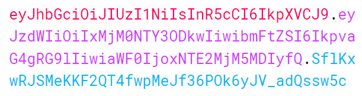
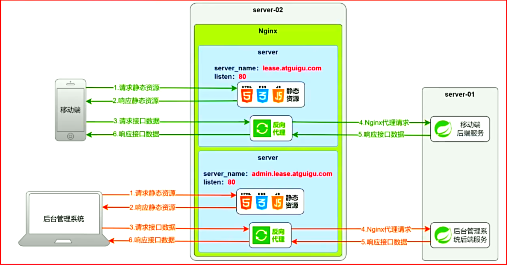

# 一、项目介绍

1. 尚庭公寓是一个公寓租赁平台项目，包含**移动端**和**后台管理系统**，其中移动端面向广大用户，提供找房、看房预约、租约管理等功能，后台管理系统面向管理员，提供公寓（房源）管理、租赁管理、用户管理等功能
2. 移动端功能：
   - **房源检索**：用户可以使用这个功能来搜索和检索符合其需求的房源。他们可以根据不同的条件，如地理位置、租金范围、支付方式等，快速找到适合的房源。
   - **看房预约管理**：用户可以通过这个功能预约看房。他们可以选择合适的时间，预约在特定的公寓进行实地看房，以便更好地了解房源的情况和环境。

   - **租约管理**：这个功能允许用户查看和管理他们的租约信息。他们可以在移动端查看租约合同，以及提交租约终止或延长的请求。

   - **房源浏览历史**：用户可以在这里查看他们曾经浏览过的房源历史记录。这个功能可以帮助用户追踪之前感兴趣的房源，方便他们重新查看或做出决策
3. PC端功能：
   - **公寓信息管理**：这个模块负责管理所有公寓的基本信息，包括公寓名称、地址、联系方式等。管理员可以在这里添加、编辑、删除公寓信息。
   - **房间信息管理**：该模块负责管理每个公寓内各个房间的详细信息，包括房间号、户型、面积、租金等。管理员可以在这里进行房间信息的添加、编辑和删除。
   - **公寓/房间属性管理**：这个模块允许管理员定义公寓和房间的各种属性，比如公寓和房间的配套设施，方便管理员在维护公寓信息和房间信息时进行选择。
   - **看房预约管理**：该模块用于管理用户的看房预约请求。用户可以在移动端提交看房预约，管理员可以在后台管理系统中查看和处理这些请求，以方便安排人员接待用户。
   - **租约管理**：这个模块用于管理租约的创建、修改和终止。管理员可以在这里生成租约合同，并发送给用户签约。
   - **后台系统用户管理**：该模块用于管理后台系统的用户账户信息，管理员可以创建、编辑、删除、禁用账户信息。
   - **移动端用户管理**：这个模块负责管理移动端用户的信息。管理员可以查看用户信息，处理账户相关问题

# 二、核心业务流程

1. 本项目的核心业务流程为签约、续约、退租，具体流程如下

   

2. 在上述的业务流程中，会涉及到租约状态的多次变化，下面详细介绍一下租约状态。租约共有7个状态，分别是签约待确认、已签约、已取消、已到期、退租待确认、已退租、续约待确认，以下是这些状态的变化流程

   

# 三、项目技术概述


1. **前端**
   - 框架：VUE3
2. **后端**

   - 框架：Spring Boot

   - 数据库访问：MyBatis、MyBatis Plus

   - Web：Spring MVC

3. **数据存储**
   - 关系型数据库：MySQL

   - 缓存：Redis

   - 对象存储：MinIO

     - 对象存储是用于存储非结构化数据的数据存储架构，它将一个数据单元称为一个对象，每个对象都包含数据本身、元数据（描述数据的信息）和一个唯一标识符（通常是一个URL地址）
     - MinIO是一个开源的对象存储方案，兼容亚马逊S3协议
     - 对于对象存储，我们可以选择直接购买各大云厂商提供的服务，也可以选择使用开源的服务，自行安装和维护。本项目采用开源的对象存储Minio来存储图片信息

4. **部署**

   - 前端服务器：Nginx

# 四、数据库设计

1. 概念模型设计：根据原型可得，本项目包含的实体有**公寓**、**房间**、**用户(租客)**、**租约(合同)**、**看房预约**、**浏览历史**和**后台管理系统用户**，各实体间的关系如下

   

2. 逻辑模型设计：根据原型明确各实体所需属性并明确各表关联字段，得到的完整的逻辑模型如下图所示

   

3. 物理模型设计：本项目采用MySQL数据库，所有表均使用InnoDB存储引擎，完整的物理模型如下图，详细信息可参考资料中的数据库初始化文件`lease.sql`

   

# 五、开发准备

## 一、准备Linux虚拟机

1. 准备两台Centos7虚拟机，分别为：`server01`和`server02`

2. 开发阶段只需要一台虚拟机即可，另外一台留到后序的项目部署阶段使用。实际操作时，可先按要求准备一台，然后直接克隆得到第二台服务器

3. 网络设置：虚拟机网络使用NAT模式，且使用静态IP

4. 主机名设置：为两台主机分别设置一个主机名，分别是`server01`和`server02`，设置主机名的命令`hostnamectl set-hostname <主机名> --static`

5. 配置好SSH远程登录

6. 与网络时间保持同步。安装时间同步工具`chrony`

   ```bash
   yum install chrony
   
   #执行以下命令启动chrony，并设置为开机自启
   systemctl start chronyd
   systemctl enable chronyd
   
   #查看时间源
   chronyc sources
   
   #配置新的时间源
   可修改`vim /etc/chrony.conf`以增加新的时间源
   ```

7. 关闭防火墙

   ```shell
   #关闭防火墙 
   systemctl stop firewalld
   
   #禁止防火墙开机自启
   systemctl disable firewalld
   ```

8. 关闭SElinux：SELinux，全称为Security-Enhanced Linux，是一种用于Linux操作系统的安全增强功能，为保证后序部署阶段的Nginx能够正常工作，此处关闭SELinux功能

   ```shell
   #打开配置文件
   vim /etc/selinux/config
   
   #修改如下内容
   SELINUX=disabled
   
   #重启操作系统
   reboot
   ```

## 二、准备MySQL

1. 在`server01`部署MySQL，具体步骤可[参考文档](https://dev.mysql.com/doc/mysql-installation-excerpt/8.0/en/linux-installation-yum-repo.html)

2. 安装MySQL yum库

   - 下载yum库。下载地址为https://dev.mysql.com/downloads/repo/yum/。需要根据操作系统选择相应版本，Centos7需选择`mysql80-community-release-el7-9.noarch.rpm`。执行以下命令可直接下载到服务器

     ```shell
     wget https://dev.mysql.com/get/mysql80-community-release-el7-9.noarch.rpm
     ```

   - 安装yum库。在上述 rpm 文件所在路径下执行如下命令

     ```shell
     rpm -ivh mysql80-community-release-el7-9.noarch.rpm
     ```

   - 配置国内镜像。修改`/etc/yum.repo.d/mysql-community.repo`文件中的`[mysql80-community]`中的`baseUrl`参数，修改内容如下：

     ```shell
     [mysql80-community]
     name=MySQL 8.0 Community Server
     baseurl=https://mirrors.tuna.tsinghua.edu.cn/mysql/yum/mysql-8.0-community-el7-$basearch/
     enabled=1
     gpgcheck=1
     gpgkey=file:///etc/pki/rpm-gpg/RPM-GPG-KEY-mysql-2022
            file:///etc/pki/rpm-gpg/RPM-GPG-KEY-mysql
     ```

3. 安装MySQL

   ```shell
   yum install -y mysql-community-server
   
   #这种方式更好
   yum install mysql-server --nogpgcheck
   ```

4. 启动MySQL

   ```shell
   #启动MySQL服务
   systemctl start mysqld
   
   #查看MySQL运行状态
   systemctl status mysqld
   ```

5. root相关配置

   - 查看root用户初始化密码。MySQL启动后会将root用户的初始密码写入日志，通过以下命令可以获取密码

     ```shell
     cat /var/log/mysqld.log | grep password
     ```

   - 使用初始密码登录

     ```shell
     mysql -uroot -p'password'
     ```

   - 修改root用户密码。MySQL默认安装了[validate_password](https://dev.mysql.com/doc/refman/8.0/en/validate-password.html) 插件，默认情况下，要求密码要包含大写字母、小写字母、数字和特殊符号，且密码长度最小为8。若需设置简单密码，可禁用该插件，或调整该插件的密码强度级别

     ```shell
     ALTER USER 'root'@'localhost' IDENTIFIED BY 'Sunsh.282127';
     ```

   - 授予root用户远程登录权限

     ```shell
     CREATE USER 'root'@'%' IDENTIFIED BY 'Sunsh.282127';
     GRANT ALL PRIVILEGES ON *.* TO 'root'@'%' WITH GRANT OPTION;
     FLUSH PRIVILEGES;
     ```


## 三、准备Redis

1. 在`server01`部署Redis服务，安装方式采用yum在线安装，安装版本为`redis-7.0.14`

2. 安装Redis yum仓库

   - 下载yum仓库。Redis所在的仓库为remi-release，下载地址为：http://rpms.famillecollet.com/enterprise/remi-release-7.rpm，可使用如下命令直接下载到服务器

     ```shell
     wget http://rpms.famillecollet.com/enterprise/remi-release-7.rpm
     ```

   - 安装yum仓库

     ```shell
     rpm -ivh remi-release-7.rpm --force --nodeps
     ```

3. 安装Redis。`--enablerepo`选项的作用为启用一个仓库

   ```shell
   yum --enablerepo=remi -y install redis-7.0.14
   ```

4. 配置Redis允许远程访问。Redis服务默认只允许本地访问，若需要进行远程访问，需要做出以下配置

   ```shell
   vim /etc/redis/redis.conf
   
   #修改如下参数
   #监听所有网络接口，默认只监听localhost
   bind 0.0.0.0
   
   #关闭保护模式，默认开启。开始保护模式后，远程访问必须进行认证后才能访问。
   protected-mode no
   ```

5. 启动Redis

   ```shell
   #启动Redis
   systemctl start redis
   
   #查看Redis的运行状态
   systemctl status redis
   
   #设置Redis开机自启
   systemctl enable redis
   ```

## 四、准备MinIO

1. 在`server01`部署MinIO，安装方式采用rpm离线安装，具体步骤可参考[官方文档](https://min.io/docs/minio/linux/operations/install-deploy-manage/deploy-minio-single-node-single-drive.html#minio-snsd)

2. 获取MinIO安装包。下载地址如下：https://dl.min.io/server/minio/release/linux-amd64/archive/minio-20230809233022.0.0.x86_64.rpm，通过以下命令可直接将安装包下载至服务器

   ```shell
   wget https://dl.min.io/server/minio/release/linux-amd64/archive/minio-20230809233022.0.0.x86_64.rpm
   ```

3. 安装MinIO

   ```shell
   rpm -ivh minio-20230809233022.0.0.x86_64.rpm
   ```

4. 集成Systemd

   - Systemd概述：Systemd是一个广泛应用于Linux系统的系统初始化和服务管理器，其可以管理系统中的各种服务和进程，包括启动、停止和重启服务，除此之外，其还可以监测各服务的运行状态，并在服务异常退出时，自动拉起服务，以保证服务的稳定性。系统自带的防火墙服务`firewalld`，我们自己安装的`mysqld`和`redis`均是由`Systemd`进行管理的，此处将MinIO服务也交给Systemd管理

   - 编写MinIO服务配置文件。Systemd所管理的服务需要由一个配置文件进行描述，这些配置文件均位于`/etc/systemd/system/`或者`/usr/lib/systemd/system/`目录下，下面创建MinIO服务的配置文件。执行以下命令创建并打开`minio.service`文件

     ```shell
     vim /etc/systemd/system/minio.service
     ```

   - 内容如下，具体可参考[MinIO官方文档](https://min.io/docs/minio/linux/operations/install-deploy-manage/deploy-minio-single-node-single-drive.html#create-the-systemd-service-file)

     ```shell
     [Unit]
     Description=MinIO
     Documentation=https://min.io/docs/minio/linux/index.html
     Wants=network-online.target
     After=network-online.target
     AssertFileIsExecutable=/usr/local/bin/minio
     
     [Service]
     WorkingDirectory=/usr/local
     ProtectProc=invisible
     EnvironmentFile=-/etc/default/minio
     ExecStartPre=/bin/bash -c "if [ -z \"${MINIO_VOLUMES}\" ]; then echo \"Variable MINIO_VOLUMES not set in /etc/default/minio\"; exit 1; fi"
     ExecStart=/usr/local/bin/minio server $MINIO_OPTS $MINIO_VOLUMES
     Restart=always
     LimitNOFILE=65536
     TasksMax=infinity
     TimeoutStopSec=infinity
     SendSIGKILL=no
     
     [Install]
     WantedBy=multi-user.target
     ```

   - 文档核心

     - `EnvironmentFile`，该文件中可配置MinIO服务所需的各项参数
     - `ExecStart`，该参数用于配置MinIO服务的启动命令，其中`$MINIO_OPTS`、`$MINIO_VOLUMES`，均引用于`EnvironmentFile`中的变量。
       - `MINIO_OPTS`用于配置MinIO服务的启动选项，可省略不配置。
       - `MINIO_VOLUMES`用于配置MinIO服务的数据存储路径。
     - `Restart`，表示自动重启

   - 编写`EnvironmentFile`文件

     ```shell
     vim /etc/default/minio
     ```

   - 内容如下，具体可参考[官方文档](https://min.io/docs/minio/linux/operations/install-deploy-manage/deploy-minio-single-node-single-drive.html#create-the-environment-variable-file)

     ```shell
     # MINIO_ROOT_USER and MINIO_ROOT_PASSWORD sets the root account for the MinIO server.
     # This user has unrestricted permissions to perform S3 and administrative API operations on any resource in the deployment.
     # Omit to use the default values 'minioadmin:minioadmin'.
     # MinIO recommends setting non-default values as a best practice, regardless of environment
     
     MINIO_ROOT_USER=minioadmin
     MINIO_ROOT_PASSWORD=minioadmin
     
     # MINIO_VOLUMES sets the storage volume or path to use for the MinIO server.
     
     MINIO_VOLUMES="/mnt/data"
     
     # MINIO_OPTS sets any additional commandline options to pass to the MinIO server.
     # For example, `--console-address :9001` sets the MinIO Console listen port
     MINIO_OPTS="--console-address :9001"
     ```

     - `MINIO_ROOT_USER`和`MINIO_ROOT_PASSWORD`为用于访问MinIO的用户名和密码，**密码长度至少8位**
     - `MINIO_VOLUMES`用于指定数据存储路径，需确保指定的路径是存在的，可执行命令创建该路径`mkdir /data`
     - `MINIO_OPTS`中的`console-address`，用于指定管理页面的地址

5. 启动MinIO

   ```shell
   #启动MinIO
   sudo systemctl start minio.service
   
   #查询运行状态
   sudo systemctl status minio.service
   journalctl -f -u minio.service
   
   #设置MinIO开机自启
   systemctl enable minio
   ```

6. 访问MinIO管理页面

   - 管理页面的访问地址为：`http://192.168.10.101:9001`
   - `9000`为MinIO的API的默认端口，前边配置的`9001`以为管理页面端口
   - `ip`需要根据实际情况做出修改

7. 如果访问不到页面和上传的资源，可能是防火墙导致的

   ```shell
   firewall-cmd --zone=public --add-port=9000/tcp --permanent
   
   firewall-cmd --zone=public --add-port=9001/tcp --permanent
   ```

# 六、项目开发

## 一、数据库创建

1. 创建数据库

   ```sql
   CREATE DATABASE lease CHARACTER SET utf8mb4 COLLATE utf8mb4_general_ci;
   ```

2. 创建表以及初始化数据

   [表结构sql](https://gitee.com/SunAng282127/lease/blob/master/sql/lease.sql)

## 二、创建工程

```tex
lease
├── common（公共模块——工具类、公用配置等）
│   ├── pom.xml
│   └── src
├── model（数据模型——与数据库相对应地实体类）
│   ├── pom.xml
│   └── src
├── web（Web模块）
│   ├── pom.xml
│   ├── web-admin（后台管理系统Web模块——包含mapper、service、controller）
│   │   ├── pom.xml
│   │   └── src
│   └── web-app（移动端Web模块——包含mapper、service、controller）
│       ├── pom.xml
│       └── src
└── pom.xml
```

[工程GIT地址](https://gitee.com/SunAng282127/lease.git)

## 三、登录认证

### 一、登录认证方案概述

1. 有两种常见的认证方案，分别是基于**Session**的认证和基于**Token**的认证

2. 基于Session的认证流程如下图所示

   

   - 登录用户信息保存在服务端内存中，若访问量增加，单台节点压力会较大
   - 随用户规模增大，若后台升级为集群，则需要解决集群中各服务器登录状态共享的问题

3. 基于Token的认证流程如下图所示

   

   - 登录状态保存在客户端，服务器没有存储开销
   - 客户端发起的每个请求自身均携带登录状态，所以即使后台为集群，也不会面临登录状态共享的问题

### 二、Token详解

1. 我们所说的Token，通常指JWT（JSON Web TOKEN）。JWT是一种轻量级的安全传输方式，用于在两个实体之间传递信息，通常用于身份验证和信息传递

2. JWT是一个字符串，如下图所示，该字符串由三部分组成，三部分由`.`分隔。三个部分分别被称为

   - `header`（头部）
   - `payload`（负载）
   - `signature`（签名）

   

3. Header（头部）：Header部分是由一个JSON对象经过`base64url`编码得到的，这个JSON对象用于保存 JWT 的类型（`typ`）、签名算法（`alg`）等元信息，例如

   ```json
   {
     "alg": "HS256",
     "typ": "JWT"
   }
   ```

4. Payload（负载）：也称为 Claims（声明），也是由一个JSON对象经过`base64url`编码得到的，用于保存要传递的具体信息。JWT规范定义了7个官方字段，如下：

   - iss (issuer)：签发人

   - exp (expiration time)：过期时间

   - sub (subject)：主题

   - aud (audience)：受众

   - nbf (Not Before)：生效时间

   - iat (Issued At)：签发时间

   - jti (JWT ID)：编号

   - 除此之外，我们还可以自定义任何字段，例如

     ```json
     {
       "sub": "1234567890",
       "name": "John Doe",
       "iat": 1516239022
     }
     ```

5. Signature（签名）：由头部、负载和秘钥一起经过（header中指定的签名算法）计算得到的一个字符串，用于防止消息被篡改

### 三、PC端登录流程


- 根据上述登录流程，可分析出，登录管理共需三个接口，分别是**获取图形验证码**、**登录**、**获取登录用户个人信息**，除此之外，我们还需为所有受保护的接口增加验证JWT合法性的逻辑，这一功能可通过`HandlerInterceptor`来实现

### 四、移动端登录流程


## 四、Nginx部署



# 七、Redis的作用

1. 后台登录时，存储验证码的值
2. 移动端登录时，存储手机短信验证码的值
3. 复杂查询或者查询长时间内数据不会变动的数据，存储查询结果。在修改时删除缓存，在查询时存进缓存