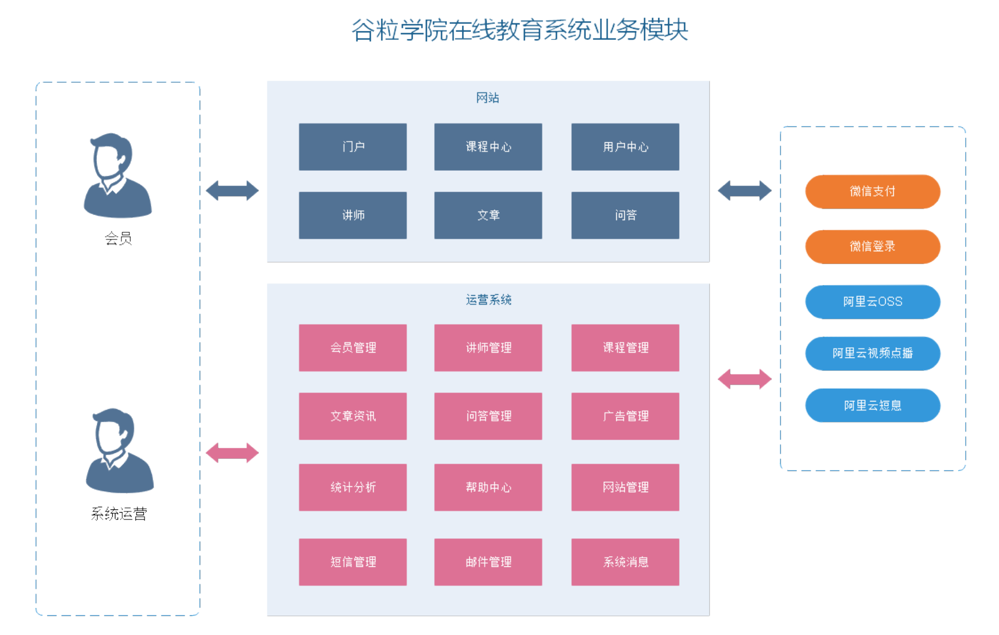
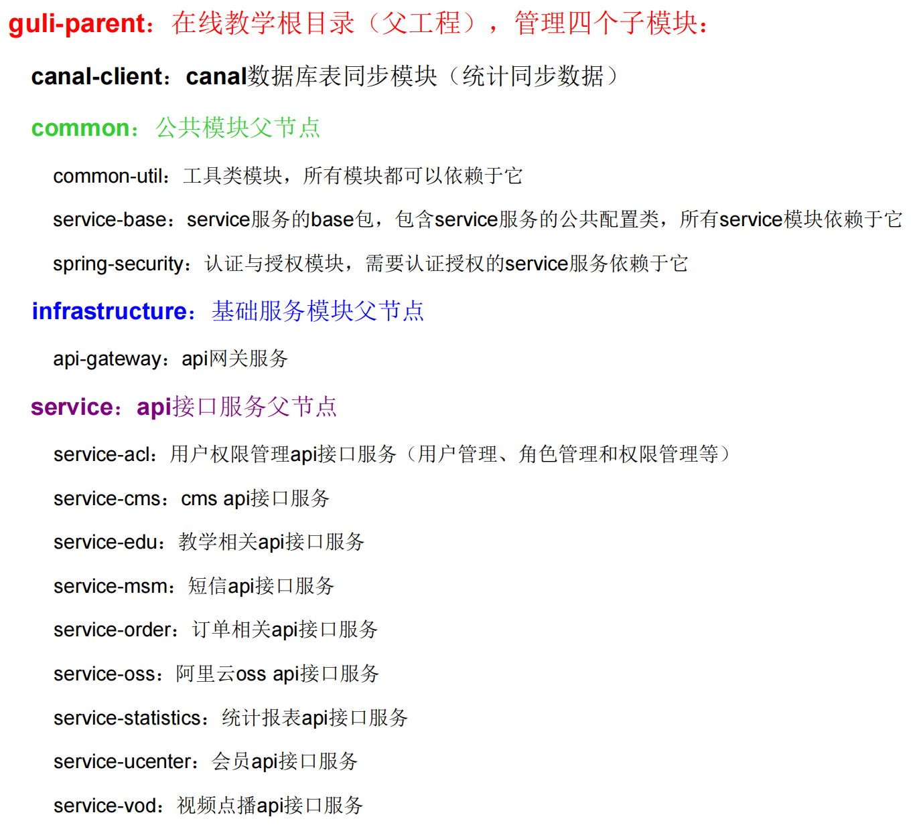

# 一、功能简介

- 谷粒学院，是一个B2C模式的职业技能在线教育系统，分为前台用户系统和后台运营平台

# 二、系统模块

# 三、系统架构

1. 网络层：Nginx、LVS、F5、CDN、多机房、多中心
2. 业务层：阿里云视频点播、微信支付、EasyExcel、阿里短信、阿里云OSS
3. 用户层：SSO、JWT、OAuth2.0、微信登录、SpringSecurity
4. 服务层：
   - 配置中心：Nacos、Git
   - 服务中心：Nacos、Feign、GateWay、Hystrix、SpringCloud Bus、SpringCloud Sleuth
   - 消息队列：RabbitMQ
5. 开发层：
   - 开发框架：SpringBoot、SpringCloud、Mybatis-Plus、SpringMVC、Swagger
   - 服务器：Tomcat、Nginx
   - 容器：Docker
6. 存储层：MySQL、Redis、阿里云OSS、系统日志、HikariCP

# 四、工程架构

